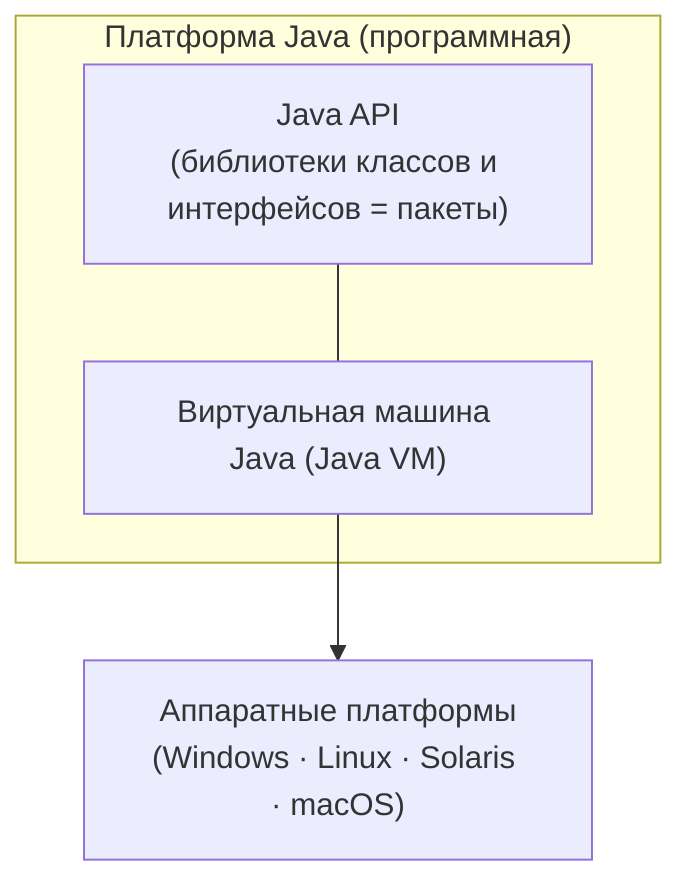

# Урок 1. Феномен технологии Java

**Трейл:** Getting Started · **Оригинал:** [The Java Technology Phenomenon](https://docs.oracle.com/javase/tutorial/getStarted/intro/index.html)
**Связанные области:** [[01-core-java-syntax-oop]] · [[02-jvm-memory-gc]] · **Вопросы:** core-java

> Перевод официального руководства Oracle (The Java Tutorials, JDK 8). Объединяет страницы
> *The Java Technology Phenomenon*, *About the Java Technology*, *What Can Java Technology Do?*
> и *How Will Java Technology Change My Life?*.

О технологии Java говорят повсюду, но что же это такое на самом деле? Разделы ниже объясняют,
почему Java — это одновременно **язык программирования** и **платформа**, и дают обзор того,
что эта технология может для вас сделать.

## О технологии Java

Технология Java — это и язык программирования, и платформа.

### Язык программирования Java

Java — высокоуровневый язык, который можно охарактеризовать набором ключевых слов:

- простой (*simple*);
- объектно-ориентированный (*object oriented*);
- распределённый (*distributed*);
- многопоточный (*multithreaded*);
- динамический (*dynamic*);
- архитектурно-нейтральный (*architecture neutral*);
- переносимый (*portable*);
- высокопроизводительный (*high performance*);
- надёжный (*robust*);
- безопасный (*secure*).

Каждое из этих слов подробно разъяснено в техническом документе *The Java Language Environment*
за авторством Джеймса Гослинга и Генри Макгилтона.

В языке Java весь исходный код сначала пишется в обычных текстовых файлах с расширением `.java`.
Затем эти файлы компилируются в файлы `.class` компилятором `javac`. Файл `.class` содержит не
машинный код вашего процессора, а **байт-код** (*bytecode*) — машинный язык виртуальной машины
Java (Java VM). Инструмент-загрузчик `java` запускает приложение в экземпляре виртуальной машины Java.

Так выглядит путь от исходного кода до выполнения:

<!-- original: assets/01-getting-started/compiler-overview.gif | Обзор процесса разработки: исходный код → компилятор javac → байт-код .class → виртуальная машина Java → выполнение программы -->

Поскольку Java VM доступна на множестве операционных систем, одни и те же файлы `.class`
способны выполняться в Microsoft Windows, Solaris OS, Linux или macOS. Некоторые виртуальные
машины — например, Java SE HotSpot — выполняют во время работы дополнительные шаги, повышающие
производительность: ищут «узкие места» и перекомпилируют часто используемые участки кода в
нативный машинный код.

### Платформа Java

**Платформа** — это аппаратное или программное окружение, в котором работает программа. Мы уже
упоминали популярные платформы: Microsoft Windows, Linux, Solaris OS, macOS. Большинство платформ
можно описать как сочетание операционной системы и аппаратного обеспечения. Платформа Java
отличается тем, что это **исключительно программная** платформа, работающая поверх других,
аппаратных платформ.

У платформы Java два компонента:

- **виртуальная машина Java** (Java Virtual Machine);
- **прикладной программный интерфейс Java** (Java API).

<!-- original: assets/01-getting-started/java-platform-layers.gif | API и виртуальная машина Java изолируют программу от аппаратной платформы -->

Виртуальная машина Java — основа платформы, она портирована на различные аппаратные платформы.

**API** — это большая коллекция готовых программных компонентов, дающих множество полезных
возможностей. Он сгруппирован в библиотеки связанных классов и интерфейсов; такие библиотеки
называются **пакетами** (*packages*).

Будучи платформенно-независимым окружением, платформа Java может работать чуть медленнее
нативного кода. Однако развитие технологий компиляции и виртуальных машин приближает
производительность к нативной, не жертвуя переносимостью.

## Что умеет технология Java?

Универсальный высокоуровневый язык Java — это мощная программная платформа. Каждая полная
реализация платформы Java даёт следующие возможности:

- **Инструменты разработки.** Всё необходимое для компиляции, запуска, мониторинга, отладки и
  документирования приложений. Начинающему разработчику в первую очередь пригодятся компилятор
  `javac`, загрузчик `java` и инструмент документирования `javadoc`.
- **Прикладной программный интерфейс (API).** Предоставляет базовую функциональность языка Java:
  множество готовых к использованию классов — от базовых объектов до сетей, безопасности,
  генерации XML и доступа к базам данных. Базовый API очень велик.
- **Технологии развёртывания.** JDK содержит стандартные механизмы (например, Java Web Start и
  Java Plug-In) для доставки приложений конечным пользователям.
- **Наборы инструментов для пользовательского интерфейса.** JavaFX, Swing и Java 2D позволяют
  создавать сложные графические интерфейсы (GUI).
- **Интеграционные библиотеки.** Java IDL, JDBC, JNDI (Java Naming and Directory Interface),
  Java RMI и Java RMI-IIOP обеспечивают доступ к базам данных и работу с удалёнными объектами.

## Как технология Java изменит мою жизнь?

Мы не обещаем вам ни славы, ни богатства, ни даже работы за изучение Java. И всё же она, скорее
всего, сделает ваши программы лучше и потребует меньше усилий, чем другие языки. Технология Java
поможет вам:

- **Быстро начать.** Java — мощный объектно-ориентированный язык, но при этом простой в изучении,
  особенно для тех, кто уже знаком с C или C++.
- **Писать меньше кода.** Сравнение метрик программ (число классов, методов и т. д.) показывает,
  что программа на Java может быть вчетверо меньше аналогичной программы на C++.
- **Писать код лучше.** Java поощряет хорошие практики, а автоматическая сборка мусора помогает
  избегать утечек памяти. Объектная ориентация, компонентная архитектура JavaBeans и обширный,
  легко расширяемый API позволяют повторно использовать проверенный код и допускать меньше ошибок.
- **Разрабатывать быстрее.** Java проще C++, поэтому время разработки может быть вдвое короче.
- **Избегать платформенных зависимостей.** Программа остаётся переносимой, если не использовать
  библиотеки, написанные на других языках.
- **«Написано однажды — работает везде» (*write once, run anywhere*).** Приложения на Java
  компилируются в машинно-независимый байт-код и работают одинаково на любой платформе Java.
- **Проще распространять ПО.** С Java Web Start пользователи запускают приложение одним щелчком,
  а автоматическая проверка версии при старте поддерживает актуальность установленной версии.

## Источник

- [The Java Technology Phenomenon](https://docs.oracle.com/javase/tutorial/getStarted/intro/index.html) — официальное руководство Oracle.
- [About the Java Technology](https://docs.oracle.com/javase/tutorial/getStarted/intro/definition.html)
- [What Can Java Technology Do?](https://docs.oracle.com/javase/tutorial/getStarted/intro/cando.html)
- [How Will Java Technology Change My Life?](https://docs.oracle.com/javase/tutorial/getStarted/intro/changemylife.html)
