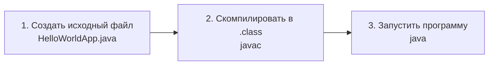

# Урок 2. Приложение «Hello World!»

**Трейл:** Getting Started · **Оригинал:** [The "Hello World!" Application](https://docs.oracle.com/javase/tutorial/getStarted/cupojava/index.html)
**Связанные области:** [[01-core-java-syntax-oop]] · [[18-build-tools]] · **Вопросы:** core-java

> Перевод официального руководства Oracle (The Java Tutorials, JDK 8). Объединяет вводную
> страницу урока и платформенные инструкции для командной строки (Windows и UNIX/Linux/macOS).

Разделы ниже дают подробные инструкции по компиляции и запуску простого приложения «Hello World!».

Первый путь — через **NetBeans IDE**, интегрированную среду разработки, которая сильно упрощает
процесс. NetBeans работает на платформе Java, то есть на любой ОС, для которой есть JDK
(Windows, Solaris OS, Linux, macOS). Oracle рекомендует использовать IDE вместо командной строки,
когда это возможно.

Остальные разделы дают платформенно-зависимые инструкции **без IDE**, через командную строку.
Если возникнут трудности — загляните в [урок 4 «Типичные проблемы»](04-common-problems.md): там
собраны решения частых затруднений новичков.

Что вам понадобится в любом случае:

1. **Java SE Development Kit (JDK).** Скачивайте именно **JDK**, а не JRE.
2. **Текстовый редактор.** Подойдёт любой (Notepad в Windows, `vi`, `nano`/`pico`, `emacs` в UNIX).

Создание приложения всегда состоит из трёх шагов:



- **Создать исходный файл** — текстовый файл с кодом на языке Java.
- **Скомпилировать в файл `.class`** — компилятор `javac` переводит текст в инструкции, понятные
  виртуальной машине Java; эти инструкции называются **байт-кодом**.
- **Запустить программу** — загрузчик `java` использует виртуальную машину Java для выполнения.

## Исходный код приложения

Создайте текстовый файл с именем `HelloWorldApp.java` и следующим содержимым:

```java
/**
 * Класс HelloWorldApp реализует приложение, которое
 * просто выводит "Hello World!" в стандартный вывод.
 */
class HelloWorldApp {
    public static void main(String[] args) {
        System.out.println("Hello World!"); // Вывести строку.
    }
}
```

> **Будьте внимательны при наборе.** Вводите весь код, команды и имена файлов точно как показано.
> И компилятор (`javac`), и загрузчик (`java`) **различают регистр**, поэтому соблюдайте
> заглавные буквы: `HelloWorldApp` — это **не** то же самое, что `helloworldapp`.

## Командная строка: Microsoft Windows

1. **Создайте исходный файл.** Откройте редактор (например, Блокнот: **Пуск → Программы →
   Стандартные → Блокнот**), введите код выше и сохраните как `HelloWorldApp.java`. В Блокноте при
   сохранении выберите тип «Текстовые документы (*.txt)», в поле «Имя файла» введите
   `"HelloWorldApp.java"` (в кавычках, чтобы Блокнот не добавил `.txt`), кодировку оставьте ANSI.
   В примере файл сохраняется в каталог `C:\myapplication`.

2. **Скомпилируйте исходный файл в `.class`.** Откройте окно командной строки (**Пуск → Выполнить
   → `cmd`**). Перейдите в каталог с файлом и запустите компилятор:

   ```
   cd C:\myapplication
   javac HelloWorldApp.java
   ```

   Компилятор создаст файл байт-кода `HelloWorldApp.class`. Команда `dir` покажет оба файла —
   `HelloWorldApp.java` и `HelloWorldApp.class`.

   > Чтобы перейти на другой диск, сначала введите его имя, например `D:`, а затем `cd`.

3. **Запустите программу.** В том же каталоге выполните:

   ```
   java -cp . HelloWorldApp
   ```

   На экране появится:

   ```
   Hello World!
   ```

   Поздравляем — ваша программа работает!

## Командная строка: Solaris OS, Linux, macOS

1. **Создайте исходный файл.** Откройте терминал. Файлы исходного кода удобно держать в отдельном
   каталоге, создайте его командой `mkdir`. Например:

   ```
   cd /tmp
   mkdir examples
   cd examples
   mkdir java
   cd /tmp/examples/java
   ```

   Откройте редактор (`pico`, `nano`, `vi` или `emacs`), введите код приложения и сохраните файл
   как `HelloWorldApp.java` в этом каталоге.

2. **Скомпилируйте исходный файл в `.class`.** Перейдите в каталог с файлом и запустите компилятор:

   ```
   cd /tmp/examples/java
   javac HelloWorldApp.java
   ```

   Команда `ls` покажет появившийся файл `HelloWorldApp.class`.

3. **Запустите программу.** В том же каталоге выполните:

   ```
   java HelloWorldApp
   ```

   На экран будет выведено `Hello World!`. Поздравляем — ваша программа работает!

> Если на каком-либо шаге возникнут проблемы, обратитесь к
> [уроку 4 «Типичные проблемы (и их решения)»](04-common-problems.md).

## Источник

- [The "Hello World!" Application](https://docs.oracle.com/javase/tutorial/getStarted/cupojava/index.html) — официальное руководство Oracle.
- ["Hello World!" for Microsoft Windows](https://docs.oracle.com/javase/tutorial/getStarted/cupojava/win32.html)
- ["Hello World!" for Solaris OS, Linux, and Mac OS X](https://docs.oracle.com/javase/tutorial/getStarted/cupojava/unix.html)
