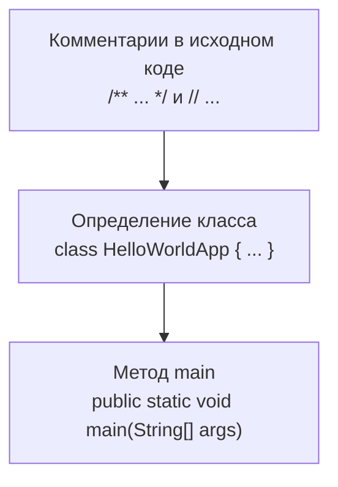

# Урок 3. Подробный разбор приложения «Hello World!»

**Трейл:** Getting Started · **Оригинал:** [A Closer Look at the "Hello World!" Application](https://docs.oracle.com/javase/tutorial/getStarted/application/index.html)
**Связанные области:** [[01-core-java-syntax-oop]] · **Вопросы:** core-java

> Перевод официального руководства Oracle (The Java Tutorials, JDK 8).

Теперь, когда вы увидели приложение «Hello World!» (а возможно, уже скомпилировали и запустили его),
вам, наверное, интересно, как оно устроено. Вот его код ещё раз:

```java
class HelloWorldApp {
    public static void main(String[] args) {
        System.out.println("Hello World!"); // Вывести строку.
    }
}
```

Приложение «Hello World!» состоит из трёх основных частей: **комментариев в исходном коде**,
**определения класса `HelloWorldApp`** и **метода `main`**. Объяснение ниже даст базовое
понимание кода; более глубокий смысл прояснится по мере прочтения остального руководства.



## Комментарии в исходном коде

Комментарии игнорируются компилятором, но полезны другим программистам. В выделенном фрагменте
ниже жирным обозначены комментарии:

```java
/**
 * Класс HelloWorldApp реализует приложение, которое
 * просто выводит "Hello World!" в стандартный вывод.
 */
class HelloWorldApp {
    public static void main(String[] args) {
        System.out.println("Hello World!"); // Вывести строку.
    }
}
```

Язык Java поддерживает три вида комментариев:

- `/* текст */` — компилятор игнорирует всё от `/*` до `*/`.
- `/** документация */` — **документирующий комментарий** (*doc comment*). Компилятор игнорирует
  его так же, как обычный, но инструмент `javadoc` использует такие комментарии при
  автоматической генерации документации.
- `// текст` — компилятор игнорирует всё от `//` до конца строки.

## Определение класса `HelloWorldApp`

Самая базовая форма определения класса выглядит так:

```java
class имя {
    . . .
}
```

Ключевое слово `class` начинает определение класса с именем `имя`, а код каждого класса
располагается между открывающей и закрывающей фигурными скобками. Пока достаточно знать, что
**любое приложение начинается с определения класса**.

## Метод `main`

В языке Java каждое приложение должно содержать метод `main` со следующей сигнатурой:

```java
public static void main(String[] args)
```

Модификаторы `public` и `static` можно писать в любом порядке (`public static` или
`static public`), но по соглашению используют `public static`. Аргумент можно назвать как угодно,
но большинство программистов выбирают `args` или `argv`.

Метод `main` похож на функцию `main` в C и C++: это **точка входа** в приложение, из которой затем
вызываются все остальные методы программы.

Метод `main` принимает единственный аргумент — **массив элементов типа `String`**:

```java
public static void main(String[] args)
```

Через этот массив система выполнения передаёт информацию вашему приложению. Например:

```
java MyApp arg1 arg2
```

Каждая строка в массиве называется **аргументом командной строки** (*command-line argument*).
Аргументы командной строки позволяют пользователю влиять на работу приложения без перекомпиляции.
Например, программа сортировки может принимать аргумент для сортировки по убыванию:

```
-descending
```

Приложение «Hello World!» игнорирует свои аргументы командной строки, но важно знать, что такие
аргументы существуют.

Наконец, строка:

```java
System.out.println("Hello World!");
```

использует класс `System` из базовой библиотеки, чтобы вывести сообщение «Hello World!» в
стандартный вывод. Части этой библиотеки (также называемой **API**) рассматриваются на протяжении
всего руководства.

## Источник

- [A Closer Look at the "Hello World!" Application](https://docs.oracle.com/javase/tutorial/getStarted/application/index.html) — официальное руководство Oracle.
