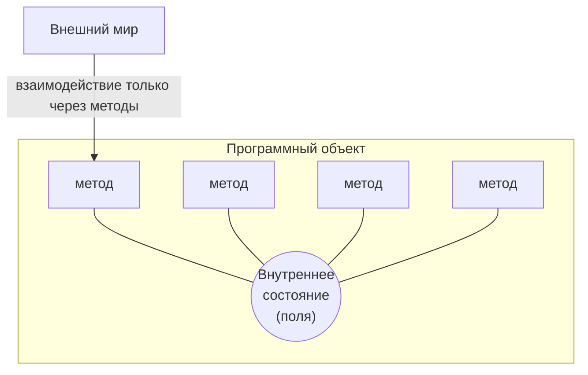
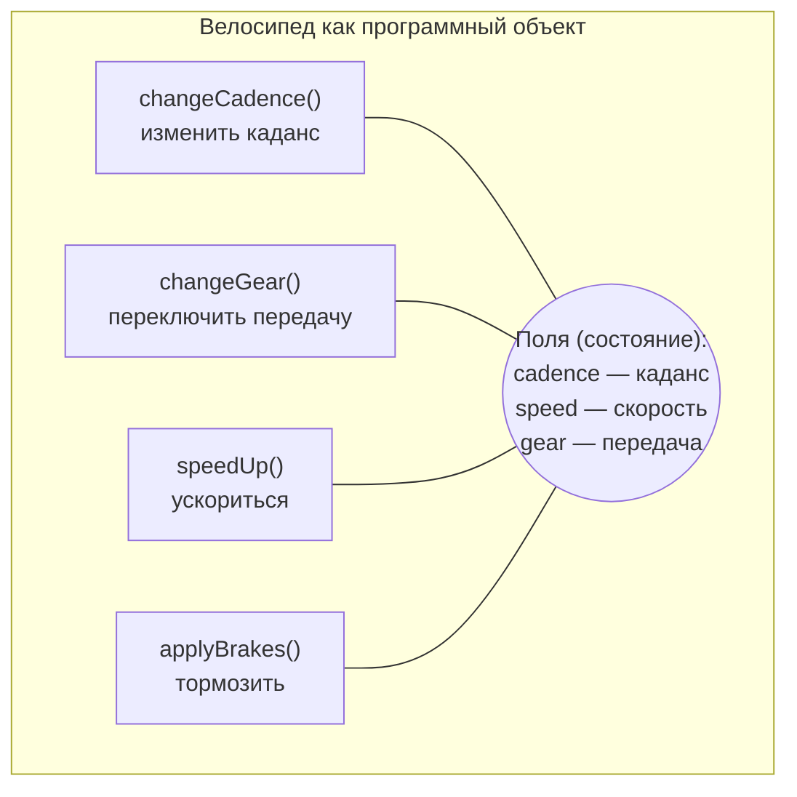
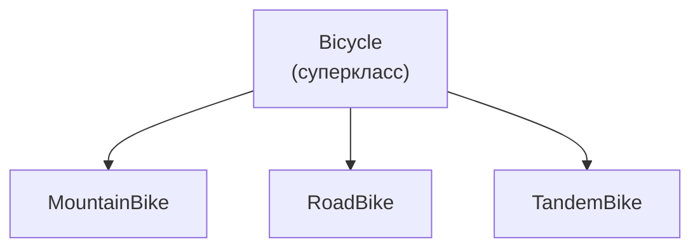

# Урок 1. Концепции объектно-ориентированного программирования

**Трейл:** Learning the Java Language · **Оригинал:** [Object-Oriented Programming Concepts](https://docs.oracle.com/javase/tutorial/java/concepts/index.html)
**Связанные области:** [[01-core-java-syntax-oop]] · **Вопросы:** core-java

> Перевод официального руководства Oracle (The Java Tutorials, JDK 8). Урок объединяет
> страницы *What Is an Object?*, *What Is a Class?*, *What Is Inheritance?*, *What Is an
> Interface?*, *What Is a Package?* и *Questions and Exercises*.

Если вы никогда раньше не работали с объектно-ориентированным языком программирования, вам нужно
освоить несколько базовых понятий, прежде чем приступать к написанию кода. Этот урок познакомит
вас с объектами, классами, наследованием, интерфейсами и пакетами. Каждое обсуждение
сосредоточено на том, как эти понятия соотносятся с реальным миром, и одновременно знакомит вас
с синтаксисом языка программирования Java.

## Что такое объект? (What Is an Object?)

Объекты (*objects*) — ключ к пониманию объектно-ориентированной технологии. Оглянитесь вокруг
прямо сейчас, и вы найдёте множество примеров объектов реального мира: ваша собака, ваш
письменный стол, ваш телевизор, ваш велосипед.

Объекты реального мира обладают двумя характеристиками: у них есть **состояние** (*state*) и
**поведение** (*behavior*). У собак есть состояние (кличка, окрас, порода, чувство голода) и
поведение (лаять, приносить предметы, вилять хвостом). У велосипедов тоже есть состояние
(текущая передача, текущий каданс педалирования, текущая скорость) и поведение (переключать
передачу, изменять каданс педалирования, тормозить). Определение состояния и поведения для
объектов реального мира — отличный способ начать мыслить категориями объектно-ориентированного
программирования.

Уделите минуту прямо сейчас наблюдению за объектами реального мира, которые находятся рядом с
вами. Для каждого увиденного объекта задайте себе два вопроса: «В каких возможных состояниях
может находиться этот объект?» и «Какое возможное поведение этот объект может выполнять?».
Обязательно записывайте свои наблюдения. По мере этого вы заметите, что объекты реального мира
различаются по сложности: ваша настольная лампа может иметь всего два возможных состояния
(включена и выключена) и два возможных поведения (включить, выключить), а ваш настольный
радиоприёмник может иметь дополнительные состояния (включён, выключен, текущая громкость, текущая
станция) и поведение (включить, выключить, увеличить громкость, уменьшить громкость, поиск,
сканирование и настройка). Вы также можете заметить, что некоторые объекты, в свою очередь,
содержат другие объекты. Все эти наблюдения из реального мира переносятся в мир
объектно-ориентированного программирования.

<!-- original: assets/02-learning-the-language/oop-object.gif | Программный объект: состояние скрыто внутри, методы окружают его (Oracle) -->


*Рисунок: программный объект. Внутреннее состояние объекта скрыто в центре и окружено методами,
которые обеспечивают доступ к нему извне.*

Программные объекты концептуально похожи на объекты реального мира: они тоже состоят из состояния
и связанного с ним поведения. Объект хранит своё состояние в **полях** (*fields*; в некоторых
языках программирования — переменные) и предоставляет своё поведение через **методы** (*methods*;
в некоторых языках программирования — функции). Методы оперируют внутренним состоянием объекта и
служат основным механизмом взаимодействия объектов между собой. Сокрытие внутреннего состояния и
требование, чтобы любое взаимодействие выполнялось через методы объекта, называется
**инкапсуляцией данных** (*data encapsulation*) — фундаментальным принципом
объектно-ориентированного программирования.

Рассмотрим, например, велосипед:

<!-- original: assets/02-learning-the-language/oop-bicycle-object.gif | Велосипед как программный объект с полями и методами (Oracle) -->


*Рисунок: велосипед, смоделированный как программный объект, с методами велосипеда и
переменными экземпляра.*

Приписывая состояние (текущая скорость, текущий каданс педалирования и текущая передача) и
предоставляя методы для изменения этого состояния, объект сохраняет контроль над тем, каким
образом внешний мир может его использовать. Например, если у велосипеда всего 6 передач, то метод
переключения передач может отклонять любое значение, которое меньше 1 или больше 6.

Объединение кода в отдельные программные объекты даёт ряд преимуществ, в том числе:

1. **Модульность** (*Modularity*): исходный код объекта может быть написан и сопровождаться
   независимо от исходного кода других объектов. После создания объект можно легко передавать
   внутри системы.
2. **Сокрытие информации** (*Information-hiding*): взаимодействуя только с методами объекта, вы
   оставляете детали его внутренней реализации скрытыми от внешнего мира.
3. **Повторное использование кода** (*Code re-use*): если объект уже существует (возможно,
   написанный другим разработчиком), вы можете использовать этот объект в своей программе. Это
   позволяет специалистам реализовывать/тестировать/отлаживать сложные, узкоспециализированные
   объекты, которым вы затем можете доверить выполнение в своём собственном коде.
4. **Подключаемость и удобство отладки** (*Pluggability and debugging ease*): если конкретный
   объект оказывается проблемным, вы можете просто удалить его из приложения и подключить вместо
   него другой объект. Это аналогично устранению механических неисправностей в реальном мире.
   Если ломается болт, вы заменяете *его*, а не всю машину целиком.

## Что такое класс? (What Is a Class?)

В реальном мире вы часто встречаете множество отдельных объектов одного и того же вида. Может
существовать тысячи других велосипедов одной и той же марки и модели. Каждый велосипед был собран
по одному и тому же набору чертежей и поэтому содержит одни и те же компоненты. В терминах
объектной ориентации мы говорим, что ваш велосипед — это **экземпляр** (*instance*) **класса
объектов** (*class of objects*), называемого велосипедами. **Класс** (*class*) — это чертёж, по
которому создаются отдельные объекты.

Следующий класс `Bicycle` — одна из возможных реализаций велосипеда:

```java
class Bicycle {

    int cadence = 0;
    int speed = 0;
    int gear = 1;

    void changeCadence(int newValue) {
         cadence = newValue;
    }

    void changeGear(int newValue) {
         gear = newValue;
    }

    void speedUp(int increment) {
         speed = speed + increment;   
    }

    void applyBrakes(int decrement) {
         speed = speed - decrement;
    }

    void printStates() {
         System.out.println("cadence:" +
             cadence + " speed:" + 
             speed + " gear:" + gear);
    }
}
```

Синтаксис языка программирования Java покажется вам новым, но проект (дизайн) этого класса основан
на предыдущем обсуждении объектов-велосипедов. Поля `cadence`, `speed` и `gear` представляют
состояние объекта, а методы (`changeCadence`, `changeGear`, `speedUp` и т. д.) определяют его
взаимодействие с внешним миром.

Возможно, вы заметили, что класс `Bicycle` не содержит метода `main`. Это потому, что он не
является законченным приложением; это всего лишь чертёж для велосипедов, которые могут
*использоваться* в приложении. Ответственность за создание и использование новых объектов
`Bicycle` лежит на каком-то другом классе вашего приложения.

Вот класс `BicycleDemo`, который создаёт два отдельных объекта `Bicycle` и вызывает их методы:

```java
class BicycleDemo {
    public static void main(String[] args) {

        // Создаём два разных
        // объекта Bicycle
        Bicycle bike1 = new Bicycle();
        Bicycle bike2 = new Bicycle();

        // Вызываем методы
        // на этих объектах
        bike1.changeCadence(50);
        bike1.speedUp(10);
        bike1.changeGear(2);
        bike1.printStates();

        bike2.changeCadence(50);
        bike2.speedUp(10);
        bike2.changeGear(2);
        bike2.changeCadence(40);
        bike2.speedUp(10);
        bike2.changeGear(3);
        bike2.printStates();
    }
}
```

Вывод этого теста печатает итоговые каданс педалирования, скорость и передачу для двух
велосипедов:

```
cadence:50 speed:10 gear:2
cadence:40 speed:20 gear:3
```

## Что такое наследование? (What Is Inheritance?)

Разные виды объектов нередко имеют между собой нечто общее. Например, горные велосипеды
(*mountain bikes*), шоссейные велосипеды (*road bikes*) и тандемы (*tandem bikes*) — все они
разделяют характеристики велосипедов (текущая скорость, текущий каданс педалирования, текущая
передача). При этом каждый из них определяет ещё и дополнительные особенности, которые делают их
различными: у тандемов два сиденья и два комплекта руля; у шоссейных велосипедов опущенный руль;
у некоторых горных велосипедов есть дополнительная ведущая звезда, что даёт им более низкое
передаточное число.

Объектно-ориентированное программирование позволяет классам **наследовать** (*inherit*) часто
используемые состояние и поведение от других классов. В этом примере `Bicycle` теперь становится
**суперклассом** (*superclass*) для `MountainBike`, `RoadBike` и `TandemBike`. В языке
программирования Java каждый класс может иметь один непосредственный суперкласс, а у каждого
суперкласса потенциально может быть неограниченное число **подклассов** (*subclasses*):

<!-- original: assets/02-learning-the-language/oop-bike-hierarchy.gif | Иерархия классов велосипедов: Bicycle как суперкласс (Oracle) -->


*Рисунок: иерархия классов велосипедов.*

Синтаксис для создания подкласса прост. В начале объявления класса используйте ключевое слово
`extends`, за которым следует имя класса, от которого нужно наследоваться:

```java
class MountainBike extends Bicycle {

    // здесь располагались бы новые поля и методы,
    // определяющие горный велосипед

}
```

Это даёт `MountainBike` все те же поля и методы, что и у `Bicycle`, но при этом позволяет его коду
сосредоточиться исключительно на тех особенностях, которые делают его уникальным. Благодаря этому
код ваших подклассов легко читать. Однако вы должны позаботиться о том, чтобы правильно
документировать состояние и поведение, которое определяет каждый суперкласс, поскольку этот код не
будет присутствовать в исходном файле каждого подкласса.

## Что такое интерфейс? (What Is an Interface?)

Как вы уже узнали, объекты определяют своё взаимодействие с внешним миром через методы, которые
они предоставляют. Методы образуют **интерфейс** (*interface*) объекта с внешним миром; кнопки на
передней панели вашего телевизора, например, — это интерфейс между вами и электропроводкой по ту
сторону его пластикового корпуса. Вы нажимаете кнопку «power», чтобы включить и выключить
телевизор.

В своей наиболее распространённой форме интерфейс — это группа связанных методов с пустыми телами.
Поведение велосипеда, если описать его в виде интерфейса, могло бы выглядеть так:

```java
interface Bicycle {

    //  оборотов колеса в минуту
    void changeCadence(int newValue);

    void changeGear(int newValue);

    void speedUp(int increment);

    void applyBrakes(int decrement);
}
```

Чтобы реализовать этот интерфейс, имя вашего класса нужно изменить (например, на конкретную марку
велосипеда, такую как `ACMEBicycle`), и в объявлении класса вы используете ключевое слово
`implements`:

```java
class ACMEBicycle implements Bicycle {

    int cadence = 0;
    int speed = 0;
    int gear = 1;

   // Теперь компилятор будет требовать, чтобы методы
   // changeCadence, changeGear, speedUp и applyBrakes
   // все были реализованы. Компиляция завершится неудачей,
   // если эти методы будут отсутствовать в данном классе.

    void changeCadence(int newValue) {
         cadence = newValue;
    }

    void changeGear(int newValue) {
         gear = newValue;
    }

    void speedUp(int increment) {
         speed = speed + increment;   
    }

    void applyBrakes(int decrement) {
         speed = speed - decrement;
    }

    void printStates() {
         System.out.println("cadence:" +
             cadence + " speed:" + 
             speed + " gear:" + gear);
    }
}
```

Реализация интерфейса позволяет классу взять на себя более формальные обязательства относительно
поведения, которое он обещает предоставить. Интерфейсы образуют **контракт** (*contract*) между
классом и внешним миром, и этот контракт проверяется во время сборки компилятором. Если ваш класс
заявляет, что реализует интерфейс, то все методы, определённые этим интерфейсом, должны
присутствовать в его исходном коде, прежде чем класс успешно скомпилируется.

> **Примечание.** Чтобы класс `ACMEBicycle` действительно скомпилировался, вам нужно добавить
> ключевое слово `public` в начало реализуемых методов интерфейса. Причины этого вы узнаете позже
> в уроках [Classes and Objects](https://docs.oracle.com/javase/tutorial/java/javaOO/index.html)
> и [Interfaces and Inheritance](https://docs.oracle.com/javase/tutorial/java/IandI/index.html).

## Что такое пакет? (What Is a Package?)

**Пакет** (*package*) — это пространство имён (*namespace*), которое организует набор связанных
классов и интерфейсов. Концептуально пакеты можно представить себе как различные папки на вашем
компьютере. Вы можете хранить HTML-страницы в одной папке, изображения — в другой, а сценарии или
приложения — в ещё одной. Поскольку программное обеспечение, написанное на языке программирования
Java, может состоять из сотен или тысяч отдельных классов, имеет смысл поддерживать порядок,
размещая связанные классы и интерфейсы в пакетах.

Платформа Java предоставляет огромную библиотеку классов (набор пакетов), пригодную для
использования в ваших собственных приложениях. Эта библиотека известна как «прикладной
программный интерфейс» (Application Programming Interface), или сокращённо «API». Её пакеты
представляют задачи, наиболее часто связанные с программированием общего назначения. Например,
объект `String` содержит состояние и поведение для строк символов; объект `File` позволяет
программисту легко создавать, удалять, проверять, сравнивать или изменять файл в файловой системе;
объект `Socket` обеспечивает создание и использование сетевых сокетов; различные объекты GUI
управляют кнопками, флажками и всем остальным, что связано с графическими пользовательскими
интерфейсами. Здесь буквально тысячи классов на выбор. Это позволяет вам как программисту
сосредоточиться на проектировании вашего конкретного приложения, а не на инфраструктуре,
необходимой для того, чтобы оно работало.

Документ [Java Platform API Specification](https://docs.oracle.com/javase/8/docs/api/index.html)
содержит полный перечень всех пакетов, интерфейсов, классов, полей и методов, поставляемых
платформой Java SE. Загрузите эту страницу в браузере и добавьте её в закладки. Как для
программиста, она станет для вас самым важным справочным документом.

## Вопросы и упражнения (Questions and Exercises)

### Вопросы

1. Объекты реального мира содержат \_\_\_ и \_\_\_.
2. Состояние программного объекта хранится в \_\_\_.
3. Поведение программного объекта предоставляется через \_\_\_.
4. Сокрытие внутренних данных от внешнего мира и обращение к ним только через публично
   предоставленные методы называется \_\_\_ данных.
5. Чертёж для программного объекта называется \_\_\_.
6. Общее поведение может быть определено в \_\_\_ и унаследовано в \_\_\_ с помощью ключевого слова
   \_\_\_.
7. Набор методов без реализации называется \_\_\_.
8. Пространство имён, которое организует классы и интерфейсы по функциональности, называется
   \_\_\_.
9. Аббревиатура API расшифровывается как \_\_\_?

### Упражнения

1. Создайте новые классы для каждого объекта реального мира, который вы наблюдали в начале этого
   трейла. Если вы забыли необходимый синтаксис, обратитесь к классу `Bicycle`.
2. Для каждого нового класса, который вы создали выше, создайте интерфейс, определяющий его
   поведение, и затем потребуйте, чтобы ваш класс реализовывал его. Пропустите один или два метода
   и попробуйте скомпилировать. Как выглядит ошибка?

## Источник

- [Lesson: Object-Oriented Programming Concepts](https://docs.oracle.com/javase/tutorial/java/concepts/index.html) — официальное руководство Oracle.
- [What Is an Object?](https://docs.oracle.com/javase/tutorial/java/concepts/object.html)
- [What Is a Class?](https://docs.oracle.com/javase/tutorial/java/concepts/class.html)
- [What Is Inheritance?](https://docs.oracle.com/javase/tutorial/java/concepts/inheritance.html)
- [What Is an Interface?](https://docs.oracle.com/javase/tutorial/java/concepts/interface.html)
- [What Is a Package?](https://docs.oracle.com/javase/tutorial/java/concepts/package.html)
- [Questions and Exercises: Object-Oriented Programming Concepts](https://docs.oracle.com/javase/tutorial/java/concepts/QandE/questions.html)
