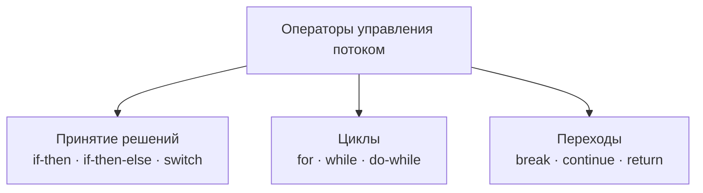

# Урок 2. Основы языка

**Трейл:** Learning the Java Language · **Оригинал:** [Language Basics](https://docs.oracle.com/javase/tutorial/java/nutsandbolts/index.html)
**Связанные области:** [[01-core-java-syntax-oop]] · **Вопросы:** core-java

> Перевод официального руководства Oracle (The Java Tutorials, JDK 8). Объединяет урок
> *Language Basics* трейла *Learning the Java Language* со всеми подстраницами: *Variables*,
> *Primitive Data Types*, *Arrays*, *Summary of Variables*, *Operators* (и их подстраницы),
> *Expressions, Statements, and Blocks*, *Control Flow Statements* (и их подстраницы), а также
> вопросами и упражнениями.

Этот урок охватывает базовые элементы языка Java: переменные, типы данных, операторы, выражения
и операторы управления потоком выполнения.

## Переменные (Variables)

Как вы узнали из предыдущего урока, объект хранит своё состояние в **полях** (*fields*).

```java
int cadence = 0;
int speed = 0;
int gear = 1;
```

Возникает ряд вопросов: каковы правила и соглашения по именованию полей? Какие, кроме `int`,
есть ещё типы данных? Нужно ли инициализировать поля при объявлении? Присваивается ли полю
значение по умолчанию, если оно не инициализировано явно? Прежде чем ответить на них, важно
разобраться в одном различии. В языке Java используются оба термина — «поле» (*field*) и
«переменная» (*variable*), и это частый источник путаницы у новичков, поскольку оба нередко
указывают на одно и то же.

### Виды переменных

В языке Java определены следующие виды переменных:

- **Переменные экземпляра (нестатические поля).** Технически объекты хранят своё индивидуальное
  состояние в «нестатических полях» — то есть в полях, объявленных без ключевого слова `static`.
  Нестатические поля также называют **переменными экземпляра** (*instance variables*), потому что
  их значения уникальны для каждого экземпляра класса (для каждого объекта): значение
  `currentSpeed` одного велосипеда не зависит от `currentSpeed` другого.

- **Переменные класса (статические поля).** **Переменная класса** (*class variable*) — это любое
  поле, объявленное с модификатором `static`. Это говорит компилятору, что существует ровно одна
  копия такой переменной, сколько бы экземпляров класса ни было создано. Например, поле,
  задающее число передач для конкретного вида велосипедов, можно пометить как `static`, поскольку
  концептуально одно и то же число передач относится ко всем экземплярам. Код
  `static int numGears = 6;` создаёт такое статическое поле. Дополнительно можно добавить ключевое
  слово `final`, чтобы указать, что число передач никогда не изменится.

- **Локальные переменные (local variables).** Подобно тому как объект хранит своё состояние в
  полях, метод часто хранит своё временное состояние в **локальных переменных**. Синтаксис их
  объявления похож на объявление поля (например, `int count = 0;`). Специального ключевого слова,
  обозначающего переменную как локальную, нет: это определяется исключительно местом объявления —
  между открывающей и закрывающей фигурными скобками метода. Поэтому локальные переменные видны
  только внутри метода, в котором объявлены, и недоступны из остальной части класса.

- **Параметры (parameters).** Примеры параметров вы уже видели — и в классе `Bicycle`, и в методе
  `main` приложения «Hello World!». Напомним сигнатуру метода `main`:
  `public static void main(String[] args)`. Здесь переменная `args` — параметр этого метода. Важно
  запомнить: параметры всегда классифицируются как «переменные», а не как «поля». Это относится и
  к другим конструкциям, принимающим параметры (конструкторам, обработчикам исключений), о которых
  вы узнаете позже.

### Соглашение о терминах «поле» и «переменная»

В дальнейшем руководство придерживается следующих общих соглашений. Если речь идёт о «полях в
целом» (исключая локальные переменные и параметры), говорят просто «поля». Если утверждение
относится «ко всему вышеперечисленному», говорят просто «переменные». Если контекст требует
различия, используются конкретные термины (статическое поле, локальные переменные и т. д.). Иногда
встречается также термин «член» (*member*): поля, методы и вложенные типы класса вместе называются
его **членами**.

### Именование

В каждом языке есть свои правила и соглашения о допустимых именах; Java не исключение. Правила и
соглашения по именованию переменных можно свести к следующему:

- **Имена переменных чувствительны к регистру.** Имя переменной — любой допустимый идентификатор
  (*identifier*): последовательность букв и цифр Unicode неограниченной длины, начинающаяся с
  буквы, символа доллара «`$`» или символа подчёркивания «`_`». Однако по соглашению имена всегда
  начинают с буквы, а не с «`$`» или «`_`». Символ доллара по соглашению не используется вообще
  (он может встречаться в автоматически сгенерированных именах, но в своих именах его следует
  избегать). Похожее соглашение действует для символа подчёркивания: технически начинать имя с
  «`_`» допустимо, но эта практика не приветствуется. Пробелы не разрешены.

- **Последующие символы** могут быть буквами, цифрами, символами доллара или подчёркивания. Здесь
  тоже действуют соглашения (и здравый смысл). Выбирайте имена из полных слов, а не из загадочных
  сокращений — так код легче читать и понимать, а зачастую он становится самодокументируемым: поля
  `cadence`, `speed` и `gear` гораздо понятнее, чем сокращения `s`, `c`, `g`. Помните также, что
  имя не должно совпадать с ключевым или зарезервированным словом.

- **Соглашения о регистре.** Если имя состоит из одного слова, пишите его строчными буквами. Если
  слов несколько — первую букву каждого последующего слова делайте заглавной: `gearRatio`,
  `currentGear`. Если переменная хранит константу, например `static final int NUM_GEARS = 6`,
  соглашение слегка меняется: все буквы заглавные, а слова разделяются подчёркиванием. В остальных
  случаях символ подчёркивания по соглашению не используется.

## Примитивные типы данных (Primitive Data Types)

Java — язык со **статической типизацией** (*statically-typed*): все переменные должны быть
объявлены до использования. Объявление указывает тип и имя переменной:

```java
int gear = 1;
```

Тип данных переменной определяет, какие значения она может содержать и какие операции над ней
допустимы. Язык Java поддерживает восемь примитивных типов данных. Примитивный тип предопределён
языком и обозначается зарезервированным ключевым словом. Примитивные значения не разделяют
состояние с другими примитивными значениями.

### Восемь примитивных типов данных

| Тип | Размер и описание | Минимум | Максимум |
|-----|-------------------|---------|----------|
| `byte` | 8-битное целое со знаком (дополнительный код) | −128 | 127 |
| `short` | 16-битное целое со знаком | −32 768 | 32 767 |
| `int` | 32-битное целое со знаком (по умолчанию) | −2³¹ | 2³¹−1 |
| `long` | 64-битное целое со знаком | −2⁶³ | 2⁶³−1 |
| `float` | 32-битное число с плавающей точкой одинарной точности (IEEE 754) | см. JLS | см. JLS |
| `double` | 64-битное число с плавающей точкой двойной точности (IEEE 754) | см. JLS | см. JLS |
| `boolean` | логический тип: только `true` или `false` | — | — |
| `char` | один 16-битный символ Unicode | `''` (0) | `'￿'` (65 535) |

Дополнительные пояснения:

- **`byte`** полезен для экономии памяти в больших массивах, где это действительно важно. Его также
  применяют вместо `int`, когда ограниченный диапазон проясняет смысл кода (служит своего рода
  документацией).
- **`short`** — те же рекомендации, что и для `byte`: экономия памяти в больших массивах.
- **`int`** — тип целого по умолчанию. Начиная с Java SE 8, `int` можно использовать как
  **беззнаковое** 32-битное целое (диапазон 0 … 2³²−1) с помощью класса `Integer` и его статических
  методов `compareUnsigned`, `divideUnsigned` и др.
- **`long`** — используйте, когда нужен диапазон шире, чем у `int`. Начиная с Java SE 8, `long`
  можно использовать как беззнаковое 64-битное целое (0 … 2⁶⁴−1); класс `Long` содержит методы
  `compareUnsigned`, `divideUnsigned` и др.
- **`float`** — применяйте (вместо `double`) для экономии памяти в больших массивах чисел с
  плавающей точкой. **Никогда** не используйте `float`/`double` для точных значений, например для
  денежных сумм; для этого предназначен класс `java.math.BigDecimal`.
- **`double`** — выбор по умолчанию для дробных значений.
- **`boolean`** — для простых флагов, отслеживающих условие истина/ложь. Представляет один бит
  информации, но его «размер» точно не определён.
- **`char`** — один 16-битный символ Unicode.

### Тип String

Помимо восьми примитивных типов, язык Java предоставляет особую поддержку строк символов через
класс `java.lang.String`. Заключение строки в двойные кавычки автоматически создаёт новый объект
`String`, например: `String s = "this is a string";`. Объекты `String`
**неизменяемы** (*immutable*): после создания их значение нельзя изменить. Технически `String` не
является примитивным типом, но из-за особой поддержки языком его часто воспринимают именно так.

### Значения по умолчанию

Присваивать значение при объявлении поля не всегда обязательно. Поля, объявленные, но не
инициализированные, компилятор устанавливает в разумное значение по умолчанию — как правило, ноль
или `null` в зависимости от типа. Однако полагаться на значения по умолчанию считается дурным
стилем программирования.

| Тип данных | Значение по умолчанию (для полей) |
|------------|-----------------------------------|
| `byte` | `0` |
| `short` | `0` |
| `int` | `0` |
| `long` | `0L` |
| `float` | `0.0f` |
| `double` | `0.0d` |
| `char` | `''` |
| `String` (или любой объект) | `null` |
| `boolean` | `false` |

Локальные переменные ведут себя иначе: компилятор **никогда** не присваивает им значение по
умолчанию. Если вы не можете инициализировать локальную переменную в месте объявления, обязательно
присвойте ей значение до использования. Обращение к неинициализированной локальной переменной
вызывает ошибку компиляции.

### Литералы

**Литерал** (*literal*) — это представление фиксированного значения в исходном коде; литералы
записываются напрямую, без вычислений. Литерал можно присвоить переменной примитивного типа:

```java
boolean result = true;
char capitalC = 'C';
byte b = 100;
short s = 10000;
int i = 100000;
```

#### Целочисленные литералы

Целочисленный литерал имеет тип `long`, если оканчивается буквой `L` или `l`; иначе — тип `int`.
Рекомендуется использовать заглавную `L`, потому что строчную `l` трудно отличить от цифры `1`.

Значения целых типов `byte`, `short`, `int` и `long` можно создавать из литералов типа `int`.
Значения типа `long`, выходящие за диапазон `int`, создаются из литералов `long`. Целочисленные
литералы можно записывать в следующих системах счисления:

- **Десятичная** — основание 10, цифры от 0 до 9 (привычная вам система).
- **Шестнадцатеричная** — основание 16, цифры 0–9 и буквы A–F.
- **Двоичная** — основание 2, цифры 0 и 1 (двоичные литералы доступны начиная с Java SE 7).

Префикс `0x` указывает на шестнадцатеричную систему, `0b` — на двоичную:

```java
// Число 26 в десятичной системе
int decVal = 26;
// Число 26 в шестнадцатеричной системе
int hexVal = 0x1a;
// Число 26 в двоичной системе
int binVal = 0b11010;
```

#### Литералы с плавающей точкой

Литерал с плавающей точкой имеет тип `float`, если оканчивается буквой `F` или `f`; иначе его
тип — `double`, и он может опционально оканчиваться буквой `D` или `d`. Типы с плавающей точкой
можно записывать с использованием `E` или `e` (научная нотация), `F`/`f` (32-битный литерал
`float`) и `D`/`d` (64-битный литерал `double`; это значение по умолчанию и по соглашению
опускается).

```java
double d1 = 123.4;
// то же значение, что и d1, но в научной нотации
double d2 = 1.234e2;
float f1  = 123.4f;
```

#### Символьные и строковые литералы

Литералы типов `char` и `String` могут содержать любые символы Unicode (UTF-16). Если редактор и
файловая система это позволяют, символы можно вписывать прямо в код. Если нет — используйте
«Unicode-escape», например `'Ĉ'` (заглавная C с циркумфлексом) или `"Sí Señor"`
(*Sí Señor* по-испански). Для литералов `char` всегда применяйте одинарные кавычки, для `String` —
двойные. Unicode-escape допустимы не только в литералах `char`/`String`, но и в других местах
программы (например, в именах полей).

Язык Java поддерживает несколько специальных управляющих последовательностей (*escape sequences*)
для `char` и `String`:

| Последовательность | Значение |
|--------------------|----------|
| `\b` | возврат на шаг (backspace) |
| `\t` | табуляция (tab) |
| `\n` | перевод строки (line feed) |
| `\f` | прогон страницы (form feed) |
| `\r` | возврат каретки (carriage return) |
| `\"` | двойная кавычка |
| `\'` | одинарная кавычка |
| `\\` | обратная косая черта (backslash) |

Существует также специальный литерал `null`, который можно использовать как значение для любого
ссылочного типа. `null` можно присвоить любой переменной, кроме переменных примитивных типов. С
`null` мало что можно сделать, кроме проверки его наличия, поэтому он часто служит маркером того,
что некоторый объект недоступен.

Наконец, есть особый вид литерала — **литерал класса** (*class literal*): он образуется добавлением
`.class` к имени типа, например `String.class`. Он обозначает объект (типа `Class`),
представляющий сам тип.

### Подчёркивания в числовых литералах

Начиная с Java SE 7, любое число символов подчёркивания (`_`) может стоять между цифрами числового
литерала. Это позволяет разделять группы цифр и улучшать читаемость, например группами по три
(аналогично запятой или пробелу как разделителю разрядов).

```java
long creditCardNumber = 1234_5678_9012_3456L;
long socialSecurityNumber = 999_99_9999L;
float pi =  3.14_15F;
long hexBytes = 0xFF_EC_DE_5E;
long hexWords = 0xCAFE_BABE;
long maxLong = 0x7fff_ffff_ffff_ffffL;
byte nybbles = 0b0010_0101;
long bytes = 0b11010010_01101001_10010100_10010010;
```

Подчёркивания можно ставить только между цифрами. Нельзя ставить подчёркивание:

- в начале или конце числа;
- рядом с десятичной точкой в литерале с плавающей точкой;
- перед суффиксом `F` или `L`;
- там, где ожидается строка цифр.

```java
// Недопустимо: нельзя ставить подчёркивание
// рядом с десятичной точкой
float pi1 = 3_.1415F;

// Недопустимо: нельзя ставить подчёркивание
// рядом с десятичной точкой
float pi2 = 3._1415F;

// Недопустимо: нельзя ставить подчёркивание
// перед суффиксом L
long socialSecurityNumber1 = 999_99_9999_L;

// Допустимо (десятичный литерал)
int x1 = 5_2;

// Недопустимо: нельзя ставить подчёркивание
// в конце литерала
int x2 = 52_;

// Допустимо (десятичный литерал)
int x3 = 5______2;

// Недопустимо: нельзя ставить подчёркивание
// в префиксе системы счисления 0x
int x4 = 0_x52;

// Недопустимо: нельзя ставить подчёркивание
// в начале числа
int x5 = 0x_52;

// Допустимо (шестнадцатеричный литерал)
int x6 = 0x5_2;

// Недопустимо: нельзя ставить подчёркивание
// в конце числа
int x7 = 0x52_;
```

## Массивы (Arrays)

**Массив** (*array*) — это объект-контейнер, который хранит фиксированное число значений одного
типа. Длина массива задаётся при его создании и после этого не меняется.

Каждый элемент массива называется **элементом** (*element*), и доступ к нему осуществляется по
числовому **индексу** (*index*). Нумерация начинается с 0, поэтому, например, 9-й элемент доступен
по индексу 8.

```java
class ArrayDemo {
    public static void main(String[] args) {
        // объявляет массив целых чисел
        int[] anArray;

        // выделяет память под 10 целых чисел
        anArray = new int[10];

        // инициализируем первый элемент
        anArray[0] = 100;
        // инициализируем второй элемент
        anArray[1] = 200;
        // и так далее
        anArray[2] = 300;
        anArray[3] = 400;
        anArray[4] = 500;
        anArray[5] = 600;
        anArray[6] = 700;
        anArray[7] = 800;
        anArray[8] = 900;
        anArray[9] = 1000;

        System.out.println("Element at index 0: "
                           + anArray[0]);
        System.out.println("Element at index 1: "
                           + anArray[1]);
        System.out.println("Element at index 2: "
                           + anArray[2]);
        System.out.println("Element at index 3: "
                           + anArray[3]);
        System.out.println("Element at index 4: "
                           + anArray[4]);
        System.out.println("Element at index 5: "
                           + anArray[5]);
        System.out.println("Element at index 6: "
                           + anArray[6]);
        System.out.println("Element at index 7: "
                           + anArray[7]);
        System.out.println("Element at index 8: "
                           + anArray[8]);
        System.out.println("Element at index 9: "
                           + anArray[9]);
    }
}
```

Вывод:

```
Element at index 0: 100
Element at index 1: 200
Element at index 2: 300
Element at index 3: 400
Element at index 4: 500
Element at index 5: 600
Element at index 6: 700
Element at index 7: 800
Element at index 8: 900
Element at index 9: 1000
```

### Объявление переменной-ссылки на массив

```java
// объявляет массив целых чисел
int[] anArray;
```

Как и при объявлении переменных других типов, объявление массива состоит из двух частей: типа
массива и его имени. Тип записывается как `тип[]`, где `тип` — тип содержащихся элементов; квадратные
скобки — особый символ, указывающий, что переменная хранит массив. Размер массива не входит в его
тип (поэтому скобки пустые). Имя массива может быть любым с учётом ранее описанных правил.

Аналогично объявляются массивы других типов:

```java
byte[] anArrayOfBytes;
short[] anArrayOfShorts;
long[] anArrayOfLongs;
float[] anArrayOfFloats;
double[] anArrayOfDoubles;
boolean[] anArrayOfBooleans;
char[] anArrayOfChars;
String[] anArrayOfStrings;
```

Скобки можно поставить и после имени, но эта форма не приветствуется: скобки обозначают тип массива
и должны стоять рядом с типом:

```java
// эта форма не рекомендуется
float anArrayOfFloats[];
```

### Создание, инициализация и доступ к массиву

Один из способов создать массив — оператор `new`. Следующая инструкция выделяет память под 10
целочисленных элементов и присваивает массив переменной `anArray`:

```java
// создать массив целых чисел
anArray = new int[10];
```

Если эту инструкцию пропустить, компилятор выдаст ошибку, и компиляция не пройдёт:

```
ArrayDemo.java:4: Variable anArray may not have been initialized.
```

Доступ к каждому элементу — по числовому индексу:

```java
anArray[0] = 100; // инициализируем первый элемент
anArray[1] = 200; // инициализируем второй элемент
anArray[2] = 300; // и так далее
```

Также можно использовать сокращённый синтаксис для создания и инициализации массива:

```java
int[] anArray = {
    100, 200, 300,
    400, 500, 600,
    700, 800, 900, 1000
};
```

Здесь длина массива определяется числом значений в фигурных скобках, разделённых запятыми.

Можно объявить и **массив массивов** (многомерный массив, *multidimensional array*), используя два
или более набора скобок, например `String[][] names`. В Java многомерный массив — это массив,
элементами которого сами являются массивы (в отличие от C или Fortran). Следствие: строки могут
иметь разную длину, как в программе `MultiDimArrayDemo`:

```java
class MultiDimArrayDemo {
    public static void main(String[] args) {
        String[][] names = {
            {"Mr. ", "Mrs. ", "Ms. "},
            {"Smith", "Jones"}
        };
        // Mr. Smith
        System.out.println(names[0][0] + names[1][0]);
        // Ms. Jones
        System.out.println(names[0][2] + names[1][1]);
    }
}
```

Вывод:

```
Mr. Smith
Ms. Jones
```

Наконец, размер любого массива можно узнать через встроенное свойство `length`:

```java
System.out.println(anArray.length);
```

### Копирование массивов

У класса `System` есть метод `arraycopy`, позволяющий эффективно копировать данные из одного
массива в другой:

```java
public static void arraycopy(Object src, int srcPos,
                             Object dest, int destPos, int length)
```

Два аргумента типа `Object` задают массив-источник и массив-приёмник. Три аргумента `int` задают
начальную позицию в источнике, начальную позицию в приёмнике и число копируемых элементов.

```java
class ArrayCopyDemo {
    public static void main(String[] args) {
        String[] copyFrom = {
            "Affogato", "Americano", "Cappuccino", "Corretto", "Cortado",
            "Doppio", "Espresso", "Frappucino", "Freddo", "Lungo", "Macchiato",
            "Marocchino", "Ristretto" };

        String[] copyTo = new String[7];
        System.arraycopy(copyFrom, 2, copyTo, 0, 7);
        for (String coffee : copyTo) {
            System.out.print(coffee + " ");
        }
    }
}
```

Вывод:

```
Cappuccino Corretto Cortado Doppio Espresso Frappucino Freddo
```

### Операции над массивами

Массивы — мощная и полезная концепция. Java SE предоставляет методы для наиболее частых операций.
Так, пример `ArrayCopyDemo` использует `arraycopy` класса `System` вместо ручного перебора
элементов — всё происходит «за кулисами», одной строкой кода.

Для удобства Java SE предлагает несколько методов для операций над массивами (копирование,
сортировка, поиск) в классе `java.util.Arrays`. Например, предыдущий пример можно переписать с
методом `copyOfRange`: при этом не нужно заранее создавать массив-приёмник, так как его возвращает
сам метод:

```java
class ArrayCopyOfDemo {
    public static void main(String[] args) {
        String[] copyFrom = {
            "Affogato", "Americano", "Cappuccino", "Corretto", "Cortado",
            "Doppio", "Espresso", "Frappucino", "Freddo", "Lungo", "Macchiato",
            "Marocchino", "Ristretto" };

        String[] copyTo = java.util.Arrays.copyOfRange(copyFrom, 2, 9);
        for (String coffee : copyTo) {
            System.out.print(coffee + " ");
        }
    }
}
```

Вывод тот же, но кода меньше. Обратите внимание: второй параметр `copyOfRange` — начальный индекс
диапазона (включительно), а третий — конечный индекс (**исключительно**). В этом примере элемент с
индексом 9 (строка `Lungo`) не копируется.

Другие полезные операции класса `java.util.Arrays`:

- **Поиск** значения в массиве и получение его индекса — метод `binarySearch`.
- **Сравнение** двух массивов на равенство — метод `equals`.
- **Заполнение** массива одним значением во всех позициях — метод `fill`.
- **Сортировка** массива по возрастанию: последовательно — `sort`, либо параллельно — `parallelSort`
  (введён в Java SE 8; на многопроцессорных системах параллельная сортировка больших массивов
  быстрее).
- **Создание потока** (*stream*) на основе массива — метод `stream`. Например, следующая инструкция
  печатает содержимое массива `copyTo` так же, как раньше:

  ```java
  java.util.Arrays.stream(copyTo).map(coffee -> coffee + " ").forEach(System.out::print);
  ```

- **Преобразование массива в строку** — метод `toString`: каждый элемент преобразуется в строку,
  они разделяются запятыми и обрамляются квадратными скобками:

  ```java
  System.out.println(java.util.Arrays.toString(copyTo));
  ```

  Эта инструкция выводит:

  ```
  [Cappuccino, Corretto, Cortado, Doppio, Espresso, Frappucino, Freddo]
  ```

## Сводка по переменным (Summary of Variables)

Язык Java использует и термин «поле», и термин «переменная»; вместе они образуют **члены** класса
наряду с методами и вложенными типами. Переменные бывают четырёх видов: переменные экземпляра
(нестатические поля), переменные класса (статические поля), локальные переменные и параметры.
Имена переменных подчиняются правилам и соглашениям именования. Язык поддерживает восемь
примитивных типов: `byte`, `short`, `int`, `long`, `float`, `double`, `boolean` и `char`. Класс
`java.lang.String` представляет строки символов. Компилятор присваивает разумные значения по
умолчанию полям, но **никогда** — локальным переменным. **Литерал** — это представление
фиксированного значения в исходном коде. **Массив** — объект-контейнер, хранящий фиксированное
число значений одного типа (его длина после создания неизменна).

## Операторы (Operators)

**Операторы** (*operators*) — это специальные символы, выполняющие операции над одним, двумя или
тремя **операндами** (*operands*) и возвращающие результат.

Перед изучением операторов полезно знать их **приоритет** (*precedence*). В таблице ниже операторы
перечислены по убыванию приоритета: чем выше оператор в таблице, тем выше его приоритет, и тем
раньше он вычисляется. Операторы в одной строке имеют равный приоритет. Когда в одном выражении
встречаются операторы равного приоритета, порядок определяется правилом ассоциативности: все бинарные
операторы, кроме операторов присваивания, вычисляются **слева направо**; операторы присваивания —
**справа налево**.

### Таблица приоритета операторов

| Приоритет (от высшего к низшему) | Операторы |
|----------------------------------|-----------|
| постфиксные | `выражение++`  `выражение--` |
| унарные | `++выражение`  `--выражение`  `+выражение`  `-выражение`  `~`  `!` |
| мультипликативные | `*`  `/`  `%` |
| аддитивные | `+`  `-` |
| сдвиг | `<<`  `>>`  `>>>` |
| отношения | `<`  `>`  `<=`  `>=`  `instanceof` |
| равенство | `==`  `!=` |
| побитовое И | `&` |
| побитовое исключающее ИЛИ | `^` |
| побитовое включающее ИЛИ | `\|` |
| логическое И | `&&` |
| логическое ИЛИ | `\|\|` |
| тернарный | `? :` |
| присваивание | `=`  `+=`  `-=`  `*=`  `/=`  `%=`  `&=`  `^=`  `\|=`  `<<=`  `>>=`  `>>>=` |

Некоторые операторы встречаются чаще других: например, присваивание «`=`» гораздо более распространено,
чем беззнаковый сдвиг вправо «`>>>`». Поэтому изложение начинается с самых частых операторов и
заканчивается редкими. Каждый разбор сопровождается примером кода, который можно скомпилировать и
запустить.

### Присваивание, арифметические и унарные операторы

#### Простой оператор присваивания

Простой оператор присваивания `=` присваивает значение справа операнду слева:

```java
int cadence = 0;
int speed = 0;
int gear = 1;
```

Этот оператор применим и к объектам — для присваивания ссылок на объекты.

#### Арифметические операторы

| Оператор | Описание |
|----------|----------|
| `+` | Сложение (а также конкатенация строк) |
| `-` | Вычитание |
| `*` | Умножение |
| `/` | Деление |
| `%` | Остаток от деления |

```java
class ArithmeticDemo {
    public static void main (String[] args) {
        int result = 1 + 2;
        // теперь result равно 3
        System.out.println("1 + 2 = " + result);
        int original_result = result;

        result = result - 1;
        // теперь result равно 2
        System.out.println(original_result + " - 1 = " + result);
        original_result = result;

        result = result * 2;
        // теперь result равно 4
        System.out.println(original_result + " * 2 = " + result);
        original_result = result;

        result = result / 2;
        // теперь result равно 2
        System.out.println(original_result + " / 2 = " + result);
        original_result = result;

        result = result + 8;
        // теперь result равно 10
        System.out.println(original_result + " + 8 = " + result);
        original_result = result;

        result = result % 7;
        // теперь result равно 3
        System.out.println(original_result + " % 7 = " + result);
    }
}
```

Вывод:

```
1 + 2 = 3
3 - 1 = 2
2 * 2 = 4
4 / 2 = 2
2 + 8 = 10
10 % 7 = 3
```

Оператор `+` можно использовать для соединения (**конкатенации**) строк:

```java
class ConcatDemo {
    public static void main(String[] args){
        String firstString = "This is";
        String secondString = " a concatenated string.";
        String thirdString = firstString+secondString;
        System.out.println(thirdString);
    }
}
```

Вывод: `This is a concatenated string.`

#### Унарные операторы

| Оператор | Описание |
|----------|----------|
| `+` | Унарный плюс; обозначает положительное значение |
| `-` | Унарный минус; меняет знак выражения |
| `++` | Инкремент; увеличивает значение на 1 |
| `--` | Декремент; уменьшает значение на 1 |
| `!` | Логическое отрицание; инвертирует значение `boolean` |

```java
class UnaryDemo {
    public static void main(String[] args) {
        int result = +1;
        // теперь result равно 1
        System.out.println(result);

        result--;
        // теперь result равно 0
        System.out.println(result);

        result++;
        // теперь result равно 1
        System.out.println(result);

        result = -result;
        // теперь result равно -1
        System.out.println(result);

        boolean success = false;
        // false
        System.out.println(success);
        // true
        System.out.println(!success);
    }
}
```

Операторы инкремента и декремента можно ставить как до операнда (префикс, `++result`), так и после
(постфикс, `result++`). Оба варианта увеличивают значение на 1, но **префиксная** версия вычисляется
в уже увеличенное значение, а **постфиксная** — в исходное (до увеличения):

```java
class PrePostDemo {
    public static void main(String[] args){
        int i = 3;
        i++;
        // печатает 4
        System.out.println(i);
        ++i;
        // печатает 5
        System.out.println(i);
        // печатает 6
        System.out.println(++i);
        // печатает 6
        System.out.println(i++);
        // печатает 7
        System.out.println(i);
    }
}
```

### Равенство, отношения и условные операторы

#### Операторы равенства и отношения

Они определяют, больше ли один операнд другого, меньше, равен ли, не равен. При проверке равенства
двух примитивных значений нужно использовать `==` (а не `=`).

| Оператор | Значение |
|----------|----------|
| `==` | равно |
| `!=` | не равно |
| `>` | больше |
| `>=` | больше или равно |
| `<` | меньше |
| `<=` | меньше или равно |

```java
class ComparisonDemo {
    public static void main(String[] args){
        int value1 = 1;
        int value2 = 2;
        if(value1 == value2)
            System.out.println("value1 == value2");
        if(value1 != value2)
            System.out.println("value1 != value2");
        if(value1 > value2)
            System.out.println("value1 > value2");
        if(value1 < value2)
            System.out.println("value1 < value2");
        if(value1 <= value2)
            System.out.println("value1 <= value2");
    }
}
```

Вывод:

```
value1 != value2
value1 < value2
value1 <= value2
```

#### Условные операторы

Операторы `&&` и `||` выполняют условные операции И (Conditional-AND) и ИЛИ (Conditional-OR) над
двумя логическими выражениями. Они работают с **«короткой схемой»** (*short-circuiting*): второй
операнд вычисляется только при необходимости.

- `&&` — условное И;
- `||` — условное ИЛИ.

```java
class ConditionalDemo1 {
    public static void main(String[] args){
        int value1 = 1;
        int value2 = 2;
        if((value1 == 1) && (value2 == 2))
            System.out.println("value1 is 1 AND value2 is 2");
        if((value1 == 1) || (value2 == 1))
            System.out.println("value1 is 1 OR value2 is 1");
    }
}
```

#### Тернарный оператор `?:`

Оператор `?:` — это сокращённая запись оператора `if-then-else`. Он принимает три операнда: если
условие истинно, берётся первое значение, иначе — второе.

```java
class ConditionalDemo2 {
    public static void main(String[] args){
        int value1 = 1;
        int value2 = 2;
        int result;
        boolean someCondition = true;
        result = someCondition ? value1 : value2;

        System.out.println(result);
    }
}
```

Программа печатает «1», потому что `someCondition` истинно.

#### Оператор сравнения типов `instanceof`

Оператор `instanceof` сравнивает объект с указанным типом. Его используют для проверки, является ли
объект экземпляром класса, подкласса или класса, реализующего определённый интерфейс.

```java
class InstanceofDemo {
    public static void main(String[] args) {
        Parent obj1 = new Parent();
        Parent obj2 = new Child();

        System.out.println("obj1 instanceof Parent: "
            + (obj1 instanceof Parent));
        System.out.println("obj1 instanceof Child: "
            + (obj1 instanceof Child));
        System.out.println("obj1 instanceof MyInterface: "
            + (obj1 instanceof MyInterface));
        System.out.println("obj2 instanceof Parent: "
            + (obj2 instanceof Parent));
        System.out.println("obj2 instanceof Child: "
            + (obj2 instanceof Child));
        System.out.println("obj2 instanceof MyInterface: "
            + (obj2 instanceof MyInterface));
    }
}

class Parent {}
class Child extends Parent implements MyInterface {}
interface MyInterface {}
```

Вывод:

```
obj1 instanceof Parent: true
obj1 instanceof Child: false
obj1 instanceof MyInterface: false
obj2 instanceof Parent: true
obj2 instanceof Child: true
obj2 instanceof MyInterface: true
```

При использовании `instanceof` помните: `null` не является экземпляром чего-либо.

### Побитовые операторы и операторы сдвига

Язык Java предоставляет операторы для побитовых операций и операций сдвига над целочисленными типами.

- **Унарное побитовое дополнение `~`** инвертирует битовую комбинацию, превращая каждый «0» в «1» и
  каждую «1» в «0». Например, для значения `byte` с битами «00000000» результат будет «11111111».
- **Знаковый сдвиг влево `<<`** сдвигает битовую комбинацию (левый операнд) влево на число позиций,
  заданное правым операндом.
- **Знаковый сдвиг вправо `>>`** сдвигает биты вправо; крайняя левая позиция после сдвига зависит от
  расширения знака.
- **Беззнаковый сдвиг вправо `>>>`** вставляет в крайнюю левую позицию ноль.
- **Побитовое И `&`** выполняет побитовую операцию И.
- **Побитовое исключающее ИЛИ `^`** выполняет побитовую операцию исключающего ИЛИ.
- **Побитовое включающее ИЛИ `|`** выполняет побитовую операцию включающего ИЛИ.

```java
class BitDemo {
    public static void main(String[] args) {
        int bitmask = 0x000F;
        int val = 0x2222;
        // печатает "2"
        System.out.println(val & bitmask);
    }
}
```

Программа использует побитовое И и печатает в стандартный вывод число «2».

## Выражения, инструкции и блоки (Expressions, Statements, and Blocks)

### Выражения

**Выражение** (*expression*) — это конструкция из переменных, операторов и вызовов методов,
построенная по синтаксису языка, которая вычисляется в одно значение. Например:

```java
int cadence = 0;
```

Тип возвращаемого значения зависит от используемых элементов. Выражение `cadence = 0` возвращает
`int`, потому что оператор присваивания возвращает значение того же типа, что и его левый операнд.

#### Составные выражения и приоритет

Язык Java позволяет строить **составные выражения** из меньших, если типы данных их частей
совместимы. Иногда порядок вычисления не важен, например в `1 * 2 * 3`. Но не всегда: следующее
выражение даёт разные результаты в зависимости от того, что выполнить раньше — сложение или деление:

```java
x + y / 100    // неоднозначно
```

Точный порядок вычисления можно задать сбалансированными скобками `(` и `)`:

```java
(x + y) / 100  // однозначно, рекомендуется
```

Если порядок не указан явно, он определяется приоритетом операторов: операторы с более высоким
приоритетом вычисляются раньше. Например, деление имеет приоритет выше сложения, поэтому следующие
две инструкции эквивалентны:

```java
x + y / 100
x + (y / 100) // однозначно, рекомендуется
```

**В составных выражениях явно указывайте скобками, какие операторы должны вычисляться раньше.** Это
делает код понятнее и проще в сопровождении.

### Инструкции

**Инструкция** (*statement*) примерно соответствует предложению в естественном языке и образует
законченную единицу выполнения. Следующие виды выражений можно превратить в инструкцию, завершив их
точкой с запятой (`;`):

- выражения присваивания;
- любое использование `++` или `--`;
- вызовы методов;
- выражения создания объекта.

Такие инструкции называются **инструкциями-выражениями** (*expression statements*):

```java
// инструкция присваивания
aValue = 8933.234;
// инструкция инкремента
aValue++;
// инструкция вызова метода
System.out.println("Hello World!");
// инструкция создания объекта
Bicycle myBike = new Bicycle();
```

**Инструкция объявления** (*declaration statement*) объявляет переменную:

```java
// инструкция объявления
double aValue = 8933.234;
```

**Инструкции управления потоком** (*control flow statements*) регулируют порядок выполнения других
инструкций.

### Блоки

**Блок** (*block*) — это группа из нуля или более инструкций между сбалансированными фигурными
скобками; его можно использовать везде, где допустима одиночная инструкция.

```java
class BlockDemo {
     public static void main(String[] args) {
          boolean condition = true;
          if (condition) { // начало блока 1
               System.out.println("Condition is true.");
          } // конец блока 1
          else { // начало блока 2
               System.out.println("Condition is false.");
          } // конец блока 2
     }
}
```

## Операторы управления потоком (Control Flow Statements)

Инструкции в исходных файлах обычно выполняются сверху вниз, в порядке появления. **Операторы
управления потоком** нарушают этот порядок с помощью принятия решений, циклов и переходов, позволяя
**условно** выполнять отдельные блоки кода. Различают три группы:

- **операторы принятия решений** (*decision-making*): `if-then`, `if-then-else`, `switch`;
- **операторы цикла** (*looping*): `for`, `while`, `do-while`;
- **операторы перехода** (*branching*): `break`, `continue`, `return`.

<!-- original: none | авторская классификационная схема, в оригинале Oracle только текст -->


### Операторы if-then и if-then-else

#### Оператор if-then

`if-then` — самый базовый из всех операторов управления потоком. Он указывает программе выполнить
определённый участок кода **только если** условие истинно:

```java
void applyBrakes() {
    // условие "if": велосипед должен двигаться
    if (isMoving){
        // ветка "then": уменьшить текущую скорость
        currentSpeed--;
    }
}
```

Если условие ложно, управление переходит в конец оператора `if-then`. Открывающую и закрывающую
фигурные скобки можно опустить, если ветка «then» состоит из одной инструкции:

```java
void applyBrakes() {
    // то же самое, но без скобок
    if (isMoving)
        currentSpeed--;
}
```

Однако опускание скобок делает код хрупким: если позже во ветку «then» добавят вторую инструкцию,
легко забыть про обязательные теперь скобки.

#### Оператор if-then-else

`if-then-else` задаёт дополнительный путь выполнения, когда условие «if» ложно:

```java
void applyBrakes() {
    if (isMoving) {
        currentSpeed--;
    } else {
        System.err.println("The bicycle has already stopped!");
    }
}
```

Следующая программа `IfElseDemo` присваивает оценку по баллам теста:

```java
class IfElseDemo {
    public static void main(String[] args) {

        int testscore = 76;
        char grade;

        if (testscore >= 90) {
            grade = 'A';
        } else if (testscore >= 80) {
            grade = 'B';
        } else if (testscore >= 70) {
            grade = 'C';
        } else if (testscore >= 60) {
            grade = 'D';
        } else {
            grade = 'F';
        }
        System.out.println("Grade = " + grade);
    }
}
```

Вывод:

```
Grade = C
```

Как только условие выполнено, выполняются соответствующие инструкции, а остальные условия не
проверяются.

### Оператор switch

В отличие от `if-then`/`if-then-else`, `switch` допускает любое число путей выполнения. Он работает
с примитивными типами `byte`, `short`, `char` и `int`, с перечислимыми типами (*enum*), с классом
`String` и с классами-обёртками `Character`, `Byte`, `Short`, `Integer`.

```java
public class SwitchDemo {
    public static void main(String[] args) {

        int month = 8;
        String monthString;
        switch (month) {
            case 1:  monthString = "January";
                     break;
            case 2:  monthString = "February";
                     break;
            case 3:  monthString = "March";
                     break;
            case 4:  monthString = "April";
                     break;
            case 5:  monthString = "May";
                     break;
            case 6:  monthString = "June";
                     break;
            case 7:  monthString = "July";
                     break;
            case 8:  monthString = "August";
                     break;
            case 9:  monthString = "September";
                     break;
            case 10: monthString = "October";
                     break;
            case 11: monthString = "November";
                     break;
            case 12: monthString = "December";
                     break;
            default: monthString = "Invalid month";
                     break;
        }
        System.out.println(monthString);
    }
}
```

Вывод: `August`.

#### Оператор break и «проваливание»

Каждый оператор `break` завершает охватывающий `switch`, и выполнение продолжается с первой
инструкции после блока `switch`. Именно `break` позволяет пропустить остальные ветки `case`. Если
`break` отсутствует, происходит **«проваливание»** (*fall-through*): выполняются все инструкции,
следующие за совпавшей меткой `case`, пока не встретится `break`. Это видно в `SwitchDemoFallThrough`,
который добавляет в список номер месяца и все последующие:

```java
public class SwitchDemoFallThrough {

    public static void main(String[] args) {
        java.util.ArrayList<String> futureMonths =
            new java.util.ArrayList<String>();

        int month = 8;

        switch (month) {
            case 1:  futureMonths.add("January");
            case 2:  futureMonths.add("February");
            case 3:  futureMonths.add("March");
            case 4:  futureMonths.add("April");
            case 5:  futureMonths.add("May");
            case 6:  futureMonths.add("June");
            case 7:  futureMonths.add("July");
            case 8:  futureMonths.add("August");
            case 9:  futureMonths.add("September");
            case 10: futureMonths.add("October");
            case 11: futureMonths.add("November");
            case 12: futureMonths.add("December");
                     break;
            default: break;
        }

        if (futureMonths.isEmpty()) {
            System.out.println("Invalid month number");
        } else {
            for (String monthName : futureMonths) {
               System.out.println(monthName);
            }
        }
    }
}
```

Вывод:

```
August
September
October
November
December
```

Технически последний `break` не требуется (поток управления и так выходит из `switch`), но его
рекомендуют ставить для единообразия. Несколько меток `case` могут вести к одному блоку, как в
`SwitchDemo2`, вычисляющем число дней в месяце:

```java
class SwitchDemo2 {
    public static void main(String[] args) {

        int month = 2;
        int year = 2000;
        int numDays = 0;

        switch (month) {
            case 1: case 3: case 5:
            case 7: case 8: case 10:
            case 12:
                numDays = 31;
                break;
            case 4: case 6:
            case 9: case 11:
                numDays = 30;
                break;
            case 2:
                if (((year % 4 == 0) &&
                     !(year % 100 == 0))
                     || (year % 400 == 0))
                    numDays = 29;
                else
                    numDays = 28;
                break;
            default:
                System.out.println("Invalid month.");
                break;
        }
        System.out.println("Number of Days = "
                           + numDays);
    }
}
```

Вывод: `Number of Days = 29`.

Раздел `default` обрабатывает все значения, не охваченные явно метками `case`.

#### Использование строк в switch

Начиная с Java SE 7, в выражении `switch` можно использовать объекты `String`. Сравнение
выполняется по семантике метода `String.equals()` и чувствительно к регистру (если только вы сами
не привели строку к нижнему регистру через `toLowerCase()`):

```java
public class StringSwitchDemo {

    public static int getMonthNumber(String month) {

        int monthNumber = 0;

        if (month == null) {
            return monthNumber;
        }

        switch (month.toLowerCase()) {
            case "january":
                monthNumber = 1;
                break;
            case "february":
                monthNumber = 2;
                break;
            case "march":
                monthNumber = 3;
                break;
            case "april":
                monthNumber = 4;
                break;
            case "may":
                monthNumber = 5;
                break;
            case "june":
                monthNumber = 6;
                break;
            case "july":
                monthNumber = 7;
                break;
            case "august":
                monthNumber = 8;
                break;
            case "september":
                monthNumber = 9;
                break;
            case "october":
                monthNumber = 10;
                break;
            case "november":
                monthNumber = 11;
                break;
            case "december":
                monthNumber = 12;
                break;
            default:
                monthNumber = 0;
                break;
        }

        return monthNumber;
    }

    public static void main(String[] args) {

        String month = "August";

        int returnedMonthNumber =
            StringSwitchDemo.getMonthNumber(month);

        if (returnedMonthNumber == 0) {
            System.out.println("Invalid month");
        } else {
            System.out.println(returnedMonthNumber);
        }
    }
}
```

Вывод: `8`. Важно: убедитесь, что выражение в `switch` не равно `null`, иначе возникнет
`NullPointerException`.

### Операторы while и do-while

Оператор `while` непрерывно выполняет блок инструкций, пока условие истинно. Синтаксис:

```java
while (expression) {
     statement(s)
}
```

`while` вычисляет выражение (оно должно возвращать `boolean`); если истинно — выполняет инструкции
блока, затем снова проверяет условие, и так пока оно не станет ложным.

```java
class WhileDemo {
    public static void main(String[] args){
        int count = 1;
        while (count < 11) {
            System.out.println("Count is: " + count);
            count++;
        }
    }
}
```

Программа печатает значения от 1 до 10. Бесконечный цикл можно создать так:

```java
while (true){
    // ваш код здесь
}
```

Оператор `do-while` выражается так:

```java
do {
     statement(s)
} while (expression);
```

Ключевое отличие в том, что `do-while` вычисляет условие в **конце** цикла, а не в начале. Поэтому
инструкции блока `do` всегда выполняются хотя бы один раз:

```java
class DoWhileDemo {
    public static void main(String[] args){
        int count = 1;
        do {
            System.out.println("Count is: " + count);
            count++;
        } while (count < 11);
    }
}
```

Эта программа тоже печатает значения от 1 до 10, но гарантирует хотя бы одно выполнение тела цикла.

### Оператор for

Оператор `for` компактно перебирает диапазон значений. Общая форма:

```java
for (initialization; termination; increment) {
    statement(s)
}
```

- **Инициализация** (*initialization*) выполняется один раз в начале цикла.
- **Условие завершения** (*termination*): цикл прекращается, когда это выражение становится ложным.
- **Приращение** (*increment*) вычисляется после каждой итерации (может увеличивать или уменьшать
  значение).

```java
class ForDemo {
    public static void main(String[] args){
         for(int i=1; i<11; i++){
              System.out.println("Count is: " + i);
         }
    }
}
```

Вывод:

```
Count is: 1
Count is: 2
Count is: 3
Count is: 4
Count is: 5
Count is: 6
Count is: 7
Count is: 8
Count is: 9
Count is: 10
```

Бесконечный цикл `for` с пустыми выражениями:

```java
// бесконечный цикл
for ( ; ; ) {
    // ваш код здесь
}
```

#### Расширенный for (for-each)

`for` имеет также форму, предназначенную для перебора коллекций и массивов — **расширенный цикл**
(*enhanced for*, или *for-each*):

```java
class EnhancedForDemo {
    public static void main(String[] args){
         int[] numbers =
             {1,2,3,4,5,6,7,8,9,10};
         for (int item : numbers) {
             System.out.println("Count is: " + item);
         }
    }
}
```

Вывод:

```
Count is: 1
Count is: 2
Count is: 3
Count is: 4
Count is: 5
Count is: 6
Count is: 7
Count is: 8
Count is: 9
Count is: 10
```

По возможности используйте расширенный `for`: он делает код чище и читабельнее.

### Операторы перехода

#### Оператор break

У `break` две формы — без метки и с меткой. **Без метки** он завершает ближайший охватывающий
`switch`, `for`, `while` или `do-while`:

```java
class BreakDemo {
    public static void main(String[] args) {
        int[] arrayOfInts =
            { 32, 87, 3, 589,
              12, 1076, 2000,
              8, 622, 127 };
        int searchfor = 12;
        int i;
        boolean foundIt = false;

        for (i = 0; i < arrayOfInts.length; i++) {
            if (arrayOfInts[i] == searchfor) {
                foundIt = true;
                break;
            }
        }

        if (foundIt) {
            System.out.println("Found " + searchfor + " at index " + i);
        } else {
            System.out.println(searchfor + " not in the array");
        }
    }
}
```

Вывод: `Found 12 at index 4`.

**Break с меткой** (*labeled break*) завершает внешний оператор, помеченный меткой:

```java
class BreakWithLabelDemo {
    public static void main(String[] args) {
        int[][] arrayOfInts = {
            { 32, 87, 3, 589 },
            { 12, 1076, 2000, 8 },
            { 622, 127, 77, 955 }
        };
        int searchfor = 12;
        int i;
        int j = 0;
        boolean foundIt = false;

    search:
        for (i = 0; i < arrayOfInts.length; i++) {
            for (j = 0; j < arrayOfInts[i].length; j++) {
                if (arrayOfInts[i][j] == searchfor) {
                    foundIt = true;
                    break search;
                }
            }
        }

        if (foundIt) {
            System.out.println("Found " + searchfor + " at " + i + ", " + j);
        } else {
            System.out.println(searchfor + " not in the array");
        }
    }
}
```

Вывод: `Found 12 at 1, 0`.

#### Оператор continue

`continue` пропускает текущую итерацию цикла. **Без метки** он переходит к следующей итерации
ближайшего охватывающего цикла:

```java
class ContinueDemo {
    public static void main(String[] args) {
        String searchMe = "peter piper picked a " + "peck of pickled peppers";
        int max = searchMe.length();
        int numPs = 0;

        for (int i = 0; i < max; i++) {
            // интересуют только буквы 'p'
            if (searchMe.charAt(i) != 'p')
                continue;

            // обрабатываем 'p'
            numPs++;
        }
        System.out.println("Found " + numPs + " p's in the string.");
    }
}
```

Вывод: `Found 9 p's in the string.`

**Continue с меткой** (*labeled continue*) переходит к следующей итерации внешнего помеченного цикла:

```java
class ContinueWithLabelDemo {
    public static void main(String[] args) {
        String searchMe = "Look for a substring in me";
        String substring = "sub";
        boolean foundIt = false;

        int max = searchMe.length() - substring.length();

    test:
        for (int i = 0; i <= max; i++) {
            int n = substring.length();
            int j = i;
            int k = 0;
            while (n-- != 0) {
                if (searchMe.charAt(j++) != substring.charAt(k++)) {
                    continue test;
                }
            }
            foundIt = true;
            break test;
        }
        System.out.println(foundIt ? "Found it" : "Didn't find it");
    }
}
```

Вывод: `Found it`.

#### Оператор return

Оператор `return` выходит из текущего метода и возвращает управление туда, откуда метод был вызван.
У него две формы:

- **со значением** — возвращает значение, тип которого должен совпадать с объявленным типом
  возврата метода, например `return ++count;`;
- **без значения** — `return;`, используется в методах, объявленных как `void`.

## Сводка по операторам управления потоком

Оператор `if-then` — самый базовый: он выполняет код только если условие истинно. `if-then-else`
добавляет альтернативный путь. `switch` допускает несколько путей выполнения для одного значения.
Операторы `while` и `do-while` непрерывно выполняют блок, пока истинно условие; `do-while`
вычисляет условие в конце и гарантирует хотя бы одно выполнение. Оператор `for` компактно перебирает
диапазон значений и имеет расширенную форму (for-each) для коллекций и массивов. Операторы перехода
`break`, `continue` и `return` передают управление в другую часть программы; формы с меткой работают
с внешними циклами.

## Вопросы и упражнения

### Переменные

**Вопросы**

1. Термин «переменная экземпляра» — другое название для _____.
2. Термин «переменная класса» — другое название для _____.
3. Локальная переменная хранит временное состояние; она объявляется внутри _____.
4. Переменная, объявленная в круглых скобках сигнатуры метода, называется _____.
5. Какие восемь примитивных типов данных поддерживает язык Java?
6. Строки символов представлены классом _____.
7. _____ — это объект-контейнер, который хранит фиксированное число значений одного типа.

**Упражнения**

1. Напишите небольшую программу, объявляющую несколько полей. Попробуйте создать недопустимые имена
   полей и посмотрите, какие ошибки выдаёт компилятор. Ориентируйтесь на правила и соглашения
   именования.
2. В программе из упражнения 1 оставьте поля неинициализированными и выведите их значения. Сделайте
   то же с локальной переменной и посмотрите, какие ошибки компиляции получите. Знакомство с типичными
   ошибками компилятора облегчает распознавание багов.

### Операторы управления потоком

**Вопросы**

1. Самый базовый оператор управления потоком в Java — это оператор _____.
2. Оператор _____ допускает любое число возможных путей выполнения.
3. Оператор _____ похож на `while`, но вычисляет своё выражение в _____ цикла.
4. Как написать бесконечный цикл с помощью оператора `for`?
5. Как написать бесконечный цикл с помощью оператора `while`?

**Упражнение**

1. Рассмотрите фрагмент кода:

   ```java
   if (aNumber >= 0)
       if (aNumber == 0)
           System.out.println("first string");
   else System.out.println("second string");
   System.out.println("third string");
   ```

   1. Какой вывод, по-вашему, даст этот код, если `aNumber` равно 3?
   2. Напишите тестовую программу с этим фрагментом, задав `aNumber` равным 3. Каков фактический
      вывод? Совпал ли он с предсказанием? Объясните поток управления для фрагмента.
   3. Используя только пробелы и переводы строк, переформатируйте фрагмент так, чтобы поток
      управления стал понятнее.
   4. С помощью фигурных скобок `{` и `}` дополнительно проясните код.

## Источник

- [Language Basics](https://docs.oracle.com/javase/tutorial/java/nutsandbolts/index.html) — официальное руководство Oracle.
- [Variables](https://docs.oracle.com/javase/tutorial/java/nutsandbolts/variables.html)
- [Primitive Data Types](https://docs.oracle.com/javase/tutorial/java/nutsandbolts/datatypes.html)
- [Arrays](https://docs.oracle.com/javase/tutorial/java/nutsandbolts/arrays.html)
- [Summary of Variables](https://docs.oracle.com/javase/tutorial/java/nutsandbolts/variablesummary.html)
- [Questions and Exercises: Variables](https://docs.oracle.com/javase/tutorial/java/nutsandbolts/QandE/questions_variables.html)
- [Operators](https://docs.oracle.com/javase/tutorial/java/nutsandbolts/operators.html)
- [Assignment, Arithmetic, and Unary Operators](https://docs.oracle.com/javase/tutorial/java/nutsandbolts/op1.html)
- [Equality, Relational, and Conditional Operators](https://docs.oracle.com/javase/tutorial/java/nutsandbolts/op2.html)
- [Bitwise and Bit Shift Operators](https://docs.oracle.com/javase/tutorial/java/nutsandbolts/op3.html)
- [Summary of Operators](https://docs.oracle.com/javase/tutorial/java/nutsandbolts/opsummary.html)
- [Expressions, Statements, and Blocks](https://docs.oracle.com/javase/tutorial/java/nutsandbolts/expressions.html)
- [Questions and Exercises: Expressions, Statements, and Blocks](https://docs.oracle.com/javase/tutorial/java/nutsandbolts/QandE/questions_expressions.html)
- [Control Flow Statements](https://docs.oracle.com/javase/tutorial/java/nutsandbolts/flow.html)
- [The if-then and if-then-else Statements](https://docs.oracle.com/javase/tutorial/java/nutsandbolts/if.html)
- [The switch Statement](https://docs.oracle.com/javase/tutorial/java/nutsandbolts/switch.html)
- [The while and do-while Statements](https://docs.oracle.com/javase/tutorial/java/nutsandbolts/while.html)
- [The for Statement](https://docs.oracle.com/javase/tutorial/java/nutsandbolts/for.html)
- [Branching Statements](https://docs.oracle.com/javase/tutorial/java/nutsandbolts/branch.html)
- [Summary of Control Flow Statements](https://docs.oracle.com/javase/tutorial/java/nutsandbolts/flowsummary.html)
- [Questions and Exercises: Control Flow Statements](https://docs.oracle.com/javase/tutorial/java/nutsandbolts/QandE/questions_flow.html)
