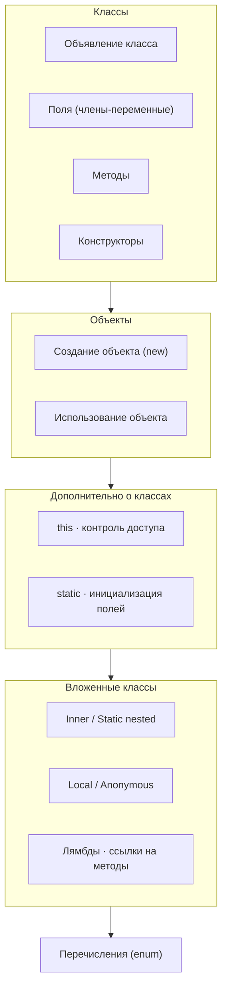
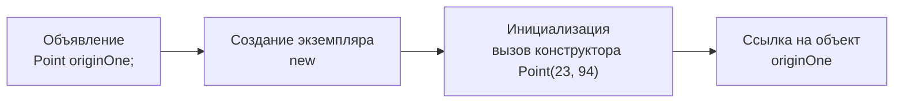
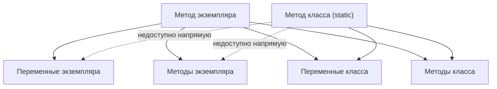
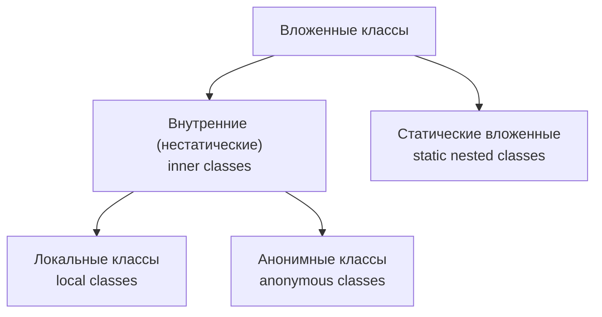
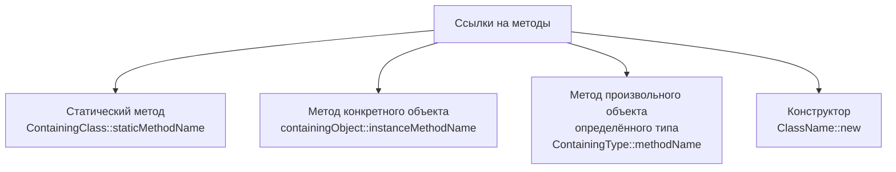

# Урок 3. Классы и объекты

**Трейл:** Learning the Java Language · **Оригинал:** [Classes and Objects](https://docs.oracle.com/javase/tutorial/java/javaOO/index.html)
**Связанные области:** [[01-core-java-syntax-oop]] · **Вопросы:** core-java

> Перевод официального руководства Oracle (The Java Tutorials, JDK 8). Объединяет все
> страницы урока *Classes and Objects*: определение классов, объявление полей, методов и
> конструкторов, передача аргументов, создание и использование объектов, дополнительные
> возможности классов (`this`, контроль доступа, статические члены, инициализация полей),
> вложенные классы, локальные и анонимные классы, лямбда-выражения, ссылки на методы и
> перечисления (enum).

Зная основы языка Java, вы можете научиться писать собственные классы. В этом уроке
рассказывается, как определять классы (включая объявление полей, методов и конструкторов),
как создавать из классов объекты и пользоваться ими, а также как вкладывать классы друг в
друга и работать с перечислениями.



## Классы

### Объявление классов

**Объявление класса** (*class declaration*) определяет класс. Тело класса (область между
фигурными скобками) содержит весь код, обеспечивающий жизненный цикл объектов, создаваемых из
класса: конструкторы, объявления полей и методы.

Минимальная форма объявления:

```java
class MyClass {
    // объявления полей, конструкторов
    // и методов
}
```

Расширенная форма — с указанием суперкласса и реализуемого интерфейса:

```java
class MyClass extends MySuperClass implements YourInterface {
    // объявления полей, конструкторов
    // и методов
}
```

Это означает, что `MyClass` является подклассом `MySuperClass` и реализует интерфейс
`YourInterface`.

Объявление класса может включать следующие компоненты **в указанном порядке**:

1. **Модификаторы** (*modifiers*) — такие как `public`, `private` и другие. (Модификатор
   `private` можно применять только к вложенным классам.)
2. **Имя класса** — по соглашению с заглавной первой буквой.
3. **Суперкласс** (необязательно) — имя класса-родителя, которому предшествует ключевое слово
   `extends`. Класс может расширять только один родительский класс.
4. **Интерфейсы** (необязательно) — список интерфейсов через запятую, реализуемых данным
   классом, которому предшествует ключевое слово `implements`. Класс может реализовывать
   несколько интерфейсов.
5. **Тело класса** (*class body*) — заключённое в фигурные скобки `{}`.

Модификаторы доступа (`public`, `private`) определяют, какие другие классы могут обращаться к
данному классу. Ключевые слова `extends` и `implements` подробно разбираются в уроке об
интерфейсах и наследовании.

### Объявление полей (членов-переменных)

В языке Java различают три вида переменных:

- **поля** (*fields*) — члены-переменные класса;
- **локальные переменные** (*local variables*) — переменные внутри метода или блока кода;
- **параметры** (*parameters*) — переменные в объявлениях методов.

Объявление поля состоит из трёх компонентов в указанном порядке:

1. ноль или более модификаторов (например, `public` или `private`);
2. тип поля;
3. имя поля.

Пример для класса `Bicycle`:

```java
public int cadence;
public int gear;
public int speed;
```

Все три поля имеют тип `int` и помечены `public`, что делает их доступными любому объекту,
который может обращаться к этому классу.

**Модификаторы доступа.** Первый (самый левый) модификатор определяет, какие классы имеют
доступ к полю:

- `public` — поле доступно из всех классов;
- `private` — поле доступно только внутри своего класса.

В духе **инкапсуляции** (*encapsulation*) часто делают поля `private`, а доступ к ним
предоставляют через публичные методы доступа (getter/setter):

```java
public class Bicycle {

    private int cadence;
    private int gear;
    private int speed;

    public Bicycle(int startCadence, int startSpeed, int startGear) {
        gear = startGear;
        cadence = startCadence;
        speed = startSpeed;
    }

    public int getCadence() {
        return cadence;
    }

    public void setCadence(int newValue) {
        cadence = newValue;
    }

    public int getGear() {
        return gear;
    }

    public void setGear(int newValue) {
        gear = newValue;
    }

    public int getSpeed() {
        return speed;
    }

    public void applyBrake(int decrement) {
        speed -= decrement;
    }

    public void speedUp(int increment) {
        speed += increment;
    }
}
```

Каждая переменная должна иметь тип — примитивный (`int`, `float`, `boolean` и т. д.) или
ссылочный (строки, массивы, объекты).

**Соглашения об именовании.** Имена полей, локальных переменных и параметров подчиняются одним
и тем же правилам. Имена классов начинаются с заглавной буквы; имена методов — с глагола в
нижнем регистре.

### Определение методов

Объявление метода состоит из **шести компонентов** в указанном порядке:

1. **Модификаторы** — `public`, `private` и другие.
2. **Тип возвращаемого значения** — тип данных возвращаемого значения или `void`, если метод
   ничего не возвращает.
3. **Имя метода** — подчиняется правилам имён полей с дополнительными соглашениями.
4. **Список параметров в скобках** — входные параметры через запятую с указанием типов, в
   круглых скобках `()`. Если параметров нет — пустые скобки `()`.
5. **Список исключений** (*exception list*) — рассматривается в последующих уроках.
6. **Тело метода** — код в фигурных скобках `{}`, включая объявления локальных переменных.

Пример:

```java
public double calculateAnswer(double wingSpan, int numberOfEngines,
                              double length, double grossTons) {
    // здесь выполняется вычисление
}
```

Обязательными элементами объявления метода являются только тип возвращаемого значения, имя
метода, пара скобок `()` и тело `{}`.

**Сигнатура метода** (*method signature*) состоит из имени метода и типов его параметров (тип
возвращаемого значения в сигнатуру не входит). Пример сигнатуры:

```
calculateAnswer(double, int, double, double)
```

**Соглашения об именовании.** Имя метода — это глагол в нижнем регистре либо составное имя,
начинающееся с глагола в нижнем регистре, причём второе и последующие слова пишутся с заглавной
буквы (camelCase): `run`, `runFast`, `getBackground`, `getFinalData`, `compareTo`, `setX`,
`isEmpty`.

**Перегрузка методов** (*overloading*). Методы могут иметь одинаковое имя, если у них разные
списки параметров. Компилятор Java различает методы по числу и типам аргументов:

```java
public class DataArtist {
    public void draw(String s) {
        // ...
    }
    public void draw(int i) {
        // ...
    }
    public void draw(double f) {
        // ...
    }
    public void draw(int i, double f) {
        // ...
    }
}
```

Перегруженные методы должны отличаться числом и (или) типами параметров. Нельзя объявить два
метода с одинаковым именем и одинаковым числом и типами параметров — компилятор не сможет их
различить. Тип возвращаемого значения **не** учитывается при различении методов.

> Перегрузкой следует пользоваться умеренно: она может сильно ухудшить читаемость кода.

### Конструкторы

Класс содержит **конструкторы** (*constructors*), которые вызываются при создании объектов из
класса-шаблона. Объявление конструктора похоже на объявление метода, но конструктор носит имя
класса и не имеет типа возвращаемого значения.

```java
public Bicycle(int startCadence, int startSpeed, int startGear) {
    gear = startGear;
    cadence = startCadence;
    speed = startSpeed;
}
```

Создание объекта с помощью конструктора:

```java
Bicycle myBike = new Bicycle(30, 0, 8);
```

Выражение `new Bicycle(30, 0, 8)` выделяет память под объект и инициализирует его поля.

**Перегрузка конструкторов.** Класс может иметь несколько конструкторов с разными списками
аргументов, например конструктор без аргументов:

```java
public Bicycle() {
    gear = 1;
    cadence = 10;
    speed = 0;
}
```

Вызов конструктора без аргументов:

```java
Bicycle yourBike = new Bicycle();
```

Оба конструктора могут сосуществовать в классе `Bicycle`, потому что у них разные списки
аргументов. Платформа Java различает конструкторы по числу и типам аргументов. Нельзя написать
два конструктора с одинаковым числом и типами аргументов — это вызовет ошибку компиляции.

**Конструктор по умолчанию** (*default constructor*). Предоставлять конструкторы для класса
необязательно. Если вы их не объявите, компилятор автоматически создаст конструктор по
умолчанию — без аргументов. Этот конструктор вызывает конструктор суперкласса без аргументов.
Если у класса нет явного суперкласса, он неявно наследуется от `Object` (у которого есть
конструктор без аргументов).

В объявлении конструктора можно использовать модификаторы доступа, чтобы управлять тем, какие
другие классы могут его вызвать. Если другой класс не может вызвать конструктор `MyClass`, он
не может напрямую создавать объекты `MyClass`.

### Передача информации методу или конструктору

**Параметры** — это переменные, перечисленные в объявлении метода, а **аргументы**
(*arguments*) — это фактические значения, передаваемые при вызове метода. Аргументы должны
соответствовать параметрам по типу и порядку.

Пример метода с четырьмя параметрами:

```java
public double computePayment(
        double loanAmt,
        double rate,
        double futureValue,
        int numPeriods) {
    double interest = rate / 100.0;
    double partial1 = Math.pow((1 + interest), -numPeriods);
    double denominator = (1 - partial1) / interest;
    double answer = (-loanAmt / denominator)
                    - ((futureValue * partial1) / denominator);
    return answer;
}
```

**Типы параметров.** В качестве параметра можно использовать любой тип данных — как примитивный
(`double`, `float`, `int` и т. д.), так и ссылочный (объекты, массивы):

```java
public Polygon polygonFrom(Point[] corners) {
    // тело метода
}
```

**Произвольное число аргументов (varargs).** Когда заранее неизвестно, сколько аргументов будет
передано, используют переменное число аргументов (*varargs*). Синтаксис — `Тип... имяПараметра`:

```java
public Polygon polygonFrom(Point... corners) {
    int numberOfSides = corners.length;
    double squareOfSide1 = (corners[1].x - corners[0].x)
                            * (corners[1].x - corners[0].x)
                            + (corners[1].y - corners[0].y)
                            * (corners[1].y - corners[0].y);
    double lengthOfSide1 = Math.sqrt(squareOfSide1);
    // тело метода продолжается
}
```

Внутри метода такой параметр обрабатывается как массив. Метод можно вызывать с любым числом
аргументов. Хорошо известный пример varargs — метод `printf`:

```java
public PrintStream printf(String format, Object... args)
```

```java
System.out.printf("%s: %d, %s%n", name, idnum, address);
System.out.printf("%s: %d, %s, %s, %s%n", name, idnum, address, phone, email);
```

**Имена параметров** должны быть уникальны в области видимости метода или конструктора: имя
параметра не может совпадать с именами других параметров и локальных переменных. Однако имя
параметра может совпадать с именем поля (затенять его) — это допускается, но по соглашению так
делают только в конструкторах и сеттерах. Чтобы обратиться к затенённому полю, используют `this`.

**Передача аргументов примитивных типов.** Примитивы передаются **по значению** (*by value*):
изменение параметра внутри метода не затрагивает исходную переменную.

```java
public class PassPrimitiveByValue {
    public static void main(String[] args) {
        int x = 3;
        passMethod(x);  // передаём x по значению
        // после вызова passMethod значение x по-прежнему равно 3
        System.out.println("After invoking passMethod, x = " + x);
    }

    public static void passMethod(int p) {
        p = 10;  // меняется только локальная копия
    }
}
```

Вывод: `After invoking passMethod, x = 3`.

**Передача аргументов ссылочных типов.** Ссылки тоже передаются по значению, то есть копируется
сама ссылка. При этом, если поля объекта доступны, их можно изменить:

```java
public void moveCircle(Circle circle, int deltaX, int deltaY) {
    // изменяем поля объекта, на который указывает ссылка
    circle.setX(circle.getX() + deltaX);
    circle.setY(circle.getY() + deltaY);

    // переприсваиваем локальную ссылку (на ссылку вызывающего кода это не влияет)
    circle = new Circle(0, 0);
}

// вызов
moveCircle(myCircle, 23, 56);
```

Координаты `x` и `y` объекта `myCircle` изменятся на 23 и 56 (изменения сохранятся после
возврата). Локальная переменная `circle` будет переприсвоена на новый объект, но `myCircle`
по-прежнему ссылается на исходный объект. Итог: изменения состояния объекта сохраняются, а
переприсваивание ссылки-параметра не влияет на ссылку вызывающего кода.

## Объекты

### Создание объектов

Создание объекта состоит из трёх частей:

1. **Объявление** (*declaration*) — связывание имени переменной с типом объекта.
2. **Создание экземпляра** (*instantiation*) — использование оператора `new`.
3. **Инициализация** (*initialization*) — вызов конструктора для инициализации нового объекта.

```java
Point originOne = new Point(23, 94);
Rectangle rectOne = new Rectangle(originOne, 100, 200);
Rectangle rectTwo = new Rectangle(50, 100);
```



**1. Объявление переменной-ссылки.** Общий синтаксис: `тип имя;`. Например:

```java
Point originOne;
```

Простое объявление переменной-ссылки **не** создаёт объект: значение переменной не определено,
пока ей не присвоен объект. Изначально такая переменная не ссылается ни на что (значение
`null`). Чтобы создать реальный объект, нужен оператор `new`.

**2. Создание экземпляра класса.** Оператор `new`:

- выделяет память под новый объект;
- возвращает ссылку на эту память;
- вызывает конструктор объекта;
- требует вызов конструктора в качестве аргумента.

```java
Point originOne = new Point(23, 94);
```

Ссылку можно использовать и напрямую, без присваивания переменной:

```java
int height = new Rectangle().height;
```

**3. Инициализация объекта конструктором.** Пример класса `Point`:

```java
public class Point {
    public int x = 0;
    public int y = 0;

    // конструктор
    public Point(int a, int b) {
        x = a;
        y = b;
    }
}
```

Пример класса `Rectangle` с четырьмя конструкторами:

```java
public class Rectangle {
    public int width = 0;
    public int height = 0;
    public Point origin;

    // четыре конструктора с разными сигнатурами
    public Rectangle() {
        origin = new Point(0, 0);
    }

    public Rectangle(Point p) {
        origin = p;
    }

    public Rectangle(int w, int h) {
        origin = new Point(0, 0);
        width = w;
        height = h;
    }

    public Rectangle(Point p, int w, int h) {
        origin = p;
        width = w;
        height = h;
    }

    // методы
    public void move(int x, int y) {
        origin.x = x;
        origin.y = y;
    }

    public int getArea() {
        return width * height;
    }
}
```

Несколько конструкторов позволяют по-разному инициализировать объект. Конструкторы должны иметь
разные сигнатуры (разное число или типы аргументов); компилятор различает их именно по этому.

```java
Rectangle rectOne = new Rectangle(originOne, 100, 200);  // Point + два int
Rectangle rectTwo = new Rectangle(50, 100);              // два int
Rectangle rect = new Rectangle();                        // без аргументов
```

### Использование объектов

**Обращение к полям объекта.** Внутри собственного класса к полю можно обращаться по простому
имени:

```java
System.out.println("Width and height are: " + width + ", " + height);
```

Из кода вне класса объекта нужно использовать ссылку на объект (или выражение), затем оператор
«точка» (`.`) и простое имя поля:

```
objectReference.fieldName
```

```java
System.out.println("Width of rectOne: " + rectOne.width);
System.out.println("Height of rectOne: " + rectOne.height);
```

Использование простых имён (`width`, `height`) извне класса приводит к ошибке компиляции.
Каждый объект одного типа имеет собственную копию полей экземпляра: у `rectOne` и `rectTwo`
свои отдельные поля `origin`, `width` и `height`.

Можно обращаться к полю и через оператор `new`:

```java
int height = new Rectangle().height;
```

Здесь создаётся новый объект `Rectangle`, после чего сразу читается его поле `height`. После
выполнения этой строки ссылки на объект не остаётся, и он становится доступен для сборки мусора.

**Вызов методов объекта.** Синтаксис:

```
objectReference.methodName(argumentList)
```

или без аргументов:

```
objectReference.methodName()
```

```java
System.out.println("Area of rectOne: " + rectOne.getArea());
rectTwo.move(40, 72);
```

Метод можно вызвать и непосредственно через `new`:

```java
new Rectangle(100, 50).getArea()
```

Если метод возвращает значение, его можно присвоить переменной, использовать в выражении,
принимать решения или управлять циклами:

```java
int areaOfRectangle = new Rectangle(100, 50).getArea();
```

**Сборщик мусора (garbage collector).** Платформа Java управляет памятью автоматически — в
отличие от некоторых других объектно-ориентированных языков, требующих явного уничтожения
объектов.

- Объект становится доступным для сборки мусора, когда на него больше нет ссылок.
- Ссылки автоматически теряются, когда переменные выходят из области видимости.
- Ссылку можно явно отбросить, присвоив переменной значение `null`:

```java
rectOne = null;
```

Перед тем как объект станет доступен для сборки мусора, должны быть отброшены все ссылки на
него (на один объект может быть несколько ссылок). В среде выполнения Java есть сборщик мусора,
который периодически освобождает память, занятую объектами без ссылок; он работает автоматически.

## Дополнительно о классах

### Возврат значения методом

Метод возвращает управление вызвавшему коду, когда:

- выполнены все его инструкции; либо
- достигнута инструкция `return`; либо
- выброшено исключение, — что наступит раньше.

Тип возвращаемого значения объявляется в заголовке метода, а инструкция `return` используется в
теле.

**Методы `void`** не возвращают значения и не требуют инструкции `return`, но могут
использовать `return;` для досрочного выхода. Попытка вернуть значение из метода `void` вызовет
ошибку компиляции.

Методы, отличные от `void`, должны содержать инструкцию `return` с соответствующим значением:

```java
return returnValue;
```

Тип возвращаемого значения должен совпадать с объявленным типом. Нельзя вернуть целое число из
метода, объявленного как возвращающий `boolean`.

Пример возврата примитива:

```java
// метод для вычисления площади прямоугольника
public int getArea() {
    return width * height;
}
```

Метод может возвращать и ссылочный тип (объект):

```java
public Bicycle seeWhosFastest(Bicycle myBike, Bicycle yourBike,
                              Environment env) {
    Bicycle fastest;
    // код, определяющий, какой велосипед быстрее, исходя из передачи и
    // частоты вращения педалей каждого велосипеда и окружения (рельеф и ветер)
    return fastest;
}
```

**Возврат класса или интерфейса.** Когда тип возвращаемого значения — имя класса, возвращаемый
объект должен быть либо точно этого класса, либо его подклассом. Например, для иерархии
`Object → Number → ImaginaryNumber` метод

```java
public Number returnANumber() {
    // ...
}
```

может вернуть `ImaginaryNumber` (подкласс `Number`), но не может вернуть `Object` (который не
обязательно является `Number`).

**Ковариантный тип возвращаемого значения** (*covariant return type*). При переопределении метода
можно объявить, что он возвращает подкласс исходного типа:

```java
public ImaginaryNumber returnANumber() {
    // ...
}
```

В качестве типа возвращаемого значения можно использовать и имя интерфейса — тогда возвращаемый
объект должен реализовывать этот интерфейс.

### Ключевое слово `this`

Внутри метода экземпляра или конструктора `this` — это ссылка на **текущий объект**, то есть
объект, чей метод или конструктор выполняется. Через `this` можно обратиться к любому члену
текущего объекта.

**`this` с полем.** Чаще всего `this` используют, когда поле затеняется параметром метода или
конструктора:

```java
public class Point {
    public int x = 0;
    public int y = 0;

    // конструктор
    public Point(int x, int y) {
        this.x = x;
        this.y = y;
    }
}
```

Каждый параметр конструктора затеняет одноимённое поле объекта. Внутри конструктора `x` — это
локальная копия первого аргумента; чтобы обратиться к полю `x` класса `Point`, нужно
использовать `this.x`.

**`this` с конструктором (явный вызов конструктора).** Внутри конструктора можно с помощью
`this` вызвать **другой конструктор того же класса** — это называется явным вызовом конструктора
(*explicit constructor invocation*):

```java
public class Rectangle {
    private int x, y;
    private int width, height;

    // конструктор без аргументов
    public Rectangle() {
        this(0, 0, 1, 1);
    }

    // конструктор с двумя аргументами
    public Rectangle(int width, int height) {
        this(0, 0, width, height);
    }

    // конструктор с четырьмя аргументами
    public Rectangle(int x, int y, int width, int height) {
        this.x = x;
        this.y = y;
        this.width = width;
        this.height = height;
    }
}
```

Конструктор без аргументов вызывает конструктор с четырьмя аргументами, передавая значения по
умолчанию (0, 0, 1, 1); конструктор с двумя аргументами также делегирует выполнение
конструктору с четырьмя аргументами. Компилятор определяет, какой конструктор вызвать, по числу
и типам аргументов.

> Если в конструкторе присутствует явный вызов другого конструктора, он должен быть **первой**
> инструкцией.

### Управление доступом к членам класса

Существует два уровня контроля доступа:

- **верхний уровень** (для классов): `public` или доступ в пределах пакета (без модификатора);
- **уровень членов** (для полей и методов): `public`, `private`, `protected` или доступ в
  пределах пакета (без модификатора).

Для **классов верхнего уровня**:

- `public` — класс виден всем классам повсюду;
- без модификатора (*package-private*) — класс виден только внутри своего пакета.

Для **членов** (полей и методов):

- `public` — доступен отовсюду;
- `protected` — доступен внутри своего пакета **и** подклассам в других пакетах;
- без модификатора (*package-private*) — доступен только внутри своего пакета;
- `private` — доступен только внутри своего класса.

Таблица уровней доступа:

| Модификатор    | Класс | Пакет | Подкласс | Весь мир |
|----------------|:-----:|:-----:|:--------:|:--------:|
| `public`       |  да   |  да   |   да     |   да     |
| `protected`    |  да   |  да   |   да     |   нет    |
| без модификатора |  да |  да   |   нет    |   нет    |
| `private`      |  да   |  нет  |   нет    |   нет    |

Столбцы означают: **Класс** — сам класс имеет доступ к своим членам; **Пакет** — доступ есть у
других классов того же пакета; **Подкласс** — доступ есть у подклассов вне пакета; **Весь мир**
— доступ есть у всех остальных классов.

**Советы по выбору уровня доступа:**

- используйте самый строгий уровень доступа, который имеет смысл; по умолчанию выбирайте
  `private`, если нет веских причин поступить иначе;
- избегайте `public`-полей (кроме констант): публичные поля привязывают к конкретной реализации
  и ограничивают гибкость изменения кода — предпочитайте методы доступа;
- используйте `protected`, когда предполагаете наследование;
- используйте `public` только для предназначенного публичного API.

### Понимание членов класса (`static`)

Ключевое слово `static` создаёт члены уровня класса (поля и методы), принадлежащие самому
классу, а не отдельным экземплярам.

**Переменные класса (статические поля).** Поля, объявленные с модификатором `static`, связаны с
классом, а не с отдельными объектами. Все экземпляры разделяют единственную копию, хранящуюся в
одном месте памяти. Статические поля используют для данных, общих для всех объектов класса.

```java
public class Bicycle {
    private int cadence;
    private int gear;
    private int speed;
    private int id;

    // переменная класса — общая для всех экземпляров Bicycle
    private static int numberOfBicycles = 0;
}
```

К статическому полю обращаются через имя класса (рекомендуется):

```java
Bicycle.numberOfBicycles
```

Обращение через ссылку на объект (`myBike.numberOfBicycles`) тоже работает, но не приветствуется,
так как затемняет смысл.

Пример: назначить каждому объекту `Bicycle` уникальный серийный номер. Поле `id` уникально для
каждого велосипеда, а поле класса `numberOfBicycles` хранит общее число созданных велосипедов:

```java
public Bicycle(int startCadence, int startSpeed, int startGear) {
    gear = startGear;
    cadence = startCadence;
    speed = startSpeed;

    // увеличиваем переменную класса и назначаем уникальный идентификатор
    id = ++numberOfBicycles;
}

public int getID() {
    return id;
}
```

**Методы класса (статические методы).** Объявляются с модификатором `static` и могут вызываться
без создания экземпляра. Вызывать их рекомендуется через имя класса:

```
ClassName.methodName(args)
```

```java
public static int getNumberOfBicycles() {
    return numberOfBicycles;
}
```

**Константы (`static final`).** Сочетание `static` и `final` создаёт константу — поле,
значение которого нельзя изменить:

```java
static final double PI = 3.141592653589793;
```

Переприсвоить константу нельзя (попытка вызовет ошибку компиляции). По соглашению имена констант
пишут заглавными буквами, разделяя слова подчёркиванием. Если значение известно во время
компиляции, компилятор подставляет его вместо имени константы во всём коде (**константа времени
компиляции**). Если реальное значение константы изменится, зависимые классы нужно
перекомпилировать.

**Правила доступа: члены экземпляра против членов класса:**



- методы экземпляра имеют прямой доступ ко всему: к переменным и методам экземпляра, к
  переменным и методам класса;
- методы класса имеют прямой доступ только к членам класса; к членам экземпляра напрямую
  обратиться нельзя (нужна ссылка на объект), и в них нельзя использовать `this` (нет
  экземпляра, на который можно сослаться).

Статический метод для доступа к статическому полю:

```java
public static int getNumberOfBicycles() {
    return numberOfBicycles;
}
```

### Инициализация полей

**1. Инициализация при объявлении.** Начальное значение можно задать прямо в объявлении поля:

```java
public class BedAndBreakfast {
    // инициализировать значением 10
    public static int capacity = 10;

    // инициализировать значением false
    private boolean full = false;
}
```

Этот способ подходит только для простой инициализации. Для сложной логики (обработка ошибок,
циклы, условия) нужны другие приёмы.

**2. Статические блоки инициализации.** Для переменных класса со сложной логикой инициализации
используют статический блок инициализации (*static initialization block*):

```java
static {
    // здесь располагается необходимый код инициализации
}
```

Блок заключён в фигурные скобки `{ }` и предваряется ключевым словом `static`. Класс может иметь
несколько таких блоков; они выполняются в порядке следования в исходном коде при загрузке класса.

**3. Закрытый статический метод.** Вместо статического блока можно использовать закрытый
статический метод — его удобно переиспользовать для повторной инициализации:

```java
class Whatever {
    public static varType myVar = initializeClassVariable();

    private static varType initializeClassVariable() {
        // здесь располагается код инициализации
    }
}
```

**4. Блоки инициализации экземпляра.** Для переменных экземпляра используют блоки инициализации
(без ключевого слова `static`):

```java
{
    // здесь располагается необходимый код инициализации
}
```

Компилятор Java копирует блоки инициализации экземпляра в **каждый** конструктор, что удобно для
общего кода инициализации нескольких конструкторов.

**5. Final-методы для инициализации экземпляра.** Для инициализации переменной экземпляра можно
использовать final-метод:

```java
class Whatever {
    private varType myVar = initializeInstanceVariable();

    protected final varType initializeInstanceVariable() {
        // здесь располагается код инициализации
    }
}
```

Метод должен быть `final`, чтобы его нельзя было переопределить в подклассе. Это особенно
полезно, когда подклассы могут захотеть переиспользовать метод инициализации.

### Сводка по созданию и использованию классов и объектов

- **Объявление класса** именует класс и заключает тело класса в фигурные скобки; имени класса
  могут предшествовать модификаторы. Тело содержит поля, методы и конструкторы. Класс хранит
  состояние в полях и реализует поведение в методах. Конструкторы, инициализирующие новый
  экземпляр, носят имя класса и выглядят как методы без типа возвращаемого значения.
- **Контроль доступа** к классам и членам осуществляется одинаково — модификатором доступа
  (например, `public`) в объявлении.
- Переменную класса или метод класса задают ключевым словом `static`; член без `static` неявно
  является членом экземпляра. Переменные класса общие для всех экземпляров и доступны через имя
  класса или ссылку на экземпляр. У каждого экземпляра своя копия переменных экземпляра,
  доступных через ссылку на экземпляр.
- **Объект создают** оператором `new` и конструктором; `new` возвращает ссылку на созданный
  объект, которую можно присвоить переменной или использовать напрямую.
- Доступные извне класса члены экземпляра используют через **квалифицированное имя**:
  `objectReference.variableName` для поля и `objectReference.methodName(argumentList)` (или
  `objectReference.methodName()`) для метода.
- **Сборщик мусора** автоматически удаляет неиспользуемые объекты — те, на которые программа
  больше не хранит ссылок. Ссылку можно явно отбросить, присвоив переменной `null`.

## Вложенные классы

**Вложенный класс** (*nested class*) — это класс, определённый внутри другого класса:

```java
class OuterClass {
    // ...
    class NestedClass {
        // ...
    }
}
```

Вложенные классы делятся на две категории:

- **нестатические вложенные классы** — это **внутренние классы** (*inner classes*);
- **статические вложенные классы** (*static nested classes*).



**Внутренние классы (нестатические):**

- связаны с **экземпляром** охватывающего класса;
- имеют прямой доступ ко всем членам охватывающего класса, включая `private`;
- сами **не могут** объявлять статические члены (кроме констант);
- создаются в контексте экземпляра внешнего класса:

```java
OuterClass outerObject = new OuterClass();
OuterClass.InnerClass innerObject = outerObject.new InnerClass();
```

**Статические вложенные классы:**

- связаны с самим **классом**, а не с экземпляром;
- **не** имеют прямого доступа к переменным и методам экземпляра охватывающего класса (нужна
  ссылка), но имеют доступ к статическим членам;
- могут объявлять статические члены;
- ведут себя как класс верхнего уровня, вложенный лишь для удобства упаковки:

```java
StaticNestedClass staticNestedObject = new StaticNestedClass();
```

**Зачем использовать вложенные классы:**

1. **Логическая группировка** — если класс нужен только в одном месте, его помещают внутрь
   использующего класса.
2. **Усиление инкапсуляции** — позволяет скрывать вспомогательные классы и давать им доступ к
   приватным членам, который иначе был бы недоступен.
3. **Читаемость и сопровождаемость** — код располагается ближе к месту его использования.

Пример различий между внутренним и статическим вложенным классом:

```java
public class OuterClass {

    String outerField = "Outer field";
    static String staticOuterField = "Static outer field";

    class InnerClass {
        void accessMembers() {
            System.out.println(outerField);        // прямой доступ
            System.out.println(staticOuterField);  // прямой доступ
        }
    }

    static class StaticNestedClass {
        void accessMembers(OuterClass outer) {
            // System.out.println(outerField);     // ОШИБКА: нет доступа к полю экземпляра
            System.out.println(outer.outerField);   // доступ через ссылку
            System.out.println(staticOuterField);   // прямой доступ к статическому полю
        }
    }

    public static void main(String[] args) {
        System.out.println("Inner class:");
        OuterClass outerObject = new OuterClass();
        OuterClass.InnerClass innerObject = outerObject.new InnerClass();
        innerObject.accessMembers();

        System.out.println("\nStatic nested class:");
        StaticNestedClass staticNestedObject = new StaticNestedClass();
        staticNestedObject.accessMembers(outerObject);
    }
}
```

**Затенение (shadowing).** Если объявление во внутренней области видимости имеет то же имя, что и
объявление в охватывающей области, оно затеняет внешнее. Для доступа к затенённым переменным
используют `this` (для непосредственно охватывающего класса) и `ИмяКласса.this` (для внешних
классов):

```java
public class ShadowTest {

    public int x = 0;

    class FirstLevel {
        public int x = 1;

        void methodInFirstLevel(int x) {  // x затеняет обе внешние переменные
            System.out.println("x = " + x);                                 // 23 (параметр)
            System.out.println("this.x = " + this.x);                       // 1 (FirstLevel)
            System.out.println("ShadowTest.this.x = " + ShadowTest.this.x); // 0 (ShadowTest)
        }
    }

    public static void main(String... args) {
        ShadowTest st = new ShadowTest();
        ShadowTest.FirstLevel fl = st.new FirstLevel();
        fl.methodInFirstLevel(23);
    }
}
```

Вывод:

```
x = 23
this.x = 1
ShadowTest.this.x = 0
```

> **Сериализация** внутренних классов (включая локальные и анонимные) настоятельно не
> рекомендуется. При компиляции внутренних классов компилятор создаёт синтетические конструкции
> (классы, методы, поля), которых нет в исходном коде; они различаются между реализациями
> компиляторов, из-за чего возможны проблемы совместимости при десериализации в другой
> реализации JRE.

### Пример внутреннего класса

Пример: класс `DataStructure` с внутренним классом-итератором `EvenIterator`, печатающим
элементы массива с чётными индексами.

```java
public class DataStructure {

    // создаём массив
    private final static int SIZE = 15;
    private int[] arrayOfInts = new int[SIZE];

    public DataStructure() {
        // заполняем массив возрастающими целыми значениями
        for (int i = 0; i < SIZE; i++) {
            arrayOfInts[i] = i;
        }
    }

    public void printEven() {

        // печатаем значения по чётным индексам массива
        DataStructureIterator iterator = this.new EvenIterator();
        while (iterator.hasNext()) {
            System.out.print(iterator.next() + " ");
        }
        System.out.println();
    }

    interface DataStructureIterator extends java.util.Iterator<Integer> { }

    // внутренний класс реализует интерфейс DataStructureIterator,
    // который, в свою очередь, расширяет интерфейс Iterator<Integer>
    private class EvenIterator implements DataStructureIterator {

        // начинаем обход массива с начала
        private int nextIndex = 0;

        public boolean hasNext() {

            // проверяем, не является ли текущий элемент последним в массиве
            return (nextIndex <= SIZE - 1);
        }

        public Integer next() {

            // запоминаем значение по чётному индексу массива
            Integer retValue = Integer.valueOf(arrayOfInts[nextIndex]);

            // переходим к следующему чётному элементу
            nextIndex += 2;
            return retValue;
        }
    }

    public static void main(String s[]) {

        // заполняем массив целыми значениями и печатаем только значения по чётным индексам
        DataStructure ds = new DataStructure();
        ds.printEven();
    }
}
```

Вывод:

```
0 2 4 6 8 10 12 14
```

Внутренний класс `EvenIterator` имеет прямой доступ к полю `arrayOfInts` внешнего класса
`DataStructure` — ключевая особенность внутренних классов. К внутренним классам применимы те же
модификаторы доступа, что и к другим членам класса (`private`, `protected`, `public`, а также
доступ в пределах пакета по умолчанию). Внутренние классы широко применяются как
вспомогательные классы и при обработке событий в графических интерфейсах.

### Локальные классы

**Локальные классы** (*local classes*) — это классы, определённые внутри блока (группы инструкций
в фигурных скобках). Обычно их объявляют в теле метода, но можно и в цикле `for`, в блоке `if` и
в любом другом блоке.

```java
public class LocalClassExample {

    static String regularExpression = "[^0-9]";

    public static void validatePhoneNumber(
            String phoneNumber1, String phoneNumber2) {

        final int numberLength = 10;

        class PhoneNumber {

            String formattedPhoneNumber = null;

            PhoneNumber(String phoneNumber) {
                String currentNumber = phoneNumber.replaceAll(
                        regularExpression, "");
                if (currentNumber.length() == numberLength)
                    formattedPhoneNumber = currentNumber;
                else
                    formattedPhoneNumber = null;
            }

            public String getNumber() {
                return formattedPhoneNumber;
            }

            // JDK 8+: можно обращаться к параметрам метода
            public void printOriginalNumbers() {
                System.out.println("Original numbers are " + phoneNumber1 +
                        " and " + phoneNumber2);
            }
        }

        PhoneNumber myNumber1 = new PhoneNumber(phoneNumber1);
        PhoneNumber myNumber2 = new PhoneNumber(phoneNumber2);

        if (myNumber1.getNumber() == null)
            System.out.println("First number is invalid");
        else
            System.out.println("First number is " + myNumber1.getNumber());
        if (myNumber2.getNumber() == null)
            System.out.println("Second number is invalid");
        else
            System.out.println("Second number is " + myNumber2.getNumber());
    }

    public static void main(String... args) {
        validatePhoneNumber("123-456-7890", "456-7890");
    }
}
```

Вывод:

```
First number is 1234567890
Second number is invalid
```

**Доступ к членам охватывающего класса.** Локальный класс имеет доступ к членам охватывающего
класса (в примере конструктор `PhoneNumber` обращается к полю `LocalClassExample.regularExpression`).

**Захват локальных переменных.** Локальный класс может обращаться только к тем локальным
переменным, значение которых не меняется после инициализации, — то есть к `final` или
**фактически final** (*effectively final*) переменным. Если переменной присвоить новое значение
после инициализации, она перестаёт быть фактически final, и компилятор выдаст ошибку: «local
variables referenced from an inner class must be final or effectively final».

Начиная с Java SE 8, локальные классы могут обращаться к параметрам метода (см. метод
`printOriginalNumbers` выше).

**Затенение** работает так же, как во внутренних классах: объявления в локальном классе затеняют
одноимённые объявления охватывающей области.

**Ограничения.** Локальные классы не могут объявлять статические члены, кроме **константных
переменных** (*constant variables*). Константная переменная — это переменная примитивного типа
или `String`, объявленная как `final` и инициализированная константным выражением времени
компиляции. Также локальные классы не могут объявлять интерфейсы (интерфейсы по своей природе
статичны).

```java
public void sayGoodbyeInEnglish() {
    class EnglishGoodbye {
        public static final String farewell = "Bye bye";  // допустимо (константа)
        public void sayGoodbye() {
            System.out.println(farewell);
        }
    }
    EnglishGoodbye myEnglishGoodbye = new EnglishGoodbye();
    myEnglishGoodbye.sayGoodbye();
}
```

### Анонимные классы

**Анонимные классы** (*anonymous classes*) позволяют одновременно объявить и создать экземпляр
класса без присвоения ему имени. Это **выражения** (а не объявления), удобные, когда локальный
класс нужен лишь однажды.

```java
public class HelloWorldAnonymousClasses {

    interface HelloWorld {
        public void greet();
        public void greetSomeone(String someone);
    }

    public void sayHello() {

        // локальный класс (с именем)
        class EnglishGreeting implements HelloWorld {
            String name = "world";
            public void greet() {
                greetSomeone("world");
            }
            public void greetSomeone(String someone) {
                name = someone;
                System.out.println("Hello " + name);
            }
        }

        HelloWorld englishGreeting = new EnglishGreeting();

        // анонимный класс (без имени)
        HelloWorld frenchGreeting = new HelloWorld() {
            String name = "tout le monde";
            public void greet() {
                greetSomeone("tout le monde");
            }
            public void greetSomeone(String someone) {
                name = someone;
                System.out.println("Salut " + name);
            }
        };

        HelloWorld spanishGreeting = new HelloWorld() {
            String name = "mundo";
            public void greet() {
                greetSomeone("mundo");
            }
            public void greetSomeone(String someone) {
                name = someone;
                System.out.println("Hola, " + name);
            }
        };

        englishGreeting.greet();
        frenchGreeting.greetSomeone("Fred");
        spanishGreeting.greet();
    }

    public static void main(String... args) {
        HelloWorldAnonymousClasses myApp =
                new HelloWorldAnonymousClasses();
        myApp.sayHello();
    }
}
```

**Синтаксис выражения анонимного класса** состоит из:

1. оператора `new`;
2. имени интерфейса для реализации или класса для наследования (например, `HelloWorld`);
3. круглых скобок с аргументами конструктора (для интерфейса — пустые скобки `()`, так как у
   интерфейса нет конструкторов);
4. тела класса (допускаются объявления методов, но **не** инструкции).

Поскольку анонимный класс — это часть выражения, после закрывающей фигурной скобки ставится
точка с запятой.

**Доступ к локальным переменным и членам.** Анонимные классы имеют доступ к членам охватывающего
класса. К локальным переменным охватывающей области они могут обращаться только если те `final`
или фактически final. Объявления в анонимном классе затеняют одноимённые объявления охватывающей
области.

**Ограничения членов.** В анонимном классе **нельзя** объявлять статические инициализаторы и
вложенные интерфейсы; статические члены допустимы только если это константы; нельзя объявлять
конструкторы. **Можно** объявлять поля, дополнительные методы, блоки инициализации экземпляра и
локальные классы.

Для функциональных интерфейсов (с одним абстрактным методом) вместо анонимных классов
предпочтительны лямбда-выражения (Java 8+).

### Лямбда-выражения

Анонимные классы хорошо подходят для классов, которые нужны лишь один раз, но даже у них
синтаксис громоздок для интерфейса с единственным методом. **Лямбда-выражения** (*lambda
expressions*) позволяют выразить такую функциональность компактнее.

Руководство рассматривает развитие решения задачи (поиск членов социальной сети по критериям) —
от методов под каждый критерий к лямбдам и операциям над потоками. Класс `Person`:

```java
public class Person {
    public enum Sex {
        MALE, FEMALE
    }
    String name;
    LocalDate birthday;
    Sex gender;
    String emailAddress;

    public int getAge() {
        // ...
    }

    public void printPerson() {
        // ...
    }
}
```

**Критерий поиска в локальном классе.** Сначала критерий выносится в интерфейс `CheckPerson`:

```java
interface CheckPerson {
    boolean test(Person p);
}

public static void printPersons(List<Person> roster, CheckPerson tester) {
    for (Person p : roster) {
        if (tester.test(p)) {
            p.printPerson();
        }
    }
}
```

**Критерий в анонимном классе** — меньше шаблонного кода:

```java
printPersons(
    roster,
    new CheckPerson() {
        public boolean test(Person p) {
            return p.getGender() == Person.Sex.MALE
                && p.getAge() >= 18
                && p.getAge() <= 25;
        }
    }
);
```

**Критерий в лямбда-выражении.** Поскольку `CheckPerson` — функциональный интерфейс (один
абстрактный метод), анонимный класс заменяется лямбдой:

```java
printPersons(
    roster,
    (Person p) -> p.getGender() == Person.Sex.MALE
        && p.getAge() >= 18
        && p.getAge() <= 25
);
```

**Стандартные функциональные интерфейсы.** Вместо собственного `CheckPerson` можно использовать
стандартный интерфейс `Predicate<T>`:

```java
public static void printPersonsWithPredicate(
        List<Person> roster, Predicate<Person> tester) {
    for (Person p : roster) {
        if (tester.test(p)) {
            p.printPerson();
        }
    }
}

printPersonsWithPredicate(
    roster,
    p -> p.getGender() == Person.Sex.MALE
        && p.getAge() >= 18
        && p.getAge() <= 25
);
```

**Лямбды повсюду.** Действие над элементом параметризуют через `Consumer<T>`, преобразование —
через `Function<T,R>`, а сам метод делают обобщённым:

```java
public static <X, Y> void processElements(
        Iterable<X> source,
        Predicate<X> tester,
        Function<X, Y> mapper,
        Consumer<Y> block) {
    for (X p : source) {
        if (tester.test(p)) {
            Y data = mapper.apply(p);
            block.accept(data);
        }
    }
}

processElements(
    roster,
    p -> p.getGender() == Person.Sex.MALE
        && p.getAge() >= 18
        && p.getAge() <= 25,
    p -> p.getEmailAddress(),
    email -> System.out.println(email)
);
```

**Агрегатные операции (Stream API).** То же выражается ещё компактнее:

```java
roster
    .stream()
    .filter(
        p -> p.getGender() == Person.Sex.MALE
            && p.getAge() >= 18
            && p.getAge() <= 25)
    .map(p -> p.getEmailAddress())
    .forEach(email -> System.out.println(email));
```

**Синтаксис лямбда-выражений.** Лямбда состоит из:

1. формальных параметров через запятую в круглых скобках;
2. стрелки (`->`);
3. тела — одиночного выражения или блока инструкций.

```java
(parameters) -> expression
(parameters) -> { statements }
```

Типы параметров можно опустить — они выводятся компилятором (`(Person p) -> ...` эквивалентно
`p -> ...`). Если тело — одиночное выражение, его значение возвращается автоматически; если тело
— блок инструкций в фигурных скобках, для возврата значения нужна явная инструкция `return`. Для
вызова метода `void` фигурные скобки не требуются: `email -> System.out.println(email)`.

Пример лямбды с двумя параметрами:

```java
public class Calculator {
    interface IntegerMath {
        int operation(int a, int b);
    }

    public int operateBinary(int a, int b, IntegerMath op) {
        return op.operation(a, b);
    }

    public static void main(String... args) {
        Calculator myApp = new Calculator();
        IntegerMath addition = (a, b) -> a + b;
        IntegerMath subtraction = (a, b) -> a - b;

        System.out.println("40 + 2 = " +
                myApp.operateBinary(40, 2, addition));
        System.out.println("20 - 10 = " +
                myApp.operateBinary(20, 10, subtraction));
    }
}
```

Вывод:

```
40 + 2 = 42
20 - 10 = 10
```

**Доступ к локальным переменным охватывающей области.** Лямбда-выражения имеют доступ к локальным
переменным охватывающей области, но только к `final` или фактически final. В отличие от
вложенных классов, лямбды **не вводят новый уровень области видимости**: имена в них разрешаются
точно так же, как в окружающем коде, поэтому нельзя переобъявлять параметры охватывающей области,
а для доступа к членам охватывающего класса используют `this`.

```java
import java.util.function.Consumer;

public class LambdaScopeTest {
    public int x = 0;

    class FirstLevel {
        public int x = 1;

        void methodInFirstLevel(int x) {
            int z = 2;

            Consumer<Integer> myConsumer = (y) -> {
                // z = 99;  // ОШИБКА: z должна быть фактически final
                System.out.println("x = " + x);                              // 23 (параметр)
                System.out.println("y = " + y);                              // 23
                System.out.println("z = " + z);                              // 2
                System.out.println("this.x = " + this.x);                    // 1 (FirstLevel.x)
                System.out.println("LambdaScopeTest.this.x = " +
                        LambdaScopeTest.this.x);                             // 0 (внешний x)
            };

            myConsumer.accept(x);
        }
    }

    public static void main(String... args) {
        LambdaScopeTest st = new LambdaScopeTest();
        LambdaScopeTest.FirstLevel fl = st.new FirstLevel();
        fl.methodInFirstLevel(23);
    }
}
```

Вывод:

```
x = 23
y = 23
z = 2
this.x = 1
LambdaScopeTest.this.x = 0
```

**Целевая типизация (target typing).** Тип лямбда-выражения определяется ожидаемым в данном
контексте типом — **целевым типом**. Одно и то же лямбда-выражение может иметь разный тип в
разных контекстах: например, `CheckPerson` при передаче в `printPersons` и `Predicate<Person>`
при передаче в `printPersonsWithPredicate`. Контексты с целевым типом: объявления переменных,
присваивания, инструкции `return`, инициализаторы массивов, аргументы методов и конструкторов,
тела лямбд, условные выражения (`?:`) и приведения типов.

### Ссылки на методы

**Ссылки на методы** (*method references*) — компактная и читаемая запись лямбда-выражений для
методов, у которых уже есть имя. Существует четыре вида ссылок на методы:



**1. Ссылка на статический метод** — `ContainingClass::staticMethodName`:

```java
Arrays.sort(rosterAsArray, Person::compareByAge);
// эквивалентная лямбда:
Arrays.sort(rosterAsArray, (a, b) -> Person.compareByAge(a, b));
```

**2. Ссылка на метод экземпляра конкретного объекта** — `containingObject::instanceMethodName`:

```java
class ComparisonProvider {
    public int compareByName(Person a, Person b) {
        return a.getName().compareTo(b.getName());
    }
}
ComparisonProvider myComparisonProvider = new ComparisonProvider();
Arrays.sort(rosterAsArray, myComparisonProvider::compareByName);
```

**3. Ссылка на метод экземпляра произвольного объекта определённого типа** —
`ContainingType::methodName`:

```java
String[] stringArray = { "Barbara", "James", "Mary", "John" };
Arrays.sort(stringArray, String::compareToIgnoreCase);
// эквивалентная лямбда:
Arrays.sort(stringArray, (a, b) -> a.compareToIgnoreCase(b));
```

**4. Ссылка на конструктор** — `ClassName::new`:

```java
Set<Person> rosterSet = transferElements(roster, HashSet::new);
// с явным указанием типа:
Set<Person> rosterSet = transferElements(roster, HashSet<Person>::new);
```

Полный пример с разными видами ссылок:

```java
import java.util.function.BiFunction;

public class MethodReferencesExamples {

    public static <T> T mergeThings(T a, T b, BiFunction<T, T, T> merger) {
        return merger.apply(a, b);
    }

    public static String appendStrings(String a, String b) {
        return a + b;
    }

    public String appendStrings2(String a, String b) {
        return a + b;
    }

    public static void main(String[] args) {
        MethodReferencesExamples myApp = new MethodReferencesExamples();

        // лямбда-выражение
        System.out.println(MethodReferencesExamples.
                mergeThings("Hello ", "World!", (a, b) -> a + b));

        // ссылка на статический метод
        System.out.println(MethodReferencesExamples.
                mergeThings("Hello ", "World!", MethodReferencesExamples::appendStrings));

        // ссылка на метод экземпляра конкретного объекта
        System.out.println(MethodReferencesExamples.
                mergeThings("Hello ", "World!", myApp::appendStrings2));

        // ссылка на метод экземпляра произвольного объекта
        System.out.println(MethodReferencesExamples.
                mergeThings("Hello ", "World!", String::concat));
    }
}
// все вызовы печатают: "Hello World!"
```

Ссылка на метод должна соответствовать сигнатуре метода функционального интерфейса: список
формальных параметров копируется из интерфейса, а тело вызывает указанный метод.

### Когда что использовать

- **Локальный класс** — когда нужно создать более одного экземпляра класса, обратиться к его
  конструктору либо ввести новый именованный тип (например, чтобы вызывать у него дополнительные
  методы позже).
- **Анонимный класс** — когда нужно объявить поля или дополнительные методы.
- **Лямбда-выражение** — когда инкапсулируется одна единица поведения для передачи другому коду
  (например, действие над каждым элементом коллекции, по завершении процесса или при ошибке);
  а также когда нужен простой экземпляр функционального интерфейса и ни одно из условий выше не
  выполняется (не нужны конструктор, именованный тип, поля и дополнительные методы).
- **Вложенный класс** — когда требования похожи на случай локального класса, но нужна более
  широкая доступность типа, и при этом не требуется доступ к локальным переменным или параметрам
  метода. Используйте **нестатический вложенный класс (внутренний)**, если нужен доступ к
  непубличным полям и методам экземпляра охватывающего класса, и **статический вложенный класс**,
  если такой доступ не нужен.

## Перечисления (enum)

**Тип-перечисление** (*enum type*) — это специальный тип данных, переменная которого может
принимать одно значение из заранее определённого набора констант. Имена констант перечисления по
соглашению пишутся заглавными буквами. Перечисления определяются ключевым словом `enum` и
применяются для фиксированных наборов констант, известных во время компиляции (дни недели,
стороны света, пункты меню и т. п.).

```java
public enum Day {
    SUNDAY, MONDAY, TUESDAY, WEDNESDAY,
    THURSDAY, FRIDAY, SATURDAY
}
```

Пример использования с `switch`:

```java
public class EnumTest {
    Day day;

    public EnumTest(Day day) {
        this.day = day;
    }

    public void tellItLikeItIs() {
        switch (day) {
            case MONDAY:
                System.out.println("Mondays are bad.");
                break;
            case FRIDAY:
                System.out.println("Fridays are better.");
                break;
            case SATURDAY: case SUNDAY:
                System.out.println("Weekends are best.");
                break;
            default:
                System.out.println("Midweek days are so-so.");
                break;
        }
    }

    public static void main(String[] args) {
        EnumTest firstDay = new EnumTest(Day.MONDAY);
        firstDay.tellItLikeItIs();
        EnumTest thirdDay = new EnumTest(Day.WEDNESDAY);
        thirdDay.tellItLikeItIs();
        EnumTest fifthDay = new EnumTest(Day.FRIDAY);
        fifthDay.tellItLikeItIs();
        EnumTest sixthDay = new EnumTest(Day.SATURDAY);
        sixthDay.tellItLikeItIs();
        EnumTest seventhDay = new EnumTest(Day.SUNDAY);
        seventhDay.tellItLikeItIs();
    }
}
```

Вывод:

```
Mondays are bad.
Midweek days are so-so.
Fridays are better.
Weekends are best.
Weekends are best.
```

**Метод `values()` и обход.** У всех перечислений автоматически есть статический метод
`values()`, возвращающий массив всех констант в порядке их объявления. Обычно его используют в
цикле for-each:

```java
for (Planet p : Planet.values()) {
    System.out.printf("Your weight on %s is %f%n",
            p, p.surfaceWeight(mass));
}
```

**Поля, конструкторы и методы.** Перечисления на самом деле являются классами и могут содержать
поля, конструкторы и методы. Правила:

- константы должны быть объявлены первыми;
- если присутствуют поля или методы, список констант завершается точкой с запятой;
- конструкторы должны быть `private` или с доступом в пределах пакета (напрямую их вызвать
  нельзя) — нужные константы создаёт компилятор.

Пример `Planet`: каждая константа задаётся массой и радиусом, а методы вычисляют ускорение
свободного падения на поверхности и вес тела:

```java
public enum Planet {
    MERCURY (3.303e+23, 2.4397e6),
    VENUS   (4.869e+24, 6.0518e6),
    EARTH   (5.976e+24, 6.37814e6),
    MARS    (6.421e+23, 3.3972e6),
    JUPITER (1.9e+27,   7.1492e7),
    SATURN  (5.688e+26, 6.0268e7),
    URANUS  (8.686e+25, 2.5559e7),
    NEPTUNE (1.024e+26, 2.4746e7);

    private final double mass;   // в килограммах
    private final double radius; // в метрах

    Planet(double mass, double radius) {
        this.mass = mass;
        this.radius = radius;
    }

    private double mass() { return mass; }
    private double radius() { return radius; }

    // универсальная гравитационная постоянная (м^3 кг^-1 с^-2)
    public static final double G = 6.67300E-11;

    double surfaceGravity() {
        return G * mass / (radius * radius);
    }

    double surfaceWeight(double otherMass) {
        return otherMass * surfaceGravity();
    }

    public static void main(String[] args) {
        if (args.length != 1) {
            System.err.println("Usage: java Planet <earth_weight>");
            System.exit(-1);
        }
        double earthWeight = Double.parseDouble(args[0]);
        double mass = earthWeight / EARTH.surfaceGravity();
        for (Planet p : Planet.values())
            System.out.printf("Your weight on %s is %f%n",
                    p, p.surfaceWeight(mass));
    }
}
```

Запуск `java Planet 175` даёт вывод:

```
Your weight on MERCURY is 66.107583
Your weight on VENUS is 158.374842
Your weight on EARTH is 175.000000
Your weight on MARS is 66.279007
Your weight on JUPITER is 442.847567
Your weight on SATURN is 186.552719
Your weight on URANUS is 158.397260
Your weight on NEPTUNE is 199.207413
```

Все перечисления неявно наследуются от `java.lang.Enum`. Поскольку Java не поддерживает
множественное наследование, перечисление не может расширять другой класс. Перечисления в Java
значительно мощнее, чем в других языках, поскольку поддерживают все возможности класса.

## Источник

- [Classes and Objects](https://docs.oracle.com/javase/tutorial/java/javaOO/index.html) — официальное руководство Oracle (оглавление урока).
- [Declaring Classes](https://docs.oracle.com/javase/tutorial/java/javaOO/classdecl.html)
- [Declaring Member Variables](https://docs.oracle.com/javase/tutorial/java/javaOO/variables.html)
- [Defining Methods](https://docs.oracle.com/javase/tutorial/java/javaOO/methods.html)
- [Providing Constructors for Your Classes](https://docs.oracle.com/javase/tutorial/java/javaOO/constructors.html)
- [Passing Information to a Method or a Constructor](https://docs.oracle.com/javase/tutorial/java/javaOO/arguments.html)
- [Creating Objects](https://docs.oracle.com/javase/tutorial/java/javaOO/objectcreation.html)
- [Using Objects](https://docs.oracle.com/javase/tutorial/java/javaOO/usingobject.html)
- [Returning a Value from a Method](https://docs.oracle.com/javase/tutorial/java/javaOO/returnvalue.html)
- [Using the this Keyword](https://docs.oracle.com/javase/tutorial/java/javaOO/thiskey.html)
- [Controlling Access to Members of a Class](https://docs.oracle.com/javase/tutorial/java/javaOO/accesscontrol.html)
- [Understanding Class Members](https://docs.oracle.com/javase/tutorial/java/javaOO/classvars.html)
- [Initializing Fields](https://docs.oracle.com/javase/tutorial/java/javaOO/initial.html)
- [Summary of Creating and Using Classes and Objects](https://docs.oracle.com/javase/tutorial/java/javaOO/summaryclasses.html)
- [Nested Classes](https://docs.oracle.com/javase/tutorial/java/javaOO/nested.html)
- [Inner Class Example](https://docs.oracle.com/javase/tutorial/java/javaOO/innerclasses.html)
- [Local Classes](https://docs.oracle.com/javase/tutorial/java/javaOO/localclasses.html)
- [Anonymous Classes](https://docs.oracle.com/javase/tutorial/java/javaOO/anonymousclasses.html)
- [Lambda Expressions](https://docs.oracle.com/javase/tutorial/java/javaOO/lambdaexpressions.html)
- [Method References](https://docs.oracle.com/javase/tutorial/java/javaOO/methodreferences.html)
- [When to Use Nested Classes, Local Classes, Anonymous Classes, and Lambda Expressions](https://docs.oracle.com/javase/tutorial/java/javaOO/whentouse.html)
- [Enum Types](https://docs.oracle.com/javase/tutorial/java/javaOO/enum.html)
