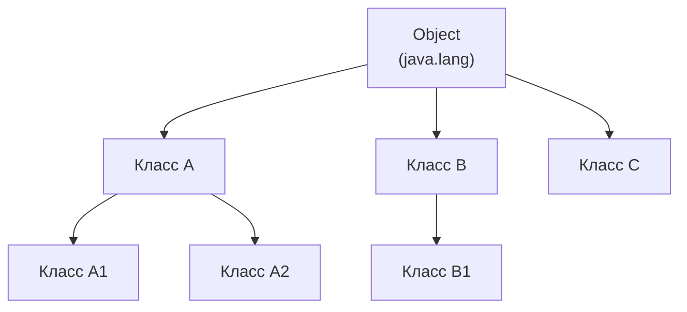
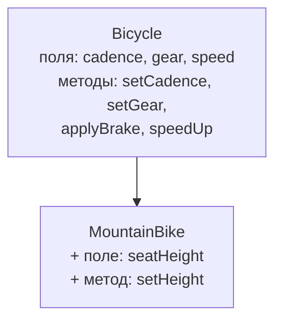
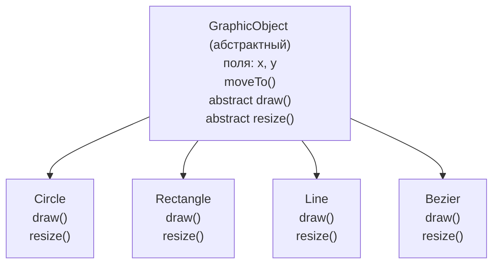

# Урок 5. Интерфейсы и наследование

**Трейл:** Learning the Java Language · **Оригинал:** [Interfaces and Inheritance](https://docs.oracle.com/javase/tutorial/java/IandI/index.html)
**Связанные области:** [[01-core-java-syntax-oop]] · [[10-design-patterns]] · **Вопросы:** core-java

> Перевод официального руководства Oracle (The Java Tutorials, JDK 8). Урок собран из всех
> подстраниц разделов *Interfaces* и *Inheritance*: от определения интерфейса и методов по
> умолчанию до наследования, переопределения, полиморфизма, класса `Object`, финальных и
> абстрактных классов, а также вопросов и упражнений.

Интерфейсы (*interfaces*) — это контракты, договариваясь о которых разные группы программистов
могут писать взаимодействующий код, ничего не зная о внутренней реализации друг друга.
Наследование (*inheritance*) позволяет одному классу — подклассу (*subclass*) — наследовать поля
и методы другого класса — суперкласса (*superclass*). Этот урок объясняет обе темы.

# Часть I. Интерфейсы

## Интерфейсы

В программной инженерии нередко важно, чтобы разные группы программистов договорились о
«контракте», описывающем, как их программы взаимодействуют. Каждая группа должна иметь
возможность писать свой код, ничего не зная о том, как написан код другой группы. В общем случае
именно такими контрактами и являются **интерфейсы** (*interfaces*).

Представьте, к примеру, общество будущего, где управляемые компьютером роботизированные
автомобили возят пассажиров по улицам города без водителя-человека. Производители автомобилей
пишут программы (на Java, конечно), которые управляют автомобилем: останавливают, трогаются,
разгоняют, поворачивают налево и так далее. Другая отраслевая группа — производители электронных
навигационных приборов — создаёт компьютерные системы, которые принимают данные о положении от
GPS (Global Positioning System) и сведения о дорожной обстановке по беспроводной связи и на их
основе ведут автомобиль.

Производители автомобилей должны опубликовать отраслевой стандарт-интерфейс, в котором подробно
описано, какие методы можно вызывать, чтобы заставить автомобиль двигаться (любой автомобиль,
любого производителя). Производители навигационных систем могут затем писать программы, которые
вызывают описанные в интерфейсе методы, чтобы командовать автомобилем. Ни одной из отраслевых
групп не нужно знать, *как* реализована программа другой группы. Более того, каждая группа считает
свою программу строго конфиденциальной и оставляет за собой право изменять её в любой момент — при
условии, что она по-прежнему соответствует опубликованному интерфейсу.

### Интерфейсы в языке Java

В языке программирования Java **интерфейс** (*interface*) — это ссылочный тип, похожий на класс,
который может содержать *только* константы, сигнатуры методов, методы по умолчанию (*default
methods*), статические методы и вложенные типы. Тела методов есть только у методов по умолчанию и
статических методов. Интерфейсы нельзя инстанцировать — их можно только *реализовать*
(*implement*) классами или *расширить* (*extend*) другими интерфейсами. Расширение обсуждается
далее в этом уроке.

Определение интерфейса похоже на создание нового класса:

```java
public interface OperateCar {

   // объявления констант, если они есть

   // сигнатуры методов

   // перечисление (enum) со значениями RIGHT, LEFT
   int turn(Direction direction,
            double radius,
            double startSpeed,
            double endSpeed);
   int changeLanes(Direction direction,
                   double startSpeed,
                   double endSpeed);
   int signalTurn(Direction direction,
                  boolean signalOn);
   int getRadarFront(double distanceToCar,
                     double speedOfCar);
   int getRadarRear(double distanceToCar,
                    double speedOfCar);
         ......
   // другие сигнатуры методов
}
```

Обратите внимание, что у сигнатур методов нет фигурных скобок и они завершаются точкой с запятой.

Чтобы воспользоваться интерфейсом, вы пишете класс, который *реализует* интерфейс. Когда
инстанцируемый класс реализует интерфейс, он предоставляет тело метода для каждого из методов,
объявленных в интерфейсе. Например:

```java
public class OperateBMW760i implements OperateCar {

    // сигнатуры методов OperateCar с реализацией --
    // например:
    public int signalTurn(Direction direction, boolean signalOn) {
       // код включения ЛЕВЫХ указателей поворота BMW
       // код выключения ЛЕВЫХ указателей поворота BMW
       // код включения ПРАВЫХ указателей поворота BMW
       // код выключения ПРАВЫХ указателей поворота BMW
    }

    // другие члены по необходимости -- например, вспомогательные классы,
    // не видимые клиентам интерфейса
}
```

В приведённом примере с роботизированным автомобилем именно производители автомобилей будут
реализовывать интерфейс. Реализация Chevrolet будет существенно отличаться от реализации Toyota,
но оба производителя будут придерживаться одного и того же интерфейса. Производители навигационных
систем — клиенты интерфейса — построят системы, которые используют данные GPS о местоположении
автомобиля, цифровые карты улиц и данные о трафике, чтобы вести автомобиль. При этом навигационные
системы будут вызывать методы интерфейса: повернуть, сменить полосу, тормозить, ускоряться и так далее.

### Интерфейсы как API

Пример с роботизированным автомобилем показывает интерфейс, используемый в качестве отраслевого
стандартного **прикладного программного интерфейса** (*Application Programming Interface, API*).
API распространены и в коммерческих программных продуктах. Обычно компания продаёт программный
пакет, содержащий сложные методы, которые другая компания хочет использовать в собственном
продукте. Пример — пакет методов цифровой обработки изображений, продаваемый компаниям, создающим
графические программы для конечных пользователей. Компания, обрабатывающая изображения, пишет свои
классы так, чтобы реализовать интерфейс, который делает общедоступным для своих клиентов.
Графическая компания затем вызывает методы обработки изображений, используя сигнатуры и
возвращаемые типы, определённые в интерфейсе. При этом API компании-разработчика обработки
изображений сделан общедоступным (для её клиентов), а реализация API хранится в строгом секрете —
более того, она может пересмотреть реализацию позднее, лишь бы по-прежнему реализовывала исходный
интерфейс, на который полагаются её клиенты.

## Определение интерфейса

Объявление интерфейса состоит из модификаторов, ключевого слова `interface`, имени интерфейса,
списка родительских интерфейсов через запятую (если они есть) и тела интерфейса. Например:

```java
public interface GroupedInterface extends Interface1, Interface2, Interface3 {

    // объявления констант
    double E = 2.718282;

    // сигнатуры методов
    void doSomething (int i, double x);
    int doSomethingElse(String s);
}
```

Модификатор `public` означает, что интерфейс может использоваться любым классом из любого пакета.
Если вы не указываете, что интерфейс публичный, ваш интерфейс будет доступен только классам,
определённым в том же пакете, что и интерфейс.

Объявление интерфейса может содержать список родительских интерфейсов через запятую (а также
ключевое слово `extends`). Интерфейс может расширять (наследовать от) более чем один интерфейс. (В
этом одно из отличий интерфейса от класса: класс может расширять только один класс.)

Тело интерфейса может содержать абстрактные методы (*abstract methods*), методы по умолчанию
(*default methods*) и статические методы (*static methods*). Абстрактный метод внутри интерфейса
завершается точкой с запятой, но без фигурных скобок (то есть без реализации). У методов по
умолчанию ставится модификатор `default`, а у статических — ключевое слово `static`. Все
абстрактные, методы по умолчанию и статические методы в интерфейсе неявно являются `public`,
поэтому модификатор `public` можно опускать.

Кроме того, интерфейс может содержать объявления констант. Все значения констант, определённые в
интерфейсе, неявно являются `public`, `static` и `final`. Опять же, эти модификаторы можно
опускать.

## Реализация интерфейса

Чтобы объявить класс, реализующий интерфейс, вы включаете в объявление класса предложение
`implements`. Ваш класс может реализовывать более одного интерфейса, поэтому за ключевым словом
`implements` следует список реализуемых классом интерфейсов через запятую. По соглашению
предложение `implements` следует за предложением `extends`, если оно есть.

### Пример интерфейса, Relatable

Рассмотрим интерфейс, который определяет, как сравнивать размер объектов.

```java
public interface Relatable {

    // this (объект, вызывающий isLargerThan)
    // и other должны быть экземплярами
    // одного класса; возвращает 1, 0, -1,
    // если this больше, равен или
    // меньше other
    public int isLargerThan(Relatable other);
}
```

Если вы хотите иметь возможность сравнивать размер похожих объектов независимо от того, что это
такое, то класс, который их инстанцирует, должен реализовывать `Relatable`.

Любой класс может реализовать `Relatable`, если есть какой-либо способ сравнить относительный
«размер» объектов, инстанцированных из этого класса. Для строк это может быть число символов; для
книг — число страниц; для студентов — вес и так далее. Для плоских геометрических объектов хорошим
выбором будет площадь (см. следующий класс `RectanglePlus`), а для трёхмерных геометрических
объектов подойдёт объём. Все такие классы могут реализовать метод `isLargerThan()`.

Если вы знаете, что класс реализует `Relatable`, то знаете, что можете сравнить размер объектов,
инстанцированных из этого класса.

### Реализация интерфейса Relatable

Вот класс `Rectangle`, который был представлен в разделе «Создание объектов» (Creating Objects),
переписанный для реализации `Relatable`.

```java
public class RectanglePlus
    implements Relatable {
    public int width = 0;
    public int height = 0;
    public Point origin;

    // четыре конструктора
    public RectanglePlus() {
        origin = new Point(0, 0);
    }
    public RectanglePlus(Point p) {
        origin = p;
    }
    public RectanglePlus(int w, int h) {
        origin = new Point(0, 0);
        width = w;
        height = h;
    }
    public RectanglePlus(Point p, int w, int h) {
        origin = p;
        width = w;
        height = h;
    }

    // метод для перемещения прямоугольника
    public void move(int x, int y) {
        origin.x = x;
        origin.y = y;
    }

    // метод для вычисления
    // площади прямоугольника
    public int getArea() {
        return width * height;
    }

    // метод, необходимый для реализации
    // интерфейса Relatable
    public int isLargerThan(Relatable other) {
        RectanglePlus otherRect
            = (RectanglePlus)other;
        if (this.getArea() < otherRect.getArea())
            return -1;
        else if (this.getArea() > otherRect.getArea())
            return 1;
        else
            return 0;
    }
}
```

Поскольку `RectanglePlus` реализует `Relatable`, размер любых двух объектов `RectanglePlus` можно
сравнить.

> **Примечание.** Метод `isLargerThan`, как он определён в интерфейсе `Relatable`, принимает объект
> типа `Relatable`. Строка кода, выделенная в примере выше, приводит `other` к экземпляру
> `RectanglePlus`. Приведение типа (*type casting*) сообщает компилятору, чем объект является на
> самом деле. Вызов `getArea` напрямую на экземпляре `other` (`other.getArea()`) не скомпилировался
> бы, потому что компилятор не понимает, что `other` на самом деле — экземпляр `RectanglePlus`.

## Использование интерфейса как типа

Когда вы определяете новый интерфейс, вы определяете новый ссылочный тип данных. Имена интерфейсов
можно использовать везде, где можно использовать имя любого другого типа данных. Если вы определяете
ссылочную переменную, тип которой — интерфейс, то любой объект, который вы ей присваиваете, *должен*
быть экземпляром класса, реализующего этот интерфейс.

В качестве примера — метод поиска большего из пары объектов для *любых* объектов, инстанцированных
из класса, реализующего `Relatable`:

```java
public Object findLargest(Object object1, Object object2) {
   Relatable obj1 = (Relatable)object1;
   Relatable obj2 = (Relatable)object2;
   if ((obj1).isLargerThan(obj2) > 0)
      return object1;
   else
      return object2;
}
```

Приведя `object1` к типу `Relatable`, можно вызвать метод `isLargerThan`.

Если вы возьмёте за правило реализовывать `Relatable` в самых разных классах, то объекты,
инстанцированные из *любого* из этих классов, можно сравнивать методом `findLargest()` — при
условии, что оба объекта одного класса. Точно так же их все можно сравнивать следующими методами:

```java
public Object findSmallest(Object object1, Object object2) {
   Relatable obj1 = (Relatable)object1;
   Relatable obj2 = (Relatable)object2;
   if ((obj1).isLargerThan(obj2) < 0)
      return object1;
   else
      return object2;
}

public boolean isEqual(Object object1, Object object2) {
   Relatable obj1 = (Relatable)object1;
   Relatable obj2 = (Relatable)object2;
   if ( (obj1).isLargerThan(obj2) == 0)
      return true;
   else
      return false;
}
```

Эти методы работают для любых «сравнимых» (*relatable*) объектов независимо от их наследования по
классам. Когда классы реализуют `Relatable`, их объекты могут быть как типа своего собственного
класса (или суперкласса), так и типа `Relatable`. Это даёт им некоторые преимущества множественного
наследования, при котором они могут иметь поведение и от суперкласса, и от интерфейса.

## Развитие интерфейсов (Evolving Interfaces)

Рассмотрим разработанный вами интерфейс под названием `DoIt`:

```java
public interface DoIt {
   void doSomething(int i, double x);
   int doSomethingElse(String s);
}
```

Предположим, что позже вы захотите добавить в `DoIt` третий метод, и интерфейс станет таким:

```java
public interface DoIt {

   void doSomething(int i, double x);
   int doSomethingElse(String s);
   boolean didItWork(int i, double x, String s);

}
```

Если вы внесёте это изменение, то все классы, реализующие старый интерфейс `DoIt`, сломаются,
потому что они больше не реализуют старый интерфейс. Программисты, полагающиеся на этот интерфейс,
будут громко возмущаться.

Старайтесь предусмотреть все варианты использования вашего интерфейса и полностью специфицировать
его с самого начала. Если же вы хотите добавить в интерфейс дополнительные методы, у вас есть
несколько вариантов. Вы можете создать интерфейс `DoItPlus`, который расширяет `DoIt`:

```java
public interface DoItPlus extends DoIt {

   boolean didItWork(int i, double x, String s);

}
```

Теперь пользователи вашего кода могут продолжать использовать старый интерфейс или перейти на новый.

Как вариант, вы можете определить новые методы как методы по умолчанию (*default methods*).
Следующий пример определяет метод по умолчанию с именем `didItWork`:

```java
public interface DoIt {

   void doSomething(int i, double x);
   int doSomethingElse(String s);
   default boolean didItWork(int i, double x, String s) {
       // тело метода
   }

}
```

Обратите внимание, что для методов по умолчанию необходимо предоставить реализацию. Вы также можете
определить в существующих интерфейсах новые статические методы. Пользователи, у которых есть классы,
реализующие интерфейсы, дополненные новыми методами по умолчанию или статическими методами, не
обязаны их изменять или перекомпилировать, чтобы учесть дополнительные методы.

## Методы по умолчанию (Default Methods)

Раздел «Интерфейсы» описывает пример с производителями управляемых компьютером автомобилей, которые
публикуют отраслевые стандарт-интерфейсы, описывающие, какие методы можно вызывать для управления
их автомобилями. Что если эти производители добавят новую функциональность, например полёт? Тогда
им нужно будет указать новые методы, чтобы другие компании (скажем, производители навигационных
приборов) могли адаптировать своё ПО к летающим автомобилям. Где производители автомобилей объявят
эти новые, связанные с полётом методы? Если добавить их в исходные интерфейсы, то программистам,
реализовавшим эти интерфейсы, придётся переписывать свои реализации. Если же добавить их как
статические методы, программисты будут считать их вспомогательными утилитами, а не существенными,
ключевыми методами.

Методы по умолчанию позволяют добавлять новую функциональность в интерфейсы ваших библиотек и
обеспечивать двоичную совместимость (*binary compatibility*) с кодом, написанным для более ранних
версий этих интерфейсов.

Рассмотрим следующий интерфейс `TimeClient`:

```java
import java.time.*;

public interface TimeClient {
    void setTime(int hour, int minute, int second);
    void setDate(int day, int month, int year);
    void setDateAndTime(int day, int month, int year,
                               int hour, int minute, int second);
    LocalDateTime getLocalDateTime();
}
```

Следующий класс `SimpleTimeClient` реализует `TimeClient`:

```java
package defaultmethods;

import java.time.*;
import java.lang.*;
import java.util.*;

public class SimpleTimeClient implements TimeClient {

    private LocalDateTime dateAndTime;

    public SimpleTimeClient() {
        dateAndTime = LocalDateTime.now();
    }

    public void setTime(int hour, int minute, int second) {
        LocalDate currentDate = LocalDate.from(dateAndTime);
        LocalTime timeToSet = LocalTime.of(hour, minute, second);
        dateAndTime = LocalDateTime.of(currentDate, timeToSet);
    }

    public void setDate(int day, int month, int year) {
        LocalDate dateToSet = LocalDate.of(day, month, year);
        LocalTime currentTime = LocalTime.from(dateAndTime);
        dateAndTime = LocalDateTime.of(dateToSet, currentTime);
    }

    public void setDateAndTime(int day, int month, int year,
                               int hour, int minute, int second) {
        LocalDate dateToSet = LocalDate.of(day, month, year);
        LocalTime timeToSet = LocalTime.of(hour, minute, second);
        dateAndTime = LocalDateTime.of(dateToSet, timeToSet);
    }

    public LocalDateTime getLocalDateTime() {
        return dateAndTime;
    }

    public String toString() {
        return dateAndTime.toString();
    }

    public static void main(String... args) {
        TimeClient myTimeClient = new SimpleTimeClient();
        System.out.println(myTimeClient.toString());
    }
}
```

Предположим, вы хотите добавить в интерфейс `TimeClient` новую функциональность, например
возможность задавать часовой пояс через объект `ZonedDateTime` (он похож на `LocalDateTime`, но
дополнительно хранит информацию о часовом поясе):

```java
public interface TimeClient {
    void setTime(int hour, int minute, int second);
    void setDate(int day, int month, int year);
    void setDateAndTime(int day, int month, int year,
        int hour, int minute, int second);
    LocalDateTime getLocalDateTime();
    ZonedDateTime getZonedDateTime(String zoneString);
}
```

После такого изменения интерфейса `TimeClient` вам пришлось бы также изменить класс
`SimpleTimeClient` и реализовать метод `getZonedDateTime`. Однако вместо того, чтобы оставлять
`getZonedDateTime` абстрактным (как в предыдущем примере), вы можете определить *реализацию по
умолчанию*. (Напомним, что абстрактный метод — это метод, объявленный без реализации.)

```java
package defaultmethods;

import java.time.*;

public interface TimeClient {
    void setTime(int hour, int minute, int second);
    void setDate(int day, int month, int year);
    void setDateAndTime(int day, int month, int year,
                               int hour, int minute, int second);
    LocalDateTime getLocalDateTime();

    static ZoneId getZoneId (String zoneString) {
        try {
            return ZoneId.of(zoneString);
        } catch (DateTimeException e) {
            System.err.println("Invalid time zone: " + zoneString +
                "; using default time zone instead.");
            return ZoneId.systemDefault();
        }
    }

    default ZonedDateTime getZonedDateTime(String zoneString) {
        return ZonedDateTime.of(getLocalDateTime(), getZoneId(zoneString));
    }
}
```

Вы указываете, что определение метода в интерфейсе является методом по умолчанию, с помощью
ключевого слова `default` в начале сигнатуры метода. Все объявления методов в интерфейсе, включая
методы по умолчанию, неявно являются `public`, поэтому модификатор `public` можно опускать.

С таким интерфейсом вам не нужно изменять класс `SimpleTimeClient`, и этот класс (как и любой класс,
реализующий интерфейс `TimeClient`) будет иметь уже определённый метод `getZonedDateTime`. Следующий
пример `TestSimpleTimeClient` вызывает метод `getZonedDateTime` у экземпляра `SimpleTimeClient`:

```java
package defaultmethods;

import java.time.*;
import java.lang.*;
import java.util.*;

public class TestSimpleTimeClient {
    public static void main(String... args) {
        TimeClient myTimeClient = new SimpleTimeClient();
        System.out.println("Current time: " + myTimeClient.toString());
        System.out.println("Time in California: " +
            myTimeClient.getZonedDateTime("Blah blah").toString());
    }
}
```

### Расширение интерфейсов, содержащих методы по умолчанию

Когда вы расширяете интерфейс, содержащий метод по умолчанию, вы можете поступить одним из
следующих способов:

- Вообще не упоминать метод по умолчанию — тогда ваш расширенный интерфейс унаследует метод по
  умолчанию.
- Переобъявить метод по умолчанию — это сделает его абстрактным (`abstract`).
- Переопределить метод по умолчанию — это перекроет (*override*) его.

Предположим, вы расширяете интерфейс `TimeClient` так:

```java
public interface AnotherTimeClient extends TimeClient { }
```

Любой класс, реализующий интерфейс `AnotherTimeClient`, будет иметь реализацию, заданную методом по
умолчанию `TimeClient.getZonedDateTime`.

Предположим, вы расширяете интерфейс `TimeClient` так:

```java
public interface AbstractZoneTimeClient extends TimeClient {
    public ZonedDateTime getZonedDateTime(String zoneString);
}
```

Любой класс, реализующий интерфейс `AbstractZoneTimeClient`, будет обязан реализовать метод
`getZonedDateTime`; этот метод — абстрактный, как и все остальные не-`default` (и не-`static`)
методы в интерфейсе.

Предположим, вы расширяете интерфейс `TimeClient` так:

```java
public interface HandleInvalidTimeZoneClient extends TimeClient {
    default public ZonedDateTime getZonedDateTime(String zoneString) {
        try {
            return ZonedDateTime.of(getLocalDateTime(),ZoneId.of(zoneString));
        } catch (DateTimeException e) {
            System.err.println("Invalid zone ID: " + zoneString +
                "; using the default time zone instead.");
            return ZonedDateTime.of(getLocalDateTime(),ZoneId.systemDefault());
        }
    }
}
```

Любой класс, реализующий интерфейс `HandleInvalidTimeZoneClient`, будет использовать реализацию
`getZonedDateTime`, заданную в этом интерфейсе, вместо реализации, заданной в интерфейсе
`TimeClient`.

### Статические методы

Помимо методов по умолчанию, в интерфейсах можно определять статические методы (*static methods*).
(Статический метод связан с классом, в котором он определён, а не с каким-либо объектом; все
экземпляры класса используют его совместно.) Это упрощает организацию вспомогательных методов в
ваших библиотеках: вы можете держать специфичные для интерфейса статические методы в самом
интерфейсе, а не в отдельном классе. Следующий пример определяет статический метод, который
получает объект `ZoneId`, соответствующий идентификатору часового пояса; если объекта `ZoneId`,
соответствующего заданному идентификатору, нет, используется часовой пояс системы по умолчанию.
(В результате метод `getZonedDateTime` можно упростить.)

```java
public interface TimeClient {
    // ...
    static public ZoneId getZoneId (String zoneString) {
        try {
            return ZoneId.of(zoneString);
        } catch (DateTimeException e) {
            System.err.println("Invalid time zone: " + zoneString +
                "; using default time zone instead.");
            return ZoneId.systemDefault();
        }
    }

    default public ZonedDateTime getZonedDateTime(String zoneString) {
        return ZonedDateTime.of(getLocalDateTime(), getZoneId(zoneString));
    }
}
```

Как и для статических методов в классах, вы указываете, что определение метода в интерфейсе —
статический метод, ключевым словом `static` в начале сигнатуры метода. Все объявления методов в
интерфейсе, включая статические методы, неявно являются `public`, поэтому модификатор `public`
можно опускать.

### Встраивание методов по умолчанию в существующие библиотеки

Методы по умолчанию позволяют добавлять новую функциональность в существующие интерфейсы и
обеспечивать двоичную совместимость с кодом, написанным под старые версии этих интерфейсов. В
частности, методы по умолчанию позволяют добавлять в существующие интерфейсы методы, принимающие в
качестве параметров лямбда-выражения (*lambda expressions*). Этот раздел показывает, как был
дополнен методами по умолчанию и статическими методами интерфейс `Comparator`.

Рассмотрим классы `Card` и `Deck`. В этом примере классы `Card` и `Deck` переписаны как интерфейсы.
Интерфейс `Card` содержит два перечисления (`Suit` и `Rank`) и два абстрактных метода (`getSuit` и
`getRank`):

```java
package defaultmethods;

public interface Card extends Comparable<Card> {

    public enum Suit {
        DIAMONDS (1, "Diamonds"),
        CLUBS    (2, "Clubs"   ),
        HEARTS   (3, "Hearts"  ),
        SPADES   (4, "Spades"  );

        private final int value;
        private final String text;
        Suit(int value, String text) {
            this.value = value;
            this.text = text;
        }
        public int value() {return value;}
        public String text() {return text;}
    }

    public enum Rank {
        DEUCE  (2 , "Two"  ),
        THREE  (3 , "Three"),
        FOUR   (4 , "Four" ),
        FIVE   (5 , "Five" ),
        SIX    (6 , "Six"  ),
        SEVEN  (7 , "Seven"),
        EIGHT  (8 , "Eight"),
        NINE   (9 , "Nine" ),
        TEN    (10, "Ten"  ),
        JACK   (11, "Jack" ),
        QUEEN  (12, "Queen"),
        KING   (13, "King" ),
        ACE    (14, "Ace"  );
        private final int value;
        private final String text;
        Rank(int value, String text) {
            this.value = value;
            this.text = text;
        }
        public int value() {return value;}
        public String text() {return text;}
    }

    public Card.Suit getSuit();
    public Card.Rank getRank();
}
```

Интерфейс `Deck` содержит различные методы для работы с картами в колоде:

```java
package defaultmethods;

import java.util.*;
import java.util.stream.*;
import java.lang.*;

public interface Deck {

    List<Card> getCards();
    Deck deckFactory();
    int size();
    void addCard(Card card);
    void addCards(List<Card> cards);
    void addDeck(Deck deck);
    void shuffle();
    void sort();
    void sort(Comparator<Card> c);
    String deckToString();

    Map<Integer, Deck> deal(int players, int numberOfCards)
        throws IllegalArgumentException;

}
```

Класс `PlayingCard` реализует интерфейс `Card`, а класс `StandardDeck` реализует интерфейс `Deck`.

Класс `StandardDeck` реализует абстрактный метод `Deck.sort` так:

```java
public class StandardDeck implements Deck {

    private List<Card> entireDeck;

    // ...

    public void sort() {
        Collections.sort(entireDeck);
    }

    // ...
}
```

Метод `Collections.sort` сортирует экземпляр `List`, тип элементов которого реализует интерфейс
`Comparable`. Член `entireDeck` — это экземпляр `List`, элементы которого имеют тип `Card`,
расширяющий `Comparable`. Класс `PlayingCard` реализует метод `Comparable.compareTo` так:

```java
public int hashCode() {
    return ((suit.value()-1)*13)+rank.value();
}

public int compareTo(Card o) {
    return this.hashCode() - o.hashCode();
}
```

Метод `compareTo` приводит к тому, что метод `StandardDeck.sort()` сортирует колоду карт сначала по
масти, а затем по достоинству.

Что если вы хотите отсортировать колоду сначала по достоинству, а затем по масти? Тогда вам нужно
реализовать интерфейс `Comparator`, чтобы задать новые критерии сортировки, и использовать метод
`sort(List<T> list, Comparator<? super T> c)` (версию `sort` с параметром `Comparator`). Вы можете
определить в классе `StandardDeck` следующий метод:

```java
public void sort(Comparator<Card> c) {
    Collections.sort(entireDeck, c);
}
```

С этим методом вы можете указать, как `Collections.sort` сортирует экземпляры класса `Card`. Один из
способов — реализовать интерфейс `Comparator`, чтобы задать желаемый порядок сортировки. Пример
`SortByRankThenSuit` делает это:

```java
package defaultmethods;

import java.util.*;
import java.util.stream.*;
import java.lang.*;

public class SortByRankThenSuit implements Comparator<Card> {
    public int compare(Card firstCard, Card secondCard) {
        int compVal =
            firstCard.getRank().value() - secondCard.getRank().value();
        if (compVal != 0)
            return compVal;
        else
            return firstCard.getSuit().value() - secondCard.getSuit().value();
    }
}
```

Следующий вызов сортирует колоду игральных карт сначала по достоинству, а затем по масти:

```java
StandardDeck myDeck = new StandardDeck();
myDeck.shuffle();
myDeck.sort(new SortByRankThenSuit());
```

Однако этот подход слишком многословен; было бы лучше, если бы можно было указывать только критерии
сортировки и не создавать множество реализаций сортировки. Предположим, вы — разработчик, написавший
интерфейс `Comparator`. Какие методы по умолчанию или статические методы можно было бы добавить в
`Comparator`, чтобы другие разработчики могли проще задавать критерии сортировки?

Для начала предположим, что вы хотите отсортировать колоду игральных карт по достоинству,
независимо от масти. Метод `StandardDeck.sort` можно вызвать так:

```java
StandardDeck myDeck = new StandardDeck();
myDeck.shuffle();
myDeck.sort(
    (firstCard, secondCard) ->
        firstCard.getRank().value() - secondCard.getRank().value()
);
```

Поскольку интерфейс `Comparator` является функциональным интерфейсом (*functional interface*), вы
можете использовать лямбда-выражение в качестве аргумента метода `sort`. В этом примере
лямбда-выражение сравнивает два целочисленных значения.

Вашим разработчикам было бы проще создавать экземпляр `Comparator`, вызывая только метод
`Card.getRank`. В частности, было бы полезно, если бы они могли создать экземпляр `Comparator`,
сравнивающий любой объект, который умеет возвращать числовое значение из метода вроде `getValue`
или `hashCode`. Интерфейс `Comparator` дополнен такой возможностью — статическим методом
`comparing`:

```java
myDeck.sort(Comparator.comparing((card) -> card.getRank()));
```

В этом примере можно вместо этого использовать ссылку на метод (*method reference*):

```java
myDeck.sort(Comparator.comparing(Card::getRank));
```

Этот вызов лучше демонстрирует, как задавать разные критерии сортировки и не создавать множество
реализаций сортировки.

Интерфейс `Comparator` дополнен и другими версиями статического метода `comparing`, такими как
`comparingDouble` и `comparingLong`, которые позволяют создавать экземпляры `Comparator`,
сравнивающие другие типы данных.

Предположим, ваши разработчики хотят создать экземпляр `Comparator`, способный сравнивать объекты по
нескольким критериям. Например, как отсортировать колоду игральных карт сначала по достоинству, а
затем по масти? Как и раньше, эти критерии сортировки можно задать лямбда-выражением:

```java
StandardDeck myDeck = new StandardDeck();
myDeck.shuffle();
myDeck.sort(
    (firstCard, secondCard) -> {
        int compare =
            firstCard.getRank().value() - secondCard.getRank().value();
        if (compare != 0)
            return compare;
        else
            return firstCard.getSuit().value() - secondCard.getSuit().value();
    }
);
```

Вашим разработчикам было бы проще, если бы они могли строить экземпляр `Comparator` из ряда
экземпляров `Comparator`. Интерфейс `Comparator` дополнен такой возможностью — методом по умолчанию
`thenComparing`:

```java
myDeck.sort(
    Comparator
        .comparing(Card::getRank)
        .thenComparing(Comparator.comparing(Card::getSuit)));
```

Интерфейс `Comparator` дополнен и другими версиями метода по умолчанию `thenComparing` (такими как
`thenComparingDouble` и `thenComparingLong`), которые позволяют строить экземпляры `Comparator`,
сравнивающие другие типы данных.

Предположим, ваши разработчики хотят создать экземпляр `Comparator`, позволяющий сортировать
коллекцию объектов в обратном порядке. Например, как отсортировать колоду игральных карт по
убыванию достоинства, от туза к двойке (вместо от двойки к тузу)? Как и раньше, можно было бы задать
ещё одно лямбда-выражение. Однако проще было бы, если бы можно было обратить существующий
`Comparator` вызовом метода. Интерфейс `Comparator` дополнен такой возможностью — методом по
умолчанию `reversed`:

```java
myDeck.sort(
    Comparator.comparing(Card::getRank)
        .reversed()
        .thenComparing(Comparator.comparing(Card::getSuit)));
```

Этот пример демонстрирует, как интерфейс `Comparator` дополнен методами по умолчанию, статическими
методами, лямбда-выражениями и ссылками на методы для создания более выразительных методов
библиотеки, функциональность которых программисты могут быстро понять, просто взглянув на то, как
они вызываются. Используйте эти конструкции, чтобы улучшать интерфейсы в своих библиотеках.

## Резюме по интерфейсам

Объявление интерфейса может содержать сигнатуры методов, методы по умолчанию, статические методы и
определения констант. Единственные методы, у которых есть реализации, — это методы по умолчанию и
статические методы.

Класс, реализующий интерфейс, должен реализовать все методы, объявленные в интерфейсе.

Имя интерфейса можно использовать везде, где можно использовать тип.

# Часть II. Наследование

## Наближение наследования

В предыдущих уроках наследование (*inheritance*) упоминалось несколько раз. В языке Java классы
могут *порождаться* (*derived*) от других классов, тем самым *наследуя* поля и методы этих классов.

> **Определения.** Класс, порождённый от другого класса, называется **подклассом** (*subclass*;
> также *производный класс*, *расширенный класс* или *дочерний класс*). Класс, от которого порождён
> подкласс, называется **суперклассом** (*superclass*; также *базовый класс* или *родительский
> класс*).

За исключением `Object`, у которого нет суперкласса, каждый класс имеет один и только один прямой
суперкласс (одиночное наследование, *single inheritance*). При отсутствии любого другого явного
суперкласса каждый класс неявно является подклассом `Object`.

Классы могут порождаться от классов, которые порождены от классов, которые порождены от классов, и
так далее — и в конечном счёте от самого верхнего класса, `Object`. Про такой класс говорят, что он
*происходит* (*descended*) от всех классов в цепочке наследования, тянущейся обратно к `Object`.

Идея наследования проста, но мощна: когда вы хотите создать новый класс, а уже существует класс,
включающий часть нужного вам кода, вы можете породить новый класс от существующего. Тем самым вы
можете повторно использовать поля и методы существующего класса, не переписывая (и не отлаживая!)
их самостоятельно.

Подкласс наследует все *члены* (поля, методы и вложенные классы) своего суперкласса. Конструкторы
не являются членами, поэтому они не наследуются подклассами, но конструктор суперкласса может быть
вызван из подкласса.

### Иерархия классов платформы Java

Класс `Object`, определённый в пакете `java.lang`, определяет и реализует поведение, общее для всех
классов — в том числе тех, которые пишете вы. На платформе Java многие классы порождаются
непосредственно от `Object`, другие классы порождаются от некоторых из них и так далее, образуя
иерархию классов.



*Все классы платформы Java являются потомками `Object`.*

На вершине иерархии `Object` — самый общий из всех классов. Классы вблизи основания иерархии
предоставляют более специализированное поведение.

### Пример наследования

Вот пример кода возможной реализации класса `Bicycle`, представленного в уроке «Классы и объекты»
(Classes and Objects):

```java
public class Bicycle {

    // у класса Bicycle три поля
    public int cadence;
    public int gear;
    public int speed;

    // у класса Bicycle один конструктор
    public Bicycle(int startCadence, int startSpeed, int startGear) {
        gear = startGear;
        cadence = startCadence;
        speed = startSpeed;
    }

    // у класса Bicycle четыре метода
    public void setCadence(int newValue) {
        cadence = newValue;
    }

    public void setGear(int newValue) {
        gear = newValue;
    }

    public void applyBrake(int decrement) {
        speed -= decrement;
    }

    public void speedUp(int increment) {
        speed += increment;
    }

}
```

Объявление класса `MountainBike`, являющегося подклассом `Bicycle`, может выглядеть так:

```java
public class MountainBike extends Bicycle {

    // подкласс MountainBike добавляет одно поле
    public int seatHeight;

    // у подкласса MountainBike один конструктор
    public MountainBike(int startHeight,
                        int startCadence,
                        int startSpeed,
                        int startGear) {
        super(startCadence, startSpeed, startGear);
        seatHeight = startHeight;
    }

    // подкласс MountainBike добавляет один метод
    public void setHeight(int newValue) {
        seatHeight = newValue;
    }
}
```

`MountainBike` наследует все поля и методы `Bicycle` и добавляет поле `seatHeight` и метод для его
установки. За исключением конструктора, всё выглядит так, как если бы вы написали новый класс
`MountainBike` полностью с нуля — с четырьмя полями и пятью методами. Однако вам не пришлось
выполнять всю эту работу. Это было бы особенно ценно, если бы методы класса `Bicycle` были сложными
и потребовали значительного времени на отладку.



### Что можно делать в подклассе

Подкласс наследует все *public*- и *protected*-члены своего родителя независимо от того, в каком
пакете находится подкласс. Если подкласс находится в том же пакете, что и его родитель, он также
наследует *package-private*-члены родителя. Унаследованные члены можно использовать как есть,
заменять их, скрывать или дополнять новыми членами:

- Унаследованные поля можно использовать напрямую, как любые другие поля.
- Вы можете объявить в подклассе поле с тем же именем, что и в суперклассе, тем самым *скрывая*
  (*hiding*) его (не рекомендуется).
- Вы можете объявить в подклассе новые поля, которых нет в суперклассе.
- Унаследованные методы можно использовать напрямую, как есть.
- Вы можете написать в подклассе новый *экземплярный* метод с той же сигнатурой, что и в
  суперклассе, тем самым *переопределяя* (*overriding*) его.
- Вы можете написать в подклассе новый *статический* метод с той же сигнатурой, что и в суперклассе,
  тем самым *скрывая* (*hiding*) его.
- Вы можете объявить в подклассе новые методы, которых нет в суперклассе.
- Вы можете написать конструктор подкласса, который вызывает конструктор суперкласса — неявно или с
  помощью ключевого слова `super`.

Следующие разделы этого урока подробнее раскрывают эти темы.

### Приватные члены суперкласса

Подкласс не наследует `private`-члены своего родительского класса. Однако если у суперкласса есть
public- или protected-методы для доступа к его приватным полям, они также могут использоваться
подклассом.

Вложенный класс имеет доступ ко всем приватным членам охватывающего класса — как к полям, так и к
методам. Следовательно, public- или protected-вложенный класс, унаследованный подклассом, имеет
косвенный доступ ко всем приватным членам суперкласса.

### Приведение объектов

Мы видели, что объект имеет тип данных того класса, из которого он был инстанцирован. Например, если
мы напишем

```java
public MountainBike myBike = new MountainBike();
```

то `myBike` имеет тип `MountainBike`.

`MountainBike` происходит от `Bicycle` и `Object`. Следовательно, `MountainBike` является `Bicycle`
и также является `Object`, и его можно использовать везде, где требуются объекты `Bicycle` или
`Object`.

Обратное не обязательно верно: `Bicycle` *может быть* `MountainBike`, но не обязательно. Аналогично,
`Object` *может быть* `Bicycle` или `MountainBike`, но не обязательно.

**Приведение** (*casting*) показывает использование объекта одного типа на месте другого типа, в
пределах объектов, допускаемых наследованием и реализациями. Например, если мы напишем

```java
Object obj = new MountainBike();
```

то `obj` является и `Object`, и `MountainBike` (до тех пор, пока `obj` не присвоен другой объект,
который *не* является `MountainBike`). Это называется *неявным приведением* (*implicit casting*).

Если же мы напишем

```java
MountainBike myBike = obj;
```

то получим ошибку компиляции, потому что компилятору неизвестно, что `obj` — это `MountainBike`.
Однако мы можем *сообщить* компилятору, что обещаем присвоить `obj` объект `MountainBike`, через
*явное приведение* (*explicit casting*):

```java
MountainBike myBike = (MountainBike)obj;
```

Это приведение вставляет проверку во время выполнения, что `obj` присвоен `MountainBike`, так что
компилятор может безопасно считать, что `obj` — это `MountainBike`. Если во время выполнения `obj`
не окажется `MountainBike`, будет выброшено исключение.

> **Примечание.** Вы можете логически проверить тип конкретного объекта с помощью оператора
> `instanceof`. Это убережёт вас от ошибки времени выполнения из-за неправильного приведения.
> Например:
>
> ```java
> if (obj instanceof MountainBike) {
>     MountainBike myBike = (MountainBike)obj;
> }
> ```
>
> Здесь оператор `instanceof` проверяет, что `obj` ссылается на `MountainBike`, так что мы можем
> сделать приведение, зная, что исключение времени выполнения выброшено не будет.

## Множественное наследование состояния, реализации и типа

Одно существенное различие между классами и интерфейсами в том, что классы могут иметь поля, а
интерфейсы — нет. Кроме того, класс можно инстанцировать для создания объекта, чего нельзя сделать с
интерфейсами. Как объяснялось в разделе «Что такое объект?», объект хранит своё состояние в полях,
которые определены в классах. Одна из причин, по которой язык Java не позволяет расширять более
одного класса, — избежать проблем **множественного наследования состояния** (*multiple inheritance
of state*), то есть возможности наследовать поля от нескольких классов. Например, предположим, что
вы можете определить новый класс, расширяющий несколько классов. Когда вы создаёте объект,
инстанцируя этот класс, объект унаследует поля от всех суперклассов класса. Что если методы или
конструкторы из разных суперклассов инициализируют одно и то же поле? Какой метод или конструктор
получит приоритет? Поскольку интерфейсы не содержат полей, вам не нужно беспокоиться о проблемах,
вытекающих из множественного наследования состояния.

**Множественное наследование реализации** (*multiple inheritance of implementation*) — это
возможность наследовать определения методов от нескольких классов. С таким видом множественного
наследования возникают проблемы: конфликты имён и неоднозначность. Когда компиляторы языков
программирования, поддерживающих такой вид множественного наследования, встречают суперклассы,
содержащие методы с одинаковыми именами, они иногда не могут определить, к какому члену или методу
обращаться или какой вызывать. Кроме того, программист может ненароком ввести конфликт имён, добавив
новый метод в суперкласс. Методы по умолчанию вводят одну из форм множественного наследования
реализации. Класс может реализовать более одного интерфейса, а они могут содержать методы по
умолчанию с одинаковыми именами. Компилятор Java предоставляет ряд правил, чтобы определить, какой
метод по умолчанию использует конкретный класс.

Язык Java поддерживает **множественное наследование типа** (*multiple inheritance of type*) — это
способность класса реализовывать более одного интерфейса. Объект может иметь несколько типов: тип
своего собственного класса и типы всех интерфейсов, которые класс реализует. Это означает, что если
переменная объявлена как тип интерфейса, то её значением может быть ссылка на любой объект,
инстанцированный из любого класса, реализующего этот интерфейс. Это обсуждается в разделе
«Использование интерфейса как типа».

Как и в случае множественного наследования реализации, класс может унаследовать разные реализации
метода, определённого (как `default` или `static`) в интерфейсах, которые он расширяет. В этом
случае компилятор или пользователь должен решить, какую из них использовать.

## Переопределение и скрытие методов

### Экземплярные методы

Экземплярный метод (*instance method*) в подклассе с той же сигнатурой (имя, плюс число и типы
параметров) и возвращаемым типом, что и у экземплярного метода в суперклассе, *переопределяет*
(*overrides*) метод суперкласса.

Способность подкласса переопределять метод позволяет классу наследовать от суперкласса, поведение
которого «достаточно близко», а затем при необходимости изменять поведение. Переопределяющий метод
имеет такие же имя, число и типы параметров и возвращаемый тип, как и метод, который он
переопределяет. Переопределяющий метод может также возвращать подтип того типа, который возвращает
переопределяемый метод. Такой подтип называется *ковариантным возвращаемым типом* (*covariant return
type*).

При переопределении метода вам, возможно, захочется использовать аннотацию `@Override`, которая
указывает компилятору, что вы намереваетесь переопределить метод суперкласса. Если по какой-либо
причине компилятор обнаружит, что метода нет ни в одном из суперклассов, он сгенерирует ошибку.

### Статические методы

Если подкласс определяет статический метод с той же сигнатурой, что и статический метод в
суперклассе, то метод в подклассе *скрывает* (*hides*) метод суперкласса.

Различие между скрытием статического метода и переопределением экземплярного метода имеет важные
последствия:

- Вызывается та версия переопределённого экземплярного метода, которая находится в подклассе.
- Какая версия скрытого статического метода вызывается, зависит от того, вызывается ли он из
  суперкласса или из подкласса.

Рассмотрим пример с двумя классами. Первый — `Animal`, содержащий один экземплярный и один
статический метод:

```java
public class Animal {
    public static void testClassMethod() {
        System.out.println("The static method in Animal");
    }
    public void testInstanceMethod() {
        System.out.println("The instance method in Animal");
    }
}
```

Второй класс, подкласс `Animal`, называется `Cat`:

```java
public class Cat extends Animal {
    public static void testClassMethod() {
        System.out.println("The static method in Cat");
    }
    public void testInstanceMethod() {
        System.out.println("The instance method in Cat");
    }

    public static void main(String[] args) {
        Cat myCat = new Cat();
        Animal myAnimal = myCat;
        Animal.testClassMethod();
        myAnimal.testInstanceMethod();
    }
}
```

Класс `Cat` переопределяет экземплярный метод в `Animal` и скрывает статический метод в `Animal`.
Метод `main` в этом классе создаёт экземпляр `Cat` и вызывает `testClassMethod()` на классе, а
`testInstanceMethod()` — на экземпляре.

Вывод этой программы такой:

```
The static method in Animal
The instance method in Cat
```

Как и было обещано, вызывается та версия скрытого статического метода, которая в суперклассе, и та
версия переопределённого экземплярного метода, которая в подклассе.

### Методы интерфейса

Методы по умолчанию и абстрактные методы в интерфейсах наследуются подобно экземплярным методам.
Однако когда супертипы класса или интерфейса предоставляют несколько методов по умолчанию с
одинаковой сигнатурой, компилятор Java следует правилам наследования, чтобы разрешить конфликт имён.
Эти правила определяются двумя принципами:

- **Экземплярные методы предпочтительнее методов по умолчанию интерфейса.**

  Рассмотрим следующие классы и интерфейсы:

  ```java
  public class Horse {
      public String identifyMyself() {
          return "I am a horse.";
      }
  }

  public interface Flyer {
      default public String identifyMyself() {
          return "I am able to fly.";
      }
  }

  public interface Mythical {
      default public String identifyMyself() {
          return "I am a mythical creature.";
      }
  }

  public class Pegasus extends Horse implements Flyer, Mythical {
      public static void main(String... args) {
          Pegasus myApp = new Pegasus();
          System.out.println(myApp.identifyMyself());
      }
  }
  ```

  Метод `Pegasus.identifyMyself` возвращает строку `I am a horse.`

- **Методы, уже переопределённые другими кандидатами, игнорируются.** Такая ситуация может
  возникнуть, когда супертипы имеют общего предка.

  Рассмотрим следующие интерфейсы и классы:

  ```java
  public interface Animal {
      default public String identifyMyself() {
          return "I am an animal.";
      }
  }

  public interface EggLayer extends Animal {
      default public String identifyMyself() {
          return "I am able to lay eggs.";
      }
  }

  public interface FireBreather extends Animal { }

  public class Dragon implements EggLayer, FireBreather {
      public static void main (String... args) {
          Dragon myApp = new Dragon();
          System.out.println(myApp.identifyMyself());
      }
  }
  ```

  Метод `Dragon.identifyMyself` возвращает строку `I am able to lay eggs.`

Если два или более независимо определённых метода по умолчанию конфликтуют, либо метод по умолчанию
конфликтует с абстрактным методом, то компилятор Java выдаёт ошибку компиляции. Вы должны явно
переопределить методы супертипа.

Рассмотрим пример с управляемыми компьютером автомобилями, которые теперь умеют летать. У вас есть
два интерфейса (`OperateCar` и `FlyCar`), предоставляющих реализации по умолчанию для одного и того
же метода (`startEngine`):

```java
public interface OperateCar {
    // ...
    default public int startEngine(EncryptedKey key) {
        // Реализация
    }
}

public interface FlyCar {
    // ...
    default public int startEngine(EncryptedKey key) {
        // Реализация
    }
}
```

Класс, реализующий и `OperateCar`, и `FlyCar`, должен переопределить метод `startEngine`. Вы можете
вызвать любую из реализаций по умолчанию с помощью ключевого слова `super`:

```java
public class FlyingCar implements OperateCar, FlyCar {
    // ...
    public int startEngine(EncryptedKey key) {
        FlyCar.super.startEngine(key);
        OperateCar.super.startEngine(key);
    }
}
```

Имя, предшествующее `super` (в этом примере `FlyCar` или `OperateCar`), должно ссылаться на прямой
суперинтерфейс, который определяет или наследует реализацию по умолчанию вызываемого метода. Эта
форма вызова метода не ограничивается только различением нескольких реализуемых интерфейсов,
содержащих методы по умолчанию с одинаковой сигнатурой. Вы можете использовать ключевое слово
`super` для вызова метода по умолчанию как в классах, так и в интерфейсах.

Унаследованные от классов экземплярные методы могут переопределять абстрактные методы интерфейса.
Рассмотрим следующие интерфейсы и классы:

```java
public interface Mammal {
    String identifyMyself();
}

public class Horse {
    public String identifyMyself() {
        return "I am a horse.";
    }
}

public class Mustang extends Horse implements Mammal {
    public static void main(String... args) {
        Mustang myApp = new Mustang();
        System.out.println(myApp.identifyMyself());
    }
}
```

Метод `Mustang.identifyMyself` возвращает строку `I am a horse.` Класс `Mustang` наследует метод
`identifyMyself` от класса `Horse`, который переопределяет одноимённый абстрактный метод в интерфейсе
`Mammal`.

> **Примечание.** Статические методы в интерфейсах никогда не наследуются.

### Модификаторы

Спецификатор доступа переопределяющего метода может разрешать больше, но не меньше доступа, чем
переопределяемый метод. Например, protected-экземплярный метод в суперклассе можно сделать public,
но не private, в подклассе.

Вы получите ошибку компиляции, если попытаетесь превратить экземплярный метод суперкласса в
статический в подклассе, и наоборот.

### Итоговая таблица

Следующая таблица обобщает, что происходит, когда вы определяете метод с той же сигнатурой, что и
метод в суперклассе.

|  | Экземплярный метод суперкласса | Статический метод суперкласса |
|---|---|---|
| **Экземплярный метод подкласса** | Переопределяет (*Overrides*) | Ошибка компиляции |
| **Статический метод подкласса** | Ошибка компиляции | Скрывает (*Hides*) |

> **Примечание.** В подклассе можно перегрузить (*overload*) методы, унаследованные от суперкласса.
> Такие перегруженные методы не скрывают и не переопределяют экземплярные методы суперкласса — это
> новые методы, уникальные для подкласса.

## Полиморфизм

Словарное определение **полиморфизма** (*polymorphism*) отсылает к принципу биологии, согласно
которому организм или вид может иметь много разных форм или стадий. Этот принцип применим и к
объектно-ориентированному программированию и языкам вроде Java. Подклассы класса могут определять
собственное уникальное поведение и при этом разделять часть той же функциональности родительского
класса.

Полиморфизм можно продемонстрировать небольшим изменением класса `Bicycle`. Например, в класс можно
добавить метод `printDescription`, который выводит все данные, хранящиеся в данный момент в
экземпляре.

```java
public void printDescription(){
    System.out.println("\nBike is " + "in gear " + this.gear
        + " with a cadence of " + this.cadence +
        " and travelling at a speed of " + this.speed + ". ");
}
```

Чтобы продемонстрировать полиморфные свойства языка Java, расширим класс `Bicycle` классами
`MountainBike` и `RoadBike`. Для `MountainBike` добавим поле `suspension` — строковое значение,
указывающее, есть ли у велосипеда передний амортизатор (`Front`) либо передний и задний
амортизаторы (`Dual`).

Вот обновлённый класс:

```java
public class MountainBike extends Bicycle {
    private String suspension;

    public MountainBike(
               int startCadence,
               int startSpeed,
               int startGear,
               String suspensionType){
        super(startCadence,
              startSpeed,
              startGear);
        this.setSuspension(suspensionType);
    }

    public String getSuspension(){
      return this.suspension;
    }

    public void setSuspension(String suspensionType) {
        this.suspension = suspensionType;
    }

    public void printDescription() {
        super.printDescription();
        System.out.println("The " + "MountainBike has a" +
            getSuspension() + " suspension.");
    }
}
```

Обратите внимание на переопределённый метод `printDescription`. В дополнение к ранее выводимой
информации в вывод добавлены данные о подвеске.

Далее создадим класс `RoadBike`. Поскольку у шоссейных (гоночных) велосипедов узкие шины, добавим
атрибут для хранения ширины шины. Вот класс `RoadBike`:

```java
public class RoadBike extends Bicycle{
    // В миллиметрах (мм)
    private int tireWidth;

    public RoadBike(int startCadence,
                    int startSpeed,
                    int startGear,
                    int newTireWidth){
        super(startCadence,
              startSpeed,
              startGear);
        this.setTireWidth(newTireWidth);
    }

    public int getTireWidth(){
      return this.tireWidth;
    }

    public void setTireWidth(int newTireWidth){
        this.tireWidth = newTireWidth;
    }

    public void printDescription(){
        super.printDescription();
        System.out.println("The RoadBike" + " has " + getTireWidth() +
            " MM tires.");
    }
}
```

Обратите внимание, что метод `printDescription` снова переопределён. На этот раз выводится информация
о ширине шины.

Итак, есть три класса: `Bicycle`, `MountainBike` и `RoadBike`. Два подкласса переопределяют метод
`printDescription` и выводят уникальную информацию.

Вот тестовая программа, которая создаёт три переменные `Bicycle`. Каждой переменной присваивается
объект одного из трёх классов велосипедов. Затем каждая переменная выводится.

```java
public class TestBikes {
  public static void main(String[] args){
    Bicycle bike01, bike02, bike03;

    bike01 = new Bicycle(20, 10, 1);
    bike02 = new MountainBike(20, 10, 5, "Dual");
    bike03 = new RoadBike(40, 20, 8, 23);

    bike01.printDescription();
    bike02.printDescription();
    bike03.printDescription();
  }
}
```

Вот вывод тестовой программы:

```
Bike is in gear 1 with a cadence of 20 and travelling at a speed of 10.

Bike is in gear 5 with a cadence of 20 and travelling at a speed of 10.
The MountainBike has a Dual suspension.

Bike is in gear 8 with a cadence of 40 and travelling at a speed of 20.
The RoadBike has 23 MM tires.
```

Виртуальная машина Java (JVM) вызывает подходящий метод для объекта, на который ссылается каждая
переменная. Она не вызывает метод, определённый типом переменной. Такое поведение называется
**виртуальным вызовом метода** (*virtual method invocation*) и демонстрирует один из аспектов важных
полиморфных свойств языка Java.

## Скрытие полей

Внутри класса поле, имеющее то же имя, что и поле в суперклассе, скрывает (*hides*) поле суперкласса,
даже если их типы различаются. Внутри подкласса на поле суперкласса нельзя ссылаться по его простому
имени. Вместо этого к полю нужно обращаться через `super`, что рассматривается в следующем разделе.
Вообще говоря, мы не рекомендуем скрывать поля, так как это затрудняет чтение кода.

## Использование ключевого слова super

### Доступ к членам суперкласса

Если ваш метод переопределяет один из методов суперкласса, вы можете вызвать переопределённый метод
с помощью ключевого слова `super`. Вы также можете использовать `super`, чтобы сослаться на скрытое
поле (хотя скрытие полей не поощряется). Рассмотрим класс `Superclass`:

```java
public class Superclass {

    public void printMethod() {
        System.out.println("Printed in Superclass.");
    }
}
```

Вот подкласс `Subclass`, переопределяющий `printMethod()`:

```java
public class Subclass extends Superclass {

    // переопределяет printMethod в Superclass
    public void printMethod() {
        super.printMethod();
        System.out.println("Printed in Subclass");
    }
    public static void main(String[] args) {
        Subclass s = new Subclass();
        s.printMethod();
    }
}
```

Внутри `Subclass` простое имя `printMethod()` ссылается на тот, который объявлен в `Subclass` и
переопределяет тот, что в `Superclass`. Поэтому, чтобы сослаться на `printMethod()`, унаследованный
от `Superclass`, `Subclass` должен использовать квалифицированное имя, применяя `super`, как
показано. Компиляция и выполнение `Subclass` выводит следующее:

```
Printed in Superclass.
Printed in Subclass
```

### Конструкторы подкласса

Следующий пример показывает, как использовать ключевое слово `super` для вызова конструктора
суперкласса. Вспомним из примера с `Bicycle`, что `MountainBike` — подкласс `Bicycle`. Вот
конструктор `MountainBike` (подкласса), который вызывает конструктор суперкласса, а затем добавляет
собственный код инициализации:

```java
public MountainBike(int startHeight,
                    int startCadence,
                    int startSpeed,
                    int startGear) {
    super(startCadence, startSpeed, startGear);
    seatHeight = startHeight;
}
```

Вызов конструктора суперкласса должен быть первой строкой в конструкторе подкласса.

Синтаксис вызова конструктора суперкласса такой:

```java
super();
```

или:

```java
super(parameter list);
```

С `super()` вызывается конструктор суперкласса без аргументов. С `super(parameter list)` вызывается
конструктор суперкласса с подходящим списком параметров.

> **Примечание.** Если конструктор не вызывает явно конструктор суперкласса, компилятор Java
> автоматически вставляет вызов конструктора суперкласса без аргументов. Если у суперкласса нет
> конструктора без аргументов, вы получите ошибку компиляции. У `Object` *есть* такой конструктор,
> поэтому если `Object` — единственный суперкласс, проблемы нет.

Если конструктор подкласса вызывает конструктор своего суперкласса — явно или неявно, — то можно
подумать, что будет вызвана целая цепочка конструкторов, вплоть до конструктора `Object`. И это
действительно так. Это называется **цепочкой конструкторов** (*constructor chaining*), и об этом
нужно помнить при длинной линии наследования классов.

## Класс Object как суперкласс

Класс `Object` из пакета `java.lang` находится на вершине дерева иерархии классов. Каждый класс —
прямой или косвенный потомок класса `Object`. Каждый используемый или написанный вами класс наследует
экземплярные методы `Object`. Вам не обязательно использовать какой-либо из этих методов, но если вы
решите это сделать, может понадобиться переопределить их кодом, специфичным для вашего класса.
Методы, унаследованные от `Object`, которые обсуждаются в этом разделе:

- `protected Object clone() throws CloneNotSupportedException` — создаёт и возвращает копию этого
  объекта.
- `public boolean equals(Object obj)` — указывает, «равен» ли некоторый другой объект данному.
- `protected void finalize() throws Throwable` — вызывается сборщиком мусора на объекте, когда
  сборка мусора определяет, что ссылок на объект больше нет.
- `public final Class getClass()` — возвращает класс объекта во время выполнения.
- `public int hashCode()` — возвращает хеш-код объекта.
- `public String toString()` — возвращает строковое представление объекта.

Методы `notify`, `notifyAll` и `wait` класса `Object` участвуют в синхронизации действий независимо
выполняющихся потоков в программе; это обсуждается в более позднем уроке и здесь не рассматривается.
Этих методов пять:

- `public final void notify()`
- `public final void notifyAll()`
- `public final void wait()`
- `public final void wait(long timeout)`
- `public final void wait(long timeout, int nanos)`

> **Примечание.** У ряда этих методов есть тонкости, особенно у метода `clone`.

### Метод clone()

Если класс или один из его суперклассов реализует интерфейс `Cloneable`, то для создания копии из
существующего объекта можно использовать метод `clone()`. Чтобы создать клон, вы пишете:

`aCloneableObject.clone();`

Реализация этого метода в `Object` проверяет, реализует ли объект, на котором был вызван `clone()`,
интерфейс `Cloneable`. Если нет, метод выбрасывает исключение `CloneNotSupportedException`.
Обработка исключений будет рассмотрена в более позднем уроке. Пока вам нужно знать, что `clone()`
должен быть объявлен как

```java
protected Object clone() throws CloneNotSupportedException
```

или:

```java
public Object clone() throws CloneNotSupportedException
```

если вы собираетесь написать метод `clone()`, переопределяющий тот, что в `Object`.

Если объект, на котором был вызван `clone()`, действительно реализует интерфейс `Cloneable`, то
реализация метода `clone()` в `Object` создаёт объект того же класса, что и исходный, и инициализирует
переменные-члены нового объекта теми же значениями, что у соответствующих переменных-членов исходного
объекта.

Простейший способ сделать ваш класс клонируемым — добавить `implements Cloneable` в объявление
класса. Тогда ваши объекты смогут вызывать метод `clone()`.

Для некоторых классов поведение метода `clone()` из `Object` по умолчанию вполне подходит. Однако
если объект содержит ссылку на внешний объект, скажем `ObjExternal`, вам может понадобиться
переопределить `clone()`, чтобы получить корректное поведение. Иначе изменение `ObjExternal`,
сделанное одним объектом, будет видно и в его клоне. Это означает, что исходный объект и его клон не
независимы — чтобы их развязать, вы должны переопределить `clone()` так, чтобы он клонировал объект
*и* `ObjExternal`. Тогда исходный объект ссылается на `ObjExternal`, а клон — на клон `ObjExternal`,
так что объект и его клон по-настоящему независимы.

### Метод equals()

Метод `equals()` сравнивает два объекта на равенство и возвращает `true`, если они равны. Метод
`equals()`, предоставляемый классом `Object`, использует оператор тождественности (`==`), чтобы
определить, равны ли два объекта. Для примитивных типов данных это даёт корректный результат. Для
объектов, однако, — нет. Метод `equals()`, предоставляемый `Object`, проверяет, равны ли *ссылки* на
объекты, то есть являются ли сравниваемые объекты в точности одним и тем же объектом.

Чтобы проверить, равны ли два объекта в смысле *эквивалентности* (содержат одинаковую информацию),
вы должны переопределить метод `equals()`. Вот пример класса `Book`, переопределяющего `equals()`:

```java
public class Book {
    String ISBN;

    public String getISBN() {
        return ISBN;
    }

    public boolean equals(Object obj) {
        if (obj instanceof Book)
            return ISBN.equals((Book)obj.getISBN());
        else
            return false;
    }
}
```

Рассмотрим код, который проверяет на равенство два экземпляра класса `Book`:

```java
// Swing Tutorial, 2nd edition
Book firstBook  = new Book("0201914670");
Book secondBook = new Book("0201914670");
if (firstBook.equals(secondBook)) {
    System.out.println("objects are equal");
} else {
    System.out.println("objects are not equal");
}
```

Эта программа выводит `objects are equal`, хотя `firstBook` и `secondBook` ссылаются на два разных
объекта. Они считаются равными, потому что сравниваемые объекты содержат одинаковый номер ISBN.

Вам всегда следует переопределять метод `equals()`, если оператор тождественности не подходит для
вашего класса.

> **Примечание.** Если вы переопределяете `equals()`, вы должны переопределить и `hashCode()`.

### Метод finalize()

Класс `Object` предоставляет метод обратного вызова `finalize()`, который *может быть* вызван на
объекте, когда тот становится мусором. Реализация `finalize()` в `Object` ничего не делает — вы
можете переопределить `finalize()`, чтобы выполнить очистку, например освободить ресурсы.

Метод `finalize()` *может быть* вызван системой автоматически, но когда он будет вызван — и будет ли
вызван вообще — неизвестно. Поэтому не полагайтесь на этот метод для выполнения очистки. Например,
если вы не закрываете файловые дескрипторы в коде после выполнения ввода-вывода и рассчитываете, что
`finalize()` закроет их за вас, у вас может закончиться запас файловых дескрипторов. Вместо этого
используйте оператор try-with-resources для автоматического закрытия ресурсов приложения.

### Метод getClass()

`getClass` переопределить нельзя.

Метод `getClass()` возвращает объект `Class`, у которого есть методы для получения информации о
классе, например его имени (`getSimpleName()`), его суперклассе (`getSuperclass()`) и реализуемых им
интерфейсах (`getInterfaces()`). Например, следующий метод получает и выводит имя класса объекта:

```java
void printClassName(Object obj) {
    System.out.println("The object's" + " class is " +
        obj.getClass().getSimpleName());
}
```

Класс `Class` из пакета `java.lang` имеет большое число методов (более 50). Например, можно
проверить, является ли класс аннотацией (`isAnnotation()`), интерфейсом (`isInterface()`) или
перечислением (`isEnum()`). Можно узнать, какие у объекта поля (`getFields()`) или какие у него
методы (`getMethods()`), и так далее.

### Метод hashCode()

Значение, возвращаемое `hashCode()`, — это хеш-код объекта, целочисленное значение, сгенерированное
алгоритмом хеширования.

По определению, если два объекта равны, их хеш-коды *также должны* быть равны. Если вы переопределяете
метод `equals()`, вы меняете способ, которым приравниваются два объекта, и реализация `hashCode()` из
`Object` перестаёт быть корректной. Поэтому, если вы переопределяете метод `equals()`, вы должны
переопределить и метод `hashCode()`.

### Метод toString()

Вам всегда следует рассматривать возможность переопределения метода `toString()` в своих классах.

Метод `toString()` из `Object` возвращает строковое (`String`) представление объекта, что очень
полезно при отладке. Строковое представление объекта полностью зависит от самого объекта, поэтому вам
нужно переопределять `toString()` в своих классах.

`toString()` можно использовать вместе с `System.out.println()`, чтобы вывести текстовое представление
объекта, например экземпляра `Book`:

```java
System.out.println(firstBook.toString());
```

что при правильно переопределённом методе `toString()` напечатало бы что-то полезное, например:

```
ISBN: 0201914670; The Swing Tutorial; A Guide to Constructing GUIs, 2nd Edition
```

### Методы синхронизации потоков

Методы `notify`, `notifyAll` и `wait` класса `Object` участвуют в синхронизации действий независимо
выполняющихся потоков в программе. Этих методов пять:

- `public final void notify()` — пробуждает один поток, ожидающий на мониторе этого объекта.
- `public final void notifyAll()` — пробуждает все потоки, ожидающие на мониторе этого объекта.
- `public final void wait()` — заставляет текущий поток ждать, пока другой поток не вызовет `notify()`
  или `notifyAll()` для этого объекта.
- `public final void wait(long timeout)` — заставляет текущий поток ждать, пока другой поток не
  вызовет `notify()` или `notifyAll()` для этого объекта либо не истечёт заданный промежуток времени.
- `public final void wait(long timeout, int nanos)` — заставляет текущий поток ждать, пока другой
  поток не вызовет `notify()` или `notifyAll()` для этого объекта либо не истечёт заданный промежуток
  времени (в миллисекундах и наносекундах).

## Написание финальных классов и методов

Некоторые или все методы класса можно объявить **финальными** (*final*). Ключевое слово `final` в
объявлении метода указывает, что метод не может быть переопределён подклассами. Класс `Object`
поступает так — ряд его методов финальны.

Возможно, вы захотите сделать метод финальным, если у него есть реализация, которую не следует
менять и которая критична для согласованного состояния объекта. Например, вы можете захотеть сделать
метод `getFirstPlayer` в этом классе `ChessAlgorithm` финальным:

```java
class ChessAlgorithm {
    enum ChessPlayer { WHITE, BLACK }
    ...
    final ChessPlayer getFirstPlayer() {
        return ChessPlayer.WHITE;
    }
    ...
}
```

Методы, вызываемые из конструкторов, как правило, следует объявлять финальными. Если конструктор
вызывает не-финальный метод, подкласс может переопределить этот метод с неожиданными или нежелательными
результатами.

Заметьте, что финальным можно объявить и целый класс. Класс, объявленный финальным, нельзя
наследовать (от него нельзя породить подкласс). Это особенно полезно, например, при создании
неизменяемого (*immutable*) класса вроде класса `String`.

## Абстрактные методы и классы

**Абстрактный класс** (*abstract class*) — это класс, объявленный с модификатором `abstract`; он
может содержать или не содержать абстрактные методы. Абстрактные классы нельзя инстанцировать, но от
них можно порождать подклассы.

**Абстрактный метод** (*abstract method*) — это метод, объявленный без реализации (без фигурных
скобок и завершающийся точкой с запятой), например:

```java
abstract void moveTo(double deltaX, double deltaY);
```

Если класс включает абстрактные методы, то сам класс *должен* быть объявлен абстрактным, как здесь:

```java
public abstract class GraphicObject {
   // объявление полей
   // объявление неабстрактных методов
   abstract void draw();
}
```

Когда от абстрактного класса порождают подкласс, подкласс обычно предоставляет реализации для всех
абстрактных методов своего родительского класса. Однако если он этого не делает, то подкласс также
должен быть объявлен абстрактным.

> **Примечание.** Методы интерфейса, не объявленные как `default` или `static`, *неявно* являются
> абстрактными, поэтому модификатор `abstract` с методами интерфейса не используется. (Его можно
> использовать, но это излишне.)

### Сравнение абстрактных классов и интерфейсов

Абстрактные классы похожи на интерфейсы. Вы не можете их инстанцировать, и они могут содержать смесь
методов, объявленных с реализацией или без неё. Однако в абстрактных классах вы можете объявлять
поля, которые не являются статическими и финальными, и определять public-, protected- и
private-конкретные методы. В интерфейсах все поля автоматически являются public, static и final, а
все методы, которые вы объявляете или определяете (как методы по умолчанию), являются public. Кроме
того, вы можете расширить только один класс, абстрактный или нет, тогда как реализовать можно любое
число интерфейсов.

Что использовать — абстрактные классы или интерфейсы?

- **Рассмотрите использование абстрактных классов**, если применимо любое из следующих утверждений:
  - Вы хотите разделять код между несколькими тесно связанными классами.
  - Вы ожидаете, что классы, расширяющие ваш абстрактный класс, имеют много общих методов или полей
    либо требуют модификаторов доступа, отличных от public (например, protected и private).
  - Вы хотите объявлять не-статические или не-финальные поля. Это позволяет определять методы,
    которые могут обращаться к состоянию объекта, которому они принадлежат, и изменять его.
- **Рассмотрите использование интерфейсов**, если применимо любое из следующих утверждений:
  - Вы ожидаете, что ваш интерфейс будут реализовывать несвязанные классы. Например, интерфейсы
    `Comparable` и `Cloneable` реализуются многими несвязанными классами.
  - Вы хотите задать поведение определённого типа данных, но не беспокоитесь о том, кто реализует это
    поведение.
  - Вы хотите воспользоваться множественным наследованием типа.

Пример абстрактного класса в JDK — `AbstractMap`, входящий во фреймворк коллекций. Его подклассы (в
том числе `HashMap`, `TreeMap` и `ConcurrentHashMap`) разделяют многие методы (включая `get`, `put`,
`isEmpty`, `containsKey` и `containsValue`), которые определяет `AbstractMap`.

Пример класса в JDK, реализующего несколько интерфейсов, — `HashMap`, который реализует интерфейсы
`Serializable`, `Cloneable` и `Map<K, V>`. Прочитав этот список интерфейсов, можно заключить, что
экземпляр `HashMap` (независимо от разработчика или компании, реализовавшей класс) можно клонировать,
он сериализуем (то есть может быть преобразован в поток байтов) и обладает функциональностью
отображения (map). Кроме того, интерфейс `Map<K, V>` был дополнен многими методами по умолчанию,
такими как `merge` и `forEach`, которые более старые классы, реализовавшие этот интерфейс, не обязаны
определять.

Заметьте, что многие программные библиотеки используют и абстрактные классы, и интерфейсы: класс
`HashMap` реализует несколько интерфейсов и также расширяет абстрактный класс `AbstractMap`.

### Пример абстрактного класса

В объектно-ориентированном приложении для рисования вы можете рисовать окружности, прямоугольники,
линии, кривые Безье и многие другие графические объекты. У всех этих объектов есть определённые общие
состояния (например, позиция, ориентация, цвет линии, цвет заливки) и поведения (например, `moveTo`,
`rotate`, `resize`, `draw`). Некоторые из этих состояний и поведений одинаковы для всех графических
объектов (например, позиция, цвет заливки и `moveTo`). Другие требуют разных реализаций (например,
`resize` или `draw`). Все объекты `GraphicObject` должны уметь рисовать или изменять свой размер; они
лишь различаются тем, как они это делают. Это идеальная ситуация для абстрактного суперкласса. Вы
можете воспользоваться сходствами и объявить, что все графические объекты наследуют от одного и того
же абстрактного родительского объекта (например, `GraphicObject`), как показано на следующей
диаграмме.



Сначала вы объявляете абстрактный класс `GraphicObject`, чтобы предоставить переменные-члены и методы,
полностью разделяемые всеми подклассами, например текущую позицию и метод `moveTo`. `GraphicObject`
также объявляет абстрактные методы — например `draw` или `resize`, — которые должны быть реализованы
всеми подклассами, но реализованы по-разному. Класс `GraphicObject` может выглядеть примерно так:

```java
abstract class GraphicObject {
    int x, y;
    ...
    void moveTo(int newX, int newY) {
        ...
    }
    abstract void draw();
    abstract void resize();
}
```

Каждый неабстрактный подкласс `GraphicObject`, такой как `Circle` и `Rectangle`, должен предоставить
реализации методов `draw` и `resize`:

```java
class Circle extends GraphicObject {
    void draw() {
        ...
    }
    void resize() {
        ...
    }
}
class Rectangle extends GraphicObject {
    void draw() {
        ...
    }
    void resize() {
        ...
    }
}
```

### Когда абстрактный класс реализует интерфейс

В разделе об интерфейсах отмечалось, что класс, реализующий интерфейс, должен реализовать *все* методы
интерфейса. Однако можно определить класс, который не реализует все методы интерфейса, при условии,
что класс объявлен абстрактным. Например:

```java
abstract class X implements Y {
  // реализует все методы Y, кроме одного
}

class XX extends X {
  // реализует оставшийся метод в Y
}
```

В этом случае класс `X` должен быть абстрактным, потому что он не полностью реализует `Y`, а класс
`XX` фактически реализует `Y`.

### Члены класса

Абстрактный класс может иметь статические (`static`) поля и статические методы. Эти статические члены
можно использовать со ссылкой на класс (например, `AbstractClass.staticMethod()`), как с любым другим
классом.

## Резюме по наследованию

За исключением класса `Object`, класс имеет ровно один прямой суперкласс. Класс наследует поля и
методы от всех своих суперклассов, прямых или косвенных. Подкласс может переопределять наследуемые им
методы либо скрывать наследуемые им поля или методы. (Заметьте, что скрытие полей — обычно плохая
практика программирования.)

Таблица в разделе «Переопределение и скрытие методов» показывает эффект объявления метода с той же
сигнатурой, что и у метода в суперклассе.

Класс `Object` — вершина иерархии классов. Все классы являются потомками этого класса и наследуют от
него методы. Полезные методы, унаследованные от `Object`, включают `toString()`, `equals()`,
`clone()` и `getClass()`.

Вы можете запретить наследование от класса, используя ключевое слово `final` в объявлении класса.
Аналогично вы можете запретить переопределение метода подклассами, объявив его финальным методом.

Абстрактный класс можно только наследовать; его нельзя инстанцировать. Абстрактный класс может
содержать абстрактные методы — методы, которые объявлены, но не реализованы. Подклассы затем
предоставляют реализации абстрактных методов.

# Вопросы и упражнения

## Интерфейсы

### Вопросы

1. Какие методы должен был бы реализовать класс, реализующий интерфейс `java.lang.CharSequence`?
2. Что не так со следующим интерфейсом?

   ```java
   public interface SomethingIsWrong {
       void aMethod(int aValue){
           System.out.println("Hi Mom");
       }
   }
   ```

3. Исправьте интерфейс из вопроса 2.
4. Корректен ли следующий интерфейс?

   ```java
   public interface Marker {
   }
   ```

### Упражнения

1. Напишите класс, реализующий интерфейс `CharSequence`, находящийся в пакете `java.lang`. Ваша
   реализация должна возвращать строку задом наперёд. Выберите в качестве данных одно из предложений
   из этой книги. Напишите небольшой метод `main` для тестирования вашего класса; убедитесь, что
   вызываете все четыре метода.
2. Предположим, вы написали сервер времени, который периодически уведомляет своих клиентов о текущей
   дате и времени. Напишите интерфейс, который сервер мог бы использовать, чтобы навязать своим
   клиентам определённый протокол.

## Наследование

### Вопросы

1. Рассмотрите следующие два класса:

   ```java
   public class ClassA {
       public void methodOne(int i) {
       }
       public void methodTwo(int i) {
       }
       public static void methodThree(int i) {
       }
       public static void methodFour(int i) {
       }
   }

   public class ClassB extends ClassA {
       public static void methodOne(int i) {
       }
       public void methodTwo(int i) {
       }
       public void methodThree(int i) {
       }
       public static void methodFour(int i) {
       }
   }
   ```

   а. Какой метод переопределяет метод в суперклассе?
   б. Какой метод скрывает метод в суперклассе?
   в. Что делают остальные методы?

2. Рассмотрите классы `Card`, `Deck` и `DisplayDeck`, которые вы написали в разделе «Вопросы и
   упражнения: классы». Какие методы `Object` должен переопределять каждый из этих классов?

### Упражнения

1. Напишите реализации методов, которые вы указали в ответе на вопрос 2.

## Источник

- [Lesson: Interfaces and Inheritance](https://docs.oracle.com/javase/tutorial/java/IandI/index.html) — официальное руководство Oracle (индекс урока).
- [Interfaces](https://docs.oracle.com/javase/tutorial/java/IandI/createinterface.html)
- [Defining an Interface](https://docs.oracle.com/javase/tutorial/java/IandI/interfaceDef.html)
- [Implementing an Interface](https://docs.oracle.com/javase/tutorial/java/IandI/usinginterface.html)
- [Using an Interface as a Type](https://docs.oracle.com/javase/tutorial/java/IandI/interfaceAsType.html)
- [Evolving Interfaces](https://docs.oracle.com/javase/tutorial/java/IandI/nogrow.html)
- [Default Methods](https://docs.oracle.com/javase/tutorial/java/IandI/defaultmethods.html)
- [Summary of Interfaces](https://docs.oracle.com/javase/tutorial/java/IandI/summary-interface.html)
- [Questions and Exercises: Interfaces](https://docs.oracle.com/javase/tutorial/java/IandI/QandE/interfaces-questions.html)
- [Inheritance](https://docs.oracle.com/javase/tutorial/java/IandI/subclasses.html)
- [Multiple Inheritance of State, Implementation, and Type](https://docs.oracle.com/javase/tutorial/java/IandI/multipleinheritance.html)
- [Overriding and Hiding Methods](https://docs.oracle.com/javase/tutorial/java/IandI/override.html)
- [Polymorphism](https://docs.oracle.com/javase/tutorial/java/IandI/polymorphism.html)
- [Hiding Fields](https://docs.oracle.com/javase/tutorial/java/IandI/hidevariables.html)
- [Using the Keyword super](https://docs.oracle.com/javase/tutorial/java/IandI/super.html)
- [Object as a Superclass](https://docs.oracle.com/javase/tutorial/java/IandI/objectclass.html)
- [Writing Final Classes and Methods](https://docs.oracle.com/javase/tutorial/java/IandI/final.html)
- [Abstract Methods and Classes](https://docs.oracle.com/javase/tutorial/java/IandI/abstract.html)
- [Summary of Inheritance](https://docs.oracle.com/javase/tutorial/java/IandI/summaryinherit.html)
- [Questions and Exercises: Inheritance](https://docs.oracle.com/javase/tutorial/java/IandI/QandE/inherit-questions.html)
