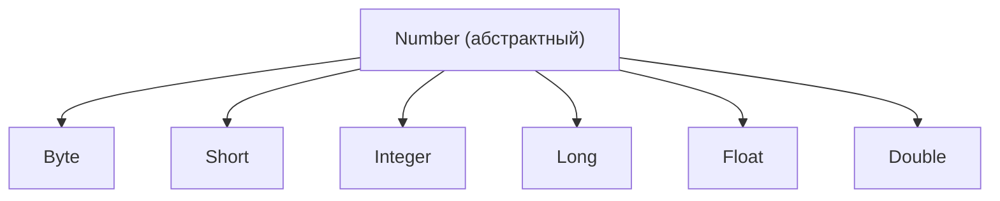

# Урок 6. Числа и строки

**Трейл:** Learning the Java Language · **Оригинал:** [Numbers and Strings](https://docs.oracle.com/javase/tutorial/java/data/index.html)
**Связанные области:** [[01-core-java-syntax-oop]] · **Вопросы:** core-java

> Перевод официального руководства Oracle (The Java Tutorials, JDK 8).

Этот раздел начинается с обсуждения класса `Number` (из пакета `java.lang`) и его подклассов. В частности, рассматриваются ситуации, в которых вы используете экземпляры этих классов вместо примитивных типов данных. Кроме того, обсуждаются другие классы, которые могут понадобиться при работе с числами, например для форматирования или для применения математических функций, дополняющих встроенные в язык операторы. Наконец, рассматриваются автоупаковка (*autoboxing*) и автораспаковка (*unboxing*) — возможность компилятора, упрощающая ваш код.

Строки (*strings*), широко используемые в программировании на Java, представляют собой последовательность символов. В языке Java строки — это объекты. В этом разделе описывается использование класса `String` для создания и работы со строками. Также сравниваются классы `String` и `StringBuilder`.

---

# Числа

В этом разделе обсуждаются класс `Number` из пакета `java.lang`, его подклассы и ситуации, в которых стоит использовать экземпляры этих классов вместо примитивных числовых типов.

Также представлены классы `PrintStream` и `DecimalFormat`, предоставляющие методы для записи форматированного числового вывода.

Наконец, рассматривается класс `Math` из пакета `java.lang`. Он содержит математические функции, дополняющие встроенные в язык операторы. В этом классе есть методы для тригонометрических функций, экспоненциальных функций и т. д.

## Классы-числа (The Numbers Classes)

При работе с числами в большинстве случаев в коде используются примитивные типы. Например:

```java
int i = 500;
float gpa = 3.65f;
byte mask = 0x7f;
```

Однако есть причины использовать объекты вместо примитивов, и платформа Java предоставляет классы-обёртки (*wrapper classes*) для каждого из примитивных типов данных. Эти классы «оборачивают» примитив в объект. Часто оборачивание выполняет компилятор: если вы используете примитив там, где ожидается объект, компилятор сам *упаковывает* (*boxes*) примитив в его класс-обёртку. И наоборот, если вы используете числовой объект там, где ожидается примитив, компилятор сам *распаковывает* (*unboxes*) объект. Подробнее см. [Автоупаковка и автораспаковка](#автоупаковка-и-автораспаковка-autoboxing-and-unboxing).

Все числовые классы-обёртки являются подклассами абстрактного класса `Number`:

<!-- original: assets/02-learning-the-language/numbers-hierarchy.png | Иерархия числовых классов-обёрток, все наследуют Number (Oracle) -->


> **Примечание.** Существуют ещё четыре подкласса `Number`, которые здесь не рассматриваются. `BigDecimal` и `BigInteger` используются для вычислений высокой точности. `AtomicInteger` и `AtomicLong` используются в многопоточных приложениях.

Есть три причины, по которым можно использовать объект `Number`, а не примитив:

1. В качестве аргумента метода, ожидающего объект (часто применяется при работе с коллекциями чисел).
2. Чтобы использовать определённые в классе константы, такие как `MIN_VALUE` и `MAX_VALUE`, задающие верхнюю и нижнюю границы типа данных.
3. Чтобы использовать методы класса для преобразования значений в другие примитивные типы и обратно, для преобразования в строки и обратно, а также для преобразования между системами счисления (десятичной, восьмеричной, шестнадцатеричной, двоичной).

В следующей таблице перечислены методы экземпляра, которые реализуют все подклассы класса `Number`.

### Методы, реализуемые всеми подклассами `Number`

| Метод | Описание |
|-------|----------|
| `byte byteValue()` <br> `short shortValue()` <br> `int intValue()` <br> `long longValue()` <br> `float floatValue()` <br> `double doubleValue()` | Преобразует значение этого объекта `Number` в возвращаемый примитивный тип данных. |
| `int compareTo(Byte anotherByte)` <br> `int compareTo(Double anotherDouble)` <br> `int compareTo(Float anotherFloat)` <br> `int compareTo(Integer anotherInteger)` <br> `int compareTo(Long anotherLong)` <br> `int compareTo(Short anotherShort)` | Сравнивает этот объект `Number` с аргументом. |
| `boolean equals(Object obj)` | Определяет, равен ли этот числовой объект аргументу. Метод возвращает `true`, если аргумент не равен `null` и является объектом того же типа с тем же числовым значением. Для объектов `Double` и `Float` есть дополнительные требования, описанные в документации Java API. |

Каждый класс `Number` содержит и другие методы, полезные для преобразования чисел в строки и обратно, а также для преобразования между системами счисления. В следующей таблице перечислены такие методы класса `Integer`. Методы остальных подклассов `Number` аналогичны.

### Методы преобразования класса `Integer`

| Метод | Описание |
|-------|----------|
| `static Integer decode(String s)` | Декодирует строку в целое число. На вход может принимать строковые представления десятичных, восьмеричных или шестнадцатеричных чисел. |
| `static int parseInt(String s)` | Возвращает целое число (только десятичное). |
| `static int parseInt(String s, int radix)` | Возвращает целое число по строковому представлению десятичного, двоичного, восьмеричного или шестнадцатеричного числа (`radix` равен 10, 2, 8 или 16 соответственно). |
| `String toString()` | Возвращает объект `String`, представляющий значение этого `Integer`. |
| `static String toString(int i)` | Возвращает объект `String`, представляющий указанное целое число. |
| `static Integer valueOf(int i)` | Возвращает объект `Integer`, содержащий значение указанного примитива. |
| `static Integer valueOf(String s)` | Возвращает объект `Integer`, содержащий значение указанного строкового представления. |
| `static Integer valueOf(String s, int radix)` | Возвращает объект `Integer`, содержащий целочисленное значение указанного строкового представления, разобранного с учётом значения `radix`. Например, если `s = "333"` и `radix = 8`, метод возвращает десятичный эквивалент восьмеричного числа 333. |

## Форматирование числового вывода (Formatting Numeric Print Output)

Ранее вы видели использование методов `print` и `println` для печати строк в стандартный вывод (`System.out`). Поскольку все числа можно преобразовать в строки (как вы увидите далее в этом уроке), эти методы можно использовать для печати произвольной смеси строк и чисел. Однако в языке Java есть и другие методы, позволяющие гораздо точнее управлять выводом, когда в нём участвуют числа.

### Методы printf и format

Пакет `java.io` включает класс `PrintStream`, у которого есть два метода форматирования, способные заменить `print` и `println`. Эти методы, `format` и `printf`, эквивалентны друг другу. Знакомый вам `System.out`, который вы использовали, на самом деле является объектом `PrintStream`, поэтому вы можете вызывать у `System.out` методы `PrintStream`. Таким образом, вы можете использовать `format` или `printf` везде в коде, где раньше использовали `print` или `println`. Например:

```java
System.out.format(.....);
```

Синтаксис обоих этих методов класса `java.io.PrintStream` одинаков:

```java
public PrintStream format(String format, Object... args)
```

где `format` — это строка, задающая используемое форматирование, а `args` — список переменных, которые нужно напечатать с этим форматированием. Простой пример:

```java
System.out.format("The value of " + "the float variable is " +
     "%f, while the value of the " + "integer variable is %d, " +
     "and the string is %s", floatVar, intVar, stringVar);
```

Первый параметр, `format`, — это строка формата, задающая, как должны быть отформатированы объекты из второго параметра, `args`. Строка формата содержит обычный текст, а также *спецификаторы формата* (*format specifiers*) — специальные символы, форматирующие аргументы из `Object... args`. (Запись `Object... args` называется *varargs* и означает, что число аргументов может варьироваться.)

Спецификаторы формата начинаются со знака процента (`%`) и заканчиваются *конвертером* (*converter*). Конвертер — это символ, указывающий тип форматируемого аргумента. Между знаком процента (`%`) и конвертером можно указывать необязательные флаги и спецификаторы. Существует множество конвертеров, флагов и спецификаторов, документированных в классе `java.util.Formatter`.

Вот простой пример:

```java
int i = 461012;
System.out.format("The value of i is: %d%n", i);
```

`%d` указывает, что единственная переменная — десятичное целое. `%n` — это платформонезависимый символ новой строки. Вывод:

```
The value of i is: 461012
```

Методы `printf` и `format` перегружены. У каждого есть версия со следующим синтаксисом:

```java
public PrintStream format(Locale l, String format, Object... args)
```

Чтобы напечатать числа во французской системе (где вместо десятичной точки в английском представлении чисел с плавающей точкой используется запятая), вы бы написали:

```java
System.out.format(Locale.FRANCE,
    "The value of the float " + "variable is %f, while the " +
    "value of the integer variable " + "is %d, and the string is %s%n", 
    floatVar, intVar, stringVar);
```

### Пример

В следующей таблице перечислены некоторые конвертеры и флаги, используемые в примере программы `TestFormat.java`, приведённом после таблицы.

#### Конвертеры и флаги, используемые в `TestFormat.java`

| Конвертер | Флаг | Объяснение |
|-----------|------|------------|
| `d` | | Десятичное целое. |
| `f` | | Число с плавающей точкой (`float`). |
| `n` | | Символ новой строки, соответствующий платформе, на которой выполняется приложение. Следует всегда использовать `%n`, а не `\n`. |
| `tB` | | Преобразование даты и времени — полное название месяца с учётом локали. |
| `td`, `te` | | Преобразование даты и времени — день месяца из 2 цифр. `td` дополняет ведущими нулями при необходимости, `te` — нет. |
| `ty`, `tY` | | Преобразование даты и времени — `ty` = год из 2 цифр, `tY` = год из 4 цифр. |
| `tl` | | Преобразование даты и времени — час в 12-часовом формате. |
| `tM` | | Преобразование даты и времени — минуты из 2 цифр, с ведущими нулями при необходимости. |
| `tp` | | Преобразование даты и времени — am/pm с учётом локали (строчными буквами). |
| `tm` | | Преобразование даты и времени — месяцы из 2 цифр, с ведущими нулями при необходимости. |
| `tD` | | Преобразование даты и времени — дата в виде `%tm%td%ty`. |
| | `08` | Ширина восемь символов, с ведущими нулями при необходимости. |
| | `+` | Включает знак, как положительный, так и отрицательный. |
| | `,` | Включает разделители группировки с учётом локали. |
| | `-` | Выравнивание по левому краю. |
| | `.3` | Три знака после десятичной точки. |
| | `10.3` | Ширина десять символов, выравнивание по правому краю, три знака после десятичной точки. |

Следующая программа показывает некоторые виды форматирования, которые можно выполнять с помощью `format`. Вывод приведён в двойных кавычках во встроенных комментариях:

```java
import java.util.Calendar;
import java.util.Locale;

public class TestFormat {
    
    public static void main(String[] args) {
      long n = 461012;
      System.out.format("%d%n", n);      //  -->  "461012"
      System.out.format("%08d%n", n);    //  -->  "00461012"
      System.out.format("%+8d%n", n);    //  -->  " +461012"
      System.out.format("%,8d%n", n);    // -->  " 461,012"
      System.out.format("%+,8d%n%n", n); //  -->  "+461,012"
      
      double pi = Math.PI;

      System.out.format("%f%n", pi);       // -->  "3.141593"
      System.out.format("%.3f%n", pi);     // -->  "3.142"
      System.out.format("%10.3f%n", pi);   // -->  "     3.142"
      System.out.format("%-10.3f%n", pi);  // -->  "3.142"
      System.out.format(Locale.FRANCE,
                        "%-10.4f%n%n", pi); // -->  "3,1416"

      Calendar c = Calendar.getInstance();
      System.out.format("%tB %te, %tY%n", c, c, c); // -->  "May 29, 2006"

      System.out.format("%tl:%tM %tp%n", c, c, c);  // -->  "2:34 am"

      System.out.format("%tD%n", c);    // -->  "05/29/06"
    }
}
```

> **Примечание.** Обсуждение в этом разделе охватывает лишь основы методов `format` и `printf`. Дополнительные подробности можно найти в разделе «Basic I/O» трейла Essential, на странице «Formatting». Использование `String.format` для создания строк рассматривается в разделе «Строки».

### Класс DecimalFormat

С помощью класса `java.text.DecimalFormat` можно управлять отображением ведущих и завершающих нулей, префиксов и суффиксов, разделителей группировки (тысяч) и десятичного разделителя. `DecimalFormat` предоставляет большую гибкость при форматировании чисел, но может усложнить ваш код.

Следующий пример создаёт объект `DecimalFormat` с именем `myFormatter`, передавая строку-шаблон в конструктор `DecimalFormat`. Затем `myFormatter` вызывает метод `format()`, который `DecimalFormat` наследует от `NumberFormat`: он принимает значение `double` в качестве аргумента и возвращает отформатированное число в виде строки.

Вот пример программы, иллюстрирующий использование `DecimalFormat`:

```java
import java.text.*;

public class DecimalFormatDemo {

   static public void customFormat(String pattern, double value ) {
      DecimalFormat myFormatter = new DecimalFormat(pattern);
      String output = myFormatter.format(value);
      System.out.println(value + "  " + pattern + "  " + output);
   }

   static public void main(String[] args) {

      customFormat("###,###.###", 123456.789);
      customFormat("###.##", 123456.789);
      customFormat("000000.000", 123.78);
      customFormat("$###,###.###", 12345.67);  
   }
}
```

Вывод:

```
123456.789  ###,###.###  123,456.789
123456.789  ###.##  123456.79
123.78  000000.000  000123.780
12345.67  $###,###.###  $12,345.67
```

Следующая таблица объясняет каждую строку вывода.

#### Вывод `DecimalFormat.java`

| Значение | Шаблон | Вывод | Объяснение |
|----------|--------|-------|------------|
| `123456.789` | `###,###.###` | `123,456.789` | Знак решётки (`#`) обозначает цифру, запятая — заполнитель для разделителя группировки, а точка — заполнитель для десятичного разделителя. |
| `123456.789` | `###.##` | `123456.79` | У значения три знака справа от десятичной точки, а в шаблоне только два. Метод `format` обрабатывает это округлением вверх. |
| `123.78` | `000000.000` | `000123.780` | Шаблон задаёт ведущие и завершающие нули, поскольку вместо знака решётки (`#`) используется символ `0`. |
| `12345.67` | `$###,###.###` | `$12,345.67` | Первый символ в шаблоне — знак доллара (`$`). Обратите внимание, что в отформатированном выводе он сразу предшествует крайней левой цифре. |

## Не только базовая арифметика (Beyond Basic Arithmetic)

Язык Java поддерживает базовую арифметику с помощью арифметических операторов: `+`, `-`, `*`, `/` и `%`. Класс `Math` из пакета `java.lang` предоставляет методы и константы для более продвинутых математических вычислений.

Все методы класса `Math` статические, поэтому вы вызываете их непосредственно из класса, вот так:

```java
Math.cos(angle);
```

> **Примечание.** Используя возможность языка [`static import`](https://docs.oracle.com/javase/tutorial/java/package/usepkgs.html#staticimport), вам не придётся писать `Math` перед каждой математической функцией:
>
> ```java
> import static java.lang.Math.*;
> ```
>
> Это позволяет вызывать методы класса `Math` по их простым именам. Например:
>
> ```java
> cos(angle);
> ```

### Константы и базовые методы

Класс `Math` включает две константы:

* `Math.E` — основание натуральных логарифмов;
* `Math.PI` — отношение длины окружности к её диаметру.

Класс `Math` также включает более 40 статических методов. В следующей таблице перечислен ряд базовых методов.

| Метод | Описание |
|-------|----------|
| `double abs(double d)` <br> `float abs(float f)` <br> `int abs(int i)` <br> `long abs(long lng)` | Возвращает абсолютное значение аргумента. |
| `double ceil(double d)` | Возвращает наименьшее целое, которое больше либо равно аргументу. Возвращается как `double`. |
| `double floor(double d)` | Возвращает наибольшее целое, которое меньше либо равно аргументу. Возвращается как `double`. |
| `double rint(double d)` | Возвращает целое, ближайшее по значению к аргументу. Возвращается как `double`. |
| `long round(double d)` <br> `int round(float f)` | Возвращает ближайший `long` или `int` (в зависимости от типа возвращаемого значения метода) к аргументу. |
| `double min(double arg1, double arg2)` <br> `float min(float arg1, float arg2)` <br> `int min(int arg1, int arg2)` <br> `long min(long arg1, long arg2)` | Возвращает меньший из двух аргументов. |
| `double max(double arg1, double arg2)` <br> `float max(float arg1, float arg2)` <br> `int max(int arg1, int arg2)` <br> `long max(long arg1, long arg2)` | Возвращает больший из двух аргументов. |

Следующая программа, `BasicMathDemo`, показывает, как использовать некоторые из этих методов:

```java
public class BasicMathDemo {
    public static void main(String[] args) {
        double a = -191.635;
        double b = 43.74;
        int c = 16, d = 45;

        System.out.printf("The absolute value " + "of %.3f is %.3f%n", 
                          a, Math.abs(a));

        System.out.printf("The ceiling of " + "%.2f is %.0f%n", 
                          b, Math.ceil(b));

        System.out.printf("The floor of " + "%.2f is %.0f%n", 
                          b, Math.floor(b));

        System.out.printf("The rint of %.2f " + "is %.0f%n", 
                          b, Math.rint(b));

        System.out.printf("The max of %d and " + "%d is %d%n",
                          c, d, Math.max(c, d));

        System.out.printf("The min of of %d " + "and %d is %d%n",
                          c, d, Math.min(c, d));
    }
}
```

Вот вывод этой программы:

```
The absolute value of -191.635 is 191.635
The ceiling of 43.74 is 44
The floor of 43.74 is 43
The rint of 43.74 is 44
The max of 16 and 45 is 45
The min of 16 and 45 is 16
```

### Экспоненциальные и логарифмические методы

В следующей таблице перечислены экспоненциальные и логарифмические методы класса `Math`.

| Метод | Описание |
|-------|----------|
| `double exp(double d)` | Возвращает основание натуральных логарифмов `e` в степени, равной аргументу. |
| `double log(double d)` | Возвращает натуральный логарифм аргумента. |
| `double pow(double base, double exponent)` | Возвращает значение первого аргумента, возведённое в степень, равную второму аргументу. |
| `double sqrt(double d)` | Возвращает квадратный корень аргумента. |

Следующая программа, `ExponentialDemo`, отображает значение `e`, а затем вызывает каждый из методов из предыдущей таблицы для произвольно выбранных чисел:

```java
public class ExponentialDemo {
    public static void main(String[] args) {
        double x = 11.635;
        double y = 2.76;

        System.out.printf("The value of " + "e is %.4f%n",
                          Math.E);

        System.out.printf("exp(%.3f) " + "is %.3f%n",
                          x, Math.exp(x));

        System.out.printf("log(%.3f) is " + "%.3f%n",
                          x, Math.log(x));

        System.out.printf("pow(%.3f, %.3f) " + "is %.3f%n",
                          x, y, Math.pow(x, y));

        System.out.printf("sqrt(%.3f) is " + "%.3f%n",
                          x, Math.sqrt(x));
    }
}
```

Вот вывод, который вы увидите при запуске `ExponentialDemo`:

```
The value of e is 2.7183
exp(11.635) is 112983.831
log(11.635) is 2.454
pow(11.635, 2.760) is 874.008
sqrt(11.635) is 3.411
```

### Тригонометрические методы

Класс `Math` также предоставляет набор тригонометрических функций, перечисленных в следующей таблице. Значение, передаваемое в каждый из этих методов, — угол, выраженный в радианах. Для преобразования из градусов в радианы можно использовать метод `toRadians`.

| Метод | Описание |
|-------|----------|
| `double sin(double d)` | Возвращает синус указанного значения `double`. |
| `double cos(double d)` | Возвращает косинус указанного значения `double`. |
| `double tan(double d)` | Возвращает тангенс указанного значения `double`. |
| `double asin(double d)` | Возвращает арксинус указанного значения `double`. |
| `double acos(double d)` | Возвращает арккосинус указанного значения `double`. |
| `double atan(double d)` | Возвращает арктангенс указанного значения `double`. |
| `double atan2(double y, double x)` | Преобразует прямоугольные координаты `(x, y)` в полярную координату `(r, theta)` и возвращает `theta`. |
| `double toDegrees(double d)` <br> `double toRadians(double d)` | Преобразует аргумент в градусы или радианы. |

Вот программа, `TrigonometricDemo`, использующая каждый из этих методов для вычисления различных тригонометрических значений для угла 45 градусов:

```java
public class TrigonometricDemo {
    public static void main(String[] args) {
        double degrees = 45.0;
        double radians = Math.toRadians(degrees);
        
        System.out.format("The value of pi " + "is %.4f%n",
                           Math.PI);

        System.out.format("The sine of %.1f " + "degrees is %.4f%n",
                          degrees, Math.sin(radians));

        System.out.format("The cosine of %.1f " + "degrees is %.4f%n",
                          degrees, Math.cos(radians));

        System.out.format("The tangent of %.1f " + "degrees is %.4f%n",
                          degrees, Math.tan(radians));

        System.out.format("The arcsine of %.4f " + "is %.4f degrees %n", 
                          Math.sin(radians), 
                          Math.toDegrees(Math.asin(Math.sin(radians))));

        System.out.format("The arccosine of %.4f " + "is %.4f degrees %n", 
                          Math.cos(radians),  
                          Math.toDegrees(Math.acos(Math.cos(radians))));

        System.out.format("The arctangent of %.4f " + "is %.4f degrees %n", 
                          Math.tan(radians), 
                          Math.toDegrees(Math.atan(Math.tan(radians))));
    }
}
```

Вывод этой программы следующий:

```
The value of pi is 3.1416
The sine of 45.0 degrees is 0.7071
The cosine of 45.0 degrees is 0.7071
The tangent of 45.0 degrees is 1.0000
The arcsine of 0.7071 is 45.0000 degrees
The arccosine of 0.7071 is 45.0000 degrees
The arctangent of 1.0000 is 45.0000 degrees
```

### Случайные числа

Метод `random()` возвращает псевдослучайно выбранное число от 0.0 до 1.0. Диапазон включает 0.0, но не включает 1.0. Иными словами: `0.0 <= Math.random() < 1.0`. Чтобы получить число в другом диапазоне, можно выполнить арифметические операции над значением, возвращаемым методом `random`. Например, чтобы сгенерировать целое число от 0 до 9, вы бы написали:

```java
int number = (int)(Math.random() * 10);
```

Умножая значение на 10, мы получаем диапазон возможных значений `0.0 <= number < 10.0`.

Использование `Math.random` хорошо подходит, когда нужно сгенерировать одно случайное число. Если же нужно сгенерировать серию случайных чисел, следует создать экземпляр `java.util.Random` и вызывать методы у этого объекта для генерации чисел.

## Итоги по числам (Summary of Numbers)

Чтобы обернуть число примитивного типа в объект, вы используете один из классов-обёрток — `Byte`, `Double`, `Float`, `Integer`, `Long` или `Short`. Компилятор Java автоматически оборачивает (упаковывает) примитивы при необходимости и распаковывает их, опять же при необходимости.

Классы `Number` включают константы и полезные методы класса. Константы `MIN_VALUE` и `MAX_VALUE` содержат наименьшее и наибольшее значения, которые может содержать объект данного типа. Методы `byteValue`, `shortValue` и подобные преобразуют один числовой тип в другой. Метод `valueOf` преобразует строку в число, а метод `toString` — число в строку.

Чтобы отформатировать строку, содержащую числа, для вывода, можно использовать методы `printf()` или `format()` класса `PrintStream`. Кроме того, можно использовать класс `NumberFormat` для настройки числовых форматов с помощью шаблонов.

Класс `Math` содержит разнообразные методы класса для выполнения математических функций, включая экспоненциальные, логарифмические и тригонометрические методы. `Math` также включает базовые арифметические функции, такие как абсолютное значение и округление, и метод `random()` для генерации случайных чисел.

## Вопросы и упражнения: числа (Questions and Exercises)

### Вопросы

1. Используя документацию API, найдите ответы на следующие вопросы:

   1. Какой метод `Integer` можно использовать для преобразования `int` в строку, выражающую число в шестнадцатеричном виде? Например, какой метод преобразует целое число 65 в строку `"41"`?

   2. Какой метод `Integer` вы бы использовали для преобразования строки, выраженной в системе с основанием 5, в эквивалентный `int`? Например, как преобразовать строку `"230"` в целочисленное значение 65? Покажите код, который вы бы использовали для решения этой задачи.

   3. Какой метод `Double` можно использовать для определения того, имеет ли число с плавающей точкой особое значение «не число» (`NaN`)?

2. Каково значение следующего выражения и почему?

   ```java
   Integer.valueOf(1).equals(Long.valueOf(1))
   ```

### Упражнения

1. Измените `MaxVariablesDemo`, чтобы показывать минимальные значения вместо максимальных. Можно удалить весь код, связанный с переменными `aChar` и `aBoolean`. Каков вывод?

2. Напишите программу, которая читает неопределённое число целочисленных аргументов из командной строки и складывает их. Например, предположим, что вы вводите следующее:

   ```
   java Adder 1 3 2 10
   ```

   Программа должна вывести `16` и затем завершиться. Программа должна выводить сообщение об ошибке, если пользователь вводит только один аргумент. За основу можно взять программу `ValueOfDemo`.

3. Создайте программу, аналогичную предыдущей, но со следующими отличиями:

   * Вместо целочисленных аргументов она читает аргументы с плавающей точкой.
   * Она отображает сумму аргументов, используя ровно два знака справа от десятичной точки.

   Например, предположим, что вы вводите следующее:

   ```
   java FPAdder 1 1e2 3.0 4.754
   ```

   Программа выведет `108.75`. В зависимости от вашей локали десятичным разделителем может быть запятая (`,`) вместо точки (`.`).

---

# Символы (Characters)

В большинстве случаев, если вы используете значение одного символа, вы используете примитивный тип `char`. Например:

```java
char ch = 'a'; 
// Юникод для прописной греческой буквы омега
char uniChar = 'Ω';
// массив символов
char[] charArray = { 'a', 'b', 'c', 'd', 'e' };
```

Однако бывают случаи, когда нужно использовать символ как объект — например, в качестве аргумента метода, где ожидается объект. Язык Java предоставляет для этой цели класс-обёртку (*wrapper class*), который «оборачивает» `char` в объект `Character`. Объект типа `Character` содержит единственное поле, тип которого — `char`. Этот класс `Character` также предлагает ряд полезных методов класса (то есть статических) для работы с символами.

Объект `Character` можно создать с помощью конструктора `Character`:

```java
Character ch = new Character('a');
```

Компилятор Java также при некоторых обстоятельствах создаст объект `Character` за вас. Например, если вы передаёте примитив `char` в метод, ожидающий объект, компилятор автоматически преобразует `char` в `Character`. Эта возможность называется *автоупаковкой* (*autoboxing*) — или *автораспаковкой* (*unboxing*), если преобразование идёт в обратную сторону. Подробнее об автоупаковке и автораспаковке см. [Автоупаковка и автораспаковка](#автоупаковка-и-автораспаковка-autoboxing-and-unboxing).

> **Примечание.** Класс `Character` неизменяемый (*immutable*), поэтому после создания объект `Character` изменить нельзя.

В следующей таблице перечислены некоторые из наиболее полезных методов класса `Character`, но список не является исчерпывающим. Полный перечень всех методов этого класса (их более 50) см. в спецификации API `java.lang.Character`.

### Полезные методы класса `Character`

| Метод | Описание |
|-------|----------|
| `boolean isLetter(char ch)` <br> `boolean isDigit(char ch)` | Определяет, является ли указанное значение `char` буквой или цифрой соответственно. |
| `boolean isWhitespace(char ch)` | Определяет, является ли указанное значение `char` пробельным символом. |
| `boolean isUpperCase(char ch)` <br> `boolean isLowerCase(char ch)` | Определяет, является ли указанное значение `char` прописным или строчным соответственно. |
| `char toUpperCase(char ch)` <br> `char toLowerCase(char ch)` | Возвращает прописную или строчную форму указанного значения `char`. |
| `toString(char ch)` | Возвращает объект `String`, представляющий указанное символьное значение, — то есть строку из одного символа. |

### Управляющие последовательности (Escape Sequences)

Символ, которому предшествует обратная косая черта (`\`), является *управляющей последовательностью* (*escape sequence*) и имеет особое значение для компилятора. В следующей таблице показаны управляющие последовательности Java:

#### Управляющие последовательности

| Последовательность | Описание |
|--------------------|----------|
| `\t` | Вставить в текст в этом месте символ табуляции. |
| `\b` | Вставить в текст в этом месте символ забоя (backspace). |
| `\n` | Вставить в текст в этом месте символ новой строки. |
| `\r` | Вставить в текст в этом месте символ возврата каретки. |
| `\f` | Вставить в текст в этом месте символ прогона страницы (form feed). |
| `\'` | Вставить в текст в этом месте символ одинарной кавычки. |
| `\"` | Вставить в текст в этом месте символ двойной кавычки. |
| `\\` | Вставить в текст в этом месте символ обратной косой черты. |

Когда в инструкции печати встречается управляющая последовательность, компилятор интерпретирует её соответствующим образом. Например, если нужно поставить кавычки внутри кавычек, для внутренних кавычек необходимо использовать управляющую последовательность `\"`. Чтобы напечатать предложение

```
She said "Hello!" to me.
```

вы бы написали

```java
System.out.println("She said \"Hello!\" to me.");
```

---

# Строки (Strings)

Строки (*strings*), широко используемые в программировании на Java, представляют собой последовательность символов. В языке Java строки — это объекты.

Платформа Java предоставляет класс `String` для создания строк и работы с ними.

## Создание строк

Самый прямой способ создать строку — написать:

```java
String greeting = "Hello world!";
```

В этом случае `"Hello world!"` — это *строковый литерал* (*string literal*): серия символов в коде, заключённая в двойные кавычки. Всякий раз, встречая в коде строковый литерал, компилятор создаёт объект `String` с этим значением — в данном случае `Hello world!`.

Как и любой другой объект, объекты `String` можно создавать с помощью ключевого слова `new` и конструктора. У класса `String` тринадцать конструкторов, позволяющих задать начальное значение строки из различных источников, например из массива символов:

```java
char[] helloArray = { 'h', 'e', 'l', 'l', 'o', '.' };
String helloString = new String(helloArray);
System.out.println(helloString);
```

Последняя строка этого фрагмента кода отображает `hello`.

> **Примечание.** Класс `String` неизменяемый (*immutable*), поэтому после создания объект `String` изменить нельзя. У класса `String` есть ряд методов, некоторые из которых обсуждаются ниже и которые, казалось бы, изменяют строки. Поскольку строки неизменяемы, на самом деле эти методы создают и возвращают новую строку, содержащую результат операции.

## Длина строки

Методы, используемые для получения информации об объекте, известны как *методы доступа* (*accessor methods*). Один из методов доступа, который можно использовать со строками, — метод `length()`, возвращающий число символов, содержащихся в строковом объекте. После выполнения следующих двух строк кода `len` будет равен 17:

```java
String palindrome = "Dot saw I was Tod";
int len = palindrome.length();
```

*Палиндром* — это слово или предложение, которое симметрично: оно одинаково читается вперёд и назад, если игнорировать регистр и пунктуацию. Вот короткая и неэффективная программа для разворота строки-палиндрома. Она вызывает метод `String` `charAt(i)`, возвращающий i-й символ строки, начиная отсчёт с 0.

```java
public class StringDemo {
    public static void main(String[] args) {
        String palindrome = "Dot saw I was Tod";
        int len = palindrome.length();
        char[] tempCharArray = new char[len];
        char[] charArray = new char[len];
        
        // помещаем исходную строку в 
        // массив символов
        for (int i = 0; i < len; i++) {
            tempCharArray[i] = 
                palindrome.charAt(i);
        } 
        
        // разворачиваем массив символов
        for (int j = 0; j < len; j++) {
            charArray[j] =
                tempCharArray[len - 1 - j];
        }
        
        String reversePalindrome =
            new String(charArray);
        System.out.println(reversePalindrome);
    }
}
```

Запуск программы даёт такой вывод:

```
doT saw I was toD
```

Чтобы выполнить разворот строки, программе пришлось преобразовать строку в массив символов (первый цикл `for`), развернуть массив во второй массив (второй цикл `for`), а затем преобразовать обратно в строку. Класс `String` включает метод `getChars()` для преобразования строки или её части в массив символов, поэтому первый цикл `for` в программе выше можно заменить на

```java
palindrome.getChars(0, len, tempCharArray, 0);
```

## Конкатенация строк

Класс `String` включает метод для конкатенации двух строк:

```java
string1.concat(string2);
```

Он возвращает новую строку, представляющую собой `string1` с добавленной в конец `string2`.

Метод `concat()` можно использовать и со строковыми литералами, как здесь:

```java
"My name is ".concat("Rumplestiltskin");
```

Чаще строки конкатенируют с помощью оператора `+`, как здесь:

```java
"Hello," + " world" + "!"
```

что даёт в результате

```
"Hello, world!"
```

Оператор `+` широко используется в инструкциях `print`. Например:

```java
String string1 = "saw I was ";
System.out.println("Dot " + string1 + "Tod");
```

что выводит

```
Dot saw I was Tod
```

Такая конкатенация может быть смесью любых объектов. Для каждого объекта, который не является `String`, вызывается его метод `toString()` для преобразования в `String`.

> **Примечание.** Язык Java не разрешает строковым литералам охватывать несколько строк в исходных файлах, поэтому в конце каждой строки многострочной строки необходимо использовать оператор конкатенации `+`. Например:
>
> ```java
> String quote = 
>     "Now is the time for all good " +
>     "men to come to the aid of their country.";
> ```
>
> Разбивка строк между строками кода с помощью оператора конкатенации `+`, опять же, очень распространена в инструкциях `print`.

## Создание форматных строк

Вы видели использование методов `printf()` и `format()` для печати вывода с форматированными числами. У класса `String` есть эквивалентный метод класса `format()`, возвращающий объект `String`, а не объект `PrintStream`.

Использование статического метода `format()` класса `String` позволяет создать форматированную строку, которую можно повторно использовать, в отличие от одноразовой инструкции печати. Например, вместо

```java
System.out.printf("The value of the float " +
                  "variable is %f, while " +
                  "the value of the " + 
                  "integer variable is %d, " +
                  "and the string is %s", 
                  floatVar, intVar, stringVar);
```

можно написать

```java
String fs;
fs = String.format("The value of the float " +
                   "variable is %f, while " +
                   "the value of the " + 
                   "integer variable is %d, " +
                   " and the string is %s",
                   floatVar, intVar, stringVar);
System.out.println(fs);
```

## Преобразование между числами и строками (Converting Between Numbers and Strings)

### Преобразование строк в числа

Часто программа получает числовые данные в строковом объекте — например, значение, введённое пользователем.

Подклассы `Number`, оборачивающие примитивные числовые типы (`Byte`, `Integer`, `Double`, `Float`, `Long` и `Short`), каждый предоставляют метод класса с именем `valueOf`, преобразующий строку в объект этого типа. Вот пример, `ValueOfDemo`, который получает две строки из командной строки, преобразует их в числа и выполняет арифметические операции над значениями:

```java
public class ValueOfDemo {
    public static void main(String[] args) {

        // эта программа требует два 
        // аргумента в командной строке 
        if (args.length == 2) {
            // преобразуем строки в числа
            float a = (Float.valueOf(args[0])).floatValue(); 
            float b = (Float.valueOf(args[1])).floatValue();

            // выполняем арифметику
            System.out.println("a + b = " +
                               (a + b));
            System.out.println("a - b = " +
                               (a - b));
            System.out.println("a * b = " +
                               (a * b));
            System.out.println("a / b = " +
                               (a / b));
            System.out.println("a % b = " +
                               (a % b));
        } else {
            System.out.println("This program " +
                "requires two command-line arguments.");
        }
    }
}
```

Вот вывод программы при использовании `4.5` и `87.2` в качестве аргументов командной строки:

```
a + b = 91.7
a - b = -82.7
a * b = 392.4
a / b = 0.0516055
a % b = 4.5
```

> **Примечание.** Каждый из подклассов `Number`, оборачивающих примитивные числовые типы, также предоставляет метод `parseXXXX()` (например, `parseFloat()`), который можно использовать для преобразования строк в примитивные числа. Поскольку возвращается примитивный тип, а не объект, метод `parseFloat()` более прямой, чем метод `valueOf()`. Например, в программе `ValueOfDemo` можно было бы использовать:
>
> ```java
> float a = Float.parseFloat(args[0]);
> float b = Float.parseFloat(args[1]);
> ```

### Преобразование чисел в строки

Иногда нужно преобразовать число в строку, потому что требуется работать со значением в его строковой форме. Есть несколько простых способов преобразовать число в строку:

```java
int i;
// Конкатенация "i" с пустой строкой; преобразование выполняется за вас.
String s1 = "" + i;
```

или

```java
// Метод класса valueOf.
String s2 = String.valueOf(i);
```

Каждый из подклассов `Number` включает метод класса `toString()`, который преобразует его примитивный тип в строку. Например:

```java
int i;
double d;
String s3 = Integer.toString(i); 
String s4 = Double.toString(d);
```

Пример `ToStringDemo` использует метод `toString` для преобразования числа в строку. Затем программа использует некоторые методы строки для вычисления числа цифр до и после десятичной точки:

```java
public class ToStringDemo {
    
    public static void main(String[] args) {
        double d = 858.48;
        String s = Double.toString(d);
        
        int dot = s.indexOf('.');
        
        System.out.println(dot + " digits " +
            "before decimal point.");
        System.out.println( (s.length() - dot - 1) +
            " digits after decimal point.");
    }
}
```

Вывод этой программы:

```
3 digits before decimal point.
2 digits after decimal point.
```

## Работа с символами в строке (Manipulating Characters in a String)

Класс `String` имеет ряд методов для исследования содержимого строк, поиска символов или подстрок внутри строки, изменения регистра и других задач.

### Получение символов и подстрок по индексу

Получить символ по определённому индексу внутри строки можно, вызвав метод доступа `charAt()`. Индекс первого символа — 0, а индекс последнего символа — `length()-1`. Например, следующий код получает символ по индексу 9 в строке:

```java
String anotherPalindrome = "Niagara. O roar again!"; 
char aChar = anotherPalindrome.charAt(9);
```

Индексы начинаются с 0, поэтому символ по индексу 9 — это `'O'`.

Если нужно получить более одного последовательного символа из строки, можно использовать метод `substring`. У метода `substring` есть две версии, показанные в следующей таблице:

| Метод | Описание |
|-------|----------|
| `String substring(int beginIndex, int endIndex)` | Возвращает новую строку, являющуюся подстрокой этой строки. Подстрока начинается с указанного `beginIndex` и продолжается до символа с индексом `endIndex - 1`. |
| `String substring(int beginIndex)` | Возвращает новую строку, являющуюся подстрокой этой строки. Целочисленный аргумент задаёт индекс первого символа. Здесь возвращаемая подстрока продолжается до конца исходной строки. |

Следующий код получает из палиндрома про Ниагару подстроку, которая простирается от индекса 11 до, но не включая, индекс 15 — это слово `"roar"`:

```java
String anotherPalindrome = "Niagara. O roar again!"; 
String roar = anotherPalindrome.substring(11, 15);
```

### Другие методы работы со строками

Вот несколько других методов `String` для работы со строками:

| Метод | Описание |
|-------|----------|
| `String[] split(String regex)` <br> `String[] split(String regex, int limit)` | Ищет совпадение, заданное строковым аргументом (содержащим регулярное выражение), и соответственно разбивает эту строку на массив строк. Необязательный целочисленный аргумент задаёт максимальный размер возвращаемого массива. Регулярные выражения рассматриваются в уроке под названием «Regular Expressions». |
| `CharSequence subSequence(int beginIndex, int endIndex)` | Возвращает новую последовательность символов, построенную начиная с индекса `beginIndex` и вплоть до `endIndex - 1`. |
| `String trim()` | Возвращает копию этой строки с удалёнными ведущими и завершающими пробельными символами. |
| `String toLowerCase()` <br> `String toUpperCase()` | Возвращает копию этой строки, преобразованную к нижнему или верхнему регистру. Если преобразований не требуется, эти методы возвращают исходную строку. |

### Поиск символов и подстрок в строке

Вот ещё несколько методов `String` для поиска символов или подстрок внутри строки. Класс `String` предоставляет методы доступа, возвращающие позицию в строке определённого символа или подстроки: `indexOf()` и `lastIndexOf()`. Методы `indexOf()` ищут вперёд от начала строки, а методы `lastIndexOf()` ищут назад от конца строки. Если символ или подстрока не найдены, `indexOf()` и `lastIndexOf()` возвращают -1.

Класс `String` также предоставляет метод поиска `contains`, возвращающий `true`, если строка содержит определённую последовательность символов. Используйте этот метод, когда вам нужно лишь узнать, что строка содержит последовательность символов, а её точное расположение неважно.

В следующей таблице описаны различные методы поиска в строке.

| Метод | Описание |
|-------|----------|
| `int indexOf(int ch)` <br> `int lastIndexOf(int ch)` | Возвращает индекс первого (последнего) вхождения указанного символа. |
| `int indexOf(int ch, int fromIndex)` <br> `int lastIndexOf(int ch, int fromIndex)` | Возвращает индекс первого (последнего) вхождения указанного символа, ища вперёд (назад) от указанного индекса. |
| `int indexOf(String str)` <br> `int lastIndexOf(String str)` | Возвращает индекс первого (последнего) вхождения указанной подстроки. |
| `int indexOf(String str, int fromIndex)` <br> `int lastIndexOf(String str, int fromIndex)` | Возвращает индекс первого (последнего) вхождения указанной подстроки, ища вперёд (назад) от указанного индекса. |
| `boolean contains(CharSequence s)` | Возвращает `true`, если строка содержит указанную последовательность символов. |

> **Примечание.** `CharSequence` — это интерфейс, реализуемый классом `String`. Поэтому строку можно использовать в качестве аргумента метода `contains()`.

### Замена символов и подстрок в строке

У класса `String` очень мало методов для вставки символов или подстрок в строку. В общем случае они не нужны: можно создать новую строку конкатенацией подстрок, которые вы *удалили* из строки, с подстрокой, которую хотите вставить.

Однако у класса `String` есть четыре метода для *замены* найденных символов или подстрок. Это:

| Метод | Описание |
|-------|----------|
| `String replace(char oldChar, char newChar)` | Возвращает новую строку, полученную заменой всех вхождений `oldChar` в этой строке на `newChar`. |
| `String replace(CharSequence target, CharSequence replacement)` | Заменяет каждую подстроку этой строки, совпадающую с литеральной последовательностью `target`, указанной литеральной последовательностью `replacement`. |
| `String replaceAll(String regex, String replacement)` | Заменяет каждую подстроку этой строки, совпадающую с заданным регулярным выражением, заданной заменой. |
| `String replaceFirst(String regex, String replacement)` | Заменяет первую подстроку этой строки, совпадающую с заданным регулярным выражением, заданной заменой. |

### Пример

Следующий класс, `Filename`, иллюстрирует использование `lastIndexOf()` и `substring()` для выделения различных частей имени файла.

> **Примечание.** Методы в следующем классе `Filename` не выполняют никакой проверки ошибок и предполагают, что их аргумент содержит полный путь к каталогу и имя файла с расширением. Будь это промышленный код, методы проверяли бы, что их аргументы корректно сформированы.

```java
public class Filename {
    private String fullPath;
    private char pathSeparator, 
                 extensionSeparator;

    public Filename(String str, char sep, char ext) {
        fullPath = str;
        pathSeparator = sep;
        extensionSeparator = ext;
    }

    public String extension() {
        int dot = fullPath.lastIndexOf(extensionSeparator);
        return fullPath.substring(dot + 1);
    }

    // получает имя файла без расширения
    public String filename() {
        int dot = fullPath.lastIndexOf(extensionSeparator);
        int sep = fullPath.lastIndexOf(pathSeparator);
        return fullPath.substring(sep + 1, dot);
    }

    public String path() {
        int sep = fullPath.lastIndexOf(pathSeparator);
        return fullPath.substring(0, sep);
    }
}
```

Вот программа, `FilenameDemo`, которая создаёт объект `Filename` и вызывает все его методы:

```java
public class FilenameDemo {
    public static void main(String[] args) {
        final String FPATH = "/home/user/index.html";
        Filename myHomePage = new Filename(FPATH, '/', '.');
        System.out.println("Extension = " + myHomePage.extension());
        System.out.println("Filename = " + myHomePage.filename());
        System.out.println("Path = " + myHomePage.path());
    }
}
```

А вот вывод программы:

```
Extension = html
Filename = index
Path = /home/user
```

Метод `extension` использует `lastIndexOf` для поиска последнего вхождения точки (`.`) в имени файла. Затем `substring` использует возвращаемое значение `lastIndexOf` для извлечения расширения имени файла — то есть подстроки от точки до конца строки. Этот код предполагает, что в имени файла есть точка; если точки нет, `lastIndexOf` возвращает -1, и метод `substring` бросает `StringIndexOutOfBoundsException`.

Также обратите внимание, что метод `extension` использует `dot + 1` в качестве аргумента `substring`. Если символ точки (`.`) — последний символ строки, `dot + 1` равно длине строки, что на единицу больше наибольшего индекса строки (поскольку индексы начинаются с 0). Это допустимый аргумент для `substring`, потому что этот метод принимает индекс, равный длине строки (но не больше), и интерпретирует его как «конец строки».

## Сравнение строк и частей строк (Comparing Strings and Portions of Strings)

У класса `String` есть ряд методов для сравнения строк и частей строк. В следующей таблице перечислены эти методы.

### Методы сравнения строк

| Метод | Описание |
|-------|----------|
| `boolean endsWith(String suffix)` <br> `boolean startsWith(String prefix)` | Возвращает `true`, если эта строка заканчивается указанной в аргументе подстрокой или начинается с неё. |
| `boolean startsWith(String prefix, int offset)` | Рассматривает строку, начинающуюся с индекса `offset`, и возвращает `true`, если она начинается с подстроки, указанной в аргументе. |
| `int compareTo(String anotherString)` | Сравнивает две строки лексикографически. Возвращает целое число, указывающее, больше ли эта строка (результат > 0), равна (результат = 0) или меньше (результат < 0) аргумента. |
| `int compareToIgnoreCase(String str)` | Сравнивает две строки лексикографически, игнорируя различия в регистре. Возвращает целое число, указывающее, больше ли эта строка (результат > 0), равна (результат = 0) или меньше (результат < 0) аргумента. |
| `boolean equals(Object anObject)` | Возвращает `true` тогда и только тогда, когда аргумент является объектом `String`, представляющим ту же последовательность символов, что и этот объект. |
| `boolean equalsIgnoreCase(String anotherString)` | Возвращает `true` тогда и только тогда, когда аргумент является объектом `String`, представляющим ту же последовательность символов, что и этот объект, игнорируя различия в регистре. |
| `boolean regionMatches(int toffset, String other, int ooffset, int len)` | Проверяет, совпадает ли указанная область этой строки с указанной областью строки-аргумента. Область имеет длину `len` и начинается с индекса `toffset` для этой строки и `ooffset` для другой строки. |
| `boolean regionMatches(boolean ignoreCase, int toffset, String other, int ooffset, int len)` | Проверяет, совпадает ли указанная область этой строки с указанной областью строки-аргумента. Область имеет длину `len` и начинается с индекса `toffset` для этой строки и `ooffset` для другой строки. Логический аргумент указывает, следует ли игнорировать регистр; если `true`, регистр игнорируется при сравнении символов. |
| `boolean matches(String regex)` | Проверяет, совпадает ли эта строка с указанным регулярным выражением. Регулярные выражения обсуждаются в уроке под названием «Regular Expressions». |

Следующая программа, `RegionMatchesDemo`, использует метод `regionMatches` для поиска одной строки внутри другой строки:

```java
public class RegionMatchesDemo {
    public static void main(String[] args) {
        String searchMe = "Green Eggs and Ham";
        String findMe = "Eggs";
        int searchMeLength = searchMe.length();
        int findMeLength = findMe.length();
        boolean foundIt = false;
        for (int i = 0; 
             i <= (searchMeLength - findMeLength);
             i++) {
           if (searchMe.regionMatches(i, findMe, 0, findMeLength)) {
              foundIt = true;
              System.out.println(searchMe.substring(i, i + findMeLength));
              break;
           }
        }
        if (!foundIt)
            System.out.println("No match found.");
    }
}
```

Вывод этой программы — `Eggs`.

Программа проходит по строке, на которую ссылается `searchMe`, по одному символу за раз. Для каждого символа программа вызывает метод `regionMatches`, чтобы определить, совпадает ли подстрока, начинающаяся с текущего символа, со строкой, которую ищет программа.

## Класс StringBuilder (The StringBuilder Class)

Объекты `StringBuilder` похожи на объекты `String`, за исключением того, что их можно изменять. Внутри эти объекты обрабатываются как массивы переменной длины, содержащие последовательность символов. В любой момент длину и содержимое последовательности можно изменить вызовами методов.

Строки следует использовать всегда, кроме случаев, когда строковые билдеры дают преимущество в виде более простого кода (см. пример программы в конце этого раздела) или лучшей производительности. Например, если нужно конкатенировать большое число строок, добавление к объекту `StringBuilder` эффективнее.

### Длина и ёмкость

Класс `StringBuilder`, как и класс `String`, имеет метод `length()`, возвращающий длину последовательности символов в билдере.

В отличие от строк, у каждого строкового билдера также есть *ёмкость* (*capacity*) — число выделенных позиций под символы. Ёмкость, возвращаемая методом `capacity()`, всегда больше либо равна длине (обычно больше) и автоматически расширяется по мере необходимости для размещения добавлений в строковый билдер.

#### Конструкторы `StringBuilder`

| Конструктор | Описание |
|-------------|----------|
| `StringBuilder()` | Создаёт пустой строковый билдер с ёмкостью 16 (16 пустых элементов). |
| `StringBuilder(CharSequence cs)` | Создаёт строковый билдер, содержащий те же символы, что и указанный `CharSequence`, плюс дополнительные 16 пустых элементов в конце `CharSequence`. |
| `StringBuilder(int initCapacity)` | Создаёт пустой строковый билдер с указанной начальной ёмкостью. |
| `StringBuilder(String s)` | Создаёт строковый билдер, значение которого инициализируется указанной строкой, плюс дополнительные 16 пустых элементов в конце строки. |

Например, следующий код

```java
// создаёт пустой билдер, ёмкость 16
StringBuilder sb = new StringBuilder();
// добавляет строку из 9 символов в начало
sb.append("Greetings");
```

создаст строковый билдер с длиной 9 и ёмкостью 16.

У класса `StringBuilder` есть методы, связанные с длиной и ёмкостью, которых нет у класса `String`:

#### Методы длины и ёмкости

| Метод | Описание |
|-------|----------|
| `void setLength(int newLength)` | Устанавливает длину последовательности символов. Если `newLength` меньше `length()`, последние символы в последовательности усекаются. Если `newLength` больше `length()`, в конец последовательности добавляются нулевые символы. |
| `void ensureCapacity(int minCapacity)` | Гарантирует, что ёмкость не меньше указанного минимума. |

Ряд операций (например, `append()`, `insert()` или `setLength()`) может увеличить длину последовательности символов в строковом билдере так, что результирующая `length()` станет больше текущей `capacity()`. Когда это происходит, ёмкость автоматически увеличивается.

### Операции StringBuilder

Главные операции `StringBuilder`, недоступные в `String`, — это методы `append()` и `insert()`, которые перегружены так, чтобы принимать данные любого типа. Каждый из них преобразует свой аргумент в строку, а затем добавляет или вставляет символы этой строки в последовательность символов строкового билдера. Метод `append` всегда добавляет эти символы в конец существующей последовательности символов, тогда как метод `insert` добавляет символы в указанную точку.

Вот ряд методов класса `StringBuilder`.

#### Различные методы `StringBuilder`

| Метод | Описание |
|-------|----------|
| `StringBuilder append(boolean b)` <br> `StringBuilder append(char c)` <br> `StringBuilder append(char[] str)` <br> `StringBuilder append(char[] str, int offset, int len)` <br> `StringBuilder append(double d)` <br> `StringBuilder append(float f)` <br> `StringBuilder append(int i)` <br> `StringBuilder append(long lng)` <br> `StringBuilder append(Object obj)` <br> `StringBuilder append(String s)` | Добавляет аргумент в конец этого строкового билдера. Данные преобразуются в строку перед выполнением операции добавления. |
| `StringBuilder delete(int start, int end)` <br> `StringBuilder deleteCharAt(int index)` | Первый метод удаляет подпоследовательность от `start` до `end-1` (включительно) в последовательности символов `StringBuilder`. Второй метод удаляет символ, расположенный по индексу `index`. |
| `StringBuilder insert(int offset, boolean b)` <br> `StringBuilder insert(int offset, char c)` <br> `StringBuilder insert(int offset, char[] str)` <br> `StringBuilder insert(int index, char[] str, int offset, int len)` <br> `StringBuilder insert(int offset, double d)` <br> `StringBuilder insert(int offset, float f)` <br> `StringBuilder insert(int offset, int i)` <br> `StringBuilder insert(int offset, long lng)` <br> `StringBuilder insert(int offset, Object obj)` <br> `StringBuilder insert(int offset, String s)` | Вставляет второй аргумент в строковый билдер. Первый целочисленный аргумент указывает индекс, перед которым должны быть вставлены данные. Данные преобразуются в строку перед выполнением операции вставки. |
| `StringBuilder replace(int start, int end, String s)` <br> `void setCharAt(int index, char c)` | Заменяет указанный символ (символы) в этом строковом билдере. |
| `StringBuilder reverse()` | Разворачивает последовательность символов в этом строковом билдере. |
| `String toString()` | Возвращает строку, содержащую последовательность символов из билдера. |

> **Примечание.** Любой метод `String` можно применить к объекту `StringBuilder`, сначала преобразовав строковый билдер в строку методом `toString()` класса `StringBuilder`. Затем преобразовать строку обратно в строковый билдер с помощью конструктора `StringBuilder(String str)`.

### Пример

Программа `StringDemo`, приведённая в разделе «Строки», — пример программы, которая была бы эффективнее, если бы вместо `String` использовался `StringBuilder`.

`StringDemo` разворачивал палиндром. Вот, ещё раз, его листинг:

```java
public class StringDemo {
    public static void main(String[] args) {
        String palindrome = "Dot saw I was Tod";
        int len = palindrome.length();
        char[] tempCharArray = new char[len];
        char[] charArray = new char[len];
        
        // помещаем исходную строку в 
        // массив символов
        for (int i = 0; i < len; i++) {
            tempCharArray[i] = 
                palindrome.charAt(i);
        } 
        
        // разворачиваем массив символов
        for (int j = 0; j < len; j++) {
            charArray[j] =
                tempCharArray[len - 1 - j];
        }
        
        String reversePalindrome =
            new String(charArray);
        System.out.println(reversePalindrome);
    }
}
```

Запуск программы даёт такой вывод:

```
doT saw I was toD
```

Чтобы выполнить разворот строки, программа преобразует строку в массив символов (первый цикл `for`), разворачивает массив во второй массив (второй цикл `for`), а затем преобразует обратно в строку.

Если преобразовать строку `palindrome` в строковый билдер, можно использовать метод `reverse()` класса `StringBuilder`. Это делает код проще и легче для чтения:

```java
public class StringBuilderDemo {
    public static void main(String[] args) {
        String palindrome = "Dot saw I was Tod";
         
        StringBuilder sb = new StringBuilder(palindrome);
        
        sb.reverse();  // развернуть его
        
        System.out.println(sb);
    }
}
```

Запуск этой программы даёт тот же вывод:

```
doT saw I was toD
```

Обратите внимание, что `println()` печатает строковый билдер, как здесь:

```java
System.out.println(sb);
```

потому что `sb.toString()` вызывается неявно, как и для любого другого объекта при вызове `println()`.

> **Примечание.** Существует также класс `StringBuffer`, *точно* такой же, как класс `StringBuilder`, за исключением того, что он потокобезопасен (*thread-safe*) благодаря синхронизации своих методов. Потоки обсуждаются в уроке о конкурентности.

## Итоги по символам и строкам (Summary of Characters and Strings)

В большинстве случаев, если вы используете значение одного символа, вы используете примитивный тип `char`. Однако бывают случаи, когда нужно использовать символ как объект — например, в качестве аргумента метода, где ожидается объект. Язык Java предоставляет для этой цели класс-обёртку, который «оборачивает» `char` в объект `Character`. Объект типа `Character` содержит единственное поле, тип которого — `char`. Этот класс `Character` также предлагает ряд полезных методов класса (то есть статических) для работы с символами.

Строки — это последовательность символов, широко используемая в программировании на Java. В языке Java строки — это объекты. Класс `String` имеет более 60 методов и 13 конструкторов.

Чаще всего строку создают инструкцией вроде

```java
String s = "Hello world!";
```

а не с помощью одного из конструкторов `String`.

У класса `String` много методов для поиска и извлечения подстрок; их затем можно легко собрать заново в новые строки с помощью оператора конкатенации `+`.

Класс `String` также включает ряд служебных методов, среди них `split()`, `toLowerCase()`, `toUpperCase()` и `valueOf()`. Последний метод незаменим при преобразовании введённых пользователем строк в числа. У подклассов `Number` также есть методы для преобразования строк в числа и наоборот.

Помимо класса `String`, есть и класс `StringBuilder`. Работа с объектами `StringBuilder` иногда может быть эффективнее работы со строками. Класс `StringBuilder` предлагает несколько методов, которые могут быть полезны для строк, среди них `reverse()`. Однако в целом у класса `String` более широкое разнообразие методов.

Строку можно преобразовать в строковый билдер с помощью конструктора `StringBuilder`. Строковый билдер можно преобразовать в строку методом `toString()`.

---

# Автоупаковка и автораспаковка (Autoboxing and Unboxing)

*Автоупаковка* (*autoboxing*) — это автоматическое преобразование, которое компилятор Java выполняет между примитивными типами и соответствующими им классами-обёртками. Например, преобразование `int` в `Integer`, `double` в `Double` и так далее. Если преобразование идёт в обратную сторону, это называется *автораспаковкой* (*unboxing*).

Вот простейший пример автоупаковки:

```java
Character ch = 'a';
```

В остальных примерах этого раздела используются обобщения (*generics*). Если вы ещё не знакомы с синтаксисом обобщений, см. урок «Generics (Updated)».

Рассмотрим следующий код:

```java
List<Integer> li = new ArrayList<>();
for (int i = 1; i < 50; i += 2)
    li.add(i);
```

Хотя вы добавляете в `li` значения `int` как примитивные типы, а не как объекты `Integer`, код компилируется. Поскольку `li` — это список объектов `Integer`, а не список значений `int`, вы можете удивиться, почему компилятор Java не выдаёт ошибку времени компиляции. Компилятор не генерирует ошибку, потому что создаёт объект `Integer` из `i` и добавляет этот объект в `li`. Таким образом, компилятор преобразует предыдущий код в следующий во время выполнения:

```java
List<Integer> li = new ArrayList<>();
for (int i = 1; i < 50; i += 2)
    li.add(Integer.valueOf(i));
```

Преобразование примитивного значения (например, `int`) в объект соответствующего класса-обёртки (`Integer`) называется автоупаковкой. Компилятор Java применяет автоупаковку, когда примитивное значение:

* Передаётся как параметр в метод, ожидающий объект соответствующего класса-обёртки.
* Присваивается переменной соответствующего класса-обёртки.

Рассмотрим следующий метод:

```java
public static int sumEven(List<Integer> li) {
    int sum = 0;
    for (Integer i: li)
        if (i % 2 == 0)
            sum += i;
        return sum;
}
```

Поскольку операторы остатка (`%`) и составного присваивания (`+=`) не применимы к объектам `Integer`, вы можете удивиться, почему компилятор Java компилирует этот метод, не выдавая ошибок. Компилятор не генерирует ошибку, потому что во время выполнения вызывает метод `intValue` для преобразования `Integer` в `int`:

```java
public static int sumEven(List<Integer> li) {
    int sum = 0;
    for (Integer i : li)
        if (i.intValue() % 2 == 0)
            sum += i.intValue();
        return sum;
}
```

Преобразование объекта типа-обёртки (`Integer`) в соответствующее ему примитивное значение (`int`) называется автораспаковкой. Компилятор Java применяет автораспаковку, когда объект класса-обёртки:

* Передаётся как параметр в метод, ожидающий значение соответствующего примитивного типа.
* Присваивается переменной соответствующего примитивного типа.

Пример `Unboxing` показывает, как это работает:

```java
import java.util.ArrayList;
import java.util.List;

public class Unboxing {

    public static void main(String[] args) {
        Integer i = new Integer(-8);

        // 1. Распаковка при вызове метода
        int absVal = absoluteValue(i);
        System.out.println("absolute value of " + i + " = " + absVal);

        List<Double> ld = new ArrayList<>();
        ld.add(3.1416);    // Π автоупаковывается при вызове метода.

        // 2. Распаковка при присваивании
        double pi = ld.get(0);
        System.out.println("pi = " + pi);
    }

    public static int absoluteValue(int i) {
        return (i < 0) ? -i : i;
    }
}
```

Программа печатает следующее:

```
absolute value of -8 = 8
pi = 3.1416
```

Автоупаковка и автораспаковка позволяют разработчикам писать более чистый код, который легче читать. В следующей таблице перечислены примитивные типы и соответствующие им классы-обёртки, которые компилятор Java использует для автоупаковки и автораспаковки:

| Примитивный тип | Класс-обёртка |
|-----------------|---------------|
| `boolean` | `Boolean` |
| `byte` | `Byte` |
| `char` | `Character` |
| `float` | `Float` |
| `int` | `Integer` |
| `long` | `Long` |
| `short` | `Short` |
| `double` | `Double` |

## Вопросы и упражнения: символы и строки (Questions and Exercises)

### Вопросы

1. Какова начальная ёмкость следующего строкового билдера?
   ```java
   StringBuilder sb = new StringBuilder("Able was I ere I saw Elba.");
   ```

2. Рассмотрим следующую строку:
   ```java
   String hannah = "Did Hannah see bees? Hannah did.";
   ```
   1. Какое значение отображается выражением `hannah.length()`?
   2. Какое значение возвращает вызов метода `hannah.charAt(12)`?
   3. Напишите выражение, ссылающееся на букву `b` в строке, на которую ссылается `hannah`.

3. Какова длина строки, возвращаемой следующим выражением? Что это за строка?
   ```java
   "Was it a car or a cat I saw?".substring(9, 12)
   ```

4. В следующей программе под названием `ComputeResult` каково значение `result` после выполнения каждой пронумерованной строки?
   ```java
   public class ComputeResult {
       public static void main(String[] args) {
           String original = "software";
           StringBuilder result = new StringBuilder("hi");
           int index = original.indexOf('a');

   /*1*/   result.setCharAt(0, original.charAt(0));
   /*2*/   result.setCharAt(1, original.charAt(original.length()-1));
   /*3*/   result.insert(1, original.charAt(4));
   /*4*/   result.append(original.substring(1,4));
   /*5*/   result.insert(3, (original.substring(index, index+2) + " ")); 

           System.out.println(result);
       }
   }
   ```

### Упражнения

1. Покажите два способа конкатенировать следующие две строки, чтобы получить строку `"Hi, mom."`:
   ```java
   String hi = "Hi, ";
   String mom = "mom.";
   ```

2. Напишите программу, которая вычисляет ваши инициалы из полного имени и отображает их.

3. Анаграмма — это слово или фраза, образованная перестановкой букв другого слова или фразы; например, «parliament» — анаграмма «partial men», а «software» — анаграмма «swear oft». Напишите программу, которая определяет, является ли одна строка анаграммой другой строки. Программа должна игнорировать пробелы и пунктуацию.

## Источник

- [Lesson: Numbers and Strings](https://docs.oracle.com/javase/tutorial/java/data/index.html) — официальное руководство Oracle.
- [Numbers](https://docs.oracle.com/javase/tutorial/java/data/numbers.html) — официальное руководство Oracle.
- [The Numbers Classes](https://docs.oracle.com/javase/tutorial/java/data/numberclasses.html) — официальное руководство Oracle.
- [Formatting Numeric Print Output](https://docs.oracle.com/javase/tutorial/java/data/numberformat.html) — официальное руководство Oracle.
- [Beyond Basic Arithmetic](https://docs.oracle.com/javase/tutorial/java/data/beyondmath.html) — официальное руководство Oracle.
- [Summary of Numbers](https://docs.oracle.com/javase/tutorial/java/data/numbersummary.html) — официальное руководство Oracle.
- [Questions and Exercises: Numbers](https://docs.oracle.com/javase/tutorial/java/data/QandE/numbers-questions.html) — официальное руководство Oracle.
- [Characters](https://docs.oracle.com/javase/tutorial/java/data/characters.html) — официальное руководство Oracle.
- [Strings](https://docs.oracle.com/javase/tutorial/java/data/strings.html) — официальное руководство Oracle.
- [Converting Between Numbers and Strings](https://docs.oracle.com/javase/tutorial/java/data/converting.html) — официальное руководство Oracle.
- [Manipulating Characters in a String](https://docs.oracle.com/javase/tutorial/java/data/manipstrings.html) — официальное руководство Oracle.
- [Comparing Strings and Portions of Strings](https://docs.oracle.com/javase/tutorial/java/data/comparestrings.html) — официальное руководство Oracle.
- [The StringBuilder Class](https://docs.oracle.com/javase/tutorial/java/data/buffers.html) — официальное руководство Oracle.
- [Summary of Characters and Strings](https://docs.oracle.com/javase/tutorial/java/data/stringsummary.html) — официальное руководство Oracle.
- [Autoboxing and Unboxing](https://docs.oracle.com/javase/tutorial/java/data/autoboxing.html) — официальное руководство Oracle.
- [Questions and Exercises: Characters and Strings](https://docs.oracle.com/javase/tutorial/java/data/QandE/characters-questions.html) — официальное руководство Oracle.
