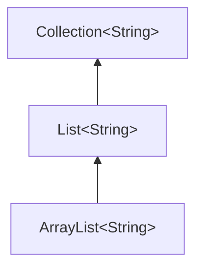
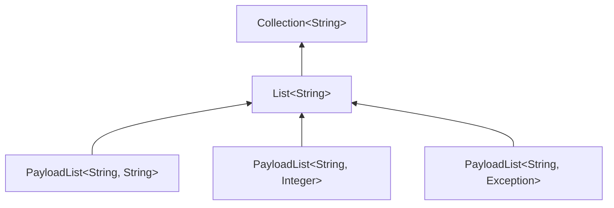
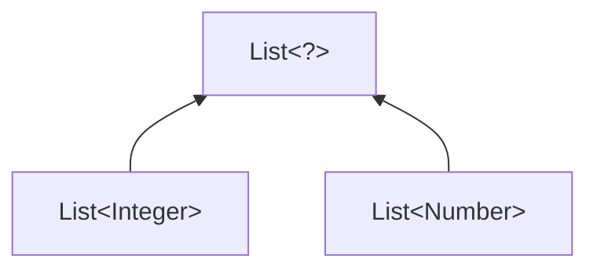
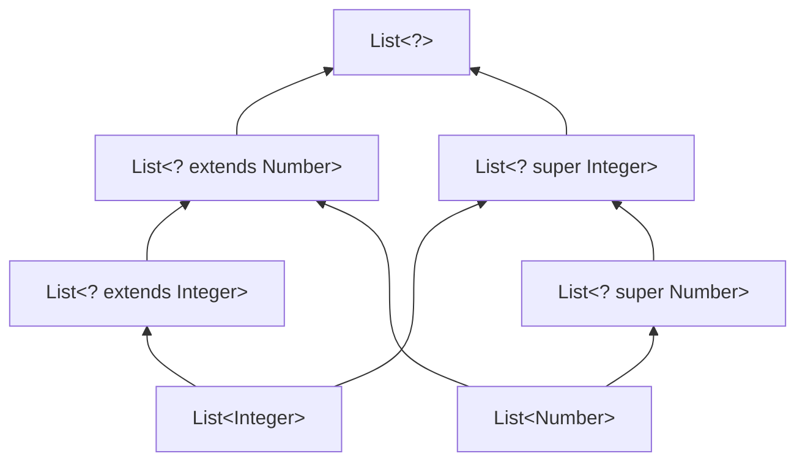

# Урок 7. Generics (обобщённое программирование)

**Трейл:** Learning the Java Language · **Оригинал:** [Generics (Updated)](https://docs.oracle.com/javase/tutorial/java/generics/index.html)
**Связанные области:** [[05-generics]] · **Вопросы:** core-java

> Перевод официального руководства Oracle (The Java Tutorials, JDK 8). Урок объединяет
> страницы трейла *«Learning the Java Language» → «Generics (Updated)»*: вводную страницу,
> *Why Use Generics?*, *Generic Types*, *Raw Types*, *Generic Methods*, *Bounded Type
> Parameters*, *Generic Methods and Bounded Type Parameters*, *Generics, Inheritance, and
> Subtypes*, *Type Inference*, *Wildcards* (со всеми подстраницами), *Type Erasure* (со всеми
> подстраницами), *Restrictions on Generics* и *Questions and Exercises*.

В любом нетривиальном программном проекте ошибки — просто часть жизни. Тщательное проектирование,
программирование и тестирование помогают снизить их распространённость, но так или иначе они всегда
найдут способ пробраться в ваш код. Особенно это проявляется, когда добавляются новые возможности,
а кодовая база растёт в размере и сложности.

К счастью, одни ошибки обнаружить легче, чем другие. Например, ошибки времени компиляции
(*compile-time bugs*) можно выявить на раннем этапе: по сообщениям компилятора об ошибках вы
понимаете, в чём проблема, и тут же её исправляете. А вот ошибки времени выполнения
(*runtime bugs*) гораздо коварнее — они проявляются не сразу, и когда это происходит, место
сбоя может быть далеко от настоящей причины проблемы.

Обобщения (*generics*) повышают стабильность кода, делая больше ошибок обнаружимыми во время
компиляции. После прохождения этого урока имеет смысл продолжить изучение по руководству по
обобщениям за авторством Гилада Брахи (Gilad Bracha).

## Зачем использовать обобщения?

Если коротко, обобщения (*generics*) позволяют *типам* (классам и интерфейсам) быть параметрами
при определении классов, интерфейсов и методов. Подобно более привычным *формальным параметрам*
(*formal parameters*), используемым в объявлениях методов, параметры типа (*type parameters*) дают
возможность повторно использовать один и тот же код с разными входными данными. Разница в том, что
входными данными для формальных параметров являются значения, а входными данными для параметров типа —
типы.

Код, использующий обобщения, имеет множество преимуществ перед необобщённым кодом.

**Более строгая проверка типов во время компиляции.** Компилятор Java применяет к обобщённому коду
строгую проверку типов и выдаёт ошибки, если код нарушает типобезопасность. Исправлять ошибки времени
компиляции проще, чем ошибки времени выполнения, которые бывает трудно найти.

**Устранение приведений типов.** Следующий фрагмент кода без обобщений требует приведения типа
(*casting*):

```java
List list = new ArrayList();
list.add("hello");
String s = (String) list.get(0);
```

После переписывания с использованием обобщений код приведения не требует:

```java
List<String> list = new ArrayList<String>();
list.add("hello");
String s = list.get(0);   // приведение не нужно
```

**Возможность реализации обобщённых алгоритмов.** Используя обобщения, программисты могут
реализовывать обобщённые алгоритмы, которые работают с коллекциями разных типов, могут
настраиваться, типобезопасны и легче читаются.

## Обобщённые типы (Generic Types)

Обобщённый тип (*generic type*) — это обобщённый класс или интерфейс, параметризованный по типам.
Следующий класс `Box` будет изменён, чтобы продемонстрировать эту концепцию.

### Простой класс Box

Начнём с рассмотрения необобщённого класса `Box`, который оперирует объектами любого типа. Ему
нужно лишь предоставить два метода: `set`, добавляющий объект в коробку, и `get`, извлекающий его:

```java
public class Box {
    private Object object;

    public void set(Object object) { this.object = object; }
    public Object get() { return object; }
}
```

Поскольку его методы принимают или возвращают `Object`, вы вольны передавать туда что угодно при
условии, что это не один из примитивных типов. Невозможно проверить во время компиляции, как именно
используется класс. Одна часть кода может поместить в коробку `Integer` и ожидать получить из неё
`Integer`, тогда как другая часть кода может по ошибке передать туда `String`, что приведёт к ошибке
времени выполнения.

### Обобщённая версия класса Box

Обобщённый класс (*generic class*) определяется в следующем формате:

```java
class name<T1, T2, ..., Tn> { /* ... */ }
```

Секция параметров типа, ограниченная угловыми скобками (`<>`), следует за именем класса. Она задаёт
параметры типа (*type parameters*), также называемые переменными типа (*type variables*), `T1`, `T2`,
…, `Tn`.

Чтобы обновить класс `Box` для использования обобщений, вы создаёте *объявление обобщённого типа*
(*generic type declaration*), заменяя код `public class Box` на `public class Box<T>`. Так вводится
переменная типа `T`, которую можно использовать где угодно внутри класса.

С этим изменением класс `Box` становится таким:

```java
/**
 * Обобщённая версия класса Box.
 * @param <T> тип помещаемого в коробку значения
 */
public class Box<T> {
    // T означает "Type" (тип)
    private T t;

    public void set(T t) { this.t = t; }
    public T get() { return t; }
}
```

Как видите, все вхождения `Object` заменены на `T`. Переменная типа может быть любым **непримитивным**
типом, который вы укажете: любым типом-классом, любым типом-интерфейсом, любым типом-массивом и даже
другой переменной типа.

Этот же приём можно применить и для создания обобщённых интерфейсов.

### Соглашения об именовании параметров типа

По соглашению имена параметров типа — одиночные заглавные буквы. Это резко контрастирует с уже
знакомыми вам соглашениями об именовании переменных, и не зря: без этого соглашения было бы трудно
отличить переменную типа от обычного имени класса или интерфейса.

Наиболее часто используемые имена параметров типа:

- `E` — Element (элемент; широко используется в Java Collections Framework);
- `K` — Key (ключ);
- `N` — Number (число);
- `T` — Type (тип);
- `V` — Value (значение);
- `S`, `U`, `V` и т. д. — 2-й, 3-й, 4-й типы.

Вы будете встречать эти имена на протяжении всего Java SE API и остальной части этого урока.

### Вызов и создание экземпляра обобщённого типа

Чтобы сослаться на обобщённый класс `Box` из своего кода, нужно выполнить *вызов обобщённого типа*
(*generic type invocation*), который заменяет `T` некоторым конкретным значением, например `Integer`:

```java
Box<Integer> integerBox;
```

Вызов обобщённого типа можно мысленно сравнить с обычным вызовом метода, но вместо передачи
аргумента методу вы передаёте *аргумент типа* (*type argument*) — в данном случае `Integer` — самому
классу `Box`.

> **Терминология «параметр типа» и «аргумент типа».** Многие разработчики используют термины
> «параметр типа» (*type parameter*) и «аргумент типа» (*type argument*) как взаимозаменяемые, но
> это не одно и то же. При написании кода предоставляют аргументы типа, чтобы создать параметризованный
> тип. Поэтому `T` в `Foo<T>` — это параметр типа, а `String` в `Foo<String> f` — аргумент типа.
> В этом уроке мы придерживаемся такого разграничения.

Как и любое другое объявление переменной, этот код фактически не создаёт новый объект `Box`. Он лишь
объявляет, что `integerBox` будет хранить ссылку на «коробку целых чисел» (*Box of Integer*) — именно
так читается `Box<Integer>`.

Вызов обобщённого типа в общем случае называют параметризованным типом (*parameterized type*).

Чтобы создать экземпляр этого класса, используйте ключевое слово `new`, как обычно, но поместите
`<Integer>` между именем класса и круглыми скобками:

```java
Box<Integer> integerBox = new Box<Integer>();
```

### Ромб (The Diamond)

В Java SE 7 и более поздних версиях можно заменить аргументы типа, требуемые для вызова конструктора
обобщённого класса, пустым набором аргументов типа (`<>`), если компилятор способен определить
(вывести) аргументы типа из контекста. Эту пару угловых скобок `<>` неформально называют *ромбом*
(*the diamond*). Например, создать экземпляр `Box<Integer>` можно следующим оператором:

```java
Box<Integer> integerBox = new Box<>();
```

Подробнее о записи с ромбом и о выводе типов см. раздел «Вывод типов (Type Inference)».

### Несколько параметров типа

Как уже упоминалось, обобщённый класс может иметь несколько параметров типа. Например, обобщённый
класс `OrderedPair`, реализующий обобщённый интерфейс `Pair`:

```java
public interface Pair<K, V> {
    public K getKey();
    public V getValue();
}

public class OrderedPair<K, V> implements Pair<K, V> {

    private K key;
    private V value;

    public OrderedPair(K key, V value) {
	this.key = key;
	this.value = value;
    }

    public K getKey()	{ return key; }
    public V getValue() { return value; }
}
```

Следующие операторы создают два экземпляра класса `OrderedPair`:

```java
Pair<String, Integer> p1 = new OrderedPair<String, Integer>("Even", 8);
Pair<String, String>  p2 = new OrderedPair<String, String>("hello", "world");
```

Код `new OrderedPair<String, Integer>` конкретизирует `K` как `String`, а `V` как `Integer`. Поэтому
типами параметров конструктора `OrderedPair` являются соответственно `String` и `Integer`. Благодаря
автоупаковке (*autoboxing*) допустимо передавать в класс `String` и `int`.

Поскольку компилятор Java может вывести типы `K` и `V` из объявления `OrderedPair<String, Integer>`,
эти операторы можно сократить с помощью записи с ромбом:

```java
OrderedPair<String, Integer> p1 = new OrderedPair<>("Even", 8);
OrderedPair<String, String>  p2 = new OrderedPair<>("hello", "world");
```

Чтобы создать обобщённый интерфейс, следуйте тем же соглашениям, что и при создании обобщённого
класса.

### Параметризованные типы

Параметр типа (то есть `K` или `V`) можно также заменить параметризованным типом (то есть
`List<String>`). Например, используя пример `OrderedPair<K, V>`:

```java
OrderedPair<String, Box<Integer>> p = new OrderedPair<>("primes", new Box<Integer>(...));
```

## Сырые типы (Raw Types)

Сырой тип (*raw type*) — это имя обобщённого класса или интерфейса без каких-либо аргументов типа.
Например, для обобщённого класса `Box`:

```java
public class Box<T> {
    public void set(T t) { /* ... */ }
    // ...
}
```

Чтобы создать параметризованный тип из `Box<T>`, вы предоставляете фактический аргумент типа для
формального параметра типа `T`:

```java
Box<Integer> intBox = new Box<>();
```

Если фактический аргумент типа опущен, вы создаёте сырой тип `Box<T>`:

```java
Box rawBox = new Box();
```

Поэтому `Box` — это сырой тип обобщённого типа `Box<T>`. Однако необобщённый класс или тип-интерфейс
сырым типом *не* является.

Сырые типы появляются в унаследованном коде (*legacy code*), потому что множество классов API
(например, классы коллекций) не были обобщёнными до JDK 5.0. При использовании сырых типов вы по
существу получаете поведение «до обобщений»: `Box` отдаёт вам `Object`-ы. Ради обратной совместимости
присваивание параметризованного типа его сырому типу разрешено:

```java
Box<String> stringBox = new Box<>();
Box rawBox = stringBox;               // OK
```

Но если вы присваиваете сырой тип параметризованному типу, вы получаете предупреждение:

```java
Box rawBox = new Box();           // rawBox — сырой тип Box<T>
Box<Integer> intBox = rawBox;     // предупреждение: непроверяемое преобразование (unchecked conversion)
```

Вы также получаете предупреждение, если используете сырой тип для вызова обобщённых методов,
определённых в соответствующем обобщённом типе:

```java
Box<String> stringBox = new Box<>();
Box rawBox = stringBox;
rawBox.set(8);  // предупреждение: непроверяемый вызов set(T) (unchecked invocation)
```

Это предупреждение показывает, что сырые типы обходят проверки обобщённых типов, откладывая
обнаружение небезопасного кода на время выполнения. Поэтому сырых типов следует избегать.

В разделе «Стирание типов (Type Erasure)» больше информации о том, как компилятор Java использует
сырые типы.

### Сообщения об ошибках «unchecked»

Как уже упоминалось, при смешивании унаследованного кода с обобщённым кодом вы можете столкнуться с
предупреждениями вроде следующих:

```
Note: Example.java uses unchecked or unsafe operations.
Note: Recompile with -Xlint:unchecked for details.
```

Это может произойти при использовании более старого API, который оперирует сырыми типами, как
показано в следующем примере:

```java
public class WarningDemo {
    public static void main(String[] args){
        Box<Integer> bi;
        bi = createBox();
    }

    static Box createBox(){
        return new Box();
    }
}
```

Термин «unchecked» (непроверяемый) означает, что у компилятора недостаточно информации о типах для
выполнения всех проверок, необходимых для гарантии типобезопасности. Предупреждение «unchecked» по
умолчанию отключено, хотя компилятор даёт подсказку. Чтобы увидеть все предупреждения «unchecked»,
перекомпилируйте с флагом `-Xlint:unchecked`.

Перекомпиляция предыдущего примера с `-Xlint:unchecked` выявляет следующую дополнительную информацию:

```
WarningDemo.java:4: warning: [unchecked] unchecked conversion
found   : Box
required: Box<java.lang.Integer>
        bi = createBox();
                      ^
1 warning
```

Чтобы полностью отключить предупреждения «unchecked», используйте флаг `-Xlint:-unchecked`. Аннотация
`@SuppressWarnings("unchecked")` подавляет предупреждения «unchecked». Если синтаксис
`@SuppressWarnings` вам незнаком, см. урок «Аннотации (Annotations)».

## Обобщённые методы (Generic Methods)

Обобщённые методы (*generic methods*) — это методы, которые вводят собственные параметры типа. Это
похоже на объявление обобщённого типа, но область видимости параметра типа ограничена методом, в
котором он объявлен. Допускаются как статические, так и нестатические обобщённые методы, а также
обобщённые конструкторы классов.

Синтаксис обобщённого метода включает список параметров типа в угловых скобках, который располагается
перед типом возвращаемого значения метода. Для статических обобщённых методов секция параметров типа
должна располагаться перед типом возвращаемого значения метода.

Класс `Util` содержит обобщённый метод `compare`, который сравнивает два объекта `Pair`:

```java
public class Util {
    public static <K, V> boolean compare(Pair<K, V> p1, Pair<K, V> p2) {
        return p1.getKey().equals(p2.getKey()) &&
               p1.getValue().equals(p2.getValue());
    }
}
```

```java
public class Pair<K, V> {

    private K key;
    private V value;

    public Pair(K key, V value) {
        this.key = key;
        this.value = value;
    }

    public void setKey(K key) { this.key = key; }
    public void setValue(V value) { this.value = value; }
    public K getKey()   { return key; }
    public V getValue() { return value; }
}
```

Полный синтаксис для вызова этого метода был бы таким:

```java
Pair<Integer, String> p1 = new Pair<>(1, "apple");
Pair<Integer, String> p2 = new Pair<>(2, "pear");
boolean same = Util.<Integer, String>compare(p1, p2);
```

Тип здесь явно указан, как выделено жирным. Как правило, его можно опустить, и компилятор выведет
нужный тип:

```java
Pair<Integer, String> p1 = new Pair<>(1, "apple");
Pair<Integer, String> p2 = new Pair<>(2, "pear");
boolean same = Util.compare(p1, p2);
```

Эта возможность, известная как *вывод типов* (*type inference*), позволяет вызывать обобщённый метод
как обычный, не указывая тип в угловых скобках. Эта тема подробнее рассматривается в следующем
разделе «Вывод типов (Type Inference)».

## Ограниченные параметры типа (Bounded Type Parameters)

Иногда требуется ограничить типы, которые можно использовать как аргументы типа в параметризованном
типе. Например, метод, оперирующий числами, может принимать только экземпляры `Number` или его
подклассов. Для этого и нужны ограниченные параметры типа (*bounded type parameters*).

Чтобы объявить ограниченный параметр типа, перечислите имя параметра типа, за ним ключевое слово
`extends`, а затем его *верхнюю границу* (*upper bound*) — в этом примере `Number`. Заметьте, что в
данном контексте `extends` используется в общем смысле и означает либо «extends» (как у классов), либо
«implements» (как у интерфейсов).

```java
public class Box<T> {

    private T t;

    public void set(T t) {
        this.t = t;
    }

    public T get() {
        return t;
    }

    public <U extends Number> void inspect(U u){
        System.out.println("T: " + t.getClass().getName());
        System.out.println("U: " + u.getClass().getName());
    }

    public static void main(String[] args) {
        Box<Integer> integerBox = new Box<Integer>();
        integerBox.set(new Integer(10));
        integerBox.inspect("some text"); // ошибка: это всё ещё String!
    }
}
```

Изменив наш обобщённый метод так, чтобы он включал этот ограниченный параметр типа, мы получим
неудачную компиляцию, поскольку наш вызов `inspect` по-прежнему передаёт `String`:

```
Box.java:21: <U>inspect(U) in Box<java.lang.Integer> cannot
  be applied to (java.lang.String)
                        integerBox.inspect("10");
                                  ^
1 error
```

Помимо ограничения типов, которые можно использовать для конкретизации обобщённого типа, ограниченные
параметры типа позволяют вызывать методы, определённые в границах:

```java
public class NaturalNumber<T extends Integer> {

    private T n;

    public NaturalNumber(T n)  { this.n = n; }

    public boolean isEven() {
        return n.intValue() % 2 == 0;
    }

    // ...
}
```

Метод `isEven` вызывает метод `intValue`, определённый в классе `Integer`, через `n`.

### Несколько границ (Multiple Bounds)

Предыдущий пример иллюстрирует использование параметра типа с одной границей, но параметр типа может
иметь *несколько границ* (*multiple bounds*):

```java
<T extends B1 & B2 & B3>
```

Переменная типа с несколькими границами является подтипом всех типов, перечисленных в границе. Если
одна из границ — класс, она должна быть указана первой. Например:

```java
Class A { /* ... */ }
interface B { /* ... */ }
interface C { /* ... */ }

class D <T extends A & B & C> { /* ... */ }
```

Если граница `A` указана не первой, вы получите ошибку времени компиляции:

```java
class D <T extends B & A & C> { /* ... */ }  // ошибка времени компиляции
```

## Обобщённые методы и ограниченные параметры типа

Ограниченные параметры типа играют ключевую роль в реализации обобщённых алгоритмов. Рассмотрим
следующий метод, который подсчитывает число элементов в массиве `T[]`, бо́льших указанного элемента
`elem`.

```java
public static <T> int countGreaterThan(T[] anArray, T elem) {
    int count = 0;
    for (T e : anArray)
        if (e > elem)  // ошибка компилятора
            ++count;
    return count;
}
```

Реализация метода прямолинейна, но он не компилируется, потому что оператор «больше» (`>`) применим
только к примитивным типам, таким как `short`, `int`, `double`, `long`, `float`, `byte` и `char`.
Нельзя использовать оператор `>` для сравнения объектов. Чтобы решить эту проблему, используйте
параметр типа, ограниченный интерфейсом `Comparable<T>`:

```java
public interface Comparable<T> {
    public int compareTo(T o);
}
```

Получившийся код будет таким:

```java
public static <T extends Comparable<T>> int countGreaterThan(T[] anArray, T elem) {
    int count = 0;
    for (T e : anArray)
        if (e.compareTo(elem) > 0)
            ++count;
    return count;
}
```

## Обобщения, наследование и подтипы

Как вы уже знаете, объект одного типа можно присвоить объекту другого типа при условии, что типы
совместимы. Например, можно присвоить `Integer` переменной `Object`, поскольку `Object` — один из
супертипов `Integer`:

```java
Object someObject = new Object();
Integer someInteger = new Integer(10);
someObject = someInteger;   // OK
```

В объектно-ориентированной терминологии это называют отношением «является» (*«is a»*). Поскольку
`Integer` *является* разновидностью `Object`, присваивание разрешено. Но `Integer` — также
разновидность `Number`, поэтому следующий код тоже корректен:

```java
public void someMethod(Number n) { /* ... */ }

someMethod(new Integer(10));   // OK
someMethod(new Double(10.1));   // OK
```

То же верно и для обобщений. Можно выполнить вызов обобщённого типа, передав `Number` в качестве
аргумента типа, и любой последующий вызов `add` будет разрешён, если аргумент совместим с `Number`:

```java
Box<Number> box = new Box<Number>();
box.add(new Integer(10));   // OK
box.add(new Double(10.1));  // OK
```

Теперь рассмотрим следующий метод:

```java
public void boxTest(Box<Number> n) { /* ... */ }
```

Какого типа аргумент он принимает? По его сигнатуре видно, что он принимает единственный аргумент типа
`Box<Number>`. Но что это означает? Можно ли передать в него `Box<Integer>` или `Box<Double>`, как
вы могли бы ожидать? Ответ — «нет», потому что `Box<Integer>` и `Box<Double>` *не* являются подтипами
`Box<Number>`.

Это распространённое заблуждение при программировании с обобщениями, но это важная концепция, которую
нужно усвоить.

> **Примечание.** Для двух конкретных типов `A` и `B` (например, `Number` и `Integer`) `MyClass<A>`
> не имеет никакого отношения к `MyClass<B>` независимо от того, связаны ли `A` и `B`. Общим родителем
> `MyClass<A>` и `MyClass<B>` является `Object`.

О том, как создать отношение, похожее на «подтип», между двумя обобщёнными классами, когда параметры
типа связаны, см. раздел «Wildcards и подтипы».

### Обобщённые классы и подтипы

Можно создать подтип обобщённого класса или интерфейса, расширив (*extends*) или реализовав
(*implements*) его. Отношение между параметрами типа одного класса или интерфейса и параметрами типа
другого определяется предложениями `extends` и `implements`.

На примере классов коллекций: `ArrayList<E>` реализует `List<E>`, а `List<E>` расширяет
`Collection<E>`. Поэтому `ArrayList<String>` — подтип `List<String>`, который является подтипом
`Collection<String>`. Пока вы не изменяете аргумент типа, отношение подтипа между типами сохраняется.



*Иерархия коллекций: `ArrayList<String>` — подтип `List<String>`, который является подтипом
`Collection<String>`.*

Теперь представим, что мы хотим определить собственный интерфейс списка `PayloadList`, который
связывает с каждым элементом необязательное значение обобщённого типа `P`. Его объявление могло бы
выглядеть так:

```java
interface PayloadList<E,P> extends List<E> {
  void setPayload(int index, P val);
  ...
}
```

Следующие параметризации `PayloadList` являются подтипами `List<String>`:

- `PayloadList<String,String>`
- `PayloadList<String,Integer>`
- `PayloadList<String,Exception>`



*Все три параметризации `PayloadList` являются подтипами `List<String>`, который, в свою очередь,
является подтипом `Collection<String>`.*

## Вывод типов (Type Inference)

*Вывод типов* (*type inference*) — это способность компилятора Java анализировать каждый вызов метода
и соответствующее объявление, чтобы определить аргумент (или аргументы) типа, делающий вызов
применимым. Алгоритм вывода определяет типы аргументов и, если доступно, тип, которому присваивается
или возвращается результат. Наконец, алгоритм вывода пытается найти *наиболее конкретный* (*most
specific*) тип, который подходит ко всем аргументам.

Чтобы проиллюстрировать последнее: в следующем примере вывод определяет, что второй аргумент,
передаваемый методу `pick`, имеет тип `Serializable`:

```java
static <T> T pick(T a1, T a2) { return a2; }
Serializable s = pick("d", new ArrayList<String>());
```

### Вывод типов и обобщённые методы

Раздел «Обобщённые методы» познакомил вас с выводом типов, который позволяет вызывать обобщённый метод
так же, как обычный, не указывая тип в угловых скобках. Рассмотрим следующий пример `BoxDemo`,
требующий класса `Box`:

```java
public class BoxDemo {

  public static <U> void addBox(U u,
      java.util.List<Box<U>> boxes) {
    Box<U> box = new Box<>();
    box.set(u);
    boxes.add(box);
  }

  public static <U> void outputBoxes(java.util.List<Box<U>> boxes) {
    int counter = 0;
    for (Box<U> box: boxes) {
      U boxContents = box.get();
      System.out.println("Box #" + counter + " contains [" +
             boxContents.toString() + "]");
      counter++;
    }
  }

  public static void main(String[] args) {
    java.util.ArrayList<Box<Integer>> listOfIntegerBoxes =
      new java.util.ArrayList<>();
    BoxDemo.<Integer>addBox(Integer.valueOf(10), listOfIntegerBoxes);
    BoxDemo.addBox(Integer.valueOf(20), listOfIntegerBoxes);
    BoxDemo.addBox(Integer.valueOf(30), listOfIntegerBoxes);
    BoxDemo.outputBoxes(listOfIntegerBoxes);
  }
}
```

Вот вывод этого примера:

```
Box #0 contains [10]
Box #1 contains [20]
Box #2 contains [30]
```

Обобщённый метод `addBox` определяет один параметр типа с именем `U`. Как правило, компилятор Java
может вывести параметры типа при вызове обобщённого метода. Следовательно, в большинстве случаев их не
нужно указывать. Например, чтобы вызвать обобщённый метод `addBox`, можно указать параметр типа с
помощью *свидетеля типа* (*type witness*) так:

```java
BoxDemo.<Integer>addBox(Integer.valueOf(10), listOfIntegerBoxes);
```

В качестве альтернативы, если опустить свидетеля типа, компилятор Java автоматически выведет (из
аргументов метода), что параметр типа — `Integer`:

```java
BoxDemo.addBox(Integer.valueOf(20), listOfIntegerBoxes);
```

### Вывод типов и создание экземпляров обобщённых классов

Можно заменить аргументы типа, требуемые для вызова конструктора обобщённого класса, пустым набором
параметров типа (`<>`), если компилятор способен вывести аргументы типа из контекста. Эту пару угловых
скобок неформально называют ромбом (*diamond*).

Например, рассмотрим следующее объявление переменной:

```java
Map<String, List<String>> myMap = new HashMap<String, List<String>>();
```

Параметризованный тип конструктора можно заменить пустым набором параметров типа (`<>`):

```java
Map<String, List<String>> myMap = new HashMap<>();
```

Заметьте, что для использования вывода типов при создании экземпляра обобщённого класса нужно
применять ромб. В следующем примере компилятор выдаёт предупреждение о непроверяемом преобразовании
(*unchecked conversion*), поскольку конструктор `HashMap()` ссылается на сырой тип `HashMap`, а не на
тип `Map<String, List<String>>`:

```java
Map<String, List<String>> myMap = new HashMap(); // предупреждение о непроверяемом преобразовании
```

### Вывод типов и обобщённые конструкторы обобщённых и необобщённых классов

Заметьте, что конструкторы могут быть обобщёнными (то есть объявлять собственные формальные параметры
типа) как в обобщённых, так и в необобщённых классах. Рассмотрим следующий пример:

```java
class MyClass<X> {
  <T> MyClass(T t) {
    // ...
  }
}
```

Рассмотрим следующее создание экземпляра класса `MyClass`:

```java
new MyClass<Integer>("")
```

Этот оператор создаёт экземпляр параметризованного типа `MyClass<Integer>`; он явно указывает тип
`Integer` для формального параметра типа `X` обобщённого класса `MyClass<X>`. Заметьте, что
конструктор этого обобщённого класса содержит формальный параметр типа `T`. Компилятор выводит тип
`String` для формального параметра типа `T` конструктора этого обобщённого класса (поскольку
фактическим параметром этого конструктора является объект `String`).

Компиляторы из выпусков до Java SE 7 способны выводить фактические параметры типа обобщённых
конструкторов аналогично обобщённым методам. Однако компиляторы в Java SE 7 и более поздних версиях
могут выводить фактические параметры типа создаваемого обобщённого класса, если вы используете ромб
(`<>`). Рассмотрим следующий пример:

```java
MyClass<Integer> myObject = new MyClass<>("");
```

В этом примере компилятор выводит тип `Integer` для формального параметра типа `X` обобщённого класса
`MyClass<X>`. Он выводит тип `String` для формального параметра типа `T` конструктора этого обобщённого
класса.

> **Примечание.** Важно отметить, что алгоритм вывода использует только аргументы вызова, целевые типы
> и, возможно, очевидный ожидаемый тип возвращаемого значения для вывода типов. Алгоритм вывода не
> использует результаты из более поздних мест программы.

### Целевые типы (Target Types)

Компилятор Java использует приём целевой типизации (*target typing*) для вывода параметров типа при
вызове обобщённого метода. *Целевой тип* (*target type*) выражения — это тип данных, который компилятор
Java ожидает в зависимости от того, где выражение появляется. Рассмотрим метод `Collections.emptyList`,
объявленный так:

```java
static <T> List<T> emptyList();
```

Рассмотрим следующий оператор присваивания:

```java
List<String> listOne = Collections.emptyList();
```

Этот оператор ожидает экземпляр `List<String>`; этот тип данных и есть целевой тип. Поскольку метод
`emptyList` возвращает значение типа `List<T>`, компилятор выводит, что аргумент типа `T` должен иметь
значение `String`. Это работает как в Java SE 7, так и в SE 8. В качестве альтернативы можно
использовать свидетеля типа и указать значение `T` так:

```java
List<String> listOne = Collections.<String>emptyList();
```

Однако в этом контексте это не нужно. В других контекстах, впрочем, это было необходимо. Рассмотрим
следующий метод:

```java
void processStringList(List<String> stringList) {
    // обработка stringList
}
```

Предположим, вы хотите вызвать метод `processStringList` с пустым списком. В Java SE 7 следующий
оператор не компилируется:

```java
processStringList(Collections.emptyList());
```

Компилятор Java SE 7 генерирует сообщение об ошибке, похожее на следующее:

```
List<Object> cannot be converted to List<String>
```

Компилятору требуется значение для аргумента типа `T`, поэтому он начинает со значения `Object`.
Следовательно, вызов `Collections.emptyList` возвращает значение типа `List<Object>`, несовместимое с
методом `processStringList`. Таким образом, в Java SE 7 нужно указать значение аргумента типа так:

```java
processStringList(Collections.<String>emptyList());
```

В Java SE 8 это больше не требуется. Понятие целевого типа было расширено и включает в себя аргументы
методов, такие как аргумент метода `processStringList`. В этом случае `processStringList` требует
аргумент типа `List<String>`. Метод `Collections.emptyList` возвращает значение `List<T>`, поэтому,
используя целевой тип `List<String>`, компилятор выводит, что аргумент типа `T` имеет значение
`String`. Таким образом, в Java SE 8 следующий оператор компилируется:

```java
processStringList(Collections.emptyList());
```

## Wildcards (метасимволы)

В обобщённом коде вопросительный знак (`?`), называемый *wildcard* (метасимвол), представляет неизвестный
тип. Wildcard можно использовать в самых разных ситуациях: как тип параметра, поля или локальной
переменной; иногда как тип возвращаемого значения (хотя более правильной практикой является более
конкретное указание типа). Wildcard никогда не используется как аргумент типа при вызове обобщённого
метода, при создании экземпляра обобщённого класса или в качестве супертипа.

В следующих разделах wildcards рассматриваются подробнее, включая wildcards с верхней границей (*upper
bounded*), wildcards с нижней границей (*lower bounded*) и захват wildcard (*wildcard capture*).

### Wildcards с верхней границей (Upper Bounded Wildcards)

Можно использовать wildcard с верхней границей, чтобы ослабить ограничения на переменную. Например,
допустим, вы хотите написать метод, который работает с `List<Integer>`, `List<Double>` и
`List<Number>`; этого можно добиться с помощью wildcard с верхней границей.

Чтобы объявить wildcard с верхней границей, используйте символ wildcard (`?`), за ним ключевое слово
`extends`, а затем его верхнюю границу. Заметьте, что в данном контексте `extends` используется в общем
смысле и означает либо «extends» (как у классов), либо «implements» (как у интерфейсов).

Чтобы написать метод, работающий со списками `Number` и подтипов `Number`, такими как `Integer`,
`Double` и `Float`, вы указали бы `List<? extends Number>`. Термин `List<Number>` более ограничителен,
чем `List<? extends Number>`, потому что первый соответствует списку только типа `Number`, тогда как
второй соответствует списку типа `Number` или любого из его подтипов.

Рассмотрим следующий метод `process`:

```java
public static void process(List<? extends Foo> list) {
    for (Foo elem : list) {
        // ...
    }
}
```

Объявление с верхней границей wildcard `List<? extends Foo>` соответствует списку типа `Foo` или любого
его подтипа. Код метода `process` может обращаться к элементам списка как к типу `Foo`:

В следующем методе `sumOfList` к переменной `s` добавляются итоги списка чисел:

```java
public static double sumOfList(List<? extends Number> list) {
    double s = 0.0;
    for (Number n : list)
        s += n.doubleValue();
    return s;
}
```

Следующий код, использующий список объектов `Integer`, печатает `sum = 6.0`:

```java
List<Integer> li = Arrays.asList(1, 2, 3);
System.out.println("sum = " + sumOfList(li));
```

Список объектов `Double` может использовать тот же метод `sumOfList`. Следующий код печатает
`sum = 7.0`:

```java
List<Double> ld = Arrays.asList(1.2, 2.3, 3.5);
System.out.println("sum = " + sumOfList(ld));
```

### Wildcards без границ (Unbounded Wildcards)

Тип wildcard без границ задаётся символом wildcard (`?`), например `List<?>`. Это называется *списком
неизвестного типа* (*list of unknown type*). Есть два сценария, в которых wildcard без границ — полезный
подход:

- если вы пишете метод, который можно реализовать с помощью функциональности, предоставляемой классом
  `Object`;
- когда код использует методы обобщённого класса, не зависящие от параметра типа. Например, `List.size`
  или `List.clear`. На самом деле `Class<?>` используется так часто, потому что большинство методов в
  `Class<T>` не зависят от `T`.

Рассмотрим следующий метод `printList`:

```java
public static void printList(List<Object> list) {
    for (Object elem : list)
        System.out.println(elem + " ");
    System.out.println();
}
```

Цель `printList` — напечатать список любого типа, но он не достигает этой цели: он печатает только
список экземпляров `Object`; он не может напечатать `List<Integer>`, `List<String>`, `List<Double>` и
так далее, потому что они не являются подтипами `List<Object>`. Чтобы написать обобщённый метод
`printList`, используйте `List<?>`:

```java
public static void printList(List<?> list) {
    for (Object elem: list)
        System.out.print(elem + " ");
    System.out.println();
}
```

Поскольку для любого конкретного типа `A` `List<A>` является подтипом `List<?>`, можно использовать
`printList` для печати списка любого типа:

```java
List<Integer> li = Arrays.asList(1, 2, 3);
List<String>  ls = Arrays.asList("one", "two", "three");
printList(li);
printList(ls);
```

> **Примечание.** Важно отметить, что `List<Object>` и `List<?>` — не одно и то же. В `List<Object>`
> можно вставить `Object` или любой подтип `Object`. Но в `List<?>` можно вставить только `null`. В
> разделе «Рекомендации по использованию wildcards» больше информации о том, как определить, какой вид
> wildcard (если он вообще нужен) следует использовать в данной ситуации.

### Wildcards с нижней границей (Lower Bounded Wildcards)

В разделе «Wildcards с верхней границей» показано, что wildcard с верхней границей ограничивает
неизвестный тип конкретным типом или подтипом этого типа и выражается с помощью ключевого слова
`extends`. Аналогичным образом wildcard с *нижней границей* (*lower bounded*) ограничивает неизвестный
тип конкретным типом или *супертипом* (*super type*) этого типа.

Wildcard с нижней границей выражается символом wildcard (`?`), за которым следует ключевое слово
`super`, а затем его нижняя граница: `<? super A>`.

> **Примечание.** Можно указать для wildcard либо верхнюю границу, либо нижнюю границу, но нельзя указать
> обе сразу.

Допустим, вы хотите написать метод, помещающий объекты `Integer` в список. Чтобы максимизировать
гибкость, вы хотели бы, чтобы метод работал с `List<Integer>`, `List<Number>` и `List<Object>` — со
всем, что может хранить значения `Integer`.

Чтобы написать метод, работающий со списками `Integer` и супертипов `Integer`, таких как `Integer`,
`Number` и `Object`, вы укажете `List<? super Integer>`. Термин `List<Integer>` более ограничителен,
чем `List<? super Integer>`, потому что первый соответствует списку только типа `Integer`, тогда как
второй соответствует списку любого типа, являющегося супертипом `Integer`.

Следующий код добавляет числа от 1 до 10 в конец списка:

```java
public static void addNumbers(List<? super Integer> list) {
    for (int i = 1; i <= 10; i++) {
        list.add(i);
    }
}
```

В разделе «Рекомендации по использованию wildcards» даны указания о том, когда использовать wildcards с
верхней границей, а когда — с нижней.

### Wildcards и подтипы

Как описано в разделе «Обобщения, наследование и подтипы», обобщённые классы или интерфейсы не связаны
лишь потому, что есть отношение между их типами. Однако можно использовать wildcards для создания
отношения между обобщёнными классами или интерфейсами.

Даны следующие два обычных (необобщённых) класса:

```java
class A { /* ... */ }
class B extends A { /* ... */ }
```

Было бы разумно написать следующий код:

```java
B b = new B();
A a = b;
```

Этот пример показывает, что наследование обычных классов следует правилу подтипов: класс `B` —
подтип класса `A`, если `B` расширяет `A`. Это правило не применяется к обобщённым типам:

```java
List<B> lb = new ArrayList<>();
List<A> la = lb;   // ошибка времени компиляции
```

Учитывая, что `Integer` — подтип `Number`, каково отношение между `List<Integer>` и `List<Number>`?



*Хотя `Integer` — подтип `Number`, `List<Integer>` не является подтипом `List<Number>`; на самом деле
эти два типа не связаны. Общий родитель `List<Number>` и `List<Integer>` — это `List<?>`.*

Чтобы создать отношение между этими классами и получить возможность обращаться к методам `Number`
через элементы `List<Integer>`, используйте wildcard с верхней границей:

```java
List<? extends Integer> intList = new ArrayList<>();
List<? extends Number>  numList = intList;  // OK. List<? extends Integer> — подтип List<? extends Number>
```

Поскольку `Integer` — подтип `Number`, а `numList` — список объектов `Number`, между `intList`
(списком объектов `Integer`) и `numList` теперь существует отношение. На следующей диаграмме показаны
отношения между несколькими объявлениями обобщённых списков `List` с wildcards с верхней и нижней
границами.



*Иерархия нескольких объявлений обобщённых `List`: `List<Integer>` — подтип как
`List<? extends Integer>`, так и `List<? super Integer>`; `List<? extends Integer>` — подтип
`List<? extends Number>`, который является подтипом `List<?>`; `List<Number>` — подтип как
`List<? super Number>`, так и `List<? extends Number>`; `List<? super Number>` — подтип
`List<? super Integer>`, который является подтипом `List<?>`.*

### Захват wildcard и вспомогательные методы

В некоторых случаях компилятор выводит тип wildcard. Например, список может быть определён как
`List<?>`, но при вычислении выражения компилятор выводит конкретный тип из кода. Этот сценарий
известен как *захват wildcard* (*wildcard capture*).

По большей части о захвате wildcard беспокоиться не нужно, разве что когда вы видите сообщение об
ошибке, содержащее фразу «capture of».

Класс `WildcardError` приводит к ошибке захвата при компиляции:

```java
import java.util.List;

public class WildcardError {

    void foo(List<?> i) {
        i.set(0, i.get(0));
    }
}
```

В этом примере компилятор обрабатывает входной параметр `i` как имеющий тип `Object`. Когда метод `foo`
вызывает `List.set(int, E)`, компилятор не способен подтвердить тип объекта, вставляемого в список, и
выдаётся ошибка. При возникновении такого рода ошибки обычно компилятор считает, что вы присваиваете
неправильный тип переменной. По этой причине обобщения были добавлены в язык Java — чтобы обеспечивать
типобезопасность во время компиляции.

При компиляции примера с помощью Oracle JDK 7 `javac` производит следующую ошибку:

```
WildcardError.java:6: error: method set in interface List<E> cannot be applied to given types;
    i.set(0, i.get(0));
     ^
  required: int,CAP#1
  found: int,Object
  reason: actual argument Object cannot be converted to CAP#1 by method invocation conversion
  where E is a type-variable:
    E extends Object declared in interface List
  where CAP#1 is a fresh type-variable:
    CAP#1 extends Object from capture of ?
1 error
```

В этом примере код пытается выполнить безопасную операцию, так как же обойти ошибку компилятора?
Исправить её можно, написав *приватный вспомогательный метод* (*private helper method*), который
захватывает wildcard. В этом случае проблему можно обойти, создав приватный вспомогательный метод
`fooHelper`, как показано в `WildcardFixed`:

```java
public class WildcardFixed {

    void foo(List<?> i) {
        fooHelper(i);
    }


    // Создан вспомогательный метод, чтобы wildcard
    // мог быть захвачен через вывод типов.
    private <T> void fooHelper(List<T> l) {
        l.set(0, l.get(0));
    }

}
```

Благодаря вспомогательному методу компилятор использует вывод, чтобы определить, что `T` — это `CAP#1`,
захваченная переменная, в этом вызове. Теперь пример успешно компилируется.

По соглашению вспомогательные методы обычно называют `originalMethodName` + `Helper`.

Теперь рассмотрим более сложный пример `WildcardErrorBad`:

```java
import java.util.List;

public class WildcardErrorBad {

    void swapFirst(List<? extends Number> l1, List<? extends Number> l2) {
      Number temp = l1.get(0);
      l1.set(0, l2.get(0)); // ожидался CAP#1 extends Number,
                            // получен CAP#2 extends Number;
                            // одна и та же граница, но разные типы
      l2.set(0, temp);	    // ожидался CAP#1 extends Number,
                            // получен Number
    }
}
```

В этом примере код пытается выполнить небезопасную операцию. Например, рассмотрим следующий вызов
метода `swapFirst`:

```java
List<Integer> li = Arrays.asList(1, 2, 3);
List<Double>  ld = Arrays.asList(10.10, 20.20, 30.30);
swapFirst(li, ld);
```

Хотя `List<Integer>` и `List<Double>` оба удовлетворяют критериям `List<? extends Number>`, попытка
взять элемент из списка `List<Integer>` и поместить его в список `List<Double>` явно некорректна.

Исправить код вспомогательным методом нельзя, потому что код по своей сути неверен.

### Рекомендации по использованию wildcards

Один из более запутанных аспектов при обучении программированию с обобщениями — определить, когда
использовать wildcard с верхней границей, а когда — с нижней. На этой странице приведены некоторые
рекомендации, которым стоит следовать при проектировании кода.

Для целей этого обсуждения полезно мысленно представлять, что переменные выполняют одну из двух
функций.

**Входная переменная («In»).** Входная переменная (*«in» variable*) поставляет данные коду.
Представьте метод копирования с двумя аргументами: `copy(src, dest)`. Аргумент `src` предоставляет
копируемые данные, поэтому это «входной» (*«in»*) параметр.

**Выходная переменная («Out»).** Выходная переменная (*«out» variable*) хранит данные для использования
где-то ещё. В примере с копированием `copy(src, dest)` аргумент `dest` принимает данные, поэтому это
«выходной» (*«out»*) параметр.

Конечно, некоторые переменные используются и для целей «in», и для целей «out» — этот сценарий тоже
учитывается в рекомендациях ниже.

При выборе того, использовать ли wildcard и какой именно, можно опираться на «принцип in и out». (Этот
принцип не охватывает случай, когда переменная одновременно «in» и «out».)

- Входная (*«in»*) переменная определяется с wildcard с верхней границей, с помощью ключевого слова
  `extends`.
- Выходная (*«out»*) переменная определяется с wildcard с нижней границей, с помощью ключевого слова
  `super`.
- В случае, когда к входной (*«in»*) переменной можно обращаться методами, определёнными в классе
  `Object`, используйте wildcard без границ.
- В случае, когда код должен обращаться к переменной и как к входной (*«in»*), и как к выходной
  (*«out»*), не используйте wildcard.

Эти рекомендации не применяются к типу возвращаемого значения метода. Использования wildcard как типа
возвращаемого значения следует избегать, потому что это вынуждает программистов, использующих код,
иметь дело с wildcards.

Список, определённый `List<? extends ...>`, можно неформально считать «только для чтения»
(*read-only*), но это не строгая гарантия. Допустим, у вас есть два класса:

```java
class NaturalNumber {

    private int i;

    public NaturalNumber(int i) { this.i = i; }
    // ...
}

class EvenNumber extends NaturalNumber {

    public EvenNumber(int i) { super(i); }
    // ...
}
```

Рассмотрим следующий код:

```java
List<EvenNumber> le = new ArrayList<>();
List<? extends NaturalNumber> ln = le;
ln.add(new NaturalNumber(35));  // ошибка времени компиляции
```

Поскольку `List<EvenNumber>` — подтип `List<? extends NaturalNumber>`, можно присвоить `le`
переменной `ln`. Но использовать `ln`, чтобы добавить натуральное число в список чётных чисел, нельзя.
Над списком возможны следующие операции:

- можно добавить `null`;
- можно вызвать `clear`;
- можно получить итератор и вызвать `remove`;
- можно захватить wildcard и записать элементы, которые вы прочитали из списка.

Видно, что список, определённый `List<? extends NaturalNumber>`, в строгом смысле не является «только
для чтения», но можно мысленно представлять его именно так, поскольку вы не можете хранить в нём новый
элемент или менять существующий.

## Стирание типов (Type Erasure)

Обобщения были введены в язык Java для обеспечения более строгих проверок типов во время компиляции и
для поддержки обобщённого программирования. Чтобы реализовать обобщения, компилятор Java применяет
*стирание типов* (*type erasure*):

- заменяет все параметры типа в обобщённых типах их границами или `Object`, если параметры типа не
  ограничены. Поэтому произведённый байт-код содержит только обычные классы, интерфейсы и методы;
- вставляет приведения типов при необходимости для сохранения типобезопасности;
- генерирует мостовые методы (*bridge methods*) для сохранения полиморфизма в расширенных обобщённых
  типах.

Стирание типов гарантирует, что для параметризованных типов не создаётся новых классов; следовательно,
обобщения не влекут накладных расходов во время выполнения.

### Стирание обобщённых типов

В процессе стирания типов компилятор Java стирает все параметры типа и заменяет каждый его первой
границей, если параметр типа ограничен, либо `Object`, если параметр типа не ограничен.

Рассмотрим следующий обобщённый класс, представляющий узел односвязного списка:

```java
public class Node<T> {

    private T data;
    private Node<T> next;

    public Node(T data, Node<T> next) {
        this.data = data;
        this.next = next;
    }

    public T getData() { return data; }
    // ...
}
```

Поскольку параметр типа `T` не ограничен, компилятор Java заменяет его на `Object`:

```java
public class Node {

    private Object data;
    private Node next;

    public Node(Object data, Node next) {
        this.data = data;
        this.next = next;
    }

    public Object getData() { return data; }
    // ...
}
```

В следующем примере обобщённый класс `Node` использует ограниченный параметр типа:

```java
public class Node<T extends Comparable<T>> {

    private T data;
    private Node<T> next;

    public Node(T data, Node<T> next) {
        this.data = data;
        this.next = next;
    }

    public T getData() { return data; }
    // ...
}
```

Компилятор Java заменяет ограниченный параметр типа `T` первым классом-границей, `Comparable`:

```java
public class Node {

    private Comparable data;
    private Node next;

    public Node(Comparable data, Node next) {
        this.data = data;
        this.next = next;
    }

    public Comparable getData() { return data; }
    // ...
}
```

### Стирание обобщённых методов

Компилятор Java также стирает параметры типа в аргументах обобщённых методов. Рассмотрим следующий
обобщённый метод:

```java
// Подсчитывает число вхождений elem в anArray.
//
public static <T> int count(T[] anArray, T elem) {
    int cnt = 0;
    for (T e : anArray)
        if (e.equals(elem))
            ++cnt;
        return cnt;
}
```

Поскольку `T` не ограничен, компилятор Java заменяет его на `Object`:

```java
public static int count(Object[] anArray, Object elem) {
    int cnt = 0;
    for (Object e : anArray)
        if (e.equals(elem))
            ++cnt;
        return cnt;
}
```

Предположим, определены следующие классы:

```java
class Shape { /* ... */ }
class Circle extends Shape { /* ... */ }
class Rectangle extends Shape { /* ... */ }
```

Можно написать обобщённый метод для рисования различных фигур:

```java
public static <T extends Shape> void draw(T shape) { /* ... */ }
```

Компилятор Java заменяет `T` на `Shape`:

```java
public static void draw(Shape shape) { /* ... */ }
```

### Эффекты стирания типов и мостовые методы

Иногда стирание типов приводит к ситуациям, которые вы могли не предвидеть. В следующем примере
показано, как это может произойти. В примере показано, как компилятор иногда создаёт синтетический
метод, называемый мостовым методом (*bridge method*), как часть процесса стирания типов.

Даны следующие два класса:

```java
public class Node<T> {

    public T data;

    public Node(T data) { this.data = data; }

    public void setData(T data) {
        System.out.println("Node.setData");
        this.data = data;
    }
}

public class MyNode extends Node<Integer> {
    public MyNode(Integer data) { super(data); }

    public void setData(Integer data) {
        System.out.println("MyNode.setData");
        super.setData(data);
    }
}
```

Рассмотрим следующий код:

```java
MyNode mn = new MyNode(5);
Node n = mn;            // Сырой тип — компилятор бросает предупреждение unchecked
n.setData("Hello");     // Вызывает выброс ClassCastException.
Integer x = mn.data;
```

После стирания типов этот код становится таким:

```java
MyNode mn = new MyNode(5);
Node n = mn;            // Сырой тип — компилятор бросает предупреждение unchecked
                        // Примечание: вместо этого оператор мог бы быть таким:
                        //     Node n = (Node)mn;
                        // Однако компилятор не генерирует приведение,
                        // потому что оно не требуется.
n.setData("Hello");     // Вызывает выброс ClassCastException.
Integer x = (Integer)mn.data;
```

Далее в этом разделе мы рассмотрим, что происходит при выполнении этого кода.

**Мостовые методы (Bridge Methods).** При компиляции класса или интерфейса, который расширяет
параметризованный класс или реализует параметризованный интерфейс, компилятору может потребоваться
создать синтетический метод, называемый мостовым методом (*bridge method*), как часть процесса
стирания типов. Обычно беспокоиться о мостовых методах не нужно, но вы можете быть озадачены, если один
из них появится в трассировке стека.

После стирания типов классы `Node` и `MyNode` становятся такими:

```java
public class Node {

    public Object data;

    public Node(Object data) { this.data = data; }

    public void setData(Object data) {
        System.out.println("Node.setData");
        this.data = data;
    }
}

public class MyNode extends Node {

    public MyNode(Integer data) { super(data); }

    public void setData(Integer data) {
        System.out.println("MyNode.setData");
        super.setData(data);
    }
}
```

После стирания типов сигнатуры методов не совпадают; метод `Node.setData(T)` становится
`Node.setData(Object)`. В результате метод `MyNode.setData(Integer)` не переопределяет метод
`Node.setData(Object)`.

Чтобы решить эту проблему и сохранить полиморфизм обобщённых типов после стирания типов, компилятор
Java генерирует мостовой метод, гарантирующий, что подтипизация работает так, как ожидается.

Для класса `MyNode` компилятор генерирует следующий мостовой метод для `setData`:

```java
class MyNode extends Node {

    // Мостовой метод, сгенерированный компилятором
    //
    public void setData(Object data) {
        setData((Integer) data);
    }

    public void setData(Integer data) {
        System.out.println("MyNode.setData");
        super.setData(data);
    }

    // ...
}
```

Мостовой метод `MyNode.setData(Object)` делегирует исходному методу `MyNode.setData(Integer)`. В
результате оператор `n.setData("Hello");` вызывает метод `MyNode.setData(Object)`, и выбрасывается
`ClassCastException`, потому что `"Hello"` нельзя привести к `Integer`.

### Нереифицируемые типы (Non-Reifiable Types)

Реифицируемый тип (*reifiable type*) — это тип, информация о котором полностью доступна во время
выполнения. К ним относятся примитивы, необобщённые типы, сырые типы и вызовы wildcards без границ.

Нереифицируемые типы (*non-reifiable types*) — это типы, информация о которых была удалена во время
компиляции стиранием типов: вызовы обобщённых типов, не определённых как wildcards без границ.
Нереифицируемый тип не имеет всей своей информации, доступной во время выполнения. Примеры
нереифицируемых типов — `List<String>` и `List<Number>`; JVM не может отличить эти типы во время
выполнения. Как показано в разделе «Ограничения обобщений», есть определённые ситуации, где
нереифицируемые типы нельзя использовать: например, в выражении `instanceof` или в качестве элемента
массива.

**Засорение кучи (Heap Pollution).** Засорение кучи (*heap pollution*) происходит, когда переменная
параметризованного типа ссылается на объект не этого параметризованного типа. Эта ситуация возникает,
если программа выполнила некоторую операцию, порождающую предупреждение unchecked во время компиляции.
Предупреждение unchecked (*unchecked warning*) генерируется, если — либо во время компиляции (в рамках
правил проверки типов времени компиляции), либо во время выполнения — корректность операции с
параметризованным типом (например, приведения или вызова метода) не может быть проверена. Например,
засорение кучи происходит при смешивании сырых типов и параметризованных типов или при выполнении
непроверяемых приведений.

В обычных ситуациях, когда весь код компилируется одновременно, компилятор выдаёт предупреждение
unchecked, чтобы привлечь ваше внимание к потенциальному засорению кучи. Если вы компилируете участки
кода по отдельности, потенциальный риск засорения кучи обнаружить трудно. Если вы убедитесь, что ваш код
компилируется без предупреждений, засорения кучи произойти не может.

**Потенциальные уязвимости varargs-методов с нереифицируемыми формальными параметрами.** Обобщённые
методы, включающие входные параметры-varargs, могут вызывать засорение кучи.

Рассмотрим следующий класс `ArrayBuilder`:

```java
public class ArrayBuilder {

  public static <T> void addToList (List<T> listArg, T... elements) {
    for (T x : elements) {
      listArg.add(x);
    }
  }

  public static void faultyMethod(List<String>... l) {
    Object[] objectArray = l;     // Допустимо
    objectArray[0] = Arrays.asList(42);
    String s = l[0].get(0);       // Здесь выбрасывается ClassCastException
  }

}
```

Следующий пример `HeapPollutionExample` использует класс `ArrayBuilder`:

```java
public class HeapPollutionExample {

  public static void main(String[] args) {

    List<String> stringListA = new ArrayList<String>();
    List<String> stringListB = new ArrayList<String>();

    ArrayBuilder.addToList(stringListA, "Seven", "Eight", "Nine");
    ArrayBuilder.addToList(stringListB, "Ten", "Eleven", "Twelve");
    List<List<String>> listOfStringLists =
      new ArrayList<List<String>>();
    ArrayBuilder.addToList(listOfStringLists,
      stringListA, stringListB);

    ArrayBuilder.faultyMethod(Arrays.asList("Hello!"), Arrays.asList("World!"));
  }
}
```

При компиляции определение метода `ArrayBuilder.addToList` порождает следующее предупреждение:

```
warning: [varargs] Possible heap pollution from parameterized vararg type T
```

Когда компилятор встречает varargs-метод, он транслирует формальный параметр-varargs в массив. Однако
язык программирования Java не разрешает создавать массивы параметризованных типов. В методе
`ArrayBuilder.addToList` компилятор транслирует формальный параметр-varargs `T... elements` в формальный
параметр `T[] elements`, массив. Однако из-за стирания типов компилятор преобразует формальный
параметр-varargs в `Object[] elements`. Следовательно, есть возможность засорения кучи.

Следующий оператор присваивает формальный параметр-varargs `l` массиву `Object` `objectArray`:

```java
Object[] objectArray = l;
```

Этот оператор потенциально может привнести засорение кучи. Значение, которое соответствует
параметризованному типу формального параметра-varargs `l`, может быть присвоено переменной `objectArray`
и таким образом может быть присвоено `l`. Однако компилятор не генерирует предупреждение unchecked на
этом операторе. Компилятор уже сгенерировал предупреждение, когда транслировал формальный
параметр-varargs `List<String>... l` в формальный параметр `List[] l`. Этот оператор допустим:
переменная `l` имеет тип `List[]`, который является подтипом `Object[]`.

Следовательно, компилятор не выдаёт предупреждения или ошибки, если вы присваиваете объект `List` любого
типа любому компоненту-элементу массива `objectArray`, как показано этим оператором:

```java
objectArray[0] = Arrays.asList(42);
```

Этот оператор присваивает первому компоненту массива `objectArray` объект `List`, содержащий один объект
типа `Integer`.

Предположим, вы вызываете `ArrayBuilder.faultyMethod` следующим оператором:

```java
ArrayBuilder.faultyMethod(Arrays.asList("Hello!"), Arrays.asList("World!"));
```

Во время выполнения JVM выбрасывает `ClassCastException` на следующем операторе:

```java
// Здесь выбрасывается ClassCastException
String s = l[0].get(0);
```

Объект, хранящийся в первом компоненте массива переменной `l`, имеет тип `List<Integer>`, но этот
оператор ожидает объект типа `List<String>`.

**Предотвращение предупреждений от varargs-методов с нереифицируемыми формальными параметрами.** Если
вы объявляете varargs-метод с параметрами параметризованного типа и убеждаетесь, что тело метода не
выбрасывает `ClassCastException` или иное подобное исключение из-за неправильной обработки формального
параметра-varargs, вы можете предотвратить предупреждение, которое компилятор генерирует для такого
рода varargs-методов, добавив следующую аннотацию к объявлениям статических методов и методов, не
являющихся конструкторами:

```java
@SafeVarargs
```

Аннотация `@SafeVarargs` — это документированная часть контракта метода; эта аннотация утверждает, что
реализация метода не будет неправильно обрабатывать формальный параметр-varargs.

Также возможно — хотя и менее желательно — подавить такие предупреждения, добавив к объявлению метода
следующее:

```java
@SuppressWarnings({"unchecked", "varargs"})
```

Однако этот подход не подавляет предупреждения, генерируемые в месте вызова метода. Если синтаксис
`@SuppressWarnings` вам незнаком, см. урок «Аннотации (Annotations)».

## Ограничения обобщений (Restrictions on Generics)

Чтобы эффективно использовать обобщения Java, необходимо учитывать следующие ограничения.

### Нельзя конкретизировать обобщённые типы примитивными типами

Рассмотрим следующий параметризованный тип:

```java
class Pair<K, V> {

    private K key;
    private V value;

    public Pair(K key, V value) {
        this.key = key;
        this.value = value;
    }

    // ...
}
```

При создании объекта `Pair` нельзя подставить примитивный тип для параметра типа `K` или `V`:

```java
Pair<int, char> p = new Pair<>(8, 'a');  // ошибка времени компиляции
```

Можно подставлять для параметров типа `K` и `V` только непримитивные типы:

```java
Pair<Integer, Character> p = new Pair<>(8, 'a');
```

Заметьте, что компилятор Java автоматически упаковывает `8` в `Integer.valueOf(8)`, а `'a'` — в
`new Character('a')`:

```java
Pair<Integer, Character> p = new Pair<>(Integer.valueOf(8), new Character('a'));
```

### Нельзя создавать экземпляры параметров типа

Нельзя создать экземпляр параметра типа. Например, следующий код вызывает ошибку времени компиляции:

```java
public static <E> void append(List<E> list) {
    E elem = new E();  // ошибка времени компиляции
    list.add(elem);
}
```

В качестве обходного решения можно создать объект параметра типа через рефлексию:

```java
public static <E> void append(List<E> list, Class<E> cls) throws Exception {
    E elem = cls.newInstance();   // OK
    list.add(elem);
}
```

Метод `append` можно вызвать так:

```java
List<String> ls = new ArrayList<>();
append(ls, String.class);
```

### Нельзя объявлять статические поля, типы которых являются параметрами типа

Статическое поле класса — это переменная уровня класса, разделяемая всеми нестатическими объектами
класса. Поэтому статические поля типа параметров типа не допускаются. Рассмотрим следующий класс:

```java
public class MobileDevice<T> {
    private static T os;

    // ...
}
```

Если бы статические поля параметров типа были разрешены, следующий код был бы запутан:

```java
MobileDevice<Smartphone> phone = new MobileDevice<>();
MobileDevice<Pager> pager = new MobileDevice<>();
MobileDevice<TabletPC> pc = new MobileDevice<>();
```

Поскольку статическое поле `os` разделяется `phone`, `pager` и `pc`, каков фактический тип `os`? Он не
может быть `Smartphone`, `Pager` и `TabletPC` одновременно. Поэтому создавать статические поля
параметров типа нельзя.

### Нельзя использовать приведения или instanceof с параметризованными типами

Поскольку компилятор Java стирает все параметры типа в обобщённом коде, нельзя проверить во время
выполнения, какой параметризованный тип обобщённого типа используется:

```java
public static <E> void rtti(List<E> list) {
    if (list instanceof ArrayList<Integer>) {  // ошибка времени компиляции
        // ...
    }
}
```

Набор параметризованных типов, передаваемых методу `rtti`:

```
S = { ArrayList<Integer>, ArrayList<String> LinkedList<Character>, ... }
```

Среда выполнения не отслеживает параметры типа, поэтому она не может отличить `ArrayList<Integer>` от
`ArrayList<String>`. Максимум, что можно сделать, — использовать wildcard без границ, чтобы проверить,
что список является `ArrayList`:

```java
public static void rtti(List<?> list) {
    if (list instanceof ArrayList<?>) {  // OK; instanceof требует реифицируемый тип
        // ...
    }
}
```

Как правило, нельзя приводить к параметризованному типу, если только он не параметризован wildcards без
границ. Например:

```java
List<Integer> li = new ArrayList<>();
List<Number>  ln = (List<Number>) li;  // ошибка времени компиляции
```

Однако в некоторых случаях компилятор знает, что параметр типа всегда корректен, и разрешает приведение.
Например:

```java
List<String> l1 = ...;
ArrayList<String> l2 = (ArrayList<String>)l1;  // OK
```

### Нельзя создавать массивы параметризованных типов

Нельзя создавать массивы параметризованных типов. Например, следующий код не компилируется:

```java
List<Integer>[] arrayOfLists = new List<Integer>[2];  // ошибка времени компиляции
```

Следующий код иллюстрирует, что происходит при вставке в массив разных типов:

```java
Object[] strings = new String[2];
strings[0] = "hi";   // OK
strings[1] = 100;    // Выбрасывается ArrayStoreException.
```

Если попробовать то же с обобщённым списком, возникла бы проблема:

```java
Object[] stringLists = new List<String>[2];  // ошибка компилятора, но представим, что это разрешено
stringLists[0] = new ArrayList<String>();   // OK
stringLists[1] = new ArrayList<Integer>();  // Здесь должно бы выбрасываться ArrayStoreException,
                                            // но среда выполнения не может это обнаружить.
```

Если бы массивы параметризованных списков были разрешены, предыдущий код не смог бы выбросить нужный
`ArrayStoreException`.

### Нельзя создавать, перехватывать или выбрасывать объекты параметризованных типов

Обобщённый класс не может расширять класс `Throwable` прямо или косвенно. Например, следующие классы не
скомпилируются:

```java
// Косвенно расширяет Throwable
class MathException<T> extends Exception { /* ... */ }    // ошибка времени компиляции

// Прямо расширяет Throwable
class QueueFullException<T> extends Throwable { /* ... */ // ошибка времени компиляции
```

Метод не может перехватить экземпляр параметра типа:

```java
public static <T extends Exception, J> void execute(List<J> jobs) {
    try {
        for (J job : jobs)
            // ...
    } catch (T e) {   // ошибка времени компиляции
        // ...
    }
}
```

Однако можно использовать параметр типа в предложении `throws`:

```java
class Parser<T extends Exception> {
    public void parse(File file) throws T {     // OK
        // ...
    }
}
```

### Нельзя перегружать метод, формальные типы параметров которого после стирания приводятся к одному сырому типу

Класс не может иметь двух перегруженных методов, которые после стирания типов будут иметь одну и ту же
сигнатуру.

```java
public class Example {
    public void print(Set<String> strSet) { }
    public void print(Set<Integer> intSet) { }
}
```

Перегрузки имели бы одно и то же представление в class-файле и сгенерируют ошибку времени компиляции.

## Вопросы и упражнения

1. Напишите обобщённый метод для подсчёта числа элементов в коллекции, обладающих определённым
   свойством (например, нечётные целые числа, простые числа, палиндромы).

2. Скомпилируется ли следующий класс? Если нет, то почему?

   ```java
   public final class Algorithm {
       public static <T> T max(T x, T y) {
           return x > y ? x : y;
       }
   }
   ```

3. Напишите обобщённый метод для перестановки местами двух различных элементов в массиве.

4. Если компилятор стирает все параметры типа во время компиляции, зачем использовать обобщения?

5. Во что преобразуется следующий класс после стирания типов?

   ```java
   public class Pair<K, V> {

       public Pair(K key, V value) {
           this.key = key;
           this.value = value;
       }

       public K getKey() { return key; }
       public V getValue() { return value; }

       public void setKey(K key)     { this.key = key; }
       public void setValue(V value) { this.value = value; }

       private K key;
       private V value;
   }
   ```

6. Во что преобразуется следующий метод после стирания типов?

   ```java
   public static <T extends Comparable<T>>
       int findFirstGreaterThan(T[] at, T elem) {
       // ...
   }
   ```

7. Скомпилируется ли следующий метод? Если нет, то почему?

   ```java
   public static void print(List<? extends Number> list) {
       for (Number n : list)
           System.out.print(n + " ");
       System.out.println();
   }
   ```

8. Напишите обобщённый метод для нахождения максимального элемента в диапазоне `[begin, end)` списка.

9. Скомпилируется ли следующий класс? Если нет, то почему?

   ```java
   public class Singleton<T> {

       public static T getInstance() {
           if (instance == null)
               instance = new Singleton<T>();

           return instance;
       }

       private static T instance = null;
   }
   ```

10. Даны следующие классы:

    ```java
    class Shape { /* ... */ }
    class Circle extends Shape { /* ... */ }
    class Rectangle extends Shape { /* ... */ }

    class Node<T> { /* ... */ }
    ```

    Скомпилируется ли следующий код? Если нет, то почему?

    ```java
    Node<Circle> nc = new Node<>();
    Node<Shape>  ns = nc;
    ```

11. Рассмотрите этот класс:

    ```java
    class Node<T> implements Comparable<T> {
        public int compareTo(T obj) { /* ... */ }
        // ...
    }
    ```

    Скомпилируется ли следующий код? Если нет, то почему?

    ```java
    Node<String> node = new Node<>();
    Comparable<String> comp = node;
    ```

12. Как вызвать следующий метод, чтобы найти первое целое число в списке, взаимно простое со списком
    указанных целых чисел?

    ```java
    public static <T>
        int findFirst(List<T> list, int begin, int end, UnaryPredicate<T> p)
    ```

    Заметьте, что два целых числа *a* и *b* взаимно просты, если gcd(*a, b*) = 1, где gcd — сокращение
    от greatest common divisor (наибольший общий делитель).

## Источник

- [Lesson: Generics (Updated)](https://docs.oracle.com/javase/tutorial/java/generics/index.html) — официальное руководство Oracle.
- [Why Use Generics?](https://docs.oracle.com/javase/tutorial/java/generics/why.html)
- [Generic Types](https://docs.oracle.com/javase/tutorial/java/generics/types.html)
- [Raw Types](https://docs.oracle.com/javase/tutorial/java/generics/rawTypes.html)
- [Generic Methods](https://docs.oracle.com/javase/tutorial/java/generics/methods.html)
- [Bounded Type Parameters](https://docs.oracle.com/javase/tutorial/java/generics/bounded.html)
- [Generic Methods and Bounded Type Parameters](https://docs.oracle.com/javase/tutorial/java/generics/boundedTypeParams.html)
- [Generics, Inheritance, and Subtypes](https://docs.oracle.com/javase/tutorial/java/generics/inheritance.html)
- [Type Inference](https://docs.oracle.com/javase/tutorial/java/generics/genTypeInference.html)
- [Wildcards](https://docs.oracle.com/javase/tutorial/java/generics/wildcards.html)
- [Upper Bounded Wildcards](https://docs.oracle.com/javase/tutorial/java/generics/upperBounded.html)
- [Unbounded Wildcards](https://docs.oracle.com/javase/tutorial/java/generics/unboundedWildcards.html)
- [Lower Bounded Wildcards](https://docs.oracle.com/javase/tutorial/java/generics/lowerBounded.html)
- [Wildcards and Subtyping](https://docs.oracle.com/javase/tutorial/java/generics/subtyping.html)
- [Wildcard Capture and Helper Methods](https://docs.oracle.com/javase/tutorial/java/generics/capture.html)
- [Guidelines for Wildcard Use](https://docs.oracle.com/javase/tutorial/java/generics/wildcardGuidelines.html)
- [Type Erasure](https://docs.oracle.com/javase/tutorial/java/generics/erasure.html)
- [Erasure of Generic Types](https://docs.oracle.com/javase/tutorial/java/generics/genTypes.html)
- [Erasure of Generic Methods](https://docs.oracle.com/javase/tutorial/java/generics/genMethods.html)
- [Effects of Type Erasure and Bridge Methods](https://docs.oracle.com/javase/tutorial/java/generics/bridgeMethods.html)
- [Non-Reifiable Types](https://docs.oracle.com/javase/tutorial/java/generics/nonReifiableVarargsType.html)
- [Restrictions on Generics](https://docs.oracle.com/javase/tutorial/java/generics/restrictions.html)
- [Questions and Exercises: Generics](https://docs.oracle.com/javase/tutorial/java/generics/QandE/generics-questions.html)
