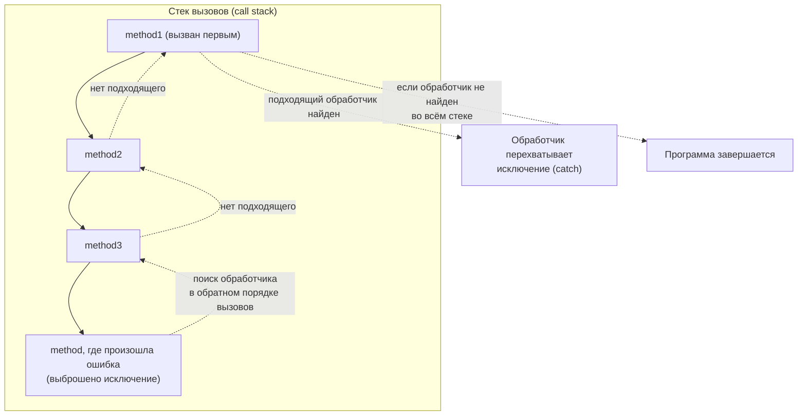
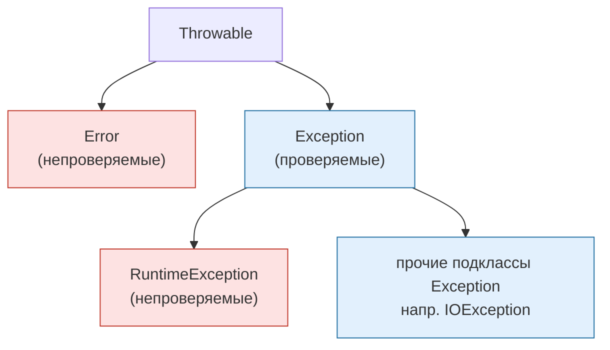
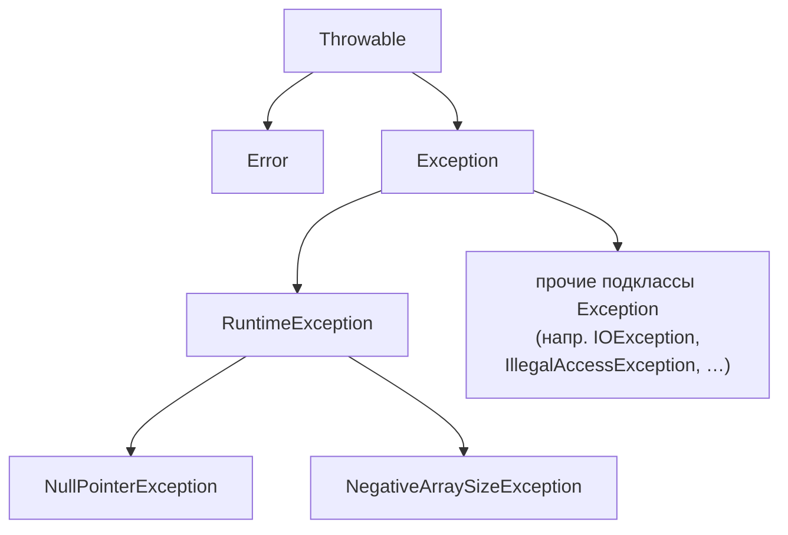
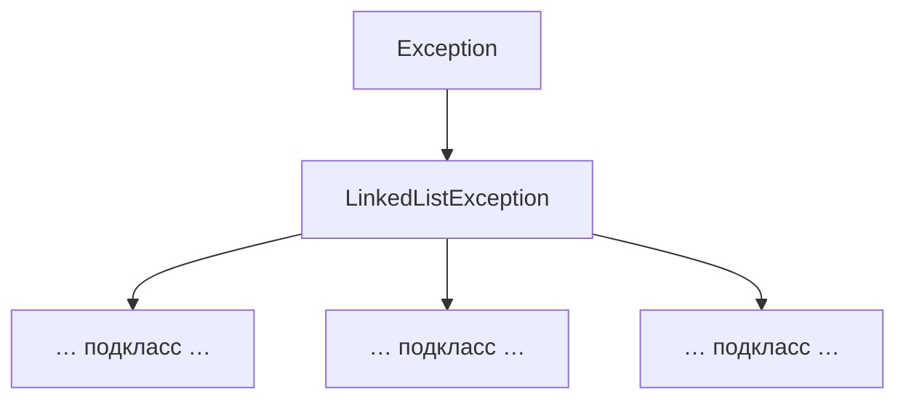

# Урок 1. Исключения

**Трейл:** Essential Java Classes · **Оригинал:** [Exceptions](https://docs.oracle.com/javase/tutorial/essential/exceptions/index.html)
**Связанные области:** [[06-exceptions]] · **Вопросы:** core-java

> Перевод официального руководства Oracle (The Java Tutorials, JDK 8). Урок объединяет
> страницы трейла *Essential Java Classes → Exceptions*: от *What Is an Exception?* до
> *Summary* и *Questions and Exercises*. Примеры и практики ориентированы на JDK 8 и могут
> не учитывать улучшения, появившиеся в более поздних выпусках.

Язык программирования Java использует **исключения** (*exceptions*) для обработки ошибок и
других исключительных событий. Этот урок описывает, когда и как использовать исключения.

## Что такое исключение?

> Термин **исключение** (*exception*) — это сокращение от выражения «исключительное событие»
> (*exceptional event*).
>
> **Определение.** *Исключение* — это событие, возникающее во время выполнения программы,
> которое нарушает нормальный ход выполнения её инструкций.

Когда внутри метода происходит ошибка, метод создаёт объект и передаёт его системе времени
выполнения (*runtime system*). Этот объект, называемый **объектом исключения** (*exception
object*), содержит информацию об ошибке, включая её тип и состояние программы в момент
возникновения ошибки. Создание объекта исключения и передача его системе времени выполнения
называется **выбрасыванием исключения** (*throwing an exception*).

После того как метод выбросил исключение, система времени выполнения пытается найти что-то,
что сможет его обработать. Множество возможных «кандидатов» на обработку исключения — это
упорядоченный список методов, которые были вызваны, чтобы добраться до метода, где произошла
ошибка. Этот список методов известен как **стек вызовов** (*call stack*).

Система времени выполнения просматривает стек вызовов в поисках метода, который содержит блок
кода, способный обработать исключение. Такой блок кода называется **обработчиком исключения**
(*exception handler*). Поиск начинается с метода, в котором произошла ошибка, и продвигается
по стеку вызовов в порядке, обратном тому, в котором методы вызывались. Когда найден
подходящий обработчик, система времени выполнения передаёт ему исключение. Обработчик
исключения считается подходящим, если тип выброшенного объекта исключения соответствует типу,
который этот обработчик может обработать.

О выбранном обработчике исключения говорят, что он **перехватывает исключение** (*catch the
exception*). Если система времени выполнения исчерпывающе просматривает все методы в стеке
вызовов и не находит подходящего обработчика, то система времени выполнения (а вместе с ней и
программа) завершает работу.

<!-- original: assets/03-essential-classes/exceptions-callstack.gif | Стек вызовов: поиск обработчика исключения — обработчик найден -->


Использование исключений для управления ошибками имеет ряд преимуществ перед традиционными
техниками обработки ошибок. Подробнее — в разделе [Преимущества исключений](#преимущества-исключений).

## Требование «перехватить или объявить» (Catch or Specify)

> Корректный код на языке Java должен соблюдать **требование «перехватить или объявить»**
> (*Catch or Specify Requirement*). Это означает, что код, который может выбросить
> определённые исключения, должен быть заключён в одно из двух:
>
> - **Оператор `try`, перехватывающий исключение.** `try` должен предоставить обработчик
>   исключения, как описано в разделе [Перехват и обработка исключений](#перехват-и-обработка-исключений).
> - **Метод, объявляющий, что он может выбросить исключение.** Метод должен предоставить
>   секцию `throws`, которая перечисляет это исключение, как описано в разделе
>   [Объявление исключений, выбрасываемых методом](#объявление-исключений-выбрасываемых-методом).
>
> Код, не соблюдающий требование «перехватить или объявить», не скомпилируется.

Не все исключения подпадают под требование «перехватить или объявить». Чтобы понять почему,
нужно рассмотреть три базовые категории исключений, лишь одна из которых подпадает под это
требование.

### Три вида исключений

**Первый вид исключения — это проверяемое исключение (*checked exception*).** Это
исключительные ситуации, которые хорошо написанное приложение должно предвидеть и от которых
должно уметь восстанавливаться. Например, предположим, что приложение запрашивает у
пользователя имя входного файла, а затем открывает файл, передавая это имя в конструктор
`java.io.FileReader`. Обычно пользователь указывает имя существующего читаемого файла, поэтому
создание объекта `FileReader` проходит успешно и выполнение приложения идёт нормально. Но
иногда пользователь указывает имя несуществующего файла, и тогда конструктор выбрасывает
`java.io.FileNotFoundException`. Хорошо написанная программа перехватит это исключение и
уведомит пользователя об ошибке, возможно, предложив исправить имя файла.

Проверяемые исключения **подпадают** под требование «перехватить или объявить». Все исключения
являются проверяемыми, кроме тех, что обозначены классами `Error`, `RuntimeException` и их
подклассами.

**Второй вид исключения — это ошибка (*error*).** Это исключительные ситуации, которые внешни
по отношению к приложению и которые приложение обычно не может ни предвидеть, ни от которых
восстановиться. Например, предположим, что приложение успешно открыло файл для ввода, но не
может прочитать его из-за аппаратного или системного сбоя. Неудачное чтение выбросит
`java.io.IOError`. Приложение может перехватить это исключение, чтобы уведомить пользователя о
проблеме, — но также может иметь смысл вывести трассировку стека и завершиться.

Ошибки **не подпадают** под требование «перехватить или объявить». Ошибки — это исключения,
обозначенные классом `Error` и его подклассами.

**Третий вид исключения — это исключение времени выполнения (*runtime exception*).** Это
исключительные ситуации, которые внутренни по отношению к приложению и от которых приложение
обычно не может ни предвидеть, ни восстановиться. Как правило, они указывают на ошибки в
программе, такие как логические ошибки или неправильное использование API. Например,
рассмотрим описанное ранее приложение, передающее имя файла в конструктор `FileReader`. Если
из-за логической ошибки в конструктор будет передан `null`, конструктор выбросит
`NullPointerException`. Приложение может перехватить это исключение, но, вероятно, разумнее
устранить ошибку, ставшую причиной исключения.

Исключения времени выполнения **не подпадают** под требование «перехватить или объявить».
Исключения времени выполнения — это исключения, обозначенные классом `RuntimeException` и его
подклассами.

Ошибки и исключения времени выполнения вместе известны как **непроверяемые исключения**
(*unchecked exceptions*).

<!-- original: none | Цветовая разметка checked/unchecked — авторская схема, у Oracle нет аналогичной -->


> На схеме: проверяемыми (подпадают под требование) являются `Exception` и его подклассы,
> **за исключением** `RuntimeException` и его подклассов. Непроверяемыми являются `Error` и
> `RuntimeException` со своими подклассами.

### Обход требования «перехватить или объявить»

Некоторые программисты считают требование «перехватить или объявить» серьёзным недостатком
механизма исключений и обходят его, используя непроверяемые исключения вместо проверяемых. В
общем случае так делать не рекомендуется. О том, когда уместно использовать непроверяемые
исключения, рассказывает раздел [Непроверяемые исключения — спорный вопрос](#непроверяемые-исключения--спорный-вопрос).

## Перехват и обработка исключений

Этот раздел описывает, как использовать три компонента обработчика исключений — блоки `try`,
`catch` и `finally` — для написания обработчика исключения. Затем объясняется оператор
`try`-с-ресурсами (*try-with-resources*), появившийся в Java SE 7. Оператор `try`-с-ресурсами
особенно хорошо подходит для ситуаций, использующих закрываемые ресурсы (`Closeable`), такие
как потоки. В последней части раздела разбирается пример и анализируется, что происходит в
различных сценариях.

Следующий пример определяет и реализует класс с именем `ListOfNumbers`. При создании
`ListOfNumbers` создаёт `ArrayList`, содержащий 10 элементов типа `Integer` с
последовательными значениями от 0 до 9. Класс `ListOfNumbers` также определяет метод
`writeList`, который записывает список чисел в текстовый файл с именем `OutFile.txt`. В этом
примере используются классы вывода из пакета `java.io`.

```java
// Замечание: этот класс пока не скомпилируется.
import java.io.*;
import java.util.List;
import java.util.ArrayList;

public class ListOfNumbers {

    private List<Integer> list;
    private static final int SIZE = 10;

    public ListOfNumbers () {
        list = new ArrayList<Integer>(SIZE);
        for (int i = 0; i < SIZE; i++) {
            list.add(new Integer(i));
        }
    }

    public void writeList() {
	// Конструктор FileWriter выбрасывает IOException, которое нужно перехватить.
        PrintWriter out = new PrintWriter(new FileWriter("OutFile.txt"));

        for (int i = 0; i < SIZE; i++) {
            // Метод get(int) выбрасывает IndexOutOfBoundsException, которое нужно перехватить.
            out.println("Value at: " + i + " = " + list.get(i));
        }
        out.close();
    }
}
```

Первая выделенная строка — это вызов конструктора. Конструктор инициализирует выходной поток
для файла. Если файл не удаётся открыть, конструктор выбрасывает `IOException`. Вторая
выделенная строка — это вызов метода `get` класса `ArrayList`, который выбрасывает
`IndexOutOfBoundsException`, если значение его аргумента слишком мало (меньше 0) или слишком
велико (больше числа элементов, в данный момент содержащихся в `ArrayList`).

Если попытаться скомпилировать класс `ListOfNumbers`, компилятор выведет сообщение об ошибке
об исключении, выбрасываемом конструктором `FileWriter`. Однако он не выведет сообщение об
ошибке об исключении, выбрасываемом методом `get`. Причина в том, что исключение,
выбрасываемое конструктором, `IOException`, является проверяемым, а исключение, выбрасываемое
методом `get`, `IndexOutOfBoundsException`, — непроверяемым.

Теперь, когда вы знакомы с классом `ListOfNumbers` и с тем, где в нём могут выбрасываться
исключения, вы готовы написать обработчики, которые их перехватят и обработают.

### Блок try

Первый шаг в построении обработчика исключения — заключить код, который может выбросить
исключение, в блок `try`. В общем виде блок `try` выглядит так:

```java
try {
    code
}
catch и finally блоки . . .
```

Сегмент, помеченный в примере как `code`, содержит одну или несколько корректных строк кода,
которые могут выбросить исключение. (Блоки `catch` и `finally` объясняются в следующих двух
подразделах.)

Чтобы построить обработчик исключения для метода `writeList` из класса `ListOfNumbers`,
заключите выбрасывающие исключения операторы метода `writeList` в блок `try`. Сделать это можно
не единственным способом. Можно поместить каждую строку кода, способную выбросить исключение, в
собственный блок `try` и предоставить для каждого отдельный обработчик. Либо можно поместить
весь код `writeList` в один блок `try` и связать с ним несколько обработчиков. В следующем
листинге для всего метода используется один блок `try`, поскольку рассматриваемый код очень
короткий.

```java
private List<Integer> list;
private static final int SIZE = 10;

public void writeList() {
    PrintWriter out = null;
    try {
        System.out.println("Entered try statement");
        FileWriter f = new FileWriter("OutFile.txt");
        out = new PrintWriter(f);
        for (int i = 0; i < SIZE; i++) {
            out.println("Value at: " + i + " = " + list.get(i));
        }
    }
    catch and finally blocks  . . .
}
```

Если внутри блока `try` возникает исключение, оно обрабатывается связанным с этим блоком
обработчиком. Чтобы связать обработчик исключения с блоком `try`, нужно поместить за ним блок
`catch`; как это сделать, показывает следующий раздел.

### Блоки catch

Обработчики исключений связываются с блоком `try` путём размещения одного или нескольких
блоков `catch` непосредственно после блока `try`. Между концом блока `try` и началом первого
блока `catch` не может быть никакого кода.

```java
try {

} catch (ExceptionType name) {

} catch (ExceptionType name) {

}
```

Каждый блок `catch` — это обработчик исключения, обрабатывающий тип исключения, указанный его
аргументом. Тип аргумента, `ExceptionType`, объявляет тип исключения, которое обработчик может
обработать, и должен быть именем класса, наследующего от класса `Throwable`. Обработчик может
ссылаться на исключение по имени `name`.

Блок `catch` содержит код, который выполняется тогда и только тогда, когда обработчик
исключения вызывается. Система времени выполнения вызывает обработчик исключения, когда он
оказывается первым в стеке вызовов, чей `ExceptionType` соответствует типу выброшенного
исключения. Система считает это соответствием, если выброшенный объект может быть корректно
присвоен аргументу обработчика исключения.

Вот два обработчика исключений для метода `writeList`:

```java
try {

} catch (IndexOutOfBoundsException e) {
    System.err.println("IndexOutOfBoundsException: " + e.getMessage());
} catch (IOException e) {
    System.err.println("Caught IOException: " + e.getMessage());
}
```

Обработчики исключений могут делать больше, чем просто выводить сообщения об ошибках или
останавливать программу. Они могут выполнять восстановление после ошибки, предлагать
пользователю принять решение или пробрасывать ошибку выше — обработчику более высокого уровня
— с помощью связанных исключений, как описано в разделе [Связанные исключения](#связанные-исключения-chained-exceptions).

#### Перехват нескольких типов исключений одним обработчиком

В Java SE 7 и более поздних версиях один блок `catch` может обрабатывать более одного типа
исключений. Эта возможность позволяет сократить дублирование кода и уменьшить соблазн
перехватывать чересчур широкое исключение.

В предложении `catch` укажите типы исключений, которые блок может обработать, разделяя каждый
тип вертикальной чертой (`|`):

```java
catch (IOException|SQLException ex) {
    logger.log(ex);
    throw ex;
}
```

> **Замечание.** Если блок `catch` обрабатывает более одного типа исключения, то параметр
> `catch` неявно является `final`. В этом примере параметр `catch` `ex` — `final`, и потому
> вы не можете присваивать ему какие-либо значения внутри блока `catch`.

### Блок finally

Блок `finally` **всегда** выполняется при выходе из блока `try`. Это гарантирует, что блок
`finally` будет выполнен даже в случае возникновения непредвиденного исключения. Но `finally`
полезен не только для обработки исключений — он позволяет программисту избежать случайного
обхода кода очистки операторами `return`, `continue` или `break`. Размещение кода очистки в
блоке `finally` — всегда хорошая практика, даже когда исключения не ожидаются.

> **Замечание.** Блок `finally` может не выполниться, если JVM завершит работу во время
> выполнения кода блока `try` или `catch`.

Блок `try` метода `writeList`, с которым мы здесь работаем, открывает `PrintWriter`. Программа
должна закрыть этот поток перед выходом из метода `writeList`. Это создаёт несколько сложную
проблему, поскольку блок `try` метода `writeList` может завершиться одним из трёх способов.

1. Оператор `new FileWriter` завершается неудачей и выбрасывает `IOException`.
2. Оператор `list.get(i)` завершается неудачей и выбрасывает `IndexOutOfBoundsException`.
3. Всё проходит успешно, и блок `try` завершается нормально.

Система времени выполнения всегда выполняет операторы внутри блока `finally` независимо от
того, что произошло внутри блока `try`. Так что это идеальное место для выполнения очистки.

Следующий блок `finally` для метода `writeList` выполняет очистку и затем закрывает
`PrintWriter` и `FileWriter`.

```java
finally {
    if (out != null) { 
        System.out.println("Closing PrintWriter");
        out.close(); 
    } else { 
        System.out.println("PrintWriter not open");
    } 
    if (f != null) {
	    System.out.println("Closing FileWriter");
	    f.close();
	}	
} 
```

> **Важно.** Используйте оператор `try`-с-ресурсами вместо блока `finally` при закрытии файла
> или ином освобождении ресурсов. Следующий пример использует оператор `try`-с-ресурсами для
> очистки и закрытия `PrintWriter` и `FileWriter` метода `writeList`:

```java
public void writeList() throws IOException {
    try (FileWriter f = new FileWriter("OutFile.txt");
         PrintWriter out = new PrintWriter(f)) {
        for (int i = 0; i < SIZE; i++) {
            out.println("Value at: " + i + " = " + list.get(i));
        }
    }
}
```

Оператор `try`-с-ресурсами автоматически освобождает системные ресурсы, когда они больше не
нужны.

### Оператор try-с-ресурсами

Оператор `try`-с-ресурсами (*try-with-resources*) — это оператор `try`, который объявляет один
или несколько ресурсов. **Ресурс** (*resource*) — это объект, который должен быть закрыт после
того, как программа закончила с ним работу. Оператор `try`-с-ресурсами гарантирует, что каждый
ресурс будет закрыт по окончании оператора. В качестве ресурса можно использовать любой объект,
реализующий `java.lang.AutoCloseable`, включая все объекты, реализующие `java.io.Closeable`.

Следующий пример читает первую строку из файла. Он использует экземпляры `FileReader` и
`BufferedReader` для чтения данных из файла. `FileReader` и `BufferedReader` — это ресурсы,
которые должны быть закрыты после того, как программа закончила с ними работу:

```java
static String readFirstLineFromFile(String path) throws IOException {
    try (FileReader fr = new FileReader(path);
         BufferedReader br = new BufferedReader(fr)) {
        return br.readLine();
    }
}
```

В этом примере ресурсами, объявленными в операторе `try`-с-ресурсами, являются `FileReader` и
`BufferedReader`. Объявления этих ресурсов располагаются в круглых скобках сразу после ключевого
слова `try`. Классы `FileReader` и `BufferedReader` в Java SE 7 и более поздних версиях
реализуют интерфейс `java.lang.AutoCloseable`. Поскольку экземпляры `FileReader` и
`BufferedReader` объявлены в операторе `try`-с-ресурсами, они будут закрыты независимо от того,
завершился ли оператор `try` нормально или аварийно (в результате того, что метод
`BufferedReader.readLine` выбросил `IOException`).

До Java SE 7 для гарантии того, что ресурс закрывается независимо от нормального или аварийного
завершения оператора `try`, можно было использовать блок `finally`. Следующий пример использует
блок `finally` вместо оператора `try`-с-ресурсами:

```java
static String readFirstLineFromFileWithFinallyBlock(String path) throws IOException {
   
    FileReader fr = new FileReader(path);
    BufferedReader br = new BufferedReader(fr);
    try {
        return br.readLine();
    } finally {
        br.close();
        fr.close();
    }
}
```

Однако в этом примере возможна утечка ресурсов. Программа должна делать больше, чем полагаться
на сборщик мусора (*garbage collector*, GC) в освобождении памяти ресурса по завершении работы
с ним. Программа также должна вернуть ресурс операционной системе, обычно вызвав метод `close`
ресурса. Однако если программа не сделает этого до того, как GC утилизирует ресурс, то
информация, необходимая для освобождения ресурса, будет потеряна. Ресурс, который операционная
система всё ещё считает используемым, утёк.

В этом примере, если метод `readLine` выбрасывает исключение, а оператор `br.close()` в блоке
`finally` тоже выбрасывает исключение, то `FileReader` утёк. Поэтому для закрытия ресурсов
вашей программы используйте оператор `try`-с-ресурсами вместо блока `finally`.

Если методы `readLine` и `close` оба выбрасывают исключения, то метод
`readFirstLineFromFileWithFinallyBlock` выбрасывает исключение, выброшенное из блока `finally`;
исключение, выброшенное из блока `try`, подавляется. Напротив, в примере `readFirstLineFromFile`,
если исключения выбрасываются и из блока `try`, и из оператора `try`-с-ресурсами, то метод
`readFirstLineFromFile` выбрасывает исключение, выброшенное из блока `try`; исключение,
выброшенное оператором `try`-с-ресурсами, подавляется. В Java SE 7 и более поздних версиях
подавленные исключения можно получить; подробнее см. раздел [Подавленные исключения](#подавленные-исключения).

Следующий пример получает имена файлов, упакованных в zip-файл `zipFileName`, и создаёт
текстовый файл, содержащий имена этих файлов:

```java
public static void writeToFileZipFileContents(String zipFileName,
                                           String outputFileName)
                                           throws java.io.IOException {

    java.nio.charset.Charset charset =
         java.nio.charset.StandardCharsets.US_ASCII;
    java.nio.file.Path outputFilePath =
         java.nio.file.Paths.get(outputFileName);

    // Открываем zip-файл и создаём выходной файл с помощью
    // оператора try-с-ресурсами

    try (
        java.util.zip.ZipFile zf =
             new java.util.zip.ZipFile(zipFileName);
        java.io.BufferedWriter writer = 
            java.nio.file.Files.newBufferedWriter(outputFilePath, charset)
    ) {
        // Перебираем каждую запись
        for (java.util.Enumeration entries =
                                zf.entries(); entries.hasMoreElements();) {
            // Получаем имя записи и записываем его в выходной файл
            String newLine = System.getProperty("line.separator");
            String zipEntryName =
                 ((java.util.zip.ZipEntry)entries.nextElement()).getName() +
                 newLine;
            writer.write(zipEntryName, 0, zipEntryName.length());
        }
    }
}
```

В этом примере оператор `try`-с-ресурсами содержит два объявления, разделённых точкой с запятой:
`ZipFile` и `BufferedWriter`. Когда непосредственно следующий за ним блок кода завершается,
нормально или из-за исключения, методы `close` объектов `BufferedWriter` и `ZipFile`
автоматически вызываются в этом порядке. Обратите внимание, что методы `close` ресурсов
вызываются в порядке, **обратном** их созданию.

Следующий пример использует оператор `try`-с-ресурсами для автоматического закрытия объекта
`java.sql.Statement`:

```java
public static void viewTable(Connection con) throws SQLException {

    String query = "select COF_NAME, SUP_ID, PRICE, SALES, TOTAL from COFFEES";

    try (Statement stmt = con.createStatement()) {
        ResultSet rs = stmt.executeQuery(query);

        while (rs.next()) {
            String coffeeName = rs.getString("COF_NAME");
            int supplierID = rs.getInt("SUP_ID");
            float price = rs.getFloat("PRICE");
            int sales = rs.getInt("SALES");
            int total = rs.getInt("TOTAL");

            System.out.println(coffeeName + ", " + supplierID + ", " + 
                               price + ", " + sales + ", " + total);
        }
    } catch (SQLException e) {
        JDBCTutorialUtilities.printSQLException(e);
    }
}
```

Ресурс `java.sql.Statement`, использованный в этом примере, является частью API JDBC 4.1 и
более поздних версий.

> **Замечание.** Оператор `try`-с-ресурсами может иметь блоки `catch` и `finally`, как и
> обычный оператор `try`. В операторе `try`-с-ресурсами любой блок `catch` или `finally`
> выполняется после того, как объявленные ресурсы были закрыты.

#### Подавленные исключения

Из блока кода, связанного с оператором `try`-с-ресурсами, может быть выброшено исключение. В
примере `writeToFileZipFileContents` исключение может быть выброшено из блока `try`, и до двух
исключений может быть выброшено оператором `try`-с-ресурсами, когда он пытается закрыть объекты
`ZipFile` и `BufferedWriter`. Если исключение выброшено из блока `try` и одно или несколько
исключений выброшены оператором `try`-с-ресурсами, то выброшенные оператором `try`-с-ресурсами
исключения **подавляются** (*suppressed*), и исключением, которое выбрасывает метод
`writeToFileZipFileContents`, является исключение, выброшенное блоком. Эти подавленные
исключения можно получить, вызвав метод `Throwable.getSuppressed` у исключения, выброшенного
блоком `try`.

#### Классы, реализующие интерфейс AutoCloseable или Closeable

Список классов, реализующих один из этих интерфейсов, см. в Javadoc интерфейсов `AutoCloseable`
и `Closeable`. Интерфейс `Closeable` расширяет интерфейс `AutoCloseable`. Метод `close`
интерфейса `Closeable` выбрасывает исключения типа `IOException`, тогда как метод `close`
интерфейса `AutoCloseable` выбрасывает исключения типа `Exception`. Следовательно, подклассы
интерфейса `AutoCloseable` могут переопределять это поведение метода `close`, чтобы выбрасывать
специализированные исключения, такие как `IOException`, или не выбрасывать исключение вовсе.

### Собираем всё вместе

В предыдущих разделах описано, как построить блоки кода `try`, `catch` и `finally` для метода
`writeList` в классе `ListOfNumbers`. Теперь давайте пройдёмся по коду и исследуем, что может
произойти.

Когда все компоненты собраны вместе, метод `writeList` выглядит следующим образом.

```java
public void writeList() {
    PrintWriter out = null;

    try {
        System.out.println("Entering" + " try statement");

        out = new PrintWriter(new FileWriter("OutFile.txt"));
        for (int i = 0; i < SIZE; i++) {
            out.println("Value at: " + i + " = " + list.get(i));
        }
    } catch (IndexOutOfBoundsException e) {
        System.err.println("Caught IndexOutOfBoundsException: "
                           +  e.getMessage());
                                 
    } catch (IOException e) {
        System.err.println("Caught IOException: " +  e.getMessage());
                                 
    } finally {
        if (out != null) {
            System.out.println("Closing PrintWriter");
            out.close();
        } 
        else {
            System.out.println("PrintWriter not open");
        }
    }
}
```

Как упоминалось ранее, у блока `try` этого метода есть три различных варианта выхода; вот два
из них.

1. Код в операторе `try` завершается неудачей и выбрасывает исключение. Это может быть
   `IOException`, вызванное оператором `new FileWriter`, или `IndexOutOfBoundsException`,
   вызванное неверным значением индекса в цикле `for`.
2. Всё проходит успешно, и оператор `try` завершается нормально.

Давайте посмотрим, что происходит в методе `writeList` при этих двух вариантах выхода.

#### Сценарий 1. Возникает исключение

Оператор, создающий `FileWriter`, может завершиться неудачей по ряду причин. Например,
конструктор `FileWriter` выбрасывает `IOException`, если программа не может создать указанный
файл или записать в него.

Когда `FileWriter` выбрасывает `IOException`, система времени выполнения немедленно прекращает
выполнение блока `try`; выполняемые вызовы методов не завершаются. Затем система времени
выполнения начинает поиск с вершины стека вызовов методов, ища подходящий обработчик исключения.
В этом примере, когда возникает `IOException`, конструктор `FileWriter` находится на вершине
стека вызовов. Однако у конструктора `FileWriter` нет подходящего обработчика, поэтому система
времени выполнения проверяет следующий метод — `writeList` — в стеке вызовов. У метода
`writeList` два обработчика: один для `IOException` и один для `IndexOutOfBoundsException`.

Система времени выполнения проверяет обработчики `writeList` в том порядке, в котором они
появляются после оператора `try`. Аргумент первого обработчика — `IndexOutOfBoundsException`.
Он не соответствует типу выброшенного исключения, поэтому система времени выполнения проверяет
следующий обработчик — `IOException`. Он соответствует типу выброшенного исключения, поэтому
система времени выполнения завершает поиск подходящего обработчика. Теперь, когда система времени
выполнения нашла подходящий обработчик, выполняется код в этом блоке `catch`.

После выполнения обработчика исключения система времени выполнения передаёт управление блоку
`finally`. Код в блоке `finally` выполняется независимо от перехваченного выше исключения. В
этом сценарии `FileWriter` так и не был открыт, и его не нужно закрывать. После завершения
блока `finally` программа продолжает выполнение с первого оператора после блока `finally`.

Вот полный вывод программы `ListOfNumbers`, который появляется при выбрасывании `IOException`.

```
Entering try statement
Caught IOException: OutFile.txt
PrintWriter not open 
```

Выделенный код в следующем листинге показывает операторы, которые выполняются в этом сценарии:

```java
public void writeList() {
   PrintWriter out = null;

    try {
        System.out.println("Entering try statement");
        out = new PrintWriter(new FileWriter("OutFile.txt"));
        for (int i = 0; i < SIZE; i++)
            out.println("Value at: " + i + " = " + list.get(i));
                               
    } catch (IndexOutOfBoundsException e) {
        System.err.println("Caught IndexOutOfBoundsException: "
                           + e.getMessage());
                                 
    } catch (IOException e) {
        System.err.println("Caught IOException: " + e.getMessage());
    } finally {
        if (out != null) {
            System.out.println("Closing PrintWriter");
            out.close();
        } 
        else {
            System.out.println("PrintWriter not open");
        }
    }
}
```

#### Сценарий 2. Блок try завершается нормально

В этом сценарии все операторы в области видимости блока `try` выполняются успешно и не
выбрасывают исключений. Выполнение «сваливается» с конца блока `try`, и система времени
выполнения передаёт управление блоку `finally`. Поскольку всё прошло успешно, к моменту, когда
управление достигает блока `finally`, `PrintWriter` открыт, и блок `finally` его закрывает.
Снова: после завершения блока `finally` программа продолжает выполнение с первого оператора
после блока `finally`.

Вот вывод программы `ListOfNumbers`, когда исключения не выбрасываются.

```
Entering try statement
Closing PrintWriter
```

Выделенный код в следующем примере показывает операторы, которые выполняются в этом сценарии.

```java
public void writeList() {
    PrintWriter out = null;
    try {
        System.out.println("Entering try statement");
        out = new PrintWriter(new FileWriter("OutFile.txt"));
        for (int i = 0; i < SIZE; i++)
            out.println("Value at: " + i + " = " + list.get(i));
                  
    } catch (IndexOutOfBoundsException e) {
        System.err.println("Caught IndexOutOfBoundsException: "
                           + e.getMessage());

    } catch (IOException e) {
        System.err.println("Caught IOException: " + e.getMessage());
                                 
    } finally {
        if (out != null) {
            System.out.println("Closing PrintWriter");
            out.close();
        } 
        else {
            System.out.println("PrintWriter not open");
        }
    }
}
```

## Объявление исключений, выбрасываемых методом

Предыдущий раздел показал, как написать обработчик исключения для метода `writeList` в классе
`ListOfNumbers`. Иногда коду уместно перехватывать исключения, которые могут в нём возникнуть. В
других случаях, однако, лучше позволить методу, расположенному выше в стеке вызовов, обработать
исключение. Например, если бы вы предоставляли класс `ListOfNumbers` как часть пакета классов,
вы, вероятно, не смогли бы предвидеть нужды всех пользователей вашего пакета. В этом случае
лучше **не** перехватывать исключение, а позволить обработать его методу выше в стеке вызовов.

Если метод `writeList` не перехватывает проверяемые исключения, которые могут в нём возникнуть,
метод `writeList` должен объявить, что он может выбрасывать эти исключения. Давайте изменим
исходный метод `writeList`, чтобы он объявлял исключения, которые может выбросить, вместо того
чтобы их перехватывать. Напомним, вот исходная версия метода `writeList`, которая не
скомпилируется.

```java
public void writeList() {
    PrintWriter out = new PrintWriter(new FileWriter("OutFile.txt"));
    for (int i = 0; i < SIZE; i++) {
        out.println("Value at: " + i + " = " + list.get(i));
    }
    out.close();
}
```

Чтобы объявить, что `writeList` может выбросить два исключения, добавьте в объявление метода
`writeList` секцию `throws`. Секция `throws` состоит из ключевого слова `throws`, за которым
следует разделённый запятыми список всех исключений, выбрасываемых этим методом. Секция
располагается после имени метода и списка аргументов и перед фигурной скобкой, определяющей
область видимости метода; вот пример.

```java
public void writeList() throws IOException, IndexOutOfBoundsException {
```

Помните, что `IndexOutOfBoundsException` — непроверяемое исключение; включать его в секцию
`throws` необязательно. Можно написать просто следующее.

```java
public void writeList() throws IOException {
```

## Как выбрасывать исключения

Прежде чем перехватить исключение, какой-то код где-то должен его выбросить. Любой код может
выбросить исключение: ваш код, код из пакета, написанного кем-то другим, например из пакетов,
поставляемых с платформой Java, или среда времени выполнения Java. Независимо от того, что
выбрасывает исключение, оно всегда выбрасывается оператором `throw`.

Как вы, вероятно, заметили, платформа Java предоставляет множество классов исключений. Все эти
классы — потомки класса [`Throwable`](https://docs.oracle.com/javase/8/docs/api/java/lang/Throwable.html),
и все они позволяют программам различать разные типы исключений, которые могут возникнуть во
время выполнения программы.

Вы также можете создавать собственные классы исключений для представления проблем, которые могут
возникнуть в написанных вами классах. Более того, если вы разработчик пакетов, вам, возможно,
придётся создать собственный набор классов исключений, чтобы пользователи могли отличать ошибку,
которая может произойти в вашем пакете, от ошибок, происходящих в платформе Java или других
пакетах.

Вы также можете создавать **связанные** (*chained*) исключения. Подробнее см. раздел
[Связанные исключения](#связанные-исключения-chained-exceptions).

### Оператор throw

Все методы используют оператор `throw`, чтобы выбросить исключение. Оператор `throw` требует
единственного аргумента: выбрасываемый объект (*throwable object*). Выбрасываемые объекты — это
экземпляры любого подкласса класса `Throwable`. Вот пример оператора `throw`.

```
throw someThrowableObject;
```

Рассмотрим оператор `throw` в контексте. Следующий метод `pop` взят из класса, реализующего
обычный объект-стек. Метод удаляет верхний элемент стека и возвращает объект.

```java
public Object pop() {
    Object obj;

    if (size == 0) {
        throw new EmptyStackException();
    }

    obj = objectAt(size - 1);
    setObjectAt(size - 1, null);
    size--;
    return obj;
}
```

Метод `pop` проверяет, есть ли в стеке элементы. Если стек пуст (его размер равен `0`), `pop`
создаёт новый объект `EmptyStackException` (член пакета `java.util`) и выбрасывает его. Раздел
[Создание классов исключений](#создание-классов-исключений) в этой главе объясняет, как создавать
собственные классы исключений. Пока всё, что вам нужно помнить, — это то, что вы можете
выбрасывать только объекты, наследующие от класса `java.lang.Throwable`.

Обратите внимание, что объявление метода `pop` не содержит секции `throws`. `EmptyStackException`
не является проверяемым исключением, поэтому `pop` не обязан указывать, что оно может возникнуть.

### Класс Throwable и его подклассы

Объекты, наследующие от класса `Throwable`, включают прямых потомков (объекты, наследующие
непосредственно от класса `Throwable`) и косвенных потомков (объекты, наследующие от детей или
внуков класса `Throwable`). Схема ниже иллюстрирует иерархию класса `Throwable` и его наиболее
значимых подклассов. Как видно, у `Throwable` два прямых потомка:
[`Error`](https://docs.oracle.com/javase/8/docs/api/java/lang/Error.html) и
[`Exception`](https://docs.oracle.com/javase/8/docs/api/java/lang/Exception.html).

<!-- original: assets/03-essential-classes/exceptions-throwable.gif | Иерархия Throwable с наиболее значимыми подклассами -->


> Схема: класс `Throwable` и его наиболее значимые подклассы.

#### Класс Error

Когда происходит сбой динамической компоновки (*dynamic linking*) или другой серьёзный сбой в
виртуальной машине Java, виртуальная машина выбрасывает `Error`. Простые программы обычно **не**
перехватывают и не выбрасывают `Error`.

#### Класс Exception

Большинство программ выбрасывают и перехватывают объекты, производные от класса `Exception`.
`Exception` указывает, что возникла проблема, но это не серьёзная системная проблема.
Большинство программ, которые вы напишете, будут выбрасывать и перехватывать `Exception`, а не
`Error`.

Платформа Java определяет множество потомков класса `Exception`. Эти потомки указывают на
различные типы исключений, которые могут возникнуть. Например, `IllegalAccessException`
сигнализирует, что конкретный метод не удалось найти, а `NegativeArraySizeException` указывает,
что программа попыталась создать массив отрицательного размера.

Один подкласс `Exception`, `RuntimeException`, зарезервирован для исключений, указывающих на
неправильное использование API. Пример исключения времени выполнения — `NullPointerException`,
которое возникает, когда метод пытается обратиться к члену объекта через ссылку `null`. Раздел
[Непроверяемые исключения — спорный вопрос](#непроверяемые-исключения--спорный-вопрос) объясняет,
почему большинству приложений не следует выбрасывать исключения времени выполнения или создавать
подклассы `RuntimeException`.

### Связанные исключения (Chained Exceptions)

Приложение часто отвечает на исключение, выбрасывая другое исключение. По сути, первое исключение
**является причиной** (*causes*) второго исключения. Бывает очень полезно знать, когда одно
исключение вызывает другое. **Связанные исключения** (*Chained Exceptions*) помогают программисту
это делать.

Ниже перечислены методы и конструкторы в `Throwable`, которые поддерживают связанные исключения.

```
Throwable getCause()
Throwable initCause(Throwable)
Throwable(String, Throwable)
Throwable(Throwable)
```

Аргумент типа `Throwable` для `initCause` и для конструкторов `Throwable` — это исключение,
которое стало причиной текущего исключения. `getCause` возвращает исключение, ставшее причиной
текущего исключения, а `initCause` устанавливает причину текущего исключения.

Следующий пример показывает, как использовать связанное исключение.

```java
try {

} catch (IOException e) {
    throw new SampleException("Other IOException", e);
}
```

В этом примере, когда перехватывается `IOException`, создаётся новое исключение `SampleException`
с присоединённой исходной причиной, и цепочка исключений выбрасывается вверх к обработчику
исключений следующего, более высокого уровня.

#### Доступ к информации трассировки стека

> **Определение.** **Трассировка стека** (*stack trace*) предоставляет информацию об истории
> выполнения текущего потока и перечисляет имена классов и методов, которые были вызваны в
> момент, когда возникло исключение. Трассировка стека — полезный инструмент отладки, которым вы
> обычно пользуетесь, когда исключение было выброшено.

Следующий код показывает, как вызвать метод `getStackTrace` у объекта исключения.

```java
catch (Exception cause) {
    StackTraceElement elements[] = cause.getStackTrace();
    for (int i = 0, n = elements.length; i < n; i++) {       
        System.err.println(elements[i].getFileName()
            + ":" + elements[i].getLineNumber() 
            + ">> "
            + elements[i].getMethodName() + "()");
    }
}
```

#### API логирования (Logging API)

Следующий фрагмент кода логирует, где произошло исключение, изнутри блока `catch`. Однако вместо
ручного разбора трассировки стека и отправки вывода в `System.err()` он отправляет вывод в файл,
используя средства логирования пакета `java.util.logging`.

```java
try {
    Handler handler = new FileHandler("OutFile.log");
    Logger.getLogger("").addHandler(handler);
    
} catch (IOException e) {
    Logger logger = Logger.getLogger("package.name"); 
    StackTraceElement elements[] = e.getStackTrace();
    for (int i = 0, n = elements.length; i < n; i++) {
        logger.log(Level.WARNING, elements[i].getMethodName());
    }
}
```

### Создание классов исключений

Сталкиваясь с выбором типа выбрасываемого исключения, вы можете либо использовать написанный
кем-то другим — платформа Java предоставляет множество классов исключений, которые можно
использовать, — либо написать собственный. Вам стоит написать собственные классы исключений,
если вы отвечаете «да» на любой из следующих вопросов; иначе вы, вероятно, можете использовать
чужой.

- Нужен ли вам тип исключения, который не представлен теми, что есть в платформе Java?
- Поможет ли пользователям возможность отличать ваши исключения от тех, что выбрасываются
  классами, написанными другими поставщиками?
- Выбрасывает ли ваш код более одного связанного исключения?
- Если вы используете чужие исключения, будут ли у пользователей доступ к этим исключениям?
  Похожий вопрос: должен ли ваш пакет быть независимым и самодостаточным?

#### Пример

Предположим, вы пишете класс связанного списка (*linked list*). Класс поддерживает, среди
прочих, следующие методы:

- **`objectAt(int n)`** — возвращает объект в `n`-й позиции списка. Выбрасывает исключение, если
  аргумент меньше 0 или больше числа объектов, в данный момент находящихся в списке.
- **`firstObject()`** — возвращает первый объект списка. Выбрасывает исключение, если список не
  содержит объектов.
- **`indexOf(Object o)`** — ищет в списке указанный `Object` и возвращает его позицию в списке.
  Выбрасывает исключение, если переданный в метод объект отсутствует в списке.

Класс связанного списка может выбрасывать несколько исключений, и было бы удобно иметь
возможность перехватывать все исключения, выбрасываемые связанным списком, одним обработчиком.
Кроме того, если вы планируете распространять ваш связанный список в составе пакета, весь
связанный код должен быть упакован вместе. Таким образом, связанный список должен предоставлять
собственный набор классов исключений.

<!-- original: assets/03-essential-classes/exceptions-hierarchy.gif | Иерархия исключений LinkedList: общий родитель LinkedListException -->


> Схема: один из возможных вариантов иерархии классов для исключений, выбрасываемых связанным
> списком (общий родитель `LinkedListException` наследует от `Exception`).

#### Выбор суперкласса

В качестве родительского класса для `LinkedListException` можно использовать любой подкласс
`Exception`. Однако беглый просмотр этих подклассов показывает, что они неподходящие: они либо
слишком специализированы, либо совершенно не связаны с `LinkedListException`. Поэтому родительским
классом `LinkedListException` должен быть `Exception`.

Большинство апплетов и приложений, которые вы напишете, будут выбрасывать объекты, являющиеся
`Exception`. `Error` обычно используются для серьёзных, жёстких ошибок в системе, таких как те,
что мешают работе JVM.

> **Замечание.** Для читаемости кода полезно добавлять строку `Exception` к именам всех классов,
> наследующих (прямо или косвенно) от класса `Exception`.

## Непроверяемые исключения — спорный вопрос

Поскольку язык программирования Java не требует от методов перехватывать или объявлять
непроверяемые исключения (`RuntimeException`, `Error` и их подклассы), у программистов может
возникнуть соблазн писать код, выбрасывающий только непроверяемые исключения, или делать так,
чтобы все их подклассы исключений наследовали от `RuntimeException`. Оба этих сокращения
позволяют программистам писать код, не беспокоясь об ошибках компилятора и не утруждая себя
объявлением или перехватом каких-либо исключений. Хотя это может показаться программисту удобным,
это обходит замысел требования «перехватить или объявить» и может создать проблемы для других,
использующих ваши классы.

Почему разработчики решили вынудить метод объглашать все неперехваченные проверяемые исключения,
которые могут быть выброшены в его области видимости? Любое `Exception`, которое может быть
выброшено методом, является частью публичного программного интерфейса метода. Те, кто вызывает
метод, должны знать об исключениях, которые метод может выбросить, чтобы решить, что с ними
делать. Эти исключения — такая же часть программного интерфейса метода, как его параметры и
возвращаемое значение.

Следующий вопрос может быть таким: «Если так хорошо документировать API метода, включая
исключения, которые он может выбросить, почему не объявлять и исключения времени выполнения
тоже?» Исключения времени выполнения представляют проблемы, являющиеся результатом программной
ошибки, и, как таковые, от клиентского кода API нельзя разумно ожидать восстановления после них
или их обработки каким бы то ни было образом. Такие проблемы включают арифметические исключения,
такие как деление на ноль; исключения, связанные с указателями, такие как попытка обратиться к
объекту через ссылку `null`; и исключения индексации, такие как попытка обратиться к элементу
массива по слишком большому или слишком малому индексу.

Исключения времени выполнения могут возникать где угодно в программе, и в типичной программе их
может быть очень много. Необходимость добавлять исключения времени выполнения в каждое объявление
метода снизила бы ясность программы. Поэтому компилятор не требует, чтобы вы перехватывали или
объявляли исключения времени выполнения (хотя вы можете это делать).

Один из случаев, когда обычной практикой является выбрасывание `RuntimeException`, — это когда
пользователь вызывает метод неправильно. Например, метод может проверить, не является ли один из
его аргументов ошибочно `null`. Если аргумент равен `null`, метод может выбросить
`NullPointerException`, которое является **непроверяемым** исключением.

Вообще говоря, не выбрасывайте `RuntimeException` и не создавайте подкласс `RuntimeException`
просто потому, что не хотите утруждать себя объявлением исключений, которые могут выбрасывать
ваши методы.

> **Вот итоговое правило: если можно разумно ожидать, что клиент восстановится после исключения,
> сделайте его проверяемым. Если клиент ничего не может сделать для восстановления после
> исключения, сделайте его непроверяемым.**

## Преимущества исключений

Теперь, когда вы знаете, что такое исключения и как их использовать, пора узнать преимущества
использования исключений в ваших программах.

### Преимущество 1. Отделение кода обработки ошибок от «обычного» кода

Исключения дают возможность отделить детали того, что делать, когда происходит нечто
неординарное, от основной логики программы. В традиционном программировании обнаружение,
сообщение об ошибках и их обработка часто приводят к запутанному «спагетти-коду». Например,
рассмотрим псевдокод метода, который читает целый файл в память.

```
readFile {
    open the file;
    determine its size;
    allocate that much memory;
    read the file into memory;
    close the file;
}
```

На первый взгляд эта функция кажется достаточно простой, но она игнорирует все следующие
потенциальные ошибки.

- Что произойдёт, если файл не удастся открыть?
- Что произойдёт, если длину файла не удастся определить?
- Что произойдёт, если не удастся выделить достаточно памяти?
- Что произойдёт, если чтение завершится неудачей?
- Что произойдёт, если файл не удастся закрыть?

Чтобы обрабатывать такие случаи, функция `readFile` должна содержать больше кода для обнаружения
ошибок, сообщения о них и их обработки. Вот пример того, как могла бы выглядеть функция.

```
errorCodeType readFile {
    initialize errorCode = 0;
    
    open the file;
    if (theFileIsOpen) {
        determine the length of the file;
        if (gotTheFileLength) {
            allocate that much memory;
            if (gotEnoughMemory) {
                read the file into memory;
                if (readFailed) {
                    errorCode = -1;
                }
            } else {
                errorCode = -2;
            }
        } else {
            errorCode = -3;
        }
        close the file;
        if (theFileDidntClose && errorCode == 0) {
            errorCode = -4;
        } else {
            errorCode = errorCode and -4;
        }
    } else {
        errorCode = -5;
    }
    return errorCode;
}
```

Здесь столько обнаружения ошибок, сообщения о них и возврата кодов, что исходные семь строк кода
теряются в этом беспорядке. Хуже того, потерян и логический ход кода, из-за чего трудно сказать,
делает ли код правильные вещи: действительно ли файл закрывается, если функции не удаётся
выделить достаточно памяти? Ещё труднее обеспечить, чтобы код продолжал делать правильные вещи,
когда вы модифицируете метод спустя три месяца после его написания. Многие программисты решают
эту проблему, просто игнорируя её, — об ошибках сообщают, когда их программы аварийно
завершаются.

Исключения позволяют вам писать основной ход кода и иметь дело с исключительными случаями в
другом месте. Если бы функция `readFile` использовала исключения вместо традиционных техник
управления ошибками, она выглядела бы скорее так.

```
readFile {
    try {
        open the file;
        determine its size;
        allocate that much memory;
        read the file into memory;
        close the file;
    } catch (fileOpenFailed) {
       doSomething;
    } catch (sizeDeterminationFailed) {
        doSomething;
    } catch (memoryAllocationFailed) {
        doSomething;
    } catch (readFailed) {
        doSomething;
    } catch (fileCloseFailed) {
        doSomething;
    }
}
```

Обратите внимание, что исключения не избавляют вас от усилий по обнаружению, сообщению и
обработке ошибок, но помогают организовать эту работу более эффективно.

### Преимущество 2. Проброс ошибок вверх по стеку вызовов

Второе преимущество исключений — это возможность пробрасывать сообщения об ошибках вверх по стеку
вызовов методов. Предположим, что метод `readFile` — четвёртый метод в серии вложенных вызовов,
сделанных основной программой: `method1` вызывает `method2`, который вызывает `method3`, который
наконец вызывает `readFile`.

```
method1 {
    call method2;
}

method2 {
    call method3;
}

method3 {
    call readFile;
}
```

Предположим также, что `method1` — единственный метод, заинтересованный в ошибках, которые могут
возникнуть в `readFile`. Традиционные техники уведомления об ошибках вынуждают `method2` и
`method3` пробрасывать коды ошибок, возвращаемые `readFile`, вверх по стеку вызовов, пока коды
ошибок наконец не достигнут `method1` — единственного метода, который в них заинтересован.

```
method1 {
    errorCodeType error;
    error = call method2;
    if (error)
        doErrorProcessing;
    else
        proceed;
}

errorCodeType method2 {
    errorCodeType error;
    error = call method3;
    if (error)
        return error;
    else
        proceed;
}

errorCodeType method3 {
    errorCodeType error;
    error = call readFile;
    if (error)
        return error;
    else
        proceed;
}
```

Вспомните, что среда времени выполнения Java просматривает стек вызовов в обратном направлении,
чтобы найти любые методы, заинтересованные в обработке конкретного исключения. Метод может
«увернуться» (*duck*) от любых исключений, выброшенных внутри него, тем самым позволяя методу
выше по стеку вызовов перехватить его. Следовательно, только методы, которым важны ошибки, должны
заботиться об их обнаружении.

```
method1 {
    try {
        call method2;
    } catch (exception e) {
        doErrorProcessing;
    }
}

method2 throws exception {
    call method3;
}

method3 throws exception {
    call readFile;
}
```

Однако, как показывает псевдокод, «уворачивание» от исключения требует некоторых усилий со
стороны методов-посредников. Любые проверяемые исключения, которые могут быть выброшены внутри
метода, должны быть указаны в его секции `throws`.

### Преимущество 3. Группировка и различение типов ошибок

Поскольку все исключения, выбрасываемые в программе, являются объектами, группировка или
категоризация исключений — естественное следствие иерархии классов. Пример группы связанных
классов исключений в платформе Java — те, что определены в `java.io`: `IOException` и его
потомки. `IOException` — наиболее общий и представляет любой тип ошибки, который может произойти
при выполнении ввода-вывода. Его потомки представляют более конкретные ошибки. Например,
`FileNotFoundException` означает, что файл не удалось найти на диске.

Метод может писать специфические обработчики, способные обработать очень конкретное исключение.
Класс `FileNotFoundException` не имеет потомков, поэтому следующий обработчик может обработать
только один тип исключения.

```
catch (FileNotFoundException e) {
    ...
}
```

Метод может перехватить исключение на основе его группы или общего типа, указав в операторе
`catch` любой из суперклассов исключения. Например, чтобы перехватить все исключения
ввода-вывода независимо от их конкретного типа, обработчик исключения указывает аргумент
`IOException`.

```
catch (IOException e) {
    ...
}
```

Этот обработчик сможет перехватить все исключения ввода-вывода, включая `FileNotFoundException`,
`EOFException` и так далее. Вы можете узнать подробности о том, что произошло, опросив аргумент,
переданный обработчику исключения. Например, используйте следующее, чтобы вывести трассировку
стека.

```
catch (IOException e) {
    // Вывод идёт в System.err.
    e.printStackTrace();
    // Отправить трассировку в stdout.
    e.printStackTrace(System.out);
}
```

Вы могли бы даже настроить обработчик, который обрабатывает любое `Exception`, с помощью
следующего обработчика.

```
// (Слишком) общий обработчик исключений
catch (Exception e) {
    ...
}
```

Класс `Exception` находится близко к вершине иерархии класса `Throwable`. Поэтому этот обработчик
перехватит множество других исключений в дополнение к тем, для которых он предназначен. Возможно,
вы захотите обрабатывать исключения таким образом, если всё, что вы хотите от программы, —
например, вывести сообщение об ошибке для пользователя и затем завершиться.

Однако в большинстве ситуаций вы хотите, чтобы обработчики исключений были как можно более
конкретными. Причина в том, что первое, что должен сделать обработчик, — определить, какой тип
исключения произошёл, прежде чем он сможет выбрать наилучшую стратегию восстановления. По сути,
не перехватывая конкретные ошибки, обработчик вынужден учитывать любую возможность. Слишком общие
обработчики исключений могут сделать код более подверженным ошибкам, перехватывая и обрабатывая
исключения, которые не предвидел программист и для которых обработчик не предназначался.

Как отмечено, вы можете создавать группы исключений и обрабатывать исключения общим образом, либо
использовать конкретный тип исключения, чтобы различать исключения и обрабатывать их точным
образом.

## Резюме

Программа может использовать исключения, чтобы указать, что произошла ошибка. Чтобы выбросить
исключение, используйте оператор `throw` и предоставьте ему объект исключения — потомок
`Throwable` — для предоставления информации о конкретной произошедшей ошибке. Метод, который
выбрасывает неперехваченное проверяемое исключение, должен включать секцию `throws` в своё
объявление.

Программа может перехватывать исключения, используя комбинацию блоков `try`, `catch` и `finally`.

- Блок `try` обозначает блок кода, в котором может возникнуть исключение.
- Блок `catch` обозначает блок кода, известный как обработчик исключения, который может обработать
  определённый тип исключения.
- Блок `finally` обозначает блок кода, который гарантированно выполнится, и является правильным
  местом для закрытия файлов, освобождения ресурсов и иной очистки после кода, заключённого в
  блок `try`.

Оператор `try` должен содержать как минимум один блок `catch` или блок `finally` и может иметь
несколько блоков `catch`.

Класс объекта исключения указывает тип выброшенного исключения. Объект исключения может содержать
дополнительную информацию об ошибке, включая сообщение об ошибке. Со связыванием исключений
исключение может указывать на исключение, которое стало его причиной, которое, в свою очередь,
может указывать на исключение, ставшее причиной **его**, и так далее.

## Вопросы и упражнения

### Вопросы

1. Является ли следующий код легальным?
   ```java
   try {
       
   } finally {
       
   }
   ```

2. Какие типы исключений могут быть перехвачены следующим обработчиком?
   ```java
   catch (Exception e) {
        
   }
   ```
   Что не так с использованием обработчика такого типа?

3. Есть ли что-то не так с следующим обработчиком исключений в том виде, как он написан?
   Скомпилируется ли этот код?
   ```java
   try {

   } catch (Exception e) {
       
   } catch (ArithmeticException a) {
       
   }
   ```

4. Сопоставьте каждую ситуацию из первого списка с пунктом из второго списка.

   **Ситуации:**
   1. `int[] A;   A[0] = 0;`
   2. JVM начинает выполнять вашу программу, но не может найти классы платформы Java. (Классы
      платформы Java находятся в `classes.zip` или `rt.jar`.)
   3. Программа читает поток и достигает маркера `end of stream` (конца потока).
   4. Перед закрытием потока и после достижения маркера `end of stream` программа пытается
      прочитать поток снова.

   **Категории:**
   1. \_\_ошибка (error)
   2. \_\_проверяемое исключение (checked exception)
   3. \_\_ошибка компиляции (compile error)
   4. \_\_нет исключения (no exception)

### Упражнения

1. Добавьте метод `readList` в `ListOfNumbers.java`. Этот метод должен читать значения `int` из
   файла, печатать каждое значение и добавлять их в конец вектора. Вы должны перехватить все
   подходящие ошибки. Вам также понадобится текстовый файл, содержащий числа для чтения.

2. Измените следующий метод `cat`, чтобы он скомпилировался.
   ```java
   public static void cat(File file) {
       RandomAccessFile input = null;
       String line = null;

       try {
           input = new RandomAccessFile(file, "r");
           while ((line = input.readLine()) != null) {
               System.out.println(line);
           }
           return;
       } finally {
           if (input != null) {
               input.close();
           }
       }
   }
   ```

## Источник

- [Lesson: Exceptions](https://docs.oracle.com/javase/tutorial/essential/exceptions/index.html) — официальное руководство Oracle, индекс урока.
- [What Is an Exception?](https://docs.oracle.com/javase/tutorial/essential/exceptions/definition.html)
- [The Catch or Specify Requirement](https://docs.oracle.com/javase/tutorial/essential/exceptions/catchOrDeclare.html)
- [Catching and Handling Exceptions](https://docs.oracle.com/javase/tutorial/essential/exceptions/handling.html)
- [The try Block](https://docs.oracle.com/javase/tutorial/essential/exceptions/try.html)
- [The catch Blocks](https://docs.oracle.com/javase/tutorial/essential/exceptions/catch.html)
- [The finally Block](https://docs.oracle.com/javase/tutorial/essential/exceptions/finally.html)
- [The try-with-resources Statement](https://docs.oracle.com/javase/tutorial/essential/exceptions/tryResourceClose.html)
- [Putting It All Together](https://docs.oracle.com/javase/tutorial/essential/exceptions/putItTogether.html)
- [Specifying the Exceptions Thrown by a Method](https://docs.oracle.com/javase/tutorial/essential/exceptions/declaring.html)
- [How to Throw Exceptions](https://docs.oracle.com/javase/tutorial/essential/exceptions/throwing.html)
- [Chained Exceptions](https://docs.oracle.com/javase/tutorial/essential/exceptions/chained.html)
- [Creating Exception Classes](https://docs.oracle.com/javase/tutorial/essential/exceptions/creating.html)
- [Unchecked Exceptions — The Controversy](https://docs.oracle.com/javase/tutorial/essential/exceptions/runtime.html)
- [Advantages of Exceptions](https://docs.oracle.com/javase/tutorial/essential/exceptions/advantages.html)
- [Summary](https://docs.oracle.com/javase/tutorial/essential/exceptions/summary.html)
- [Questions and Exercises: Exceptions](https://docs.oracle.com/javase/tutorial/essential/exceptions/QandE/questions.html)
