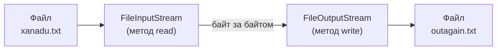
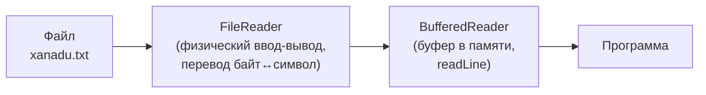
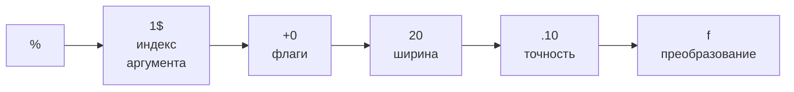
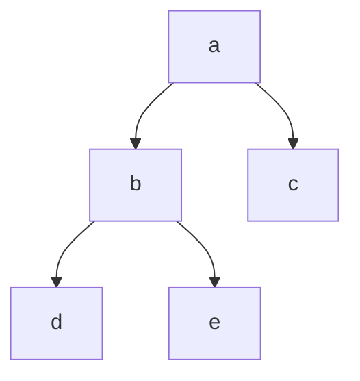

# Урок 2. Базовый ввод-вывод

**Трейл:** Essential Java Classes · **Оригинал:** [Basic I/O](https://docs.oracle.com/javase/tutorial/essential/io/index.html)
**Связанные области:** [[07-io-nio]] · **Вопросы:** io-nio

> Перевод официального руководства Oracle (The Java Tutorials, JDK 8). Урок охватывает классы
> платформы Java, используемые для базового ввода-вывода. Сначала рассматриваются потоки
> ввода-вывода (I/O streams) — мощная концепция, упрощающая операции ввода-вывода. Затем
> рассматривается сериализация (serialization), позволяющая программам записывать целые объекты
> в потоки и считывать их обратно. Наконец, рассматривается файловый ввод-вывод и операции с
> файловой системой, включая файлы с произвольным доступом.
>
> Большинство классов раздела «Потоки ввода-вывода» находятся в пакете `java.io`, а классы
> файлового ввода-вывода — преимущественно в пакете `java.nio.file`.

Урок состоит из двух больших частей:

- **Потоки ввода-вывода** (I/O Streams) — байтовые и символьные потоки, буферизация,
  сканирование и форматирование, ввод-вывод из командной строки, потоки данных и потоки объектов.
- **Файловый ввод-вывод (с использованием NIO.2)** — класс `Path`, класс `Files`, операции над
  файлами и каталогами, метаданные, чтение/запись/создание файлов, файлы с произвольным доступом,
  каталоги, ссылки, обход дерева файлов, поиск файлов, слежение за изменениями каталога и
  взаимодействие с устаревшим кодом.

---

# Часть I. Потоки ввода-вывода (I/O Streams)

## Байтовые потоки (Byte Streams)

Программы используют **байтовые потоки** (*byte streams*) для ввода и вывода 8-битных байтов.
Все классы байтовых потоков являются потомками
[`InputStream`](https://docs.oracle.com/javase/8/docs/api/java/io/InputStream.html) и
[`OutputStream`](https://docs.oracle.com/javase/8/docs/api/java/io/OutputStream.html).

Классов байтовых потоков много. Чтобы показать, как работают байтовые потоки, мы сосредоточимся
на файловых байтовых потоках
[`FileInputStream`](https://docs.oracle.com/javase/8/docs/api/java/io/FileInputStream.html) и
[`FileOutputStream`](https://docs.oracle.com/javase/8/docs/api/java/io/FileOutputStream.html).
Другие виды байтовых потоков используются примерно так же; они различаются в основном способом
конструирования.

### Использование байтовых потоков

Рассмотрим `FileInputStream` и `FileOutputStream` на примере программы `CopyBytes`, которая
копирует файл `xanadu.txt` побайтно с помощью байтовых потоков.

```java
import java.io.FileInputStream;
import java.io.FileOutputStream;
import java.io.IOException;

public class CopyBytes {
    public static void main(String[] args) throws IOException {

        FileInputStream in = null;
        FileOutputStream out = null;

        try {
            in = new FileInputStream("xanadu.txt");
            out = new FileOutputStream("outagain.txt");
            int c;

            while ((c = in.read()) != -1) {
                out.write(c);
            }
        } finally {
            if (in != null) {
                in.close();
            }
            if (out != null) {
                out.close();
            }
        }
    }
}
```

`CopyBytes` почти всё время проводит в простом цикле, считывая входной поток и записывая в
выходной поток по одному байту за раз. Схема такого простого ввода-вывода через байтовые потоки:

<!-- original: assets/03-essential-classes/byteStream.gif | Схема простого байтового ввода-вывода: чтение и запись побайтно -->


### Всегда закрывайте потоки

Закрытие потока, когда он больше не нужен, очень важно — настолько, что `CopyBytes` использует
блок `finally`, чтобы гарантировать закрытие обоих потоков даже при возникновении ошибки. Эта
практика помогает избежать серьёзных утечек ресурсов.

Одна из возможных ошибок — `CopyBytes` не смог открыть один или оба файла. В этом случае
переменная потока, соответствующая файлу, так и остаётся в начальном значении `null`. Именно
поэтому `CopyBytes` проверяет, что каждая переменная потока содержит ссылку на объект, прежде чем
вызвать `close`.

### Когда не следует использовать байтовые потоки

`CopyBytes` выглядит как обычная программа, но на самом деле представляет низкоуровневый
ввод-вывод, которого следует избегать. Поскольку `xanadu.txt` содержит символьные данные, лучше
использовать символьные потоки (см. следующий раздел). Существуют также потоки для более сложных
типов данных. Байтовые потоки следует применять только для самого примитивного ввода-вывода.

Зачем тогда говорить о байтовых потоках? Потому что все остальные типы потоков построены на
основе байтовых потоков.

## Символьные потоки (Character Streams)

Платформа Java хранит символьные значения по правилам Unicode. Символьный ввод-вывод
автоматически переводит этот внутренний формат в локальную кодировку и обратно. В западных
локалях локальная кодировка обычно является 8-битным надмножеством ASCII.

Для большинства приложений ввод-вывод через символьные потоки не сложнее, чем через байтовые.
Ввод и вывод, выполняемые классами потоков, автоматически переводятся в локальную кодировку и
обратно. Программа, использующая символьные потоки вместо байтовых, автоматически адаптируется к
локальной кодировке и готова к интернационализации — без дополнительных усилий со стороны
программиста.

Если интернационализация не приоритетна, можно просто использовать символьные классы, не уделяя
особого внимания вопросам кодировки. Позже, если интернационализация станет важной, программу
можно адаптировать без масштабной переработки кода.

### Использование символьных потоков

Все классы символьных потоков являются потомками
[`Reader`](https://docs.oracle.com/javase/8/docs/api/java/io/Reader.html) и
[`Writer`](https://docs.oracle.com/javase/8/docs/api/java/io/Writer.html). Как и в случае байтовых
потоков, есть символьные классы, специализирующиеся на файловом вводе-выводе:
[`FileReader`](https://docs.oracle.com/javase/8/docs/api/java/io/FileReader.html) и
[`FileWriter`](https://docs.oracle.com/javase/8/docs/api/java/io/FileWriter.html). Их иллюстрирует
пример `CopyCharacters`.

```java
import java.io.FileReader;
import java.io.FileWriter;
import java.io.IOException;

public class CopyCharacters {
    public static void main(String[] args) throws IOException {

        FileReader inputStream = null;
        FileWriter outputStream = null;

        try {
            inputStream = new FileReader("xanadu.txt");
            outputStream = new FileWriter("characteroutput.txt");

            int c;
            while ((c = inputStream.read()) != -1) {
                outputStream.write(c);
            }
        } finally {
            if (inputStream != null) {
                inputStream.close();
            }
            if (outputStream != null) {
                outputStream.close();
            }
        }
    }
}
```

`CopyCharacters` очень похож на `CopyBytes`. Главное отличие в том, что `CopyCharacters`
использует для ввода и вывода `FileReader` и `FileWriter` вместо `FileInputStream` и
`FileOutputStream`. Обе программы используют переменную типа `int` для чтения и записи. Однако в
`CopyCharacters` переменная `int` хранит символьное значение в последних 16 битах, а в `CopyBytes`
переменная `int` хранит байтовое значение в последних 8 битах.

#### Символьные потоки, использующие байтовые потоки

Символьные потоки часто являются «обёртками» (*wrappers*) над байтовыми потоками. Символьный
поток использует байтовый для физического ввода-вывода, а сам берёт на себя перевод между
символами и байтами. Например, `FileReader` использует `FileInputStream`, а `FileWriter` —
`FileOutputStream`.

Существует два универсальных «мостовых» потока байт↔символ:
[`InputStreamReader`](https://docs.oracle.com/javase/8/docs/api/java/io/InputStreamReader.html) и
[`OutputStreamWriter`](https://docs.oracle.com/javase/8/docs/api/java/io/OutputStreamWriter.html).
Используйте их для создания символьных потоков, когда нет готового символьного класса, отвечающего
вашим потребностям.

### Построчный ввод-вывод (Line-Oriented I/O)

Символьный ввод-вывод обычно происходит более крупными единицами, чем отдельные символы.
Распространённая единица — строка: последовательность символов с признаком конца строки в конце.
Признаком конца строки может быть последовательность «возврат каретки + перевод строки» (`"\r\n"`),
одиночный возврат каретки (`"\r"`) или одиночный перевод строки (`"\n"`). Поддержка всех возможных
признаков конца строки позволяет читать текстовые файлы, созданные в любой из широко используемых
операционных систем.

Изменим пример `CopyCharacters`, чтобы использовать построчный ввод-вывод. Для этого понадобятся
два новых класса: [`BufferedReader`](https://docs.oracle.com/javase/8/docs/api/java/io/BufferedReader.html)
и [`PrintWriter`](https://docs.oracle.com/javase/8/docs/api/java/io/PrintWriter.html). Подробнее
они рассматриваются в разделах «Буферизованный ввод-вывод» и «Форматирование».

Пример `CopyLines` вызывает `BufferedReader.readLine` и `PrintWriter.println` для ввода и вывода
по одной строке за раз.

```java
import java.io.FileReader;
import java.io.FileWriter;
import java.io.BufferedReader;
import java.io.PrintWriter;
import java.io.IOException;

public class CopyLines {
    public static void main(String[] args) throws IOException {

        BufferedReader inputStream = null;
        PrintWriter outputStream = null;

        try {
            inputStream = new BufferedReader(new FileReader("xanadu.txt"));
            outputStream = new PrintWriter(new FileWriter("characteroutput.txt"));

            String l;
            while ((l = inputStream.readLine()) != null) {
                outputStream.println(l);
            }
        } finally {
            if (inputStream != null) {
                inputStream.close();
            }
            if (outputStream != null) {
                outputStream.close();
            }
        }
    }
}
```

Вызов `readLine` возвращает строку текста. `CopyLines` выводит каждую строку методом `println`,
который добавляет признак конца строки для текущей операционной системы. Этот признак может
отличаться от того, что использовался во входном файле.

## Буферизованные потоки (Buffered Streams)

Большинство рассмотренных до сих пор примеров используют **небуферизованный** (*unbuffered*)
ввод-вывод. Это означает, что каждый запрос на чтение или запись обрабатывается напрямую базовой
операционной системой. Это может сделать программу гораздо менее эффективной, поскольку каждый
такой запрос часто вызывает обращение к диску, сетевую активность или другую относительно дорогую
операцию.

Чтобы снизить эти накладные расходы, платформа Java реализует **буферизованные** (*buffered*)
потоки ввода-вывода. Буферизованные входные потоки читают данные из области памяти, называемой
**буфером** (*buffer*); нативный API ввода вызывается только тогда, когда буфер пуст. Аналогично,
буферизованные выходные потоки записывают данные в буфер, а нативный API вывода вызывается только
когда буфер заполнен.

Программа может превратить небуферизованный поток в буферизованный с помощью приёма обёртывания:
объект небуферизованного потока передаётся в конструктор класса буферизованного потока. Вот как
можно изменить вызовы конструкторов из примера `CopyCharacters`, чтобы использовать
буферизованный ввод-вывод:

```java
inputStream = new BufferedReader(new FileReader("xanadu.txt"));
outputStream = new BufferedWriter(new FileWriter("characteroutput.txt"));
```

Существует четыре класса буферизованных потоков, которыми обёртывают небуферизованные потоки:
[`BufferedInputStream`](https://docs.oracle.com/javase/8/docs/api/java/io/BufferedInputStream.html)
и [`BufferedOutputStream`](https://docs.oracle.com/javase/8/docs/api/java/io/BufferedOutputStream.html)
создают буферизованные байтовые потоки, а
[`BufferedReader`](https://docs.oracle.com/javase/8/docs/api/java/io/BufferedReader.html) и
[`BufferedWriter`](https://docs.oracle.com/javase/8/docs/api/java/io/BufferedWriter.html) —
буферизованные символьные потоки.

Схема конвейера обёрток (буферизованный поток поверх файлового потока):

<!-- original: none | Конвейер буферизованного потока — авторская схема, Oracle не публикует отдельную диаграмму для BufferedReader -->


### Сброс буферизованных потоков (Flushing)

Часто имеет смысл записать содержимое буфера в критических точках, не дожидаясь его заполнения.
Это называется **сбросом** (*flushing*) буфера.

Некоторые классы буферизованного вывода поддерживают **автосброс** (*autoflush*), задаваемый
необязательным аргументом конструктора. Когда автосброс включён, определённые ключевые события
вызывают сброс буфера. Например, объект `PrintWriter` с автосбросом сбрасывает буфер при каждом
вызове `println` или `format`.

Чтобы сбросить поток вручную, вызовите его метод `flush`. Метод `flush` допустим для любого
выходного потока, но не оказывает эффекта, если поток не буферизован.

## Сканирование и форматирование (Scanning and Formatting)

Программирование ввода-вывода часто связано с преобразованием в аккуратно отформатированные
данные, удобные для человека, и обратно. Для этих задач платформа Java предоставляет два API.
API **сканера** (*scanner*) разбивает ввод на отдельные токены, связанные с фрагментами данных.
API **форматирования** (*formatting*) собирает данные в удобный для чтения вид.

### Сканирование (Scanning)

Объекты типа [`Scanner`](https://docs.oracle.com/javase/8/docs/api/java/util/Scanner.html) полезны
для разбиения форматированного ввода на токены и перевода отдельных токенов в соответствии с их
типом данных.

#### Разбиение ввода на токены

По умолчанию сканер использует пробельные символы для разделения токенов. (Пробельные символы
включают пробелы, табуляции и признаки конца строки; полный список см. в документации
`Character.isWhitespace`.) Программа `ScanXan` читает отдельные слова в `xanadu.txt` и печатает их
по одному в строке.

```java
import java.io.*;
import java.util.Scanner;

public class ScanXan {
    public static void main(String[] args) throws IOException {

        Scanner s = null;

        try {
            s = new Scanner(new BufferedReader(new FileReader("xanadu.txt")));

            while (s.hasNext()) {
                System.out.println(s.next());
            }
        } finally {
            if (s != null) {
                s.close();
            }
        }
    }
}
```

Обратите внимание, что `ScanXan` вызывает метод `close` объекта `Scanner`, закончив с ним работу.
Хотя сканер не является потоком, его нужно закрыть, чтобы обозначить, что вы закончили работать с
лежащим в его основе потоком.

Вывод `ScanXan` выглядит так:

```
In
Xanadu
did
Kubla
Khan
A
stately
pleasure-dome
...
```

Чтобы использовать другой разделитель токенов, вызовите `useDelimiter()`, указав регулярное
выражение. Например, чтобы разделителем была запятая, за которой может следовать пробел:

```java
s.useDelimiter(",\\s*");
```

#### Перевод отдельных токенов

Пример `ScanXan` трактует все входные токены как простые значения `String`. `Scanner` также
поддерживает токены для всех примитивных типов языка Java (кроме `char`), а также `BigInteger` и
`BigDecimal`. Кроме того, числовые значения могут использовать разделители тысяч. Так, в локали
`US` `Scanner` корректно читает строку «32,767» как целочисленное значение.

Разделители тысяч и символы десятичного разделителя зависят от локали. Поэтому следующий пример не
работал бы корректно во всех локалях, если бы мы не указали, что сканер должен использовать локаль
`US`. Пример `ScanSum` читает список значений `double` и складывает их.

```java
import java.io.FileReader;
import java.io.BufferedReader;
import java.io.IOException;
import java.util.Scanner;
import java.util.Locale;

public class ScanSum {
    public static void main(String[] args) throws IOException {

        Scanner s = null;
        double sum = 0;

        try {
            s = new Scanner(new BufferedReader(new FileReader("usnumbers.txt")));
            s.useLocale(Locale.US);

            while (s.hasNext()) {
                if (s.hasNextDouble()) {
                    sum += s.nextDouble();
                } else {
                    s.next();
                }   
            }
        } finally {
            s.close();
        }

        System.out.println(sum);
    }
}
```

Пример входного файла `usnumbers.txt`:

```
8.5
32,767
3.14159
1,000,000.1
```

Выходная строка — «1032778.74159». В некоторых локалях точка будет другим символом, потому что
`System.out` — это объект `PrintStream`, а этот класс не даёт способа переопределить локаль по
умолчанию. Можно переопределить локаль для всей программы — или просто воспользоваться
форматированием, описанным далее.

### Форматирование (Formatting)

Объекты потоков, реализующих форматирование, являются экземплярами либо
[`PrintWriter`](https://docs.oracle.com/javase/8/docs/api/java/io/PrintWriter.html) (класс
символьного потока), либо
[`PrintStream`](https://docs.oracle.com/javase/8/docs/api/java/io/PrintStream.html) (класс
байтового потока).

> **Примечание.** Единственные объекты `PrintStream`, которые вам, скорее всего, понадобятся, —
> это `System.out` и `System.err`. Когда нужно создать форматированный выходной поток, создавайте
> экземпляр `PrintWriter`, а не `PrintStream`.

Оба класса реализуют один и тот же набор методов для преобразования внутренних данных в
форматированный вывод. Предоставляются два уровня форматирования:

- `print` и `println` форматируют отдельные значения стандартным образом.
- `format` форматирует практически любое число значений на основе строки формата с множеством
  опций точного форматирования.

#### Методы `print` и `println`

Вызов `print` или `println` выводит одно значение, преобразовав его соответствующим методом
`toString`. Пример `Root`:

```java
public class Root {
    public static void main(String[] args) {
        int i = 2;
        double r = Math.sqrt(i);
        
        System.out.print("The square root of ");
        System.out.print(i);
        System.out.print(" is ");
        System.out.print(r);
        System.out.println(".");

        i = 5;
        r = Math.sqrt(i);
        System.out.println("The square root of " + i + " is " + r + ".");
    }
}
```

Вывод `Root`:

```
The square root of 2 is 1.4142135623730951.
The square root of 5 is 2.23606797749979.
```

Так можно отформатировать любое значение, но контроля над результатом немного.

#### Метод `format`

Метод `format` форматирует несколько аргументов на основе **строки формата** (*format string*).
Строка формата состоит из статического текста, в который встроены **спецификаторы формата**
(*format specifiers*); за исключением спецификаторов, строка формата выводится без изменений.

Пример `Root2` форматирует два значения одним вызовом `format`:

```java
public class Root2 {
    public static void main(String[] args) {
        int i = 2;
        double r = Math.sqrt(i);
        
        System.out.format("The square root of %d is %f.%n", i, r);
    }
}
```

Вывод:

```
The square root of 2 is 1.414214.
```

Все спецификаторы формата начинаются с `%` и заканчиваются 1- или 2-символьным **преобразованием**
(*conversion*), задающим вид формируемого вывода. Использованные здесь преобразования:

| Преобразование | Назначение |
|---|---|
| `d` | целое число как десятичное значение |
| `f` | число с плавающей точкой как десятичное значение |
| `n` | платформенно-зависимый признак конца строки |
| `x` | целое число как шестнадцатеричное значение |
| `s` | любое значение как строка |
| `tB` | целое число как зависящее от локали название месяца |

Существует много других преобразований.

> **Примечание.** За исключением `%%` и `%n`, каждый спецификатор формата должен соответствовать
> аргументу. Иначе выбрасывается исключение.
>
> В языке Java escape-последовательность `\n` всегда генерирует символ перевода строки (`
`).
> Не используйте `\n`, если вам не нужен именно символ перевода строки. Чтобы получить корректный
> разделитель строк для локальной платформы, используйте `%n`.

Помимо преобразования спецификатор формата может содержать несколько дополнительных элементов,
настраивающих вывод. Пример `Format` использует все возможные виды элементов:

```java
public class Format {
    public static void main(String[] args) {
        System.out.format("%f, %1$+020.10f %n", Math.PI);
    }
}
```

Вывод:

```
3.141593, +00000003.1415926536
```

Дополнительные элементы все необязательны и должны идти в показанном порядке. Двигаясь справа
налево, необязательные элементы таковы:

| Элемент | Назначение |
|---|---|
| **Точность** (*Precision*) | Для значений с плавающей точкой — математическая точность форматируемого значения. Для `s` и других общих преобразований — максимальная ширина значения; при необходимости значение усекается справа. |
| **Ширина** (*Width*) | Минимальная ширина форматируемого значения; при необходимости значение дополняется. По умолчанию дополняется слева пробелами. |
| **Флаги** (*Flags*) | Дополнительные опции форматирования. В примере флаг `+` означает, что число всегда форматируется со знаком, а флаг `0` — что символом-заполнителем является `0`. Другие флаги: `-` (дополнять справа) и `,` (форматировать число с зависящими от локали разделителями тысяч). Некоторые флаги несовместимы с другими флагами или с определёнными преобразованиями. |
| **Индекс аргумента** (*Argument Index*) | Позволяет явно сопоставить указанный аргумент. Можно также задать `<`, чтобы сослаться на тот же аргумент, что и предыдущий спецификатор. Так, пример мог бы быть записан: `System.out.format("%f, %<+020.10f %n", Math.PI);` |

Структура спецификатора формата (на примере `%1$+020.10f`):

<!-- original: assets/03-essential-classes/io-spec.gif | Элементы спецификатора формата: индекс аргумента, флаги, ширина, точность, преобразование -->


## Ввод-вывод из командной строки (I/O from the Command Line)

Программа часто запускается из командной строки и взаимодействует с пользователем в среде
командной строки. Платформа Java поддерживает такое взаимодействие двумя способами: через
**стандартные потоки** (Standard Streams) и через **консоль** (Console).

### Стандартные потоки (Standard Streams)

Стандартные потоки — это возможность многих операционных систем. По умолчанию они читают ввод с
клавиатуры и пишут вывод на экран. Они также поддерживают ввод-вывод в файлы и между программами,
но эта возможность управляется интерпретатором командной строки, а не программой.

Платформа Java поддерживает три стандартных потока: **стандартный ввод** (*Standard Input*),
доступный через `System.in`; **стандартный вывод** (*Standard Output*), доступный через
`System.out`; и **стандартный вывод ошибок** (*Standard Error*), доступный через `System.err`. Эти
объекты определяются автоматически и не требуют открытия. Стандартный вывод и вывод ошибок
предназначены для вывода; отдельный поток ошибок позволяет перенаправить обычный вывод в файл и при
этом видеть сообщения об ошибках.

Можно было бы ожидать, что стандартные потоки — символьные, но по историческим причинам они
байтовые. `System.out` и `System.err` определены как объекты `PrintStream`. Хотя технически это
байтовый поток, `PrintStream` использует внутренний объект символьного потока, чтобы эмулировать
многие возможности символьных потоков.

Напротив, `System.in` — байтовый поток без возможностей символьного потока. Чтобы использовать
стандартный ввод как символьный поток, оберните `System.in` в `InputStreamReader`:

```java
InputStreamReader cin = new InputStreamReader(System.in);
```

### Консоль (Console)

Более продвинутая альтернатива стандартным потокам — **консоль** (Console). Это единый
предопределённый объект типа `Console`, обладающий большинством возможностей стандартных потоков и
рядом других. Консоль особенно полезна для безопасного ввода паролей. Объект `Console` также
предоставляет входной и выходной потоки, которые являются настоящими символьными потоками, через
методы `reader` и `writer`.

Прежде чем программа сможет использовать консоль, она должна попытаться получить объект `Console`,
вызвав `System.console()`. Если объект доступен, метод возвращает его. Если `System.console`
возвращает `null`, операции с консолью недопустимы — либо потому, что ОС их не поддерживает, либо
потому, что программа запущена в неинтерактивной среде.

Объект `Console` поддерживает безопасный ввод пароля через метод `readPassword`. Этот метод
повышает безопасность двумя способами. Во-первых, он подавляет эхо, поэтому пароль не виден на
экране. Во-вторых, `readPassword` возвращает массив символов, а не `String`, так что пароль можно
перезаписать, удалив его из памяти, как только он больше не нужен.

Пример `Password` — прототип программы для смены пароля пользователя. Он демонстрирует несколько
методов `Console`.

```java
import java.io.Console;
import java.util.Arrays;
import java.io.IOException;

public class Password {
    
    public static void main (String args[]) throws IOException {

        Console c = System.console();
        if (c == null) {
            System.err.println("No console.");
            System.exit(1);
        }

        String login = c.readLine("Enter your login: ");
        char [] oldPassword = c.readPassword("Enter your old password: ");

        if (verify(login, oldPassword)) {
            boolean noMatch;
            do {
                char [] newPassword1 = c.readPassword("Enter your new password: ");
                char [] newPassword2 = c.readPassword("Enter new password again: ");
                noMatch = ! Arrays.equals(newPassword1, newPassword2);
                if (noMatch) {
                    c.format("Passwords don't match. Try again.%n");
                } else {
                    change(login, newPassword1);
                    c.format("Password for %s changed.%n", login);
                }
                Arrays.fill(newPassword1, ' ');
                Arrays.fill(newPassword2, ' ');
            } while (noMatch);
        }

        Arrays.fill(oldPassword, ' ');
    }
    
    // Заглушка метода проверки.
    static boolean verify(String login, char[] password) {
        // В этом примере метод всегда
        // возвращает true.
        // Измените его, чтобы проверять
        // пароль по своим правилам.
        return true;
    }

    // Заглушка метода смены пароля.
    static void change(String login, char[] password) {
        // Измените этот метод, чтобы менять
        // пароль по своим правилам.
    }
}
```

Класс `Password` выполняет следующие шаги:

1. Пытается получить объект `Console`. Если объект недоступен — прерывается.
2. Вызывает `Console.readLine`, чтобы запросить и прочитать логин пользователя.
3. Вызывает `Console.readPassword`, чтобы запросить и прочитать существующий пароль.
4. Вызывает `verify`, чтобы подтвердить право пользователя сменить пароль. (В примере `verify` —
   заглушка, всегда возвращающая `true`.)
5. Повторяет следующие шаги, пока пользователь не введёт один и тот же пароль дважды:
   1. Вызывает `Console.readPassword` дважды, чтобы запросить и прочитать новый пароль.
   2. Если пользователь ввёл одинаковый пароль оба раза — вызывает `change`. (`change` тоже
      заглушка.)
   3. Перезаписывает оба пароля пробелами.
6. Перезаписывает старый пароль пробелами.

## Потоки данных (Data Streams)

Потоки данных поддерживают двоичный ввод-вывод значений примитивных типов данных (`boolean`,
`char`, `byte`, `short`, `int`, `long`, `float`, `double`), а также значений `String`. Все потоки
данных реализуют интерфейс
[`DataInput`](https://docs.oracle.com/javase/8/docs/api/java/io/DataInput.html) либо
[`DataOutput`](https://docs.oracle.com/javase/8/docs/api/java/io/DataOutput.html). Наиболее широко
используемые реализации этих интерфейсов —
[`DataInputStream`](https://docs.oracle.com/javase/8/docs/api/java/io/DataInputStream.html) и
[`DataOutputStream`](https://docs.oracle.com/javase/8/docs/api/java/io/DataOutputStream.html).

Пример `DataStreams` демонстрирует потоки данных, записывая набор записей данных и затем считывая
их обратно. Каждая запись состоит из трёх значений, относящихся к позиции счёта-фактуры:

| Порядок в записи | Тип данных | Описание данных | Метод вывода | Метод ввода | Пример значения |
|---|---|---|---|---|---|
| 1 | `double` | цена позиции | `DataOutputStream.writeDouble` | `DataInputStream.readDouble` | `19.99` |
| 2 | `int` | количество единиц | `DataOutputStream.writeInt` | `DataInputStream.readInt` | `12` |
| 3 | `String` | описание позиции | `DataOutputStream.writeUTF` | `DataInputStream.readUTF` | `"Java T-Shirt"` |

Сначала программа определяет константы с именем файла данных и сами данные:

```java
static final String dataFile = "invoicedata";

static final double[] prices = { 19.99, 9.99, 15.99, 3.99, 4.99 };
static final int[] units = { 12, 8, 13, 29, 50 };
static final String[] descs = {
    "Java T-shirt",
    "Java Mug",
    "Duke Juggling Dolls",
    "Java Pin",
    "Java Key Chain"
};
```

Затем `DataStreams` открывает выходной поток. Поскольку `DataOutputStream` можно создать только как
обёртку над существующим объектом байтового потока, `DataStreams` предоставляет буферизованный
файловый байтовый поток вывода:

```java
out = new DataOutputStream(new BufferedOutputStream(
              new FileOutputStream(dataFile)));
```

`DataStreams` записывает записи и закрывает выходной поток:

```java
for (int i = 0; i < prices.length; i ++) {
    out.writeDouble(prices[i]);
    out.writeInt(units[i]);
    out.writeUTF(descs[i]);
}
```

Метод `writeUTF` записывает значения `String` в модифицированной форме UTF-8. Это кодировка
переменной ширины, которой для распространённых западных символов нужен всего один байт.

Теперь `DataStreams` считывает данные обратно. Сначала нужно предоставить входной поток и
переменные для входных данных. Как и `DataOutputStream`, `DataInputStream` должен конструироваться
как обёртка над байтовым потоком:

```java
in = new DataInputStream(new
            BufferedInputStream(new FileInputStream(dataFile)));

double price;
int unit;
String desc;
double total = 0.0;
```

Теперь `DataStreams` может прочитать каждую запись потока:

```java
try {
    while (true) {
        price = in.readDouble();
        unit = in.readInt();
        desc = in.readUTF();
        System.out.format("You ordered %d" + " units of %s at $%.2f%n",
            unit, desc, price);
        total += unit * price;
    }
} catch (EOFException e) {
}
```

Обратите внимание, что `DataStreams` обнаруживает конец файла, перехватывая
[`EOFException`](https://docs.oracle.com/javase/8/docs/api/java/io/EOFException.html), а не проверяя
недопустимое возвращаемое значение. Все реализации методов `DataInput` используют `EOFException`
вместо возвращаемых значений.

Каждая специализированная запись (`write`) в `DataStreams` в точности соответствует
соответствующему специализированному чтению (`read`). Программист сам обязан следить за тем, чтобы
типы вывода и ввода совпадали: входной поток состоит из простых двоичных данных, в которых ничто не
указывает тип отдельных значений или где они начинаются.

`DataStreams` использует один очень плохой приём: применяет числа с плавающей точкой для денежных
значений. В целом плавающая точка плоха для точных значений, и особенно плоха для десятичных
дробей, поскольку у распространённых значений (например, `0.1`) нет точного двоичного
представления.

Правильный тип для денежных значений —
[`java.math.BigDecimal`](https://docs.oracle.com/javase/8/docs/api/java/math/BigDecimal.html). К
сожалению, `BigDecimal` — объектный тип, поэтому он не работает с потоками данных. Однако
`BigDecimal` **работает** с потоками объектов, рассматриваемыми в следующем разделе.

## Потоки объектов (Object Streams)

Подобно тому как потоки данных поддерживают ввод-вывод примитивных типов, потоки объектов
поддерживают ввод-вывод объектов. Большинство (но не все) стандартных классов поддерживают
сериализацию своих объектов. Те, что поддерживают, реализуют маркерный интерфейс
[`Serializable`](https://docs.oracle.com/javase/8/docs/api/java/io/Serializable.html).

Классы потоков объектов —
[`ObjectInputStream`](https://docs.oracle.com/javase/8/docs/api/java/io/ObjectInputStream.html) и
[`ObjectOutputStream`](https://docs.oracle.com/javase/8/docs/api/java/io/ObjectOutputStream.html).
Они реализуют [`ObjectInput`](https://docs.oracle.com/javase/8/docs/api/java/io/ObjectInput.html) и
[`ObjectOutput`](https://docs.oracle.com/javase/8/docs/api/java/io/ObjectOutput.html), которые
являются подынтерфейсами `DataInput` и `DataOutput`. Это значит, что все методы ввода-вывода
примитивных данных, рассмотренные в разделе «Потоки данных», также реализованы в потоках объектов.
Поэтому поток объектов может содержать смесь примитивных и объектных значений. Пример
`ObjectStreams` создаёт то же приложение, что и `DataStreams`, с парой изменений. Во-первых, цены
теперь являются объектами `BigDecimal` для лучшего представления дробных значений. Во-вторых, в
файл данных записывается объект `Calendar`, обозначающий дату счёта-фактуры.

Если `readObject()` возвращает не тот тип объекта, который ожидался, попытка привести его к
правильному типу может выбросить
[`ClassNotFoundException`](https://docs.oracle.com/javase/8/docs/api/java/lang/ClassNotFoundException.html).
В этом простом примере такого случиться не может, поэтому исключение не перехватывается. Вместо
этого мы уведомляем компилятор, что осведомлены о проблеме, добавив `ClassNotFoundException` в
секцию `throws` метода `main`.

### Вывод и ввод сложных объектов

Методы `writeObject` и `readObject` просты в использовании, но содержат очень сложную логику
управления объектами. Это неважно для класса вроде `Calendar`, который просто инкапсулирует
примитивные значения. Но многие объекты содержат ссылки на другие объекты. Если `readObject` должен
восстановить объект из потока, он должен уметь восстановить все объекты, на которые ссылался
исходный. У этих дополнительных объектов могут быть свои ссылки и так далее. В этой ситуации
`writeObject` обходит всю сеть ссылок на объекты и записывает в поток все объекты этой сети. Таким
образом, единственный вызов `writeObject` может привести к записи в поток большого числа объектов.

Если, например, `writeObject` вызывается для записи единственного объекта **a**, который содержит
ссылки на объекты **b** и **c**, а **b** содержит ссылки на **d** и **e**, то вызов
`writeObject(a)` записывает не только **a**, но и все объекты, необходимые для восстановления
**a** — то есть и остальные четыре объекта этой сети. Когда **a** считывается обратно методом
`readObject`, остальные четыре объекта тоже считываются, и все исходные ссылки сохраняются.

<!-- original: assets/03-essential-classes/io-trav.gif | Граф объектов при сериализации: writeObject(a) записывает всю сеть ссылок -->


Что произойдёт, если два объекта в одном потоке содержат ссылки на один и тот же объект? Будут ли
они оба ссылаться на единственный объект при считывании обратно? Ответ — «да». Поток может содержать
только одну копию объекта, хотя и любое число ссылок на него. Так, если явно записать объект в
поток дважды, на самом деле дважды записывается лишь ссылка. Например:

```java
Object ob = new Object();
out.writeObject(ob);
out.writeObject(ob);
```

Каждый `writeObject` должен сопровождаться соответствующим `readObject`, поэтому код чтения будет
выглядеть примерно так:

```java
Object ob1 = in.readObject();
Object ob2 = in.readObject();
```

В результате получатся две переменные, `ob1` и `ob2`, ссылающиеся на единственный объект.

Однако если один объект записать в два разных потока, он фактически дублируется — программа,
считывающая оба потока обратно, увидит два различных объекта.

---

# Часть II. Файловый ввод-вывод (с использованием NIO.2)

## Что такое путь? (What Is a Path?)

**Файловая система** (*file system*) хранит и организует файлы на каком-либо носителе (обычно на
одном или нескольких жёстких дисках) так, чтобы их можно было легко извлекать. Большинство
современных файловых систем хранят файлы в виде дерева (иерархической структуры). На вершине дерева
находится один (или несколько) корневых узлов. Под корневым узлом располагаются файлы и каталоги
(*папки* в Microsoft Windows). Каждый каталог может содержать файлы и подкаталоги, которые, в свою
очередь, могут содержать файлы и подкаталоги, и так далее почти до неограниченной глубины.

### Что такое путь?

Microsoft Windows поддерживает несколько корневых узлов. Каждый корневой узел отображается на том,
например `C:\` или `D:\`. ОС Solaris поддерживает единственный корневой узел, обозначаемый символом
слеша `/`.

Файл идентифицируется своим **путём** (*path*) через файловую систему, начиная от корневого узла.
Например, файл `statusReport` в ОС Solaris описывается так:

```
/home/sally/statusReport
```

В Microsoft Windows `statusReport` описывается так:

```
C:\home\sally\statusReport
```

Символ, используемый для разделения имён каталогов (**разделитель**, *delimiter*), специфичен для
файловой системы: ОС Solaris использует прямой слеш (`/`), а Microsoft Windows — обратный слеш
(`\`).

### Относительный или абсолютный?

Путь бывает **относительным** (*relative*) или **абсолютным** (*absolute*). Абсолютный путь всегда
содержит корневой элемент и полный список каталогов, необходимый для нахождения файла. Например,
`/home/sally/statusReport` — абсолютный путь. Вся информация для нахождения файла содержится в
строке пути.

Относительный путь нужно комбинировать с другим путём, чтобы получить доступ к файлу. Например,
`joe/foo` — относительный путь. Без дополнительной информации программа не может надёжно найти
каталог `joe/foo`.

### Символические ссылки (Symbolic Links)

Объекты файловой системы — чаще всего каталоги или файлы. Но некоторые файловые системы также
поддерживают понятие **символических ссылок** (*symbolic links*; также *symlink* или *soft link*).

Символическая ссылка — это особый файл, служащий ссылкой на другой файл. По большей части
символические ссылки прозрачны для приложений, и операции над символическими ссылками
автоматически перенаправляются на **цель** (*target*) ссылки. Исключения — удаление или
переименование символической ссылки: в этом случае удаляется или переименовывается сама ссылка, а
не её цель.

Например, `logFile` может выглядеть для пользователя как обычный файл, но на самом деле является
символической ссылкой на `dir/logs/HomeLogFile`. `HomeLogFile` — цель ссылки. Чтение или запись
символической ссылки — то же самое, что чтение или запись любого другого файла или каталога.

Фраза **разрешение ссылки** (*resolving a link*) означает подстановку фактического расположения в
файловой системе вместо символической ссылки. В примере разрешение `logFile` даёт
`dir/logs/HomeLogFile`.

В реальных сценариях большинство файловых систем активно используют символические ссылки. Иногда
небрежно созданная символическая ссылка может вызвать **циклическую ссылку** (*circular
reference*) — когда цель ссылки указывает обратно на исходную ссылку. Циклическая ссылка может быть
косвенной: каталог `a` указывает на `b`, который указывает на `c`, содержащий подкаталог,
указывающий обратно на `a`. Циклические ссылки могут вызвать проблемы при рекурсивном обходе
структуры каталогов. Однако этот сценарий учтён и не приведёт к бесконечному зацикливанию программы.

## Класс Path

Класс [`Path`](https://docs.oracle.com/javase/8/docs/api/java/nio/file/Path.html), введённый в
выпуске Java SE 7, — одна из главных точек входа пакета
[`java.nio.file`](https://docs.oracle.com/javase/8/docs/api/java/nio/file/package-summary.html).

> **Замечание о версии.** Если у вас есть код до JDK 7, использующий `java.io.File`, вы можете
> воспользоваться функциональностью класса `Path` с помощью метода
> [`File.toPath`](https://docs.oracle.com/javase/8/docs/api/java/io/File.html#toPath--). См. раздел
> «Устаревший код файлового ввода-вывода».

Как следует из названия, класс `Path` — программное представление пути в файловой системе. Объект
`Path` содержит имя файла и список каталогов, использованные для построения пути, и применяется для
исследования, нахождения и манипулирования файлами.

Экземпляр `Path` отражает базовую платформу. В ОС Solaris `Path` использует синтаксис Solaris
(`/home/joe/foo`), в Microsoft Windows — синтаксис Windows (`C:\home\joe\foo`). `Path` не является
системно-независимым. Нельзя сравнить `Path` из файловой системы Solaris и ожидать совпадения с
`Path` из файловой системы Windows, даже если структура каталогов идентична и оба экземпляра
указывают на один и тот же относительный файл.

Файл или каталог, соответствующий `Path`, может не существовать. Можно создать экземпляр `Path` и
манипулировать им различными способами: дополнять, извлекать части, сравнивать с другим путём. В
нужный момент можно использовать методы класса
[`Files`](https://docs.oracle.com/javase/8/docs/api/java/nio/file/Files.html), чтобы проверить
существование файла, создать его, открыть, удалить, изменить права и так далее.

## Операции с путём (Path Operations)

Класс `Path` содержит методы для получения информации о пути, доступа к его элементам,
преобразования пути в другие формы или извлечения его частей. Есть также методы для сопоставления
строки пути и для удаления избыточностей. Эти методы иногда называют **синтаксическими**
(*syntactic*) операциями, так как они работают с самим путём и не обращаются к файловой системе.

### Создание Path

Объект `Path` создаётся одним из методов `get` вспомогательного класса
[`Paths`](https://docs.oracle.com/javase/8/docs/api/java/nio/file/Paths.html) (обратите внимание на
множественное число):

```java
Path p1 = Paths.get("/tmp/foo");
Path p2 = Paths.get(args[0]);
Path p3 = Paths.get(URI.create("file:///Users/joe/FileTest.java"));
```

Метод `Paths.get` — сокращение для следующего кода:

```java
Path p4 = FileSystems.getDefault().getPath("/users/sally");
```

Следующий пример создаёт `/u/joe/logs/foo.log`, если домашний каталог — `/u/joe`, или
`C:\joe\logs\foo.log` в Windows:

```java
Path p5 = Paths.get(System.getProperty("user.home"),"logs", "foo.log");
```

### Получение информации о пути

`Path` можно представить как последовательность элементов-имён. Самый верхний элемент в структуре
каталогов находится по индексу 0. Самый нижний — по индексу `[n-1]`, где `n` — число элементов-имён.

```java
// Ни один из этих методов не требует, чтобы файл,
// соответствующий Path, существовал.
// Синтаксис Microsoft Windows
Path path = Paths.get("C:\\home\\joe\\foo");

// Синтаксис Solaris
Path path = Paths.get("/home/joe/foo");

System.out.format("toString: %s%n", path.toString());
System.out.format("getFileName: %s%n", path.getFileName());
System.out.format("getName(0): %s%n", path.getName(0));
System.out.format("getNameCount: %d%n", path.getNameCount());
System.out.format("subpath(0,2): %s%n", path.subpath(0,2));
System.out.format("getParent: %s%n", path.getParent());
System.out.format("getRoot: %s%n", path.getRoot());
```

Вывод для Windows и Solaris (абсолютный путь):

| Вызванный метод | Возвращает в ОС Solaris | Возвращает в Microsoft Windows | Комментарий |
|---|---|---|---|
| `toString` | `/home/joe/foo` | `C:\home\joe\foo` | Строковое представление `Path`. Если путь создан через `Paths.get`/`getPath`, выполняется небольшая синтаксическая очистка (например, в UNIX строка `//home/joe/foo` исправляется на `/home/joe/foo`). |
| `getFileName` | `foo` | `foo` | Имя файла — последний элемент последовательности имён. |
| `getName(0)` | `home` | `home` | Элемент пути по указанному индексу. Элемент 0 — ближайший к корню. |
| `getNameCount` | `3` | `3` | Число элементов в пути. |
| `subpath(0,2)` | `home/joe` | `home\joe` | Подпоследовательность `Path` (без корневого элемента) по начальному и конечному индексам. |
| `getParent` | `/home/joe` | `\home\joe` | Путь родительского каталога. |
| `getRoot` | `/` | `C:\` | Корень пути. |

Для относительного пути (`Paths.get("sally/bar")` / `Paths.get("sally\\bar")`):

| Вызванный метод | Возвращает в ОС Solaris | Возвращает в Microsoft Windows |
|---|---|---|
| `toString` | `sally/bar` | `sally\bar` |
| `getFileName` | `bar` | `bar` |
| `getName(0)` | `sally` | `sally` |
| `getNameCount` | `2` | `2` |
| `subpath(0,1)` | `sally` | `sally` |
| `getParent` | `sally` | `sally` |
| `getRoot` | `null` | `null` |

### Удаление избыточностей из пути

Многие файловые системы используют «.» для обозначения текущего каталога и «..» для родительского.
Может возникнуть ситуация, когда `Path` содержит избыточную информацию о каталогах. Оба следующих
пути содержат избыточности:

```
/home/./joe/foo
/home/sally/../joe/foo
```

Метод `normalize` удаляет все избыточные элементы — включая любые вхождения «`.`» или
«`каталог/..`». Оба примера нормализуются в `/home/joe/foo`.

Важно: `normalize` не обращается к файловой системе при очистке пути — это чисто синтаксическая
операция. Во втором примере, если `sally` была символической ссылкой, удаление `sally/..` могло бы
привести к `Path`, который больше не указывает на нужный файл. Чтобы очистить путь, гарантируя, что
результат указывает на правильный файл, используйте метод `toRealPath`.

### Преобразование пути

Для преобразования `Path` есть три метода. Чтобы преобразовать путь в строку, которую можно открыть
в браузере, используйте
[`toUri`](https://docs.oracle.com/javase/8/docs/api/java/nio/file/Path.html#toUri--):

```java
Path p1 = Paths.get("/home/logfile");
// Результат: file:///home/logfile
System.out.format("%s%n", p1.toUri());
```

Метод
[`toAbsolutePath`](https://docs.oracle.com/javase/8/docs/api/java/nio/file/Path.html#toAbsolutePath--)
преобразует путь в абсолютный. Если переданный путь уже абсолютный, возвращается тот же объект
`Path`. Метод полезен при обработке имён файлов, введённых пользователем:

```java
public class FileTest {
    public static void main(String[] args) {

        if (args.length < 1) {
            System.out.println("usage: FileTest file");
            System.exit(-1);
        }

        // Преобразует входную строку в объект Path.
        Path inputPath = Paths.get(args[0]);

        // Преобразует входной Path в абсолютный путь.
        // Обычно это означает добавление в начало
        // текущего рабочего каталога. Если бы пример
        // вызвали так:
        //     java FileTest foo
        // методы getRoot и getParent вернули бы null
        // на исходном экземпляре "inputPath". Вызов
        // getRoot и getParent на экземпляре "fullPath"
        // возвращает ожидаемые значения.
        Path fullPath = inputPath.toAbsolutePath();
    }
}
```

Метод
[`toRealPath`](https://docs.oracle.com/javase/8/docs/api/java/nio/file/Path.html#toRealPath-java.nio.file.LinkOption...-)
возвращает **реальный** путь существующего файла, выполняя несколько операций сразу:

- если передано `true` и файловая система поддерживает символические ссылки, метод разрешает все
  символические ссылки в пути;
- если `Path` относительный, возвращает абсолютный путь;
- если `Path` содержит избыточные элементы, возвращает путь без них.

Метод выбрасывает исключение, если файл не существует или недоступен:

```java
try {
    Path fp = path.toRealPath();
} catch (NoSuchFileException x) {
    System.err.format("%s: no such" + " file or directory%n", path);
    // Логика для случая, когда файл не существует.
} catch (IOException x) {
    System.err.format("%s%n", x);
    // Логика для других файловых ошибок.
}
```

### Соединение двух путей

Пути можно соединять методом `resolve`. Вы передаёте **частичный путь** (*partial path*) — путь без
корневого элемента, — и он дописывается к исходному пути:

```java
// Solaris
Path p1 = Paths.get("/home/joe/foo");
// Результат: /home/joe/foo/bar
System.out.format("%s%n", p1.resolve("bar"));
```

```java
// Microsoft Windows
Path p1 = Paths.get("C:\\home\\joe\\foo");
// Результат: C:\home\joe\foo\bar
System.out.format("%s%n", p1.resolve("bar"));
```

Передача абсолютного пути в `resolve` возвращает переданный путь:

```java
// Результат: /home/joe
Paths.get("foo").resolve("/home/joe");
```

### Создание пути между двумя путями

Способность построить путь от одного места в файловой системе к другому даёт метод `relativize`. Он
строит путь, исходящий из исходного пути и заканчивающийся в месте, заданном переданным путём; новый
путь **относителен** исходному.

```java
Path p1 = Paths.get("joe");
Path p2 = Paths.get("sally");
// Результат: ../sally
Path p1_to_p2 = p1.relativize(p2);
// Результат: ../joe
Path p2_to_p1 = p2.relativize(p1);
```

Чуть более сложный пример:

```java
Path p1 = Paths.get("home");
Path p3 = Paths.get("home/sally/bar");
// Результат: sally/bar
Path p1_to_p3 = p1.relativize(p3);
// Результат: ../..
Path p3_to_p1 = p3.relativize(p1);
```

Относительный путь нельзя построить, если корневой элемент есть только у одного из путей. Если
корневой элемент есть у обоих, возможность построения зависит от системы.

### Сравнение двух путей

Класс `Path` поддерживает `equals` для проверки равенства двух путей. Методы `startsWith` и
`endsWith` позволяют проверить, начинается ли или заканчивается ли путь определённой строкой:

```java
Path path = ...;
Path otherPath = ...;
Path beginning = Paths.get("/home");
Path ending = Paths.get("foo");

if (path.equals(otherPath)) {
    // логика равенства
} else if (path.startsWith(beginning)) {
    // путь начинается с "/home"
} else if (path.endsWith(ending)) {
    // путь заканчивается на "foo"
}
```

Класс `Path` реализует интерфейс `Iterable`; метод `iterator` возвращает объект для итерации по
элементам-именам пути (первым возвращается элемент, ближайший к корню):

```java
Path path = ...;
for (Path name: path) {
    System.out.println(name);
}
```

`Path` также реализует `Comparable`, так что объекты `Path` можно сравнивать через `compareTo`
(полезно для сортировки) и помещать в `Collection`. Чтобы проверить, указывают ли два `Path` на
один и тот же файл, используйте метод `isSameFile`.

## Операции над файлами (File Operations)

Класс [`Files`](https://docs.oracle.com/javase/8/docs/api/java/nio/file/Files.html) — вторая
главная точка входа пакета `java.nio.file`. Он предоставляет богатый набор статических методов для
чтения, записи и манипулирования файлами и каталогами. Методы `Files` работают с экземплярами
объектов `Path`.

### Освобождение системных ресурсов

Многие ресурсы этого API (потоки, каналы) реализуют или расширяют интерфейс
[`java.io.Closeable`](https://docs.oracle.com/javase/8/docs/api/java/io/Closeable.html). Требование
к `Closeable`-ресурсу — вызвать метод `close`, когда ресурс больше не нужен. Незакрытие ресурса
негативно сказывается на производительности приложения. Оператор `try`-with-resources делает этот
шаг за вас.

### Перехват исключений

При файловом вводе-выводе непредвиденные ситуации — норма жизни. Все методы, обращающиеся к
файловой системе, могут выбросить `IOException`. Лучшая практика — перехватывать эти исключения,
встраивая методы в оператор `try`-with-resources, введённый в Java SE 7. Его преимущество в том,
что компилятор автоматически генерирует код закрытия ресурсов:

```java
Charset charset = Charset.forName("US-ASCII");
String s = ...;
try (BufferedWriter writer = Files.newBufferedWriter(file, charset)) {
    writer.write(s, 0, s.length());
} catch (IOException x) {
    System.err.format("IOException: %s%n", x);
}
```

Как вариант, можно встроить методы в блок `try`, перехватив исключения в `catch`, а потоки и каналы
закрыть в блоке `finally`:

```java
Charset charset = Charset.forName("US-ASCII");
String s = ...;
BufferedWriter writer = null;
try {
    writer = Files.newBufferedWriter(file, charset);
    writer.write(s, 0, s.length());
} catch (IOException x) {
    System.err.format("IOException: %s%n", x);
} finally {
    if (writer != null) writer.close();
}
```

Помимо `IOException`, многие специфические исключения расширяют
[`FileSystemException`](https://docs.oracle.com/javase/8/docs/api/java/nio/file/FileSystemException.html).
Этот класс имеет полезные методы: `getFile` (файл, участвовавший в операции), `getMessage`
(подробное сообщение), `getReason` (причина сбоя) и `getOtherFile` («другой» файл, если есть):

```java
try (...) {
    ...    
} catch (NoSuchFileException x) {
    System.err.format("%s does not exist\n", x.getFile());
}
```

Для ясности примеры в этом уроке могут не показывать обработку исключений, но ваш код всегда должен
её включать.

### Переменное число аргументов (Varargs)

Несколько методов `Files` принимают произвольное число аргументов, когда указываются флаги.
Например, в сигнатуре `Path Files.move(Path, Path, CopyOption...)` многоточие после `CopyOption`
означает, что метод принимает переменное число аргументов (*varargs*). Можно передать список
значений через запятую или массив:

```java
import static java.nio.file.StandardCopyOption.*;

Path source = ...;
Path target = ...;
Files.move(source,
           target,
           REPLACE_EXISTING,
           ATOMIC_MOVE);
```

### Атомарные операции (Atomic Operations)

Несколько методов `Files`, таких как `move`, в некоторых файловых системах могут выполнять
определённые операции атомарно. **Атомарная файловая операция** — операция, которую нельзя прервать
или выполнить «частично»: либо она выполняется целиком, либо терпит неудачу. Это важно, когда
несколько процессов работают с одной областью файловой системы и нужно гарантировать, что каждый
процесс получает доступ к завершённому файлу.

### Цепочки методов (Method Chaining)

Многие методы файлового ввода-вывода поддерживают **цепочки методов** (*method chaining*): вызывая
метод, возвращающий объект, вы сразу вызываете метод на нём и так далее:

```java
String value = Charset.defaultCharset().decode(buf).toString();
UserPrincipal group =
    file.getFileSystem().getUserPrincipalLookupService().
         lookupPrincipalByName("me");
```

### Что такое glob?

Два метода класса `Files` принимают аргумент-**glob** — строку-шаблон, сопоставляемую с другими
строками (именами каталогов или файлов). Синтаксис glob подчиняется нескольким правилам:

| Конструкция | Значение |
|---|---|
| `*` | соответствует любому числу символов (в том числе нулю) |
| `**` | как `*`, но пересекает границы каталогов (для сопоставления полных путей) |
| `?` | соответствует ровно одному символу |
| `{...}` | набор подшаблонов: `{sun,moon,stars}` — «sun», «moon» или «stars»; `{temp*,tmp*}` — все строки, начинающиеся с «temp» или «tmp» |
| `[...]` | набор отдельных символов или диапазон через дефис: `[aeiou]` — гласная; `[0-9]` — цифра; `[A-Z]` — заглавная буква; `[a-z,A-Z]` — любая буква. Внутри скобок `*`, `?`, `\` соответствуют самим себе |
| прочие символы | соответствуют самим себе |
| `\` | экранирование: `\\` — обратный слеш, `\?` — знак вопроса |

Примеры glob:

| Шаблон | Что соответствует |
|---|---|
| `*.html` | все строки, оканчивающиеся на `.html` |
| `???` | все строки ровно из трёх букв или цифр |
| `*[0-9]*` | все строки, содержащие числовое значение |
| `*.{htm,html,pdf}` | строки, оканчивающиеся на `.htm`, `.html` или `.pdf` |
| `a?*.java` | строка, начинающаяся с `a`, затем хотя бы одна буква/цифра, оканчивается на `.java` |
| `{foo*,*[0-9]*}` | строка, начинающаяся с `foo`, или содержащая числовое значение |

> **Примечание.** Если вы вводите glob-шаблон с клавиатуры и он содержит специальный символ, нужно
> заключить шаблон в кавычки (`"*"`), использовать обратный слеш (`\*`) или иной механизм
> экранирования командной строки.

Если синтаксиса glob недостаточно, можно использовать регулярные выражения (*regex*).

### Осведомлённость о ссылках (Link Awareness)

Класс `Files` «осведомлён о ссылках» (*link aware*). Каждый метод `Files` либо сам определяет, что
делать при встрече символической ссылки, либо предоставляет опцию для настройки поведения.

## Проверка файла или каталога (Checking a File or Directory)

### Проверка существования

Методы класса `Path` синтаксичны и работают с самим экземпляром. Но в итоге нужно обратиться к
файловой системе, чтобы убедиться, существует ли конкретный `Path`. Для этого служат методы
[`exists(Path, LinkOption...)`](https://docs.oracle.com/javase/8/docs/api/java/nio/file/Files.html#exists-java.nio.file.Path-java.nio.file.LinkOption...-)
и
[`notExists(Path, LinkOption...)`](https://docs.oracle.com/javase/8/docs/api/java/nio/file/Files.html#notExists-java.nio.file.Path-java.nio.file.LinkOption...-).
Заметьте, что `!Files.exists(path)` не эквивалентно `Files.notExists(path)`. При проверке
существования файла возможны три результата:

- файл точно существует;
- файл точно не существует;
- состояние файла неизвестно (например, программа не имеет доступа к файлу).

Если и `exists`, и `notExists` возвращают `false`, существование файла подтвердить нельзя.

### Проверка доступности файла

Чтобы убедиться, что программа может получить доступ к файлу, используйте методы
[`isReadable(Path)`](https://docs.oracle.com/javase/8/docs/api/java/nio/file/Files.html#isReadable-java.nio.file.Path-),
[`isWritable(Path)`](https://docs.oracle.com/javase/8/docs/api/java/nio/file/Files.html#isWritable-java.nio.file.Path-)
и
[`isExecutable(Path)`](https://docs.oracle.com/javase/8/docs/api/java/nio/file/Files.html#isExecutable-java.nio.file.Path-):

```java
Path file = ...;
boolean isRegularExecutableFile = Files.isRegularFile(file) &
         Files.isReadable(file) & Files.isExecutable(file);
```

> **Примечание.** После завершения любого из этих методов нет гарантии, что доступ к файлу
> возможен. Распространённый изъян безопасности — выполнить проверку, а затем обратиться к файлу.
> Подробнее — поищите `TOCTTOU` (произносится «ток-ту»).

### Проверка, указывают ли два пути на один файл

В файловой системе с символическими ссылками два разных пути могут указывать на один файл. Метод
[`isSameFile(Path, Path)`](https://docs.oracle.com/javase/8/docs/api/java/nio/file/Files.html#isSameFile-java.nio.file.Path-java.nio.file.Path-)
сравнивает два пути:

```java
Path p1 = ...;
Path p2 = ...;

if (Files.isSameFile(p1, p2)) {
    // Логика, когда пути указывают на один файл
}
```

## Удаление файла или каталога (Deleting)

Можно удалять файлы, каталоги или ссылки. При удалении символической ссылки удаляется ссылка, а не
её цель. Каталог должен быть пуст, иначе удаление не удастся.

Метод
[`delete(Path)`](https://docs.oracle.com/javase/8/docs/api/java/nio/file/Files.html#delete-java.nio.file.Path-)
удаляет файл или выбрасывает исключение при неудаче. Например, если файла нет, выбрасывается
`NoSuchFileException`:

```java
try {
    Files.delete(path);
} catch (NoSuchFileException x) {
    System.err.format("%s: no such" + " file or directory%n", path);
} catch (DirectoryNotEmptyException x) {
    System.err.format("%s not empty%n", path);
} catch (IOException x) {
    // Проблемы с правами доступа перехватываются здесь.
    System.err.println(x);
}
```

Метод
[`deleteIfExists(Path)`](https://docs.oracle.com/javase/8/docs/api/java/nio/file/Files.html#deleteIfExists-java.nio.file.Path-)
тоже удаляет файл, но если файла нет, исключение не выбрасывается. Тихий отказ полезен, когда
несколько потоков удаляют файлы и не нужно выбрасывать исключение лишь потому, что один поток
успел раньше.

## Копирование файла или каталога (Copying)

Файл или каталог копируется методом `copy(Path, Path, CopyOption...)`. Копирование не удастся, если
целевой файл существует, если не указана опция `REPLACE_EXISTING`.

Каталоги можно копировать, однако файлы внутри каталога не копируются, поэтому новый каталог пуст,
даже если исходный содержал файлы. При копировании символической ссылки копируется её цель. Чтобы
скопировать саму ссылку, укажите `NOFOLLOW_LINKS` или `REPLACE_EXISTING`.

Метод принимает varargs-аргумент. Поддерживаются перечисления `StandardCopyOption` и `LinkOption`:

| Опция | Значение |
|---|---|
| `REPLACE_EXISTING` | Выполняет копирование, даже если целевой файл уже существует. Если цель — символическая ссылка, копируется сама ссылка. Если цель — непустой каталог, копирование завершается `DirectoryNotEmptyException`. |
| `COPY_ATTRIBUTES` | Копирует атрибуты файла на целевой файл. Точный набор зависит от файловой системы и платформы, но `last-modified-time` поддерживается на всех платформах и копируется. |
| `NOFOLLOW_LINKS` | Указывает не следовать по символическим ссылкам. Если копируемый файл — символическая ссылка, копируется ссылка (а не её цель). |

```java
import static java.nio.file.StandardCopyOption.*;
...
Files.copy(source, target, REPLACE_EXISTING);
```

Кроме копирования файлов класс `Files` также определяет методы для копирования между файлом и
потоком:

- `copy(InputStream, Path, CopyOptions...)` — копирует все байты из входного потока в файл;
- `copy(Path, OutputStream)` — копирует все байты из файла в выходной поток.

Пример `Copy` использует методы `copy` и `Files.walkFileTree` для рекурсивного копирования.

## Перемещение файла или каталога (Moving)

Файл или каталог перемещается методом
[`move(Path, Path, CopyOption...)`](https://docs.oracle.com/javase/8/docs/api/java/nio/file/Files.html#move-java.nio.file.Path-java.nio.file.Path-java.nio.file.CopyOption...-).
Перемещение не удастся, если целевой файл существует, если не указана опция `REPLACE_EXISTING`.

Пустые каталоги можно перемещать. Если каталог непуст, перемещение разрешено, когда каталог можно
переместить без перемещения его содержимого. В UNIX-системах перемещение каталога в том же разделе
обычно сводится к переименованию, и тогда метод работает даже если каталог содержит файлы.

Метод принимает varargs-аргумент; поддерживаются перечисления `StandardCopyOption`:

| Опция | Значение |
|---|---|
| `REPLACE_EXISTING` | Выполняет перемещение, даже если целевой файл уже существует. Если цель — символическая ссылка, заменяется сама ссылка, но не то, на что она указывает. |
| `ATOMIC_MOVE` | Выполняет перемещение как атомарную файловую операцию. Если файловая система не поддерживает атомарное перемещение, выбрасывается исключение. С `ATOMIC_MOVE` можно переместить файл в каталог и гарантировать, что любой процесс, наблюдающий за каталогом, получит доступ к завершённому файлу. |

```java
import static java.nio.file.StandardCopyOption.*;
...
Files.move(source, target, REPLACE_EXISTING);
```

Хотя `move` можно применить к одному каталогу, чаще он используется с механизмом рекурсивного
обхода дерева файлов (см. «Обход дерева файлов»).

## Управление метаданными (Managing Metadata)

**Метаданные** (*metadata*) — это «данные о других данных». В файловой системе данные содержатся в
файлах и каталогах, а метаданные отслеживают информацию о каждом объекте: это обычный файл, каталог
или ссылка? Каковы его размер, дата создания, дата изменения, владелец файла, владелец группы и
права доступа? Метаданные файловой системы обычно называют **атрибутами файла** (*file
attributes*).

### Методы для одного атрибута

| Метод | Комментарий |
|---|---|
| `size(Path)` | Возвращает размер файла в байтах. |
| `isDirectory(Path, LinkOption)` | `true`, если `Path` указывает на каталог. |
| `isRegularFile(Path, LinkOption...)` | `true`, если `Path` указывает на обычный файл. |
| `isSymbolicLink(Path)` | `true`, если `Path` указывает на символическую ссылку. |
| `isHidden(Path)` | `true`, если файл считается скрытым файловой системой. |
| `getLastModifiedTime(Path, LinkOption...)` / `setLastModifiedTime(Path, FileTime)` | Возвращает или задаёт время последнего изменения файла. |
| `getOwner(Path, LinkOption...)` / `setOwner(Path, UserPrincipal)` | Возвращает или задаёт владельца файла. |
| `getPosixFilePermissions(Path, LinkOption...)` / `setPosixFilePermissions(Path, Set<PosixFilePermission>)` | Возвращает или задаёт POSIX-права файла. |
| `getAttribute(Path, String, LinkOption...)` / `setAttribute(Path, String, Object, LinkOption...)` | Возвращает или задаёт значение атрибута файла. |

### Методы пакетного чтения

Если программе нужно несколько атрибутов сразу, неэффективно использовать методы для одного
атрибута. Класс `Files` предоставляет два метода `readAttributes` для чтения атрибутов файла одной
пакетной операцией:

| Метод | Комментарий |
|---|---|
| `readAttributes(Path, String, LinkOption...)` | Читает атрибуты файла пакетно. Параметр `String` определяет, какие атрибуты читать. |
| `readAttributes(Path, Class<A>, LinkOption...)` | Читает атрибуты пакетно. Параметр `Class<A>` — тип запрашиваемых атрибутов; метод возвращает объект этого класса. |

### Представления атрибутов файла (File Attribute Views)

Связанные атрибуты группируются в **представления** (*views*). Представление отображается на
конкретную реализацию файловой системы (POSIX, DOS) или на общую функциональность (владение файлом):

| Представление | Назначение |
|---|---|
| `BasicFileAttributeView` | Базовые атрибуты, обязательные для всех реализаций файловых систем. |
| `DosFileAttributeView` | Расширяет базовое представление четырьмя стандартными битами файловых систем с DOS-атрибутами. |
| `PosixFileAttributeView` | Расширяет базовое представление атрибутами POSIX-систем (UNIX): владелец файла, владелец группы и девять прав доступа. |
| `FileOwnerAttributeView` | Поддерживается любой реализацией, поддерживающей понятие владельца файла. |
| `AclFileAttributeView` | Чтение/обновление списков управления доступом (ACL). Поддерживается модель NFSv4 ACL. |
| `UserDefinedFileAttributeView` | Поддержка пользовательских метаданных (например, MIME-тип файла в ОС Solaris). |

В большинстве случаев напрямую с интерфейсами `FileAttributeView` работать не приходится. Если же
нужно, доступ к ним даёт метод `getFileAttributeView(Path, Class<V>, LinkOption...)`.

### Базовые атрибуты файла

Для чтения базовых атрибутов используйте `Files.readAttributes`, который читает все базовые атрибуты
одной операцией. Varargs-аргумент сейчас поддерживает перечисление `LinkOption` `NOFOLLOW_LINKS`
(используйте, когда не хотите следовать по символическим ссылкам).

**О временны́х метках.** Набор базовых атрибутов включает три метки: `creationTime`,
`lastModifiedTime` и `lastAccessTime`. Любая из них может не поддерживаться конкретной реализацией.
Когда поддерживается, метка возвращается как объект
[`FileTime`](https://docs.oracle.com/javase/8/docs/api/java/nio/file/attribute/FileTime.html).

```java
Path file = ...;
BasicFileAttributes attr = Files.readAttributes(file, BasicFileAttributes.class);

System.out.println("creationTime: " + attr.creationTime());
System.out.println("lastAccessTime: " + attr.lastAccessTime());
System.out.println("lastModifiedTime: " + attr.lastModifiedTime());

System.out.println("isDirectory: " + attr.isDirectory());
System.out.println("isOther: " + attr.isOther());
System.out.println("isRegularFile: " + attr.isRegularFile());
System.out.println("isSymbolicLink: " + attr.isSymbolicLink());
System.out.println("size: " + attr.size());
```

Помимо показанных методов есть `fileKey`, возвращающий объект, уникально идентифицирующий файл, или
`null`, если ключ недоступен.

Установка времени последнего изменения (в миллисекундах):

```java
Path file = ...;
BasicFileAttributes attr =
    Files.readAttributes(file, BasicFileAttributes.class);
long currentTime = System.currentTimeMillis();
FileTime ft = FileTime.fromMillis(currentTime);
Files.setLastModifiedTime(file, ft);
```

### DOS-атрибуты файла

DOS-атрибуты поддерживаются и в файловых системах, отличных от DOS (например, Samba):

```java
Path file = ...;
try {
    DosFileAttributes attr =
        Files.readAttributes(file, DosFileAttributes.class);
    System.out.println("isReadOnly is " + attr.isReadOnly());
    System.out.println("isHidden is " + attr.isHidden());
    System.out.println("isArchive is " + attr.isArchive());
    System.out.println("isSystem is " + attr.isSystem());
} catch (UnsupportedOperationException x) {
    System.err.println("DOS file" +
        " attributes not supported:" + x);
}
```

Установить DOS-атрибут можно методом `setAttribute`:

```java
Path file = ...;
Files.setAttribute(file, "dos:hidden", true);
```

### POSIX-права файла

**POSIX** (Portable Operating System Interface for UNIX) — набор стандартов IEEE и ISO для
обеспечения совместимости разных вариантов UNIX. Помимо владельца файла и владельца группы POSIX
поддерживает девять прав: чтение, запись и выполнение для владельца, членов той же группы и «всех
остальных».

```java
Path file = ...;
PosixFileAttributes attr =
    Files.readAttributes(file, PosixFileAttributes.class);
System.out.format("%s %s %s%n",
    attr.owner().getName(),
    attr.group().getName(),
    PosixFilePermissions.toString(attr.permissions()));
```

Вспомогательный класс `PosixFilePermissions` предоставляет полезные методы:

- `toString` — преобразует права в строку (например, `rw-r--r--`);
- `fromString` — принимает строку прав и строит `Set` прав;
- `asFileAttribute` — принимает `Set` прав и строит атрибут файла, передаваемый в `createFile` или
  `createDirectory`.

Создание файла с правами, скопированными с другого файла:

```java
Path sourceFile = ...;
Path newFile = ...;
PosixFileAttributes attrs =
    Files.readAttributes(sourceFile, PosixFileAttributes.class);
FileAttribute<Set<PosixFilePermission>> attr =
    PosixFilePermissions.asFileAttribute(attrs.permissions());
Files.createFile(file, attr);
```

Учтите, что также применяется `umask`, поэтому новый файл может быть более защищённым, чем
запрошено. Установка прав из строки:

```java
Path file = ...;
Set<PosixFilePermission> perms =
    PosixFilePermissions.fromString("rw-------");
FileAttribute<Set<PosixFilePermission>> attr =
    PosixFilePermissions.asFileAttribute(perms);
Files.setPosixFilePermissions(file, perms);
```

Пример `Chmod` рекурсивно меняет права файлов аналогично утилите `chmod`.

### Установка владельца файла или группы

Чтобы превратить имя в объект владельца, используйте сервис
[`UserPrincipalLookupService`](https://docs.oracle.com/javase/8/docs/api/java/nio/file/attribute/UserPrincipalLookupService.html),
получаемый методом `FileSystem.getUserPrincipalLookupService`.

Установка владельца файла:

```java
Path file = ...;
UserPrincipal owner = file.GetFileSystem().getUserPrincipalLookupService()
        .lookupPrincipalByName("sally");
Files.setOwner(file, owner);
```

В классе `Files` нет специального метода для установки владельца группы, но это можно сделать через
представление POSIX-атрибутов:

```java
Path file = ...;
GroupPrincipal group =
    file.getFileSystem().getUserPrincipalLookupService()
        .lookupPrincipalByGroupName("green");
Files.getFileAttributeView(file, PosixFileAttributeView.class)
     .setGroup(group);
```

### Пользовательские атрибуты файла

Если поддерживаемых атрибутов недостаточно, используйте `UserDefinedAttributeView` для собственных
атрибутов. Некоторые реализации отображают это понятие на альтернативные потоки данных NTFS и
расширенные атрибуты файловых систем ext3 и ZFS. Большинство реализаций ограничивают размер
значения (например, ext3 — 4 КБ).

Запись MIME-типа файла как пользовательского атрибута:

```java
Path file = ...;
UserDefinedFileAttributeView view = Files
    .getFileAttributeView(file, UserDefinedFileAttributeView.class);
view.write("user.mimetype",
           Charset.defaultCharset().encode("text/html");
```

Чтение этого атрибута:

```java
Path file = ...;
UserDefinedFileAttributeView view = Files
.getFileAttributeView(file,UserDefinedFileAttributeView.class);
String name = "user.mimetype";
ByteBuffer buf = ByteBuffer.allocate(view.size(name));
view.read(name, buf);
buf.flip();
String value = Charset.defaultCharset().decode(buf).toString();
```

Пример `Xdd` показывает, как получать, задавать и удалять пользовательский атрибут.

> **Примечание.** В Linux может потребоваться включить расширенные атрибуты. Если при доступе к
> пользовательскому представлению атрибутов вы получаете `UnsupportedOperationException`,
> перемонтируйте файловую систему. Команда перемонтирует корневой раздел с расширенными атрибутами
> для ext3: `sudo mount -o remount,user_xattr /`. Для постоянного изменения добавьте запись в
> `/etc/fstab`.

### Атрибуты файлового хранилища (File Store)

Класс [`FileStore`](https://docs.oracle.com/javase/8/docs/api/java/nio/file/FileStore.html) даёт
информацию о файловом хранилище, например о доступном пространстве. Метод `getFileStore(Path)`
извлекает хранилище для файла:

```java
Path file = ...;
FileStore store = Files.getFileStore(file);

long total = store.getTotalSpace() / 1024;
long used = (store.getTotalSpace() -
             store.getUnallocatedSpace()) / 1024;
long avail = store.getUsableSpace() / 1024;
```

Пример `DiskUsage` использует этот API для вывода информации о дисковом пространстве всех хранилищ;
он применяет метод `getFileStores` класса `FileSystem`.

## Чтение, запись и создание файлов (Reading, Writing, and Creating Files)

Существует широкий набор методов файлового ввода-вывода. Их можно упорядочить от менее сложных к
более сложным:

<!-- original: assets/03-essential-classes/io-fileiomethods.gif | Спектр методов файлового ввода-вывода: от простых (readAllBytes) до продвинутых (FileChannel) -->


Слева — утилиты для простых случаев. Правее — методы итерирования по потоку или строкам текста,
совместимые с пакетом `java.io`. Ещё правее — методы работы с `ByteChannel`,
`SeekableByteChannel` и `ByteBuffer`. На правом краю — методы с `FileChannel` для продвинутых
приложений, которым нужны блокировки файлов или ввод-вывод с отображением в память.

### Параметр OpenOptions

Несколько методов принимают необязательный параметр `OpenOptions`. Поддерживаются перечисления
`StandardOpenOption`:

| Опция | Значение |
|---|---|
| `WRITE` | Открывает файл для записи. |
| `APPEND` | Дописывает новые данные в конец файла. Используется с `WRITE` или `CREATE`. |
| `TRUNCATE_EXISTING` | Усекает файл до нуля байтов. Используется с `WRITE`. |
| `CREATE_NEW` | Создаёт новый файл, выбрасывает исключение, если файл уже существует. |
| `CREATE` | Открывает файл, если он есть, или создаёт новый, если нет. |
| `DELETE_ON_CLOSE` | Удаляет файл при закрытии потока. Полезно для временных файлов. |
| `SPARSE` | Подсказка, что новый файл будет разреженным. Учитывается некоторыми файловыми системами (например, NTFS). |
| `SYNC` | Поддерживает синхронизацию файла (содержимое и метаданные) с устройством хранения. |
| `DSYNC` | Поддерживает синхронизацию содержимого файла с устройством хранения. |

### Часто используемые методы для небольших файлов

Чтобы прочитать всё содержимое небольшого файла за один проход, используйте `readAllBytes(Path)`
или `readAllLines(Path, Charset)`. Эти методы берут на себя открытие и закрытие потока, но не
предназначены для больших файлов:

```java
Path file = ...;
byte[] fileArray;
fileArray = Files.readAllBytes(file);
```

Для записи байтов или строк используйте методы `write`:

- `write(Path, byte[], OpenOption...)`
- `write(Path, Iterable<? extends CharSequence>, Charset, OpenOption...)`

```java
Path file = ...;
byte[] buf = ...;
Files.write(file, buf);
```

### Буферизованный ввод-вывод для текстовых файлов

Метод `newBufferedReader(Path, Charset)` открывает файл для чтения, возвращая `BufferedReader`:

```java
Charset charset = Charset.forName("US-ASCII");
try (BufferedReader reader = Files.newBufferedReader(file, charset)) {
    String line = null;
    while ((line = reader.readLine()) != null) {
        System.out.println(line);
    }
} catch (IOException x) {
    System.err.format("IOException: %s%n", x);
}
```

Метод `newBufferedWriter(Path, Charset, OpenOption...)` пишет в файл через `BufferedWriter`:

```java
Charset charset = Charset.forName("US-ASCII");
String s = ...;
try (BufferedWriter writer = Files.newBufferedWriter(file, charset)) {
    writer.write(s, 0, s.length());
} catch (IOException x) {
    System.err.format("IOException: %s%n", x);
}
```

### Методы для небуферизованных потоков, совместимые с java.io

Открыть файл для чтения можно методом `newInputStream(Path, OpenOption...)`, возвращающим
небуферизованный входной поток:

```java
Path file = ...;
try (InputStream in = Files.newInputStream(file);
    BufferedReader reader =
      new BufferedReader(new InputStreamReader(in))) {
    String line = null;
    while ((line = reader.readLine()) != null) {
        System.out.println(line);
    }
} catch (IOException x) {
    System.err.println(x);
}
```

Создать файл, дописать или записать в него можно методом `newOutputStream(Path, OpenOption...)`,
возвращающим небуферизованный выходной поток. Если опции не указаны и файла нет — он создаётся; если
файл есть — он усекается (эквивалент `CREATE` и `TRUNCATE_EXISTING`):

```java
import static java.nio.file.StandardOpenOption.*;
import java.nio.file.*;
import java.io.*;

public class LogFileTest {

  public static void main(String[] args) {

    // Преобразуем строку в массив байтов.
    String s = "Hello World! ";
    byte data[] = s.getBytes();
    Path p = Paths.get("./logfile.txt");

    try (OutputStream out = new BufferedOutputStream(
      Files.newOutputStream(p, CREATE, APPEND))) {
      out.write(data, 0, data.length);
    } catch (IOException x) {
      System.err.println(x);
    }
  }
}
```

### Методы для каналов и ByteBuffer

Канальный ввод-вывод читает буфер за раз. Интерфейс
[`ByteChannel`](https://docs.oracle.com/javase/8/docs/api/java/nio/channels/ByteChannel.html)
предоставляет базовые `read` и `write`. `SeekableByteChannel` — это `ByteChannel`, способный
хранить и менять позицию в канале, усекать файл и запрашивать его размер. Это делает возможным
произвольный доступ.

Есть два метода для канального ввода-вывода:

- `newByteChannel(Path, OpenOption...)`
- `newByteChannel(Path, Set<? extends OpenOption>, FileAttribute<?>...)`

> **Примечание.** Методы `newByteChannel` возвращают экземпляр `SeekableByteChannel`. На файловой
> системе по умолчанию его можно привести к
> [`FileChannel`](https://docs.oracle.com/javase/8/docs/api/java/nio/channels/FileChannel.html),
> что даёт доступ к продвинутым возможностям: отображению области файла в память, блокировке
> области, чтению/записи с абсолютной позиции без изменения текущей позиции канала.

Поддерживаются те же опции, что у `newOutputStream`, плюс ещё одна: `READ` (требуется, поскольку
`SeekableByteChannel` поддерживает и чтение, и запись). `READ` открывает канал для чтения, `WRITE`
или `APPEND` — для записи. Если ничего не указано, канал открывается для чтения.

```java
public static void readFile(Path path) throws IOException {

    // Files.newByteChannel() по умолчанию использует StandardOpenOption.READ
    try (SeekableByteChannel sbc = Files.newByteChannel(path)) {
        final int BUFFER_CAPACITY = 10;
        ByteBuffer buf = ByteBuffer.allocate(BUFFER_CAPACITY);

        // Читаем байты с правильной кодировкой для платформы. Если
        // пропустить этот шаг, можно увидеть чужие или нечитаемые
        // символы.
        String encoding = System.getProperty("file.encoding");
        while (sbc.read(buf) > 0) {
            buf.flip();
            System.out.print(Charset.forName(encoding).decode(buf));
            buf.clear();
        }
    }    
}
```

Следующий пример (для UNIX и других POSIX-систем) создаёт лог-файл с заданными правами доступа —
чтение/запись для владельца и только чтение для группы:

```java
import static java.nio.file.StandardOpenOption.*;
import java.nio.*;
import java.nio.channels.*;
import java.nio.file.*;
import java.nio.file.attribute.*;
import java.io.*;
import java.util.*;

public class LogFilePermissionsTest {

  public static void main(String[] args) {
  
    // Создаём набор опций для дописывания в файл.
    Set<OpenOption> options = new HashSet<OpenOption>();
    options.add(APPEND);
    options.add(CREATE);

    // Создаём атрибут пользовательских прав доступа.
    Set<PosixFilePermission> perms =
      PosixFilePermissions.fromString("rw-r-----");
    FileAttribute<Set<PosixFilePermission>> attr =
      PosixFilePermissions.asFileAttribute(perms);

    // Преобразуем строку в ByteBuffer.
    String s = "Hello World! ";
    byte data[] = s.getBytes();
    ByteBuffer bb = ByteBuffer.wrap(data);
    
    Path file = Paths.get("./permissions.log");

    try (SeekableByteChannel sbc =
      Files.newByteChannel(file, options, attr)) {
      sbc.write(bb);
    } catch (IOException x) {
      System.out.println("Exception thrown: " + x);
    }
  }
}
```

### Методы создания обычных и временных файлов

Создать пустой файл с начальным набором атрибутов можно методом
`createFile(Path, FileAttribute<?>)`. Если файл уже существует, `createFile` выбрасывает
исключение. В одной атомарной операции метод проверяет существование файла и создаёт его с
заданными атрибутами, что повышает защиту от вредоносного кода:

```java
Path file = ...;
try {
    // Создаём пустой файл с правами по умолчанию и т. д.
    Files.createFile(file);
} catch (FileAlreadyExistsException x) {
    System.err.format("file named %s" +
        " already exists%n", file);
} catch (IOException x) {
    // Другой сбой, например проблема прав доступа.
    System.err.format("createFile error: %s%n", x);
}
```

Создать временный файл можно методами `createTempFile`:

- `createTempFile(Path, String, String, FileAttribute<?>)`
- `createTempFile(String, String, FileAttribute<?>)`

Первый позволяет указать каталог, второй создаёт файл в каталоге временных файлов по умолчанию:

```java
try {
    Path tempFile = Files.createTempFile(null, ".myapp");
    System.out.format("The temporary file" +
        " has been created: %s%n", tempFile);
} catch (IOException x) {
    System.err.format("IOException: %s%n", x);
}
```

Результат запуска:

```
The temporary file has been created: /tmp/509668702974537184.myapp
```

Конкретный формат имени временного файла зависит от платформы.

## Файлы с произвольным доступом (Random Access Files)

**Файлы с произвольным доступом** (*random access files*) позволяют нелинейный (произвольный)
доступ к содержимому файла. Чтобы обратиться к файлу произвольно, его открывают, перемещаются в
определённое место и читают или пишут.

Эту возможность даёт интерфейс
[`SeekableByteChannel`](https://docs.oracle.com/javase/8/docs/api/java/nio/channels/SeekableByteChannel.html),
расширяющий канальный ввод-вывод понятием текущей позиции. Его API состоит из нескольких простых
методов:

| Метод | Назначение |
|---|---|
| `position` | Возвращает текущую позицию канала. |
| `position(long)` | Задаёт позицию канала. |
| `read(ByteBuffer)` | Читает байты из канала в буфер. |
| `write(ByteBuffer)` | Пишет байты из буфера в канал. |
| `truncate(long)` | Усекает файл (или иную сущность), связанный с каналом. |

Методы `Path.newByteChannel` возвращают экземпляр `SeekableByteChannel`. На файловой системе по
умолчанию его можно использовать как есть или привести к `FileChannel` (продвинутые возможности:
отображение области файла в память, блокировка области, чтение/запись с абсолютной позиции без
изменения текущей).

Следующий фрагмент открывает файл для чтения и записи; возвращённый `SeekableByteChannel`
приводится к `FileChannel`. Затем читаются первые 12 байтов, в их начало пишется строка
«I was here!», позиция перемещается в конец файла, дописываются первые 12 байтов, затем снова
дописывается «I was here!», и канал закрывается:

```java
String s = "I was here!\n";
byte data[] = s.getBytes();
ByteBuffer out = ByteBuffer.wrap(data);

ByteBuffer copy = ByteBuffer.allocate(12);

try (FileChannel fc = (FileChannel.open(file, READ, WRITE))) {
    // Читаем первые 12 байтов файла.
    int nread;
    do {
        nread = fc.read(copy);
    } while (nread != -1 && copy.hasRemaining());

    // Пишем "I was here!" в начало файла.
    fc.position(0);
    while (out.hasRemaining())
        fc.write(out);
    out.rewind();

    // Перемещаемся в конец файла. Копируем первые 12 байтов
    // в конец файла. Затем снова пишем "I was here!".
    long length = fc.size();
    fc.position(length-1);
    copy.flip();
    while (copy.hasRemaining())
        fc.write(copy);
    while (out.hasRemaining())
        fc.write(out);
} catch (IOException x) {
    System.out.println("I/O Exception: " + x);
}
```

## Создание и чтение каталогов (Creating and Reading Directories)

### Перечисление корневых каталогов

Все корневые каталоги файловой системы можно получить методом `FileSystem.getRootDirectories`,
который возвращает `Iterable`:

```java
Iterable<Path> dirs = FileSystems.getDefault().getRootDirectories();
for (Path name: dirs) {
    System.err.println(name);
}
```

### Создание каталога

Новый каталог создаётся методом `createDirectory(Path, FileAttribute<?>)`:

```java
Path dir = ...;
Files.createDirectory(path);
```

Создание каталога с заданными правами на POSIX-системе:

```java
Set<PosixFilePermission> perms =
    PosixFilePermissions.fromString("rwxr-x---");
FileAttribute<Set<PosixFilePermission>> attr =
    PosixFilePermissions.asFileAttribute(perms);
Files.createDirectory(file, attr);
```

Чтобы создать каталог в несколько уровней, когда один или несколько родительских могут не
существовать, используйте `createDirectories(Path, FileAttribute<?>)`:

```java
Files.createDirectories(Paths.get("foo/bar/test"));
```

Каталоги создаются сверху вниз по мере необходимости. Метод может завершиться неудачей, создав
некоторые, но не все родительские каталоги.

### Создание временного каталога

Временный каталог создаётся одним из методов `createTempDirectory`:

- `createTempDirectory(Path, String, FileAttribute<?>...)`
- `createTempDirectory(String, FileAttribute<?>...)`

Первый позволяет указать расположение, второй создаёт каталог в каталоге временных файлов по
умолчанию.

### Перечисление содержимого каталога

Всё содержимое каталога можно перечислить методом `newDirectoryStream(Path)`, возвращающим объект,
реализующий интерфейс `DirectoryStream` (а также `Iterable`). Подход хорошо масштабируется на очень
большие каталоги.

> **Помните:** возвращённый `DirectoryStream` — это поток. Если вы не используете
> `try`-with-resources, не забудьте закрыть его в блоке `finally`.

```java
Path dir = ...;
try (DirectoryStream<Path> stream = Files.newDirectoryStream(dir)) {
    for (Path file: stream) {
        System.out.println(file.getFileName());
    }
} catch (IOException | DirectoryIteratorException x) {
    // IOException никогда не выбрасывается итерацией.
    // Здесь его может выбросить только newDirectoryStream.
    System.err.println(x);
}
```

Объекты `Path`, возвращаемые итератором, — это имена записей, разрешённые относительно каталога.
Метод возвращает всё содержимое: файлы, ссылки, подкаталоги и скрытые файлы. Если при итерации
возникает исключение, выбрасывается `DirectoryIteratorException` с `IOException` в качестве причины.

### Фильтрация списка каталога с помощью glob

Чтобы получить только файлы и подкаталоги, чьё имя соответствует шаблону, используйте
`newDirectoryStream(Path, String)` со встроенным glob-фильтром:

```java
Path dir = ...;
try (DirectoryStream<Path> stream =
     Files.newDirectoryStream(dir, "*.{java,class,jar}")) {
    for (Path entry: stream) {
        System.out.println(entry.getFileName());
    }
} catch (IOException x) {
    System.err.println(x);
}
```

### Собственный фильтр каталога

Можно фильтровать содержимое по любому условию, реализовав интерфейс `DirectoryStream.Filter<T>` с
единственным методом `accept`:

```java
DirectoryStream.Filter<Path> filter =
    newDirectoryStream.Filter<Path>() {
    public boolean accept(Path file) throws IOException {
        try {
            return (Files.isDirectory(path));
        } catch (IOException x) {
            // Не удалось определить, каталог ли это.
            System.err.println(x);
            return false;
        }
    }
};
```

Фильтр передаётся методу `newDirectoryStream(Path, DirectoryStream.Filter<? super Path>)`:

```java
Path dir = ...;
try (DirectoryStream<Path>
                       stream = Files.newDirectoryStream(dir, filter)) {
    for (Path entry: stream) {
        System.out.println(entry.getFileName());
    }
} catch (IOException x) {
    System.err.println(x);
}
```

Этот способ фильтрует только один каталог. Чтобы найти все подкаталоги в дереве файлов, используйте
механизм обхода дерева файлов.

## Ссылки, символические и иные (Links)

Пакет `java.nio.file`, и класс `Path` в частности, «осведомлён о ссылках». Кроме символических
(мягких) ссылок некоторые файловые системы поддерживают **жёсткие ссылки** (*hard links*), которые
более ограничены:

- цель ссылки должна существовать;
- жёсткие ссылки обычно не допускаются на каталоги;
- жёсткие ссылки не могут пересекать разделы или тома (а значит, и файловые системы);
- жёсткая ссылка выглядит и ведёт себя как обычный файл, поэтому её трудно найти;
- жёсткая ссылка — по сути та же сущность, что и исходный файл: те же права, метки времени и т. д.

### Создание символической ссылки

Если файловая система поддерживает это, символическую ссылку создают методом
`createSymbolicLink(Path, Path, FileAttribute<?>)`. Второй аргумент `Path` — цель, которая может и
не существовать:

```java
Path newLink = ...;
Path target = ...;
try {
    Files.createSymbolicLink(newLink, target);
} catch (IOException x) {
    System.err.println(x);
} catch (UnsupportedOperationException x) {
    // Некоторые файловые системы не поддерживают символические ссылки.
    System.err.println(x);
}
```

Vararg `FileAttributes` предназначен для будущего использования и пока не реализован.

### Создание жёсткой ссылки

Жёсткую (обычную) ссылку на существующий файл создают методом `createLink(Path, Path)`. Второй
аргумент `Path` указывает на существующий файл, который должен существовать, иначе выбрасывается
`NoSuchFileException`:

```java
Path newLink = ...;
Path existingFile = ...;
try {
    Files.createLink(newLink, existingFile);
} catch (IOException x) {
    System.err.println(x);
} catch (UnsupportedOperationException x) {
    // Некоторые файловые системы не поддерживают
    // добавление существующего файла в каталог.
    System.err.println(x);
}
```

### Определение символической ссылки

Является ли `Path` символической ссылкой, определяет метод `isSymbolicLink(Path)`:

```java
Path file = ...;
boolean isSymbolicLink =
    Files.isSymbolicLink(file);
```

### Нахождение цели ссылки

Цель символической ссылки получают методом `readSymbolicLink(Path)`:

```java
Path link = ...;
try {
    System.out.format("Target of link" +
        " '%s' is '%s'%n", link,
        Files.readSymbolicLink(link));
} catch (IOException x) {
    System.err.println(x);
}
```

Если `Path` не является символической ссылкой, метод выбрасывает `NotLinkException`.

## Обход дерева файлов (Walking the File Tree)

### Интерфейс FileVisitor

Чтобы обойти дерево файлов, сначала реализуют
[`FileVisitor`](https://docs.oracle.com/javase/8/docs/api/java/nio/file/FileVisitor.html),
задающий поведение в ключевых точках обхода. У интерфейса четыре метода:

| Метод | Когда вызывается |
|---|---|
| `preVisitDirectory` | Перед посещением записей каталога. |
| `postVisitDirectory` | После посещения всех записей каталога. При ошибке методу передаётся исключение. |
| `visitFile` | При посещении файла. Методу передаются `BasicFileAttributes` файла. |
| `visitFileFailed` | Когда к файлу нельзя получить доступ. Методу передаётся исключение. |

Если реализовывать все четыре метода не нужно, можно расширить класс
[`SimpleFileVisitor`](https://docs.oracle.com/javase/8/docs/api/java/nio/file/SimpleFileVisitor.html),
переопределив только нужные методы. Пример, печатающий все записи дерева файлов с их размером:

```java
import static java.nio.file.FileVisitResult.*;

public static class PrintFiles
    extends SimpleFileVisitor<Path> {

    // Печатаем информацию о каждом типе файла.
    @Override
    public FileVisitResult visitFile(Path file,
                                   BasicFileAttributes attr) {
        if (attr.isSymbolicLink()) {
            System.out.format("Symbolic link: %s ", file);
        } else if (attr.isRegularFile()) {
            System.out.format("Regular file: %s ", file);
        } else {
            System.out.format("Other: %s ", file);
        }
        System.out.println("(" + attr.size() + "bytes)");
        return CONTINUE;
    }

    // Печатаем каждый посещённый каталог.
    @Override
    public FileVisitResult postVisitDirectory(Path dir,
                                          IOException exc) {
        System.out.format("Directory: %s%n", dir);
        return CONTINUE;
    }

    // Если есть ошибка доступа к файлу, сообщаем пользователю.
    // Если не переопределить этот метод и произойдёт ошибка,
    // выбрасывается IOException.
    @Override
    public FileVisitResult visitFileFailed(Path file,
                                       IOException exc) {
        System.err.println(exc);
        return CONTINUE;
    }
}
```

### Запуск обхода

В классе `Files` есть два метода `walkFileTree`:

- `walkFileTree(Path, FileVisitor)`
- `walkFileTree(Path, Set<FileVisitOption>, int, FileVisitor)`

Первому нужны лишь точка старта и экземпляр `FileVisitor`:

```java
Path startingDir = ...;
PrintFiles pf = new PrintFiles();
Files.walkFileTree(startingDir, pf);
```

Второй позволяет дополнительно задать предельную глубину обхода и набор перечислений
`FileVisitOption`. Чтобы обойти всё дерево, задайте `Integer.MAX_VALUE`. Перечисление
`FOLLOW_LINKS` указывает следовать по символическим ссылкам:

```java
import static java.nio.file.FileVisitResult.*;

Path startingDir = ...;

EnumSet<FileVisitOption> opts = EnumSet.of(FOLLOW_LINKS);

Finder finder = new Finder(pattern);
Files.walkFileTree(startingDir, opts, Integer.MAX_VALUE, finder);
```

### Соображения при создании FileVisitor

Дерево файлов обходится в глубину, но нельзя делать предположений о порядке посещения подкаталогов.
Если программа изменяет файловую систему, нужно тщательно продумать реализацию `FileVisitor`:

- при рекурсивном удалении сначала удаляются файлы каталога, а сам каталог — в `postVisitDirectory`;
- при рекурсивном копировании новый каталог создаётся в `preVisitDirectory` до копирования файлов;
  если нужно сохранить атрибуты исходного каталога (как `cp -p` в UNIX) — после копирования, в
  `postVisitDirectory` (см. пример `Copy`);
- при поиске файла сравнение выполняется в `visitFile`; чтобы находить и каталоги, сравнение нужно
  выполнять также в `preVisitDirectory` или `postVisitDirectory` (см. пример `Find`).

По умолчанию `walkFileTree` не следует по символическим ссылкам. Если указана опция `FOLLOW_LINKS`
и в дереве есть циклическая ссылка на родительский каталог, зацикленный каталог сообщается в
`visitFileFailed` с `FileSystemLoopException`:

```java
@Override
public FileVisitResult
    visitFileFailed(Path file,
        IOException exc) {
    if (exc instanceof FileSystemLoopException) {
        System.err.println("cycle detected: " + file);
    } else {
        System.err.format("Unable to copy:" + " %s: %s%n", file, exc);
    }
    return CONTINUE;
}
```

### Управление ходом обхода

Методы `FileVisitor` возвращают значение
[`FileVisitResult`](https://docs.oracle.com/javase/8/docs/api/java/nio/file/FileVisitResult.html):

| Значение | Эффект |
|---|---|
| `CONTINUE` | Обход продолжается. Если `preVisitDirectory` возвращает `CONTINUE`, каталог посещается. |
| `TERMINATE` | Немедленно прерывает обход. Никакие методы обхода больше не вызываются. |
| `SKIP_SUBTREE` | При возврате из `preVisitDirectory` каталог и его подкаталоги пропускаются (ветвь «обрезается»). |
| `SKIP_SIBLINGS` | При возврате из `preVisitDirectory` каталог не посещается, `postVisitDirectory` не вызывается, оставшиеся непосещённые «братья» не посещаются. При возврате из `postVisitDirectory` оставшиеся «братья» не посещаются. |

Пропуск любого каталога с именем `SCCS`:

```java
import static java.nio.file.FileVisitResult.*;

public FileVisitResult
     preVisitDirectory(Path dir,
         BasicFileAttributes attrs) {
    (if (dir.getFileName().toString().equals("SCCS")) {
         return SKIP_SUBTREE;
    }
    return CONTINUE;
}
```

Завершение обхода при нахождении нужного файла:

```java
import static java.nio.file.FileVisitResult.*;

// Файл, который мы ищем.
Path lookingFor = ...;

public FileVisitResult
    visitFile(Path file,
        BasicFileAttributes attr) {
    if (file.getFileName().equals(lookingFor)) {
        System.out.println("Located file: " + file);
        return TERMINATE;
    }
    return CONTINUE;
}
```

Примеры механизма обхода: `Find` (поиск по glob-шаблону), `Chmod` (рекурсивная смена прав для
POSIX), `Copy` (рекурсивное копирование), `WatchDir` (слежение за каталогом).

## Поиск файлов (Finding Files)

Пакет `java.nio.file` предоставляет программную поддержку сопоставления с шаблоном. Каждая
реализация файловой системы предоставляет
[`PathMatcher`](https://docs.oracle.com/javase/8/docs/api/java/nio/file/PathMatcher.html),
получаемый методом `getPathMatcher(String)` класса `FileSystem`:

```java
String pattern = ...;
PathMatcher matcher =
    FileSystems.getDefault().getPathMatcher("glob:" + pattern);
```

Строковый аргумент задаёт разновидность синтаксиса и шаблон. Здесь используется синтаксис **glob**.
Можно также использовать регулярные выражения (*regex*); некоторые реализации могут поддерживать и
другие синтаксисы.

У интерфейса `PathMatcher` единственный метод `matches`, принимающий `Path` и возвращающий
`boolean`:

```java
PathMatcher matcher =
    FileSystems.getDefault().getPathMatcher("glob:*.{java,class}");

Path filename = ...;
if (matcher.matches(filename)) {
    System.out.println(filename);
}
```

### Рекурсивное сопоставление с шаблоном

Поиск файлов по шаблону идёт рука об руку с обходом дерева файлов. Пример `Find` похож на утилиту
UNIX `find` с урезанной функциональностью. Запуск:

```
% java Find <path> -name "<glob_pattern>"
```

Шаблон заключается в кавычки, чтобы оболочка не интерпретировала подстановочные символы. Например:

```
% java Find . -name "*.html"
```

Исходный код примера `Find`:

```java
/**
 * Пример кода, находящий файлы по заданному glob-шаблону.
 * Подробнее о glob-шаблонах см.:
 * https://docs.oracle.com/javase/tutorial/essential/io/fileOps.html#glob
 *
 * Файлы или каталоги, соответствующие шаблону, печатаются в
 * стандартный вывод. Также печатается число совпадений.
 *
 * При запуске glob-шаблон нужно заключать в кавычки, чтобы
 * оболочка не разворачивала подстановочные символы:
 *              java Find . -name "*.java"
 */

import java.io.*;
import java.nio.file.*;
import java.nio.file.attribute.*;
import static java.nio.file.FileVisitResult.*;
import static java.nio.file.FileVisitOption.*;
import java.util.*;


public class Find {

    public static class Finder
        extends SimpleFileVisitor<Path> {

        private final PathMatcher matcher;
        private int numMatches = 0;

        Finder(String pattern) {
            matcher = FileSystems.getDefault()
                    .getPathMatcher("glob:" + pattern);
        }

        // Сравнивает glob-шаблон с именем файла или каталога.
        void find(Path file) {
            Path name = file.getFileName();
            if (name != null && matcher.matches(name)) {
                numMatches++;
                System.out.println(file);
            }
        }

        // Печатает общее число совпадений в стандартный вывод.
        void done() {
            System.out.println("Matched: "
                + numMatches);
        }

        // Вызывает метод сопоставления для каждого файла.
        @Override
        public FileVisitResult visitFile(Path file,
                BasicFileAttributes attrs) {
            find(file);
            return CONTINUE;
        }

        // Вызывает метод сопоставления для каждого каталога.
        @Override
        public FileVisitResult preVisitDirectory(Path dir,
                BasicFileAttributes attrs) {
            find(dir);
            return CONTINUE;
        }

        @Override
        public FileVisitResult visitFileFailed(Path file,
                IOException exc) {
            System.err.println(exc);
            return CONTINUE;
        }
    }

    static void usage() {
        System.err.println("java Find <path>" +
            " -name \"<glob_pattern>\"");
        System.exit(-1);
    }

    public static void main(String[] args)
        throws IOException {

        if (args.length < 3 || !args[1].equals("-name"))
            usage();

        Path startingDir = Paths.get(args[0]);
        String pattern = args[2];

        Finder finder = new Finder(pattern);
        Files.walkFileTree(startingDir, finder);
        finder.done();
    }
}
```

## Слежение за изменениями каталога (Watching a Directory for Changes)

Пакет `java.nio.file` предоставляет API уведомлений об изменениях файлов — **Watch Service API**.
Этот API позволяет зарегистрировать каталог (или каталоги) в службе слежения, указав типы
интересующих событий: создание, удаление или изменение файла. Когда служба обнаруживает событие, оно
передаётся зарегистрированному процессу.

### Основные шаги

1. Создать `WatchService` («наблюдателя») для файловой системы.
2. Для каждого наблюдаемого каталога зарегистрировать его в наблюдателе, указав типы событий.
   Возвращается экземпляр `WatchKey` для каждого зарегистрированного каталога.
3. Реализовать бесконечный цикл ожидания событий. При событии ключ сигнализируется и помещается в
   очередь наблюдателя.
4. Извлечь ключ из очереди наблюдателя; из ключа можно получить имя файла.
5. Извлечь каждое ожидающее событие для ключа (их может быть несколько) и обработать.
6. Сбросить ключ методом `reset` и продолжить ожидание событий.
7. Закрыть службу.

### Создание службы слежения и регистрация событий

Сначала создаётся `WatchService` методом `newWatchService` класса `FileSystem`:

```java
WatchService watcher = FileSystems.getDefault().newWatchService();
```

Затем регистрируются объекты. Любой объект, реализующий интерфейс `Watchable`, можно
зарегистрировать; `Path` реализует `Watchable`. Используется двухаргументная версия:
`register(WatchService, WatchEvent.Kind<?>...)`. Поддерживаемые типы событий
`StandardWatchEventKinds`:

| Событие | Значение |
|---|---|
| `ENTRY_CREATE` | Создана запись каталога. |
| `ENTRY_DELETE` | Удалена запись каталога. |
| `ENTRY_MODIFY` | Изменена запись каталога. |
| `OVERFLOW` | Указывает, что события могли быть потеряны или отброшены. Для получения `OVERFLOW` регистрироваться не нужно. |

```java
import static java.nio.file.StandardWatchEventKinds.*;

Path dir = ...;
try {
    WatchKey key = dir.register(watcher,
                           ENTRY_CREATE,
                           ENTRY_DELETE,
                           ENTRY_MODIFY);
} catch (IOException x) {
    System.err.println(x);
}
```

### Обработка событий

Порядок действий в цикле обработки событий:

1. **Получить ключ.** Есть три метода: `poll()` (возвращает ключ из очереди или сразу `null`);
   `poll(long, TimeUnit)` (ждёт указанное время); `take()` (ждёт, пока ключ не появится).
2. **Обработать ожидающие события** ключа — получить `List<WatchEvent>` методом `pollEvents()`.
3. **Получить тип события** методом `kind()`. Возможен `OVERFLOW` независимо от регистрации; его
   следует проверять.
4. **Получить имя файла** — оно хранится в контексте события, извлекается методом `context()`.
5. **Сбросить ключ** методом `reset()`. Если он возвращает `false`, ключ недействителен и цикл может
   завершиться. Этот шаг очень важен: без `reset` ключ больше не будет получать события.

### Состояния ключа слежения

| Состояние | Значение |
|---|---|
| `Ready` | Ключ готов принимать события (начальное состояние). |
| `Signaled` | Поставлено в очередь одно или несколько событий. Остаётся до вызова `reset()`. |
| `Invalid` | Ключ больше не активен — при вызове `cancel()`, недоступности каталога или закрытии службы. |

### Пример цикла обработки событий

```java
for (;;) {

    // ждём, пока ключ не будет сигнализирован
    WatchKey key;
    try {
        key = watcher.take();
    } catch (InterruptedException x) {
        return;
    }

    for (WatchEvent<?> event: key.pollEvents()) {
        WatchEvent.Kind<?> kind = event.kind();

        // Этот ключ зарегистрирован только для ENTRY_CREATE,
        // но событие OVERFLOW может произойти независимо,
        // если события потеряны или отброшены.
        if (kind == OVERFLOW) {
            continue;
        }

        // Имя файла — это контекст события.
        WatchEvent<Path> ev = (WatchEvent<Path>)event;
        Path filename = ev.context();

        // Проверяем, что новый файл — текстовый.
        try {
            // Разрешаем имя файла относительно каталога.
            // Если имя "test", а каталог "foo",
            // разрешённое имя — "test/foo".
            Path child = dir.resolve(filename);
            if (!Files.probeContentType(child).equals("text/plain")) {
                System.err.format("New file '%s'" +
                    " is not a plain text file.%n", filename);
                continue;
            }
        } catch (IOException x) {
            System.err.println(x);
            continue;
        }

        // Отправляем файл по электронной почте на заданный адрес.
        System.out.format("Emailing file %s%n", filename);
        //Подробности оставлены читателю....
    }

    // Сбрасываем ключ — этот шаг критичен, если вы хотите
    // получать дальнейшие события. Если ключ больше не действителен,
    // каталог недоступен, поэтому выходим из цикла.
    boolean valid = key.reset();
    if (!valid) {
        break;
    }
}
```

Приведение `WatchEvent<?>` к `WatchEvent<Path>` вызывает предупреждение об unchecked-операциях.
Пример `WatchDir` избегает его служебным методом `cast`:

```java
@SuppressWarnings("unchecked")
static <T> WatchEvent<T> cast(WatchEvent<?> event) {
    return (WatchEvent<Path>)event;
}
```

### Когда использовать и не использовать этот API

Watch Service API хорошо подходит для приложений, которым нужны уведомления об изменениях файлов:
редакторов, IDE, серверов приложений (например, ожидающих появления `.jsp` или `.jar` для
развёртывания). API **не** предназначен для индексирования жёсткого диска. Большинство реализаций
файловых систем имеют нативную поддержку уведомлений; где её нет, служба опрашивает файловую систему.

## Прочие полезные методы (Other Useful Methods)

### Определение MIME-типа

MIME-тип файла определяет метод `probeContentType(Path)`:

```java
try {
    String type = Files.probeContentType(filename);
    if (type == null) {
        System.err.format("'%s' has an" + " unknown filetype.%n", filename);
    } else if (!type.equals("text/plain") {
        System.err.format("'%s' is not" + " a plain text file.%n", filename);
        continue;
    }
} catch (IOException x) {
    System.err.println(x);
}
```

Метод возвращает `null`, если тип не удалось определить. Реализация платформенно-зависима и не
безошибочна; тип определяется детектором типа по умолчанию. Можно предоставить собственный
`FileTypeDetector`.

### Файловая система по умолчанию

Файловую систему по умолчанию возвращает метод `FileSystems.getDefault` (множественное число),
обычно соединяемый в цепочку с методом класса `FileSystem`:

```java
PathMatcher matcher =
    FileSystems.getDefault().getPathMatcher("glob:*.*");
```

### Разделитель строки пути

Разделитель пути для POSIX — прямой слеш `/`, для Microsoft Windows — обратный слеш `\`. Получить
разделитель файловой системы по умолчанию можно двумя способами:

```java
String separator = File.separator;
String separator = FileSystems.getDefault().getSeparator();
```

### Файловые хранилища файловой системы

Файловая система имеет одно или несколько **файловых хранилищ** (*file stores*). В UNIX каждая
смонтированная файловая система представлена хранилищем; в Microsoft Windows — каждый том (`C:`,
`D:` и т. д.). Список всех хранилищ возвращает `getFileStores`:

```java
for (FileStore store: FileSystems.getDefault().getFileStores()) {
   ...
}
```

Хранилище конкретного файла возвращает `getFileStore` класса `Files`:

```java
Path file = ...;
FileStore store= Files.getFileStore(file);
```

## Устаревший код файлового ввода-вывода (Legacy File I/O Code)

### Совместимость с устаревшим кодом

До выпуска Java SE 7 для файлового ввода-вывода использовался класс `java.io.File`, у которого было
несколько недостатков:

- многие методы не выбрасывали исключения при сбое, и было невозможно получить полезное сообщение об
  ошибке;
- метод `rename` работал непоследовательно на разных платформах;
- не было настоящей поддержки символических ссылок;
- недостаточная поддержка метаданных (права, владелец и другие атрибуты безопасности);
- доступ к метаданным был неэффективен;
- многие методы `File` плохо масштабировались (большие листинги каталогов могли «подвешивать»
  приложение или вызывать проблемы с памятью вплоть до отказа в обслуживании);
- нельзя было надёжно рекурсивно обходить дерево файлов с реакцией на циклические символические
  ссылки.

Класс `java.io.File` предоставляет метод `toPath`, преобразующий старый экземпляр `File` в
`java.nio.file.Path`:

```java
Path input = file.toPath();
```

Например, код `file.delete();` можно переписать так:

```java
Path fp = file.toPath();
Files.delete(fp);
```

Обратно: метод `Path.toFile` строит объект `java.io.File` для объекта `Path`.

### Соответствие функциональности java.io.File и java.nio.file

Прямого соответствия один-к-одному между двумя API нет, но следующая таблица даёт общее
представление:

| Функциональность `java.io.File` | Функциональность `java.nio.file` |
|---|---|
| `java.io.File` | `java.nio.file.Path` |
| `java.io.RandomAccessFile` | функциональность `SeekableByteChannel` |
| `File.canRead`, `canWrite`, `canExecute` | `Files.isReadable`, `Files.isWritable`, `Files.isExecutable` (на UNIX — через пакет управления метаданными для девяти прав) |
| `File.isDirectory()`, `File.isFile()`, `File.length()` | `Files.isDirectory(Path, LinkOption...)`, `Files.isRegularFile(Path, LinkOption...)`, `Files.size(Path)` |
| `File.lastModified()`, `File.setLastModified(long)` | `Files.getLastModifiedTime(Path, LinkOption...)`, `Files.setLastModifiedTime(Path, FileTime)` |
| `File.setExecutable`, `setReadable`, `setReadOnly`, `setWritable` | `Files.setAttribute(Path, String, Object, LinkOption...)` |
| `new File(parent, "newfile")` | `parent.resolve("newfile")` |
| `File.renameTo` | `Files.move` |
| `File.delete` | `Files.delete` |
| `File.createNewFile` | `Files.createFile` |
| `File.deleteOnExit` | опция `DELETE_ON_CLOSE` в методе создания файла |
| `File.createTempFile` | `Files.createTempFile(Path, String, FileAttributes<?>)`, `Files.createTempFile(Path, String, String, FileAttributes<?>)` |
| `File.exists` | `Files.exists`, `Files.notExists` |
| `File.compareTo`, `equals` | `Path.compareTo`, `equals` |
| `File.getAbsolutePath`, `getAbsoluteFile` | `Path.toAbsolutePath` |
| `File.getCanonicalPath`, `getCanonicalFile` | `Path.toRealPath` или `normalize` |
| `File.toURI` | `Path.toUri` |
| `File.isHidden` | `Files.isHidden` |
| `File.list`, `listFiles` | `Files.newDirectoryStream` |
| `File.mkdir`, `mkdirs` | `Files.createDirectory` |
| `File.listRoots` | `FileSystem.getRootDirectories` |
| `File.getTotalSpace`, `getFreeSpace`, `getUsableSpace` | `FileStore.getTotalSpace`, `FileStore.getUnallocatedSpace`, `FileStore.getUsableSpace` |

## Итоги (Summary)

Пакет `java.io` содержит множество классов для чтения и записи данных. Большинство классов
реализуют потоки последовательного доступа, которые делятся на две группы: читающие и пишущие байты,
и читающие и пишущие символы Unicode. Каждый поток последовательного доступа имеет специализацию:
чтение/запись файла, фильтрация данных при чтении/записи или сериализация объекта.

Пакет `java.nio.file` предоставляет обширную поддержку файлового ввода-вывода и операций файловой
системы. Ключевые точки входа:

- класс `Path` имеет методы для манипулирования путём;
- класс `Files` имеет методы для операций над файлами (перемещение, копирование, удаление), а также
  для получения и установки атрибутов файла;
- класс `FileSystem` имеет разнообразные методы для получения информации о файловой системе.

Дополнительная информация о NIO.2 — на сайте проекта
[OpenJDK: NIO](http://openjdk.java.net/projects/nio/), включая возможности за пределами этого урока:
многоадресную рассылку, асинхронный ввод-вывод и создание собственной реализации файловой системы.

## Источник

- [Basic I/O](https://docs.oracle.com/javase/tutorial/essential/io/index.html) — официальное руководство Oracle (индекс урока).
- [Byte Streams](https://docs.oracle.com/javase/tutorial/essential/io/bytestreams.html)
- [Character Streams](https://docs.oracle.com/javase/tutorial/essential/io/charstreams.html)
- [Buffered Streams](https://docs.oracle.com/javase/tutorial/essential/io/buffers.html)
- [Scanning and Formatting](https://docs.oracle.com/javase/tutorial/essential/io/scanfor.html)
- [Scanning](https://docs.oracle.com/javase/tutorial/essential/io/scanning.html)
- [Formatting](https://docs.oracle.com/javase/tutorial/essential/io/formatting.html)
- [I/O from the Command Line](https://docs.oracle.com/javase/tutorial/essential/io/cl.html)
- [Data Streams](https://docs.oracle.com/javase/tutorial/essential/io/datastreams.html)
- [Object Streams](https://docs.oracle.com/javase/tutorial/essential/io/objectstreams.html)
- [What Is a Path? (And Other File System Facts)](https://docs.oracle.com/javase/tutorial/essential/io/path.html)
- [The Path Class](https://docs.oracle.com/javase/tutorial/essential/io/pathClass.html)
- [Path Operations](https://docs.oracle.com/javase/tutorial/essential/io/pathOps.html)
- [File Operations](https://docs.oracle.com/javase/tutorial/essential/io/fileOps.html)
- [Checking a File or Directory](https://docs.oracle.com/javase/tutorial/essential/io/check.html)
- [Deleting a File or Directory](https://docs.oracle.com/javase/tutorial/essential/io/delete.html)
- [Copying a File or Directory](https://docs.oracle.com/javase/tutorial/essential/io/copy.html)
- [Moving a File or Directory](https://docs.oracle.com/javase/tutorial/essential/io/move.html)
- [Managing Metadata (File and File Store Attributes)](https://docs.oracle.com/javase/tutorial/essential/io/fileAttr.html)
- [Reading, Writing, and Creating Files](https://docs.oracle.com/javase/tutorial/essential/io/file.html)
- [Random Access Files](https://docs.oracle.com/javase/tutorial/essential/io/rafs.html)
- [Creating and Reading Directories](https://docs.oracle.com/javase/tutorial/essential/io/dirs.html)
- [Links, Symbolic or Otherwise](https://docs.oracle.com/javase/tutorial/essential/io/links.html)
- [Walking the File Tree](https://docs.oracle.com/javase/tutorial/essential/io/walk.html)
- [Finding Files](https://docs.oracle.com/javase/tutorial/essential/io/find.html)
- [Watching a Directory for Changes](https://docs.oracle.com/javase/tutorial/essential/io/notification.html)
- [Other Useful Methods](https://docs.oracle.com/javase/tutorial/essential/io/misc.html)
- [Legacy File I/O Code](https://docs.oracle.com/javase/tutorial/essential/io/legacy.html)
- [Summary](https://docs.oracle.com/javase/tutorial/essential/io/summary.html)
