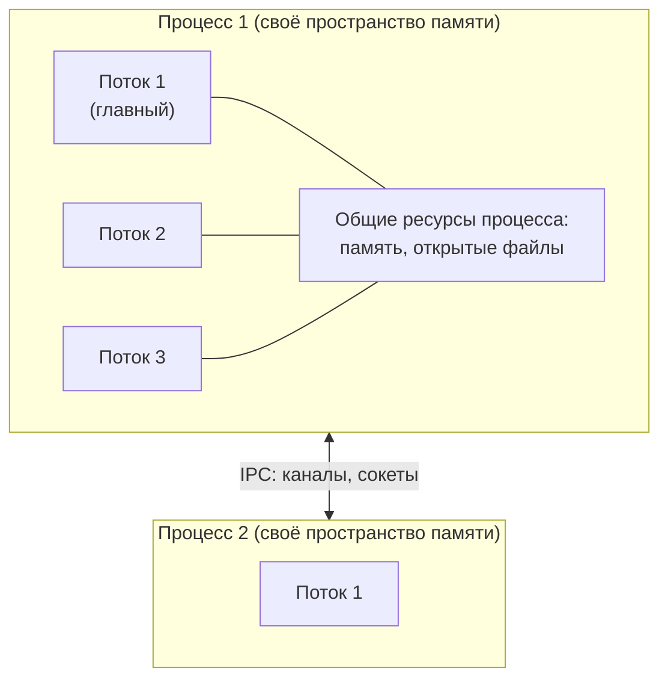
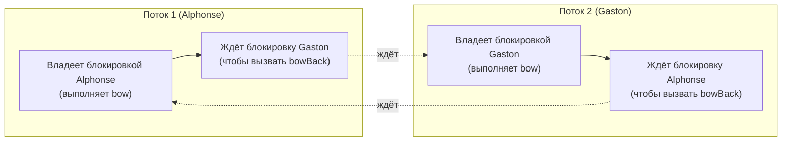
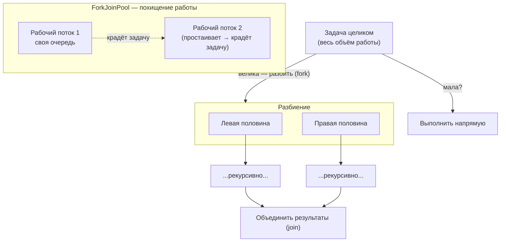

# Урок 3. Конкурентность

**Трейл:** Essential Java Classes · **Оригинал:** [Concurrency](https://docs.oracle.com/javase/tutorial/essential/concurrency/index.html)
**Связанные области:** [[04-concurrency]] · **Вопросы:** concurrency

> Перевод официального руководства Oracle (The Java Tutorials, JDK 8). Урок объединяет
> все страницы раздела *Concurrency* трейла *Essential Java Classes*: от процессов и потоков
> до высокоуровневых средств конкурентности из пакетов `java.util.concurrent`.

Пользователи компьютеров воспринимают как должное, что их системы способны делать несколько
вещей одновременно. Они полагают, что могут продолжать работать в текстовом редакторе, пока
другие приложения скачивают файлы, управляют очередью печати и проигрывают потоковое аудио.
Даже от одного приложения часто ожидается, что оно делает несколько вещей сразу. Например,
приложение для потокового аудио должно одновременно считывать цифровой звук из сети,
распаковывать его, управлять воспроизведением и обновлять своё отображение. Даже текстовый
редактор всегда должен быть готов реагировать на события клавиатуры и мыши, как бы он ни был
занят переформатированием текста или обновлением экрана. Программное обеспечение, способное
на такое, называют **конкурентным** (*concurrent*) ПО.

Платформа Java с самого начала спроектирована для поддержки конкурентного программирования:
базовые средства конкурентности есть в самом языке Java и в библиотеках классов. Начиная с
версии 5.0, платформа Java также включает высокоуровневые API конкурентности. Этот урок
знакомит с базовой поддержкой конкурентности и кратко описывает некоторые высокоуровневые
API из пакетов `java.util.concurrent`.

## Процессы и потоки (Processes and Threads)

В конкурентном программировании есть две базовые единицы выполнения: **процессы** (*processes*)
и **потоки** (*threads*). В языке Java конкурентное программирование в основном связано с
потоками. Однако процессы тоже важны.

В компьютерной системе обычно одновременно активны множество процессов и потоков. Это верно
даже для систем, у которых только одно ядро выполнения, а значит, в любой конкретный момент
реально выполняется лишь один поток. Процессорное время единственного ядра распределяется
между процессами и потоками с помощью возможности ОС, называемой **разделением времени**
(*time slicing*).

Всё более распространёнными становятся компьютерные системы с несколькими процессорами или
процессорами с несколькими ядрами выполнения. Это значительно увеличивает способность системы
к конкурентному выполнению процессов и потоков — но конкурентность возможна даже на простых
системах без нескольких процессоров или ядер.

### Процессы

Процесс имеет самодостаточную среду выполнения. Процесс, как правило, обладает полным,
приватным набором базовых ресурсов времени выполнения; в частности, у каждого процесса своё
собственное пространство памяти.

Процессы часто воспринимаются как синонимы программ или приложений. Однако то, что пользователь
видит как одно приложение, на деле может быть набором взаимодействующих процессов. Чтобы
облегчить связь между процессами, большинство операционных систем поддерживают средства
**межпроцессного взаимодействия** (*Inter Process Communication*, IPC) — такие как каналы
(pipes) и сокеты. IPC используется не только для связи между процессами на одной системе, но и
между процессами на разных системах.

Большинство реализаций виртуальной машины Java работают как один процесс. Java-приложение может
создавать дополнительные процессы с помощью объекта
[`ProcessBuilder`](https://docs.oracle.com/javase/8/docs/api/java/lang/ProcessBuilder.html).
Многопроцессные приложения выходят за рамки этого урока.

### Потоки

Потоки иногда называют **облегчёнными процессами** (*lightweight processes*). И процессы, и
потоки предоставляют среду выполнения, но создание нового потока требует меньше ресурсов, чем
создание нового процесса.

Потоки существуют внутри процесса — у каждого процесса есть хотя бы один поток. Потоки разделяют
ресурсы процесса, включая память и открытые файлы. Это делает взаимодействие эффективным, но
потенциально проблематичным.

Многопоточное выполнение — важнейшая особенность платформы Java. У каждого приложения есть хотя
бы один поток — или несколько, если учитывать «системные» потоки, выполняющие, например,
управление памятью и обработку сигналов. Но с точки зрения прикладного программиста вы начинаете
всего с одним потоком, называемым **главным потоком** (*main thread*). Этот поток способен
создавать дополнительные потоки, что мы продемонстрируем в следующем разделе.

<!-- original: none | Схема процессов и потоков — авторская, Oracle не публикует диаграмму для этой темы -->


## Объекты Thread (Thread Objects)

Каждый поток связан с экземпляром класса
[`Thread`](https://docs.oracle.com/javase/8/docs/api/java/lang/Thread.html). Существуют две
базовые стратегии использования объектов `Thread` для создания конкурентного приложения.

- Чтобы напрямую управлять созданием потоков и их жизненным циклом, достаточно создавать
  экземпляр `Thread` каждый раз, когда приложению нужно запустить асинхронную задачу.
- Чтобы абстрагировать управление потоками от остальной части приложения, нужно передавать
  задачи приложения **исполнителю** (*executor*).

Этот раздел документирует использование объектов `Thread`. Исполнители рассматриваются вместе с
другими [высокоуровневыми объектами конкурентности](#высокоуровневые-объекты-конкурентности-high-level-concurrency-objects).

### Определение и запуск потока (Defining and Starting a Thread)

Приложение, создающее экземпляр `Thread`, должно предоставить код, который будет выполняться в
этом потоке. Это можно сделать двумя способами.

- **Предоставить объект `Runnable`.** Интерфейс
  [`Runnable`](https://docs.oracle.com/javase/8/docs/api/java/lang/Runnable.html) определяет
  единственный метод `run`, предназначенный для размещения кода, выполняемого в потоке. Объект
  `Runnable` передаётся в конструктор `Thread`, как в примере `HelloRunnable`:

```java
public class HelloRunnable implements Runnable {

    public void run() {
        System.out.println("Hello from a thread!");
    }

    public static void main(String args[]) {
        (new Thread(new HelloRunnable())).start();
    }

}
```

- **Создать подкласс `Thread`.** Сам класс `Thread` реализует `Runnable`, хотя его метод `run`
  ничего не делает. Приложение может унаследоваться от `Thread`, предоставив свою реализацию
  `run`, как в примере `HelloThread`:

```java
public class HelloThread extends Thread {

    public void run() {
        System.out.println("Hello from a thread!");
    }

    public static void main(String args[]) {
        (new HelloThread()).start();
    }

}
```

Обратите внимание, что оба примера вызывают `Thread.start`, чтобы запустить новый поток.

Какую из этих идиом использовать? Первая идиома, в которой применяется объект `Runnable`, более
универсальна, потому что объект `Runnable` может наследоваться от класса, отличного от `Thread`.
Вторая идиома проще в использовании в простых приложениях, но ограничена тем, что класс задачи
должен быть потомком `Thread`. Этот урок сосредоточен на первом подходе, который отделяет задачу
`Runnable` от объекта `Thread`, выполняющего эту задачу. Такой подход не только более гибок, но и
применим к высокоуровневым API управления потоками, рассматриваемым далее.

Класс `Thread` определяет ряд методов, полезных для управления потоками. Среди них есть
`static`-методы, которые предоставляют информацию о потоке, вызвавшем метод, или влияют на его
состояние. Другие методы вызываются из других потоков, участвующих в управлении данным потоком и
объектом `Thread`. Некоторые из этих методов мы рассмотрим в следующих разделах.

### Приостановка выполнения с помощью Sleep (Pausing Execution with Sleep)

`Thread.sleep` заставляет текущий поток приостановить выполнение на указанный период. Это
эффективный способ освободить процессорное время для других потоков приложения или для других
приложений, которые могут работать в системе. Метод `sleep` можно также использовать для
задания темпа (*pacing*), как показано в примере ниже, и для ожидания другого потока, у которого
есть понятные временны́е требования, как в примере `SimpleThreads` в одном из следующих разделов.

Предоставлены две перегруженные версии `sleep`: одна задаёт время сна в миллисекундах, другая —
в наносекундах. Однако эти времена сна не гарантированно точны, потому что ограничены
возможностями нижележащей ОС. Кроме того, период сна может быть прерван прерываниями, как мы
увидим в одном из следующих разделов. В любом случае нельзя полагать, что вызов `sleep`
приостановит поток ровно на указанный период.

Пример `SleepMessages` использует `sleep`, чтобы печатать сообщения с интервалом в четыре секунды:

```java
public class SleepMessages {
    public static void main(String args[])
        throws InterruptedException {
        String importantInfo[] = {
            "Mares eat oats",
            "Does eat oats",
            "Little lambs eat ivy",
            "A kid will eat ivy too"
        };

        for (int i = 0;
             i < importantInfo.length;
             i++) {
            // Пауза 4 секунды
            Thread.sleep(4000);
            // Печать сообщения
            System.out.println(importantInfo[i]);
        }
    }
}
```

Обратите внимание, что `main` объявляет `throws InterruptedException`. Это исключение, которое
`sleep` бросает, когда другой поток прерывает текущий поток во время активного `sleep`. Поскольку
это приложение не определило другой поток, способный вызвать прерывание, оно не утруждает себя
перехватом `InterruptedException`.

### Прерывания (Interrupts)

**Прерывание** (*interrupt*) — это указание потоку, что он должен прекратить то, что делает, и
заняться чем-то другим. Программист сам решает, как именно поток отреагирует на прерывание, но
очень часто поток завершается. Именно это использование подчёркивается в данном уроке.

Поток посылает прерывание, вызывая
[`interrupt`](https://docs.oracle.com/javase/8/docs/api/java/lang/Thread.html#interrupt--) для
объекта `Thread` того потока, который нужно прервать. Чтобы механизм прерываний работал корректно,
прерываемый поток должен поддерживать своё собственное прерывание.

#### Поддержка прерывания

Как поток поддерживает своё прерывание? Это зависит от того, чем он сейчас занят. Если поток
часто вызывает методы, которые бросают `InterruptedException`, он просто возвращается из метода
`run` после того, как перехватит это исключение. Например, предположим, что центральный цикл
сообщений из примера `SleepMessages` находится в методе `run` объекта `Runnable` потока. Тогда
его можно изменить так, чтобы поддержать прерывания:

```java
for (int i = 0; i < importantInfo.length; i++) {
    // Пауза 4 секунды
    try {
        Thread.sleep(4000);
    } catch (InterruptedException e) {
        // Нас прервали: больше сообщений нет.
        return;
    }
    // Печать сообщения
    System.out.println(importantInfo[i]);
}
```

Многие методы, которые бросают `InterruptedException` (такие как `sleep`), спроектированы так,
чтобы при получении прерывания отменить текущую операцию и немедленно вернуться.

А что, если поток долгое время не вызывает метод, бросающий `InterruptedException`? Тогда он
должен периодически вызывать `Thread.interrupted`, который возвращает `true`, если прерывание было
получено. Например:

```java
for (int i = 0; i < inputs.length; i++) {
    heavyCrunch(inputs[i]);
    if (Thread.interrupted()) {
        // Нас прервали: больше не вычисляем.
        return;
    }
}
```

В этом простом примере код просто проверяет прерывание и выходит из потока, если оно получено.
В более сложных приложениях может быть разумнее бросить `InterruptedException`:

```java
if (Thread.interrupted()) {
    throw new InterruptedException();
}
```

Это позволяет централизовать код обработки прерывания в одном блоке `catch`.

#### Флаг статуса прерывания

Механизм прерываний реализован с помощью внутреннего флага, известного как **статус прерывания**
(*interrupt status*). Вызов `Thread.interrupt` устанавливает этот флаг. Когда поток проверяет
прерывание, вызывая статический метод `Thread.interrupted`, статус прерывания сбрасывается.
Нестатический метод `isInterrupted`, который один поток использует, чтобы узнать статус прерывания
другого, не меняет флаг статуса прерывания.

По соглашению любой метод, который завершается, бросая `InterruptedException`, при этом сбрасывает
статус прерывания. Однако всегда возможно, что статус прерывания тут же снова будет установлен
другим потоком, вызвавшим `interrupt`.

### Ожидание завершения потока — Joins (Joins)

Метод `join` позволяет одному потоку дождаться завершения другого. Если `t` — объект `Thread`,
поток которого сейчас выполняется, то

```java
t.join();
```

заставляет текущий поток приостановить выполнение, пока поток `t` не завершится. Перегрузки `join`
позволяют программисту задать период ожидания. Однако, как и в случае со `sleep`, `join` зависит
от ОС в плане отсчёта времени, поэтому не стоит полагать, что `join` будет ждать ровно столько,
сколько вы указали.

Как и `sleep`, `join` реагирует на прерывание, выходя с `InterruptedException`.

### Пример SimpleThreads (The SimpleThreads Example)

Следующий пример сводит вместе некоторые концепции этого раздела. `SimpleThreads` состоит из двух
потоков. Первый — главный поток, который есть у каждого Java-приложения. Главный поток создаёт
новый поток из объекта `Runnable` (`MessageLoop`) и ждёт его завершения. Если потоку `MessageLoop`
требуется слишком много времени на завершение, главный поток прерывает его.

Поток `MessageLoop` печатает серию сообщений. Если он будет прерван до того, как напечатает все
свои сообщения, поток `MessageLoop` печатает сообщение и завершается.

```java
public class SimpleThreads {

    // Показать сообщение, предварённое
    // именем текущего потока
    static void threadMessage(String message) {
        String threadName =
            Thread.currentThread().getName();
        System.out.format("%s: %s%n",
                          threadName,
                          message);
    }

    private static class MessageLoop
        implements Runnable {
        public void run() {
            String importantInfo[] = {
                "Mares eat oats",
                "Does eat oats",
                "Little lambs eat ivy",
                "A kid will eat ivy too"
            };
            try {
                for (int i = 0;
                     i < importantInfo.length;
                     i++) {
                    // Пауза 4 секунды
                    Thread.sleep(4000);
                    // Печать сообщения
                    threadMessage(importantInfo[i]);
                }
            } catch (InterruptedException e) {
                threadMessage("I wasn't done!");
            }
        }
    }

    public static void main(String args[])
        throws InterruptedException {

        // Задержка в миллисекундах перед тем,
        // как мы прервём поток MessageLoop
        // (по умолчанию один час).
        long patience = 1000 * 60 * 60;

        // Если присутствует аргумент командной
        // строки, он задаёт patience в секундах.
        if (args.length > 0) {
            try {
                patience = Long.parseLong(args[0]) * 1000;
            } catch (NumberFormatException e) {
                System.err.println("Argument must be an integer.");
                System.exit(1);
            }
        }

        threadMessage("Starting MessageLoop thread");
        long startTime = System.currentTimeMillis();
        Thread t = new Thread(new MessageLoop());
        t.start();

        threadMessage("Waiting for MessageLoop thread to finish");
        // цикл, пока поток MessageLoop
        // не завершится
        while (t.isAlive()) {
            threadMessage("Still waiting...");
            // Ждём максимум 1 секунду завершения
            // потока MessageLoop.
            t.join(1000);
            if (((System.currentTimeMillis() - startTime) > patience)
                  && t.isAlive()) {
                threadMessage("Tired of waiting!");
                t.interrupt();
                // Теперь уже недолго осталось
                // -- ждём бесконечно
                t.join();
            }
        }
        threadMessage("Finally!");
    }
}
```

## Синхронизация (Synchronization)

Потоки взаимодействуют главным образом через совместный доступ к полям и объектам, на которые
ссылаются поля-ссылки. Эта форма взаимодействия чрезвычайно эффективна, но делает возможными два
вида ошибок: **взаимное влияние потоков** (*thread interference*) и **ошибки согласованности
памяти** (*memory consistency errors*). Инструмент, нужный для предотвращения этих ошибок, —
**синхронизация** (*synchronization*).

Однако синхронизация может породить **конкуренцию потоков** (*thread contention*), которая
возникает, когда два или более потоков пытаются одновременно получить доступ к одному ресурсу
**и** заставляют среду выполнения Java выполнять один или несколько потоков медленнее или даже
приостанавливать их выполнение. [Голодание и активная блокировка](#голодание-и-активная-блокировка-starvation-and-livelock)
(*starvation and livelock*) — формы конкуренции потоков. Подробнее см. раздел
[Живучесть](#живучесть-liveness) (*Liveness*).

Этот раздел охватывает следующие темы:

- **Взаимное влияние потоков** (Thread Interference) описывает, как возникают ошибки, когда
  несколько потоков обращаются к общим данным.
- **Ошибки согласованности памяти** (Memory Consistency Errors) описывают ошибки, возникающие из
  несогласованных представлений об общей памяти.
- **Синхронизированные методы** (Synchronized Methods) описывают простую идиому, которая может
  эффективно предотвратить взаимное влияние потоков и ошибки согласованности памяти.
- **Внутренние блокировки и синхронизация** (Intrinsic Locks and Synchronization) описывают более
  общую идиому синхронизации и объясняют, как синхронизация основана на внутренних блокировках.
- **Атомарный доступ** (Atomic Access) рассказывает об общей идее операций, на которые не могут
  повлиять другие потоки.

### Взаимное влияние потоков (Thread Interference)

Рассмотрим простой класс `Counter`:

```java
class Counter {
    private int c = 0;

    public void increment() {
        c++;
    }

    public void decrement() {
        c--;
    }

    public int value() {
        return c;
    }

}
```

`Counter` спроектирован так, чтобы каждый вызов `increment` добавлял 1 к `c`, а каждый вызов
`decrement` вычитал 1 из `c`. Однако если на объект `Counter` ссылаются из нескольких потоков,
взаимное влияние между потоками может помешать этому происходить, как ожидается.

Взаимное влияние происходит, когда две операции, выполняющиеся в разных потоках, но действующие на
одни и те же данные, **переплетаются** (*interleave*). Это означает, что обе операции состоят из
нескольких шагов, и последовательности шагов перекрываются.

Может показаться, что операции над экземплярами `Counter` не могут переплетаться, ведь обе
операции над `c` — это одиночные простые инструкции. Однако даже простые инструкции могут
транслироваться в несколько шагов виртуальной машины. Мы не будем разбирать конкретные шаги
виртуальной машины — достаточно знать, что единственное выражение `c++` можно разложить на три
шага:

1. Получить текущее значение `c`.
2. Увеличить полученное значение на 1.
3. Сохранить увеличенное значение обратно в `c`.

Выражение `c--` можно разложить так же, за исключением того, что на втором шаге значение
уменьшается, а не увеличивается.

Предположим, поток A вызывает `increment` примерно в то же время, когда поток B вызывает
`decrement`. Если начальное значение `c` равно `0`, их переплетённые действия могут пойти по такой
последовательности:

1. Поток A: получает c.
2. Поток B: получает c.
3. Поток A: увеличивает полученное значение; результат 1.
4. Поток B: уменьшает полученное значение; результат -1.
5. Поток A: сохраняет результат в c; теперь c равно 1.
6. Поток B: сохраняет результат в c; теперь c равно -1.

Результат потока A потерян, перезаписан потоком B. Это конкретное переплетение — лишь одна из
возможностей. При других обстоятельствах потеряться мог бы результат потока B, или ошибки могло бы
не быть вовсе. Из-за их непредсказуемости ошибки взаимного влияния потоков бывает трудно
обнаружить и исправить.

### Ошибки согласованности памяти (Memory Consistency Errors)

**Ошибки согласованности памяти** (*memory consistency errors*) возникают, когда разные потоки
имеют несогласованные представления о том, что должно быть одними и теми же данными. Причины
ошибок согласованности памяти сложны и выходят за рамки этого руководства. К счастью, программисту
не нужно детально понимать эти причины. Всё, что нужно, — это стратегия их избегания.

Ключ к избеганию ошибок согласованности памяти — понимание отношения **происходит-до**
(*happens-before*). Это отношение — просто гарантия того, что записи в память, сделанные одной
конкретной инструкцией, видимы другой конкретной инструкции. Чтобы это увидеть, рассмотрим
следующий пример. Пусть определено и инициализировано простое поле типа `int`:

```java
int counter = 0;
```

Поле `counter` разделяется между двумя потоками, A и B. Пусть поток A увеличивает `counter`:

```java
counter++;
```

Затем, вскоре после этого, поток B печатает `counter`:

```java
System.out.println(counter);
```

Если бы обе инструкции выполнялись в одном потоке, было бы безопасно полагать, что напечатанное
значение будет «1». Но если эти две инструкции выполняются в разных потоках, напечатанное значение
вполне может быть «0», потому что нет гарантии, что изменение `counter` потоком A будет видно
потоку B — если только программист не установил отношение happens-before между этими двумя
инструкциями.

Есть несколько действий, создающих отношения happens-before. Одно из них — синхронизация, как мы
увидим в следующих разделах.

Мы уже видели два действия, создающих отношения happens-before:

- Когда инструкция вызывает `Thread.start`, каждая инструкция, имеющая отношение happens-before с
  этой инструкцией, также имеет отношение happens-before с каждой инструкцией, выполняемой новым
  потоком. Эффекты кода, приведшего к созданию нового потока, видны новому потоку.
- Когда поток завершается и вызывает возврат из `Thread.join` в другом потоке, тогда все
  инструкции, выполненные завершившимся потоком, имеют отношение happens-before со всеми
  инструкциями, следующими за успешным `join`. Эффекты кода в этом потоке теперь видны потоку,
  выполнившему `join`.

Список действий, создающих отношения happens-before, см. на
[странице-сводке пакета `java.util.concurrent`](https://docs.oracle.com/javase/8/docs/api/java/util/concurrent/package-summary.html#MemoryVisibility).

### Синхронизированные методы (Synchronized Methods)

Язык Java предоставляет две базовые идиомы синхронизации: **синхронизированные методы**
(*synchronized methods*) и **синхронизированные инструкции** (*synchronized statements*). Более
сложная из двух — синхронизированные инструкции — описана в следующем разделе. Этот раздел о
синхронизированных методах.

Чтобы сделать метод синхронизированным, достаточно добавить ключевое слово `synchronized` в его
объявление:

```java
public class SynchronizedCounter {
    private int c = 0;

    public synchronized void increment() {
        c++;
    }

    public synchronized void decrement() {
        c--;
    }

    public synchronized int value() {
        return c;
    }
}
```

Если `count` — экземпляр `SynchronizedCounter`, то превращение этих методов в синхронизированные
даёт два эффекта:

- Во-первых, два вызова синхронизированных методов одного и того же объекта не могут
  переплетаться. Когда один поток выполняет синхронизированный метод объекта, все другие потоки,
  вызывающие синхронизированные методы того же объекта, блокируются (приостанавливают выполнение),
  пока первый поток не завершит работу с объектом.
- Во-вторых, когда синхронизированный метод завершается, он автоматически устанавливает отношение
  happens-before с **любым последующим вызовом** синхронизированного метода того же объекта. Это
  гарантирует, что изменения состояния объекта видны всем потокам.

Заметьте, что конструкторы не могут быть синхронизированными — использование ключевого слова
`synchronized` с конструктором является синтаксической ошибкой. Синхронизировать конструкторы не
имеет смысла, потому что только поток, создающий объект, должен иметь к нему доступ во время его
конструирования.

**Предупреждение.** При конструировании объекта, который будет разделяться между потоками, будьте
очень осторожны, чтобы ссылка на объект не «утекла» преждевременно. Например, пусть вы хотите вести
список `instances`, содержащий каждый экземпляр класса. У вас может возникнуть соблазн добавить
в конструктор такую строку:

```java
instances.add(this);
```

Но тогда другие потоки смогут использовать `instances`, чтобы обратиться к объекту до того, как
конструирование объекта завершится.

Синхронизированные методы позволяют применять простую стратегию предотвращения взаимного влияния
потоков и ошибок согласованности памяти: если объект видим более чем одному потоку, все чтения и
записи переменных этого объекта выполняются через `synchronized`-методы. (Важное исключение: поля
`final`, которые нельзя изменить после конструирования объекта, можно безопасно читать через
несинхронизированные методы, как только объект сконструирован.) Эта стратегия эффективна, но может
вызвать проблемы с [живучестью](#живучесть-liveness), как мы увидим далее в этом уроке.

### Внутренние блокировки и синхронизация (Intrinsic Locks and Synchronization)

Синхронизация построена вокруг внутренней сущности, известной как **внутренняя блокировка**
(*intrinsic lock*), или **блокировка-монитор** (*monitor lock*). (В спецификации API эта сущность
часто называется просто «монитором».) Внутренние блокировки играют роль в обоих аспектах
синхронизации: они обеспечивают исключительный доступ к состоянию объекта и устанавливают
отношения happens-before, необходимые для видимости.

С каждым объектом связана внутренняя блокировка. По соглашению поток, которому нужен исключительный
и согласованный доступ к полям объекта, должен **захватить** (*acquire*) внутреннюю блокировку
объекта перед обращением к ним, а затем **освободить** (*release*) внутреннюю блокировку, когда
закончит с ними. Говорят, что поток **владеет** (*owns*) внутренней блокировкой в промежутке между
захватом и освобождением блокировки. Пока поток владеет внутренней блокировкой, никакой другой
поток не может захватить ту же блокировку. Другой поток заблокируется при попытке захватить
блокировку.

Когда поток освобождает внутреннюю блокировку, устанавливается отношение happens-before между этим
действием и любым последующим захватом той же блокировки.

#### Блокировки в синхронизированных методах

Когда поток вызывает синхронизированный метод, он автоматически захватывает внутреннюю блокировку
объекта этого метода и освобождает её при возврате из метода. Освобождение блокировки происходит,
даже если возврат был вызван непойманным исключением.

Вы можете задаться вопросом, что происходит при вызове статического синхронизированного метода,
ведь статический метод связан с классом, а не с объектом. В этом случае поток захватывает
внутреннюю блокировку объекта `Class`, связанного с классом. Таким образом, доступ к статическим
полям класса управляется блокировкой, отличной от блокировки любого экземпляра класса.

#### Синхронизированные инструкции

Другой способ создать синхронизированный код — **синхронизированные инструкции** (*synchronized
statements*). В отличие от синхронизированных методов, синхронизированные инструкции должны
указать объект, предоставляющий внутреннюю блокировку:

```java
public void addName(String name) {
    synchronized(this) {
        lastName = name;
        nameCount++;
    }
    nameList.add(name);
}
```

В этом примере метод `addName` должен синхронизировать изменения `lastName` и `nameCount`, но при
этом избегать синхронизации вызовов методов других объектов. (Вызов методов других объектов из
синхронизированного кода может создать проблемы, описанные в разделе
[Живучесть](#живучесть-liveness).) Без синхронизированных инструкций пришлось бы создать отдельный,
несинхронизированный метод единственно ради вызова `nameList.add`.

Синхронизированные инструкции также полезны для повышения конкурентности с помощью мелкозернистой
синхронизации. Пусть, например, класс `MsLunch` имеет два поля экземпляра, `c1` и `c2`, которые
никогда не используются вместе. Все обновления этих полей должны быть синхронизированы, но нет
причин запрещать переплетение обновления `c1` с обновлением `c2` — а такой запрет снизил бы
конкурентность, создавая ненужную блокировку. Вместо использования синхронизированных методов или
иного использования блокировки, связанной с `this`, мы создаём два объекта исключительно для
предоставления блокировок.

```java
public class MsLunch {
    private long c1 = 0;
    private long c2 = 0;
    private Object lock1 = new Object();
    private Object lock2 = new Object();

    public void inc1() {
        synchronized(lock1) {
            c1++;
        }
    }

    public void inc2() {
        synchronized(lock2) {
            c2++;
        }
    }
}
```

Используйте эту идиому с крайней осторожностью. Вы должны быть абсолютно уверены, что переплетение
доступа к затрагиваемым полям действительно безопасно.

#### Реентерабельная синхронизация

Вспомним, что поток не может захватить блокировку, которой владеет другой поток. Но поток **может**
захватить блокировку, которой он уже владеет. Разрешение потоку захватывать одну и ту же блокировку
более одного раза включает **реентерабельную синхронизацию** (*reentrant synchronization*). Она
описывает ситуацию, когда синхронизированный код прямо или косвенно вызывает метод, который также
содержит синхронизированный код, и оба фрагмента кода используют одну и ту же блокировку. Без
реентерабельной синхронизации синхронизированному коду пришлось бы принимать множество
дополнительных мер предосторожности, чтобы поток не заблокировал сам себя.

### Атомарный доступ (Atomic Access)

В программировании **атомарное** (*atomic*) действие — это действие, которое фактически происходит
всё сразу. Атомарное действие нельзя остановить посередине: оно либо происходит целиком, либо не
происходит вовсе. Никакие побочные эффекты атомарного действия не видны, пока действие не завершено.

Мы уже видели, что выражение инкремента, такое как `c++`, не описывает атомарного действия. Даже
очень простые выражения могут определять сложные действия, которые разлагаются на другие действия.
Однако есть действия, которые вы можете задать и которые являются атомарными:

- Чтения и записи атомарны для ссылочных переменных и для большинства примитивных переменных (всех
  типов, кроме `long` и `double`).
- Чтения и записи атомарны для **всех** переменных, объявленных как `volatile` (**включая**
  переменные `long` и `double`).

Атомарные действия не могут переплетаться, поэтому их можно использовать без страха взаимного
влияния потоков. Однако это не устраняет полностью необходимость синхронизировать атомарные
действия, потому что ошибки согласованности памяти всё ещё возможны. Использование `volatile`
-переменных снижает риск ошибок согласованности памяти, потому что любая запись в `volatile`
-переменную устанавливает отношение happens-before с последующими чтениями той же переменной. Это
значит, что изменения `volatile`-переменной всегда видны другим потокам. Более того, это также
значит, что когда поток читает `volatile`-переменную, он видит не только последнее изменение
`volatile`, но и побочные эффекты кода, приведшего к этому изменению.

Использование простого атомарного доступа к переменным эффективнее, чем доступ к этим переменным
через синхронизированный код, но требует от программиста большей осторожности, чтобы избежать
ошибок согласованности памяти. Стоит ли дополнительное усилие того, зависит от размера и сложности
приложения.

Некоторые классы пакета
[`java.util.concurrent`](https://docs.oracle.com/javase/8/docs/api/java/util/concurrent/package-summary.html)
предоставляют атомарные методы, не полагающиеся на синхронизацию. Мы обсудим их в разделе
[Высокоуровневые объекты конкурентности](#высокоуровневые-объекты-конкурентности-high-level-concurrency-objects).

## Живучесть (Liveness)

Способность конкурентного приложения выполняться своевременно известна как его **живучесть**
(*liveness*). Этот раздел описывает самый распространённый вид проблем живучести —
[взаимоблокировку](#взаимоблокировка-deadlock) (*deadlock*), а затем кратко описывает две другие
проблемы живучести: [голодание и активную блокировку](#голодание-и-активная-блокировка-starvation-and-livelock)
(*starvation and livelock*).

### Взаимоблокировка (Deadlock)

**Взаимоблокировка** (*deadlock*) описывает ситуацию, когда два или более потоков заблокированы
навсегда, ожидая друг друга. Вот пример.

Альфонс и Гастон — друзья и большие приверженцы вежливости. Строгое правило вежливости гласит:
когда вы кланяетесь другу, вы должны оставаться в поклоне, пока ваш друг не получит возможность
ответить на поклон. К сожалению, это правило не учитывает возможность того, что два друга могут
поклониться друг другу одновременно. Это приложение-пример, `Deadlock`, моделирует такую
возможность:

```java
public class Deadlock {
    static class Friend {
        private final String name;
        public Friend(String name) {
            this.name = name;
        }
        public String getName() {
            return this.name;
        }
        public synchronized void bow(Friend bower) {
            System.out.format("%s: %s"
                + "  has bowed to me!%n", 
                this.name, bower.getName());
            bower.bowBack(this);
        }
        public synchronized void bowBack(Friend bower) {
            System.out.format("%s: %s"
                + " has bowed back to me!%n",
                this.name, bower.getName());
        }
    }

    public static void main(String[] args) {
        final Friend alphonse =
            new Friend("Alphonse");
        final Friend gaston =
            new Friend("Gaston");
        new Thread(new Runnable() {
            public void run() { alphonse.bow(gaston); }
        }).start();
        new Thread(new Runnable() {
            public void run() { gaston.bow(alphonse); }
        }).start();
    }
}
```

Когда `Deadlock` запускается, крайне вероятно, что оба потока заблокируются при попытке вызвать
`bowBack`. Ни одна из блокировок никогда не закончится, потому что каждый поток ждёт, пока другой
выйдет из `bow`.

<!-- original: none | Схема взаимоблокировки — авторская, Oracle не публикует диаграмму для Deadlock -->


### Голодание и активная блокировка (Starvation and Livelock)

Голодание и активная блокировка — гораздо менее распространённая проблема, чем взаимоблокировка,
но всё же это проблемы, с которыми, вероятно, столкнётся каждый проектировщик конкурентного ПО.

#### Голодание

**Голодание** (*starvation*) описывает ситуацию, когда поток не может получать регулярный доступ к
общим ресурсам и не способен продвигаться вперёд. Это происходит, когда общие ресурсы надолго
делаются недоступными «жадными» потоками. Например, пусть объект предоставляет синхронизированный
метод, который часто долго не возвращается. Если один поток часто вызывает этот метод, другие
потоки, которым тоже нужен частый синхронизированный доступ к тому же объекту, часто будут
заблокированы.

#### Активная блокировка

Поток часто действует в ответ на действие другого потока. Если действие другого потока, в свою
очередь, тоже является ответом на действие ещё одного потока, то может возникнуть **активная
блокировка** (*livelock*). Как и при взаимоблокировке, потоки в активной блокировке не способны
продвигаться вперёд. Однако эти потоки не заблокированы — они просто слишком заняты, отвечая друг
другу, чтобы возобновить работу. Это сравнимо с двумя людьми, пытающимися разойтись в коридоре:
Альфонс уходит влево, чтобы пропустить Гастона, а Гастон уходит вправо, чтобы пропустить Альфонса.
Видя, что они всё ещё мешают друг другу, Альфонс уходит вправо, а Гастон — влево. Они по-прежнему
мешают друг другу, и так далее.

## Защищённые блоки (Guarded Blocks)

Потокам часто приходится координировать свои действия. Самая распространённая идиома координации —
**защищённый блок** (*guarded block*). Такой блок начинается с опроса условия, которое должно быть
истинным, прежде чем блок сможет продолжить. Чтобы сделать это правильно, нужно выполнить ряд
шагов.

Пусть, например, `guardedJoy` — это метод, который не должен продолжаться, пока общая переменная
`joy` не будет установлена другим потоком. Такой метод мог бы, теоретически, просто крутиться в
цикле, пока условие не выполнится, но этот цикл расточителен, поскольку выполняется непрерывно во
время ожидания.

```java
public void guardedJoy() {
    // Простой защитный цикл. Впустую тратит
    // процессорное время. Не делайте так!
    while(!joy) {}
    System.out.println("Joy has been achieved!");
}
```

Более эффективная защита вызывает
[`Object.wait`](https://docs.oracle.com/javase/8/docs/api/java/lang/Object.html#wait--), чтобы
приостановить текущий поток. Вызов `wait` не возвращается, пока другой поток не выдаст уведомление
о том, что какое-то особое событие, возможно, произошло — хотя и не обязательно то событие, которого
этот поток ждёт:

```java
public synchronized void guardedJoy() {
    // Эта защита проходит цикл лишь раз на каждое особое событие, которое
    // может оказаться не тем событием, которого мы ждём.
    while(!joy) {
        try {
            wait();
        } catch (InterruptedException e) {}
    }
    System.out.println("Joy and efficiency have been achieved!");
}
```

> **Примечание.** Всегда вызывайте `wait` внутри цикла, проверяющего ожидаемое условие. Не
> полагайте, что прерывание было ради того конкретного условия, которого вы ждали, или что условие
> всё ещё истинно.

Как и многие методы, приостанавливающие выполнение, `wait` может бросить `InterruptedException`. В
этом примере мы можем просто проигнорировать это исключение — нас интересует лишь значение `joy`.

Почему эта версия `guardedJoy` синхронизирована? Пусть `d` — объект, который мы используем для
вызова `wait`. Когда поток вызывает `d.wait`, он должен владеть внутренней блокировкой `d` — иначе
будет брошена ошибка. Вызов `wait` внутри синхронизированного метода — простой способ захватить
внутреннюю блокировку.

Когда вызывается `wait`, поток освобождает блокировку и приостанавливает выполнение. В какой-то
будущий момент другой поток захватит ту же блокировку и вызовет
[`Object.notifyAll`](https://docs.oracle.com/javase/8/docs/api/java/lang/Object.html#notifyAll--),
сообщая всем потокам, ожидающим на этой блокировке, что произошло нечто важное:

```java
public synchronized notifyJoy() {
    joy = true;
    notifyAll();
}
```

Спустя некоторое время после того, как второй поток освободит блокировку, первый поток повторно
захватит её и продолжит, вернувшись из вызова `wait`.

> **Примечание.** Существует второй метод уведомления, `notify`, который пробуждает один поток.
> Поскольку `notify` не позволяет указать, какой именно поток пробуждается, он полезен лишь в
> массово-параллельных приложениях — то есть в программах с большим числом потоков, выполняющих
> похожую работу. В таком приложении вам всё равно, какой поток пробудится.

Давайте используем защищённые блоки, чтобы создать приложение **производитель — потребитель**
(*Producer-Consumer*). Такое приложение разделяет данные между двумя потоками: **производителем**
(*producer*), который создаёт данные, и **потребителем** (*consumer*), который что-то с ними делает.
Два потока взаимодействуют через общий объект. Координация существенна: поток-потребитель не должен
пытаться извлечь данные до того, как поток-производитель их доставил, а поток-производитель не
должен пытаться доставить новые данные, если потребитель не извлёк старые.

В этом примере данные — это серия текстовых сообщений, которые разделяются через объект типа `Drop`:

```java
public class Drop {
    // Сообщение, отправляемое от производителя
    // к потребителю.
    private String message;
    // True, если потребитель должен ждать,
    // пока производитель отправит сообщение;
    // false, если производитель должен ждать,
    // пока потребитель извлечёт сообщение.
    private boolean empty = true;

    public synchronized String take() {
        // Ждём, пока сообщение не станет
        // доступным.
        while (empty) {
            try {
                wait();
            } catch (InterruptedException e) {}
        }
        // Переключаем статус.
        empty = true;
        // Уведомляем производителя, что
        // статус изменился.
        notifyAll();
        return message;
    }

    public synchronized void put(String message) {
        // Ждём, пока сообщение не будет
        // извлечено.
        while (!empty) {
            try { 
                wait();
            } catch (InterruptedException e) {}
        }
        // Переключаем статус.
        empty = false;
        // Сохраняем сообщение.
        this.message = message;
        // Уведомляем потребителя, что статус
        // изменился.
        notifyAll();
    }
}
```

Поток-производитель, определённый в `Producer`, отправляет серию знакомых сообщений. Строка "DONE"
указывает, что все сообщения отправлены. Чтобы смоделировать непредсказуемую природу реальных
приложений, поток-производитель делает паузы случайной длины между сообщениями.

```java
import java.util.Random;

public class Producer implements Runnable {
    private Drop drop;

    public Producer(Drop drop) {
        this.drop = drop;
    }

    public void run() {
        String importantInfo[] = {
            "Mares eat oats",
            "Does eat oats",
            "Little lambs eat ivy",
            "A kid will eat ivy too"
        };
        Random random = new Random();

        for (int i = 0;
             i < importantInfo.length;
             i++) {
            drop.put(importantInfo[i]);
            try {
                Thread.sleep(random.nextInt(5000));
            } catch (InterruptedException e) {}
        }
        drop.put("DONE");
    }
}
```

Поток-потребитель, определённый в `Consumer`, просто извлекает сообщения и печатает их, пока не
извлечёт строку "DONE". Этот поток тоже делает паузы случайной длины.

```java
import java.util.Random;

public class Consumer implements Runnable {
    private Drop drop;

    public Consumer(Drop drop) {
        this.drop = drop;
    }

    public void run() {
        Random random = new Random();
        for (String message = drop.take();
             ! message.equals("DONE");
             message = drop.take()) {
            System.out.format("MESSAGE RECEIVED: %s%n", message);
            try {
                Thread.sleep(random.nextInt(5000));
            } catch (InterruptedException e) {}
        }
    }
}
```

Наконец, вот главный поток, определённый в `ProducerConsumerExample`, который запускает потоки
производителя и потребителя.

```java
public class ProducerConsumerExample {
    public static void main(String[] args) {
        Drop drop = new Drop();
        (new Thread(new Producer(drop))).start();
        (new Thread(new Consumer(drop))).start();
    }
}
```

> **Примечание.** Класс `Drop` написан, чтобы продемонстрировать защищённые блоки. Чтобы не
> изобретать велосипед, изучите существующие структуры данных в Java Collections Framework, прежде
> чем пытаться писать собственные объекты для разделения данных.

## Неизменяемые объекты (Immutable Objects)

Объект считается **неизменяемым** (*immutable*), если его состояние не может измениться после
конструирования. Максимальное использование неизменяемых объектов широко признано как разумная
стратегия создания простого, надёжного кода.

Неизменяемые объекты особенно полезны в конкурентных приложениях. Поскольку они не могут менять
состояние, они не могут быть повреждены взаимным влиянием потоков или наблюдаемы в несогласованном
состоянии.

Программисты часто неохотно применяют неизменяемые объекты, потому что беспокоятся о стоимости
создания нового объекта вместо обновления объекта на месте. Влияние создания объекта часто
переоценивается и может компенсироваться некоторыми преимуществами, связанными с неизменяемыми
объектами. К ним относятся снижение накладных расходов на сборку мусора и устранение кода,
необходимого для защиты изменяемых объектов от повреждения.

Следующие подразделы берут класс с изменяемыми экземплярами и выводят из него класс с
неизменяемыми экземплярами. При этом они дают общие правила такого преобразования и демонстрируют
некоторые преимущества неизменяемых объектов.

### Пример синхронизированного класса (A Synchronized Class Example)

Класс `SynchronizedRGB` определяет объекты, представляющие цвета. Каждый объект представляет цвет
тремя целыми числами, обозначающими значения основных цветов, и строкой, дающей имя цвета.

```java
public class SynchronizedRGB {

    // Значения должны быть между 0 и 255.
    private int red;
    private int green;
    private int blue;
    private String name;

    private void check(int red,
                       int green,
                       int blue) {
        if (red < 0 || red > 255
            || green < 0 || green > 255
            || blue < 0 || blue > 255) {
            throw new IllegalArgumentException();
        }
    }

    public SynchronizedRGB(int red,
                           int green,
                           int blue,
                           String name) {
        check(red, green, blue);
        this.red = red;
        this.green = green;
        this.blue = blue;
        this.name = name;
    }

    public void set(int red,
                    int green,
                    int blue,
                    String name) {
        check(red, green, blue);
        synchronized (this) {
            this.red = red;
            this.green = green;
            this.blue = blue;
            this.name = name;
        }
    }

    public synchronized int getRGB() {
        return ((red << 16) | (green << 8) | blue);
    }

    public synchronized String getName() {
        return name;
    }

    public synchronized void invert() {
        red = 255 - red;
        green = 255 - green;
        blue = 255 - blue;
        name = "Inverse of " + name;
    }
}
```

`SynchronizedRGB` нужно использовать осторожно, чтобы его не увидели в несогласованном состоянии.
Пусть, например, поток выполняет следующий код:

```java
SynchronizedRGB color =
    new SynchronizedRGB(0, 0, 0, "Pitch Black");
...
int myColorInt = color.getRGB();      // Инструкция 1
String myColorName = color.getName(); // Инструкция 2
```

Если другой поток вызовет `color.set` после Инструкции 1, но до Инструкции 2, значение
`myColorInt` не будет соответствовать значению `myColorName`. Чтобы избежать такого исхода, обе
инструкции нужно связать вместе:

```java
synchronized (color) {
    int myColorInt = color.getRGB();
    String myColorName = color.getName();
}
```

Такого рода несогласованность возможна только для изменяемых объектов — для неизменяемой версии
`SynchronizedRGB` это не будет проблемой.

### Стратегия определения неизменяемых объектов (A Strategy for Defining Immutable Objects)

Следующие правила определяют простую стратегию создания неизменяемых объектов. Не все классы,
документированные как «неизменяемые», следуют этим правилам. Это не обязательно означает, что
создатели этих классов были небрежны — у них могут быть веские основания полагать, что экземпляры
их классов никогда не меняются после конструирования. Однако такие стратегии требуют изощрённого
анализа и не предназначены для новичков.

1. Не предоставляйте методов-«сеттеров» — методов, которые изменяют поля или объекты, на которые
   ссылаются поля.
2. Сделайте все поля `final` и `private`.
3. Не позволяйте подклассам переопределять методы. Простейший способ — объявить класс `final`.
   Более изощрённый подход — сделать конструктор `private` и конструировать экземпляры в
   фабричных методах.
4. Если поля экземпляра включают ссылки на изменяемые объекты, не позволяйте изменять эти объекты:
   - Не предоставляйте методов, изменяющих изменяемые объекты.
   - Не делитесь ссылками на изменяемые объекты. Никогда не сохраняйте ссылки на внешние,
     изменяемые объекты, переданные в конструктор; при необходимости создавайте копии и сохраняйте
     ссылки на копии. Аналогично создавайте копии своих внутренних изменяемых объектов, когда это
     необходимо, чтобы не возвращать оригиналы из своих методов.

Применение этой стратегии к `SynchronizedRGB` даёт следующие шаги:

1. В этом классе два метода-сеттера. Первый, `set`, произвольно преобразует объект, и ему нет места
   в неизменяемой версии класса. Второй, `invert`, можно адаптировать, заставив его создавать новый
   объект вместо изменения существующего.
2. Все поля уже `private`; они дополнительно квалифицируются как `final`.
3. Сам класс объявляется `final`.
4. Только одно поле ссылается на объект, и этот объект сам неизменяем. Поэтому никаких мер
   предосторожности против изменения состояния «содержащихся» изменяемых объектов не требуется.

После этих изменений мы получаем `ImmutableRGB`:

```java
final public class ImmutableRGB {

    // Значения должны быть между 0 и 255.
    final private int red;
    final private int green;
    final private int blue;
    final private String name;

    private void check(int red,
                       int green,
                       int blue) {
        if (red < 0 || red > 255
            || green < 0 || green > 255
            || blue < 0 || blue > 255) {
            throw new IllegalArgumentException();
        }
    }

    public ImmutableRGB(int red,
                        int green,
                        int blue,
                        String name) {
        check(red, green, blue);
        this.red = red;
        this.green = green;
        this.blue = blue;
        this.name = name;
    }


    public int getRGB() {
        return ((red << 16) | (green << 8) | blue);
    }

    public String getName() {
        return name;
    }

    public ImmutableRGB invert() {
        return new ImmutableRGB(255 - red,
                       255 - green,
                       255 - blue,
                       "Inverse of " + name);
    }
}
```

## Высокоуровневые объекты конкурентности (High Level Concurrency Objects)

До сих пор этот урок был сосредоточен на низкоуровневых API, которые были частью платформы Java с
самого начала. Эти API достаточны для очень базовых задач, но для более продвинутых задач нужны
строительные блоки более высокого уровня. Это особенно верно для массово-конкурентных приложений,
которые полностью используют сегодняшние многопроцессорные и многоядерные системы.

В этом разделе мы рассмотрим некоторые высокоуровневые средства конкурентности, введённые в версии
5.0 платформы Java. Большинство этих средств реализованы в новых пакетах `java.util.concurrent`.
Есть также новые конкурентные структуры данных в Java Collections Framework.

- **Объекты-блокировки** (Lock objects) поддерживают идиомы блокировки, упрощающие многие
  конкурентные приложения.
- **Исполнители** (Executors) определяют высокоуровневый API для запуска потоков и управления ими.
  Реализации исполнителей из `java.util.concurrent` предоставляют управление пулом потоков,
  подходящее для крупномасштабных приложений.
- **Конкурентные коллекции** (Concurrent collections) облегчают управление большими наборами
  данных и могут значительно снизить потребность в синхронизации.
- **Атомарные переменные** (Atomic variables) обладают свойствами, минимизирующими синхронизацию и
  помогающими избегать ошибок согласованности памяти.
- [`ThreadLocalRandom`](https://docs.oracle.com/javase/8/docs/api/java/util/concurrent/ThreadLocalRandom.html)
  (в JDK 7) обеспечивает эффективную генерацию псевдослучайных чисел из нескольких потоков.

### Объекты-блокировки (Lock Objects)

Синхронизированный код полагается на простой вид реентерабельной блокировки. Этот вид блокировки
прост в использовании, но имеет много ограничений. Более изощрённые идиомы блокировки
поддерживаются пакетом
[`java.util.concurrent.locks`](https://docs.oracle.com/javase/8/docs/api/java/util/concurrent/locks/package-summary.html).
Мы не будем подробно разбирать этот пакет, а вместо этого сосредоточимся на его самом базовом
интерфейсе —
[`Lock`](https://docs.oracle.com/javase/8/docs/api/java/util/concurrent/locks/Lock.html).

Объекты `Lock` работают очень похоже на неявные блокировки, используемые синхронизированным кодом.
Как и в случае с неявными блокировками, объектом `Lock` в каждый момент может владеть лишь один
поток. Объекты `Lock` также поддерживают механизм `wait/notify` через связанные с ними объекты
[`Condition`](https://docs.oracle.com/javase/8/docs/api/java/util/concurrent/locks/Condition.html).

Самое большое преимущество объектов `Lock` над неявными блокировками — их способность отступить от
попытки захватить блокировку. Метод `tryLock` отступает, если блокировка недоступна немедленно или
до истечения тайм-аута (если он задан). Метод `lockInterruptibly` отступает, если другой поток
посылает прерывание до того, как блокировка захвачена.

Давайте используем объекты `Lock`, чтобы решить проблему взаимоблокировки, которую мы видели в
разделе [Живучесть](#живучесть-liveness). Альфонс и Гастон натренировались замечать, когда друг
собирается поклониться. Мы моделируем это улучшение, требуя, чтобы наши объекты `Friend` захватывали
блокировки **обоих** участников, прежде чем приступить к поклону. Вот исходный код улучшенной
модели, `Safelock`. Чтобы продемонстрировать гибкость этой идиомы, мы предполагаем, что Альфонс и
Гастон так увлечены своей новообретённой способностью безопасно кланяться, что не могут перестать
кланяться друг другу:

```java
import java.util.concurrent.locks.Lock;
import java.util.concurrent.locks.ReentrantLock;
import java.util.Random;

public class Safelock {
    static class Friend {
        private final String name;
        private final Lock lock = new ReentrantLock();

        public Friend(String name) {
            this.name = name;
        }

        public String getName() {
            return this.name;
        }

        public boolean impendingBow(Friend bower) {
            Boolean myLock = false;
            Boolean yourLock = false;
            try {
                myLock = lock.tryLock();
                yourLock = bower.lock.tryLock();
            } finally {
                if (! (myLock && yourLock)) {
                    if (myLock) {
                        lock.unlock();
                    }
                    if (yourLock) {
                        bower.lock.unlock();
                    }
                }
            }
            return myLock && yourLock;
        }
            
        public void bow(Friend bower) {
            if (impendingBow(bower)) {
                try {
                    System.out.format("%s: %s has"
                        + " bowed to me!%n", 
                        this.name, bower.getName());
                    bower.bowBack(this);
                } finally {
                    lock.unlock();
                    bower.lock.unlock();
                }
            } else {
                System.out.format("%s: %s started"
                    + " to bow to me, but saw that"
                    + " I was already bowing to"
                    + " him.%n",
                    this.name, bower.getName());
            }
        }

        public void bowBack(Friend bower) {
            System.out.format("%s: %s has" +
                " bowed back to me!%n",
                this.name, bower.getName());
        }
    }

    static class BowLoop implements Runnable {
        private Friend bower;
        private Friend bowee;

        public BowLoop(Friend bower, Friend bowee) {
            this.bower = bower;
            this.bowee = bowee;
        }
    
        public void run() {
            Random random = new Random();
            for (;;) {
                try {
                    Thread.sleep(random.nextInt(10));
                } catch (InterruptedException e) {}
                bowee.bow(bower);
            }
        }
    }
            

    public static void main(String[] args) {
        final Friend alphonse =
            new Friend("Alphonse");
        final Friend gaston =
            new Friend("Gaston");
        new Thread(new BowLoop(alphonse, gaston)).start();
        new Thread(new BowLoop(gaston, alphonse)).start();
    }
}
```

### Исполнители (Executors)

Во всех предыдущих примерах есть тесная связь между задачей, выполняемой новым потоком (как она
определена его объектом `Runnable`), и самим потоком (как он определён объектом `Thread`). Это
хорошо работает для небольших приложений, но в крупномасштабных приложениях имеет смысл отделить
управление потоками и их создание от остальной части приложения. Объекты, инкапсулирующие эти
функции, известны как **исполнители** (*executors*). Следующие подразделы подробно описывают
исполнителей.

- **Интерфейсы исполнителей** (Executor Interfaces) определяют три типа объектов-исполнителей.
- **Пулы потоков** (Thread Pools) — самый распространённый вид реализации исполнителей.
- **Fork/Join** — фреймворк (новый в JDK 7) для использования преимуществ нескольких процессоров.

#### Интерфейсы исполнителей (Executor Interfaces)

Пакет `java.util.concurrent` определяет три интерфейса исполнителей:

- `Executor` — простой интерфейс, поддерживающий запуск новых задач.
- `ExecutorService` — подынтерфейс `Executor`, добавляющий возможности, помогающие управлять
  жизненным циклом как отдельных задач, так и самого исполнителя.
- `ScheduledExecutorService` — подынтерфейс `ExecutorService`, поддерживающий будущее и/или
  периодическое выполнение задач.

Обычно переменные, ссылающиеся на объекты-исполнители, объявляются как один из этих трёх типов
интерфейсов, а не с типом класса-исполнителя.

##### Интерфейс `Executor`

Интерфейс `Executor` предоставляет единственный метод `execute`, спроектированный как замена для
распространённой идиомы создания потока. Если `r` — объект `Runnable`, а `e` — объект `Executor`,
то можно заменить

```java
(new Thread(r)).start();
```

на

```java
e.execute(r);
```

Однако определение `execute` менее конкретно. Низкоуровневая идиома создаёт новый поток и
немедленно запускает его. В зависимости от реализации `Executor`, `execute` может делать то же
самое, но более вероятно использует существующий рабочий поток для выполнения `r` либо помещает
`r` в очередь в ожидании, пока рабочий поток не освободится. (Рабочие потоки мы опишем в разделе о
пулах потоков.)

Реализации исполнителей в `java.util.concurrent` спроектированы так, чтобы полностью использовать
более продвинутые интерфейсы `ExecutorService` и `ScheduledExecutorService`, хотя они также
работают с базовым интерфейсом `Executor`.

##### Интерфейс `ExecutorService`

Интерфейс `ExecutorService` дополняет `execute` похожим, но более универсальным методом `submit`.
Как и `execute`, `submit` принимает объекты `Runnable`, но также принимает объекты `Callable`,
которые позволяют задаче вернуть значение. Метод `submit` возвращает объект `Future`, который
используется для получения возвращаемого значения `Callable` и для управления статусом задач как
`Callable`, так и `Runnable`.

`ExecutorService` также предоставляет методы для отправки больших коллекций объектов `Callable`.
Наконец, `ExecutorService` предоставляет ряд методов для управления завершением работы исполнителя.
Чтобы поддерживать немедленное завершение работы, задачи должны корректно обрабатывать прерывания.

##### Интерфейс `ScheduledExecutorService`

Интерфейс `ScheduledExecutorService` дополняет методы своего родителя `ExecutorService` методом
`schedule`, который выполняет задачу `Runnable` или `Callable` после заданной задержки. Кроме того,
интерфейс определяет `scheduleAtFixedRate` и `scheduleWithFixedDelay`, которые многократно
выполняют заданные задачи с заданными интервалами.

#### Пулы потоков (Thread Pools)

Большинство реализаций исполнителей в `java.util.concurrent` используют **пулы потоков** (*thread
pools*), которые состоят из **рабочих потоков** (*worker threads*). Этот вид потока существует
отдельно от задач `Runnable` и `Callable`, которые он выполняет, и часто используется для
выполнения нескольких задач.

Использование рабочих потоков минимизирует накладные расходы на создание потоков. Объекты потоков
используют значительный объём памяти, и в крупномасштабном приложении выделение и освобождение
множества объектов потоков создаёт значительные накладные расходы на управление памятью.

Один распространённый тип пула потоков — **фиксированный пул потоков** (*fixed thread pool*). В
таком пуле всегда работает заданное число потоков; если поток каким-то образом завершается, пока он
ещё используется, он автоматически заменяется новым потоком. Задачи отправляются в пул через
внутреннюю очередь, которая хранит лишние задачи всякий раз, когда активных задач больше, чем
потоков.

Важное преимущество фиксированного пула потоков в том, что использующие его приложения **деградируют
плавно** (*degrade gracefully*). Чтобы понять это, рассмотрим веб-серверное приложение, в котором
каждый HTTP-запрос обрабатывается отдельным потоком. Если приложение просто создаёт новый поток на
каждый новый HTTP-запрос, и система получает больше запросов, чем может обработать немедленно,
приложение внезапно перестанет отвечать на **все** запросы, когда накладные расходы всех этих
потоков превысят возможности системы. С ограничением на число потоков, которые можно создать,
приложение не будет обслуживать HTTP-запросы так быстро, как они поступают, но будет обслуживать их
так быстро, как система способна выдержать.

Простой способ создать исполнителя, использующего фиксированный пул потоков, — вызвать фабричный
метод
[`newFixedThreadPool`](https://docs.oracle.com/javase/8/docs/api/java/util/concurrent/Executors.html#newFixedThreadPool-int-)
в
[`java.util.concurrent.Executors`](https://docs.oracle.com/javase/8/docs/api/java/util/concurrent/Executors.html).
Этот класс также предоставляет следующие фабричные методы:

- Метод
  [`newCachedThreadPool`](https://docs.oracle.com/javase/8/docs/api/java/util/concurrent/Executors.html#newCachedThreadPool-int-)
  создаёт исполнителя с расширяемым пулом потоков. Этот исполнитель подходит для приложений,
  запускающих много короткоживущих задач.
- Метод
  [`newSingleThreadExecutor`](https://docs.oracle.com/javase/8/docs/api/java/util/concurrent/Executors.html#newSingleThreadExecutor-int-)
  создаёт исполнителя, который выполняет одну задачу за раз.
- Несколько фабричных методов представляют собой версии вышеуказанных исполнителей для
  `ScheduledExecutorService`.

Если ни один из исполнителей, предоставляемых вышеуказанными фабричными методами, не отвечает вашим
потребностям, конструирование экземпляров
[`java.util.concurrent.ThreadPoolExecutor`](https://docs.oracle.com/javase/8/docs/api/java/util/concurrent/ThreadPoolExecutor.html)
или
[`java.util.concurrent.ScheduledThreadPoolExecutor`](https://docs.oracle.com/javase/8/docs/api/java/util/concurrent/ScheduledThreadPoolExecutor.html)
даст вам дополнительные возможности.

#### Fork/Join

Фреймворк fork/join — это реализация интерфейса `ExecutorService`, помогающая использовать
преимущества нескольких процессоров. Он предназначен для работы, которую можно рекурсивно разбить на
меньшие части. Цель — использовать всю доступную вычислительную мощность для повышения
производительности приложения.

Как и любая реализация `ExecutorService`, фреймворк fork/join распределяет задачи между рабочими
потоками в пуле потоков. Фреймворк fork/join отличается тем, что использует алгоритм **похищения
работы** (*work-stealing*). Рабочие потоки, у которых закончились дела, могут похищать задачи у
других потоков, которые всё ещё заняты.

Центр фреймворка fork/join — класс
[`ForkJoinPool`](https://docs.oracle.com/javase/8/docs/api/java/util/concurrent/ForkJoinPool.html),
расширение класса `AbstractExecutorService`. `ForkJoinPool` реализует основной алгоритм похищения
работы и может выполнять процессы
[`ForkJoinTask`](https://docs.oracle.com/javase/8/docs/api/java/util/concurrent/ForkJoinTask.html).

<!-- original: none | Fork/Join алгоритм — авторская схема, Oracle не публикует диаграмму для ForkJoin -->


##### Базовое использование

Первый шаг для использования фреймворка fork/join — написать код, выполняющий сегмент работы. Ваш
код должен выглядеть примерно как следующий псевдокод:

```java
if (моя порция работы достаточно мала)
  выполнить работу напрямую
else
  разбить мою работу на две части
  вызвать обе части и дождаться результатов
```

Оберните этот код в подкласс `ForkJoinTask`, обычно используя один из его более специализированных
типов: либо
[`RecursiveTask`](https://docs.oracle.com/javase/8/docs/api/java/util/concurrent/RecursiveTask.html)
(который может вернуть результат), либо
[`RecursiveAction`](https://docs.oracle.com/javase/8/docs/api/java/util/concurrent/RecursiveAction.html).

После того как ваш подкласс `ForkJoinTask` готов, создайте объект, представляющий всю работу, которую
нужно выполнить, и передайте его методу `invoke()` экземпляра `ForkJoinPool`.

##### Размытие ради ясности

Чтобы помочь вам понять, как работает фреймворк fork/join, рассмотрим следующий пример. Пусть вы
хотите размыть изображение. Исходное изображение-**источник** представлено массивом целых чисел, где
каждое целое содержит значения цвета одного пикселя. Размытое изображение-**назначение** также
представлено целочисленным массивом того же размера, что и источник.

Размытие выполняется путём прохода по массиву-источнику по одному пикселю за раз. Каждый пиксель
усредняется с окружающими его пикселями (усредняются красная, зелёная и синяя компоненты), и
результат помещается в массив-назначение. Поскольку изображение — большой массив, этот процесс может
занять много времени. Вы можете воспользоваться конкурентной обработкой на многопроцессорных
системах, реализовав алгоритм с помощью фреймворка fork/join. Вот одна из возможных реализаций:

```java
public class ForkBlur extends RecursiveAction {
    private int[] mSource;
    private int mStart;
    private int mLength;
    private int[] mDestination;
  
    // Размер окна обработки; должен быть нечётным.
    private int mBlurWidth = 15;
  
    public ForkBlur(int[] src, int start, int length, int[] dst) {
        mSource = src;
        mStart = start;
        mLength = length;
        mDestination = dst;
    }

    protected void computeDirectly() {
        int sidePixels = (mBlurWidth - 1) / 2;
        for (int index = mStart; index < mStart + mLength; index++) {
            // Вычислить среднее.
            float rt = 0, gt = 0, bt = 0;
            for (int mi = -sidePixels; mi <= sidePixels; mi++) {
                int mindex = Math.min(Math.max(mi + index, 0),
                                    mSource.length - 1);
                int pixel = mSource[mindex];
                rt += (float)((pixel & 0x00ff0000) >> 16)
                      / mBlurWidth;
                gt += (float)((pixel & 0x0000ff00) >>  8)
                      / mBlurWidth;
                bt += (float)((pixel & 0x000000ff) >>  0)
                      / mBlurWidth;
            }
          
            // Собрать пиксель назначения.
            int dpixel = (0xff000000     ) |
                   (((int)rt) << 16) |
                   (((int)gt) <<  8) |
                   (((int)bt) <<  0);
            mDestination[index] = dpixel;
        }
    }
  
  ...
```

Теперь вы реализуете абстрактный метод `compute()`, который либо выполняет размытие напрямую, либо
разбивает его на две меньшие задачи. Простой порог по длине массива помогает определить, выполнять
работу или разбивать.

```java
protected static int sThreshold = 100000;

protected void compute() {
    if (mLength < sThreshold) {
        computeDirectly();
        return;
    }
    
    int split = mLength / 2;
    
    invokeAll(new ForkBlur(mSource, mStart, split, mDestination),
              new ForkBlur(mSource, mStart + split, mLength - split,
                           mDestination));
}
```

Если предыдущие методы находятся в подклассе класса `RecursiveAction`, то настройка задачи для
запуска в `ForkJoinPool` проста и включает следующие шаги:

1. Создать задачу, представляющую всю работу, которую нужно выполнить.

```java
// пиксели исходного изображения находятся в src
// пиксели изображения-назначения находятся в dst
ForkBlur fb = new ForkBlur(src, 0, src.length, dst);
```

2. Создать `ForkJoinPool`, который будет выполнять задачу.

```java
ForkJoinPool pool = new ForkJoinPool();
```

3. Запустить задачу.

```java
pool.invoke(fb);
```

Полный исходный код, включая дополнительный код, создающий файл изображения-назначения, см. в
примере `ForkBlur`.

##### Стандартные реализации

Помимо использования фреймворка fork/join для реализации собственных алгоритмов для задач,
выполняемых конкурентно на многопроцессорной системе (как пример `ForkBlur.java` из предыдущего
раздела), в Java SE есть некоторые общеполезные средства, которые уже реализованы с помощью
фреймворка fork/join. Одна такая реализация, введённая в Java SE 8, используется классом
[`java.util.Arrays`](https://docs.oracle.com/javase/8/docs/api/java/util/Arrays.html) для его
методов `parallelSort()`. Эти методы похожи на `sort()`, но используют конкурентность через
фреймворк fork/join. Параллельная сортировка больших массивов быстрее последовательной сортировки
при запуске на многопроцессорных системах. Однако то, как именно фреймворк fork/join используется
этими методами, выходит за рамки этого руководства. За этой информацией обращайтесь к документации
Java API.

Другая реализация фреймворка fork/join используется методами в пакете `java.util.streams`, который
является частью Project Lambda, запланированного для выпуска Java SE 8. Подробнее см. раздел
о лямбда-выражениях (Lambda Expressions).

### Конкурентные коллекции (Concurrent Collections)

Пакет `java.util.concurrent` включает ряд дополнений к Java Collections Framework. Их проще всего
классифицировать по предоставляемым интерфейсам коллекций:

- [`BlockingQueue`](https://docs.oracle.com/javase/8/docs/api/java/util/concurrent/BlockingQueue.html)
  определяет структуру данных «первым пришёл — первым ушёл» (FIFO), которая блокируется или
  завершается по тайм-ауту при попытке добавить в полную очередь или извлечь из пустой очереди.
- [`ConcurrentMap`](https://docs.oracle.com/javase/8/docs/api/java/util/concurrent/ConcurrentMap.html)
  — подынтерфейс
  [`java.util.Map`](https://docs.oracle.com/javase/8/docs/api/java/util/Map.html), определяющий
  полезные атомарные операции. Эти операции удаляют или заменяют пару «ключ — значение» только если
  ключ присутствует, либо добавляют пару «ключ — значение» только если ключ отсутствует. Делая эти
  операции атомарными, мы помогаем избежать синхронизации. Стандартная реализация общего назначения
  для `ConcurrentMap` — это
  [`ConcurrentHashMap`](https://docs.oracle.com/javase/8/docs/api/java/util/concurrent/ConcurrentHashMap.html),
  конкурентный аналог
  [`HashMap`](https://docs.oracle.com/javase/8/docs/api/java/util/HashMap.html).
- [`ConcurrentNavigableMap`](https://docs.oracle.com/javase/8/docs/api/java/util/concurrent/ConcurrentNavigableMap.html)
  — подынтерфейс `ConcurrentMap`, поддерживающий приближённые соответствия. Стандартная реализация
  общего назначения для `ConcurrentNavigableMap` — это
  [`ConcurrentSkipListMap`](https://docs.oracle.com/javase/8/docs/api/java/util/concurrent/ConcurrentSkipListMap.html),
  конкурентный аналог
  [`TreeMap`](https://docs.oracle.com/javase/8/docs/api/java/util/TreeMap.html).

Все эти коллекции помогают избегать [ошибок согласованности памяти](#ошибки-согласованности-памяти-memory-consistency-errors),
определяя отношение happens-before между операцией, добавляющей объект в коллекцию, и последующими
операциями, которые обращаются к этому объекту или удаляют его.

### Атомарные переменные (Atomic Variables)

Пакет
[`java.util.concurrent.atomic`](https://docs.oracle.com/javase/8/docs/api/java/util/concurrent/atomic/package-summary.html)
определяет классы, поддерживающие атомарные операции над отдельными переменными. Все классы имеют
методы `get` и `set`, работающие как чтения и записи `volatile`-переменных. То есть `set` имеет
отношение happens-before с любым последующим `get` той же переменной. Атомарный метод
`compareAndSet` также обладает этими свойствами согласованности памяти, как и простые атомарные
арифметические методы, применяемые к целочисленным атомарным переменным.

Чтобы увидеть, как можно использовать этот пакет, вернёмся к классу `Counter`, который мы изначально
использовали для демонстрации взаимного влияния потоков:

```java
class Counter {
    private int c = 0;

    public void increment() {
        c++;
    }

    public void decrement() {
        c--;
    }

    public int value() {
        return c;
    }

}
```

Один из способов защитить `Counter` от взаимного влияния потоков — сделать его методы
синхронизированными, как в `SynchronizedCounter`:

```java
class SynchronizedCounter {
    private int c = 0;

    public synchronized void increment() {
        c++;
    }

    public synchronized void decrement() {
        c--;
    }

    public synchronized int value() {
        return c;
    }

}
```

Для этого простого класса синхронизация — приемлемое решение. Но для более сложного класса мы можем
захотеть избежать влияния на живучесть из-за ненужной синхронизации. Замена поля `int` на
`AtomicInteger` позволяет нам предотвратить взаимное влияние потоков без обращения к синхронизации,
как в `AtomicCounter`:

```java
import java.util.concurrent.atomic.AtomicInteger;

class AtomicCounter {
    private AtomicInteger c = new AtomicInteger(0);

    public void increment() {
        c.incrementAndGet();
    }

    public void decrement() {
        c.decrementAndGet();
    }

    public int value() {
        return c.get();
    }

}
```

### Конкурентные случайные числа (Concurrent Random Numbers)

В JDK 7 пакет
[`java.util.concurrent`](https://docs.oracle.com/javase/8/docs/api/java/util/concurrent/package-summary.html)
включает удобный класс
[`ThreadLocalRandom`](https://docs.oracle.com/javase/8/docs/api/java/util/concurrent/ThreadLocalRandom.html)
для приложений, которые предполагают использовать случайные числа из нескольких потоков или
`ForkJoinTask`.

Для конкурентного доступа использование `ThreadLocalRandom` вместо `Math.random()` приводит к
меньшей конкуренции и, в конечном счёте, к лучшей производительности.

Всё, что вам нужно, — вызвать `ThreadLocalRandom.current()`, а затем вызвать один из его методов,
чтобы получить случайное число. Вот один пример:

```java
int r = ThreadLocalRandom.current().nextInt(4, 77);
```

## Дальнейшее чтение (For Further Reading)

- *Concurrent Programming in Java: Design Principles and Pattern (2nd Edition)* — Дуг Ли (Doug Lea).
  Всеобъемлющий труд ведущего эксперта, который также является архитектором фреймворка
  конкурентности платформы Java.
- *Java Concurrency in Practice* — Брайан Гёц (Brian Goetz), Тим Пайерлс (Tim Peierls), Джошуа Блох
  (Joshua Bloch), Джозеф Боубир (Joseph Bowbeer), Дэвид Холмс (David Holmes) и Дуг Ли (Doug Lea).
  Практическое руководство, рассчитанное на доступность для новичка.
- *Effective Java Programming Language Guide (2nd Edition)* — Джошуа Блох (Joshua Bloch). Хотя это
  общее руководство по программированию, его глава о потоках содержит важнейшие «лучшие практики»
  конкурентного программирования.
- *Concurrency: State Models & Java Programs (2nd Edition)* — Джефф Маги (Jeff Magee) и Джефф Крамер
  (Jeff Kramer). Введение в конкурентное программирование через сочетание моделирования и
  практических примеров.
- *[Java Concurrent Animated](http://sourceforge.net/projects/javaconcurrenta/):* анимации,
  показывающие использование средств конкурентности.

## Вопросы и упражнения (Questions and Exercises)

### Вопросы

1. Можно ли передать объект `Thread` в `Executor.execute`? Имел бы такой вызов смысл?

### Упражнения

1. Скомпилируйте и запустите `BadThreads.java`:

```java
public class BadThreads {

    static String message;

    private static class CorrectorThread
        extends Thread {

        public void run() {
            try {
                sleep(1000); 
            } catch (InterruptedException e) {}
            // Ключевая инструкция 1:
            message = "Mares do eat oats."; 
        }
    }

    public static void main(String args[])
        throws InterruptedException {

        (new CorrectorThread()).start();
        message = "Mares do not eat oats.";
        Thread.sleep(2000);
        // Ключевая инструкция 2:
        System.out.println(message);
    }
}
```

Приложение должно напечатать "Mares do eat oats." Гарантировано ли, что оно всегда так делает? Если
нет, то почему? Помогло бы изменение параметров двух вызовов `Sleep`? Как бы вы гарантировали, что
все изменения `message` будут видны в главном потоке?

2. Измените пример «производитель — потребитель» из раздела [Защищённые блоки](#защищённые-блоки-guarded-blocks),
   чтобы использовать стандартный библиотечный класс вместо класса `Drop`.

## Источник

- [Lesson: Concurrency](https://docs.oracle.com/javase/tutorial/essential/concurrency/index.html) — официальное руководство Oracle.
- [Processes and Threads](https://docs.oracle.com/javase/tutorial/essential/concurrency/procthread.html)
- [Thread Objects](https://docs.oracle.com/javase/tutorial/essential/concurrency/threads.html)
- [Defining and Starting a Thread](https://docs.oracle.com/javase/tutorial/essential/concurrency/runthread.html)
- [Pausing Execution with Sleep](https://docs.oracle.com/javase/tutorial/essential/concurrency/sleep.html)
- [Interrupts](https://docs.oracle.com/javase/tutorial/essential/concurrency/interrupt.html)
- [Joins](https://docs.oracle.com/javase/tutorial/essential/concurrency/join.html)
- [The SimpleThreads Example](https://docs.oracle.com/javase/tutorial/essential/concurrency/simple.html)
- [Synchronization](https://docs.oracle.com/javase/tutorial/essential/concurrency/sync.html)
- [Thread Interference](https://docs.oracle.com/javase/tutorial/essential/concurrency/interfere.html)
- [Memory Consistency Errors](https://docs.oracle.com/javase/tutorial/essential/concurrency/memconsist.html)
- [Synchronized Methods](https://docs.oracle.com/javase/tutorial/essential/concurrency/syncmeth.html)
- [Intrinsic Locks and Synchronization](https://docs.oracle.com/javase/tutorial/essential/concurrency/locksync.html)
- [Atomic Access](https://docs.oracle.com/javase/tutorial/essential/concurrency/atomic.html)
- [Liveness](https://docs.oracle.com/javase/tutorial/essential/concurrency/liveness.html)
- [Deadlock](https://docs.oracle.com/javase/tutorial/essential/concurrency/deadlock.html)
- [Starvation and Livelock](https://docs.oracle.com/javase/tutorial/essential/concurrency/starvelive.html)
- [Guarded Blocks](https://docs.oracle.com/javase/tutorial/essential/concurrency/guardmeth.html)
- [Immutable Objects](https://docs.oracle.com/javase/tutorial/essential/concurrency/immutable.html)
- [A Synchronized Class Example](https://docs.oracle.com/javase/tutorial/essential/concurrency/syncrgb.html)
- [A Strategy for Defining Immutable Objects](https://docs.oracle.com/javase/tutorial/essential/concurrency/imstrat.html)
- [High Level Concurrency Objects](https://docs.oracle.com/javase/tutorial/essential/concurrency/highlevel.html)
- [Lock Objects](https://docs.oracle.com/javase/tutorial/essential/concurrency/newlocks.html)
- [Executors](https://docs.oracle.com/javase/tutorial/essential/concurrency/executors.html)
- [Executor Interfaces](https://docs.oracle.com/javase/tutorial/essential/concurrency/exinter.html)
- [Thread Pools](https://docs.oracle.com/javase/tutorial/essential/concurrency/pools.html)
- [Fork/Join](https://docs.oracle.com/javase/tutorial/essential/concurrency/forkjoin.html)
- [Concurrent Collections](https://docs.oracle.com/javase/tutorial/essential/concurrency/collections.html)
- [Atomic Variables](https://docs.oracle.com/javase/tutorial/essential/concurrency/atomicvars.html)
- [Concurrent Random Numbers](https://docs.oracle.com/javase/tutorial/essential/concurrency/threadlocalrandom.html)
- [For Further Reading](https://docs.oracle.com/javase/tutorial/essential/concurrency/further.html)
- [Questions and Exercises: Concurrency](https://docs.oracle.com/javase/tutorial/essential/concurrency/QandE/questions.html)
