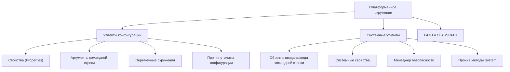
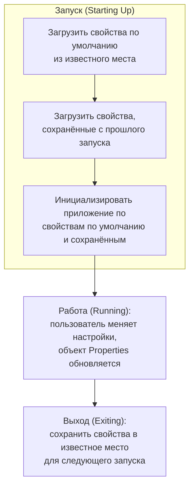
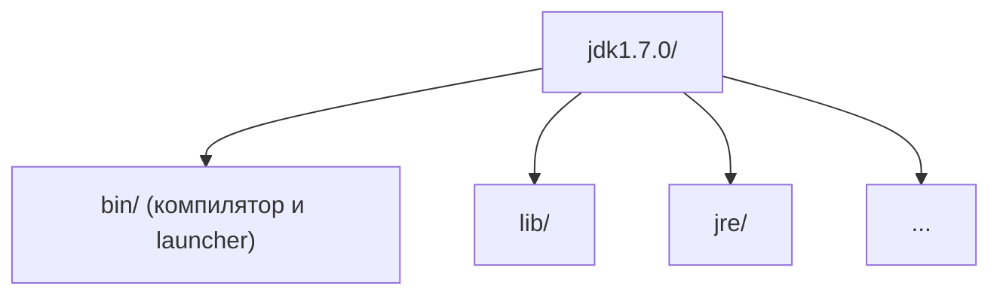

# Урок 4. Платформенное окружение

**Трейл:** Essential Java Classes · **Оригинал:** [The Platform Environment](https://docs.oracle.com/javase/tutorial/essential/environment/index.html)
**Связанные области:** [[01-core-java-syntax-oop]] · **Вопросы:** core-java

> Перевод официального руководства Oracle (The Java Tutorials, JDK 8).

Приложение выполняется в **платформенном окружении** (*platform environment*), которое определяется
нижележащей операционной системой, виртуальной машиной Java, библиотеками классов и различными
конфигурационными данными, передаваемыми при запуске приложения. Этот урок описывает некоторые из
API, с помощью которых приложение исследует и настраивает своё платформенное окружение. Урок состоит
из трёх разделов:

- **[Утилиты конфигурации](#утилиты-конфигурации-configuration-utilities)** (*Configuration Utilities*) —
  описывают API доступа к конфигурационным данным, которые передаются при развёртывании приложения
  или предоставляются пользователем.
- **[Системные утилиты](#системные-утилиты-system-utilities)** (*System Utilities*) — описывают
  различные API, определённые в классах `System` и `Runtime`.
- **[PATH и CLASSPATH](#path-и-classpath)** — описывают переменные окружения, используемые для
  настройки инструментов разработки JDK и других приложений.

> **Примечание.** Это руководство написано для JDK 8. Примеры и приёмы, описанные здесь, не
> используют улучшения, появившиеся в более поздних выпусках, и могут опираться на технологии,
> которых больше нет. Актуальные руководства см. на [Dev.java](https://dev.java/learn/).

<!-- original: none | Обзорная карта урока — авторская схема, Oracle не публикует навигационную диаграмму трейла -->


## Утилиты конфигурации (Configuration Utilities)

Этот раздел описывает некоторые утилиты конфигурации, которые помогают приложению получить доступ
к контексту своего запуска.

Подтемы раздела:

- [Свойства](#свойства-properties)
- [Аргументы командной строки](#аргументы-командной-строки-command-line-arguments)
- [Переменные окружения](#переменные-окружения-environment-variables)
- [Прочие утилиты конфигурации](#прочие-утилиты-конфигурации-other-configuration-utilities)
- [Системные свойства](#системные-свойства-system-properties)
- [Объекты ввода-вывода командной строки](#объекты-ввода-вывода-командной-строки-command-line-io-objects)
- [Менеджер безопасности](#менеджер-безопасности-the-security-manager)
- [Прочие методы класса System](#прочие-методы-класса-system-miscellaneous-methods-in-system)
- [PATH и CLASSPATH](#path-и-classpath)

### Свойства (Properties)

**Свойства** (*properties*) — это конфигурационные значения, управляемые как **пары ключ/значение**
(*key/value pairs*). В каждой паре и ключ, и значение являются строками (`String`). Ключ
идентифицирует значение и служит для его извлечения — подобно тому, как имя переменной служит для
получения значения этой переменной. Например, приложение, способное скачивать файлы, может
использовать свойство с именем «download.lastDirectory», чтобы запоминать каталог, использованный
для последней загрузки.

Для управления свойствами создавайте экземпляры класса
[`java.util.Properties`](https://docs.oracle.com/javase/8/docs/api/java/util/Properties.html).
Этот класс предоставляет методы для следующих действий:

- загрузка пар ключ/значение в объект `Properties` из потока;
- извлечение значения по его ключу;
- перечисление ключей и их значений;
- перебор ключей;
- сохранение свойств в поток.

Для знакомства с потоками обратитесь к разделу «I/O Streams» урока «Basic I/O».

Класс `Properties` расширяет
[`java.util.Hashtable`](https://docs.oracle.com/javase/8/docs/api/java/util/Hashtable.html). Часть
методов, унаследованных от `Hashtable`, поддерживает следующие действия:

- проверку наличия конкретного ключа или значения в объекте `Properties`;
- получение текущего числа пар ключ/значение;
- удаление ключа и его значения;
- добавление пары ключ/значение в список `Properties`;
- перебор значений или ключей;
- извлечение значения по его ключу;
- проверку того, пуст ли объект `Properties`.

> **Замечания о безопасности.** Доступ к свойствам контролируется текущим менеджером безопасности
> (*security manager*). Примеры кода в этом разделе предполагают автономные приложения, у которых по
> умолчанию менеджера безопасности нет. Тот же код в апплете может не работать — это зависит от
> браузера, в котором он выполняется.

Класс `System` поддерживает объект `Properties`, который определяет конфигурацию текущего рабочего
окружения. Подробнее об этих свойствах см. в разделе [Системные свойства](#системные-свойства-system-properties).
Остальная часть этого раздела объясняет, как использовать свойства для управления конфигурацией
приложения.

#### Свойства в жизненном цикле приложения

Типичное приложение может управлять своими конфигурационными данными с помощью объекта `Properties`
на протяжении всего выполнения.

<!-- original: assets/03-essential-classes/environment-1loads.gif | Жизненный цикл свойств приложения: запуск, работа, выход -->


- **Запуск (Starting Up).** Действия из первых трёх шагов происходят при запуске приложения.
  Сначала приложение загружает свойства по умолчанию из известного места в объект `Properties`.
  Обычно свойства по умолчанию хранятся в файле на диске вместе с `.class`- и другими ресурсными
  файлами приложения. Затем приложение создаёт ещё один объект `Properties` и загружает свойства,
  сохранённые при прошлом запуске. Многие приложения хранят свойства по каждому пользователю, поэтому
  свойства, загружаемые на этом шаге, обычно находятся в определённом файле в конкретном каталоге,
  поддерживаемом этим приложением в домашнем каталоге пользователя. Наконец, приложение использует
  свойства по умолчанию и запомненные свойства для самоинициализации. Главное здесь —
  **согласованность**: приложение всегда должно загружать и сохранять свойства в одно и то же место,
  чтобы найти их при следующем запуске.
- **Работа (Running).** Во время выполнения пользователь может изменить какие-то настройки (например,
  в окне настроек), и объект `Properties` обновляется, отражая эти изменения. Если изменения должны
  запоминаться в будущих сеансах, их необходимо сохранить.
- **Выход (Exiting).** При выходе приложение сохраняет свойства в известное место, чтобы загрузить их
  снова при следующем запуске.

#### Настройка объекта Properties

Следующий код Java выполняет первые два шага из предыдущего раздела: загрузку свойств по умолчанию и
загрузку запомненных свойств:

```java
. . .
// создаём и загружаем свойства по умолчанию
Properties defaultProps = new Properties();
FileInputStream in = new FileInputStream("defaultProperties");
defaultProps.load(in);
in.close();

// создаём свойства приложения со значениями по умолчанию
Properties applicationProps = new Properties(defaultProps);

// теперь загружаем свойства
// с прошлого запуска
in = new FileInputStream("appProperties");
applicationProps.load(in);
in.close();
. . .
```

Сначала приложение настраивает объект `Properties` со значениями по умолчанию. Этот объект содержит
набор свойств, которые применяются, если значения не заданы явно где-либо ещё. Затем метод `load`
читает значения по умолчанию из файла на диске с именем `defaultProperties`.

Далее приложение использует другой конструктор, чтобы создать второй объект `Properties` —
`applicationProps`, значения по умолчанию которого содержатся в `defaultProps`. Значения по умолчанию
вступают в игру при извлечении свойства: если свойство не найдено в `applicationProps`, тогда
просматривается его список значений по умолчанию.

Наконец, код загружает набор свойств в `applicationProps` из файла с именем `appProperties`. Свойства
в этом файле — те, что были сохранены приложением при прошлом запуске, как объяснено в следующем
разделе.

#### Сохранение свойств

Следующий пример записывает свойства приложения из предыдущего примера с помощью `Properties.store`.
Свойства по умолчанию не нужно сохранять каждый раз, потому что они никогда не меняются.

```java
FileOutputStream out = new FileOutputStream("appProperties");
applicationProps.store(out, "---No Comment---");
out.close();
```

Методу `store` нужен поток для записи, а также строка, которую он использует как комментарий в начале
выводимых данных.

#### Получение информации о свойствах

После того как приложение настроило свой объект `Properties`, оно может запрашивать у объекта
информацию о различных ключах и значениях, которые он содержит. Приложение получает информацию из
объекта `Properties` после запуска, чтобы инициализироваться в соответствии с выбором пользователя.
Класс `Properties` имеет несколько методов для получения информации о свойствах:

- `contains(Object value)` и `containsKey(Object key)` — возвращают `true`, если значение или ключ
  присутствуют в объекте `Properties`. `Properties` наследует эти методы от `Hashtable`, поэтому они
  принимают аргументы типа `Object`, но использовать следует только значения типа `String`.
- `getProperty(String key)` и `getProperty(String key, String default)` — возвращают значение
  указанного свойства. Вторая версия предусматривает значение по умолчанию: если ключ не найден,
  возвращается это значение.
- `list(PrintStream s)` и `list(PrintWriter w)` — записывают все свойства в указанный поток или
  writer. Полезно для отладки.
- `elements()`, `keys()` и `propertyNames()` — возвращают `Enumeration`, содержащий ключи или
  значения (что именно — следует из имени метода) объекта `Properties`. Метод `keys` возвращает
  только ключи самого объекта; метод `propertyNames` возвращает и ключи свойств по умолчанию.
- `stringPropertyNames()` — как `propertyNames`, но возвращает `Set<String>` и возвращает только имена
  свойств, у которых и ключ, и значение являются строками. Обратите внимание: объект `Set` не связан
  с объектом `Properties`, поэтому изменения в одном не влияют на другой.
- `size()` — возвращает текущее число пар ключ/значение.

#### Установка свойств

Взаимодействие пользователя с приложением во время выполнения может влиять на настройки свойств. Эти
изменения должны отражаться в объекте `Properties`, чтобы они сохранялись при выходе из приложения
(при вызове метода `store`). Следующие методы изменяют свойства в объекте `Properties`:

- `setProperty(String key, String value)` — помещает пару ключ/значение в объект `Properties`.
- `remove(Object key)` — удаляет пару ключ/значение, связанную с ключом `key`.

> **Примечание.** Некоторые из описанных выше методов определены в `Hashtable` и потому принимают
> типы ключей и значений, отличные от `String`. Всегда используйте `String` для ключей и значений,
> даже если метод допускает другие типы. Также не вызывайте `Hashtable.set` или `Hashtable.setAll`
> на объектах `Properties` — всегда используйте `Properties.setProperty`.

### Аргументы командной строки (Command-Line Arguments)

Приложение Java может принимать любое число аргументов из командной строки. Это позволяет
пользователю задавать конфигурационную информацию при запуске приложения.

Пользователь вводит аргументы командной строки при запуске приложения и указывает их после имени
запускаемого класса. Например, пусть приложение Java под названием `Sort` сортирует строки в файле.
Чтобы отсортировать данные в файле с именем `friends.txt`, пользователь введёт:

```
java Sort friends.txt
```

При запуске приложения система выполнения передаёт аргументы командной строки методу `main`
приложения через массив строк (`String`). В предыдущем примере приложению `Sort` передаётся массив,
содержащий единственную строку: `"friends.txt"`.

#### Вывод аргументов командной строки

Пример `Echo` выводит каждый из своих аргументов командной строки на отдельной строке:

```java
public class Echo {
    public static void main (String[] args) {
        for (String s: args) {
            System.out.println(s);
        }
    }
}
```

Следующий пример показывает, как пользователь может запустить `Echo` (ввод пользователя выделен
курсивом):

```
java Echo Drink Hot Java
```
```
Drink
Hot
Java
```

Обратите внимание: приложение выводит каждое слово — `Drink`, `Hot` и `Java` — на отдельной строке.
Это потому, что символ пробела разделяет аргументы командной строки. Чтобы `Drink`, `Hot` и `Java`
интерпретировались как один аргумент, пользователь должен объединить их, заключив в кавычки:

```
java Echo "Drink Hot Java"
```
```
Drink Hot Java
```

#### Разбор числовых аргументов командной строки

Если приложению нужно поддерживать числовой аргумент командной строки, оно должно преобразовать
строковый аргумент, представляющий число (например, "34"), в числовое значение. Вот фрагмент кода,
который преобразует аргумент командной строки в `int`:

```java
int firstArg;
if (args.length > 0) {
    try {
        firstArg = Integer.parseInt(args[0]);
    } catch (NumberFormatException e) {
        System.err.println("Argument" + args[0] + " must be an integer.");
        System.exit(1);
    }
}
```

`parseInt` выбрасывает `NumberFormatException`, если формат `args[0]` некорректен. У всех классов
семейства `Number` — `Integer`, `Float`, `Double` и так далее — есть методы `parseXXX`, которые
преобразуют строку, представляющую число, в объект соответствующего типа.

### Переменные окружения (Environment Variables)

Многие операционные системы используют **переменные окружения** (*environment variables*) для
передачи конфигурационной информации приложениям. Как и свойства на платформе Java, переменные
окружения являются парами ключ/значение, где и ключ, и значение — строки. Соглашения по установке и
использованию переменных окружения различаются между операционными системами, а также между
интерпретаторами командной строки. О том, как передавать переменные окружения приложениям в вашей
системе, узнайте из документации вашей системы.

#### Запрос переменных окружения

На платформе Java приложение использует
[`System.getenv`](https://docs.oracle.com/javase/8/docs/api/java/lang/System.html#getenv--) для
получения значений переменных окружения. Без аргумента `getenv` возвращает доступный только для
чтения экземпляр `java.util.Map`, в котором ключи отображения — имена переменных окружения, а значения
отображения — значения переменных окружения. Это демонстрирует пример `EnvMap`:

```java
import java.util.Map;

public class EnvMap {
    public static void main (String[] args) {
        Map<String, String> env = System.getenv();
        for (String envName : env.keySet()) {
            System.out.format("%s=%s%n",
                              envName,
                              env.get(envName));
        }
    }
}
```

С аргументом типа `String` метод `getenv` возвращает значение указанной переменной. Если переменная
не определена, `getenv` возвращает `null`. Пример `Env` использует `getenv` именно так — для запроса
конкретных переменных окружения, заданных в командной строке:

```java
public class Env {
    public static void main (String[] args) {
        for (String env: args) {
            String value = System.getenv(env);
            if (value != null) {
                System.out.format("%s=%s%n",
                                  env, value);
            } else {
                System.out.format("%s is"
                    + " not assigned.%n", env);
            }
        }
    }
}
```

#### Передача переменных окружения новым процессам

Когда приложение Java использует объект
[`ProcessBuilder`](https://docs.oracle.com/javase/8/docs/api/java/lang/ProcessBuilder.html) для
создания нового процесса, набор переменных окружения, передаваемый новому процессу по умолчанию, —
тот же, что предоставлен процессу виртуальной машины приложения. Приложение может изменить этот набор
с помощью `ProcessBuilder.environment`.

#### Вопросы зависимости от платформы

Существует множество тонких различий в том, как переменные окружения реализованы в разных системах.
Например, Windows игнорирует регистр в именах переменных окружения, а UNIX — нет. Способы
использования переменных окружения тоже различаются. Например, Windows предоставляет имя пользователя
в переменной окружения `USERNAME`, тогда как реализации UNIX могут предоставлять имя пользователя в
`USER`, `LOGNAME` или в обеих сразу.

Чтобы максимизировать переносимость, никогда не обращайтесь к переменной окружения, если то же
значение доступно в системном свойстве. Например, если операционная система предоставляет имя
пользователя, оно всегда будет доступно в системном свойстве `user.name`.

### Прочие утилиты конфигурации (Other Configuration Utilities)

Ниже — краткий обзор некоторых других утилит конфигурации.

- **Preferences API** позволяет приложениям сохранять и извлекать конфигурационные данные в
  зависящем от реализации хранилище (*backing store*). Поддерживаются асинхронные обновления, и один
  и тот же набор настроек может безопасно обновляться несколькими потоками и даже несколькими
  приложениями. Подробнее — в
  [Preferences API Guide](https://docs.oracle.com/javase/8/docs/technotes/guides/preferences/index.html).
- Приложение, развёрнутое в **JAR-архиве** (*JAR archive*), использует **манифест** (*manifest*) для
  описания содержимого архива. Подробнее — в уроке «Packaging Programs in JAR Files».
- Конфигурация приложения **Java Web Start** содержится в **JNLP-файле**. Подробнее — в уроке
  «Java Web Start».
- Конфигурация апплета **Java Plug-in** частично определяется HTML-тегами, используемыми для встраивания
  апплета в веб-страницу. В зависимости от апплета и браузера эти теги могут включать `<applet>`,
  `<object>`, `<embed>` и `<param>`. Подробнее — в уроке «Java Applets».
- Класс
  [`java.util.ServiceLoader`](https://docs.oracle.com/javase/8/docs/api/java/util/ServiceLoader.html)
  предоставляет простой механизм **поставщиков сервисов** (*service provider*). Поставщик сервиса —
  это реализация **сервиса** (*service*), то есть известного набора интерфейсов и (обычно
  абстрактных) классов. Классы поставщика сервиса обычно реализуют интерфейсы и наследуют классы,
  определённые в сервисе. Поставщиков сервисов можно устанавливать как расширения (см. «The Extension
  Mechanism»). Также их можно сделать доступными, добавив в путь классов (*class path*) или другим
  платформенно-зависимым способом.

## Системные утилиты (System Utilities)

Класс [`System`](https://docs.oracle.com/javase/8/docs/api/java/lang/System.html) реализует ряд
системных утилит. Некоторые из них уже были рассмотрены в предыдущем разделе об
[утилитах конфигурации](#утилиты-конфигурации-configuration-utilities). Этот раздел охватывает
некоторые другие системные утилиты.

### Объекты ввода-вывода командной строки (Command-Line I/O Objects)

Класс `System` предоставляет несколько предопределённых объектов ввода-вывода (*I/O objects*),
полезных в приложении Java, которое предназначено для запуска из командной строки. Они реализуют
стандартные потоки ввода-вывода (*Standard I/O streams*), предоставляемые большинством операционных
систем, а также объект консоли (*console*), удобный для ввода паролей. Подробнее — в разделе
«I/O from the Command Line» урока «Basic I/O».

### Системные свойства (System Properties)

В разделе [Свойства](#свойства-properties) мы рассмотрели, как приложение может использовать объекты
`Properties` для поддержания своей конфигурации. Сама платформа Java тоже использует объект
`Properties` для поддержания собственной конфигурации. Класс `System` поддерживает объект
`Properties`, который описывает конфигурацию текущего рабочего окружения. Системные свойства
включают информацию о текущем пользователе, текущей версии среды выполнения Java и символе,
используемом для разделения компонентов имени пути к файлу.

Следующая таблица описывает некоторые из наиболее важных системных свойств:

| Ключ | Значение |
|------|----------|
| `"file.separator"` | Символ, разделяющий компоненты пути к файлу. В UNIX это «`/`», в Windows — «`\`». |
| `"java.class.path"` | Путь, используемый для поиска каталогов и JAR-архивов, содержащих файлы классов. Элементы пути классов разделяются платформенно-зависимым символом, заданным в свойстве `path.separator`. |
| `"java.home"` | Каталог установки среды выполнения Java (JRE). |
| `"java.vendor"` | Имя поставщика JRE. |
| `"java.vendor.url"` | URL поставщика JRE. |
| `"java.version"` | Номер версии JRE. |
| `"line.separator"` | Последовательность, используемая операционной системой для разделения строк в текстовых файлах. |
| `"os.arch"` | Архитектура операционной системы. |
| `"os.name"` | Имя операционной системы. |
| `"os.version"` | Версия операционной системы. |
| `"path.separator"` | Символ-разделитель путей, используемый в `java.class.path`. |
| `"user.dir"` | Рабочий каталог пользователя. |
| `"user.home"` | Домашний каталог пользователя. |
| `"user.name"` | Имя учётной записи пользователя. |

> **Замечание о безопасности.** Доступ к системным свойствам может быть ограничен
> [менеджером безопасности](#менеджер-безопасности-the-security-manager). Чаще всего это проблема в
> апплетах, которым запрещено читать некоторые системные свойства и записывать **любые** системные
> свойства.

#### Чтение системных свойств

У класса `System` есть два метода для чтения системных свойств: `getProperty` и `getProperties`.

В классе `System` есть две разные версии `getProperty`. Обе извлекают значение свойства, названного в
списке аргументов. Более простой из двух методов `getProperty` принимает единственный аргумент — ключ
свойства. Например, чтобы получить значение `path.separator`, используйте следующий оператор:

```java
System.getProperty("path.separator");
```

Метод `getProperty` возвращает строку, содержащую значение свойства. Если свойство не существует, эта
версия `getProperty` возвращает `null`.

Другая версия `getProperty` требует двух аргументов типа `String`: первый аргумент — это искомый
ключ, а второй — значение по умолчанию, которое возвращается, если ключ не найден или у него нет
значения. Например, следующий вызов `getProperty` ищет системное свойство `subliminal.message`. Это
недействительное системное свойство, поэтому вместо `null` метод возвращает значение по умолчанию,
переданное вторым аргументом: «`Buy StayPuft Marshmallows!`»

```java
System.getProperty("subliminal.message", "Buy StayPuft Marshmallows!");
```

Последний метод, предоставляемый классом `System` для доступа к значениям свойств, — это метод
`getProperties`, который возвращает объект
[`Properties`](https://docs.oracle.com/javase/8/docs/api/java/util/Properties.html). Этот объект
содержит полный набор определений системных свойств.

#### Запись системных свойств

Чтобы изменить существующий набор системных свойств, используйте `System.setProperties`. Этот метод
принимает объект `Properties`, инициализированный нужными свойствами. Метод заменяет весь набор
системных свойств новым набором, представленным объектом `Properties`.

> **Внимание.** Изменение системных свойств потенциально опасно и должно выполняться осмотрительно.
> Многие системные свойства не перечитываются после запуска и присутствуют лишь в информационных
> целях. Изменение некоторых свойств может иметь неожиданные побочные эффекты.

Следующий пример, `PropertiesTest`, создаёт объект `Properties` и инициализирует его из файла
`myProperties.txt`:

```
subliminal.message=Buy StayPuft Marshmallows!
```

Затем `PropertiesTest` использует `System.setProperties`, чтобы установить новый объект `Properties`
в качестве текущего набора системных свойств:

```java
import java.io.FileInputStream;
import java.util.Properties;

public class PropertiesTest {
    public static void main(String[] args)
        throws Exception {

        // создаём новый объект свойств
        // из файла "myProperties.txt"
        FileInputStream propFile =
            new FileInputStream( "myProperties.txt");
        Properties p =
            new Properties(System.getProperties());
        p.load(propFile);

        // устанавливаем системные свойства
        System.setProperties(p);
        // выводим новые свойства
        System.getProperties().list(System.out);
    }
}
```

Обратите внимание, как `PropertiesTest` создаёт объект `Properties` — `p`, который используется как
аргумент для `setProperties`:

```java
Properties p = new Properties(System.getProperties());
```

Этот оператор инициализирует новый объект свойств `p` текущим набором системных свойств — в случае
этого маленького приложения это набор свойств, инициализированный системой выполнения. Затем
приложение загружает в `p` дополнительные свойства из файла `myProperties.txt` и устанавливает
системные свойства равными `p`. Это добавляет свойства, перечисленные в `myProperties.txt`, к набору
свойств, созданному системой выполнения при запуске. Обратите внимание, что приложение может создать
`p` и без объекта `Properties` со значениями по умолчанию, вот так:

```java
Properties p = new Properties();
```

Также обратите внимание, что значение системных свойств можно **перезаписать**! Например, если
`myProperties.txt` содержит следующую строку, то системное свойство `java.vendor` будет перезаписано:

```
java.vendor=Acme Software Company
```

В общем случае будьте осторожны, чтобы не перезаписать системные свойства.

Метод `setProperties` изменяет набор системных свойств для текущего работающего приложения. Эти
изменения **не сохраняются между запусками**: изменение системных свойств внутри приложения не
повлияет на будущие запуски интерпретатора Java для этого или любого другого приложения. Система
выполнения заново инициализирует системные свойства при каждом запуске. Если изменения системных
свойств должны быть постоянными, приложение должно записать значения в какой-либо файл перед выходом
и снова прочитать их при запуске.

### Менеджер безопасности (The Security Manager)

**Менеджер безопасности** (*security manager*) — это объект, определяющий политику безопасности для
приложения. Эта политика указывает действия, которые являются небезопасными или чувствительными.
Любые действия, не разрешённые политикой безопасности, приводят к выбросу
[`SecurityException`](https://docs.oracle.com/javase/8/docs/api/java/lang/SecurityException.html).
Приложение также может запросить у своего менеджера безопасности, какие действия разрешены.

Обычно веб-апплет выполняется с менеджером безопасности, предоставленным браузером или плагином
Java Web Start. Другие виды приложений, как правило, выполняются без менеджера безопасности — если
только приложение само его не определяет. Если менеджера безопасности нет, у приложения нет политики
безопасности, и оно действует без ограничений.

Этот раздел объясняет, как приложение взаимодействует с уже существующим менеджером безопасности.
Более подробную информацию, в том числе о проектировании менеджера безопасности, см. в
[Security Guide](https://docs.oracle.com/javase/8/docs/technotes/guides/security/index.html).

#### Взаимодействие с менеджером безопасности

Менеджер безопасности — это объект типа
[`SecurityManager`](https://docs.oracle.com/javase/8/docs/api/java/lang/SecurityManager.html); чтобы
получить ссылку на этот объект, вызовите `System.getSecurityManager`:

```java
SecurityManager appsm = System.getSecurityManager();
```

Если менеджера безопасности нет, этот метод возвращает `null`.

Получив ссылку на объект менеджера безопасности, приложение может запрашивать разрешение на конкретные
действия. Многие классы стандартных библиотек делают это. Например, `System.exit`, который завершает
виртуальную машину Java с заданным статусом завершения, вызывает `SecurityManager.checkExit`, чтобы
убедиться, что текущий поток имеет разрешение завершить приложение.

Класс `SecurityManager` определяет много других методов, используемых для проверки иных видов
операций. Например, `SecurityManager.checkAccess` проверяет доступ к потокам, а
`SecurityManager.checkPropertyAccess` проверяет доступ к указанному свойству. У каждой операции или
группы операций есть собственный метод `checkXXX()`.

Кроме того, набор методов `checkXXX()` представляет собой набор операций, уже подпадающих под защиту
менеджера безопасности. Как правило, приложению не приходится напрямую вызывать какие-либо методы
`checkXXX()`.

#### Распознавание нарушения безопасности

Многие действия, рутинные без менеджера безопасности, могут выбрасывать `SecurityException` при
запуске с менеджером безопасности. Это верно даже при вызове метода, который не документирован как
выбрасывающий `SecurityException`. Например, рассмотрим следующий код, используемый для записи в файл:

```java
reader = new FileWriter("xanadu.txt");
```

В отсутствие менеджера безопасности этот оператор выполняется без ошибок при условии, что
`xanadu.txt` существует и доступен для записи. Но представьте, что этот оператор вставлен в
веб-апплет, который обычно выполняется под менеджером безопасности, не разрешающим вывод в файл.
Могут возникнуть следующие сообщения об ошибках:

```
appletviewer fileApplet.html
    Exception in thread "AWT-EventQueue-1" java.security.AccessControlException: access denied (java.io.FilePermission xanadu.txt write)
        at java.security.AccessControlContext.checkPermission(AccessControlContext.java:323)
        at java.security.AccessController.checkPermission(AccessController.java:546)
        at java.lang.SecurityManager.checkPermission(SecurityManager.java:532)
        at java.lang.SecurityManager.checkWrite(SecurityManager.java:962)
        at java.io.FileOutputStream.<init>(FileOutputStream.java:169)
        at java.io.FileOutputStream.<init>(FileOutputStream.java:70)
        at java.io.FileWriter.<init>(FileWriter.java:46)
```

Обратите внимание, что конкретное выброшенное в этом случае исключение —
[`java.security.AccessControlException`](https://docs.oracle.com/javase/8/docs/api/java/security/AccessControlException.html) —
является подклассом `SecurityException`.

### Прочие методы класса System (Miscellaneous Methods in System)

Этот раздел описывает некоторые методы класса `System`, не охваченные предыдущими разделами.

- Метод `arrayCopy` эффективно копирует данные между массивами. Подробнее — в разделе «Arrays» урока
  «Language Basics».
- Методы
  [`currentTimeMillis`](https://docs.oracle.com/javase/8/docs/api/java/lang/System.html#currentTimeMillis--)
  и [`nanoTime`](https://docs.oracle.com/javase/8/docs/api/java/lang/System.html#nanoTime--) полезны
  для измерения временны́х интервалов во время выполнения приложения. Чтобы измерить интервал в
  миллисекундах, вызовите `currentTimeMillis` дважды — в начале и в конце интервала — и вычтите первое
  возвращённое значение из второго. Аналогично, двойной вызов `nanoTime` измеряет интервал в
  наносекундах.

> **Примечание.** Точность `currentTimeMillis` и `nanoTime` ограничена службами времени, которые
> предоставляет операционная система. Не предполагайте, что `currentTimeMillis` точен до ближайшей
> миллисекунды или что `nanoTime` точен до ближайшей наносекунды. Кроме того, ни `currentTimeMillis`,
> ни `nanoTime` не следует использовать для определения текущего времени — используйте
> высокоуровневый метод, такой как
> [`java.util.Calendar.getInstance`](https://docs.oracle.com/javase/8/docs/api/java/util/Calendar.html#getInstance--).

- Метод [`exit`](https://docs.oracle.com/javase/8/docs/api/java/lang/System.html#exit-int-)
  приводит к завершению работы виртуальной машины Java с целочисленным статусом завершения, заданным
  аргументом. Статус завершения доступен процессу, запустившему приложение. По соглашению статус
  завершения `0` означает нормальное завершение приложения, а любое другое значение — код ошибки.

## PATH и CLASSPATH

Этот раздел объясняет, как использовать переменные окружения `PATH` и `CLASSPATH` в Microsoft
Windows, Solaris и Linux. За актуальной информацией обращайтесь к инструкциям по установке,
включённым в ваш дистрибутив JDK (Java Development Kit).

После установки программного обеспечения каталог JDK будет иметь структуру, показанную ниже.

<!-- original: assets/03-essential-classes/environment-directories.gif | Структура каталогов JDK: bin, lib, jre и прочие -->


Каталог `bin` содержит как компилятор, так и launcher (программу-запускатель).

### Обновление переменной окружения PATH (Microsoft Windows)

Вы вполне можете запускать приложения Java и без установки переменной окружения `PATH`. Либо можете
по желанию установить её для удобства.

Установите переменную окружения `PATH`, если хотите удобно запускать исполняемые файлы
(`javac.exe`, `java.exe`, `javadoc.exe` и так далее) из любого каталога без необходимости вводить
полный путь к команде. Если вы не установите переменную `PATH`, вам придётся указывать полный путь к
исполняемому файлу каждый раз при его запуске, например:

```
C:\Java\jdk1.7.0\bin\javac MyClass.java
```

Переменная окружения `PATH` — это последовательность каталогов, разделённых точками с запятой (`;`).
Microsoft Windows ищет программы в каталогах из `PATH` по порядку, слева направо. В пути должен
присутствовать только один каталог `bin` для JDK за раз (последующие после первого игнорируются),
поэтому если он уже есть, можно обновить именно эту запись.

Вот пример переменной окружения `PATH`:

```
C:\Java\jdk1.7.0\bin;C:\Windows\System32\;C:\Windows\;C:\Windows\System32\Wbem
```

Полезно установить переменную окружения `PATH` навсегда, чтобы она сохранялась после перезагрузки.
Чтобы внести постоянное изменение в переменную `PATH`, используйте значок **System** в Панели
управления. Точная процедура зависит от версии Windows:

**Windows XP**

1. Выберите **Start**, затем **Control Panel**, дважды щёлкните **System** и выберите вкладку
   **Advanced**.
2. Нажмите **Environment Variables**. В разделе **System Variables** найдите переменную окружения
   `PATH` и выделите её. Нажмите **Edit**. Если переменной окружения `PATH` нет, нажмите **New**.
3. В окне **Edit System Variable** (или **New System Variable**) задайте значение переменной
   окружения `PATH`. Нажмите **OK**. Закройте все оставшиеся окна, нажимая **OK**.

**Windows Vista**

1. На рабочем столе щёлкните правой кнопкой по значку **My Computer**.
2. Выберите **Properties** в контекстном меню.
3. Перейдите на вкладку **Advanced** (ссылка **Advanced system settings** в Vista).
4. Нажмите **Environment Variables**. В разделе **System Variables** найдите переменную окружения
   `PATH` и выделите её. Нажмите **Edit**. Если переменной окружения `PATH` нет, нажмите **New**.
5. В окне **Edit System Variable** (или **New System Variable**) задайте значение переменной
   окружения `PATH`. Нажмите **OK**. Закройте все оставшиеся окна, нажимая **OK**.

**Windows 7**

1. На рабочем столе щёлкните правой кнопкой по значку **Computer**.
2. Выберите **Properties** в контекстном меню.
3. Нажмите ссылку **Advanced system settings**.
4. Нажмите **Environment Variables**. В разделе **System Variables** найдите переменную окружения
   `PATH` и выделите её. Нажмите **Edit**. Если переменной окружения `PATH` нет, нажмите **New**.
5. В окне **Edit System Variable** (или **New System Variable**) задайте значение переменной
   окружения `PATH`. Нажмите **OK**. Закройте все оставшиеся окна, нажимая **OK**.

> **Примечание.** При редактировании из Панели управления вы можете увидеть переменную окружения
> `PATH`, похожую на следующую:
>
> ```
> %JAVA_HOME%\bin;%SystemRoot%\system32;%SystemRoot%;%SystemRoot%\System32\Wbem
> ```
>
> Переменные, заключённые в знаки процента (`%`), — это существующие переменные окружения. Если одна
> из таких переменных перечислена в окне **Environment Variables** Панели управления (например,
> `JAVA_HOME`), вы можете отредактировать её значение. Если она там не отображается, значит это
> особая переменная окружения, определённая операционной системой. Например, `SystemRoot` — это
> местоположение системной папки Microsoft Windows. Чтобы получить значение переменной окружения,
> введите в командной строке следующее (этот пример получает значение переменной окружения
> `SystemRoot`):
>
> ```
> echo %SystemRoot%
> ```

### Обновление переменной PATH (Solaris и Linux)

Вы вполне можете запускать JDK и без установки переменной `PATH`, либо можете по желанию установить
её для удобства. Однако стоит установить переменную пути, если вы хотите запускать исполняемые файлы
(`javac`, `java`, `javadoc` и так далее) из любого каталога без необходимости вводить полный путь к
команде. Если вы не установите переменную `PATH`, вам придётся указывать полный путь к исполняемому
файлу каждый раз при его запуске, например:

```
% /usr/local/jdk1.7.0/bin/javac MyClass.java
```

Чтобы выяснить, правильно ли установлен путь, выполните:

```
% java -version
```

Это выведет версию инструмента `java`, если он может его найти. Если версия старая или вы получаете
ошибку **java: Command not found**, значит путь установлен неправильно.

Чтобы установить путь навсегда, задайте путь в вашем стартовом файле.

Для C shell (`csh`) отредактируйте стартовый файл (`~/.cshrc`):

```
set path=(/usr/local/jdk1.7.0/bin $path)
```

Для `bash` отредактируйте стартовый файл (`~/.bashrc`):

```
PATH=/usr/local/jdk1.7.0/bin:$PATH
export PATH
```

Для `ksh` стартовый файл именуется переменной окружения `ENV`. Чтобы установить путь:

```
PATH=/usr/local/jdk1.7.0/bin:$PATH
export PATH
```

Для `sh` отредактируйте файл профиля (`~/.profile`):

```
PATH=/usr/local/jdk1.7.0/bin:$PATH
export PATH
```

Затем загрузите стартовый файл и проверьте, что путь установлен, повторив команду `java`:

Для C shell (`csh`):

```
% source ~/.cshrc
% java -version
```

Для `ksh`, `bash` или `sh`:

```
% . /.profile
% java -version
```

### Проверка переменной CLASSPATH (все платформы)

Переменная `CLASSPATH` — это один из способов сообщить приложениям, включая инструменты JDK, где
искать пользовательские классы. (Классы, входящие в JRE, платформу JDK и расширения, должны
задаваться другими средствами — такими как bootstrap-путь классов или каталог расширений.)

Предпочтительный способ задать путь классов — использовать ключ командной строки `-cp`. Это позволяет
устанавливать `CLASSPATH` индивидуально для каждого приложения, не влияя на другие приложения.
*Установка `CLASSPATH` может быть непростой и должна выполняться с осторожностью.*

Значение пути классов по умолчанию — «.», то есть просматривается только текущий каталог. Указание
переменной `CLASSPATH` или ключа командной строки `-cp` переопределяет это значение.

Чтобы проверить, установлен ли `CLASSPATH` в Microsoft Windows NT/2000/XP, выполните:

```
C:> echo %CLASSPATH%
```

В Solaris или Linux выполните:

```
% echo $CLASSPATH
```

Если `CLASSPATH` не установлен, вы получите ошибку **CLASSPATH: Undefined variable** (Solaris или
Linux) или просто **%CLASSPATH%** (Microsoft Windows NT/2000/XP).

Чтобы изменить `CLASSPATH`, используйте ту же процедуру, что и для переменной `PATH`.

Подстановочные знаки в пути классов (*class path wildcards*) позволяют включать в путь классов целый
каталог `.jar`-файлов без явного перечисления каждого из них. Подробнее — включая объяснение
подстановочных знаков пути классов и детальное описание того, как привести в порядок переменную
окружения `CLASSPATH`, — см. техническое примечание
[Setting the Class Path](https://docs.oracle.com/javase/8/docs/technotes/tools/windows/classpath.html).

## Вопросы и упражнения (Questions and Exercises)

### Вопросы

1. Программист устанавливает новую библиотеку, содержащуюся в `.jar`-файле. Чтобы обращаться к
   библиотеке из своего кода, он устанавливает переменную окружения `CLASSPATH`, указывающую на новый
   `.jar`-файл. Теперь он обнаруживает, что получает сообщение об ошибке при попытке запустить простые
   приложения:

   ```
   java Hello
   Exception in thread "main" java.lang.NoClassDefFoundError: Hello
   ```

   В этом случае класс `Hello` скомпилирован в `.class`-файл в текущем каталоге — однако команда
   `java`, похоже, не может его найти. Что пошло не так?

### Упражнения

1. Напишите приложение `PersistentEcho` со следующими возможностями:

   - Если `PersistentEcho` запускается с аргументами командной строки, оно выводит эти аргументы.
     Оно также сохраняет выведенную строку в свойство и сохраняет это свойство в файл с именем
     `PersistentEcho.txt`.
   - Если `PersistentEcho` запускается без аргументов командной строки, оно ищет переменную окружения
     с именем `PERSISTENTECHO`. Если эта переменная существует, `PersistentEcho` выводит её значение,
     а также сохраняет это значение тем же способом, что и для аргументов командной строки.
   - Если `PersistentEcho` запускается без аргументов командной строки и переменная окружения
     `PERSISTENTECHO` не определена, оно извлекает значение свойства из `PersistentEcho.txt` и
     выводит его.

> **Подсказка.** Проверьте свои ответы по официальным ответам Oracle:
> [Answers to Questions and Exercises: The Platform Environment](https://docs.oracle.com/javase/tutorial/essential/environment/QandE/answers.html).

## Источник

- [Lesson: The Platform Environment](https://docs.oracle.com/javase/tutorial/essential/environment/index.html) — официальное руководство Oracle.
- [Configuration Utilities](https://docs.oracle.com/javase/tutorial/essential/environment/config.html) — официальное руководство Oracle.
- [Properties](https://docs.oracle.com/javase/tutorial/essential/environment/properties.html) — официальное руководство Oracle.
- [Command-Line Arguments](https://docs.oracle.com/javase/tutorial/essential/environment/cmdLineArgs.html) — официальное руководство Oracle.
- [Environment Variables](https://docs.oracle.com/javase/tutorial/essential/environment/env.html) — официальное руководство Oracle.
- [Other Configuration Utilities](https://docs.oracle.com/javase/tutorial/essential/environment/other.html) — официальное руководство Oracle.
- [System Utilities](https://docs.oracle.com/javase/tutorial/essential/environment/system.html) — официальное руководство Oracle.
- [Command-Line I/O Objects](https://docs.oracle.com/javase/tutorial/essential/environment/cl.html) — официальное руководство Oracle.
- [System Properties](https://docs.oracle.com/javase/tutorial/essential/environment/sysprop.html) — официальное руководство Oracle.
- [The Security Manager](https://docs.oracle.com/javase/tutorial/essential/environment/security.html) — официальное руководство Oracle.
- [Miscellaneous Methods in System](https://docs.oracle.com/javase/tutorial/essential/environment/sysmisc.html) — официальное руководство Oracle.
- [PATH and CLASSPATH](https://docs.oracle.com/javase/tutorial/essential/environment/paths.html) — официальное руководство Oracle.
- [Questions and Exercises: The Platform Environment](https://docs.oracle.com/javase/tutorial/essential/environment/QandE/questions.html) — официальное руководство Oracle.
