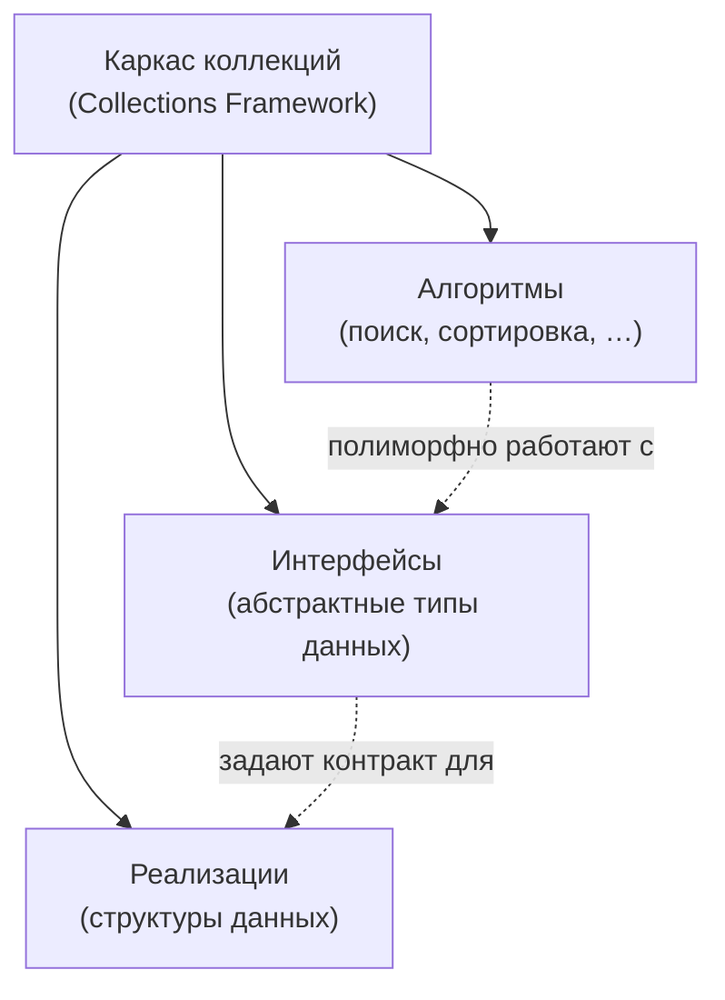

# Урок 1. Введение в Collections Framework

**Трейл:** Collections · **Оригинал:** [Introduction](https://docs.oracle.com/javase/tutorial/collections/intro/index.html)
**Связанные области:** [[03-collections]] · **Вопросы:** collections

> Перевод официального руководства Oracle (The Java Tutorials, JDK 8). Объединяет страницу
> *Lesson: Introduction to Collections* с разделами *What Is a Collections Framework?*
> и *Benefits of the Java Collections Framework*.

**Коллекция** (*collection*) — иногда её называют контейнером (*container*) — это просто объект,
объединяющий несколько элементов в единое целое. Коллекции используются для хранения, извлечения,
обработки и передачи агрегированных данных. Как правило, они представляют данные, которые
естественным образом образуют группу: например, покерную руку (коллекцию карт), почтовую папку
(коллекцию писем) или телефонный справочник (отображение имён на телефонные номера). Если вы
программировали на языке Java — да и почти на любом другом языке программирования — то вы уже
знакомы с коллекциями.

## Что такое каркас коллекций (Collections Framework)?

**Каркас коллекций** (*collections framework*) — это единая архитектура для представления коллекций
и работы с ними. Любой каркас коллекций содержит следующее:

- **Интерфейсы** (*interfaces*). Это абстрактные типы данных, представляющие коллекции. Интерфейсы
  позволяют работать с коллекциями независимо от деталей их внутреннего представления. В
  объектно-ориентированных языках интерфейсы, как правило, образуют иерархию.
- **Реализации** (*implementations*). Это конкретные реализации интерфейсов коллекций. По сути,
  это многократно используемые структуры данных.
- **Алгоритмы** (*algorithms*). Это методы, выполняющие полезные вычисления — например, поиск и
  сортировку — над объектами, которые реализуют интерфейсы коллекций. Про алгоритмы говорят, что
  они **полиморфны** (*polymorphic*): то есть один и тот же метод может применяться ко множеству
  различных реализаций соответствующего интерфейса коллекции. По сути, алгоритмы — это многократно
  используемая функциональность.

Помимо Java Collections Framework, наиболее известными примерами каркасов коллекций являются
стандартная библиотека шаблонов C++ (Standard Template Library, STL) и иерархия коллекций
Smalltalk. Исторически каркасы коллекций были довольно сложными, из-за чего за ними закрепилась
репутация инструментов с крутой кривой обучения. Мы убеждены, что Java Collections Framework
порывает с этой традицией, в чём вы убедитесь сами в этой главе.

<!-- original: none | Авторская блок-схема трёх компонентов фреймворка; Oracle не публикует подобную диаграмму на странице введения -->

## Преимущества Java Collections Framework

Java Collections Framework даёт следующие преимущества:

- **Снижает трудозатраты на программирование.** Предоставляя полезные структуры данных и
  алгоритмы, каркас коллекций освобождает вас и позволяет сосредоточиться на важных частях
  программы, а не на низкоуровневой «обвязке», необходимой для её работы. Облегчая совместимость
  между несвязанными API, Java Collections Framework избавляет вас от написания объектов-адаптеров
  или кода преобразования для соединения разных API.
- **Повышает скорость и качество программ.** Каркас коллекций предоставляет
  высокопроизводительные и качественные реализации полезных структур данных и алгоритмов.
  Различные реализации каждого интерфейса взаимозаменяемы, поэтому программы легко настраивать,
  переключая реализации коллекций. Поскольку вы избавлены от рутины написания собственных структур
  данных, у вас остаётся больше времени на улучшение качества и производительности программ.
- **Обеспечивает совместимость между несвязанными API.** Интерфейсы коллекций — это тот «общий
  язык», на котором API передают друг другу коллекции. Если мой API администрирования сети выдаёт
  коллекцию имён узлов, а ваш GUI-инструментарий ожидает коллекцию заголовков столбцов, то наши API
  будут без проблем взаимодействовать, даже если они были написаны независимо друг от друга.
- **Снижает затраты на изучение и использование новых API.** Многие API естественным образом
  принимают коллекции на вход и выдают их в качестве выходных данных. Раньше у каждого такого API
  был свой небольшой под-API для работы с его коллекциями. Между этими «самодельными» под-API было
  мало согласованности, поэтому каждый из них приходилось изучать с нуля, и при их использовании
  легко было ошибиться. С появлением стандартных интерфейсов коллекций эта проблема исчезла.
- **Снижает затраты на проектирование новых API.** Это обратная сторона предыдущего преимущества.
  Проектировщикам и разработчикам не нужно каждый раз «изобретать велосипед», создавая API,
  который опирается на коллекции; вместо этого они могут использовать стандартные интерфейсы
  коллекций.
- **Способствует повторному использованию кода.** Новые структуры данных, соответствующие
  стандартным интерфейсам коллекций, по своей природе пригодны для повторного использования. То же
  относится и к новым алгоритмам, работающим с объектами, которые реализуют эти интерфейсы.

## Источник

- [Lesson: Introduction to Collections](https://docs.oracle.com/javase/tutorial/collections/intro/index.html) — официальное руководство Oracle (The Java Tutorials, JDK 8); включает разделы *What Is a Collections Framework?* и *Benefits of the Java Collections Framework*.
