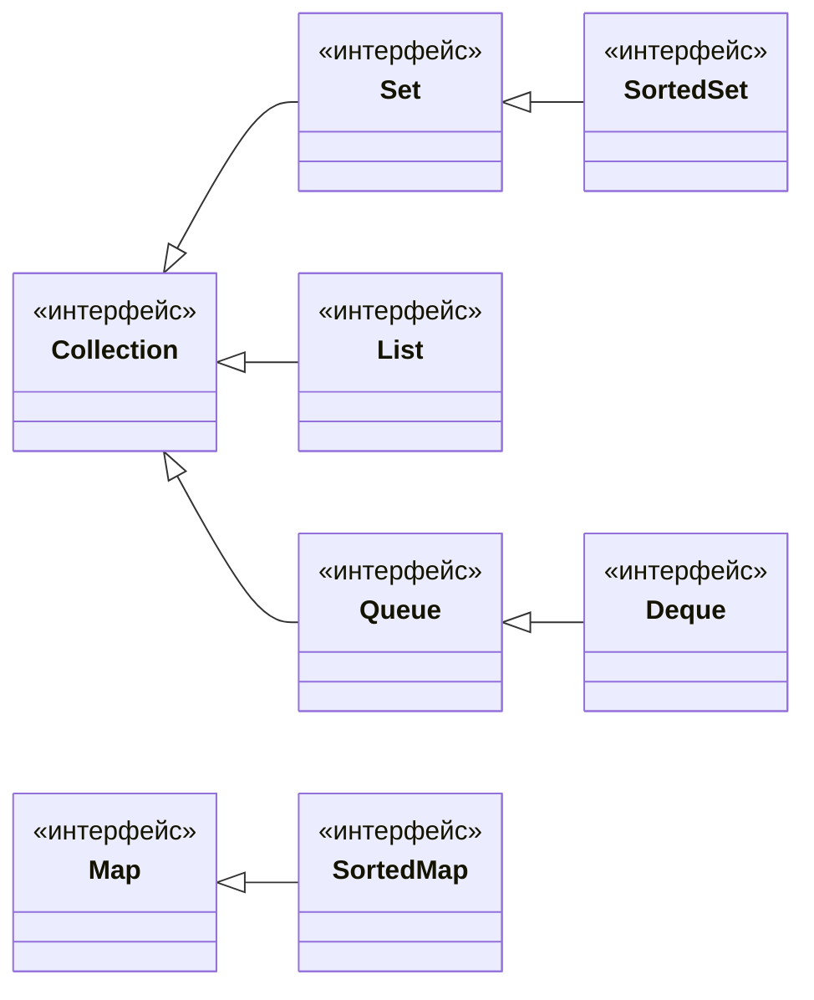
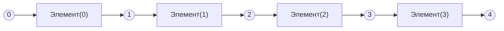

# Урок 2. Интерфейсы коллекций

**Трейл:** Collections · **Оригинал:** [Interfaces](https://docs.oracle.com/javase/tutorial/collections/interfaces/index.html)
**Связанные области:** [[03-collections]] · **Вопросы:** collections

> Перевод официального руководства Oracle (The Java Tutorials, JDK 8). Объединяет урок
> *Interfaces* трейла *Collections* и все его подстраницы: *The Collection Interface*,
> *The Set Interface*, *The List Interface*, *The Queue Interface*, *The Deque Interface*,
> *The Map Interface*, *Object Ordering*, *The SortedSet Interface*, *The SortedMap Interface*
> и *Summary of Interfaces*. Примеры и приёмы соответствуют JDK 8 и могут не учитывать
> улучшений более поздних версий.

## Урок: Интерфейсы

**Основные интерфейсы коллекций** (core collection interfaces) инкапсулируют различные типы
коллекций. Эти интерфейсы позволяют манипулировать коллекциями независимо от деталей их
представления и образуют основу Java Collections Framework. Как видно ниже, основные интерфейсы
коллекций образуют иерархию.

<!-- original: assets/04-collections/core-interfaces.gif | Иерархия основных интерфейсов коллекций (официальный рисунок Oracle) -->


*Рисунок. Основные интерфейсы коллекций. Иерархия состоит из двух отдельных деревьев: первое
начинается с `Collection` (и включает `Set`, `SortedSet`, `List`, `Queue`, `Deque`), второе —
с `Map` (и включает `SortedMap`).*

`Set` — это особая разновидность `Collection`, `SortedSet` — особая разновидность `Set` и так
далее. Обратите внимание: иерархия состоит из двух отдельных деревьев — `Map` не является
полноценной `Collection`.

Все основные интерфейсы коллекций являются обобщёнными (generic). Например, вот объявление
интерфейса `Collection`:

```java
public interface Collection<E>...
```

Синтаксис `<E>` указывает, что интерфейс обобщённый. Объявляя экземпляр `Collection`, вы можете
и **должны** указать тип хранимых в коллекции объектов. Это позволяет компилятору проверить во
время компиляции, что вы помещаете в коллекцию объект правильного типа, что снижает число ошибок
во время выполнения. Об обобщённых типах см. раздел *Generics (Updated)*.

Чтобы количество основных интерфейсов коллекций оставалось управляемым, платформа Java не
предоставляет отдельные интерфейсы для каждого варианта каждого типа коллекции (такими вариантами
могли бы быть неизменяемая, фиксированного размера, только для добавления коллекция). Вместо этого
операции изменения в каждом интерфейсе помечены как **опциональные** (optional): конкретная
реализация может не поддерживать некоторые операции. При вызове неподдерживаемой операции коллекция
выбрасывает `UnsupportedOperationException`. Реализации обязаны документировать, какие опциональные
операции они поддерживают. Все реализации общего назначения платформы Java поддерживают все
опциональные операции.

Ниже описаны основные интерфейсы коллекций:

- `Collection` — корень иерархии коллекций. Коллекция представляет группу объектов, называемых
  **элементами** (elements). Интерфейс `Collection` — наименьший общий знаменатель, который
  реализуют все коллекции; он используется для передачи коллекций и манипулирования ими, когда
  нужна максимальная общность. Одни типы коллекций допускают дубликаты, другие — нет; одни
  упорядочены, другие — нет. Прямых реализаций этого интерфейса платформа Java не предоставляет, но
  предоставляет реализации более специализированных подынтерфейсов, таких как `Set` и `List`.
- `Set` — коллекция, которая не может содержать дублирующиеся элементы. Этот интерфейс моделирует
  математическую абстракцию множества и применяется для представления множеств вроде карт покерной
  руки, курсов в расписании студента или процессов на машине.
- `List` — упорядоченная коллекция (иногда называемая **последовательностью**, sequence). Списки
  могут содержать дублирующиеся элементы. Пользователь `List` обычно имеет точный контроль над тем,
  куда вставляется каждый элемент, и может обращаться к элементам по целочисленному индексу
  (позиции). Если вы работали с `Vector`, общий характер `List` вам знаком.
- `Queue` — коллекция для хранения нескольких элементов перед обработкой. Помимо базовых операций
  `Collection`, `Queue` предоставляет дополнительные операции вставки, извлечения и проверки.
  Очереди обычно (но не обязательно) упорядочивают элементы по принципу FIFO (first-in, first-out —
  первым пришёл, первым ушёл). Исключение — приоритетные очереди, упорядочивающие элементы по
  предоставленному компаратору или их естественному порядку. Каким бы ни был порядок, начало очереди
  (head) — это элемент, который будет удалён вызовом `remove` или `poll`. В FIFO-очереди все новые
  элементы вставляются в конец. Другие виды очередей могут применять иные правила размещения. Каждая
  реализация `Queue` должна указывать свои свойства упорядочения.
- `Deque` — коллекция для хранения нескольких элементов перед обработкой. Помимо базовых операций
  `Collection`, `Deque` предоставляет дополнительные операции вставки, извлечения и проверки. Деки
  могут использоваться как FIFO (first-in, first-out), так и LIFO (last-in, first-out — последним
  пришёл, первым ушёл). В деке все новые элементы можно вставлять, получать и удалять с обоих концов.
- `Map` — объект, отображающий ключи на значения. `Map` не может содержать дублирующихся ключей;
  каждый ключ отображается не более чем на одно значение. Если вы работали с `Hashtable`, основы
  `Map` вам знакомы.

Последние два основных интерфейса коллекций — это просто отсортированные версии `Set` и `Map`:

- `SortedSet` — `Set`, поддерживающий свои элементы в порядке возрастания. Предоставляет несколько
  дополнительных операций, использующих преимущества упорядоченности. Отсортированные множества
  применяются для естественно упорядоченных наборов — списков слов, списков членства.
- `SortedMap` — `Map`, поддерживающий свои отображения в порядке возрастания ключей. Это аналог
  `SortedSet` для `Map`. Отсортированные карты применяются для естественно упорядоченных наборов
  пар «ключ/значение» — словарей и телефонных справочников.

Чтобы понять, как отсортированные интерфейсы поддерживают порядок своих элементов, см. раздел
[Упорядочение объектов](#упорядочение-объектов).

## Интерфейс Collection

`Collection` представляет группу объектов, известных как её элементы. Интерфейс `Collection`
используется для передачи коллекций объектов, когда нужна максимальная общность. Например, по
соглашению все универсальные реализации коллекций имеют конструктор, принимающий аргумент
`Collection`. Такой конструктор называется **конструктором преобразования** (conversion constructor):
он инициализирует новую коллекцию всеми элементами указанной коллекции, независимо от типа её
подынтерфейса или реализации. Иными словами, он позволяет **преобразовать** тип коллекции.

Допустим, у вас есть `Collection<String> c`, которая может быть `List`, `Set` или другим типом
`Collection`. Следующая строка создаёт новый `ArrayList` (реализацию интерфейса `List`),
изначально содержащий все элементы `c`:

```java
List<String> list = new ArrayList<String>(c);
```

Или, если вы используете JDK 7 и выше, можно применить «ромбовидный» оператор (diamond):

```java
List<String> list = new ArrayList<>(c);
```

### Методы интерфейса Collection

Интерфейс `Collection` содержит методы базовых операций: `int size()`, `boolean isEmpty()`,
`boolean contains(Object element)`, `boolean add(E element)`, `boolean remove(Object element)` и
`Iterator<E> iterator()`.

Также он содержит методы для работы с целыми коллекциями: `boolean containsAll(Collection<?> c)`,
`boolean addAll(Collection<? extends E> c)`, `boolean removeAll(Collection<?> c)`,
`boolean retainAll(Collection<?> c)` и `void clear()`.

Есть и дополнительные методы для операций с массивами: `Object[] toArray()` и
`<T> T[] toArray(T[] a)`.

В JDK 8 и выше интерфейс `Collection` также предоставляет методы `Stream<E> stream()` и
`Stream<E> parallelStream()` для получения последовательного или параллельного потока из базовой
коллекции.

Метод `add` определён достаточно общо, чтобы иметь смысл и для коллекций, допускающих дубликаты, и
для не допускающих их. Он гарантирует, что после его завершения `Collection` будет содержать
указанный элемент, и возвращает `true`, если коллекция изменилась в результате вызова. Аналогично,
метод `remove` удаляет один экземпляр указанного элемента (если он есть) и возвращает `true`, если
коллекция была изменена.

### Обход коллекций

Существует три способа обхода коллекций: (1) при помощи **агрегатных операций** (aggregate
operations), (2) с помощью конструкции `for-each` и (3) при помощи **итераторов** (`Iterator`).

#### Агрегатные операции

В JDK 8 и выше предпочтительный способ итерации по коллекции — получить поток (stream) и выполнить
над ним агрегатные операции. Агрегатные операции часто применяются совместно с лямбда-выражениями,
делая код выразительнее и короче. Следующий код последовательно проходит коллекцию фигур и выводит
красные объекты:

```java
myShapesCollection.stream()
.filter(e -> e.getColor() == Color.RED)
.forEach(e -> System.out.println(e.getName()));
```

Аналогично можно запросить параллельный поток, что имеет смысл, если коллекция достаточно велика, а
у компьютера достаточно ядер:

```java
myShapesCollection.parallelStream()
.filter(e -> e.getColor() == Color.RED)
.forEach(e -> System.out.println(e.getName()));
```

Собрать данные через этот API можно множеством способов. Например, можно преобразовать элементы
`Collection` в объекты `String` и затем соединить их через запятую:

```java
String joined = elements.stream()
    .map(Object::toString)
    .collect(Collectors.joining(", "));
```

Или, скажем, вычислить сумму зарплат всех сотрудников:

```java
int total = employees.stream()
.collect(Collectors.summingInt(Employee::getSalary)));
```

Это лишь несколько примеров того, что можно делать с потоками и агрегатными операциями. Подробнее
см. урок *Aggregate Operations*.

Платформа Collections всегда предоставляла ряд так называемых **массовых операций** (bulk
operations) в составе своего API. Это методы, работающие с целыми коллекциями, такие как
`containsAll`, `addAll`, `removeAll` и т. д. Не путайте их с агрегатными операциями, введёнными в
JDK 8. Ключевое отличие новых агрегатных операций от существующих массовых (`containsAll`, `addAll`
и т. д.) в том, что старые версии **мутирующие** (mutative): они изменяют базовую коллекцию. Новые
же агрегатные операции **не** изменяют базовую коллекцию. Применяя новые агрегатные операции и
лямбда-выражения, нужно избегать мутаций, чтобы не создать проблем в будущем, если код позже будет
запущен из параллельного потока.

#### Конструкция for-each

Конструкция `for-each` позволяет кратко обойти коллекцию или массив с помощью цикла `for`.
Следующий код выводит каждый элемент коллекции на отдельной строке:

```java
for (Object o : collection)
    System.out.println(o);
```

#### Итераторы

`Iterator` — это объект, позволяющий проходить по коллекции и при желании выборочно удалять её
элементы. Итератор для коллекции получают вызовом её метода `iterator`. Вот интерфейс `Iterator`:

```java
public interface Iterator<E> {
    boolean hasNext();
    E next();
    void remove(); // опционально
}
```

Метод `hasNext` возвращает `true`, если в итерации остались ещё элементы, а метод `next` возвращает
следующий элемент. Метод `remove` удаляет из базовой `Collection` последний элемент, возвращённый
методом `next`. Метод `remove` можно вызвать только один раз на каждый вызов `next`; при нарушении
этого правила будет выброшено исключение.

Обратите внимание, что `Iterator.remove` — **единственный** безопасный способ изменить коллекцию во
время итерации; поведение не определено, если базовая коллекция изменяется любым другим способом во
время выполнения итерации.

Используйте `Iterator` вместо конструкции `for-each`, когда вам нужно:

- удалить текущий элемент. Конструкция `for-each` скрывает итератор, поэтому вызвать `remove`
  нельзя; следовательно, она не подходит для фильтрации;
- параллельно итерировать по нескольким коллекциям.

Следующий метод показывает, как использовать `Iterator` для фильтрации произвольной `Collection` —
то есть обхода коллекции и удаления определённых элементов:

```java
static void filter(Collection<?> c) {
    for (Iterator<?> it = c.iterator(); it.hasNext(); )
        if (!cond(it.next()))
            it.remove();
}
```

Этот простой фрагмент полиморфен: он работает для **любой** `Collection` независимо от её
реализации. Пример демонстрирует, как легко написать полиморфный алгоритм средствами Java
Collections Framework.

### Массовые операции

**Массовые операции** (bulk operations) выполняют действие над целой `Collection`. Их можно было бы
реализовать через базовые операции, хотя обычно это было бы менее эффективно. Вот массовые операции:

- `containsAll` — возвращает `true`, если целевая `Collection` содержит все элементы указанной
  `Collection`;
- `addAll` — добавляет все элементы указанной `Collection` в целевую;
- `removeAll` — удаляет из целевой `Collection` все её элементы, которые также содержатся в
  указанной `Collection`;
- `retainAll` — удаляет из целевой `Collection` все её элементы, которые **не** содержатся в
  указанной `Collection`. То есть сохраняет только те элементы, которые есть и в указанной
  `Collection`;
- `clear` — удаляет из `Collection` все элементы.

Методы `addAll`, `removeAll` и `retainAll` возвращают `true`, если в ходе операции целевая
`Collection` была изменена.

Простой пример мощи массовых операций — следующий способ удалить **все** вхождения элемента `e` из
`Collection` `c`:

```java
c.removeAll(Collections.singleton(e));
```

Более конкретно, предположим, что нужно удалить из `Collection` все элементы `null`:

```java
c.removeAll(Collections.singleton(null));
```

Здесь используется `Collections.singleton` — статический метод-фабрика, возвращающий неизменяемое
`Set` с единственным указанным элементом.

### Операции с массивами

Методы `toArray` служат мостом между коллекциями и более старыми API, ожидающими на входе массивы.
Они позволяют преобразовать содержимое `Collection` в массив. Простая форма без аргументов создаёт
новый массив `Object`. Более сложная форма позволяет вызывающей стороне задать массив или выбрать
тип элементов результирующего массива во время выполнения.

Например, пусть `c` — это `Collection`. Следующий фрагмент выгружает содержимое `c` во вновь
выделенный массив `Object`, длина которого равна числу элементов в `c`:

```java
Object[] a = c.toArray();
```

Допустим, известно, что `c` содержит только строки (например, потому что `c` имеет тип
`Collection<String>`). Следующий фрагмент выгружает содержимое `c` во вновь выделенный массив
`String`:

```java
String[] a = c.toArray(new String[0]);
```

## Интерфейс Set

`Set` — это `Collection`, которая не может содержать дублирующиеся элементы. Он моделирует
математическое понятие множества. Интерфейс `Set` содержит **только** методы, унаследованные от
`Collection`, и добавляет ограничение, запрещающее дубликаты. `Set` также налагает более строгий
контракт на поведение операций `equals` и `hashCode`, что позволяет осмысленно сравнивать
экземпляры `Set`, даже если их типы реализации различаются. Два экземпляра `Set` равны, если
содержат одинаковые элементы.

Платформа Java содержит три реализации `Set` общего назначения:

- `HashSet` — хранит элементы в хеш-таблице; лучшая по производительности реализация, но не
  гарантирует порядок итерации;
- `TreeSet` — хранит элементы в красно-чёрном дереве (red-black tree), упорядочивая их по значениям;
  существенно медленнее `HashSet`;
- `LinkedHashSet` — реализована как хеш-таблица со связным списком; упорядочивает элементы по
  порядку их вставки (insertion order). `LinkedHashSet` избавляет клиента от непредсказуемого
  порядка `HashSet`, требуя лишь немного больших затрат.

Вот простой и полезный приём удаления дубликатов из `Collection`:

```java
Collection<Type> noDups = new HashSet<Type>(c);
```

Он работает за счёт создания `Set` (которое по определению не может содержать дубликаты),
изначально содержащего все элементы `c`. Или с JDK 8 и выше, используя потоки:

```java
c.stream()
.collect(Collectors.toSet()); // без дубликатов
```

Можно собрать коллекцию имён в `TreeSet`:

```java
Set<String> set = people.stream()
.map(Person::getName)
.collect(Collectors.toCollection(TreeSet::new));
```

Вариант приёма, сохраняющий порядок исходной коллекции при удалении дубликатов:

```java
Collection<Type> noDups = new LinkedHashSet<Type>(c);
```

Универсальный метод, инкапсулирующий этот приём:

```java
public static <E> Set<E> removeDups(Collection<E> c) {
    return new LinkedHashSet<E>(c);
}
```

### Базовые операции Set

Операция `size` возвращает число элементов в `Set` (его **мощность**, cardinality). Метод `isEmpty`
работает как ожидается. Метод `add` добавляет указанный элемент в `Set`, если его там ещё нет, и
возвращает булево значение, указывающее на успех. Аналогично метод `remove` удаляет указанный
элемент (если он присутствует) и возвращает булево значение, указывающее на его наличие. Метод
`iterator` возвращает `Iterator` по `Set`.

Программа `FindDups` выводит число различных слов из списка аргументов. С использованием агрегатных
операций JDK 8:

```java
import java.util.*;
import java.util.stream.*;

public class FindDups {
    public static void main(String[] args) {
        Set<String> distinctWords = Arrays.asList(args).stream()
			.collect(Collectors.toSet());
        System.out.println(distinctWords.size()+
                           " отдельных слов: " +
                           distinctWords);
    }
}
```

С использованием конструкции `for-each`:

```java
import java.util.*;

public class FindDups {
    public static void main(String[] args) {
        Set<String> s = new HashSet<String>();
        for (String a : args)
               s.add(a);
        System.out.println(s.size() + " отдельных слов: " + s);
    }
}
```

Запуск:

```
java FindDups i came i saw i left
```

Результат:

```
4 отдельных слова: [left, came, saw, i]
```

Замена реализации с `HashSet` на `TreeSet` упорядочит вывод по алфавиту:

```
4 отдельных слова: [came, i, left, saw]
```

### Массовые операции над Set

Массовые операции особенно хорошо подходят для `Set`: будучи применёнными, они выполняют стандартные
теоретико-множественные операции. Пусть `s1` и `s2` — множества:

- `s1.containsAll(s2)` — возвращает `true`, если `s2` является **подмножеством** `s1`;
- `s1.addAll(s2)` — превращает `s1` в **объединение** (union) `s1` и `s2` (множество, содержащее
  все элементы обоих множеств);
- `s1.retainAll(s2)` — превращает `s1` в **пересечение** (intersection) `s1` и `s2` (множество,
  содержащее только общие элементы);
- `s1.removeAll(s2)` — превращает `s1` в **разность** (difference) `s1` и `s2` (множество элементов,
  имеющихся в `s1`, но не в `s2`).

Чтобы вычислить объединение, пересечение или разность без изменения исходных множеств:

```java
// Объединение
Set<Type> union = new HashSet<Type>(s1);
union.addAll(s2);

// Пересечение
Set<Type> intersection = new HashSet<Type>(s1);
intersection.retainAll(s2);

// Разность
Set<Type> difference = new HashSet<Type>(s1);
difference.removeAll(s2);
```

Программа `FindDups2` определяет, какие слова из списка аргументов встречаются ровно один раз, а
какие — более одного:

```java
import java.util.*;

public class FindDups2 {
    public static void main(String[] args) {
        Set<String> uniques = new HashSet<String>();
        Set<String> dups    = new HashSet<String>();

        for (String a : args)
            if (!uniques.add(a))
                dups.add(a);

        // Разрушающая разность множеств
        uniques.removeAll(dups);

        System.out.println("Уникальные слова:    " + uniques);
        System.out.println("Дублирующиеся слова: " + dups);
    }
}
```

Результат при аргументах `i came i saw i left`:

```
Уникальные слова:    [left, saw, came]
Дублирующиеся слова: [i]
```

Менее распространённая операция — **симметрическая разность** (symmetric difference): элементы,
содержащиеся ровно в одном из двух множеств, но не в обоих:

```java
Set<Type> symmetricDiff = new HashSet<Type>(s1);
symmetricDiff.addAll(s2);
Set<Type> tmp = new HashSet<Type>(s1);
tmp.retainAll(s2);
symmetricDiff.removeAll(tmp);
```

Операции с массивами для `Set` не делают ничего особенного по сравнению с обычным для `Collection`.

## Интерфейс List

`List` — это упорядоченная `Collection` (иногда называемая **последовательностью**). Списки могут
содержать дублирующиеся элементы. В дополнение к операциям, унаследованным от `Collection`,
интерфейс `List` включает операции:

- **позиционного доступа** (positional access) — манипулирование элементами по их числовой позиции
  в списке: методы `get`, `set`, `add`, `addAll`, `remove`;
- **поиска** (search) — поиск указанного объекта и возврат его числовой позиции: `indexOf` и
  `lastIndexOf`;
- **итерации** (iteration) — расширение семантики `Iterator` с учётом последовательной природы
  списка: методы `listIterator`;
- **представления диапазона** (range-view) — метод `subList` для произвольных **операций над
  диапазоном** (range operations).

Платформа Java содержит две реализации `List` общего назначения: `ArrayList`, обычно дающую лучшую
производительность, и `LinkedList`, дающую лучшую производительность в определённых обстоятельствах.

### Операции Collection

Операции, унаследованные от `Collection`, работают как ожидается. Операция `remove` всегда удаляет
**первое** вхождение указанного элемента из списка. Операции `add` и `addAll` всегда добавляют
новый элемент (или элементы) в **конец** списка. Так, следующая идиома объединяет один список с
другим:

```java
list1.addAll(list2);
```

Вот неразрушающая форма этой идиомы, создающая третий `List` из второго списка, добавленного к
первому:

```java
List<Type> list3 = new ArrayList<Type>(list1);
list3.addAll(list2);
```

Неразрушающая форма использует стандартный конструктор преобразования `ArrayList`. А вот пример
(JDK 8 и выше), который агрегирует имена в `List`:

```java
List<String> list = people.stream()
    .map(Person::getName)
    .collect(Collectors.toList());
```

Как и интерфейс `Set`, `List` усиливает требования к методам `equals` и `hashCode`, так что два
объекта `List` можно сравнивать на логическое равенство независимо от их классов реализации. Два
объекта `List` равны, если содержат одинаковые элементы в одинаковом порядке.

### Операции позиционного доступа и поиска

Базовые операции **позиционного доступа** — `get`, `set`, `add` и `remove`. (Операции `set` и
`remove` возвращают старое значение, которое перезаписывается или удаляется.) Операции `indexOf` и
`lastIndexOf` возвращают первый или последний индекс указанного элемента в списке.

Операция `addAll` вставляет все элементы указанной `Collection`, начиная с указанной позиции.
Элементы вставляются в порядке, возвращаемом итератором `Collection`. Это позиционный аналог
операции `addAll` интерфейса `Collection`.

Вот небольшой метод, меняющий местами два индексированных значения в `List`:

```java
public static <E> void swap(List<E> a, int i, int j) {
    E tmp = a.get(i);
    a.set(i, a.get(j));
    a.set(j, tmp);
}
```

Это полиморфный алгоритм: он меняет местами два элемента в любом `List` независимо от типа
реализации. А вот ещё один полиморфный алгоритм, использующий предыдущий метод `swap`:

```java
public static void shuffle(List<?> list, Random rnd) {
    for (int i = list.size(); i > 1; i--)
        swap(list, i - 1, rnd.nextInt(i));
}
```

Этот алгоритм, включённый в класс `Collections` платформы Java, случайно перемешивает указанный
список, используя заданный источник случайности. Он немного хитёр: проходит список снизу,
многократно меняя местами случайно выбранный элемент с текущей позицией. В отличие от большинства
наивных попыток перемешивания, он **честный** (все перестановки равновероятны при несмещённом
источнике случайности) и **быстрый** (требует ровно `list.size()-1` обменов). Следующая программа
использует его, чтобы вывести слова из списка аргументов в случайном порядке:

```java
import java.util.*;

public class Shuffle {
    public static void main(String[] args) {
        List<String> list = new ArrayList<String>();
        for (String a : args)
            list.add(a);
        Collections.shuffle(list, new Random());
        System.out.println(list);
    }
}
```

На самом деле программу можно сделать ещё короче и быстрее. Класс `Arrays` содержит статический
метод-фабрику `asList`, позволяющий рассматривать массив как `List`. Этот метод не копирует массив:
изменения в `List` отражаются в массиве и наоборот. Полученный `List` не является реализацией
`List` общего назначения, поскольку не реализует (опциональные) операции `add` и `remove`: размер
массивов не меняется. Используя `Arrays.asList` и библиотечную версию `shuffle` (с источником
случайности по умолчанию), получаем следующую крошечную программу, поведение которой идентично
предыдущей:

```java
import java.util.*;

public class Shuffle {
    public static void main(String[] args) {
        List<String> list = Arrays.asList(args);
        Collections.shuffle(list);
        System.out.println(list);
    }
}
```

### Итераторы

Как и ожидается, `Iterator`, возвращаемый операцией `iterator` интерфейса `List`, возвращает
элементы списка в правильной последовательности. `List` также предоставляет более богатый итератор —
`ListIterator`, позволяющий проходить список в любом направлении, изменять список во время итерации
и получать текущую позицию итератора.

Три метода, которые `ListIterator` наследует от `Iterator` (`hasNext`, `next`, `remove`), работают
в обоих интерфейсах совершенно одинаково. Операции `hasPrevious` и `previous` — точные аналоги
`hasNext` и `next`. Первые ссылаются на элемент перед (неявным) курсором, последние — на элемент
после курсора. Операция `previous` перемещает курсор назад, `next` — вперёд.

Вот стандартная идиома обратного обхода списка:

```java
for (ListIterator<Type> it = list.listIterator(list.size()); it.hasPrevious(); ) {
    Type t = it.previous();
    ...
}
```

Обратите внимание на аргумент `listIterator`. Интерфейс `List` имеет две формы этого метода. Форма
без аргументов возвращает `ListIterator`, установленный в начало списка; форма с аргументом `int`
возвращает `ListIterator`, установленный на указанный индекс. Индекс ссылается на элемент, который
вернул бы первый вызов `next`. Первый же вызов `previous` вернул бы элемент с индексом `index-1`. В
списке длины `n` допустимы `n+1` значений `index` — от `0` до `n` включительно.

Интуитивно курсор всегда находится между двумя элементами: тем, который вернул бы `previous`, и тем,
который вернул бы `next`. `n+1` допустимых значений `index` соответствуют `n+1` промежуткам между
элементами — от промежутка перед первым элементом до промежутка после последнего.

<!-- original: assets/04-collections/list-cursor.gif | Пять возможных позиций курсора ListIterator в списке из четырёх элементов (официальный рисунок Oracle) -->


*Рисунок. Пять возможных позиций курсора (0–4) в списке из четырёх элементов.*

Вызовы `next` и `previous` можно чередовать, но нужно быть внимательным. Первый вызов `previous`
возвращает тот же элемент, что и последний вызов `next`. Аналогично, первый вызов `next` после
серии вызовов `previous` возвращает тот же элемент, что и последний `previous`.

Неудивительно, что метод `nextIndex` возвращает индекс элемента, который вернул бы следующий вызов
`next`, а `previousIndex` — индекс элемента, который вернул бы следующий вызов `previous`. Эти
вызовы обычно используют либо чтобы сообщить позицию найденного элемента, либо чтобы записать
позицию `ListIterator` для создания другого `ListIterator` с идентичной позицией.

Также неудивительно, что число, возвращаемое `nextIndex`, всегда на единицу больше возвращаемого
`previousIndex`. Отсюда поведение двух граничных случаев: (1) вызов `previousIndex`, когда курсор
перед первым элементом, возвращает `-1`; (2) вызов `nextIndex`, когда курсор после последнего
элемента, возвращает `list.size()`. Для конкретики — возможная реализация `List.indexOf`:

```java
public int indexOf(E e) {
    for (ListIterator<E> it = listIterator(); it.hasNext(); )
        if (e == null ? it.next() == null : e.equals(it.next()))
            return it.previousIndex();
    // Элемент не найден
    return -1;
}
```

Метод `indexOf` возвращает `it.previousIndex()`, хотя проходит список вперёд. Причина в том, что
`it.nextIndex()` вернул бы индекс элемента, который мы собираемся проверить, а нам нужен индекс
только что проверенного элемента.

Интерфейс `Iterator` предоставляет операцию `remove`, удаляющую из `Collection` последний элемент,
возвращённый `next`. Для `ListIterator` эта операция удаляет последний элемент, возвращённый `next`
**или** `previous`. Интерфейс `ListIterator` предоставляет две дополнительные операции изменения
списка — `set` и `add`. Метод `set` перезаписывает последний элемент, возвращённый `next` или
`previous`, указанным элементом. Следующий полиморфный алгоритм использует `set`, чтобы заменить все
вхождения одного значения другим:

```java
public static <E> void replace(List<E> list, E val, E newVal) {
    for (ListIterator<E> it = list.listIterator(); it.hasNext(); )
        if (val == null ? it.next() == null : val.equals(it.next()))
            it.set(newVal);
}
```

Единственная хитрость здесь — проверка равенства между `val` и `it.next()`. Случай `val == null`
нужно обрабатывать отдельно, чтобы избежать `NullPointerException`.

Метод `add` вставляет новый элемент непосредственно перед текущей позицией курсора. Он показан в
следующем полиморфном алгоритме, заменяющем все вхождения указанного значения последовательностью
значений из указанного списка:

```java
public static <E>
    void replace(List<E> list, E val, List<? extends E> newVals) {
    for (ListIterator<E> it = list.listIterator(); it.hasNext(); ){
        if (val == null ? it.next() == null : val.equals(it.next())) {
            it.remove();
            for (E e : newVals)
                it.add(e);
        }
    }
}
```

### Операция представления диапазона

Операция **представления диапазона** (range-view), `subList(int fromIndex, int toIndex)`,
возвращает представление `List` части списка с индексами от `fromIndex` включительно до `toIndex`
исключительно. Этот **полуоткрытый диапазон** (half-open range) соответствует типичному циклу
`for`:

```java
for (int i = fromIndex; i < toIndex; i++) {
    ...
}
```

Как подразумевает термин **представление** (view), возвращённый `List` опирается на тот `List`, на
котором был вызван `subList`, так что изменения в первом отражаются во втором.

Эта операция избавляет от необходимости явных операций диапазона (вроде тех, что обычно существуют
для массивов). Любую операцию, ожидающую `List`, можно применить как операцию диапазона, передав
представление `subList` вместо целого `List`. Например, следующая идиома удаляет диапазон элементов:

```java
list.subList(fromIndex, toIndex).clear();
```

Аналогичные идиомы можно построить для поиска элемента в диапазоне:

```java
int i = list.subList(fromIndex, toIndex).indexOf(o);
int j = list.subList(fromIndex, toIndex).lastIndexOf(o);
```

Эти идиомы возвращают индекс найденного элемента в `subList`, а не индекс в опорном `List`.

Любой полиморфный алгоритм, работающий с `List` (например, `replace` и `shuffle`), работает с
`List`, возвращённым `subList`. Вот полиморфный алгоритм, использующий `subList`, чтобы раздать
карты из колоды: он возвращает новый `List` («рука»), содержащий указанное число элементов, взятых с
конца указанного `List` («колода»). Возвращённые в руку элементы удаляются из колоды:

```java
public static <E> List<E> dealHand(List<E> deck, int n) {
    int deckSize = deck.size();
    List<E> handView = deck.subList(deckSize - n, deckSize);
    List<E> hand = new ArrayList<E>(handView);
    handView.clear();
    return hand;
}
```

Этот алгоритм удаляет руку с **конца** колоды. Для многих распространённых реализаций `List`
(например, `ArrayList`) удаление элементов с конца списка существенно производительнее удаления с
начала.

Вот программа, использующая `dealHand` совместно с `Collections.shuffle` для раздачи рук из обычной
колоды в 52 карты. Программа принимает два аргумента командной строки: (1) число раздаваемых рук и
(2) число карт в каждой руке:

```java
import java.util.*;

public class Deal {
    public static void main(String[] args) {
        if (args.length < 2) {
            System.out.println("Использование: Deal hands cards");
            return;
        }
        int numHands = Integer.parseInt(args[0]);
        int cardsPerHand = Integer.parseInt(args[1]);

        // Создаём обычную колоду из 52 карт.
        String[] suit = new String[] {
            "пики", "червы",
            "бубны", "трефы"
        };
        String[] rank = new String[] {
            "туз", "2", "3", "4",
            "5", "6", "7", "8", "9", "10",
            "валет", "дама", "король"
        };

        List<String> deck = new ArrayList<String>();
        for (int i = 0; i < suit.length; i++)
            for (int j = 0; j < rank.length; j++)
                deck.add(rank[j] + " " + suit[i]);

        // Перемешиваем колоду.
        Collections.shuffle(deck);

        if (numHands * cardsPerHand > deck.size()) {
            System.out.println("Недостаточно карт.");
            return;
        }

        for (int i = 0; i < numHands; i++)
            System.out.println(dealHand(deck, cardsPerHand));
    }

    public static <E> List<E> dealHand(List<E> deck, int n) {
        int deckSize = deck.size();
        List<E> handView = deck.subList(deckSize - n, deckSize);
        List<E> hand = new ArrayList<E>(handView);
        handView.clear();
        return hand;
    }
}
```

Запуск программы выдаёт результат вроде следующего:

```
% java Deal 4 5

[8 червов, валет пик, 3 пик, 4 пик,
    король бубен]
[4 бубен, туз треф, 6 треф, валет червов,
    дама червов]
[7 пик, 5 пик, 2 бубен, дама бубен,
    9 треф]
[8 пик, 6 бубен, туз пик, 3 червов,
    туз червов]
```

Хотя операция `subList` чрезвычайно мощна, при её использовании нужна осторожность. Семантика
`List`, возвращённого `subList`, становится неопределённой, если в опорный `List` добавляются или из
него удаляются элементы любым способом, отличным от возвращённого `List`. Поэтому настоятельно
рекомендуется использовать `subList` лишь как временный объект — для выполнения одной операции
диапазона или их последовательности над опорным `List`. Чем дольше используется экземпляр `subList`,
тем выше вероятность его повредить, изменяя опорный `List` напрямую или через другой объект
`subList`. Заметьте, что допустимо изменять подсписок подсписка и продолжать использовать исходный
подсписок (но не одновременно).

### Алгоритмы для List

Большинство полиморфных алгоритмов класса `Collections` применяются именно к `List`. Наличие всех
этих алгоритмов сильно упрощает работу со списками. Краткая сводка (подробнее — в разделе
*Algorithms*):

- `sort` — сортирует `List` алгоритмом сортировки слиянием (merge sort), обеспечивающим быструю,
  устойчивую сортировку. (**Устойчивая сортировка** (stable sort) не переупорядочивает равные
  элементы.);
- `shuffle` — случайно перемешивает элементы `List`;
- `reverse` — обращает порядок элементов `List`;
- `rotate` — циклически сдвигает все элементы `List` на указанное расстояние;
- `swap` — меняет местами элементы на указанных позициях `List`;
- `replaceAll` — заменяет все вхождения одного значения другим;
- `fill` — перезаписывает каждый элемент `List` указанным значением;
- `copy` — копирует исходный `List` в целевой;
- `binarySearch` — ищет элемент в упорядоченном `List` алгоритмом двоичного поиска;
- `indexOfSubList` — возвращает индекс первого подсписка одного `List`, равного другому;
- `lastIndexOfSubList` — возвращает индекс последнего подсписка одного `List`, равного другому.

## Интерфейс Queue

`Queue` (очередь) — коллекция для хранения элементов перед их обработкой. Помимо базовых операций
`Collection`, очереди предоставляют дополнительные операции вставки, удаления и проверки. Интерфейс
`Queue` выглядит так:

```java
public interface Queue<E> extends Collection<E> {
    E element();
    boolean offer(E e);
    E peek();
    E poll();
    E remove();
}
```

Каждый метод `Queue` существует в двух формах: (1) одна выбрасывает исключение при неудаче операции,
(2) другая возвращает специальное значение при неудаче (`null` или `false` в зависимости от
операции). Регулярная структура интерфейса показана в таблице:

| Тип операции | Выбрасывает исключение | Возвращает специальное значение |
|---|---|---|
| Вставка | `add(e)` | `offer(e)` |
| Удаление | `remove()` | `poll()` |
| Проверка | `element()` | `peek()` |

Очереди обычно (но не обязательно) упорядочивают элементы по принципу FIFO (first-in, first-out).
Исключение — приоритетные очереди, упорядочивающие элементы по их значениям (см. раздел
[Упорядочение объектов](#упорядочение-объектов)). Каким бы ни был порядок, начало очереди (head) —
это элемент, удаляемый вызовом `remove` или `poll`. В FIFO-очереди все новые элементы вставляются в
хвост (tail). Другие виды очередей могут применять иные правила размещения. Каждая реализация
`Queue` должна задавать свои свойства упорядочения.

Реализация `Queue` может ограничивать число хранимых элементов; такие очереди называются
**ограниченными** (bounded). Некоторые реализации `Queue` в `java.util.concurrent` ограниченные, а
реализации в `java.util` — нет.

Метод `add`, унаследованный `Queue` от `Collection`, вставляет элемент, если это не нарушает
ограничения вместимости; в противном случае выбрасывает `IllegalStateException`. Метод `offer`,
предназначенный исключительно для ограниченных очередей, отличается от `add` лишь тем, что при
неудаче вставки возвращает `false`.

Методы `remove` и `poll` оба удаляют и возвращают начало очереди. Какой именно элемент будет удалён,
зависит от политики упорядочения очереди. Различаются они только при пустой очереди: `remove`
выбрасывает `NoSuchElementException`, а `poll` возвращает `null`.

Методы `element` и `peek` возвращают, но не удаляют начало очереди. Различаются они так же, как
`remove` и `poll`: при пустой очереди `element` выбрасывает `NoSuchElementException`, а `peek`
возвращает `null`.

Реализации `Queue`, как правило, не допускают вставки элементов `null`. Исключение — реализация
`LinkedList`, адаптированная под `Queue`. По историческим причинам она допускает элементы `null`, но
этим следует воздержаться от использования, поскольку `null` используется как специальное возвращаемое
значение методами `poll` и `peek`.

Реализации очередей обычно не определяют версии методов `equals` и `hashCode` на основе элементов, а
наследуют версии на основе идентичности (identity) из `Object`.

Интерфейс `Queue` не определяет методы блокирующей очереди, распространённые в параллельном
программировании. Такие методы, ожидающие появления элементов или освобождения места, определены в
интерфейсе `java.util.concurrent.BlockingQueue`, расширяющем `Queue`.

В следующем примере очередь используется для реализации таймера обратного отсчёта. Очередь
предварительно загружается всеми целыми значениями от заданного в командной строке числа до нуля в
убывающем порядке. Затем значения удаляются из очереди и печатаются с интервалом в одну секунду.
Программа искусственна (естественнее было бы сделать то же без очереди), но иллюстрирует
использование очереди для хранения элементов до последующей обработки:

```java
import java.util.*;

public class Countdown {
    public static void main(String[] args) throws InterruptedException {
        int time = Integer.parseInt(args[0]);
        Queue<Integer> queue = new LinkedList<Integer>();

        // Загружаем очередь числами от time до 0 в убывающем порядке
        for (int i = time; i >= 0; i--)
            queue.add(i);

        // Удаляем элементы из очереди и печатаем их с интервалом в 1 секунду
        while (!queue.isEmpty()) {
            System.out.println(queue.remove());
            Thread.sleep(1000);
        }
    }
}
```

В следующем примере приоритетная очередь используется для сортировки коллекции элементов. Программа
тоже искусственна (нет причин использовать её вместо метода `sort` из `Collections`), но
иллюстрирует поведение приоритетных очередей:

```java
static <E> List<E> heapSort(Collection<E> c) {
    Queue<E> queue = new PriorityQueue<E>(c);
    List<E> result = new ArrayList<E>();

    // Удаляем элементы из приоритетной очереди и добавляем в результат
    while (!queue.isEmpty())
        result.add(queue.remove());

    return result;
}
```

## Интерфейс Deque

Обычно произносится «дек» (deque), это двусторонняя очередь (double-ended queue) — линейная
коллекция элементов, поддерживающая вставку и удаление с обоих концов. Интерфейс `Deque` — более
богатый абстрактный тип данных, чем `Stack` и `Queue`, так как реализует и стеки, и очереди.
Интерфейс `Deque` определяет методы доступа к элементам с обоих концов экземпляра `Deque`:
предусмотрены методы вставки, удаления и проверки элементов. Предопределённые классы `ArrayDeque` и
`LinkedList` реализуют интерфейс `Deque`.

Интерфейс `Deque` можно использовать и как стеки (last-in, first-out — LIFO), и как очереди
(first-in, first-out — FIFO). Методы интерфейса `Deque` делятся на три части.

**Вставка.** Методы `addFirst` и `offerFirst` вставляют элементы в начало экземпляра `Deque`.
Методы `addLast` и `offerLast` вставляют элементы в конец. Когда вместимость экземпляра `Deque`
ограничена, предпочтительны `offerFirst` и `offerLast`, так как `addFirst` может выбросить
исключение при переполнении.

**Удаление.** Методы `removeFirst` и `pollFirst` удаляют элементы из начала экземпляра `Deque`.
Методы `removeLast` и `pollLast` удаляют элементы из конца. Методы `pollFirst` и `pollLast`
возвращают `null`, если `Deque` пуст, тогда как `removeFirst` и `removeLast` выбрасывают исключение,
если экземпляр `Deque` пуст.

**Получение.** Методы `getFirst` и `peekFirst` получают первый элемент экземпляра `Deque`, не
удаляя его. Аналогично методы `getLast` и `peekLast` получают последний элемент. Методы `getFirst` и
`getLast` выбрасывают исключение, если экземпляр `Deque` пуст, тогда как `peekFirst` и `peekLast`
возвращают `null`.

Двенадцать методов вставки, удаления и получения элементов `Deque` сведены в таблицу:

| Тип операции | Первый элемент (начало `Deque`) | Последний элемент (конец `Deque`) |
|---|---|---|
| **Вставка** | `addFirst(e)`<br>`offerFirst(e)` | `addLast(e)`<br>`offerLast(e)` |
| **Удаление** | `removeFirst()`<br>`pollFirst()` | `removeLast()`<br>`pollLast()` |
| **Получение** | `getFirst()`<br>`peekFirst()` | `getLast()`<br>`peekLast()` |

Помимо этих основных методов вставки, удаления и проверки, интерфейс `Deque` имеет дополнительные
предопределённые методы. Один из них — `removeFirstOccurrence`: он удаляет первое вхождение
указанного элемента, если оно есть в экземпляре `Deque`; если элемента нет, экземпляр `Deque`
остаётся без изменений. Аналогичный метод — `removeLastOccurrence`: он удаляет последнее вхождение
указанного элемента. Возвращаемый этими методами тип — `boolean`; они возвращают `true`, если
элемент присутствовал в экземпляре `Deque`.

## Интерфейс Map

`Map` — это объект, отображающий ключи на значения. `Map` не может содержать дублирующиеся ключи:
каждый ключ отображается не более чем на одно значение. Он моделирует математическую абстракцию
**функции** (function). Интерфейс `Map` включает методы базовых операций (`put`, `get`, `remove`,
`containsKey`, `containsValue`, `size`, `empty`), массовых операций (`putAll`, `clear`) и
представлений коллекции (`keySet`, `entrySet`, `values`).

Платформа Java содержит три реализации `Map` общего назначения: `HashMap`, `TreeMap` и
`LinkedHashMap`. Их поведение и производительность точно аналогичны `HashSet`, `TreeSet` и
`LinkedHashSet` (см. раздел [Интерфейс Set](#интерфейс-set)).

Следующие примеры демонстрируют сбор данных в `Map` с использованием агрегатных операций JDK 8.
Моделирование реальных объектов — обычная задача объектно-ориентированного программирования; разумно
предположить, что программа может, например, сгруппировать сотрудников по отделам:

```java
// Группировка сотрудников по отделам
Map<Department, List<Employee>> byDept = employees.stream()
.collect(Collectors.groupingBy(Employee::getDepartment));
```

Или вычислить сумму всех зарплат по отделам:

```java
// Вычисление суммы зарплат по отделам
Map<Department, Integer> totalByDept = employees.stream()
.collect(Collectors.groupingBy(Employee::getDepartment,
Collectors.summingInt(Employee::getSalary)));
```

Или разделить студентов на сдавших и не сдавших:

```java
// Разделение студентов на сдавших и не сдавших
Map<Boolean, List<Student>> passingFailing = students.stream()
.collect(Collectors.partitioningBy(s -> s.getGrade() >= PASS_THRESHOLD));
```

Или сгруппировать людей по городам:

```java
// Классификация объектов Person по городам
Map<String, List<Person>> peopleByCity
         = personStream.collect(Collectors.groupingBy(Person::getCity));
```

Или даже каскадно применить два коллектора, классифицируя людей по штатам и городам:

```java
// Каскадные коллекторы
Map<String, Map<String, List<Person>>> peopleByStateAndCity
  = personStream.collect(Collectors.groupingBy(Person::getState,
  Collectors.groupingBy(Person::getCity)))
```

### Базовые операции Map

Базовые операции `Map` (`put`, `get`, `containsKey`, `containsValue`, `size`, `isEmpty`) ведут себя
точно так же, как их аналоги в `Hashtable`. Следующая программа строит таблицу частоты слов из
списка аргументов, отображая каждое слово на число его вхождений:

```java
import java.util.*;

public class Freq {
    public static void main(String[] args) {
        Map<String, Integer> m = new HashMap<String, Integer>();

        // Инициализация таблицы частот из командной строки
        for (String a : args) {
            Integer freq = m.get(a);
            m.put(a, (freq == null) ? 1 : freq + 1);
        }

        System.out.println(m.size() + " distinct words:");
        System.out.println(m);
    }
}
```

Единственное хитрое место — второй аргумент оператора `put`. Это условное выражение, устанавливающее
частоту в единицу, если слово ещё не встречалось, или на единицу больше текущего значения, если уже
встречалось. Запустите программу командой:

```
java Freq if it is to be it is up to me to delegate
```

Программа выдаёт:

```
8 distinct words:
{to=3, delegate=1, be=1, it=2, up=1, if=1, me=1, is=2}
```

Чтобы увидеть таблицу частот в алфавитном порядке, достаточно сменить тип реализации `Map` с
`HashMap` на `TreeMap`. Это изменение в четыре символа заставляет программу выдать из той же
командной строки:

```
8 distinct words:
{be=1, delegate=1, if=1, is=2, it=2, me=1, to=3, up=1}
```

Аналогично, сменив тип реализации на `LinkedHashMap`, можно вывести таблицу частот в порядке
появления слов в командной строке:

```
8 distinct words:
{if=1, it=2, is=2, to=3, be=1, up=1, me=1, delegate=1}
```

Эта гибкость убедительно иллюстрирует мощь интерфейсного фреймворка.

Как и интерфейсы `Set` и `List`, `Map` усиливает требования к методам `equals` и `hashCode`, так
что два объекта `Map` можно сравнивать на логическое равенство независимо от их типов реализации. Два
экземпляра `Map` равны, если представляют одинаковые отображения «ключ — значение».

По соглашению все реализации `Map` общего назначения предоставляют конструкторы, принимающие объект
`Map` и инициализирующие новый `Map` всеми отображениями «ключ — значение» указанного `Map`. Этот
стандартный конструктор преобразования `Map` полностью аналогичен стандартному конструктору
`Collection`: он позволяет создать `Map` нужного типа реализации, изначально содержащий все
отображения другого `Map`, независимо от его типа реализации. Например, пусть есть `Map` с именем
`m`. Следующая строка создаёт новый `HashMap`, изначально содержащий те же отображения «ключ —
значение», что и `m`:

```java
Map<K, V> copy = new HashMap<K, V>(m);
```

### Массовые операции Map

Операция `clear` делает именно то, что вы ожидаете: удаляет все отображения из `Map`. Операция
`putAll` — аналог `Map` для операции `addAll` интерфейса `Collection`. Помимо очевидного применения
для слияния одного `Map` в другой, у неё есть второе, более тонкое применение. Допустим, `Map`
используется для представления набора пар «атрибут — значение»; операция `putAll` в сочетании с
конструктором преобразования `Map` даёт удобный способ создать карту атрибутов со значениями по
умолчанию. Вот статический метод-фабрика, демонстрирующий этот приём:

```java
static <K, V> Map<K, V> newAttributeMap(Map<K, V> defaults, Map<K, V> overrides) {
    Map<K, V> result = new HashMap<K, V>(defaults);
    result.putAll(overrides);
    return result;
}
```

### Представления коллекции

Методы представления коллекции (collection views) позволяют рассматривать `Map` как `Collection`
тремя способами:

- `keySet` — `Set` ключей, содержащихся в `Map`;
- `values` — `Collection` значений, содержащихся в `Map`. Эта `Collection` не является `Set`,
  поскольку несколько ключей могут отображаться на одно значение;
- `entrySet` — `Set` пар «ключ — значение», содержащихся в `Map`. Интерфейс `Map` предоставляет
  небольшой вложенный интерфейс `Map.Entry` — тип элементов этого `Set`.

Представления коллекции дают **единственный** способ итерации по `Map`. Вот стандартная идиома
обхода ключей `Map` конструкцией `for-each`:

```java
for (KeyType key : m.keySet())
    System.out.println(key);
```

и с помощью `iterator`:

```java
// Фильтрация map на основе некоторого
// свойства его ключей.
for (Iterator<Type> it = m.keySet().iterator(); it.hasNext(); )
    if (it.next().isBogus())
        it.remove();
```

Идиома обхода значений аналогична. А вот идиома обхода пар «ключ — значение»:

```java
for (Map.Entry<KeyType, ValType> e : m.entrySet())
    System.out.println(e.getKey() + ": " + e.getValue());
```

Поначалу многие опасаются, что эти идиомы могут быть медленными, поскольку `Map` якобы создаёт новый
экземпляр `Collection` при каждом вызове операции представления коллекции. Не волнуйтесь: ничто не
мешает `Map` всегда возвращать один и тот же объект на запрос данного представления коллекции.
Именно так и поступают все реализации `Map` из `java.util`.

Со всеми тремя представлениями коллекции вызов операции `remove` у `Iterator` удаляет
соответствующую запись из опорного `Map` (при условии, что опорный `Map` поддерживает удаление
элементов). Это показано в приведённой выше идиоме фильтрации.

С представлением `entrySet` можно также изменить значение, связанное с ключом, вызвав метод
`setValue` интерфейса `Map.Entry` во время итерации (опять же при условии, что `Map` поддерживает
изменение значений). Заметьте, что это **единственные** безопасные способы изменения `Map` во время
итерации; поведение не определено, если опорный `Map` изменяется любым другим способом во время
выполнения итерации.

Представления коллекции поддерживают удаление элементов во всех его многочисленных формах —
операции `remove`, `removeAll`, `retainAll` и `clear`, а также `Iterator.remove` (опять же при
условии, что опорный `Map` поддерживает удаление элементов).

Представления коллекции **не** поддерживают добавление элементов ни при каких обстоятельствах. Для
представлений `keySet` и `values` это было бы бессмысленно, а для представления `entrySet` —
излишне, так как методы `put` и `putAll` опорного `Map` дают ту же функциональность.

### Изощрённое применение представлений коллекции: алгебра Map

В применении к представлениям коллекции массовые операции (`containsAll`, `removeAll`, `retainAll`)
оказываются на удивление мощными инструментами. Для начала, допустим, нужно узнать, является ли один
`Map` подкартой другого, то есть содержит ли первый `Map` все отображения «ключ — значение» второго.
С этим справляется такая идиома:

```java
if (m1.entrySet().containsAll(m2.entrySet())) {
    ...
}
```

Аналогично, допустим, нужно узнать, содержат ли два объекта `Map` отображения для одних и тех же
ключей:

```java
if (m1.keySet().equals(m2.keySet())) {
    ...
}
```

Пусть у вас есть `Map`, представляющий набор пар «атрибут — значение», и два `Set`, представляющих
обязательные и допустимые атрибуты (допустимые включают обязательные). Следующий фрагмент определяет,
удовлетворяет ли карта атрибутов этим ограничениям, и выводит подробное сообщение об ошибке, если
нет:

```java
static <K, V> boolean validate(Map<K, V> attrMap, Set<K> requiredAttrs, Set<K> permittedAttrs) {
    boolean valid = true;
    Set<K> attrs = attrMap.keySet();

    if (! attrs.containsAll(requiredAttrs)) {
        Set<K> missing = new HashSet<K>(requiredAttrs);
        missing.removeAll(attrs);
        System.out.println("Missing attributes: " + missing);
        valid = false;
    }
    if (! permittedAttrs.containsAll(attrs)) {
        Set<K> illegal = new HashSet<K>(attrs);
        illegal.removeAll(permittedAttrs);
        System.out.println("Illegal attributes: " + illegal);
        valid = false;
    }
    return valid;
}
```

Допустим, нужно узнать все ключи, общие для двух объектов `Map`:

```java
Set<KeyType> commonKeys = new HashSet<KeyType>(m1.keySet());
commonKeys.retainAll(m2.keySet());
```

Аналогичная идиома даёт общие значения. Все приведённые до сих пор идиомы неразрушающие — они не
изменяют опорный `Map`. А вот несколько изменяющих. Допустим, нужно удалить все пары «ключ —
значение», общие у одного `Map` с другим:

```java
m1.entrySet().removeAll(m2.entrySet());
```

Допустим, нужно удалить из одного `Map` все ключи, у которых есть отображения в другом:

```java
m1.keySet().removeAll(m2.keySet());
```

Что произойдёт, если смешать ключи и значения в одной массовой операции? Пусть есть `Map` `managers`,
отображающий каждого сотрудника компании на его менеджера. Мы намеренно будем неточны в отношении
типов объектов ключа и значения — неважно, одинаковы они или нет. Теперь допустим, нужно узнать всех
«индивидуальных вкладчиков» (individual contributors), то есть не-менеджеров. Следующий фрагмент
сообщает ровно то, что нужно:

```java
Set<Employee> individualContributors = new HashSet<Employee>(managers.keySet());
individualContributors.removeAll(managers.values());
```

Допустим, нужно уволить всех сотрудников, непосредственно подчинённых некоему менеджеру Саймону:

```java
Employee simon = ... ;
managers.values().removeAll(Collections.singleton(simon));
```

Эта идиома использует `Collections.singleton` — статический метод-фабрику, возвращающий неизменяемое
`Set` с единственным указанным элементом.

После этого у вас может оказаться группа сотрудников, чьи менеджеры больше не работают в компании
(если кто-то из прямых подчинённых Саймона сам был менеджером). Следующий код сообщает, у каких
сотрудников менеджеры больше не работают в компании:

```java
Map<Employee, Employee> m = new HashMap<Employee, Employee>(managers);
m.values().removeAll(managers.keySet());
Set<Employee> slackers = m.keySet();
```

Этот пример немного хитёр. Сначала он создаёт временную копию `Map` и удаляет из неё все записи,
значения (менеджеры) которых являются ключами в исходном `Map`. Помните, что исходный `Map` содержит
запись для каждого сотрудника. Таким образом, в оставшихся записях временного `Map` значения
(менеджеры) больше не являются сотрудниками. Ключи временной копии тогда представляют именно тех
сотрудников, которых мы ищем.

Подобных идиом ещё много, но перечислять их все было бы непрактично и скучно. Освоив принцип, вы
без труда придумаете нужную, когда понадобится.

### Multimap

**Multimap** — как `Map`, но может отображать каждый ключ на несколько значений. Java Collections
Framework не включает интерфейс для multimap, поскольку они используются не очень часто. Довольно
просто использовать как multimap `Map`, значения которого — экземпляры `List`. Этот приём показан в
следующем примере: программа читает список слов (по одному в строке, всё в нижнем регистре) и выводит
все группы анаграмм, удовлетворяющие критерию размера. **Группа анаграмм** (anagram group) — набор
слов, содержащих ровно одни и те же буквы в разном порядке. Программа принимает два аргумента: (1)
имя файла словаря и (2) минимальный размер выводимой группы анаграмм. Группы меньше указанного
минимума не выводятся.

Существует стандартный трюк для поиска групп анаграмм: для каждого слова словаря упорядочьте его
буквы по алфавиту и поместите в multimap запись, отображающую упорядоченное слово на исходное.
Например, слово _bad_ порождает запись, отображающую _abd_ на _bad_. Небольшое размышление показывает,
что все слова, отображённые на любой данный ключ, образуют группу анаграмм. Остаётся пройти ключи
multimap и вывести каждую группу анаграмм, удовлетворяющую критерию размера.

Следующая программа — прямолинейная реализация этого приёма:

```java
import java.util.*;
import java.io.*;

public class Anagrams {
    public static void main(String[] args) {
        int minGroupSize = Integer.parseInt(args[1]);

        // Чтение слов из файла и их размещение в имитируемом multimap
        Map<String, List<String>> m = new HashMap<String, List<String>>();

        try {
            Scanner s = new Scanner(new File(args[0]));
            while (s.hasNext()) {
                String word = s.next();
                String alpha = alphabetize(word);
                List<String> l = m.get(alpha);
                if (l == null)
                    m.put(alpha, l = new ArrayList<String>());
                l.add(word);
            }
        } catch (IOException e) {
            System.err.println(e);
            System.exit(1);
        }

        // Вывод всех групп анаграмм выше порога размера
        for (List<String> l : m.values())
            if (l.size() >= minGroupSize)
                System.out.println(l.size() + ": " + l);
    }

    private static String alphabetize(String s) {
        char[] a = s.toCharArray();
        Arrays.sort(a);
        return new String(a);
    }
}
```

Запуск этой программы на словаре из 173 000 слов с минимальным размером группы анаграмм 8 даёт
результат вроде следующего:

```
9: [estrin, inerts, insert, inters, niters, nitres, sinter,
     triens, trines]
8: [lapse, leaps, pales, peals, pleas, salep, sepal, spale]
8: [aspers, parses, passer, prases, repass, spares, sparse,
     spears]
10: [least, setal, slate, stale, steal, stela, taels, tales,
      teals, tesla]
8: [enters, nester, renest, rentes, resent, tenser, ternes,
     treens]
8: [arles, earls, lares, laser, lears, rales, reals, seral]
8: [earings, erasing, gainers, reagins, regains, reginas,
     searing, seringa]
8: [peris, piers, pries, prise, ripes, speir, spier, spire]
12: [apers, apres, asper, pares, parse, pears, prase, presa,
      rapes, reaps, spare, spear]
11: [alerts, alters, artels, estral, laster, ratels, salter,
      slater, staler, stelar, talers]
9: [capers, crapes, escarp, pacers, parsec, recaps, scrape,
     secpar, spacer]
9: [palest, palets, pastel, petals, plates, pleats, septal,
     staple, tepals]
9: [anestri, antsier, nastier, ratines, retains, retinas,
     retsina, stainer, stearin]
8: [ates, east, eats, etas, sate, seat, seta, teas]
8: [carets, cartes, caster, caters, crates, reacts, recast,
     traces]
```

Многие из этих слов кажутся слегка надуманными, но это не вина программы — они есть в файле словаря.

## Упорядочение объектов

`List` `l` можно отсортировать так:

```java
Collections.sort(l);
```

Если `List` состоит из элементов `String`, он будет отсортирован в алфавитном порядке. Если из
элементов `Date` — в хронологическом. Как это происходит? И `String`, и `Date` реализуют интерфейс
`Comparable`. Реализации `Comparable` задают **естественное упорядочение** (natural ordering) для
класса, позволяя автоматически сортировать его объекты. В таблице приведены некоторые важнейшие
классы платформы Java, реализующие `Comparable`:

| Класс | Естественное упорядочение |
|-------|--------------------------|
| `Byte` | Числовое знаковое |
| `Character` | Числовое беззнаковое |
| `Long` | Числовое знаковое |
| `Integer` | Числовое знаковое |
| `Short` | Числовое знаковое |
| `Double` | Числовое знаковое |
| `Float` | Числовое знаковое |
| `BigInteger` | Числовое знаковое |
| `BigDecimal` | Числовое знаковое |
| `Boolean` | `Boolean.FALSE < Boolean.TRUE` |
| `File` | Лексикографическое по пути, зависит от системы |
| `String` | Лексикографическое |
| `Date` | Хронологическое |
| `CollationKey` | Лексикографическое, зависит от локали |

Если попытаться отсортировать список, элементы которого не реализуют `Comparable`,
`Collections.sort(list)` выбросит `ClassCastException`. Аналогично, `Collections.sort(list,
comparator)` выбросит `ClassCastException`, если элементы списка нельзя сравнить друг с другом данным
`comparator`. Элементы, которые можно сравнивать друг с другом, называются **взаимно сравнимыми**
(mutually comparable). Хотя элементы разных типов могут быть взаимно сравнимы, ни один из
перечисленных классов не допускает сравнения между классами.

Это всё, что действительно нужно знать об интерфейсе `Comparable`, если вы просто хотите сортировать
списки сравнимых элементов или создавать из них отсортированные коллекции. Следующий раздел интересен,
если вы хотите реализовать собственный тип `Comparable`.

### Написание собственных типов Comparable

Интерфейс `Comparable` состоит из единственного метода:

```java
public interface Comparable<T> {
    public int compareTo(T o);
}
```

Метод `compareTo` сравнивает принимающий объект с указанным и возвращает отрицательное целое, 0 или
положительное целое в зависимости от того, меньше принимающий объект, равен или больше указанного.
Если указанный объект нельзя сравнить с принимающим, метод выбрасывает `ClassCastException`.

Следующий класс, представляющий имя человека, реализует `Comparable`:

```java
import java.util.*;

public class Name implements Comparable<Name> {
    private final String firstName, lastName;

    public Name(String firstName, String lastName) {
        if (firstName == null || lastName == null)
            throw new NullPointerException();
        this.firstName = firstName;
        this.lastName = lastName;
    }

    public String firstName() { return firstName; }
    public String lastName()  { return lastName;  }

    public boolean equals(Object o) {
        if (!(o instanceof Name))
            return false;
        Name n = (Name) o;
        return n.firstName.equals(firstName) && n.lastName.equals(lastName);
    }

    public int hashCode() {
        return 31*firstName.hashCode() + lastName.hashCode();
    }

    public String toString() {
        return firstName + " " + lastName;
    }

    public int compareTo(Name n) {
        int lastCmp = lastName.compareTo(n.lastName);
        return (lastCmp != 0 ? lastCmp : firstName.compareTo(n.firstName));
    }
}
```

Чтобы пример оставался кратким, класс несколько ограничен: он не поддерживает отчества, требует и
имя, и фамилию и не интернационализирован. Тем не менее он иллюстрирует ряд важных моментов:

- объекты `Name` **неизменяемы** (immutable). При прочих равных неизменяемые типы предпочтительны,
  особенно для объектов, которые будут использоваться как элементы `Set` или ключи `Map`. Эти
  коллекции сломаются, если изменять их элементы или ключи, пока те находятся в коллекции;
- конструктор проверяет аргументы на `null`. Это гарантирует, что все объекты `Name` корректно
  сформированы, так что ни один другой метод не выбросит `NullPointerException`;
- метод `hashCode` переопределён. Это необходимо для любого класса, переопределяющего `equals`
  (равные объекты должны иметь равные хеш-коды);
- метод `equals` возвращает `false`, если указанный объект равен `null` или имеет неподходящий тип.
  Метод `compareTo` в этих обстоятельствах выбрасывает исключение времени выполнения. Оба поведения
  предписаны общими контрактами соответствующих методов;
- метод `toString` переопределён так, чтобы выводить `Name` в читаемом для человека формате. Это
  всегда хорошая идея, особенно для объектов в коллекциях. Методы `toString` различных типов
  коллекций опираются на методы `toString` их элементов, ключей и значений.

Поскольку этот раздел об упорядочении элементов, рассмотрим метод `compareTo` класса `Name`
подробнее. Он реализует стандартный алгоритм упорядочения имён, где фамилии имеют приоритет над
именами. Это именно то, что нужно для естественного упорядочения. Было бы очень странно, если бы
естественное упорядочение оказалось неестественным!

Посмотрите, как реализован `compareTo`, — это вполне типично. Сначала вы сравниваете наиболее
значимую часть объекта (здесь — фамилию). Часто можно просто использовать естественное упорядочение
типа этой части. Здесь часть — `String`, и его естественное (лексикографическое) упорядочение —
именно то, что нужно. Если сравнение даёт что-то отличное от нуля (что означало бы равенство), вы
готовы — просто возвращаете результат. Если наиболее значимые части равны, переходите к сравнению
следующих по значимости частей. Здесь частей всего две — имя и фамилия. Будь их больше, вы поступали
бы очевидным образом, сравнивая части, пока не найдёте две неравные или не дойдёте до наименее
значимых, чей результат сравнения и вернёте.

Чтобы показать, что всё работает, вот программа, создающая список имён и сортирующая их:

```java
import java.util.*;

public class NameSort {
    public static void main(String[] args) {
        Name nameArray[] = {
            new Name("John", "Smith"),
            new Name("Karl", "Ng"),
            new Name("Jeff", "Smith"),
            new Name("Tom", "Rich")
        };

        List<Name> names = Arrays.asList(nameArray);
        Collections.sort(names);
        System.out.println(names);
    }
}
```

Если запустить эту программу, она выведет:

```
[Karl Ng, Tom Rich, Jeff Smith, John Smith]
```

Существуют четыре ограничения на поведение метода `compareTo`, которые мы здесь не обсуждаем —
они довольно технические и скучные, их лучше оставить в документации API. Очень важно, чтобы все
классы, реализующие `Comparable`, соблюдали эти ограничения, поэтому прочтите документацию по
`Comparable`, если пишете реализующий его класс. Попытка отсортировать список объектов, нарушающих
ограничения, имеет неопределённое поведение. Технически эти ограничения гарантируют, что естественное
упорядочение — это **полный порядок** (total order) на объектах класса, что необходимо для
корректной определённости сортировки.

### Компараторы

Что если нужно отсортировать объекты в порядке, отличном от естественного? Или отсортировать
объекты, не реализующие `Comparable`? Для любого из этих случаев нужно предоставить `Comparator` —
объект, инкапсулирующий упорядочение. Как и интерфейс `Comparable`, интерфейс `Comparator` состоит
из одного метода:

```java
public interface Comparator<T> {
    int compare(T o1, T o2);
}
```

Метод `compare` сравнивает два своих аргумента, возвращая отрицательное целое, 0 или положительное
целое в зависимости от того, меньше первый аргумент, равен или больше второго. Если один из
аргументов имеет неподходящий для `Comparator` тип, метод `compare` выбрасывает `ClassCastException`.

Большая часть сказанного о `Comparable` применима и к `Comparator`. Написание метода `compare` почти
идентично написанию `compareTo`, за исключением того, что оба объекта передаются как аргументы.
Метод `compare` должен соблюдать те же четыре технических ограничения, что и `compareTo`, по той же
причине: `Comparator` должен задавать полный порядок на сравниваемых объектах.

Пусть есть класс `Employee`:

```java
public class Employee implements Comparable<Employee> {
    public Name name()     { ... }
    public int number()    { ... }
    public Date hireDate() { ... }
       ...
}
```

Допустим, естественное упорядочение экземпляров `Employee` — это упорядочение `Name` (как определено
выше) по имени сотрудника. К сожалению, начальник попросил список сотрудников в порядке выслуги лет
(seniority). Работы потребуется немного. Следующая программа выдаёт требуемый список:

```java
import java.util.*;
public class EmpSort {
    static final Comparator<Employee> SENIORITY_ORDER =
                                        new Comparator<Employee>() {
            public int compare(Employee e1, Employee e2) {
                return e2.hireDate().compareTo(e1.hireDate());
            }
    };

    // База данных сотрудников
    static final Collection<Employee> employees = ... ;

    public static void main(String[] args) {
        List<Employee> e = new ArrayList<Employee>(employees);
        Collections.sort(e, SENIORITY_ORDER);
        System.out.println(e);
    }
}
```

`Comparator` здесь довольно прост. Он опирается на естественное упорядочение `Date`, применённое к
значениям метода `hireDate`. Обратите внимание: `Comparator` передаёт дату приёма на работу своего
второго аргумента первому, а не наоборот. Причина в том, что недавно нанятый сотрудник наименее
опытен; сортировка в порядке даты приёма поместила бы список в обратном порядке выслуги лет. Иногда
для того же эффекта люди сохраняют порядок аргументов, но отрицают результат сравнения:

```java
// Не делайте этого!!
return -r1.hireDate().compareTo(r2.hireDate());
```

Всегда предпочитайте первый способ второму, потому что второй не гарантированно работает. Дело в том,
что метод `compareTo` может вернуть любое отрицательное `int`, если его аргумент меньше объекта, на
котором он вызван. Есть одно отрицательное `int`, остающееся отрицательным при отрицании, как ни
странно:

```java
-Integer.MIN_VALUE == Integer.MIN_VALUE
```

`Comparator` в предыдущей программе хорошо подходит для сортировки `List`, но имеет один недостаток:
его нельзя использовать для упорядочения отсортированной коллекции вроде `TreeSet`, потому что он
порождает упорядочение, **несовместимое с** `equals` (inconsistent with equals). Это означает, что
он считает равными объекты, которые метод `equals` равными не считает. В частности, любые два
сотрудника, нанятые в один и тот же день, сравниваются как равные. При сортировке `List` это
неважно, но при использовании `Comparator` для упорядочения отсортированной коллекции это фатально.
Если использовать этот `Comparator` для вставки нескольких сотрудников, нанятых в один день, в
`TreeSet`, добавится только первый; второй будет сочтён дубликатом и проигнорирован.

Чтобы устранить проблему, просто доработайте `Comparator`, чтобы он порождал упорядочение,
**совместимое с** `equals`. Иными словами, чтобы равными по `compare` считались только элементы,
равные и по `equals`. Делается это так: проводят сравнение из двух частей (как для `Name`), где
первая часть — интересующий нас атрибут (здесь — дата приёма на работу), а вторая — атрибут,
однозначно идентифицирующий объект. Здесь очевидный такой атрибут — номер сотрудника. Получается
такой `Comparator`:

```java
static final Comparator<Employee> SENIORITY_ORDER =
                                        new Comparator<Employee>() {
    public int compare(Employee e1, Employee e2) {
        int dateCmp = e2.hireDate().compareTo(e1.hireDate());
        if (dateCmp != 0)
            return dateCmp;

        return (e1.number() < e2.number() ? -1 :
               (e1.number() == e2.number() ? 0 : 1));
    }
};
```

Последнее замечание: может возникнуть соблазн заменить финальный оператор `return` в `Comparator` на
более простой:

```java
return e1.number() - e2.number();
```

Не делайте этого, если только не **абсолютно уверены**, что ни у кого не будет отрицательного номера
сотрудника! Этот трюк в общем случае не работает, потому что тип знакового целого недостаточен для
представления разности двух произвольных знаковых целых. Если `i` — большое положительное целое, а
`j` — большое отрицательное, `i - j` переполнится и вернёт отрицательное целое. Полученный
компаратор нарушит одно из четырёх технических ограничений (транзитивность) и породит ужасные,
скрытые ошибки. Это не чисто теоретическая проблема — люди от неё страдали.

## Интерфейс SortedSet

`SortedSet` — это `Set`, поддерживающий свои элементы в порядке возрастания, отсортированные по
естественному упорядочению элементов или по `Comparator`, предоставленному при создании `SortedSet`.
В дополнение к обычным операциям `Set` интерфейс `SortedSet` предоставляет операции:

- **представления диапазона** (range-view) — позволяют выполнять произвольные операции диапазона над
  отсортированным множеством;
- **конечных точек** (endpoints) — возвращают первый или последний элемент отсортированного
  множества;
- **доступа к компаратору** (comparator access) — возвращает `Comparator` (если он есть),
  используемый для сортировки множества.

Код интерфейса `SortedSet` выглядит так:

```java
public interface SortedSet<E> extends Set<E> {
    // Представление диапазона
    SortedSet<E> subSet(E fromElement, E toElement);
    SortedSet<E> headSet(E toElement);
    SortedSet<E> tailSet(E fromElement);

    // Конечные точки
    E first();
    E last();

    // Доступ к компаратору
    Comparator<? super E> comparator();
}
```

### Операции Set

Операции, унаследованные `SortedSet` от `Set`, работают на отсортированных множествах так же, как на
обычных, с двумя исключениями:

- `Iterator`, возвращаемый операцией `iterator`, проходит отсортированное множество по порядку;
- массив, возвращаемый `toArray`, содержит элементы отсортированного множества по порядку.

Хотя интерфейс этого не гарантирует, метод `toString` реализаций `SortedSet` платформы Java
возвращает строку со всеми элементами отсортированного множества по порядку.

### Стандартные конструкторы

По соглашению все реализации `Collection` общего назначения предоставляют стандартный конструктор
преобразования, принимающий `Collection`; реализации `SortedSet` не исключение. В `TreeSet` этот
конструктор создаёт экземпляр, сортирующий свои элементы по их естественному упорядочению. Вероятно,
это была ошибка. Лучше было бы динамически проверять, является ли указанная коллекция экземпляром
`SortedSet`, и если да — сортировать новый `TreeSet` по тому же критерию (компаратор или естественное
упорядочение). Поскольку `TreeSet` пошёл описанным путём, он также предоставляет конструктор,
принимающий `SortedSet` и возвращающий новый `TreeSet` с теми же элементами, отсортированными по тому
же критерию. Заметьте, что какой из двух конструкторов вызывается (и сохраняется ли критерий
сортировки), определяет тип аргумента **во время компиляции**, а не его тип во время выполнения.

Реализации `SortedSet` также предоставляют, по соглашению, конструктор, принимающий `Comparator` и
возвращающий пустое множество, отсортированное по указанному `Comparator`. Если в этот конструктор
передать `null`, он вернёт множество, сортирующее элементы по их естественному упорядочению.

### Операции представления диапазона

Операции представления диапазона отчасти аналогичны операциям интерфейса `List`, но с одним большим
отличием: представления диапазона отсортированного множества остаются действительными, даже если
опорное отсортированное множество изменяется напрямую. Это возможно, поскольку конечные точки
представления диапазона отсортированного множества — это абсолютные точки в пространстве элементов, а
не конкретные элементы опорной коллекции (как для списков). Представление диапазона отсортированного
множества — это просто окно на любую часть множества, расположенную в обозначенной части пространства
элементов. Изменения в представлении диапазона записываются обратно в опорное отсортированное
множество и наоборот. Поэтому представления диапазона на отсортированных множествах, в отличие от
представлений на списках, можно использовать сколь угодно долго.

Отсортированные множества предоставляют три операции представления диапазона. Первая, `subSet`,
принимает две конечные точки, как `subList`. Но вместо индексов конечные точки — это объекты, которые
должны быть сравнимы с элементами отсортированного множества с помощью `Comparator` множества или
естественного упорядочения его элементов (в зависимости от того, что множество использует для
упорядочения). Как и `subList`, диапазон полуоткрытый: включает нижнюю конечную точку, но исключает
верхнюю.

Так, следующая строка показывает, сколько слов между `"doorbell"` и `"pickle"` — включая
`"doorbell"`, но исключая `"pickle"` — содержится в `SortedSet` строк по имени `dictionary`:

```java
int count = dictionary.subSet("doorbell", "pickle").size();
```

Аналогично, следующая строка удаляет все элементы, начинающиеся с буквы `f`:

```java
dictionary.subSet("f", "g").clear();
```

Тем же приёмом можно вывести таблицу, показывающую, сколько слов начинается с каждой буквы:

```java
for (char ch = 'a'; ch <= 'z'; ) {
    String from = String.valueOf(ch++);
    String to = String.valueOf(ch);
    System.out.println(from + ": " + dictionary.subSet(from, to).size());
}
```

Допустим, вы хотите получить **замкнутый интервал** (closed interval), содержащий обе конечные
точки, а не открытый. Если тип элемента позволяет вычислить преемника данного значения в пространстве
элементов, просто запросите `subSet` от `lowEndpoint` до `successor(highEndpoint)`. Хотя это и не
вполне очевидно, преемник строки `s` в естественном упорядочении `String` — это `s + "\0"`, то есть
`s` с добавленным нулевым символом.

Так, следующая строка показывает, сколько слов между `"doorbell"` и `"pickle"` — включая
`"doorbell"` **и** `"pickle"` — содержится в словаре:

```java
count = dictionary.subSet("doorbell", "pickle\0").size();
```

Похожим приёмом можно получить **открытый интервал** (open interval), не содержащий ни одной
конечной точки. Представление открытого интервала от `lowEndpoint` до `highEndpoint` — это
полуоткрытый интервал от `successor(lowEndpoint)` до `highEndpoint`. Чтобы вычислить число слов между
`"doorbell"` и `"pickle"`, исключая оба:

```java
count = dictionary.subSet("doorbell\0", "pickle").size();
```

Интерфейс `SortedSet` содержит ещё две операции представления диапазона — `headSet` и `tailSet`,
обе принимающие один аргумент типа `Object`. Первая возвращает представление начальной части опорного
`SortedSet` — вплоть до указанного объекта, но не включая его. Вторая возвращает представление
конечной части опорного `SortedSet` — начиная с указанного объекта и до конца. Так, следующий код
позволяет просмотреть словарь как два непересекающихся тома (`a-m` и `n-z`):

```java
SortedSet<String> volume1 = dictionary.headSet("n");
SortedSet<String> volume2 = dictionary.tailSet("n");
```

### Операции конечных точек

Интерфейс `SortedSet` содержит операции возврата первого и последнего элементов отсортированного
множества, как нетрудно догадаться, `first` и `last`. Помимо очевидного применения, `last` позволяет
обойти один недочёт интерфейса `SortedSet`. Хотелось бы войти внутрь `Set` и итерировать вперёд или
назад. Двигаться вперёд изнутри достаточно легко: получите `tailSet` и итерируйте по нему. К
сожалению, простого способа идти назад нет.

Следующая идиома получает первый элемент, который меньше указанного объекта `o` в пространстве
элементов:

```java
Object predecessor = ss.headSet(o).last();
```

Это хороший способ отступить на один элемент назад от точки внутри отсортированного множества. Его
можно применять многократно для обратной итерации, но это очень неэффективно, требуя поиска на каждый
возвращаемый элемент.

### Аксессор компаратора

Интерфейс `SortedSet` содержит метод-аксессор `comparator`, возвращающий `Comparator`, используемый
для сортировки множества, или `null`, если множество отсортировано по **естественному упорядочению**
своих элементов. Этот метод предоставлен для того, чтобы отсортированные множества можно было
копировать в новые с тем же упорядочением. Он используется конструктором `SortedSet`, описанным выше.

## Интерфейс SortedMap

`SortedMap` — это `Map`, поддерживающий свои записи в порядке возрастания, отсортированные по
естественному упорядочению ключей или по `Comparator`, предоставленному при создании `SortedMap`.
Естественное упорядочение и `Comparator`ы обсуждаются в разделе
[Упорядочение объектов](#упорядочение-объектов). Интерфейс `SortedMap` предоставляет операции обычного
`Map` и следующие:

- **представления диапазона** (range-view) — выполняют произвольные операции над диапазонами
  отсортированной карты;
- **конечных точек** (endpoints) — возвращают первый или последний ключ отсортированной карты;
- **доступа к компаратору** (comparator access) — возвращает `Comparator` (если он есть),
  используемый для сортировки карты.

Следующий интерфейс является аналогом `Map` для `SortedSet`:

```java
public interface SortedMap<K, V> extends Map<K, V>{
    // Возвращает компаратор, используемый для сортировки этой карты
    Comparator<? super K> comparator();

    // Возвращает представление части этой карты, ключи которой находятся в диапазоне от fromKey до toKey
    SortedMap<K, V> subMap(K fromKey, K toKey);

    // Возвращает представление части этой карты, ключи которой строго меньше toKey
    SortedMap<K, V> headMap(K toKey);

    // Возвращает представление части этой карты, ключи которой больше или равны fromKey
    SortedMap<K, V> tailMap(K fromKey);

    // Возвращает первый (наименьший) ключ текущей карты
    K firstKey();

    // Возвращает последний (наибольший) ключ текущей карты
    K lastKey();
}
```

### Операции Map

Операции, унаследованные `SortedMap` от `Map`, ведут себя на отсортированных картах так же, как на
обычных, с двумя исключениями:

- `Iterator`, возвращаемый операцией `iterator` на любом представлении коллекции отсортированной
  карты, проходит коллекции по порядку;
- массивы, возвращаемые операциями `toArray` представлений коллекции, содержат ключи, значения или
  записи по порядку.

Хотя это не гарантируется интерфейсом, метод `toString` представлений коллекции во всех реализациях
`SortedMap` платформы Java возвращает строку со всеми элементами представления по порядку.

### Стандартные конструкторы

По соглашению все реализации `Map` общего назначения предоставляют стандартный конструктор
преобразования, принимающий `Map`; реализации `SortedMap` не исключение. В `TreeMap` этот конструктор
создаёт экземпляр, упорядочивающий свои записи по естественному упорядочению их ключей. Вероятно, это
была ошибка. Лучше было бы динамически проверять, является ли указанный `Map` экземпляром `SortedMap`,
и если да — сортировать новую карту по тому же критерию (компаратор или естественное упорядочение).
Поскольку `TreeMap` пошёл этим путём, он также предоставляет конструктор, принимающий `SortedMap` и
возвращающий новый `TreeMap` с теми же отображениями, отсортированными по тому же критерию. Заметьте,
что вызывается ли конструктор `SortedMap` вместо обычного конструктора `map`, определяет тип аргумента
**во время компиляции**, а не его тип во время выполнения.

Реализации `SortedMap` также предоставляют, по соглашению, конструктор, принимающий `Comparator` и
возвращающий пустую карту, отсортированную по указанному `Comparator`. Если в этот конструктор
передать `null`, он вернёт `Map`, сортирующий отображения по естественному упорядочению их ключей.

### Сравнение с SortedSet

Поскольку этот интерфейс — точный аналог `Map` для `SortedSet`, все идиомы и примеры кода из раздела
[Интерфейс SortedSet](#интерфейс-sortedset) применимы к `SortedMap` с лишь незначительными
изменениями.

## Сводка по интерфейсам

Основные интерфейсы коллекций составляют фундамент Java Collections Framework.

Иерархия Java Collections Framework состоит из двух отдельных деревьев интерфейсов:

- первое дерево начинается с интерфейса `Collection`, предоставляющего базовую функциональность,
  используемую всеми коллекциями, например методы `add` и `remove`. Его подынтерфейсы — `Set`, `List`
  и `Queue` — предоставляют более специализированные коллекции;
- интерфейс `Set` не допускает дублирующихся элементов. Это полезно для хранения коллекций вроде
  колоды карт или записей о студентах. У интерфейса `Set` есть подынтерфейс `SortedSet`,
  обеспечивающий упорядочение элементов множества;
- интерфейс `List` предоставляет упорядоченную коллекцию для ситуаций, когда нужен точный контроль
  над местом вставки каждого элемента. Элементы из `List` можно извлекать по их точной позиции;
- интерфейс `Queue` предоставляет дополнительные операции вставки, извлечения и проверки. Элементы в
  `Queue` обычно упорядочены по принципу FIFO (first-in, first-out);
- интерфейс `Deque` предоставляет операции вставки, удаления и проверки с обоих концов. Элементы в
  `Deque` могут использоваться как в режиме LIFO (last-in, first-out), так и в режиме FIFO;
- второе дерево начинается с интерфейса `Map`, отображающего ключи на значения подобно `Hashtable`;
- подынтерфейс `Map` под названием `SortedMap` поддерживает свои пары «ключ — значение» в порядке
  возрастания или в порядке, заданном `Comparator`.

Эти интерфейсы позволяют обрабатывать коллекции независимо от деталей их представления.

## Источник

- [Interfaces](https://docs.oracle.com/javase/tutorial/collections/interfaces/index.html) — официальное руководство Oracle (обзор урока).
- [The Collection Interface](https://docs.oracle.com/javase/tutorial/collections/interfaces/collection.html)
- [The Set Interface](https://docs.oracle.com/javase/tutorial/collections/interfaces/set.html)
- [The List Interface](https://docs.oracle.com/javase/tutorial/collections/interfaces/list.html)
- [The Queue Interface](https://docs.oracle.com/javase/tutorial/collections/interfaces/queue.html)
- [The Deque Interface](https://docs.oracle.com/javase/tutorial/collections/interfaces/deque.html)
- [The Map Interface](https://docs.oracle.com/javase/tutorial/collections/interfaces/map.html)
- [Object Ordering](https://docs.oracle.com/javase/tutorial/collections/interfaces/order.html)
- [The SortedSet Interface](https://docs.oracle.com/javase/tutorial/collections/interfaces/sorted-set.html)
- [The SortedMap Interface](https://docs.oracle.com/javase/tutorial/collections/interfaces/sorted-map.html)
- [Summary of Interfaces](https://docs.oracle.com/javase/tutorial/collections/interfaces/summary.html)
</content>
</invoke>
