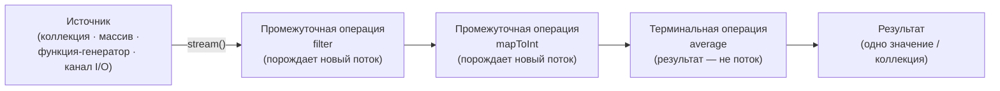

# Урок 3. Агрегатные операции (потоки)

**Трейл:** Collections · **Оригинал:** [Aggregate Operations](https://docs.oracle.com/javase/tutorial/collections/streams/index.html)
**Связанные области:** [[08-functional-streams]] · **Вопросы:** functional-streams

> Перевод официального руководства Oracle (The Java Tutorials, JDK 8). Объединяет
> страницу-индекс урока *Aggregate Operations* (разделы *Pipelines and Streams* и
> *Differences Between Aggregate Operations and Iterators*) со страницами *Reduction*,
> *Parallelism* (с подразделами *Executing Streams in Parallel*, *Concurrent Reduction*,
> *Ordering*, *Side Effects* — *Laziness*, *Interference*, *Stateful Lambda Expressions*)
> и *Questions and Exercises*.

> **Примечание Oracle.** Эти руководства написаны для JDK 8. Примеры и приёмы, описанные
> здесь, не учитывают улучшения, появившиеся в более поздних выпусках, и могут использовать
> технологии, которые уже недоступны. Актуальные руководства см. на [Dev.java](https://dev.java/learn/).

Зачем вообще нужны коллекции? Объекты не просто хранят в коллекции и оставляют там навсегда.
В большинстве случаев коллекция нужна, чтобы извлекать хранящиеся в ней элементы и что-то с
ними делать. В этом уроке показано, как обрабатывать элементы коллекции с помощью
**агрегатных операций** (*aggregate operations*) — потоковых операций над данными, опирающихся
на лямбда-выражения (*lambda expressions*).

Рассмотрим коллекцию `roster` (список людей). Следующий пример выводит имена всех её участников
с помощью агрегатной операции `forEach`:

```java
roster
    .stream()
    .forEach(e -> System.out.println(e.getName()));
```

## Конвейеры и потоки (Pipelines and Streams)

**Конвейер** (*pipeline*) — это последовательность агрегатных операций. Конвейер состоит из
следующих компонентов:

- **Источник** (*source*). Это может быть коллекция, массив, функция-генератор или канал
  ввода-вывода (I/O channel).
- **Ноль или более промежуточных операций** (*intermediate operations*). Промежуточная операция,
  например `filter`, порождает новый поток.
- **Терминальная (завершающая) операция** (*terminal operation*). Терминальная операция,
  например `forEach`, даёт результат, не являющийся потоком.

**Поток** (*stream*) — это последовательность элементов. В отличие от коллекции, поток не является
структурой данных, которая хранит элементы: поток переносит значения от источника через конвейер
операций.

Следующий пример выводит имена участников мужского пола из коллекции `roster`. Он строит конвейер
из операции-источника `stream`, промежуточной операции `filter` и терминальной операции `forEach`:

```java
roster
    .stream()
    .filter(e -> e.getGender() == Person.Sex.MALE)
    .forEach(e -> System.out.println(e.getName()));
```

Сравните этот пример с выводом всех участников через цикл `for-each`: вместо того чтобы перебирать
элементы коллекции вручную, вы описываете конвейер агрегатных операций.

Следующий конвейер вычисляет средний возраст всех участников мужского пола. Он использует
операцию-источник `stream`, промежуточные операции `filter` и `mapToInt`, а также терминальную
операцию `average`:

```java
double average = roster
    .stream()
    .filter(p -> p.getGender() == Person.Sex.MALE)
    .mapToInt(Person::getAge)
    .average()
    .getAsDouble();
```

### Схема конвейера потока



## Отличия агрегатных операций от итераторов

Агрегатные операции (например, `forEach`) на первый взгляд похожи на итераторы. Однако между
ними есть несколько принципиальных отличий.

1. **Они используют внутреннюю итерацию** (*internal iteration*). У агрегатных операций нет
   метода вроде `next`, которым их явно просят перейти к следующему элементу коллекции.
   При **внешней итерации** (*external iteration*) — то есть с помощью цикла `for-each` или
   итератора — ваше приложение само определяет *как* перебирать элементы. При внутренней итерации
   приложение задаёт *что* делать с элементами, а реализация JDK сама определяет *как* их
   перебирать. Это, в частности, открывает возможность параллельной обработки.

2. **Они обрабатывают элементы из потока** (*from a stream*). Агрегатные операции работают с
   элементами потока, а не напрямую с коллекцией. Поэтому они называются также потоковыми
   операциями (*stream operations*).

3. **Они принимают поведение как параметр** (*behavior as parameters*). Для большинства
   агрегатных операций вы можете задавать лямбда-выражения в качестве параметров — то есть
   настраивать поведение операции под свою задачу.

## Свёртка (Reduction)

В разделе «Конвейеры и потоки» описан конвейер, вычисляющий средний возраст всех участников
мужского пола в коллекции `roster`:

```java
double average = roster
    .stream()
    .filter(p -> p.getGender() == Person.Sex.MALE)
    .mapToInt(Person::getAge)
    .average()
    .getAsDouble();
```

В JDK есть множество терминальных операций (например, `average`, `sum`, `min`, `max`, `count`),
которые возвращают одно значение, комбинируя содержимое потока. Такие операции называются
**операциями свёртки** (*reduction operations*). В JDK есть и операции свёртки, которые возвращают
не одно значение, а коллекцию. Многие операции свёртки выполняют конкретную задачу — например,
находят среднее значений или группируют элементы по категориям. Однако JDK предоставляет и
**универсальные операции свёртки** `reduce` и `collect`, которые подробно описаны ниже.

### Метод Stream.reduce

Метод `Stream.reduce` — это универсальная операция свёртки. Рассмотрим следующий конвейер,
вычисляющий сумму возрастов участников мужского пола в коллекции `roster`. Он использует
операцию свёртки `sum`:

```java
Integer totalAge = roster
    .stream()
    .mapToInt(Person::getAge)
    .sum();
```

Сравните его со следующим конвейером, который вычисляет то же значение через операцию
`Stream.reduce`:

```java
Integer totalAgeReduce = roster
   .stream()
   .map(Person::getAge)
   .reduce(
       0,
       (a, b) -> a + b);
```

Операция `reduce` в этом примере принимает два аргумента:

- **`identity`** (нейтральный элемент). Нейтральный элемент — это одновременно начальное значение
  свёртки и результат по умолчанию, если в потоке нет ни одного элемента. В этом примере
  нейтральный элемент равен `0`: это начальное значение суммы возрастов и значение по умолчанию,
  если в коллекции `roster` нет участников.
- **`accumulator`** (аккумулятор). Функция-аккумулятор принимает два параметра: частичный
  результат свёртки (в этом примере — сумма всех уже обработанных целых чисел) и следующий элемент
  потока (в этом примере — целое число). Она возвращает новый частичный результат. Здесь
  аккумулятор — это лямбда-выражение, которое складывает два значения `Integer` и возвращает
  значение `Integer`:

```java
(a, b) -> a + b
```

Операция `reduce` всегда возвращает новое значение. Но и функция-аккумулятор тоже возвращает новое
значение при каждой обработке элемента потока. Предположим, вы хотите свернуть элементы потока в
более сложный объект — например, в коллекцию. Это может снизить производительность приложения.
Если ваша операция `reduce` добавляет элементы в коллекцию, то при каждой обработке элемента
функция-аккумулятор создаёт новую коллекцию, включающую этот элемент, что неэффективно. Эффективнее
обновлять уже существующую коллекцию. Это можно сделать методом `Stream.collect`, описанным в
следующем разделе.

### Метод Stream.collect

В отличие от метода `reduce`, который при обработке элемента всегда создаёт новое значение, метод
`collect` изменяет (мутирует) уже существующее значение.

Подумайте, как найти среднее значений в потоке. Вам нужны два фрагмента данных: общее количество
значений и их сумма. Однако, как и `reduce` и все прочие методы свёртки, метод `collect` возвращает
лишь одно значение. Можно создать новый тип данных с полями-членами, которые отслеживают общее
количество значений и их сумму, например такой класс `Averager`:

```java
class Averager implements IntConsumer
{
    private int total = 0;
    private int count = 0;
        
    public double average() {
        return count > 0 ? ((double) total)/count : 0;
    }
        
    public void accept(int i) { total += i; count++; }
    public void combine(Averager other) {
        total += other.total;
        count += other.count;
    }
}
```

Следующий конвейер использует класс `Averager` и метод `collect`, чтобы вычислить средний возраст
всех участников мужского пола:

```java
Averager averageCollect = roster.stream()
    .filter(p -> p.getGender() == Person.Sex.MALE)
    .map(Person::getAge)
    .collect(Averager::new, Averager::accept, Averager::combine);
                   
System.out.println("Average age of male members: " +
    averageCollect.average());
```

Операция `collect` в этом примере принимает три аргумента:

- **`supplier`** (поставщик). Поставщик — это функция-фабрика: она конструирует новые экземпляры.
  Для операции `collect` он создаёт экземпляры контейнера-результата. В этом примере это новый
  экземпляр класса `Averager`.
- **`accumulator`** (аккумулятор). Функция-аккумулятор включает элемент потока в контейнер-результат.
  В этом примере она изменяет контейнер `Averager`, увеличивая на единицу поле `count` и добавляя к
  полю `total` значение элемента потока — целое число, представляющее возраст участника мужского пола.
- **`combiner`** (объединитель). Функция-объединитель принимает два контейнера-результата и сливает
  их содержимое. В этом примере она изменяет контейнер `Averager`, увеличивая поле `count` на
  значение поля `count` другого экземпляра `Averager` и добавляя к полю `total` значение поля
  `total` другого экземпляра `Averager`.

Обратите внимание:

- Поставщик — это лямбда-выражение (или ссылка на метод), а не значение, как нейтральный элемент в
  операции `reduce`.
- Функции аккумулятора и объединителя не возвращают значения.
- Операции `collect` можно использовать с параллельными потоками; подробнее см. раздел
  «Параллелизм». (Если вы запускаете метод `collect` с параллельным потоком, то JDK создаёт новый
  поток выполнения всякий раз, когда функция-объединитель создаёт новый объект — например, объект
  `Averager` в этом примере. Поэтому о синхронизации заботиться не нужно.)

Хотя JDK предоставляет операцию `average` для вычисления среднего значения элементов потока, вы
можете воспользоваться операцией `collect` и собственным классом, если вам нужно вычислить из
элементов потока сразу несколько значений.

Операция `collect` лучше всего подходит для коллекций. В следующем примере имена участников
мужского пола помещаются в коллекцию с помощью операции `collect`:

```java
List<String> namesOfMaleMembersCollect = roster
    .stream()
    .filter(p -> p.getGender() == Person.Sex.MALE)
    .map(p -> p.getName())
    .collect(Collectors.toList());
```

Эта версия операции `collect` принимает один параметр типа `Collector`. Класс `Collector`
инкапсулирует функции, которые в версии операции `collect` с тремя аргументами передавались
как поставщик, аккумулятор и объединитель.

Класс `Collectors` содержит множество полезных операций свёртки — например, накопление элементов в
коллекции и сведение элементов по различным критериям. Эти операции свёртки возвращают экземпляры
класса `Collector`, поэтому их можно использовать как параметр операции `collect`.

В этом примере применяется операция `Collectors.toList`, которая накапливает элементы потока в
новый экземпляр `List`. Как и большинство операций класса `Collectors`, операция `toList` возвращает
экземпляр `Collector`, а не саму коллекцию.

Следующий пример группирует участников коллекции `roster` по полу:

```java
Map<Person.Sex, List<Person>> byGender =
    roster
        .stream()
        .collect(
            Collectors.groupingBy(Person::getGender));
```

Операция `groupingBy` возвращает отображение (map), ключами которого служат значения, полученные
применением лямбда-выражения, заданного как её параметр (это лямбда-выражение называется
**классифицирующей функцией**, *classification function*). В этом примере возвращаемое отображение
содержит два ключа — `Person.Sex.MALE` и `Person.Sex.FEMALE`. Соответствующие ключам значения —
это экземпляры `List`, содержащие те элементы потока, которые при обработке классифицирующей
функцией дают значение этого ключа. Например, значение для ключа `Person.Sex.MALE` — это экземпляр
`List`, содержащий всех участников мужского пола.

Следующий пример извлекает имена участников коллекции `roster` и группирует их по полу:

```java
Map<Person.Sex, List<String>> namesByGender =
    roster
        .stream()
        .collect(
            Collectors.groupingBy(
                Person::getGender,                      
                Collectors.mapping(
                    Person::getName,
                    Collectors.toList())));
```

Операция `groupingBy` в этом примере принимает два параметра — классифицирующую функцию и экземпляр
`Collector`. Параметр типа `Collector` называется **нижестоящим коллектором** (*downstream
collector*). Это коллектор, который среда выполнения Java применяет к результатам другого коллектора.
Таким образом, эта операция `groupingBy` позволяет применить метод `collect` к значениям-`List`,
созданным операцией `groupingBy`. В этом примере применяется коллектор `mapping`, который применяет
отображающую функцию `Person::getName` к каждому элементу потока. В результате итоговый поток
состоит только из имён участников. Конвейер, содержащий один или несколько нижестоящих коллекторов
(как этот пример), называется **многоуровневой свёрткой** (*multilevel reduction*).

Следующий пример извлекает суммарный возраст участников каждого пола:

```java
Map<Person.Sex, Integer> totalAgeByGender =
    roster
        .stream()
        .collect(
            Collectors.groupingBy(
                Person::getGender,                      
                Collectors.reducing(
                    0,
                    Person::getAge,
                    Integer::sum)));
```

Операция `reducing` принимает три параметра:

- **`identity`** (нейтральный элемент). Как и в операции `Stream.reduce`, нейтральный элемент —
  это одновременно начальное значение свёртки и результат по умолчанию, если в потоке нет элементов.
  В этом примере нейтральный элемент равен `0`: это начальное значение суммы возрастов и значение по
  умолчанию, если участников нет.
- **`mapper`** (отображающая функция). Операция `reducing` применяет эту функцию ко всем элементам
  потока. В этом примере отображающая функция извлекает возраст каждого участника.
- **`operation`** (операция). Функция-операция используется для свёртки отображённых значений. В
  этом примере функция-операция складывает значения `Integer`.

Следующий пример извлекает средний возраст участников каждого пола:

```java
Map<Person.Sex, Double> averageAgeByGender = roster
    .stream()
    .collect(
        Collectors.groupingBy(
            Person::getGender,                      
            Collectors.averagingInt(Person::getAge)));
```

## Параллелизм (Parallelism)

**Параллельные вычисления** (*parallel computing*) подразумевают разбиение задачи на подзадачи,
их одновременное (параллельное, в отдельных потоках выполнения) решение и последующее объединение
результатов решения подзадач. В Java SE есть **фреймворк fork/join**, который облегчает реализацию
параллельных вычислений в приложениях. Однако при работе с ним вы должны сами указать, как задача
разбивается (партиционируется). С агрегатными операциями разбиение задачи и объединение результатов
среда выполнения Java делает за вас.

Одна из трудностей реализации параллелизма в приложениях, работающих с коллекциями, состоит в том,
что коллекции не потокобезопасны (*thread-safe*): несколько потоков не могут манипулировать
коллекцией, не порождая **интерференцию потоков** (*thread interference*) или **ошибки
согласованности памяти** (*memory consistency errors*). Collections Framework предоставляет
**синхронизирующие обёртки** (*synchronization wrappers*), которые добавляют автоматическую
синхронизацию к произвольной коллекции, делая её потокобезопасной. Однако синхронизация порождает
**конкуренцию за потоки** (*thread contention*). Конкуренции желательно избегать, поскольку она
мешает потокам работать параллельно. Агрегатные операции и параллельные потоки позволяют реализовать
параллелизм с непотокобезопасными коллекциями — при условии, что вы не изменяете коллекцию во время
работы с ней.

Учтите, что параллелизм не обязательно быстрее последовательной обработки, хотя может быть быстрее,
если данных и процессорных ядер достаточно. Хотя агрегатные операции облегчают реализацию
параллелизма, определять, подходит ли ваше приложение для параллелизма, по-прежнему ваша задача.

### Параллельное выполнение потоков (Executing Streams in Parallel)

Потоки можно выполнять последовательно или параллельно. Когда поток выполняется параллельно, среда
выполнения Java разбивает его на несколько подпотоков (substreams). Агрегатные операции перебирают
и обрабатывают эти подпотоки параллельно, а затем объединяют результаты.

Если не указано иное, создаваемый поток всегда последовательный. Чтобы создать параллельный поток,
вызовите операцию `Collection.parallelStream`. Либо вызовите операцию `BaseStream.parallel`.
Например, следующая инструкция вычисляет средний возраст всех участников мужского пола параллельно:

```java
double average = roster
    .parallelStream()
    .filter(p -> p.getGender() == Person.Sex.MALE)
    .mapToInt(Person::getAge)
    .average()
    .getAsDouble();
```

### Конкурентная свёртка (Concurrent Reduction)

Рассмотрим ещё раз пример (описанный в разделе «Свёртка»), который группирует участников по полу.
Он вызывает операцию `collect`, сворачивающую коллекцию `roster` в `Map`:

```java
Map<Person.Sex, List<Person>> byGender =
    roster
        .stream()
        .collect(
            Collectors.groupingBy(Person::getGender));
```

Ниже — его параллельный эквивалент:

```java
ConcurrentMap<Person.Sex, List<Person>> byGender =
    roster
        .parallelStream()
        .collect(
            Collectors.groupingByConcurrent(Person::getGender));
```

Это называется **конкурентной свёрткой** (*concurrent reduction*). Среда выполнения Java выполняет
конкурентную свёртку, если для конкретного конвейера, содержащего операцию `collect`, истинны все
следующие условия:

- Поток параллельный.
- Параметр операции `collect` — коллектор — обладает характеристикой
  `Collector.Characteristics.CONCURRENT`. Чтобы определить характеристики коллектора, вызовите
  метод `Collector.characteristics`.
- Либо поток неупорядочен, либо коллектор обладает характеристикой
  `Collector.Characteristics.UNORDERED`. Чтобы гарантировать неупорядоченность потока, вызовите
  операцию `BaseStream.unordered`.

> **Примечание.** Этот пример возвращает экземпляр `ConcurrentMap` вместо `Map` и вызывает операцию
> `groupingByConcurrent` вместо `groupingBy`. В отличие от операции `groupingByConcurrent`, операция
> `groupingBy` плохо работает с параллельными потоками. (Дело в том, что она работает, сливая два
> отображения по ключу, а это вычислительно дорого.) Аналогично, операция
> `Collectors.toConcurrentMap` работает с параллельными потоками лучше, чем операция
> `Collectors.toMap`.

### Порядок обработки (Ordering)

Порядок, в котором конвейер обрабатывает элементы потока, зависит от того, выполняется ли поток
последовательно или параллельно, от источника потока и от промежуточных операций. Например,
рассмотрим пример, который несколько раз выводит элементы экземпляра `ArrayList` операцией `forEach`:

```java
Integer[] intArray = {1, 2, 3, 4, 5, 6, 7, 8 };
List<Integer> listOfIntegers =
    new ArrayList<>(Arrays.asList(intArray));

System.out.println("listOfIntegers:");
listOfIntegers
    .stream()
    .forEach(e -> System.out.print(e + " "));
System.out.println("");

System.out.println("listOfIntegers sorted in reverse order:");
Comparator<Integer> normal = Integer::compare;
Comparator<Integer> reversed = normal.reversed(); 
Collections.sort(listOfIntegers, reversed);  
listOfIntegers
    .stream()
    .forEach(e -> System.out.print(e + " "));
System.out.println("");
     
System.out.println("Parallel stream");
listOfIntegers
    .parallelStream()
    .forEach(e -> System.out.print(e + " "));
System.out.println("");
    
System.out.println("Another parallel stream:");
listOfIntegers
    .parallelStream()
    .forEach(e -> System.out.print(e + " "));
System.out.println("");
     
System.out.println("With forEachOrdered:");
listOfIntegers
    .parallelStream()
    .forEachOrdered(e -> System.out.print(e + " "));
System.out.println("");
```

Пример состоит из пяти конвейеров. Он выводит примерно следующее:

```
listOfIntegers:
1 2 3 4 5 6 7 8
listOfIntegers sorted in reverse order:
8 7 6 5 4 3 2 1
Parallel stream:
3 4 1 6 2 5 7 8
Another parallel stream:
6 3 1 5 7 8 4 2
With forEachOrdered:
8 7 6 5 4 3 2 1
```

Этот пример делает следующее:

- Первый конвейер выводит элементы списка `listOfIntegers` в том порядке, в котором они были в него
  добавлены.
- Второй конвейер выводит элементы `listOfIntegers` после сортировки методом `Collections.sort`.
- Третий и четвёртый конвейеры выводят элементы списка в, по-видимому, случайном порядке. Помните,
  что потоковые операции при обработке элементов используют внутреннюю итерацию. Поэтому при
  параллельном выполнении потока компилятор и среда выполнения Java сами определяют порядок обработки
  элементов, чтобы максимально использовать преимущества параллельных вычислений, если только
  операция потока не задаёт иное.
- Пятый конвейер использует метод `forEachOrdered`, который обрабатывает элементы потока в порядке,
  заданном его источником, независимо от того, выполняется ли поток последовательно или параллельно.
  Учтите, что при использовании операций вроде `forEachOrdered` с параллельными потоками вы можете
  потерять преимущества параллелизма.

### Побочные эффекты (Side Effects)

Метод или выражение имеет **побочный эффект** (*side effect*), если, помимо возврата или порождения
значения, он также изменяет состояние компьютера. Примеры — мутирующие свёртки (операции,
использующие `collect`; см. раздел «Свёртка»), а также вызов метода `System.out.println` для отладки.
JDK хорошо справляется с некоторыми побочными эффектами в конвейерах. В частности, метод `collect`
спроектирован так, чтобы выполнять наиболее распространённые потоковые операции с побочными эффектами
безопасным для параллелизма образом. Операции вроде `forEach` и `peek` предназначены для побочных
эффектов: лямбда-выражение, возвращающее `void` (например, вызывающее `System.out.println`), не может
делать ничего, кроме побочных эффектов. Тем не менее операции `forEach` и `peek` следует применять
с осторожностью: если использовать одну из них с параллельным потоком, среда выполнения Java может
вызывать заданное вами лямбда-выражение конкурентно из нескольких потоков. Кроме того, никогда не
передавайте лямбда-выражения с побочными эффектами в качестве параметров таким операциям, как
`filter` и `map`. В следующих разделах обсуждаются **интерференция** и **лямбда-выражения с
состоянием** — оба явления могут быть источником побочных эффектов и приводить к противоречивым или
непредсказуемым результатам, особенно в параллельных потоках. Но сначала рассматривается понятие
**ленивости**, поскольку оно напрямую влияет на интерференцию.

#### Ленивость (Laziness)

Все промежуточные операции **ленивы** (*lazy*). Выражение, метод или алгоритм ленивы, если их
значение вычисляется только тогда, когда оно требуется. (Алгоритм **энергичен** (*eager*), если он
вычисляется или обрабатывается немедленно.) Промежуточные операции ленивы потому, что не начинают
обрабатывать содержимое потока, пока не запущена терминальная операция. Ленивая обработка потоков
позволяет компилятору и среде выполнения Java оптимизировать обработку. Например, в конвейере вроде
`filter`-`mapToInt`-`average` операция `average` может получить первые несколько целых чисел из
потока, созданного операцией `mapToInt`, которая, в свою очередь, получает элементы из операции
`filter`. Операция `average` повторяет этот процесс, пока не получит из потока все нужные элементы,
а затем вычисляет среднее.

#### Интерференция (Interference)

Лямбда-выражения в потоковых операциях не должны **интерферировать** (*interfere*). Интерференция
возникает, когда источник потока изменяется во время того, как конвейер обрабатывает поток. Например,
следующий код пытается соединить строки, содержащиеся в `List` `listOfStrings`. Однако он
выбрасывает `ConcurrentModificationException`:

```java
try {
    List<String> listOfStrings =
        new ArrayList<>(Arrays.asList("one", "two"));
         
    // Это завершится ошибкой: операция peek попытается добавить
    // строку "three" в источник уже после того, как началась
    // терминальная операция.
             
    String concatenatedString = listOfStrings
        .stream()
        
        // Так делать нельзя! Здесь возникает интерференция.
        .peek(s -> listOfStrings.add("three"))
        
        .reduce((a, b) -> a + " " + b)
        .get();
                 
    System.out.println("Concatenated string: " + concatenatedString);
         
} catch (Exception e) {
    System.out.println("Exception caught: " + e.toString());
}
```

Этот пример соединяет строки из `listOfStrings` в значение `Optional<String>` с помощью операции
`reduce`, которая является терминальной. Однако конвейер здесь вызывает промежуточную операцию
`peek`, которая пытается добавить новый элемент в `listOfStrings`. Помните: все промежуточные
операции ленивы. Это значит, что конвейер в этом примере начинает выполнение при вызове операции
`get` и завершает выполнение, когда операция `get` завершается. Аргумент операции `peek` пытается
изменить источник потока во время выполнения конвейера, из-за чего среда выполнения Java выбрасывает
`ConcurrentModificationException`.

#### Лямбда-выражения с состоянием (Stateful Lambda Expressions)

Избегайте использования **лямбда-выражений с состоянием** (*stateful lambda expressions*) в качестве
параметров потоковых операций. Лямбда-выражение с состоянием — это выражение, результат которого
зависит от какого-либо состояния, способного измениться во время выполнения конвейера. Следующий
пример добавляет элементы из `List` `listOfIntegers` в новый экземпляр `List` с помощью промежуточной
операции `map`. Он делает это дважды: сначала с последовательным потоком, затем с параллельным:

```java
List<Integer> serialStorage = new ArrayList<>();
     
System.out.println("Serial stream:");
listOfIntegers
    .stream()
    
    // Так делать нельзя! Используется лямбда-выражение с состоянием.
    .map(e -> { serialStorage.add(e); return e; })
    
    .forEachOrdered(e -> System.out.print(e + " "));
System.out.println("");
     
serialStorage
    .stream()
    .forEachOrdered(e -> System.out.print(e + " "));
System.out.println("");

System.out.println("Parallel stream:");
List<Integer> parallelStorage = Collections.synchronizedList(
    new ArrayList<>());
listOfIntegers
    .parallelStream()
    
    // Так делать нельзя! Используется лямбда-выражение с состоянием.
    .map(e -> { parallelStorage.add(e); return e; })
    
    .forEachOrdered(e -> System.out.print(e + " "));
System.out.println("");
     
parallelStorage
    .stream()
    .forEachOrdered(e -> System.out.print(e + " "));
System.out.println("");
```

Лямбда-выражение `e -> { parallelStorage.add(e); return e; }` — это лямбда-выражение с состоянием.
Его результат может меняться при каждом запуске кода. Этот пример выводит следующее:

```
Serial stream:
8 7 6 5 4 3 2 1
8 7 6 5 4 3 2 1
Parallel stream:
8 7 6 5 4 3 2 1
1 3 6 2 4 5 8 7
```

Операция `forEachOrdered` обрабатывает элементы в порядке, заданном потоком, независимо от того,
выполняется ли поток последовательно или параллельно. Однако при параллельном выполнении потока
операция `map` обрабатывает элементы потока в порядке, заданном средой выполнения и компилятором
Java. Поэтому порядок, в котором лямбда-выражение `e -> { parallelStorage.add(e); return e; }`
добавляет элементы в `List` `parallelStorage`, может меняться при каждом запуске. Чтобы результаты
были детерминированными и предсказуемыми, следите за тем, чтобы лямбда-выражения-параметры потоковых
операций не имели состояния.

> **Примечание.** Этот пример вызывает метод `synchronizedList`, чтобы `List` `parallelStorage` был
> потокобезопасным. Помните, что коллекции не потокобезопасны: несколько потоков не должны
> обращаться к одной коллекции одновременно. Предположим, вы не вызвали метод `synchronizedList`
> при создании `parallelStorage`:
>
> ```java
> List<Integer> parallelStorage = new ArrayList<>();
> ```
>
> Тогда пример ведёт себя непредсказуемо, потому что несколько потоков обращаются к `parallelStorage`
> и изменяют его без механизма (вроде синхронизации), который планировал бы, когда конкретный поток
> может обращаться к экземпляру `List`. В результате пример мог бы вывести нечто подобное:
>
> ```
> Parallel stream:
> 8 7 6 5 4 3 2 1
> null 3 5 4 7 8 1 2
> ```

## Вопросы и упражнения (Questions and Exercises)

### Вопросы

1. Последовательность агрегатных операций называется **___**.
2. Каждый конвейер содержит ноль или более операций **___**.
3. Каждый конвейер завершается операцией **___**.
4. Какой вид операции выдаёт на выходе другой поток?
5. Опишите одно отличие агрегатной операции `forEach` от расширенного оператора `for` (for-each)
   или итераторов.
6. Верно или неверно: поток (stream) похож на коллекцию тем, что является структурой данных,
   хранящей элементы.
7. Определите промежуточные и терминальные операции в этом коде:

   ```java
   double average = roster
       .stream()
       .filter(p -> p.getGender() == Person.Sex.MALE)
       .mapToInt(Person::getAge)
       .average()
       .getAsDouble();
   ```

8. Код `p -> p.getGender() == Person.Sex.MALE` — пример чего?
9. Код `Person::getAge` — пример чего?
10. Как называются терминальные операции, которые комбинируют содержимое потока и возвращают одно
    значение?
11. Назовите одно важное отличие метода `Stream.reduce` от метода `Stream.collect`.
12. Если бы вам нужно было обработать поток имён, выделить мужские имена и сохранить их в новом
    `List`, какая операция подошла бы лучше — `Stream.reduce` или `Stream.collect`?
13. Верно или неверно: агрегатные операции позволяют реализовать параллелизм с непотокобезопасными
    коллекциями.
14. Потоки по умолчанию последовательны, если не указано иное. Как запросить параллельную обработку
    потока?

### Упражнения

1. Перепишите следующий расширенный оператор `for` как конвейер с лямбда-выражениями. Подсказка:
   используйте промежуточную операцию `filter` и терминальную операцию `forEach`.

   ```java
   for (Person p : roster) {
       if (p.getGender() == Person.Sex.MALE) {
           System.out.println(p.getName());
       }
   }
   ```

2. Преобразуйте следующий код в новую реализацию, использующую лямбда-выражения и агрегатные операции
   вместо вложенных циклов `for`. Подсказка: постройте конвейер, который вызывает операции `filter`,
   `sorted` и `collect` именно в этом порядке.

   ```java
   List<Album> favs = new ArrayList<>();
   for (Album a : albums) {
       boolean hasFavorite = false;
       for (Track t : a.tracks) {
           if (t.rating >= 4) {
               hasFavorite = true;
               break;
           }
       }
       if (hasFavorite)
           favs.add(a);
   }
   Collections.sort(favs, new Comparator<Album>() {
                              public int compare(Album a1, Album a2) {
                                  return a1.name.compareTo(a2.name);
                              }});
   ```

## Источник

- [Lesson: Aggregate Operations (index — Pipelines and Streams, Differences Between Aggregate Operations and Iterators)](https://docs.oracle.com/javase/tutorial/collections/streams/index.html) — официальное руководство Oracle.
- [Reduction](https://docs.oracle.com/javase/tutorial/collections/streams/reduction.html) — официальное руководство Oracle.
- [Parallelism (Executing Streams in Parallel, Concurrent Reduction, Ordering, Side Effects — Laziness, Interference, Stateful Lambda Expressions)](https://docs.oracle.com/javase/tutorial/collections/streams/parallelism.html) — официальное руководство Oracle.
- [Questions and Exercises: Aggregate Operations](https://docs.oracle.com/javase/tutorial/collections/streams/QandE/questions.html) — официальное руководство Oracle.
