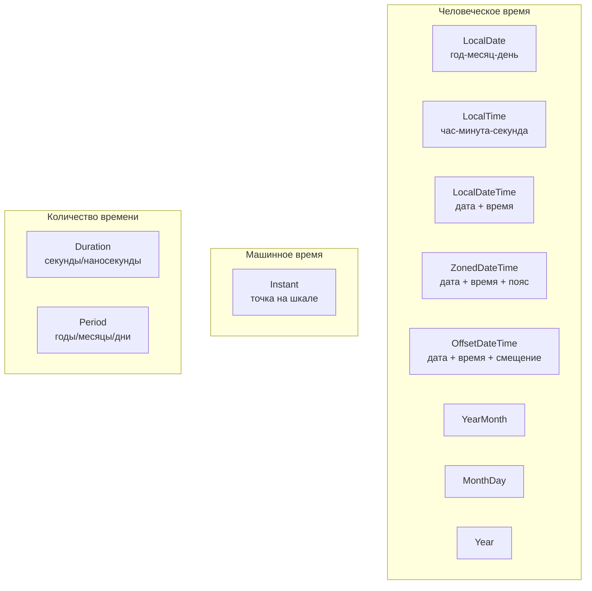
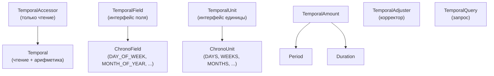

# Урок 2. Стандартный календарь

**Трейл:** Date-Time APIs · **Оригинал:** [Standard Calendar](https://docs.oracle.com/javase/tutorial/datetime/iso/index.html)
**Связанные области:** [[09-modern-java-features]] · **Вопросы:** modern-java

> Перевод официального руководства Oracle (The Java Tutorials, JDK 8). Объединяет страницы урока
> *Standard Calendar*: обзор (*Overview*), перечисления дня недели и месяца, классы дат, классы
> даты и времени, классы часовых поясов и смещений, класс `Instant`, разбор и форматирование,
> пакет `java.time.temporal` (включая корректоры и запросы), `Period` и `Duration`, а также `Clock`.

Ядро Date-Time API — пакет [`java.time`](https://docs.oracle.com/javase/8/docs/api/java/time/package-summary.html).
Классы, определённые в `java.time`, строят свою календарную систему на основе **ISO-календаря**
(*ISO calendar*) — мирового стандарта представления даты и времени. ISO-календарь следует правилам
**пролептического григорианского** (*proleptic Gregorian*) календаря. Григорианский календарь был
введён в 1582 году; в *пролептическом* григорианском календаре даты продлеваются назад до этого
момента, чтобы создать единую непрерывную шкалу времени и упростить вычисления с датами.

Урок состоит из следующих подтем:

- [Обзор](#обзор-overview) — сравнение человеческого и машинного времени, таблица основных
  темпоральных классов пакета `java.time`.
- [Перечисления DayOfWeek и Month](#перечисления-dayofweek-и-month) — перечисление дней недели и
  перечисление месяцев.
- [Классы дат](#классы-дат) — `LocalDate`, `YearMonth`, `MonthDay`, `Year`.
- [Классы даты и времени](#классы-даты-и-времени) — `LocalTime` и `LocalDateTime`.
- [Классы часовых поясов и смещений](#классы-часовых-поясов-и-смещений) — `ZonedDateTime`,
  `OffsetDateTime`, `OffsetTime`, `ZoneId`, `ZoneRules`, `ZoneOffset`.
- [Класс Instant](#класс-instant) — мгновение на шкале времени.
- [Разбор и форматирование](#разбор-и-форматирование) — `DateTimeFormatter`.
- [Пакет Temporal](#пакет-temporal) — поля, единицы, корректоры (*temporal adjuster*) и запросы
  (*temporal query*).
- [Period и Duration](#period-и-duration) — вычисление количества времени.
- [Clock](#clock) — альтернативные часы.

> Примечание. Преобразование дат в неISO-календари (*Non-ISO Date Conversion*), работа с устаревшим
> кодом дат-времени (*Legacy Date-Time Code*) и итоговый раздел (*Summary*) — это отдельные уроки
> данного трейла и в перевод выше не входят.

## Обзор (Overview)

Существует два базовых способа представления времени. Первый представляет время в человеческих
терминах — **человеческое время** (*human time*): год, месяц, день, час, минута и секунда. Второй
способ — **машинное время** (*machine time*) — измеряет время непрерывно вдоль шкалы от начала
отсчёта, называемого **эпохой** (*epoch*), с наносекундным разрешением. Пакет Date-Time
предоставляет богатый набор классов для представления даты и времени. Одни классы Date-Time API
предназначены для машинного времени, другие лучше подходят для человеческого.

Сначала определите, какие аспекты даты и времени вам нужны, а затем выберите класс (или классы),
который их обеспечивает. Выбирая темпоральный класс, прежде всего решите, нужно ли вам
представлять человеческое или машинное время. Затем определите, какие именно аспекты времени вам
нужны. Нужен ли часовой пояс? Дата *и* время? Только дата? Если нужна дата, требуется ли месяц,
день *и* год — или подмножество этого?

> **Терминология.** Классы Date-Time API, которые захватывают и работают со значениями даты или
> времени (например, `Instant`, `LocalDateTime` и `ZonedDateTime`), на протяжении всего руководства
> называются **темпоральными классами** (или типами; *temporal-based classes*). Вспомогательные типы,
> такие как интерфейс `TemporalAdjuster` или перечисление `DayOfWeek`, в это определение не входят.

Например, объект `LocalDate` можно использовать для представления даты рождения, ведь большинство
людей отмечают свой день рождения в один и тот же день — находятся ли они в родном городе или на
другом конце света за линией перемены дат. Если вы отслеживаете астрологическое время, то вам может
понадобиться объект `LocalDateTime` для представления даты и времени рождения или `ZonedDateTime`,
который дополнительно включает часовой пояс. Если же вы создаёте отметку времени (*time-stamp*), то,
скорее всего, понадобится `Instant`, позволяющий сравнивать одну мгновенную точку на шкале с другой.

Следующая таблица обобщает темпоральные классы пакета `java.time`, которые хранят информацию о дате
и/или времени или могут использоваться для измерения количества времени. Галочка в столбце означает,
что класс использует данный тип данных. Столбец **Вывод toString** показывает экземпляр,
напечатанный методом `toString`. Столбец **Где описан** ведёт на соответствующую страницу
руководства.

| Класс или перечисление | Год | Месяц | День | Часы | Мин. | Сек.* | Смещение пояса | ID пояса | Вывод toString | Где описан |
|---|:---:|:---:|:---:|:---:|:---:|:---:|:---:|:---:|---|---|
| `Instant` | | | | | | ✓ | | | `2013-08-20T15:16:26.355Z` | Класс Instant |
| `LocalDate` | ✓ | ✓ | ✓ | | | | | | `2013-08-20` | Классы дат |
| `LocalDateTime` | ✓ | ✓ | ✓ | ✓ | ✓ | ✓ | | | `2013-08-20T08:16:26.937` | Классы даты и времени |
| `ZonedDateTime` | ✓ | ✓ | ✓ | ✓ | ✓ | ✓ | ✓ | ✓ | `2013-08-21T00:16:26.941+09:00[Asia/Tokyo]` | Классы часовых поясов и смещений |
| `LocalTime` | | | | ✓ | ✓ | ✓ | | | `08:16:26.943` | Классы даты и времени |
| `MonthDay` | | ✓ | ✓ | | | | | | `--08-20` | Классы дат |
| `Year` | ✓ | | | | | | | | `2013` | Классы дат |
| `YearMonth` | ✓ | ✓ | | | | | | | `2013-08` | Классы дат |
| `Month` | | ✓ | | | | | | | `AUGUST` | Перечисления DayOfWeek и Month |
| `OffsetDateTime` | ✓ | ✓ | ✓ | ✓ | ✓ | ✓ | ✓ | | `2013-08-20T08:16:26.954-07:00` | Классы часовых поясов и смещений |
| `OffsetTime` | | | | ✓ | ✓ | ✓ | ✓ | | `08:16:26.957-07:00` | Классы часовых поясов и смещений |
| `Duration` | | | ** | ** | ** | ✓ | | | `PT20H` (20 часов) | Period и Duration |
| `Period` | ✓ | ✓ | ✓ | | | | | | `P10D` (10 дней) | Period и Duration |

\* Секунды захватываются с наносекундной точностью.

\*\* Класс `Duration` не хранит эти единицы напрямую, но предоставляет методы преобразования в дни,
часы и минуты.



## Перечисления DayOfWeek и Month

Date-Time API предоставляет перечисления для задания дней недели и месяцев года.

### DayOfWeek

Перечисление [`DayOfWeek`](https://docs.oracle.com/javase/8/docs/api/java/time/DayOfWeek.html)
состоит из семи констант, описывающих дни недели: от `MONDAY` до `SUNDAY`. Целочисленные значения
констант `DayOfWeek` лежат в диапазоне от 1 (понедельник) до 7 (воскресенье). Использование
определённых констант (`DayOfWeek.FRIDAY`) делает код более читаемым.

Это перечисление также предоставляет ряд методов, похожих на методы темпоральных классов. Например,
следующий код прибавляет 3 дня к «понедельнику» и печатает результат. Вывод — «THURSDAY»:

```java
System.out.printf("%s%n", DayOfWeek.MONDAY.plus(3));
```

С помощью метода
[`getDisplayName(TextStyle, Locale)`](https://docs.oracle.com/javase/8/docs/api/java/time/DayOfWeek.html#getDisplayName-java.time.format.TextStyle-java.util.Locale-)
можно получить строку для идентификации дня недели в локали пользователя. Перечисление
[`TextStyle`](https://docs.oracle.com/javase/8/docs/api/java/time/format/TextStyle.html) позволяет
указать, какую именно строку вы хотите отобразить: `FULL`, `NARROW` (обычно одна буква) или `SHORT`
(сокращение). Константы `STANDALONE` перечисления `TextStyle` используются в некоторых языках, где
вывод отличается, когда название используется как часть даты, и когда — само по себе. Следующий
пример печатает три основные формы `TextStyle` для «понедельника»:

```java
DayOfWeek dow = DayOfWeek.MONDAY;
Locale locale = Locale.getDefault();
System.out.println(dow.getDisplayName(TextStyle.FULL, locale));
System.out.println(dow.getDisplayName(TextStyle.NARROW, locale));
System.out.println(dow.getDisplayName(TextStyle.SHORT, locale));
```

Этот код для локали `en` даёт следующий вывод:

```
Monday
M
Mon
```

### Month

Перечисление [`Month`](https://docs.oracle.com/javase/8/docs/api/java/time/Month.html) включает
константы для двенадцати месяцев — от `JANUARY` до `DECEMBER`. Как и перечисление `DayOfWeek`,
перечисление `Month` строго типизировано, и целочисленное значение каждой константы соответствует
диапазону ISO от 1 (январь) до 12 (декабрь). Использование определённых констант (`Month.SEPTEMBER`)
делает код более читаемым.

Перечисление `Month` также включает ряд методов. Следующая строка кода использует метод `maxLength`,
чтобы напечатать максимально возможное число дней в феврале. Вывод — «29»:

```java
System.out.printf("%d%n", Month.FEBRUARY.maxLength());
```

Перечисление `Month` тоже реализует метод
[`getDisplayName(TextStyle, Locale)`](https://docs.oracle.com/javase/8/docs/api/java/time/Month.html#getDisplayName-java.time.format.TextStyle-java.util.Locale-)
для получения строки, идентифицирующей месяц в локали пользователя, с использованием заданного
`TextStyle`. Если конкретный `TextStyle` не определён, возвращается строка с числовым значением
константы. Следующий код печатает месяц «август» тремя основными текстовыми стилями:

```java
Month month = Month.AUGUST;
Locale locale = Locale.getDefault();
System.out.println(month.getDisplayName(TextStyle.FULL, locale));
System.out.println(month.getDisplayName(TextStyle.NARROW, locale));
System.out.println(month.getDisplayName(TextStyle.SHORT, locale));
```

Этот код для локали `en` даёт следующий вывод:

```
August
A
Aug
```

## Классы дат

Date-Time API предоставляет четыре класса, работающих исключительно с информацией о дате — без
учёта времени или часового пояса. Их назначение подсказывают сами имена: `LocalDate`, `YearMonth`,
`MonthDay` и `Year`.

### LocalDate

`LocalDate` представляет год-месяц-день в ISO-календаре и удобен для представления даты без времени.
`LocalDate` можно использовать для отслеживания значимого события, такого как дата рождения или дата
свадьбы. Следующие примеры используют методы `of` и `with` для создания экземпляров `LocalDate`:

```java
LocalDate date = LocalDate.of(2000, Month.NOVEMBER, 20);
LocalDate nextWed = date.with(TemporalAdjusters.next(DayOfWeek.WEDNESDAY));
```

Подробнее об интерфейсе `TemporalAdjuster` см. в подтеме [Корректор времени](#корректор-времени-temporal-adjuster).

Помимо обычных методов, класс `LocalDate` предлагает геттеры для получения сведений о заданной дате.
Метод `getDayOfWeek` возвращает день недели, на который приходится конкретная дата. Например,
следующая строка кода возвращает «MONDAY»:

```java
DayOfWeek dotw = LocalDate.of(2012, Month.JULY, 9).getDayOfWeek();
```

Следующий пример использует `TemporalAdjuster`, чтобы получить первую среду после указанной даты.

```java
LocalDate date = LocalDate.of(2000, Month.NOVEMBER, 20);
TemporalAdjuster adj = TemporalAdjusters.next(DayOfWeek.WEDNESDAY);
LocalDate nextWed = date.with(adj);
System.out.printf("For the date of %s, the next Wednesday is %s.%n",
                  date, nextWed);
```

Запуск кода даёт следующее:

```
For the date of 2000-11-20, the next Wednesday is 2000-11-22.
```

В подтеме [Period и Duration](#period-и-duration) также есть примеры с использованием класса
`LocalDate`.

### YearMonth

Класс `YearMonth` представляет месяц конкретного года. Следующий пример использует метод
`YearMonth.lengthOfMonth()`, чтобы определить число дней для нескольких сочетаний года и месяца.

```java
YearMonth date = YearMonth.now();
System.out.printf("%s: %d%n", date, date.lengthOfMonth());

YearMonth date2 = YearMonth.of(2010, Month.FEBRUARY);
System.out.printf("%s: %d%n", date2, date2.lengthOfMonth());

YearMonth date3 = YearMonth.of(2012, Month.FEBRUARY);
System.out.printf("%s: %d%n", date3, date3.lengthOfMonth());
```

Вывод этого кода выглядит примерно так:

```
2013-06: 30
2010-02: 28
2012-02: 29
```

### MonthDay

Класс `MonthDay` представляет день определённого месяца, например Новый год — 1 января.

Следующий пример использует метод `MonthDay.isValidYear`, чтобы определить, допустимо ли 29 февраля
для 2010 года. Вызов возвращает `false`, подтверждая, что 2010 год не високосный.

```java
MonthDay date = MonthDay.of(Month.FEBRUARY, 29);
boolean validLeapYear = date.isValidYear(2010);
```

### Year

Класс `Year` представляет год. Следующий пример использует метод `Year.isLeap`, чтобы определить,
является ли заданный год високосным. Вызов возвращает `true`, подтверждая, что 2012 год —
високосный.

```java
boolean validLeapYear = Year.of(2012).isLeap();
```

## Классы даты и времени

### LocalTime

Класс [`LocalTime`](https://docs.oracle.com/javase/8/docs/api/java/time/LocalTime.html) похож на
другие классы с префиксом `Local`, но работает только со временем. Этот класс удобен для
представления человеческого времени суток, такого как время сеансов в кино или время открытия и
закрытия местной библиотеки. Его также можно использовать для создания цифровых часов, как показано
в следующем примере:

```java
LocalTime thisSec;

for (;;) {
    thisSec = LocalTime.now();

    // реализация кода отображения оставлена читателю
    display(thisSec.getHour(), thisSec.getMinute(), thisSec.getSecond());
}
```

Класс `LocalTime` не хранит информацию о часовом поясе или летнем времени.

### LocalDateTime

Класс, который обрабатывает и дату, и время без часового пояса, —
[`LocalDateTime`](https://docs.oracle.com/javase/8/docs/api/java/time/LocalDateTime.html), один из
основных классов Date-Time API. Этот класс используется для представления даты (месяц-день-год)
вместе со временем (час-минута-секунда-наносекунда) и по сути является комбинацией `LocalDate` и
`LocalTime`. Его можно использовать для представления конкретного события, например первой гонки
финала Кубка Луи Виттона в серии претендентов Кубка Америки, которая началась в 13:10 17 августа
2013 года. Обратите внимание, что это означает 13:10 по местному времени. Чтобы включить часовой
пояс, нужно использовать `ZonedDateTime` или `OffsetDateTime`, как обсуждается в подтеме
[Классы часовых поясов и смещений](#классы-часовых-поясов-и-смещений).

Помимо метода `now`, который предоставляет каждый темпоральный класс, у класса `LocalDateTime`
есть различные методы `of` (или методы с префиксом `of`), создающие экземпляр `LocalDateTime`. Есть
метод `from`, преобразующий экземпляр из другого темпорального формата в экземпляр `LocalDateTime`.
Также есть методы для прибавления или вычитания часов, минут, дней, недель и месяцев. Следующий
пример показывает некоторые из них (выражения даты-времени выделены жирным в оригинале):

```java
System.out.printf("now: %s%n", LocalDateTime.now());

System.out.printf("Apr 15, 1994 @ 11:30am: %s%n",
                  LocalDateTime.of(1994, Month.APRIL, 15, 11, 30));

System.out.printf("now (from Instant): %s%n",
                  LocalDateTime.ofInstant(Instant.now(), ZoneId.systemDefault()));

System.out.printf("6 months from now: %s%n",
                  LocalDateTime.now().plusMonths(6));

System.out.printf("6 months ago: %s%n",
                  LocalDateTime.now().minusMonths(6));
```

Этот код производит вывод, похожий на следующий:

```
now: 2013-07-24T17:13:59.985
Apr 15, 1994 @ 11:30am: 1994-04-15T11:30
now (from Instant): 2013-07-24T17:14:00.479
6 months from now: 2014-01-24T17:14:00.480
6 months ago: 2013-01-24T17:14:00.481
```

## Классы часовых поясов и смещений

**Часовой пояс** (*time zone*) — это область Земли, где используется одно и то же стандартное время.
Каждый часовой пояс описывается идентификатором, обычно в формате *регион/город* (`Asia/Tokyo`), и
смещением (*offset*) от времени Гринвича/UTC. Например, смещение для Токио — `+09:00`.

### ZoneId и ZoneOffset

Date-Time API предоставляет два класса для задания часового пояса или смещения:

- `ZoneId` задаёт идентификатор часового пояса и предоставляет правила преобразования между
  `Instant` и `LocalDateTime`.
- `ZoneOffset` задаёт смещение часового пояса от времени Гринвича/UTC.

Смещения от времени Гринвича/UTC обычно определяются целым числом часов, но есть исключения.
Следующий код из примера `TimeZoneId` печатает список всех часовых поясов, использующих смещения от
Гринвича/UTC, не равные целому числу часов.

```java
Set<String> allZones = ZoneId.getAvailableZoneIds();
LocalDateTime dt = LocalDateTime.now();

// Создаём List из множества поясов и сортируем его.
List<String> zoneList = new ArrayList<String>(allZones);
Collections.sort(zoneList);

...

for (String s : zoneList) {
    ZoneId zone = ZoneId.of(s);
    ZonedDateTime zdt = dt.atZone(zone);
    ZoneOffset offset = zdt.getOffset();
    int secondsOfHour = offset.getTotalSeconds() % (60 * 60);
    String out = String.format("%35s %10s%n", zone, offset);

    // Выводим в стандартный поток только пояса,
    // у которых смещение не кратно целому часу.
    if (secondsOfHour != 0) {
        System.out.printf(out);
    }
    ...
}
```

Этот пример печатает в стандартный вывод следующий список:

```
      America/Caracas     -04:30
     America/St_Johns     -02:30
        Asia/Calcutta     +05:30
         Asia/Colombo     +05:30
           Asia/Kabul     +04:30
       Asia/Kathmandu     +05:45
        Asia/Katmandu     +05:45
         Asia/Kolkata     +05:30
         Asia/Rangoon     +06:30
          Asia/Tehran     +04:30
   Australia/Adelaide     +09:30
Australia/Broken_Hill     +09:30
     Australia/Darwin     +09:30
      Australia/Eucla     +08:45
        Australia/LHI     +10:30
  Australia/Lord_Howe     +10:30
      Australia/North     +09:30
      Australia/South     +09:30
 Australia/Yancowinna     +09:30
  Canada/Newfoundland     -02:30
         Indian/Cocos     +06:30
                 Iran     +04:30
              NZ-CHAT     +12:45
      Pacific/Chatham     +12:45
    Pacific/Marquesas     -09:30
      Pacific/Norfolk     +11:30
```

Пример `TimeZoneId` также печатает список всех идентификаторов часовых поясов в файл `timeZones`.

### Классы даты-времени с часовым поясом

Date-Time API предоставляет три темпоральных класса, работающих с часовыми поясами:

- `ZonedDateTime` обрабатывает дату и время с соответствующим часовым поясом и смещением от
  Гринвича/UTC.
- `OffsetDateTime` обрабатывает дату и время с соответствующим смещением от Гринвича/UTC, без
  идентификатора часового пояса.
- `OffsetTime` обрабатывает время с соответствующим смещением от Гринвича/UTC, без идентификатора
  часового пояса.

Когда стоит использовать `OffsetDateTime` вместо `ZonedDateTime`? Если вы пишете сложное ПО, которое
моделирует собственные правила вычислений даты и времени на основе географического расположения, или
если вы храните отметки времени в базе данных, отслеживающей только абсолютные смещения от
Гринвича/UTC, то вам может понадобиться `OffsetDateTime`. Кроме того, XML и другие сетевые форматы
определяют передачу даты-времени как `OffsetDateTime` или `OffsetTime`.

Хотя все три класса поддерживают смещение от Гринвича/UTC, только `ZonedDateTime` использует
`ZoneRules` — часть пакета `java.time.zone` — чтобы определить, как меняется смещение для
конкретного часового пояса. Например, в большинстве часовых поясов происходит «провал» (*gap*,
обычно в 1 час) при переводе часов вперёд на летнее время и «перекрытие» (*overlap*) при переводе
часов назад на стандартное время, когда последний час перед переходом повторяется. Класс
`ZonedDateTime` учитывает этот сценарий, тогда как классы `OffsetDateTime` и `OffsetTime`, не
имеющие доступа к `ZoneRules`, — нет.

#### ZonedDateTime

Класс `ZonedDateTime` по сути объединяет класс `LocalDateTime` с классом `ZoneId`. Он используется
для представления полной даты (год, месяц, день) и времени (час, минута, секунда, наносекунда) с
часовым поясом (регион/город, например `Europe/Paris`).

Следующий код из примера `Flight` определяет время вылета рейса из Сан-Франциско в Токио как
`ZonedDateTime` в часовом поясе `America/Los_Angeles`. Методы `withZoneSameInstant` и `plusMinutes`
используются для создания экземпляра `ZonedDateTime`, представляющего предполагаемое время прибытия
в Токио после 650-минутного перелёта. Метод `ZoneRules.isDaylightSavings` определяет, действует ли
летнее время в момент прибытия рейса в Токио.

Объект `DateTimeFormatter` используется для форматирования экземпляров `ZonedDateTime` при печати:

```java
DateTimeFormatter format = DateTimeFormatter.ofPattern("MMM d yyyy  hh:mm a");

// Вылет из Сан-Франциско 20 июля 2013 года в 19:30.
LocalDateTime leaving = LocalDateTime.of(2013, Month.JULY, 20, 19, 30);
ZoneId leavingZone = ZoneId.of("America/Los_Angeles");
ZonedDateTime departure = ZonedDateTime.of(leaving, leavingZone);

try {
    String out1 = departure.format(format);
    System.out.printf("LEAVING:  %s (%s)%n", out1, leavingZone);
} catch (DateTimeException exc) {
    System.out.printf("%s can't be formatted!%n", departure);
    throw exc;
}

// Перелёт длится 10 часов 50 минут, или 650 минут.
ZoneId arrivingZone = ZoneId.of("Asia/Tokyo");
ZonedDateTime arrival = departure.withZoneSameInstant(arrivingZone)
                                 .plusMinutes(650);

try {
    String out2 = arrival.format(format);
    System.out.printf("ARRIVING: %s (%s)%n", out2, arrivingZone);
} catch (DateTimeException exc) {
    System.out.printf("%s can't be formatted!%n", arrival);
    throw exc;
}

if (arrivingZone.getRules().isDaylightSavings(arrival.toInstant()))
    System.out.printf("  (%s daylight saving time will be in effect.)%n",
                      arrivingZone);
else
    System.out.printf("  (%s standard time will be in effect.)%n",
                      arrivingZone);
```

Это даёт следующий вывод:

```
LEAVING:  Jul 20 2013  07:30 PM (America/Los_Angeles)
ARRIVING: Jul 21 2013  10:20 PM (Asia/Tokyo)
  (Asia/Tokyo standard time will be in effect.)
```

#### OffsetDateTime

Класс `OffsetDateTime` по сути объединяет класс `LocalDateTime` с классом `ZoneOffset`. Он
используется для представления полной даты (год, месяц, день) и времени (час, минута, секунда,
наносекунда) со смещением от времени Гринвича/UTC (`+/-часы:минуты`, например `+06:00` или
`-08:00`).

Следующий пример использует `OffsetDateTime` с методом `TemporalAdjusters.lastInMonth`, чтобы найти
последний четверг июля 2013 года.

```java
// Находим последний четверг июля 2013 года.
LocalDateTime localDate = LocalDateTime.of(2013, Month.JULY, 20, 19, 30);
ZoneOffset offset = ZoneOffset.of("-08:00");

OffsetDateTime offsetDate = OffsetDateTime.of(localDate, offset);
OffsetDateTime lastThursday =
        offsetDate.with(TemporalAdjusters.lastInMonth(DayOfWeek.THURSDAY));
System.out.printf("The last Thursday in July 2013 is the %sth.%n",
                   lastThursday.getDayOfMonth());
```

Вывод этого кода:

```
The last Thursday in July 2013 is the 25th.
```

#### OffsetTime

Класс `OffsetTime` по сути объединяет класс `LocalTime` с классом `ZoneOffset`. Он используется для
представления времени (час, минута, секунда, наносекунда) со смещением от времени Гринвича/UTC
(`+/-часы:минуты`, например `+06:00` или `-08:00`).

Класс `OffsetTime` применяется в тех же ситуациях, что и `OffsetDateTime`, но когда отслеживать дату
не нужно.

## Класс Instant

Один из основных классов Date-Time API — класс
[`Instant`](https://docs.oracle.com/javase/8/docs/api/java/time/Instant.html), который представляет
начало наносекунды на шкале времени. Этот класс удобен для генерации отметки времени, представляющей
машинное время.

```java
import java.time.Instant;

Instant timestamp = Instant.now();
```

Значение, возвращаемое классом `Instant`, отсчитывает время от первой секунды 1 января 1970 года
(`1970-01-01T00:00:00Z`), также называемой
[эпохой](https://docs.oracle.com/javase/8/docs/api/java/time/Instant.html#EPOCH) (*EPOCH*).
Мгновение, наступающее до эпохи, имеет отрицательное значение, а наступающее после эпохи —
положительное.

Другие константы класса `Instant` —
[`MIN`](https://docs.oracle.com/javase/8/docs/api/java/time/Instant.html#MIN), представляющая
наименьшее возможное (далёкое прошлое) мгновение, и
[`MAX`](https://docs.oracle.com/javase/8/docs/api/java/time/Instant.html#MAX), представляющая
наибольшее (далёкое будущее) мгновение.

Вызов `toString` на `Instant` производит вывод вроде следующего:

```
2013-05-30T23:38:23.085Z
```

Этот формат следует стандарту [ISO-8601](http://www.iso.org/iso/home/standards/iso8601.htm) для
представления даты и времени.

Класс `Instant` предоставляет множество методов для манипулирования экземпляром `Instant`. Есть
методы `plus` и `minus` для прибавления или вычитания времени. Следующий код прибавляет 1 час к
текущему времени:

```java
Instant oneHourLater = Instant.now().plus(1, ChronoUnit.HOURS);
```

Есть методы для сравнения мгновений, например
[`isAfter`](https://docs.oracle.com/javase/8/docs/api/java/time/Instant.html#isAfter-java.time.Instant-)
и [`isBefore`](https://docs.oracle.com/javase/8/docs/api/java/time/Instant.html#isBefore-java.time.Instant-).
Метод [`until`](https://docs.oracle.com/javase/8/docs/api/java/time/Instant.html#until-java.time.temporal.Temporal-java.time.temporal.TemporalUnit-)
возвращает, сколько времени прошло между двумя объектами `Instant`. Следующая строка кода сообщает,
сколько секунд прошло с начала эпохи Java.

```java
long secondsFromEpoch = Instant.ofEpochSecond(0L).until(Instant.now(),
                        ChronoUnit.SECONDS);
```

Класс `Instant` не работает с человеческими единицами времени, такими как годы, месяцы или дни. Если
вы хотите выполнять вычисления в этих единицах, преобразуйте `Instant` в другой класс, например
`LocalDateTime` или `ZonedDateTime`, привязав `Instant` к часовому поясу. Затем вы сможете получить
значение в нужных единицах. Следующий код преобразует `Instant` в объект `LocalDateTime` с помощью
метода [`ofInstant`](https://docs.oracle.com/javase/8/docs/api/java/time/LocalDateTime.html#ofInstant-java.time.Instant-java.time.ZoneId-)
и часового пояса по умолчанию, а затем печатает дату и время в более читаемом виде:

```java
Instant timestamp;
...
LocalDateTime ldt = LocalDateTime.ofInstant(timestamp, ZoneId.systemDefault());
System.out.printf("%s %d %d at %d:%d%n", ldt.getMonth(), ldt.getDayOfMonth(),
                  ldt.getYear(), ldt.getHour(), ldt.getMinute());
```

Вывод будет похож на следующий:

```
MAY 30 2013 at 18:21
```

Объект `ZonedDateTime` или `OffsetDateTime` можно преобразовать в объект `Instant`, поскольку каждый
из них соответствует точному моменту на шкале времени. Однако обратное неверно. Чтобы преобразовать
объект `Instant` в `ZonedDateTime` или `OffsetDateTime`, требуется предоставить информацию о часовом
поясе или смещении.

## Разбор и форматирование

Темпоральные классы Date-Time API предоставляют методы `parse` для разбора строки, содержащей
информацию о дате и времени. Эти же классы предоставляют методы `format` для форматирования
темпоральных объектов с целью отображения. В обоих случаях процесс схож: вы предоставляете шаблон
(*pattern*) объекту `DateTimeFormatter` для создания объекта-форматировщика. Затем этот форматировщик
передаётся методу `parse` или `format`.

Класс `DateTimeFormatter` предоставляет множество
[предопределённых форматировщиков](https://docs.oracle.com/javase/8/docs/api/java/time/format/DateTimeFormatter.html#predefined),
или вы можете определить собственные.

Методы `parse` и `format` бросают исключение, если во время преобразования возникает проблема.
Поэтому ваш код разбора должен перехватывать ошибку `DateTimeParseException`, а код форматирования —
ошибку `DateTimeException`. Подробнее об обработке исключений см.
[Перехват и обработка исключений](https://docs.oracle.com/javase/tutorial/essential/exceptions/handling.html).

Класс `DateTimeFormatter` одновременно неизменяем (*immutable*) и потокобезопасен (*thread-safe*);
его можно (и следует) присваивать статической константе там, где это уместно.

> **Замечание о версии.** Объекты даты-времени `java.time` можно использовать напрямую с
> `java.util.Formatter` и `String.format`, применяя привычное форматирование на основе шаблонов,
> которое использовалось с устаревшими классами `java.util.Date` и `java.util.Calendar`.

### Разбор (parsing)

Одноаргументный метод
[`parse(CharSequence)`](https://docs.oracle.com/javase/8/docs/api/java/time/LocalDate.html#parse-java.lang.CharSequence-)
класса `LocalDate` использует форматировщик `ISO_LOCAL_DATE`. Чтобы указать другой форматировщик,
можно использовать двухаргументный метод
[`parse(CharSequence, DateTimeFormatter)`](https://docs.oracle.com/javase/8/docs/api/java/time/LocalDate.html#parse-java.lang.CharSequence-java.time.format.DateTimeFormatter-).
Следующий пример использует предопределённый форматировщик `BASIC_ISO_DATE`, который использует
формат `19590709` для 9 июля 1959 года.

```java
String in = ...;
LocalDate date = LocalDate.parse(in, DateTimeFormatter.BASIC_ISO_DATE);
```

Можно также определить форматировщик по собственному шаблону. Следующий код из примера `Parse`
создаёт форматировщик с форматом `"MMM d yyyy"`. Этот формат задаёт три символа для месяца, одну
цифру для дня месяца и четыре цифры для года. Форматировщик, созданный по этому шаблону, распознаёт
строки вроде «Jan 3 2003» или «Mar 23 1994». Однако чтобы задать формат как `"MMM dd yyyy"` (с двумя
символами для дня месяца), вам всегда придётся использовать два символа, дополняя нулём
однозначную дату: «Jun 03 2003».

```java
String input = ...;
try {
    DateTimeFormatter formatter =
                      DateTimeFormatter.ofPattern("MMM d yyyy");
    LocalDate date = LocalDate.parse(input, formatter);
    System.out.printf("%s%n", date);
}
catch (DateTimeParseException exc) {
    System.out.printf("%s is not parsable!%n", input);
    throw exc;      // Повторно бросаем исключение.
}
// 'date' успешно разобрана
```

Документация класса `DateTimeFormatter` указывает
[полный список символов](https://docs.oracle.com/javase/8/docs/api/java/time/format/DateTimeFormatter.html#patterns),
которые можно использовать для задания шаблона форматирования или разбора. Наиболее
распространённые из них приведены ниже:

| Символ | Значение | Пример вывода |
|---|---|---|
| `y` | год (эры) | `2013`; `13` |
| `M` / `L` | месяц года | `7`; `07`; `Jul`; `July`; `J` |
| `d` | день месяца | `10` |
| `E` | день недели | `Tue`; `Tuesday`; `T` |
| `H` | час суток (0–23) | `0` |
| `h` | час в формате am/pm (1–12) | `12` |
| `m` | минута часа | `30` |
| `s` | секунда минуты | `55` |
| `a` | признак до/после полудня | `PM` |
| `z` | название часового пояса | `Pacific Standard Time`; `PST` |
| `Z` | смещение часового пояса | `+0000`; `-0800` |

> Примечание. Количество одинаковых букв влияет на форму вывода: например, `MMM` даёт «Jul», а
> `MMMM` — «July»; `yyyy` даёт «2013», а `yy` — «13». Полное описание см. в документации
> `DateTimeFormatter`.

Пример `StringConverter` на странице
[Non-ISO Date Conversion](https://docs.oracle.com/javase/tutorial/datetime/iso/nonIso.html)
предоставляет ещё один пример форматировщика даты.

### Форматирование (formatting)

Метод
[`format(DateTimeFormatter)`](https://docs.oracle.com/javase/8/docs/api/java/time/LocalDate.html#format-java.time.format.DateTimeFormatter-)
преобразует темпоральный объект в строковое представление с использованием заданного формата.
Следующий код из примера `Flight` преобразует экземпляр `ZonedDateTime`, используя формат
`"MMM d yyyy hh:mm a"`. Дата определяется так же, как в предыдущем примере разбора, но этот шаблон
дополнительно включает час, минуты и компоненты a.m./p.m.

```java
ZoneId leavingZone = ...;
ZonedDateTime departure = ...;

try {
    DateTimeFormatter format = DateTimeFormatter.ofPattern("MMM d yyyy  hh:mm a");
    String out = departure.format(format);
    System.out.printf("LEAVING:  %s (%s)%n", out, leavingZone);
}
catch (DateTimeException exc) {
    System.out.printf("%s can't be formatted!%n", departure);
    throw exc;
}
```

Вывод этого примера, печатающего и время прибытия, и время вылета, выглядит так:

```
LEAVING:  Jul 20 2013  07:30 PM (America/Los_Angeles)
ARRIVING: Jul 21 2013  10:20 PM (Asia/Tokyo)
```

## Пакет Temporal

Пакет [`java.time.temporal`](https://docs.oracle.com/javase/8/docs/api/java/time/temporal/package-summary.html)
предоставляет набор интерфейсов, классов и перечислений, поддерживающих код работы с датой и
временем и, в особенности, вычисления с датой и временем.

Эти интерфейсы предназначены для использования на самом низком уровне. Типичный прикладной код
должен объявлять переменные и параметры в терминах конкретного типа, такого как `LocalDate` или
`ZonedDateTime`, а не в терминах интерфейса `Temporal`. Это в точности как объявлять переменную типа
`String`, а не типа `CharSequence`.



### Temporal и TemporalAccessor

Интерфейс [`Temporal`](https://docs.oracle.com/javase/8/docs/api/java/time/temporal/Temporal.html)
предоставляет каркас для доступа к темпоральным объектам и реализуется темпоральными классами,
такими как `Instant`, `LocalDateTime` и `ZonedDateTime`. Этот интерфейс предоставляет методы для
прибавления или вычитания единиц времени, делая арифметику со временем простой и единообразной во
всех классах даты и времени. Интерфейс
[`TemporalAccessor`](https://docs.oracle.com/javase/8/docs/api/java/time/temporal/TemporalAccessor.html)
предоставляет версию интерфейса `Temporal` только для чтения.

Объекты `Temporal` и `TemporalAccessor` определяются в терминах полей, заданных интерфейсом
[`TemporalField`](https://docs.oracle.com/javase/8/docs/api/java/time/temporal/TemporalField.html).
Перечисление [`ChronoField`](https://docs.oracle.com/javase/8/docs/api/java/time/temporal/ChronoField.html)
— конкретная реализация интерфейса `TemporalField`, предоставляющая богатый набор определённых
констант, таких как `DAY_OF_WEEK`, `MINUTE_OF_HOUR` и `MONTH_OF_YEAR`.

Единицы этих полей задаются интерфейсом
[`TemporalUnit`](https://docs.oracle.com/javase/8/docs/api/java/time/temporal/TemporalUnit.html).
Перечисление `ChronoUnit` реализует интерфейс `TemporalUnit`. Поле `ChronoField.DAY_OF_WEEK` — это
сочетание `ChronoUnit.DAYS` и `ChronoUnit.WEEKS`. Перечисления `ChronoField` и `ChronoUnit`
обсуждаются в следующих разделах.

Методы арифметики в интерфейсе `Temporal` требуют параметров, определённых в терминах значений
[`TemporalAmount`](https://docs.oracle.com/javase/8/docs/api/java/time/temporal/TemporalAmount.html).
Классы `Period` и `Duration` (обсуждаемые в подтеме [Period и Duration](#period-и-duration))
реализуют интерфейс `TemporalAmount`.

### ChronoField и IsoFields

Перечисление [`ChronoField`](https://docs.oracle.com/javase/8/docs/api/java/time/temporal/ChronoField.html),
реализующее интерфейс `TemporalField`, предоставляет богатый набор констант для доступа к значениям
даты и времени. Несколько примеров — `CLOCK_HOUR_OF_DAY`, `NANO_OF_DAY` и `DAY_OF_YEAR`. Это
перечисление можно использовать для выражения концептуальных аспектов времени, таких как третья
неделя года, 11-й час дня или первый понедельник месяца. Когда вы встречаете `Temporal` неизвестного
типа, можно использовать метод
[`TemporalAccessor.isSupported(TemporalField)`](https://docs.oracle.com/javase/8/docs/api/java/time/temporal/TemporalAccessor.html#isSupported-java.time.temporal.TemporalField-),
чтобы определить, поддерживает ли `Temporal` конкретное поле. Следующая строка кода возвращает
`false`, указывая, что `LocalDate` не поддерживает `ChronoField.CLOCK_HOUR_OF_DAY`:

```java
boolean isSupported = LocalDate.now().isSupported(ChronoField.CLOCK_HOUR_OF_DAY);
```

Дополнительные поля, специфичные для календарной системы ISO-8601, определены в классе
[`IsoFields`](https://docs.oracle.com/javase/8/docs/api/java/time/temporal/IsoFields.html).
Следующие примеры показывают, как получить значение поля, используя `ChronoField` и `IsoFields`:

```java
time.get(ChronoField.MILLI_OF_SECOND)
int qoy = date.get(IsoFields.QUARTER_OF_YEAR);
```

Ещё два класса определяют дополнительные поля, которые могут быть полезны, —
[`WeekFields`](https://docs.oracle.com/javase/8/docs/api/java/time/temporal/WeekFields.html) и
[`JulianFields`](https://docs.oracle.com/javase/8/docs/api/java/time/temporal/JulianFields.html).

### ChronoUnit

Перечисление [`ChronoUnit`](https://docs.oracle.com/javase/8/docs/api/java/time/temporal/ChronoUnit.html)
реализует интерфейс `TemporalUnit` и предоставляет набор стандартных единиц на основе даты и
времени — от миллисекунд до тысячелетий. Заметьте, что не все объекты `ChronoUnit` поддерживаются
всеми классами. Например, класс `Instant` не поддерживает `ChronoUnit.MONTHS` или
`ChronoUnit.YEARS`. Классы Date-Time API содержат метод `isSupported(TemporalUnit)`, которым можно
проверить, поддерживает ли класс конкретную единицу времени. Следующий вызов `isSupported`
возвращает `false`, подтверждая, что класс `Instant` не поддерживает `ChronoUnit.DAYS`.

```java
Instant instant = Instant.now();
boolean isSupported = instant.isSupported(ChronoUnit.DAYS);
```

### Корректор времени (Temporal Adjuster)

Интерфейс [`TemporalAdjuster`](https://docs.oracle.com/javase/8/docs/api/java/time/temporal/TemporalAdjuster.html)
из пакета `java.time.temporal` предоставляет методы, которые принимают значение `Temporal` и
возвращают скорректированное значение. Корректоры можно использовать с любым из темпоральных типов.

Если корректор применяется к `ZonedDateTime`, то вычисляется новая дата, сохраняющая исходные
значения времени и часового пояса.

#### Предопределённые корректоры

Класс [`TemporalAdjusters`](https://docs.oracle.com/javase/8/docs/api/java/time/temporal/TemporalAdjusters.html)
(обратите внимание на множественное число) предоставляет набор предопределённых корректоров для
поиска первого или последнего дня месяца, первого или последнего дня года, последней среды месяца
или первого вторника после указанной даты — и так далее. Предопределённые корректоры объявлены как
статические методы и предназначены для использования с инструкцией
[статического импорта](https://docs.oracle.com/javase/tutorial/java/package/usepkgs.html#staticimport).

Следующий пример использует несколько методов `TemporalAdjusters` совместно с методом `with`,
определённым в темпоральных классах, чтобы вычислить новые даты на основе исходной даты 15 октября
2000 года:

```java
LocalDate date = LocalDate.of(2000, Month.OCTOBER, 15);
DayOfWeek dotw = date.getDayOfWeek();
System.out.printf("%s is on a %s%n", date, dotw);

System.out.printf("first day of Month: %s%n",
                  date.with(TemporalAdjusters.firstDayOfMonth()));
System.out.printf("first Monday of Month: %s%n",
                  date.with(TemporalAdjusters.firstInMonth(DayOfWeek.MONDAY)));
System.out.printf("last day of Month: %s%n",
                  date.with(TemporalAdjusters.lastDayOfMonth()));
System.out.printf("first day of next Month: %s%n",
                  date.with(TemporalAdjusters.firstDayOfNextMonth()));
System.out.printf("first day of next Year: %s%n",
                  date.with(TemporalAdjusters.firstDayOfNextYear()));
System.out.printf("first day of Year: %s%n",
                  date.with(TemporalAdjusters.firstDayOfYear()));
```

Это производит следующий вывод:

```
2000-10-15 is on a SUNDAY
first day of Month: 2000-10-01
first Monday of Month: 2000-10-02
last day of Month: 2000-10-31
first day of next Month: 2000-11-01
first day of next Year: 2001-01-01
first day of Year: 2000-01-01
```

#### Пользовательские корректоры

Можно также создать собственный корректор. Для этого создаётся класс, реализующий интерфейс
`TemporalAdjuster` с методом
[`adjustInto(Temporal)`](https://docs.oracle.com/javase/8/docs/api/java/time/temporal/TemporalAdjuster.html#adjustInto-java.time.temporal.Temporal-).
Класс `PaydayAdjuster` из примера `NextPayday` — пользовательский корректор. `PaydayAdjuster`
оценивает переданную дату и возвращает следующий день выплаты, предполагая, что выплата происходит
дважды в месяц: 15-го числа и в последний день месяца. Если вычисленная дата приходится на выходные,
используется предыдущая пятница. Предполагается текущий календарный год.

```java
/**
 * Метод adjustInto принимает экземпляр Temporal
 * и возвращает скорректированную LocalDate. Если переданный
 * параметр не является LocalDate, бросается DateTimeException.
 */
public Temporal adjustInto(Temporal input) {
    LocalDate date = LocalDate.from(input);
    int day;
    if (date.getDayOfMonth() < 15) {
        day = 15;
    } else {
        day = date.with(TemporalAdjusters.lastDayOfMonth()).getDayOfMonth();
    }
    date = date.withDayOfMonth(day);
    if (date.getDayOfWeek() == DayOfWeek.SATURDAY ||
        date.getDayOfWeek() == DayOfWeek.SUNDAY) {
        date = date.with(TemporalAdjusters.previous(DayOfWeek.FRIDAY));
    }

    return input.with(date);
}
```

Корректор вызывается так же, как предопределённый, — с помощью метода `with`. Следующая строка кода
взята из примера `NextPayday`:

```java
LocalDate nextPayday = date.with(new PaydayAdjuster());
```

В 2013 году и 15 июня, и 30 июня приходятся на выходные. Запуск примера `NextPayday` с датами 3 июня
и 18 июня (2013 года) даёт следующие результаты:

```
Given the date:  2013 Jun 3
the next payday: 2013 Jun 14

Given the date:  2013 Jun 18
the next payday: 2013 Jun 28
```

### Запрос времени (Temporal Query)

[`TemporalQuery`](https://docs.oracle.com/javase/8/docs/api/java/time/temporal/TemporalQuery.html)
можно использовать для извлечения информации из темпорального объекта.

#### Предопределённые запросы

Класс [`TemporalQueries`](https://docs.oracle.com/javase/8/docs/api/java/time/temporal/TemporalQueries.html)
(обратите внимание на множественное число) предоставляет несколько предопределённых запросов,
включая методы, полезные, когда приложение не может определить тип темпорального объекта. Как и
корректоры, предопределённые запросы объявлены как статические методы и предназначены для
использования с инструкцией статического импорта.

Запрос [`precision`](https://docs.oracle.com/javase/8/docs/api/java/time/temporal/TemporalQueries.html#precision--),
например, возвращает наименьшую единицу `ChronoUnit`, которую может вернуть конкретный темпоральный
объект. Следующий пример использует запрос `precision` для нескольких типов темпоральных объектов:

```java
TemporalQuery<TemporalUnit> query = TemporalQueries.precision();
System.out.printf("LocalDate precision is %s%n",
                  LocalDate.now().query(query));
System.out.printf("LocalDateTime precision is %s%n",
                  LocalDateTime.now().query(query));
System.out.printf("Year precision is %s%n",
                  Year.now().query(query));
System.out.printf("YearMonth precision is %s%n",
                  YearMonth.now().query(query));
System.out.printf("Instant precision is %s%n",
                  Instant.now().query(query));
```

Вывод выглядит так:

```
LocalDate precision is Days
LocalDateTime precision is Nanos
Year precision is Years
YearMonth precision is Months
Instant precision is Nanos
```

#### Пользовательские запросы

Можно также создавать собственные запросы. Один из способов — создать класс, реализующий интерфейс
`TemporalQuery` с методом
[`queryFrom(TemporalAccessor)`](https://docs.oracle.com/javase/8/docs/api/java/time/temporal/TemporalQuery.html#queryFrom-java.time.temporal.TemporalAccessor-).
Пример `CheckDate` реализует два пользовательских запроса. Первый находится в классе
`FamilyVacations`, реализующем интерфейс `TemporalQuery`. Метод `queryFrom` сравнивает переданную
дату с запланированными датами отпуска и возвращает `TRUE`, если дата попадает в эти диапазоны.

```java
// Возвращает true, если переданная дата приходится на один из
// семейных отпусков. Поскольку запрос сравнивает только месяц и день,
// проверка проходит, даже если типы Temporal различаются.
public Boolean queryFrom(TemporalAccessor date) {
    int month = date.get(ChronoField.MONTH_OF_YEAR);
    int day   = date.get(ChronoField.DAY_OF_MONTH);

    // Диснейленд на весенних каникулах
    if ((month == Month.APRIL.getValue()) && ((day >= 3) && (day <= 8)))
        return Boolean.TRUE;

    // Встреча семьи Смитов на озере Согатак
    if ((month == Month.AUGUST.getValue()) && ((day >= 8) && (day <= 14)))
        return Boolean.TRUE;

    return Boolean.FALSE;
}
```

Второй пользовательский запрос реализован в классе `FamilyBirthdays`. Этот класс предоставляет метод
`isFamilyBirthday`, который сравнивает переданную дату с несколькими днями рождения и возвращает
`TRUE` при совпадении.

```java
// Возвращает true, если переданная дата совпадает с одним из
// семейных дней рождения. Поскольку запрос сравнивает только месяц и день,
// проверка проходит, даже если типы Temporal различаются.
public static Boolean isFamilyBirthday(TemporalAccessor date) {
    int month = date.get(ChronoField.MONTH_OF_YEAR);
    int day   = date.get(ChronoField.DAY_OF_MONTH);

    // День рождения Энджи — 3 апреля.
    if ((month == Month.APRIL.getValue()) && (day == 3))
        return Boolean.TRUE;

    // День рождения Сью — 18 июня.
    if ((month == Month.JUNE.getValue()) && (day == 18))
        return Boolean.TRUE;

    // День рождения Джо — 29 мая.
    if ((month == Month.MAY.getValue()) && (day == 29))
        return Boolean.TRUE;

    return Boolean.FALSE;
}
```

Класс `FamilyBirthdays` не реализует интерфейс `TemporalQuery` и может использоваться как часть
[лямбда-выражения](https://docs.oracle.com/javase/tutorial/java/javaOO/lambdaexpressions.html).
Следующий код из примера `CheckDate` показывает, как вызвать оба пользовательских запроса.

```java
// Вызов запроса без использования лямбда-выражения.
Boolean isFamilyVacation = date.query(new FamilyVacations());

// Вызов запроса с использованием лямбда-выражения.
Boolean isFamilyBirthday = date.query(FamilyBirthdays::isFamilyBirthday);

if (isFamilyVacation.booleanValue() || isFamilyBirthday.booleanValue())
    System.out.printf("%s is an important date!%n", date);
else
    System.out.printf("%s is not an important date.%n", date);
```

## Period и Duration

Когда вы пишете код для задания количества времени, используйте класс или метод, который лучше всего
отвечает вашим нуждам: класс [`Duration`](https://docs.oracle.com/javase/8/docs/api/java/time/Duration.html),
класс [`Period`](https://docs.oracle.com/javase/8/docs/api/java/time/Period.html) или метод
[`ChronoUnit.between`](https://docs.oracle.com/javase/8/docs/api/java/time/temporal/ChronoUnit.html#between-java.time.temporal.Temporal-java.time.temporal.Temporal-).
`Duration` измеряет количество времени, используя значения на основе времени (секунды, наносекунды).
`Period` использует значения на основе даты (годы, месяцы, дни).

> **Примечание.** `Duration` длиной в один день — это *ровно* 24 часа. `Period` длиной в один день,
> прибавленный к `ZonedDateTime`, может варьироваться в зависимости от часового пояса — например,
> если это происходит в первый или последний день летнего времени.

### Duration

`Duration` лучше всего подходит для ситуаций, измеряющих машинное время, например для кода,
использующего объект `Instant`. Объект `Duration` измеряется в секундах или наносекундах и не
использует конструкции на основе даты, такие как годы, месяцы и дни, хотя класс предоставляет методы
преобразования в дни, часы и минуты. `Duration` может иметь отрицательное значение, если создан с
конечной точкой, наступающей раньше начальной.

Следующий код вычисляет в наносекундах продолжительность между двумя мгновениями:

```java
Instant t1, t2;
...
long ns = Duration.between(t1, t2).toNanos();
```

Следующий код прибавляет 10 секунд к `Instant`:

```java
Instant start;
...
Duration gap = Duration.ofSeconds(10);
Instant later = start.plus(gap);
```

`Duration` не связан со шкалой времени: он не отслеживает часовые пояса или летнее время.
Прибавление `Duration`, эквивалентного 1 дню, к `ZonedDateTime` приводит к прибавлению ровно 24
часов, независимо от летнего времени или иных временных различий, которые могли бы возникнуть.

### ChronoUnit

Перечисление `ChronoUnit`, обсуждаемое в подтеме [Пакет Temporal](#пакет-temporal), определяет
единицы измерения времени. Метод `ChronoUnit.between` полезен, когда нужно измерить количество
времени только в одной единице — например, в днях или секундах. Метод `between` работает со всеми
темпоральными объектами, но возвращает количество только в одной единице. Следующий код вычисляет
промежуток в миллисекундах между двумя отметками времени:

```java
import java.time.Instant;
import java.time.temporal.Temporal;
import java.time.temporal.ChronoUnit;

Instant previous, current, gap;
...
current = Instant.now();
if (previous != null) {
    gap = ChronoUnit.MILLIS.between(previous,current);
}
...
```

### Period

Чтобы задать количество времени значениями на основе даты (годы, месяцы, дни), используйте класс
[`Period`](https://docs.oracle.com/javase/8/docs/api/java/time/Period.html). Класс `Period`
предоставляет различные методы-геттеры, такие как
[`getMonths`](https://docs.oracle.com/javase/8/docs/api/java/time/Period.html#getMonths--),
[`getDays`](https://docs.oracle.com/javase/8/docs/api/java/time/Period.html#getDays--) и
[`getYears`](https://docs.oracle.com/javase/8/docs/api/java/time/Period.html#getYears--), чтобы
извлечь количество времени из периода.

Общий период времени представлен всеми тремя единицами вместе: месяцами, днями и годами. Чтобы
представить количество времени, измеренное в одной единице, например в днях, можно использовать
метод `ChronoUnit.between`.

Следующий код сообщает, сколько вам лет, предполагая, что вы родились 1 января 1960 года. Класс
`Period` используется для определения времени в годах, месяцах и днях. Тот же период в полных днях
определяется методом `ChronoUnit.between` и отображается в скобках:

```java
LocalDate today = LocalDate.now();
LocalDate birthday = LocalDate.of(1960, Month.JANUARY, 1);

Period p = Period.between(birthday, today);
long p2 = ChronoUnit.DAYS.between(birthday, today);
System.out.println("You are " + p.getYears() + " years, " + p.getMonths() +
                   " months, and " + p.getDays() +
                   " days old. (" + p2 + " days total)");
```

Код производит вывод, похожий на следующий:

```
You are 53 years, 4 months, and 29 days old. (19508 days total)
```

Чтобы вычислить, сколько осталось до вашего следующего дня рождения, можно использовать следующий
код из примера `Birthday`. Класс `Period` используется для определения значения в месяцах и днях.
Метод `ChronoUnit.between` возвращает значение в полных днях и отображается в скобках.

```java
LocalDate birthday = LocalDate.of(1960, Month.JANUARY, 1);

LocalDate nextBDay = birthday.withYear(today.getYear());

// Если ваш день рождения в этом году уже прошёл, прибавляем 1 к году.
if (nextBDay.isBefore(today) || nextBDay.isEqual(today)) {
    nextBDay = nextBDay.plusYears(1);
}

Period p = Period.between(today, nextBDay);
long p2 = ChronoUnit.DAYS.between(today, nextBDay);
System.out.println("There are " + p.getMonths() + " months, and " +
                   p.getDays() + " days until your next birthday. (" +
                   p2 + " total)");
```

Код производит вывод, похожий на следующий:

```
There are 7 months, and 2 days until your next birthday. (216 total)
```

Эти вычисления не учитывают разницу часовых поясов. Если вы, например, родились в Австралии, но
сейчас живёте в Бангалоре, это слегка влияет на вычисление вашего точного возраста. В такой ситуации
используйте `Period` совместно с классом `ZonedDateTime`. Когда вы прибавляете `Period` к
`ZonedDateTime`, разница во времени учитывается.

## Clock

Большинство темпоральных объектов предоставляют метод `now()` без аргументов, который даёт текущую
дату и время, используя системные часы и часовой пояс по умолчанию. Эти же темпоральные объекты
предоставляют одноаргументный метод `now(Clock)`, позволяющий передать альтернативные часы
[`Clock`](https://docs.oracle.com/javase/8/docs/api/java/time/Clock.html).

Текущая дата и время зависят от часового пояса, и для глобализированных приложений `Clock` нужен,
чтобы гарантировать создание даты/времени с правильным часовым поясом. Поэтому, хотя использование
класса `Clock` необязательно, эта возможность позволяет тестировать ваш код для других часовых
поясов или с использованием фиксированных часов, где время не меняется.

Класс `Clock` абстрактный, поэтому создать его экземпляр напрямую нельзя. Следующие фабричные методы
могут быть полезны для тестирования.

- [`Clock.offset(Clock, Duration)`](https://docs.oracle.com/javase/8/docs/api/java/time/Clock.html#offset-java.time.Clock-java.time.Duration-)
  возвращает часы, смещённые на заданный `Duration`.
- [`Clock.systemUTC()`](https://docs.oracle.com/javase/8/docs/api/java/time/Clock.html#systemUTC--)
  возвращает часы, представляющие часовой пояс Гринвича/UTC.
- [`Clock.fixed(Instant, ZoneId)`](https://docs.oracle.com/javase/8/docs/api/java/time/Clock.html#fixed-java.time.Instant-java.time.ZoneId-)
  всегда возвращает один и тот же `Instant`. Для этих часов время стоит на месте.

## Источник

- [Standard Calendar (обзор урока)](https://docs.oracle.com/javase/tutorial/datetime/iso/index.html) — официальное руководство Oracle.
- [Overview](https://docs.oracle.com/javase/tutorial/datetime/iso/overview.html)
- [DayOfWeek and Month Enums](https://docs.oracle.com/javase/tutorial/datetime/iso/enum.html)
- [Date Classes](https://docs.oracle.com/javase/tutorial/datetime/iso/date.html)
- [Date and Time Classes](https://docs.oracle.com/javase/tutorial/datetime/iso/datetime.html)
- [Time Zone and Offset Classes](https://docs.oracle.com/javase/tutorial/datetime/iso/timezones.html)
- [Instant Class](https://docs.oracle.com/javase/tutorial/datetime/iso/instant.html)
- [Parsing and Formatting](https://docs.oracle.com/javase/tutorial/datetime/iso/format.html)
- [The Temporal Package](https://docs.oracle.com/javase/tutorial/datetime/iso/temporal.html)
- [Temporal Adjuster](https://docs.oracle.com/javase/tutorial/datetime/iso/adjusters.html)
- [Temporal Query](https://docs.oracle.com/javase/tutorial/datetime/iso/queries.html)
- [Period and Duration](https://docs.oracle.com/javase/tutorial/datetime/iso/period.html)
- [Clock](https://docs.oracle.com/javase/tutorial/datetime/iso/clock.html)
