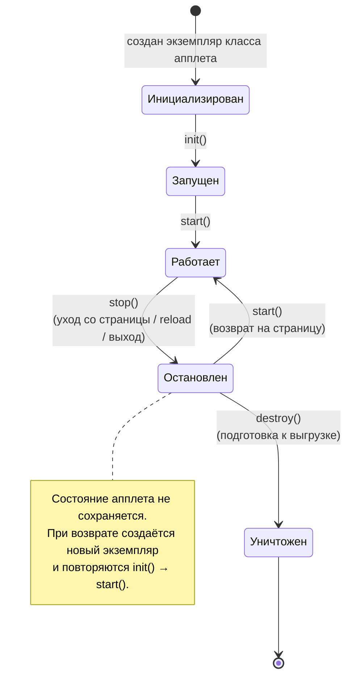

# Урок 1. Разработка и развёртывание апплетов Java

**Трейл:** Deployment · **Оригинал:** [Developing and Deploying Java Applets](https://docs.oracle.com/javase/tutorial/deployment/applet/index.html)
**Связанные области:** [[18-build-tools]] · **Вопросы:** build-tools

> Перевод официального руководства Oracle (The Java Tutorials, JDK 8). Урок объединяет
> страницы раздела *Java Applets* трейла *Deployment*: основы работы с апплетами, их жизненный
> цикл, развёртывание и расширенные возможности.

> **Важно (примечание Oracle).** Само руководство сопровождается предупреждением: «The Java
> Tutorials написаны для JDK 8. Примеры и практики, описанные на этих страницах, не используют
> улучшений более поздних выпусков и **могут опираться на технологию, которая больше
> недоступна**». Технология апплетов (`java.applet`, Java Plug-in, тег `<applet>`) объявлена
> устаревшей и **удалена из современных версий Java**: подключаемый модуль Java Plug-in был
> объявлен устаревшим в Java SE 9 и удалён в Java SE 11, а API `java.applet` помечен как
> deprecated for removal. Материал ниже сохранён как перевод исторического руководства; для
> новых проектов апплеты применять не следует. Актуальные руководства Oracle публикует на
> [Dev.java](https://dev.java/learn/).

## Что такое апплет

Апплет Java (*Java applet*) — это особый вид Java-программы, которую браузер с поддержкой
технологии Java может загрузить из интернета и запустить. Апплет обычно встраивается в
веб-страницу и выполняется в контексте браузера. Апплет должен быть подклассом класса
`java.applet.Applet`. Класс `Applet` предоставляет стандартный интерфейс между апплетом и
средой браузера.

Swing предоставляет специальный подкласс класса `Applet` — `javax.swing.JApplet`. Класс
`JApplet` следует использовать для всех апплетов, графический интерфейс пользователя (GUI)
которых строится на компонентах Swing.

Жизненным циклом апплета управляет подключаемый модуль Java (*Java Plug-in*) в браузере.

Для проверки примеров этого урока используйте веб-сервер. Использовать локальные апплеты не
рекомендуется: они блокируются, когда уровень безопасности в Java Control Panel установлен на
«Высокий» (High) или «Очень высокий» (Very High).

## Начало работы с апплетами

Показанный ниже апплет `HelloWorld` — это Java-класс, который выводит строку «Hello World».

> **Примечание.** Если пример не запускается, возможно, в браузере нужно включить интерпретатор
> JavaScript, чтобы скрипт Deployment Toolkit мог корректно работать.

Исходный код апплета `HelloWorld`:

```java
import javax.swing.JApplet;
import javax.swing.SwingUtilities;
import javax.swing.JLabel;

public class HelloWorld extends JApplet {
    // Вызывается, когда этот апплет загружается в браузер.
    public void init() {
        // Выполняем задачу в потоке диспетчеризации событий; создаём GUI этого апплета.
        try {
            SwingUtilities.invokeAndWait(new Runnable() {
                public void run() {
                    JLabel lbl = new JLabel("Hello World");
                    add(lbl);
                }
            });
        } catch (Exception e) {
            System.err.println("createGUI didn't complete successfully");
        }
    }
}
```

Подобным апплетом обычно управляет и запускает его программное обеспечение _Java Plug-in_ в
браузере.

## Определение подкласса апплета

Каждый Java-апплет должен определять подкласс класса `Applet` или `JApplet`. В апплете
Hello World этот подкласс называется `HelloWorld` (его исходный код приведён выше).

Java-апплеты наследуют значительную часть функциональности от класса `Applet` или `JApplet`,
включая возможности взаимодействовать с браузером и предоставлять пользователю графический
интерфейс (GUI).

Апплет, который будет использовать GUI-компоненты Swing (набор инструментов GUI в Java),
должен расширять базовый класс [`javax.swing.JApplet`](https://docs.oracle.com/javase/8/docs/api/javax/swing/JApplet.html),
обеспечивающий наилучшую интеграцию со средствами GUI Swing.

`JApplet` предоставляет корневую панель (*root pane*) — ту же структуру компонентов верхнего
уровня, что и компоненты Swing `JFrame` и `JDialog`, тогда как `Applet` предоставляет лишь
простую панель.

Апплет может расширять класс [`java.applet.Applet`](https://docs.oracle.com/javase/8/docs/api/java/applet/Applet.html),
когда он не использует GUI-компоненты Swing.

## Методы для ключевых событий (milestones)

Класс [`Applet`](https://docs.oracle.com/javase/8/docs/api/java/applet/Applet.html)
предоставляет каркас для выполнения апплета, определяя методы, которые система вызывает при
наступлении ключевых событий (*milestones*). Ключевые события — это важнейшие события в
жизненном цикле апплета. Большинство апплетов переопределяют некоторые или все эти методы,
чтобы должным образом реагировать на ключевые события.

### Метод `init`

Метод `init` удобен для одноразовой инициализации, которая не занимает много времени. Обычно
`init` содержит код, который в других случаях помещают в конструктор. Причина, по которой у
апплетов обычно нет конструкторов, в том, что полноценное окружение им не гарантировано до
вызова метода `init`. Держите метод `init` коротким, чтобы апплет загружался быстро.

### Метод `start`

Каждый апплет, выполняющий задачи после инициализации (кроме как в прямом ответе на действия
пользователя), должен переопределить метод `start`. Метод `start` запускает выполнение
апплета. Желательно быстро возвращаться из метода `start`. Если необходимы вычислительно
интенсивные операции, лучше запустить для них новый поток.

### Метод `stop`

Большинство апплетов, переопределяющих `start`, должны переопределять и метод `stop`. Метод
`stop` должен приостанавливать выполнение апплета, чтобы тот не занимал системные ресурсы,
когда пользователь не просматривает страницу апплета. Например, апплет, отображающий анимацию,
должен прекращать её отрисовку, когда пользователь не смотрит на него.

### Метод `destroy`

Многим апплетам не нужно переопределять метод `destroy`, потому что их метод `stop`
(вызываемый перед `destroy`) выполнит все задачи, необходимые для завершения работы апплета.
Однако метод `destroy` доступен для апплетов, которым нужно освободить дополнительные ресурсы.

> **Примечание.** Реализации метода `destroy` должны быть как можно короче, потому что нет
> гарантии, что этот метод будет полностью выполнен. Виртуальная машина Java может завершиться
> до того, как длинный метод `destroy` завершится.

## Жизненный цикл апплета

Апплет может реагировать на важные события следующими способами:

- он может **инициализировать** себя (*initialize*);
- он может **начать** работу (*start*);
- он может **остановить** работу (*stop*);
- он может выполнить **финальную очистку** (*final cleanup*) перед выгрузкой.

В отличие от Java-приложений, апплетам **не нужно** реализовывать метод `main`.

Ниже приведён апплет `Simple`, использующий все эти методы.

```java
import java.applet.Applet;
import java.awt.Graphics;

// Нет нужды расширять JApplet, так как мы не добавляем компонентов;
// мы только рисуем.
public class Simple extends Applet {

    StringBuffer buffer;

    public void init() {
        buffer = new StringBuffer();
        addItem("initializing... ");
    }

    public void start() {
        addItem("starting... ");
    }

    public void stop() {
        addItem("stopping... ");
    }

    public void destroy() {
        addItem("preparing for unloading...");
    }

    private void addItem(String newWord) {
        System.out.println(newWord);
        buffer.append(newWord);
        repaint();
    }

    public void paint(Graphics g) {
        // Рисуем прямоугольник вокруг области отображения апплета.
        g.drawRect(0, 0,
                   getWidth() - 1,
                   getHeight() - 1);

        // Рисуем текущую строку внутри прямоугольника.
        g.drawString(buffer.toString(), 5, 15);
    }
}
```

### Состояния и переходы жизненного цикла

**Загрузка апплета.** При загрузке апплета происходит следующее: создаётся экземпляр
управляющего класса апплета (подкласса `Applet`); апплет инициализирует себя (вызывается
`init()`); апплет начинает работу (вызывается `start()`). В результате вы увидите текст
«initializing... starting...».

**Уход со страницы апплета и возврат на неё.** Когда пользователь покидает страницу (например,
переходит на другую), браузер останавливает и уничтожает апплет (`stop()`, затем `destroy()`).
Состояние апплета **не сохраняется**. Когда пользователь возвращается на страницу, браузер
инициализирует и запускает **новый** экземпляр апплета (снова `init()` и `start()`).

**Перезагрузка апплета.** При обновлении (reload) страницы текущий экземпляр апплета
останавливается и уничтожается, после чего создаётся новый экземпляр.

**Выход из браузера.** Когда пользователь закрывает браузер, у апплета есть возможность
остановить себя и выполнить финальную очистку (`stop()`, затем `destroy()`) перед выходом.

<!-- original: none | Oracle не публикует диаграмму состояний жизненного цикла апплета; страницы трейла Deployment/Applet не содержат figures/ -->


## Среда выполнения апплета

Java-апплет выполняется в контексте браузера. Запуском и выполнением Java-апплетов управляет
программное обеспечение Java Plug-in в браузере. У браузера также есть интерпретатор JavaScript,
который выполняет код JavaScript на веб-странице. Описанное поведение Java Plug-in относится к
версии, выпущенной в составе Java Platform, Standard Edition 6 update 10.

### Java Plug-in

Программа Java Plug-in создаёт рабочий поток (*worker thread*) для каждого Java-апплета. Она
запускает апплет в экземпляре среды выполнения Java (Java Runtime Environment, JRE). Обычно все
апплеты выполняются в одном и том же экземпляре JRE. Java Plug-in запускает новый экземпляр JRE
в следующих случаях:

- когда апплет запрашивает выполнение в конкретной версии JRE;
- когда апплет задаёт собственные параметры запуска JRE (например, размер кучи). Новый апплет
  использует существующий JRE, если его требования являются подмножеством требований
  существующего JRE; иначе запускается новый экземпляр JRE.

Апплет будет выполняться в существующем JRE, если выполняются оба условия: версия JRE,
требуемая апплетом, совпадает с существующим JRE; параметры запуска JRE удовлетворяют
требованиям апплета.

### Взаимодействие Java Plug-in и интерпретатора JavaScript

Java-апплеты могут вызывать функции JavaScript, присутствующие на веб-странице. Функциям
JavaScript также разрешено вызывать методы апплета, встроенного на той же странице. Java Plug-in
и интерпретатор JavaScript согласовывают вызовы из кода Java в код JavaScript и обратно.

Java Plug-in многопоточен, тогда как интерпретатор JavaScript работает в одном потоке. Поэтому,
чтобы избежать проблем с потоками (особенно когда одновременно работает несколько апплетов),
делайте вызовы между кодом Java и кодом JavaScript короткими и по возможности избегайте
«круговых рейсов» (round trips).

## Разработка апплета

Приложение, спроектированное по компонентной архитектуре (*component-based architecture*), можно
превратить в Java-апплет. Рассмотрим пример Java-апплета с GUI на основе Swing. При компонентном
проектировании GUI строится из меньших блоков — компонентов. Общие шаги для создания GUI апплета:

- создать класс `MyTopJPanel` — подкласс `javax.swing.JPanel`. Разместить GUI-компоненты апплета
  в конструкторе класса `MyTopJPanel`;
- создать класс `MyApplet` — подкласс `javax.swing.JApplet`;
- в методе `init` класса `MyApplet` создать экземпляр `MyTopJPanel` и установить его как панель
  содержимого (content pane) апплета.

Для апплета с GUI на основе Swing создайте класс — подкласс `javax.swing.JApplet`. Апплет без
GUI на основе Swing может расширять класс `java.applet.Applet`.

Переопределите метод `init` апплета, чтобы создать экземпляр вашего верхнего класса `JPanel` и
построить GUI апплета. Метод `init` класса `DynamicTreeApplet` вызывает метод `createGUI` в
потоке диспетчеризации событий AWT (AWT Event Dispatcher thread):

```java
public void init() {
    // Выполняем задачу в потоке диспетчеризации событий; создаём GUI этого апплета.
    try {
        SwingUtilities.invokeAndWait(new Runnable() {
            public void run() {
                createGUI();
            }
        });
    } catch (Exception e) {
        System.err.println("createGUI didn't complete successfully");
    }
}
```

Другой способ создать апплет — убрать слой абстракции (отдельную верхнюю `JPanel`) и разместить
все элементы управления прямо в методе `init` апплета. Недостаток создания GUI напрямую в
апплете в том, что позже станет труднее развернуть функциональность как приложение Java Web
Start, если вы захотите это сделать.

В примере Dynamic Tree Demo основная функциональность находится в классе `DynamicTreePanel`.
Благодаря этому тривиально поместить `DynamicTreePanel` в `JFrame` и развернуть как приложение
Java Web Start. Таким образом, чтобы сохранить переносимость и оставить открытыми варианты
развёртывания, следуйте компонентному проектированию.

## Развёртывание апплета

Чтобы развернуть Java-апплет, нужно: скомпилировать исходный код; упаковать его в JAR-файл;
подписать JAR-файл. Существуют два способа запуска:

- **JNLP (Java Network Launch Protocol)** — даёт доступ к мощным API JNLP и расширениям;
- **тег `<applet>`** — атрибуты запуска указываются прямо в теге (накладывает жёсткие
  ограничения безопасности).

Скрипт Deployment Toolkit предоставляет полезные функции JavaScript для развёртывания на
веб-странице.

**Шаг 1. Скомпилировать код.** Поместите все скомпилированные файлы классов и ресурсы в отдельный
каталог (например, `build/classes/appletComponentArch`).

**Шаг 2. Создать файл манифеста** `mymanifest.txt` с обязательными атрибутами:

```
Permissions: sandbox
Codebase: myserver.com
Application-Name: Dynamic Tree Demo
```

**Шаг 3. Создать JAR-файл:**

```
% cd build/classes
% jar cvfm DynamicTreeDemo.jar mymanifest.txt appletComponentArch
```

**Шаг 4. Подписать JAR-файл** действительным сертификатом подписи кода от доверенного
удостоверяющего центра.

**Шаг 5. Создать файл JNLP**, например `dynamictree_applet.jnlp`:

```xml
<?xml version="1.0" encoding="UTF-8"?>
<jnlp spec="1.0+" codebase="" href="">
    <information>
        <title>Dynamic Tree Demo</title>
        <vendor>Dynamic Team</vendor>
    </information>
    <resources>
        <!-- Ресурсы приложения -->
        <j2se version="1.7+"
            href="http://java.sun.com/products/autodl/j2se" />
        <jar href="DynamicTreeDemo.jar" main="true" />

    </resources>
    <applet-desc
         name="Dynamic Tree Demo Applet"
         main-class="components.DynamicTreeApplet"
         width="300"
         height="300">
     </applet-desc>
     <update check="background"/>
</jnlp>
```

**Шаг 6. Создать HTML-страницу**, например `AppletPage.html`:

```html
<body>
    <!-- ... -->
    <script src="https://www.java.com/js/deployJava.js"></script>
    <script>
        var attributes = {
            code:'components.DynamicTreeApplet',  width:300, height:300} ;
        var parameters = {jnlp_href: 'dynamictree_applet.jnlp'} ;
        deployJava.runApplet(attributes, parameters, '1.7');
    </script>
    <!-- ... -->
</body>
```

**Шаг 7. Разместить файлы** `DynamicTreeDemo.jar`, `dynamictree_applet.jnlp` и `AppletPage.html`
в одном каталоге (предпочтительно на веб-сервере).

**Шаг 8. Открыть HTML-страницу в браузере** и согласиться запустить апплет по запросу.

## Развёртывание с помощью тега `<applet>`

Если вы не уверены, что у конечных пользователей будет включён интерпретатор JavaScript, можно
развернуть Java-апплет, вручную закодировав HTML-тег `<applet>`, вместо использования функций
Deployment Toolkit. В зависимости от поддерживаемых браузеров может потребоваться развёртывание
через теги `<object>` или `<embed>`.

Запустить апплет можно через JNLP либо указать атрибуты запуска прямо в теге `<applet>`. Сначала
выполните шаги из раздела «Развёртывание апплета»: скомпилируйте исходный код, создайте и
подпишите JAR-файл, при необходимости создайте файл JNLP. Меняется только содержимое HTML-страницы.

### Ручное кодирование тега, запуск через JNLP

Страница `AppletPage_WithAppletTagUsingJNLP.html` развёртывает апплет Dynamic Tree Demo с
вручную закодированным тегом `<applet>`. Апплет по-прежнему запускается через JNLP; файл JNLP
указан в атрибуте `jnlp_href`:

```html
<applet code = 'appletComponentArch.DynamicTreeApplet'
        jnlp_href = 'dynamictree_applet.jnlp'
        width = 300
        height = 300 />
```

### Ручное кодирование тега, запуск без JNLP

JNLP — предпочтительный способ развёртывания, но можно развернуть апплет и без файла JNLP:

```html
<applet code = 'appletComponentArch.DynamicTreeApplet'
    archive = 'DynamicTreeDemo.jar'
    width = 300
    height = 300>
    <param name="permissions" value="sandbox" />
</applet>
```

где:

- `code` — имя класса апплета;
- `archive` — имя JAR-файла, содержащего апплет и его ресурсы;
- `width` — ширина апплета;
- `height` — высота апплета;
- `permissions` — указывает, выполняется ли апплет в песочнице безопасности. Значение `sandbox`
  — запуск в песочнице, `all-permissions` — запуск вне песочницы. Если параметр `permissions`
  отсутствует, подписанные апплеты по умолчанию используют `all-permissions`, а неподписанные —
  `sandbox`.

## Расширенные возможности апплетов

API Java-апплетов позволяет воспользоваться тесной связью апплетов с браузером. API
предоставляется классом `javax.swing.JApplet` и интерфейсом `java.applet.AppletContext`.
Архитектура выполнения апплетов позволяет им взаимодействовать со своим окружением: апплет может
управлять родительской веб-страницей, взаимодействовать с кодом JavaScript на странице, находить
другие апплеты, работающие на той же странице, и многое другое.

### Поиск и загрузка файлов данных

Когда Java-апплету нужно загрузить данные из файла, заданного относительным URL, апплет обычно
использует кодовую базу (*code base*) или базу документа (*document base*) для формирования
полного URL.

Кодовая база, возвращаемая методом `getCodeBase` класса `JApplet`, — это URL, указывающий
каталог, из которого были загружены классы апплета. Для локально развёрнутых апплетов
`getCodeBase` возвращает `null`.

База документа, возвращаемая методом `getDocumentBase`, указывает каталог HTML-страницы,
содержащей апплет. Для локально развёрнутых апплетов `getDocumentBase` возвращает `null`.

Если тег `<applet>` не задаёт кодовую базу, и кодовая база, и база документа ссылаются на один и
тот же каталог на одном сервере. Данные, на которые апплет может опираться как на резервные,
обычно задаются относительно кодовой базы. Данные, задаваемые разработчиком апплета (часто через
параметры), обычно задаются относительно базы документа.

> **Примечание.** Из соображений безопасности браузеры ограничивают URL, из которых недоверенные
> апплеты могут читать. Большинство браузеров не разрешают недоверенным апплетам использовать
> «..» для доступа к каталогам выше кодовой базы или базы документа. Поскольку недоверенные
> апплеты не могут читать файлы, кроме файлов на исходном хосте апплета, база документа обычно
> бесполезна, если документ и недоверенный апплет находятся на разных серверах.

Класс `JApplet` определяет удобные формы методов загрузки изображений и звуков, позволяющие
задавать их относительно базового URL. Например, чтобы создать объект `Image` из файла `a.gif` в
каталоге `imgDir`, апплет может использовать следующий код:

```java
Image image = getImage(getCodeBase(), "imgDir/a.gif");
```

### Определение и использование параметров апплета

Параметры для апплета — как аргументы командной строки для приложения: они позволяют настраивать
поведение апплета без перекомпиляции. Параметры можно задать двумя способами: в файле JNLP
(рекомендуется для согласованности между несколькими развёртываниями) либо в HTML-элементе
`<param>` (когда параметры различаются на разных страницах).

Пример задания параметров `paramStr` и `paramInt` в файле JNLP:

```xml
<?xml version="1.0" encoding="UTF-8"?>
<jnlp spec="1.0+" codebase="" href="">
    <applet-desc
         name="Applet Takes Params"
         main-class="AppletTakesParams"
         width="800"
         height="50">
             <param name="paramStr"
                 value="someString"/>
             <param name="paramInt" value="22"/>
     </applet-desc>
</jnlp>
```

Параметры можно передать и через скрипт Deployment Toolkit:

```html
<script src="https://www.java.com/js/deployJava.js"></script>
<script>
    var attributes = { code:'AppletTakesParams.class',
        archive:'applet_AppletWithParameters.jar',
        width:800, height:50 };
    var parameters = {jnlp_href: 'applettakesparams.jnlp',
        paramOutsideJNLPFile: 'fooOutsideJNLP' };
    deployJava.runApplet(attributes, parameters, '1.7');
</script>
```

Параметры извлекаются методом `getParameter()` класса `Applet`:

```java
public class AppletTakesParams extends JApplet {
    public void init() {
        final String inputStr = getParameter("paramStr");
        final int inputInt = Integer.parseInt(getParameter("paramInt"));
        final String inputOutsideJNLPFile = getParameter("paramOutsideJNLPFile");
    }
}
```

Метод `getParameter()` возвращает значение типа `String`, которое при необходимости нужно
разобрать в другие типы (например, `Integer.parseInt()` для целых чисел).

### Отображение коротких строк статуса

Все браузеры позволяют Java-апплетам отображать короткую строку статуса. Все апплеты на странице,
а также сам браузер используют общую строку статуса.

Никогда не помещайте важную информацию в строку статуса. Если она может понадобиться многим
пользователям, показывайте её в области апплета. Если она нужна лишь немногим опытным
пользователям, рассмотрите вывод в стандартный поток (см. раздел про диагностику). Строка статуса
обычно малозаметна и может быть перезаписана другими апплетами или браузером, поэтому она лучше
всего подходит для второстепенной, преходящей информации. Например, апплет, загружающий несколько
файлов изображений, может показывать имя файла, который загружается в данный момент.

Апплеты отображают строки статуса методом `showStatus`, унаследованным `JApplet` от `Applet`:

```java
showStatus("MyApplet: Loading image file " + file);
```

> **Примечание.** Не помещайте в строку статуса бегущий текст — пользователи браузеров находят
> такое поведение крайне раздражающим.

### Отображение документов в браузере

Java-апплет может загрузить веб-страницу в окне браузера, используя методы `showDocument` класса
`java.applet.AppletContext`:

```java
public void showDocument(java.net.URL url)
public void showDocument(java.net.URL url, String targetWindow)
```

Форма с одним аргументом указывает браузеру отобразить документ по заданному URL, не указывая
конкретное окно. Форма с двумя аргументами позволяет задать окно или HTML-фрейм для отображения.
Второй аргумент может принимать значения:

- `"_blank"` — отобразить в новом безымянном окне;
- `"_windowName"` — отобразить в окне с именем `windowName` (создаётся при необходимости);
- `"_self"` — отобразить в окне/фрейме, содержащем апплет;
- `"_parent"` — отобразить в родительском фрейме фрейма апплета (как `"_self"`, если родителя нет);
- `"_top"` — отобразить в фрейме верхнего уровня (как `"_self"`, если фрейм апплета уже верхнего
  уровня).

```java
// Внутри подкласса Applet:
urlWindow = new URLWindow(getAppletContext());

class URLWindow extends Frame {
    public URLWindow(AppletContext appletContext) {
        this.appletContext = appletContext;
    }

    public boolean action(Event event, Object o) {
        String urlString = /* строка, введённая пользователем */;
        URL url = null;
        try {
            url = new URL(urlString);
        } catch (MalformedURLException e) {
            // Уведомить пользователя и вернуться
        }

        if (url != null) {
            if (/* пользователь не хочет указывать окно */) {
                appletContext.showDocument(url);
            } else {
                appletContext.showDocument(url,
                    /* указанное пользователем окно */);
            }
        }
    }
}
```

### Вызов кода JavaScript из апплета

Java-апплеты могут вызывать функции JavaScript на той же веб-странице с помощью спецификации
**LiveConnect**. Ключ к этому взаимодействию — класс `netscape.javascript.JSObject`. Ссылку на
объект окна получают так (вызов нужно обернуть в блок try-catch для обработки
`netscape.javascript.JSException`):

```java
JSObject window = JSObject.getWindow(this);
```

Пример HTML/JavaScript (`AppletPage.html`):

```html
<head>
<script language="javascript">
    var userName = "";

    function getAge() {
        return 25;
    }

    function address() {
        this.street = "1 Example Lane";
        this.city = "Santa Clara";
        this.state = "CA";
    }

    function getPhoneNums() {
        return ["408-555-0100", "408-555-0102"];
    }

    function writeSummary(summary) {
        summaryElem = document.getElementById("summary");
        summaryElem.innerHTML = summary;
    }
</script>
</head>
<body>
    <p id="summary"/>
</body>
```

Пример Java-апплета (`DataSummaryApplet`):

```java
package javatojs;

import java.applet.Applet;
import netscape.javascript.*;

public class DataSummaryApplet extends Applet {
    public void start() {
        try {
            JSObject window = JSObject.getWindow(this);
            String userName = "John Doe";

            // Установить переменную JavaScript
            window.setMember("userName", userName);

            // Вызвать функцию JavaScript
            Number age = (Number) window.eval("getAge()");

            // Получить объект JavaScript и извлечь его содержимое
            JSObject address = (JSObject) window.eval("new address();");
            String addressStr = (String) address.getMember("street") + ", " +
                    (String) address.getMember("city") + ", " +
                    (String) address.getMember("state");

            // Получить массив из JavaScript
            JSObject phoneNums = (JSObject) window.eval("getPhoneNums()");
            String phoneNumStr = (String) phoneNums.getSlot(0) + ", " +
                    (String) phoneNums.getSlot(1);

            // Записать сводку данных
            String summary = userName + " : " + age + " : " +
                    addressStr + " : " + phoneNumStr;
            window.call("writeSummary", new Object[] {summary});

        } catch (JSException jse) {
            jse.printStackTrace();
        }
    }
}
```

При компиляции включите в classpath `<JDK_path>/jre/lib/plugin.jar`. Методы `JSObject`:
`setMember()` — задать переменные JavaScript; `getMember()` — получить свойства объекта;
`getSlot()` — обратиться к элементам массива; `eval()` — вычислить код JavaScript; `call()` —
вызвать функцию JavaScript.

### Вызов методов апплета из кода JavaScript

Код JavaScript на веб-странице может взаимодействовать с встроенными апплетами: вызывать методы
Java-объектов; читать и устанавливать поля Java-объектов; читать и устанавливать элементы
Java-массивов. Детали взаимодействия описывает спецификация LiveConnect.

При вызовах JavaScript к Java-апплету показываются предупреждения безопасности. Чтобы подавить
их, добавьте атрибут `Caller-Allowable-Codebase` в манифест JAR-файла, указав расположение кода
JavaScript, которому разрешено обращаться к апплету.

Разверните апплет, указав ему `id` — он позже используется для получения ссылки на объект апплета:

```javascript
<script src=
  "https://www.java.com/js/deployJava.js"></script>
<script>
    <!-- applet id можно использовать, чтобы получить ссылку
    на объект апплета -->
    var attributes = { id:'mathApplet',
        code:'jstojava.MathApplet',  width:1, height:1} ;
    var parameters = { jnlp_href: 'math_applet.jnlp'} ;
    deployJava.runApplet(attributes, parameters, '1.6');
</script>
```

Код JavaScript использует `id` апплета как ссылку на объект и вызывает его методы:

```javascript
<script language="javascript">
    function enterNums(){
        var numA = prompt('Enter number \'a\'?','0');
        var numB = prompt(
            'Enter number \'b\' (should be greater than number \'a\' ?','1');
        // установить публичную переменную апплета
        mathApplet.userName = "John Doe";

        // вызвать публичный метод апплета
        var greeting = mathApplet.getGreeting();

        // получить другой класс, на который ссылается апплет,
        // и вызвать его методы
        var calculator = mathApplet.getCalculator();
        calculator.setNums(numA, numB);

        // примитивный тип данных, возвращённый апплетом
        var sum = calculator.add();

        // массив, возвращённый апплетом
        var numRange = calculator.getNumInRange();

        // см. это сообщение в логе Java Console
        mathApplet.printOut("Testing printing to System.out");

        // получить другой класс, установить статическое поле и вызвать его методы
        var dateHelper = mathApplet.getDateHelper();
        dateHelper.label = "Today's date is: ";
        var dateStr = dateHelper.getDate();
        <!-- ... -->
</script>
```

### Обработка статуса инициализации обработчиками событий

Код JavaScript не может взаимодействовать с апплетом, пока тот полностью не инициализирован. Во
время запуска веб-страница может казаться «зависшей», так как во многих браузерах JavaScript
однопоточен. Начиная с JDK 7, можно: проверять переменную `status` апплета во время загрузки;
регистрировать обработчики событий, срабатывающие на этапах инициализации; развёртывать апплет с
параметром `java_status_events`, равным `"true"`.

Шаг 1. Зарегистрировать обработчики событий, проверяя статус апплета (READY = 2):

```javascript
var READY = 2;
function registerAppletStateHandler() {
    if (drawApplet.status < READY)  {
        drawApplet.onLoad = onLoadHandler;
    } else if (drawApplet.status >= READY) {
        document.getElementById("mydiv").innerHTML =
          "Applet event handler not registered because applet status is: "
           + drawApplet.status;
    }
}

function onLoadHandler() {
    document.getElementById("mydiv").innerHTML = "Applet has loaded";
    draw();
}
```

Шаг 2. Вызвать регистрацию в `onload` тела страницы:

```html
<body onload="registerAppletStateHandler()">
```

Шаг 3. Развернуть с включёнными событиями статуса:

```javascript
var attributes = { id:'drawApplet',
    code:'DrawingApplet.class',
    archive: 'applet_StatusAndCallback.jar',
    width:600, height:400};
var parameters = {java_status_events: 'true', permissions:'sandbox'};
deployJava.runApplet(attributes, parameters, '1.7');
```

### Манипулирование DOM веб-страницы апплета

Java-апплеты могут обходить и изменять объектную модель документа (DOM) родительской веб-страницы
с помощью Common DOM API. Ссылку на объект `Document` получают через рефлексию, вызывая метод
`getDocument` класса `com.sun.java.browser.plugin2.DOM`:

```java
public void start() {
    try {
        // используем рефлексию для получения документа
        Class c =
          Class.forName("com.sun.java.browser.plugin2.DOM");
        Method m = c.getMethod("getDocument",
          new Class[] { java.applet.Applet.class });

        // приводим возвращённый объект к HTMLDocument;
        // затем обходим или изменяем DOM
        HTMLDocument doc = (HTMLDocument) m.invoke(null,
            new Object[] { this });
        HTMLBodyElement body =
            (HTMLBodyElement) doc.getBody();
        dump(body, INDENT);
    } catch (Exception e) {
        System.out.println("New Java Plug-In not available");
    }
}
```

Получив ссылку на `Document`, можно использовать Common DOM API для обхода и изменения дерева.
Пример-апплет `DOMDump` демонстрирует это, выводя всю структуру DOM в Java Console.

### Запись диагностики в стандартные потоки вывода и ошибок

Java-апплет может записывать сообщения в стандартный поток вывода и стандартный поток ошибок. Это
бесценный инструмент при отладке апплета:

```java
// Там, где объявляются переменные экземпляра:
boolean DEBUG = true;
// ...
// Позже, когда нужно вывести статус:
if (DEBUG) {
    try {
        // ...
        // некоторый код, бросающий исключение
        System.out.
            println("Called someMethod(" + x + "," + y + ")");
    } catch (Exception e) {
        e.printStackTrace()
    }
}
```

Сообщения, записанные в стандартные потоки, ищите в логе Java Console. Чтобы сохранять сообщения
в файл журнала, включите логирование в Java Control Panel — сообщения будут записываться в файл в
домашнем каталоге пользователя (например, в Windows — в
`C:\Documents and Settings\someuser\Application Data\Sun\Java\Deployment\log`).

> **Примечание.** Обязательно отключите весь отладочный вывод перед выпуском апплета.

### Разработка перетаскиваемых (draggable) апплетов

Java-апплет, развёрнутый с указанием параметра `draggable`, можно перетащить за пределы браузера
и динамически превратить в приложение Java Web Start. Апплет перетаскивают, нажав клавишу Alt и
левую кнопку мыши и перемещая мышь. При начале перетаскивания апплет удаляется из родительского
контейнера (`Applet` или `JApplet`) и помещается в новое окно верхнего уровня без рамки
(`Frame` или `JFrame`); рядом отображается небольшая плавающая кнопка Close, по нажатию на
которую апплет возвращается в браузер.

Включить возможность перетаскивания можно, установив параметр `draggable` в `true`:

```javascript
<script src="https://www.java.com/js/deployJava.js"></script>
<script>
    var attributes = { code:'MenuChooserApplet', width:900, height:300 };
    var parameters = { jnlp_href: 'draggableapplet.jnlp', draggable: 'true' };
    deployJava.runApplet(attributes, parameters, '1.6');
</script>
```

Изменить сочетание клавиш и кнопки мыши для перетаскивания можно, реализовав метод
`isAppletDragStart`. В примере апплет перетаскивается нажатием левой кнопки мыши и перемещением:

```java
public boolean isAppletDragStart(MouseEvent e) {
    if(e.getID() == MouseEvent.MOUSE_DRAGGED) {
        return true;
    } else {
        return false;
    }
}
```

Если пользователь закроет окно браузера или уйдёт со страницы после перетаскивания, апплет
считается «отсоединённым» (*disconnected*) от браузера. Чтобы создать ярлык на рабочем столе для
запуска приложения вне браузера, добавьте теги `offline-allowed` и `shortcut` в файл JNLP апплета:

```xml
<information>
    <!-- ... -->
    <offline-allowed />
    <shortcut online="false">
        <desktop />
    </shortcut>
</information>
```

Можно определить, как апплет закрывается. Java Plug-in передаёт апплету экземпляр класса
`ActionListener` (так называемый _close listener_), которым можно изменить поведение закрытия по
умолчанию. Для этого реализуйте методы `setAppletCloseListener` и `appletRestored`. В примере
класс `MenuChooserApplet` получает close listener и передаёт его экземпляру `MenuItemChooser`:

```java
MenuItemChooser display = null;
// ...
display = new MenuItemChooser();
// ...
public void setAppletCloseListener(ActionListener cl) {
    display.setCloseListener(cl);
}

public void appletRestored() {
    display.setCloseListener(null);
}
```

Класс `MenuItemChooser` управляет интерфейсом апплета и определяет `JButton` с надписью «Close».
При нажатии этой кнопки выполняется:

```java
private void close() {
    // вызвать actionPerformed у closeListener, полученного
    // от программы Java Plug-in.
    if (closeListener != null) {
        closeListener.actionPerformed(null);
    }
}
```

Начиная с Java SE 7, при развёртывании можно указать, что окно перетащенного апплета должно иметь
оформление — заголовок окна по умолчанию или настраиваемый. Для этого задайте параметр
`java_decorated_frame` со значением `"true"`, а для настраиваемого заголовка — параметр
`java_applet_title` с текстом заголовка:

```javascript
<script src="https://www.java.com/js/deployJava.js"></script>
<script>
    var attributes =
      { code:'SomeDraggableApplet', width:100, height:100 };
    var parameters =
      { jnlp_href: 'somedraggableapplet.jnlp',
          java_decorated_frame: 'true',
          java_applet_title: 'A Custom Title'
      };
    deployJava.runApplet(attributes, parameters, '1.7');
</script>
```

Эти параметры можно указать и в файле JNLP апплета:

```xml
<applet-desc main-class="SayHello" name="main test" height="150" width="300">
    <param name="java_decorated_frame" value="true" />
    <param name="java_applet_title" value="" />
</applet-desc>
```

### Взаимодействие с другими апплетами

Java-апплеты могут взаимодействовать друг с другом через функции JavaScript на родительской
веб-странице: функция JavaScript принимает сообщение от одного апплета и вызывает методы других
апплетов. Apple­ты должны происходить из одного каталога на сервере.

Следует **избегать**: статических переменных для обмена данными между апплетами; методов
`getApplet` и `getApplets` класса `AppletContext` (они находят только апплеты, работающие в одном
и том же экземпляре JRE).

Апплет-отправитель:

```java
try {
    JSObject window = JSObject.getWindow(this);
    window.eval("sendMsgToIncrementCounter()");
} catch (JSException jse) {
    // ...
}
```

Функция JavaScript:

```javascript
function sendMsgToIncrementCounter() {
    var myReceiver = document.getElementById("receiver");
    myReceiver.incrementCounter();
}
```

Метод апплета-получателя:

```java
public void incrementCounter() {
    ctr++;
    String text = " Current Value Of Counter: "
        + (new Integer(ctr)).toString();
    ctrLbl.setText(text);
}
```

### Работа с серверным приложением

Java-апплеты, как и другие Java-программы, могут использовать API из пакета `java.net` для связи
по сети. Java-апплет может взаимодействовать с серверными приложениями, работающими на том же
хосте, что и апплет. Такая связь не требует особой настройки сервера.

> **Примечание.** В зависимости от сетевого окружения и браузера апплет может быть не в состоянии
> связаться со своим исходным хостом. Например, браузеры за фаерволлом часто не могут получить
> много информации о внешнем мире, поэтому некоторые из них не разрешают связь апплета с хостами
> вне фаервола.

Когда апплет развёрнут на веб-сервере, используйте метод `getCodeBase` класса `Applet` и метод
`getHost` класса `java.net.URL`, чтобы определить хост, с которого пришёл апплет:

```java
String host = getCodeBase().getHost();
```

Если апплет развёрнут локально, `getCodeBase` возвращает `null` (рекомендуется использовать
веб-сервер). Получив корректное имя хоста, можно применять весь сетевой код, описанный в трейле
Custom Networking.

> **Примечание.** Не все браузеры безупречно поддерживают весь сетевой код. Например, один широко
> используемый браузер не поддерживает POST-запросы к URL.

### Пример сетевого апплета-клиента

Пример демонстрирует апплет-клиент, взаимодействующий с серверным приложением. Компоненты:
`QuoteClientApplet` — апплет-клиент, получающий цитаты от сервера на том же хосте;
`QuoteServer.java` и `QuoteServerThread.java` — классы серверного приложения, отдающие цитаты;
`one-liners.txt` — текстовый файл с цитатами.

HTML-код для развёртывания апплета:

```html
<script src="https://www.java.com/js/deployJava.js"></script>
<script>
    var attributes =
      { code:'QuoteClientApplet.class', width:500, height:100} ;
    var parameters =
      { codebase_lookup:'true', permissions:'sandbox' };
    deployJava.runApplet(attributes, parameters, '1.6');
</script>
```

Шаги настройки: скачать четыре Java-файла и HTML-файл; включить HTML-код развёртывания в
веб-страницу; скомпилировать `QuoteClientApplet.java`; скомпилировать серверные классы;
скопировать `one-liners.txt` в каталог сервера; запустить `QuoteServer` (выведет номер порта);
открыть веб-страницу в браузере по имени хоста сервера; ввести номер порта в текстовое поле
апплета, чтобы получить цитаты.

## Что апплеты могут и чего не могут делать (безопасность)

### Апплеты-«песочницы» (sandbox)

Апплеты-песочницы ограничены песочницей безопасности и **могут** выполнять следующее:

- устанавливать сетевые соединения с хостом и портом, откуда они пришли. Протоколы должны
  совпадать, и если для загрузки апплета использовалось доменное имя, то и для обратного
  соединения нужно использовать доменное имя, а не IP-адрес;
- легко отображать HTML-документы методом `showDocument` класса `java.applet.AppletContext`;
- вызывать публичные методы других апплетов на той же странице;
- апплеты, загруженные из локальной файловой системы (из каталога в `CLASSPATH` пользователя), не
  имеют ограничений, налагаемых на апплеты, загруженные по сети;
- читать защищённые системные свойства (см. список безопасных системных свойств в разделе System
  Properties);
- при запуске через JNLP апплеты-песочницы дополнительно могут: открывать, читать и сохранять
  файлы на клиенте; обращаться к общесистемному буферу обмена; использовать функции печати;
  хранить данные на клиенте, решать, как загружать и кэшировать апплеты, и многое другое (см.
  раздел JNLP API).

Апплеты-песочницы **не могут**:

- обращаться к клиентским ресурсам — локальной файловой системе, исполняемым файлам, системному
  буферу обмена, принтерам;
- подключаться к серверам третьих сторон или получать с них ресурсы (любой сервер, кроме того, с
  которого они пришли);
- загружать нативные библиотеки;
- менять `SecurityManager`;
- создавать `ClassLoader`;
- читать определённые системные свойства (см. список запрещённых системных свойств в разделе
  System Properties).

### Привилегированные апплеты

Привилегированные апплеты не имеют ограничений безопасности, налагаемых на апплеты-песочницы, и
могут работать вне песочницы.

> **Примечание.** Код JavaScript трактуется как неподписанный код. Когда привилегированный апплет
> вызывается из кода JavaScript на HTML-странице, апплет выполняется _внутри_ песочницы
> безопасности. То есть привилегированный апплет, по сути, ведёт себя как апплет-песочница.

## Решение типичных проблем с апплетами

**Проблема: апплет не отображается.**

- Проверьте лог Java Console на ошибки.
- Проверьте синтаксис файла JNLP апплета. Некорректные файлы JNLP — самая частая причина сбоев
  без очевидных ошибок.
- Проверьте синтаксис JavaScript, если развёртывание идёт через функцию `runApplet` Deployment
  Toolkit.

**Проблема: в логе Java Console — `java.lang.ClassNotFoundException`.**

- Убедитесь, что исходные Java-файлы скомпилировались корректно.
- При развёртывании через тег `<applet>` проверьте, что путь к JAR-файлу апплета точно указан в
  атрибуте `archive`.
- При запуске через JNLP проверьте путь в теге `jar` в файле JNLP.
- Убедитесь, что JAR-файл, файл JNLP и веб-страница находятся в правильном каталоге и корректно
  ссылаются друг на друга.

**Проблема: код собрался один раз, но теперь сборка падает, хотя ошибок компиляции нет.**

- Закройте браузер и запустите сборку снова. Скорее всего, браузер удерживает блокировку на
  JAR-файле, из-за чего процесс сборки не может его перегенерировать.

**Проблема: при загрузке веб-страницы с апплетом браузер без предупреждения перенаправляет на
`www.java.com`.**

- Вероятно, апплет развёрнут через скрипт Deployment Toolkit и требует более новой версии JRE,
  чем установлена на клиенте. Проверьте параметр `minimumVersion` функции `runApplet`.

**Проблема: я исправил ошибки и пересобрал апплет, но после перезагрузки страницы исправления не
видны.**

- Возможно, вы видите ранее закэшированную версию апплета. Закройте браузер, откройте Java
  Control Panel и удалите временные интернет-файлы — это удалит апплет из кэша. Попробуйте снова.

## Источник

- [Java Applets (индекс урока)](https://docs.oracle.com/javase/tutorial/deployment/applet/index.html) — официальное руководство Oracle.
- [Getting Started With Applets](https://docs.oracle.com/javase/tutorial/deployment/applet/getStarted.html)
- [Defining an Applet Subclass](https://docs.oracle.com/javase/tutorial/deployment/applet/subclass.html)
- [Methods for Milestones](https://docs.oracle.com/javase/tutorial/deployment/applet/appletMethods.html)
- [Life Cycle of an Applet](https://docs.oracle.com/javase/tutorial/deployment/applet/lifeCycle.html)
- [Applet's Execution Environment](https://docs.oracle.com/javase/tutorial/deployment/applet/appletExecutionEnv.html)
- [Developing an Applet](https://docs.oracle.com/javase/tutorial/deployment/applet/developingApplet.html)
- [Deploying an Applet](https://docs.oracle.com/javase/tutorial/deployment/applet/deployingApplet.html)
- [Deploying With the Applet Tag](https://docs.oracle.com/javase/tutorial/deployment/applet/html.html)
- [Doing More With Applets](https://docs.oracle.com/javase/tutorial/deployment/applet/doingMoreWithApplets.html)
- [Finding and Loading Data Files](https://docs.oracle.com/javase/tutorial/deployment/applet/data.html)
- [Defining and Using Applet Parameters](https://docs.oracle.com/javase/tutorial/deployment/applet/param.html)
- [Displaying Short Status Strings](https://docs.oracle.com/javase/tutorial/deployment/applet/showStatus.html)
- [Displaying Documents in the Browser](https://docs.oracle.com/javase/tutorial/deployment/applet/browser.html)
- [Invoking JavaScript Code From an Applet](https://docs.oracle.com/javase/tutorial/deployment/applet/invokingJavaScriptFromApplet.html)
- [Invoking Applet Methods From JavaScript Code](https://docs.oracle.com/javase/tutorial/deployment/applet/invokingAppletMethodsFromJavaScript.html)
- [Handling Initialization Status With Event Handlers](https://docs.oracle.com/javase/tutorial/deployment/applet/appletStatus.html)
- [Manipulating DOM of Applet's Web Page](https://docs.oracle.com/javase/tutorial/deployment/applet/manipulatingDOMFromApplet.html)
- [Writing Diagnostics to Standard Output and Error Streams](https://docs.oracle.com/javase/tutorial/deployment/applet/stdout.html)
- [Developing Draggable Applets](https://docs.oracle.com/javase/tutorial/deployment/applet/draggableApplet.html)
- [Communicating With Other Applets](https://docs.oracle.com/javase/tutorial/deployment/applet/iac.html)
- [Working With a Server-Side Application](https://docs.oracle.com/javase/tutorial/deployment/applet/server.html)
- [Network Client Applet Example](https://docs.oracle.com/javase/tutorial/deployment/applet/clientExample.html)
- [What Applets Can and Cannot Do](https://docs.oracle.com/javase/tutorial/deployment/applet/security.html)
- [Solving Common Applet Problems](https://docs.oracle.com/javase/tutorial/deployment/applet/problemsindex.html)
