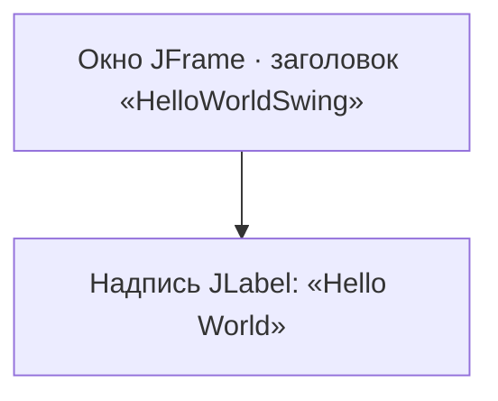

# Урок 1. Введение в Swing

**Трейл:** Creating a GUI with Swing · **Оригинал:** [Getting Started with Swing](https://docs.oracle.com/javase/tutorial/uiswing/start/index.html)
**Связанные области:** [[01-core-java-syntax-oop]] · **Вопросы:** core-java

> Перевод официального руководства Oracle (The Java Tutorials, JDK 8). Объединяет страницы
> *Getting Started with Swing*, *About the JFC and Swing* и *Compiling and Running Swing Programs*
> (включая пример *Hello World!* — `HelloWorldSwing`).

Этот урок даёт краткое введение в использование Swing. Сначала мы расскажем о Swing, а затем
проведём вас через компиляцию и запуск программы, использующей пакеты Swing.

Следующий урок — *Learning Swing with the NetBeans IDE* — будет развивать эти первые шаги и
поможет создать несколько всё более сложных примеров. Пока же начнём с основ.

## О JFC и Swing (About the JFC and Swing)

JFC — это сокращение от **Java Foundation Classes** (фундаментальные классы Java); под ним
понимают группу средств для построения графических интерфейсов пользователя (GUI, *graphical
user interfaces*) и добавления в Java-приложения богатой графики и интерактивности. JFC
определяется как набор перечисленных ниже возможностей.

| Возможность | Описание |
|-------------|----------|
| Компоненты GUI Swing (*Swing GUI Components*) | Включают всё — от кнопок до разделяемых панелей и таблиц. Многие компоненты способны, в числе прочего, к сортировке, печати, перетаскиванию (*drag and drop*). |
| Поддержка подключаемого внешнего вида (*Pluggable Look-and-Feel Support*) | Внешний вид и поведение (*look and feel*) Swing-приложений подключаемы, что позволяет выбирать оформление. Например, одна и та же программа может использовать оформление Java или Windows. Кроме того, платформа Java поддерживает оформление GTK+, благодаря чему Swing-программам становятся доступны сотни существующих оформлений. Множество других пакетов оформления доступно из различных источников. |
| API доступности (*Accessibility API*) | Позволяет вспомогательным технологиям — таким как программы чтения с экрана и дисплеи Брайля — получать информацию из пользовательского интерфейса. |
| API Java 2D (*Java 2D API*) | Позволяет разработчикам легко встраивать в приложения и апплеты высококачественную 2D-графику, текст и изображения. Java 2D включает обширные API для генерации и отправки высококачественного вывода на печатающие устройства. |
| Интернационализация (*Internationalization*) | Позволяет разработчикам создавать приложения, способные взаимодействовать с пользователями по всему миру на их родных языках и с учётом их культурных особенностей. С помощью каркаса методов ввода (*input method framework*) разработчики могут создавать приложения, принимающие текст на языках с тысячами различных символов — таких как японский, китайский или корейский. |

Этот трейл сосредоточен на компонентах Swing. Мы помогаем выбрать подходящие компоненты для
вашего GUI, рассказываем, как ими пользоваться, и даём фоновые знания, необходимые для их
эффективного применения. Прочие возможности мы также обсуждаем — в той мере, в какой они
касаются компонентов Swing.

### Какие пакеты Swing использовать?

API Swing мощный, гибкий — и огромный. В нём 18 публичных пакетов:

- `javax.accessibility`
- `javax.swing.plaf`
- `javax.swing.text`
- `javax.swing`
- `javax.swing.plaf.basic`
- `javax.swing.text.html`
- `javax.swing.border`
- `javax.swing.plaf.metal`
- `javax.swing.text.html.parser`
- `javax.swing.colorchooser`
- `javax.swing.plaf.multi`
- `javax.swing.text.rtf`
- `javax.swing.event`
- `javax.swing.plaf.synth`
- `javax.swing.tree`
- `javax.swing.filechooser`
- `javax.swing.table`
- `javax.swing.undo`

К счастью, большинство программ использует лишь небольшое подмножество этого API. Данный трейл
разбирает API за вас, давая примеры типичного кода и указывая на методы и классы, которые
вам, скорее всего, понадобятся. Большая часть кода в этом трейле использует лишь один-два пакета
Swing:

- `javax.swing`
- `javax.swing.event` (требуется не всегда)

## Компиляция и запуск Swing-программ (Compiling and Running Swing Programs)

Этот раздел объясняет, как скомпилировать и запустить Swing-приложение из командной строки.
О компиляции и запуске Swing-приложения в среде NetBeans IDE см. *Running Tutorial Examples in
NetBeans IDE*. Инструкции по компиляции работают для всех Swing-программ — как для апплетов, так
и для приложений. Вот шаги, которым нужно следовать:

- Установите последний выпуск платформы Java SE, если вы ещё этого не сделали.
- Создайте программу, использующую компоненты Swing.
- Скомпилируйте программу.
- Запустите программу.

### Установка последнего выпуска платформы Java SE

Последний выпуск JDK можно бесплатно загрузить с
http://www.oracle.com/technetwork/java/javase/downloads/index.html.

### Создание программы, использующей компоненты Swing

Вы можете воспользоваться простой программой, которую мы предоставляем, — она называется
`HelloWorldSwing` и выводит GUI, показанный на рисунке ниже. Программа умещается в один файл
`HelloWorldSwing.java`. При сохранении этого файла нужно точно соблюсти написание и регистр
его имени.

Пример `HelloWorldSwing.java`, как и все примеры из руководства по Swing, создан внутри пакета.
Если вы взглянете на исходный код, то увидите в начале файла такую строку:

```java
package start;
```

Это значит, что файл `HelloWorldSwing.java` нужно поместить внутрь каталога `start`. Компилируют
и запускают пример из каталога, лежащего на уровень выше каталога `start`. Примеры из урока
*Using Swing Components* находятся внутри пакета `components`, примеры из урока *Writing Event
Listeners* — внутри пакета `events`, и так далее. За дополнительными сведениями обратитесь к
уроку *Packages*.

Окно `HelloWorldSwing` представляет собой простой кадр (*frame*) с надписью «Hello World»:



### Компиляция программы

Следующий шаг — скомпилировать программу. Чтобы скомпилировать пример, выполните из каталога,
лежащего на уровень выше файла `HelloWorldSwing.java`:

```
javac start/HelloWorldSwing.java
```

При желании пример можно скомпилировать и из самого каталога `start`:

```
javac HelloWorldSwing.java
```

— но тогда не забудьте выйти из каталога `start`, чтобы запустить программу.

Если скомпилировать не удаётся, убедитесь, что вы используете компилятор из недавнего выпуска
платформы Java. Проверить версию компилятора или среды выполнения Java (JRE) можно следующими
командами:

```
javac -version
java -version
```

После обновления JDK вы должны иметь возможность пользоваться программами из этого трейла без
изменений. Ещё одна частая ошибка — установка JRE вместо полного комплекта разработчика Java
(JDK), необходимого для компиляции этих программ. Чтобы решить любые возникающие проблемы с
компиляцией, обратитесь к трейлу *Getting Started*. Другой ресурс — *Troubleshooting Guide for
Java™ SE 6 Desktop Technologies*.

### Запуск программы

После успешной компиляции программу можно запустить. Из каталога, лежащего на уровень выше
каталога `start`:

```
java start.HelloWorldSwing
```

## Пример «Hello World!» (HelloWorldSwing)

Ниже приведён полный исходный код примера `HelloWorldSwing.java`. Имена классов, методов и
переменных оставлены без изменений; переведены только комментарии.

```java
/*
 * Copyright (c) 1995, 2008, Oracle and/or its affiliates. All rights reserved.
 * [...текст лицензии BSD оставлен без изменений...]
 */

/**
 * Этот пример, как и все примеры Swing, существует внутри пакета:
 * в данном случае — пакета "start".
 * Если вы используете среду разработки (IDE), например NetBeans,
 * всё должно работать без проблем. Если же вы компилируете и
 * запускаете примеры из командной строки, это может сбить с толку,
 * когда вы не привыкли пользоваться именованными пакетами.
 * В большинстве случаев быстрое и грубое решение — удалить или
 * закомментировать строку "package" во всех исходных файлах, и
 * код должен заработать как ожидается. Объяснение того, как
 * использовать примеры Swing "как есть" из командной строки, см.
 * http://docs.oracle.com/javase/javatutorials/tutorial/uiswing/start/compile.html#package
 */
package start;

/*
 * HelloWorldSwing.java не требует никаких других файлов.
 */
import javax.swing.*;

public class HelloWorldSwing {
    /**
     * Создаёт GUI и показывает его. Ради потокобезопасности этот
     * метод следует вызывать из потока обработки событий
     * (event-dispatching thread).
     */
    private static void createAndShowGUI() {
        //Создаём и настраиваем окно.
        JFrame frame = new JFrame("HelloWorldSwing");
        frame.setDefaultCloseOperation(JFrame.EXIT_ON_CLOSE);

        //Добавляем вездесущую надпись "Hello World".
        JLabel label = new JLabel("Hello World");
        frame.getContentPane().add(label);

        //Отображаем окно.
        frame.pack();
        frame.setVisible(true);
    }

    public static void main(String[] args) {
        //Планируем задание для потока обработки событий:
        //создание и показ GUI этого приложения.
        javax.swing.SwingUtilities.invokeLater(new Runnable() {
            public void run() {
                createAndShowGUI();
            }
        });
    }
}
```

> Примечание о потоках. Графический интерфейс создаётся не напрямую в `main`, а передаётся в
> поток обработки событий (*event-dispatching thread*) через `SwingUtilities.invokeLater`.
> Компоненты Swing по большей части не потокобезопасны, поэтому код, обращающийся к ним, должен
> выполняться в этом единственном потоке.

## Источник

- [Getting Started with Swing](https://docs.oracle.com/javase/tutorial/uiswing/start/index.html) — официальное руководство Oracle (индекс урока).
- [About the JFC and Swing](https://docs.oracle.com/javase/tutorial/uiswing/start/about.html) — официальное руководство Oracle.
- [Compiling and Running Swing Programs](https://docs.oracle.com/javase/tutorial/uiswing/start/compile.html) — официальное руководство Oracle.
- [HelloWorldSwing.java](https://docs.oracle.com/javase/tutorial/uiswing/examples/start/HelloWorldSwingProject/src/start/HelloWorldSwing.java) — исходный код примера.
