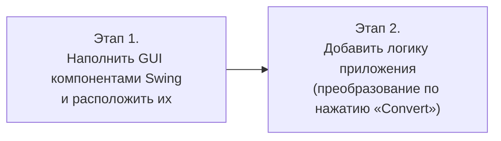

# Урок 2. Изучение Swing в NetBeans IDE

**Трейл:** Creating a GUI with Swing · **Оригинал:** [Learning Swing with the NetBeans IDE](https://docs.oracle.com/javase/tutorial/uiswing/learn/index.html)
**Связанные области:** [[01-core-java-syntax-oop]] · **Вопросы:** core-java

> Перевод официального руководства Oracle (The Java Tutorials, JDK 8).

## Обзор

> Цель этого урока — познакомить с программным интерфейсом (API) Swing, спроектировав
> простое приложение, которое переводит температуру из шкалы Цельсия в шкалу Фаренгейта.
> Его графический интерфейс (GUI) будет элементарным и затронет лишь часть доступных
> компонентов Swing. Мы будем использовать конструктор интерфейсов (GUI builder) среды
> NetBeans IDE, который превращает создание пользовательского интерфейса в простое
> перетаскивание мышью (drag and drop). Возможность автоматической генерации кода упрощает
> процесс разработки графического интерфейса, позволяя сосредоточиться на логике приложения,
> а не на лежащей в основе инфраструктуре.

> Поскольку этот урок представляет собой пошаговый перечень конкретных действий, мы
> рекомендуем запустить NetBeans IDE и выполнять каждый шаг по мере чтения. Это самый
> быстрый и простой способ начать программировать на Swing. Если такой возможности нет,
> то и простое чтение урока будет полезным, поскольку каждый шаг проиллюстрирован снимками
> экрана.

> С точки зрения конечного пользователя работа с приложением проста: введите температуру
> (в градусах Цельсия) в текстовое поле, нажмите кнопку «Convert» («Преобразовать») и
> наблюдайте, как на экране появляется преобразованная температура (в градусах Фаренгейта).
> Кнопки свернуть, развернуть и закрыть будут вести себя ожидаемым образом, а у приложения
> также будет заголовок, отображаемый в верхней части окна.

*Подпись к изображению (оригинал «The CelsiusConverter Application»):* окно готового
приложения «Celsius Converter» — текстовое поле для ввода с подписью «Celsius», кнопка
«Convert» и подпись «Fahrenheit» для вывода результата.

> С точки зрения программиста мы будем писать приложение в два основных этапа. Сначала мы
> наполним графический интерфейс различными компонентами Swing и расположим их так, как
> показано выше. Затем добавим логику приложения, чтобы программа действительно выполняла
> преобразование, когда пользователь нажимает кнопку «Convert».

<!-- original: none | Авторская блок-схема этапов разработки; Oracle показывает только скриншоты NetBeans IDE -->


## Настройка проекта CelsiusConverter

> Если вы уже работали с NetBeans IDE, многое в этом разделе покажется знакомым, поскольку
> начальные шаги похожи для большинства проектов. Тем не менее следующие шаги описывают
> настройки, специфичные для этого приложения, поэтому будьте внимательны и точно следуйте им.

### Шаг 1. Создать новый проект

> Чтобы создать новый проект, запустите NetBeans IDE и выберите в меню «File» («Файл») пункт
> «New Project» («Новый проект»).

*Подпись к снимку экрана:* меню «File» с выбранным пунктом «New Project».

> Сочетания клавиш для каждой команды отображаются справа от соответствующего пункта меню.
> Внешний вид и оформление (look and feel) NetBeans IDE могут различаться на разных платформах,
> но функциональность остаётся прежней.

### Шаг 2. Выбрать General → Java Application

> Затем выберите «General» («Общие») в столбце «Categories» («Категории») и «Java Application»
> («Приложение Java») в столбце «Projects» («Проекты»).

*Подпись к снимку экрана:* диалог «New Project» с выбранными категорией «General» и типом
проекта «Java Application». (В оригинале изображение уменьшено для размещения на странице.)

> Возможно, в области описания вы заметите упоминание «J2SE» — это старое название платформы,
> которая сейчас известна как «Java SE». Нажмите кнопку «Next» («Далее»), чтобы продолжить.

### Шаг 3. Задать имя проекта

> Теперь введите «CelsiusConverterProject» в качестве имени проекта. Поля «Project Location»
> («Расположение проекта») и «Project Folder» («Папка проекта») можно оставить со значениями
> по умолчанию или нажать кнопку «Browse» («Обзор»), чтобы выбрать другое расположение в
> вашей системе.

*Подпись к снимку экрана:* диалог с введённым именем проекта «CelsiusConverterProject».

> Обязательно снимите флажок «Create Main Class» («Создать главный класс»): если оставить эту
> опцию включённой, будет создан новый класс в качестве главной точки входа в приложение, но
> эту роль выполнит наше главное окно GUI (создаваемое на следующем шаге), поэтому устанавливать
> этот флажок не нужно. Когда закончите, нажмите кнопку «Finish» («Готово»).

*Подпись к снимку экрана:* основное окно NetBeans IDE после загрузки.

> Когда среда завершит загрузку, вы увидите экран, похожий на показанный выше. Все области
> будут пусты, кроме области «Projects» («Проекты») в левом верхнем углу, где показан только
> что созданный проект.

### Шаг 4. Добавить форму JFrame

*Подпись к снимку экрана:* контекстное меню проекта с выбором «New → JFrame Form».

> Теперь щёлкните правой кнопкой мыши по имени проекта «CelsiusConverterProject» и выберите
> «New → JFrame Form» («Создать → Форма JFrame»). (`JFrame` — это класс Swing, отвечающий за
> главный кадр (main frame) вашего приложения.) Как назначить этот класс точкой входа в
> приложение, вы узнаете далее в этом уроке.

### Шаг 5. Задать имя класса GUI

> Затем введите `CelsiusConverterGUI` в качестве имени класса и `learn` в качестве имени пакета.
> На самом деле этот пакет можно назвать как угодно, но здесь мы следуем принятому в руководстве
> соглашению — называть пакет по имени урока, в котором он находится.

*Подпись к снимку экрана:* диалог «New JFrame Form» с заполненными полями имени класса и пакета.

> Остальные поля должны заполниться автоматически, как показано выше. Когда закончите, нажмите
> кнопку «Finish» («Готово»).

*Подпись к снимку экрана:* область конструктора с графическим представлением `CelsiusConverterGUI`.

> Когда среда завершит загрузку, в правой области отобразится графическое представление
> `CelsiusConverterGUI` времени разработки (design-time). Именно на этом экране вы будете
> визуально перетаскивать, размещать и настраивать различные компоненты Swing.

## Основы NetBeans IDE

> Чтобы изучить возможности NetBeans IDE по созданию графического интерфейса, не обязательно
> осваивать каждую функцию среды. На самом деле единственные функции, которые действительно
> нужно понимать, — это *Палитра* («Palette»), *Область конструктора* («Design Area»),
> *Редактор свойств* («Property Editor») и *Инспектор* («Inspector»). Их мы и обсудим ниже.

### Палитра (Palette)

> Палитра содержит все компоненты, предлагаемые API Swing. Вероятно, вы уже можете догадаться,
> для чего нужны многие из этих компонентов, даже если используете их впервые (`JLabel` — это
> текстовая метка, `JList` — выпадающий список и т. д.).

*Подпись к снимку экрана:* панель «Palette» со списком компонентов Swing. (В оригинале
изображение уменьшено для размещения на странице.)

> Из этого списка наше приложение будет использовать только `JLabel` (простую текстовую метку),
> `JTextField` (для ввода температуры пользователем) и `JButton` (для преобразования температуры
> из Цельсия в Фаренгейт).

### Область конструктора (Design Area)

> Область конструктора — это место, где вы будете визуально создавать свой графический интерфейс.
> У неё есть два представления: *представление исходного кода* («source view») и *представление
> конструктора* («design view»). По умолчанию используется представление конструктора, как
> показано ниже. Переключаться между представлениями можно в любой момент, щёлкая по
> соответствующим вкладкам.

*Подпись к снимку экрана:* область конструктора в режиме «design view» с пустым объектом
`JFrame`. (В оригинале изображение уменьшено для размещения на странице.)

> На рисунке выше показан единственный объект `JFrame`, представленный большим затенённым
> прямоугольником с синей рамкой. Обычно ожидаемое поведение (например, завершение работы, когда
> пользователь нажимает кнопку «закрыть») генерируется средой автоматически и появляется в
> представлении исходного кода между нередактируемыми синими участками кода, известными как
> *защищённые блоки* («guarded blocks»).

*Подпись к снимку экрана:* представление исходного кода с автоматически сгенерированным методом
`initComponents`. (В оригинале изображение уменьшено для размещения на странице.)

> Беглый взгляд на представление исходного кода показывает, что среда создала закрытый (private)
> метод с именем `initComponents`, который инициализирует различные компоненты графического
> интерфейса. Он также указывает приложению «завершать работу при закрытии» («exit on close»),
> выполняет некоторые задачи, связанные с компоновкой (layout), а затем плотно размещает
> (packs) друг относительно друга компоненты, которые вскоре будут добавлены.

> Не считайте, что вам нужно детально разбираться в этом коде; мы упоминаем его здесь лишь для
> того, чтобы изучить вкладку исходного кода. Подробнее об этих компонентах см.:
> [How to Make Frames (Main Windows)](https://docs.oracle.com/javase/tutorial/uiswing/components/frame.html)
> («Как создавать кадры (главные окна)») и
> [Laying Out Components Within a Container](https://docs.oracle.com/javase/tutorial/uiswing/layout/index.html)
> («Компоновка компонентов внутри контейнера»).

### Редактор свойств (Property Editor)

> Редактор свойств делает то, что подразумевает его название: позволяет редактировать свойства
> каждого компонента. Редактор свойств интуитивно понятен в использовании; в нём вы увидите ряд
> строк — по одной строке на свойство, — которые можно щёлкать и редактировать, не обращаясь
> напрямую к исходному коду. На следующем рисунке показан редактор свойств для только что
> добавленного объекта `JFrame`.

*Подпись к снимку экрана:* редактор свойств объекта `JFrame`. (В оригинале изображение
уменьшено для размещения на странице.)

> Снимок экрана выше показывает различные свойства этого объекта, такие как цвет фона
> (background color), цвет переднего плана (foreground color), шрифт (font) и курсор (cursor).

### Инспектор (Inspector)

> Последний компонент NetBeans IDE, который мы будем использовать в этом уроке, — это Инспектор.

*Подпись к снимку экрана:* панель «Inspector» с деревом компонентов приложения.

> Инспектор предоставляет графическое представление компонентов вашего приложения. Мы используем
> Инспектор лишь однажды — чтобы изменить несколько имён переменных на отличные от значений по
> умолчанию.

## Создание графического интерфейса CelsiusConverter

> В этом разделе объясняется, как использовать NetBeans IDE для создания графического интерфейса
> приложения. По мере того как вы перетаскиваете каждый компонент из Палитры в Область
> конструктора, среда автоматически генерирует соответствующий исходный код.

### Шаг 1. Задать заголовок

> Сначала задайте заголовок (title) объекта `JFrame` приложения — «Celsius Converter», —
> однократно щёлкнув по `JFrame` в Инспекторе.

*Подпись к снимку экрана (оригинал «Selecting the JFrame»):* выбор объекта `JFrame` в
Инспекторе.

> Затем задайте его заголовок с помощью редактора свойств.

*Подпись к снимку экрана (оригинал «Setting the Title»):* установка свойства «title» в редакторе
свойств.

> Задать заголовок можно либо двойным щелчком по свойству «title» с непосредственным вводом
> нового текста, либо нажатием кнопки с многоточием (ellipsis button) с вводом заголовка в
> предоставленном поле. Либо в качестве сокращённого способа можно однократно щёлкнуть по
> `JFrame` в инспекторе и ввести его новый текст напрямую, не используя редактор свойств.

### Шаг 2. Добавить JTextField

> Затем перетащите `JTextField` из Палитры в левый верхний угол Области конструктора. По мере
> приближения к левому верхнему углу конструктор интерфейсов предоставляет визуальные подсказки
> (пунктирные линии), предлагающие подходящие отступы. Используя эти подсказки в качестве
> ориентира, поместите `JTextField` в левый верхний угол окна, как показано ниже.

*Подпись к снимку экрана (оригинал «Adding a JTextField»):* добавление `JTextField` в левый
верхний угол.

> У вас может возникнуть желание стереть текст по умолчанию «JTextField1», но пока оставьте его
> на месте. Мы заменим его позже в этом уроке, когда будем вносить окончательные правки в каждый
> компонент. Подробнее об этом компоненте см.
> [How to Use Text Fields](https://docs.oracle.com/javase/tutorial/uiswing/components/textfield.html)
> («Как использовать текстовые поля»).

### Шаг 3. Добавить JLabel

> Затем перетащите `JLabel` в Область конструктора. Поместите его справа от `JTextField`, снова
> следя за визуальными подсказками, предлагающими подходящую величину отступа. Убедитесь, что
> базовая линия текста (text base) этого компонента выровнена с базовой линией `JTextField`.
> Визуальные подсказки, предоставляемые средой, должны облегчить определение этого.

*Подпись к снимку экрана (оригинал «Adding a JLabel»):* добавление `JLabel` справа от
`JTextField`.

> Подробнее об этом компоненте см.
> [How to Use Labels](https://docs.oracle.com/javase/tutorial/uiswing/components/label.html)
> («Как использовать метки»).

### Шаг 4. Добавить JButton

> Затем перетащите `JButton` из Палитры и расположите его слева и под `JTextField`. И снова
> визуальные подсказки помогают установить его на место.

*Подпись к снимку экрана (оригинал «Adding a JButton»):* добавление `JButton` под `JTextField`.

> У вас может возникнуть желание вручную подогнать ширину `JButton` и `JTextField`, но пока
> оставьте их как есть. Как правильно настроить эти компоненты, вы узнаете позже в этом уроке.
> Подробнее об этом компоненте см.
> [How to Use Buttons](https://docs.oracle.com/javase/tutorial/uiswing/components/button.html)
> («Как использовать кнопки»).

### Шаг 5. Добавить второй JLabel

*Подпись к снимку экрана (оригинал «Adding a Second JLabel»):* добавление второго `JLabel`
справа от `JButton`.

> Наконец, добавьте второй `JLabel`, повторив процесс из шага 2. Поместите эту вторую метку
> справа от `JButton`, как показано выше.

## Корректировка графического интерфейса CelsiusConverter

> Теперь, когда компоненты графического интерфейса на месте, пришло время внести окончательные
> правки. Сделать это можно несколькими способами; предложенный здесь порядок — лишь один из
> возможных подходов.

### Шаг 1. Задать текст компонентов

> Сначала дважды щёлкните по `JTextField` и `JButton`, чтобы изменить текст по умолчанию,
> вставленный средой. Когда вы сотрёте текст из `JTextField`, он уменьшится в размере, как
> показано ниже. Измените текст `JButton` с «JButton1» на «Convert». Также измените текст
> верхней метки `JLabel` на «Celsius», а нижней — на «Fahrenheit».

*Подпись к снимку экрана (оригинал «Setting the Component Text»):* компоненты с заданным
текстом — поле ввода, метки «Celsius» и «Fahrenheit», кнопка «Convert».

### Шаг 2. Задать размер компонентов

> Затем щёлкните по компонентам `JTextField` и `JButton`, удерживая клавишу Shift (shift-click).
> Это выделит каждый из них, показывая, что они выбраны. Щёлкните правой кнопкой мыши
> (control-click для пользователей Mac) → «Same Size → Same Width» («Одинаковый размер →
> Одинаковая ширина»). Теперь компоненты будут одинаковой ширины, как показано ниже. При
> выполнении этого шага убедитесь, что сам `JFrame` также не выбран. Если он выбран, меню
> «Same Size» будет неактивно.

*Подпись к снимку экрана (оригинал «Setting the JTextField and JButton Sizes»):* поле ввода и
кнопка, приведённые к одинаковой ширине.

### Шаг 3. Убрать лишнее пространство

> Наконец, возьмитесь за правый нижний угол `JFrame` и отрегулируйте его размер, чтобы устранить
> любое лишнее свободное пространство. Обратите внимание: если убрать всё лишнее пространство
> (как показано ниже), заголовок (который появляется только во время выполнения) может
> отображаться не полностью. Конечный пользователь волен изменять размер приложения по своему
> усмотрению, но вы, возможно, захотите оставить немного свободного места с правой стороны, чтобы
> убедиться, что всё помещается корректно. Поэкспериментируйте и используйте снимок экрана
> готового графического интерфейса в качестве ориентира.

*Подпись к снимку экрана (оригинал «The Completed GUI»):* готовый графический интерфейс
приложения.

> Графическая часть этого приложения теперь завершена! Если NetBeans IDE сделала свою работу,
> вы должны почувствовать, что создание этого интерфейса было простой, если не тривиальной,
> задачей. Но потратьте минуту, чтобы щёлкнуть по вкладке исходного кода; вы можете удивиться
> количеству сгенерированного кода.

*Подпись к снимку экрана:* представление исходного кода со сгенерированным кодом интерфейса.
(В оригинале изображение уменьшено для размещения на странице.)

> Чтобы увидеть код целиком, прокручивайте его вверх и вниз внутри среды по мере необходимости.
> Вы можете разворачивать или сворачивать определённые блоки кода (например, тела методов),
> щёлкая по символу «+» или «−» в левой части редактора исходного кода.

## Добавление логики приложения

### Шаг 1. Изменить имена переменных по умолчанию

Щёлкните правой кнопкой мыши по каждому имени переменной в Инспекторе и выберите «Change
variable name» («Изменить имя переменной»), чтобы переименовать имена компонентов по умолчанию
в более осмысленные.

Сопоставление имён:

- `jTextField1` → `tempTextField`
- `jLabel1` → `celsiusLabel`
- `jButton1` → `convertButton`
- `jLabel2` → `fahrenheitLabel`

> Каждое изменение, которое вы вносите в Инспекторе, будет автоматически распространяться обратно
> в исходный код. Вы можете быть уверены, что компиляция не завершится сбоем из-за опечаток или
> подобных ошибок — ошибок, которые часто возникают при редактировании вручную.

### Шаг 2. Зарегистрировать слушателей событий

> В Области конструктора щёлкните по кнопке «Convert», чтобы выбрать её. Убедитесь, что выбрана
> *только* кнопка «Convert» (если также выбран сам `JFrame`, этот шаг не сработает). Щёлкните
> правой кнопкой мыши по кнопке «Convert» и выберите «Events → Action → ActionPerformed»
> («События → Действие → ActionPerformed»).

Это сгенерирует необходимый код обработки событий с пустыми телами методов для вашей
функциональности.

### Шаг 3. Добавить код преобразования температуры

Скопируйте и вставьте код преобразования температуры в метод `convertButtonActionPerformed`:

```java
// Разобрать введённое значение в градусах Цельсия как double и преобразовать в Фаренгейт.
int tempFahr = (int)((Double.parseDouble(tempTextField.getText()))
        * 1.8 + 32);
fahrenheitLabel.setText(tempFahr + " Fahrenheit");
```

### Шаг 4. Запустить приложение

> Запуск приложения сводится к выбору «Run → Run Main Project» («Запуск → Запустить главный
> проект») в NetBeans IDE. При первом запуске этого приложения вам будет предложено диалоговое
> окно с просьбой назначить `CelsiusConverterGUI` главным классом (main class) для этого проекта.
> Нажмите кнопку «OK», и когда программа завершит компиляцию, вы увидите приложение, работающее
> в собственном окне.

## Источник

- [Learning Swing with the NetBeans IDE](https://docs.oracle.com/javase/tutorial/uiswing/learn/index.html) — официальное руководство Oracle (обзор урока).
- [Setting up the CelsiusConverter Project](https://docs.oracle.com/javase/tutorial/uiswing/learn/settingup.html) — официальное руководство Oracle.
- [NetBeans IDE Basics](https://docs.oracle.com/javase/tutorial/uiswing/learn/netbeansbasics.html) — официальное руководство Oracle.
- [Creating the CelsiusConverter GUI](https://docs.oracle.com/javase/tutorial/uiswing/learn/creatinggui.html) — официальное руководство Oracle.
- [Adjusting the CelsiusConverter GUI](https://docs.oracle.com/javase/tutorial/uiswing/learn/adjustinggui.html) — официальное руководство Oracle.
- [Adding the Application Logic](https://docs.oracle.com/javase/tutorial/uiswing/learn/logic.html) — официальное руководство Oracle.
