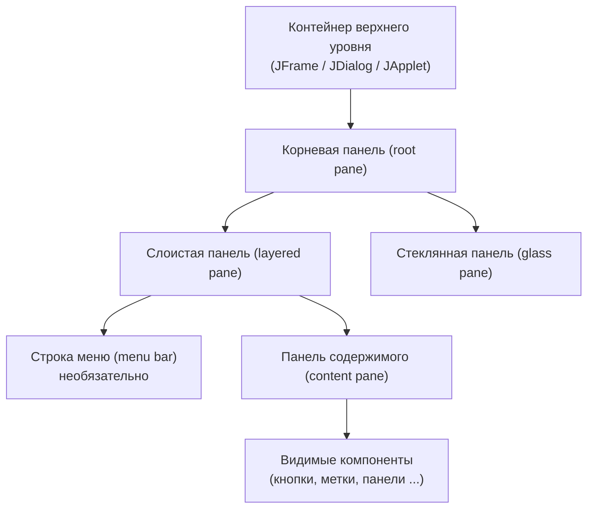
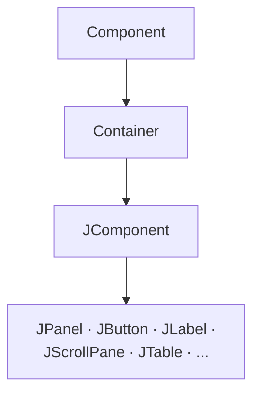
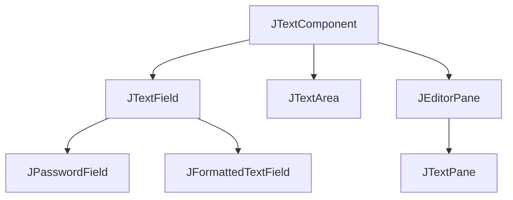

# Урок 3. Использование компонентов Swing

**Трейл:** Creating a GUI with Swing · **Оригинал:** [Using Swing Components](https://docs.oracle.com/javase/tutorial/uiswing/components/index.html)
**Связанные области:** [[01-core-java-syntax-oop]] · **Вопросы:** core-java

> Перевод официального руководства Oracle (The Java Tutorials, JDK 8). Объединяет
> вводную страницу урока *Using Swing Components* и подстраницы по контейнерам верхнего
> уровня, классу `JComponent`, текстовым компонентам и отдельным компонентам
> («How to Use ...»). Перечни методов оформлены таблицами, иерархия контейнеров —
> диаграммой Mermaid. Комментарии в коде переведены на русский, имена классов,
> методов и переменных сохранены как в оригинале.

Этот урок даёт фоновые знания, необходимые для работы с компонентами Swing, а затем
описывает каждый компонент. Предполагается, что вы уже успешно скомпилировали и запустили
программу, использующую компоненты Swing, и знакомы с базовыми понятиями Swing.

## Структура урока

Оригинальный урок состоит из следующих разделов:

| Раздел | О чём |
|--------|-------|
| Using Top-Level Containers | Возможности, общие для классов `JFrame`, `JDialog` и `JApplet`: панели содержимого (content panes), строки меню и корневые панели (root panes); иерархия вложенности (containment hierarchy). |
| The JComponent Class | Возможности, которые `JComponent` предоставляет своим подклассам (почти всем компонентам Swing). |
| Using Text Components | Возможности и API, общие для всех потомков `JTextComponent`. |
| How to Use ... | Отдельные страницы по каждому компоненту (кнопки, метки, поля, списки, меню, диалоги, таблицы, деревья и т. д.). |
| How to Use HTML / Models / Borders / Icons | Вспомогательные темы: HTML в компонентах, архитектура моделей (MVC), рамки, значки. |
| Solving Common Component Problems | Решения типовых проблем с компонентами. |

## Визуальный указатель компонентов (A Visual Index to the Swing Components)

Компоненты Swing группируются по назначению. Ниже — категории и относящиеся к ним классы
(по индексу урока).

| Категория | Компоненты |
|-----------|------------|
| Контейнеры верхнего уровня (top-level containers) | `JFrame`, `JDialog`, `JApplet` |
| Контейнеры общего назначения (general-purpose containers) | `JPanel`, `JScrollPane`, `JSplitPane`, `JTabbedPane`, `JToolBar` |
| Контейнеры специального назначения (special-purpose containers) | `JInternalFrame`, `JLayeredPane`, корневая панель (root pane) |
| Базовые элементы управления (basic controls) | `JButton`, `JCheckBox`, `JRadioButton`, `JComboBox`, `JList`, `JMenu`, `JSlider`, `JSpinner`, `JTextField` |
| Нередактируемые отображения информации (uneditable information displays) | `JLabel`, `JProgressBar`, `JSeparator`, `JToolTip` |
| Интерактивные отображения форматированной информации (interactive displays) | `JColorChooser`, `JEditorPane`/`JTextPane`, `JFileChooser`, `JTable`, `JTree`, `JText`-компоненты |

## Контейнеры верхнего уровня (Using Top-Level Containers)

Swing предоставляет три обычно используемых класса контейнеров верхнего уровня: `JFrame`,
`JDialog` и `JApplet`. Ключевые факты:

- Чтобы появиться на экране, каждый компонент GUI должен входить в **иерархию вложенности**
  (*containment hierarchy*) — дерево компонентов с контейнером верхнего уровня в качестве корня.
- Каждый компонент GUI может содержаться только в одном месте. Если компонент уже находится
  в контейнере и вы добавляете его в другой, он удаляется из первого.
- У каждого контейнера верхнего уровня есть **панель содержимого** (*content pane*), которая
  содержит (прямо или косвенно) видимые компоненты.
- К контейнеру верхнего уровня можно добавить **строку меню** (*menu bar*) — она располагается
  внутри контейнера, но вне панели содержимого.

**Примечание.** `JInternalFrame` имитирует `JFrame`, но на самом деле контейнером верхнего
уровня не является.

### Добавление компонентов в панель содержимого

Метод `getContentPane()` возвращает объект `Container` (не `JComponent`). По умолчанию панель
содержимого — это простой промежуточный контейнер с менеджером компоновки `BorderLayout`.

```java
// Получить панель содержимого фрейма и добавить компонент в центр
frame.getContentPane().add(yellowLabel, BorderLayout.CENTER);
```

Чтобы задать свою панель содержимого, используйте `setContentPane()`:

```java
// Создать панель и добавить в неё компоненты
JPanel contentPane = new JPanel(new BorderLayout());
contentPane.setBorder(someBorder);
contentPane.add(someComponent, BorderLayout.CENTER);
contentPane.add(anotherComponent, BorderLayout.PAGE_END);

topLevelContainer.setContentPane(contentPane);
```

Методы `add`, `remove` и `setLayout` переопределены так, чтобы при необходимости
перенаправляться на панель содержимого. Поэтому можно писать короче:

```java
// Добавляет дочерний компонент прямо в панель содержимого
frame.add(child);
```

### Добавление строки меню

Создайте объект `JMenuBar`, заполните его меню и вызовите `setJMenuBar()`:

```java
frame.setJMenuBar(greenMenuBar);
```

### Корневая панель (root pane)

Каждый контейнер верхнего уровня опирается на промежуточный контейнер — **корневую панель**
(*root pane*). Она управляет панелью содержимого и строкой меню. Корневая панель предоставляет
фрейму четыре составляющих:

| Составляющая | Назначение |
|--------------|------------|
| Слоистая панель (layered pane) | Содержит строку меню и панель содержимого; обеспечивает Z-упорядочение (наложение по слоям) других компонентов. |
| Строка меню (menu bar) | Необязательная строка меню внутри контейнера верхнего уровня. |
| Панель содержимого (content pane) | Содержит видимые компоненты GUI. |
| Стеклянная панель (glass pane) | Часто используется для перехвата ввода над контейнером; может рисовать поверх нескольких компонентов. |

### Иерархия контейнера верхнего уровня

<!-- original: assets/08-swing-gui/root-pane-hierarchy.gif | Схема основных панелей корневой панели JFrame: слоистая панель, строка меню, панель содержимого, стеклянная панель (Oracle Tutorial) -->


## Класс JComponent (The JComponent Class)

За исключением контейнеров верхнего уровня, все компоненты Swing, имена которых начинаются
с «J», наследуются от класса `JComponent` (например, `JPanel`, `JScrollPane`, `JButton`,
`JTable`). А вот `JFrame` и `JDialog` — нет, поскольку они реализуют контейнеры верхнего уровня.

Класс `JComponent` расширяет `Container`, который, в свою очередь, расширяет `Component`.

<!-- original: none | Oracle не публикует отдельную схему иерархии Component→Container→JComponent -->


### Возможности JComponent

`JComponent` предоставляет потомкам следующую функциональность:

| Возможность | Описание |
|-------------|----------|
| Всплывающие подсказки (tool tips) | Метод `setToolTipText` задаёт строку, показываемую в маленьком окне при наведении курсора. |
| Рисование и рамки (painting and borders) | `setBorder` задаёт рамку по краям; для рисования внутренней области переопределяют `paintComponent`. |
| Подключаемый внешний вид (pluggable look and feel) | У каждого `JComponent` есть объект `ComponentUI`, отвечающий за отрисовку, обработку событий и размеры; внешний вид задаётся через `UIManager.setLookAndFeel`. |
| Пользовательские свойства (custom properties) | С компонентом можно связать пары «имя/объект» через `putClientProperty`/`getClientProperty`. |
| Поддержка компоновки (layout) | Сеттеры `setMinimumSize`, `setMaximumSize`, `setAlignmentX`, `setAlignmentY`. |
| Поддержка доступности (accessibility) | API для вспомогательных технологий (например, экранных дикторов). |
| Поддержка drag and drop | API для установки обработчика передачи данных (`transfer handler`). |
| Двойная буферизация (double buffering) | Сглаживает отрисовку на экране. |
| Привязки клавиш (key bindings) | Реакция на нажатия клавиш (например, Space на кнопке с фокусом = клик мышью). |

### API класса JComponent

Настройка внешнего вида:

| Метод | Назначение |
|-------|------------|
| `void setBorder(Border)` / `Border getBorder()` | Задать или получить рамку компонента. |
| `void setForeground(Color)` / `void setBackground(Color)` | Задать цвет переднего плана (обычно текста) или фона. |
| `Color getForeground()` / `Color getBackground()` | Получить цвет переднего плана или фона. |
| `void setOpaque(boolean)` / `boolean isOpaque()` | Задать/получить непрозрачность. Непрозрачный компонент закрашивает фон цветом фона. |
| `void setFont(Font)` / `Font getFont()` | Задать/получить шрифт (по умолчанию наследуется от родителя). |
| `void setCursor(Cursor)` / `Cursor getCursor()` | Задать/получить курсор над компонентом. |

Рисование компонентов:

| Метод | Назначение |
|-------|------------|
| `void repaint()` / `void repaint(int, int, int, int)` | Запросить перерисовку всего компонента или прямоугольной области (x, y, ширина, высота). |
| `void revalidate()` | Запросить повторную компоновку компонента и затронутых контейнеров. После `revalidate` всегда вызывайте `repaint`. |
| `void paintComponent(Graphics)` | Отрисовка компонента. Переопределяется для своих компонентов. |

Размеры и компоновка:

| Метод | Назначение |
|-------|------------|
| `void setPreferredSize(Dimension)` / `setMaximumSize` / `setMinimumSize` | Задать предпочтительный, максимальный и минимальный размеры (в пикселях). Это лишь подсказки и могут игнорироваться некоторыми менеджерами компоновки. |
| `void setAlignmentX(float)` / `setAlignmentY(float)` | Задать выравнивание по оси X/Y (число от 0 до 1: 0 — у начала координат, 0.5 — по центру, 1 — дальше всего). |
| `void setLayout(LayoutManager)` / `LayoutManager getLayout()` | Задать/получить менеджер компоновки. |

## Текстовые компоненты (Using Text Components)

Все текстовые компоненты Swing наследуются от суперкласса `JTextComponent`, который даёт
«гибко настраиваемую и мощную основу для работы с текстом».

<!-- original: assets/08-swing-gui/text-component-hierarchy.png | Иерархия текстовых компонентов Swing: JTextComponent и его подклассы (Oracle Tutorial) -->


| Категория | Классы | Описание |
|-----------|--------|----------|
| Текстовые элементы управления (text controls) | `JTextField`, `JPasswordField`, `JFormattedTextField` | Отображают одну строку редактируемого текста, генерируют события действия. Для получения небольшого объёма текста. |
| Простые текстовые области (plain text areas) | `JTextArea` | Несколько строк редактируемого текста одним шрифтом. Для неформатированного текста любой длины. |
| Стилизованные текстовые области (styled text) | `JEditorPane`, `JTextPane` | Редактируемый текст с несколькими шрифтами, встроенными изображениями и компонентами. Мощные, но требуют больше кода. |

## Кнопки, флажки и переключатели (Buttons, Check Boxes, Radio Buttons)

| Класс | Назначение |
|-------|------------|
| `JButton` | Обычная кнопка; при нажатии генерирует событие действия (action event). |
| `JCheckBox` | Флажок; в группе можно выбрать любое число элементов (ни одного, несколько, все). |
| `JRadioButton` | Переключатель; по соглашению в группе выбран только один. |

Все они наследуются от `AbstractButton`, который предоставляет общий API кнопок: `setText`/`getText`,
`setIcon`/`getIcon`, `setMnemonic`, `setActionCommand`, `addActionListener`, `addItemListener`,
`setSelected`/`isSelected`, `setHorizontalAlignment` и др.

```java
// Обычная кнопка с обработчиком действия
JButton button = new JButton("Click Me");
button.setMnemonic(KeyEvent.VK_C);      // клавиша-мнемоника Alt+C
button.setActionCommand("myAction");
button.addActionListener(this);

public void actionPerformed(ActionEvent e) {
    if ("myAction".equals(e.getActionCommand())) {
        // Обработать нажатие кнопки
    }
}
```

Переключатели объединяются в `ButtonGroup`, чтобы в один момент был выбран только один:

```java
JRadioButton option1 = new JRadioButton("Option 1");
option1.setActionCommand("option1");

JRadioButton option2 = new JRadioButton("Option 2");
option2.setActionCommand("option2");

// Группа гарантирует выбор только одного переключателя
ButtonGroup group = new ButtonGroup();
group.add(option1);
group.add(option2);

option1.addActionListener(this);
option2.addActionListener(this);
```

## Метки (Labels)

`JLabel` отображает невыделяемый текст и/или изображение. Если компонент интерактивен и имеет
состояние, используйте кнопку, а не метку. По умолчанию метки непрозрачны не являются — чтобы
закрасить фон, включите `setOpaque(true)`.

Основные конструкторы: `JLabel()`, `JLabel(String)`, `JLabel(Icon)`, `JLabel(String, int)`,
`JLabel(Icon, int)`, `JLabel(String, Icon, int)`. Аргумент `int` задаёт горизонтальное
выравнивание (`LEFT`, `CENTER`, `RIGHT`, `LEADING`, `TRAILING`).

| Метод | Назначение |
|-------|------------|
| `void setText(String)` | Задать отображаемый текст. |
| `void setIcon(Icon)` | Задать отображаемое изображение. |
| `void setHorizontalAlignment(int)` | Горизонтальное размещение содержимого. |
| `void setVerticalAlignment(int)` | Вертикальное размещение (`TOP`, `CENTER`, `BOTTOM`). |
| `void setHorizontalTextPosition(int)` / `setVerticalTextPosition(int)` | Положение текста относительно изображения. |
| `void setDisplayedMnemonic(char)` | Буква-клавиша-альтернатива. |
| `void setLabelFor(Component)` | Указать компонент, который описывает эта метка (для доступности). |

```java
ImageIcon icon = createImageIcon("images/middle.gif");

// Метка с изображением и текстом, текст под изображением по центру
label1 = new JLabel("Image and Text", icon, JLabel.CENTER);
label1.setVerticalTextPosition(JLabel.BOTTOM);
label1.setHorizontalTextPosition(JLabel.CENTER);

label2 = new JLabel("Text-Only Label");   // только текст
label3 = new JLabel(icon);                // только изображение
```

## Текстовые поля (Text Fields)

`JTextField` — базовый элемент для ввода небольшого объёма текста в одну строку. Когда
пользователь завершает ввод (обычно нажатием Enter), поле генерирует событие действия.
Для нескольких строк используйте текстовую область (`JTextArea`).

Конструкторы: `JTextField()`, `JTextField(String)`, `JTextField(int)`, `JTextField(String, int)`.
Аргумент `int` задаёт ширину в столбцах (не ограничивает число вводимых символов).

| Метод | Назначение |
|-------|------------|
| `void setText(String)` / `String getText()` | Задать/получить отображаемый текст. |
| `void addActionListener(ActionListener)` / `removeActionListener(...)` | Добавить/удалить обработчик действия. |
| `void selectAll()` | Выделить все символы. |

```java
JTextField textField = new JTextField(20);
textField.addActionListener(this);

public void actionPerformed(ActionEvent evt) {
    String text = textField.getText();
    textArea.append(text + "\n");
    textField.selectAll();
}
```

## Раскрывающиеся списки (Combo Boxes)

`JComboBox` позволяет выбрать одно из нескольких значений. Бывает двух видов:
**нередактируемый** (по умолчанию) — кнопка с выпадающим списком, и **редактируемый** —
текстовое поле с кнопкой, где можно ввести своё значение.

| Метод | Назначение |
|-------|------------|
| `JComboBox()` / `JComboBox(Object[])` / `JComboBox(Vector)` | Конструкторы (пустой, из массива, из `Vector`). |
| `addItem(Object)` | Добавить элемент. |
| `getSelectedItem()` / `setSelectedIndex(int)` | Получить выбранный элемент / выбрать по индексу. |
| `setEditable(boolean)` | Разрешить редактирование. |
| `setRenderer(ListCellRenderer)` | Свой отрисовщик элементов. |
| `setMaximumRowCount(int)` | Число видимых строк в выпадающем списке. |
| `addActionListener(...)` / `addItemListener(...)` | Слушатели выбора. |

```java
// Нередактируемый раскрывающийся список
String[] petStrings = { "Bird", "Cat", "Dog", "Rabbit", "Pig" };
JComboBox petList = new JComboBox(petStrings);
petList.setSelectedIndex(4);          // выбрать "Pig"
petList.addActionListener(this);

public void actionPerformed(ActionEvent e) {
    JComboBox cb = (JComboBox) e.getSource();
    String selectedPet = (String) cb.getSelectedItem();
    // Обработать выбор...
}
```

## Списки (Lists)

`JList` показывает группу элементов в одном или нескольких столбцах. Списки обычно помещают
в панель прокрутки. Модель данных создаётся одним из трёх способов: `DefaultListModel`
(рекомендуется для изменяемых списков), `AbstractListModel` или собственная `ListModel`.

Режимы выделения (`ListSelectionModel`):

| Режим | Описание |
|-------|----------|
| `SINGLE_SELECTION` | Только один элемент за раз. |
| `SINGLE_INTERVAL_SELECTION` | Несколько соседних элементов. |
| `MULTIPLE_INTERVAL_SELECTION` | Любое сочетание элементов (по умолчанию). |

```java
// Изменяемая модель списка
DefaultListModel<String> listModel = new DefaultListModel<>();
listModel.addElement("Item 1");
listModel.addElement("Item 2");
listModel.addElement("Item 3");

// Список с моделью
JList<String> list = new JList<>(listModel);
list.setSelectionMode(ListSelectionModel.SINGLE_SELECTION);

// Поместить список в панель прокрутки
JScrollPane listScroller = new JScrollPane(list);
listScroller.setPreferredSize(new Dimension(250, 80));

// Слушатель изменения выделения
list.addListSelectionListener(new ListSelectionListener() {
    public void valueChanged(ListSelectionEvent e) {
        if (!e.getValueIsAdjusting()) {     // дождаться завершения выбора
            // обработать выбор list.getSelectedIndex()
        }
    }
});
```

## Меню (Menus)

| Класс | Назначение |
|-------|------------|
| `JMenuBar` | Контейнер для меню (обычно вверху окна). |
| `JMenu` | Меню; может содержать пункты и подменю. |
| `JMenuItem` | Обычный пункт меню, выполняющий действие. |
| `JCheckBoxMenuItem` | Пункт-флажок (вкл./выкл.). |
| `JRadioButtonMenuItem` | Пункт-переключатель в группе. |
| `JPopupMenu` | Контекстное меню (например, по правому клику). |

Мнемоники (`setMnemonic`) позволяют навигировать по видимым меню (Alt+буква). Акселераторы
(`setAccelerator`) — прямой вызов пункта без открытия меню.

```java
// Строка меню
JMenuBar menuBar = new JMenuBar();

// Меню с мнемоникой
JMenu menu = new JMenu("A Menu");
menu.setMnemonic(KeyEvent.VK_A);
menuBar.add(menu);

// Пункт меню с мнемоникой
JMenuItem menuItem = new JMenuItem("A text-only menu item", KeyEvent.VK_T);
menuItem.setAccelerator(KeyStroke.getKeyStroke(
        KeyEvent.VK_2, ActionEvent.ALT_MASK));   // акселератор Alt+2
menu.add(menuItem);
menu.addSeparator();                              // разделитель

// Пункт-переключатель в группе
ButtonGroup group = new ButtonGroup();
JRadioButtonMenuItem rbMenuItem = new JRadioButtonMenuItem("Option 1");
rbMenuItem.setSelected(true);
group.add(rbMenuItem);
menu.add(rbMenuItem);

// Пункт-флажок
JCheckBoxMenuItem cbMenuItem = new JCheckBoxMenuItem("Check this");
menu.add(cbMenuItem);

// Подменю
JMenu submenu = new JMenu("Submenu");
submenu.add(new JMenuItem("Submenu item"));
menu.add(submenu);

// Подключить строку меню к фрейму
frame.setJMenuBar(menuBar);
```

## Диалоги (Dialogs)

Диалоговое окно — независимое подокно для временных сообщений отдельно от главного окна.
Для простых стандартных диалогов используют `JOptionPane`; для своих или немодальных —
`JDialog`. По умолчанию диалоги `JOptionPane` **модальные** (блокируют ввод в другие окна);
немодальный создают через `JDialog` с параметром `modal = false`.

| Метод | Назначение |
|-------|------------|
| `showMessageDialog(Component, Object)` | Модальный диалог с одной кнопкой «OK». |
| `showConfirmDialog(Component, Object)` | Подтверждение (Yes/No/Cancel). |
| `showInputDialog(Component, Object)` | Ввод через поле или раскрывающийся список. |
| `showOptionDialog(...)` | Полностью настраиваемый диалог со своими кнопками. |

```java
// Информационное сообщение
JOptionPane.showMessageDialog(frame, "Eggs are not supposed to be green.");

// Диалог подтверждения
int n = JOptionPane.showConfirmDialog(
        frame,
        "Would you like green eggs and ham?",
        "An Inane Question",
        JOptionPane.YES_NO_OPTION);
if (n == JOptionPane.YES_OPTION) {
    // Пользователь нажал «Да»
}
```

Конструкторы `JDialog`: `JDialog(Frame owner)`, `JDialog(Frame owner, String title)`,
`JDialog(Frame owner, String title, boolean modal)`. Поведение при закрытии задаётся
`setDefaultCloseOperation(int)` (`HIDE_ON_CLOSE` — по умолчанию, `DISPOSE_ON_CLOSE`,
`DO_NOTHING_ON_CLOSE`).

## Панели (Panels)

`JPanel` — контейнер общего назначения для лёгких (lightweight) компонентов: группирует
компоненты, упрощает компоновку, позволяет рисовать рамки вокруг групп. По умолчанию
менеджер компоновки — `FlowLayout`.

```java
// Предпочтительно: задать менеджер компоновки при создании
JPanel p = new JPanel(new BorderLayout());

// Для BoxLayout layout задаётся после создания
JPanel box = new JPanel();
box.setLayout(new BoxLayout(box, BoxLayout.PAGE_AXIS));

// Добавление: для BorderLayout нужна позиция
p.add(someComponent, BorderLayout.CENTER);
p.add(anotherComponent, BorderLayout.PAGE_END);
```

| Метод/конструктор | Назначение |
|-------------------|------------|
| `JPanel()` | Панель с компоновкой по умолчанию (`FlowLayout`). |
| `JPanel(LayoutManager)` | Панель с заданным менеджером компоновки. |
| `void add(Component)` | Добавить компонент. |
| `void setLayout(LayoutManager)` | Задать менеджер компоновки. |
| `void remove(Component)` | Удалить компонент. |

## Панели с вкладками (Tabbed Panes)

`JTabbedPane` позволяет нескольким компонентам делить одно пространство; пользователь
переключается между ними по вкладкам.

```java
JTabbedPane tabbedPane = new JTabbedPane();

JComponent panel1 = makeTextPanel("Panel #1");
tabbedPane.addTab("Tab 1", icon, panel1, "Does nothing");   // заголовок, значок, компонент, подсказка
tabbedPane.setMnemonicAt(0, KeyEvent.VK_1);

JComponent panel2 = makeTextPanel("Panel #2");
tabbedPane.addTab("Tab 2", icon, panel2, "Does twice as much nothing");
tabbedPane.setMnemonicAt(1, KeyEvent.VK_2);
```

| Метод | Назначение |
|-------|------------|
| `addTab(...)` | Добавить вкладку (формы: `String, Component`; `String, Icon, Component`; `String, Icon, Component, String`). |
| `insertTab(...)` | Вставить вкладку по индексу. |
| `removeTabAt(int)` | Удалить вкладку. |
| `setSelectedIndex(int)` | Программно выбрать вкладку. |
| `setMnemonicAt(int, int)` | Мнемоника для вкладки. |
| `setTabPlacement(int)` | Расположение вкладок (`TOP` по умолчанию, `BOTTOM`, `LEFT`, `RIGHT`). |

Политика раскладки вкладок: `WRAP_TAB_LAYOUT` (перенос на несколько рядов, по умолчанию)
или `SCROLL_TAB_LAYOUT` (стрелки прокрутки).

## Таблицы (Tables)

`JTable` отображает табличные данные с возможностью редактирования. Важно: `JTable` не хранит
и не кэширует данные — это лишь представление (view) ваших данных.

```java
String[] columnNames = {"First Name", "Last Name", "Sport", "# of Years", "Vegetarian"};

Object[][] data = {
    {"Kathy", "Smith", "Snowboarding", new Integer(5), new Boolean(false)},
    {"John",  "Doe",   "Rowing",       new Integer(3), new Boolean(true)},
    {"Sue",   "Black",  "Knitting",    new Integer(2), new Boolean(false)},
};

JTable table = new JTable(data, columnNames);

// Таблица обычно помещается в панель прокрутки (заголовки столбцов остаются видны)
JScrollPane scrollPane = new JScrollPane(table);
table.setFillsViewportHeight(true);
```

Каждая таблица использует **модель данных** (`TableModel`). Для своей логики наследуют
`AbstractTableModel`, переопределяя `getRowCount`, `getColumnCount`, `getValueAt`,
а при необходимости — `getColumnName`, `getColumnClass`, `isCellEditable`, `setValueAt`.

| Метод | Назначение |
|-------|------------|
| `JTable(Object[][], Object[])` / `JTable(Vector, Vector)` | Конструкторы из массива/вектора (все ячейки редактируемы, данные как строки). |
| `getSelectedRows()` / `getSelectedColumns()` | Индексы выделенных строк/столбцов. |
| `setSelectionMode(int)` | Режим выделения. |
| `setDefaultRenderer(Class, TableCellRenderer)` / `setDefaultEditor(...)` | Отрисовщик/редактор по типу данных. |
| `setAutoCreateRowSorter(true)` | Включить сортировку/фильтрацию. |

## Деревья (Trees)

`JTree` отображает иерархические данные. Каждая строка содержит один **узел** (node);
у дерева есть **корневой узел**, **узлы-ветви** (могут разворачиваться) и **узлы-листья**.
Узлы обычно представляют объектами `DefaultMutableTreeNode`, модель — `DefaultTreeModel`.

```java
// Корневой узел
DefaultMutableTreeNode top = new DefaultMutableTreeNode("Root");

// Дочерние узлы
DefaultMutableTreeNode child1 = new DefaultMutableTreeNode("Child 1");
DefaultMutableTreeNode child2 = new DefaultMutableTreeNode("Child 2");
top.add(child1);
top.add(child2);

// Дерево в панели прокрутки
JTree tree = new JTree(top);
JScrollPane treeView = new JScrollPane(tree);

// Режим выделения — один узел
tree.getSelectionModel().setSelectionMode(
        TreeSelectionModel.SINGLE_TREE_SELECTION);

// Слушатель выделения
tree.addTreeSelectionListener(e -> {
    DefaultMutableTreeNode node =
        (DefaultMutableTreeNode) tree.getLastSelectedPathComponent();
    if (node != null) {
        Object nodeInfo = node.getUserObject();   // данные узла
        System.out.println("Selected: " + nodeInfo);
    }
});
```

| Метод | Назначение |
|-------|------------|
| `JTree(TreeNode)` | Создать дерево с корневым узлом. |
| `node.add(childNode)` | Добавить дочерний узел. |
| `tree.setEditable(boolean)` | Разрешить редактирование узлов. |
| `tree.expandPath(TreePath)` / `collapsePath(TreePath)` | Развернуть/свернуть узел. |
| `tree.getLastSelectedPathComponent()` | Получить выделенный узел. |
| `tree.scrollPathToVisible(TreePath)` | Прокрутить к узлу. |

## Фреймы — главные окна (Frames)

`JFrame` — окно верхнего уровня с заголовком и рамкой, служащее главным окном приложения.

```java
// 1. Создать фрейм
JFrame frame = new JFrame("FrameDemo");

// 2. Поведение при закрытии
frame.setDefaultCloseOperation(JFrame.EXIT_ON_CLOSE);

// 3. Добавить компоненты в панель содержимого
frame.getContentPane().add(component, BorderLayout.CENTER);

// 4. Подобрать размер по содержимому
frame.pack();

// 5. Показать
frame.setVisible(true);
```

| Метод | Назначение |
|-------|------------|
| `pack()` | Подобрать размер фрейма под предпочтительные размеры содержимого. |
| `setVisible(boolean)` | Показать/скрыть фрейм. |
| `setDefaultCloseOperation(int)` | Поведение при закрытии пользователем. |
| `setSize(int, int)` | Явно задать размеры. |
| `setLocationRelativeTo(Component)` | Центрировать (`null` — по центру экрана). |

Константы закрытия: `DO_NOTHING_ON_CLOSE`, `HIDE_ON_CLOSE` (по умолчанию у `JFrame`),
`DISPOSE_ON_CLOSE`, `EXIT_ON_CLOSE` (рекомендуется для приложений с одним окном).

## Панели прокрутки (Scroll Panes)

`JScrollPane` даёт прокручиваемое представление компонента-клиента (view). Используется,
когда места на экране мало или размер содержимого может меняться.

```java
JTextArea textArea = new JTextArea(5, 30);
JScrollPane scrollPane = new JScrollPane(textArea);   // textArea — клиент
add(scrollPane, BorderLayout.CENTER);
```

Политики полос прокрутки (константы из `ScrollPaneConstants`):

| Политика | Поведение |
|----------|-----------|
| `VERTICAL_SCROLLBAR_AS_NEEDED` / `HORIZONTAL_SCROLLBAR_AS_NEEDED` | По умолчанию: полоса появляется при необходимости. |
| `VERTICAL_SCROLLBAR_ALWAYS` / `HORIZONTAL_SCROLLBAR_ALWAYS` | Всегда видна. |
| `VERTICAL_SCROLLBAR_NEVER` / `HORIZONTAL_SCROLLBAR_NEVER` | Никогда не отображается. |

| Метод | Назначение |
|-------|------------|
| `setViewportView(Component)` | Задать прокручиваемый компонент. |
| `setVerticalScrollBarPolicy(int)` / `setHorizontalScrollBarPolicy(int)` | Политики полос прокрутки. |
| `setColumnHeaderView(Component)` / `setRowHeaderView(Component)` | Заголовок столбца/строки (прокручивается вместе с содержимым). |

Внутри панель прокрутки использует `JViewport` (видимая область клиента) и два `JScrollBar`.

## Источник

- [Using Swing Components](https://docs.oracle.com/javase/tutorial/uiswing/components/index.html) — индекс урока, официальное руководство Oracle.
- [Using Top-Level Containers](https://docs.oracle.com/javase/tutorial/uiswing/components/toplevel.html)
- [The JComponent Class](https://docs.oracle.com/javase/tutorial/uiswing/components/jcomponent.html)
- [Using Text Components](https://docs.oracle.com/javase/tutorial/uiswing/components/text.html)
- [How to Use Buttons, Check Boxes, and Radio Buttons](https://docs.oracle.com/javase/tutorial/uiswing/components/button.html)
- [How to Use Labels](https://docs.oracle.com/javase/tutorial/uiswing/components/label.html)
- [How to Use Text Fields](https://docs.oracle.com/javase/tutorial/uiswing/components/textfield.html)
- [How to Use Combo Boxes](https://docs.oracle.com/javase/tutorial/uiswing/components/combobox.html)
- [How to Use Lists](https://docs.oracle.com/javase/tutorial/uiswing/components/list.html)
- [How to Use Menus](https://docs.oracle.com/javase/tutorial/uiswing/components/menu.html)
- [How to Make Dialogs](https://docs.oracle.com/javase/tutorial/uiswing/components/dialog.html)
- [How to Use Panels](https://docs.oracle.com/javase/tutorial/uiswing/components/panel.html)
- [How to Use Tabbed Panes](https://docs.oracle.com/javase/tutorial/uiswing/components/tabbedpane.html)
- [How to Use Tables](https://docs.oracle.com/javase/tutorial/uiswing/components/table.html)
- [How to Use Trees](https://docs.oracle.com/javase/tutorial/uiswing/components/tree.html)
- [How to Make Frames (Main Windows)](https://docs.oracle.com/javase/tutorial/uiswing/components/frame.html)
- [How to Use Scroll Panes](https://docs.oracle.com/javase/tutorial/uiswing/components/scrollpane.html)
</content>
</invoke>
