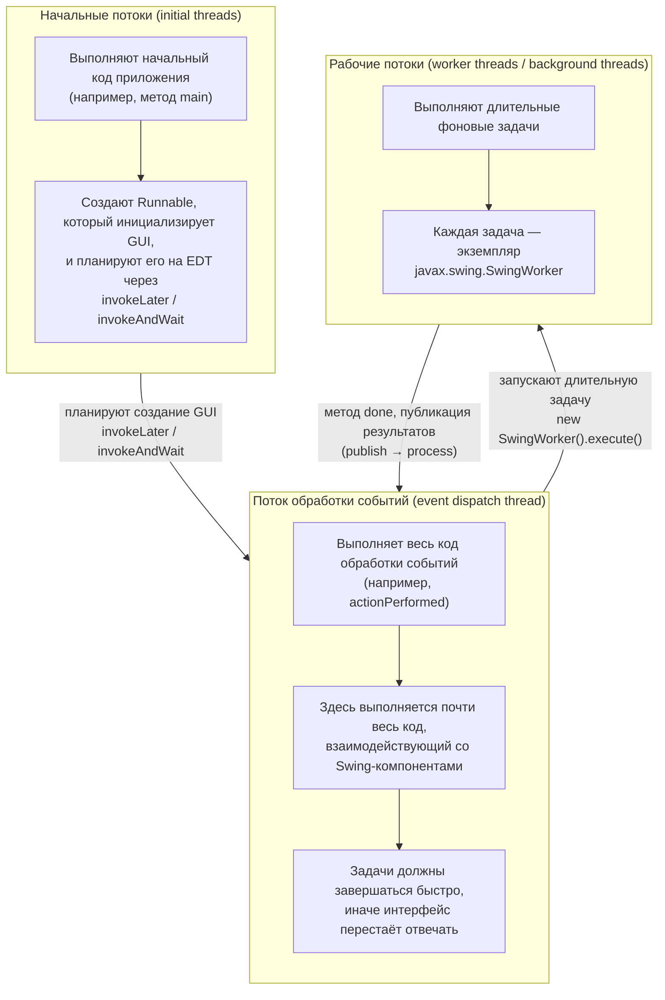

# Урок 4. Конкурентность в Swing

**Трейл:** Creating a GUI with Swing · **Оригинал:** [Concurrency in Swing](https://docs.oracle.com/javase/tutorial/uiswing/concurrency/index.html)
**Связанные области:** [[04-concurrency]] · **Вопросы:** concurrency

> Перевод официального руководства Oracle (The Java Tutorials, JDK 8). Урок объединяет страницы
> *Concurrency in Swing*, *Initial Threads*, *The Event Dispatch Thread*, *Worker Threads and
> SwingWorker*, *Simple Background Tasks*, *Tasks that Have Interim Results*, *Canceling Background
> Tasks* и *Bound Properties and Status Methods*.

Этот урок рассматривает конкурентность (*concurrency*) применительно к программированию на Swing.
Предполагается, что вы уже знакомы с содержанием урока *Concurrency* из трейла *Essential Java Classes*.

Аккуратное использование конкурентности особенно важно для Swing-программиста. Хорошо написанная
Swing-программа использует конкурентность так, чтобы пользовательский интерфейс никогда не «зависал»:
программа всегда отзывчива к действиям пользователя, чем бы она в этот момент ни занималась. Чтобы
создать отзывчивую программу, программист должен понять, как фреймворк Swing работает с потоками
(*threads*).

Swing-программист имеет дело с потоками следующих типов:

- **Начальные потоки** (*initial threads*) — потоки, в которых выполняется начальный код приложения.
- **Поток обработки событий** (*event dispatch thread*, EDT) — поток, в котором выполняется весь код
  обработки событий. Большая часть кода, взаимодействующего с фреймворком Swing, тоже должна
  выполняться в этом потоке.
- **Рабочие потоки** (*worker threads*), также известные как **фоновые потоки** (*background threads*) —
  потоки, в которых выполняются длительные фоновые задачи.

Программисту не нужно писать код, который явно создаёт эти потоки: они предоставляются средой
выполнения или фреймворком Swing. Задача программиста — использовать эти потоки для создания
отзывчивой и сопровождаемой Swing-программы.

Как и любая другая программа на платформе Java, Swing-программа может создавать дополнительные
потоки и пулы потоков, используя инструменты, описанные в уроке *Concurrency*. Но для базовых
Swing-программ описанных здесь потоков достаточно.

Этот урок последовательно рассматривает каждый из трёх типов потоков. Рабочие потоки требуют
наибольшего обсуждения, поскольку задачи, выполняемые в них, создаются с помощью класса
`javax.swing.SwingWorker`. Этот класс обладает множеством полезных возможностей, включая обмен данными
и координацию между задачами рабочих потоков и задачами в других потоках.

<!-- original: none | Oracle не публикует схему взаимодействия потоков Swing; урок описывает потоки текстом без иллюстрации -->


## Начальные потоки (Initial Threads)

У каждой программы есть набор потоков, где начинается логика приложения. В обычных программах такой
поток только один — тот, что вызывает метод `main` класса программы. В апплетах начальные потоки —
это те, что конструируют объект апплета и вызывают его методы `init` и `start`; эти действия могут
происходить в одном потоке, либо в двух или трёх разных, в зависимости от реализации платформы Java.
В этом уроке мы называем такие потоки **начальными потоками** (*initial threads*).

В Swing-программах начальным потокам делать особо нечего. Их самая существенная задача — создать
объект `Runnable`, который инициализирует GUI, и запланировать выполнение этого объекта в потоке
обработки событий (EDT). После того как GUI создан, программа управляется главным образом событиями
интерфейса, каждое из которых вызывает выполнение короткой задачи в потоке обработки событий. Код
приложения может планировать дополнительные задачи в потоке обработки событий (если они завершаются
быстро, чтобы не мешать обработке событий) или в рабочем потоке (для длительных задач).

Начальный поток планирует задачу создания GUI, вызывая
[`javax.swing.SwingUtilities.invokeLater`](https://docs.oracle.com/javase/8/docs/api/javax/swing/SwingUtilities.html#invokeLater-java.lang.Runnable-)
или
[`javax.swing.SwingUtilities.invokeAndWait`](https://docs.oracle.com/javase/8/docs/api/javax/swing/SwingUtilities.html#invokeAndWait-java.lang.Runnable-).
Оба этих метода принимают единственный аргумент — `Runnable`, который определяет новую задачу. Их
единственное различие отражено в названиях: `invokeLater` просто планирует задачу и возвращает
управление; `invokeAndWait` ждёт завершения задачи, прежде чем вернуть управление.

Примеры этого встречаются по всему руководству по Swing:

```java
SwingUtilities.invokeLater(new Runnable() {
    public void run() {
        createAndShowGUI();
    }
});
```

В апплете задача создания GUI должна запускаться из метода `init` с помощью `invokeAndWait`; иначе
`init` может вернуть управление до того, как GUI будет создан, что может вызвать проблемы у
веб-браузера, запускающего апплет. В любой другой программе планирование задачи создания GUI обычно
является последним, что делает начальный поток, поэтому неважно, использует он `invokeLater` или
`invokeAndWait`.

Почему начальный поток не создаёт GUI сам? Потому что почти весь код, который создаёт Swing-компоненты
или взаимодействует с ними, должен выполняться в потоке обработки событий. Это ограничение подробнее
обсуждается в следующем разделе.

## Поток обработки событий (The Event Dispatch Thread)

Код обработки событий Swing выполняется в специальном потоке, известном как **поток обработки
событий** (*event dispatch thread*, EDT). Большая часть кода, вызывающего методы Swing, также
выполняется в этом потоке. Это необходимо, потому что большинство методов объектов Swing не являются
«потокобезопасными» (*thread safe*): их вызов из нескольких потоков рискует привести к **интерференции
потоков** (*thread interference*) или **ошибкам согласованности памяти** (*memory consistency errors*).
Некоторые методы Swing-компонентов в спецификации API помечены как «потокобезопасные»; их можно
безопасно вызывать из любого потока. Все остальные методы Swing-компонентов должны вызываться из потока
обработки событий. Программы, игнорирующие это правило, могут большую часть времени работать корректно,
но подвержены непредсказуемым ошибкам, которые трудно воспроизвести.

Полезно представлять код, выполняющийся в потоке обработки событий, как последовательность коротких
задач. Большинство задач — это вызовы методов обработки событий, таких как
`ActionListener.actionPerformed`. Другие задачи могут планироваться кодом приложения с помощью
`invokeLater` или `invokeAndWait`. Задачи в потоке обработки событий должны завершаться быстро; если
это не так, необработанные события накапливаются, и пользовательский интерфейс перестаёт отвечать.

Если вам нужно определить, выполняется ли ваш код в потоке обработки событий, вызовите
[`javax.swing.SwingUtilities.isEventDispatchThread`](https://docs.oracle.com/javase/8/docs/api/javax/swing/SwingUtilities.html#isEventDispatchThread--).

## Рабочие потоки и SwingWorker (Worker Threads and SwingWorker)

Когда Swing-программе нужно выполнить длительную задачу, она обычно использует один из **рабочих
потоков** (*worker threads*), также известных как **фоновые потоки** (*background threads*). Каждая
задача, выполняющаяся в рабочем потоке, представлена экземпляром
[`javax.swing.SwingWorker`](https://docs.oracle.com/javase/8/docs/api/javax/swing/SwingWorker.html).
`SwingWorker` сам по себе является абстрактным классом; чтобы создать объект `SwingWorker`, необходимо
определить подкласс; для создания совсем простых объектов `SwingWorker` часто удобны анонимные
внутренние классы.

`SwingWorker` предоставляет ряд возможностей для обмена данными и управления:

- Подкласс `SwingWorker` может определить метод `done`, который автоматически вызывается в потоке
  обработки событий, когда фоновая задача завершена.
- `SwingWorker` реализует
  [`java.util.concurrent.Future`](https://docs.oracle.com/javase/8/docs/api/java/util/concurrent/Future.html).
  Этот интерфейс позволяет фоновой задаче предоставить возвращаемое значение другому потоку. Другие
  методы этого интерфейса позволяют отменить фоновую задачу и узнать, завершилась ли она или была ли
  отменена.
- Фоновая задача может предоставлять промежуточные результаты, вызывая `SwingWorker.publish`, что
  приводит к вызову `SwingWorker.process` из потока обработки событий.
- Фоновая задача может определять связанные свойства (*bound properties*). Изменения этих свойств
  порождают события, вызывающие выполнение методов-обработчиков в потоке обработки событий.

> **Примечание.** Класс `javax.swing.SwingWorker` был добавлен на платформу Java в Java SE 6. До этого
> широко использовался другой класс, также называвшийся `SwingWorker`, для некоторых из тех же целей.
> Старый `SwingWorker` не был частью спецификации платформы Java и не поставлялся в составе JDK.
>
> Новый `javax.swing.SwingWorker` — это совершенно новый класс. Его функциональность не является строгим
> надмножеством старого `SwingWorker`. Методы в этих двух классах, выполняющие одну и ту же функцию, не
> имеют одинаковых имён. Кроме того, экземпляры старого класса `SwingWorker` были многоразовыми, тогда
> как для каждой новой фоновой задачи нужен новый экземпляр `javax.swing.SwingWorker`.
>
> В руководствах Java под `SwingWorker` теперь всегда подразумевается `javax.swing.SwingWorker`.

### Простые фоновые задачи (Simple Background Tasks)

Начнём с задачи, которая очень проста, но потенциально длительна. Апплет `TumbleItem` загружает набор
графических файлов, используемых в анимации. Если графические файлы загружаются из начального потока,
перед появлением GUI может возникнуть задержка. Если же они загружаются из потока обработки событий,
GUI может временно перестать отвечать.

Чтобы избежать этих проблем, `TumbleItem` создаёт и запускает экземпляр `SwingWorker` из своих начальных
потоков. Метод объекта `doInBackground`, выполняющийся в рабочем потоке, загружает изображения в массив
`ImageIcon` и возвращает ссылку на него. Затем метод `done`, выполняющийся в потоке обработки событий,
вызывает `get`, чтобы получить эту ссылку, и присваивает её полю класса апплета с именем `imgs`. Это
позволяет `TumbleItem` немедленно построить GUI, не дожидаясь окончания загрузки изображений.

Вот код, который определяет и запускает объект `SwingWorker`:

```java
SwingWorker worker = new SwingWorker<ImageIcon[], Void>() {
    @Override
    public ImageIcon[] doInBackground() {
        final ImageIcon[] innerImgs = new ImageIcon[nimgs];
        for (int i = 0; i < nimgs; i++) {
            innerImgs[i] = loadImage(i+1);
        }
        return innerImgs;
    }

    @Override
    public void done() {
        // Удаляем метку «Loading images».
        animator.removeAll();
        loopslot = -1;
        try {
            imgs = get();
        } catch (InterruptedException ignore) {}
        catch (java.util.concurrent.ExecutionException e) {
            String why = null;
            Throwable cause = e.getCause();
            if (cause != null) {
                why = cause.getMessage();
            } else {
                why = e.getMessage();
            }
            System.err.println("Error retrieving file: " + why);
        }
    }
};
```

Все конкретные подклассы `SwingWorker` реализуют `doInBackground`; реализация `done` необязательна.

Обратите внимание, что `SwingWorker` — это обобщённый (*generic*) класс с двумя параметрами типа. Первый
параметр типа задаёт тип возвращаемого значения для `doInBackground`, а также для метода `get`, который
вызывается другими потоками, чтобы получить объект, возвращённый `doInBackground`. Второй параметр типа
`SwingWorker` задаёт тип промежуточных результатов, возвращаемых, пока фоновая задача ещё активна.
Поскольку в этом примере промежуточные результаты не возвращаются, в качестве заполнителя используется
`Void`.

Возможно, вам покажется, что код, устанавливающий `imgs`, излишне усложнён. Зачем заставлять
`doInBackground` возвращать объект и использовать `done`, чтобы его получить? Почему бы просто не дать
`doInBackground` напрямую установить `imgs`? Проблема в том, что объект, на который ссылается `imgs`,
создаётся в рабочем потоке, а используется в потоке обработки событий. Когда объекты разделяются между
потоками таким образом, необходимо гарантировать, что изменения, сделанные в одном потоке, видны в
другом. Использование `get` это гарантирует, потому что вызов `get` создаёт отношение «происходит до»
(*happens before*) между кодом, создающим `imgs`, и кодом, который его использует. Подробнее об отношении
«происходит до» см. *Memory Consistency Errors* в уроке *Concurrency*.

На самом деле получить объект, возвращённый `doInBackground`, можно двумя способами:

- Вызвать `SwingWorker.get` без аргументов. Если фоновая задача не завершена, `get` блокируется, пока
  она не завершится.
- Вызвать `SwingWorker.get` с аргументами, указывающими тайм-аут. Если фоновая задача не завершена, `get`
  блокируется до её завершения — если только сначала не истечёт тайм-аут, в этом случае `get` выбрасывает
  `java.util.concurrent.TimeoutException`.

Будьте осторожны при вызове любой из перегрузок `get` из потока обработки событий: пока `get` не вернёт
управление, никакие события GUI не обрабатываются, и GUI «заморожен». Не вызывайте `get` без аргументов,
если вы не уверены, что фоновая задача завершена или близка к завершению.

Подробнее о примере `TumbleItem` см. *How to Use Swing Timers* в уроке *Using Other Swing Features*.

### Задачи с промежуточными результатами (Tasks that Have Interim Results)

Часто фоновой задаче полезно предоставлять промежуточные результаты, пока она ещё работает. Задача может
сделать это, вызвав `SwingWorker.publish`. Этот метод принимает переменное число аргументов. Каждый
аргумент должен иметь тип, заданный вторым параметром типа `SwingWorker`.

Чтобы собрать результаты, предоставленные `publish`, переопределите `SwingWorker.process`. Этот метод
будет вызван из потока обработки событий. Результаты нескольких вызовов `publish` часто накапливаются для
одного вызова `process`.

Рассмотрим, как пример `Flipper.java` использует `publish` для предоставления промежуточных результатов.

Эта программа проверяет «честность» (*fairness*) класса `java.util.Random`, генерируя в фоновой задаче
серию случайных значений типа `boolean`. Это эквивалентно подбрасыванию монеты — отсюда и название
`Flipper` (от англ. *to flip a coin* — подбрасывать монету). Для отчёта о результатах фоновая задача
использует объект типа `FlipPair`:

```java
private static class FlipPair {
    private final long heads, total;
    FlipPair(long heads, long total) {
        this.heads = heads;
        this.total = total;
    }
}
```

Поле `heads` — это число раз, когда случайное значение оказалось `true`; поле `total` — общее число
случайных значений.

Фоновая задача представлена экземпляром `FlipTask`:

```java
private class FlipTask extends SwingWorker<Void, FlipPair> {
```

Поскольку задача не возвращает финального результата, неважно, какой будет первый параметр типа; в
качестве заполнителя используется `Void`. Задача вызывает `publish` после каждого «подбрасывания монеты»:

```java
@Override
protected Void doInBackground() {
    long heads = 0;
    long total = 0;
    Random random = new Random();
    while (!isCancelled()) {
        total++;
        if (random.nextBoolean()) {
            heads++;
        }
        publish(new FlipPair(heads, total));
    }
    return null;
}
```

(Метод `isCancelled` обсуждается в следующем разделе.) Поскольку `publish` вызывается очень часто, к
моменту вызова `process` в потоке обработки событий, вероятно, накопится множество значений `FlipPair`;
`process` интересует только последнее сообщённое каждый раз значение, которое используется для обновления
GUI:

```java
protected void process(List<FlipPair> pairs) {
    FlipPair pair = pairs.get(pairs.size() - 1);
    headsText.setText(String.format("%d", pair.heads));
    totalText.setText(String.format("%d", pair.total));
    devText.setText(String.format("%.10g", 
            ((double) pair.heads)/((double) pair.total) - 0.5));
}
```

Если `Random` честен, значение, отображаемое в `devText`, по мере работы `Flipper` должно становиться
всё ближе и ближе к 0.

> **Примечание.** Метод `setText`, используемый в `Flipper`, на самом деле является «потокобезопасным»
> согласно его спецификации. Это означает, что мы могли бы обойтись без `publish` и `process` и
> устанавливать значения текстовых полей напрямую из рабочего потока. Мы решили проигнорировать этот
> факт, чтобы дать простую демонстрацию промежуточных результатов `SwingWorker`.

### Отмена фоновых задач (Canceling Background Tasks)

Чтобы отменить выполняющуюся фоновую задачу, вызовите
[`SwingWorker.cancel`](https://docs.oracle.com/javase/8/docs/api/javax/swing/SwingWorker.html#cancel-boolean-).
Задача должна сотрудничать в своей собственной отмене. Сделать это она может двумя способами:

- Завершаясь при получении прерывания (*interrupt*). Эта процедура описана в разделе *Interrupts* урока
  *Concurrency*.
- Вызывая
  [`SwingWorker.isCancelled`](https://docs.oracle.com/javase/8/docs/api/javax/swing/SwingWorker.html#isCancelled--)
  через короткие промежутки времени. Этот метод возвращает `true`, если для данного `SwingWorker` был
  вызван `cancel`.

Метод `cancel` принимает единственный аргумент типа `boolean`. Если аргумент равен `true`, `cancel`
посылает фоновой задаче прерывание. Независимо от того, равен ли аргумент `true` или `false`, вызов
`cancel` меняет статус отмены объекта на `true`. Именно это значение возвращает `isCancelled`. После
изменения статус отмены изменить обратно нельзя.

Пример `Flipper` из предыдущего раздела использует идиому «только статус» (*status-only*). Главный цикл в
`doInBackground` завершается, когда `isCancelled` возвращает `true`. Это происходит, когда пользователь
нажимает кнопку «Cancel», что запускает код, вызывающий `cancel` с аргументом `false`.

Подход «только статус» имеет смысл для `Flipper`, потому что его реализация `SwingWorker.doInBackground`
не содержит кода, который мог бы выбросить `InterruptedException`. Чтобы реагировать на прерывание,
фоновая задача должна была бы вызывать `Thread.isInterrupted` через короткие промежутки времени. Для той
же цели не сложнее использовать `SwingWorker.isCancelled`.

> **Примечание.** Если `get` вызывается для объекта `SwingWorker` после того, как его фоновая задача была
> отменена, выбрасывается
> [`java.util.concurrent.CancellationException`](https://docs.oracle.com/javase/8/docs/api/java/util/concurrent/CancellationException.html).

### Связанные свойства и методы статуса (Bound Properties and Status Methods)

`SwingWorker` поддерживает **связанные свойства** (*bound properties*), которые полезны для обмена
данными с другими потоками. Два связанных свойства предопределены: `progress` и `state`. Как и все
связанные свойства, `progress` и `state` могут использоваться для запуска задач обработки событий в потоке
обработки событий.

Реализовав слушатель изменения свойств (*property change listener*), программа может отслеживать изменения
`progress`, `state` и других связанных свойств. Подробнее см. *How to Write a Property Change Listener* в
*Writing Event Listeners*.

#### Связанная переменная `progress`

Связанная переменная `progress` — это значение типа `int`, которое может находиться в диапазоне от 0 до
100. У неё есть предопределённый метод-сеттер (защищённый
[`SwingWorker.setProgress`](https://docs.oracle.com/javase/8/docs/api/javax/swing/SwingWorker.html#setProgress--))
и предопределённый метод-геттер (публичный
[`SwingWorker.getProgress`](https://docs.oracle.com/javase/8/docs/api/javax/swing/SwingWorker.html#getProgress-int-)).

Пример `ProgressBarDemo` использует `progress` для обновления элемента управления `ProgressBar` из фоновой
задачи. Подробное обсуждение этого примера см. в *How to Use Progress Bars* в уроке *Using Swing
Components*.

#### Связанная переменная `state`

Связанная переменная `state` указывает, на каком этапе своего жизненного цикла находится объект
`SwingWorker`. Эта переменная содержит значение перечисления типа `SwingWorker.StateValue`. Возможные
значения:

- **`PENDING`** — состояние в период от конструирования объекта до момента непосредственно перед вызовом
  `doInBackground`.
- **`STARTED`** — состояние в период от момента незадолго до вызова `doInBackground` до момента незадолго
  до вызова `done`.
- **`DONE`** — состояние на протяжении всего оставшегося существования объекта.

Текущее значение связанной переменной `state` возвращается методом
[`SwingWorker.getState`](https://docs.oracle.com/javase/8/docs/api/javax/swing/SwingWorker.html#getState--).

#### Методы статуса

Два метода, являющиеся частью интерфейса `Future`, также сообщают о статусе фоновой задачи. Как мы видели
в разделе «Отмена фоновых задач», `isCancelled` возвращает `true`, если задача была отменена. Кроме того,
`isDone` возвращает `true`, если задача завершилась — либо нормально, либо в результате отмены.

## Источник

- [Lesson: Concurrency in Swing](https://docs.oracle.com/javase/tutorial/uiswing/concurrency/index.html) — официальное руководство Oracle.
- [Initial Threads](https://docs.oracle.com/javase/tutorial/uiswing/concurrency/initial.html)
- [The Event Dispatch Thread](https://docs.oracle.com/javase/tutorial/uiswing/concurrency/dispatch.html)
- [Worker Threads and SwingWorker](https://docs.oracle.com/javase/tutorial/uiswing/concurrency/worker.html)
- [Simple Background Tasks](https://docs.oracle.com/javase/tutorial/uiswing/concurrency/simple.html)
- [Tasks that Have Interim Results](https://docs.oracle.com/javase/tutorial/uiswing/concurrency/interim.html)
- [Canceling Background Tasks](https://docs.oracle.com/javase/tutorial/uiswing/concurrency/cancel.html)
- [Bound Properties and Status Methods](https://docs.oracle.com/javase/tutorial/uiswing/concurrency/bound.html)
