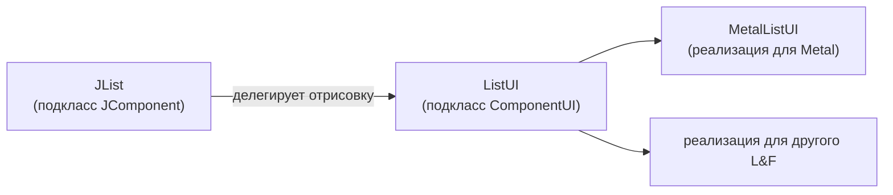

# Урок 7. Изменение внешнего вида (Look and Feel)

**Трейл:** Creating a GUI with Swing · **Оригинал:** [Modifying the Look and Feel](https://docs.oracle.com/javase/tutorial/uiswing/lookandfeel/index.html)
**Связанные области:** [[01-core-java-syntax-oop]] · **Вопросы:** core-java

> Перевод официального руководства Oracle (The Java Tutorials, JDK 8).

Этот урок рассказывает, как изменить внешний вид и поведение (look and feel, L&F) приложения на
Swing. «Внешний вид» (*look*) — это то, как приложение выглядит. «Поведение» (*feel*) — это то, как
ведут себя виджеты в ответ на действия пользователя. Можно использовать стандартный внешний вид
Swing (например, тему Ocean для оформления Metal), внешний вид родной платформы (Windows, GTK+) или
настроить собственное оформление.

---

## Как устанавливать внешний вид (How to Set the Look and Feel)

### Архитектура поддержки L&F

Архитектура Swing спроектирована так, чтобы можно было менять внешний вид и поведение GUI-приложения.
Swing реализует поддержку L&F, разделяя каждый компонент на два класса:

- подкласс `JComponent` — сам компонент;
- соответствующий подкласс `ComponentUI` — **делегат отрисовки** (UI delegate).

Например, у каждого экземпляра `JList` есть делегат `ListUI` (наследник `ComponentUI`). Этот
подкласс `ComponentUI` называют по-разному: «UI», «component UI», «UI delegate» или «look and feel
delegate». Большинство разработчиков напрямую с делегатами не работают: `JComponent`
использует делегат внутри себя, предоставляя методы-обёртки для доступа к нему. Вся отрисовка в
подклассах `JComponent` делегируется делегату — именно поэтому внешний вид может меняться в
зависимости от выбранного L&F.

Каждая реализация L&F обязана предоставить конкретные реализации для всех подклассов `ComponentUI`,
которые определяет Swing. Например, оформление Java создаёт экземпляры `MetalTabbedPaneUI` для
`JTabbedPane`. Созданием делегатов Swing управляет автоматически.

<!-- original: none | Oracle описывает делегирование отрисовки текстом; схема JList→ListUI→MetalListUI составлена автором -->


### Доступные варианты оформления (Available Look and Feels)

JRE от Sun предоставляет четыре варианта L&F:

1. **CrossPlatformLookAndFeel** — «оформление Java» (также называется **Metal**). Выглядит одинаково
   на всех платформах, входит в Java API (`javax.swing.plaf.metal`) и используется по умолчанию, если
   разработчик ничего не настроил.
2. **SystemLookAndFeel** — приложение использует родное оформление операционной системы, на которой
   запущено. Конкретное оформление определяется во время выполнения.
3. **Synth** — основа для создания собственного оформления с помощью XML-файлов конфигурации.
4. **Multiplexing** — позволяет методам UI делегировать вызовы сразу нескольким реализациям L&F
   одновременно.

Системное оформление зависит от платформы:

| Платформа | Оформление |
|-----------|-----------|
| Solaris, Linux с GTK+ 2.2 и новее | GTK+ |
| Прочие Solaris, Linux | Motif |
| IBM UNIX | IBM\* |
| HP UX | HP\* |
| Классический Windows | Windows |
| Windows XP | Windows XP |
| Windows Vista | Windows Vista |
| Macintosh | Macintosh\* |

\* Поставляется производителем системы.

Оформления GTK+, Motif и Windows предоставляются Sun, поставляются с Java SDK/JRE, но **не входят в
Java API**. Их полные имена классов:

- `com.sun.java.swing.plaf.gtk.GTKLookAndFeel`
- `com.sun.java.swing.plaf.motif.MotifLookAndFeel`
- `com.sun.java.swing.plaf.windows.WindowsLookAndFeel`

> Обратите внимание: в пути указано `java`, а не `javax`.

Важные ограничения:

- GTK+ работает только в системах UNIX/Linux с установленным GTK+ 2.2 или новее;
- Windows работает только в системах Windows;
- Motif (как и Java/Metal) работает на любой платформе.

Все оформления от Sun имеют общую основу — «Basic» (`javax.swing.plaf.basic`). Оформления Motif и
Windows расширяют классы делегатов Basic. Сам Basic напрямую без расширения не используется.

В API входят четыре пакета L&F:

1. `javax.swing.plaf.basic` — базовые делегаты для расширения при создании собственного оформления;
2. `javax.swing.plaf.metal` — оформление Java (оно же Metal). Тема по умолчанию теперь Ocean, поэтому
   его часто называют оформлением Ocean;
3. `javax.swing.plaf.multi` — мультиплексирующее оформление, позволяющее делегировать вызовы сразу
   нескольким реализациям (например, добавить звуковые подсказки к Windows для специальных возможностей);
4. `javax.swing.plaf.synth` — оформление, настраиваемое через XML (рассматривается в следующем разделе).

Вы не ограничены встроенными оформлениями. Можно использовать любой L&F, доступный в classpath
программы. Внешние оформления обычно поставляются в виде JAR-файлов, добавляемых в classpath во время
запуска:

```
java -classpath .;C:\java\lafdir\customlaf.jar YourSwingApplication
```

После добавления в classpath внешнее оформление работает так же, как встроенное.

### Программная установка внешнего вида (Programmatically Setting the Look and Feel)

> **Важно:** если вы собираетесь установить L&F, делайте это самым первым действием в приложении.
> Иначе можно случайно инициализировать стандартное оформление Java. Это произойдёт, например, если
> статическое поле ссылается на класс Swing (тогда L&F загрузится до того, как вы успеете указать свой
> выбор). Если L&F не указан, загружается оформление JRE по умолчанию (Java L&F для JRE от Sun,
> оформление Apple для JRE от Apple).

L&F указывается через класс `UIManager` (пакет `javax.swing`). При создании Swing-компонент
запрашивает у менеджера UI делегат отрисовки текущего оформления. Например, каждый конструктор
`JLabel` запрашивает у менеджера UI подходящий делегат, который затем используется для отрисовки и
обработки событий.

Чтобы установить L&F программно, вызовите `UIManager.setLookAndFeel()`, передав полное имя подкласса
`LookAndFeel`:

```java
public static void main(String[] args) {
    try {
        // Установить кросс-платформенное оформление Java (его же называют "Metal")
        UIManager.setLookAndFeel(
            UIManager.getCrossPlatformLookAndFeelClassName());
    }
    catch (UnsupportedLookAndFeelException e) {
       // обработка исключения
    }
    catch (ClassNotFoundException e) {
       // обработка исключения
    }
    catch (InstantiationException e) {
       // обработка исключения
    }
    catch (IllegalAccessException e) {
       // обработка исключения
    }

    new SwingApplication(); // Создать и показать GUI.
}
```

Чтобы установить системное оформление, замените вызов на
`UIManager.getSystemLookAndFeelClassName()`:

```java
        // Установить системное оформление
        UIManager.setLookAndFeel(
            UIManager.getSystemLookAndFeelClassName());
```

Можно передавать и реальные имена классов напрямую:

```java
// Установить кросс-платформенное оформление Java (его же называют "Metal")
UIManager.setLookAndFeel("javax.swing.plaf.metal.MetalLookAndFeel");

// Установить оформление Motif на любой платформе
UIManager.setLookAndFeel("com.sun.java.swing.plaf.motif.MotifLookAndFeel");
```

### Указание L&F в командной строке (Command Line)

Используйте флаг `-D`, чтобы задать свойство `swing.defaultlaf`:

```
java -Dswing.defaultlaf=com.sun.java.swing.plaf.gtk.GTKLookAndFeel MyApp

java -Dswing.defaultlaf=com.sun.java.swing.plaf.windows.WindowsLookAndFeel MyApp
```

### Указание L&F через файл swing.properties

Создайте файл `swing.properties` в каталоге `lib` установки Java (для Java от Sun —
`_javaHomeDirectory_\lib`; у других производителей расположение может отличаться). Файл содержит
свойство `swing.defaultlaf`. Пример содержимого:

```
# Swing properties
swing.defaultlaf=com.sun.java.swing.plaf.windows.WindowsLookAndFeel
```

### Как менеджер UI выбирает оформление

Менеджер UI выполняет следующие шаги по порядку, чтобы определить, какой L&F использовать:

1. Если программа установила L&F до того, как он понадобился, менеджер UI пытается создать экземпляр
   этого класса. При успехе все компоненты используют его.
2. Если программа не указала L&F успешно, менеджер UI использует оформление из свойства
   `swing.defaultlaf`. Если это свойство задано **и** в `swing.properties`, **и** в командной строке,
   приоритет имеет определение из командной строки.
3. Если ни один из шагов не дал корректного L&F, JRE от Sun использует оформление Java по умолчанию.
   Другие производители (например, Apple) используют своё оформление по умолчанию.

### Смена оформления после запуска (Changing the Look and Feel After Startup)

Метод `setLookAndFeel()` можно вызвать и после того, как GUI стал видимым. Чтобы уже существующие
компоненты отразили новый L&F, вызовите `SwingUtilities.updateComponentTreeUI()` по одному разу для
каждого контейнера верхнего уровня. После этого при необходимости измените размеры контейнеров
верхнего уровня под новые размеры компонентов:

```java
UIManager.setLookAndFeel(lnfName);
SwingUtilities.updateComponentTreeUI(frame);
frame.pack();
```

### Пример (An Example)

Программа `LookAndFeelDemo.java` демонстрирует переключение L&F. Она создаёт простой GUI с кнопкой и
меткой; нажатие кнопки увеличивает счётчик в метке. Используемое оформление меняется через константу
`LOOKANDFEEL`. Допустимые значения: `null` (по умолчанию), `"Metal"`, `"System"`, `"Motif"`, `"GTK"`.
Выбор неподдерживаемого оформления приводит к откату на оформление Java/Metal. Установить Metal можно
двумя эквивалентными способами: через `UIManager.getCrossPlatformLookAndFeelClassName()` или строкой
`"javax.swing.plaf.metal.MetalLookAndFeel"`.

```java
package lookandfeel;

import javax.swing.*;
import java.awt.*;
import java.awt.event.*;
import javax.swing.plaf.metal.*;

public class LookAndFeelDemo implements ActionListener {
    private static String labelPrefix = "Number of button clicks: ";
    private int numClicks = 0;
    final JLabel label = new JLabel(labelPrefix + "0    ");

    // Задайте оформление константой LOOKANDFEEL.
    // Допустимые значения: null (по умолчанию), "Metal", "System", "Motif", "GTK"
    final static String LOOKANDFEEL = "Metal";

    // Если выбрано оформление Metal, можно выбрать и тему.
    // Задайте тему константой THEME.
    // Допустимые значения: "DefaultMetal", "Ocean", "Test"
    final static String THEME = "Test";

    public Component createComponents() {
        JButton button = new JButton("I'm a Swing button!");
        button.setMnemonic(KeyEvent.VK_I);
        button.addActionListener(this);
        label.setLabelFor(button);

        JPanel pane = new JPanel(new GridLayout(0, 1));
        pane.add(button);
        pane.add(label);
        pane.setBorder(BorderFactory.createEmptyBorder(
                                        30, // сверху
                                        30, // слева
                                        10, // снизу
                                        30) // справа
                                        );

        return pane;
    }

    public void actionPerformed(ActionEvent e) {
        numClicks++;
        label.setText(labelPrefix + numClicks);
    }

    private static void initLookAndFeel() {
        String lookAndFeel = null;

        if (LOOKANDFEEL != null) {
            if (LOOKANDFEEL.equals("Metal")) {
                lookAndFeel = UIManager.getCrossPlatformLookAndFeelClassName();
              // альтернативный способ установить Metal — заменить
              // предыдущую строку на:
              // lookAndFeel = "javax.swing.plaf.metal.MetalLookAndFeel";
            }

            else if (LOOKANDFEEL.equals("System")) {
                lookAndFeel = UIManager.getSystemLookAndFeelClassName();
            }

            else if (LOOKANDFEEL.equals("Motif")) {
                lookAndFeel = "com.sun.java.swing.plaf.motif.MotifLookAndFeel";
            }

            else if (LOOKANDFEEL.equals("GTK")) {
                lookAndFeel = "com.sun.java.swing.plaf.gtk.GTKLookAndFeel";
            }

            else {
                System.err.println("Unexpected value of LOOKANDFEEL specified: "
                                   + LOOKANDFEEL);
                lookAndFeel = UIManager.getCrossPlatformLookAndFeelClassName();
            }

            try {
                UIManager.setLookAndFeel(lookAndFeel);

                // Если L&F = "Metal", задаём тему
                if (LOOKANDFEEL.equals("Metal")) {
                  if (THEME.equals("DefaultMetal"))
                     MetalLookAndFeel.setCurrentTheme(new DefaultMetalTheme());
                  else if (THEME.equals("Ocean"))
                     MetalLookAndFeel.setCurrentTheme(new OceanTheme());
                  else
                     MetalLookAndFeel.setCurrentTheme(new TestTheme());

                  UIManager.setLookAndFeel(new MetalLookAndFeel());
                }
            }

            catch (ClassNotFoundException e) {
                System.err.println("Couldn't find class for specified look and feel:"
                                   + lookAndFeel);
                System.err.println("Did you include the L&F library in the class path?");
                System.err.println("Using the default look and feel.");
            }

            catch (UnsupportedLookAndFeelException e) {
                System.err.println("Can't use the specified look and feel ("
                                   + lookAndFeel
                                   + ") on this platform.");
                System.err.println("Using the default look and feel.");
            }

            catch (Exception e) {
                System.err.println("Couldn't get specified look and feel ("
                                   + lookAndFeel
                                   + "), for some reason.");
                System.err.println("Using the default look and feel.");
                e.printStackTrace();
            }
        }
    }

    private static void createAndShowGUI() {
        // Устанавливаем оформление.
        initLookAndFeel();

        // Используем оформление и для рамок окон.
        JFrame.setDefaultLookAndFeelDecorated(true);

        // Создаём и настраиваем окно.
        JFrame frame = new JFrame("SwingApplication");
        frame.setDefaultCloseOperation(JFrame.EXIT_ON_CLOSE);

        LookAndFeelDemo app = new LookAndFeelDemo();
        Component contents = app.createComponents();
        frame.getContentPane().add(contents, BorderLayout.CENTER);

        // Показываем окно.
        frame.pack();
        frame.setVisible(true);
    }

    public static void main(String[] args) {
        // Планируем задачу для потока обработки событий:
        // создание и отображение GUI этого приложения.
        javax.swing.SwingUtilities.invokeLater(new Runnable() {
            public void run() {
                createAndShowGUI();
            }
        });
    }
}
```

### Темы (Themes)

Темы позволяют легко менять цвета и шрифты кросс-платформенного оформления Java (Metal). Доступны три
темы:

- `DefaultMetal`;
- `Ocean` — тема по умолчанию начиная с Java SE 5, мягче, чем чистый Metal;
- `Test` — задаётся в `TestTheme.java`, где определены три основных цвета.

Темы работают только с оформлением Metal и устанавливаются **после** установки самого Metal:

```java
if (LOOKANDFEEL.equals("Metal")) {
    if (THEME.equals("DefaultMetal"))
       MetalLookAndFeel.setCurrentTheme(new DefaultMetalTheme());
    else if (THEME.equals("Ocean"))
       MetalLookAndFeel.setCurrentTheme(new OceanTheme());
    else
       MetalLookAndFeel.setCurrentTheme(new TestTheme());

    UIManager.setLookAndFeel(new MetalLookAndFeel());
}
```

### Демонстрационная программа SwingSet2

Демонстрация `SwingSet2` (в каталоге `demo\jfc` набора Demos для JDK/JavaFX) предоставляет GUI для
смены L&F и тем во время выполнения. Она включает различные файлы тем (например, `RubyTheme.java`) в
каталоге `SwingSet2\src`. Тема Ocean — тема Metal по умолчанию; тема Steel была исходной темой Metal.

Запуск `SwingSet2` (по умолчанию показывает тему Ocean):

```
java -jar SwingSet2.jar
```

Чтобы использовать тему Steel:

```
java -Dswing.metalTheme=steel -jar SwingSet2.jar
```

---

## Оформление Synth (The Synth Look and Feel)

Создавать собственное оформление сложно. Пакет `javax.swing.plaf.synth` упрощает эту задачу. Есть два
подхода: программный или через внешний XML-файл; в этом разделе основное внимание уделяется XML.
Synth предоставляет «поведение» (*feel*) — вы предоставляете «внешний вид» (*look*); метафорически это
называют «скином» (*skin*).

### Архитектура Synth (The Synth Architecture)

Каждое оформление должно реализовать подклассы `ComponentUI` для компонентов Swing. Synth делает это
автоматически — пользователь сам делегаты не создаёт. Пользователь указывает лишь две вещи: как
отрисовываются компоненты и свойства, влияющие на их компоновку и размер.

Synth работает на уровне **регионов** (*region*) — это более мелкое деление, чем уровень компонента.
Один регион — это одна часть компонента. У некоторых компонентов один регион (например, `JButton`), у
других — несколько (например, у `JScrollBar` есть дорожка, ползунок и сама полоса прокрутки). Каждый
регион делегата `ComponentUI` связан с объектом `SynthStyle`. Например, у `JScrollBar` три региона, и
`ScrollBarUI` назначает свой `SynthStyle` каждому из них.

`SynthStyle` предоставляет цвет переднего плана, цвет фона и сведения о шрифте. Каждый `SynthStyle`
содержит `SynthPainter`, в котором определены методы отрисовки регионов (например,
`paintScrollBarThumbBackground`, `paintScrollBarThumbBorder`).

Делегаты `ComponentUI` получают объекты `SynthStyle` от `SynthStyleFactory`. Фабрику стилей можно
определить двумя способами: через XML-файл или программно. При XML-подходе фабрика создаётся из файла
автоматически:

```java
SynthLookAndFeel laf = new SynthLookAndFeel();
laf.load(MyClass.class.getResourceAsStream("laf.xml"), MyClass.class);
UIManager.setLookAndFeel(laf);
```

При программном подходе нужно создать собственную фабрику стилей, переопределив метод `getStyle`:

```java
class MyStyleFactory extends SynthStyleFactory {
    public SynthStyle getStyle(JComponent c, Region id) {
        if (id == Region.BUTTON) {
            return buttonStyle;
        }
        else if (id == Region.TREE) {
            return treeStyle;
        }
        return defaultStyle;
    }
}
SynthLookAndFeel laf = new SynthLookAndFeel();
UIManager.setLookAndFeel(laf);
SynthLookAndFeel.setStyleFactory(new MyStyleFactory());
```

### XML-файл (The XML File)

Документация по DTD формата находится в
`javax.swing.plaf.synth/doc-files/synthFileFormat.html`.

**Важное правило:** отрисовываются только те компоненты и регионы, для которых заданы стили. Поведения
по умолчанию нет — без стилей GUI будет пустым.

XML-файл должен содержать элемент `<style>` (определяет отрисовку) и привязывать стиль к региону
элементом `<bind>`. Базовый пример:

```xml
<synth>
  <style id="basicStyle">
    <font name="Verdana" size="16"/>
    <state>
      <color value="WHITE" type="BACKGROUND"/>
      <color value="BLACK" type="FOREGROUND"/>
    </state>
  </style>
  <bind style="basicStyle" type="region" key=".*"/>
</synth>
```

Разбор примера:

1. `<style>` — основной строительный блок. Содержит всю информацию об отрисовке, может описывать
   несколько регионов и получает идентификатор `id` для ссылок.
2. `<font>` задаёт шрифт Verdana размером 16.
3. `<state>` определяет вид для всех состояний (значение не указано — значит, для всех), задаёт цвет
   фона (WHITE) и переднего плана (BLACK).
4. `<bind>` привязывает `basicStyle` ко всем регионам через регулярное выражение `.*` («все»).

### Элемент `<bind>`

У элемента `<bind>` три обязательных атрибута:

- `style` — уникальный идентификатор ранее определённого стиля;
- `type` — либо `"name"`, либо `"region"`. При `"name"` используется метод `component.getName()`, при
  `"region"` — константы класса `Region`;
- `key` — регулярное выражение, определяющее, какие компоненты/регионы получают привязку.

Имена регионов основаны на константах класса `Region`: подчёркивания убираются, регистр не важен.
Например, `SPLIT_PANE` можно записать как `SPLITPANE`, `splitpane` или `SplitPane`.

Один стиль можно привязать к нескольким регионам, и наоборот — к одному региону можно привязать
несколько стилей (они объединяются):

```xml
<style id="styleOne">
   <!-- здесь определение styleOne -->
</style>

<style id="styleTwo">
   <!-- здесь определение styleTwo -->
</style>

<bind style="styleOne" type="region" key="Button"/>
<bind style="styleOne" type="region" key="RadioButton"/>
<bind style="styleOne" type="region" key="ArrowButton"/>

<bind style="styleTwo" type="region" key="ArrowButton"/>
```

Здесь `ArrowButton` получает оба стиля. При привязке по имени компоненты нужно предварительно задать
имена через `component.setName("OK")` и `component.setName("Cancel")`:

```xml
<bind style="styleButton" type="region" key="Button">
<bind style="styleOK" type="name" key="OK">
<bind style="styleCancel" type="name" key="Cancel">
```

При объединении стилей приоритет имеет тот, что определён позже.

### Элемент `<state>`

`<state>` позволяет задать разный вид в зависимости от состояния компонента (например, нажатая кнопка
выглядит иначе, чем доступная). Возможные значения (из DTD):

1. `ENABLED`;
2. `MOUSE_OVER`;
3. `PRESSED`;
4. `DISABLED`;
5. `FOCUSED`;
6. `SELECTED`;
7. `DEFAULT`.

Значения можно комбинировать через `and`, например `"ENABLED and FOCUSED"`. Если значение не указано —
стиль применяется ко всем состояниям.

```xml
<style id="buttonStyle">
  <property key="Button.textShiftOffset" type="integer" value="1"/>
  <insets top="10" left="10" right="10" bottom="10"/>

  <state>
    <imagePainter method="buttonBackground" path="images/button.png"
                         sourceInsets="10 10 10 10"/>
  </state>
  <state value="PRESSED">
    <color value="#9BC3B1" type="BACKGROUND"/>
    <imagePainter method="buttonBackground" path="images/button2.png"
                        sourceInsets="10 10 10 10"/>
  </state>
</style>
<bind style="buttonStyle" type="region" key="Button"/>
```

**Алгоритм выбора состояния.** Используется то состояние, которое наиболее точно соответствует
текущему состоянию компонента. Соответствие определяется числом совпавших значений. Если совпадений
нет — используется состояние без значения. Если совпадения есть — используется состояние с наибольшим
числом совпадений. **Важно:** при равном числе совпадений выбирается состояние, объявленное **первым**.

```xml
<state id="zero">
  <color value="RED" type="BACKGROUND"/>
</state>
<state value="SELECTED and PRESSED" id="one">
  <color value="RED" type="BACKGROUND"/>
</state>
<state value="SELECTED" id="two">
  <color value="BLUE" type="BACKGROUND"/>
</state>
```

Здесь регион в состоянии SELECTED+PRESSED получит `one`, только SELECTED — `two`, ни одно из них —
`zero`.

**Предупреждение о порядке состояний.** `MOUSE_OVER` всегда истинно при `PRESSED` (нельзя нажать, не
наведя мышь). Если `MOUSE_OVER` определён первым, он всегда «победит» `PRESSED`. Поэтому `PRESSED`
нужно определять **до** `MOUSE_OVER`. Неправильный порядок (`PRESSED` никогда не сработает):

```xml
<state value="MOUSE_OVER">
   <imagePainter method="buttonBackground" path="images/button_on.png"
                          sourceInsets="10 10 10 10" />
   <color type="TEXT_FOREGROUND" value="#FFFFFF"/>
</state>

<state value="PRESSED">
   <imagePainter method="buttonBackground" path="images/button_press.png"
                          sourceInsets="9 10 9 10" />
   <color type="TEXT_FOREGROUND" value="#FFFFFF"/>
</state>
```

### Цвета и шрифты (Colors and Fonts)

У элемента `<color>` два обязательных атрибута:

- `value` — константа цвета Java (`RED`, `WHITE`, `BLACK`, `BLUE` и т.д.) или шестнадцатеричный RGB
  (`#FF00FF`, `#326A3B`);
- `type` — где применяется цвет: `BACKGROUND`, `FOREGROUND`, `FOCUS`, `TEXT_BACKGROUND`,
  `TEXT_FOREGROUND`.

У элемента `<font>` три атрибута:

- `name` — название шрифта (Arial, Verdana и т.д.);
- `size` — размер в пикселях;
- `style` (необязательный) — `BOLD`, `ITALIC` или `BOLD ITALIC` (по умолчанию обычный).

Цвета и шрифты можно определить с атрибутом `id` и переиспользовать по ссылке `idref`:

```xml
<color id="backColor" value="WHITE" type="BACKGROUND"/>
<font id="textFont" name="Verdana" size="16"/>
...
<color idref="backColor"/>
<font idref="textFont"/>
```

### Отступы (Insets)

Элемент `<insets>` добавляет пространство вокруг компонента при отрисовке. Без отступов кнопка
получает размер ровно под подпись; с отступами добавляются дополнительные пиксели во всех
направлениях:

```xml
<insets top="15" left="20" right="20" bottom="15"/>
```

Здесь кнопка получает по 15 пикселей сверху и снизу и по 20 пикселей слева и справа от подписи.

### Отрисовка изображениями (Painting With Images)

Synth разбивает изображение на 9 областей: верх, верх-право, право, низ-право, низ, низ-лево, лево,
верх-лево и центр. Края (верх, лево, низ, право) тиражируются/растягиваются, а углы остаются
фиксированными. Этим управляет атрибут `sourceInsets`.

Важно различать `<insets>` и `sourceInsets`: первый — это пространство, занимаемое регионом; второй —
указание, как отрисовывать изображение. Часто их значения совпадают, но они не связаны между собой и
могут понадобиться независимо друг от друга.

```xml
<style id="buttonStyle">
   <insets top="15" left="20" right="20" bottom="15"/>
   <state>
      <imagePainter method="buttonBackground" path="images/button.png"
        sourceInsets="10 10 10 10"/>
   </state>
</style>
<bind style="buttonStyle" type="region" key="button"/>
```

Путь указывается относительно класса, переданного в `SynthLookAndFeel.load()`. `sourceInsets` задаёт
угловые области, которые нельзя растягивать (формат: верх лево низ право).

У элемента `<imagePainter>` следующие атрибуты:

- `method` — имя метода `SynthPainter` (убрать префикс `paint` и сделать первую букву строчной; так,
  `paintButtonBackground` → `buttonBackground`);
- `path` — путь к изображению относительно загружающего класса;
- `sourceInsets` — ширины угловых областей (верх лево низ право);
- `paintCenter` (необязательный) — отрисовывать ли центральную область (по умолчанию `true`).

В `SynthPainter` около ста методов, начинающихся с `paint`.

Пример с разными изображениями по состоянию:

```xml
<style id="buttonStyle">
  <property key="Button.textShiftOffset" type="integer" value="1"/>
  <insets top="15" left="20" right="20" bottom="15"/>
  <state>
    <imagePainter method="buttonBackground" path="images/button.png"
                  sourceInsets="10 10 10 10"/>
  </state>
  <state value="PRESSED">
    <imagePainter method="buttonBackground" path="images/button2.png"
                  sourceInsets="10 10 10 10"/>
  </state>
</style>
<bind style="buttonStyle" type="region" key="button"/>
```

### Элемент `<property>`

`<property>` добавляет к стилям пары «ключ-значение», которые компоненты используют для визуальной
настройки. Атрибуты: `key` (имя свойства), `type` (тип данных), `value` (значение). Список свойств
компонентов приведён в `javax/swing/plaf/synth/doc-files/componentProperties.html`. Например,
`Button.textShiftOffset` сдвигает текст кнопки при нажатии:

```xml
<property key="Button.textShiftOffset" type="integer" value="1"/>
```

### Полный пример: buttonSkin.xml

```xml
<!-- Скин Synth с изображением для кнопок -->
<synth>
  <!-- Стиль, который будут использовать все регионы -->
  <style id="backingStyle">
    <!-- Делаем все регионы, использующие этот скин, непрозрачными -->
    <opaque value="TRUE"/>
    <font name="Dialog" size="12"/>
    <state>
      <!-- Цвета по умолчанию -->
      <color value="#9BC3B1" type="BACKGROUND"/>
      <color value="RED" type="FOREGROUND"/>
    </state>
  </style>
  <bind style="backingStyle" type="region" key=".*"/>
  <style id="buttonStyle">
    <!-- Сдвигаем текст на один пиксель при нажатии -->
    <property key="Button.textShiftOffset" type="integer" value="1"/>
    <insets top="15" left="20" right="20" bottom="15"/>
    <state>
      <imagePainter method="buttonBackground" path="images/button.png"
                    sourceInsets="10 10 10 10"/>
    </state>
    <state value="PRESSED">
      <imagePainter method="buttonBackground" path="images/button2.png"
                    sourceInsets="10 10 10 10"/>
    </state>
  </style>
  <!-- Привязываем buttonStyle ко всем JButton -->
  <bind style="buttonStyle" type="region" key="button"/>
</synth>
```

Здесь `backingStyle` задаёт общее оформление (шрифт Dialog 12pt, цвета, непрозрачность) и
привязывается ко всем регионам через `.*`. `buttonStyle` задаёт оформление кнопок с отрисовкой
изображением. Благодаря `backingStyle` метка отрисовывается даже без собственного стиля.

### Отрисовка иконками (Painting With Icons)

Переключатели (radio buttons) и флажки (check boxes) используют иконки фиксированного размера. Нужно
создать иконку и привязать её к подходящему свойству (свойства перечислены в
`javax/swing/plaf/synth/doc-files/componentProperties.html`):

```xml
<style id="radioButton">
   <imageIcon id="radio_off" path="images/radio_button_off.png"/>
   <imageIcon id="radio_on" path="images/radio_button_on.png"/>
   <property key="RadioButton.icon" value="radio_off"/>
   <state value="SELECTED">
      <property key="RadioButton.icon" value="radio_on"/>
   </state>
</style>
<bind style="radioButton" type="region" key="RadioButton"/>
```

### Пользовательские отрисовщики (Custom Painters)

Synth использует долговременную сериализацию JavaBeans (*long-term persistence*) для произвольных
объектов, что позволяет создавать собственные отрисовщики, не ограничиваясь изображениями — например,
для градиента:

```xml
<synth>
  <object id="gradient" class="GradientPainter"/>
  <style id="textfield">
    <painter method="textFieldBackground" idref="gradient"/>
  </style>
  <bind style="textfield" type="region" key="textfield"/>
</synth>
```

Элемент `<object>` создаёт экземпляр пользовательского класса, а `<painter>` ссылается на этот объект
по `idref`. Сам класс наследует `SynthPainter` и переопределяет нужный метод отрисовки:

```java
public class GradientPainter extends SynthPainter {
   public void paintTextFieldBackground(SynthContext context,
                                        Graphics g, int x, int y,
                                        int w, int h) {
      // Для простоты GradientPaint создаётся каждый раз заново.
      // В реальном приложении кэшируйте его, чтобы не плодить мусор.
      Graphics2D g2 = (Graphics2D)g;
      g2.setPaint(new GradientPaint((float)x, (float)y, Color.WHITE,
                 (float)(x + w), (float)(y + h), Color.RED));
      g2.fillRect(x, y, w, h);
      g2.setPaint(null);
   }
}
```

---

## Пример Synth (A Synth Example)

В этом разделе диалог поиска из урока «A GroupLayout Example» воссоздаётся с помощью оформления Synth и
внешнего XML-файла вместо оформления Metal с темой Ocean. Исходный файл — `Find.java`, новый —
`SynthDialog.java`, XML-файл конфигурации — `synthDemo.xml`.

### Метод initLookAndFeel()

`SynthDialog.java` идентичен `Find.java`, за исключением метода `initLookAndFeel()`:

```java
private static void initLookAndFeel() {
   SynthLookAndFeel lookAndFeel = new SynthLookAndFeel();

   // Метод load() класса SynthLookAndFeel выбрасывает проверяемое исключение
   // (java.text.ParseException), поэтому его нужно обработать
   try {
      lookAndFeel.load(SynthDialog.class.getResourceAsStream("synthDemo.xml"),
                                                               SynthDialog.class);
      UIManager.setLookAndFeel(lookAndFeel);
   }

   catch (ParseException e) {
      System.err.println("Couldn't get specified look and feel ("
                                   + lookAndFeel
                                    + "), for some reason.");
      System.err.println("Using the default look and feel.");
      e.printStackTrace();
   }
}
```

`getResourceAsStream("synthDemo.xml")` загружает XML из classpath; если загрузка не удалась,
используется оформление по умолчанию.

### XML-файл

#### Стиль по умолчанию для всех регионов

Файл начинается со стиля, привязанного ко всем регионам, — это рекомендуемая практика, гарантирующая,
что у всех регионов будет вид по умолчанию:

```xml
  <!-- Стиль, который будут использовать все регионы -->
  <style id="backingStyle">
    <!-- Делаем все регионы непрозрачными -->
    <opaque value="TRUE"/>
    <font name="Dialog" size="14"/>
    <state>
      <color value="#D8D987" type="BACKGROUND"/>
      <color value="RED" type="FOREGROUND"/>
    </state>
  </style>
  <bind style="backingStyle" type="region" key=".*"/>
```

Примечания:

1. Определения цвета должны находиться внутри элементов `<state>` — это позволяет менять цвет в
   зависимости от состояния. `<state>` без атрибутов применяется ко всем регионам независимо от
   состояния. При нескольких состояниях они объединяются, приоритет у определённых позже.
2. Определения шрифта **не** помещаются внутрь `<state>`, поскольку шрифт не должен меняться при смене
   состояния (от шрифта зависит размер компонента, и его смена вызвала бы непреднамеренное изменение
   размеров).

#### Стиль текстового поля

```xml
  <style id="textfield">
    <insets top="4" left="6" bottom="4" right="6"/>
    <state>
       <font name="Verdana" size="14"/>
       <color value="#D2DFF2" type="BACKGROUND"/>
       <color value="#000000" type="TEXT_FOREGROUND"/>
    </state>
    <imagePainter method="textFieldBorder" path="images/textfield.png"
                  sourceInsets="4 6 4 6" paintCenter="false"/>
  </style>
  <bind style="textfield" type="region" key="TextField"/>
```

Примечания:

1. Определения шрифта и цвета переопределяют заданные в `backingStyle`.
2. Значения `insets` и `sourceInsets` совпадают случайно — они не связаны.
3. Цвет фона `#D2DFF2` (бледно-голубой) совпадает с фоном изображения `textfield.png`.
4. `paintCenter` равен `false`, чтобы был виден цвет фона.

#### Стиль кнопки

```xml
 <style id="button">
        <!-- Сдвигаем текст на один пиксель при нажатии -->
    <property key="Button.textShiftOffset" type="integer" value="1"/>
    <!-- Задаём размер кнопок -->
    <insets top="15" left="20" bottom="15" right="20"/>
    <state>
      <imagePainter method="buttonBackground" path="images/button.png"
                           sourceInsets="10 10 10 10" />
      <font name="Dialog" size="16"/>
      <color type="TEXT_FOREGROUND" value="#FFFFFF"/>
    </state>

    <state value="PRESSED">
      <imagePainter method="buttonBackground"
          path="images/button_press.png"
                   sourceInsets="10 10 10 10" />
    </state>

    <state value="MOUSE_OVER">
      <imagePainter method="buttonBackground"
          path="images/button_over.png"
                 sourceInsets="10 10 10 10" />
    </state>
  </style>
  <bind style="button" type="region" key="Button"/>
```

Примечания:

1. Шрифт и цвет в `<state>` по умолчанию (без атрибутов) применяются ко всем состояниям кнопки,
   поскольку все применимые состояния объединяются и других определений с приоритетом нет.
2. Значения `sourceInsets` (10 10 10 10) достаточно велики, чтобы скруглённые углы изображения кнопки
   не растягивались.
3. Порядок состояний `PRESSED` и `MOUSE_OVER` важен. При нажатии кнопки мышь всегда над ней, поэтому
   применимы оба состояния; приоритет у определённого первым (`PRESSED`). Если поменять их местами,
   изображение `PRESSED` никогда не будет использовано.

#### Стиль флажка

```xml
  <style id="checkbox">
    <imageIcon id="check_off" path="images/checkbox_off.png"/>
    <imageIcon id="check_on" path="images/checkbox_on.png"/>
    <property key="CheckBox.icon" value="check_off"/>
    <state value="SELECTED">
      <property key="CheckBox.icon" value="check_on"/>
    </state>
  </style>
  <bind style="checkbox" type="region" key="Checkbox"/>
```

Примечания:

1. Для задания иконок обязательно используется элемент `<imageIcon>`.
2. Элемент `<insets>` и атрибут `sourceInsets` с иконками не используются, так как иконки
   отрисовываются в фиксированном размере и не растягиваются.
3. Иконку флажка определяет свойство `CheckBox.icon`. По умолчанию используется иконка с
   `id="check_off"`, а в состоянии `SELECTED` — с `id="check_on"`.

Готовый файл `synthDemo.xml` собирается из приведённых стилей, обёрнутых в теги `<synth></synth>`. Для
запуска примера требуется JDK 7 или новее.

---

## Оформление Nimbus (Nimbus Look and Feel)

Nimbus — это аккуратное кросс-платформенное оформление, представленное в выпуске Java SE 6 Update 10
(6u10) и используемое в демонстрации SwingSet3. Nimbus рисует интерфейс векторной графикой Java 2D (а
не статичными растровыми изображениями), что обеспечивает чёткую отрисовку при любом разрешении.
Nimbus легко настраивается: его можно использовать как есть или «скинировать» под собственный бренд.

### Включение оформления Nimbus (Enabling the Nimbus Look and Feel)

Стандартным оформлением Swing по соображениям обратной совместимости остаётся Metal. Включить Nimbus
можно тремя способами.

**Способ 1. Программно.** Этот код нужно добавить в поток обработки событий (event-dispatching thread)
до создания GUI:

```java
import javax.swing.UIManager.*;

try {
    for (LookAndFeelInfo info : UIManager.getInstalledLookAndFeels()) {
        if ("Nimbus".equals(info.getName())) {
            UIManager.setLookAndFeel(info.getClassName());
            break;
        }
    }
} catch (Exception e) {
    // Если Nimbus недоступен, можно установить другое оформление.
}
```

Здесь сначала запрашивается список всех установленных реализаций L&F, затем выполняется поиск по имени
`"Nimbus"`; при нахождении оно устанавливается через `UIManager.setLookAndFeel(info.getClassName())`.

> **Важно:** не устанавливайте Nimbus явным вызовом `UIManager.setLookAndFeel` с прямым именем класса.
> Не все версии и реализации Java SE 6 поддерживают Nimbus, а расположение пакета Nimbus изменилось
> между JDK 6 Update 10 и JDK 7. Перебор установленных реализаций надёжнее: если Nimbus недоступен,
> применяется оформление по умолчанию. Только для JDK 6 Update 10 имя класса —
> `com.sun.java.swing.plaf.nimbus.NimbusLookAndFeel`.

**Способ 2. Командная строка.** Указывает Nimbus оформлением по умолчанию для конкретного приложения:

```
java -Dswing.defaultlaf=javax.swing.plaf.nimbus.NimbusLookAndFeel _MyApp_
```

**Способ 3. Постоянная настройка в файле конфигурации.** Добавьте строку в файл
`<JAVA_HOME>/lib/swing.properties` (если файла нет — создайте его):

```
swing.defaultlaf=javax.swing.plaf.nimbus.NimbusLookAndFeel
```

---

## Изменение внешнего вида Nimbus (Changing the Look of Nimbus)

Одно из главных преимуществ Nimbus — высокая настраиваемость: внешний вид можно изменить практически
как угодно. Доступны три основных приёма:

1. **Изменение размера компонента** — компоненты доступны в трёх дополнительных размерах: mini, small
   и large.
2. **Смена цветовой темы** — любые цвета, используемые в Nimbus, можно изменить.
3. **Скинирование компонента** — полный контроль над отрисовкой компонента.

### Изменение размера компонента (Resizing a Component)

Компоненты можно делать меньше для палитр инструментов, панелей инструментов или строк состояния. Это
достигается установкой клиентского свойства (*client property*) компонента. Доступны четыре размера:
«regular» (по умолчанию), «mini», «small» и «large».

> **Исключение:** компонент `JLabel` не поддерживает свойство размерных вариантов. Чтобы изменить
> размер метки, нужно менять размер её шрифта.

> **Примечание:** другие реализации L&F (например, Aqua от Apple) также могут поддерживать клиентское
> свойство размерных вариантов. На данный момент Nimbus — единственное оформление от Sun, официально
> поддерживающее размерные варианты.

Размер задаётся одной строкой кода до отображения компонента:

```java
// mini
myButton.putClientProperty("JComponent.sizeVariant", "mini");
// small
mySlider.putClientProperty("JComponent.sizeVariant", "small");
// large
myTextField.putClientProperty("JComponent.sizeVariant", "large");
```

Если компонент всё равно отображается в обычном размере, несмотря на корректно заданное свойство,
вызовите `SwingUtilities.updateComponentTreeUI()` до отображения окна:

```java
JFrame frame = ...;

SwingUtilities.updateComponentTreeUI(frame);

frame.pack();
frame.setVisible(true);
```

### Смена цветовой темы (Changing the Color Theme)

У Nimbus есть набор цветов по умолчанию, но использовать именно их не обязательно — цвета можно
изменить под корпоративный бренд или иную цветовую схему. Все цвета Nimbus хранятся как набор свойств
`UIManager`. Любое из них можно изменить **до** установки оформления:

```java
UIManager.put("nimbusBase", new Color(...));
UIManager.put("nimbusBlueGrey", new Color(...));
UIManager.put("control", new Color(...));

for (LookAndFeelInfo info : UIManager.getInstalledLookAndFeels()) {
    if ("Nimbus".equals(info.getName())) {
        UIManager.setLookAndFeel(info.getClassName());
        break;
    }
}
```

Три базовых цвета — `nimbusBase`, `nimbusBlueGrey` и `control` — покрывают большинство потребностей.
Полный список цветовых ключей приведён на странице «Nimbus Defaults» (раздел `#primary`).

---

## Источник

- [Modifying the Look and Feel](https://docs.oracle.com/javase/tutorial/uiswing/lookandfeel/index.html) — индекс урока, официальное руководство Oracle.
- [How to Set the Look and Feel](https://docs.oracle.com/javase/tutorial/uiswing/lookandfeel/plaf.html) — официальное руководство Oracle.
- [The Synth Look and Feel](https://docs.oracle.com/javase/tutorial/uiswing/lookandfeel/synth.html) — официальное руководство Oracle.
- [A Synth Example](https://docs.oracle.com/javase/tutorial/uiswing/lookandfeel/synthExample.html) — официальное руководство Oracle.
- [Nimbus Look and Feel](https://docs.oracle.com/javase/tutorial/uiswing/lookandfeel/nimbus.html) — официальное руководство Oracle.
- [Changing the Look of Nimbus](https://docs.oracle.com/javase/tutorial/uiswing/lookandfeel/custom.html) — официальное руководство Oracle.
- [Resizing a Component](https://docs.oracle.com/javase/tutorial/uiswing/lookandfeel/size.html) — официальное руководство Oracle.
- [Changing the Color Theme](https://docs.oracle.com/javase/tutorial/uiswing/lookandfeel/color.html) — официальное руководство Oracle.
