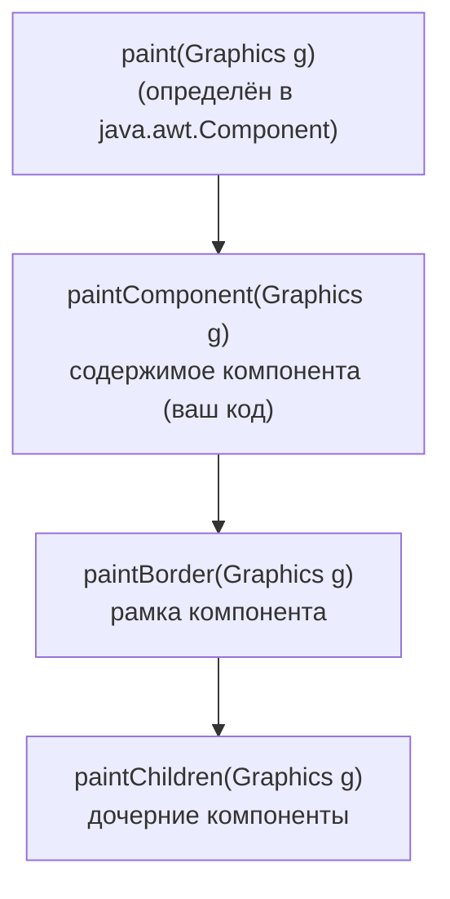
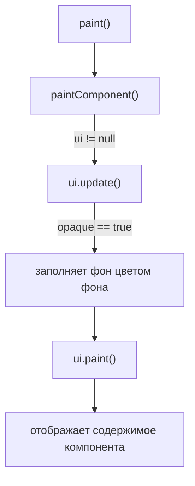

# Урок 10. Пользовательская отрисовка

**Трейл:** Creating a GUI with Swing · **Оригинал:** [Performing Custom Painting](https://docs.oracle.com/javase/tutorial/uiswing/painting/index.html)
**Связанные области:** [[01-core-java-syntax-oop]] · **Вопросы:** core-java

> Перевод официального руководства Oracle (The Java Tutorials, JDK 8). Урок собран из
> страниц *Performing Custom Painting*, *Creating the Demo Application (Step 1–3)*,
> *Refining the Design*, *A Closer Look at the Paint Mechanism*, *Summary* и
> *Solving Common Painting Problems*.

> Этот урок описывает пользовательскую отрисовку (*custom painting*) в Swing. Многие
> программы прекрасно обходятся без написания собственного кода отрисовки — они просто
> используют стандартные компоненты графического интерфейса (GUI), уже доступные в
> Swing API. Но если вам нужен точный контроль над тем, как рисуется ваша графика, то
> этот урок именно для вас. Мы рассмотрим пользовательскую отрисовку, создав простое
> GUI-приложение, которое рисует фигуру в ответ на действия мышью. Намеренно сохраняя
> простоту архитектуры, мы можем сосредоточиться на лежащих в основе концепциях
> отрисовки, которые, в свою очередь, пригодятся в других GUI-приложениях, которые вы
> будете разрабатывать в будущем.

> Урок объясняет каждую концепцию по шагам, по мере того как вы строите демонстрационное
> приложение. Код приводится как можно раньше, с минимумом предварительного теоретического
> чтения. Пользовательская отрисовка в Swing похожа на пользовательскую отрисовку в AWT,
> но, поскольку мы не рекомендуем писать приложения целиком на AWT, механизм отрисовки AWT
> здесь специально не рассматривается. Возможно, вам будет полезно прочитать этот урок, а
> затем углублённое обсуждение в статье
> [Painting in AWT and Swing](http://www.oracle.com/technetwork/java/painting-140037.html).

## Создание демонстрационного приложения (шаг 1)

> Любой графический интерфейс (Graphical User Interface) требует некоторого главного окна
> приложения, в котором он будет отображаться. В Swing это экземпляр класса
> `javax.swing.JFrame`. Поэтому наш первый шаг — создать экземпляр этого класса и
> убедиться, что всё работает как ожидается. Обратите внимание: при программировании в
> Swing код создания GUI должен размещаться в потоке диспетчеризации событий
> (Event Dispatch Thread, EDT). Это предотвратит возможные состояния гонки (*race
> conditions*), которые могли бы привести к взаимоблокировке (*deadlock*). Следующий
> листинг показывает, как это делается.

Результат: пустое окно `JFrame` с заголовком «Swing Paint Demo».

```java
package painting;

import javax.swing.SwingUtilities;
import javax.swing.JFrame;

public class SwingPaintDemo1 {

    public static void main(String[] args) {
        SwingUtilities.invokeLater(new Runnable() {
            public void run() {
                createAndShowGUI();
            }
        });
    }

    private static void createAndShowGUI() {
        System.out.println("Created GUI on EDT? "+
                SwingUtilities.isEventDispatchThread());
        JFrame f = new JFrame("Swing Paint Demo");
        f.setDefaultCloseOperation(JFrame.EXIT_ON_CLOSE);
        f.setSize(250,250);
        f.setVisible(true);
    }
}
```

> Этот код создаёт окно (*frame*), задаёт его заголовок и делает всё видимым. Мы
> использовали вспомогательный класс `SwingUtilities`, чтобы построить этот GUI в потоке
> диспетчеризации событий. Заметьте, что по умолчанию `JFrame` не завершает приложение,
> когда пользователь нажимает кнопку «закрыть». Это поведение мы задаём вызовом метода
> `setDefaultCloseOperation`, передавая ему соответствующий аргумент. Также мы явно задаём
> размер окна 250 × 250 пикселей. Этот шаг перестанет быть нужным, как только мы начнём
> добавлять компоненты в окно.

**Упражнения:**

1. Скомпилируйте и запустите приложение.
2. Проверьте кнопки сворачивания и разворачивания.
3. Нажмите кнопку закрытия (приложение должно завершиться).

## Создание демонстрационного приложения (шаг 2)

> Далее мы добавим в окно собственную поверхность для рисования. Для этого мы создадим
> подкласс класса `javax.swing.JPanel` (универсального легковесного контейнера), который
> предоставит код для отображения нашей пользовательской отрисовки.

```java
package painting;

import javax.swing.SwingUtilities;
import javax.swing.JFrame;
import javax.swing.JPanel;
import javax.swing.BorderFactory;
import java.awt.Color;
import java.awt.Dimension;
import java.awt.Graphics;

public class SwingPaintDemo2 {

    public static void main(String[] args) {
        SwingUtilities.invokeLater(new Runnable() {
            public void run() {
                createAndShowGUI();
            }
        });
    }

    private static void createAndShowGUI() {
        System.out.println("Created GUI on EDT? "+
        SwingUtilities.isEventDispatchThread());
        JFrame f = new JFrame("Swing Paint Demo");
        f.setDefaultCloseOperation(JFrame.EXIT_ON_CLOSE);
        f.add(new MyPanel());
        f.pack();
        f.setVisible(true);
    }
}

class MyPanel extends JPanel {

    public MyPanel() {
        setBorder(BorderFactory.createLineBorder(Color.black));
    }

    public Dimension getPreferredSize() {
        return new Dimension(250,200);
    }

    public void paintComponent(Graphics g) {
        super.paintComponent(g);

        // Рисуем текст
        g.drawString("This is my custom Panel!",10,20);
    }
}
```

> Первое изменение, которое вы заметите, — теперь мы импортируем ряд дополнительных классов,
> таких как `JPanel`, `Color` и `Graphics`. Поскольку некоторые из старых классов AWT всё
> ещё используются в современных Swing-приложениях, нормально видеть пакет `java.awt` в
> нескольких операторах импорта. Мы также определили собственный подкласс `JPanel` под
> названием `MyPanel`, на который приходится большая часть нового кода.

> Определение класса `MyPanel` содержит конструктор, который задаёт чёрную рамку (*border*)
> по краям панели. Это тонкая деталь, которую поначалу трудно заметить (если так, просто
> закомментируйте вызов `setBorder` и перекомпилируйте). `MyPanel` также переопределяет
> `getPreferredSize`, который возвращает желаемые ширину и высоту панели (в данном случае
> 250 — ширина, 200 — высота). Благодаря этому классу `SwingPaintDemo` больше не нужно
> указывать размер окна в пикселях. Он просто добавляет панель в окно и вызывает `pack`.

> Метод `paintComponent` — это место, где происходит вся ваша пользовательская отрисовка.
> Этот метод определён в `javax.swing.JComponent` и затем переопределяется вашими
> подклассами для обеспечения их пользовательского поведения. Его единственный параметр —
> объект [`java.awt.Graphics`](https://docs.oracle.com/javase/8/docs/api/java/awt/Graphics.html) —
> предоставляет ряд методов для рисования двумерных фигур и получения информации о
> графическом окружении приложения. В большинстве случаев объект, фактически получаемый
> этим методом, будет экземпляром
> [`java.awt.Graphics2D`](https://docs.oracle.com/javase/8/docs/api/java/awt/Graphics2D.html)
> (подкласса `Graphics`), который обеспечивает поддержку продвинутого рендеринга
> двумерной графики.

> Большинство стандартных Swing-компонентов реализуют свой внешний вид и поведение
> (*look and feel*) с помощью отдельных объектов «делегатов UI» (*UI Delegate*). Вызов
> `super.paintComponent(g)` передаёт графический контекст делегату UI компонента, который
> рисует фон панели. Подробнее об этом процессе см. раздел «Painting and the UI Delegate»
> в упомянутой выше статье SDN.

**Упражнения:**

1. Теперь, когда вы вывели на экран собственный текст, попробуйте свернуть и восстановить
   приложение, как делали ранее.
2. Закройте часть текста другим окном, затем уберите это окно, чтобы текст снова стал
   виден. В обоих случаях подсистема отрисовки определит, что компонент повреждён
   (*damaged*), и гарантирует, что ваш метод `paintComponent` будет вызван.

## Создание демонстрационного приложения (шаг 3)

> Наконец, мы добавим код обработки событий, который будет программно перерисовывать
> компонент всякий раз, когда пользователь щёлкает или перетаскивает мышь. Чтобы сделать
> нашу пользовательскую отрисовку максимально эффективной, мы будем отслеживать координаты
> мыши и перерисовывать только те области экрана, которые изменились. Это рекомендуемая
> практика, которая позволяет приложению работать максимально эффективно.

Результат: завершённое приложение, показывающее красный квадрат с чёрной рамкой.

```java
package painting;

import javax.swing.SwingUtilities;
import javax.swing.JFrame;
import javax.swing.JPanel;
import javax.swing.BorderFactory;
import java.awt.Color;
import java.awt.Dimension;
import java.awt.Graphics;
import java.awt.event.MouseEvent;
import java.awt.event.MouseListener;
import java.awt.event.MouseAdapter;
import java.awt.event.MouseMotionListener;
import java.awt.event.MouseMotionAdapter;

public class SwingPaintDemo3 {

    public static void main(String[] args) {
        SwingUtilities.invokeLater(new Runnable() {
            public void run() {
                createAndShowGUI();
            }
        });
    }

    private static void createAndShowGUI() {
        System.out.println("Created GUI on EDT? "+
        SwingUtilities.isEventDispatchThread());
        JFrame f = new JFrame("Swing Paint Demo");
        f.setDefaultCloseOperation(JFrame.EXIT_ON_CLOSE);
        f.add(new MyPanel());
        f.pack();
        f.setVisible(true);
    }
}

class MyPanel extends JPanel {

    private int squareX = 50;
    private int squareY = 50;
    private int squareW = 20;
    private int squareH = 20;

    public MyPanel() {

        setBorder(BorderFactory.createLineBorder(Color.black));

        addMouseListener(new MouseAdapter() {
            public void mousePressed(MouseEvent e) {
                moveSquare(e.getX(),e.getY());
            }
        });

        addMouseMotionListener(new MouseAdapter() {
            public void mouseDragged(MouseEvent e) {
                moveSquare(e.getX(),e.getY());
            }
        });

    }
    private void moveSquare(int x, int y) {
        int OFFSET = 1;
        if ((squareX!=x) || (squareY!=y)) {
            repaint(squareX,squareY,squareW+OFFSET,squareH+OFFSET);
            squareX=x;
            squareY=y;
            repaint(squareX,squareY,squareW+OFFSET,squareH+OFFSET);
        }
    }


    public Dimension getPreferredSize() {
        return new Dimension(250,200);
    }

    protected void paintComponent(Graphics g) {
        super.paintComponent(g);
        g.drawString("This is my custom Panel!",10,20);
        g.setColor(Color.RED);
        g.fillRect(squareX,squareY,squareW,squareH);
        g.setColor(Color.BLACK);
        g.drawRect(squareX,squareY,squareW,squareH);
    }
}
```

> Это изменение сначала импортирует различные классы для работы с мышью из пакета
> `java.awt.event`, что делает приложение способным реагировать на действия пользователя
> мышью. Конструктор обновлён, чтобы регистрировать слушателей событий (*event listeners*)
> для нажатий и перетаскиваний мыши. Всякий раз, когда получено событие `MouseEvent`, оно
> передаётся методу `moveSquare`, который обновляет координаты квадрата и разумно
> перерисовывает компонент. Заметьте, что по умолчанию любой код, помещённый в эти
> обработчики событий, будет выполняться в потоке диспетчеризации событий.

> Но самое важное изменение — это вызов метода `repaint`. Этот метод определён в
> `java.awt.Component` и является механизмом, который позволяет программно перерисовывать
> поверхность любого заданного компонента. У него есть версия без аргументов (перерисовывает
> весь компонент целиком) и версия с несколькими аргументами (перерисовывает только заданную
> область). Эта область также известна как *клип* (*clip*). Вызов многоаргументной версии
> `repaint` требует чуть больше усилий, но гарантирует, что ваш код отрисовки не будет
> тратить циклы на перерисовку областей экрана, которые не изменились.

> Поскольку мы вручную задаём клип, наш метод `moveSquare` вызывает метод `repaint` не один
> раз, а дважды. Первый вызов говорит Swing перерисовать ту область компонента, где квадрат
> *находился ранее* (унаследованное поведение использует делегат UI, чтобы заполнить эту
> область текущим цветом фона). Второй вызов рисует ту область компонента, где квадрат
> *находится сейчас*. Важно отметить: хотя мы вызвали `repaint` дважды подряд в одном и том
> же обработчике событий, Swing достаточно умён, чтобы взять эту информацию и перерисовать
> эти участки экрана за одну-единственную операцию отрисовки. Иными словами, Swing не будет
> перерисовывать компонент дважды подряд, даже если код выглядит именно так.

**Упражнения:**

1. Закомментируйте первый вызов `repaint` и обратите внимание, что происходит при щелчке
   или перетаскивании мыши. Поскольку эта строка отвечает за заполнение фона, вы заметите,
   что все квадраты остаются на экране после их рисования.
2. Когда на экране несколько квадратов, сверните и восстановите окно приложения. Что
   происходит? Вы заметите, что разворачивание экрана заставляет систему полностью
   перерисовать поверхность компонентов, что стирает все квадраты, кроме текущего.
3. Закомментируйте оба вызова `repaint` и добавьте в конец метода `paintComponent` строку,
   вызывающую вместо этого версию `repaint` без аргументов. Приложение будет выглядеть так,
   как будто восстановлено его исходное поведение, но отрисовка теперь станет менее
   эффективной, так как перерисовывается вся поверхность компонента. Вы можете заметить
   снижение производительности, особенно если приложение развёрнуто на весь экран.

## Уточнение архитектуры (Refining the Design)

> В демонстрационных целях имеет смысл держать логику отрисовки целиком внутри класса
> `MyPanel`. Но если вашему приложению потребуется отслеживать несколько экземпляров, один
> из шаблонов, который вы могли бы использовать, — вынести этот код в отдельный класс, чтобы
> каждый квадрат можно было рассматривать как отдельный объект. Этот приём распространён в
> программировании двумерных игр и иногда называется «анимацией спрайтов» (*sprite
> animation*).

```java
package painting;

import javax.swing.SwingUtilities;
import javax.swing.JFrame;
import javax.swing.JPanel;
import javax.swing.BorderFactory;
import java.awt.Color;
import java.awt.Dimension;
import java.awt.Graphics;
import java.awt.event.MouseEvent;
import java.awt.event.MouseListener;
import java.awt.event.MouseAdapter;
import java.awt.event.MouseMotionListener;
import java.awt.event.MouseMotionAdapter;

public class SwingPaintDemo4 {

    public static void main(String[] args) {

        SwingUtilities.invokeLater(new Runnable() {
            public void run() {
                createAndShowGUI();
            }
        });
    }

    private static void createAndShowGUI() {
        System.out.println("Created GUI on EDT? "+
        SwingUtilities.isEventDispatchThread());
        JFrame f = new JFrame("Swing Paint Demo");
        f.setDefaultCloseOperation(JFrame.EXIT_ON_CLOSE);
        f.add(new MyPanel());
        f.setSize(250,250);
        f.setVisible(true);
    }

}

class MyPanel extends JPanel {

    RedSquare redSquare = new RedSquare();

    public MyPanel() {

        setBorder(BorderFactory.createLineBorder(Color.black));

        addMouseListener(new MouseAdapter(){
            public void mousePressed(MouseEvent e){
                moveSquare(e.getX(),e.getY());
            }
        });

        addMouseMotionListener(new MouseAdapter(){
            public void mouseDragged(MouseEvent e){
                moveSquare(e.getX(),e.getY());
            }
        });

    }

    private void moveSquare(int x, int y){

        // Текущее состояние квадрата сохраняем в final-переменных,
        // чтобы избежать повторных вызовов одних и тех же методов.
        final int CURR_X = redSquare.getX();
        final int CURR_Y = redSquare.getY();
        final int CURR_W = redSquare.getWidth();
        final int CURR_H = redSquare.getHeight();
        final int OFFSET = 1;

        if ((CURR_X!=x) || (CURR_Y!=y)) {

            // Квадрат перемещается — перерисовываем фон
            // поверх старого расположения квадрата.
            repaint(CURR_X,CURR_Y,CURR_W+OFFSET,CURR_H+OFFSET);

            // Обновляем координаты.
            redSquare.setX(x);
            redSquare.setY(y);

            // Перерисовываем квадрат на новом месте.
            repaint(redSquare.getX(), redSquare.getY(),
                    redSquare.getWidth()+OFFSET,
                    redSquare.getHeight()+OFFSET);
        }
    }

    public Dimension getPreferredSize() {
        return new Dimension(250,200);
    }

    public void paintComponent(Graphics g) {
        super.paintComponent(g);
        g.drawString("This is my custom Panel!",10,20);

        redSquare.paintSquare(g);
    }
}

class RedSquare{

    private int xPos = 50;
    private int yPos = 50;
    private int width = 20;
    private int height = 20;

    public void setX(int xPos){
        this.xPos = xPos;
    }

    public int getX(){
        return xPos;
    }

    public void setY(int yPos){
        this.yPos = yPos;
    }

    public int getY(){
        return yPos;
    }

    public int getWidth(){
        return width;
    }

    public int getHeight(){
        return height;
    }

    public void paintSquare(Graphics g){
        g.setColor(Color.RED);
        g.fillRect(xPos,yPos,width,height);
        g.setColor(Color.BLACK);
        g.drawRect(xPos,yPos,width,height);
    }
}
```

> В этой конкретной реализации мы создали класс `RedSquare` полностью с нуля. Другой подход —
> повторно использовать функциональность `java.awt.Rectangle`, сделав `RedSquare` его
> подклассом. Независимо от того, как реализован `RedSquare`, важно то, что мы дали классу
> метод, принимающий объект `Graphics`, и этот метод вызывается из метода `paintComponent`
> панели. Такое разделение делает ваш код чище, потому что по сути говорит каждому красному
> квадрату нарисовать самого себя.

## Подробнее о механизме отрисовки (A Closer Look at the Paint Mechanism)

> К этому моменту вы знаете, что метод `paintComponent` — это место, где должен размещаться
> весь ваш код отрисовки. Действительно, этот метод будет вызван, когда придёт время рисовать,
> но отрисовка на самом деле начинается выше по иерархии классов — с метода `paint`
> (определённого в `java.awt.Component`). Этот метод будет выполнен подсистемой отрисовки
> всякий раз, когда ваш компонент нужно отобразить. Его сигнатура:

> - `public void paint(Graphics g)`

> `javax.swing.JComponent` расширяет этот класс и далее разбивает метод `paint` на три
> отдельных метода, которые вызываются в следующем порядке:

> - `protected void paintComponent(Graphics g)`
> - `protected void paintBorder(Graphics g)`
> - `protected void paintChildren(Graphics g)`

> API ничто не мешает вашему коду переопределить `paintBorder` и `paintChildren`, но, вообще
> говоря, для этого нет причин. Для всех практических целей `paintComponent` будет
> единственным методом, который вам когда-либо понадобится переопределять.

Конвейер отрисовки `JComponent`: метод `paint` последовательно вызывает три метода.

<!-- original: none | Oracle описывает порядок вызовов paint/paintComponent/paintBorder/paintChildren текстом, без отдельной диаграммы -->


> Как уже упоминалось, большинство стандартных Swing-компонентов реализуют свой внешний вид
> и поведение (*look and feel*) с помощью отдельных делегатов UI (*UI Delegates*). Это
> означает, что бо́льшая часть (или вся) отрисовка стандартных Swing-компонентов происходит
> следующим образом.

> 1. `paint()` вызывает `paintComponent()`.
> 2. Если свойство `ui` не равно `null`, `paintComponent()` вызывает `ui.update()`.
> 3. Если свойство компонента `opaque` равно `true`, `ui.update()` заполняет фон компонента
>    цветом фона и вызывает `ui.paint()`.
> 4. `ui.paint()` отображает содержимое компонента.

Делегирование отрисовки делегату UI для непрозрачного (*opaque*) компонента:

<!-- original: none | Oracle описывает цепочку paint→paintComponent→ui.update→ui.paint текстом; схема составлена автором -->


> Вот почему наш код `SwingPaintDemo` вызывает `super.paintComponent(g)`. Мы могли бы
> добавить дополнительный комментарий, чтобы сделать это понятнее:

```java
public void paintComponent(Graphics g) {
    // Сначала пусть рисует делегат UI — это включает
    // заполнение фона, поскольку данный компонент
    // непрозрачный (opaque).

    super.paintComponent(g);
    g.drawString("This is my custom Panel!",10,20);
    redSquare.paintSquare(g);
}
```

> Если вы поняли весь демонстрационный код, приведённый в этом уроке, — поздравляем! У вас
> достаточно практических знаний, чтобы писать эффективный код отрисовки в собственных
> приложениях. Если же вам нужен более пристальный взгляд «под капот», обратитесь к статье
> SDN, ссылка на которую дана на первой странице этого урока.

## Резюме (Summary)

> - В Swing отрисовка начинается с метода `paint`, который затем вызывает `paintComponent`,
>   `paintBorder` и `paintChildren`. Система вызовет это автоматически, когда компонент
>   рисуется впервые, изменяет размер или становится видимым после того, как был скрыт
>   другим окном.
> - Программные перерисовки выполняются вызовом метода компонента `repaint`; *не* вызывайте
>   его метод `paintComponent` напрямую. Вызов `repaint` заставляет подсистему отрисовки
>   предпринять необходимые шаги, чтобы гарантировать, что ваш метод `paintComponent` будет
>   вызван в подходящий момент.
> - Многоаргументная версия `repaint` позволяет сократить *прямоугольник отсечения*
>   (*clip rectangle*) компонента (участок экрана, затрагиваемый операциями отрисовки), так
>   что отрисовка может стать более эффективной. Мы применили этот приём в методе
>   `moveSquare`, чтобы избежать перерисовки участков экрана, которые не изменились. Есть
>   также версия этого метода без аргументов, которая перерисовывает всю поверхность
>   компонента.
> - Поскольку мы сократили прямоугольник отсечения, наш метод `moveSquare` вызывает
>   `repaint` не один раз, а дважды. Первый вызов перерисовывает ту область компонента, где
>   квадрат *находился ранее* (унаследованное поведение — заполнить эту область текущим
>   цветом фона). Второй вызов рисует ту область компонента, где квадрат *находится сейчас*.
> - Вы можете вызывать `repaint` несколько раз внутри одного и того же обработчика событий,
>   но Swing возьмёт эту информацию и перерисует компонент всего за одну операцию.
> - Для компонентов с делегатом UI вы должны передавать параметр `Graphics` строкой
>   `super.paintComponent(g)` в качестве первой строки кода в вашем переопределении
>   `paintComponent`. Если вы этого не сделаете, то ваш компонент будет сам отвечать за
>   ручную отрисовку своего фона. Вы можете поэкспериментировать с этим, закомментировав эту
>   строку и перекомпилировав, чтобы убедиться, что фон больше не рисуется.
> - Вынеся наш новый код в отдельный класс `RedSquare`, приложение сохраняет
>   объектно-ориентированную архитектуру, которая держит метод `paintComponent` класса
>   `MyPanel` свободным от загромождения. Отрисовка по-прежнему работает, потому что мы
>   передали объект `Graphics` красному квадрату, вызвав его метод `paintSquare(Graphics g)`.
>   Имейте в виду, что имя этого метода — то, которое мы придумали с нуля; мы не
>   переопределяем `paintSquare` откуда-либо выше по иерархии Swing API.

## Решение типичных проблем с отрисовкой (Solving Common Painting Problems)

> **Проблема:** Я не знаю, куда поместить мой код отрисовки.
>
> - Код отрисовки относится к методу `paintComponent` любого компонента, унаследованного от
>   `JComponent`.

> **Проблема:** То, что я рисую, не появляется.
>
> - Проверьте, отображается ли вообще ваш компонент. С этим вам поможет
>   [Solving Common Component Problems](https://docs.oracle.com/javase/tutorial/uiswing/components/problems.html).
> - Проверьте, вызывается ли `repaint` для вашего компонента всякий раз, когда его внешний
>   вид нужно обновить.

> **Проблема:** Передний план моего компонента отображается, но его фон невидим. В
> результате один или несколько компонентов, находящихся прямо за моим компонентом,
> неожиданно становятся видны.
>
> - Убедитесь, что ваш компонент непрозрачный (*opaque*). Например, панели `JPanel` по
>   умолчанию непрозрачны во многих, но не во всех look and feel. Чтобы сделать непрозрачными
>   такие компоненты, как `JLabel` и `JPanel` в GTK+, вы должны вызвать на них
>   `setOpaque(true)`.
> - Если ваш пользовательский компонент расширяет `JPanel` или более специализированный
>   потомок `JComponent`, то вы можете рисовать фон, вызывая `super.paintComponent` перед
>   рисованием содержимого вашего компонента.
> - Вы можете рисовать фон самостоятельно, используя этот код в начале метода
>   `paintComponent` пользовательского компонента:

```java
g.setColor(getBackground());
g.fillRect(0, 0, getWidth(), getHeight());
g.setColor(getForeground());
```

> **Проблема:** Я использовал `setBackground`, чтобы задать цвет фона моего компонента, но,
> похоже, это не дало эффекта.
>
> - Скорее всего, ваш компонент не рисует свой фон — либо потому, что он не непрозрачный,
>   либо потому, что ваш код отрисовки не рисует фон. Если вы задаёте цвет фона, например,
>   для `JLabel`, вы также должны вызвать `setOpaque(true)` на метке, чтобы её фон рисовался.

> **Проблема:** Я использую точно такой же код, как в примере из руководства, но он не
> работает. Почему?
>
> - Выполняется ли код в точно том же методе, что и в примере руководства? Например, если в
>   примере руководства код находится в методе `paintComponent` примера, то этот метод может
>   быть единственным местом, где код гарантированно работает.

> **Проблема:** Как мне рисовать толстые линии? узоры?
>
> - Java™ 2D API предоставляет обширную поддержку для реализации толщины и стилей линий, а
>   также узоров для заполнения и обводки (*stroking*) фигур. Подробнее об использовании
>   Java 2D API см. трейл
>   [2D Graphics](https://docs.oracle.com/javase/tutorial/2d/index.html).

> **Проблема:** Края определённого компонента выглядят странно.
>
> - Поскольку компоненты часто обновляют свои рамки, чтобы отразить состояние компонента,
>   вам, как правило, следует избегать вызова `setBorder`, кроме как на `JPanel` и
>   пользовательских подклассах `JComponent`.
> - Рисуется ли компонент look and feel вроде GTK+ или Windows XP, который использует рамки,
>   нарисованные UI, вместо объектов `Border`? Если да, не вызывайте `setBorder` на этом
>   компоненте.
> - Есть ли у компонента собственный код отрисовки? Если да, учитывает ли этот код отступы
>   (*insets*) компонента?

> **Проблема:** В моём GUI появляются визуальные артефакты.
>
> - Если вы задаёте цвет фона компонента, убедитесь, что цвет не имеет прозрачности, если
>   компонент должен быть непрозрачным.
> - При необходимости используйте метод `setOpaque`, чтобы задать прозрачность компонента.
>   Например, панель содержимого (*content pane*) должна быть непрозрачной, а компоненты с
>   прозрачным фоном не должны быть непрозрачными.
> - Убедитесь, что ваш пользовательский компонент полностью заполняет свою область отрисовки,
>   если он непрозрачный.

> **Проблема:** Производительность моего кода отрисовки низкая.
>
> - Если вы можете нарисовать часть компонента, используйте метод `getClip` или
>   `getClipBounds` класса `Graphics`, чтобы определить, какую область нужно нарисовать. Чем
>   меньше вы рисуете, тем быстрее это будет.
> - Если нужно обновить только часть вашего компонента, делайте запросы на отрисовку, используя
>   версию `repaint`, указывающую область отрисовки.
> - В поисках помощи по выбору эффективных приёмов отрисовки ищите строку «performance» на
>   [домашней странице Java Media APIs](http://www.oracle.com/technetwork/java/javase/tech/media-141984.html).

> **Проблема:** Одни и те же преобразования, применённые к, казалось бы, идентичным объектам
> `Graphics`, иногда дают слегка разные эффекты.
>
> - Поскольку код отрисовки Swing задаёт преобразование (используя метод `Graphics`
>   `translate`) перед вызовом `paintComponent`, любые преобразования, которые вы применяете,
>   имеют накопительный (*cumulative*) эффект. Это не имеет значения при простом сдвиге, но
>   более сложное преобразование, например `AffineTransform`, может дать неожиданные
>   результаты.

## Источник

- [Performing Custom Painting](https://docs.oracle.com/javase/tutorial/uiswing/painting/index.html) — официальное руководство Oracle (индекс урока).
- [Creating the Demo Application (Step 1)](https://docs.oracle.com/javase/tutorial/uiswing/painting/step1.html)
- [Creating the Demo Application (Step 2)](https://docs.oracle.com/javase/tutorial/uiswing/painting/step2.html)
- [Creating the Demo Application (Step 3)](https://docs.oracle.com/javase/tutorial/uiswing/painting/step3.html)
- [Refining the Design](https://docs.oracle.com/javase/tutorial/uiswing/painting/refining.html)
- [A Closer Look at the Paint Mechanism](https://docs.oracle.com/javase/tutorial/uiswing/painting/closer.html)
- [Summary](https://docs.oracle.com/javase/tutorial/uiswing/painting/summary.html)
- [Solving Common Painting Problems](https://docs.oracle.com/javase/tutorial/uiswing/painting/problems.html)
</content>
</invoke>
