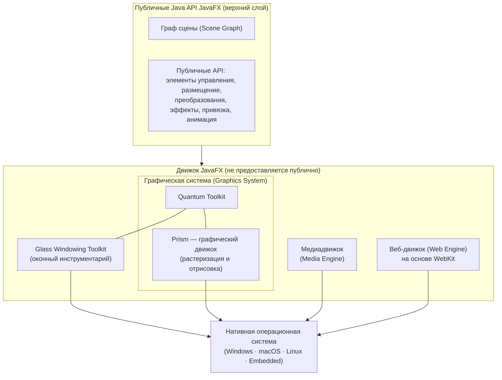

# Урок 2. Архитектура JavaFX

**Трейл:** Creating a JavaFX GUI · **Оригинал:** [Understanding the JavaFX Architecture](https://docs.oracle.com/javase/8/javafx/get-started-tutorial/jfx-architecture.htm)
**Связанные области:** [[01-core-java-syntax-oop]] · **Вопросы:** core-java

> Перевод официального руководства Oracle (JavaFX 8). Глава даёт высокоуровневое описание
> архитектуры и экосистемы JavaFX.

## Введение

Рисунок 2-1 иллюстрирует архитектурные компоненты платформы JavaFX. Разделы, следующие за
диаграммой, описывают каждый компонент и то, как части соединяются друг с другом. Под публичными
API JavaFX лежит движок (*engine*), который выполняет ваш код JavaFX. Он состоит из подкомпонентов,
включающих: высокопроизводительный графический движок JavaFX, называемый **Prism**; небольшую и
эффективную оконную систему (*windowing system*), называемую **Glass**; медиадвижок (*media engine*)
и веб-движок (*web engine*). Хотя эти компоненты не предоставляются публично, их описания помогут
вам лучше понять, что приводит в действие приложение JavaFX.

<!-- original: assets/09-javafx-gui/jfx-architecture.png | Рисунок 2-1. Архитектурные компоненты платформы JavaFX -->

Рисунок 2-1. Архитектурные компоненты платформы JavaFX. Верхний слой — публичные Java API
(граф сцены и возможности JavaFX); ниже — графическая система (Prism и Quantum Toolkit),
медиадвижок и веб-движок; в самом низу графического стека — Glass Windowing Toolkit, связывающий
платформу с нативной ОС.

## Граф сцены (Scene Graph)

Граф сцены (*scene graph*) JavaFX, показанный как часть верхнего слоя на рисунке 2-1, — это
отправная точка для построения приложения JavaFX. Это иерархическое дерево узлов (*nodes*), которое
представляет все визуальные элементы пользовательского интерфейса приложения. Оно может
обрабатывать ввод и может быть отрисовано.

Отдельный элемент графа сцены называется **узлом** (*node*). У каждого узла есть идентификатор (ID),
класс стиля (*style class*) и ограничивающий объём (*bounding volume*). За исключением корневого
узла (*root node*) графа сцены, каждый узел в графе сцены имеет одного родителя и ноль или более
потомков. Кроме того, узел может иметь:

* эффекты (*effects*), такие как размытия и тени;
* непрозрачность (*opacity*);
* преобразования (*transforms*);
* обработчики событий (*event handlers*) — например, мыши, клавиатуры и методов ввода;
* состояние, специфичное для приложения (*application-specific state*).

В отличие от Swing и Abstract Window Toolkit (AWT), граф сцены JavaFX также включает графические
примитивы (*graphics primitives*), такие как прямоугольники и текст, в дополнение к наличию
элементов управления, контейнеров размещения, изображений и медиа.

В большинстве случаев граф сцены упрощает работу с пользовательскими интерфейсами, особенно когда
используются богатые (*rich*) UI. Анимацию различной графики в графе сцены можно выполнить быстро с
помощью API `javafx.animation`; хорошо работают и декларативные методы, такие как XML-документ.

API `javafx.scene` позволяет создавать и задавать несколько типов содержимого, например:

* **Узлы (Nodes):** фигуры (2-D и 3-D), изображения, медиа, встроенный веб-браузер, текст, элементы
  управления UI, диаграммы, группы и контейнеры.
* **Состояние (State):** преобразования (позиционирование и ориентация узлов), визуальные эффекты и
  прочее визуальное состояние содержимого.
* **Эффекты (Effects):** простые объекты, изменяющие внешний вид узлов графа сцены, — например,
  размытия, тени и регулировка цвета.

Более подробно см. документ *Working with the JavaFX Scene Graph*.

## Публичные Java API для возможностей JavaFX

Верхний слой архитектуры JavaFX, показанный на рисунке 2-1, предоставляет полный набор публичных
Java API, поддерживающих разработку богатых клиентских приложений (*rich client applications*). Эти
API дают непревзойдённую свободу и гибкость для построения богатых клиентских приложений. Платформа
JavaFX объединяет лучшие возможности платформы Java со всеобъемлющей, погружающей мультимедийной
функциональностью в интуитивно понятную и комплексную среду разработки «всё в одном». Эти Java API
для возможностей JavaFX:

* позволяют использовать мощные возможности Java, такие как обобщения (*generics*), аннотации,
  многопоточность и лямбда-выражения (*Lambda Expressions*, введены в Java SE 8);
* облегчают веб-разработчикам использование JavaFX из других динамических языков на базе JVM,
  таких как Groovy и JavaScript;
* позволяют Java-разработчикам использовать другие системные языки, такие как Groovy, для написания
  больших или сложных приложений JavaFX;
* позволяют использовать привязку (*binding*), которая включает поддержку высокопроизводительной
  ленивой привязки (*lazy binding*), выражений привязки (*binding expressions*), выражений привязки
  последовательностей (*bound sequence expressions*) и частичной переоценки привязки (*partial bind
  reevaluation*). Альтернативные языки (например, Groovy) могут использовать эту библиотеку привязки
  для введения синтаксиса привязки, похожего на синтаксис JavaFX Script;
* расширяют библиотеку коллекций Java, добавляя наблюдаемые списки и карты (*observable lists and
  maps*), которые позволяют приложениям связывать пользовательские интерфейсы с моделями данных,
  отслеживать изменения в этих моделях данных и соответствующим образом обновлять связанный элемент
  управления UI.

API и модель программирования JavaFX являются продолжением линейки продуктов JavaFX 1.x.
Большинство API JavaFX были перенесены напрямую в Java. Некоторые API, такие как Layout
(размещение) и Media (медиа), наряду со многими другими деталями, были улучшены и упрощены на основе
отзывов, полученных от пользователей выпуска JavaFX 1.x. JavaFX больше опирается на веб-стандарты,
такие как CSS для стилизации элементов управления и ARIA для спецификаций доступности
(*accessibility*). Использование дополнительных веб-стандартов также находится на рассмотрении.

## Графическая система (Graphics System)

Графическая система JavaFX (*JavaFX Graphics System*), показанная синим цветом на рисунке 2-1, —
это деталь реализации под слоем графа сцены JavaFX. Она поддерживает как 2-D, так и 3-D графы сцены.
Она обеспечивает программную отрисовку (*software rendering*), когда графического оборудования в
системе недостаточно для поддержки аппаратно-ускоренной отрисовки.

На платформе JavaFX реализованы два графически ускоренных конвейера (*pipelines*):

* **Prism** обрабатывает задания отрисовки (*render jobs*). Он может работать как на аппаратных, так
  и на программных рендерерах, включая 3-D. Он отвечает за растеризацию (*rasterization*) и
  отрисовку сцен JavaFX. В зависимости от используемого устройства возможны следующие пути отрисовки
  (*render paths*):

  * DirectX 9 в Windows XP и Windows Vista;
  * DirectX 11 в Windows 7;
  * OpenGL на Mac, Linux, Embedded;
  * программная отрисовка, когда аппаратное ускорение невозможно.

  По возможности используется полностью аппаратно-ускоренный путь, но когда он недоступен,
  используется программный путь отрисовки, потому что программный путь отрисовки уже распространяется
  во всех средах выполнения Java (Java Runtime Environments, JRE). Это особенно важно при обработке
  3-D сцен. Тем не менее производительность выше, когда используются аппаратные пути отрисовки.

* **Quantum Toolkit** связывает Prism и Glass Windowing Toolkit вместе и делает их доступными для
  слоя JavaFX выше них в стеке. Он также управляет правилами работы с потоками (*threading rules*),
  связанными с отрисовкой в противовес обработке событий.

## Оконный инструментарий Glass (Glass Windowing Toolkit)

Оконный инструментарий Glass (*Glass Windowing Toolkit*), показанный бежевым цветом в средней части
рисунка 2-1, — это самый нижний уровень в графическом стеке JavaFX. Его главная обязанность —
предоставлять нативные сервисы операционной системы, такие как управление окнами, таймерами и
поверхностями (*surfaces*). Он служит платформозависимым слоем, который соединяет платформу JavaFX
с нативной операционной системой.

Инструментарий Glass также отвечает за управление очередью событий (*event queue*). В отличие от
Abstract Window Toolkit (AWT), который управляет собственной очередью событий, инструментарий Glass
использует функциональность очереди событий нативной операционной системы для планирования
использования потоков. Также, в отличие от AWT, инструментарий Glass работает в том же потоке, что и
приложение JavaFX. В AWT нативная половина AWT работает в одном потоке, а уровень Java — в другом
потоке. Это порождает множество проблем, многие из которых в JavaFX решены за счёт использования
подхода единого потока приложения JavaFX (*single JavaFX application thread*).

### Потоки (Threads)

В любой момент времени система выполняет два или более из следующих потоков.

* **Поток приложения JavaFX (JavaFX application thread):** это основной поток, используемый
  разработчиками приложений JavaFX. Доступ к любой «живой» сцене (*live scene*) — то есть сцене,
  являющейся частью окна, — должен осуществляться из этого потока. Граф сцены может быть создан и
  изменён в фоновом потоке (*background thread*), но когда его корневой узел присоединяется к любому
  живому объекту сцены, доступ к этому графу сцены должен осуществляться из потока приложения
  JavaFX. Это позволяет разработчикам создавать сложные графы сцены в фоновом потоке, сохраняя при
  этом анимацию на «живых» сценах плавной и быстрой. Поток приложения JavaFX — это иной поток,
  отличный от потока диспетчеризации событий (*Event Dispatch Thread*, EDT) Swing и AWT, поэтому при
  встраивании кода JavaFX в приложения Swing следует соблюдать осторожность.

* **Поток отрисовки Prism (Prism render thread):** этот поток выполняет отрисовку отдельно от
  диспетчера событий. Он позволяет отрисовывать кадр N, пока кадр N + 1 обрабатывается. Эта
  способность выполнять параллельную обработку — большое преимущество, особенно на современных
  системах с несколькими процессорами. Поток отрисовки Prism может также иметь несколько потоков
  растеризации (*rasterization threads*), которые помогают разгрузить работу, которую необходимо
  выполнить при отрисовке.

* **Поток медиа (Media thread):** этот поток работает в фоновом режиме и синхронизирует последние
  кадры через граф сцены, используя поток приложения JavaFX.

### Импульс (Pulse)

Импульс (*pulse*) — это событие, которое сообщает графу сцены JavaFX, что настало время
синхронизировать состояние элементов графа сцены с Prism. Импульс ограничен максимумом в 60 кадров в
секунду (fps) и срабатывает всякий раз, когда в графе сцены выполняются анимации. Даже когда
анимация не выполняется, импульс планируется, когда что-то в графе сцены изменяется. Например, если
изменяется позиция кнопки, планируется импульс.

Когда импульс срабатывает, состояние элементов графа сцены синхронизируется вниз до слоя отрисовки.
Импульс предоставляет разработчикам приложений способ обрабатывать события асинхронно. Эта важная
возможность позволяет системе группировать (*batch*) и выполнять события по импульсу.

Размещение (*Layout*) и CSS также привязаны к событиям импульса. Многочисленные изменения в графе
сцены могли бы привести к многократным обновлениям размещения или CSS, что могло бы серьёзно
ухудшить производительность. Система автоматически выполняет проход по CSS и размещению один раз за
импульс, чтобы избежать снижения производительности. Разработчики приложений могут также вручную
запускать проходы размещения по мере необходимости, чтобы выполнить измерения до импульса.

Оконный инструментарий Glass отвечает за выполнение событий импульса. Для их выполнения он
использует нативные таймеры высокого разрешения.

## Медиа и изображения (Media and Images)

Медиафункциональность JavaFX доступна через API `javafx.scene.media`. JavaFX поддерживает как
визуальное, так и аудиомедиа. Предусмотрена поддержка аудиофайлов MP3, AIFF и WAV и видеофайлов FLV.
Медиафункциональность JavaFX предоставляется в виде трёх отдельных компонентов: объект `Media`
представляет медиафайл, `MediaPlayer` воспроизводит медиафайл, а `MediaView` — это узел, который
отображает медиа.

Компонент медиадвижка (*Media Engine*), показанный зелёным цветом на рисунке 2-1, был спроектирован
с учётом производительности и стабильности и обеспечивает согласованное поведение на разных
платформах. Подробнее см. документ *Incorporating Media Assets into JavaFX Applications*.

## Веб-компонент (Web Component)

Веб-компонент (*Web component*) — это элемент управления UI JavaFX на основе WebKit, который
предоставляет средство просмотра веба и полную функциональность браузинга через свой API. Этот
компонент веб-движка (*Web Engine*), показанный оранжевым цветом на рисунке 2-1, основан на WebKit —
веб-браузерном движке с открытым исходным кодом, поддерживающем HTML5, CSS, JavaScript, DOM и SVG.
Он позволяет разработчикам реализовать в своих Java-приложениях следующие возможности:

* отрисовывать HTML-содержимое из локального или удалённого URL;
* поддерживать историю и обеспечивать навигацию «Назад» и «Вперёд»;
* перезагружать содержимое;
* применять эффекты к веб-компоненту;
* редактировать HTML-содержимое;
* выполнять команды JavaScript;
* обрабатывать события.

Этот встроенный компонент браузера состоит из следующих классов:

* `WebEngine` предоставляет базовую возможность браузинга веб-страниц.
* `WebView` инкапсулирует объект `WebEngine`, встраивает HTML-содержимое в сцену приложения и
  предоставляет поля и методы для применения эффектов и преобразований. Это расширение класса
  `Node`.

Кроме того, вызовы Java можно контролировать через JavaScript и наоборот, что позволяет
разработчикам извлекать максимум из обеих сред. Более подробный обзор встроенного браузера JavaFX
см. в документе *Adding HTML Content to JavaFX Applications*.

## CSS

Каскадные таблицы стилей JavaFX (*JavaFX Cascading Style Sheets*, CSS) предоставляют возможность
применять настраиваемую стилизацию к пользовательскому интерфейсу приложения JavaFX без изменения
какого-либо исходного кода этого приложения. CSS можно применять к любому узлу в графе сцены JavaFX,
причём к узлам они применяются асинхронно. Стили JavaFX CSS можно также легко назначать сцене во
время выполнения, что позволяет внешнему виду приложения динамически изменяться.

Рисунок 2-2 демонстрирует применение двух разных стилей CSS к одному и тому же набору элементов
управления UI.

JavaFX CSS основан на спецификациях W3C CSS версии 2.1, с некоторыми дополнениями из текущей работы
над версией 3. Поддержка JavaFX CSS и расширения были спроектированы так, чтобы таблицы стилей
JavaFX CSS могли чисто разбираться любым совместимым CSS-парсером, даже таким, который не
поддерживает расширения JavaFX. Это позволяет смешивать CSS-стили для JavaFX и для других целей
(например, для HTML-страниц) в единой таблице стилей. Все имена свойств JavaFX снабжены префиксом
вендорного расширения «`-fx-`», включая те, которые могли бы показаться совместимыми со стандартным
HTML CSS, потому что некоторые значения JavaFX имеют слегка иную семантику.

Более подробную информацию о JavaFX CSS см. в документе *Skinning JavaFX Applications with CSS*.

## Элементы управления UI (UI Controls)

Элементы управления UI JavaFX, доступные через API JavaFX, построены с использованием узлов графа
сцены. Они могут в полной мере использовать визуально богатые возможности платформы JavaFX и
переносимы между разными платформами. JavaFX CSS позволяет выполнять тематизацию (*theming*) и
скиннинг (*skinning*) элементов управления UI.

Рисунок 2-3 показывает некоторые из поддерживаемых в настоящее время элементов управления UI. Эти
элементы управления находятся в пакете `javafx.scene.control`.

Более подробную информацию обо всех доступных элементах управления UI JavaFX см. в документе *Using
JavaFX UI Controls* и в документации API для пакета `javafx.scene.control`.

## Размещение (Layout)

Контейнеры размещения (*layout containers*), или панели (*panes*), можно использовать, чтобы
обеспечить гибкое и динамическое расположение элементов управления UI внутри графа сцены приложения
JavaFX. API размещения JavaFX включает следующие классы-контейнеры, автоматизирующие
распространённые модели размещения:

* Класс `BorderPane` размещает свои узлы-содержимое в верхней, нижней, правой, левой или
  центральной области.
* Класс `HBox` располагает свои узлы-содержимое горизонтально в один ряд.
* Класс `VBox` располагает свои узлы-содержимое вертикально в один столбец.
* Класс `StackPane` помещает свои узлы-содержимое в единый стек «сзади наперёд» (*back-to-front*).
* Класс `GridPane` позволяет разработчику создать гибкую сетку из строк и столбцов, в которой
  размещаются узлы-содержимое.
* Класс `FlowPane` располагает свои узлы-содержимое в горизонтальном или вертикальном «потоке»
  (*flow*), перенося их по достижении заданной ширины (для горизонтального) или высоты (для
  вертикального) границ.
* Класс `TilePane` помещает свои узлы-содержимое в ячейки или плитки (*tiles*) размещения
  одинакового размера.
* Класс `AnchorPane` позволяет разработчикам создавать узлы, привязанные (*anchor*) к верхней,
  нижней, левой стороне или центру размещения.

Для достижения желаемой структуры размещения в приложении JavaFX разные контейнеры можно вкладывать
друг в друга.

Чтобы узнать больше о работе с размещениями, см. статью *Working with Layouts in JavaFX*. Более
подробную информацию об API размещения JavaFX см. в документации API для пакета `javafx.scene.layout`.

## 2-D и 3-D преобразования (2-D and 3-D Transformations)

Каждый узел в графе сцены JavaFX можно преобразовать в координатах x-y, используя следующие классы
`javafx.scene.transform`:

* `translate` — перемещает узел из одного места в другое вдоль плоскостей x, y, z относительно его
  начальной позиции.
* `scale` — изменяет размер узла, делая его больше или меньше в плоскостях x, y, z в зависимости от
  коэффициента масштабирования.
* `shear` (сдвиг) — поворачивает одну ось так, что оси x и y перестают быть перпендикулярными.
  Координаты узла смещаются на заданные множители.
* `rotate` — поворачивает узел вокруг заданной опорной точки (*pivot point*) сцены.
* `affine` (аффинное) — выполняет линейное отображение из 2-D/3-D координат в другие 2-D/3-D
  координаты, сохраняя свойства «прямизны» и «параллельности» линий. Этот класс следует
  использовать вместе с классами преобразований `Translate`, `Scale`, `Rotate` или `Shear`, а не
  напрямую.

Чтобы узнать больше о работе с преобразованиями, см. документ *Applying Transformations in JavaFX*.
Более подробную информацию о классах API `javafx.scene.transform` см. в документации API.

## Визуальные эффекты (Visual Effects)

Разработка богатых клиентских интерфейсов в графе сцены JavaFX подразумевает использование
визуальных эффектов (*Visual Effects*), или эффектов (*Effects*), для улучшения внешнего вида
приложений JavaFX в реальном времени. Эффекты JavaFX в основном основаны на пикселях изображения
(*image pixel-based*), и поэтому они берут набор узлов, находящихся в графе сцены, отрисовывают его
как изображение и применяют к нему заданные эффекты.

Среди доступных в JavaFX визуальных эффектов — использование следующих классов:

* `Drop Shadow` (отбрасываемая тень) — отрисовывает тень заданного содержимого позади содержимого, к
  которому применяется эффект.
* `Reflection` (отражение) — отрисовывает отражённую версию содержимого под фактическим содержимым.
* `Lighting` (освещение) — имитирует источник света, светящий на заданное содержимое, и может
  придать плоскому объекту более реалистичный трёхмерный вид.

Примеры использования некоторых из доступных визуальных эффектов см. в документе *Creating Visual
Effects*. Более подробную информацию обо всех доступных классах визуальных эффектов см. в
документации API для пакета `javafx.scene.effect`.

## Источник

- [Understanding the JavaFX Architecture](https://docs.oracle.com/javase/8/javafx/get-started-tutorial/jfx-architecture.htm) — официальное руководство Oracle (JavaFX 8).
