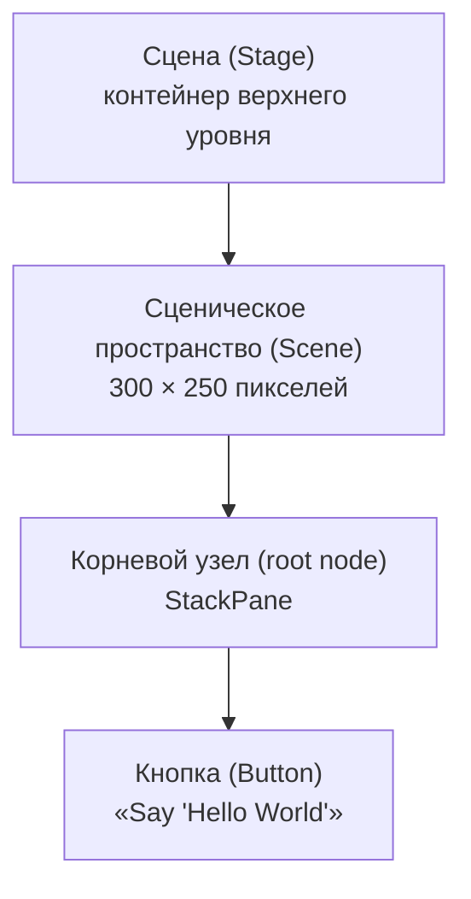

# Урок 3. «Hello World» в стиле JavaFX

**Трейл:** Creating a JavaFX GUI · **Оригинал:** [Hello World, JavaFX Style](https://docs.oracle.com/javase/8/javafx/get-started-tutorial/hello_world.htm)
**Связанные области:** [[01-core-java-syntax-oop]] · **Вопросы:** core-java

> Перевод официального руководства Oracle (JavaFX 8).

> Лучший способ показать, каково это — создавать и собирать приложение JavaFX, — это
> приложение «Hello World». Дополнительный плюс этого урока в том, что он позволяет
> проверить, правильно ли установлена технология JavaFX.
>
> В этом уроке используется среда разработки (IDE) NetBeans IDE 7.4. Прежде чем начать,
> убедитесь, что используемая вами версия NetBeans IDE поддерживает JavaFX 8. Подробности
> см. в разделе Certified System Configurations на странице загрузок Java SE 8.

## Сборка приложения (Construct the Application)

> 1. В меню **File** (Файл) выберите **New Project** (Новый проект).
> 2. В категории **JavaFX application** выберите **JavaFX Application**. Нажмите **Next**
>    (Далее).
> 3. Назовите проект **HelloWorld** и нажмите **Finish** (Готово).
>
>    NetBeans открывает файл `HelloWorld.java` и заполняет его кодом базового приложения
>    Hello World, как показано в Примере 3-1.

**Пример 3-1. Hello World**

```java
package helloworld;

import javafx.application.Application;
import javafx.event.ActionEvent;
import javafx.event.EventHandler;
import javafx.scene.Scene;
import javafx.scene.control.Button;
import javafx.scene.layout.StackPane;
import javafx.stage.Stage;

public class HelloWorld extends Application {

    @Override
    public void start(Stage primaryStage) {
        Button btn = new Button();
        btn.setText("Say 'Hello World'");
        btn.setOnAction(new EventHandler<ActionEvent>() {

            @Override
            public void handle(ActionEvent event) {
                System.out.println("Hello World!");
            }
        });

        StackPane root = new StackPane();
        root.getChildren().add(btn);

        Scene scene = new Scene(root, 300, 250);

        primaryStage.setTitle("Hello World!");
        primaryStage.setScene(scene);
        primaryStage.show();
    }

    public static void main(String[] args) {
        launch(args);
    }
}
```

## Структура приложения JavaFX

> Вот что важно знать о базовой структуре приложения JavaFX:
>
> - Главный класс приложения JavaFX расширяет (`extends`) класс
>   `javafx.application.Application`. Метод `start()` — это главная точка входа (*main entry
>   point*) для всех приложений JavaFX.
> - Приложение JavaFX определяет контейнер пользовательского интерфейса с помощью сцены
>   (*stage*) и сценического пространства (*scene*). Класс JavaFX `Stage` — это контейнер
>   верхнего уровня (*top-level container*) в JavaFX. Класс JavaFX `Scene` — это контейнер для
>   всего содержимого. В Примере 3-1 создаются объект `Stage` и объект `Scene`, после чего
>   `Scene` делается видимым в заданном размере в пикселях.
> - В JavaFX содержимое объекта `Scene` представлено в виде иерархического графа сцены
>   (*scene graph*) из узлов (*nodes*). В этом примере корневой узел (*root node*) — это
>   объект `StackPane`, изменяемый по размеру компоновочный узел (*resizable layout node*).
>   Это означает, что размер корневого узла отслеживает размер `Scene` и меняется, когда
>   пользователь изменяет размер `Stage`.
> - Корневой узел содержит один дочерний узел — элемент управления «кнопка» (*button
>   control*) с текстом, а также обработчик событий (*event handler*), который печатает
>   сообщение при нажатии кнопки.
> - Метод `main()` не обязателен для приложений JavaFX, если JAR-файл приложения создаётся
>   с помощью инструмента JavaFX Packager, который встраивает в JAR-файл компонент JavaFX
>   Launcher. Тем не менее метод `main()` полезно включать, чтобы можно было запускать
>   JAR-файлы, созданные без JavaFX Launcher, — например, при использовании среды
>   разработки (IDE), в которой инструменты JavaFX интегрированы не полностью. Кроме того,
>   приложения Swing, встраивающие код JavaFX, требуют наличия метода `main()`.

### Граф сцены приложения Hello World

> На Рисунке 3-1 показан граф сцены (*scene graph*) для приложения Hello World. Подробнее о
> графах сцены см. Working with the JavaFX Scene Graph.

Иерархия контейнеров приложения: сцена (`Stage`) содержит сценическое пространство
(`Scene`); корневым узлом `Scene` является `StackPane`, у которого есть один дочерний узел —
кнопка (`Button`).



*Рисунок 3-1. Граф сцены приложения Hello World (перерисовка оригинального скриншота).*

## Запуск приложения (Run the Application)

> 1. В окне **Projects** (Проекты) щёлкните правой кнопкой мыши по узлу проекта **HelloWorld**
>    и выберите **Run** (Запустить).
> 2. Нажмите кнопку **Say Hello World**.
> 3. Убедитесь, что текст «Hello World!» напечатан в окне вывода NetBeans. На Рисунке 3-2
>    показано приложение Hello World в стиле JavaFX.

*Рисунок 3-2. Приложение Hello World в стиле JavaFX (скриншот заменён подписью): окно
размером 300 × 250 пикселей с заголовком «Hello World!» и кнопкой «Say 'Hello World'» по
центру.*

## Куда двигаться дальше (Where to Go Next)

> На этом базовый урок Hello World завершён, но продолжайте читать, чтобы освоить другие
> уроки по разработке приложений JavaFX:
>
> - **Creating a Form in JavaFX** обучает основам компоновки экрана, тому, как добавлять
>   элементы управления в компоновку и как создавать события ввода.
> - **Fancy Forms with JavaFX CSS** предлагает простые приёмы стилизации для улучшения
>   приложения, включая добавление фонового изображения и стилизацию кнопок и текста.
> - **Using FXML to Create a User Interface** показывает альтернативный способ создания
>   пользовательского интерфейса входа. FXML — это язык на основе XML, который задаёт
>   структуру для построения пользовательского интерфейса отдельно от логики приложения
>   в вашем коде.
> - **Animation and Visual Effects in JavaFX** показывает, как оживить приложение, добавив
>   анимацию по таймлайну и эффекты смешивания (*blend effects*).

## Источник

- [Hello World, JavaFX Style](https://docs.oracle.com/javase/8/javafx/get-started-tutorial/hello_world.htm) — официальное руководство Oracle (Getting Started with JavaFX, JavaFX 8).
</content>
</invoke>
