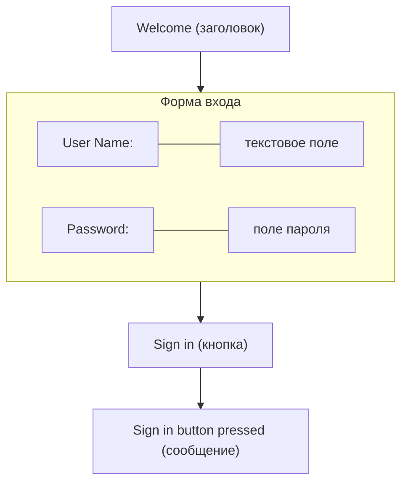

# Урок 4. Создание формы в JavaFX

**Трейл:** Creating a JavaFX GUI · **Оригинал:** [Creating a Form in JavaFX](https://docs.oracle.com/javase/8/javafx/get-started-tutorial/form.htm)
**Связанные области:** [[01-core-java-syntax-oop]] · **Вопросы:** core-java

> Создание формы — частая задача при разработке приложения. Этот урок учит основам компоновки
> экрана (screen layout), тому, как добавлять элементы управления (controls) в панель компоновки
> (layout pane) и как создавать события ввода (input events).
>
> В этом уроке вы с помощью JavaFX построите форму входа (login form), показанную на рисунке 4-1.

<!-- original: assets/09-javafx-gui/login-form.png | Рисунок 4-1. Форма входа в JavaFX -->


*Рисунок 4-1. Форма входа.*

> Инструмент, который используется в этом руководстве Getting Started, — среда разработки
> NetBeans IDE. Прежде чем начать, убедитесь, что используемая вами версия NetBeans IDE
> поддерживает JavaFX 8. Подробности смотрите на странице Certified System Configurations
> раздела Java SE Downloads.

## Создание проекта

> Ваша первая задача — создать проект JavaFX в NetBeans IDE и назвать его Login:

1. В меню **File** выберите **New Project**.
2. В категории **JavaFX application** выберите **JavaFX Application**. Нажмите **Next**.
3. Назовите проект **Login** и нажмите **Finish**.

> Когда вы создаёте проект JavaFX, NetBeans IDE предоставляет в качестве отправной точки
> приложение Hello World — вы уже видели его, если проходили урок Hello World.

4. Удалите метод `start()`, сгенерированный NetBeans IDE, и замените его кодом из примера 4-1.

**Пример 4-1. Сцена приложения (Application Stage)**

```java
@Override
    public void start(Stage primaryStage) {
        primaryStage.setTitle("JavaFX Welcome");

        primaryStage.show();
    }
```

> После того как вы добавите образец кода в проект NetBeans, нажмите Ctrl (или Cmd) + Shift + I,
> чтобы импортировать необходимые пакеты. Когда есть выбор операторов импорта, выбирайте тот,
> что начинается с `javafx`.

## Создание компоновки GridPane

> Для формы входа используйте компоновку `GridPane`, потому что она позволяет создать гибкую
> сетку (grid) из строк и столбцов, в которой размещаются элементы управления. Элементы управления
> можно размещать в любой ячейке сетки, а при необходимости делать так, чтобы элемент занимал
> несколько ячеек.
>
> Код для создания компоновки `GridPane` приведён в примере 4-2. Добавьте этот код перед строкой
> `primaryStage.show();`.

**Пример 4-2. GridPane со свойствами отступов между ячейками (gap) и внешних отступов (padding)**

```java
GridPane grid = new GridPane();
grid.setAlignment(Pos.CENTER);
grid.setHgap(10);
grid.setVgap(10);
grid.setPadding(new Insets(25, 25, 25, 25));

Scene scene = new Scene(grid, 300, 275);
primaryStage.setScene(scene);
```

> В примере 4-2 создаётся объект `GridPane`, который присваивается переменной с именем `grid`.
> Свойство выравнивания (alignment) меняет позицию сетки по умолчанию с верхнего левого угла
> сцены (scene) на центр. Свойства отступов между ячейками (gap) управляют расстоянием между
> строками и столбцами, а свойство внешнего отступа (padding) управляет пространством вокруг краёв
> панели сетки. Отступы (insets) задаются в порядке: сверху, справа, снизу и слева. В этом примере
> с каждой стороны по `25` пикселей отступа.
>
> Сцена создаётся с панелью сетки в качестве корневого узла (root node) — это распространённая
> практика при работе с контейнерами компоновки. Таким образом, при изменении размера окна узлы
> внутри панели сетки изменяют размер в соответствии со своими ограничениями компоновки (layout
> constraints). В этом примере панель сетки остаётся в центре, когда вы увеличиваете или уменьшаете
> окно. Свойства внешнего отступа гарантируют, что вокруг панели сетки сохраняется отступ, когда
> вы делаете окно меньше.
>
> Этот код задаёт ширину и высоту сцены `300` на `275`. Если не задать размеры сцены, она
> по умолчанию принимает минимальный размер, необходимый для отображения её содержимого.

## Добавление текста, меток и текстовых полей

> Если посмотреть на рисунок 4-1, видно, что для формы требуются заголовок «Welcome», а также
> текстовое поле и поле пароля для сбора информации от пользователя. Код для создания этих элементов
> управления приведён в примере 4-3. Добавьте этот код после строки, которая задаёт свойство
> отступа сетки (padding).

**Пример 4-3. Элементы управления (Controls)**

```java
Text scenetitle = new Text("Welcome");
scenetitle.setFont(Font.font("Tahoma", FontWeight.NORMAL, 20));
grid.add(scenetitle, 0, 0, 2, 1);

Label userName = new Label("User Name:");
grid.add(userName, 0, 1);

TextField userTextField = new TextField();
grid.add(userTextField, 1, 1);

Label pw = new Label("Password:");
grid.add(pw, 0, 2);

PasswordField pwBox = new PasswordField();
grid.add(pwBox, 1, 2);
```

> Первая строка создаёт объект `Text`, который нельзя редактировать, задаёт текст `Welcome`
> и присваивает его переменной с именем `scenetitle`. Следующая строка с помощью метода `setFont()`
> задаёт семейство шрифта (font family), его насыщенность (weight) и размер для переменной
> `scenetitle`. Использование встроенного стиля (inline style) уместно там, где стиль привязан
> к переменной, но более удачный приём для оформления элементов пользовательского интерфейса —
> использование таблицы стилей (style sheet). В следующем уроке, Fancy Forms with JavaFX CSS,
> вы замените встроенный стиль таблицей стилей.
>
> Метод `grid.add()` добавляет переменную `scenetitle` в компоновку `grid`. Нумерация столбцов
> и строк в сетке начинается с нуля, и `scenetitle` добавляется в столбец 0, строку 0. Последние
> два аргумента метода `grid.add()` задают размах по столбцам (column span), равный 2, и размах
> по строкам (row span), равный 1.
>
> Следующие строки создают объект `Label` с текстом `User Name` в столбце 0, строке 1 и объект
> `TextField`, который можно редактировать. Текстовое поле добавляется в панель сетки в столбец 1,
> строку 1. Поле пароля (`PasswordField`) и метка создаются и добавляются в панель сетки аналогично.

> При работе с панелью сетки можно отобразить линии сетки (grid lines), что полезно для отладки.
> В этом случае можно добавить `grid.setGridLinesVisible(true)` после строки, которая добавляет поле
> пароля. Тогда при запуске приложения вы увидите линии столбцов и строк сетки, а также свойства
> отступов между ячейками, как показано на рисунке 4-2.

*Рисунок 4-2. Форма входа с линиями сетки.*

## Добавление кнопки и текста

> Последние два элемента управления, требующиеся приложению, — элемент `Button` для отправки данных
> и элемент `Text` для отображения сообщения, когда пользователь нажимает кнопку.
>
> Сначала создайте кнопку и расположите её в нижнем правом углу — это распространённое размещение
> для кнопок, выполняющих действие, которое затрагивает всю форму. Код приведён в примере 4-4.
> Добавьте этот код перед кодом для сцены.

**Пример 4-4. Кнопка (Button)**

```java
Button btn = new Button("Sign in");
HBox hbBtn = new HBox(10);
hbBtn.setAlignment(Pos.BOTTOM_RIGHT);
hbBtn.getChildren().add(btn);
grid.add(hbBtn, 1, 4);
```

> Первая строка создаёт кнопку с именем `btn` и надписью `Sign in`, а вторая строка создаёт панель
> компоновки `HBox` с именем `hbBtn` и расстоянием `10` пикселей между элементами. Панель `HBox`
> задаёт для кнопки выравнивание, отличное от выравнивания, применённого к остальным элементам
> управления в панели сетки. Свойство `alignment` имеет значение `Pos.BOTTOM_RIGHT`, которое
> размещает узел внизу пространства по вертикали и у правого края по горизонтали. Кнопка добавляется
> как дочерний элемент (child) панели `HBox`, а панель `HBox` добавляется в сетку в столбец 1,
> строку 4.
>
> Теперь добавьте элемент `Text` для отображения сообщения, как показано в примере 4-5. Добавьте
> этот код перед кодом для сцены.

**Пример 4-5. Текст (Text)**

```java
final Text actiontarget = new Text();
        grid.add(actiontarget, 1, 6);
```

> Рисунок 4-3 показывает форму в текущем виде. Вы не увидите текстового сообщения, пока не пройдёте
> следующий раздел урока, «Добавление кода для обработки события».

*Рисунок 4-3. Форма входа с кнопкой.*

## Добавление кода для обработки события

> Наконец, сделайте так, чтобы кнопка отображала текстовое сообщение при нажатии. Добавьте код
> из примера 4-6 перед кодом для сцены.

**Пример 4-6. Событие кнопки (Button Event)**

```java
btn.setOnAction(new EventHandler<ActionEvent>() {

    @Override
    public void handle(ActionEvent e) {
        actiontarget.setFill(Color.FIREBRICK);
        actiontarget.setText("Sign in button pressed");
    }
});
```

> Метод `setOnAction()` используется для регистрации обработчика события (event handler), который
> задаёт объекту `actiontarget` значение `Sign in button pressed`, когда пользователь нажимает
> кнопку. Цвет объекта `actiontarget` устанавливается в кирпично-красный (firebrick red).

## Источник

- [Creating a Form in JavaFX](https://docs.oracle.com/javase/8/javafx/get-started-tutorial/form.htm) — официальное руководство Oracle (JavaFX 8).
</content>
</invoke>
