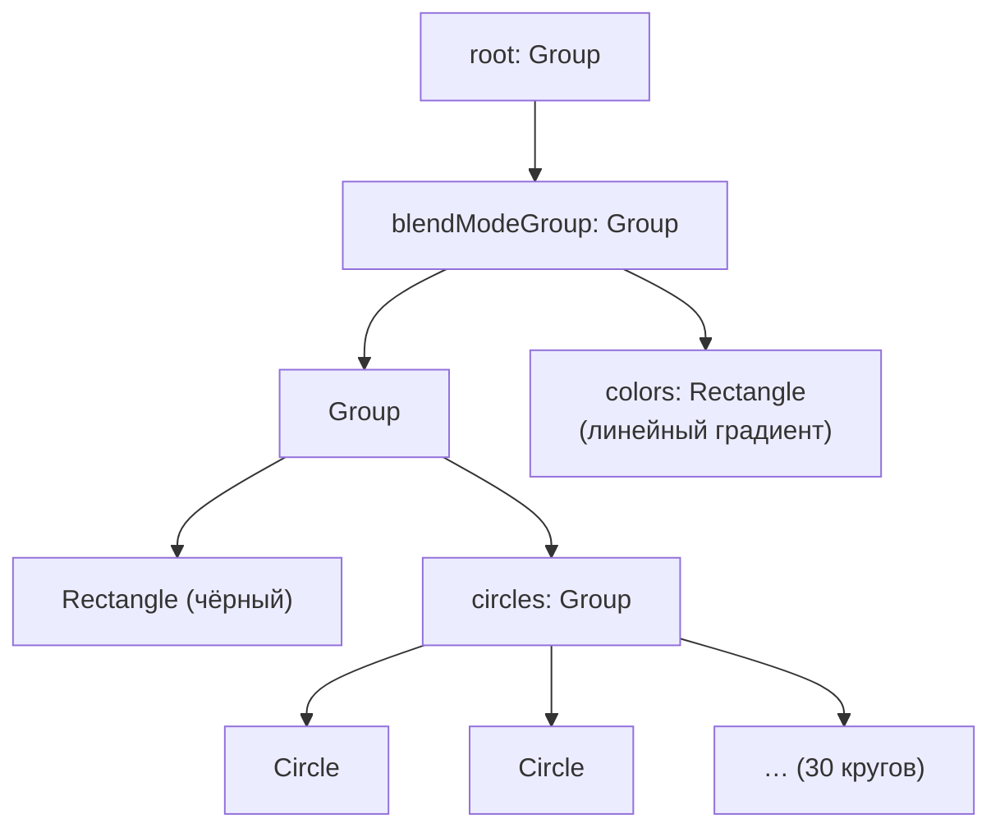

# Урок 7. Анимация и визуальные эффекты в JavaFX

**Трейл:** Creating a JavaFX GUI · **Оригинал:** [Animation and Visual Effects in JavaFX](https://docs.oracle.com/javase/8/javafx/get-started-tutorial/animation.htm)
**Связанные области:** [[01-core-java-syntax-oop]] · **Вопросы:** core-java

> Перевод официального руководства Oracle (JavaFX 8).

## Введение

> JavaFX позволяет быстро разрабатывать приложения с насыщенным пользовательским
> взаимодействием. В этом вводном руководстве (Getting Started) вы научитесь создавать
> анимированные объекты и добиваться сложных эффектов с минимумом кода.

Приложение, которое предстоит создать, — **Colorful Circles** («Разноцветные круги»).

Граф сцены (*scene graph*) приложения `ColorfulCircles` устроен так: ветвящиеся узлы — это
экземпляры класса `Group`, а неветвящиеся узлы (их также называют **листовыми**, *leaf nodes*) —
экземпляры классов `Rectangle` и `Circle`.

<!-- original: assets/09-javafx-gui/colorful-circles-scenegraph.png | Граф сцены приложения ColorfulCircles -->


> Инструмент, используемый в этом руководстве, — среда NetBeans IDE. Прежде чем начать,
> убедитесь, что используемая версия NetBeans IDE поддерживает JavaFX 8. Подробности — в разделе
> Certified System Configurations на странице
> [Java SE Downloads](https://www.oracle.com/technetwork/java/javase/downloads/).

## Настройка приложения

> Настройте проект JavaFX в NetBeans IDE следующим образом:
>
> 1. В меню **File** выберите **New Project**.
> 2. В категории **JavaFX application** выберите **JavaFX Application**. Нажмите **Next**.
> 3. Назовите проект **ColorfulCircles** и нажмите **Finish**.
> 4. Удалите операторы импорта (*import*), сгенерированные NetBeans IDE.
>
> Операторы импорта можно будет добавлять по ходу руководства с помощью автодополнения кода
> либо команды **Fix Imports** из меню **Source** в NetBeans IDE. Если предлагается несколько
> вариантов импорта, выбирайте тот, что начинается с `javafx`.

## Настройка проекта

> Удалите класс `ColorfulCircles`, сгенерированный NetBeans IDE, из исходного файла и замените его
> кодом из примера 7-1.

**Пример 7-1. Базовое приложение**

```java
public class ColorfulCircles extends Application {

    @Override
    public void start(Stage primaryStage) {
        Group root = new Group();
        Scene scene = new Scene(root, 800, 600, Color.BLACK);
        primaryStage.setScene(scene);

        primaryStage.show();
    }

    public static void main(String[] args) {
        launch(args);
    }
}
```

> Для приложения ColorfulCircles в качестве корневого узла (*root node*) сцены уместно использовать
> узел-группу (`Group`). Размер группы определяется размером находящихся внутри неё узлов. Однако в
> большинстве приложений требуется, чтобы узлы отслеживали размер сцены и менялись при изменении
> размеров окна (`Stage`). В этом случае в качестве корневого узла используют изменяемый по размеру
> узел компоновки (*resizable layout node*), как описано в руководстве
> [Creating a Form in JavaFX](https://docs.oracle.com/javase/8/javafx/get-started-tutorial/form.htm).
>
> Приложение ColorfulCircles можно скомпилировать и запустить уже сейчас, а также на каждом шаге
> руководства, чтобы видеть промежуточные результаты. Если возникнут проблемы, обратитесь к коду в
> файле `ColorfulCircles.java`, который входит в загружаемый архив
> [ColorfulCircles.zip](https://docs.oracle.com/javase/8/javafx/sample-apps/ColorfulCircles.zip).
> На данном этапе приложение представляет собой простое чёрное окно.

## Добавление графики

> Далее создайте 30 кругов, добавив код из примера 7-2 перед строкой `primaryStage.show()`.

**Пример 7-2. 30 кругов**

```java
Group circles = new Group();
for (int i = 0; i < 30; i++) {
   Circle circle = new Circle(150, Color.web("white", 0.05));
   circle.setStrokeType(StrokeType.OUTSIDE);
   circle.setStroke(Color.web("white", 0.16));
   circle.setStrokeWidth(4);
   circles.getChildren().add(circle);
}
root.getChildren().add(circles);
```

> Этот код создаёт группу с именем `circles`, после чего с помощью цикла `for` добавляет в группу
> 30 кругов. У каждого круга радиус равен `150`, цвет заливки — `white` (белый), а уровень
> непрозрачности (*opacity*) — `5` процентов, то есть круг почти прозрачный.
>
> Чтобы создать у кругов рамку, в коде используется класс `StrokeType`. Тип обводки (*stroke type*)
> `OUTSIDE` означает, что граница круга выходит за пределы его внутренней области на величину
> `StrokeWidth`, равную `4`. Цвет обводки — `white`, а уровень непрозрачности — `16` процентов, что
> делает её ярче цвета самих кругов.
>
> Последняя строка добавляет группу `circles` в корневой узел. Это временная структура. Позже вы
> измените граф сцены так, чтобы он соответствовал изображённому на рис. 7-2.
>
> Поскольку код пока не задаёт каждому кругу уникальное положение, круги рисуются один поверх
> другого, а центром для них служит левый верхний угол окна. Непрозрачность наложенных друг на
> друга кругов взаимодействует с чёрным фоном, давая серый цвет кругов.

## Добавление визуального эффекта

> Продолжите, применив к кругам эффект размытия «box blur» (блочное размытие), чтобы они выглядели
> слегка не в фокусе. Код приведён в примере 7-3. Добавьте этот код перед строкой
> `primaryStage.show()`.

**Пример 7-3. Эффект блочного размытия (Box Blur)**

```java
circles.setEffect(new BoxBlur(10, 10, 3));
```

> Этот код задаёт радиус размытия `10` пикселей в ширину и `10` пикселей в высоту, а число итераций
> размытия — `3`, благодаря чему эффект приближается к размытию по Гауссу (*Gaussian blur*). Такая
> техника размытия сглаживает края кругов.

Используемый класс эффекта — `BoxBlur`.

## Создание фонового градиента

> Теперь создайте прямоугольник и залейте его линейным градиентом (*linear gradient*), как показано
> в примере 7-4.
>
> Добавьте код перед строкой `root.getChildren().add(circles)`, чтобы прямоугольник с градиентом
> оказался позади кругов.

**Пример 7-4. Линейный градиент**

```java
Rectangle colors = new Rectangle(scene.getWidth(), scene.getHeight(),
     new LinearGradient(0f, 1f, 1f, 0f, true, CycleMethod.NO_CYCLE, new
         Stop[]{
            new Stop(0, Color.web("#f8bd55")),
            new Stop(0.14, Color.web("#c0fe56")),
            new Stop(0.28, Color.web("#5dfbc1")),
            new Stop(0.43, Color.web("#64c2f8")),
            new Stop(0.57, Color.web("#be4af7")),
            new Stop(0.71, Color.web("#ed5fc2")),
            new Stop(0.85, Color.web("#ef504c")),
            new Stop(1, Color.web("#f2660f")),}));
colors.widthProperty().bind(scene.widthProperty());
colors.heightProperty().bind(scene.heightProperty());
root.getChildren().add(colors);
```

> Этот код создаёт прямоугольник с именем `colors`. Прямоугольник имеет ту же ширину и высоту, что и
> сцена, и заливается линейным градиентом, который начинается в левом нижнем углу (0, 1) и
> заканчивается в правом верхнем углу (1, 0). Значение `true` означает, что градиент
> пропорционален прямоугольнику, а `NO_CYCLE` указывает, что цикл цветов не будет повторяться.
> Последовательность `Stop[]` (точки градиента, *stops*) задаёт, какой цвет должен иметь градиент в
> конкретной точке.
>
> Следующие две строки кода заставляют линейный градиент подстраиваться при изменении размера сцены,
> привязывая (*binding*) ширину и высоту прямоугольника к ширине и высоте сцены. Подробнее о
> привязке см. в руководстве
> [Using JavaFX Properties and Bindings](https://docs.oracle.com/javase/8/javafx/properties-binding-tutorial/binding.htm).
>
> Последняя строка кода добавляет прямоугольник `colors` в корневой узел.
>
> Серые круги с размытыми краями теперь отображаются поверх радуги цветов.

Используемые классы: `LinearGradient`, `Stop[]`, `CycleMethod.NO_CYCLE`.

## Применение режима наложения (Blend Mode)

> Далее добавьте кругам цвет и затемните сцену с помощью эффекта наложения «overlay» (перекрытие).
> Вы удалите группу `circles` и прямоугольник с линейным градиентом из графа сцены и добавите их в
> новую группу наложения.
>
> 1. Найдите следующие две строки кода:
>
>    ```java
>    root.getChildren().add(colors);
>    root.getChildren().add(circles);
>    ```
>
> 2. Замените эти две строки кодом из примера 7-5.

**Пример 7-5. Режим наложения**

```java
Group blendModeGroup =
    new Group(new Group(new Rectangle(scene.getWidth(), scene.getHeight(),
        Color.BLACK), circles), colors);
colors.setBlendMode(BlendMode.OVERLAY);
root.getChildren().add(blendModeGroup);
```

> Группа `blendModeGroup` задаёт структуру для наложения «overlay». Группа содержит два дочерних
> узла. Первый дочерний узел — новая (безымянная) группа `Group`, содержащая новый (безымянный)
> чёрный прямоугольник и ранее созданную группу `circles`. Второй дочерний узел — ранее созданный
> прямоугольник `colors`.
>
> Метод `setBlendMode()` применяет наложение «overlay» к прямоугольнику `colors`. Последняя строка
> кода добавляет `blendModeGroup` в граф сцены как дочерний узел корневого узла (см. рис. 7-2).
>
> Наложение «overlay» — распространённый эффект в приложениях для графического дизайна. Такое
> наложение может затемнить изображение, добавить блики или сделать и то и другое, в зависимости от
> цветов в наложении. В данном случае в качестве накладываемого слоя используется прямоугольник с
> линейным градиентом. Чёрный прямоугольник удерживает фон тёмным, а почти прозрачные круги
> подхватывают цвета градиента, но при этом тоже затемняются.
>
> Полный эффект наложения «overlay» вы увидите, когда анимируете круги на следующем шаге.

Используемый режим наложения — `BlendMode.OVERLAY`.

## Добавление анимации

> Заключительный шаг — использовать анимации JavaFX, чтобы привести круги в движение:
>
> 1. Если вы ещё этого не сделали, добавьте `import static java.lang.Math.random;` в список
>    операторов импорта.
> 2. Добавьте код анимации из примера 7-6 перед строкой `primaryStage.show()`.

**Пример 7-6. Анимация**

```java
Timeline timeline = new Timeline();
for (Node circle: circles.getChildren()) {
    timeline.getKeyFrames().addAll(
        new KeyFrame(Duration.ZERO, // задать начальную позицию в момент 0
            new KeyValue(circle.translateXProperty(), random() * 800),
            new KeyValue(circle.translateYProperty(), random() * 600)
        ),
        new KeyFrame(new Duration(40000), // задать конечную позицию в момент 40 с
            new KeyValue(circle.translateXProperty(), random() * 800),
            new KeyValue(circle.translateYProperty(), random() * 600)
        )
    );
}
// воспроизвести 40 секунд анимации
timeline.play();
```

> Анимацией управляет таймлайн (*timeline*, временная шкала), поэтому этот код создаёт таймлайн, а
> затем с помощью цикла `for` добавляет каждому из 30 кругов по два ключевых кадра (*key frame*).
> Первый ключевой кадр в момент 0 секунд использует свойства `translateXProperty` и
> `translateYProperty`, чтобы задать кругам случайное положение в пределах окна. Второй ключевой
> кадр в момент 40 секунд делает то же самое. Таким образом, при воспроизведении таймлайна все круги
> анимируются из одного случайного положения в другое в течение 40 секунд.

Тем самым 30 разноцветных кругов приходят в движение, и приложение готово. Полный исходный код см. в
файле `ColorfulCircles.java`, входящем в загружаемый архив
[ColorfulCircles.zip](https://docs.oracle.com/javase/8/javafx/sample-apps/ColorfulCircles.zip).

## Что дальше

> Вот несколько предложений о том, что делать дальше:
>
> - Опробуйте примеры JavaFX (*JavaFX samples*), которые можно загрузить в разделе JDK Demos and
>   Samples на странице
>   [Java SE Downloads](https://www.oracle.com/technetwork/java/javase/downloads/). Особенно обратите
>   внимание на приложение **Ensemble**, в котором есть примеры кода для анимаций и эффектов.
> - Прочитайте
>   [Creating Transitions and Timeline Animation in JavaFX](https://docs.oracle.com/javase/8/javafx/visual-effects-tutorial/animations.htm).
>   Там вы найдёте больше подробностей о таймлайн-анимации, а также сведения о переходах (*transitions*)
>   типа fade (затухание), path (по траектории), parallel (параллельный) и sequential
>   (последовательный).
> - См.
>   [Creating Visual Effects in JavaFX](https://docs.oracle.com/javase/8/javafx/visual-effects-tutorial/visual_effects.htm)
>   — о дополнительных способах улучшить вид и оформление приложения, включая эффекты отражения
>   (*reflection*), освещения (*lighting*) и тени (*shadow*).
> - Попробуйте инструмент **JavaFX Scene Builder** для создания визуально интересных приложений. Этот
>   инструмент предоставляет среду визуальной компоновки для проектирования интерфейса приложений
>   JavaFX и генерирует код FXML. Для добавления эффектов к элементам интерфейса можно использовать
>   панель свойств (Properties) или пункт **Modify** в строке меню. Подробности — в разделах
>   Properties Panel и Menu Bar руководства JavaFX Scene Builder User Guide.

## Источник

- [Animation and Visual Effects in JavaFX](https://docs.oracle.com/javase/8/javafx/get-started-tutorial/animation.htm) — официальное руководство Oracle (JavaFX 8 Getting Started Tutorial).
</content>
</invoke>
