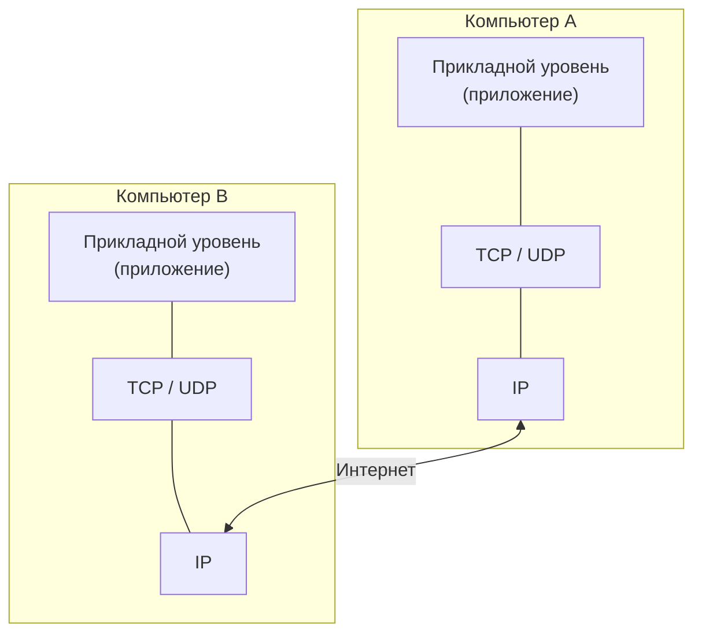
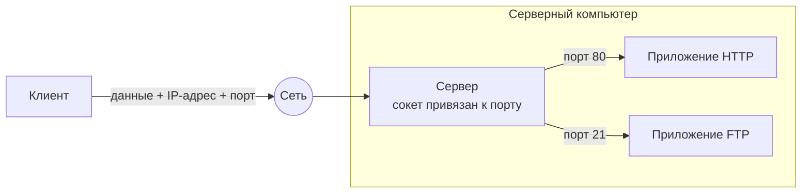
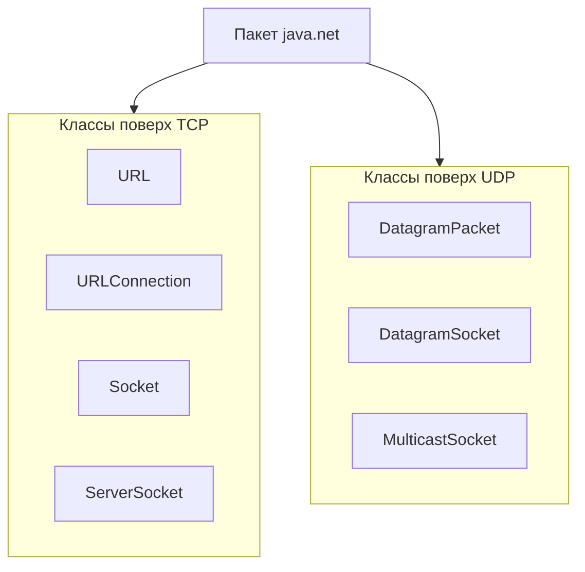

# Урок 1. Обзор сетевого взаимодействия

**Трейл:** Custom Networking · **Оригинал:** [Overview of Networking](https://docs.oracle.com/javase/tutorial/networking/overview/index.html)
**Связанные области:** [[17-rest-web]] · **Вопросы:** rest-web

> Перевод официального руководства Oracle (The Java Tutorials, JDK 8). Объединяет страницы
> *Overview of Networking*, *What You May Already Know About Networking in Java* и *Networking Basics*.

Прежде чем разбирать примеры из последующих уроков, стоит освоить некоторые основы сетевого
взаимодействия (*networking*). Кроме того, чтобы придать вам уверенности, мы включили раздел,
который напоминает, что вы, возможно, уже знаете о работе с сетью в Java, даже не подозревая об этом.

## Что вы, возможно, уже знаете о работе с сетью в Java

Слово «сеть» (*networking*) вселяет страх в сердца многих программистов. Не бойтесь! Пользоваться
сетевыми возможностями среды Java довольно просто. На самом деле вы, возможно, уже работаете с
сетью, сами того не замечая!

### Загрузка апплетов из сети

Если у вас есть доступ к браузеру с поддержкой Java, вы, без сомнения, уже запускали множество
апплетов (*applets*). Апплеты, которые вы запускали, обозначаются специальным тегом в HTML-файле —
тегом `<APPLET>`. Апплеты могут располагаться где угодно: как на вашей локальной машине, так и
где-то в Интернете. Местоположение апплета совершенно невидимо для вас, пользователя. Однако оно
закодировано внутри тега `<APPLET>`. Браузер декодирует эту информацию, находит апплет и запускает
его. Если апплет находится на какой-то другой машине, браузер должен сначала загрузить апплет,
прежде чем его можно будет запустить.

Это самый высокий уровень доступа к Интернету, который у вас есть из среды разработки Java.
Кто-то другой потратил время на написание браузера, который выполняет всю черновую работу по
подключению к сети и получению из неё данных, тем самым позволяя вам запускать апплеты откуда
угодно в мире.

**Подробнее:** урок [The "Hello World!" Application](https://docs.oracle.com/javase/tutorial/getStarted/cupojava/index.html)
показывает, как написать ваш первый апплет и запустить его. Трейл
[Java Applets](https://docs.oracle.com/javase/tutorial/deployment/applet/index.html) описывает, как
писать апплеты Java от и до.

### Загрузка изображений по URL

Если вы уже пробовали писать собственные апплеты и приложения на Java, возможно, вам встречался
класс из пакета `java.net` под названием `URL`. Этот класс представляет унифицированный указатель
ресурса (*Uniform Resource Locator*) — адрес некоторого ресурса в сети. Ваши апплеты и приложения
могут использовать `URL`, чтобы ссылаться на ресурсы в сети и даже подключаться к ним. Например,
чтобы загрузить изображение из сети, ваша Java-программа должна сначала создать `URL`, содержащий
адрес этого изображения.

Это следующий по высоте уровень взаимодействия с Интернетом: ваша Java-программа получает адрес
того, что ей нужно, создаёт для этого объект `URL`, а затем использует одну из готовых функций
среды разработки Java, которая выполняет черновую работу по подключению к сети и получению ресурса.

**Подробнее:** урок [How to Use Icons](https://docs.oracle.com/javase/tutorial/uiswing/components/icon.html)
показывает, как загрузить изображение в Java-программу (будь то апплет или приложение), когда у вас
есть его URL. Прежде чем загрузить изображение, нужно создать объект `URL` с адресом ресурса. Урок
[Working with URLs](https://docs.oracle.com/javase/tutorial/networking/urls/index.html) — следующий
в этом трейле — даёт полное описание URL, включая то, как ваши программы могут подключаться к ним,
читать из соединения и писать в него.

## Основы сетевого взаимодействия

Компьютеры, работающие в Интернете, общаются друг с другом, используя либо протокол управления
передачей (*Transmission Control Protocol*, TCP), либо протокол пользовательских датаграмм
(*User Datagram Protocol*, UDP), как показано на схеме ниже.

Когда вы пишете программы на Java, обменивающиеся данными по сети, вы программируете на прикладном
уровне (*application layer*). Как правило, вам не нужно заботиться об уровнях TCP и UDP. Вместо
этого вы можете использовать классы из пакета `java.net`. Эти классы обеспечивают системно-независимое
сетевое взаимодействие. Однако, чтобы решить, какие именно классы Java должны использовать ваши
программы, нужно понимать, чем различаются TCP и UDP.

### TCP

Когда два приложения хотят надёжно общаться друг с другом, они устанавливают соединение и пересылают
данные туда и обратно по этому соединению. Это похоже на телефонный звонок. Если вы хотите поговорить
с тётушкой Беатрис из Кентукки, соединение устанавливается, когда вы набираете её номер и она
отвечает. Вы пересылаете данные туда и обратно по соединению, разговаривая друг с другом по
телефонным линиям. Подобно телефонной компании, TCP гарантирует, что данные, отправленные с одного
конца соединения, действительно доходят до другого конца и в том же порядке, в котором были отправлены.
В противном случае сообщается об ошибке.

TCP предоставляет двухточечный канал (*point-to-point*) для приложений, которым требуется надёжная
связь. Протокол передачи гипертекста (*Hypertext Transfer Protocol*, HTTP), протокол передачи файлов
(*File Transfer Protocol*, FTP) и Telnet — всё это примеры приложений, которым нужен надёжный канал
связи. Порядок, в котором данные отправляются и принимаются по сети, критически важен для успеха
этих приложений. Когда HTTP используется для чтения из URL, данные должны приниматься в том порядке,
в котором были отправлены. Иначе вы получите искажённый HTML-файл, повреждённый zip-архив или другую
недостоверную информацию.

**Определение:** TCP (*Transmission Control Protocol*) — это протокол, основанный на соединении
(*connection-based*), который обеспечивает надёжный поток данных между двумя компьютерами.

### UDP

Протокол UDP обеспечивает связь между двумя приложениями в сети без гарантий доставки. UDP, в отличие
от TCP, не основан на соединении. Вместо этого он отправляет независимые пакеты данных, называемые
датаграммами (*datagrams*), от одного приложения к другому. Отправка датаграмм во многом похожа на
отправку письма через почтовую службу: порядок доставки не важен и не гарантируется, а каждое
сообщение независимо от любых других.

**Определение:** UDP (*User Datagram Protocol*) — это протокол, который отправляет независимые пакеты
данных, называемые датаграммами, от одного компьютера к другому без каких-либо гарантий доставки.
UDP, в отличие от TCP, не основан на соединении.

Для многих приложений гарантия надёжности критически важна для успешной передачи информации с одного
конца соединения на другой. Однако другие формы связи не требуют столь строгих стандартов. Более того,
их может замедлять дополнительная нагрузка (*overhead*), либо надёжное соединение вовсе обесценивает
саму услугу.

Рассмотрим, например, сервер времени, который по запросу отправляет клиенту текущее время. Если клиент
пропускает пакет, повторно отправлять его не имеет смысла, потому что при повторном получении время
будет уже неверным. Если клиент делает два запроса и получает пакеты от сервера в неправильном порядке,
это тоже не имеет значения, потому что клиент может понять, что пакеты пришли не по порядку, и сделать
ещё один запрос. Надёжность TCP в этом случае не нужна, поскольку она вызывает падение производительности
и может снизить полезность услуги.

Другой пример службы, которой не нужна гарантия надёжного канала, — команда `ping`. Назначение команды
`ping` — проверить связь между двумя программами по сети. По сути, `ping` должна знать о потерянных или
пришедших не по порядку пакетах, чтобы определить, насколько хороша или плоха связь. Надёжный канал
полностью обесценил бы эту службу.

**Примечание:** многие межсетевые экраны (*firewalls*) и маршрутизаторы настроены так, чтобы не
пропускать UDP-пакеты. Если у вас возникают трудности с подключением к службе за межсетевым экраном
или если клиенты не могут подключиться к вашей службе, спросите системного администратора, разрешён
ли UDP.

### Понятие порта

Вообще говоря, у компьютера есть единственное физическое подключение к сети. Все данные,
предназначенные конкретному компьютеру, поступают через это подключение. Однако данные могут
предназначаться разным приложениям, работающим на компьютере. Так как же компьютер узнаёт, какому
приложению переправить данные? С помощью портов (*ports*).

Данные, передаваемые по Интернету, сопровождаются адресной информацией, которая определяет компьютер
и порт, для которых они предназначены. Компьютер идентифицируется своим 32-битным IP-адресом, который
протокол IP использует, чтобы доставить данные нужному компьютеру в сети. Порты идентифицируются
16-битным числом, которое TCP и UDP используют, чтобы доставить данные нужному приложению.

При связи на основе соединения, такой как TCP, серверное приложение привязывает (*bind*) сокет
к определённому номеру порта. Это регистрирует сервер в системе для приёма всех данных,
предназначенных этому порту. После этого клиент может «встретиться» с сервером на его порту, как
показано ниже.

**Определение:** протоколы TCP и UDP используют порты, чтобы сопоставлять входящие данные с
конкретным процессом, работающим на компьютере.

При связи на основе датаграмм, такой как UDP, пакет-датаграмма содержит номер порта своего
назначения, и UDP направляет пакет соответствующему приложению.

Номера портов лежат в диапазоне от 0 до 65 535, поскольку порты представлены 16-битными числами.
Номера портов в диапазоне от 0 до 1023 ограничены: они зарезервированы для использования
общеизвестными службами, такими как HTTP и FTP, и другими системными службами. Эти порты называются
общеизвестными портами (*well-known ports*). Ваши приложения не должны пытаться привязываться к ним.

### Сетевые классы в JDK

Через классы пакета `java.net` программы на Java могут использовать TCP или UDP для связи по
Интернету. Классы `URL`, `URLConnection`, `Socket` и `ServerSocket` используют для связи по сети
протокол TCP. Классы `DatagramPacket`, `DatagramSocket` и `MulticastSocket` предназначены для
работы с UDP.

## Источник

- [Lesson: Overview of Networking](https://docs.oracle.com/javase/tutorial/networking/overview/index.html) — официальное руководство Oracle.
- [What You May Already Know About Networking in Java](https://docs.oracle.com/javase/tutorial/networking/overview/alreadyknow.html) — официальное руководство Oracle.
- [Networking Basics](https://docs.oracle.com/javase/tutorial/networking/overview/networking.html) — официальное руководство Oracle.
