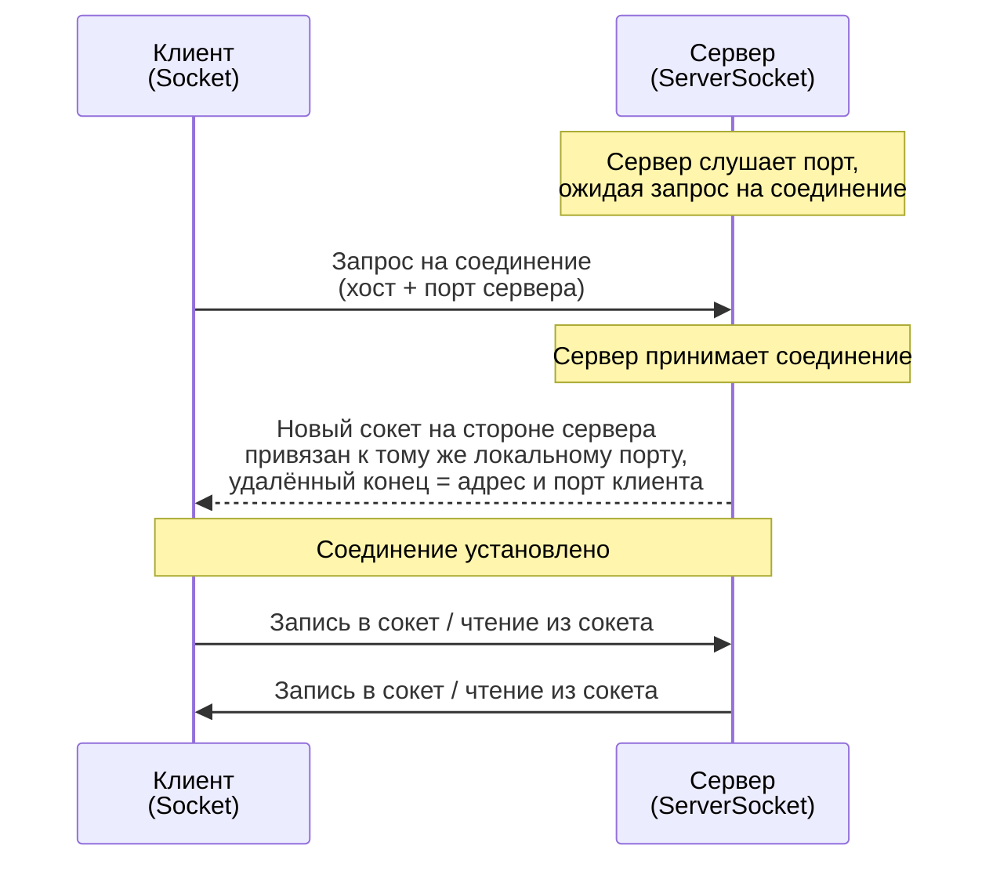

# Урок 3. Всё о сокетах

**Трейл:** Custom Networking · **Оригинал:** [All About Sockets](https://docs.oracle.com/javase/tutorial/networking/sockets/index.html)
**Связанные области:** [[17-rest-web]] · **Вопросы:** rest-web

> Перевод официального руководства Oracle (The Java Tutorials, JDK 8). Объединяет страницы
> *All About Sockets*, *What Is a Socket?*, *Reading from and Writing to a Socket* и
> *Writing the Server Side of a Socket*, а также примеры исходного кода `EchoClient`,
> `EchoServer`, `KnockKnockServer`, `KnockKnockProtocol` и `KnockKnockClient`.

> Руководство Java Tutorials написано для JDK 8. Примеры и практики, описанные на этих
> страницах, не используют улучшений, появившихся в более поздних выпусках, и могут
> опираться на технологии, более не доступные.

Классы `URL` и `URLConnection` предоставляют относительно высокоуровневый механизм доступа
к ресурсам в Интернете. Иногда программам требуется более низкоуровневое сетевое
взаимодействие — например, когда нужно написать клиент-серверное приложение
(*client-server application*).

В клиент-серверных приложениях сервер (*server*) предоставляет некоторую услугу: обрабатывает
запросы к базе данных или рассылает текущие котировки акций. Клиент (*client*) пользуется
услугой, предоставляемой сервером: либо показывает пользователю результаты запроса к базе
данных, либо даёт инвестору рекомендации по покупке акций. Обмен данными между клиентом и
сервером должен быть надёжным: данные не должны теряться и должны поступать на сторону клиента
в том же порядке, в котором их отправил сервер.

Протокол **TCP** обеспечивает надёжный, двухточечный (*point-to-point*) канал связи, который
клиент-серверные приложения в Интернете используют для общения друг с другом. Чтобы
взаимодействовать поверх TCP, клиентская и серверная программы устанавливают соединение друг
с другом. Каждая программа привязывает (*binds*) сокет (*socket*) к своему концу соединения.
Чтобы обмениваться данными, клиент и сервер читают из сокета, привязанного к соединению, и
пишут в него.

## Что такое сокет?

Обычно сервер работает на конкретном компьютере и имеет сокет, привязанный к определённому
номеру порта (*port number*). Сервер просто ждёт, слушая сокет в ожидании запроса на
соединение от клиента.

На стороне клиента: клиент знает имя хоста (*hostname*) машины, на которой работает сервер, и
номер порта, который сервер слушает. Чтобы запросить соединение, клиент пытается встретиться
с сервером на машине и порту сервера. Клиенту также нужно идентифицировать себя перед сервером,
поэтому он привязывается к локальному номеру порта, который будет использовать в течение этого
соединения. Обычно этот номер назначается системой.



Если всё проходит успешно, сервер принимает (*accepts*) соединение. После принятия сервер
получает новый сокет, привязанный к тому же локальному порту, а его удалённая конечная точка
(*remote endpoint*) устанавливается на адрес и порт клиента. Новый сокет нужен серверу для
того, чтобы он мог продолжать слушать исходный сокет в ожидании запросов на соединение, пока
обслуживает потребности подключённого клиента.

На стороне клиента, если соединение принято, сокет успешно создан, и клиент может использовать
этот сокет для общения с сервером.

Теперь клиент и сервер могут обмениваться данными, записывая в свои сокеты или читая из них.

> **Определение.** *Сокет* (*socket*) — это одна конечная точка двусторонней линии связи между
> двумя программами, работающими в сети. Сокет привязан к номеру порта, чтобы уровень TCP мог
> определить приложение, которому предназначены данные.

Конечная точка (*endpoint*) — это сочетание IP-адреса и номера порта. Каждое TCP-соединение
можно однозначно идентифицировать по двум его конечным точкам. Благодаря этому можно иметь
несколько соединений между вашим хостом и сервером.

Пакет `java.net` платформы Java предоставляет класс `Socket`, который реализует одну сторону
двустороннего соединения между вашей программой на Java и другой программой в сети. Класс
`Socket` располагается поверх платформенно-зависимой реализации, скрывая детали конкретной
системы от вашей Java-программы. Используя класс `java.net.Socket` вместо нативного кода, ваши
Java-программы могут взаимодействовать по сети платформенно-независимым образом.

Кроме того, `java.net` включает класс `ServerSocket`, который реализует сокет, используемый
серверами для прослушивания и принятия соединений от клиентов. Этот урок показывает, как
пользоваться классами `Socket` и `ServerSocket`.

Если вы пытаетесь подключиться к Веб, то класс `URL` и связанные с ним классы (`URLConnection`,
`URLEncoder`), вероятно, подойдут лучше, чем классы сокетов. На деле URL — это относительно
высокоуровневое подключение к Веб, и в своей внутренней реализации они используют сокеты.
Сведения о подключении к Веб через URL см. в разделе *Working with URLs*.

## Чтение из сокета и запись в сокет

Рассмотрим простой пример, иллюстрирующий, как программа может установить соединение с
серверной программой при помощи класса `Socket`, а затем — как клиент может отправлять данные
серверу и получать данные от него через сокет.

Программа-пример реализует клиент `EchoClient`, который подключается к эхо-серверу
(*echo server*). Эхо-сервер принимает данные от клиента и возвращает их обратно. Пример
`EchoServer` реализует эхо-сервер. (Кроме того, клиент может подключиться к любому хосту,
поддерживающему [протокол Echo](http://tools.ietf.org/html/rfc862).)

Пример `EchoClient` создаёт сокет, тем самым получая соединение с эхо-сервером. Он читает ввод
от пользователя из стандартного потока ввода, а затем пересылает этот текст эхо-серверу,
записывая его в сокет. Сервер возвращает ввод обратно через сокет клиенту. Программа-клиент
читает и отображает данные, переданные ей сервером.

Обратите внимание, что пример `EchoClient` и пишет в свой сокет, и читает из него, тем самым
отправляя данные эхо-серверу и получая данные от него.

Пройдёмся по программе и разберём её интересные части. Следующие операторы внутри инструкции
[`try`-with-resources](https://docs.oracle.com/javase/tutorial/essential/exceptions/tryResourceClose.html)
в примере `EchoClient` критически важны. Эти строки устанавливают соединение через сокет между
клиентом и сервером и открывают на сокете
[`PrintWriter`](https://docs.oracle.com/javase/8/docs/api/java/io/PrintWriter.html) и
[`BufferedReader`](https://docs.oracle.com/javase/8/docs/api/java/io/BufferedReader.html):

```java
String hostName = args[0];
int portNumber = Integer.parseInt(args[1]);

try (
    Socket echoSocket = new Socket(hostName, portNumber);        // 1-й оператор
    PrintWriter out =                                            // 2-й оператор
        new PrintWriter(echoSocket.getOutputStream(), true);
    BufferedReader in =                                          // 3-й оператор
        new BufferedReader(
            new InputStreamReader(echoSocket.getInputStream()));
    BufferedReader stdIn =                                       // 4-й оператор
        new BufferedReader(
            new InputStreamReader(System.in))
)
```

Первый оператор в инструкции `try`-with-resources создаёт новый объект
[`Socket`](https://docs.oracle.com/javase/8/docs/api/java/net/Socket.html) и называет его
`echoSocket`. Использованный здесь конструктор `Socket` требует имя компьютера и номер порта,
к которым вы хотите подключиться. Программа-пример использует первый аргумент командной строки
(*command-line argument*) как имя компьютера (имя хоста), а второй аргумент — как номер порта.
Когда вы запускаете эту программу на своём компьютере, убедитесь, что в качестве имени хоста
вы используете полностью квалифицированное IP-имя компьютера, к которому хотите подключиться.
Например, если ваш эхо-сервер работает на компьютере `echoserver.example.com` и слушает порт
номер 7, сначала выполните следующую команду с компьютера `echoserver.example.com`, если
хотите использовать пример `EchoServer` в качестве эхо-сервера:

```
java EchoServer 7
```

После этого запустите пример `EchoClient` такой командой:

```
java EchoClient echoserver.example.com 7
```

Второй оператор в инструкции `try`-with-resources получает выходной поток сокета и открывает
на нём `PrintWriter` с именем `out`. Аналогично третий оператор получает входной поток сокета и
открывает на нём `BufferedReader` с именем `in`. Пример использует читатели и писатели
(*readers and writers*), чтобы можно было записывать в сокет символы Unicode. Если вы ещё не
знакомы с классами ввода-вывода платформы Java, возможно, вам стоит прочитать раздел *Basic I/O*.

Следующая интересная часть программы — цикл `while`. Цикл читает по одной строке за раз из
стандартного потока ввода при помощи объекта `BufferedReader` с именем `stdIn`, который
создаётся в четвёртом операторе инструкции `try`-with-resources. Затем цикл сразу же отправляет
строку серверу, записывая её в `PrintWriter`, подключённый к сокету:

```java
String userInput;
while ((userInput = stdIn.readLine()) != null) {
    out.println(userInput);
    System.out.println("echo: " + in.readLine());
}
```

Последний оператор в цикле `while` читает строку информации из `BufferedReader`, подключённого
к сокету. Метод `readLine` ждёт, пока сервер не вернёт информацию обратно `EchoClient`. Когда
`readLine` возвращается, `EchoClient` печатает информацию в стандартный поток вывода.

Цикл `while` продолжается, пока пользователь не введёт символ конца ввода (*end-of-input*). То
есть пример `EchoClient` читает ввод от пользователя, отправляет его эхо-серверу, получает от
сервера ответ и отображает его, пока не достигнет конца ввода. (Символ конца ввода можно ввести,
нажав **Ctrl-C**.) Затем цикл `while` завершается, и среда выполнения Java автоматически
закрывает читатели и писатели, подключённые к сокету и к стандартному потоку ввода, а также
закрывает соединение через сокет с сервером. Среда выполнения Java закрывает эти ресурсы
автоматически, потому что они были созданы в инструкции `try`-with-resources. Среда выполнения
Java закрывает эти ресурсы в порядке, обратном тому, в котором они были созданы. (Это хорошо,
потому что потоки, подключённые к сокету, следует закрывать до закрытия самого сокета.)

Эта клиентская программа прямолинейна и проста, потому что эхо-сервер реализует простой
протокол. Клиент отправляет текст серверу, а сервер возвращает его обратно. Когда ваши
клиентские программы общаются с более сложным сервером — например, с HTTP-сервером, — ваша
клиентская программа тоже окажется сложнее. Однако основы остаются примерно такими же, как в
этой программе:

1. Открыть сокет.
2. Открыть входной и выходной потоки к сокету.
3. Читать из потока и писать в него в соответствии с протоколом сервера.
4. Закрыть потоки.
5. Закрыть сокет.

От клиента к клиенту отличается только шаг 3 — в зависимости от сервера. Остальные шаги в
значительной мере остаются неизменными.

### Исходный код: `EchoClient.java`

```java
/*
 * Copyright (c) 1995, 2013, Oracle and/or its affiliates. All rights reserved.
 * ... (полный текст лицензии BSD сохранён в оригинале) ...
 */

import java.io.*;
import java.net.*;

public class EchoClient {
    public static void main(String[] args) throws IOException {

        if (args.length != 2) {
            System.err.println(
                "Usage: java EchoClient <host name> <port number>");
            System.exit(1);
        }

        String hostName = args[0];
        int portNumber = Integer.parseInt(args[1]);

        try (
            Socket echoSocket = new Socket(hostName, portNumber);
            PrintWriter out =
                new PrintWriter(echoSocket.getOutputStream(), true);
            BufferedReader in =
                new BufferedReader(
                    new InputStreamReader(echoSocket.getInputStream()));
            BufferedReader stdIn =
                new BufferedReader(
                    new InputStreamReader(System.in))
        ) {
            String userInput;
            while ((userInput = stdIn.readLine()) != null) {
                out.println(userInput);
                System.out.println("echo: " + in.readLine());
            }
        } catch (UnknownHostException e) {
            System.err.println("Don't know about host " + hostName);
            System.exit(1);
        } catch (IOException e) {
            System.err.println("Couldn't get I/O for the connection to " +
                hostName);
            System.exit(1);
        }
    }
}
```

### Исходный код: `EchoServer.java`

```java
/*
 * Copyright (c) 2013, Oracle and/or its affiliates. All rights reserved.
 * ... (полный текст лицензии BSD сохранён в оригинале) ...
 */

import java.net.*;
import java.io.*;

public class EchoServer {
    public static void main(String[] args) throws IOException {

        if (args.length != 1) {
            System.err.println("Usage: java EchoServer <port number>");
            System.exit(1);
        }

        int portNumber = Integer.parseInt(args[0]);

        try (
            ServerSocket serverSocket =
                new ServerSocket(Integer.parseInt(args[0]));
            Socket clientSocket = serverSocket.accept();
            PrintWriter out =
                new PrintWriter(clientSocket.getOutputStream(), true);
            BufferedReader in = new BufferedReader(
                new InputStreamReader(clientSocket.getInputStream()));
        ) {
            String inputLine;
            while ((inputLine = in.readLine()) != null) {
                out.println(inputLine);
            }
        } catch (IOException e) {
            System.out.println("Exception caught when trying to listen on port "
                + portNumber + " or listening for a connection");
            System.out.println(e.getMessage());
        }
    }
}
```

## Написание серверной стороны сокета

Этот раздел показывает, как написать сервер и сопутствующий ему клиент. Сервер в паре
клиент/сервер «подаёт» шутки-загадки вида «тук-тук» (*Knock Knock jokes*). Шутки «тук-тук»
любимы детьми и обычно служат поводом для дурных каламбуров. Они звучат так:

> **Сервер:** «Тук-тук!» (*Knock knock!*)
> **Клиент:** «Кто там?» (*Who's there?*)
> **Сервер:** «Декстер.» (*Dexter.*)
> **Клиент:** «Какой Декстер?» (*Dexter who?*)
> **Сервер:** «Dexter halls with boughs of holly.» (каламбур: созвучно «*Deck the halls…*»)
> **Клиент:** «Стон…» (*Groan.*)

Пример состоит из двух независимо работающих Java-программ: программы-клиента и
программы-сервера. Программа-клиент реализована единственным классом `KnockKnockClient` и очень
похожа на пример `EchoClient` из предыдущего раздела. Программа-сервер реализована двумя
классами: `KnockKnockServer` и `KnockKnockProtocol`. `KnockKnockServer`, похожий на
`EchoServer`, содержит метод `main` серверной программы и выполняет работу по прослушиванию
порта, установлению соединений, чтению из сокета и записи в него. Класс `KnockKnockProtocol`
«подаёт» шутки. Он отслеживает текущую шутку, текущее состояние (отправлено «тук-тук»,
отправлена подсказка и т. д.) и возвращает разные текстовые фрагменты шутки в зависимости от
текущего состояния. Этот объект реализует протокол (*protocol*) — язык, на котором клиент и
сервер договорились общаться.

Следующий раздел подробно рассматривает каждый класс в клиенте и сервере, а затем показывает,
как их запустить.

### Сервер «тук-тук»

Этот раздел разбирает код, реализующий серверную программу «тук-тук» — `KnockKnockServer`.

Серверная программа начинается с создания нового объекта `ServerSocket` для прослушивания
конкретного порта. При запуске этого сервера выбирайте порт, который ещё не выделен под какую-то
другую службу. Например, эта команда запускает серверную программу `KnockKnockServer` так, что
она слушает порт 4444:

```
java KnockKnockServer 4444
```

Серверная программа создаёт объект `ServerSocket` в инструкции `try`-with-resources:

```java
int portNumber = Integer.parseInt(args[0]);

try (
    ServerSocket serverSocket = new ServerSocket(portNumber);
    Socket clientSocket = serverSocket.accept();
    PrintWriter out =
        new PrintWriter(clientSocket.getOutputStream(), true);
    BufferedReader in = new BufferedReader(
        new InputStreamReader(clientSocket.getInputStream()));
) {
```

`ServerSocket` — это класс пакета `java.net`, предоставляющий системно-независимую реализацию
серверной стороны соединения через сокет в паре клиент/сервер. Конструктор `ServerSocket`
выбрасывает исключение, если не может слушать указанный порт (например, порт уже занят). В этом
случае у `KnockKnockServer` нет иного выбора, кроме как завершиться.

Если сервер успешно привязывается к своему порту, то объект `ServerSocket` успешно создан, и
сервер переходит к следующему шагу — принятию соединения от клиента (следующий оператор в
инструкции `try`-with-resources):

```java
clientSocket = serverSocket.accept();
```

Метод `accept` ждёт, пока клиент не запустится и не запросит соединение на хосте и порту этого
сервера. (Предположим, что вы запустили серверную программу `KnockKnockServer` на компьютере с
именем `knockknockserver.example.com`.) В этом примере сервер работает на порту, заданном первым
аргументом командной строки. Когда соединение запрошено и успешно установлено, метод `accept`
возвращает новый объект `Socket`, который привязан к тому же локальному порту, а его удалённый
адрес и удалённый порт установлены на адрес и порт клиента. Сервер может общаться с клиентом
через этот новый `Socket` и продолжать слушать запросы на соединение от клиентов на исходном
`ServerSocket`. Данная конкретная версия программы не слушает дальнейшие запросы на соединение
от клиентов. Однако изменённая версия программы приведена в подразделе «Поддержка нескольких
клиентов».

После того как сервер успешно установит соединение с клиентом, он общается с клиентом при
помощи такого кода:

```java
try (
    // ...
    PrintWriter out =
        new PrintWriter(clientSocket.getOutputStream(), true);
    BufferedReader in = new BufferedReader(
        new InputStreamReader(clientSocket.getInputStream()));
) {
    String inputLine, outputLine;

    // Начинаем разговор с клиентом
    KnockKnockProtocol kkp = new KnockKnockProtocol();
    outputLine = kkp.processInput(null);
    out.println(outputLine);

    while ((inputLine = in.readLine()) != null) {
        outputLine = kkp.processInput(inputLine);
        out.println(outputLine);
        if (outputLine.equals("Bye."))
            break;
    }
```

Этот код делает следующее:

1. Получает входной и выходной потоки сокета и открывает на них читатели и писатели.
2. Начинает общение с клиентом, записывая в сокет (выделено в оригинале жирным).
3. Общается с клиентом, читая из сокета и записывая в него (цикл `while`).

Шаг 1 уже знаком. Шаг 2 заслуживает нескольких замечаний. Выделенные операторы в приведённом
выше фрагменте кода начинают разговор с клиентом. Код создаёт объект `KnockKnockProtocol` —
объект, который отслеживает текущую шутку, текущее состояние внутри шутки и т. д.

После создания `KnockKnockProtocol` код вызывает метод `processInput` объекта
`KnockKnockProtocol`, чтобы получить первое сообщение, которое сервер отправляет клиенту. В этом
примере первое, что говорит сервер, — «Knock! Knock!». Затем сервер записывает информацию в
`PrintWriter`, подключённый к сокету клиента, тем самым отправляя сообщение клиенту.

Шаг 3 закодирован в цикле `while`. Пока клиенту и серверу есть что сказать друг другу, сервер
читает из сокета и пишет в него, пересылая сообщения между клиентом и сервером.

Сервер начал разговор с «Knock! Knock!», поэтому затем сервер должен ждать, пока клиент скажет
«Who's there?». В итоге цикл `while` итерирует по чтению из входного потока. Метод `readLine`
ждёт, пока клиент не ответит, записав что-нибудь в свой выходной поток (входной поток сервера).
Когда клиент отвечает, сервер передаёт ответ клиента объекту `KnockKnockProtocol` и запрашивает
у объекта `KnockKnockProtocol` подходящий ответ. Сервер немедленно отправляет ответ клиенту
через выходной поток, подключённый к сокету, при помощи вызова `println`. Если ответ сервера,
сгенерированный объектом `KnockKnockProtocol`, равен «Bye.», это означает, что клиент больше не
хочет шуток, и цикл завершается.

Среда выполнения Java автоматически закрывает входной и выходной потоки, сокет клиента и сокет
сервера, потому что они были созданы в инструкции `try`-with-resources.

### Протокол «тук-тук»

Класс `KnockKnockProtocol` реализует протокол, который клиент и сервер используют для общения.
Этот класс отслеживает, на каком этапе разговора находятся клиент и сервер, и «подаёт» ответ
сервера на реплики клиента. Объект `KnockKnockProtocol` содержит текст всех шуток и следит за
тем, чтобы клиент давал верный ответ на реплики сервера. Не годилось бы, чтобы клиент говорил
«Dexter who?», когда сервер говорит «Knock! Knock!».

У всех пар клиент/сервер должен быть некоторый протокол, по которому они общаются между собой;
иначе данные, что ходят туда-сюда, были бы бессмысленны. Протокол, который используют ваши
собственные клиенты и серверы, целиком зависит от взаимодействия, требуемого им для выполнения
задачи.

### Клиент «тук-тук»

Класс `KnockKnockClient` реализует программу-клиент, которая общается с `KnockKnockServer`.
`KnockKnockClient` основан на программе `EchoClient` из предыдущего раздела «Чтение из сокета и
запись в сокет» и должен быть вам несколько знаком. Но мы всё равно пройдёмся по программе и
посмотрим, что происходит в клиенте в контексте того, что происходит в сервере.

Когда вы запускаете программу-клиент, сервер уже должен быть запущен и слушать порт, ожидая,
пока клиент запросит соединение. Поэтому первое, что делает программа-клиент, — открывает сокет,
подключённый к серверу, работающему на указанных имени хоста и порту:

```java
String hostName = args[0];
int portNumber = Integer.parseInt(args[1]);

try (
    Socket kkSocket = new Socket(hostName, portNumber);
    PrintWriter out = new PrintWriter(kkSocket.getOutputStream(), true);
    BufferedReader in = new BufferedReader(
        new InputStreamReader(kkSocket.getInputStream()));
)
```

При создании сокета пример `KnockKnockClient` использует имя хоста из первого аргумента
командной строки — имя компьютера в вашей сети, на котором работает серверная программа
`KnockKnockServer`.

Пример `KnockKnockClient` использует второй аргумент командной строки в качестве номера порта
при создании сокета. Это *удалённый номер порта* (*remote port number*) — номер порта на
компьютере-сервере, и это порт, который слушает `KnockKnockServer`. Например, следующая команда
запускает пример `KnockKnockClient`, где `knockknockserver.example.com` — имя компьютера, на
котором работает серверная программа `KnockKnockServer`, а 4444 — удалённый номер порта:

```
java KnockKnockClient knockknockserver.example.com 4444
```

Сокет клиента привязывается к любому доступному *локальному порту* (*local port*) — порту на
компьютере клиента. Помните, что сервер тоже получает новый сокет. Если вы запустите пример
`KnockKnockClient` с аргументами командной строки из предыдущего примера, то этот сокет
привязывается к локальному порту с номером 4444 на компьютере, с которого вы запустили
`KnockKnockClient`. Сокет сервера и сокет клиента соединены.

Далее идёт цикл `while`, реализующий взаимодействие между клиентом и сервером. Сервер говорит
первым, поэтому клиент должен сначала слушать. Клиент делает это, читая из входного потока,
подключённого к сокету. Если сервер заговаривает, он говорит «Bye.», и клиент выходит из цикла.
Иначе клиент отображает текст в стандартный поток вывода, а затем читает ответ от пользователя,
который вводит его в стандартный поток ввода. После того как пользователь нажимает Enter, клиент
отправляет текст серверу через выходной поток, подключённый к сокету.

```java
while ((fromServer = in.readLine()) != null) {
    System.out.println("Server: " + fromServer);
    if (fromServer.equals("Bye."))
        break;

    fromUser = stdIn.readLine();
    if (fromUser != null) {
        System.out.println("Client: " + fromUser);
        out.println(fromUser);
    }
}
```

Общение завершается, когда сервер спрашивает, хочет ли клиент услышать ещё одну шутку, клиент
говорит «нет», а сервер говорит «Bye.».

Клиент автоматически закрывает свои входной и выходной потоки и сокет, потому что они были
созданы в инструкции `try`-with-resources.

### Запуск программ

Сначала нужно запустить программу-сервер. Для этого запустите серверную программу с помощью
интерпретатора Java, как любое другое Java-приложение. Укажите в качестве аргумента командной
строки номер порта, который слушает серверная программа:

```
java KnockKnockServer 4444
```

Затем запустите программу-клиент. Обратите внимание, что клиент можно запустить на любом
компьютере в вашей сети; ему не обязательно работать на том же компьютере, что и сервер. Укажите
в качестве аргументов командной строки имя хоста и номер порта компьютера, на котором работает
серверная программа `KnockKnockServer`:

```
java KnockKnockClient knockknockserver.example.com 4444
```

Если вы слишком торопитесь, то можете запустить клиента раньше, чем сервер успеет
инициализироваться и начать слушать порт. Если такое произойдёт, вы увидите трассировку стека
(*stack trace*) от клиента. В этом случае просто перезапустите клиента.

Если вы попытаетесь запустить второго клиента, пока первый клиент подключён к серверу, второй
клиент просто зависнет. О поддержке нескольких клиентов рассказывает следующий подраздел —
«Поддержка нескольких клиентов».

Когда вам удастся установить соединение между клиентом и сервером, вы увидите на экране
следующий текст:

```
Server: Knock! Knock!
```

Теперь вы должны ответить:

```
Who's there?
```

Клиент отображает то, что вы напечатали, и отправляет текст серверу. Сервер отвечает первой
строкой одной из множества шуток «тук-тук» из своего репертуара. Теперь на вашем экране должно
быть это (то, что вы напечатали, выделено жирным):

```
Server: Knock! Knock!
Who's there?
Client: Who's there?
Server: Turnip
```

Теперь вы отвечаете:

```
Turnip who?
```

Снова клиент отображает то, что вы напечатали, и отправляет текст серверу. Сервер отвечает
кульминацией шутки (*punch line*). Теперь на вашем экране должно быть это:

```
Server: Knock! Knock!
Who's there?
Client: Who's there?
Server: Turnip
Turnip who?
Client: Turnip who?
Server: Turnip the heat, it's cold in here! Want another? (y/n)
```

Если хотите услышать ещё одну шутку, напечатайте **y**; если нет — напечатайте **n**. Если вы
напечатаете **y**, сервер снова начнёт с «Knock! Knock!». Если вы напечатаете **n**, сервер
скажет «Bye.», что приведёт к завершению и клиента, и сервера.

Если в какой-то момент вы сделаете опечатку, объект `KnockKnockProtocol` уловит это, и сервер
ответит сообщением, похожим на это:

```
Server: You're supposed to say "Who's there?"!
```

Затем сервер начинает шутку заново:

```
Server: Try again. Knock! Knock!
```

Обратите внимание, что объект `KnockKnockProtocol` придирчив к орфографии и пунктуации, но не к
регистру букв.

### Поддержка нескольких клиентов

Чтобы пример `KnockKnockServer` оставался простым, мы спроектировали его так, что он слушает и
обрабатывает единственный запрос на соединение. Однако несколько клиентских запросов могут
прийти на один и тот же порт и, следовательно, на один и тот же `ServerSocket`. Запросы клиентов
на соединение ставятся в очередь на порту, поэтому сервер должен принимать соединения
последовательно. Однако сервер может обслуживать их одновременно за счёт использования потоков
(*threads*) — по одному потоку на каждое клиентское соединение.

Базовая логика такого сервера такова:

```java
while (true) {
    // принять соединение;
    // создать поток для обслуживания клиента;
}
```

Поток читает из клиентского соединения и пишет в него по мере необходимости.

> **Попробуйте сами.** Измените `KnockKnockServer` так, чтобы он мог обслуживать несколько
> клиентов одновременно. Наше решение составляют два класса: `KKMultiServer` и
> `KKMultiServerThread`. `KKMultiServer` бесконечно слушает запросы клиентов на соединение на
> `ServerSocket`. Когда приходит запрос, `KKMultiServer` принимает соединение, создаёт новый
> объект `KKMultiServerThread` для его обработки, передаёт ему сокет, возвращённый из `accept`,
> и запускает поток. Затем сервер возвращается к прослушиванию запросов на соединение. Объект
> `KKMultiServerThread` общается с клиентом, читая из сокета и записывая в него. Запустите новый
> сервер «тук-тук» `KKMultiServer`, а затем запустите несколько клиентов один за другим.

### Исходный код: `KnockKnockServer.java`

```java
/*
 * Copyright (c) 1995, 2014, Oracle and/or its affiliates. All rights reserved.
 * ... (полный текст лицензии BSD сохранён в оригинале) ...
 */

import java.net.*;
import java.io.*;

public class KnockKnockServer {
    public static void main(String[] args) throws IOException {

        if (args.length != 1) {
            System.err.println("Usage: java KnockKnockServer <port number>");
            System.exit(1);
        }

        int portNumber = Integer.parseInt(args[0]);

        try (
            ServerSocket serverSocket = new ServerSocket(portNumber);
            Socket clientSocket = serverSocket.accept();
            PrintWriter out =
                new PrintWriter(clientSocket.getOutputStream(), true);
            BufferedReader in = new BufferedReader(
                new InputStreamReader(clientSocket.getInputStream()));
        ) {

            String inputLine, outputLine;

            // Начинаем разговор с клиентом
            KnockKnockProtocol kkp = new KnockKnockProtocol();
            outputLine = kkp.processInput(null);
            out.println(outputLine);

            while ((inputLine = in.readLine()) != null) {
                outputLine = kkp.processInput(inputLine);
                out.println(outputLine);
                if (outputLine.equals("Bye."))
                    break;
            }
        } catch (IOException e) {
            System.out.println("Exception caught when trying to listen on port "
                + portNumber + " or listening for a connection");
            System.out.println(e.getMessage());
        }
    }
}
```

### Исходный код: `KnockKnockProtocol.java`

```java
/*
 * Copyright (c) 1995, 2008, Oracle and/or its affiliates. All rights reserved.
 * ... (полный текст лицензии BSD сохранён в оригинале) ...
 */

import java.net.*;
import java.io.*;

public class KnockKnockProtocol {
    private static final int WAITING = 0;
    private static final int SENTKNOCKKNOCK = 1;
    private static final int SENTCLUE = 2;
    private static final int ANOTHER = 3;

    private static final int NUMJOKES = 5;

    private int state = WAITING;
    private int currentJoke = 0;

    private String[] clues = { "Turnip", "Little Old Lady", "Atch", "Who", "Who" };
    private String[] answers = { "Turnip the heat, it's cold in here!",
                                 "I didn't know you could yodel!",
                                 "Bless you!",
                                 "Is there an owl in here?",
                                 "Is there an echo in here?" };

    public String processInput(String theInput) {
        String theOutput = null;

        if (state == WAITING) {
            theOutput = "Knock! Knock!";
            state = SENTKNOCKKNOCK;
        } else if (state == SENTKNOCKKNOCK) {
            if (theInput.equalsIgnoreCase("Who's there?")) {
                theOutput = clues[currentJoke];
                state = SENTCLUE;
            } else {
                theOutput = "You're supposed to say \"Who's there?\"! " +
			    "Try again. Knock! Knock!";
            }
        } else if (state == SENTCLUE) {
            if (theInput.equalsIgnoreCase(clues[currentJoke] + " who?")) {
                theOutput = answers[currentJoke] + " Want another? (y/n)";
                state = ANOTHER;
            } else {
                theOutput = "You're supposed to say \"" +
			    clues[currentJoke] +
			    " who?\"" +
			    "! Try again. Knock! Knock!";
                state = SENTKNOCKKNOCK;
            }
        } else if (state == ANOTHER) {
            if (theInput.equalsIgnoreCase("y")) {
                theOutput = "Knock! Knock!";
                if (currentJoke == (NUMJOKES - 1))
                    currentJoke = 0;
                else
                    currentJoke++;
                state = SENTKNOCKKNOCK;
            } else {
                theOutput = "Bye.";
                state = WAITING;
            }
        }
        return theOutput;
    }
}
```

### Исходный код: `KnockKnockClient.java`

```java
/*
 * Copyright (c) 1995, 2013, Oracle and/or its affiliates. All rights reserved.
 * ... (полный текст лицензии BSD сохранён в оригинале) ...
 */

import java.io.*;
import java.net.*;

public class KnockKnockClient {
    public static void main(String[] args) throws IOException {

        if (args.length != 2) {
            System.err.println(
                "Usage: java EchoClient <host name> <port number>");
            System.exit(1);
        }

        String hostName = args[0];
        int portNumber = Integer.parseInt(args[1]);

        try (
            Socket kkSocket = new Socket(hostName, portNumber);
            PrintWriter out = new PrintWriter(kkSocket.getOutputStream(), true);
            BufferedReader in = new BufferedReader(
                new InputStreamReader(kkSocket.getInputStream()));
        ) {
            BufferedReader stdIn =
                new BufferedReader(new InputStreamReader(System.in));
            String fromServer;
            String fromUser;

            while ((fromServer = in.readLine()) != null) {
                System.out.println("Server: " + fromServer);
                if (fromServer.equals("Bye."))
                    break;

                fromUser = stdIn.readLine();
                if (fromUser != null) {
                    System.out.println("Client: " + fromUser);
                    out.println(fromUser);
                }
            }
        } catch (UnknownHostException e) {
            System.err.println("Don't know about host " + hostName);
            System.exit(1);
        } catch (IOException e) {
            System.err.println("Couldn't get I/O for the connection to " +
                hostName);
            System.exit(1);
        }
    }
}
```

## Источник

- [Lesson: All About Sockets](https://docs.oracle.com/javase/tutorial/networking/sockets/index.html) — официальное руководство Oracle (The Java Tutorials, JDK 8).
- [What Is a Socket?](https://docs.oracle.com/javase/tutorial/networking/sockets/definition.html) — официальное руководство Oracle.
- [Reading from and Writing to a Socket](https://docs.oracle.com/javase/tutorial/networking/sockets/readingWriting.html) — официальное руководство Oracle.
- [Writing the Server Side of a Socket](https://docs.oracle.com/javase/tutorial/networking/sockets/clientServer.html) — официальное руководство Oracle.
- [EchoClient.java](https://docs.oracle.com/javase/tutorial/networking/sockets/examples/EchoClient.java) — пример исходного кода Oracle.
- [EchoServer.java](https://docs.oracle.com/javase/tutorial/networking/sockets/examples/EchoServer.java) — пример исходного кода Oracle.
- [KnockKnockServer.java](https://docs.oracle.com/javase/tutorial/networking/sockets/examples/KnockKnockServer.java) — пример исходного кода Oracle.
- [KnockKnockProtocol.java](https://docs.oracle.com/javase/tutorial/networking/sockets/examples/KnockKnockProtocol.java) — пример исходного кода Oracle.
- [KnockKnockClient.java](https://docs.oracle.com/javase/tutorial/networking/sockets/examples/KnockKnockClient.java) — пример исходного кода Oracle.
</content>
</invoke>
