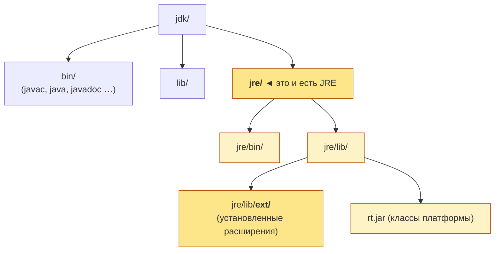
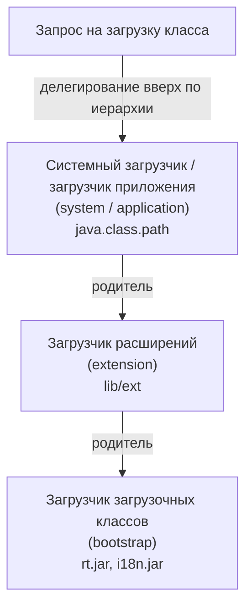

# Урок 1. Создание и использование расширений

**Трейл:** The Extension Mechanism · **Оригинал:** [Creating and Using Extensions](https://docs.oracle.com/javase/tutorial/ext/basics/index.html)
**Связанные области:** [[18-build-tools]] · **Вопросы:** build-tools

> Перевод официального руководства Oracle (The Java Tutorials, JDK 8). Объединяет страницы
> *Creating and Using Extensions*, *Installed Extensions*, *Download Extensions*,
> *Understanding Extension Class Loading* и *Creating Extensible Applications*.

> **Важное примечание.** Руководство написано для **JDK 8**. Механизм расширений (the extension
> mechanism), описанный в этом уроке (каталог `lib/ext`, установленные и загружаемые расширения,
> свойство `java.ext.dirs`), объявлен **устаревшим** в JDK 8 и **удалён** в **JDK 9** и более
> поздних версиях. Его заменила **система модулей** (*Java Platform Module System*, JPMS),
> появившаяся в Java 9. Класс `java.util.ServiceLoader` и механизм поставщиков услуг
> (*service providers*), описанные в разделе «Создание расширяемых приложений», по-прежнему
> поддерживаются и используются (теперь они интегрированы с модульной системой через директивы
> `provides`/`uses` в `module-info.java`). Материал ниже соответствует исходным страницам Oracle
> и сохранён как историческая и справочная документация по JDK 8.

Любой набор пакетов или классов легко превратить в расширение (*extension*). Первый шаг — собрать
их в JAR-файл. После этого программу можно сделать расширением двумя способами:

- разместив JAR-файл в особом месте структуры каталогов среды выполнения Java (Java Runtime
  Environment); в этом случае оно называется **установленным расширением** (*installed extension*);
- сослав́шись на JAR-файл определённым образом из манифеста другого JAR-файла; в этом случае оно
  называется **загружаемым расширением** (*download extension*).

В этом уроке принцип работы механизма расширений показан на примере простого «игрушечного»
расширения.

## Установленные расширения (Installed Extensions)

Установленные расширения — это JAR-файлы в каталоге `lib/ext` программного обеспечения среды
выполнения Java (Java Runtime Environment, JRE™). Как следует из названия, JRE — это та часть
комплекта разработки Java (Java Development Kit, JDK), которая отвечает за выполнение программ:
она содержит основной API платформы (*core API*), но не содержит инструментов разработки —
компиляторов и отладчиков. JRE доступна как сама по себе, так и в составе JDK.

JRE — это строгое подмножество ПО JDK. Подмножество дерева каталогов JDK выглядит так:



JRE состоит из каталогов, выделенных в схеме рамкой. Независимо от того, является ли ваша JRE
самостоятельной или входит в состав JDK, любой JAR-файл в каталоге `lib/ext` каталога JRE
автоматически рассматривается средой выполнения как расширение.

Поскольку установленные расширения дополняют основной API платформы, используйте их обдуманно.
Они редко уместны для интерфейсов, которыми пользуется одно приложение или небольшой набор
приложений.

Кроме того, поскольку имена (символы), определённые установленными расширениями, будут видны во
всех Java-процессах, следует позаботиться о том, чтобы все видимые имена соответствовали принятым
соглашениям об «обратном доменном имени» (*reverse domain name*) и «иерархии классов»
(*class hierarchy*). Например: `com.mycompany.MyClass`.

Начиная с Java 6, JAR-файлы расширений можно также помещать в место, не зависящее от конкретной
JRE, так что расширения могут совместно использоваться всеми JRE, установленными в системе. До
Java 6 значение свойства `java.ext.dirs` указывало на единственный каталог, но начиная с Java 6
это список каталогов (подобно `CLASSPATH`), задающий места поиска расширений. Первый элемент
этого пути — всегда каталог `lib/ext` той JRE, что выполняет программу. Второй элемент — каталог
вне JRE. Это второе место позволяет установить JAR-файлы расширений однократно и использовать их
несколькими JRE, установленными в системе. Расположение зависит от операционной системы:

- Операционная система Solaris™: `/usr/jdk/packages/lib/ext`
- Linux: `/usr/java/packages/lib/ext`
- Microsoft Windows: `%SystemRoot%\Sun\Java\lib\ext`

Обратите внимание: установленное расширение, помещённое в один из приведённых выше каталогов,
дополняет платформу **каждой** из JRE (Java 6 или новее) в этой системе.

### Простой пример

Создадим простое установленное расширение. Наше расширение состоит из одного класса
`RectangleArea`, который вычисляет площади прямоугольников:

```java
public final class RectangleArea {
    public static int area(java.awt.Rectangle r) {
        return r.width * r.height;
    }
}
```

У этого класса один метод `area`, который принимает экземпляр `java.awt.Rectangle` и возвращает
площадь прямоугольника.

Предположим, вы хотите протестировать `RectangleArea` приложением `AreaApp`:

```java
import java.awt.*;

public class AreaApp {
    public static void main(String[] args) {
        int width = 10;
        int height = 5;

        Rectangle r = new Rectangle(width, height);
        System.out.println("The rectangle's area is "
                           + RectangleArea.area(r));
    }
}
```

Это приложение создаёт прямоугольник 10 × 5 и затем выводит его площадь с помощью метода
`RectangleArea.area`.

### Запуск AreaApp без механизма расширений

Сначала вспомним, как вы запускали бы приложение `AreaApp` без использования механизма расширений.
Будем считать, что класс `RectangleArea` собран в JAR-файл с именем `area.jar`.

Класс `RectangleArea`, разумеется, не входит в платформу Java, поэтому вам пришлось бы поместить
файл `area.jar` в путь к классам (*class path*), чтобы запустить `AreaApp` без исключения времени
выполнения. Если бы `area.jar` находился в каталоге `/home/user`, вы могли бы воспользоваться такой
командой:

```bash
java -classpath .:/home/user/area.jar AreaApp
```

Путь к классам, заданный в этой команде, содержит и текущий каталог (с `AreaApp.class`), и путь к
JAR-файлу с пакетом `RectangleArea`. Выполнив эту команду, вы получите нужный вывод:

```
The rectangle's area is 50
```

### Запуск AreaApp с использованием механизма расширений

Теперь посмотрим, как запустить `AreaApp`, используя класс `RectangleArea` как расширение.

Чтобы сделать класс `RectangleArea` расширением, поместите файл `area.jar` в каталог `lib/ext`
вашей JRE. После этого `RectangleArea` автоматически получает статус установленного расширения.

Когда `area.jar` установлен как расширение, вы можете запустить `AreaApp`, не указывая путь к
классам:

```bash
java AreaApp
```

Поскольку вы используете `area.jar` как установленное расширение, среда выполнения сможет найти и
загрузить класс `RectangleArea`, даже если вы не указали его в пути к классам. Аналогично любой
апплет или приложение, запускаемые любым пользователем в вашей системе, смогут найти и
использовать класс `RectangleArea`.

Если в системе установлено несколько JRE (Java 6 или новее) и вы хотите, чтобы класс
`RectangleArea` был доступен как расширение всем им, то вместо установки в каталог `lib/ext`
конкретной JRE установите его в общесистемное место. Например, в системе под управлением Linux
установите `area.jar` в каталог `/usr/java/packages/lib/ext`. Тогда `AreaApp` сможет работать с
разными JRE, установленными в системе, — например, если разные браузеры настроены на использование
разных JRE.

## Загружаемые расширения (Download Extensions)

Загружаемые расширения — это наборы классов (и связанных с ними ресурсов) в JAR-файлах. Манифест
JAR-файла может содержать заголовки, ссылающиеся на одно или несколько загружаемых расширений.
Сослаться на расширения можно одним из двух способов:

- заголовком `Class-Path`;
- заголовком `Extension-List`.

Обратите внимание: в манифесте допускается не более одного заголовка каждого вида. Загружаемые
расширения, указанные заголовком `Class-Path`, загружаются только на время работы приложения,
которое их загружает (например, веб-браузера). Их преимущество в том, что на клиент ничего не
устанавливается; недостаток — они загружаются каждый раз, когда нужны. Загружаемые расширения,
скачиваемые с помощью заголовка `Extension-List`, устанавливаются в каталог `/lib/ext` той JRE,
которая их загрузила. Их преимущество в том, что они скачиваются лишь при первой необходимости, а
затем используются без повторной загрузки. Но, как показано далее в этом уроке, их сложнее
развёртывать.

Поскольку загружаемые расширения, использующие заголовок `Class-Path`, проще, рассмотрим сначала
их. Предположим, например, что `a.jar` и `b.jar` — два JAR-файла в одном каталоге, и что манифест
`a.jar` содержит такой заголовок:

```
Class-Path: b.jar
```

Тогда классы из `b.jar` служат классами-расширениями для классов из `a.jar`. Классы из `a.jar`
могут вызывать классы из `b.jar`, при этом классы `b.jar` не обязаны быть указаны в пути к классам.
Сам `a.jar` может как быть расширением, так и не быть им. Если бы `b.jar` находился не в том же
каталоге, что и `a.jar`, то значением заголовка `Class-Path` следовало бы задать относительный путь
к `b.jar`.

В классах, играющих роль загружаемого расширения, нет ничего особенного. Они считаются
расширениями только потому, что на них ссылается манифест некоторого другого JAR-файла.

Чтобы лучше понять, как работают загружаемые расширения, создадим одно из них и применим на
практике.

### Пример

Предположим, вы хотите создать апплет, использующий класс `RectangleArea` из предыдущего раздела:

```java
public final class RectangleArea {
    public static int area(java.awt.Rectangle r) {
        return r.width * r.height;
    }
}
```

В предыдущем разделе вы сделали класс `RectangleArea` установленным расширением, поместив
содержащий его JAR-файл в каталог `lib/ext` JRE. Сделав его установленным расширением, вы позволили
любому приложению использовать класс `RectangleArea`, как если бы он был частью платформы Java.

Если же вы хотите использовать класс `RectangleArea` из апплета, ситуация немного иная. Предположим,
например, что у вас есть апплет `AreaApplet`, использующий класс `RectangleArea`:

```java
import java.applet.Applet;
import java.awt.*;

public class AreaApplet extends Applet {
    Rectangle r;

    public void init() {
        int width = 10;
        int height = 5;

        r = new Rectangle(width, height);
    }

    public void paint(Graphics g) {
        g.drawString("The rectangle's area is "
                      + RectangleArea.area(r), 10, 10);
    }
}
```

Этот апплет создаёт прямоугольник 10 × 5 и затем отображает его площадь с помощью метода
`RectangleArea.area`.

Однако нельзя рассчитывать, что у всех, кто скачает и будет использовать ваш апплет, класс
`RectangleArea` окажется доступен в их системе — как установленное расширение или иным образом.
Один из способов обойти эту проблему — сделать класс `RectangleArea` доступным со стороны сервера,
а сделать это можно, используя его как загружаемое расширение.

Чтобы понять, как это делается, предположим, что вы собрали `AreaApplet` в JAR-файл с именем
`AreaApplet.jar`, а класс `RectangleArea` собран в `RectangleArea.jar`. Чтобы `RectangleArea.jar`
рассматривался как загружаемое расширение, он должен быть указан в заголовке `Class-Path` манифеста
файла `AreaApplet.jar`. Например, манифест `AreaApplet.jar` мог бы выглядеть так:

```
Manifest-Version: 1.0
Class-Path: RectangleArea.jar
```

Значение заголовка `Class-Path` в этом манифесте — `RectangleArea.jar` без указания пути, что
говорит о том, что `RectangleArea.jar` расположен в том же каталоге, что и JAR-файл апплета.

### Подробнее о заголовке Class-Path

Если апплет или приложение использует более одного расширения, в манифесте можно перечислить
несколько URL. Например, следующий заголовок допустим:

```
Class-Path: area.jar servlet.jar images/
```

В заголовке `Class-Path` все перечисленные URL, которые не заканчиваются символом `/`, считаются
JAR-файлами. URL, заканчивающиеся на `/`, обозначают каталоги. В приведённом примере `images/`
может быть каталогом, содержащим ресурсы, нужные апплету или приложению.

Обратите внимание: в файле манифеста допускается только один заголовок `Class-Path`, и каждая
строка манифеста не должна быть длиннее 72 символов. Если вам нужно указать больше элементов пути,
чем умещается в одной строке, их можно продолжить на последующих строках продолжения. Начинайте
каждую строку продолжения с двух пробелов. Например:

```
Class-Path: area.jar servlet.jar monitor.jar datasource.jar
  provider.jar gui.jar
```

В будущем выпуске ограничение «только один экземпляр каждого заголовка» и ограничение строк 72
символами могут быть сняты.

Загружаемые расширения можно выстраивать «цепочкой» (*daisy chained*): манифест одного загружаемого
расширения может содержать заголовок `Class-Path`, ссылающийся на второе расширение, которое может
ссылаться на третье, и так далее.

### Установка загружаемых расширений

В примере выше расширение, загруженное апплетом, доступно только пока работает браузер, загрузивший
апплет. Однако апплеты могут инициировать установку расширений, если в манифесты как апплета, так и
расширения включена дополнительная информация.

Поскольку этот механизм дополняет основной API платформы, применять его следует обдуманно. Он редко
уместен для интерфейсов, используемых одним или небольшим набором приложений. Все видимые имена
должны следовать соглашениям об обратном доменном имени и иерархии классов.

Основные требования: и апплет, и используемые им расширения должны предоставлять в своих манифестах
сведения о версии и должны быть подписаны (*signed*). Сведения о версии позволяют Java Plug-in
убедиться, что код расширения имеет версию, ожидаемую апплетом. Например, `AreaApplet` мог бы
указать в своём манифесте расширение `areatest`:

```
Manifest-Version: 1.0
Extension-List: areatest
areatest-Extension-Name: area
areatest-Specification-Version: 1.1
areatest-Implementation-Version: 1.1.2
areatest-Implementation-Vendor-Id: com.example
areatest-Implementation-URL: http://www.example.com/test/area.jar
```

Манифест в `area.jar` предоставлял бы соответствующие сведения:

```
Manifest-Version: 1.0
Extension-Name: area
Specification-Vendor: Example Tech, Inc
Specification-Version: 1.1
Implementation-Vendor-Id: com.example
Implementation-Vendor: Example Tech, Inc
Implementation-Version: 1.1.2
```

И апплет, и расширение должны быть подписаны одним и тем же подписывающим. Подписывание JAR-файлов
изменяет их «на месте», добавляя больше информации в их файлы манифеста. Подписывание помогает
гарантировать, что устанавливается только доверенный код. Простой способ подписать JAR-файлы —
сначала создать хранилище ключей (*keystore*), а затем использовать его для хранения сертификатов
апплета и расширения. Например:

```bash
keytool -genkey -dname "cn=Fred" -alias test  -validity 180
```

У вас спросят пароли хранилища ключей и ключа. После генерации ключа JAR-файлы можно подписать:

```bash
jarsigner AreaApplet.jar test
jarsigner area.jar test
```

У вас спросят пароли хранилища ключей и ключа. Подробнее об инструментах `keytool`, `jarsigner` и
других инструментах безопасности — в [Summary of Tools for the Java 2 Platform Security](https://docs.oracle.com/javase/8/docs/technotes/guides/security/SecurityToolsSummary.html).

Ниже приведён `AreaDemo.html`, который загружает апплет и приводит к загрузке и установке кода
расширения:

```html
<html>
<body>
  <applet code="AreaApplet.class" archive="AreaApplet.jar"/>
</body>
</html>
```

При первой загрузке страницы пользователю сообщается, что апплет требует установки расширения.
Следующее диалоговое окно информирует пользователя о подписанном апплете. Согласие в обоих окнах
устанавливает расширение в папку `lib/ext` JRE и запускает апплет.

После перезапуска веб-браузера и повторной загрузки той же страницы предъявляется только диалоговое
окно о подписавшем апплет, потому что `area.jar` уже установлен. Это же справедливо, если
`AreaDemo.html` открыть в другом веб-браузере (при условии, что оба браузера используют одну и ту
же JRE).

## Понимание загрузки классов расширений (Understanding Extension Class Loading)

Каркас расширений использует механизм делегирования при загрузке классов (*class-loading delegation
mechanism*). Когда среде выполнения нужно загрузить новый класс для приложения, она ищет класс в
следующих местах, в указанном порядке:

1. **Загрузочные классы** (*bootstrap classes*): классы среды выполнения в `rt.jar`, классы
   интернационализации в `i18n.jar` и другие.
2. **Установленные расширения** (*installed extensions*): классы в JAR-файлах в каталоге `lib/ext`
   JRE и в общесистемном, платформозависимом каталоге расширений (таком как
   `/usr/jdk/packages/lib/ext` в операционной системе Solaris™; обратите внимание, что
   использование этого каталога относится только к Java™ 6 и более поздним версиям).
3. **Путь к классам** (*class path*): классы, в том числе классы в JAR-файлах, на путях, заданных
   системным свойством `java.class.path`. Если JAR-файл из пути к классам имеет манифест с
   атрибутом `Class-Path`, JAR-файлы, указанные в атрибуте `Class-Path`, тоже будут просмотрены.
   По умолчанию значение свойства `java.class.path` равно `.` — текущему каталогу. Изменить
   значение можно параметрами командной строки `-classpath` или `-cp` либо установив переменную
   окружения `CLASSPATH`. Параметры командной строки переопределяют значение переменной окружения
   `CLASSPATH`.

Список приоритетов говорит, например, о том, что путь к классам просматривается только тогда, когда
загружаемый класс не был найден ни среди классов в `rt.jar`, `i18n.jar`, ни среди установленных
расширений.

Если ваше ПО не создаёт собственных загрузчиков классов для особых целей, вам, по сути, не нужно
знать больше, чем держать в уме этот список приоритетов. В частности, вам следует помнить о
возможных конфликтах имён классов. Например, если вы указываете класс в пути к классам, вы получите
неожиданный результат, если среда выполнения вместо него загрузит другой класс с тем же именем,
найденный в установленном расширении.

### Механизм загрузки классов в Java

Платформа Java использует модель делегирования (*delegation model*) для загрузки классов. Основная
идея в том, что у каждого загрузчика классов есть «родительский» загрузчик. При загрузке класса
загрузчик сначала «делегирует» поиск класса своему родительскому загрузчику, прежде чем пытаться
найти класс самостоятельно.

Вот некоторые ключевые моменты API загрузки классов:

- Конструкторы в `java.lang.ClassLoader` и его подклассах позволяют указать родителя при создании
  нового загрузчика классов. Если вы явно не указываете родителя, в качестве родителя по умолчанию
  назначается системный загрузчик классов (*system class loader*) виртуальной машины.
- Метод `loadClass` в `ClassLoader` при вызове для загрузки класса выполняет следующие действия в
  таком порядке:
  1. Если класс уже загружен, метод возвращает его.
  2. Иначе он делегирует поиск нового класса родительскому загрузчику классов.
  3. Если родительский загрузчик класс не находит, `loadClass` вызывает метод `findClass` для
     поиска и загрузки класса.
- Метод `findClass` класса `ClassLoader` ищет класс в текущем загрузчике классов, если класс не был
  найден родительским загрузчиком. Вероятно, вы захотите переопределить этот метод, когда создаёте
  подкласс загрузчика классов в своём приложении.
- Класс `java.net.URLClassLoader` служит базовым загрузчиком классов для расширений и других
  JAR-файлов, переопределяя метод `findClass` класса `java.lang.ClassLoader` для поиска классов и
  ресурсов в одном или нескольких заданных URL.

Чтобы увидеть пример приложения, использующего часть этого API в применении к JAR-файлам, см. урок
[Using JAR-related APIs](https://docs.oracle.com/javase/tutorial/deployment/jar/apiindex.html)
в этом руководстве.



### Загрузка классов и команда java

Механизм загрузки классов платформы Java отражён в команде `java`.

- В инструменте `java` параметр `-classpath` — это сокращённый способ задать свойство
  `java.class.path`.
- Параметры `-cp` и `-classpath` эквивалентны.
- Параметр `-jar` запускает приложения, упакованные в JAR-файлы. Описание и примеры этого параметра
  см. в уроке [Running JAR-Packaged Software](https://docs.oracle.com/javase/tutorial/deployment/jar/run.html)
  в этом руководстве.

## Создание расширяемых приложений (Creating Extensible Applications)

> Этот раздел описывает механизм поставщиков услуг на базе класса `java.util.ServiceLoader`.
> В отличие от каталога `lib/ext`, этот механизм **не устарел**: он по-прежнему используется и в
> современных версиях Java (в JDK 9+ интегрирован с системой модулей через директивы
> `provides … with …` и `uses …` в файле `module-info.java`).

**Расширяемое** (*extensible*) приложение — это приложение, которое можно расширять, не изменяя его
исходную кодовую базу. Вы можете дополнять его функциональность новыми плагинами (*plug-ins*) или
модулями. Разработчики, поставщики ПО и заказчики могут добавлять новую функциональность или
программные интерфейсы (API), добавляя новый JAR-файл (Java Archive) в путь к классам приложения
или в его специальный каталог расширений.

Этот раздел описывает, как создавать приложения с расширяемыми услугами (*services*), которые
позволяют вам или другим предоставлять реализации услуг без изменения исходного приложения.
Проектируя расширяемое приложение, вы даёте возможность обновлять или улучшать отдельные части
продукта, не изменяя ядро приложения.

Один из примеров расширяемого приложения — текстовый процессор, позволяющий конечному пользователю
добавить новый словарь или средство проверки орфографии. В этом примере текстовый процессор
предоставляет функцию словаря или проверки орфографии, которую другие разработчики или даже
заказчики могут расширять, предоставляя собственную реализацию.

### Ключевые термины и определения

**Услуга (Service)**

Набор программных интерфейсов и классов, предоставляющих доступ к некоторой конкретной
функциональности или возможности приложения. Услуга может определять интерфейсы для
функциональности и способ получить реализацию. В примере с текстовым процессором услуга словаря
может определять способ получить словарь и определение слова, но не реализует сам набор функций.
Вместо этого она полагается на **поставщика услуги** (*service provider*), который реализует эту
функциональность.

**Интерфейс поставщика услуги (Service provider interface, SPI)**

Набор открытых интерфейсов и абстрактных классов, которые определяет услуга. SPI задаёт классы и
методы, доступные вашему приложению.

**Поставщик услуги (Service Provider)**

Реализует SPI. Приложение с расширяемыми услугами позволяет вам, поставщикам и заказчикам добавлять
поставщиков услуг без изменения исходного приложения.

### Пример: служба словаря (Dictionary Service)

Рассмотрим, как можно спроектировать службу словаря в текстовом процессоре или редакторе. Один из
способов — определить услугу, представленную классом с именем `DictionaryService`, и интерфейс
поставщика услуги с именем `Dictionary`. `DictionaryService` предоставляет одиночный
(*singleton*) объект `DictionaryService`. (Подробнее см. раздел
[Шаблон проектирования «Одиночка»](#шаблон-проектирования-одиночка-singleton).) Этот объект получает
определения слов от поставщиков `Dictionary`. Клиенты службы словаря — код вашего приложения —
получают экземпляр этой службы, а служба ищет, создаёт и использует поставщиков услуги `Dictionary`.

Хотя разработчик текстового процессора, скорее всего, поставил бы вместе с исходным продуктом
базовый общий словарь, заказчику может потребоваться специализированный словарь — например,
содержащий юридические или технические термины. В идеале заказчик может создать или приобрести
новые словари и добавить их в существующее приложение.

Образец `DictionaryServiceDemo` показывает, как реализовать службу `Dictionary`, создать
поставщиков услуги `Dictionary`, добавляющих дополнительные словари, и создать простой клиент службы
`Dictionary`, который её тестирует. Этот образец, упакованный в zip-файл `DictionaryServiceDemo.zip`,
состоит из следующих файлов:

```
DictionaryServiceDemo/
├── build.xml
├── DictionaryDemo/
│   ├── build.xml
│   ├── build/
│   ├── dist/
│   │   └── DictionaryDemo.jar
│   └── src/
│       └── dictionary/
│           └── DictionaryDemo.java
├── DictionaryServiceProvider/
│   ├── build.xml
│   ├── build/
│   ├── dist/
│   │   └── DictionaryServiceProvider.jar
│   └── src/
│       └── dictionary/
│           ├── DictionaryService.java
│           └── spi/
│               └── Dictionary.java
├── ExtendedDictionary/
│   ├── build.xml
│   ├── build/
│   ├── dist/
│   │   └── ExtendedDictionary.jar
│   └── src/
│       ├── dictionary/
│       │   └── ExtendedDictionary.java
│       └── META-INF/
│           └── services/
│               └── dictionary.spi.Dictionary
└── GeneralDictionary/
    ├── build.xml
    ├── build/
    ├── dist/
    │   └── GeneralDictionary.jar
    └── src/
        ├── dictionary/
        │   └── GeneralDictionary.java
        └── META-INF/
            └── services/
                └── dictionary.spi.Dictionary
```

**Примечание.** Каталоги `build` содержат скомпилированные файлы классов исходных Java-файлов,
находящихся в каталоге `src` того же уровня.

### Запуск образца DictionaryServiceDemo

Поскольку zip-файл `DictionaryServiceDemo.zip` содержит скомпилированные файлы классов, вы можете
распаковать его на свой компьютер и запустить образец без компиляции, выполнив следующие шаги:

1. Скачайте и распакуйте код образца: скачайте и распакуйте файл `DictionaryServiceDemo.zip` на свой
   компьютер. Эти шаги предполагают, что вы распаковали содержимое этого файла в каталог
   `C:\DictionaryServiceDemo`.
2. Смените текущий каталог на `C:\DictionaryServiceDemo\DictionaryDemo` и выполните шаг
   [Запуск клиента](#7-запуск-клиента-run-the-client).

### Компиляция и запуск образца DictionaryServiceDemo

Образец `DictionaryServiceDemo` включает файлы сборки Apache Ant, все с именем `build.xml`.
Следующие шаги показывают, как с помощью Apache Ant скомпилировать, собрать и запустить образец
`DictionaryServiceDemo`:

**Шаг 1. Установите Apache Ant.** Перейдите по следующей ссылке, чтобы скачать и установить Apache
Ant:

```
http://ant.apache.org/
```

Убедитесь, что каталог с исполняемым файлом Apache Ant находится в переменной окружения `PATH`,
чтобы запускать его из любого каталога. Кроме того, убедитесь, что каталог `bin` вашего JDK,
содержащий исполняемые файлы `java` и `javac` (`java.exe` и `javac.exe` в Microsoft Windows),
находится в переменной окружения `PATH`. Сведения о настройке переменной `PATH` см. в
[PATH and CLASSPATH](https://docs.oracle.com/javase/tutorial/essential/environment/paths.html).

**Шаг 2. Скачайте и распакуйте код образца.** Скачайте и распакуйте файл `DictionaryServiceDemo.zip`
на свой компьютер. Эти шаги предполагают, что вы распаковали содержимое в каталог
`C:\DictionaryServiceDemo`.

**Шаг 3. Скомпилируйте код.** Смените текущий каталог на `C:\DictionaryServiceDemo` и выполните
следующую команду:

```bash
ant compile-all
```

Эта команда компилирует исходный код в каталогах `src`, находящихся в каталогах `DictionaryDemo`,
`DictionaryServiceProvider`, `ExtendedDictionary` и `GeneralDictionary`, и помещает сгенерированные
файлы `class` в соответствующие каталоги `build`.

**Шаг 4. Упакуйте скомпилированные Java-файлы в JAR-файлы.** Убедитесь, что текущий каталог —
`C:\DictionaryServiceDemo`, и выполните следующую команду:

```bash
ant jar
```

Эта команда создаёт следующие JAR-файлы:

- `DictionaryDemo/dist/DictionaryDemo.jar`
- `DictionaryServiceProvider/dist/DictionaryServiceProvider.jar`
- `GeneralDictionary/dist/GeneralDictionary.jar`
- `ExtendedDictionary/dist/ExtendedDictionary.jar`

**Шаг 5. Запустите образец.** Убедитесь, что каталог с исполняемым файлом `java` находится в
переменной окружения `PATH`. Подробнее см.
[PATH and CLASSPATH](https://docs.oracle.com/javase/tutorial/essential/environment/paths.html).
Смените текущий каталог на `C:\DictionaryServiceDemo\DictionaryDemo` и выполните следующую команду:

```bash
ant run
```

Образец выводит следующее:

```
book: a set of written or printed pages, usually bound with a protective cover
editor: a person who edits
xml: a document standard often used in web services, among other things
REST: an architecture style for creating, reading, updating, and deleting data that attempts to use the common vocabulary of the HTTP protocol; Representational State Transfer
```

### Как устроен образец DictionaryServiceDemo

Следующие шаги показывают, как воссоздать содержимое файла `DictionaryServiceDemo.zip`. Они
объясняют, как устроен образец и как его запустить.

#### 1. Определение интерфейса поставщика услуги (SPI)

Образец `DictionaryServiceDemo` определяет один SPI — интерфейс `Dictionary.java`. Он содержит
лишь один метод:

```java
package dictionary.spi;

public interface Dictionary {
    public String getDefinition(String word);
}
```

Образец хранит скомпилированный файл класса в каталоге `DictionaryServiceProvider/build`.

#### 2. Определение услуги, получающей реализации поставщиков

Класс `DictionaryService.java` загружает и обращается к доступным поставщикам услуги `Dictionary`
от имени клиентов службы словаря:

```java
package dictionary;

import dictionary.spi.Dictionary;
import java.util.Iterator;
import java.util.ServiceConfigurationError;
import java.util.ServiceLoader;

public class DictionaryService {

    private static DictionaryService service;
    private ServiceLoader<Dictionary> loader;

    private DictionaryService() {
        loader = ServiceLoader.load(Dictionary.class);
    }

    public static synchronized DictionaryService getInstance() {
        if (service == null) {
            service = new DictionaryService();
        }
        return service;
    }


    public String getDefinition(String word) {
        String definition = null;

        try {
            Iterator<Dictionary> dictionaries = loader.iterator();
            while (definition == null && dictionaries.hasNext()) {
                Dictionary d = dictionaries.next();
                definition = d.getDefinition(word);
            }
        } catch (ServiceConfigurationError serviceError) {
            definition = null;
            serviceError.printStackTrace();

        }
        return definition;
    }
}
```

Образец хранит скомпилированный файл класса в каталоге `DictionaryServiceProvider/build`.

Класс `DictionaryService` реализует шаблон проектирования «одиночка» (*singleton*). Это значит, что
создаётся только один-единственный экземпляр класса `DictionaryService`. Подробнее см. раздел
[Шаблон проектирования «Одиночка»](#шаблон-проектирования-одиночка-singleton).

Класс `DictionaryService` — это точка входа клиента службы словаря к использованию любого
установленного поставщика услуги `Dictionary`. Используйте метод
[`ServiceLoader.load`](https://docs.oracle.com/javase/8/docs/api/java/util/ServiceLoader.html#load-java.lang.Class-),
чтобы получить закрытый статический член `DictionaryService.service` — одиночную точку входа службы.
Затем приложение может вызвать метод `getDefinition`, который перебирает доступных поставщиков
`Dictionary`, пока не найдёт искомое слово. Метод `getDefinition` возвращает `null`, если ни один
экземпляр `Dictionary` не содержит указанного определения слова.

Служба словаря использует метод `ServiceLoader.load`, чтобы найти искомый класс. SPI определяется
интерфейсом `dictionary.spi.Dictionary`, поэтому в примере этот класс используется как аргумент
метода `load`. Метод `load` по умолчанию ищет в пути к классам приложения с использованием
загрузчика классов по умолчанию.

Однако перегруженная версия этого метода позволяет при желании указать собственные загрузчики
классов. Это даёт возможность выполнять более сложный поиск классов. Особенно увлечённый
программист мог бы, например, создать экземпляр
[`ClassLoader`](https://docs.oracle.com/javase/8/docs/api/java/lang/ClassLoader.html), способный
искать в специфичном для приложения подкаталоге, содержащем JAR-файлы поставщиков, добавленные во
время выполнения. В результате получается приложение, которому не требуется перезапуск для доступа
к новым классам поставщиков.

После того как загрузчик для этого класса существует, вы можете использовать его метод `iterator`,
чтобы обращаться к каждому найденному поставщику и использовать его. Метод `getDefinition`
использует итератор `Dictionary`, чтобы перебирать поставщиков, пока не найдёт определение для
указанного слова. Метод `iterator` кэширует экземпляры `Dictionary`, поэтому последующие вызовы
требуют незначительного дополнительного времени обработки. Если с момента последнего вызова в строй
введены новые поставщики, метод `iterator` добавляет их в список.

Класс `DictionaryDemo.java` использует эту службу. Чтобы воспользоваться службой, приложение
получает экземпляр `DictionaryService` и вызывает метод `getDefinition`. Если определение доступно,
приложение его печатает. Если определение недоступно, приложение печатает сообщение о том, что ни
один доступный словарь не содержит данного слова.

##### Шаблон проектирования «Одиночка» (Singleton)

Шаблон проектирования (*design pattern*) — это общее решение распространённой проблемы в
проектировании ПО. Идея в том, что решение переводится в код, и этот код можно применять в разных
ситуациях, где возникает проблема. Шаблон «одиночка» описывает технику, гарантирующую, что
создаётся только один-единственный экземпляр класса. По сути, техника заключается в следующем
подходе: не позволять никому вне класса создавать экземпляры объекта.

Например, класс `DictionaryService` реализует шаблон «одиночка» так:

- объявляет конструктор `DictionaryService` как `private`, что не даёт всем прочим классам, кроме
  `DictionaryService`, создавать его экземпляры;
- определяет переменную-член `service` класса `DictionaryService` как `static`, что гарантирует
  существование лишь одного экземпляра `DictionaryService`;
- определяет метод `getInstance`, который даёт другим классам управляемый доступ к переменной-члену
  `service` класса `DictionaryService`.

#### 3. Реализация поставщика услуги

Чтобы предоставить эту услугу, вы должны создать реализацию `Dictionary.java`. Для простоты создадим
общий словарь, определяющий лишь несколько слов. Реализовать словарь можно с помощью базы данных,
набора файлов свойств (*property files*) или любой другой технологии. Проще всего
продемонстрировать шаблон «поставщик», включив все слова и определения в один файл.

Следующий код показывает реализацию SPI `Dictionary` — класс `GeneralDictionary.java`. Обратите
внимание, что он предоставляет конструктор без аргументов и реализует метод `getDefinition`,
определённый в SPI.

```java
package dictionary;

import dictionary.spi.Dictionary;
import java.util.SortedMap;
import java.util.TreeMap;

public class GeneralDictionary implements Dictionary {

    private SortedMap<String, String> map;

    public GeneralDictionary() {
        map = new TreeMap<String, String>();
        map.put(
            "book",
            "a set of written or printed pages, usually bound with " +
                "a protective cover");
        map.put(
            "editor",
            "a person who edits");
    }

    @Override
    public String getDefinition(String word) {
        return map.get(word);
    }

}
```

Образец хранит скомпилированный файл класса в каталоге `GeneralDictionary/build`. **Примечание.**
Вы должны скомпилировать классы `dictionary.DictionaryService` и `dictionary.spi.Dictionary` до
класса `GeneralDictionary`.

Поставщик `GeneralDictionary` в этом примере определяет всего два слова: _book_ и _editor_.
Очевидно, более пригодный к использованию словарь предоставлял бы более существенный список
общеупотребительной лексики.

Чтобы продемонстрировать, как несколько поставщиков могут реализовывать один и тот же SPI, следующий
код показывает ещё одного возможного поставщика. Поставщик услуги `ExtendedDictionary.java` — это
расширенный словарь, содержащий технические термины, знакомые большинству разработчиков ПО.

```java
package dictionary;

import dictionary.spi.Dictionary;
import java.util.SortedMap;
import java.util.TreeMap;

public class ExtendedDictionary implements Dictionary {

        private SortedMap<String, String> map;

    public ExtendedDictionary() {
        map = new TreeMap<String, String>();
        map.put(
            "xml",
            "a document standard often used in web services, among other " +
                "things");
        map.put(
            "REST",
            "an architecture style for creating, reading, updating, " +
                "and deleting data that attempts to use the common " +
                "vocabulary of the HTTP protocol; Representational State " +
                "Transfer");
    }

    @Override
    public String getDefinition(String word) {
        return map.get(word);
    }

}
```

Образец хранит скомпилированный файл класса в каталоге `ExtendedDictionary/build`. **Примечание.**
Вы должны скомпилировать классы `dictionary.DictionaryService` и `dictionary.spi.Dictionary` до
класса `ExtendedDictionary`.

Легко представить, что заказчики используют целый набор поставщиков `Dictionary` для собственных
особых нужд. API службы загрузки позволяет им добавлять в своё приложение новые словари по мере
изменения их потребностей или предпочтений. Поскольку лежащее в основе приложение текстового
процессора расширяемо, заказчикам не требуется дополнительный код для использования новых
поставщиков.

#### 4. Регистрация поставщиков услуг

Чтобы зарегистрировать своего поставщика услуги, вы создаёте файл конфигурации поставщика
(*provider configuration file*), который хранится в каталоге `META-INF/services` JAR-файла
поставщика услуги. Имя файла конфигурации — это полное имя класса поставщика услуги, в котором
каждый компонент имени отделён точкой (`.`), а вложенные классы отделяются знаком доллара (`$`).

Файл конфигурации поставщика содержит полные имена классов ваших поставщиков услуг — по одному имени
в строке. Файл должен быть в кодировке UTF-8. Дополнительно вы можете включать в файл комментарии,
начиная строку комментария со знака решётки (`#`).

Например, чтобы зарегистрировать поставщика услуги `GeneralDictionary`, создайте текстовый файл с
именем `dictionary.spi.Dictionary`. Этот файл содержит одну строку:

```
dictionary.GeneralDictionary
```

Аналогично, чтобы зарегистрировать поставщика услуги `ExtendedDictionary`, создайте текстовый файл с
именем `dictionary.spi.Dictionary`. Этот файл содержит одну строку:

```
dictionary.ExtendedDictionary
```

#### 5. Создание клиента, использующего службу и поставщиков услуг

Поскольку разработка полноценного приложения-текстового процессора — серьёзная задача, это
руководство предоставляет более простое приложение, которое использует `DictionaryService` и SPI
`Dictionary`. Образец `DictionaryDemo` ищет слова _book_, _editor_, _xml_ и _REST_ у любых
поставщиков `Dictionary` в пути к классам и получает их определения.

Ниже приведён образец `DictionaryDemo`. Он запрашивает определение искомого слова у экземпляра
`DictionaryService`, который передаёт запрос своим известным поставщикам `Dictionary`.

```java
package dictionary;

import dictionary.DictionaryService;

public class DictionaryDemo {

  public static void main(String[] args) {

    DictionaryService dictionary = DictionaryService.getInstance();
    System.out.println(DictionaryDemo.lookup(dictionary, "book"));
    System.out.println(DictionaryDemo.lookup(dictionary, "editor"));
    System.out.println(DictionaryDemo.lookup(dictionary, "xml"));
    System.out.println(DictionaryDemo.lookup(dictionary, "REST"));
  }

  public static String lookup(DictionaryService dictionary, String word) {
    String outputString = word + ": ";
    String definition = dictionary.getDefinition(word);
    if (definition == null) {
      return outputString + "Cannot find definition for this word.";
    } else {
      return outputString + definition;
    }
  }
}
```

Образец хранит скомпилированный файл класса в каталоге `DictionaryDemo/build`. **Примечание.** Вы
должны скомпилировать классы `dictionary.DictionaryService` и `dictionary.spi.Dictionary` до класса
`DictionaryDemo`.

#### 6. Упаковка поставщиков услуг, услуги и клиента службы в JAR-файлы

Сведения о том, как создавать JAR-файлы, см. в уроке
[Packaging Programs in JAR Files](https://docs.oracle.com/javase/tutorial/deployment/jar/index.html).

**Упаковка поставщиков услуг в JAR-файлы.** Чтобы упаковать поставщика услуги `GeneralDictionary`,
создайте JAR-файл с именем `GeneralDictionary/dist/GeneralDictionary.jar`, содержащий
скомпилированный файл класса этого поставщика и файл конфигурации в следующей структуре каталогов:

```
META-INF/
├── services/
│   └── dictionary.spi.Dictionary
dictionary/
└── GeneralDictionary.class
```

Аналогично, чтобы упаковать поставщика услуги `ExtendedDictionary`, создайте JAR-файл с именем
`ExtendedDictionary/dist/ExtendedDictionary.jar`, содержащий скомпилированный файл класса этого
поставщика и файл конфигурации в следующей структуре каталогов:

```
META-INF/
├── services/
│   └── dictionary.spi.Dictionary
dictionary/
└── ExtendedDictionary.class
```

Обратите внимание: файл конфигурации поставщика должен находиться в каталоге `META-INF/services`
JAR-файла.

**Упаковка SPI словаря и службы словаря в JAR-файл.** Создайте JAR-файл с именем
`DictionaryServiceProvider/dist/DictionaryServiceProvider.jar`, содержащий следующие файлы:

```
dictionary/
├── DictionaryService.class
└── spi/
    └── Dictionary.class
```

**Упаковка клиента в JAR-файл.** Создайте JAR-файл с именем
`DictionaryDemo/dist/DictionaryDemo.jar`, содержащий следующий файл:

```
dictionary/
└── DictionaryDemo.class
```

#### 7. Запуск клиента (Run the Client)

Следующая команда запускает образец `DictionaryDemo` с поставщиком услуги `GeneralDictionary`:

**Linux и Solaris:**

```bash
java -Djava.ext.dirs=../DictionaryServiceProvider/dist:../GeneralDictionary/dist -cp dist/DictionaryDemo.jar dictionary.DictionaryDemo
```

**Windows:**

```bash
java -Djava.ext.dirs=..\DictionaryServiceProvider\dist;..\GeneralDictionary\dist -cp dist\DictionaryDemo.jar dictionary.DictionaryDemo
```

При использовании этой команды предполагается следующее:

- текущий каталог — `DictionaryDemo`;
- существуют следующие JAR-файлы:
  - `DictionaryDemo/dist/DictionaryDemo.jar`: содержит класс `DictionaryDemo`;
  - `DictionaryServiceProvider/dist/DictionaryServiceProvider.jar`: содержит SPI `Dictionary` и
    класс `DictionaryService`;
  - `GeneralDictionary/dist/GeneralDictionary.jar`: содержит поставщика услуги `GeneralDictionary`
    и файл конфигурации.

Команда выводит следующее:

```
book: a set of written or printed pages, usually bound with a protective cover
editor: a person who edits
xml: Cannot find definition for this word.
REST: Cannot find definition for this word.
```

Предположим, вы выполняете следующую команду и существует
`ExtendedDictionary/dist/ExtendedDictionary.jar`:

**Linux и Solaris:**

```bash
java -Djava.ext.dirs=../DictionaryServiceProvider/dist:../ExtendedDictionary/dist -cp dist/DictionaryDemo.jar dictionary.DictionaryDemo
```

**Windows:**

```bash
java -Djava.ext.dirs=..\DictionaryServiceProvider\dist;..\ExtendedDictionary\dist -cp dist\DictionaryDemo.jar dictionary.DictionaryDemo
```

Команда выводит следующее:

```
book: Cannot find definition for this word.
editor: Cannot find definition for this word.
xml: a document standard often used in web services, among other things
REST: an architecture style for creating, reading, updating, and deleting data that attempts to use the common vocabulary of the HTTP protocol; Representational State Transfer
```

### Класс ServiceLoader

Класс `java.util.ServiceLoader` помогает находить, загружать и использовать поставщиков услуг. Он
ищет поставщиков услуг в пути к классам вашего приложения или в каталоге расширений среды
выполнения. Он загружает их и позволяет вашему приложению использовать API поставщика. Если вы
добавляете новых поставщиков в путь к классам или в каталог расширений среды выполнения, класс
`ServiceLoader` их находит. Если ваше приложение знает интерфейс поставщика, оно может находить и
использовать разные реализации этого интерфейса. Вы можете использовать первый загружаемый экземпляр
интерфейса или перебрать все доступные интерфейсы.

Класс `ServiceLoader` объявлен как `final`, что означает, что вы не можете сделать его подклассом или
переопределить его алгоритмы загрузки. Вы не можете, например, изменить его алгоритм так, чтобы
искать услуги в другом месте.

С точки зрения класса `ServiceLoader` все услуги имеют единый тип, обычно — единственный интерфейс
или абстрактный класс. Сам поставщик содержит один или несколько конкретных классов, которые
расширяют тип услуги реализацией, специфичной для его назначения. Класс `ServiceLoader` требует,
чтобы единственный открытый тип поставщика имел конструктор по умолчанию, не принимающий аргументов.
Это позволяет классу `ServiceLoader` легко создавать экземпляры найденных им поставщиков услуг.

Поставщики находятся и создаются по требованию. Загрузчик услуг ведёт кэш загруженных поставщиков.
Каждый вызов метода `iterator` загрузчика возвращает итератор, который сначала выдаёт все элементы
кэша в порядке их создания. Затем загрузчик услуг находит и создаёт любых новых поставщиков, добавляя
каждого по очереди в кэш. Очистить кэш поставщиков можно методом `reload`.

Чтобы создать загрузчик для конкретного класса, передайте сам класс методу `load` или
`loadInstalled`. Вы можете использовать загрузчики классов по умолчанию или предоставить собственный
подкласс `ClassLoader`.

Метод `loadInstalled` ищет в каталоге расширений среды выполнения установленных поставщиков среды
выполнения. По умолчанию место расположения расширений — каталог `jre/lib/ext` вашей среды
выполнения. Использовать это место для расширений следует только для хорошо известных, доверенных
поставщиков, потому что это место становится частью пути к классам всех приложений. В этой статье
поставщики не используют каталог расширений, а вместо этого зависят от специфичного для приложения
пути к классам.

### Ограничения API ServiceLoader

API `ServiceLoader` полезен, но имеет ограничения. Например, невозможно унаследовать класс от
`ServiceLoader`, так что вы не можете изменить его поведение. Вы можете использовать собственные
подклассы `ClassLoader`, чтобы изменить, как находятся классы, но сам `ServiceLoader` расширить
нельзя. Кроме того, текущий класс `ServiceLoader` не может сообщить вашему приложению, когда во время
выполнения становятся доступны новые поставщики. Вдобавок вы не можете добавлять к загрузчику
слушателей изменений (*change-listeners*), чтобы узнавать, был ли новый поставщик помещён в
специфичный для приложения каталог расширений.

Открытый API `ServiceLoader` доступен в Java SE 6. Хотя служба загрузчика существовала ещё в JDK
1.3, API был закрытым и доступным только внутреннему коду среды выполнения Java.

### Итог

Расширяемые приложения предоставляют точки услуг (*service points*), которые могут быть расширены
поставщиками услуг. Проще всего создать расширяемое приложение, используя `ServiceLoader`, доступный
в Java SE 6 и более поздних версиях. С помощью этого класса вы можете добавлять реализации
поставщиков в путь к классам приложения, чтобы делать доступной новую функциональность. Класс
`ServiceLoader` объявлен как `final`, поэтому изменить его возможности нельзя.

## Источник

- [Creating and Using Extensions](https://docs.oracle.com/javase/tutorial/ext/basics/index.html) — официальное руководство Oracle (индекс урока).
- [Installed Extensions](https://docs.oracle.com/javase/tutorial/ext/basics/install.html) — официальное руководство Oracle.
- [Download Extensions](https://docs.oracle.com/javase/tutorial/ext/basics/download.html) — официальное руководство Oracle.
- [Understanding Extension Class Loading](https://docs.oracle.com/javase/tutorial/ext/basics/load.html) — официальное руководство Oracle.
- [Creating Extensible Applications](https://docs.oracle.com/javase/tutorial/ext/basics/spi.html) — официальное руководство Oracle.
</content>
</invoke>
