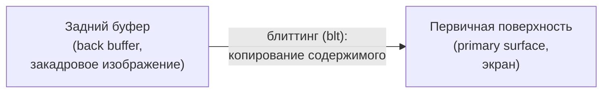
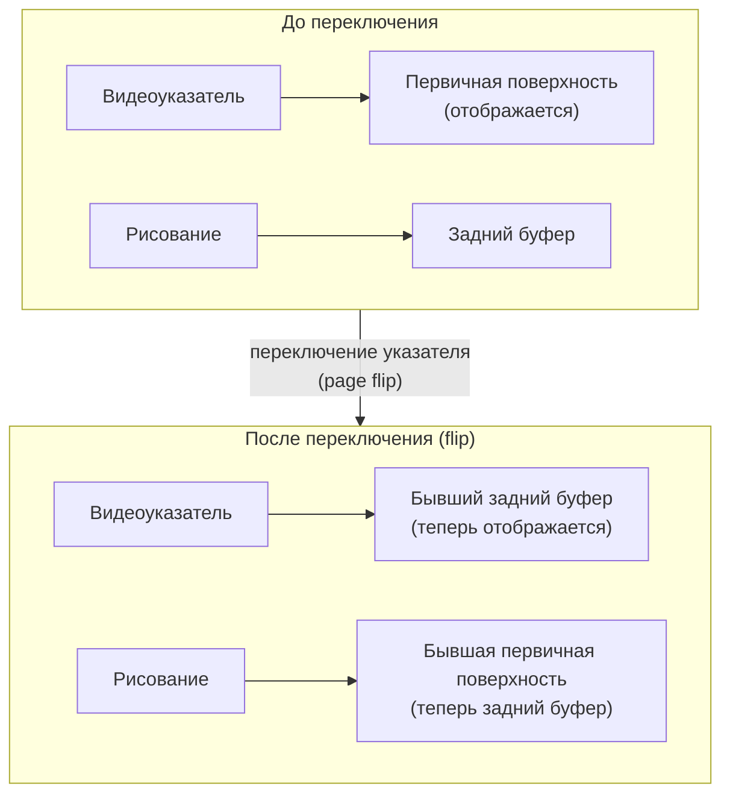

# Урок 1. API полноэкранного эксклюзивного режима

**Трейл:** Full-Screen Exclusive Mode API · **Оригинал:** [Full-Screen Exclusive Mode API](https://docs.oracle.com/javase/tutorial/extra/fullscreen/index.html)
**Связанные области:** [[01-core-java-syntax-oop]] · **Вопросы:** core-java

> Перевод официального руководства Oracle (The Java Tutorials, JDK 8). Объединяет страницы
> трейла *Full-Screen Exclusive Mode API*: *Full-Screen Exclusive Mode*, *Display Mode*,
> *Passive vs. Active Rendering*, *Double Buffering and Page Flipping*,
> *BufferStrategy and BufferCapabilities* и *Examples*.

API полноэкранного эксклюзивного режима (*Full-Screen Exclusive Mode API*) появился в JDK 1.4
и предназначен для высокопроизводительной графики и разработки игр. Он позволяет управлять
разрешением экрана и рисовать напрямую на экране, приостанавливая оконную систему (*windowing
system*).

## Полноэкранный эксклюзивный режим

Программисты, работавшие с API Microsoft DirectX, возможно, уже знакомы с полноэкранным
эксклюзивным режимом (*full-screen exclusive mode*). Для остальных эта концепция может быть
в новинку. В любом случае полноэкранный эксклюзивный режим — это мощная возможность J2SE™
версии 1.4, позволяющая программисту приостановить оконную систему, чтобы рисование велось
напрямую на экране.

Во многом это небольшой сдвиг парадигмы по сравнению с обычной GUI-программой. В традиционных
GUI-программах на Java библиотека AWT отвечает за распространение событий перерисовки
(*paint events*) от операционной системы через поток диспетчеризации событий (*event dispatch
thread*), вызывая в подходящий момент метод `Component.paint`. В полноэкранных эксклюзивных
приложениях рисование обычно выполняется самой программой активно. Кроме того, традиционное
GUI-приложение ограничено разрядностью цвета (*bit depth*) и размером экрана, которые выбрал
пользователь. В полноэкранном эксклюзивном приложении программа может управлять разрядностью
цвета и размером (то есть режимом отображения, *display mode*) экрана. Наконец, многие более
продвинутые техники — например, переключение страниц (*page flipping*, рассмотрено ниже) и
стереобуферизация (использующая отдельный набор кадров для каждого глаза) — на некоторых
платформах требуют, чтобы приложение сначала находилось в полноэкранном эксклюзивном режиме.

### Основы аппаратно-ускоренных изображений

Чтобы понять API полноэкранного эксклюзивного режима, нужно усвоить базовые принципы
аппаратно-ускоренных изображений (*hardware-accelerated images*). Интерфейс `VolatileImage`
инкапсулирует поверхность, которая может (или не может) использовать аппаратное ускорение.
Такие поверхности могут терять аппаратное ускорение или свою память по воле операционной системы
(отсюда название «volatile» — «изменчивый», «непостоянный»). Подробнее об изменчивых
изображениях — в учебнике по `VolatileImage` (готовится к выходу).

Полноэкранный эксклюзивный режим обрабатывается через объект `java.awt.GraphicsDevice`. Список
всех доступных графических устройств экрана (в одно- или многомониторных системах) можно получить,
вызвав метод `getScreenDevices` у локального `java.awt.GraphicsEnvironment`; устройство экрана по
умолчанию (основного; единственного экрана в одномониторной системе) возвращает метод
`getDefaultScreenDevice`.

Получив графическое устройство, можно вызвать один из следующих методов:

- `public boolean isFullScreenSupported()`
  Этот метод возвращает, доступен ли полноэкранный эксклюзивный режим. В системах, где
  полноэкранный эксклюзивный режим недоступен, лучше запускать приложение в оконном режиме
  с фиксированным размером, чем устанавливать полноэкранное окно.
- `public void setFullScreenWindow(Window w)`
  Получив окно, этот метод входит в полноэкранный эксклюзивный режим с использованием этого окна.
  Если полноэкранный эксклюзивный режим недоступен, окно размещается в точке (0,0) и изменяется
  по размеру так, чтобы заполнить экран. Чтобы выйти из полноэкранного эксклюзивного режима,
  вызовите этот метод с параметром `null`.

### Советы по программированию

Несколько советов по программированию с использованием полноэкранного эксклюзивного режима:

- Проверяйте `isFullScreenSupported`, прежде чем входить в полноэкранный эксклюзивный режим.
  Если он не поддерживается, производительность может снизиться.
- Вход и выход из полноэкранного режима надёжнее с конструкцией `try...finally`. Это не только
  хорошая практика кодирования, но и защита от того, чтобы программа оставалась в полноэкранном
  эксклюзивном режиме дольше, чем нужно:

```java
GraphicsDevice myDevice;
Window myWindow;

try {
    myDevice.setFullScreenWindow(myWindow);
    ...
} finally {
    myDevice.setFullScreenWindow(null);
}
```

- Большинству полноэкранных эксклюзивных приложений лучше подходят окна без оформления
  (*undecorated*). Отключите оформление у фрейма или диалога методом `setUndecorated`.
- Полноэкранные эксклюзивные приложения не должны быть изменяемыми по размеру (*resizeable*),
  так как изменение размера полноэкранного приложения может приводить к непредсказуемому
  (а возможно, и опасному) поведению.
- Из соображений безопасности пользователь должен предоставить разрешение
  `fullScreenExclusive`, если полноэкранный эксклюзивный режим используется в апплете.

## Режим отображения (Display Mode)

Войдя в полноэкранный эксклюзивный режим, приложение может получить возможность активно
устанавливать режим отображения (*display mode*). Режим отображения (`java.awt.DisplayMode`)
состоит из размера (ширина и высота монитора в пикселях), разрядности цвета (*bit depth* —
число бит на пиксель) и частоты обновления (*refresh rate* — как часто монитор обновляет
изображение). Некоторые операционные системы позволяют использовать несколько разрядностей цвета
одновременно — в этом случае для значения разрядности используется специальное значение
`BIT_DEPTH_MULTI`. Также некоторые операционные системы могут не управлять частотой обновления
(либо она вас не интересует) — тогда для частоты обновления используется специальное значение
`REFRESH_RATE_UNKNOWN`.

### Как установить режим отображения

Чтобы получить текущий режим отображения, просто вызовите метод `getDisplayMode` у графического
устройства. Чтобы получить список всех возможных режимов отображения, вызовите метод
`getDisplayModes`. И `getDisplayMode`, и `getDisplayModes` можно вызывать в любой момент,
независимо от того, находитесь ли вы в полноэкранном эксклюзивном режиме.

Прежде чем пытаться сменить режим отображения, сначала вызовите метод `isDisplayChangeSupported`.
Если он возвращает `false`, операционная система не поддерживает смену режима отображения.

Смену режима отображения можно выполнять только в полноэкранном эксклюзивном режиме. Чтобы
сменить режим отображения, вызовите метод `setDisplayMode` с нужным режимом. Будет выброшено
исключение времени выполнения (*runtime exception*), если запрошенный режим недоступен, если
смена режима не поддерживается или если вы не находитесь в полноэкранном эксклюзивном режиме.

### Зачем менять режим отображения

Главная причина установки режима отображения — это производительность (*performance*).
Приложение может работать намного быстрее, если изображения, которые оно выводит, имеют ту же
разрядность цвета, что и экран. Кроме того, если можно рассчитывать на конкретный размер экрана,
рисование на нём сильно упрощается, так как не приходится масштабировать объекты вверх или вниз
в зависимости от того, как пользователь настроил экран.

### Советы по программированию

Несколько советов по выбору и установке режима отображения:

- Проверяйте значение, возвращаемое методом `isDisplayChangeSupported`, прежде чем пытаться
  сменить режим отображения у графического устройства.
- Убедитесь, что вы находитесь в полноэкранном эксклюзивном режиме, прежде чем менять режим
  отображения.
- Как и при работе с полноэкранным режимом, установка режима отображения надёжнее в конструкции
  `try...finally`:

```java
GraphicsDevice myDevice;
Window myWindow;
DisplayMode newDisplayMode;
DisplayMode oldDisplayMode
    = myDevice.getDisplayMode();

try {
    myDevice.setFullScreenWindow(myWindow);
    myDevice.setDisplayMode(newDisplayMode);
    ...
} finally {
    myDevice.setDisplayMode(oldDisplayMode);
    myDevice.setFullScreenWindow(null);
}
```

- Выбирая режим отображения для приложения, имеет смысл хранить список предпочтительных режимов
  и затем выбирать лучший из доступных.
- В качестве запасного варианта (*fallback*), если нужный режим недоступен, можно просто
  работать в оконном режиме с фиксированным размером.

## Пассивный и активный рендеринг (Passive vs. Active Rendering)

Как уже упоминалось, большинство полноэкранных приложений работают лучше, если именно они «у руля»
во время рисования. В традиционных оконных GUI-приложениях вопрос о том, когда рисовать, обычно
решает операционная система. В оконном окружении это вполне логично. Оконное приложение не знает,
когда пользователь собирается переместить, изменить размер, открыть или перекрыть его другим окном,
пока это фактически не произойдёт. В Java-GUI-приложении операционная система доставляет событие
перерисовки (*paint event*) в AWT, который определяет, что нужно перерисовать, создаёт объект
`java.awt.Graphics` с подходящей областью отсечения (*clipping region*) и вызывает с ним метод
`paint`:

```java
// Метод paint традиционного GUI-приложения:
// Может быть вызван в любой момент, обычно
// из потока диспетчеризации событий
public void paint(Graphics g) {
    // Рисуем мой Component с помощью g
}
```

Иногда это называют пассивным рендерингом (*passive rendering*). Как нетрудно представить, такая
система влечёт большие накладные расходы, что немало раздражает программистов AWT и Swing,
чувствительных к производительности.

В полноэкранном эксклюзивном режиме вам больше не нужно беспокоиться о том, что окно изменят
по размеру, переместят, откроют или перекроют (если только вы не проигнорировали мой совет
отключить изменение размера). Вместо этого окно приложения рисуется напрямую на экране (активный
рендеринг, *active rendering*). Это сильно упрощает рисование, поскольку вам вообще не нужно
думать о событиях перерисовки. Более того, события перерисовки, доставляемые операционной системой,
в полноэкранном эксклюзивном режиме могут приходить в неподходящие или непредсказуемые моменты.

Вместо того чтобы полагаться на метод `paint`, в полноэкранном эксклюзивном режиме код рисования
обычно уместнее размещать в цикле рендеринга (*rendering loop*):

```java
public void myRenderingLoop() {
    while (!done) {
        Graphics myGraphics = getPaintGraphics();
        // Рисуем по необходимости с помощью myGraphics
        myGraphics.dispose();
    }
}
```

Такой цикл рендеринга может выполняться в любом потоке — либо в собственном вспомогательном
потоке, либо как часть главного потока приложения.

### Советы по программированию

Несколько советов по использованию активного рендеринга:

- Не размещайте код рисования в методе `paint`. Вы никогда не знаете, когда этот метод будет
  вызван! Вместо этого используйте другое имя метода, например `render(Graphics g)`, который
  можно вызывать из метода `paint` при работе в оконном режиме либо со своим собственным
  графическим объектом из цикла рендеринга.
- Используйте метод `setIgnoreRepaint` на окне и компонентах приложения, чтобы полностью
  отключить все события перерисовки, рассылаемые операционной системой, поскольку они могут
  вызываться в неподходящие моменты или, что хуже, в итоге вызвать `paint`, что приведёт к
  гонкам (*race conditions*) между потоком событий AWT и вашим циклом рендеринга.
- Отделяйте код рисования от цикла рендеринга, чтобы можно было полноценно работать как в
  полноэкранном эксклюзивном, так и в оконном режиме.
- Оптимизируйте рендеринг так, чтобы не перерисовывать всё на экране постоянно (если только вы не
  используете переключение страниц или двойную буферизацию — оба рассмотрены ниже).
- Не полагайтесь на методы `update` и `repaint` для доставки событий перерисовки.
- Не используйте тяжеловесные (*heavyweight*) компоненты, так как они всё равно повлекут накладные
  расходы на участие AWT и оконной системы платформы.
- Если вы используете легковесные (*lightweight*) компоненты, например компоненты Swing, возможно,
  придётся немного с ними повозиться, чтобы они рисовали с помощью вашего `Graphics`, а не напрямую
  как результат вызова метода `paint`. Можно смело вызывать методы Swing, такие как
  `paintComponents`, `paintComponent`, `paintBorder` и `paintChildren`, прямо из цикла рендеринга.
- Можно смело использовать пассивный рендеринг, если вам нужно простое полноэкранное приложение на
  Swing или AWT, но помните, что события перерисовки в полноэкранном эксклюзивном режиме могут быть
  не вполне надёжными или излишними. Кроме того, при пассивном рендеринге нельзя использовать более
  продвинутые техники, такие как переключение страниц. Наконец, будьте очень осторожны и избегайте
  взаимоблокировок (*deadlocks*), если решите использовать активный и пассивный рендеринг
  одновременно — такой подход не рекомендуется.

## Двойная буферизация и переключение страниц (Double Buffering and Page Flipping)

Предположим, вам нужно нарисовать целую картинку на экране пиксель за пикселем или линия за
линией. Если бы вы рисовали это напрямую на экране (скажем, через `Graphics.drawLine`), вы бы,
вероятно, с большим разочарованием заметили, что это занимает заметное время. Вы наверняка даже
увидели бы видимые артефакты того, как рисуется картинка. Чтобы не наблюдать рисование в таком виде
и в таком темпе, большинство программистов используют технику под названием двойная буферизация
(*double-buffering*).

Традиционное понятие двойной буферизации в Java-приложениях довольно простое: создать закадровое
(*off-screen*) изображение, нарисовать на нём с помощью графического объекта этого изображения,
а затем за один шаг вызвать `drawImage` с графическим объектом целевого окна и закадровым
изображением. Возможно, вы уже замечали, что Swing использует эту технику во многих своих
компонентах, обычно включённую по умолчанию через метод `setDoubleBuffered`.

Поверхность экрана обычно называют первичной поверхностью (*primary surface*), а закадровое
изображение, используемое для двойной буферизации, — задним буфером (*back buffer*). Копирование
содержимого с одной поверхности на другую часто называют поблочной передачей строк (*block line
transfer*) или блиттингом (*blitting*; «blt» обычно произносится как «блит» и не имеет ничего
общего с сэндвичем BLT).

<!-- original: assets/12-full-screen/double-buffering.gif | Двойная буферизация: копирование заднего буфера на первичную поверхность экрана -->


*Двойная буферизация: содержимое заднего буфера копируется (блиттинг) на первичную поверхность.*

Первичной поверхностью обычно управляют через графический объект любого видимого компонента;
в полноэкранном режиме любая операция с графикой полноэкранного окна — это прямое манипулирование
памятью экрана. Поэтому в полноэкранном эксклюзивном режиме можно воспользоваться другими
возможностями, которые иначе были бы недоступны из-за накладных расходов оконной системы. Одна из
таких техник, доступная только в полноэкранном эксклюзивном режиме, — это форма двойной
буферизации под названием переключение страниц (*page-flipping*).

### Переключение страниц (Page Flipping)

Многие видеокарты имеют понятие видеоуказателя (*video pointer*) — это просто адрес в видеопамяти.
Этот указатель сообщает видеокарте, где искать содержимое видео, которое нужно отобразить во время
следующего цикла обновления. На некоторых видеокартах и в некоторых операционных системах этим
указателем можно даже управлять программно. Предположим, вы создали задний буфер (в видеопамяти)
точно той же ширины, высоты и разрядности цвета, что и экран, и нарисовали на нём так же, как при
двойной буферизации. Теперь представьте, что произойдёт, если вместо блиттинга вашего изображения
на экран, как при двойной буферизации, вы просто измените видеоуказатель так, чтобы он указывал на
ваш задний буфер. Во время следующего обновления видеокарта станет использовать для отображения
ваше изображение. Это переключение называется переключением страниц, и выигрыш в производительности
по сравнению с двойной буферизацией на основе блиттинга в том, что в памяти нужно переместить лишь
один указатель, а не копировать всё содержимое из одного буфера в другой.

Когда происходит переключение страниц, указатель на старый задний буфер теперь указывает на
первичную поверхность, а указатель на старую первичную поверхность теперь указывает на память
заднего буфера. Это автоматически подготавливает вас к следующей операции рисования.

<!-- original: assets/12-full-screen/page-flipping.gif | Переключение страниц: смена видеоуказателя вместо копирования буферов -->


*Переключение страниц: вместо копирования меняется видеоуказатель — задний буфер и первичная
поверхность меняются ролями.*

Иногда выгодно настроить несколько задних буферов в цепочку переключений (*flip chain*). Это
особенно полезно, когда время, затрачиваемое на рисование, превышает частоту обновления монитора.
Цепочка переключений — это просто два или более задних буфера (иногда называемых промежуточными
буферами, *intermediary buffers*) плюс первичная поверхность (иногда это называют тройной
буферизацией, четверной буферизацией и т. д.). В цепочке переключений следующий доступный задний
буфер становится первичной поверхностью и так далее, вплоть до самого дальнего заднего буфера,
который используется для рисования.

### Преимущества двойной буферизации и переключения страниц

Если ваш показатель производительности — это просто скорость, с которой происходит двойная
буферизация или переключение страниц, по сравнению с прямым рендерингом, вы можете быть
разочарованы. Может оказаться, что показатели прямого рендеринга значительно превосходят показатели
двойной буферизации, а те, в свою очередь, значительно превосходят показатели переключения страниц.
Каждая из этих техник используется для улучшения воспринимаемой производительности (*perceived
performance*), которая в графических приложениях гораздо важнее числовой производительности
(*numerical performance*).

Двойная буферизация используется прежде всего для устранения видимых этапов рисования, из-за
которых приложение может выглядеть любительски, медлительно или мерцать. Переключение страниц
используется прежде всего для дополнительного устранения разрывов (*tearing*) — эффекта раскола,
возникающего, когда рисование на экране происходит быстрее частоты обновления монитора. Более
плавное рисование означает лучшую воспринимаемую производительность и значительно более приятный
пользовательский опыт.

## BufferStrategy и BufferCapabilities

### BufferStrategy

В Java 2 Standard Edition вам не нужно беспокоиться о видеоуказателях или видеопамяти, чтобы в
полной мере воспользоваться двойной буферизацией или переключением страниц. Для удобства работы
с рисованием на поверхностях и компонентах в общем виде — независимо от числа используемых буферов
и техники их отображения — добавлен новый класс `java.awt.image.BufferStrategy`.

Стратегия буферизации даёт вам два универсальных метода для рисования: `getDrawGraphics` и `show`.
Когда вы хотите начать рисовать, получите графический объект для рисования и используйте его. Когда
вы закончили рисовать и хотите вывести информацию на экран, вызовите `show`. Эти два метода
спроектированы так, чтобы довольно изящно вписываться в цикл рендеринга:

```java
BufferStrategy myStrategy;

while (!done) {
    Graphics g = myStrategy.getDrawGraphics();
    render(g);
    g.dispose();
    myStrategy.show();
}
```

Стратегии буферизации также созданы, чтобы помочь вам отслеживать проблемы `VolatileImage`.
В полноэкранном эксклюзивном режиме проблемы `VolatileImage` особенно важны, потому что оконная
система иногда может забрать выданную вам видеопамять. Один важный пример — когда пользователь
нажимает комбинацию клавиш ALT+TAB в Windows: внезапно ваша полноэкранная программа оказывается
в фоне, а ваша видеопамять потеряна. Узнать, произошло ли это, можно методом `contentsLost`. Точно
так же, когда оконная система возвращает вам память, узнать об этом можно методом
`contentsRestored`.

### BufferCapabilities

Как уже упоминалось, разные операционные системы и даже разные видеокарты в одной операционной
системе располагают разными доступными техниками. Эти возможности (*capabilities*) предоставлены
вам, чтобы вы могли выбрать лучшую технику для своего приложения.

Класс `java.awt.BufferCapabilities` инкапсулирует эти возможности. Каждая стратегия буферизации
управляется своими возможностями буферизации, поэтому выбор правильных возможностей для приложения
очень важен. Чтобы узнать, какие возможности доступны, вызовите метод `getBufferCapabilities`
у объектов `GraphicsConfiguration`, доступных на вашем графическом устройстве.

Возможности, доступные в Java 2 Standard Edition версии 1.4:

- `isPageFlipping`
  Эта возможность возвращает, доступно ли аппаратное переключение страниц на данной графической
  конфигурации.
- `isFullScreenRequired`
  Эта возможность возвращает, требуется ли полноэкранный эксклюзивный режим перед попыткой
  аппаратного переключения страниц.
- `isMultiBufferAvailable`
  Эта возможность возвращает, доступна ли аппаратная мультибуферизация (два или более задних буфера
  плюс первичная поверхность).
- `getFlipContents`
  Эта возможность возвращает подсказку о технике, используемой для аппаратного переключения
  страниц. Это важно, потому что содержимое заднего буфера после `show` различается в зависимости
  от используемой техники. Возвращаемое значение может быть `null` (если `isPageFlipping` вернул
  `false`) либо одним из приведённых ниже значений. Для стратегии буферизации можно указать любое
  значение, пока метод `isPageFlipping` возвращает `true`, хотя производительность будет зависеть
  от доступных возможностей.
- `FlipContents.COPIED`
  Это значение означает, что содержимое заднего буфера копируется на первичную поверхность.
  «Переключение» (*flip*), вероятно, выполняется как аппаратный блиттинг, то есть аппаратная
  двойная буферизация, скорее всего, делается блиттингом, а не настоящим переключением страниц.
  Это (теоретически) должно быть быстрее или хотя бы так же быстро, как блиттинг из `VolatileImage`
  на первичную поверхность, хотя результаты могут отличаться. После переключения содержимое заднего
  буфера такое же, как у первичной поверхности.
- `FlipContents.BACKGROUND`
  Это значение означает, что содержимое заднего буфера очищено цветом фона. Произошло либо
  настоящее переключение страниц, либо блиттинг.
- `FlipContents.PRIOR`
  Это значение означает, что содержимое заднего буфера теперь является содержимым старой первичной
  поверхности, и наоборот. Обычно это значение указывает на то, что происходит настоящее
  переключение страниц, хотя это не гарантируется и результаты этой операции, опять же, могут
  отличаться.
- `FlipContents.UNKNOWN`
  Это значение означает, что содержимое заднего буфера после переключения не определено. Возможно,
  вам придётся поэкспериментировать, чтобы выяснить, какая техника работает лучше всего (или вам
  это безразлично), и вам определённо придётся каждый раз при рисовании самостоятельно настраивать
  содержимое заднего буфера.

Чтобы создать стратегию буферизации для компонента, вызовите метод `createBufferStrategy`, передав
желаемое число буферов (это число включает первичную поверхность). Если нужна конкретная техника
буферизации, передайте соответствующий объект `BufferCapabilities`. Учтите, что при использовании
этой версии метода нужно перехватывать `AWTException` на случай, если ваш выбор недоступен.
Учтите также, что эти методы доступны только у `Canvas` и `Window`.

После создания конкретной стратегии буферизации для компонента ею можно управлять с помощью метода
`getBufferStrategy`. Учтите, что этот метод также доступен только для холстов (`Canvas`) и окон
(`Window`).

### Советы по программированию

Несколько советов по использованию возможностей буферизации и стратегий буферизации:

- Получение, использование и освобождение графического объекта надёжнее в конструкции
  `try...finally`:

```java
BufferStrategy myStrategy;

while (!done) {
    Graphics g;
    try {
        g = myStrategy.getDrawGraphics();
        render(g);
    } finally {
        g.dispose();
    }
    myStrategy.show();
}
```

- Проверяйте доступные возможности перед использованием стратегии буферизации.
- Для наилучших результатов создавайте стратегию буферизации на полноэкранном эксклюзивном окне.
  Перед использованием переключения страниц обязательно проверяйте возможности `isFullScreenRequired`
  и `isPageFlipping`.
- Не делайте никаких предположений о производительности. Корректируйте код по необходимости, но
  помните, что у разных операционных систем и видеокарт разные возможности. Профилируйте
  (*profile*) своё приложение!
- Возможно, имеет смысл создать подкласс компонента, чтобы переопределить метод
  `createBufferStrategy`. Используйте алгоритм выбора стратегии, наиболее подходящий вашему
  приложению. Внутренние классы `FlipBufferStrategy` и `BltBufferStrategy` объявлены
  `protected` и могут быть наследованы.
- Не забывайте, что вы можете потерять поверхности рисования! Обязательно проверяйте `contentsLost`
  и `contentsRestored` перед рисованием. Все потерянные буферы нужно перерисовать после их
  восстановления.
- Если вы используете стратегию буферизации для двойной буферизации в Swing-приложении, то,
  вероятно, стоит отключить двойную буферизацию у компонентов Swing, поскольку они уже будут
  буферизованы дважды. Видеопамять довольно ценна, и её следует использовать только при крайней
  необходимости.
- В итоге может оказаться расточительным использовать более одного заднего буфера.
  Мультибуферизация полезна, только когда время рисования превышает время выполнения `show`.
  Профилируйте своё приложение!

## Примеры

Учебник Oracle прилагает три примера программ, демонстрирующих полноэкранный эксклюзивный режим и
возможности буферизации:

1. [`CapabilitiesTest`](https://docs.oracle.com/javase/tutorial/extra/fullscreen/examples/CapabilitiesTest.java)
   демонстрирует различные возможности буферизации, доступные на машине, на которой он запущен.
2. [`DisplayModeTest`](https://docs.oracle.com/javase/tutorial/extra/fullscreen/examples/DisplayModeTest.java)
   показывает Swing-приложение, использующее пассивный рендеринг. Если полноэкранный эксклюзивный
   режим доступен, оно войдёт в полноэкранный эксклюзивный режим. Если разрешена смена режима
   отображения, оно позволяет переключаться между режимами отображения.
3. [`MultiBufferTest`](https://docs.oracle.com/javase/tutorial/extra/fullscreen/examples/MultiBufferTest.java)
   входит в полноэкранный режим и использует мультибуферизацию через активный цикл рендеринга.

## Источник

- [Full-Screen Exclusive Mode API (обзор трейла)](https://docs.oracle.com/javase/tutorial/extra/fullscreen/index.html) — официальное руководство Oracle.
- [Full-Screen Exclusive Mode](https://docs.oracle.com/javase/tutorial/extra/fullscreen/exclusivemode.html)
- [Display Mode](https://docs.oracle.com/javase/tutorial/extra/fullscreen/displaymode.html)
- [Passive vs. Active Rendering](https://docs.oracle.com/javase/tutorial/extra/fullscreen/rendering.html)
- [Double Buffering and Page Flipping](https://docs.oracle.com/javase/tutorial/extra/fullscreen/doublebuf.html)
- [BufferStrategy and BufferCapabilities](https://docs.oracle.com/javase/tutorial/extra/fullscreen/bufferstrategy.html)
- [Examples](https://docs.oracle.com/javase/tutorial/extra/fullscreen/example.html)
</content>
</invoke>
