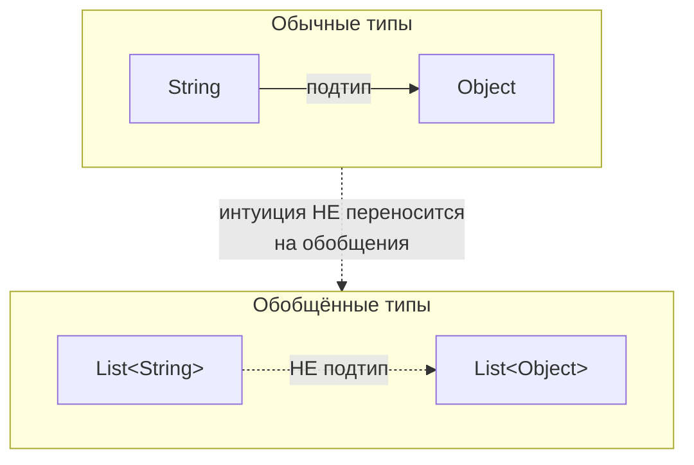
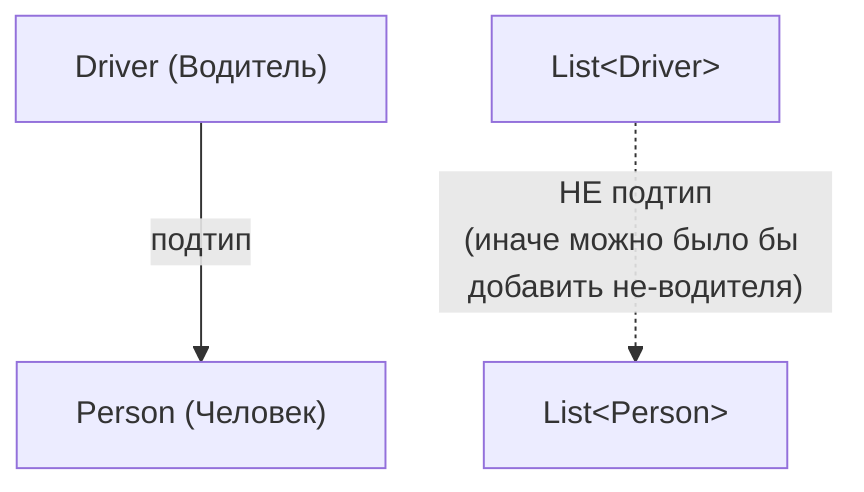
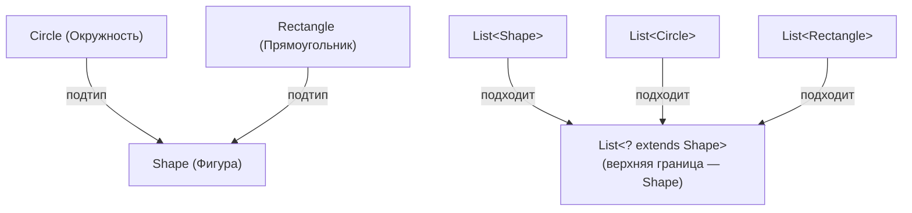

# Урок 2. Подтипы и wildcards

**Трейл:** Generics (расширенный) · **Оригинал:** [Generics (Gilad Bracha)](https://docs.oracle.com/javase/tutorial/extra/generics/index.html)
**Связанные области:** [[05-generics]] · **Вопросы:** core-java

> Перевод официального руководства Oracle (The Java Tutorials, JDK 8). Автор раздела
> «Generics» — Гилад Брача (Gilad Bracha). Урок объединяет страницы *Generics and Subtyping*
> и *Wildcards*.

## Обобщения и подтипы (Generics and Subtyping)

Проверим, насколько хорошо вы поняли обобщения (*generics*). Легален ли следующий фрагмент кода?

```java
List<String> ls = new ArrayList<String>(); // 1
List<Object> lo = ls;                       // 2
```

Строка 1, безусловно, легальна. Более хитрая часть вопроса — строка 2. Она сводится к вопросу:
является ли `List` из `String` (список строк) списком `List` из `Object` (списком объектов)?
Большинство людей инстинктивно отвечают: «Конечно!».

Что ж, посмотрите на следующие несколько строк:

```java
lo.add(new Object());   // 3
String s = ls.get(0);   // 4: попытка присвоить Object переменной типа String!
```

Здесь мы создали псевдонимы (*aliases*) `ls` и `lo`. Обращаясь к `ls` — списку строк — через
псевдоним `lo`, мы можем вставить в него произвольные объекты. В результате `ls` больше не
содержит только строки, и когда мы попытаемся что-то из него извлечь, нас ждёт неприятный
сюрприз.

Разумеется, компилятор Java не даст этому случиться. Строка 2 вызовет ошибку времени компиляции.

### Фундаментальное правило

В общем случае: если `Foo` является подтипом (*subtype* — подклассом или подынтерфейсом)
типа `Bar`, а `G` — некоторое объявление обобщённого типа, то это **не** означает, что `G<Foo>`
является подтипом `G<Bar>`. Это, пожалуй, самое трудное, что нужно усвоить про обобщения,
поскольку оно противоречит нашей глубоко укоренившейся интуиции.

Наглядно: несмотря на то что `String` — подтип `Object`, тип `List<String>` **не** является
подтипом `List<Object>`.



### Коллекции и изменяемость

Не следует считать, что коллекции не меняются. Наша интуиция может склонять нас к тому, чтобы
воспринимать их как неизменяемые (*immutable*).

Например, если управление транспортной инспекции (department of motor vehicles, DMV) передаёт
бюро переписи населения (census bureau) список водителей, это кажется разумным. Нам думается,
что `List<Driver>` (список водителей) — это `List<Person>` (список людей), при условии что
`Driver` — подтип `Person`. На самом деле передаётся **копия** реестра водителей. Иначе бюро
переписи могло бы добавить в список новых людей, которые не являются водителями, и тем самым
исказить записи транспортной инспекции.



Чтобы справляться с такими ситуациями, полезно рассмотреть более гибкие обобщённые типы. Правила,
которые мы видели до сих пор, довольно ограничительны.

## Wildcards (символы подстановки)

Рассмотрим задачу написания процедуры, которая печатает все элементы коллекции. Вот как её можно
было бы написать в более старой версии языка (то есть до выпуска 5.0):

```java
void printCollection(Collection c) {
    Iterator i = c.iterator();
    for (k = 0; k < c.size(); k++) {
        System.out.println(i.next());
    }
}
```

А вот наивная попытка написать её с использованием обобщений (и нового синтаксиса цикла `for`):

```java
void printCollection(Collection<Object> c) {
    for (Object e : c) {
        System.out.println(e);
    }
}
```

Проблема в том, что эта новая версия гораздо менее полезна, чем старая. Если старый код можно было
вызвать с любой коллекцией в качестве параметра, то новый принимает только `Collection<Object>`,
который, как мы только что показали, **не** является супертипом всех видов коллекций!

Так что же является супертипом всех видов коллекций? Он записывается как `Collection<?>`
(читается «collection of unknown» — коллекция неизвестного), то есть коллекция, тип элементов
которой соответствует чему угодно. Он называется **wildcard-типом** (*wildcard type*, тип с
символом подстановки) — по очевидным причинам. Мы можем написать:

```java
void printCollection(Collection<?> c) {
    for (Object e : c) {
        System.out.println(e);
    }
}
```

— и теперь его можно вызвать с коллекцией любого типа. Обратите внимание, что внутри
`printCollection()` мы по-прежнему можем читать элементы из `c` и присваивать им тип `Object`.
Это всегда безопасно, поскольку, каким бы ни был фактический тип коллекции, она содержит объекты.
Однако добавлять в неё произвольные объекты небезопасно:

```java
Collection<?> c = new ArrayList<String>();
c.add(new Object()); // ошибка времени компиляции
```

Поскольку мы не знаем, что́ обозначает тип элементов `c`, мы не можем добавлять в неё объекты.
Метод `add()` принимает аргументы типа `E` — типа элементов коллекции. Когда фактический параметр
типа равен `?`, он обозначает некий неизвестный тип. Любой параметр, который мы передадим в `add`,
должен был бы быть подтипом этого неизвестного типа. Поскольку мы не знаем, что это за тип, мы не
можем передать ничего. Единственное исключение — `null`, который является членом любого типа.

С другой стороны, имея `List<?>`, мы **можем** вызвать `get()` и использовать результат. Тип
результата — неизвестный тип, но мы всегда знаем, что это объект. Поэтому безопасно присвоить
результат `get()` переменной типа `Object` или передать его туда, где ожидается тип `Object`.

### Ограниченные wildcards (Bounded Wildcards)

Рассмотрим простое приложение для рисования, которое может рисовать фигуры — прямоугольники и
окружности. Чтобы представить эти фигуры внутри программы, можно определить иерархию классов
вроде такой:

```java
public abstract class Shape {
    public abstract void draw(Canvas c);
}

public class Circle extends Shape {
    private int x, y, radius;
    public void draw(Canvas c) {
        ...
    }
}

public class Rectangle extends Shape {
    private int x, y, width, height;
    public void draw(Canvas c) {
        ...
    }
}
```

Эти классы можно рисовать на холсте (*canvas*):

```java
public class Canvas {
    public void draw(Shape s) {
        s.draw(this);
    }
}
```

Любой рисунок обычно содержит некоторое количество фигур. Если считать, что они представлены
списком, было бы удобно иметь в `Canvas` метод, рисующий их все:

```java
public void drawAll(List<Shape> shapes) {
    for (Shape s: shapes) {
        s.draw(this);
    }
}
```

Однако правила типов гласят, что `drawAll()` можно вызвать только на списках именно `Shape`: его
нельзя, например, вызвать на `List<Circle>`. Это досадно, поскольку всё, что делает метод, —
читает фигуры из списка, так что его с тем же успехом можно было бы вызвать и на `List<Circle>`.
В действительности мы хотим, чтобы метод принимал список фигур **любого** вида:

```java
public void drawAll(List<? extends Shape> shapes) {
    ...
}
```

Здесь есть небольшое, но очень важное отличие: мы заменили тип `List<Shape>` на
`List<? extends Shape>`. Теперь `drawAll()` будет принимать списки любого подкласса `Shape`, так
что мы можем при желании вызвать его на `List<Circle>`.

`List<? extends Shape>` — это пример **ограниченного wildcard** (*bounded wildcard*). Символ `?`
обозначает неизвестный тип, как и wildcards, которые мы видели раньше. Однако в данном случае мы
знаем, что этот неизвестный тип на самом деле является подтипом `Shape`. (Примечание: это может
быть и сам `Shape`, и некоторый подкласс; необязательно, чтобы он буквально расширял `Shape`.)
Мы говорим, что `Shape` — это **верхняя граница** (*upper bound*) wildcard.



Как обычно, за гибкость использования wildcards приходится платить. Цена в том, что теперь в теле
метода нельзя записывать данные в `shapes`. Например, так делать нельзя:

```java
public void addRectangle(List<? extends Shape> shapes) {
    // Ошибка времени компиляции!
    shapes.add(0, new Rectangle());
}
```

Вы должны суметь понять, почему приведённый выше код запрещён. Тип второго параметра
`shapes.add()` — `? extends Shape`, то есть неизвестный подтип `Shape`. Поскольку мы не знаем,
что это за тип, мы не знаем, является ли он супертипом `Rectangle`; он может им быть, а может и
не быть, поэтому передавать туда `Rectangle` небезопасно.

Ограниченные wildcards — именно то, что нужно для разобранного примера с передачей данных от
транспортной инспекции (DMV) бюро переписи населения. В нашем примере предполагается, что данные
представлены отображением имён (в виде строк) на людей (в виде ссылочных типов, таких как `Person`
или его подтипы, например `Driver`). `Map<K,V>` — это пример обобщённого типа, который принимает
два аргумента-типа, представляющих ключи и значения отображения.

Снова обратите внимание на соглашение об именовании формальных параметров-типов: `K` — для
ключей (*keys*), `V` — для значений (*values*).

```java
public class Census {
    public static void addRegistry(Map<String, ? extends Person> registry) {
}
...

Map<String, Driver> allDrivers = ... ;
Census.addRegistry(allDrivers);
```

## Источник

- [Generics and Subtyping](https://docs.oracle.com/javase/tutorial/extra/generics/subtype.html) — официальное руководство Oracle (The Java Tutorials), автор Гилад Брача.
- [Wildcards](https://docs.oracle.com/javase/tutorial/extra/generics/wildcards.html) — официальное руководство Oracle (The Java Tutorials), автор Гилад Брача.
- [Generics (Gilad Bracha) — оглавление трейла](https://docs.oracle.com/javase/tutorial/extra/generics/index.html)
