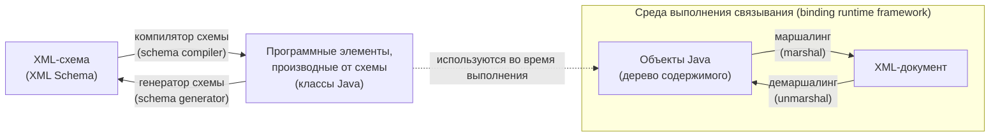
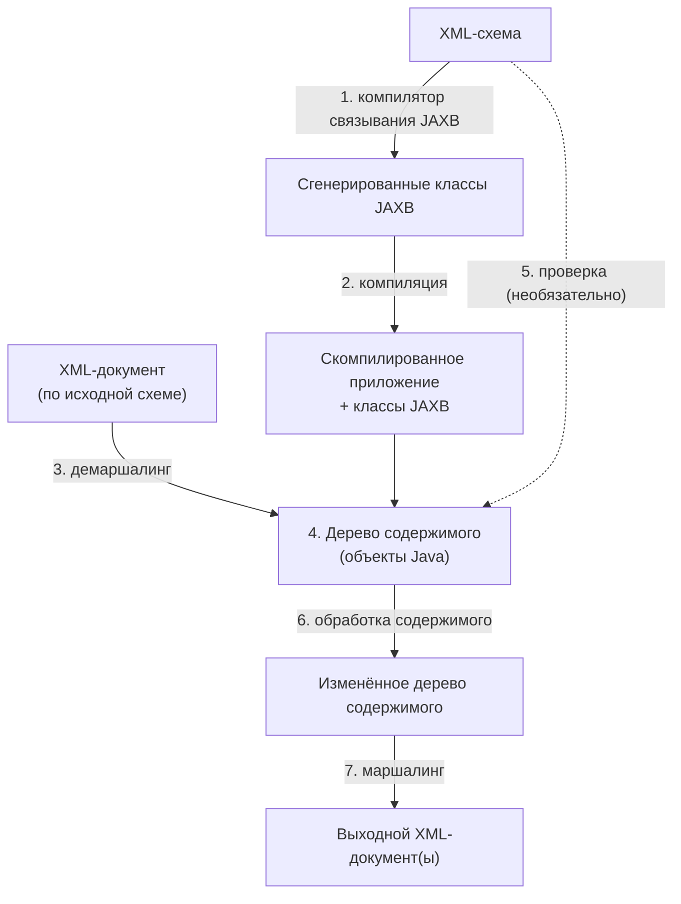

# Урок 1. Архитектура JAXB и связывание схем

**Трейл:** JAXB · **Оригинал:** [Introduction to JAXB](https://docs.oracle.com/javase/tutorial/jaxb/intro/index.html)
**Связанные области:** [[17-rest-web]] · **Вопросы:** rest-web

> Перевод официального руководства Oracle (The Java Tutorials, JDK 8). Объединяет страницы
> раздела *Introduction to JAXB*: *JAXB Architecture*, *Representing XML Content*,
> *Binding XML Schemas* и *Customizing Generated Classes and Java Program Elements*.
>
> Руководство написано для JDK 8. Примеры и практики, описанные здесь, не используют улучшения,
> появившиеся в более поздних выпусках, и могут опираться на технологии, которые уже недоступны.

**JAXB** (Java Architecture for XML Binding) — архитектура связывания XML с объектами Java.
Она позволяет отображать (*bind*) XML-схему на классы Java и обратно, благодаря чему приложение
может работать с XML-содержимым как с обычными объектами Java, не разбирая XML вручную.

## Архитектура JAXB

Этот раздел описывает компоненты и их взаимодействие в модели обработки JAXB.

### Обзор архитектуры

Реализация JAXB состоит из следующих архитектурных компонентов:

- **Компилятор схемы** (*schema compiler*) — связывает исходную схему с набором программных
  элементов, производных от схемы (*schema-derived program elements*). Связывание описывается
  XML-ориентированным языком связывания (*binding language*).
- **Генератор схемы** (*schema generator*) — отображает набор существующих программных элементов
  на производную схему. Отображение описывается аннотациями в программе (*program annotations*).
- **Среда выполнения связывания** (*binding runtime framework*) — предоставляет операции
  демаршалинга (*unmarshalling*, чтение) и маршалинга (*marshalling*, запись) для доступа,
  изменения и проверки (*validation*) XML-содержимого с использованием либо производных от схемы,
  либо уже существующих программных элементов.

На схеме ниже показаны компоненты, образующие реализацию JAXB, и два направления работы:
из XML-схемы получаются классы Java (через компилятор схемы), а из существующих классов Java —
схема (через генератор схемы). Среда выполнения обеспечивает преобразование между объектами Java
и XML-документами в обе стороны.

### Процесс связывания JAXB

Общие шаги процесса связывания данных (*data binding*) в JAXB:

1. **Генерация классов** (*generate classes*). XML-схема подаётся на вход компилятору связывания
   JAXB (*JAXB binding compiler*), который порождает классы JAXB на основе этой схемы.
2. **Компиляция классов** (*compile classes*). Все сгенерированные классы, исходные файлы и код
   приложения должны быть скомпилированы.
3. **Демаршалинг** (*unmarshal*). XML-документы, составленные согласно ограничениям исходной схемы,
   демаршалятся средой связывания JAXB. Заметьте, что JAXB поддерживает демаршалинг XML-данных не
   только из файлов и документов, но и из других источников — узлов DOM, строковых буферов,
   источников SAX и т. п.
4. **Построение дерева содержимого** (*generate content tree*). В процессе демаршалинга создаётся
   дерево содержимого (*content tree*) из объектов-данных, созданных по экземплярам сгенерированных
   классов JAXB; это дерево отражает структуру и содержимое исходных XML-документов.
5. **Проверка** (*validate*, необязательно). Процесс демаршалинга может включать проверку исходных
   XML-документов перед построением дерева содержимого. Если вы изменяете дерево содержимого на
   шаге 6, можно также использовать операцию проверки JAXB, чтобы проверить изменения перед
   обратным маршалингом содержимого в XML-документ.
6. **Обработка содержимого** (*process content*). Приложение-клиент может изменять XML-данные,
   представленные деревом содержимого Java, через интерфейсы, сгенерированные компилятором
   связывания.
7. **Маршалинг** (*marshal*). Обработанное дерево содержимого маршалится в один или несколько
   выходных XML-документов. Перед маршалингом содержимое может быть проверено.

### Подробнее о демаршалинге

Демаршалинг (*unmarshalling*) даёт приложению-клиенту возможность преобразовывать XML-данные в
объекты Java, производные от JAXB (*JAXB-derived Java objects*).

### Подробнее о маршалинге

Маршалинг (*marshalling*) даёт приложению-клиенту возможность преобразовывать дерево объектов Java,
производных от JAXB, в XML-данные.

По умолчанию при генерации XML-данных маршалер (*Marshaller*) использует кодировку UTF-8.

От приложений-клиентов не требуется проверять дерево содержимого Java перед маршалингом. Также не
требуется, чтобы дерево содержимого Java было корректным относительно исходной схемы, для того чтобы
его можно было замаршалить в XML-данные.

### Подробнее о проверке

Проверка (*validation*) — это процесс подтверждения того, что XML-документ удовлетворяет всем
ограничениям, выраженным в схеме. JAXB 1.0 предоставлял проверку во время демаршалинга, а также
включал проверку «по требованию» (*on-demand*) дерева содержимого JAXB. JAXB 2.0 разрешает проверку
только во время демаршалинга и маршалинга. Модель обработки в веб-сервисах такова: быть «снисходительным»
при чтении данных и «строгим» при их записи. Чтобы соответствовать этой модели, проверку добавили на
этап маршалинга — так пользователи могут убедиться, что не сделали XML-документ некорректным при его
изменении в форме JAXB.

## Представление XML-содержимого

Этот раздел описывает, как JAXB представляет XML-содержимое в виде объектов Java.

### Представление XML-схемы в Java

JAXB поддерживает группировку сгенерированных классов в пакеты Java. Пакет состоит из следующего:

- **Имя класса Java**, которое выводится из имени XML-элемента либо задаётся настройкой связывания
  (*binding customization*).
- **Класс `ObjectFactory`** — фабрика, которая используется для возврата экземпляров связанного
  класса Java.

## Связывание XML-схем

Этот раздел описывает связывания XML-в-Java, используемые JAXB по умолчанию. Все эти связывания можно
переопределить — глобально или в каждом отдельном случае — с помощью пользовательского объявления
связывания (*custom binding declaration*). Полную информацию о связываниях JAXB по умолчанию см. в
спецификации JAXB.

### Определения простых типов

Компонент схемы, использующий определение простого типа (*simple type definition*), как правило,
связывается со свойством Java (*Java property*). Поскольку компоненты схемы бывают разных видов,
у свойства Java выделяют следующие атрибуты (общие для компонентов схемы):

- базовый тип (*base type*);
- тип коллекции (*collection type*), если есть;
- предикат (*predicate*).

Остальные атрибуты свойства Java задаются в самом компоненте схемы, использующем определение
простого типа.

### Связывания типов данных по умолчанию

Ниже описаны связывания типов данных по умолчанию: схема → Java, объект `JAXBElement` и Java → схема.

#### Отображение «схема → Java»

Язык Java предоставляет более богатый набор типов данных, чем XML-схема. В таблице приведено
отображение типов данных XML на типы данных Java в JAXB.

**Таблица. Отображение в JAXB встроенных типов данных XML-схемы**

| Тип XML-схемы | Тип данных Java |
|---|---|
| `xsd:string` | `java.lang.String` |
| `xsd:integer` | `java.math.BigInteger` |
| `xsd:int` | `int` |
| `xsd:long` | `long` |
| `xsd:short` | `short` |
| `xsd:decimal` | `java.math.BigDecimal` |
| `xsd:float` | `float` |
| `xsd:double` | `double` |
| `xsd:boolean` | `boolean` |
| `xsd:byte` | `byte` |
| `xsd:QName` | `javax.xml.namespace.QName` |
| `xsd:dateTime` | `javax.xml.datatype.XMLGregorianCalendar` |
| `xsd:base64Binary` | `byte[]` |
| `xsd:hexBinary` | `byte[]` |
| `xsd:unsignedInt` | `long` |
| `xsd:unsignedShort` | `int` |
| `xsd:unsignedByte` | `short` |
| `xsd:time` | `javax.xml.datatype.XMLGregorianCalendar` |
| `xsd:date` | `javax.xml.datatype.XMLGregorianCalendar` |
| `xsd:g` | `javax.xml.datatype.XMLGregorianCalendar` |
| `xsd:anySimpleType` | `java.lang.Object` |
| `xsd:anySimpleType` | `java.lang.String` |
| `xsd:duration` | `javax.xml.datatype.Duration` |
| `xsd:NOTATION` | `javax.xml.namespace.QName` |

#### Объект `JAXBElement`

Когда информацию об XML-элементе нельзя вывести из производного представления XML-содержимого в Java,
предоставляется объект `JAXBElement`. У этого объекта есть методы для получения и установки имени
объекта и значения объекта.

#### Отображение «Java → схема»

В таблице показано отображение по умолчанию классов Java на типы данных XML.

**Таблица. Отображение в JAXB типов данных XML на классы Java**

| Класс Java | Тип данных XML |
|---|---|
| `java.lang.String` | `xs:string` |
| `java.math.BigInteger` | `xs:integer` |
| `java.math.BigDecimal` | `xs:decimal` |
| `java.util.Calendar` | `xs:dateTime` |
| `java.util.Date` | `xs:dateTime` |
| `javax.xml.namespace.QName` | `xs:QName` |
| `java.net.URI` | `xs:string` |
| `javax.xml.datatype.XMLGregorianCalendar` | `xs:anySimpleType` |
| `javax.xml.datatype.Duration` | `xs:duration` |
| `java.lang.Object` | `xs:anyType` |
| `java.awt.Image` | `xs:base64Binary` |
| `javax.activation.DataHandler` | `xs:base64Binary` |
| `javax.xml.transform.Source` | `xs:base64Binary` |
| `java.util.UUID` | `xs:string` |

## Настройка сгенерированных классов и программных элементов Java

В следующих разделах описано, как настраивать сгенерированные классы JAXB и программные элементы Java.

### Схема → Java

Пользовательские объявления связывания JAXB (*custom JAXB binding declarations*) позволяют настраивать
сгенерированные классы JAXB сверх XML-специфичных ограничений XML-схемы, добавляя Java-специфичные
уточнения — например, отображение имён классов и пакетов.

JAXB предоставляет два способа настройки XML-схемы:

- как встроенные аннотации (*inline annotations*) в исходной XML-схеме;
- как объявления во внешнем файле настройки связывания (*external binding customization file*),
  который передаётся компилятору связывания JAXB.

Примеры кода, показывающие, как настраивать связывания JAXB, приведены далее в этом документе.

### Java → схема

Аннотации JAXB, определённые в пакете `javax.xml.bind.annotation`, можно использовать для настройки
отображения программных элементов Java на XML-схему. В таблицах ниже сведены аннотации JAXB,
сгруппированные по тому, к чему они применяются.

#### Аннотации JAXB, связанные с пакетом Java

| Аннотация | Описание и настройки по умолчанию |
|---|---|
| `@XmlSchema` | Отображает пакет на целевое пространство имён XML (*target namespace*). По умолчанию: `@XmlSchema(xmlns = {}, namespace = "", elementFormDefault = XmlNsForm.UNSET, attributeFormDefault = XmlNsForm.UNSET)` |
| `@XmlAccessorType` | Управляет сериализацией полей и свойств по умолчанию. По умолчанию: `@XmlAccessorType(value = AccessType.PUBLIC_MEMBER)` |
| `@XmlAccessorOrder` | Управляет порядком свойств и полей, отображаемых на XML-элементы, по умолчанию. По умолчанию: `@XmlAccessorOrder(value = AccessorOrder.UNDEFINED)` |
| `@XmlSchemaType` | Позволяет настраивать отображение на встроенный тип XML-схемы. По умолчанию: `@XmlSchemaType(namespace = "http://www.w3.org/2001/XMLSchema", type = DEFAULT.class)` |
| `@XmlSchemaTypes` | Контейнерная аннотация для нескольких `@XmlSchemaType`. По умолчанию: нет |

#### Аннотации JAXB, связанные с классом Java

| Аннотация | Описание и настройки по умолчанию |
|---|---|
| `@XmlType` | Отображает класс Java на тип схемы. По умолчанию: `@XmlType(name = "##default", propOrder = {""}, namespace = "##default", factoryClass = DEFAULT.class, factoryMethod = "")` |
| `@XmlRootElement` | Связывает глобальный элемент с типом схемы, на который отображён класс. По умолчанию: `@XmlRootElement(name = "##default", namespace = "##default")` |

#### Аннотации JAXB, связанные с типом `enum` Java

| Аннотация | Описание и настройки по умолчанию |
|---|---|
| `@XmlEnum` | Отображает тип Java на простой тип XML. По умолчанию: `@XmlEnum(value = String.class)` |
| `@XmlEnumValue` | Отображает тип Java на простой тип XML. По умолчанию: нет |
| `@XmlType` | Отображает класс Java на тип схемы. По умолчанию: `@XmlType(name = "##default", propOrder = {""}, namespace = "##default", factoryClass = DEFAULT.class, factoryMethod = "")` |
| `@XmlRootElement` | Связывает глобальный элемент с типом схемы, на который отображён класс. По умолчанию: `@XmlRootElement(name = "##default", namespace = "##default")` |

#### Аннотации JAXB, связанные со свойствами и полями Java

| Аннотация | Описание и настройки по умолчанию |
|---|---|
| `@XmlElement` | Отображает свойство или поле JavaBeans на XML-элемент, производный от имени свойства или поля. По умолчанию: `@XmlElement(name = "##default", nillable = false, namespace = "##default", type = DEFAULT.class, defaultValue = "")` |
| `@XmlElements` | Контейнерная аннотация для нескольких `@XmlElement`. По умолчанию: нет |
| `@XmlElementRef` | Отображает свойство или поле JavaBeans на XML-элемент, производный от типа свойства или поля. По умолчанию: `@XmlElementRef(name = "##default", namespace = "##default", type = DEFAULT.class)` |
| `@XmlElementRefs` | Контейнерная аннотация для нескольких `@XmlElementRef`. По умолчанию: нет |
| `@XmlElementWrapper` | Генерирует элемент-обёртку вокруг XML-представления. Обычно используется как XML-обёртка вокруг коллекций. По умолчанию: `@XmlElementWrapper(name = "##default", namespace = "##default", nillable = false)` |
| `@XmlAnyElement` | Отображает свойство JavaBeans на представление XML infoset или на элемент JAXB. По умолчанию: `@XmlAnyElement(lax = false, value = W3CDomHandler.class)` |
| `@XmlAttribute` | Отображает свойство JavaBeans на XML-атрибут. По умолчанию: `@XmlAttribute(name = ##default, required = false, namespace = "##default")` |
| `@XmlAnyAttribute` | Отображает свойство JavaBeans на отображение (*map*) подстановочных атрибутов (*wildcard attributes*). По умолчанию: нет |
| `@XmlTransient` | Предотвращает отображение свойства JavaBeans на XML-представление. По умолчанию: нет |
| `@XmlValue` | Задаёт отображение класса на сложный тип XML-схемы с `simpleContent` либо на простой тип XML-схемы. По умолчанию: нет |
| `@XmlID` | Отображает свойство JavaBeans на XML ID. По умолчанию: нет |
| `@XmlIDREF` | Отображает свойство JavaBeans на XML IDREF. По умолчанию: нет |
| `@XmlList` | Отображает свойство на простой тип-список (*list simple type*). По умолчанию: нет |
| `@XmlMixed` | Помечает многозначное свойство JavaBeans для поддержки смешанного содержимого (*mixed content*). По умолчанию: нет |
| `@XmlMimeType` | Связывает MIME-тип, который управляет XML-представлением свойства. По умолчанию: нет |
| `@XmlAttachmentRef` | Помечает поле/свойство, XML-форма которого является URI-ссылкой на MIME-содержимое. По умолчанию: нет |
| `@XmlInlineBinaryData` | Отключает рассмотрение XOP-кодирования для типов данных, связанных с двоичными данными в base64 в XML. По умолчанию: нет |

#### Аннотации JAXB, связанные с объектными фабриками

| Аннотация | Описание и настройки по умолчанию |
|---|---|
| `@XmlElementDecl` | Отображает фабричный метод на XML-элемент. По умолчанию: `@XmlElementDecl(scope = GLOBAL.class, namespace = "##default", substitutionHeadNamespace = "##default", substitutionHeadName = "")` |

#### Аннотации JAXB, связанные с адаптерами

| Аннотация | Описание и настройки по умолчанию |
|---|---|
| `@XmlJavaTypeAdapter` | Использует адаптер, реализующий аннотацию `@XmlAdapter`, для пользовательского маршалинга. По умолчанию: `@XmlJavaTypeAdapter(type = DEFAULT.class)` |
| `@XmlJavaTypeAdapters` | Контейнерная аннотация для нескольких `@XmlJavaTypeAdapter` на уровне пакета. По умолчанию: нет |

## Источник

- [JAXB Architecture](https://docs.oracle.com/javase/tutorial/jaxb/intro/arch.html) — официальное руководство Oracle.
- [Representing XML Content](https://docs.oracle.com/javase/tutorial/jaxb/intro/repcon.html) — официальное руководство Oracle.
- [Binding XML Schemas](https://docs.oracle.com/javase/tutorial/jaxb/intro/bind.html) — официальное руководство Oracle.
- [Customizing Generated Classes and Java Program Elements](https://docs.oracle.com/javase/tutorial/jaxb/intro/customize.html) — официальное руководство Oracle.
- [Introduction to JAXB](https://docs.oracle.com/javase/tutorial/jaxb/intro/index.html) — обзорная страница раздела.
