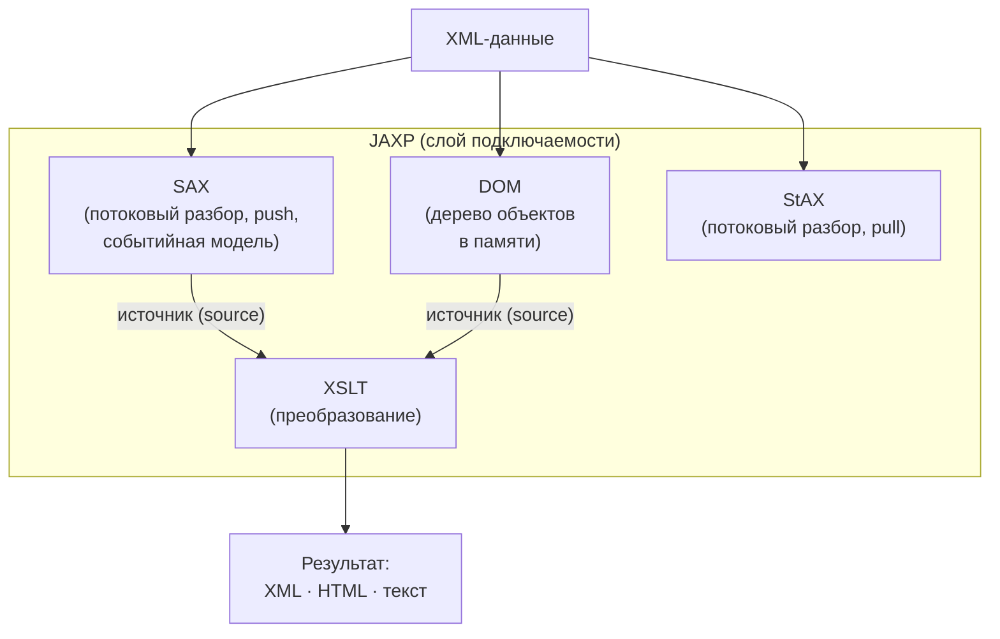
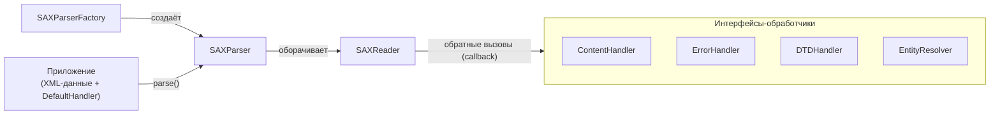
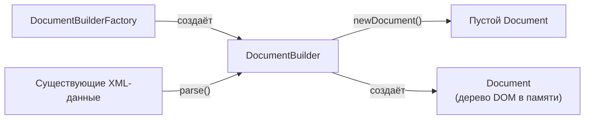
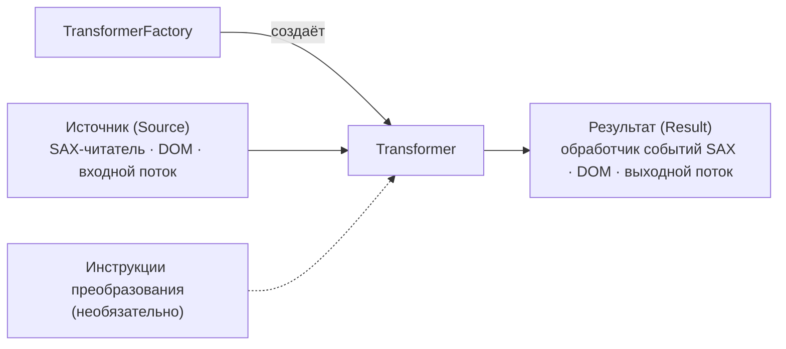

# Урок 1. Введение в JAXP

**Трейл:** JAXP · **Оригинал:** [Introduction to JAXP](https://docs.oracle.com/javase/tutorial/jaxp/intro/index.html)
**Связанные области:** [[17-rest-web]] · **Вопросы:** rest-web

> Перевод официального руководства Oracle (The Java Tutorials, JDK 8). Урок объединяет
> страницы трейла *Introduction to JAXP*: *Overview of the Packages*, *Simple API for XML APIs*,
> *Document Object Model APIs*, *Extensible Stylesheet Language Transformations APIs*,
> *Streaming API for XML APIs*, *Finding the JAXP Sample Programs* и *Where Do You Go From Here?*.

> Java API для обработки XML (Java API for XML Processing, JAXP) предназначен для обработки
> XML-данных в приложениях, написанных на языке программирования Java. JAXP опирается на
> стандарты парсеров — простой API для разбора XML (Simple API for XML Parsing, SAX) и объектную
> модель документа (Document Object Model, DOM), — благодаря чему вы можете разбирать данные либо
> как поток событий, либо строя их объектное представление. JAXP также поддерживает стандарт
> расширяемого языка таблиц стилей для преобразований (Extensible Stylesheet Language
> Transformations, XSLT), дающий вам контроль над представлением данных и позволяющий
> преобразовывать данные в другие XML-документы или в иные форматы, например в HTML. Кроме того,
> JAXP предоставляет поддержку пространств имён (namespace), что позволяет работать с DTD, в
> которых иначе могли бы возникать конфликты имён. Наконец, начиная с версии 1.4, JAXP реализует
> стандарт потокового API для XML (Streaming API for XML, StAX).

> JAXP спроектирован гибким и позволяет использовать в приложении любой XML-совместимый парсер.
> Это достигается за счёт так называемого слоя подключаемости (pluggability layer), который даёт
> вам возможность подключить реализацию API SAX или DOM. Слой подключаемости также позволяет
> подключить XSL-процессор, давая вам контроль над тем, как отображаются ваши XML-данные.

Ниже показана общая схема способов обработки XML, которые предоставляет JAXP.

## Обзор пакетов

API SAX и DOM определены, соответственно, группой XML-DEV и консорциумом W3C. Библиотеки,
которые задают эти API, следующие:

- **`javax.xml.parsers`** — API JAXP, предоставляющий общий интерфейс к SAX- и DOM-парсерам
  разных производителей.
- **`org.w3c.dom`** — определяет класс `Document` (то есть DOM), а также классы для всех
  компонентов DOM.
- **`org.xml.sax`** — определяет базовые API SAX.
- **`javax.xml.transform`** — определяет API XSLT, которые позволяют преобразовывать XML в
  другие формы.
- **`javax.xml.stream`** — предоставляет специфичные для StAX API преобразований.

Простой API для XML (Simple API for XML, SAX) — это событийно-управляемый механизм
последовательного доступа, выполняющий поэлементную обработку. API этого уровня читает и
записывает XML в хранилище данных или в веб. Для серверных и высокопроизводительных приложений
вам потребуется полностью разобраться в этом уровне. Но для многих приложений достаточно
минимального понимания.

API DOM в целом проще в использовании. Он предоставляет привычную древовидную структуру
объектов. С помощью API DOM можно манипулировать иерархией прикладных объектов, которую он
инкапсулирует. API DOM идеально подходит для интерактивных приложений, поскольку вся объектная
модель присутствует в памяти, где пользователь может к ней обращаться и ею манипулировать.

С другой стороны, построение DOM требует чтения всей XML-структуры и удержания дерева объектов
в памяти, поэтому оно гораздо более ресурсоёмко по процессору и памяти. По этой причине API SAX
обычно предпочитают для серверных приложений и фильтров данных, которым не требуется
представление данных в памяти.

API XSLT, определённые в `javax.xml.transform`, позволяют записывать XML-данные в файл или
преобразовывать их в другие формы. Как показано в разделе XSLT этого руководства, их можно даже
использовать совместно с API SAX, чтобы преобразовывать унаследованные (legacy) данные в XML.

Наконец, API StAX, определённые в `javax.xml.stream`, предоставляют основанный на потоковой
Java-технологии, событийно-управляемый API разбора методом «вытягивания» (pull-parsing) для
чтения и записи XML-документов. StAX предлагает более простую модель программирования, чем SAX,
и более эффективное управление памятью, чем DOM.

## Простой API для XML (Simple API for XML APIs)

Базовая схема API разбора SAX показана на рисунке 1-1. Чтобы запустить процесс, для порождения
экземпляра парсера используется экземпляр класса `SAXParserFactory`.

**Рисунок 1-1. API SAX**

Парсер оборачивает объект `SAXReader`. Когда вызывается метод `parse()` парсера, читатель
(reader) вызывает один из нескольких методов обратного вызова (callback), реализованных в
приложении. Эти методы определяются интерфейсами `ContentHandler`, `ErrorHandler`, `DTDHandler`
и `EntityResolver`.

Вот сводка ключевых API SAX:

**`SAXParserFactory`**

Объект `SAXParserFactory` создаёт экземпляр парсера, определяемого системным свойством
`javax.xml.parsers.SAXParserFactory`.

**`SAXParser`**

Интерфейс `SAXParser` определяет несколько видов методов `parse()`. В общем случае вы передаёте
парсеру источник XML-данных и объект `DefaultHandler`, и парсер обрабатывает XML и вызывает
соответствующие методы в объекте-обработчике.

**`SAXReader`**

`SAXParser` оборачивает `SAXReader`. Обычно вас это не заботит, но время от времени вам нужно
получить его с помощью метода `getXMLReader()` класса `SAXParser`, чтобы его настроить. Именно
`SAXReader` ведёт «диалог» с определёнными вами обработчиками событий SAX.

**`DefaultHandler`**

Не показанный на диаграмме, `DefaultHandler` реализует интерфейсы `ContentHandler`,
`ErrorHandler`, `DTDHandler` и `EntityResolver` (с пустыми, null-методами), поэтому вы можете
переопределить только те, которые вам интересны.

**`ContentHandler`**

Методы вроде `startDocument`, `endDocument`, `startElement` и `endElement` вызываются при
распознавании XML-тега. Этот интерфейс также определяет методы `characters()` и
`processingInstruction()`, которые вызываются, когда парсер встречает соответственно текст в
XML-элементе или встроенную инструкцию обработки (processing instruction).

**`ErrorHandler`**

Методы `error()`, `fatalError()` и `warning()` вызываются в ответ на различные ошибки разбора.
Обработчик ошибок по умолчанию выбрасывает исключение при фатальных ошибках и игнорирует прочие
ошибки (включая ошибки валидации). Это одна из причин, по которой вам нужно кое-что знать о
парсере SAX, даже если вы используете DOM. Иногда приложение может восстановиться после ошибки
валидации. В других случаях ему может потребоваться сгенерировать исключение. Чтобы обеспечить
правильную обработку, вам нужно будет предоставить парсеру собственный обработчик ошибок.

**`DTDHandler`**

Определяет методы, которыми вам, как правило, никогда не придётся пользоваться. Используется при
обработке DTD для распознавания объявлений неразбираемой сущности (unparsed entity) и реакции
на них.

**`EntityResolver`**

Метод `resolveEntity` вызывается, когда парсеру нужно идентифицировать данные, заданные
идентификатором URI. В большинстве случаев URI — это просто URL, указывающий местоположение
документа, но в некоторых случаях документ может быть идентифицирован посредством URN —
публичного идентификатора, или имени, уникального в веб-пространстве. Публичный идентификатор
может быть указан в дополнение к URL. Тогда `EntityResolver` может использовать публичный
идентификатор вместо URL, чтобы найти документ, — например, чтобы обратиться к локальной копии
документа, если таковая существует.

Типичное приложение реализует как минимум большинство методов `ContentHandler`. Поскольку
реализации интерфейсов по умолчанию игнорируют все входные данные, кроме фатальных ошибок,
надёжная реализация может также захотеть реализовать методы `ErrorHandler`.

### Пакеты SAX

Парсер SAX определён в пакетах, перечисленных в следующей таблице.

**Таблица. Пакеты SAX**

| Пакеты | Описание |
|--------|----------|
| `org.xml.sax` | Определяет интерфейсы SAX. Имя `org.xml` — это префикс пакета, выбранный группой, определившей API SAX. |
| `org.xml.sax.ext` | Определяет расширения SAX, используемые для более сложной обработки SAX, — например, для обработки определения типа документа (DTD) или для просмотра подробного синтаксиса файла. |
| `org.xml.sax.helpers` | Содержит вспомогательные классы, облегчающие использование SAX, — например, определяя обработчик по умолчанию с пустыми (null) методами для всех интерфейсов, так что вам нужно переопределить только те, которые вы действительно хотите реализовать. |
| `javax.xml.parsers` | Определяет класс `SAXParserFactory`, который возвращает `SAXParser`. Также определяет классы исключений для сообщения об ошибках. |

## Объектная модель документа (Document Object Model APIs)

На следующем рисунке показаны API DOM в действии.

**Рисунок. API DOM**

Вы используете класс `javax.xml.parsers.DocumentBuilderFactory`, чтобы получить экземпляр
`DocumentBuilder`, и используете этот экземпляр для создания объекта `Document`, соответствующего
спецификации DOM. Какой именно построитель (builder) вы получите, на самом деле определяется
системным свойством `javax.xml.parsers.DocumentBuilderFactory`, которое выбирает реализацию
фабрики, используемую для создания построителя. (Значение по умолчанию для платформы можно
переопределить из командной строки.)

Вы также можете использовать метод `newDocument()` класса `DocumentBuilder`, чтобы создать
пустой `Document`, реализующий интерфейс `org.w3c.dom.Document`. В качестве альтернативы вы
можете использовать один из методов `parse` построителя, чтобы создать `Document` из
существующих XML-данных. Результатом будет дерево DOM, подобное показанному на рисунке выше.

> **Примечание.** Хотя их и называют объектами, записи в дереве DOM на самом деле представляют
> собой довольно низкоуровневые структуры данных. Например, рассмотрите такую структуру:
> `<color>blue</color>`. Есть узел-элемент для тега `color`, а под ним — текстовый узел, который
> содержит данные `blue`! Этот вопрос подробно разбирается в уроке про DOM этого руководства, но
> разработчики, ожидающие объектов, обычно удивляются, обнаружив, что вызов `getNodeValue()` на
> узле-элементе ничего не возвращает. Чтобы получить по-настоящему объектно-ориентированное
> дерево, см. API JDOM по адресу [http://www.jdom.org](http://www.jdom.org).

### Пакеты DOM

Реализация объектной модели документа определена в пакетах, перечисленных в следующей таблице.

**Таблица. Пакеты DOM**

| Пакет | Описание |
|-------|----------|
| `org.w3c.dom` | Определяет программные интерфейсы DOM для XML- (и, опционально, HTML-) документов, как указано W3C. |
| `javax.xml.parsers` | Определяет класс `DocumentBuilderFactory` и класс `DocumentBuilder`, который возвращает объект, реализующий интерфейс W3C `Document`. Фабрика, используемая для создания построителя, определяется системным свойством `javax.xml.parsers`, которое можно задать из командной строки или переопределить при вызове метода `newInstance`. Этот пакет также определяет класс `ParserConfigurationException` для сообщения об ошибках. |

## Преобразования XSLT (Extensible Stylesheet Language Transformations APIs)

На следующем рисунке показаны API XSLT в действии.

**Рисунок. API XSLT**

Создаётся экземпляр объекта `TransformerFactory`, который используется для создания
`Transformer`. Объект-источник (source) — это вход процесса преобразования. Объект-источник
может быть создан из SAX-читателя, из DOM или из входного потока.

Аналогично, объект-результат (result) — это результат процесса преобразования. Этим объектом
может быть обработчик событий SAX, DOM или выходной поток.

При создании преобразователя (transformer) он может быть создан из набора инструкций
преобразования — в этом случае выполняются указанные преобразования. Если же он создан без
каких-либо конкретных инструкций, то объект-преобразователь просто копирует источник в результат.

### Пакеты XSLT

API XSLT определены в пакетах, показанных в таблице.

**Таблица. Пакеты XSLT**

| Пакет | Описание |
|-------|----------|
| `javax.xml.transform` | Определяет классы `TransformerFactory` и `Transformer`, которые вы используете для получения объекта, способного выполнять преобразования. После создания объекта-преобразователя вы вызываете его метод `transform()`, предоставляя ему вход (источник, source) и выход (результат, result). |
| `javax.xml.transform.dom` | Классы для создания объектов-входов (source) и объектов-выходов (result) из DOM. |
| `javax.xml.transform.sax` | Классы для создания объектов-входов (source) из парсера SAX и объектов-выходов (result) из обработчика событий SAX. |
| `javax.xml.transform.stream` | Классы для создания объектов-входов (source) и объектов-выходов (result) из потока ввода-вывода (I/O stream). |

## Потоковый API для XML (Streaming API for XML APIs)

StAX — это новейший API в семействе JAXP; он предоставляет альтернативу SAX, DOM, TrAX и DOM
для разработчиков, которым нужно выполнять высокопроизводительную потоковую фильтрацию,
обработку и модификацию, особенно при требованиях малого объёма памяти и ограниченной
расширяемости.

Подытоживая: StAX предоставляет стандартный двунаправленный интерфейс **«вытягивающего» парсера
(pull parser)** для потоковой обработки XML, предлагая более простую модель программирования, чем
SAX, и более эффективное управление памятью, чем DOM. StAX позволяет разработчикам разбирать и
модифицировать XML-потоки как события, а также расширять информационные модели XML, допуская
специфичные для приложения дополнения. Более подробные сравнения StAX с несколькими
альтернативными API приведены в разделе [Streaming API for XML](https://docs.oracle.com/javase/tutorial/jaxp/stax/index.html),
в подразделе [Comparing StAX to Other JAXP APIs](https://docs.oracle.com/javase/tutorial/jaxp/stax/why.html#bnbea).

### Пакеты StAX

API StAX определены в пакетах, показанных в таблице 1-4.

**Таблица 1-4. Пакеты StAX**

| Пакет | Описание |
|-------|----------|
| `javax.xml.stream` | Определяет интерфейс `XMLStreamReader`, который используется для перебора элементов XML-документа. Интерфейс `XMLStreamWriter` задаёт, как XML должен записываться. |
| `javax.xml.transform.stax` | Предоставляет специфичные для StAX API преобразований. |

## Где найти примеры программ JAXP

Набор примеров программ JAXP предоставляется в бинарном пакете для загрузки *Xerces2*, доступном
от [Apache Xerces™ Project](http://xerces.apache.org/). После установки Xerces2 примеры программ
находятся в каталоге *INSTALL_DIR*/xerces-*version*/samples/jaxp.

Примеры программ предназначены для запуска на [платформе Java, Standard Edition (Java SE) версии 6
или новее](http://www.oracle.com/technetwork/java/javase/downloads/index.html).

## Что дальше?

На данном этапе у вас достаточно информации, чтобы начать самостоятельно прокладывать путь сквозь
библиотеки JAXP. Ваш следующий шаг зависит от того, чего вы хотите достичь. Вы можете перейти к
любому из этих уроков:

- Если структуры данных уже определены и вы пишете серверное приложение или XML-фильтр, которому
  нужна быстрая обработка, см. [Simple API for XML](https://docs.oracle.com/javase/tutorial/jaxp/sax/index.html).
- Если вам нужно построить дерево объектов из XML-данных, чтобы манипулировать им в приложении,
  или преобразовать находящееся в памяти дерево объектов в XML, см.
  [Document Object Model](https://docs.oracle.com/javase/tutorial/jaxp/dom/index.html).
- Если вам нужно преобразовать XML-теги в некоторую другую форму, если вы хотите сгенерировать
  вывод в формате XML или (в сочетании с API SAX) если вы хотите преобразовать унаследованные
  (legacy) структуры данных в XML, см. [Extensible Stylesheet Language Transformations](https://docs.oracle.com/javase/tutorial/jaxp/xslt/index.html).
- Если вам нужен основанный на потоковой Java-технологии, событийно-управляемый «вытягивающий»
  (pull-parsing) API для чтения и записи XML-документов или вы хотите создавать двунаправленные
  XML-парсеры, которые быстры, относительно просты в программировании и имеют небольшой объём
  занимаемой памяти, то см. [Streaming API for XML](https://docs.oracle.com/javase/tutorial/jaxp/stax/index.html).

## Источник

- [Lesson: Introduction to JAXP](https://docs.oracle.com/javase/tutorial/jaxp/intro/index.html) — официальное руководство Oracle.
- [Overview of the Packages](https://docs.oracle.com/javase/tutorial/jaxp/intro/package.html)
- [Simple API for XML APIs](https://docs.oracle.com/javase/tutorial/jaxp/intro/simple.html)
- [Document Object Model APIs](https://docs.oracle.com/javase/tutorial/jaxp/intro/dom.html)
- [Extensible Stylesheet Language Transformations APIs](https://docs.oracle.com/javase/tutorial/jaxp/intro/extensible.html)
- [Streaming API for XML APIs](https://docs.oracle.com/javase/tutorial/jaxp/intro/streaming.html)
- [Finding the JAXP Sample Programs](https://docs.oracle.com/javase/tutorial/jaxp/intro/sample.html)
- [Where Do You Go From Here?](https://docs.oracle.com/javase/tutorial/jaxp/intro/next.html)
</content>
