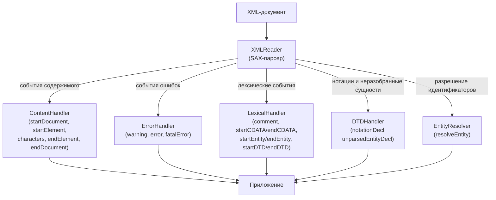
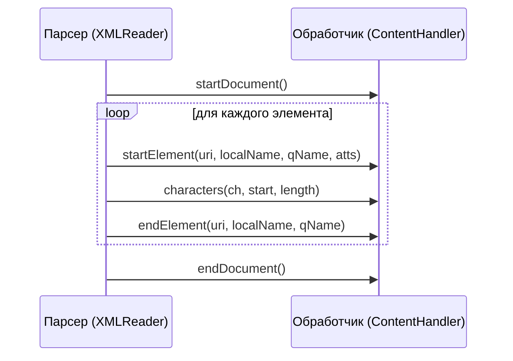

# Урок 2. Simple API for XML (SAX)

**Трейл:** JAXP · **Оригинал:** [Simple API for XML](https://docs.oracle.com/javase/tutorial/jaxp/sax/index.html)
**Связанные области:** [[17-rest-web]] · **Вопросы:** rest-web

> Перевод официального руководства Oracle (The Java Tutorials, JDK 8). Урок объединяет
> страницы трейла *Simple API for XML*: *When to Use SAX*, *Parsing an XML File Using SAX*,
> *Implementing SAX Validation*, *Handling Lexical Events*, *Using the DTDHandler and
> EntityResolver* и *Further Information*.

> Этот урок посвящён простому API для XML (Simple API for XML, SAX) — событийно-управляемому
> (event-driven) механизму последовательного (serial-access) доступа к XML-документам. Этот
> протокол часто используют сервлеты и сетевые программы, которым нужно передавать и принимать
> XML-документы, потому что на сегодня это самый быстрый и наименее требовательный к памяти
> механизм работы с XML-документами — за исключением потокового API для XML (Streaming API
> for XML, StAX).

---

**Примечание.** Если коротко, SAX ориентирован на обработку, не зависящую от состояния
(state independent processing), когда обработка элемента не зависит от элементов, встреченных
ранее. StAX, напротив, ориентирован на обработку, зависящую от состояния (state dependent
processing). Более подробное сравнение см. в разделе [Когда использовать SAX](#когда-использовать-sax).

---

Настройка программы для использования SAX требует чуть больше работы, чем настройка для
использования объектной модели документа (Document Object Model, DOM). SAX — событийно-управляемая
модель (вы предоставляете методы обратного вызова, а парсер вызывает их по мере чтения
XML-данных), и из-за этого её сложнее представлять наглядно. Наконец, вы не можете «вернуться»
к более ранней части документа или переупорядочить её — точно так же, как нельзя отмотать назад
последовательный поток данных или переставить уже прочитанные из него символы.

По этим причинам разработчики, которые пишут ориентированное на пользователя приложение,
отображающее XML-документ и, возможно, изменяющее его, предпочтут механизм DOM, описанный в
уроке [Document Object Model](../17-jaxp/03-dom.md).

Однако, даже если вы планируете создавать исключительно DOM-приложения, есть несколько важных
причин познакомиться с моделью SAX:

- **Та же обработка ошибок.** SAX и DOM API генерируют исключения одного и того же типа, поэтому
  код обработки ошибок практически идентичен.
- **Обработка ошибок валидации.** По умолчанию спецификации требуют игнорировать ошибки
  валидации. Если же вы хотите выбрасывать исключение при ошибке валидации (а вы, скорее всего,
  захотите), вам нужно понимать, как работает обработка ошибок в SAX.
- **Преобразование существующих данных.** Как вы увидите в уроке [Document Object Model](../17-jaxp/03-dom.md),
  существует механизм, который можно использовать для преобразования имеющегося набора данных
  в XML. Однако чтобы воспользоваться этим механизмом, нужно понимать модель SAX.

## Когда использовать SAX

Понимать событийную модель SAX полезно, когда вы хотите преобразовать существующие данные в XML.
Ключ к процессу преобразования — модифицировать существующее приложение так, чтобы оно
порождало события SAX по мере чтения данных.

SAX быстр и эффективен, но его событийная модель делает его наиболее полезным именно для такой
фильтрации, не зависящей от состояния. Например, SAX-парсер вызывает один метод вашего приложения,
когда встречает тег элемента, и другой метод, когда обнаруживает текст. Если выполняемая вами
обработка не зависит от состояния (то есть не зависит от ранее встреченных элементов), SAX
прекрасно подходит.

С другой стороны, для обработки, зависящей от состояния, когда программе нужно делать одно с
данными внутри элемента A и нечто другое с данными внутри элемента B, лучшим выбором будет
«вытягивающий» парсер (pull parser), такой как потоковый API для XML (Streaming API for XML, StAX).
С вытягивающим парсером вы получаете следующий узел — каким бы он ни был — в любой точке кода, где
запрашиваете его. Поэтому легко варьировать способ обработки текста (например), ведь вы можете
обрабатывать его в нескольких местах программы (подробнее см. [Дополнительная информация](#дополнительная-информация)).

SAX требует гораздо меньше памяти, чем DOM, потому что SAX не строит внутреннее представление
(древовидную структуру) XML-данных, как это делает DOM. Вместо этого SAX просто передаёт данные
приложению по мере чтения; ваше приложение затем может делать с увиденными данными всё, что
угодно.

И вытягивающие парсеры, и SAX API ведут себя подобно последовательному потоку ввода-вывода. Вы
видите данные по мере их поступления, но не можете вернуться к более ранней позиции или
перепрыгнуть вперёд к другой позиции. В целом такие парсеры хорошо работают, когда нужно просто
прочитать данные и дать приложению на них отреагировать.

Но когда нужно модифицировать структуру XML — особенно интерактивно — больше смысла имеет
структура в памяти. DOM — одна из таких моделей. Однако, хотя DOM предоставляет множество мощных
возможностей для крупномасштабных документов (таких как книги и статьи), он также требует много
сложного кода. Подробности этого процесса освещены в разделе [When to Use DOM](https://docs.oracle.com/javase/tutorial/jaxp/dom/when.html)
следующего урока.

Для более простых приложений такая сложность вполне может быть излишней. Для более быстрой
разработки и более простых приложений больше смысла может иметь один из объектно-ориентированных
стандартов программирования XML, таких как JDOM (<http://www.jdom.org>) и DOM4J
(<http://www.dom4j.org/>).

## Разбор XML-файла с помощью SAX

В реальных приложениях вы захотите использовать SAX-парсер для обработки XML-данных и выполнения
с ними чего-то полезного. В этом разделе разбирается пример JAXP-программы `SAXLocalNameCount`,
которая подсчитывает количество элементов в XML-документе, используя только компонент `localName`
(локальное имя) элемента. Имена пространств имён для простоты игнорируются. Этот пример также
показывает, как использовать SAX-обработчик ошибок `ErrorHandler`.

### Создание каркаса

Программа `SAXLocalNameCount` создаётся в файле с именем `SAXLocalNameCount.java`.

```java
public class SAXLocalNameCount {
    static public void main(String[] args) {
        // ...
    }
}
```

Поскольку вы будете запускать её автономно, вам нужен метод `main()`. И нужны аргументы командной
строки, чтобы можно было указать приложению, какой файл обрабатывать. Полный код примера находится
в файле `SAXLocalNameCount.java`.

### Импорт классов

Операторы импорта классов, которые будет использовать приложение, таковы.

```java
package sax;
import javax.xml.parsers.*;
import org.xml.sax.*;
import org.xml.sax.helpers.*;

import java.util.*;
import java.io.*;

public class SAXLocalNameCount {
    // ...
}
```

Пакет `javax.xml.parsers` содержит класс `SAXParserFactory`, создающий используемый экземпляр
парсера. Он выбрасывает `ParserConfigurationException`, если не может создать парсер,
соответствующий заданной конфигурации опций (позже вы узнаете больше о параметрах конфигурации).
Пакет `javax.xml.parsers` также содержит класс `SAXParser` — именно его фабрика возвращает для
разбора. Пакет `org.xml.sax` определяет все интерфейсы, используемые SAX-парсером. Пакет
`org.xml.sax.helpers` содержит класс `DefaultHandler`, определяющий класс, который будет
обрабатывать события SAX, порождаемые парсером. Классы из `java.util` и `java.io` нужны для
предоставления хеш-таблиц и вывода.

### Настройка ввода-вывода

Первым делом нужно обработать аргументы командной строки, которые на этом этапе служат лишь для
получения имени обрабатываемого файла. Следующий код в методе `main` сообщает приложению, какой
файл должен обработать `SAXLocalNameCount`.

```java
static public void main(String[] args) throws Exception {
    String filename = null;

    for (int i = 0; i < args.length; i++) {
        filename = args[i];
        if (i != args.length - 1) {
            usage();
        }
    }

    if (filename == null) {
        usage();
    } 
}
```

Этот код задаёт методу `main` выбрасывать `Exception`, когда возникают проблемы, и определяет
опции командной строки, необходимые, чтобы сообщить приложению имя обрабатываемого XML-файла.
Другие аргументы командной строки в этой части кода будут рассмотрены далее в уроке, когда мы
начнём разбираться с валидацией.

Строка `filename`, которую вы указываете при запуске приложения, будет преобразована в
`java.io.File`-URL внутренним методом `convertToFileURL()`. Это делает следующий код в
`SAXLocalNameCount`.

```java
public class SAXLocalNameCount {
    private static String convertToFileURL(String filename) {
        String path = new File(filename).getAbsolutePath();
        if (File.separatorChar != '/') {
            path = path.replace(File.separatorChar, '/');
        }

        if (!path.startsWith("/")) {
            path = "/" + path;
        }
        return "file:" + path;
    }

    // ...
}
```

Если при запуске программы указаны неверные аргументы командной строки, вызывается метод `usage()`
приложения `SAXLocalNameCount`, чтобы вывести на экран правильные опции.

```java
private static void usage() {
    System.err.println("Usage: SAXLocalNameCount <file.xml>");
    System.err.println("       -usage or -help = this message");
    System.exit(1);
}
```

Дополнительные опции метода `usage()` будут рассмотрены далее в уроке, когда речь зайдёт о
валидации.

### Реализация интерфейса ContentHandler

Самый важный интерфейс в `SAXLocalNameCount` — `ContentHandler`. Этот интерфейс требует ряда
методов, которые SAX-парсер вызывает в ответ на различные события разбора. Основные методы
обработки событий: `startDocument`, `endDocument`, `startElement` и `endElement`.

Проще всего реализовать этот интерфейс, расширив класс `DefaultHandler`, определённый в пакете
`org.xml.sax.helpers`. Этот класс предоставляет «пустые» методы (do-nothing) для всех событий
`ContentHandler`. Программа-пример расширяет именно этот класс.

```java
public class SAXLocalNameCount extends DefaultHandler {
    // ...
}
```

---

**Примечание.** `DefaultHandler` также определяет «пустые» методы для других основных событий,
заданных в интерфейсах `DTDHandler`, `EntityResolver` и `ErrorHandler`. Об этих методах вы
узнаете больше далее в уроке.

---

Каждый из этих методов обязан, согласно интерфейсу, выбрасывать `SAXException`. Выброшенное здесь
исключение отправляется обратно парсеру, который передаёт его коду, вызвавшему парсер.

### Обработка событий содержимого

В этом разделе показан код, обрабатывающий события `ContentHandler`.

Когда встречается открывающий или закрывающий тег, имя тега передаётся как `String` в метод
`startElement` или `endElement` соответственно. Когда встречается открывающий тег, все
определённые им атрибуты также передаются в виде списка `Attributes`. Символы, найденные внутри
элемента, передаются как массив символов вместе с числом символов (`length`) и смещением в массиве
(`offset`), указывающим на первый символ.

#### События документа

Следующий код обрабатывает события начала и конца документа:

```java
public class SAXLocalNameCount extends DefaultHandler {
    
    private Hashtable tags;

    public void startDocument() throws SAXException {
        tags = new Hashtable();
    }

    public void endDocument() throws SAXException {
        Enumeration e = tags.keys();
        while (e.hasMoreElements()) {
            String tag = (String)e.nextElement();
            int count = ((Integer)tags.get(tag)).intValue();
            System.out.println("Local Name \"" + tag + "\" occurs " 
                               + count + " times");
        }    
    }
 
    private static String convertToFileURL(String filename) {
        // ...
    }

    // ...
}
```

Этот код определяет, что делает приложение, когда парсер встречает начальную и конечную точки
разбираемого документа. Метод `startDocument()` интерфейса `ContentHandler` создаёт экземпляр
`java.util.Hashtable`, который в разделе «События элементов» будет заполнен XML-элементами,
найденными парсером в документе. Когда парсер достигает конца документа, вызывается метод
`endDocument()`, чтобы получить имена и количества элементов из хеш-таблицы и вывести на экран
сообщение, говорящее пользователю, сколько вхождений каждого элемента было найдено.

Оба этих метода `ContentHandler` выбрасывают `SAXException`. Подробнее об исключениях SAX вы
узнаете в разделе «Настройка обработки ошибок».

#### События элементов

Как упоминалось в разделе «События документа», хеш-таблицу, созданную методом `startDocument`,
нужно заполнить различными элементами, которые парсер находит в документе. Следующий код
обрабатывает событие начала элемента:

```java
public void startDocument() throws SAXException {
    tags = new Hashtable();
}

public void startElement(String namespaceURI,
                         String localName,
                         String qName, 
                         Attributes atts)
    throws SAXException {

    String key = localName;
    Object value = tags.get(key);

    if (value == null) {
        tags.put(key, new Integer(1));
    } 
    else {
        int count = ((Integer)value).intValue();
        count++;
        tags.put(key, new Integer(count));
    }
}
 
public void endDocument() throws SAXException {
    // ...
}
```

Этот код обрабатывает теги элементов, включая любые атрибуты, определённые в открывающем теге,
чтобы получить универсальный идентификатор ресурса пространства имён (namespace universal resource
identifier, URI), локальное имя и квалифицированное имя (qualified name) этого элемента. Затем
метод `startElement()` заполняет хеш-таблицу, созданную `startDocument()`, локальными именами и их
количествами для каждого типа элемента. Обратите внимание: когда вызывается метод `startElement()`,
если обработка пространств имён не включена, локальное имя элементов и атрибутов может оказаться
пустой строкой. Код обрабатывает этот случай, используя квалифицированное имя всякий раз, когда
простое имя является пустой строкой.

#### События символов

JAXP SAX API также позволяет обрабатывать символы, которые парсер передаёт вашему приложению, с
помощью метода `ContentHandler.characters()`.

---

**Примечание.** События символов не демонстрируются в примере `SAXLocalNameCount`, но краткое
описание включено в этот раздел для полноты.

---

Парсеры не обязаны возвращать какое-то конкретное число символов за один раз. Парсер может
возвращать что угодно — от одного символа за раз до нескольких тысяч — и всё равно оставаться
стандартно-соответствующей реализацией. Поэтому, если вашему приложению нужно обрабатывать
видимые им символы, разумно сделать так, чтобы метод `characters()` накапливал символы в
`java.lang.StringBuffer` и оперировал ими только тогда, когда вы уверены, что найдены все символы.

Разбор текста заканчивается, когда заканчивается элемент, поэтому обычно вы выполняете обработку
символов именно в этот момент. Но вам может понадобиться обрабатывать текст и тогда, когда элемент
начинается. Это необходимо для данных документного стиля (document-style data), которые могут
содержать XML-элементы, перемежающиеся с текстом. Например, рассмотрим такой фрагмент документа:

```xml
<para>This paragraph contains <bold>important</bold> ideas.</para>
```

Начальный текст `This paragraph contains` завершается началом элемента `<bold>`. Текст `important`
завершается закрывающим тегом `</bold>`, а финальный текст `ideas.` завершается закрывающим тегом
`</para>`.

Строго говоря, обработчик символов должен искать символы амперсанда (`&`) и левой угловой скобки
(`<`) и заменять их строками `&amp;` или `&lt;` соответственно. Это объясняется в следующем
разделе.

#### Обработка специальных символов

В XML сущность (entity) — это XML-структура (или обычный текст), у которой есть имя. Ссылка на
сущность по имени приводит к тому, что она вставляется в документ на место ссылки на сущность.
Чтобы создать ссылку на сущность, имя сущности окружают амперсандом и точкой с запятой:

```xml
&entityName;
```

Когда вы обрабатываете большие блоки XML или HTML, включающие множество специальных символов, вы
можете использовать секцию `CDATA`. Секция `CDATA` работает подобно `<code>...</code>` в HTML,
только в большей степени: все пробельные символы (white space) в секции `CDATA` значимы, а символы
в ней не интерпретируются как XML. Секция `CDATA` начинается с `<![CDATA[` и заканчивается `]]>`.

Пример секции `CDATA` показан ниже.

```xml
<p><termdef id="dt-cdsection" term="CDATA Section"<<term>CDATA sections</term> may occur anywhere character data may occur; they are used to escape blocks of text containing characters which would otherwise be recognized as markup. CDATA sections begin with the string "<code>&lt;![CDATA[</code>" and end with the string "<code>]]&gt;</code>"
```

После разбора этот текст отобразился бы так:

> CDATA sections may occur anywhere character data may occur; they are used to escape blocks of
> text containing characters which would otherwise be recognized as markup. CDATA sections begin
> with the string "`<![CDATA[`" and end with the string "`]]>`".

Существование `CDATA` делает корректный вывод XML несколько хитрым. Если выводимый текст не
находится в секции `CDATA`, то любые угловые скобки, амперсанды и другие специальные символы в
тексте следует заменить соответствующими ссылками на сущности. (Замена левых угловых скобок и
амперсандов наиболее важна; остальные символы будут интерпретированы правильно, не сбивая с толку
парсер.) Но если выводимый текст находится в секции `CDATA`, замены не должны выполняться, что даёт
текст как в более раннем примере. В простой программе вроде нашего приложения `SAXLocalNameCount`
это не особенно серьёзно. Но многие приложения, фильтрующие XML, захотят отслеживать, находится ли
текст в секции `CDATA`, чтобы правильно обрабатывать специальные символы.

### Настройка парсера

Следующий код настраивает парсер и запускает его:

```java
static public void main(String[] args) throws Exception {

    // Код разбора аргументов командной строки
    // (показан выше)
    // ...

    SAXParserFactory spf = SAXParserFactory.newInstance();
    spf.setNamespaceAware(true);
    SAXParser saxParser = spf.newSAXParser();
}
```

Эти строки кода создают экземпляр `SAXParserFactory`, определяемый настройкой системного свойства
`javax.xml.parsers.SAXParserFactory`. Создаваемая фабрика настраивается на поддержку пространств
имён XML установкой `setNamespaceAware` в `true`, а затем из фабрики получается экземпляр
`SAXParser` вызовом её метода `newSAXParser()`.

---

**Примечание.** Класс `javax.xml.parsers.SAXParser` — это обёртка (wrapper), определяющая ряд
удобных методов. Он оборачивает (несколько менее дружелюбный) объект `org.xml.sax.Parser`. При
необходимости вы можете получить этот парсер с помощью метода `getParser()` класса `SAXParser`.

---

Теперь вам нужно реализовать `XMLReader`, который должны реализовывать все парсеры. `XMLReader`
используется приложением, чтобы сообщить SAX-парсеру, какую обработку он должен выполнить над
рассматриваемым документом. `XMLReader` реализуется следующим кодом в методе `main`.

```java
// ...
SAXParser saxParser = spf.newSAXParser();
XMLReader xmlReader = saxParser.getXMLReader();
xmlReader.setContentHandler(new SAXLocalNameCount());
xmlReader.parse(convertToFileURL(filename));
```

Здесь вы получаете экземпляр `XMLReader` для вашего парсера, вызывая метод `getXMLReader()` вашего
экземпляра `SAXParser`. Затем `XMLReader` регистрирует класс `SAXLocalNameCount` в качестве своего
обработчика содержимого (content handler), так что действиями, выполняемыми парсером, будут
действия методов `startDocument()`, `startElement()` и `endDocument()`, показанных в разделе
«Обработка событий содержимого». Наконец, `XMLReader` сообщает парсеру, какой документ разбирать,
передавая ему расположение нужного XML-файла в виде File-URL, сгенерированного методом
`convertToFileURL()`, определённым в разделе «Настройка ввода-вывода».

### Настройка обработки ошибок

Вы могли бы уже начать использовать свой парсер, но безопаснее реализовать какую-то обработку
ошибок. Парсер может генерировать три вида ошибок: фатальную ошибку (fatal error), ошибку (error)
и предупреждение (warning). Когда происходит фатальная ошибка, парсер не может продолжать. Поэтому,
если приложение не генерирует исключение, его генерирует обработчик событий ошибок по умолчанию. Но
для нефатальных ошибок и предупреждений обработчик ошибок по умолчанию никогда не генерирует
исключения и не выводит сообщений.

Как показано в разделе «События документа», методы обработки событий приложения выбрасывают
`SAXException`. Например, сигнатура метода `startDocument()` в интерфейсе `ContentHandler`
определена как возвращающая `SAXException`.

```java
public void startDocument() throws SAXException { /* ... */ }
```

`SAXException` можно сконструировать, используя сообщение, другое исключение или и то и другое.

Поскольку парсер по умолчанию генерирует исключения только для фатальных ошибок и поскольку
информация об ошибках, предоставляемая парсером по умолчанию, несколько ограничена, программа
`SAXLocalNameCount` определяет собственную обработку ошибок через класс `MyErrorHandler`.

```java
xmlReader.setErrorHandler(new MyErrorHandler(System.err));

// ...

private static class MyErrorHandler implements ErrorHandler {
    private PrintStream out;

    MyErrorHandler(PrintStream out) {
        this.out = out;
    }

    private String getParseExceptionInfo(SAXParseException spe) {
        String systemId = spe.getSystemId();

        if (systemId == null) {
            systemId = "null";
        }

        String info = "URI=" + systemId + " Line=" 
            + spe.getLineNumber() + ": " + spe.getMessage();

        return info;
    }

    public void warning(SAXParseException spe) throws SAXException {
        out.println("Warning: " + getParseExceptionInfo(spe));
    }
        
    public void error(SAXParseException spe) throws SAXException {
        String message = "Error: " + getParseExceptionInfo(spe);
        throw new SAXException(message);
    }

    public void fatalError(SAXParseException spe) throws SAXException {
        String message = "Fatal Error: " + getParseExceptionInfo(spe);
        throw new SAXException(message);
    }
}
```

Так же, как в разделе «Настройка парсера», где `XMLReader` был указан на правильный обработчик
содержимого, здесь `XMLReader` указывается на новый обработчик ошибок вызовом его метода
`setErrorHandler()`.

Класс `MyErrorHandler` реализует стандартный интерфейс `org.xml.sax.ErrorHandler` и определяет
метод для получения информации об исключении, предоставляемой любыми экземплярами
`SAXParseException`, порождёнными парсером. Этот метод, `getParseExceptionInfo()`, просто получает
номер строки, на которой возникла ошибка в XML-документе, и идентификатор системы, на которой он
выполняется, вызывая стандартные методы `SAXParseException` — `getLineNumber()` и `getSystemId()`.
Эта информация об исключении затем подаётся в реализации базовых методов обработки ошибок SAX —
`error()`, `warning()` и `fatalError()`, — которые доработаны так, чтобы отправлять подходящие
сообщения о характере и местоположении ошибок в документе.

#### Обработка нефатальных ошибок

Нефатальная ошибка возникает, когда XML-документ не проходит ограничение валидности (validity
constraint). Если парсер обнаруживает, что документ невалиден, генерируется событие ошибки. Такие
ошибки генерируются валидирующим парсером (при наличии определения типа документа (document type
definition, DTD) или схемы), когда у документа есть недопустимый тег, когда тег найден там, где он
не разрешён, или (в случае схемы) когда элемент содержит недопустимые данные.

Самый важный принцип, который нужно понимать о нефатальных ошибках, — что по умолчанию они
игнорируются. Но если в документе возникает ошибка валидации, вы, вероятно, не захотите продолжать
его обработку. Скорее всего, вы захотите трактовать такие ошибки как фатальные.

Чтобы взять обработку ошибок на себя, вы переопределяете методы `DefaultHandler`, которые
обрабатывают фатальные ошибки, нефатальные ошибки и предупреждения как часть интерфейса
`ErrorHandler`. Как показано во фрагменте кода в предыдущем разделе, SAX-парсер передаёт
`SAXParseException` каждому из этих методов, поэтому сгенерировать исключение при возникновении
ошибки так же просто, как выбросить его обратно.

---

**Примечание.** Поучительно изучить методы обработки ошибок, определённые в
`org.xml.sax.helpers.DefaultHandler`. Вы увидите, что методы `error()` и `warning()` ничего не
делают, тогда как `fatalError()` выбрасывает исключение. Конечно, вы всегда можете переопределить
метод `fatalError()`, чтобы он выбрасывал другое исключение. Но если ваш код не выбрасывает
исключение при возникновении фатальной ошибки, его выбросит SAX-парсер. Этого требует спецификация
XML.

---

#### Обработка предупреждений

Предупреждения тоже по умолчанию игнорируются. Предупреждения носят информативный характер и могут
генерироваться только при наличии DTD или схемы. Например, если элемент определён в DTD дважды,
генерируется предупреждение. Это не является нарушением и не вызывает проблем, но это то, о чём вам,
возможно, хотелось бы знать, потому что это могло быть непреднамеренным. Валидация XML-документа
против DTD будет показана в разделе ниже.

### Запуск примера SAX-парсера без валидации

Следующие шаги объясняют, как запустить пример SAX-парсера без валидации.

#### Чтобы запустить пример SAXLocalNameCount без валидации

1. Сохраните файл `SAXLocalNameCount.java` в каталоге с именем `sax`.
2. Скомпилируйте файл следующим образом:

   ```
   javac sax/SAXLocalNameCount.java
   ```

3. Сохраните примеры XML-файлов `rich_iii.xml` и `two_gent.xml` в каталоге `data`.
4. Запустите программу `SAXLocalNameCount` на XML-файле.

   Выберите один из XML-файлов в каталоге `data` и запустите на нём программу `SAXLocalNameCount`.
   Здесь мы выбрали запуск программы на файле `rich_iii.xml`.

   ```
   java sax/SAXLocalNameCount data/rich_iii.xml
   ```

   XML-файл `rich_iii.xml` содержит XML-версию пьесы Уильяма Шекспира *Ричард III*. Когда вы
   запускаете на нём `SAXLocalNameCount`, вы должны увидеть следующий вывод.

   ```
   Local Name "STAGEDIR" occurs 230 times
   Local Name "PERSONA" occurs 39 times
   Local Name "SPEECH" occurs 1089 times
   Local Name "SCENE" occurs 25 times
   Local Name "ACT" occurs 5 times
   Local Name "PGROUP" occurs 4 times
   Local Name "PLAY" occurs 1 times
   Local Name "PLAYSUBT" occurs 1 times
   Local Name "FM" occurs 1 times
   Local Name "SPEAKER" occurs 1091 times
   Local Name "TITLE" occurs 32 times
   Local Name "GRPDESCR" occurs 4 times
   Local Name "P" occurs 4 times
   Local Name "SCNDESCR" occurs 1 times
   Local Name "PERSONAE" occurs 1 times
   Local Name "LINE" occurs 3696 times
   ```

   Программа `SAXLocalNameCount` разбирает XML-файл и выдаёт счётчик количества экземпляров каждого
   типа XML-тега, который он содержит.

5. **Откройте файл `data/rich_iii.xml` в текстовом редакторе.**

   Чтобы проверить, что обработка ошибок работает, удалите закрывающий тег у какой-нибудь записи в
   XML-файле, например закрывающий тег `</PERSONA>` из строки 21, показанной ниже.

   ```
   21 <PERSONA>EDWARD, Prince of Wales, afterwards King Edward V.</PERSONA>
   ```

6. **Снова запустите `SAXLocalNameCount`.**

   На этот раз вы должны увидеть следующее сообщение о фатальной ошибке.

   ```
   Exception in thread "main" org.xml.sax.SAXException: Fatal Error: URI=file:data/rich_iii.xml Line=21: The element type "PERSONA" must be terminated by the matching end-tag "</PERSONA>".
   ```

   Как видите, при обнаружении ошибки парсер сгенерировал `SAXParseException` — подкласс
   `SAXException`, который идентифицирует файл и местоположение, где произошла ошибка.

## Реализация SAX-валидации

Пример программы `SAXLocalNameCount` по умолчанию использует невалидирующий парсер, но может
активировать валидацию. Активация валидации позволяет приложению определить, содержит ли
XML-документ правильные теги и расположены ли эти теги в правильном порядке — другими словами,
является ли документ *валидным* (valid). Без активированной валидации парсер может определить лишь,
является ли документ правильно построенным (well-formed). Чтобы валидация была возможна,
XML-документ должен быть связан с DTD или XML-схемой. Оба варианта поддерживаются программой
`SAXLocalNameCount`.

### Выбор реализации парсера

Если не указан другой класс фабрики, используется класс `SAXParserFactory` по умолчанию. Чтобы
использовать парсер другого производителя, вы можете изменить значение переменной окружения,
указывающей на него, из командной строки:

```
java -Djavax.xml.parsers.SAXParserFactory=yourFactoryHere [...]
```

Имя фабрики, которое вы указываете, должно быть полностью квалифицированным именем класса (со всеми
префиксами пакетов). Подробнее см. документацию метода `newInstance()` класса `SAXParserFactory`.

### Использование валидирующего парсера

До этого момента урок концентрировался на невалидирующем парсере. В этом разделе рассматривается
валидирующий парсер, чтобы выяснить, что происходит, когда вы используете его для разбора
программы-примера.

О валидирующем парсере нужно понимать две вещи:

- Требуется схема или DTD.
- Поскольку схема или DTD присутствует, метод `ContentHandler.ignorableWhitespace()` вызывается
  всякий раз, когда это возможно.

### Игнорируемые пробельные символы

Когда присутствует DTD, парсер больше не будет вызывать метод `characters()` для пробельных
символов, о которых он знает, что они нерелевантны. С точки зрения приложения, заинтересованного в
обработке только XML-данных, это хорошо, потому что приложение никогда не беспокоят пробельные
символы, существующие исключительно для удобочитаемости XML-файла.

С другой стороны, если вы пишете приложение, фильтрующее файл XML-данных, и хотите вывести столь
же удобочитаемую версию файла, то эти пробельные символы уже не были бы нерелевантны: они были бы
существенны. Чтобы получить эти символы, вы добавили бы в своё приложение метод
`ignorableWhitespace`. Чтобы обработать любые (как правило, игнорируемые) пробельные символы,
которые видит парсер, вам нужно добавить примерно такой код для реализации обработчика события
`ignorableWhitespace`.

```java
public void ignorableWhitespace (char buf[], int start, int length) throws SAXException { 
    emit("IGNORABLE");
}
```

Этот код просто генерирует сообщение, чтобы дать вам знать, что был замечен игнорируемый пробельный
символ. Однако не все парсеры одинаковы. Спецификация SAX не требует, чтобы этот метод вызывался.
Реализация Java XML делает это всякий раз, когда это позволяет DTD.

### Настройка фабрики

`SAXParserFactory` нужно настроить так, чтобы она использовала валидирующий парсер вместо
невалидирующего по умолчанию. Следующий код из метода `main()` примера `SAXLocalNameCount`
показывает, как настроить фабрику, чтобы она реализовывала валидирующий парсер.

```java
static public void main(String[] args) throws Exception {

    String filename = null;
    boolean dtdValidate = false;
    boolean xsdValidate = false;
    String schemaSource = null;

    for (int i = 0; i < args.length; i++) {

        if (args[i].equals("-dtd")) {
            dtdValidate = true;
        }
        else if (args[i].equals("-xsd")) {
            xsdValidate = true;
        } 
        else if (args[i].equals("-xsdss")) {
            if (i == args.length - 1) {
               usage();
            }
            xsdValidate = true;
            schemaSource = args[++i];
        } 
        else if (args[i].equals("-usage")) {
            usage();
        }
        else if (args[i].equals("-help")) {
            usage();
        }
        else {
            filename = args[i];
            if (i != args.length - 1) {
                usage();
            }
        }
    }

    if (filename == null) {
        usage();
    }

    SAXParserFactory spf = SAXParserFactory.newInstance();
    spf.setNamespaceAware(true);
    spf.setValidating(dtdValidate || xsdValidate);
    SAXParser saxParser = spf.newSAXParser();

    // ... 
}
```

Здесь программа `SAXLocalNameCount` настроена так, чтобы при запуске принимать дополнительные
аргументы, которые говорят ей не выполнять валидацию, выполнять валидацию по DTD, валидацию по
определению XML-схемы (XML Schema Definition, XSD) или валидацию XSD против конкретного файла
исходной схемы. (Описания этих опций — `-dtd`, `-xsd` и `-xsdss` — также добавлены в метод
`usage()`, но здесь не показаны.) Затем фабрика настраивается так, чтобы при вызове `newSAXParser`
она производила подходящий валидирующий парсер. Как показано в разделе «Настройка парсера», вы
можете также использовать `setNamespaceAware(true)`, чтобы настроить фабрику на возврат парсера,
осведомлённого о пространствах имён (namespace-aware). Реализация Oracle поддерживает любое
сочетание параметров конфигурации. (Если конкретная реализация не поддерживает некоторое сочетание,
она обязана сгенерировать ошибку конфигурации фабрики.)

### Валидация с помощью XML-схемы

Хотя полное рассмотрение XML-схемы (XML Schema) выходит за рамки этого руководства, в данном
разделе показаны шаги, которые вы предпринимаете для валидации XML-документа с использованием
существующей схемы, написанной на языке XML Schema. Чтобы узнать больше об XML Schema, вы можете
ознакомиться с онлайн-руководством *XML Schema Part 0: Primer* на <http://www.w3.org/TR/xmlschema-0/>.

**Примечание.** Существует несколько языков определения схем, включая RELAX NG, Schematron и
стандарт W3C «XML Schema». (Даже DTD считается «схемой», хотя это единственная схема, которая не
использует синтаксис XML для описания ограничений схемы.) Однако «XML Schema» ставит перед нами
терминологическую задачу. Хотя фраза «XML Schema schema» была бы точной, мы будем использовать
фразу «определение XML Schema» (XML Schema definition), чтобы избежать видимости избыточности.

Чтобы получать уведомления об ошибках валидации в XML-документе, фабрику парсера нужно настроить на
создание валидирующего парсера, как показано в предыдущем разделе. Кроме того, должно быть верно
следующее:

- На SAX-парсере должны быть установлены соответствующие свойства.
- Должен быть установлен соответствующий обработчик ошибок.
- Документ должен быть связан со схемой.

### Установка свойств SAX-парсера

Полезно начать с определения констант, которые вы будете использовать при установке свойств.
Пример `SAXLocalNameCount` задаёт следующие константы.

```java
public class SAXLocalNameCount extends DefaultHandler {

    static final String JAXP_SCHEMA_LANGUAGE =
        "http://java.sun.com/xml/jaxp/properties/schemaLanguage";
    
    static final String W3C_XML_SCHEMA =
        "http://www.w3.org/2001/XMLSchema";

    static final String JAXP_SCHEMA_SOURCE =
        "http://java.sun.com/xml/jaxp/properties/schemaSource";
}
```

**Примечание.** Фабрику парсера нужно настроить на генерацию парсера, который осведомлён о
пространствах имён, а также является валидирующим. Это было показано в разделе «Настройка фабрики».
Больше информации о пространствах имён приведено в уроке *Document Object Model*, но пока что
поймите, что валидация по схеме — это процесс, ориентированный на пространства имён. Поскольку
JAXP-совместимые парсеры по умолчанию не осведомлены о пространствах имён, для работы валидации по
схеме необходимо установить соответствующее свойство.

Затем вы должны настроить парсер, сообщив ему, какой язык схемы использовать. В `SAXLocalNameCount`
валидация может выполняться либо против DTD, либо против XML Schema. Следующий код использует
определённые выше константы, чтобы указать язык XML Schema от W3C как тот, который нужно
использовать, если при запуске программы указана опция `-xsd`.

```java
// ...
if (xsdValidate) {
    saxParser.setProperty(JAXP_SCHEMA_LANGUAGE, W3C_XML_SCHEMA);
    // ...
}
```

В дополнение к обработке ошибок, описанной в разделе «Настройка обработки ошибок», существует одна
ошибка, которая может возникнуть при настройке парсера для валидации на основе схемы. Если парсер
не соответствует спецификации JAXP и потому не поддерживает XML Schema, он может выбросить
`SAXNotRecognizedException`. Чтобы обработать этот случай, оператор `setProperty()` оборачивается в
блок `try/catch`, как показано в коде ниже.

```java
// ...
if (xsdValidate) {
    try {
        saxParser.setProperty(JAXP_SCHEMA_LANGUAGE, W3C_XML_SCHEMA);
    }
    catch (SAXNotRecognizedException x){
        System.err.println("Error: JAXP SAXParser property not recognized: "
                           + JAXP_SCHEMA_LANGUAGE);

        System.err.println( "Check to see if parser conforms to the JAXP spec.");
        System.exit(1);
    }
}
// ...
```

### Связывание документа со схемой

Чтобы валидировать данные с использованием определения XML Schema, необходимо убедиться, что
XML-документ связан с ним. Сделать это можно двумя способами:

- Включив объявление схемы в XML-документ.
- Указав используемую схему в приложении.

**Примечание.** Когда приложение указывает используемую схему, это переопределяет любое объявление
схемы в документе.

Чтобы указать определение схемы в документе, вы создали бы XML вроде этого:

```xml
<documentRoot
    xmlns:xsi="http://www.w3.org/2001/XMLSchema-instance"
    xsi:noNamespaceSchemaLocation='YourSchemaDefinition.xsd'>
```

Первый атрибут определяет префикс пространства имён XML (`xmlns`) — `xsi`, что означает «экземпляр
XML Schema» (XML Schema instance). Вторая строка указывает схему, которую следует использовать для
элементов документа, не имеющих префикса пространства имён, а именно для элементов, которые обычно
определяются в любом простом, несложном XML-документе.

**Примечание.** Больше информации о пространствах имён включено в раздел *Validating with XML
Schema* урока *Document Object Model*. Пока что воспринимайте эти атрибуты как «магическое
заклинание», которое вы используете для валидации простого XML-файла, не использующего их. После
того как вы узнаете больше о пространствах имён, вы увидите, как использовать XML Schema для
валидации сложных документов, которые их используют. Эти идеи обсуждаются в разделе *Validating
with Multiple Namespaces* урока *Document Object Model*.

Вы также можете указать файл схемы в приложении, как это сделано в `SAXLocalNameCount`.

```java
// ...
if (schemaSource != null) {
    saxParser.setProperty(JAXP_SCHEMA_SOURCE, new File(schemaSource));
}

// ...
```

В коде выше переменная `schemaSource` соотносится с файлом исходной схемы, на который вы можете
указать приложению `SAXLocalNameCount`, запустив его с опцией `-xsdss` и указав имя используемого
файла исходной схемы.

### Обработка ошибок в валидирующем парсере

Важно осознавать, что единственная причина, по которой выбрасывается исключение, когда файл не
проходит валидацию, — это код обработки ошибок, показанный в разделе «Настройка обработки ошибок».
Этот код воспроизведён здесь в качестве напоминания:

```java
// ...

public void warning(SAXParseException spe) throws SAXException {
    out.println("Warning: " + getParseExceptionInfo(spe));
}
        
public void error(SAXParseException spe) throws SAXException {
    String message = "Error: " + getParseExceptionInfo(spe);
    throw new SAXException(message);
}

public void fatalError(SAXParseException spe) throws SAXException {
    String message = "Fatal Error: " + getParseExceptionInfo(spe);
    throw new SAXException(message);
}

// ...
```

Если эти исключения не выбрасываются, ошибки валидации просто игнорируются. В целом ошибка разбора
SAX — это ошибка валидации, хотя она может также генерироваться, если файл указывает версию XML,
которую парсер не готов обрабатывать. Помните, что ваше приложение не сгенерирует исключение
валидации, если вы не предоставите обработчик ошибок, такой как этот.

### Предупреждения DTD

Как упоминалось ранее, предупреждения генерируются только тогда, когда SAX-парсер обрабатывает DTD.
Некоторые предупреждения генерируются только валидирующим парсером. Главная цель невалидирующего
парсера — работать как можно быстрее, но он тоже генерирует некоторые предупреждения.

Спецификация XML предлагает, чтобы предупреждения генерировались в результате следующего:

- Предоставление дополнительных объявлений для сущностей, атрибутов или нотаций. (Такие объявления
  игнорируются. Используется только первое. Также обратите внимание, что дублирующие определения
  элементов всегда приводят к фатальной ошибке при валидации, как вы видели ранее.)
- Ссылка на необъявленный тип элемента. (Ошибка валидности возникает только в том случае, если
  необъявленный тип фактически используется в XML-документе. Предупреждение возникает, когда
  необъявленный элемент упоминается в DTD.)
- Объявление атрибутов для необъявленных типов элементов.

SAX-парсер Java XML также выдаёт предупреждения в других случаях:

- Отсутствие `<!DOCTYPE ...>` при валидации.
- Ссылки на неопределённую параметрическую сущность (parameter entity) при отсутствии валидации.
  (При валидации возникает ошибка. Хотя невалидирующие парсеры не обязаны читать параметрические
  сущности, парсер Java XML это делает. Поскольку это не требование, парсер Java XML генерирует
  предупреждение, а не ошибку.)
- Некоторые случаи, когда объявление кодировки символов (character-encoding declaration) выглядит
  неправильно.

### Запуск примеров SAX-парсера с валидацией

В этом разделе ранее использовавшаяся программа-пример `SAXLocalNameCount` будет использована
снова, но на этот раз она будет запущена с валидацией против XML Schema или DTD. Лучший способ
продемонстрировать различные типы валидации — изменить код разбираемого XML-файла, а также
связанной схемы и DTD так, чтобы нарушить обработку и заставить приложение сгенерировать
исключения.

### Эксперименты с ошибками валидации DTD

Как указано выше, эти примеры повторно используют программу `SAXLocalNameCount`. Расположения, где
вы найдёте пример и связанные с ним файлы, приведены в разделе «Запуск примера SAX-парсера без
валидации».

1. Если вы ещё этого не сделали, сохраните файл `SAXLocalNameCount.java` в каталоге с именем `sax`.
   Откройте файл в текстовом редакторе и внесите описанные выше изменения.

2. Если вы ещё этого не сделали, скомпилируйте файл следующим образом:

   ```
   javac sax/SAXLocalNameCount.java
   ```

3. Если вы ещё этого не сделали, сохраните примеры XML-файлов `rich_iii.xml` и `two_gent.xml` в
   каталоге `data`.

4. Запустите программу `SAXLocalNameCount` с активированной валидацией DTD.

   Для этого при запуске программы нужно указать опцию `-dtd`.

   ```
   java sax/SAXLocalNameCount -dtd data/rich_iii.xml
   ```

   Результат, который вы увидите, будет выглядеть примерно так:

   ```
   Exception in thread "main" org.xml.sax.SAXException:
   Error: URI=file:data/rich_iii.xml 
   Line=4: Document is invalid: no grammar found.
   ```

   Это сообщение говорит, что нет грамматики, против которой можно было бы валидировать документ
   `rich_iii.xml`, поэтому он автоматически невалиден. Другими словами, сообщение говорит, что вы
   пытаетесь валидировать документ, но никакой DTD не был объявлен, потому что отсутствует
   объявление `DOCTYPE`. Так что теперь вы знаете, что DTD — это требование для валидного документа.
   Это имеет смысл.

5. Сохраните пример DTD-файла `play.dtd` в каталоге `data`.

6. Откройте файл `data/rich_iii.xml` в текстовом редакторе. Вставьте следующее объявление
   `DOCTYPE` в начало `data/rich_iii.xml`. (Объявление указывает валидирующему парсеру на DTD-файл
   `play.dtd`. Если валидация DTD активирована, структура разбираемого XML-файла будет проверяться
   против структуры, предоставленной в `play.dtd`.)

   ```xml
   <!DOCTYPE PLAY SYSTEM "play.dtd">
   ```

   Не забудьте сохранить изменение, но оставьте файл открытым, так как он понадобится снова позже.

7. Вернитесь к `data/rich_iii.xml` и измените теги для персонажа «KING EDWARD The Fourth» в
   строке 18.

   Измените открывающий и закрывающий теги с `<PERSONA>` и `</PERSONA>` на `<PERSON>` и `</PERSON>`.
   Строка 18 теперь должна выглядеть так:

   ```xml
   18:<PERSON>KING EDWARD The Fourth</PERSON>
   ```

   Снова не забудьте сохранить изменение и оставьте файл открытым.

8. Запустите программу `SAXLocalNameCount` с активированной валидацией DTD.

   На этот раз при запуске программы вы увидите другую ошибку:

   ```
   java sax/SAXLocalNameCount -dtd data/rich_iii.xml
   Exception in thread "main" org.xml.sax.SAXException: 
   Error: URI=file:data/rich_iii.xml 
   Line=26: Element type "PERSON" must be declared.
   ```

   Здесь видно, что парсер возразил против элемента, который не включён в DTD `data/play.dtd`.

9. В `data/rich_iii.xml` исправьте теги для «KING EDWARD The Fourth».

   Верните открывающий и закрывающий теги к их исходным версиям — `<PERSONA>` и `</PERSONA>`.

10. В `data/rich_iii.xml` удалите `<TITLE>Dramatis Personae</TITLE>` из строки 16.

    И снова не забудьте сохранить изменение.

11. Запустите программу `SAXLocalNameCount` с активированной валидацией DTD.

    Как и раньше, вы увидите ещё одну ошибку валидации:

    ```
    java sax/SAXLocalNameCount -dtd data/rich_iii.xml
    Exception in thread "main" org.xml.sax.SAXException: 
    Error: URI=file:data/rich_iii.xml 
    Line=77: The content of element type "PERSONAE" must match "(TITLE,(PERSONA|PGROUP)+)".
    ```

    Удалив элемент `<TITLE>` из строки 16, вы сделали элемент `<PERSONAE>` невалидным, потому что он
    не содержит подэлементов, которых DTD ожидает от элемента `<PERSONAE>`. Обратите внимание, что
    в сообщении об ошибке говорится, что ошибка в строке 77 файла `data/rich_iii.xml`, хотя вы
    удалили элемент `<TITLE>` из строки 16. Это потому, что закрывающий тег элемента `<PERSONAE>`
    расположен в строке 77, и парсер выбрасывает исключение только тогда, когда достигает конца
    разбираемого элемента.

12. Откройте DTD-файл `data/play.dtd` в текстовом редакторе.

    В DTD-файле вы можете увидеть объявление элемента `<PERSONAE>`, а также всех остальных
    элементов, которые могут использоваться в XML-документах, соответствующих DTD пьесы. Объявление
    `<PERSONAE>` выглядит так.

    ```dtd
    <!ELEMENT PERSONAE (TITLE, (PERSONA | PGROUP)+)>
    ```

    Как видите, элемент `<PERSONAE>` требует подэлемента `<TITLE>`. Клавиша вертикальной черты (`|`)
    означает, что в элемент `<PERSONAE>` могут быть включены либо подэлементы `<PERSONA>`, либо
    `<PGROUP>`, а клавиша «плюс» (`+`) после группировки `(PERSONA | PGROUP)` означает, что должен
    быть включён хотя бы один или более любого из этих подэлементов.

13. Добавьте клавишу «знак вопроса» (`?`) после `TITLE` в объявлении `<PERSONAE>`.

    Добавление знака вопроса к объявлению подэлемента в DTD делает наличие одного экземпляра этого
    подэлемента необязательным.

    ```dtd
    <!ELEMENT PERSONAE (TITLE?, (PERSONA | PGROUP)+)>
    ```

    Если бы вы добавили звёздочку (`*`) после элемента, вы могли бы включать ноль или несколько
    экземпляров этого подэлемента. Однако в данном случае не имеет смысла иметь более одного
    заголовка в разделе документа.

    Не забудьте сохранить изменение, внесённое в `data/play.dtd`.

14. Запустите программу `SAXLocalNameCount` с активированной валидацией DTD.

    ```
    java sax/SAXLocalNameCount -dtd data/rich_iii.xml
    ```

    На этот раз вы должны увидеть правильный вывод `SAXLocalNameCount`, без ошибок.

### Эксперименты с ошибками валидации по схеме

Предыдущее упражнение продемонстрировало использование `SAXLocalNameCount` для валидации XML-файла
против DTD. В этом упражнении вы будете использовать `SAXLocalNameCount` для валидации другого
XML-файла против как стандартного определения XML Schema, так и пользовательского файла исходной
схемы. И снова этот тип валидации будет продемонстрирован путём нарушения процесса разбора через
изменение XML-файла и схемы так, чтобы парсер выбрасывал ошибки.

Как указано выше, эти примеры повторно используют программу `SAXLocalNameCount`. Расположения, где
вы найдёте пример и связанные с ним файлы, приведены в разделе «Запуск примера SAX-парсера без
валидации».

1. Если вы ещё этого не сделали, сохраните файл `SAXLocalNameCount.java` в каталоге с именем `sax`.
   Откройте файл в текстовом редакторе и внесите описанные выше изменения.

2. Если вы ещё этого не сделали, скомпилируйте файл следующим образом:

   ```
   javac sax/SAXLocalNameCount.java
   ```

3. Сохраните пример XML-файла `personal-schema.xml` в каталоге `data`, а затем откройте его в
   текстовом редакторе.

   Это простой XML-файл, который предоставляет имена и контактные данные сотрудников небольшой
   компании. В этом XML-файле вы увидите, что он связан с файлом определения схемы `personal.xsd`.

   ```xml
   <personnel xmlns:xsi="http://www.w3.org/2001/XMLSchema-instance" xsi:noNamespaceSchemaLocation='personal.xsd'>
   ```

4. Сохраните пример XSD-файла схемы `personal.xsd` в каталоге `data`, а затем откройте его в
   текстовом редакторе.

   Эта схема определяет, какая информация требуется о каждом сотруднике, чтобы связанный со схемой
   XML-документ считался валидным. Например, изучив определение схемы, вы можете увидеть, что
   каждый элемент `person` требует имени (`name`) и что имя каждого человека должно состоять из
   фамилии (`family`) и личного имени (`given`). У сотрудников также могут быть необязательные
   адреса электронной почты и URL-адреса.

5. В `data/personal.xsd` измените минимальное число адресов электронной почты, требуемое для
   элемента `person`, с 0 на 1.

   Объявление элемента `email` теперь выглядит следующим образом.

   ```xml
   <xs:element ref="email" minOccurs='1' maxOccurs='unbounded'/>
   ```

6. В `data/personal-schema.xml` удалите элемент `email` из элемента `person` `one.worker`.

   Worker One теперь выглядит так:

   ```xml
   <person id="one.worker">
     <name><family>Worker</family> <given>One</given></name>
     <link manager="Big.Boss"/>
   </person>
   ```

7. Запустите `SAXLocalNameCount` против `personal-schema.xml` без валидации по схеме.

   ```
   java sax/SAXLocalNameCount data/personal-schema.xml
   ```

   `SAXLocalNameCount` сообщает вам, сколько раз встречается каждый элемент в `personal-schema.xml`.

   ```
   Local Name "email" occurs 5 times
   Local Name "name" occurs 6 times
   Local Name "person" occurs 6 times
   Local Name "family" occurs 6 times
   Local Name "link" occurs 6 times
   Local Name "personnel" occurs 1 times
   Local Name "given" occurs 6 times
   ```

   Вы видите, что `email` встречается только пять раз, тогда как в `personal-schema.xml` шесть
   элементов `person`. Поэтому, поскольку мы задали минимальное число вхождений элемента `email`
   равным 1 на элемент `person`, мы знаем, что этот документ невалиден. Однако, поскольку
   `SAXLocalNameCount` не было указано выполнять валидацию по схеме, никакая ошибка не сообщается.

8. Запустите `SAXLocalNameCount` снова, на этот раз указав, что документ `personal-schema.xml`
   должен быть провалидирован против определения схемы `personal.xsd`.

   Как вы видели в разделе «Валидация с помощью XML-схемы» выше, у `SAXLocalNameCount` есть опция
   для включения валидации по схеме. Запустите `SAXLocalNameCount` следующей командой.

   ```
   java sax/SAXLocalNameCount -xsd data/personal-schema.xml
   ```

   На этот раз вы увидите следующее сообщение об ошибке.

   ```
   Exception in thread "main" org.xml.sax.SAXException: Error: 
   URI=file:data/personal-schema.xml 
   Line=14: cvc-complex-type.2.4.a: Invalid content was found starting with 
   element 'link'. 
   One of '{email}' is expected.
   ```

9. Восстановите элемент `email` в элементе `person` `one.worker`.

10. Запустите `SAXLocalNameCount` в третий раз, снова указав, что документ `personal-schema.xml`
    должен быть провалидирован против определения схемы `personal.xsd`.

    ```
    java sax/SAXLocalNameCount -xsd data/personal-schema.xml
    ```

    На этот раз вы увидите правильный вывод, без ошибок.

11. Снова откройте `personal-schema.xml` в текстовом редакторе.

12. Удалите объявление определения схемы `personal.xsd` из элемента `personnel`.

    Удалите выделенный курсивом код из элемента `personnel`.

    ```xml
    <personnel xmlns:xsi="http://www.w3.org/2001/XMLSchema-instance" xsi:noNamespaceSchemaLocation='personal.xsd'/>
    ```

13. Запустите `SAXLocalNameCount`, снова указав валидацию по схеме.

    ```
    java sax/SAXLocalNameCount -xsd data/personal-schema.xml
    ```

    Очевидно, это не сработает, так как определение схемы, против которого нужно валидировать
    XML-файл, не было объявлено. Вы увидите следующую ошибку.

    ```
    Exception in thread "main" org.xml.sax.SAXException: 
    Error: URI=file:data/personal-schema.xml 
    Line=2: cvc-elt.1: Cannot find the declaration of element 'personnel'.
    ```

14. Запустите `SAXLocalNameCount` снова, на этот раз передав ему файл определения схемы в командной
    строке.

    ```
    java sax/SAXLocalNameCount -xsdss data/personal.xsd data/personal-schema.xml
    ```

    На этот раз вы используете опцию `SAXLocalNameCount`, которая позволяет указать определение
    схемы, не зашитое жёстко в приложение. Вы должны увидеть правильный вывод.

## Обработка лексических событий

К этому моменту вы усвоили множество концепций XML, включая DTD и внешние сущности (external
entities). Вы также освоились с SAX-парсером. Остальная часть урока охватывает продвинутые темы,
которые вам нужно понимать только в том случае, если вы пишете приложения на основе SAX. Если ваша
главная цель — писать приложения на основе DOM, вы можете пропустить вперёд к уроку
[Document Object Model](../17-jaxp/03-dom.md).

Ранее вы видели, что при выводе текста в виде XML вам нужно знать, находитесь ли вы в секции
`CDATA`. Если да, то угловые скобки (`<`) и амперсанды (`&`) следует выводить без изменений. Но
если вы не в секции `CDATA`, их следует заменять предопределёнными сущностями `&lt;` и `&amp;`. Но
как узнать, обрабатываете ли вы секцию `CDATA`?

Опять же, если вы каким-то образом фильтруете XML, вы хотите передавать комментарии дальше. Обычно
парсер игнорирует комментарии. Как получить комментарии, чтобы их можно было воспроизвести?

Этот раздел отвечает на эти вопросы. Он показывает, как использовать `org.xml.sax.ext.LexicalHandler`
для идентификации комментариев, секций `CDATA` и ссылок на разобранные сущности (parsed entities).

Комментарии, теги `CDATA` и ссылки на разобранные сущности составляют лексическую информацию
(lexical information) — то есть информацию, которая касается текста самого XML, а не информационного
содержимого XML. Большинство приложений, разумеется, заботит только содержимое XML-документа. Такие
приложения не будут использовать API `LexicalEventListener`. Но приложения, которые выводят
XML-текст, найдут его бесценным.

---

**Примечание.** Обработка лексических событий — это необязательная возможность парсера. Реализации
парсеров не обязаны её поддерживать. (Эталонная реализация её поддерживает.) В этом обсуждении
предполагается, что ваш парсер её поддерживает.

---

### Как работает LexicalHandler

Чтобы получать информацию о том, когда SAX-парсер видит лексическую информацию, вы настраиваете
`XmlReader`, лежащий в основе парсера, с помощью `LexicalHandler`. Интерфейс `LexicalHandler`
определяет следующие методы обработки событий.

`comment(String comment)`

Передаёт комментарии приложению.

`startCDATA()`, `endCDATA()`

Сообщают, когда секция `CDATA` начинается и заканчивается, что говорит вашему приложению, символы
какого рода ожидать при следующем вызове `characters()`.

`startEntity(String name)`, `endEntity(String name)`

Дают имя разобранной сущности.

`startDTD(String name, String publicId, String systemId)`, `endDTD()`

Сообщают, когда обрабатывается DTD, и идентифицируют его.

Чтобы активировать лексический обработчик, ваше приложение должно расширить `DefaultHandler` и
реализовать интерфейс `LexicalHandler`. Затем вы должны настроить ваш экземпляр `XMLReader`,
которому делегирует парсер, и настроить его на отправку лексических событий вашему лексическому
обработчику, как показано ниже.

```java
// ...

SAXParser saxParser = factory.newSAXParser();
XMLReader xmlReader = saxParser.getXMLReader();
xmlReader.setProperty("http://xml.org/sax/properties/lexical-handler",
                      handler); 
// ...
```

Здесь вы настраиваете `XMLReader`, используя метод `setProperty()`, определённый в классе
`XMLReader`. Имя свойства, определённое как часть стандарта SAX, — это URN
`http://xml.org/sax/properties/lexical-handler`.

Наконец, добавьте примерно такой код, чтобы определить соответствующие методы, которые реализуют
интерфейс.

```java
// ...

public void warning(SAXParseException err) {
    // ...
}

public void comment(char[] ch, int start, int length) throws SAXException {
    // ...   
}

public void startCDATA() throws SAXException {
    // ...
}

public void endCDATA() throws SAXException {
    // ...
}

public void startEntity(String name) throws SAXException {
    // ...
}

public void endEntity(String name) throws SAXException {
    // ...
}

public void startDTD(String name, String publicId, String systemId)
    throws SAXException {
    // ...
}

public void endDTD() throws SAXException {
    // ...
}

private void echoText() {
    // ...
}

// ...
```

Этот код превратит ваше приложение для разбора в лексический обработчик. Всё, что остаётся
сделать, — это дать каждому из этих новых методов действие для выполнения.

## Использование DTDHandler и EntityResolver

В этом разделе представлены два оставшихся обработчика событий SAX: `DTDHandler` и `EntityResolver`.
`DTDHandler` вызывается, когда DTD встречает неразобранную сущность (unparsed entity) или объявление
нотации (notation declaration). `EntityResolver` вступает в игру, когда URN (публичный
идентификатор, public ID) должен быть разрешён в URL (системный идентификатор, system ID).

### API DTDHandler

В разделе [Выбор реализации парсера](#выбор-реализации-парсера) был показан метод ссылки на файл,
содержащий двоичные данные, такой как файл изображения, с использованием типов данных MIME. Это
самый простой и расширяемый механизм. Однако для совместимости с более старыми данными в стиле SGML
также возможно определить неразобранную сущность.

Ключевое слово `NDATA` определяет неразобранную сущность:

```dtd
<!ENTITY myEntity SYSTEM "..URL.." NDATA gif>
```

Ключевое слово `NDATA` говорит, что данные в этой сущности — это не разбираемые XML-данные, а данные,
использующие какую-то иную нотацию. В данном случае нотация называется `gif`. DTD должен затем
включать объявление для этой нотации, которое выглядело бы примерно так.

```dtd
<!NOTATION gif SYSTEM "..URL..">
```

Когда парсер видит неразобранную сущность или объявление нотации, он ничего не делает с этой
информацией, кроме как передаёт её приложению с помощью интерфейса `DTDHandler`. Этот интерфейс
определяет два метода.

- `notationDecl(String name, String publicId, String systemId)`
- `unparsedEntityDecl(String name, String publicId, String systemId, String notationName)`

Методу `notationDecl` передаётся имя нотации и либо публичный, либо системный идентификатор, либо
оба — в зависимости от того, что объявлено в DTD. Методу `unparsedEntityDecl` передаётся имя
сущности, соответствующие идентификаторы и имя используемой ею нотации.

---

**Примечание.** Интерфейс `DTDHandler` реализуется классом `DefaultHandler`.

---

Нотации также могут использоваться в объявлениях атрибутов. Например, следующее объявление требует
нотаций для форматов файлов изображений GIF и PNG.

```dtd
<!ENTITY image EMPTY>
<!ATTLIST image ...  type  NOTATION  (gif | png) "gif">
```

Здесь тип объявлен как `gif` либо `png`. По умолчанию, если ни один не указан, используется `gif`.

Независимо от того, используется ли ссылка на нотацию для описания неразобранной сущности или
атрибута, выполнять соответствующую обработку должно приложение. Парсер вообще ничего не знает о
семантике нотаций. Он лишь передаёт объявления.

### API EntityResolver

API `EntityResolver` позволяет преобразовать публичный идентификатор (URN) в системный идентификатор
(URL). Вашему приложению это может понадобиться, например, чтобы преобразовать что-то вроде
`href="urn:/someName"` в `"http://someURL"`.

Интерфейс `EntityResolver` определяет единственный метод:

```java
resolveEntity(String publicId, String systemId)
```

Этот метод возвращает объект `InputSource`, который можно использовать для доступа к содержимому
сущности. Преобразовать URL в `InputSource` довольно просто. Но URL, передаваемый в качестве
системного идентификатора, будет местоположением исходного документа, который, скорее всего,
находится где-то в вебе. Чтобы получить доступ к локальной копии, если она есть, вы должны
поддерживать где-то в системе каталог (catalog), который сопоставляет имена (публичные
идентификаторы) с локальными URL-адресами.

## Дополнительная информация

Следующие ссылки предоставляют дополнительную полезную информацию о технологиях, представленных в
этом уроке.

- Дополнительную информацию о стандарте SAX см. на **странице стандарта SAX**:

  <http://www.saxproject.org>.

- Подробнее о вытягивающем парсере StAX см.:

  Страница Java Community Process:

  <http://jcp.org/en/jsr/detail?id=173>.

  Введение Эллиота Расти Гарольда (Elliot Rusty Harold):

  <http://www.xml.com/pub/a/2003/09/17/stax.html>.

- Подробнее о механизмах валидации на основе схем см.:

  Стандартный механизм валидации W3C — XML Schema:

  <http://www.w3.org/XML/Schema>.

  Механизм валидации RELAX NG, основанный на регулярных выражениях:

  [Oasis Relax NG TC](https://www.oasis-open.org/committees/tc_home.php?wg_abbrev=relax-ng).

  Механизм валидации Schematron, основанный на утверждениях (assertions):

  <http://www.ascc.net/xml/resource/schematron/schematron.html>.

## Схема событийной обработки SAX

SAX работает как событийно-управляемый конвейер: парсер читает XML последовательно и для каждого
встреченного синтаксического объекта вызывает соответствующий метод обратного вызова вашего
обработчика.



Типичная последовательность событий содержимого при разборе одного документа:



## Источник

- [Lesson: Simple API for XML](https://docs.oracle.com/javase/tutorial/jaxp/sax/index.html) — официальное руководство Oracle.
- [When to Use SAX](https://docs.oracle.com/javase/tutorial/jaxp/sax/when.html)
- [Parsing an XML File Using SAX](https://docs.oracle.com/javase/tutorial/jaxp/sax/parsing.html)
- [Implementing SAX Validation](https://docs.oracle.com/javase/tutorial/jaxp/sax/validation.html)
- [Handling Lexical Events](https://docs.oracle.com/javase/tutorial/jaxp/sax/events.html)
- [Using the DTDHandler and EntityResolver](https://docs.oracle.com/javase/tutorial/jaxp/sax/using.html)
- [Further Information](https://docs.oracle.com/javase/tutorial/jaxp/sax/info.html)
