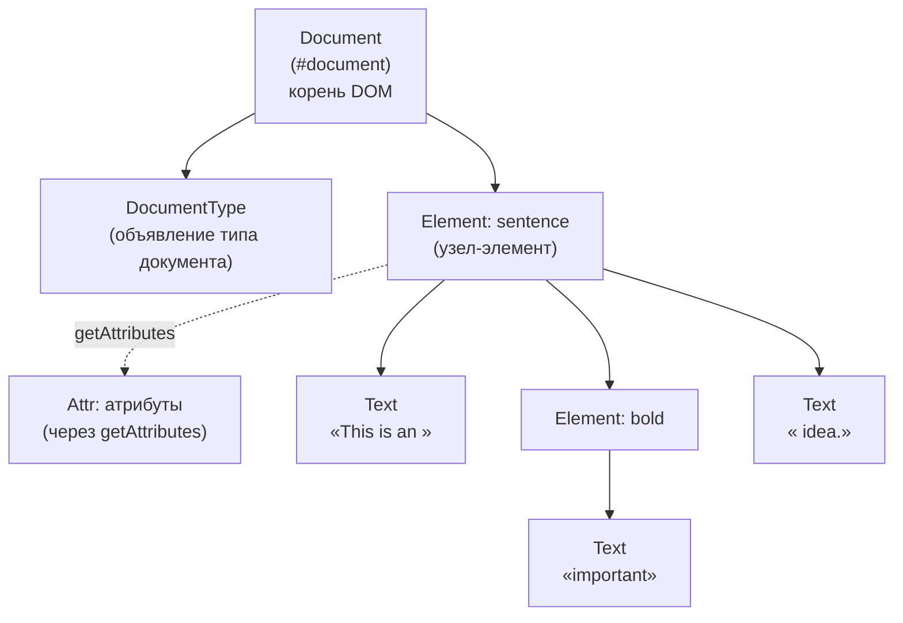

# Урок 3. Document Object Model (DOM)

**Трейл:** JAXP · **Оригинал:** [Document Object Model](https://docs.oracle.com/javase/tutorial/jaxp/dom/index.html)
**Связанные области:** [[17-rest-web]] · **Вопросы:** rest-web

> Перевод официального руководства Oracle (The Java Tutorials, JDK 8). Объединяет страницы
> *Document Object Model*, *When to Use DOM*, *Reading XML Data into a DOM*,
> *Validating with XML Schema* и *Further Information* трейла *Java API for XML Processing (JAXP)*.

> **Примечание.** Руководство The Java Tutorials написано для JDK 8. Примеры и практики,
> описанные здесь, не учитывают улучшений, появившихся в более поздних выпусках, и могут
> использовать технологии, которых больше нет. Актуальные руководства см. на [Dev.java](https://dev.java/).

Этот урок знакомит с объектной моделью документа (Document Object Model, DOM). DOM — это
стандартная **древовидная структура** (tree structure), в которой каждый узел (node) содержит один
из компонентов XML-структуры. Два самых распространённых типа узлов — узлы-элементы (element
nodes) и текстовые узлы (text nodes). Функции DOM позволяют создавать узлы, удалять узлы, изменять
их содержимое и обходить иерархию узлов.

Примеры урока показывают, как разобрать (parse) существующий XML-файл, чтобы построить DOM,
отобразить и исследовать иерархию DOM, а также разобраться в синтаксисе пространств имён
(namespaces). Кроме того, показано, как создать DOM «с нуля».

## Когда использовать DOM (When to Use DOM)

> Перевод страницы [When to Use DOM](https://docs.oracle.com/javase/tutorial/jaxp/dom/when.html).

Стандарт DOM языково-нейтрален (language-neutral) и был спроектирован для использования с самыми
разными языками программирования — например, C и Perl. Поэтому он не всегда оптимально подходит
именно для Java.

### Документы против данных (Documents Versus Data)

Стандарт DOM был задуман в первую очередь для работы с **документами** (documents) — статьями,
книгами и подобными текстами. В таких документах структура и порядок следования значимы, а текст и
элементы свободно перемешиваются. Если же ваш XML описывает простую **структуру данных** — например,
адресную книгу, — то для Java зачастую удобнее альтернативные модели, такие как JDOM или dom4j,
а иногда достаточно и регулярных выражений.

### Модель смешанного содержимого (Mixed-Content Model)

Главная особенность и одновременно сложность DOM — **модель смешанного содержимого**
(mixed-content model): текст и элементы могут свободно чередоваться в иерархии. Рассмотрите пример:

```xml
<sentence>This is an <bold>important</bold> idea.</sentence>
```

Здесь предложение состоит из текста, прерванного элементом `<bold>`, после которого снова идёт
текст. Узлы DOM устроены просто: узел-элемент не содержит данные напрямую — данные хранятся в
дочерних узлах. Поэтому, чтобы извлечь текст такого предложения, приходится обходить несколько
дочерних узлов (текстовые узлы, узел `<bold>` и т. д.), а не просто вызывать один метод вроде
`text()`, как это сделано в JDOM или dom4j для простых структур.

### Более простая модель (A Simpler Model)

Для несложных структур данных модели JDOM и dom4j удобнее: они дают прямой доступ к содержимому
элемента, без необходимости разбираться с промежуточными текстовыми узлами. Если приложение
обрабатывает простую, предсказуемую структуру (как адресная книга), такие модели проще в
использовании.

### Рост сложности (Increasing the Complexity)

DOM обязан учитывать всё богатство синтаксиса XML, поэтому в дереве могут встречаться узлы многих
типов: ссылки на сущности (entity references), секции CDATA, инструкции обработки (processing
instructions) и комментарии (comments). Это делает обход дерева более сложным, но зато обеспечивает
полное и точное представление документа.

### Выбор модели (Choosing Your Model)

DOM стоит выбирать, когда:

- вы работаете с документами, в которых текст и элементы перемешаны;
- приложение сложное и гибкое, и важна точная структура;
- требуется проверка по XML-схеме (XML Schema);
- нужна совместимость со стандартом W3C и переносимость между языками.

Для простых структур данных рассмотрите JDOM, dom4j или другие, более лёгкие подходы.

## Чтение XML-данных в DOM (Reading XML Data into a DOM)

> Перевод страницы [Reading XML Data into a DOM](https://docs.oracle.com/javase/tutorial/jaxp/dom/readingXML.html).

В этом разделе строится приложение (в руководстве оно называется `DOMEcho`), которое читает XML-файл
в DOM и затем выводит его обратно, попутно показывая структуру дерева.

### Импорт классов JAXP и W3C DOM

```java
import javax.xml.parsers.DocumentBuilder;
import javax.xml.parsers.DocumentBuilderFactory;

import org.xml.sax.ErrorHandler;
import org.xml.sax.SAXException;
import org.xml.sax.SAXParseException;
import org.xml.sax.helpers.*;

import java.io.File;
import java.io.OutputStreamWriter;
import java.io.PrintWriter;

import org.w3c.dom.Document;
import org.w3c.dom.DocumentType;
import org.w3c.dom.Entity;
import org.w3c.dom.NamedNodeMap;
import org.w3c.dom.Node;
```

Классы `DocumentBuilderFactory` и `DocumentBuilder` относятся к JAXP. Интерфейсы `Document`, `Node`,
`Entity` и др. определены стандартом W3C DOM в пакете `org.w3c.dom`. Обработка ошибок выполняется
через интерфейс `ErrorHandler` из SAX.

### Обработка ошибок (Error Handling)

Для разбора используется обработчик ошибок SAX. Реализация интерфейса `ErrorHandler` определяет три
метода — `warning`, `error` и `fatalError`:

```java
private static class MyErrorHandler implements ErrorHandler {

    private PrintWriter out;

    MyErrorHandler(PrintWriter out) {
        this.out = out;
    }

    private String getParseExceptionInfo(SAXParseException spe) {
        String systemId = spe.getSystemId();
        if (systemId == null) {
            systemId = "null";
        }

        String info = "URI=" + systemId + " Line=" + spe.getLineNumber() +
                      ": " + spe.getMessage();
        return info;
    }

    public void warning(SAXParseException spe) throws SAXException {
        out.println("Warning: " + getParseExceptionInfo(spe));
    }

    public void error(SAXParseException spe) throws SAXException {
        String message = "Error: " + getParseExceptionInfo(spe);
        throw new SAXException(message);
    }

    public void fatalError(SAXParseException spe) throws SAXException {
        String message = "Fatal Error: " + getParseExceptionInfo(spe);
        throw new SAXException(message);
    }
}
```

### Создание фабрики и парсера, разбор файла

Получаем фабрику `DocumentBuilderFactory`, настраиваем её, создаём `DocumentBuilder`, назначаем
обработчик ошибок и разбираем файл — в результате получаем объект `Document` (корень DOM):

```java
DocumentBuilderFactory dbf = DocumentBuilderFactory.newInstance();
dbf.setNamespaceAware(true);
dbf.setValidating(dtdValidate || xsdValidate);

DocumentBuilder db = dbf.newDocumentBuilder();
OutputStreamWriter errorWriter = new OutputStreamWriter(System.err,
                                         outputEncoding);
db.setErrorHandler(new MyErrorHandler(new PrintWriter(errorWriter, true)));
Document doc = db.parse(new File(filename));
```

Минимальный вариант (без настройки) выглядит так:

```java
DocumentBuilderFactory dbf = DocumentBuilderFactory.newInstance();
DocumentBuilder db = dbf.newDocumentBuilder();
Document doc = db.parse(new File(filename));
```

### Настройка фабрики (Configuring the Factory)

Фабрику можно настроить несколькими способами:

- **Учёт пространств имён** (namespace awareness): `dbf.setNamespaceAware(true)`;
- **Проверка по DTD** (DTD validation): `dbf.setValidating(true)`;
- **Проверка по XML-схеме** (XSD validation) — через установку соответствующего атрибута источника
  схемы (см. раздел «Проверка по XML-схеме» ниже).

### Лексический контроль (Lexical Controls)

Несколько методов `DocumentBuilderFactory` управляют тем, насколько подробно DOM сохраняет
синтаксис XML. По умолчанию все они возвращают `false` — то есть вся лексическая информация
сохраняется. Если установить значение `true`, строится максимально простой DOM, отражающий лишь
семантическое содержимое:

| Метод | Назначение |
|-------|-----------|
| `setCoalescing()` | Преобразовывать узлы CDATA в текстовые узлы и присоединять к соседнему текстовому узлу (если он есть). |
| `setExpandEntityReferences()` | Раскрывать узлы-ссылки на сущности (entity reference). |
| `setIgnoringComments()` | Игнорировать комментарии. |
| `setIgnoringElementContentWhitespace()` | Игнорировать пробелы, не являющиеся значимой частью содержимого элемента. |

Пример применения:

```java
dbf.setIgnoringComments(ignoreComments);
dbf.setIgnoringElementContentWhitespace(ignoreWhitespace);
dbf.setCoalescing(putCDATAIntoText);
dbf.setExpandEntityReferences(!createEntityRefs);
```

### Типы узлов и иерархия узлов (Hierarchy of Nodes)

В DOM каждый узел имеет тип. В таблице ниже перечислены типы узлов и то, что возвращает для них
`getNodeName()` (свойство `nodeName`):

| Тип узла | `nodeName` |
|----------|-----------|
| `Attr` (атрибут) | имя атрибута |
| `CDATASection` (секция CDATA) | `#cdata-section` |
| `Comment` (комментарий) | `#comment` |
| `Document` (документ) | `#document` |
| `DocumentFragment` (фрагмент документа) | `#documentFragment` |
| `DocumentType` (тип документа) | имя типа документа |
| `Element` (элемент) | имя тега |
| `Entity` (сущность) | имя сущности |
| `EntityReference` (ссылка на сущность) | имя сущности, на которую ссылаются |
| `Notation` (нотация) | имя нотации |
| `ProcessingInstruction` (инструкция обработки) | цель (target) |
| `Text` (текст) | `#text` |

Иерархия узлов DOM на примере фрагмента `<sentence>This is an <bold>important</bold>
idea.</sentence>` и сопутствующих атрибутов/сущностей:

<!-- original: none | Авторская схема дерева узлов DOM; оригинальная фигура на страницах Oracle отсутствует -->


> **Примечание.** Текстовые узлы (text nodes) находятся **под** узлами-элементами (element nodes) в
> DOM, и данные всегда хранятся в текстовых узлах. Пожалуй, самая частая ошибка при работе с DOM —
> перейти к узлу-элементу и ожидать, что он содержит данные. Это не так! Даже у простейшего
> узла-элемента есть текстовый узел под ним, который и содержит данные.

Узлы-атрибуты (`Attr`) и узлы-сущности (`Entity`) не являются обычными дочерними узлами в дереве —
к ним обращаются отдельно, через методы `getAttributes()` и `getEntities()` (на схеме связь к
атрибутам показана пунктиром).

### Обход узлов (Traversing Nodes)

Интерфейс `org.w3c.dom.Node` определяет ряд методов для обхода узлов, включая `getFirstChild`,
`getLastChild`, `getNextSibling`, `getPreviousSibling` и `getParentNode`. Этих операций достаточно,
чтобы из любой точки дерева добраться до любой другой. Дополнительно используются `getChildNodes()`
(возвращает `NodeList` дочерних узлов) и `hasChildNodes()`.

Типичный шаблон обхода всех потомков узла:

```java
for (Node child = n.getFirstChild(); child != null;
     child = child.getNextSibling()) {
    echo(child);
}
```

### Получение содержимого узла (Obtaining Node Content)

Поскольку данные хранятся в текстовых узлах, для получения текста элемента нужно обойти его
потомков и собрать содержимое текстовых узлов, секций CDATA и (рекурсивно) ссылок на сущности:

```java
public String getText(Node node) {
    StringBuffer result = new StringBuffer();
    if (! node.hasChildNodes()) return "";

    NodeList list = node.getChildNodes();
    for (int i = 0; i < list.getLength(); i++) {
        Node subnode = list.item(i);
        if (subnode.getNodeType() == Node.TEXT_NODE) {
            result.append(subnode.getNodeValue());
        }
        else if (subnode.getNodeType() == Node.CDATA_SECTION_NODE) {
            result.append(subnode.getNodeValue());
        }
        else if (subnode.getNodeType() == Node.ENTITY_REFERENCE_NODE) {
            // Раскрываем ссылку на сущность рекурсивно
            result.append(getText(subnode));
        }
    }
    return result.toString();
}
```

При поиске узлов и сборе их содержимого нужно учитывать, что в дереве могут встречаться
комментарии, незначимые пробелы и инструкции обработки, — их обычно пропускают.

### Создание, удаление и изменение DOM

Интерфейс `Document` предоставляет фабричные методы для создания новых узлов: `createElement`,
`createTextNode`, `createAttribute`, `createCDATASection`, `createComment` и др. Узлы добавляются в
дерево методами `appendChild` и `insertBefore`, удаляются — `removeChild`, заменяются —
`replaceChild`. Атрибуты создаются и изменяются через методы элемента (`setAttribute`,
`removeAttribute`). Так можно построить DOM «с нуля» или модифицировать загруженный документ.

## Проверка по XML-схеме (Validating with XML Schema)

> Перевод страницы [Validating with XML Schema](https://docs.oracle.com/javase/tutorial/jaxp/dom/validating.html).

Чтобы парсер проверял документ по XML-схеме (XML Schema, XSD), фабрику нужно настроить особым
образом. Поскольку JAXP-совместимые парсеры по умолчанию **не учитывают пространства имён**,
для работы проверки по схеме необходимо включить учёт пространств имён:

```java
dbf.setNamespaceAware(true);
dbf.setValidating(dtdValidate || xsdValidate);
```

### Указание языка схемы

Язык схемы задаётся атрибутом `JAXP_SCHEMA_LANGUAGE`, которому присваивают URI языка W3C XML Schema:

```java
static final String JAXP_SCHEMA_LANGUAGE =
    "http://java.sun.com/xml/jaxp/properties/schemaLanguage";
static final String W3C_XML_SCHEMA =
    "http://www.w3.org/2001/XMLSchema";

if (xsdValidate) {
    try {
        dbf.setAttribute(JAXP_SCHEMA_LANGUAGE, W3C_XML_SCHEMA);
    }
    catch (IllegalArgumentException x) {
        System.err.println("Error: JAXP DocumentBuilderFactory attribute "
                           + "not recognized: " + JAXP_SCHEMA_LANGUAGE);
        System.err.println("Check to see if parser conforms to JAXP spec.");
        System.exit(1);
    }
}
```

### Связь документа со схемой

Документ можно связать со схемой двумя способами.

**Способ 1 — объявление схемы прямо в XML-документе.** В корневом элементе указывают
местоположение схемы (для схемы без пространства имён используется
`xsi:noNamespaceSchemaLocation`):

```xml
<documentRoot xmlns:xsi="http://www.w3.org/2001/XMLSchema-instance"
              xsi:noNamespaceSchemaLocation="YourSchemaDefinition.xsd"> [...]
```

**Способ 2 — указание источника схемы в коде приложения** через атрибут `JAXP_SCHEMA_SOURCE`:

```java
static final String JAXP_SCHEMA_SOURCE =
    "http://java.sun.com/xml/jaxp/properties/schemaSource";

if (schemaSource != null) {
    dbf.setAttribute(JAXP_SCHEMA_SOURCE, new File(schemaSource));
}
```

Когда приложение задаёт схему явно (способ 2), это **переопределяет** любые объявления схемы внутри
документа.

### Проверка с несколькими пространствами имён

Пространства имён позволяют объединять в одном документе элементы, служащие разным целям, не
беспокоясь о пересечении имён. Для нескольких схем в XML используют `xsi:schemaLocation`:

```xml
<documentRoot
  xmlns:xsi="http://www.w3.org/2001/XMLSchema-instance"
  xsi:noNamespaceSchemaLocation="employeeDatabase.xsd"
  xsi:schemaLocation=
  "http://www.irs.gov.example.com/
   fullpath/w2TaxForm.xsd
   http://www.ourcompany.example.com/
   relpath/hiringForm.xsd"
  xmlns:tax="http://www.irs.gov.example.com/"
  xmlns:hiring="http://www.ourcompany.example.com/">
```

Объявление `xsi:schemaLocation` состоит из пар: первый элемент пары — полностью квалифицированный
URI, задающий пространство имён, второй — полный или относительный путь к определению схемы.

> **Важно.** При определении местоположений схем нельзя использовать префиксы пространств имён.
> Объявление `xsi:schemaLocation` понимает только имена пространств имён, но не их префиксы.

## Дополнительная информация (Further Information)

> Перевод страницы [Further Information](https://docs.oracle.com/javase/tutorial/jaxp/dom/info.html).

Подробнее об объектной модели документа и механизмах проверки см.:

- **Document Object Model** — стандарт W3C: <https://www.w3.org/DOM/>;
- **XML Schema** — механизм проверки W3C: <https://www.w3.org/XML/Schema>;
- **RELAX NG** (OASIS) — альтернативный механизм проверки: <https://relaxng.org/>;
- **Schematron** — проверка на основе утверждений (assertion-based): <https://www.schematron.com/>.

## Источник

- [Document Object Model](https://docs.oracle.com/javase/tutorial/jaxp/dom/index.html) — официальное руководство Oracle.
- [When to Use DOM](https://docs.oracle.com/javase/tutorial/jaxp/dom/when.html)
- [Reading XML Data into a DOM](https://docs.oracle.com/javase/tutorial/jaxp/dom/readingXML.html)
- [Validating with XML Schema](https://docs.oracle.com/javase/tutorial/jaxp/dom/validating.html)
- [Further Information](https://docs.oracle.com/javase/tutorial/jaxp/dom/info.html)
</content>
</invoke>
