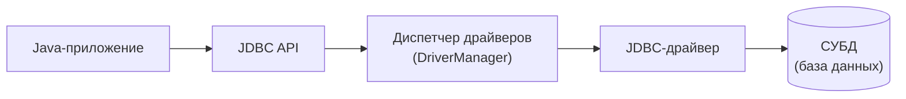
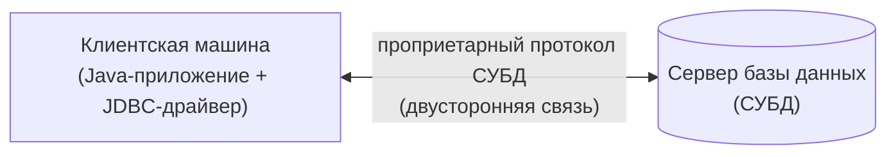
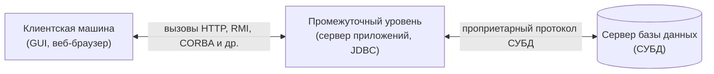

# Урок 1. Введение в JDBC

**Трейл:** JDBC Database Access · **Оригинал:** [JDBC Introduction](https://docs.oracle.com/javase/tutorial/jdbc/overview/index.html)
**Связанные области:** [[15-databases-sql]] · [[16-jpa-hibernate]] · **Вопросы:** databases-sql

> Перевод официального руководства Oracle (The Java Tutorials, JDBC 4.x / JDK 8). Урок объединяет
> страницы *JDBC Introduction*, *JDBC Architecture* и *A Relational Database Overview*.
>
> *Примечание Oracle.* Руководство написано для JDK 8. Примеры и приёмы, описанные здесь, не
> используют улучшений, появившихся в более поздних выпусках, и могут опираться на технологии,
> которые больше недоступны. Актуальные руководства — на [Dev.java](https://dev.java/learn/).

JDBC API — это Java-интерфейс прикладного программирования (Java API), позволяющий обращаться к
любым **табличным данным** (*tabular data*), и в первую очередь к данным, хранящимся в реляционной
базе данных.

JDBC помогает писать Java-приложения, выполняющие три вида работы:

1. подключение к источнику данных, например к базе данных;
2. отправка запросов и операторов обновления (*update statements*) в базу данных;
3. получение и обработка результатов, которые база данных возвращает в ответ на запрос.

Следующий простой фрагмент кода демонстрирует все три шага:

```java
public void connectToAndQueryDatabase(String username, String password) {

    // Шаг 1. Подключаемся к базе данных через драйвер и входим в систему
    Connection con = DriverManager.getConnection(
                         "jdbc:myDriver:myDatabase",
                         username,
                         password);

    // Шаг 2. Формируем и отправляем SQL-запрос
    Statement stmt = con.createStatement();
    ResultSet rs = stmt.executeQuery("SELECT a, b, c FROM Table1");

    // Шаг 3. Перебираем результаты запроса
    while (rs.next()) {
        int x = rs.getInt("a");
        String s = rs.getString("b");
        float f = rs.getFloat("c");
    }
}
```

Этот короткий фрагмент создаёт объект `DriverManager` для подключения к драйверу базы данных и
входа в неё; создаёт объект `Statement`, который несёт ваш SQL-запрос в базу данных; создаёт объект
`ResultSet`, извлекающий результаты запроса; и выполняет простой цикл `while`, который получает и
отображает эти результаты. Вот так всё просто.

## Компоненты продукта JDBC

JDBC состоит из четырёх компонентов:

1. **JDBC API** — предоставляет программный доступ к реляционным данным из языка программирования
   Java. С помощью JDBC API приложения могут выполнять SQL-операторы, получать результаты и
   передавать изменения обратно в нижележащий источник данных. JDBC API также способен
   взаимодействовать с несколькими источниками данных в распределённой, разнородной
   (*heterogeneous*) среде.

   JDBC API — часть платформы Java, которая включает редакции *Java Standard Edition* (Java SE) и
   *Java Enterprise Edition* (Java EE). JDBC 4.0 API разделён на два пакета: `java.sql` и
   `javax.sql`. Оба пакета входят и в Java SE, и в Java EE.

2. **Диспетчер драйверов JDBC** (*JDBC Driver Manager*) — класс `DriverManager` определяет объекты,
   которые могут связывать Java-приложения с JDBC-драйвером. Исторически `DriverManager` был
   основой архитектуры JDBC. Он довольно мал и прост.

   Пакеты стандартного расширения `javax.naming` и `javax.sql` позволяют использовать объект
   `DataSource`, зарегистрированный в службе именования *Java Naming and Directory Interface*
   (JNDI), чтобы установить соединение с источником данных. Можно применять любой из двух
   механизмов подключения, но по возможности рекомендуется использовать объект `DataSource`.

3. **Набор тестов JDBC** (*JDBC Test Suite*) — набор тестов для драйверов JDBC помогает убедиться,
   что JDBC-драйверы будут работать с вашей программой. Эти тесты не являются всеобъемлющими или
   исчерпывающими, но проверяют многие важные возможности JDBC API.

4. **Мост JDBC-ODBC** (*JDBC-ODBC Bridge*) — мост от Java Software обеспечивает доступ через JDBC к
   драйверам ODBC. Учтите, что на каждую клиентскую машину, использующую этот драйвер, нужно
   загрузить двоичный код ODBC. Поэтому ODBC-драйвер наиболее уместен в корпоративной сети, где
   установка ПО на клиентах не составляет проблемы, либо для кода сервера приложений, написанного
   на Java в трёхуровневой архитектуре.

Этот трейл использует первые два из четырёх компонентов JDBC, чтобы подключиться к базе данных и
затем построить Java-программу, которая через SQL-команды общается с тестовой реляционной базой
данных. Последние два компонента применяются в специализированных средах — для тестирования
веб-приложений или для общения с СУБД, поддерживающими ODBC.

## Архитектура JDBC

JDBC API поддерживает две модели обработки запросов к базе данных: **двухуровневую** (*two-tier*)
и **трёхуровневую** (*three-tier*).

Общая схема взаимодействия в JDBC такова:

<!-- original: none | Авторская сводная схема стека JDBC; оригинальная фигура на странице Oracle отсутствует -->


### Двухуровневая архитектура

В двухуровневой модели Java-апплет или приложение напрямую общается с источником данных. Для этого
нужен JDBC-драйвер, способный взаимодействовать с конкретным используемым источником данных.
Команды пользователя доставляются в базу данных или иной источник данных, а результаты этих
операторов отправляются обратно пользователю. Источник данных может находиться на другой машине, к
которой пользователь подключён по сети. Такую конфигурацию называют клиент-серверной
(*client/server*): машина пользователя выступает клиентом, а машина с источником данных — сервером.
Сетью может быть интранет (например, соединяющий сотрудников внутри корпорации) или интернет.

<!-- original: assets/18-jdbc/jdbc-two-tier.gif | Рисунок 1: двухуровневая архитектура JDBC — клиент напрямую связывается с сервером базы данных по протоколу СУБД -->


*Рисунок 1. Двухуровневая архитектура доступа к данным. Проприетарный протокол СУБД обеспечивает
двустороннюю связь между клиентской машиной и сервером базы данных.*

### Трёхуровневая архитектура

В трёхуровневой модели команды отправляются на «промежуточный уровень» (*middle tier*) служб,
который затем передаёт их источнику данных. Источник данных обрабатывает команды и отправляет
результаты обратно на промежуточный уровень, а тот пересылает их пользователю. Директора
информационных служб (MIS) находят трёхуровневую модель очень привлекательной, поскольку
промежуточный уровень даёт возможность контролировать доступ и виды обновлений, которые можно
вносить в корпоративные данные. Ещё одно преимущество — упрощается развёртывание приложений.
Наконец, во многих случаях трёхуровневая архитектура может давать выигрыш в производительности.

<!-- original: assets/18-jdbc/jdbc-three-tier.gif | Рисунок 2: трёхуровневая архитектура JDBC — клиент, промежуточный уровень (сервер приложений), сервер базы данных -->


*Рисунок 2. Трёхуровневая архитектура доступа к данным. Проприетарный протокол СУБД обеспечивает
двустороннюю связь между сервером базы данных и серверной машиной; вызовы HTTP, RMI, CORBA или
иные обеспечивают двустороннюю связь между серверной и клиентской машинами.*

До недавнего времени промежуточный уровень часто писали на языках вроде C или C++,
обеспечивающих высокую производительность. Однако с появлением оптимизирующих компиляторов,
переводящих байт-код Java в эффективный машинно-зависимый код, и таких технологий, как Enterprise
JavaBeans, платформа Java быстро становится стандартной платформой для разработки промежуточного
уровня. Это большой плюс: можно воспользоваться надёжностью, многопоточностью и средствами
безопасности Java.

По мере того как предприятия всё чаще пишут серверный код на языке Java, JDBC API всё активнее
применяется на промежуточном уровне трёхуровневой архитектуры. Среди возможностей, делающих JDBC
серверной технологией, — поддержка пула соединений (*connection pooling*), распределённых
транзакций (*distributed transactions*) и отсоединённых наборов строк (*disconnected rowsets*).
JDBC API — это также то, что обеспечивает доступ к источнику данных из Java-уровня посередине.

## Обзор реляционных баз данных

База данных — это способ хранения информации, позволяющий её извлекать. В простейшем понимании
реляционная база данных (*relational database*) — это база, которая представляет информацию в
**таблицах** со строками и столбцами. Таблицу называют **отношением** (*relation*) в том смысле,
что это набор объектов одного типа (строк). Данные в таблице можно связывать по общим ключам или
понятиям, и именно возможность извлекать связанные данные из таблицы лежит в основе термина
«реляционная база данных». **Система управления базами данных** (*Database Management System*,
DBMS / СУБД) распоряжается тем, как данные хранятся, поддерживаются и извлекаются. В случае
реляционной базы данных эти задачи выполняет **реляционная СУБД** (*Relational Database Management
System*, RDBMS). Термин «СУБД» используется здесь в общем смысле, охватывающем и РСУБД.

### Правила целостности

Реляционные таблицы подчиняются определённым правилам целостности (*integrity rules*), которые
обеспечивают точность и постоянную доступность хранимых данных.

Во-первых, все строки реляционной таблицы должны быть различны. Если есть дубликаты строк, могут
возникнуть проблемы при выборе того, какая из двух возможных строк правильная. В большинстве СУБД
пользователь может указать, что дубликаты строк не допускаются; тогда СУБД будет предотвращать
добавление любой строки, дублирующей уже существующую.

Во-вторых, традиционная реляционная модель требует, чтобы значения столбцов не были
повторяющимися группами или массивами.

В-третьих, целостность данных связана с понятием **null-значения** (*null value*). База данных
обрабатывает ситуации, когда данные могут отсутствовать, используя null-значение как указание на
то, что значение пропущено. Оно не равнозначно пробелу или нулю. Пробел считается равным другому
пробелу, ноль — равным другому нулю, но два null-значения равными не считаются.

Когда каждая строка таблицы отличается от других, можно использовать один или несколько столбцов
для идентификации конкретной строки. Такой уникальный столбец или группа столбцов называется
**первичным ключом** (*primary key*). Любой столбец, входящий в первичный ключ, не может быть null;
иначе первичный ключ перестал бы быть полным идентификатором. Это правило называют **целостностью
сущностей** (*entity integrity*).

Реляционные концепции иллюстрирует таблица `Employees` (Сотрудники). В ней пять столбцов и шесть
строк, каждая строка представляет отдельного сотрудника.

**Таблица `Employees`:**

| Employee_Number | First_name | Last_Name | Date_of_Birth | Car_Number |
|---|---|---|---|---|
| 10001 | Axel | Washington | 28-Aug-43 | 5 |
| 10083 | Arvid | Sharma | 24-Nov-54 | null |
| 10120 | Jonas | Ginsberg | 01-Jan-69 | null |
| 10005 | Florence | Wojokowski | 04-Jul-71 | 12 |
| 10099 | Sean | Washington | 21-Sep-66 | null |
| 10035 | Elizabeth | Yamaguchi | 24-Dec-59 | null |

Первичным ключом этой таблицы, как правило, был бы номер сотрудника (`Employee_Number`), поскольку
гарантированно различен. (К тому же число эффективнее строки при сравнениях.) Можно было бы
использовать и пару `First_Name` + `Last_Name`, потому что их сочетание тоже определяет лишь одну
строку в нашем примере. Только фамилия не подойдёт, так как есть два сотрудника с фамилией
«Washington». В данном конкретном случае все имена различны, так что теоретически можно было бы
взять столбец имени в качестве первичного ключа, но лучше избегать столбца, где возможны дубликаты.
Если в компанию устроится ещё одна Elizabeth Yamaguchi, а первичным ключом будет `First_Name`,
РСУБД не позволит добавить её имя (если задано, что дубликаты не допускаются). Поскольку в таблице
уже есть Elizabeth, добавление второй сделало бы первичный ключ бесполезным как способ
идентификации единственной строки. Заметьте: хотя пара `First_Name` + `Last_Name` уникальна в этом
примере, в более крупной базе она может оказаться неуникальной. Заметьте также, что таблица
`Employees` предполагает не более одной машины на сотрудника.

### Операторы SELECT

SQL — язык, предназначенный для работы с реляционными базами данных. Есть набор базовых SQL-команд,
которые считаются стандартными и используются всеми РСУБД. Например, все РСУБД используют оператор
`SELECT`.

Оператор `SELECT`, также называемый запросом (*query*), служит для получения информации из таблицы.
Он указывает один или несколько заголовков столбцов, одну или несколько таблиц, из которых
выбирать, и некоторые критерии отбора. РСУБД возвращает строки со значениями столбцов,
удовлетворяющими заявленным требованиям. Например, такой оператор `SELECT` извлечёт имена и фамилии
сотрудников, у которых есть служебные машины:

```sql
SELECT First_Name, Last_Name
FROM Employees
WHERE Car_Number IS NOT NULL
```

Результирующий набор (набор строк, удовлетворяющих требованию «в столбце `Car_Number` не null»)
выглядит так. Для каждой подходящей строки выводятся имя и фамилия, потому что оператор `SELECT`
(первая строка) указывает столбцы `First_Name` и `Last_Name`. Предложение `FROM` (вторая строка)
задаёт таблицу, из которой выбираются столбцы.

| FIRST_NAME | LAST_NAME |
|---|---|
| Axel | Washington |
| Florence | Wojokowski |

Следующий код возвращает результирующий набор, включающий всю таблицу, поскольку запрашивает все
столбцы таблицы `Employees` без ограничений (без предложения `WHERE`). Обратите внимание, что
`SELECT *` означает «`SELECT` всех столбцов».

```sql
SELECT *
FROM Employees
```

### Предложения WHERE

Предложение `WHERE` в операторе `SELECT` задаёт критерии отбора значений. Например, в следующем
фрагменте значения отбираются только если они встречаются в строке, где столбец `Last_Name`
начинается со строки 'Washington'.

```sql
SELECT First_Name, Last_Name
FROM Employees
WHERE Last_Name LIKE 'Washington%'
```

Ключевое слово `LIKE` служит для сравнения строк и позволяет использовать шаблоны с подстановочными
символами. Например, в приведённом выше фрагменте после 'Washington' стоит знак процента (`%`),
который означает, что критерию отбора удовлетворит любое значение, содержащее строку 'Washington'
плюс ноль или больше дополнительных символов. Так, 'Washington' или 'Washingtonian' подойдут, а
'Washing' — нет. Другой подстановочный символ в предложениях `LIKE` — подчёркивание (`_`), которое
заменяет любой один символ. Например,

```sql
WHERE Last_Name LIKE 'Ba_man'
```

совпадёт с 'Barman', 'Badman', 'Balman', 'Bagman', 'Bamman' и так далее.

Во фрагменте ниже предложение `WHERE` использует знак равенства (`=`) для сравнения чисел. Оно
выбирает имя и фамилию сотрудника, которому назначена машина 12.

```sql
SELECT First_Name, Last_Name
FROM Employees
WHERE Car_Number = 12
```

Следующий фрагмент выбирает имена и фамилии сотрудников, чей номер больше 10005:

```sql
SELECT First_Name, Last_Name
FROM Employees
WHERE Employee_Number > 10005
```

Предложения `WHERE` могут быть весьма сложными — с несколькими условиями, а в некоторых СУБД и с
вложенными условиями. Этот обзор не охватывает сложные предложения `WHERE`, но в следующем фрагменте
предложение `WHERE` содержит два условия; запрос выбирает имена и фамилии сотрудников, чей номер
меньше 10100 и у кого нет служебной машины.

```sql
SELECT First_Name, Last_Name
FROM Employees
WHERE Employee_Number < 10100 and Car_Number IS NULL
```

Особый вид предложения `WHERE` связан с соединением (*join*), которое объясняется в следующем разделе.

### Соединения (Joins)

Отличительная особенность реляционных баз данных в том, что можно получать данные более чем из
одной таблицы в так называемом **соединении** (*join*). Допустим, после получения имён сотрудников
со служебными машинами нужно выяснить, у кого какая машина, включая марку, модель и год выпуска.
Эта информация хранится в другой таблице — `Cars`:

**Таблица `Cars`:**

| Car_Number | Make | Model | Year |
|---|---|---|---|
| 5 | Honda | Civic DX | 1996 |
| 12 | Toyota | Corolla | 1999 |

Чтобы связать таблицы друг с другом, должен быть один столбец, присутствующий в обеих. Этот столбец,
который должен быть первичным ключом в одной таблице, называется **внешним ключом** (*foreign key*)
в другой. В данном случае столбец, присутствующий в обеих таблицах, — `Car_Number`: первичный ключ
для таблицы `Cars` и внешний ключ в таблице `Employees`. Если Honda Civic 1996 года была бы разбита
и удалена из таблицы `Cars`, то `Car_Number` 5 пришлось бы убрать и из таблицы `Employees`, чтобы
сохранить так называемую **ссылочную целостность** (*referential integrity*). Иначе столбец
внешнего ключа (`Car_Number`) в таблице `Employees` содержал бы запись, ни на что не ссылающуюся в
таблице `Cars`. Внешний ключ должен быть либо null, либо равен существующему значению первичного
ключа таблицы, на которую он ссылается. Это отличается от первичного ключа, который не может быть
null. В столбце `Car_Number` таблицы `Employees` есть несколько null-значений, потому что у
сотрудника может не быть служебной машины.

Следующий код запрашивает имена и фамилии сотрудников со служебными машинами, а также марку, модель
и год выпуска их машин. Обратите внимание, что предложение `FROM` перечисляет обе таблицы —
`Employees` и `Cars`, — потому что запрашиваемые данные содержатся в обеих. Имя таблицы и точка
(`.`) перед именем столбца указывают, в какой таблице находится столбец.

```sql
SELECT Employees.First_Name, Employees.Last_Name,
    Cars.Make, Cars.Model, Cars.Year
FROM Employees, Cars
WHERE Employees.Car_Number = Cars.Car_Number
```

Это вернёт результирующий набор, похожий на следующий:

| FIRST_NAME | LAST_NAME | LICENSE_PLATE | MILEAGE | YEAR |
|---|---|---|---|---|
| John | Washington | ABC123 | 5000 | 1996 |
| Florence | Wojokowski | DEF123 | 7500 | 1999 |

### Распространённые команды SQL

SQL-команды делятся на категории; две главные — команды **языка манипулирования данными** (*Data
Manipulation Language*, DML) и команды **языка определения данных** (*Data Definition Language*,
DDL). Команды DML работают с данными — извлекают их или изменяют, поддерживая в актуальном
состоянии. Команды DDL создают или изменяют таблицы и другие объекты базы данных, такие как
представления и индексы.

Список наиболее распространённых команд DML:

- `SELECT` — запрашивает и отображает данные из базы. Оператор `SELECT` указывает, какие столбцы
  включить в результирующий набор. Подавляющее большинство SQL-команд в приложениях — это операторы
  `SELECT`.
- `INSERT` — добавляет новые строки в таблицу. `INSERT` используется для заполнения только что
  созданной таблицы или для добавления новой строки (или строк) в уже существующую таблицу.
- `DELETE` — удаляет указанную строку или набор строк из таблицы.
- `UPDATE` — изменяет существующее значение в столбце или группе столбцов таблицы.

Наиболее распространённые команды DDL:

- `CREATE TABLE` — создаёт таблицу со столбцами, имена которых задаёт пользователь. Пользователь
  также должен указать тип данных для каждого столбца. Типы данных различаются от РСУБД к РСУБД,
  поэтому может понадобиться метаданные, чтобы установить типы, используемые конкретной базой.
  `CREATE TABLE` обычно применяется реже команд манипулирования данными, так как таблица создаётся
  лишь однажды, тогда как добавление, удаление строк или изменение отдельных значений происходит
  чаще.
- `DROP TABLE` — удаляет все строки и убирает определение таблицы из базы данных. Реализация JDBC
  API обязана поддерживать команду `DROP TABLE` в том виде, как она определена в SQL92,
  Transitional Level. Однако поддержка опций `CASCADE` и `RESTRICT` для `DROP TABLE`
  необязательна. Кроме того, поведение `DROP TABLE` зависит от реализации, если существуют
  представления или ограничения целостности, ссылающиеся на удаляемую таблицу.
- `ALTER TABLE` — добавляет или удаляет столбец из таблицы. Также добавляет или удаляет ограничения
  таблицы и изменяет атрибуты столбцов.

### Результирующие наборы и курсоры

Строки, удовлетворяющие условиям запроса, называются **результирующим набором** (*result set*).
Число строк в результирующем наборе может быть нулевым, равным одному или многим. Пользователь
может обращаться к данным результирующего набора по одной строке за раз, и средством для этого
служит **курсор** (*cursor*). Курсор можно представить как указатель в файле, содержащем строки
результирующего набора; этот указатель способен отслеживать, к какой строке сейчас идёт обращение.
Курсор позволяет пользователю обрабатывать каждую строку результирующего набора сверху вниз и,
следовательно, может использоваться для итеративной обработки. Большинство СУБД создают курсор
автоматически при формировании результирующего набора.

Ранние версии JDBC API добавили курсору результирующего набора новые возможности: перемещаться как
вперёд, так и назад, а также переходить к указанной строке или к строке, чьё положение задано
относительно другой строки.

Подробнее см. [Получение и изменение значений из результирующих наборов](https://docs.oracle.com/javase/tutorial/jdbc/basics/retrieving.html).

### Транзакции

Когда один пользователь обращается к данным в базе, другой пользователь может обращаться к тем же
данным одновременно. Если, например, первый пользователь обновляет некоторые столбцы таблицы в тот
же момент, когда второй выбирает столбцы из той же таблицы, второй может получить отчасти старые,
отчасти обновлённые данные. По этой причине СУБД используют **транзакции** (*transactions*), чтобы
поддерживать данные в согласованном состоянии (*согласованность данных*, data consistency),
позволяя при этом нескольким пользователям обращаться к базе одновременно (*параллельность данных*,
data concurrency).

Транзакция — это набор из одного или нескольких SQL-операторов, составляющих логическую единицу
работы. Транзакция завершается либо **фиксацией** (*commit*), либо **откатом** (*rollback*) — в
зависимости от того, есть ли проблемы с согласованностью или параллельностью данных. Оператор
`commit` делает постоянными изменения, вытекающие из SQL-операторов транзакции, а оператор
`rollback` отменяет все изменения, вытекающие из SQL-операторов транзакции.

**Блокировка** (*lock*) — это механизм, запрещающий двум транзакциям манипулировать одними и теми
же данными одновременно. Например, блокировка таблицы не даёт удалить таблицу, если по ней есть
незафиксированная транзакция. В некоторых СУБД блокировка таблицы также блокирует все её строки.
Блокировка строки не даёт двум транзакциям изменять одну и ту же строку либо не позволяет одной
транзакции выбрать строку, пока другая транзакция её ещё изменяет.

Подробнее см. [Использование транзакций](https://docs.oracle.com/javase/tutorial/jdbc/basics/transactions.html).

### Хранимые процедуры

**Хранимая процедура** (*stored procedure*) — это группа SQL-операторов, которую можно вызывать по
имени. Иными словами, это исполняемый код, мини-программа, выполняющая определённую задачу, которую
можно вызвать так же, как функцию или метод. Традиционно хранимые процедуры писались на специфичном
для СУБД языке программирования. Новейшее поколение продуктов баз данных позволяет писать хранимые
процедуры на языке Java с использованием JDBC API. Хранимые процедуры, написанные на языке Java,
переносимы между СУБД на уровне байт-кода. Написанную однажды хранимую процедуру можно использовать
повторно, потому что СУБД, поддерживающая хранимые процедуры, как следует из названия, хранит её в
базе данных. О написании хранимых процедур см.
[Использование хранимых процедур](https://docs.oracle.com/javase/tutorial/jdbc/basics/storedprocedures.html).

### Метаданные

Базы данных хранят пользовательские данные, а также информацию о самой базе. В большинстве СУБД
есть набор системных таблиц, в которых перечислены таблицы базы, имена столбцов в каждой таблице,
первичные ключи, внешние ключи, хранимые процедуры и так далее. У каждой СУБД свои функции для
получения информации о структуре таблиц и возможностях базы. JDBC предоставляет интерфейс
`DatabaseMetaData`, который автор драйвера обязан реализовать так, чтобы его методы возвращали
информацию о драйвере и/или СУБД, для которой написан драйвер. Например, большое число методов
возвращает, поддерживает ли драйвер ту или иную возможность. Этот интерфейс даёт пользователям и
инструментам стандартизированный способ получать метаданные. В целом метаданные больше всего
интересуют разработчиков, пишущих инструменты и драйверы.

## Источник

- [JDBC Introduction](https://docs.oracle.com/javase/tutorial/jdbc/overview/index.html) — официальное руководство Oracle.
- [JDBC Architecture](https://docs.oracle.com/javase/tutorial/jdbc/overview/architecture.html) — официальное руководство Oracle.
- [A Relational Database Overview](https://docs.oracle.com/javase/tutorial/jdbc/overview/database.html) — официальное руководство Oracle.
