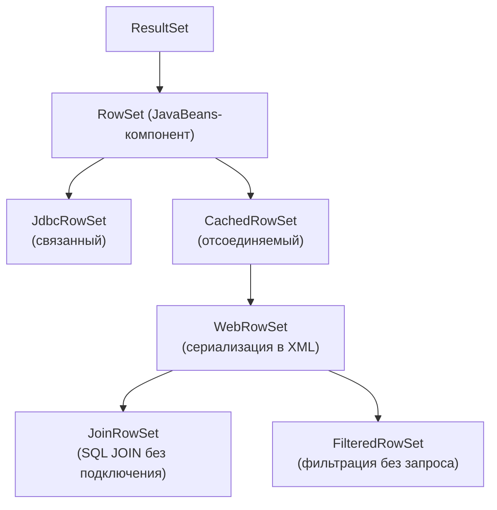

# Урок 4. Объекты RowSet

**Трейл:** JDBC Database Access · **Оригинал:** [JDBC Basics — RowSet](https://docs.oracle.com/javase/tutorial/jdbc/basics/rowset.html)
**Связанные области:** [[15-databases-sql]] · **Вопросы:** databases-sql

> Перевод официального руководства Oracle (The Java Tutorials, JDK 8). Урок собран из
> страниц *Using RowSet Objects*, *Using JdbcRowSet Objects*, *Using CachedRowSet Objects*,
> *Using WebRowSet Objects*, *Using JoinRowSet Objects* и *Using FilteredRowSet Objects*.

Объект `RowSet` в JDBC хранит табличные данные так, что работать с ними становится гибче и
проще, чем с обычным набором результатов (`ResultSet`).

Oracle определила пять интерфейсов `RowSet` для наиболее популярных сценариев использования, и
для каждого из них доступна стандартная эталонная реализация. Эти разновидности интерфейса
`RowSet` и их реализации предоставлены как удобство для программистов. Программисты вправе писать
собственные версии интерфейса `javax.sql.RowSet`, расширять реализации пяти интерфейсов `RowSet`
или писать собственные реализации.

## Иерархия интерфейсов RowSet

Все интерфейсы расширяют базовый `RowSet`, который, в свою очередь, является производным от
`ResultSet`. Связанный (*connected*) `JdbcRowSet` стоит особняком; четыре остальных —
отсоединяемые (*disconnected*), причём `CachedRowSet` является надынтерфейсом (*superinterface*)
для них всех.

<!-- original: none | Авторская схема иерархии интерфейсов RowSet; оригинальная фигура на странице Oracle отсутствует -->


## Что умеют объекты RowSet

Все объекты `RowSet` являются производными от интерфейса `ResultSet` и потому обладают всеми его
возможностями. Особыми объекты `RowSet` в JDBC делают следующие новые способности:

- работать как компонент JavaBeans;
- добавлять прокручиваемость (*scrollability*) или обновляемость (*updatability*).

### Работа в качестве компонента JavaBeans

Все объекты `RowSet` — это компоненты JavaBeans. Это означает, что у них есть:

- свойства (*properties*);
- механизм уведомлений JavaBeans.

#### Свойства

У всех объектов `RowSet` есть свойства. Свойство — это поле, у которого есть соответствующие
методы-геттер и -сеттер. Свойства видны инструментам визуального проектирования (например, тем,
что поставляются с IDE JDeveloper и Eclipse) и позволяют визуально манипулировать бинами.

#### Механизм уведомлений JavaBeans

Объекты `RowSet` используют событийную модель JavaBeans, в которой зарегистрированные компоненты
уведомляются о наступлении определённых событий. Для всех объектов `RowSet` уведомления вызывают
три события:

- перемещение курсора;
- обновление, вставка или удаление строки;
- изменение всего содержимого объекта `RowSet`.

Уведомление о событии получают все *слушатели* (*listeners*) — компоненты, реализовавшие
интерфейс `RowSetListener` и добавленные в список компонентов, которые объект `RowSet` должен
уведомить при наступлении любого из трёх событий.

Слушателем может быть, например, GUI-компонент вроде столбчатой диаграммы. Если диаграмма
отслеживает данные в объекте `RowSet`, она захочет узнавать новые значения всякий раз, когда
данные меняются. Поэтому слушатель реализует методы `RowSetListener`, определяя, что он будет
делать при наступлении конкретного события. Затем слушателя нужно добавить в список слушателей
объекта `RowSet`. Следующая строка кода регистрирует компонент-диаграмму `bg` в объекте `RowSet`
с именем `rs`:

```java
rs.addListener(bg);
```

Теперь `bg` будет уведомляться каждый раз, когда курсор перемещается, строка изменяется или весь
`rs` получает новые данные.

### Добавление прокручиваемости или обновляемости

Некоторые СУБД не поддерживают прокручиваемые (*scrollable*) наборы результатов, а некоторые — не
поддерживают обновляемые (*updatable*). Если драйвер такой СУБД не добавляет возможность прокрутки
или обновления наборов результатов, это можно сделать с помощью объекта `RowSet`. Объект `RowSet`
по умолчанию прокручиваемый и обновляемый, поэтому, заполнив его содержимым набора результатов,
вы фактически делаете этот набор результатов прокручиваемым и обновляемым.

## Разновидности объектов RowSet

Объект `RowSet` считается либо **связанным** (*connected*), либо **отсоединяемым** (*disconnected*).

*Связанный* объект `RowSet` использует JDBC-драйвер для установления соединения с реляционной
базой данных и поддерживает это соединение в течение всего срока своей жизни.

*Отсоединяемый* объект `RowSet` устанавливает соединение с источником данных только для того,
чтобы прочитать данные из объекта `ResultSet` или записать данные обратно в источник. После
чтения или записи объект `RowSet` отсоединяется от источника, становясь «отсоединённым». В
течение большей части своей жизни отсоединяемый объект `RowSet` не имеет соединения с источником
данных и работает независимо.

### Связанные объекты RowSet

Среди стандартных реализаций `RowSet` лишь одна является связанным объектом — **`JdbcRowSet`**.
Будучи всегда подключённым к базе данных, объект `JdbcRowSet` наиболее похож на объект `ResultSet`
и часто используется как обёртка, делающая прокручиваемым и обновляемым объект `ResultSet`,
который иначе не прокручивается и доступен только для чтения.

Как компонент JavaBeans объект `JdbcRowSet` может применяться, например, в GUI-инструменте для
выбора JDBC-драйвера.

### Отсоединяемые объекты RowSet

Остальные четыре реализации — отсоединяемые: `CachedRowSet`, `WebRowSet`, `JoinRowSet` и
`FilteredRowSet`. Отсоединяемые объекты `RowSet` обладают всеми возможностями связанных плюс
дополнительными, доступными только им. Отсутствие необходимости поддерживать соединение с
источником данных делает отсоединяемые объекты `RowSet` гораздо более лёгкими, чем объект
`JdbcRowSet` или `ResultSet`. Они также сериализуемы (*serializable*), а сочетание лёгкости и
сериализуемости делает их идеальными для передачи данных по сети. Их можно использовать даже для
отправки данных тонким клиентам — КПК и мобильным телефонам.

#### CachedRowSet

Объект `CachedRowSet` обладает всеми возможностями объекта `JdbcRowSet`, а кроме того может:

- получать соединение с источником данных и выполнять запрос;
- читать данные из полученного объекта `ResultSet` и заполнять себя ими;
- манипулировать данными и вносить изменения, будучи отсоединённым;
- повторно подключаться к источнику данных, чтобы записать изменения обратно;
- проверять наличие конфликтов с источником данных и разрешать их.

#### WebRowSet

Объект `WebRowSet` обладает всеми возможностями объекта `CachedRowSet`, а кроме того может:

- записывать себя в виде XML-документа;
- читать XML-документ, описывающий объект `WebRowSet`.

#### JoinRowSet

Объект `JoinRowSet` обладает всеми возможностями объекта `WebRowSet` (а значит, и
`CachedRowSet`), а кроме того может:

- формировать эквивалент `SQL JOIN` без подключения к источнику данных.

#### FilteredRowSet

Объект `FilteredRowSet` так же обладает всеми возможностями объекта `WebRowSet` (а значит, и
`CachedRowSet`), а кроме того может:

- применять критерии фильтрации, чтобы видимыми оставались только выбранные данные. Это
  эквивалентно выполнению запроса к объекту `RowSet` без использования языка запросов и без
  подключения к источнику данных.

## Использование объектов JdbcRowSet

Объект `JdbcRowSet` — это расширенный объект `ResultSet`. Он поддерживает соединение со своим
источником данных, как и `ResultSet`. Главное отличие в том, что у него есть набор свойств и
механизм уведомления слушателей, благодаря которым он становится компонентом JavaBeans.

Одно из основных применений объекта `JdbcRowSet` — сделать объект `ResultSet` прокручиваемым и
обновляемым, когда тот изначально такими возможностями не обладает.

### Создание объектов JdbcRowSet

Объект `JdbcRowSet` создаётся с помощью экземпляра `RowSetFactory`, который, в свою очередь,
создаётся классом `RowSetProvider`. Следующий пример взят из `JdbcRowSetSample.java`:

```java
RowSetFactory factory = RowSetProvider.newFactory();

try (JdbcRowSet jdbcRs = factory.createJdbcRowSet()) {
  jdbcRs.setUrl(this.settings.urlString);
  jdbcRs.setUsername(this.settings.userName);
  jdbcRs.setPassword(this.settings.password);
  jdbcRs.setCommand("select * from COFFEES");
  jdbcRs.execute();
  // ...
```

Интерфейс `RowSetFactory` содержит методы для создания разных реализаций `RowSet`:

- `createCachedRowSet`;
- `createFilteredRowSet`;
- `createJdbcRowSet`;
- `createJoinRowSet`;
- `createWebRowSet`.

### Объекты JdbcRowSet по умолчанию

Когда вы создаёте объект `JdbcRowSet` с помощью экземпляра `RowSetFactory`, у нового объекта
будут следующие свойства:

- **type**: `ResultSet.TYPE_SCROLL_INSENSITIVE` (прокручиваемый курсор);
- **concurrency**: `ResultSet.CONCUR_UPDATABLE` (можно обновлять);
- **escapeProcessing**: `true` (драйвер выполняет обработку escape-последовательностей: при
  включённой обработке драйвер ищет escape-синтаксис и переводит его в код, понятный конкретной
  базе данных);
- **maxRows**: `0` (без ограничения числа строк);
- **maxFieldSize**: `0` (без ограничения числа байтов на значение столбца; применимо только к
  столбцам, хранящим значения `BINARY`, `VARBINARY`, `LONGVARBINARY`, `CHAR`, `VARCHAR` и
  `LONGVARCHAR`);
- **queryTimeout**: `0` (нет ограничения по времени выполнения запроса);
- **showDeleted**: `false` (удалённые строки не видны);
- **transactionIsolation**: `Connection.TRANSACTION_READ_COMMITTED` (читаются только
  зафиксированные данные);
- **typeMap**: `null` (карта типов, связанная с объектом `Connection` этого объекта `RowSet`,
  равна `null`).

Главное, что нужно запомнить из этого списка: объект `JdbcRowSet` и все остальные объекты
`RowSet` прокручиваемы и обновляемы, если только вы не зададите этим свойствам иные значения.

### Установка свойств

Если вы используете конструктор по умолчанию, перед заполнением нового объекта `JdbcRowSet`
данными нужно задать ещё несколько свойств. Чтобы получить данные, объект `JdbcRowSet` сначала
должен подключиться к базе. Следующие четыре свойства содержат сведения для получения соединения:

- **username** — имя, которое пользователь сообщает базе данных при получении доступа;
- **password** — пароль пользователя в базе данных;
- **url** — JDBC URL базы данных, к которой нужно подключиться;
- **datasourceName** — имя для получения объекта `DataSource`, зарегистрированного в службе имён
  JNDI.

Какие из этих свойств задавать — зависит от способа подключения. Предпочтительный способ —
использовать объект `DataSource`, но регистрация `DataSource` в службе имён JNDI (что обычно
делает системный администратор) может быть для вас непрактичной. Поэтому во всех примерах кода для
получения соединения применяется механизм `DriverManager`, при котором используется свойство `url`,
а не `datasourceName`.

Ещё одно обязательное свойство — `command`. Это запрос, определяющий, какие данные будет хранить
объект `JdbcRowSet`. Например, следующая строка задаёт свойство `command` запросом, который
порождает объект `ResultSet` со всеми данными таблицы `COFFEES`:

```java
jdbcRs.setCommand("select * from COFFEES");
```

После того как заданы свойство `command` и свойства, нужные для соединения, объект `jdbcRs` можно
заполнить данными, вызвав метод `execute`:

```java
jdbcRs.execute();
```

Метод `execute` делает в фоне многое:

- устанавливает соединение с базой данных, используя значения свойств `url`, `username` и
  `password`;
- выполняет запрос, заданный в свойстве `command`;
- читает данные из полученного объекта `ResultSet` в объект `jdbcRs`.

### Работа с объектами JdbcRowSet

Обновление, вставка и удаление строки в объекте `JdbcRowSet` выполняются так же, как в
обновляемом объекте `ResultSet`. Точно так же навигация по объекту `JdbcRowSet` выполняется так
же, как по прокручиваемому объекту `ResultSet`.

Сеть кофеен Coffee Break приобрела другую сеть кофеен и теперь располагает унаследованной базой
данных, которая не поддерживает прокрутку или обновление набора результатов. Иными словами, любой
объект `ResultSet`, порождаемый этой базой, не имеет прокручиваемого курсора, и данные в нём
изменять нельзя. Однако, создав объект `JdbcRowSet`, заполненный данными из `ResultSet`, можно по
сути сделать `ResultSet` прокручиваемым и обновляемым.

Как уже упоминалось, объект `JdbcRowSet` по умолчанию прокручиваем и обновляем. Поскольку его
содержимое идентично содержимому объекта `ResultSet`, операции над объектом `JdbcRowSet`
эквивалентны операциям над самим `ResultSet`. А так как у объекта `JdbcRowSet` есть постоянное
соединение с базой данных, вносимые им изменения собственных данных вносятся и в данные базы.

#### Навигация по объектам JdbcRowSet

Непрокручиваемый объект `ResultSet` может использовать только метод `next` для перемещения курсора
вперёд, причём только от первой строки к последней. А объект `JdbcRowSet` по умолчанию может
использовать все методы перемещения курсора, определённые в интерфейсе `ResultSet`. Например,
следующие строки перемещают курсор к четвёртой строке объекта `jdbcRs`, а затем обратно к третьей:

```java
jdbcRs.absolute(4);
jdbcRs.previous();
```

Метод `previous` аналогичен методу `next` тем, что его можно использовать в цикле `while` для
обхода всех строк по порядку. Разница в том, что курсор нужно сначала поставить в позицию после
последней строки, а `previous` перемещает его к началу.

#### Обновление значений столбцов

Данные в объекте `JdbcRowSet` обновляются так же, как в объекте `ResultSet`. Предположим,
владелец Coffee Break хочет поднять цену за фунт кофе Espresso. Если он знает, что Espresso
находится в третьей строке объекта `jdbcRs`, код может выглядеть так:

```java
jdbcRs.absolute(3);
jdbcRs.updateFloat("PRICE", 10.99f);
jdbcRs.updateRow();
```

Код перемещает курсор к третьей строке, меняет значение столбца `PRICE` на 10.99 и затем
обновляет базу данных новой ценой. Вызов метода `updateRow` обновляет базу, потому что объект
`jdbcRs` сохранил соединение с ней. Для отсоединяемых объектов `RowSet` ситуация иная.

#### Вставка строк

Если владелец Coffee Break хочет добавить один или несколько сортов кофе, ему нужно добавить по
одной строке в таблицу `COFFEES` для каждого нового сорта, как в приведённом ниже фрагменте из
`JdbcRowSetSample.java`. Поскольку объект `jdbcRs` всегда подключён к базе, вставка строки в объект
`JdbcRowSet` совпадает со вставкой строки в объект `ResultSet`: вы перемещаете курсор к строке
вставки, задаёте значение каждого столбца подходящим методом-обновителем и вызываете метод
`insertRow`:

```java
jdbcRs.moveToInsertRow();
jdbcRs.updateString("COF_NAME", "HouseBlend");
jdbcRs.updateInt("SUP_ID", 49);
jdbcRs.updateFloat("PRICE", 7.99f);
jdbcRs.updateInt("SALES", 0);
jdbcRs.updateInt("TOTAL", 0);
jdbcRs.insertRow();

jdbcRs.moveToInsertRow();
jdbcRs.updateString("COF_NAME", "HouseDecaf");
jdbcRs.updateInt("SUP_ID", 49);
jdbcRs.updateFloat("PRICE", 8.99f);
jdbcRs.updateInt("SALES", 0);
jdbcRs.updateInt("TOTAL", 0);
jdbcRs.insertRow();
```

При вызове метода `insertRow` новая строка вставляется и в объект `jdbcRs`, и в базу данных.
Приведённый фрагмент проделывает это дважды, поэтому в объект и в базу добавляются две новые строки.

#### Удаление строк

Как и при обновлении данных и вставке строки, удаление строки для объекта `JdbcRowSet`
выполняется так же, как для `ResultSet`. Владелец хочет прекратить продажу декофеинизированного
кофе French Roast — это последняя строка объекта `jdbcRs`. В следующих строках первая перемещает
курсор к последней строке, а вторая удаляет её из объекта `jdbcRs` и из базы данных:

```java
jdbcRs.last();
jdbcRs.deleteRow();
```

## Использование объектов CachedRowSet

Объект `CachedRowSet` особенен тем, что может работать без подключения к источнику данных, то есть
является *отсоединяемым* объектом `RowSet`. Своё имя он получил оттого, что хранит (кеширует)
данные в памяти и оперирует собственными данными, а не данными в базе.

Интерфейс `CachedRowSet` — надынтерфейс (*superinterface*) для всех отсоединяемых объектов
`RowSet`, поэтому всё показанное здесь относится также к объектам `WebRowSet`, `JoinRowSet` и
`FilteredRowSet`.

Хотя источником данных для объекта `CachedRowSet` (и производных от него) почти всегда является
реляционная база данных, объект `CachedRowSet` способен получать данные из любого источника,
хранящего их в табличном формате. Например, источником может быть плоский файл или электронная
таблица — это работает, если объект `RowSetReader` отсоединяемого `RowSet` реализован для чтения
из такого источника. У интерфейса `CachedRowSet` есть объект `RowSetReader`, читающий данные из
реляционной базы, поэтому в этом руководстве источником всегда является база данных.

### Создание объектов CachedRowSet

Новый объект `CachedRowSet` создаётся с помощью экземпляра `RowSetFactory`, который создаётся
классом `RowSetProvider`. Следующий пример из `CachedRowSetSample.java` создаёт объект:

```java
RowSetFactory factory = RowSetProvider.newFactory();
CachedRowSet crs = factory.createCachedRowSet();
```

Объект `crs` имеет те же значения свойств по умолчанию, что и только что созданный объект
`JdbcRowSet`. Кроме того, ему назначен экземпляр стандартной реализации `SyncProvider` —
`RIOptimisticProvider`.

Объект `SyncProvider` поставляет объект `RowSetReader` (*reader*, читатель) и объект
`RowSetWriter` (*writer*, писатель), которые нужны отсоединяемому объекту `RowSet`, чтобы читать
данные из источника или записывать их обратно. Читатели и писатели работают полностью в фоне,
поэтому объяснение их работы дано лишь для информации — оно помогает понять, что некоторые методы
интерфейса `CachedRowSet` делают «за кулисами».

### Установка свойств CachedRowSet

Обычно значения свойств по умолчанию подходят, но при необходимости значение свойства можно
изменить соответствующим методом-сеттером. Есть свойства без значений по умолчанию, которые нужно
задать самостоятельно.

Чтобы получить данные, отсоединяемый объект `RowSet` должен уметь подключаться к источнику данных
и иметь способ выбрать данные, которые он будет хранить. Следующие свойства содержат сведения,
необходимые для получения соединения с базой:

- **username** — имя, которое пользователь сообщает базе данных при получении доступа;
- **password** — пароль пользователя в базе данных;
- **url** — JDBC URL базы данных, к которой нужно подключиться;
- **datasourceName** — имя для получения объекта `DataSource`, зарегистрированного в JNDI.

Какие свойства задавать — зависит от способа подключения. Предпочтительно использовать объект
`DataSource`, но во всех примерах для получения соединения применяется механизм `DriverManager`,
при котором используется свойство `url`, а не `datasourceName`.

Следующие строки задают свойства `username`, `password` и `url`, чтобы соединение можно было
получить через класс `DriverManager` (JDBC URL для свойства `url` ищите в документации к вашему
JDBC-драйверу):

```java
public void setConnectionProperties(
    String username, String password) {
    crs.setUsername(username);
    crs.setPassword(password);
    crs.setUrl("jdbc:mySubprotocol:mySubname");
    // ...
```

Ещё одно обязательное свойство — `command`. Данные читаются в объект `RowSet` из объекта
`ResultSet`. Запрос, порождающий этот `ResultSet`, и есть значение свойства `command`. Например:

```java
crs.setCommand("select * from MERCH_INVENTORY");
```

### Установка ключевых столбцов

Если вы собираетесь вносить изменения в объект `crs` и хотите, чтобы они сохранялись в базе,
нужно задать ещё одну вещь — ключевые столбцы (*key columns*). Ключевые столбцы по сути совпадают
с первичным ключом: они указывают один или несколько столбцов, однозначно идентифицирующих строку.
Разница в том, что первичный ключ задаётся для таблицы в базе, а ключевые столбцы — для конкретного
объекта `RowSet`. Следующие строки задают ключевым первый столбец:

```java
int[] keys = {1};
crs.setKeyColumns(keys);
```

Первый столбец таблицы `MERCH_INVENTORY` — `ITEM_ID`. Он может служить ключевым, поскольку каждый
идентификатор товара уникален и потому однозначно определяет ровно одну строку; вдобавок этот
столбец указан как первичный ключ в определении таблицы. Метод `setKeyColumns` принимает массив,
учитывая, что для однозначной идентификации строки может потребоваться два и более столбцов.

Стоит отметить, что метод `setKeyColumns` не задаёт значение свойства — он устанавливает значение
поля `keyCols`. Ключевые столбцы используются внутренне, так что после их установки делать с ними
больше ничего не нужно. Как и когда они применяются, показано в разделе об объектах `SyncResolver`.

### Заполнение объектов CachedRowSet

Заполнение отсоединяемого объекта `RowSet` требует больше работы, чем заполнение связанного, но,
к счастью, дополнительная работа выполняется в фоне. После предварительной настройки объекта `crs`
его заполняет следующая строка:

```java
crs.execute();
```

Данные в `crs` — это данные объекта `ResultSet`, полученного при выполнении запроса из свойства
`command`. Отличие в том, что реализация метода `execute` для `CachedRowSet` делает гораздо
больше, чем для `JdbcRowSet`. Точнее, гораздо больше делает читатель объекта `CachedRowSet`,
которому метод `execute` делегирует свои задачи.

У каждого отсоединяемого объекта `RowSet` есть назначенный ему объект `SyncProvider`, и именно он
предоставляет читателя (объект `RowSetReader`). При создании объекта `crs` использовался
конструктор `CachedRowSetImpl` по умолчанию, который, помимо установки значений свойств по
умолчанию, назначает экземпляр реализации `RIOptimisticProvider` в качестве объекта `SyncProvider`
по умолчанию.

### Что делает читатель

Когда приложение вызывает метод `execute`, читатель отсоединяемого объекта `RowSet` за кулисами
заполняет объект данными. Только что созданный объект `CachedRowSet` не подключён к источнику
данных и потому должен получить соединение, чтобы взять из него данные. Объект `SyncProvider` по
умолчанию (`RIOptimisticProvider`) предоставляет читателя, который получает соединение, используя
заданные значения имени пользователя, пароля и либо JDBC URL, либо имени источника данных — в
зависимости от того, что задано позже. Затем читатель выполняет запрос, заданный в свойстве
`command`, читает данные из полученного объекта `ResultSet`, заполняя ими объект `CachedRowSet`, и
наконец закрывает соединение.

### Обновление объектов CachedRowSet

По сценарию Coffee Break владелец хочет упростить операции. Он решает, что сотрудники склада будут
вводить данные об инвентаре прямо в КПК (карманный компьютер), избегая подверженного ошибкам
повторного ввода. Объект `CachedRowSet` идеален в этой ситуации: он лёгкий, сериализуемый и может
обновляться без подключения к источнику данных.

Команда разработки создаст для КПК GUI-инструмент для ввода данных об инвентаре. Штаб-квартира
создаст объект `CachedRowSet`, заполненный текущим инвентарём, и отправит его через интернет на
КПК. Когда сотрудник вводит данные, инструмент добавляет каждую запись в массив, который объект
`CachedRowSet` использует для обновлений в фоне. По завершении инвентаризации КПК отправляют новые
данные обратно в штаб-квартиру, где они загружаются на главный сервер.

#### Обновление значений столбцов

Обновление данных в объекте `CachedRowSet` выполняется так же, как в `JdbcRowSet`. Например,
следующий фрагмент из `CachedRowSetSample.java` увеличивает значение в столбце `QUAN` на 1 в
строке, где столбец `ITEM_ID` содержит идентификатор `12345`:

```java
while (crs.next()) {
  System.out.println("Найден товар " + crs.getInt("ITEM_ID") + ": " +
                     crs.getString("ITEM_NAME"));
  if (crs.getInt("ITEM_ID") == 1235) {
    int currentQuantity = crs.getInt("QUAN") + 1;
    System.out.println("Обновление количества до " + currentQuantity);
    crs.updateInt("QUAN", currentQuantity + 1);
    crs.updateRow();
    // Синхронизация строки обратно в БД
    crs.acceptChanges(con);
  }
} // Конец внутреннего while
```

#### Вставка и удаление строк

Как и при обновлении значения столбца, код вставки и удаления строк в объекте `CachedRowSet`
совпадает с кодом для `JdbcRowSet`. Следующий отрывок вставляет новую строку в объект `crs`:

```java
crs.moveToInsertRow();
crs.updateInt("ITEM_ID", newItemId);
crs.updateString("ITEM_NAME", "TableCloth");
crs.updateInt("SUP_ID", 927);
crs.updateInt("QUAN", 14);
Calendar timeStamp;
timeStamp = new GregorianCalendar();
timeStamp.set(2006, 4, 1);
crs.updateTimestamp(
    "DATE_VAL",
    new Timestamp(timeStamp.getTimeInMillis()));
crs.insertRow();
crs.moveToCurrentRow();
```

Если штаб-квартира решит прекратить хранение какого-то товара, она, вероятно, сама удалит строку
для него. Однако по сценарию сотрудник склада через КПК тоже может это сделать. Следующий фрагмент
находит строку, где значение в столбце `ITEM_ID` равно `12345`, и удаляет её из `crs`:

```java
while (crs.next()) {
    if (crs.getInt("ITEM_ID") == 12345) {
        crs.deleteRow();
        break;
    }
}
```

### Обновление источников данных

Между внесением изменений в объект `JdbcRowSet` и в объект `CachedRowSet` есть существенное
различие. Поскольку объект `JdbcRowSet` подключён к источнику, методы `updateRow`, `insertRow` и
`deleteRow` обновляют и сам объект, и источник данных. В случае же отсоединяемого объекта `RowSet`
эти методы обновляют данные, хранящиеся в памяти объекта `CachedRowSet`, но не затрагивают
источник. Чтобы сохранить изменения в источнике, отсоединяемый объект `RowSet` должен вызвать
метод `acceptChanges`. По сценарию инвентаризации, вернувшись в штаб-квартиру, приложение вызовет
`acceptChanges`, чтобы обновить базу новыми значениями столбца `QUAN`:

```java
crs.acceptChanges();
```

### Что делает писатель

Как и метод `execute`, метод `acceptChanges` делает свою работу незаметно. Если `execute`
делегирует работу читателю объекта `RowSet`, то `acceptChanges` делегирует задачи писателю. В
фоне писатель открывает соединение с базой, обновляет её внесёнными в объект `RowSet` изменениями
и затем закрывает соединение.

#### Использование реализации по умолчанию

Сложность в том, что может возникнуть *конфликт* — ситуация, когда другая сторона обновила в базе
значение, соответствующее значению, обновлённому в объекте `RowSet`. Какое значение должно остаться
в базе? Поведение писателя при конфликте зависит от его реализации, и возможностей много. На одном
краю спектра писатель вообще не проверяет конфликты и просто записывает все изменения в базу — так
устроена реализация `RIXMLProvider`, используемая объектом `WebRowSet`. На другом краю писатель
гарантирует отсутствие конфликтов, устанавливая блокировки в базе, не позволяющие другим вносить
изменения.

Писатель для объекта `crs` — это писатель, предоставляемый реализацией `SyncProvider` по умолчанию
(`RIOptimisticProvider`). Своё имя `RIOptimisticProvider` получила оттого, что использует
оптимистичную модель параллелизма. Эта модель предполагает, что конфликтов будет мало или вовсе не
будет, и потому не устанавливает блокировок в базе. Писатель проверяет наличие конфликтов: если их
нет — записывает изменения объекта `crs` в базу, и они становятся постоянными; если конфликты
есть, по умолчанию новые значения `RowSet` в базу не записываются.

По сценарию поведение по умолчанию работает хорошо: поскольку никто в штаб-квартире вряд ли изменит
значение столбца `QUAN` в `COF_INVENTORY`, конфликтов не будет. В результате значения, введённые в
объект `crs` на складе, будут записаны в базу и станут постоянными — желаемый результат.

### Использование объектов SyncResolver

В других ситуациях конфликты возможны. Для них реализация `RIOptimisticProvider` предоставляет
возможность просмотреть конфликтующие значения и решить, какие должны остаться постоянными. Это
возможность использования объекта `SyncResolver`.

Закончив поиск конфликтов и обнаружив один или несколько, писатель создаёт объект `SyncResolver`,
содержащий значения из базы, вызвавшие конфликты. Затем метод `acceptChanges` выбрасывает объект
`SyncProviderException`, который приложение может перехватить и извлечь из него объект
`SyncResolver`:

```java
try {
    crs.acceptChanges();
} catch (SyncProviderException spe) {
    SyncResolver resolver = spe.getSyncResolver();
}
```

Объект `resolver` — это объект `RowSet`, повторяющий объект `crs`, но содержащий только те
значения из базы, что вызвали конфликт. Все остальные значения столбцов равны null.

С объектом `resolver` можно перебирать его строки, находя ненулевые значения — те, что вызвали
конфликт. Затем можно найти значение в той же позиции в объекте `crs` и сравнить их. Следующий
фрагмент извлекает `resolver` и с помощью метода `nextConflict` перебирает строки с конфликтующими
значениями. Объект `resolver` получает статус каждого конфликтующего значения, и если он равен
`INSERT_ROW_CONFLICT` (объект `crs` пытался выполнить вставку, когда возник конфликт), `resolver`
получает номер строки. Затем код перемещает курсор `crs` на ту же строку, находит в строке объекта
`resolver` столбец с конфликтующим (ненулевым) значением, извлекает значение из обоих объектов,
после чего можно решить, какое из них сделать постоянным. Наконец, код устанавливает это значение
и в объекте `crs`, и в базе методом `setResolvedValue`:

```java
try {
    // ...
    // Синхронизация новой строки обратно в базу.
    System.out.println("Сейчас будет добавлена новая строка...");
    crs.acceptChanges(con);
    System.out.println("Строка добавлена...");
    this.viewTable(con);
    // ...
} catch (SyncProviderException spe) {

  SyncResolver resolver = spe.getSyncResolver();

  Object crsValue; // значение в объекте RowSet
  Object resolverValue; // значение в объекте SyncResolver
  Object resolvedValue; // значение, которое нужно сохранить

  while (resolver.nextConflict()) {

    if (resolver.getStatus() == SyncResolver.INSERT_ROW_CONFLICT) {
      int row = resolver.getRow();
      crs.absolute(row);

      int colCount = crs.getMetaData().getColumnCount();
      for (int j = 1; j <= colCount; j++) {
        if (resolver.getConflictValue(j) != null) {
          crsValue = crs.getObject(j);
          resolverValue = resolver.getConflictValue(j);

          // Сравниваем crsValue и resolverValue, чтобы определить,
          // какое значение станет разрешённым (то, что нужно сохранить).
          //
          // В этом примере для сохранения выбирается значение
          // из объекта RowSet, то есть crsValue.

          resolvedValue = crsValue;

          resolver.setResolvedValue(j, resolvedValue);
        }
      }
    }
  }
}
```

### Уведомление слушателей

Будучи компонентом JavaBeans, объект `RowSet` может уведомлять другие компоненты, когда с ним
что-то происходит. Например, при изменении данных он может уведомить об этом заинтересованные
стороны. Удобство этого механизма в том, что программисту нужно лишь добавлять или удалять
компоненты, которые будут уведомляться.

*Слушатель* (*listener*) объекта `RowSet` — это компонент, реализующий следующие методы интерфейса
`RowSetListener`:

- `cursorMoved` — определяет, что делает слушатель при перемещении курсора в объекте `RowSet`;
- `rowChanged` — определяет действия при изменении значений столбцов в строке, при вставке или
  удалении строки;
- `rowSetChanged` — определяет действия, когда объект `RowSet` заполнен новыми данными.

Пример компонента, который может захотеть стать слушателем, — объект `BarGraph`, строящий график
по данным объекта `RowSet`. По мере изменения данных `BarGraph` может обновлять себя. Единственное,
что нужно сделать программисту, чтобы воспользоваться механизмом уведомлений, — добавить или
удалить слушателей. Следующая строка означает, что всякий раз, когда курсор `crs` перемещается,
значения в `crs` изменяются или `crs` целиком получает новые данные, объект `BarGraph` с именем
`bar` будет уведомлён:

```java
crs.addRowSetListener(bar);
```

Уведомления можно прекратить, удалив слушателя:

```java
crs.removeRowSetListener(bar);
```

Методы, вызывающие любое из событий `RowSet`, автоматически уведомляют всех зарегистрированных
слушателей. Например, любой метод, перемещающий курсор, вызывает метод `cursorMoved` у каждого
слушателя. Аналогично метод `execute` вызывает `rowSetChanged` у всех слушателей, а `acceptChanges`
вызывает `rowChanged`.

## Использование объектов WebRowSet

Объект `WebRowSet` особенен тем, что, помимо всех возможностей объекта `CachedRowSet`, он может
записывать себя в виде XML-документа, а также читать этот XML-документ, чтобы восстановить себя
обратно в объект `WebRowSet`. Поскольку XML — язык, через который разрозненные предприятия
общаются между собой, он стал стандартом для коммуникаций веб-сервисов. Поэтому объект `WebRowSet`
закрывает реальную потребность, позволяя веб-сервисам отправлять и принимать данные из базы в виде
XML-документа.

### Создание и заполнение объектов WebRowSet

Новый объект `WebRowSet` создаётся с помощью экземпляра `RowSetFactory`, который создаётся классом
`RowSetProvider`. Следующий пример из `WebRowSetSample.java`:

```java
RowSetFactory factory = RowSetProvider.newFactory();
try (WebRowSet priceList = factory.createWebRowSet();
     // ...
) {
  // ...
```

Хотя объект `priceList` пока не содержит данных, у него есть свойства по умолчанию объекта
`BaseRowSet`. Его объект `SyncProvider` сначала установлен в реализацию `RIOptimisticProvider`
(по умолчанию для всех отсоединяемых объектов `RowSet`). Однако реализация `WebRowSet` переустанавливает
объект `SyncProvider` в реализацию `RIXMLProvider`.

Прайс-лист состоит из данных столбцов `COF_NAME` и `PRICE` таблицы `COFFEES`. Следующий фрагмент
задаёт нужные свойства и заполняет объект `priceList` данными прайс-листа:

```java
int[] keyCols = {1};
priceList.setUsername(settings.userName);
priceList.setPassword(settings.password);
priceList.setUrl(settings.urlString);
priceList.setCommand("select COF_NAME, PRICE from COFFEES");
priceList.setKeyColumns(keyCols);

// Заполнение объекта WebRowSet
priceList.execute();
```

Теперь, помимо свойств по умолчанию, объект `priceList` содержит данные столбцов `COF_NAME` и
`PRICE` таблицы `COFFEES`, а также метаданные об этих двух столбцах.

### Запись и чтение объектов WebRowSet в XML

Чтобы записать объект `WebRowSet` как XML-документ, вызовите метод `writeXml`. Чтобы прочитать
содержимое такого XML-документа в объект `WebRowSet`, вызовите метод `readXml`. Оба метода
выполняют работу в фоне — всё, кроме результатов, для вас невидимо.

#### Метод writeXml

Метод `writeXml` записывает вызвавший его объект `WebRowSet` как XML-документ, представляющий его
текущее состояние, в переданный поток. Это может быть объект `OutputStream` (например,
`FileOutputStream`) или объект `Writer` (например, `FileWriter`). Если передать `OutputStream`,
запись будет вестись в байтах, что подходит для всех типов данных; если передать `Writer` — в
символах. Следующий код записывает объект `priceList` как XML-документ в объект `FileOutputStream`
с именем `oStream`:

```java
java.io.FileOutputStream oStream =
    new java.io.FileOutputStream("priceList.xml");
priceList.writeXml(oStream);
```

Следующий код записывает XML-документ в объект `FileWriter` вместо `OutputStream`. Класс
`FileWriter` — удобный класс для записи символов в файл:

```java
java.io.FileWriter writer =
    new java.io.FileWriter("priceList.xml");
priceList.writeXml(writer);
```

Две другие версии метода `writeXml` позволяют сначала заполнить объект `WebRowSet` содержимым
объекта `ResultSet`, а затем записать его в поток. В следующей строке метод `writeXml` читает
содержимое объекта `ResultSet` (`rs`) в объект `priceList` и затем записывает `priceList` в объект
`FileOutputStream` (`oStream`) как XML-документ:

```java
priceList.writeXml(rs, oStream);
```

В следующей строке метод `writeXml` заполняет `priceList` содержимым `rs`, но записывает
XML-документ в объект `FileWriter` вместо `OutputStream`:

```java
priceList.writeXml(rs, writer);
```

#### Метод readXml

Метод `readXml` разбирает XML-документ, чтобы построить описанный им объект `WebRowSet`. Как и
`writeXml`, ему можно передать объект `InputStream` или `Reader`, из которого читается документ:

```java
java.io.FileInputStream iStream =
    new java.io.FileInputStream("priceList.xml");
priceList.readXml(iStream);
```

```java
java.io.FileReader reader = new
    java.io.FileReader("priceList.xml");
priceList.readXml(reader);
```

XML-описание можно прочитать в новый объект `WebRowSet` или в тот же объект, который вызывал
`writeXml`. По сценарию, где прайс-лист отправляется из штаб-квартиры на веб-сайт, использовался
бы новый объект `WebRowSet`:

```java
WebRowSet recipient = new WebRowSetImpl();
java.io.FileReader reader =
    new java.io.FileReader("priceList.xml");
recipient.readXml(reader);
```

### Что содержится в XML-документах

Объекты `RowSet` — это больше, чем просто данные: у них есть свойства и метаданные о столбцах.
Поэтому XML-документ, представляющий объект `WebRowSet`, помимо данных включает и эту информацию.
Более того, данные в XML-документе включают и текущие, и исходные значения. (Напомним: исходные
значения — это значения, существовавшие непосредственно перед последними изменениями данных. Они
нужны, чтобы проверять, не изменилось ли соответствующее значение в базе, что создаёт конфликт о
том, какое значение должно стать постоянным: новое значение в объекте `RowSet` или новое значение,
которое кто-то записал в базу.)

Схема WebRowSet XML Schema, сама являясь XML-документом, определяет, что будет содержать
XML-документ, представляющий объект `WebRowSet`, и в каком формате он должен быть представлен. Эту
схему используют и отправитель, и получатель: она сообщает отправителю, как писать XML-документ, а
получателю — как его разбирать. Поскольку фактическую запись и чтение выполняют реализации методов
`writeXml` и `readXml`, вам как пользователю не нужно понимать содержимое схемы.

XML-документы содержат элементы и подэлементы в иерархической структуре. Три основных элемента
XML-документа, описывающего объект `WebRowSet`:

- свойства (*properties*);
- метаданные (*metadata*);
- данные (*data*).

Теги элементов отмечают начало и конец элемента. Например, тег `<properties>` отмечает начало
элемента свойств, а `</properties>` — его конец. Тег `<map/>` — сокращённая запись того, что
подэлемент map (один из подэлементов элемента свойств) не имеет значения.

#### Свойства

Вызов метода `writeXml` для объекта `priceList` породил бы XML-документ, описывающий `priceList`.
Раздел свойств такого документа выглядел бы так:

```xml
<properties>
  <command>
    select COF_NAME, PRICE from COFFEES
  </command>
  <concurrency>1008</concurrency>
  <datasource><null/></datasource>
  <escape-processing>true</escape-processing>
  <fetch-direction>1000</fetch-direction>
  <fetch-size>0</fetch-size>
  <isolation-level>2</isolation-level>
  <key-columns>
    <column>1</column>
  </key-columns>
  <map>
  </map>
  <max-field-size>0</max-field-size>
  <max-rows>0</max-rows>
  <query-timeout>0</query-timeout>
  <read-only>true</read-only>
  <rowset-type>
    ResultSet.TYPE_SCROLL_INSENSITIVE
  </rowset-type>
  <show-deleted>false</show-deleted>
  <table-name>COFFEES</table-name>
  <url>jdbc:mysql://localhost:3306/testdb</url>
  <sync-provider>
    <sync-provider-name>
      com.sun.rowset.providers.RIOptimisticProvider
    </sync-provider-name>
    <sync-provider-vendor>
      Sun Microsystems Inc.
    </sync-provider-vendor>
    <sync-provider-version>
      1.0
    </sync-provider-version>
    <sync-provider-grade>
      2
    </sync-provider-grade>
    <data-source-lock>1</data-source-lock>
  </sync-provider>
</properties>
```

Заметьте, что у некоторых свойств нет значения. Например, свойство `datasource` обозначено тегом
`<datasource/>` — сокращённой записью `<datasource></datasource>`. Значение не задано, потому что
задано свойство `url`; устанавливаемые соединения будут использовать этот JDBC URL, так что объект
`DataSource` задавать не нужно. Свойства `username` и `password` не перечислены, поскольку должны
оставаться секретными.

#### Метаданные

Раздел метаданных содержит сведения о столбцах объекта `WebRowSet`. Поскольку у объекта `priceList`
два столбца, XML-документ содержит два элемента `<column-definition>`. У каждого из них есть
подэлементы со сведениями об описываемом столбце:

```xml
<metadata>
  <column-count>2</column-count>
  <column-definition>
    <column-index>1</column-index>
    <auto-increment>false</auto-increment>
    <case-sensitive>false</case-sensitive>
    <currency>false</currency>
    <nullable>0</nullable>
    <signed>false</signed>
    <searchable>true</searchable>
    <column-display-size>
      32
    </column-display-size>
    <column-label>COF_NAME</column-label>
    <column-name>COF_NAME</column-name>
    <schema-name></schema-name>
    <column-precision>32</column-precision>
    <column-scale>0</column-scale>
    <table-name>coffees</table-name>
    <catalog-name>testdb</catalog-name>
    <column-type>12</column-type>
    <column-type-name>
      VARCHAR
    </column-type-name>
  </column-definition>
  <column-definition>
    <column-index>2</column-index>
    <auto-increment>false</auto-increment>
    <case-sensitive>true</case-sensitive>
    <currency>false</currency>
    <nullable>0</nullable>
    <signed>true</signed>
    <searchable>true</searchable>
    <column-display-size>
      12
    </column-display-size>
    <column-label>PRICE</column-label>
    <column-name>PRICE</column-name>
    <schema-name></schema-name>
    <column-precision>10</column-precision>
    <column-scale>2</column-scale>
    <table-name>coffees</table-name>
    <catalog-name>testdb</catalog-name>
    <column-type>3</column-type>
    <column-type-name>
      DECIMAL
    </column-type-name>
  </column-definition>
</metadata>
```

Из этого раздела видно, что в каждой строке два столбца. Первый — `COF_NAME` со значениями типа
`VARCHAR`. Второй — `PRICE`. Обратите внимание: типы столбцов — это типы данных источника, а не
типы языка Java. Чтобы получать или обновлять значения столбца `COF_NAME`, вы используете методы
`getString` или `updateString`, а драйвер выполняет преобразование к типу `VARCHAR`, как обычно.

#### Данные

Раздел данных задаёт значения каждого столбца каждой строки объекта `WebRowSet`. Если объект
`priceList` заполнен и не изменялся, элемент данных выглядит так. Для каждой строки есть элемент
`<currentRow>`, и поскольку у `priceList` два столбца, каждый `<currentRow>` содержит два элемента
`<columnValue>`:

```xml
<data>
  <currentRow>
    <columnValue>Colombian</columnValue>
    <columnValue>7.99</columnValue>
  </currentRow>
  <currentRow>
    <columnValue>
      Colombian_Decaf
    </columnValue>
    <columnValue>8.99</columnValue>
  </currentRow>
  <currentRow>
    <columnValue>Espresso</columnValue>
    <columnValue>9.99</columnValue>
  </currentRow>
  <currentRow>
    <columnValue>French_Roast</columnValue>
    <columnValue>8.99</columnValue>
  </currentRow>
  <currentRow>
    <columnValue>French_Roast_Decaf</columnValue>
    <columnValue>9.99</columnValue>
  </currentRow>
</data>
```

### Внесение изменений в объекты WebRowSet

Изменения в объект `WebRowSet` вносятся так же, как в объект `CachedRowSet`. Однако, в отличие от
`CachedRowSet`, объект `WebRowSet` отслеживает обновления, вставки и удаления, чтобы метод
`writeXml` мог записать и текущие, и исходные значения. Все изменения в XML-документ вносятся
автоматически — как и при записи и чтении документа.

#### Вставка строк

Если владелец Coffee Break хочет добавить в прайс-лист новый сорт кофе, код может выглядеть так:

```java
priceList.absolute(3);
priceList.moveToInsertRow();
priceList.updateString(COF_NAME, "Kona");
priceList.updateFloat(PRICE, 8.99f);
priceList.insertRow();
priceList.moveToCurrentRow();
```

В эталонной реализации вставка делается сразу после текущей строки. Здесь текущая строка — третья,
поэтому новая строка добавится после неё и станет новой четвёртой. Чтобы отразить вставку, в
XML-документ после третьего элемента `<currentRow>` в элементе `<data>` добавится элемент
`<insertRow>`:

```xml
<insertRow>
  <columnValue>Kona</columnValue>
  <columnValue>8.99</columnValue>
</insertRow>
```

#### Удаление строк

Владелец решает, что Espresso плохо продаётся и должен быть убран из прайс-листа. Espresso — в
третьей строке объекта `priceList`, поэтому удаляют его так:

```java
priceList.absolute(3);
priceList.deleteRow();
```

После второй строки в разделе данных XML-документа появится элемент `<deleteRow>`, указывающий,
что третья строка удалена:

```xml
<deleteRow>
  <columnValue>Espresso</columnValue>
  <columnValue>9.99</columnValue>
</deleteRow>
```

#### Изменение строк

Владелец решает, что цена кофе Colombian слишком высока, и хочет снизить её до $6.99 за фунт.
Colombian — в первой строке:

```java
priceList.first();
priceList.updateFloat(PRICE, 6.99);
```

XML-документ отразит это в элементе `<updateRow>` с новым значением. Значение первого столбца не
изменилось, поэтому элемент `<updateValue>` есть только для второго столбца:

```xml
<currentRow>
  <columnValue>Colombian</columnValue>
  <columnValue>7.99</columnValue>
  <updateRow>6.99</updateRow>
</currentRow>
```

После вставки, удаления и изменения строки XML-документ для объекта `priceList` будет выглядеть так:

```xml
<data>
  <insertRow>
    <columnValue>Kona</columnValue>
    <columnValue>8.99</columnValue>
  </insertRow>
  <currentRow>
    <columnValue>Colombian</columnValue>
    <columnValue>7.99</columnValue>
    <updateRow>6.99</updateRow>
  </currentRow>
  <currentRow>
    <columnValue>
      Colombian_Decaf
    </columnValue>
    <columnValue>8.99</columnValue>
  </currentRow>
  <deleteRow>
    <columnValue>Espresso</columnValue>
    <columnValue>9.99</columnValue>
  </deleteRow>
  <currentRow>
    <columnValue>French_Roast</columnValue>
    <columnValue>8.99</columnValue>
  </currentRow>
  <currentRow>
    <columnValue>
      French_Roast_Decaf
    </columnValue>
    <columnValue>9.99</columnValue>
  </currentRow>
</data>
```

## Использование объектов JoinRowSet

Реализация `JoinRowSet` позволяет создавать SQL `JOIN` между объектами `RowSet`, когда те не
подключены к источнику данных. Это важно, поскольку избавляет от накладных расходов на создание
одного или нескольких соединений.

Интерфейс `JoinRowSet` — это подынтерфейс интерфейса `CachedRowSet` и потому наследует его
возможности. Это значит, что объект `JoinRowSet` — отсоединяемый объект `RowSet`, способный
работать, не будучи всегда подключённым к источнику данных.

### Создание объектов JoinRowSet

Объект `JoinRowSet` служит держателем SQL `JOIN`. Следующий пример показывает, как его создать:

```java
RowSetFactory factory = RowSetProvider.newFactory();
try (CachedRowSet coffees = factory.createCachedRowSet();
     CachedRowSet suppliers = factory.createCachedRowSet();
     JoinRowSet jrs = factory.createJoinRowSet()) {
  coffees.setCommand("SELECT * FROM COFFEES");
  // Задать параметры соединения для CachedRowSet coffees
  coffees.execute();

  suppliers.setCommand("SELECT * FROM SUPPLIERS");
  // Задать параметры соединения для CachedRowSet suppliers
  suppliers.execute();

  jrs.addRowSet(coffees, "SUP_ID");
  jrs.addRowSet(suppliers, "SUP_ID");

  // ...
```

Переменная `jrs` ничего не содержит, пока в неё не добавлены объекты `RowSet`.

### Добавление объектов RowSet

В объект `JoinRowSet` можно добавить любой объект `RowSet`, если он может быть частью SQL `JOIN`.
Можно добавить и объект `JdbcRowSet`, всегда подключённый к источнику, но обычно он участвует в
`JOIN`, работая с источником напрямую, а не добавляясь в `JoinRowSet`. Смысл предоставления
реализации `JoinRowSet` — дать отсоединяемым объектам `RowSet` возможность участвовать в отношении
`JOIN`.

Владелец сети Coffee Break хочет получить список сортов кофе, которые он закупает у Acme, Inc.
Для этого нужно взять информацию из двух таблиц — `COFFEES` и `SUPPLIERS`. В мире баз данных до
технологии `RowSet` программисты послали бы базе такой запрос:

```java
String query =
    "SELECT COFFEES.COF_NAME " +
    "FROM COFFEES, SUPPLIERS " +
    "WHERE SUPPLIERS.SUP_NAME = Acme.Inc. " +
    "and " +
    "SUPPLIERS.SUP_ID = COFFEES.SUP_ID";
```

В мире технологии `RowSet` тот же результат можно получить, не посылая запрос к источнику данных.
Вы добавляете объекты `RowSet` с данными двух таблиц в объект `JoinRowSet`, после чего, поскольку
все нужные данные уже в нём, можете выполнить запрос к нему. Следующий фрагмент создаёт два объекта
`CachedRowSet`: `coffees` (данные таблицы `COFFEES`) и `suppliers` (данные таблицы `SUPPLIERS`).
Объектам `coffees` и `suppliers` приходится соединяться с базой, чтобы выполнить команды и
заполниться данными, но после этого им не нужно переподключаться, чтобы образовать `JOIN`:

```java
try (CachedRowSet coffees = factory.createCachedRowSet();
     CachedRowSet suppliers = factory.createCachedRowSet();
     JoinRowSet jrs = factory.createJoinRowSet()) {
  coffees.setCommand("SELECT * FROM COFFEES");
  coffees.setUsername(settings.userName);
  coffees.setPassword(settings.password);
  coffees.setUrl(settings.urlString);
  coffees.execute();

  suppliers.setCommand("SELECT * FROM SUPPLIERS");
  suppliers.setUsername(settings.userName);
  suppliers.setPassword(settings.password);
  suppliers.setUrl(settings.urlString);
  suppliers.execute();
  // ...
```

### Управление столбцами сопоставления

В таблице `SUPPLIERS` Acme, Inc. имеет идентификационный номер 101. Сорта кофе в таблице `COFFEES`
с идентификатором поставщика 101 — это Colombian и Colombian_Decaf. Объединение информации из обеих
таблиц возможно потому, что у них есть общий столбец `SUP_ID`. В технологии JDBC `RowSet` столбец,
на котором основан `JOIN` (`SUP_ID`), называется *столбцом сопоставления* (*match column*).

У каждого объекта `RowSet`, добавляемого в `JoinRowSet`, должен быть столбец сопоставления. Задать
его можно двумя способами. Первый — передать столбец сопоставления методу `addRowSet`:

```java
jrs.addRowSet(coffees, "SUP_ID");
```

Эта строка добавляет `CachedRowSet` (`coffees`) в объект `jrs` и задаёт столбец `SUP_ID` объекта
`coffees` столбцом сопоставления. Сейчас в `jrs` только `coffees`. Следующий добавляемый объект
должен образовывать `JOIN` с `coffees`, что верно для `suppliers`, поскольку в обеих таблицах есть
столбец `SUP_ID`. Следующая строка добавляет `suppliers` в `jrs` и задаёт столбец `SUP_ID`
столбцом сопоставления:

```java
jrs.addRowSet(suppliers, "SUP_ID");
```

Теперь `jrs` содержит `JOIN` между `coffees` и `suppliers`, из которого владелец может получить
названия сортов кофе, поставляемых Acme, Inc. Поскольку код не задал тип `JOIN`, `jrs` содержит
внутреннее соединение (*inner JOIN*) — это значение по умолчанию. Иными словами, строка в `jrs`
объединяет строку из `coffees` и строку из `suppliers`; она содержит столбцы `coffees` плюс столбцы
`suppliers` для строк, где значение в столбце `COFFEES.SUP_ID` совпадает со значением в
`SUPPLIERS.SUP_ID`.

Следующий код выводит названия сортов кофе, поставляемых Acme, Inc., где строка `supplierName`
равна `Acme, Inc.` Это возможно потому, что столбцы `SUP_NAME` (из `suppliers`) и `COF_NAME` (из
`coffees`) теперь оба включены в объект `JoinRowSet` (`jrs`):

```java
System.out.println("Сорта кофе, закупаемые у " + supplierName + ": ");
while (jrs.next()) {
  if (jrs.getString("SUP_NAME").equals(supplierName)) {
    String coffeeName = jrs.getString(1);
    System.out.println("     " + coffeeName);
  }
}
```

Это даст вывод, подобный следующему:

```
Coffees bought from Acme, Inc.:
     Colombian
     Colombian_Decaf
```

### Типы JOIN

Интерфейс `JoinRowSet` предоставляет константы для задания типа формируемого `JOIN`, но в
настоящее время реализован только тип `JoinRowSet.INNER_JOIN`.

## Использование объектов FilteredRowSet

Объект `FilteredRowSet` позволяет сократить число видимых строк в объекте `RowSet`, чтобы работать
только с данными, которые относятся к вашей задаче. Вы решаете, какие ограничения наложить на
данные (как их «отфильтровать»), и применяете этот фильтр к объекту `FilteredRowSet`. Иными
словами, объект `FilteredRowSet` делает видимыми только строки данных, попадающие в заданные
пределы. Объект `JdbcRowSet`, всегда имеющий соединение с источником, может выполнить такую
фильтрацию запросом к источнику, отбирающим только нужные столбцы и строки; критерии фильтрации
задаёт предложение `WHERE` запроса. Объект `FilteredRowSet` даёт отсоединяемому объекту `RowSet`
способ выполнить такую фильтрацию без выполнения запроса к источнику данных, избегая получения
соединения и отправки запросов.

### Реализация интерфейса Predicate

Чтобы задать критерии того, какие строки объекта `FilteredRowSet` будут видны, вы определяете
класс, реализующий интерфейс `Predicate`. Объект, созданный этим классом, инициализируется:

- верхней границей диапазона, в который должны попадать значения;
- нижней границей диапазона, в который должны попадать значения;
- именем или номером столбца, значение которого должно попадать в диапазон, заданный верхней и
  нижней границами.

Обратите внимание: диапазон значений включающий (*inclusive*) — значение на границе входит в
диапазон.

Интерфейс `Predicate` требует трёх методов `evaluate`:

```java
public boolean evaluate(Object value, String columnName) // проверка по имени столбца
public boolean evaluate(Object value, int columnNumber)  // проверка по номеру столбца
public boolean evaluate(RowSet rs)                       // проверка по всему объекту RowSet
```

Ниже — пример реализации `StateFilter` (из руководства):

```java
public class StateFilter implements Predicate {
    private int lo;
    private int hi;
    private String colName = null;
    private int colNumber = -1;

    public StateFilter(int lo, int hi, int colNumber) {
        this.lo = lo;
        this.hi = hi;
        this.colNumber = colNumber;
    }

    public boolean evaluate(Object value, String columnName) {
        if (columnName.equalsIgnoreCase(this.colName)) {
            int columnValue = ((Integer)value).intValue();
            return (columnValue >= this.lo) && (columnValue <= this.hi);
        }
        return true;
    }
    // Остальные методы evaluate...
}
```

### Создание и использование объекта FilteredRowSet

```java
RowSetFactory factory = RowSetProvider.newFactory();
try (FilteredRowSet frs = factory.createFilteredRowSet()){
    frs.setCommand("SELECT * FROM COFFEE_HOUSES");
    frs.setUsername(settings.userName);
    frs.setPassword(settings.password);
    frs.setUrl(settings.urlString);
    frs.execute();

    // Создание и установка фильтра
    StateFilter myStateFilter = new StateFilter(10000, 10999, 1);
    frs.setFilter(myStateFilter);
}
```

Следующая строка задаёт `myStateFilter` фильтром для `frs`:

```java
frs.setFilter(myStateFilter);
```

Чтобы выполнить собственно фильтрацию, вызывается метод `next`, который в эталонной реализации
вызывает подходящую версию реализованного вами метода `Predicate.evaluate`. Если возвращается
`true`, строка будет видна; если `false` — нет.

### Обновление объектов FilteredRowSet

Изменение в объект `FilteredRowSet` можно внести, только если оно не нарушает ни один из
действующих критериев фильтрации. Например, можно вставить новую строку или изменить одно или
несколько значений в существующей строке, если новые значения попадают в критерии фильтрации.

Если вставляемая строка не удовлетворяет действующим совокупным (*cumulative*) критериям
фильтрации, её добавление будет заблокировано. Удалить строку можно, только пока она видима.

## Источник

- [Using RowSet Objects](https://docs.oracle.com/javase/tutorial/jdbc/basics/rowset.html) — официальное руководство Oracle.
- [Using JdbcRowSet Objects](https://docs.oracle.com/javase/tutorial/jdbc/basics/jdbcrowset.html) — официальное руководство Oracle.
- [Using CachedRowSet Objects](https://docs.oracle.com/javase/tutorial/jdbc/basics/cachedrowset.html) — официальное руководство Oracle.
- [Using WebRowSet Objects](https://docs.oracle.com/javase/tutorial/jdbc/basics/webrowset.html) — официальное руководство Oracle.
- [Using JoinRowSet Objects](https://docs.oracle.com/javase/tutorial/jdbc/basics/joinrowset.html) — официальное руководство Oracle.
- [Using FilteredRowSet Objects](https://docs.oracle.com/javase/tutorial/jdbc/basics/filteredrowset.html) — официальное руководство Oracle.
