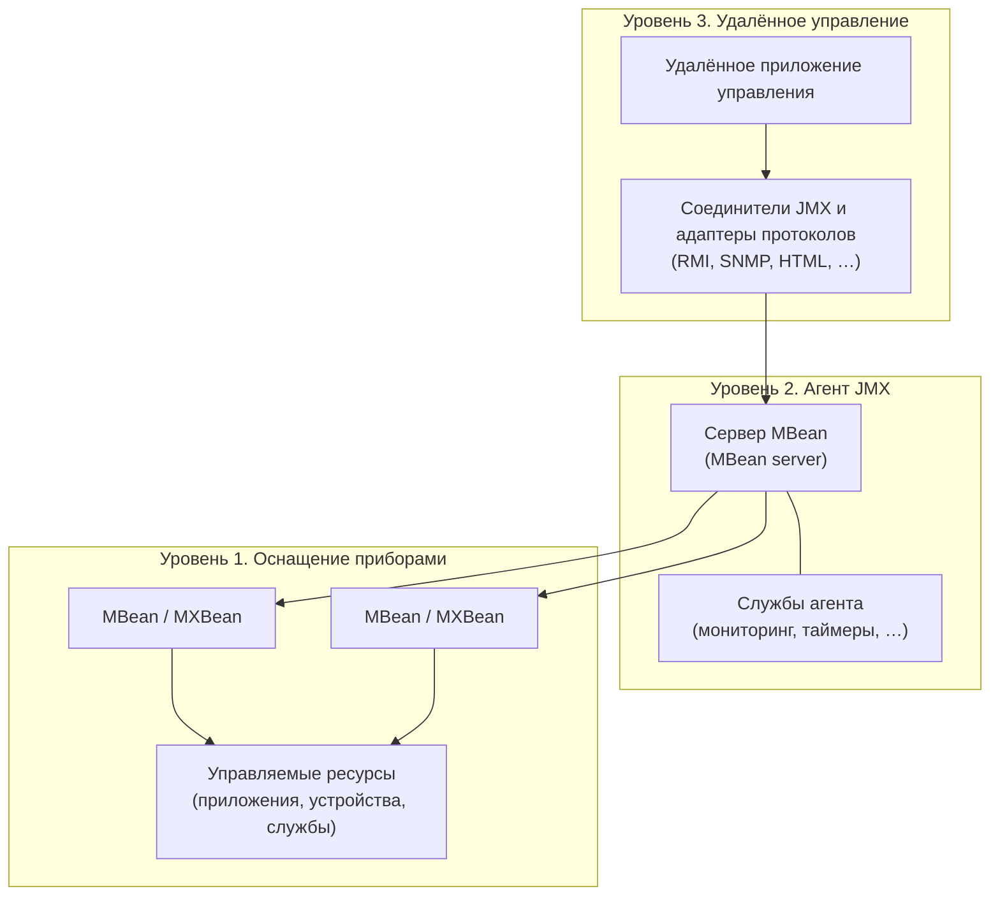

# Урок 1. Обзор технологии JMX

**Трейл:** JMX · **Оригинал:** [Overview](https://docs.oracle.com/javase/tutorial/jmx/overview/index.html)
**Связанные области:** [[22-containers-devops]] · **Вопросы:** containers-devops

> Перевод официального руководства Oracle (The Java Tutorials, JDK 8). Объединяет страницы урока
> *Overview of the JMX Technology*: *Why Use the JMX Technology?*, *Architecture of the JMX Technology*
> и *Monitoring and Management of the Java Virtual Machine*.

Технология расширений управления Java (Java Management Extensions, JMX) — стандартная часть
платформы Java Platform, Standard Edition (платформа Java SE). Технология JMX была добавлена в
платформу в выпуске Java 2 Platform, Standard Edition (J2SE) 5.0.

Технология JMX предоставляет простой стандартный способ управления ресурсами — приложениями,
устройствами и службами. Поскольку технология JMX динамична, её можно использовать для
мониторинга и управления ресурсами по мере их создания, установки и реализации. С помощью JMX
можно также контролировать виртуальную машину Java (Java VM) и управлять ею.

Спецификация JMX определяет архитектуру, шаблоны проектирования, API и службы на языке Java для
управления приложениями и сетями и их мониторинга.

При использовании технологии JMX конкретный ресурс снабжается «приборами» (instrumentation) —
одним или несколькими объектами Java, которые называются **управляемыми компонентами**
(*Managed Beans*, или *MBeans*). Эти MBean-компоненты регистрируются в основном сервере
управляемых объектов — **сервере MBean** (*MBean server*). Сервер MBean выступает в роли агента
управления и может работать на большинстве устройств, поддерживающих язык Java.

Спецификация определяет агенты JMX, которые вы используете для управления любыми ресурсами,
корректно настроенными для управления. Агент JMX состоит из сервера MBean, в котором регистрируются
MBean-компоненты, и набора служб для работы с ними. Таким образом агенты JMX напрямую управляют
ресурсами и делают их доступными для удалённых приложений управления.

Способ оснащения ресурсов приборами полностью независим от инфраструктуры управления. Поэтому
ресурсы можно сделать управляемыми вне зависимости от того, как реализованы приложения управления
ими.

Технология JMX определяет стандартные соединители (известные как соединители JMX, *JMX connectors*),
которые позволяют обращаться к агентам JMX из удалённых приложений управления. Соединители JMX,
работающие по разным протоколам, предоставляют один и тот же интерфейс управления. Следовательно,
приложение управления может управлять ресурсами прозрачно, независимо от используемого протокола
связи. Агенты JMX могут также использоваться системами или приложениями, не соответствующими
спецификации JMX, при условии что эти системы или приложения поддерживают агенты JMX.

## Зачем использовать технологию JMX?

Технология JMX предоставляет разработчикам гибкое средство для оснащения приборами приложений на
основе технологии Java (Java-приложений), создания «умных» агентов, реализации распределённого
промежуточного ПО (middleware) и менеджеров управления, а также для плавной интеграции этих
решений в существующие системы управления и мониторинга.

- **Технология JMX позволяет управлять Java-приложениями без значительных вложений.**
  Агент на основе технологии JMX (агент JMX) может работать на большинстве устройств с поддержкой
  технологии Java. Благодаря этому Java-приложения становятся управляемыми с минимальным влиянием
  на их проектирование. Java-приложению достаточно встроить сервер управляемых объектов и сделать
  часть своей функциональности доступной в виде одного или нескольких управляемых компонентов
  (MBean), зарегистрированных на этом сервере. Это всё, что нужно, чтобы воспользоваться
  инфраструктурой управления.
- **Технология JMX предоставляет стандартный способ управления Java-приложениями, системами и
  сетями.**
  Например, сервер приложений Java Platform, Enterprise Edition (Java EE) 5 соответствует
  архитектуре JMX и, следовательно, может управляться с помощью технологии JMX.
- **Технология JMX может использоваться для «коробочного» (*out-of-the-box*) управления Java VM.**
  Виртуальная машина Java (Java VM) обильно оснащена приборами с помощью технологии JMX. Вы можете
  запустить агент JMX для доступа к встроенным приборам Java VM и тем самым удалённо контролировать
  виртуальную машину Java и управлять ею.
- **Технология JMX предоставляет масштабируемую динамическую архитектуру управления.**
  Каждая служба агента JMX — это независимый модуль, который можно подключить к агенту управления
  в зависимости от требований. Такой компонентный подход означает, что решения JMX масштабируются
  от устройств с малым объёмом ресурсов до крупных телекоммуникационных коммутаторов и далее.
  Спецификация JMX предоставляет набор основных служб агента. Дополнительные службы можно
  разрабатывать и динамически загружать, выгружать или обновлять в инфраструктуре управления.
- **Технология JMX опирается на существующие стандартные технологии Java.**
  Когда это необходимо, спецификация JMX ссылается на существующие спецификации Java — например,
  на API интерфейса именования и каталогов Java (Java Naming and Directory Interface, JNDI).
- **Приложения на основе технологии JMX (JMX-приложения) можно создавать из модуля среды
  разработки NetBeans IDE.**
  В центре обновлений NetBeans (NetBeans Update Center — пункт меню Tools → Update Center в
  интерфейсе NetBeans) можно получить модуль, который позволяет создавать JMX-приложения с помощью
  NetBeans IDE. Это снижает стоимость разработки JMX-приложений.
- **Технология JMX интегрируется с существующими решениями управления и новыми технологиями.**
  API JMX — это открытые интерфейсы, которые может реализовать любой поставщик систем управления.
  Решения JMX могут использовать службы и протоколы поиска и обнаружения, такие как сетевая
  технология Jini и протокол определения местоположения служб (Service Location Protocol, SLP).

## Архитектура технологии JMX

Технологию JMX можно разделить на три уровня:

- оснащение приборами (Instrumentation);
- агент JMX (JMX agent);
- удалённое управление (Remote management).



### Оснащение приборами (Instrumentation)

Чтобы управлять ресурсами с помощью технологии JMX, сначала необходимо оснастить ресурсы приборами
на языке Java. Для реализации доступа к приборам ресурсов используются объекты Java, называемые
**MBean-компонентами** (*MBeans*). MBean-компоненты должны следовать шаблонам проектирования и
интерфейсам, определённым в спецификации JMX. Это гарантирует, что все MBean-компоненты
предоставляют приборы управляемых ресурсов стандартизованным образом. Помимо стандартных
MBean-компонентов, спецификация JMX определяет особый тип MBean — **MXBean**. MXBean — это MBean,
который ссылается только на заранее определённый набор типов данных. Существуют и другие типы
MBean, но этот трейл сосредоточен на стандартных MBean и MXBean.

После того как ресурс оснащён MBean-компонентами, им можно управлять через агент JMX. MBean-компоненты
не обязаны знать о том, с каким агентом JMX они будут работать.

MBean-компоненты спроектированы так, чтобы быть гибкими, простыми и лёгкими в реализации.
Разработчики приложений, систем и сетей могут сделать свои продукты управляемыми стандартным
способом, не углубляясь в сложные системы управления и не вкладываясь в них. Существующие ресурсы
можно сделать управляемыми с минимальными усилиями.

Кроме того, уровень оснащения приборами в спецификации JMX предоставляет механизм уведомлений
(notification). Этот механизм позволяет MBean-компонентам генерировать события-уведомления и
распространять их к компонентам других уровней.

### Агент JMX (JMX Agent)

Агент на основе технологии JMX (агент JMX) — это стандартный агент управления, который напрямую
управляет ресурсами и делает их доступными для удалённых приложений управления. Агенты JMX обычно
располагаются на той же машине, что и управляемые ими ресурсы, но это не является обязательным
требованием.

Основной компонент агента JMX — **сервер MBean** (*MBean server*), сервер управляемых объектов, в
котором регистрируются MBean-компоненты. Агент JMX также включает набор служб для управления
MBean-компонентами и по меньшей мере один адаптер связи или соединитель, чтобы обеспечить доступ
со стороны приложения управления.

При реализации агента JMX вам не нужно знать семантику или функции ресурсов, которыми он будет
управлять. На самом деле агенту JMX даже не нужно знать, какие ресурсы он будет обслуживать,
поскольку любой ресурс, оснащённый приборами в соответствии со спецификацией JMX, может
использовать любой агент JMX, предоставляющий нужные ресурсу службы. Аналогично, агенту JMX не
нужно знать функции приложений управления, которые будут к нему обращаться.

### Удалённое управление (Remote Management)

К приборам технологии JMX можно обращаться многими разными способами — либо через существующие
протоколы управления, такие как простой протокол сетевого управления (Simple Network Management
Protocol, SNMP), либо через проприетарные протоколы. Сервер MBean опирается на адаптеры протоколов
и соединители, чтобы сделать агент JMX доступным для приложений управления за пределами виртуальной
машины Java (Java VM), в которой работает агент.

Каждый адаптер предоставляет через определённый протокол представление всех MBean-компонентов,
зарегистрированных на сервере MBean. Например, адаптер HTML мог бы отображать MBean в браузере.

Соединители предоставляют интерфейс на стороне менеджера, который обеспечивает связь между
менеджером и агентом JMX. Каждый соединитель предоставляет один и тот же интерфейс удалённого
управления через разные протоколы. Когда удалённое приложение управления использует этот интерфейс,
оно может прозрачно подключаться к агенту JMX по сети независимо от протокола. Технология JMX
предоставляет стандартное решение для экспорта приборов технологии JMX в удалённые приложения на
основе удалённого вызова методов Java (Java Remote Method Invocation, Java RMI).

## Мониторинг и управление виртуальной машиной Java

Технологию JMX можно также использовать для мониторинга и управления виртуальной машиной Java
(Java VM).

Java VM имеет встроенные приборы, которые позволяют контролировать её и управлять ею с помощью
технологии JMX. Эти встроенные средства управления часто называют «коробочными»
(*out-of-the-box*) инструментами управления Java VM. Для мониторинга и управления различными
аспектами Java VM виртуальная машина включает платформенный сервер MBean (platform MBean server)
и специальные MXBean-компоненты, предназначенные для приложений управления, соответствующих
спецификации JMX.

### Платформенные MXBean и платформенный сервер MBean

**Платформенные MXBean** (*platform MXBeans*) — это набор MXBean-компонентов, поставляемых вместе
с платформой Java SE для мониторинга и управления Java VM и другими компонентами среды выполнения
Java (Java Runtime Environment, JRE). Каждый платформенный MXBean инкапсулирует часть
функциональности Java VM, такую как система загрузки классов, система оперативной (just-in-time,
JIT) компиляции, сборщик мусора (garbage collector) и т. д. Эти MXBean-компоненты можно отображать
и взаимодействовать с ними при помощи инструмента мониторинга и управления, соответствующего
спецификации JMX, чтобы контролировать различные функциональные возможности виртуальной машины и
управлять ими. Одним из таких инструментов мониторинга и управления является графический
интерфейс пользователя (GUI) JConsole платформы Java SE.

Платформа Java SE предоставляет стандартный **платформенный сервер MBean** (*platform MBean
server*), в котором регистрируются эти платформенные MXBean-компоненты. Платформенный сервер MBean
может также регистрировать любые другие MBean-компоненты, которые вы захотите создать.

### JConsole

Платформа Java SE включает инструмент мониторинга и управления JConsole, который соответствует
спецификации JMX. JConsole использует обширные приборы Java VM (платформенные MXBean) для
предоставления информации о производительности и потреблении ресурсов приложениями, работающими на
платформе Java.

### «Коробочное» управление в действии

Поскольку стандартные средства мониторинга и управления, реализующие технологию JMX, встроены в
платформу Java SE, вы можете увидеть «коробочную» технологию JMX в действии, не написав ни единой
строки кода с использованием API JMX. Для этого достаточно запустить Java-приложение, а затем
наблюдать за ним с помощью JConsole.

### Мониторинг приложения с помощью JConsole

Эта процедура показывает, как наблюдать за Java-приложением Notepad. В выпусках платформы Java SE
ранее версии 6 приложения, которые вы хотите контролировать с помощью JConsole, нужно было
запускать со следующей опцией.

```
-Dcom.sun.management.jmxremote
```

Однако версия JConsole, поставляемая с платформой Java SE 6, может подключаться к любому локальному
приложению, поддерживающему Attach API. Иными словами, любое приложение, запущенное в HotSpot VM
платформы Java SE 6, обнаруживается JConsole автоматически и не требует запуска с указанной выше
опцией командной строки.

1. Запустите Java-приложение Notepad следующей командой в окне терминала:

   ```
   java -jar jdk_home/demo/jfc/Notepad/Notepad.jar
   ```

   где `jdk_home` — каталог, в который установлен Java Development Kit (JDK). Если вы используете
   не версию 6 платформы Java SE, понадобится следующая команда:

   ```
   java -Dcom.sun.management.jmxremote -jar jdk_home/demo/jfc/Notepad/Notepad.jar
   ```

2. После того как откроется Notepad, в другом окне терминала запустите JConsole командой:

   ```
   jconsole
   ```

   Отобразится диалоговое окно New Connection (Новое подключение).

3. В диалоговом окне New Connection выберите `Notepad.jar` из списка Local Process (Локальные
   процессы) и нажмите кнопку Connect (Подключиться).

   JConsole откроется и подключится к процессу `Notepad.jar`. При открытии JConsole вам будет
   представлен обзор информации мониторинга и управления, относящейся к Notepad. Например, вы
   можете увидеть, сколько памяти в куче (heap) потребляет приложение, сколько потоков (threads)
   оно сейчас выполняет и какую долю мощности центрального процессора (CPU) использует.

4. Переключайтесь между разными вкладками JConsole.

   Каждая вкладка представляет более подробную информацию о различных областях функциональности
   Java VM, в которой работает Notepad. Вся отображаемая информация получена от различных
   MXBean-компонентов технологии JMX, упомянутых в этом трейле. Все платформенные MXBean можно
   отобразить на вкладке MBeans. Вкладка MBeans рассматривается в следующем разделе этого трейла.

5. Чтобы закрыть JConsole, выберите Connection → Exit (Подключение → Выход).

## Источник

- [Lesson: Overview of the JMX Technology](https://docs.oracle.com/javase/tutorial/jmx/overview/index.html) — официальное руководство Oracle.
- [Why Use the JMX Technology?](https://docs.oracle.com/javase/tutorial/jmx/overview/why.html)
- [Architecture of the JMX Technology](https://docs.oracle.com/javase/tutorial/jmx/overview/architecture.html)
- [Monitoring and Management of the Java Virtual Machine](https://docs.oracle.com/javase/tutorial/jmx/overview/javavm.html)
