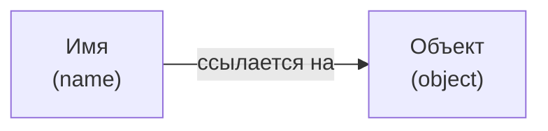
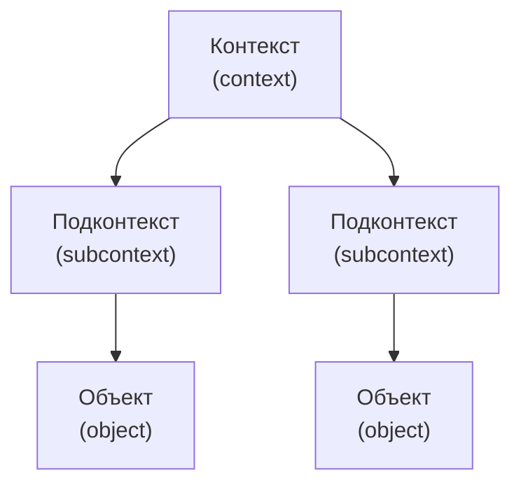
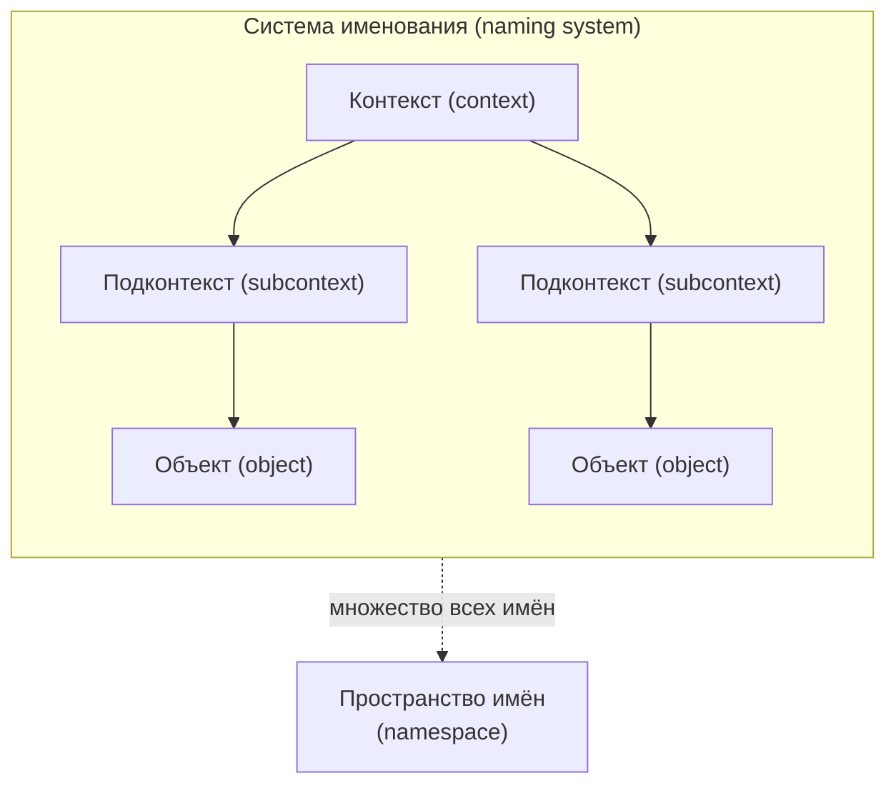
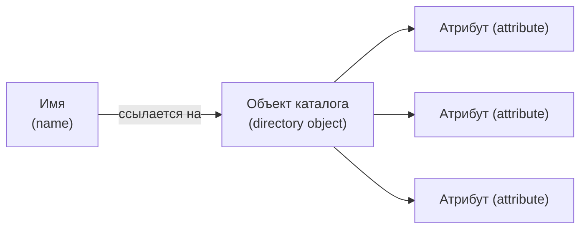
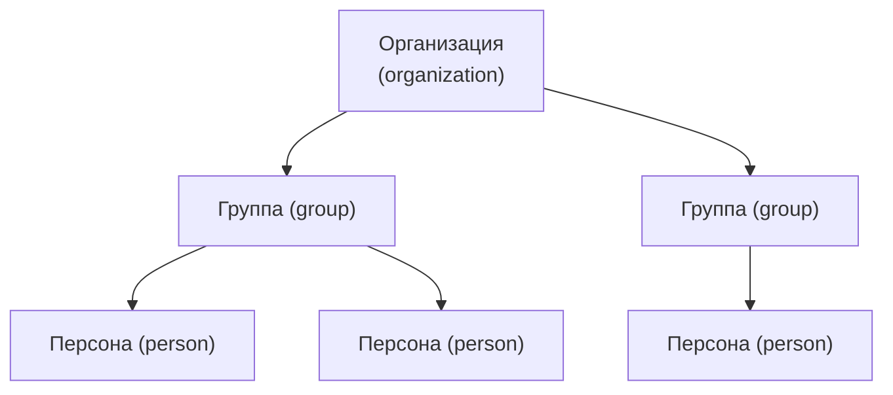

# Урок 1. Концепции именования и каталогов

**Трейл:** JNDI · **Оригинал:** [Naming and Directory Concepts](https://docs.oracle.com/javase/tutorial/jndi/concepts/index.html)
**Связанные области:** [[01-core-java-syntax-oop]] · **Вопросы:** core-java

> Перевод официального руководства Oracle (The Java Tutorials, JDK 8). Объединяет страницы
> *Naming Concepts* и *Directory Concepts* урока *Naming and Directory Concepts* трейла
> *Java Naming and Directory Interface (JNDI)*.

## Концепции именования (Naming Concepts)

Фундаментальное средство любой вычислительной системы — это **служба имён** (*naming service*),
то есть способ, которым имена сопоставляются объектам, а объекты находятся по своим именам.
Практически при использовании любой компьютерной программы или системы вы постоянно именуете
тот или иной объект. Например, работая с электронной почтой, вы должны указать имя получателя.
Чтобы обратиться к файлу на компьютере, вы должны указать его имя. Служба имён позволяет найти
(*look up*) объект по его имени.

<!-- original: assets/20-jndi/naming-system.gif | Имя используется для ссылки на объект -->


*Рисунок: имя используется для ссылки на объект.*

Главная функция службы имён — отображать понятные человеку имена в объекты: адреса,
идентификаторы или объекты, которые обычно используются компьютерными программами.

Например, **служба доменных имён интернета** ([Internet Domain Name System, DNS](http://www.ietf.org/rfc/rfc1034.txt))
отображает имена машин в IP-адреса:

```
www.example.com ==> 192.0.2.5
```

Файловая система отображает имя файла в ссылку на файл, которую программа может использовать
для доступа к содержимому файла:

```
c:\bin\autoexec.bat ==> ссылка на файл (File Reference)
```

Эти два примера также показывают, в каком широком диапазоне масштабов существуют службы имён —
от именования объекта в интернете до именования файла в локальной файловой системе.

### Имена (Names)

Чтобы найти объект в системе именования, вы передаёте ей **имя** (*name*) объекта. Система
именования определяет синтаксис, которому должно следовать имя. Этот синтаксис иногда называют
**соглашением об именовании** (*naming convention*) системы именования. Имя состоит из
**компонентов** (*components*). Представление имени включает **разделитель компонентов**
(*component separator*), отмечающий компоненты имени.

| Система именования | Разделитель компонентов | Имена |
| --- | --- | --- |
| Файловая система UNIX | `/` | `/usr/hello` |
| DNS | `.` | `sales.Wiz.COM` |
| LDAP | `,` и `=` | `cn=Rosanna Lee, o=Sun, c=US` |

Соглашение об именовании файловой системы UNIX состоит в том, что файл именуется по своему пути
относительно корня файловой системы, причём каждый компонент пути отделяется слева направо
символом прямого слеша (`/`). Например, путь UNIX (*pathname*) `/usr/hello` именует файл `hello`
в файловом каталоге `usr`, который расположен в корне файловой системы.

Соглашение об именовании DNS требует, чтобы компоненты в имени DNS упорядочивались справа налево
и разделялись символом точки (`.`). Таким образом, имя DNS `sales.Wiz.COM` именует запись DNS с
именем `sales` относительно записи DNS `Wiz.COM`. Запись DNS `Wiz.COM`, в свою очередь, именует
запись с именем `Wiz` в записи `COM`.

Соглашение об именовании **облегчённого протокола доступа к каталогам**
([Lightweight Directory Access Protocol, LDAP](http://www.ietf.org/rfc/rfc2251.txt)) упорядочивает
компоненты справа налево, разделяя их символом запятой (`,`). Таким образом, имя LDAP
`cn=Rosanna Lee, o=Sun, c=US` именует запись LDAP `cn=Rosanna Lee` относительно записи `o=Sun`,
которая, в свою очередь, задана относительно `c=us`. LDAP имеет дополнительное правило: каждый
компонент имени должен быть парой «имя/значение», где имя и значение разделены символом
равенства (`=`).

### Привязки (Bindings)

Сопоставление имени с объектом называется **привязкой** (*binding*). Имя файла **привязано**
(*bound*) к файлу.

DNS содержит привязки, которые отображают имена машин в IP-адреса. Имя LDAP привязано к записи LDAP.

### Ссылки и адреса (References and Addresses)

В зависимости от службы имён, некоторые объекты не могут храниться в службе имён напрямую — то
есть копию объекта нельзя поместить внутрь службы имён. Вместо этого они должны храниться по
**ссылке** (*reference*): внутрь службы имён помещается **указатель** (*pointer*) или ссылка на
объект. Ссылка представляет информацию о том, как получить доступ к объекту. Обычно это компактное
представление, которое можно использовать для связи с объектом, тогда как сам объект может
содержать больше информации о состоянии. Используя ссылку, вы можете связаться с объектом и
получить о нём дополнительную информацию.

Например, объект «самолёт» может содержать список пассажиров и экипажа, план полёта, состояние
топлива и приборов, номер рейса и время вылета. Напротив, ссылка на объект «самолёт» может
содержать лишь номер рейса и время вылета. Ссылка — это гораздо более компактное представление
информации об объекте «самолёт», и её можно использовать для получения дополнительных сведений.
Например, к объекту «файл» обращаются с помощью **ссылки на файл** (*file reference*). Объект
«принтер», к примеру, может содержать состояние принтера: текущую очередь печати и количество
бумаги в лотке. Ссылка же на объект «принтер» может содержать только информацию о том, как достичь
принтера, — например, имя сервера печати и протокол печати.

Хотя в общем случае ссылка может содержать произвольную информацию, её содержимое удобно
называть **адресами** (*addresses*), или коммуникационными конечными точками: конкретной
информацией о том, как получить доступ к объекту.

Для простоты в этом руководстве слово «объект» используется для обозначения как объектов, так и
ссылок на объекты, когда различие между ними несущественно.

### Контекст (Context)

**Контекст** (*context*) — это набор привязок «имя—объект». С каждым контекстом связано
соглашение об именовании. Контекст всегда предоставляет операцию поиска (**разрешения**,
*resolution*), которая возвращает объект; обычно он также предоставляет операции для привязки имён,
отвязки имён и перечисления привязанных имён. Имя в одном объекте-контексте может быть привязано к
другому объекту-контексту (называемому **подконтекстом**, *subcontext*), имеющему то же
соглашение об именовании.

<!-- original: assets/20-jndi/context.gif | Несколько примеров контекстов, привязанных к подконтекстам -->


*Рисунок: несколько примеров контекстов, привязанных к подконтекстам.*

Файловый каталог, такой как `/usr` в файловой системе UNIX, представляет контекст. Файловый
каталог, именованный относительно другого файлового каталога, представляет подконтекст
(пользователи UNIX называют это **подкаталогом**, *subdirectory*). То есть в файловом каталоге
`/usr/bin` каталог `bin` является подконтекстом каталога `usr`. Домен DNS, такой как `COM`,
представляет контекст. Домен DNS, именованный относительно другого домена DNS, представляет
подконтекст. Для домена DNS `Sun.COM` домен DNS `Sun` является подконтекстом `COM`.

Наконец, запись LDAP, такая как `c=us`, представляет контекст. Запись LDAP, именованная
относительно другой записи LDAP, представляет подконтекст. Для записи LDAP `o=sun,c=us` запись
`o=sun` является подконтекстом `c=us`.

### Системы именования и пространства имён (Naming Systems and Namespaces)

**Система именования** (*naming system*) — это связанный набор контекстов одного типа (имеющих
одинаковое соглашение об именовании), предоставляющий общий набор операций.

Система, реализующая DNS, является системой именования. Система, обменивающаяся данными по LDAP,
является системой именования.

Система именования предоставляет своим потребителям **службу имён** (*naming service*) для
выполнения операций, связанных с именованием. Доступ к службе имён осуществляется через её
собственный интерфейс. DNS предлагает службу имён, которая отображает имена машин в IP-адреса.
LDAP предлагает службу имён, которая отображает имена LDAP в записи LDAP. Файловая система
предлагает службу имён, которая отображает имена файлов в файлы и каталоги.

**Пространство имён** (*namespace*) — это множество всех возможных имён в системе именования.
Файловая система UNIX имеет пространство имён, состоящее из всех имён файлов и каталогов в этой
файловой системе. Пространство имён DNS содержит имена доменов и записей DNS. Пространство имён
LDAP содержит имена записей LDAP.

<!-- original: none | Авторская схема, объединяющая два понятия (система именования + пространство имён) без соответствующего оригинального рисунка Oracle -->


*Схема: система именования — связанный набор контекстов с единым соглашением об именовании;
множество всех имён в ней образует пространство имён.*

## Концепции каталогов (Directory Concepts)

Многие службы имён расширяются **службой каталогов** (*directory service*). Служба каталогов
сопоставляет имена объектам, а также сопоставляет таким объектам **атрибуты** (*attributes*).

```
служба каталогов = служба имён + объекты, содержащие атрибуты
```

Вы можете не только найти объект по его имени, но и получить атрибуты объекта или выполнить
**поиск** (*search*) объекта на основе его атрибутов.

<!-- original: assets/20-jndi/directory-system.gif | Служба каталогов: имя ссылается на объект каталога, содержащий атрибуты -->


*Рисунок: система каталогов — имя ссылается на объект каталога, который содержит атрибуты.*

Пример — служба каталогов телефонной компании. Она отображает имя абонента в его адрес и номер
телефона. Служба каталогов компьютера во многом похожа на службу каталогов телефонной компании:
обе могут использоваться для хранения такой информации, как номера телефонов и адреса. Однако
служба каталогов компьютера гораздо мощнее, поскольку она доступна онлайн и может использоваться
для хранения разнообразной информации, которой могут пользоваться пользователи, программы и даже
сам компьютер и другие компьютеры.

**Объект каталога** (*directory object*) представляет объект в вычислительном окружении. Объект
каталога может использоваться, например, для представления принтера, человека, компьютера или
сети. Объект каталога содержит **атрибуты**, описывающие представляемый им объект.

### Атрибуты (Attributes)

Объект каталога может иметь **атрибуты** (*attributes*). Например, принтер может быть представлен
объектом каталога, имеющим в качестве атрибутов скорость, разрешение и цветность. Пользователь
может быть представлен объектом каталога, имеющим в качестве атрибутов адрес электронной почты,
различные номера телефонов, почтовый адрес и сведения об учётной записи на компьютере.

Атрибут имеет **идентификатор атрибута** (*attribute identifier*) и набор **значений атрибута**
(*attribute values*). Идентификатор атрибута — это токен, идентифицирующий атрибут независимо от
его значений. Например, две разные учётные записи компьютера могут иметь атрибут «mail»; «mail» —
это идентификатор атрибута. Значение атрибута — это содержимое атрибута. Например, адрес
электронной почты может иметь:

```
Идентификатор атрибута : Значение атрибута
                   mail   john.smith@example.com
```

### Каталоги и службы каталогов (Directories and Directory Services)

**Каталог** (*directory*) — это связанный набор объектов каталога. **Служба каталогов**
(*directory service*) — это служба, предоставляющая операции для создания, добавления, удаления и
изменения атрибутов, связанных с объектами в каталоге. Доступ к службе осуществляется через её
собственный интерфейс.

Возможны многие примеры служб каталогов.

**Сетевая информационная служба (Network Information Service, NIS)**

NIS — это служба каталогов, доступная в операционной системе UNIX, для хранения системной
информации, например относящейся к машинам, сетям, принтерам и пользователям.

**[Oracle Directory Server](http://www.oracle.com/technetwork/testcontent/index-085178.html)**

Oracle Directory Server — это служба каталогов общего назначения, основанная на интернет-стандарте
[LDAP](http://www.ietf.org/rfc/rfc2251.txt).

### Служба поиска (Search Service)

Вы можете найти объект каталога, передав службе каталогов его имя. В качестве альтернативы многие
каталоги, например основанные на LDAP, поддерживают понятие **поиска** (*searches*). При поиске вы
передаёте не имя, а **запрос** (*query*), состоящий из логического выражения, в котором вы
указываете атрибуты, которыми должен обладать объект или объекты. Этот запрос называется
**фильтром поиска** (*search filter*). Такой стиль поиска иногда называют **обратным поиском**
(*reverse lookup*) или **поиском по содержимому** (*content-based searching*). Служба каталогов
ищет и возвращает объекты, удовлетворяющие фильтру поиска.

Например, вы можете запросить у службы каталогов:

- всех пользователей, у которых атрибут «age» (возраст) больше 40 лет;
- все машины, IP-адрес которых начинается с «192.113.50».

### Объединение служб имён и каталогов (Combining Naming and Directory Services)

Каталоги часто упорядочивают свои объекты в иерархию. Например, LDAP упорядочивает все объекты
каталога в дерево, называемое **информационным деревом каталога** (*directory information tree,
DIT*). Внутри DIT объект-организация, например, может содержать объекты-группы, которые, в свою
очередь, могут содержать объекты-персоны. Когда объекты каталога упорядочены таким образом, они
играют роль контекстов именования вдобавок к роли контейнеров атрибутов.

<!-- original: none | Авторская схема информационного дерева каталога LDAP; оригинальный рисунок Oracle для этого раздела отсутствует -->


*Схема: информационное дерево каталога (DIT) — объекты-организации содержат объекты-группы,
которые содержат объекты-персоны; каждый узел одновременно является контекстом именования и
контейнером атрибутов.*

## Источник

- [Naming and Directory Concepts (Naming Concepts)](https://docs.oracle.com/javase/tutorial/jndi/concepts/index.html) — официальное руководство Oracle.
- [Directory Concepts](https://docs.oracle.com/javase/tutorial/jndi/concepts/directory.html) — официальное руководство Oracle.
