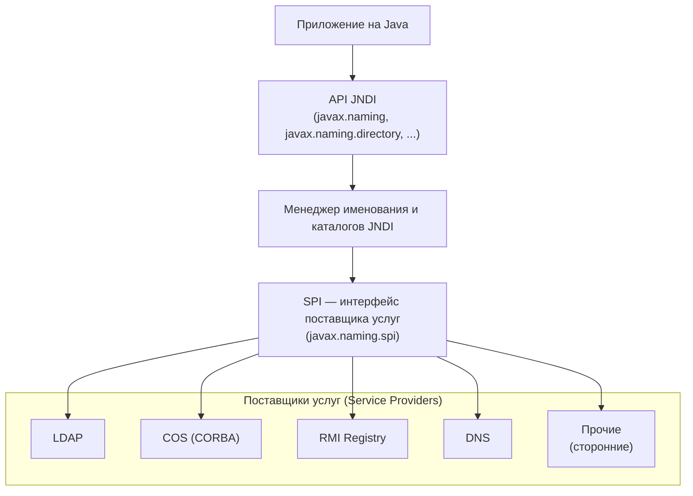

# Урок 2. Обзор JNDI

**Трейл:** JNDI · **Оригинал:** [JNDI Overview](https://docs.oracle.com/javase/tutorial/jndi/overview/index.html)
**Связанные области:** [[01-core-java-syntax-oop]] · **Вопросы:** core-java

> Перевод официального руководства Oracle (The Java Tutorials, JDK 8). Объединяет страницы
> урока *Overview of JNDI*: вводную *Architecture / Packaging*, *Naming Package*,
> *Directory and LDAP Packages* и *Event and Service Provider Packages*.

Интерфейс именования и каталогов Java (Java Naming and Directory Interface™, JNDI) — это
программный интерфейс приложений (API), который предоставляет приложениям, написанным на языке
программирования Java™, функциональность именования (*naming*) и каталогов (*directory*). Он
определён независимо от какой-либо конкретной реализации службы каталогов. Благодаря этому к
самым разным каталогам — новым, появляющимся и уже развёрнутым — можно обращаться единообразно.

## Архитектура

Архитектура JNDI состоит из API и интерфейса поставщика услуг (Service Provider Interface, SPI).
Приложения на Java используют API JNDI для доступа к различным службам именования и каталогов. SPI
позволяет прозрачно подключать самые разные службы именования и каталогов, давая тем самым
приложению на Java, которое использует API JNDI, доступ к их услугам.

<!-- original: assets/20-jndi/jndiarch.gif | Архитектура JNDI: приложение → API → SPI → поставщики услуг (LDAP, CORBA, RMI, DNS) -->

## Поставка (Packaging)

JNDI входит в состав платформы Java SE. Чтобы пользоваться JNDI, нужны классы JNDI и один или
несколько поставщиков услуг (*service providers*). В состав JDK входят поставщики услуг для
следующих служб именования/каталогов:

- Облегчённый протокол доступа к каталогам (Lightweight Directory Access Protocol, LDAP);
- служба имён COS (Common Object Services name service) архитектуры CORBA (Common Object Request
  Broker Architecture);
- реестр удалённого вызова методов Java (Java Remote Method Invocation, RMI) — RMI Registry;
- служба доменных имён (Domain Name Service, DNS).

Другие поставщики услуг можно загрузить со страницы JNDI либо получить у иных производителей.

JNDI разделён на пять пакетов:

- `javax.naming`
- `javax.naming.directory`
- `javax.naming.ldap`
- `javax.naming.event`
- `javax.naming.spi`

## Пакет именования (Naming Package)

Пакет [`javax.naming`](https://docs.oracle.com/javase/8/docs/api/javax/naming/package-summary.html)
содержит классы и интерфейсы для доступа к службам именования.

### Контекст (Context)

Пакет `javax.naming` определяет интерфейс
[`Context`](https://docs.oracle.com/javase/8/docs/api/javax/naming/Context.html) — основной
интерфейс для поиска объектов, их привязки/отвязки (*binding/unbinding*), переименования, а также
для создания и уничтожения подконтекстов (*subcontexts*).

**Поиск (Lookup)**

Чаще всего используется операция
[`lookup()`](https://docs.oracle.com/javase/8/docs/api/javax/naming/Context.html#lookup-javax.naming.Name-).
Вы передаёте `lookup()` имя объекта, который хотите найти, а метод возвращает объект, привязанный
к этому имени.

**Привязки (Bindings)**

[`listBindings()`](https://docs.oracle.com/javase/8/docs/api/javax/naming/Context.html#listBindings-javax.naming.Name-)
возвращает перечисление (*enumeration*) привязок «имя — объект». Привязка (*binding*) — это кортеж,
содержащий имя привязанного объекта, имя класса этого объекта и сам объект.

**Список (List)**

[`list()`](https://docs.oracle.com/javase/8/docs/api/javax/naming/Context.html#list-javax.naming.Name-)
похож на `listBindings()`, но возвращает перечисление имён, содержащее имя объекта и имя его класса.
`list()` полезен для приложений вроде браузеров, которым нужно узнать информацию об объектах,
привязанных в контексте, но не нужны сами объекты целиком. Хотя `listBindings()` предоставляет ту
же информацию, это потенциально гораздо более затратная операция.

**Имя (Name)**

`Name` — это интерфейс, представляющий обобщённое имя — упорядоченную последовательность из нуля
или более компонентов. Системы именования используют этот интерфейс для описания имён, следующих
их соглашениям, как это описано в уроке *Naming and Directory Concepts* (Концепции именования и
каталогов).

**Ссылки (References)**

Объекты хранятся в службах именования и каталогов по-разному. Ссылка (*reference*) может быть очень
компактным представлением объекта.

JNDI определяет класс
[`Reference`](https://docs.oracle.com/javase/8/docs/api/javax/naming/Reference.html) для
представления ссылки. Ссылка содержит сведения о том, как сконструировать копию объекта. JNDI будет
пытаться превращать ссылки, найденные в каталоге, в Java-объекты, которые они представляют, — так
что у клиентов JNDI создаётся иллюзия, будто в каталоге хранятся именно Java-объекты.

### Начальный контекст (The Initial Context)

В JNDI все операции именования и каталогов выполняются относительно некоторого контекста.
Абсолютных корней не существует. Поэтому JNDI определяет
[`InitialContext`](https://docs.oracle.com/javase/8/docs/api/javax/naming/InitialContext.html) —
начальный контекст, который служит отправной точкой для операций именования и каталогов. Получив
начальный контекст, вы можете использовать его для поиска других контекстов и объектов.

### Исключения (Exceptions)

JNDI определяет иерархию классов для исключений, которые могут возникать при выполнении операций
именования и каталогов. Корнем этой иерархии классов является
[`NamingException`](https://docs.oracle.com/javase/8/docs/api/javax/naming/NamingException.html).
Программы, которым важно обработать конкретное исключение, могут перехватывать соответствующий
подкласс этого исключения. В остальных случаях им следует перехватывать `NamingException`.

## Пакеты каталогов и LDAP (Directory and LDAP Packages)

### Пакет каталогов (Directory Package)

Пакет
[`javax.naming.directory`](https://docs.oracle.com/javase/8/docs/api/javax/naming/directory/package-summary.html)
расширяет пакет
[`javax.naming`](https://docs.oracle.com/javase/8/docs/api/javax/naming/package-summary.html),
добавляя — в дополнение к службам именования — функциональность доступа к службам каталогов. Этот
пакет позволяет приложениям извлекать атрибуты, связанные с объектами, хранящимися в каталоге, и
выполнять поиск объектов по заданным атрибутам.

#### Контекст каталога (The Directory Context)

Интерфейс
[`DirContext`](https://docs.oracle.com/javase/8/docs/api/javax/naming/directory/DirContext.html)
представляет *контекст каталога* (*directory context*). `DirContext` ведёт себя также и как
контекст именования, расширяя интерфейс
[`Context`](https://docs.oracle.com/javase/8/docs/api/javax/naming/Context.html). Это означает, что
любой объект каталога может одновременно служить и контекстом именования. Интерфейс определяет
методы для просмотра и обновления атрибутов, связанных с записью каталога.

##### Атрибуты (Attributes)

Метод
[`getAttributes()`](https://docs.oracle.com/javase/8/docs/api/javax/naming/directory/DirContext.html#getAttributes-javax.naming.Name-)
используется для извлечения атрибутов, связанных с записью каталога (имя которой вы указываете).
Атрибуты изменяются методом
[`modifyAttributes()`](https://docs.oracle.com/javase/8/docs/api/javax/naming/directory/DirContext.html#modifyAttributes-javax.naming.Name-javax.naming.directory.ModificationItem:A-).
С помощью этой операции вы можете добавлять, заменять или удалять атрибуты и/или значения атрибутов.

##### Поиск (Searches)

`DirContext` содержит методы для контентного поиска по каталогу (*content based searching*). В
простейшей и наиболее распространённой форме использования приложение задаёт набор атрибутов —
возможно, с конкретными значениями для сопоставления — и передаёт этот набор атрибутов методу
[`search()`](https://docs.oracle.com/javase/8/docs/api/javax/naming/directory/DirContext.html#search-javax.naming.Name-javax.naming.directory.Attributes-).
Другие перегруженные формы метода
[`search()`](https://docs.oracle.com/javase/8/docs/api/javax/naming/directory/DirContext.html#search-javax.naming.Name-java.lang.String-javax.naming.directory.SearchControls-)
поддерживают более сложные фильтры поиска.

### Пакет LDAP (LDAP Package)

Пакет
[`javax.naming.ldap`](https://docs.oracle.com/javase/8/docs/api/javax/naming/ldap/package-summary.html)
содержит классы и интерфейсы для использования возможностей, специфичных для
[LDAP v3](http://www.ietf.org/rfc/rfc2251.txt), которые ещё не покрыты более общим пакетом
[`javax.naming.directory`](https://docs.oracle.com/javase/8/docs/api/javax/naming/directory/package-summary.html).
На практике большинству JNDI-приложений, использующих LDAP, пакета `javax.naming.directory`
оказывается достаточно, и пакет `javax.naming.ldap` им вообще не нужен. Этот пакет предназначен
прежде всего для тех приложений, которым нужны «расширенные» операции (*"extended" operations*),
элементы управления (*controls*) или непрошеные уведомления (*unsolicited notifications*).

#### «Расширенная» операция (Extended Operation)

Помимо определения чётко описанных операций — таких как поиск и изменение —
[LDAP v3 (RFC 2251)](http://www.ietf.org/rfc/rfc2251.txt) задаёт способ передавать между
LDAP-клиентом и сервером операции, которые ещё только предстоит определить. Такие операции
называются *«расширенными» операциями* (*"extended" operations*). «Расширенная» операция может быть
определена организацией по стандартизации, например Инженерным советом Интернета (Internet
Engineering Task Force, IETF), или производителем.

#### Элементы управления (Controls)

[LDAP v3](http://www.ietf.org/rfc/rfc2251.txt) позволяет дополнять любой запрос или ответ ещё не
определёнными модификаторами, которые называются *элементами управления* (*controls*). Элемент
управления, отправленный вместе с запросом, — это *элемент управления запроса* (*request control*),
а отправленный вместе с ответом — *элемент управления ответа* (*response control*). Элемент
управления может быть определён организацией по стандартизации, например IETF, или производителем.
Элементы управления запроса и ответа не обязательно образуют пары: для каждого отправленного
элемента управления запроса не обязательно существует элемент управления ответа, и наоборот.

#### Непрошеные уведомления (Unsolicited Notifications)

Помимо обычного взаимодействия «запрос — ответ» между клиентом и сервером,
[LDAP v3](http://www.ietf.org/rfc/rfc2251.txt) задаёт также *непрошеные уведомления* (*unsolicited
notifications*) — сообщения, которые сервер отправляет клиенту асинхронно, а не в ответ на
какой-либо запрос клиента.

#### Контекст LDAP (The LDAP Context)

Интерфейс
[`LdapContext`](https://docs.oracle.com/javase/8/docs/api/javax/naming/ldap/LdapContext.html)
представляет *контекст* для выполнения «расширенных» операций, отправки элементов управления
запроса и получения элементов управления ответа. Примеры использования этих возможностей описаны в
уроке *Controls and Extensions* руководства
[JNDI Tutorial](https://docs.oracle.com/javase/jndi/tutorial/ldap/ext/index.html).

## Пакеты событий и поставщика услуг (Event and Service Provider Packages)

### Пакет событий (Event Package)

Пакет
[`javax.naming.event`](https://docs.oracle.com/javase/8/docs/api/javax/naming/event/package-summary.html)
содержит классы и интерфейсы для поддержки уведомления о событиях (*event notification*) в службах
именования и каталогов. Уведомление о событиях подробно описано в трейле *Event Notification*
(Уведомление о событиях).

**События (Events)**

[`NamingEvent`](https://docs.oracle.com/javase/8/docs/api/javax/naming/event/NamingEvent.html)
представляет событие, сгенерированное службой именования/каталогов. Событие содержит *тип* (*type*),
который определяет вид события. Например, типы событий делятся на те, что затрагивают пространство
имён (*namespace*) — такие как «объект добавлен» (*object added*), — и те, что его не затрагивают,
например «объект изменён» (*object changed*).

**Слушатели (Listeners)**

[`NamingListener`](https://docs.oracle.com/javase/8/docs/api/javax/naming/event/NamingListener.html) —
это объект, который слушает события `NamingEvent`. Каждой категории типов событий соответствует свой
тип `NamingListener`. Например,
[`NamespaceChangeListener`](https://docs.oracle.com/javase/8/docs/api/javax/naming/event/NamespaceChangeListener.html)
представляет слушателя, заинтересованного в событиях изменения пространства имён, а
[`ObjectChangeListener`](https://docs.oracle.com/javase/8/docs/api/javax/naming/event/ObjectChangeListener.html)
представляет слушателя, заинтересованного в событиях изменения объекта.

Чтобы получать уведомления о событиях, слушатель должен быть зарегистрирован в
[`EventContext`](https://docs.oracle.com/javase/8/docs/api/javax/naming/event/EventContext.html) или
в
[`EventDirContext`](https://docs.oracle.com/javase/8/docs/api/javax/naming/event/EventDirContext.html).
После регистрации слушатель будет получать уведомления о событиях, когда в службе
именования/каталогов происходят соответствующие изменения. Подробности об уведомлении о событиях
можно найти в [руководстве JNDI](https://docs.oracle.com/javase/jndi/tutorial/beyond/event/index.html).

### Пакет поставщика услуг (Service Provider Package)

Пакет
[`javax.naming.spi`](https://docs.oracle.com/javase/8/docs/api/javax/naming/spi/package-summary.html)
предоставляет средства, с помощью которых разработчики различных поставщиков служб именования/
каталогов могут разрабатывать и подключать свои реализации так, чтобы соответствующие службы стали
доступны из приложений, использующих JNDI.

**Архитектура подключаемых модулей (Plug-In Architecture)**

Пакет `javax.naming.spi` позволяет динамически подключать различные реализации. К таким реализациям
относятся реализации для начального контекста (*initial context*) и для контекстов, до которых можно
добраться из начального контекста.

**Поддержка Java-объектов (Java Object Support)**

Пакет `javax.naming.spi` помогает разработчикам методов поиска (*lookup*) и связанных с ними
возвращать Java-объекты, которые естественны и интуитивно понятны Java-программисту. Например, если
вы ищете имя принтера в каталоге, то, скорее всего, ожидаете получить обратно объект принтера, с
которым можно работать. Эта поддержка реализуется в форме *фабрик объектов* (*object factories*).

Этот пакет также обеспечивает поддержку обратного процесса. То есть разработчики методов
[`Context.bind()`](https://docs.oracle.com/javase/8/docs/api/javax/naming/Context.html#bind-javax.naming.Name-java.lang.Object-)
и связанных с ним могут принимать Java-объекты и сохранять их в формате, приемлемом для нижележащей
службы именования/каталогов. Эта поддержка реализуется в форме *фабрик состояния* (*state
factories*).

**Несколько систем именования (федерация)**

Операции JNDI позволяют приложениям передавать имена, охватывающие несколько систем именования
(*Federation*). В процессе выполнения операции одному поставщику услуг может потребоваться
взаимодействовать с другим поставщиком услуг — например, чтобы передать ему операцию для
продолжения в следующей системе именования. Этот пакет обеспечивает поддержку взаимодействия разных
поставщиков для совместного выполнения операций JNDI.

Подробности о механизме поставщика услуг можно найти в
[руководстве JNDI](https://docs.oracle.com/javase/jndi/tutorial/provider/index.html).

## Источник

- [Lesson: Overview of JNDI](https://docs.oracle.com/javase/tutorial/jndi/overview/index.html) — официальное руководство Oracle (Architecture, Packaging).
- [Naming Package](https://docs.oracle.com/javase/tutorial/jndi/overview/naming.html) — официальное руководство Oracle.
- [Directory and LDAP Packages](https://docs.oracle.com/javase/tutorial/jndi/overview/dir.html) — официальное руководство Oracle.
- [Event and Service Provider Packages](https://docs.oracle.com/javase/tutorial/jndi/overview/event.html) — официальное руководство Oracle.
