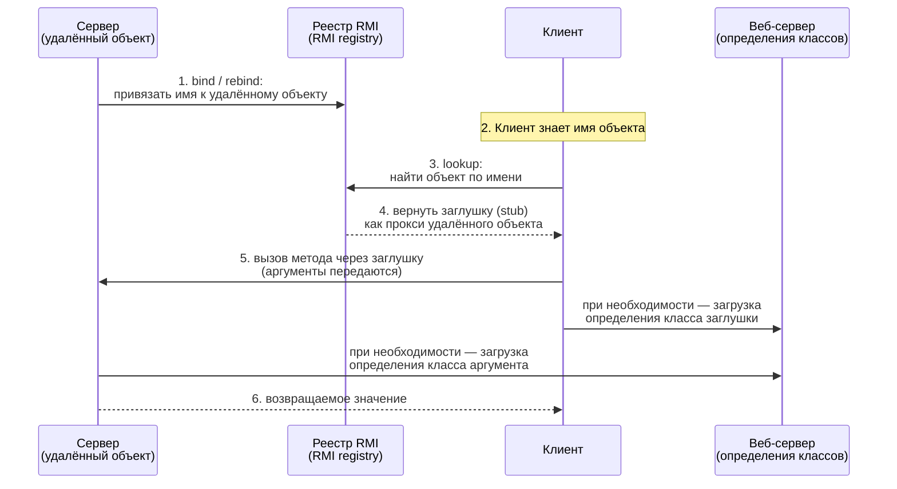

# Урок 1. Обзор RMI-приложений

**Трейл:** RMI · **Оригинал:** [An Overview of RMI Applications](https://docs.oracle.com/javase/tutorial/rmi/overview.html)
**Связанные области:** [[20-microservices]] · **Вопросы:** microservices

> Перевод официального руководства Oracle (The Java Tutorials, JDK 8), страница
> *An Overview of RMI Applications*.

Технология **RMI** (Remote Method Invocation — удалённый вызов методов) позволяет объекту,
работающему в одной виртуальной машине Java (Java VM), вызывать методы объекта, который
работает в другой виртуальной машине Java, в том числе на другом физическом компьютере. RMI
обеспечивает взаимодействие распределённого приложения и берёт на себя детали удалённой связи,
оставляя программисту работу, похожую на обычные вызовы методов Java.

## Распределённое приложение на RMI

RMI-приложения, как правило, состоят из **двух отдельных программ** — **сервера** (*server*)
и **клиента** (*client*).

- Типичная **серверная программа** создаёт некоторое количество **удалённых объектов**
  (*remote objects*), делает ссылки на эти объекты доступными для обращения и ждёт, пока
  клиенты не вызовут методы этих объектов.
- Типичная **клиентская программа** получает удалённую ссылку (*remote reference*) на один или
  несколько удалённых объектов на сервере, а затем вызывает их методы.

RMI предоставляет механизм, с помощью которого сервер и клиент взаимодействуют и передают
информацию туда и обратно. Такое приложение иногда называют **распределённым объектным
приложением** (*distributed object application*).

### Что нужно распределённым объектным приложениям

Распределённым объектным приложениям необходимо выполнять следующее.

- **Находить удалённые объекты** (*Locate remote objects*). Приложения могут использовать
  различные механизмы для получения ссылок на удалённые объекты. Например, приложение может
  зарегистрировать свои удалённые объекты в простом сервисе именования RMI — **реестре RMI**
  (*RMI registry*). Либо приложение может передавать и возвращать ссылки на удалённые объекты
  как часть других удалённых вызовов.
- **Взаимодействовать с удалёнными объектами** (*Communicate with remote objects*). Детали
  связи между удалёнными объектами берёт на себя RMI. Для программиста удалённое взаимодействие
  выглядит так же, как обычный вызов методов Java.
- **Загружать определения классов для передаваемых объектов** (*Load class definitions for
  objects that are passed around*). Поскольку RMI позволяет передавать объекты туда и обратно,
  он предоставляет механизмы как для загрузки определений классов объекта, так и для передачи
  данных этого объекта.

## Как RMI передаёт объекты

RMI обрабатывает удалённый объект иначе, чем не-удалённый, когда объект передаётся из одной
виртуальной машины Java в другую. Вместо того чтобы создавать копию объекта-реализации в
принимающей виртуальной машине Java, RMI передаёт **удалённую заглушку** (*remote stub*) для
удалённого объекта. Заглушка выступает как локальный представитель, или **прокси** (*proxy*),
удалённого объекта и, по сути, для клиента является удалённой ссылкой.

Иными словами:

- **Не-удалённые (локальные) объекты** передаются как аргументы и возвращаемые значения
  **по значению** — копированием с помощью **сериализации объектов Java** (*Java object
  serialization*). При этом сохраняется фактический класс объекта.
- **Удалённые объекты** передаются **по ссылке**: на самом деле передаётся заглушка (stub),
  через которую вызывающая сторона обращается к удалённому объекту.

### Схема: реестр, заглушка, веб-сервер

Распределённое RMI-приложение использует **реестр RMI** для получения ссылки на удалённый
объект. Сервер обращается к реестру, чтобы связать (или **привязать**, *bind*) имя с удалённым
объектом. Клиент ищет (*look up*) удалённый объект по имени в реестре сервера, а затем вызывает
его метод. При необходимости RMI использует существующий **веб-сервер** (*web server*) для
загрузки определений классов — как от сервера к клиенту, так и от клиента к серверу — для
передаваемых объектов.

<!-- original: assets/22-rmi/rmi-2.gif | RMI-система: сервер регистрирует объект, клиент получает заглушку через реестр, веб-сервер загружает определения классов -->


Заглушка (stub) на стороне клиента маршалит (упаковывает) аргументы вызова и передаёт их
удалённому объекту; на стороне сервера вызов демаршалится, выполняется фактический метод, а
результат возвращается обратно клиенту. Программисту все эти детали не видны — он работает так,
как будто вызывает обычный метод.

## Преимущества динамической загрузки кода

Одна из центральных и уникальных особенностей RMI — способность **загружать определение класса
объекта**, если этот класс не определён в виртуальной машине Java получателя. Все типы и всё
поведение объекта, ранее доступные только в одной виртуальной машине Java, могут быть переданы
в другую — возможно, удалённую — виртуальную машину Java.

RMI передаёт объекты **по их фактическим классам** (*by their actual classes*), поэтому
поведение объектов не меняется при отправке в другую виртуальную машину Java. Эта возможность
позволяет вводить новые типы и виды поведения в удалённую виртуальную машину Java, тем самым
**динамически расширяя** поведение приложения. Пример вычислительного движка (*compute engine*)
в этом трейле использует данную возможность, чтобы внедрять новое поведение в распределённую
программу.

Именно эту способность передавать **мобильный код** (*mobile code*) — переносить вместе с
данными ещё и поведение классов — RMI делает своей сильной стороной: получателю не обязательно
заранее знать классы передаваемых объектов, он может загрузить их определения во время работы.

## Пример удалённого интерфейса

Удалённый объект описывается **удалённым интерфейсом** (*remote interface*) — интерфейсом Java,
который расширяет `java.rmi.Remote`, а каждый его метод объявляет, что может выбросить
`java.rmi.RemoteException`. Клиент работает с удалённым объектом через этот интерфейс, не зная
его конкретной реализации на сервере.

```java
import java.rmi.Remote;
import java.rmi.RemoteException;

// Удалённый интерфейс расширяет java.rmi.Remote.
// Каждый удалённый метод должен объявлять java.rmi.RemoteException
// (или её суперкласс) в секции throws.
public interface Hello extends Remote {
    // Возвращает приветствие удалённого объекта вызывающему клиенту.
    String sayHello() throws RemoteException;
}
```

Клиент получает заглушку (stub), реализующую этот интерфейс, и вызывает `sayHello()` так, как
если бы объект находился локально, — RMI прозрачно выполняет удалённый вызов.

## Источник

- [An Overview of RMI Applications](https://docs.oracle.com/javase/tutorial/rmi/overview.html) — официальное руководство Oracle (The Java Tutorials, JDK 8).
