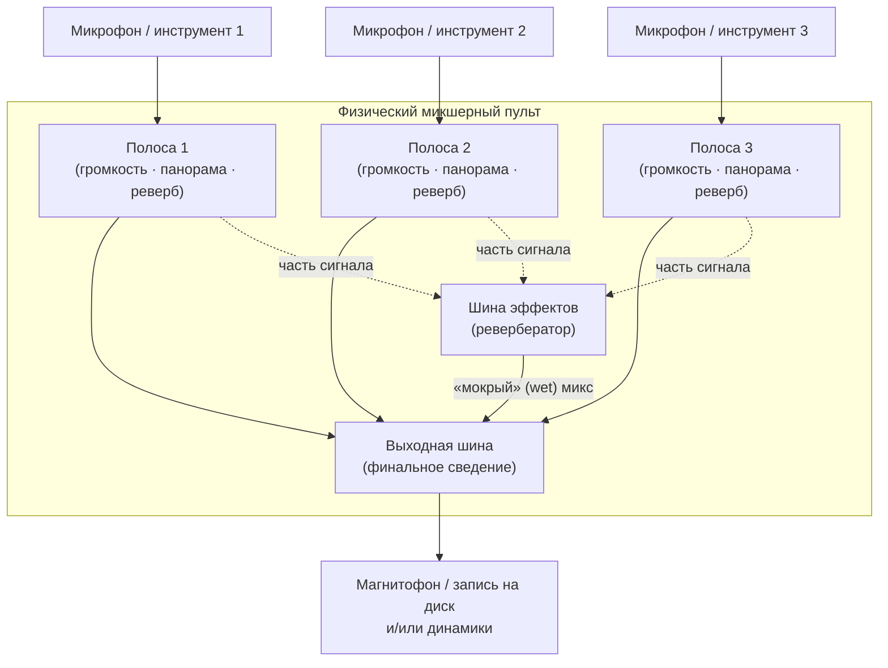
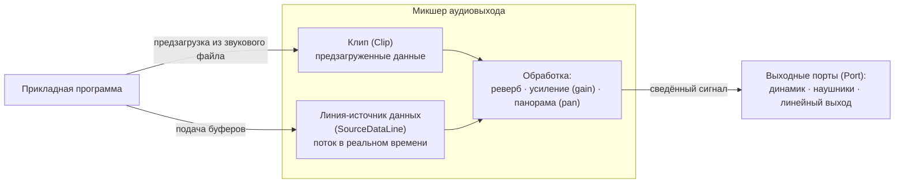
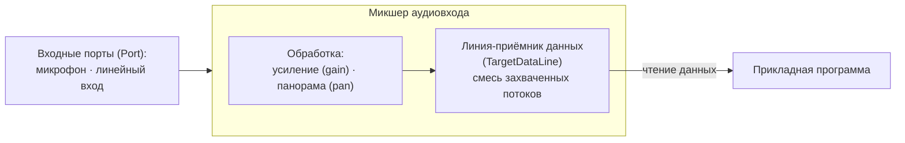
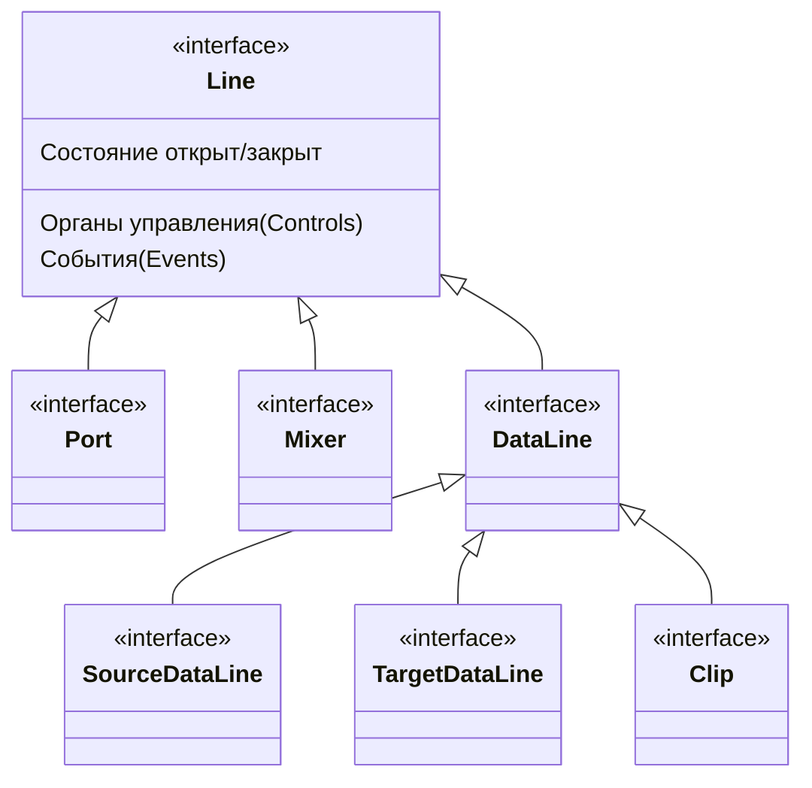

# Урок 1. Обзор пакета Sampled

**Трейл:** Sound · **Оригинал:** [Overview of the Sampled Package](https://docs.oracle.com/javase/tutorial/sound/sampled-overview.html)
**Связанные области:** [[01-core-java-syntax-oop]] · **Вопросы:** core-java

> Перевод официального руководства Oracle (The Java Tutorials, JDK 8). Урок целиком
> соответствует странице *Overview of the Sampled Package* трейла *Sound* и охватывает
> подразделы *What Is Formatted Audio Data?*, *What Is a Mixer?* и *What Is a Line?*
> (включая иерархию интерфейсов линий).

Пакет [`javax.sound.sampled`](https://docs.oracle.com/javase/8/docs/api/javax/sound/sampled/package-summary.html)
посвящён прежде всего **транспортировке звука** (*audio transport*) — иными словами, Java Sound API
сосредоточен на воспроизведении и захвате звука. Центральная задача, которую решает Java Sound API, —
как перемещать байты форматированных аудиоданных в систему и из неё. Эта задача включает открытие
устройств аудиовхода и аудиовыхода и управление буферами, наполняемыми звуковыми данными в реальном
времени. Она может также включать сведение (*mixing*) нескольких потоков звука в один (как для входа,
так и для выхода). Транспортировку звука в систему или из неё нужно корректно обрабатывать, когда
пользователь запрашивает запуск, приостановку, возобновление или остановку потока звука.

Чтобы поддержать этот фокус на базовом аудиовводе-выводе, Java Sound API предоставляет методы для
преобразования между различными форматами аудиоданных и для чтения и записи распространённых типов
звуковых файлов. Однако он не претендует на роль всеобъемлющего инструментария для звуковых файлов.
Конкретная реализация Java Sound API не обязана поддерживать обширный набор типов файлов или
преобразований форматов данных. Сторонние поставщики служб (*third-party service providers*) могут
поставлять модули, которые «подключаются» (*plug in*) к существующей реализации, чтобы поддержать
дополнительные типы файлов и преобразования.

Java Sound API может обрабатывать транспортировку звука как в **потоковом буферизованном** режиме, так
и в **размещаемом в памяти небуферизованном** режиме. «Потоковость» (*streaming*) употребляется здесь в
общем смысле — как обработка аудиобайтов в реальном времени; речь не идёт о конкретном, широко известном
случае передачи звука по интернету в определённом формате. Иначе говоря, поток звука — это просто
непрерывный набор аудиобайтов, поступающих более или менее с той же скоростью, с какой их надо
обрабатывать (воспроизводить, записывать и т. п.). Операции над байтами начинаются ещё до того, как
поступят все данные. В потоковой модели — особенно в случае аудиовхода, а не аудиовыхода, — вы заранее не
обязательно знаете, насколько длинный звук и когда он закончит поступать. Вы просто обрабатываете по
одному буферу аудиоданных за раз, пока операция не будет остановлена. В случае аудиовыхода
(воспроизведения) данные тоже нужно буферизовать, если воспроизводимый звук слишком велик, чтобы
целиком поместиться в память. Иными словами, вы передаёте аудиобайты звуковому движку порциями, а он
заботится о том, чтобы воспроизвести каждый сэмпл в нужный момент. Предусмотрены механизмы, благодаря
которым легко узнать, сколько данных передавать в каждой порции.

Java Sound API допускает также небуферизованную транспортировку — но только при воспроизведении — при
условии, что у вас уже есть все аудиоданные и они не настолько велики, чтобы не поместиться в память.
В этой ситуации прикладной программе не нужно буферизовать звук, хотя буферизованный подход реального
времени остаётся доступным по желанию. Вместо этого весь звук можно заранее загрузить целиком в память
для последующего воспроизведения. Поскольку все звуковые данные загружены заблаговременно,
воспроизведение может начаться немедленно — например, как только пользователь нажмёт кнопку «Старт».
Это может быть преимуществом по сравнению с буферизованной моделью, где воспроизведение вынуждено ждать
наполнения первого буфера. Кроме того, размещаемая в памяти небуферизованная модель позволяет легко
зацикливать звуки (*loop / cycle*) или устанавливать произвольные позиции в данных.

Чтобы воспроизводить или захватывать звук с помощью Java Sound API, нужны как минимум три вещи:
**форматированные аудиоданные** (*formatted audio data*), **микшер** (*mixer*) и **линия** (*line*).
Ниже даётся обзор этих понятий.

## Что такое форматированные аудиоданные (formatted audio data)?

Форматированные аудиоданные — это звук в любом из нескольких стандартных форматов. Java Sound API
различает **форматы данных** (*data formats*) и **форматы файлов** (*file formats*).

### Форматы данных (Data Formats)

Формат данных сообщает, как интерпретировать последовательность байтов «сырых» (*raw*) сэмплированных
аудиоданных — например, сэмплов, уже прочитанных из звукового файла, или сэмплов, захваченных со входа
микрофона. Возможно, вам потребуется знать, например, сколько бит составляет один **сэмпл** (*sample* —
представление кратчайшего мгновения звука), и точно так же может потребоваться знать **частоту
дискретизации** (*sample rate*) звука — насколько быстро сэмплы должны следовать друг за другом.
Настраиваясь на воспроизведение или захват, вы указываете формат данных захватываемого или
воспроизводимого звука.

В Java Sound API формат данных представлен объектом
[`AudioFormat`](https://docs.oracle.com/javase/8/docs/api/javax/sound/sampled/AudioFormat.html),
который включает следующие атрибуты:

- метод кодирования (*encoding*), обычно импульсно-кодовая модуляция (*pulse code modulation*, PCM);
- число каналов (*channels*) (1 — моно, 2 — стерео и т. д.);
- частота дискретизации (*sample rate*) — число сэмплов в секунду на канал;
- число бит на сэмпл (на канал);
- частота кадров (*frame rate*);
- размер кадра в байтах (*frame size*);
- порядок байтов (*byte order*) — старшим вперёд (*big-endian*) или младшим вперёд (*little-endian*).

PCM — это один из видов кодирования звуковой волны. Java Sound API включает две PCM-кодировки, которые
используют **линейное квантование** амплитуды и знаковые или беззнаковые целочисленные значения.
Линейное квантование означает, что число, хранимое в каждом сэмпле, прямо пропорционально (если не
считать искажений) исходному звуковому давлению в этот момент — и так же пропорционально смещению
громкоговорителя или барабанной перепонки, колеблющихся со звуком в этот миг. Компакт-диски, например,
используют линейно PCM-кодированный звук. **Mu-law**-кодирование и **a-law**-кодирование — это
распространённые нелинейные кодировки, дающие более сжатую версию аудиоданных; такие кодировки обычно
применяются в телефонии или при записи речи. Нелинейная кодировка отображает амплитуду исходного звука в
хранимое значение посредством нелинейной функции, которую можно спроектировать так, чтобы давать больше
разрешения по амплитуде тихим звукам, чем громким.

**Кадр** (*frame*) содержит данные для всех каналов в конкретный момент времени. Для PCM-кодированных
данных кадр — это просто набор одновременных сэмплов во всех каналах для данного мгновения, без
какой-либо дополнительной информации. В этом случае частота кадров равна частоте дискретизации, а размер
кадра в байтах равен числу каналов, умноженному на размер сэмпла в битах и делённому на число бит в байте.

Для других видов кодирования кадр может содержать дополнительную информацию помимо сэмплов, а частота
кадров может полностью отличаться от частоты дискретизации. Например, рассмотрим кодирование MP3
(MPEG-1 Audio Layer 3), которое явно не упоминается в текущей версии Java Sound API, но которое могло бы
поддерживаться реализацией Java Sound API или сторонним поставщиком служб. В MP3 каждый кадр содержит
пакет сжатых данных для серии сэмплов, а не один сэмпл на канал. Поскольку каждый кадр инкапсулирует
целую серию сэмплов, частота кадров ниже частоты дискретизации. Кадр также содержит заголовок (*header*).
Несмотря на заголовок, размер кадра в байтах меньше размера в байтах эквивалентного числа PCM-кадров.
(В конце концов, назначение MP3 — быть компактнее, чем PCM-данные.) Для такого кодирования частота
дискретизации и размер сэмпла относятся к PCM-данным, в которые закодированный звук будет в итоге
преобразован, прежде чем будет передан цифро-аналоговому преобразователю (*digital-to-analog converter*,
DAC).

### Форматы файлов (File Formats)

Формат файла задаёт структуру звукового файла, включая не только формат сырых аудиоданных в файле, но и
прочую информацию, которая может в нём храниться. Звуковые файлы бывают разных стандартных разновидностей,
таких как **WAVE** (также известный как WAV и часто ассоциируемый с ПК), **AIFF** (часто ассоциируемый с
компьютерами Macintosh) и **AU** (часто ассоциируемый с UNIX-системами). Разные типы звуковых файлов
имеют разную структуру. Например, у них может быть разное расположение данных в «заголовке» (*header*)
файла. Заголовок содержит описательную информацию, которая обычно предшествует собственно аудиосэмплам
файла, хотя некоторые форматы файлов допускают чередование «фрагментов» (*chunks*) описательных и
аудиоданных. Заголовок включает спецификацию формата данных, использованного для хранения звука в
звуковом файле. Любой из этих типов звукового файла может содержать различные форматы данных (хотя обычно
внутри одного файла есть только один формат данных), и один и тот же формат данных может использоваться в
файлах с разными форматами файлов.

В Java Sound API формат файла представлен объектом
[`AudioFileFormat`](https://docs.oracle.com/javase/8/docs/api/javax/sound/sampled/AudioFileFormat.html),
который содержит:

- тип файла (WAVE, AIFF и т. д.);
- длину файла в байтах;
- длину аудиоданных, содержащихся в файле, в кадрах;
- объект `AudioFormat`, задающий формат данных аудиоданных, содержащихся в файле.

Класс [`AudioSystem`](https://docs.oracle.com/javase/8/docs/api/javax/sound/sampled/AudioSystem.html)
предоставляет методы для чтения и записи звуков в разных форматах файлов и для преобразования между
разными форматами данных. Некоторые из методов позволяют обращаться к содержимому файла через своего
рода поток под названием
[`AudioInputStream`](https://docs.oracle.com/javase/8/docs/api/javax/sound/sampled/AudioInputStream.html).
`AudioInputStream` — это подкласс класса
[`InputStream`](https://docs.oracle.com/javase/8/docs/api/java/io/InputStream.html), который инкапсулирует
последовательность байтов, читаемых последовательно. К своему суперклассу класс `AudioInputStream`
добавляет знание о формате аудиоданных этих байтов (представленном объектом `AudioFormat`). Прочитав
звуковой файл как `AudioInputStream`, вы получаете немедленный доступ к сэмплам, не заботясь о структуре
звукового файла (его заголовке, фрагментах и т. д.). Один вызов метода даёт всю необходимую информацию о
формате данных и типе файла.

## Что такое микшер (mixer)?

Многие программные интерфейсы (API) для работы со звуком используют понятие аудио**устройства**
(*device*). Устройство часто является программным интерфейсом к физическому устройству ввода-вывода.
Например, устройство звукового ввода может представлять входные возможности звуковой карты, включая вход
микрофона, аналоговый линейный вход и, возможно, цифровой аудиовход.

В Java Sound API устройства представлены объектами
[`Mixer`](https://docs.oracle.com/javase/8/docs/api/javax/sound/sampled/Mixer.html). Назначение микшера —
обрабатывать один или несколько потоков аудиовхода и один или несколько потоков аудиовыхода. В типичном
случае он фактически сводит несколько входящих потоков в один исходящий. Объект `Mixer` может представлять
возможности звукового сведения физического устройства, например звуковой карты, которой может
потребоваться смешивать звук, поступающий в компьютер с различных входов, или звук, идущий от прикладных
программ к выходам.

Как вариант, объект `Mixer` может представлять возможности сведения звука, реализованные полностью
программно, без какого-либо внутреннего интерфейса к физическим устройствам.

В Java Sound API такой компонент, как вход микрофона на звуковой карте, сам по себе не считается
устройством (то есть микшером), а представляет собой **порт** (*port*) в микшер или из него. Порт обычно
обеспечивает единственный поток звука в микшер или из него (хотя поток может быть многоканальным,
например стерео). У микшера может быть несколько таких портов. Например, микшер, представляющий выходные
возможности звуковой карты, может смешать несколько потоков звука вместе, а затем направить сведённый
сигнал на любой или на все из различных выходных портов, подключённых к микшеру. Такими выходными портами
могут быть (к примеру) разъём наушников, встроенный динамик или линейный выход.

Чтобы понять понятие микшера в Java Sound API, полезно представить себе физический микшерный пульт —
такой, какие используются на живых концертах и в студиях звукозаписи.

*Физический микшерный пульт.*

У физического микшера есть «полосы» (*strips*, также называемые *slices*), каждая из которых представляет
путь, по которому единственный аудиосигнал поступает в микшер для обработки. На полосе есть ручки и другие
органы управления, которыми можно регулировать громкость (*volume*) и панораму (*pan* — размещение в
стереокартине) сигнала на этой полосе. Кроме того, у микшера может быть отдельная **шина** (*bus*) для
эффектов вроде реверберации, и эта шина может быть соединена с внутренним или внешним блоком реверберации.
У каждой полосы есть потенциометр, регулирующий, какая часть сигнала этой полосы попадает в
реверберированный микс. Реверберированный («мокрый», *wet*) микс затем сводится с «сухими» (*dry*)
сигналами полос. Физический микшер направляет эту итоговую смесь на выходную шину, которая обычно идёт на
магнитофон (или дисковую систему записи) и/или динамики.

Представьте живой концерт, который записывается в стерео. Кабели (или беспроводные соединения), идущие от
множества микрофонов и электроинструментов на сцене, подключаются ко входам микшерного пульта. Каждый
вход идёт на отдельную полосу микшера, как показано выше. Звукорежиссёр определяет настройки усиления
(*gain*), панорамы и реверберации. Выходы всех полос и блока реверберации сводятся вместе в два канала.
Эти два канала идут на два выхода микшера, в которые включены кабели, соединяющие со входами стереомагнитофона.
Возможно, эти два канала также подаются через усилитель на динамики в зале — в зависимости от типа музыки
и размера зала.

Теперь представьте студию звукозаписи, в которой каждый инструмент или певец записывается на отдельную
дорожку (*track*) многодорожечного магнитофона. После того как все инструменты и певцы записаны, инженер
звукозаписи выполняет «сведение» (*mixdown*), чтобы объединить все записанные дорожки в двухканальную
(стерео) запись, которую можно распространять на компакт-дисках. В этом случае входом каждой полосы
микшера служит не микрофон, а одна дорожка многодорожечной записи. И вновь инженер может с помощью органов
управления на полосах задать громкость, панораму и величину реверберации каждой дорожки. Выходы микшера
снова идут на стереомагнитофон и на стереодинамики, как в примере с живым концертом.

Эти два примера иллюстрируют два разных применения микшера: захватывать несколько входных каналов,
объединять их в меньшее число дорожек и сохранять смесь — либо воспроизводить несколько дорожек, сводя их
в меньшее число дорожек.

В Java Sound API микшер может аналогично использоваться для входа (захвата звука) или для выхода
(воспроизведения звука). В случае входа **источником** (*source*), из которого микшер получает звук для
сведения, служат один или несколько входных портов. Микшер направляет захваченные и сведённые
аудиопотоки на свою **цель** (*target*) — объект с буфером, из которого прикладная программа может
извлечь эти сведённые аудиоданные. В случае аудиовыхода ситуация обратная. Источником звука для микшера
служат один или несколько объектов, содержащих буферы, в которые одна или несколько прикладных программ
записывают свои звуковые данные; а целью микшера служат один или несколько выходных портов.

## Что такое линия (line)?

Метафора физического микшерного пульта полезна и для понимания концепции **линии** (*line*) в Java Sound
API.

Линия — это элемент цифрового аудио**конвейера** (*pipeline*), то есть путь для перемещения звука в
систему или из неё. Обычно линия — это путь в микшер или из него (хотя технически сам микшер тоже является
своего рода линией).

Порты аудиовхода и аудиовыхода — это линии. Они аналогичны микрофонам и динамикам, подключённым к
физическому микшерному пульту. Другой вид линии — это путь данных, по которому прикладная программа может
получать входной звук от микшера или отправлять выходной звук в микшер. Эти пути данных аналогичны
дорожкам многодорожечного магнитофона, подключённого к физическому микшерному пульту.

Одно отличие линий в Java Sound API от линий физического микшера состоит в том, что аудиоданные,
протекающие через линию в Java Sound API, могут быть моно или многоканальными (например, стерео). В
отличие от этого, каждый из входов и выходов физического микшера обычно является единственным каналом
звука. Чтобы получить два и более канала выхода от физического микшера, как правило используют два и более
физических выхода (по крайней мере в случае аналогового звука; цифровой выходной разъём часто бывает
многоканальным). В Java Sound API число каналов в линии задаётся объектом
[`AudioFormat`](https://docs.oracle.com/javase/8/docs/api/javax/sound/sampled/AudioFormat.html) данных,
которые в данный момент протекают через линию.

Рассмотрим теперь некоторые конкретные виды линий и микшеров. Следующая схема показывает разные типы
линий в простой системе аудиовыхода, которая могла бы быть частью реализации Java Sound API:

*Возможная конфигурация линий для аудиовыхода.*

В этом примере прикладная программа получила доступ к некоторым доступным входам микшера аудиовхода:
одному или нескольким **клипам** (*clips*) и **линиям-источникам данных** (*source data lines*). Клип —
это вход микшера (вид линии), в который можно загрузить аудиоданные до начала воспроизведения; линия-источник
данных — это вход микшера, принимающий поток аудиоданных в реальном времени. Прикладная программа заранее
загружает аудиоданные из звукового файла в клипы. Затем она проталкивает другие аудиоданные в
линии-источники данных, по одному буферу за раз. Микшер читает данные со всех этих линий, у каждой из
которых могут быть собственные органы управления реверберацией, усилением и панорамой, и сводит «сухие»
аудиосигналы с «мокрым» (реверберированным) миксом. Микшер доставляет свой итоговый выход на один или
несколько выходных портов — таких как динамик, разъём наушников и разъём линейного выхода.

Хотя различные линии изображены на схеме отдельными прямоугольниками, все они «принадлежат» микшеру и
могут считаться неотъемлемыми частями микшера. Прямоугольники реверберации, усиления и панорамы
представляют органы обработки (а не линии), которые микшер может применять к данным, протекающим через
линии.

Заметьте, что это лишь один пример возможного микшера, поддерживаемого API. Не все аудиоконфигурации
будут обладать всеми проиллюстрированными возможностями. Отдельная линия-источник данных может не
поддерживать панорамирование, микшер может не реализовывать реверберацию и т. д.

Простая система аудиовхода может выглядеть схоже:

*Возможная конфигурация линий для аудиовхода.*

Здесь данные поступают в микшер из одного или нескольких входных портов — обычно это микрофон или разъём
линейного входа. Применяются усиление и панорама, и микшер доставляет захваченные данные прикладной
программе через **линию-приёмник данных** (*target data line*) микшера. Линия-приёмник данных — это выход
микшера, содержащий смесь потоковых входных звуков. У простейшего микшера всего одна линия-приёмник
данных, но некоторые микшеры могут доставлять захваченные данные одновременно в несколько линий-приёмников
данных.

### Иерархия интерфейсов линий (The Line Interface Hierarchy)

Теперь, когда мы рассмотрели несколько функциональных картин того, что такое линии и микшеры, обсудим их с
чуть более программистской точки зрения. Несколько типов линий определены подынтерфейсами базового
интерфейса [`Line`](https://docs.oracle.com/javase/8/docs/api/javax/sound/sampled/Line.html). Иерархия
интерфейсов показана ниже.

*Иерархия интерфейсов линий.*

Базовый интерфейс [`Line`](https://docs.oracle.com/javase/8/docs/api/javax/sound/sampled/Line.html)
описывает минимальную функциональность, общую для всех линий:

- **Органы управления** (*Controls*). У линий данных и портов часто есть набор органов управления,
  влияющих на аудиосигнал, проходящий через линию. Java Sound API задаёт классы органов управления,
  которыми можно манипулировать такими аспектами звука, как: усиление (*gain*, влияет на громкость
  сигнала в децибелах), панорама (*pan*, влияет на лево-правое позиционирование звука), реверберация
  (*reverb*, добавляет звуку реверберацию, чтобы имитировать разную акустику помещений) и частота
  дискретизации (*sample rate*, влияет как на скорость воспроизведения, так и на высоту тона звука).
- **Состояние «открыт» или «закрыт»** (*open or closed status*). Успешное открытие линии гарантирует, что
  линии выделены ресурсы. У микшера конечное число линий, поэтому в какой-то момент несколько прикладных
  программ (или одна и та же) могут соперничать за использование линий микшера. Закрытие линии означает,
  что любые используемые линией ресурсы теперь могут быть освобождены.
- **События** (*Events*). Линия порождает события, когда открывается или закрывается. Подынтерфейсы
  `Line` могут вводить другие типы событий. Когда линия порождает событие, оно отправляется всем объектам,
  зарегистрированным как «слушатели» (*listen*) событий на этой линии. Прикладная программа может создать
  такие объекты, зарегистрировать их для прослушивания событий линии и реагировать на события по желанию.

Теперь рассмотрим подынтерфейсы интерфейса `Line`.

[`Ports`](https://docs.oracle.com/javase/8/docs/api/javax/sound/sampled/Port.html) (порты) — это простые
линии для ввода или вывода звука в аудиоустройства или из них. Как упоминалось ранее, некоторые
распространённые типы портов — это микрофон, линейный вход, привод CD-ROM, динамик, наушники и линейный
выход.

Интерфейс [`Mixer`](https://docs.oracle.com/javase/8/docs/api/javax/sound/sampled/Mixer.html) представляет
микшер, который, как мы видели, представляет либо аппаратное, либо программное устройство. Интерфейс
`Mixer` предоставляет методы для получения линий микшера. К ним относятся **линии-источники**
(*source lines*), подающие звук в микшер, и **линии-приёмники** (*target lines*), которым микшер доставляет
свой сведённый звук. Для микшера аудиовхода линиями-источниками служат входные порты, такие как вход
микрофона, а линиями-приёмниками — линии
[`TargetDataLines`](https://docs.oracle.com/javase/8/docs/api/javax/sound/sampled/TargetDataLine.html)
(описаны ниже), которые доставляют звук прикладной программе. Для микшера аудиовыхода, напротив,
линиями-источниками служат клипы
[`Clips`](https://docs.oracle.com/javase/8/docs/api/javax/sound/sampled/Clip.html) или линии-источники
данных [`SourceDataLines`](https://docs.oracle.com/javase/8/docs/api/javax/sound/sampled/SourceDataLine.html)
(описаны ниже), которым прикладная программа подаёт аудиоданные, а линиями-приёмниками — выходные порты,
такие как динамик.

`Mixer` определён как имеющий одну или несколько линий-источников и одну или несколько линий-приёмников.
Заметьте, что это определение означает, что микшеру не обязательно фактически сводить данные; у него может
быть всего одна линия-источник. API `Mixer` рассчитан на охват разнообразных устройств, но типичный
случай поддерживает сведение.

Интерфейс `Mixer` поддерживает **синхронизацию** (*synchronization*): вы можете указать, что две или более
линий микшера должны рассматриваться как синхронизированная группа. Тогда вы можете запускать,
останавливать или закрывать все эти линии данных, отправив единственное сообщение любой линии группы,
вместо того чтобы управлять каждой линией по отдельности. С микшером, поддерживающим эту возможность, вы
можете добиться синхронизации между линиями с точностью до сэмпла.

Универсальный интерфейс `Line` не предоставляет средства для запуска и остановки воспроизведения или
записи. Для этого нужна линия данных. Интерфейс
[`DataLine`](https://docs.oracle.com/javase/8/docs/api/javax/sound/sampled/DataLine.html) добавляет
следующие связанные с медиа возможности сверх возможностей `Line`:

- **Формат аудио** (*audio format*). С потоком данных каждой линии данных связан аудиоформат.
- **Позиция в медиа** (*media position*). Линия данных может сообщить свою текущую позицию в медиа,
  выраженную в сэмпловых кадрах (*sample frames*). Это число сэмпловых кадров, захваченных линией данных
  или воспроизведённых ею с момента её открытия.
- **Размер буфера** (*buffer size*). Это размер внутреннего буфера линии данных в байтах. Для
  линии-источника данных внутренний буфер — это тот, в который можно писать данные, а для линии-приёмника
  данных — тот, из которого данные можно читать.
- **Уровень** (*level*) — текущая амплитуда аудиосигнала.
- Запуск и остановка воспроизведения или захвата.
- Приостановка и возобновление воспроизведения или захвата.
- **Сброс** (*flush*) — отбрасывание необработанных данных из очереди.
- **Опустошение** (*drain*) — блокировка до тех пор, пока все необработанные данные не будут выведены из
  очереди и буфер линии данных не опустеет.
- **Состояние активности** (*active status*). Линия данных считается активной, если она занята активным
  воспроизведением или захватом аудиоданных в микшер или из него.
- **События** (*Events*). События `START` и `STOP` порождаются, когда активное воспроизведение или захват
  данных из линии данных или в неё начинается или останавливается.

Линия-приёмник данных
([`TargetDataLine`](https://docs.oracle.com/javase/8/docs/api/javax/sound/sampled/TargetDataLine.html))
принимает аудиоданные от микшера. Обычно микшер захватывает аудиоданные с порта, такого как микрофон; он
может обработать или свести эти захваченные данные, прежде чем поместить их в буфер линии-приёмника данных.
Интерфейс `TargetDataLine` предоставляет методы для чтения данных из буфера линии-приёмника данных и для
определения того, сколько данных в настоящий момент доступно для чтения.

Линия-источник данных
([`SourceDataLine`](https://docs.oracle.com/javase/8/docs/api/javax/sound/sampled/SourceDataLine.html))
принимает аудиоданные для воспроизведения. Она предоставляет методы для записи данных в буфер
линии-источника данных для воспроизведения и для определения того, сколько данных линия готова принять,
не блокируясь.

Клип ([`Clip`](https://docs.oracle.com/javase/8/docs/api/javax/sound/sampled/Clip.html)) — это линия
данных, в которую аудиоданные можно загрузить до начала воспроизведения. Поскольку данные предзагружены, а
не передаются потоком, длительность клипа известна до воспроизведения, и вы можете выбрать любую начальную
позицию в медиа. Клипы можно зацикливать (*looped*) — это означает, что при воспроизведении все данные
между двумя заданными точками цикла будут повторяться заданное число раз или бесконечно.

В этом разделе представлено большинство важных интерфейсов и классов API сэмплированного аудио. Последующие
разделы показывают, как обращаться к этим объектам и использовать их в своей прикладной программе.

## Источник

- [Overview of the Sampled Package](https://docs.oracle.com/javase/tutorial/sound/sampled-overview.html) — официальное руководство Oracle (The Java Tutorials, JDK 8). Страница включает подразделы *What Is Formatted Audio Data?*, *What Is a Mixer?* и *What Is a Line?* с иерархией интерфейсов линий.
