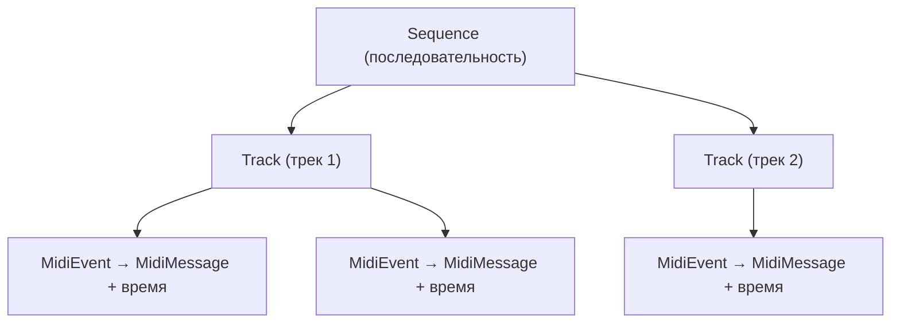
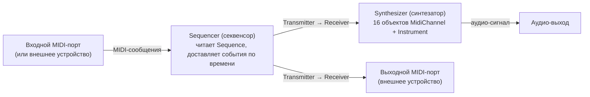

# Урок 4. Обзор пакета MIDI и доступ к ресурсам

**Трейл:** Sound · **Оригинал:** [Overview of the MIDI Package](https://docs.oracle.com/javase/tutorial/sound/overview-MIDI.html)
**Связанные области:** [[01-core-java-syntax-oop]] · **Вопросы:** core-java

> Перевод официального руководства Oracle (The Java Tutorials, JDK 8). Объединяет страницы
> *Overview of the MIDI Package* и *Accessing MIDI System Resources* трейла *Sound*.

Введение к трейлу давало беглое представление о возможностях MIDI в Java Sound API. Дальнейшее
изложение даёт более подробное введение в архитектуру MIDI в Java Sound API, доступ к которой
осуществляется через пакет `javax.sound.midi`. Сначала объясняются некоторые базовые понятия
самого MIDI — как напоминание или введение, — чтобы поместить MIDI-возможности Java Sound API
в контекст. Затем рассматривается подход Java Sound API к MIDI как подготовка к задачам
программирования, описанным в последующих разделах. Обсуждение MIDI API делится на две основные
области: **данные** (*data*) и **устройства** (*devices*).

## Напоминание о MIDI: провода и файлы

Стандарт MIDI (Musical Instrument Digital Interface — цифровой интерфейс музыкальных
инструментов) определяет протокол связи для электронных музыкальных устройств, таких как
электронные клавишные инструменты и персональные компьютеры. Данные MIDI могут передаваться по
специальным кабелям во время живого исполнения, а также могут сохраняться в файле стандартного
типа для последующего воспроизведения или редактирования.

Этот раздел напоминает некоторые основы MIDI без привязки к Java Sound API. Изложение задумано
как напоминание для читателей, знакомых с MIDI, и как краткое введение для тех, кто с ним не
знаком, чтобы дать основу для последующего обсуждения пакета MIDI в Java Sound API. Если вы
хорошо понимаете MIDI, этот раздел можно спокойно пропустить. Прежде чем писать серьёзные
MIDI-приложения, программистам, незнакомым с MIDI, вероятно, потребуется более полное описание
MIDI, чем можно включить в это руководство. См. *Complete MIDI 1.0 Detailed Specification*,
которая доступна только в печатном виде на [http://www.midi.org](http://www.midi.org)
(хотя в Сети можно найти пересказанные или сокращённые версии).

MIDI — это одновременно аппаратная и программная спецификация. Чтобы понять устройство MIDI,
полезно знать его историю. MIDI изначально разрабатывался для передачи музыкальных событий —
например, нажатий клавиш — между электронными клавишными инструментами, такими как синтезаторы.
Аппаратные устройства, известные как **секвенсоры** (*sequencers*), хранили
последовательности нот, которые могли управлять синтезатором, позволяя записывать и затем
воспроизводить музыкальные исполнения. Позже были разработаны аппаратные интерфейсы, которые
подключали MIDI-инструменты к последовательному порту компьютера, что позволило реализовывать
секвенсоры программно. Ещё позже звуковые карты компьютеров получили аппаратуру для
ввода-вывода MIDI и для синтеза музыкального звука. Сегодня многие пользователи MIDI имеют дело
только со звуковыми картами, никогда не подключаясь к внешним MIDI-устройствам. Процессоры стали
достаточно быстрыми, чтобы синтезаторы тоже можно было реализовать программно. Звуковая карта
нужна только для аудио-ввода-вывода и, в некоторых приложениях, для связи с внешними
MIDI-устройствами.

Небольшая аппаратная часть спецификации MIDI описывает разводку (*pinouts*) MIDI-кабелей и
гнёзда, в которые эти кабели вставляются. Эта часть нас не касается. Поскольку устройства,
ранее требовавшие аппаратной реализации, — такие как секвенсоры и синтезаторы — теперь
реализуемы программно, пожалуй, единственная причина для большинства программистов знать
что-либо об аппаратных MIDI-устройствах состоит в том, чтобы понимать метафоры MIDI. Тем не
менее внешние аппаратные MIDI-устройства по-прежнему важны для некоторых значимых музыкальных
приложений, и поэтому Java Sound API поддерживает ввод и вывод данных MIDI.

Программная часть спецификации MIDI обширна. Эта часть касается структуры данных MIDI и того,
как устройства вроде синтезаторов должны реагировать на эти данные. Важно понимать, что данные
MIDI могут **передаваться потоком** (*streamed*) или **секвенироваться** (*sequenced*). Эта
двойственность отражает две разные части *Complete MIDI 1.0 Detailed Specification*:

* MIDI 1.0;
* Standard MIDI Files (стандартные MIDI-файлы).

Что означают потоковая передача и секвенирование, мы объясним, рассмотрев назначение каждой из
этих двух частей спецификации MIDI.

### Потоковая передача данных в MIDI Wire Protocol

Первая из этих двух частей спецификации MIDI описывает то, что неформально называют
«проводным протоколом MIDI» (*MIDI wire protocol*). Проводной протокол MIDI, который является
исходным протоколом MIDI, основан на предположении, что данные MIDI передаются по MIDI-кабелю
(«проводу»). Кабель передаёт цифровые данные от одного MIDI-устройства к другому. Каждое из
MIDI-устройств может быть музыкальным инструментом или подобным устройством, либо
универсальным компьютером, оснащённым MIDI-совместимой звуковой картой или интерфейсом
MIDI-к-последовательному-порту.

Данные MIDI, как они определены проводным протоколом MIDI, организованы в **сообщения**
(*messages*). Различные виды сообщений различаются по первому байту сообщения, известному как
**статусный байт** (*status byte*). (Статусные байты — единственные байты, у которых старший
бит установлен в 1.) Байты, следующие за статусным байтом в сообщении, известны как
**байты данных** (*data bytes*). Некоторые MIDI-сообщения, известные как **канальные**
(*channel*) сообщения, имеют статусный байт, содержащий четыре бита для указания вида канального
сообщения и ещё четыре бита для указания номера канала. Поэтому существует 16 MIDI-каналов;
устройства, принимающие MIDI-сообщения, можно настроить на реакцию на канальные сообщения по
всем каналам или только по одному из этих виртуальных каналов. Часто каждый MIDI-канал (который
не следует путать с каналом аудио) используется для отправки нот другого инструмента. Например,
два распространённых канальных сообщения — Note On и Note Off, которые соответственно
запускают звучание ноты и затем останавливают его. Каждое из этих двух сообщений принимает два
байта данных: первый задаёт высоту ноты (*pitch*), а второй — её «скорость» (*velocity*), то
есть как быстро нажимается или отпускается клавиша (в предположении, что ноту играет клавишный
инструмент).

Проводной протокол MIDI определяет потоковую модель для данных MIDI. Центральная особенность
этого протокола в том, что байты данных MIDI доставляются в реальном времени — иными словами,
они передаются потоком. Сами данные не содержат информации о времени; каждое событие
обрабатывается по мере получения, и предполагается, что оно приходит в нужный момент. Эта
модель хороша, если ноты генерируются живым музыкантом, но её недостаточно, если вы хотите
сохранить ноты для последующего воспроизведения или составить их вне реального времени. Это
ограничение становится понятным, если учесть, что MIDI изначально разрабатывался для
музыкального исполнения — как способ для клавишника управлять более чем одним синтезатором, ещё
в те времена, когда немногие музыканты пользовались компьютерами. (Первая версия спецификации
была выпущена в 1984 году.)

### Секвенированные данные в стандартных MIDI-файлах

Часть спецификации MIDI «Стандартные MIDI-файлы» (*Standard MIDI Files*) устраняет ограничение
по времени, присущее проводному протоколу MIDI. Стандартный MIDI-файл — это цифровой файл,
содержащий **события** (*events*) MIDI. Событие — это просто MIDI-сообщение, как оно определено
в проводном протоколе MIDI, но с дополнительной информацией, задающей время события. (Есть также
некоторые события, которые не соответствуют сообщениям проводного протокола MIDI, как мы увидим
в следующем разделе.) Дополнительная информация о времени — это последовательность байтов,
указывающая, когда выполнять операцию, описанную сообщением. Иными словами, стандартный
MIDI-файл задаёт не только то, какие ноты играть, но и точно когда играть каждую из них. Это
немного похоже на нотную партитуру.

Информация в стандартном MIDI-файле называется **последовательностью** (*sequence*). Стандартный
MIDI-файл содержит один или несколько **треков** (*tracks*). Каждый трек обычно содержит ноты,
которые сыграл бы один инструмент, если бы музыку исполняли живые музыканты. Секвенсор — это
программное или аппаратное устройство, способное прочитать последовательность и доставить
содержащиеся в ней MIDI-сообщения в нужное время. Секвенсор немного похож на дирижёра оркестра:
у него есть информация обо всех нотах, включая их время, и он указывает некоторой другой
сущности, когда исполнять ноты.

## Представление данных MIDI в Java Sound API

Теперь, когда мы набросали подход спецификации MIDI к потоковым и секвенированным музыкальным
данным, рассмотрим, как Java Sound API представляет эти данные.

### MIDI-сообщения

[`MidiMessage`](https://docs.oracle.com/javase/8/docs/api/javax/sound/midi/MidiMessage.html) —
это абстрактный класс, представляющий «сырое» (*raw*) MIDI-сообщение. «Сырое» MIDI-сообщение —
это обычно сообщение, определённое проводным протоколом MIDI. Им также может быть одно из
событий, определённых спецификацией стандартных MIDI-файлов, но без информации о времени
события. Существует три категории сырых MIDI-сообщений, представленных в Java Sound API тремя
соответствующими подклассами `MidiMessage`:

* [`ShortMessage`](https://docs.oracle.com/javase/8/docs/api/javax/sound/midi/ShortMessage.html) —
  наиболее распространённые сообщения, имеющие не более двух байтов данных после статусного
  байта. Канальные сообщения, такие как Note On и Note Off, — все короткие, как и некоторые
  другие сообщения.
* [`SysexMessage`](https://docs.oracle.com/javase/8/docs/api/javax/sound/midi/SysexMessage.html)
  содержит **системно-эксклюзивные** (*system-exclusive*) MIDI-сообщения. Они могут иметь много
  байтов и обычно содержат инструкции, специфичные для производителя.
* [`MetaMessage`](https://docs.oracle.com/javase/8/docs/api/javax/sound/midi/MetaMessage.html)
  встречается в MIDI-файлах, но не в проводном протоколе MIDI. Мета-сообщения содержат данные,
  такие как тексты песен или настройки темпа, которые могут быть полезны секвенсорам, но обычно
  бессмысленны для синтезаторов.

### MIDI-события

Как мы видели, стандартные MIDI-файлы содержат события, которые являются обёртками для «сырых»
MIDI-сообщений вместе с информацией о времени. Экземпляр класса
[`MidiEvent`](https://docs.oracle.com/javase/8/docs/api/javax/sound/midi/MidiEvent.html) в Java
Sound API представляет событие, какое могло бы храниться в стандартном MIDI-файле.

API класса `MidiEvent` включает методы для установки и получения значения времени события. Есть
также метод для извлечения встроенного сырого MIDI-сообщения, которое является экземпляром
подкласса `MidiMessage`, обсуждаемого далее. (Встроенное сырое MIDI-сообщение можно задать
только при конструировании `MidiEvent`.)

### Последовательности и треки

Как упоминалось ранее, стандартный MIDI-файл хранит события, организованные в треки. Обычно файл
представляет одно музыкальное произведение, и обычно каждый трек представляет партию, какую мог
бы сыграть один инструменталист. Каждая нота, которую играет инструменталист, представлена как
минимум двумя событиями: Note On, которое начинает ноту, и Note Off, которое её завершает. Трек
может также содержать события, не соответствующие нотам, — например, мета-события (упомянутые
выше).

Java Sound API организует данные MIDI в трёхуровневую иерархию:

* [`Sequence`](https://docs.oracle.com/javase/8/docs/api/javax/sound/midi/Sequence.html) —
  последовательность;
* [`Track`](https://docs.oracle.com/javase/8/docs/api/javax/sound/midi/Track.html) — трек;
* [`MidiEvent`](https://docs.oracle.com/javase/8/docs/api/javax/sound/midi/MidiEvent.html) —
  MIDI-событие.

`Track` — это коллекция объектов `MidiEvent`, а `Sequence` — коллекция объектов `Track`. Эта
иерархия отражает файлы, треки и события спецификации стандартных MIDI-файлов. (Замечание: это
иерархия в смысле вложенности и владения; это **не** иерархия классов в смысле наследования.
Каждый из этих трёх классов наследуется напрямую от `java.lang.Object`.)

Объекты `Sequence` можно читать из MIDI-файлов или создавать с нуля и редактировать, добавляя в
`Sequence` объекты `Track` (или удаляя их). Аналогично, объекты `MidiEvent` можно добавлять в
треки последовательности или удалять из них.



## Представление MIDI-устройств в Java Sound API

В предыдущем разделе объяснялось, как MIDI-сообщения представлены в Java Sound API. Однако
MIDI-сообщения не существуют в вакууме. Обычно они отправляются от одного устройства к другому.
Программа, использующая Java Sound API, может генерировать MIDI-сообщения с нуля, но чаще
сообщения вместо этого создаются программным устройством, таким как секвенсор, либо принимаются
извне компьютера через входной MIDI-порт. Такое устройство обычно отправляет эти сообщения
другому устройству, такому как синтезатор или выходной MIDI-порт.

### Интерфейс MidiDevice

В мире внешних аппаратных MIDI-устройств многие устройства могут передавать MIDI-сообщения
другим устройствам, а также принимать сообщения от других устройств. Аналогично, в Java Sound
API программные объекты, реализующие интерфейс
[`MidiDevice`](https://docs.oracle.com/javase/8/docs/api/javax/sound/midi/MidiDevice.html),
могут передавать и принимать сообщения. Такой объект может быть реализован полностью программно
либо служить интерфейсом к аппаратуре, например к MIDI-возможностям звуковой карты. Базовый
интерфейс `MidiDevice` предоставляет всю функциональность, обычно требуемую для входного или
выходного MIDI-порта. Синтезаторы и секвенсоры, однако, дополнительно реализуют один из
подынтерфейсов `MidiDevice`:
[`Synthesizer`](https://docs.oracle.com/javase/8/docs/api/javax/sound/midi/Synthesizer.html)
или
[`Sequencer`](https://docs.oracle.com/javase/8/docs/api/javax/sound/midi/Sequencer.html)
соответственно.

Интерфейс `MidiDevice` включает API для открытия и закрытия устройства. Он также включает
внутренний класс `MidiDevice.Info`, предоставляющий текстовые описания устройства, включая его
имя, поставщика и версию. Если вы читали часть этого руководства, посвящённую сэмплированному
аудио, этот API, вероятно, покажется знакомым, поскольку его дизайн похож на дизайн интерфейса
`javax.sampled.Mixer`, который представляет аудио-устройство и имеет аналогичный внутренний
класс `Mixer.Info`.

### Передатчики и приёмники

Большинство MIDI-устройств способны отправлять объекты `MidiMessage`, принимать их или и то и
другое. Устройство отправляет данные через один или несколько объектов-**передатчиков**
(*transmitters*), которыми оно «владеет». Аналогично, устройство принимает данные через один или
несколько своих объектов-**приёмников** (*receivers*). Объекты-передатчики реализуют интерфейс
[`Transmitter`](https://docs.oracle.com/javase/8/docs/api/javax/sound/midi/Transmitter.html), а
приёмники реализуют интерфейс
[`Receiver`](https://docs.oracle.com/javase/8/docs/api/javax/sound/midi/Receiver.html).

Каждый передатчик может быть подключён только к одному приёмнику одновременно, и наоборот.
Устройство, отправляющее свои MIDI-сообщения нескольким другим устройствам одновременно, делает
это, имея несколько передатчиков, каждый из которых подключён к приёмнику другого устройства.
Аналогично, устройство, способное принимать MIDI-сообщения более чем из одного источника
одновременно, должно делать это через несколько приёмников.

### Секвенсоры

Секвенсор — это устройство для захвата и воспроизведения последовательностей MIDI-событий. У
него есть передатчики, поскольку он обычно отправляет хранящиеся в последовательности
MIDI-сообщения другому устройству, такому как синтезатор или выходной MIDI-порт. У него также
есть приёмники, поскольку он может захватывать MIDI-сообщения и сохранять их в последовательности.
К своему суперинтерфейсу `MidiDevice` интерфейс `Sequencer` добавляет методы для базовых операций
MIDI-секвенирования. Секвенсор может загрузить последовательность из MIDI-файла, запрашивать и
устанавливать темп последовательности и синхронизировать с ней другие устройства. Прикладная
программа может зарегистрировать объект для уведомления, когда секвенсор обрабатывает
определённые виды событий.

### Синтезаторы

`Synthesizer` — это устройство для генерации звука. Это единственный объект в пакете
`javax.sound.midi`, который производит аудио-данные. Устройство-синтезатор управляет набором
объектов MIDI-каналов — обычно 16 из них, поскольку спецификация MIDI предусматривает 16
MIDI-каналов. Эти объекты MIDI-каналов являются экземплярами класса, реализующего интерфейс
[`MidiChannel`](https://docs.oracle.com/javase/8/docs/api/javax/sound/midi/MidiChannel.html),
методы которого представляют «канальные голосовые сообщения» (*channel voice messages*) и
«канальные сообщения режима» (*channel mode messages*) спецификации MIDI.

Прикладная программа может генерировать звук, напрямую вызывая методы объектов MIDI-каналов
синтезатора. Однако чаще синтезатор генерирует звук в ответ на сообщения, отправленные одному
или нескольким его приёмникам. Эти сообщения могут отправляться, например, секвенсором или
входным MIDI-портом. Синтезатор разбирает каждое сообщение, которое получают его приёмники, и
обычно отправляет соответствующую команду (такую как `noteOn` или `controlChange`) одному из
своих объектов `MidiChannel` согласно номеру MIDI-канала, указанному в событии.

Объект `MidiChannel` использует информацию о нотах в этих сообщениях для синтеза музыки.
Например, сообщение `noteOn` задаёт высоту ноты (*pitch*) и «скорость» (*velocity*, громкость).
Однако информации о ноте недостаточно; синтезатору также требуются точные инструкции о том, как
создавать аудио-сигнал для каждой ноты. Эти инструкции представлены объектом
[`Instrument`](https://docs.oracle.com/javase/8/docs/api/javax/sound/midi/Instrument.html).
Каждый `Instrument` обычно эмулирует отдельный реальный музыкальный инструмент или звуковой
эффект. Объекты `Instrument` могут поставляться как предустановки (*presets*) вместе с
синтезатором, либо могут загружаться из файлов банков звуков (*soundbank files*). В синтезаторе
объекты `Instrument` упорядочены по номеру банка (*bank number*) — их можно представить как
строки — и по номеру программы (*program number*) — как столбцы.

Этот раздел дал основу для понимания данных MIDI и представил некоторые важные интерфейсы и
классы, связанные с MIDI в Java Sound API. Последующие разделы показывают, как можно обращаться
к этим объектам и использовать их в прикладных программах.



## Доступ к ресурсам MIDI-системы

> Перевод страницы *Accessing MIDI System Resources*.

Java Sound API предлагает гибкую модель конфигурации MIDI-системы, как и для конфигурации
системы сэмплированного аудио. Реализация Java Sound API может сама предоставлять различные виды
MIDI-устройств, а дополнительные могут поставляться поставщиками сервисов (*service providers*) и
устанавливаться пользователями. Вы можете писать программу так, чтобы она делала мало
предположений о том, какие конкретные MIDI-устройства установлены на компьютере. Вместо этого
программа может пользоваться значениями по умолчанию MIDI-системы либо позволять пользователю
выбирать из тех устройств, что окажутся доступными.

Этот раздел показывает, как ваша программа может узнать, какие MIDI-ресурсы установлены, и как
получить доступ к нужным. После того как вы получили доступ к устройствам и открыли их, вы можете
соединять их друг с другом, как обсуждается позже в разделе «Передача и приём MIDI-сообщений».

### Класс MidiSystem

Роль класса `MidiSystem` в пакете MIDI Java Sound API прямо аналогична роли `AudioSystem` в
пакете сэмплированного аудио. `MidiSystem` выступает информационным центром (*clearinghouse*) для
доступа к установленным MIDI-ресурсам.

Вы можете запросить `MidiSystem`, чтобы узнать, какие виды устройств установлены, а затем
перебрать доступные устройства и получить доступ к нужным. Например, прикладная программа может
начать с того, что спросит `MidiSystem`, какие синтезаторы доступны, а затем отобразит их список,
из которого пользователь может выбрать один. Более простая программа может просто использовать
синтезатор системы по умолчанию.

Класс `MidiSystem` также предоставляет методы для преобразования между MIDI-файлами и объектами
`Sequence`. Он может сообщать формат файла MIDI-файла и может записывать файлы разных типов.

Прикладная программа может получить от `MidiSystem` следующие ресурсы:

* секвенсоры (*sequencers*);
* синтезаторы (*synthesizers*);
* передатчики (*transmitters*, например связанные с входными MIDI-портами);
* приёмники (*receivers*, например связанные с выходными MIDI-портами);
* данные из стандартных MIDI-файлов;
* данные из файлов банков звуков (*soundbank files*).

Эта страница сосредоточена на первых четырёх из этих типов ресурсов. Остальные обсуждаются позже
в этом руководстве.

### Получение устройств по умолчанию

Типичная MIDI-программа, использующая Java Sound API, начинается с получения нужных ей устройств,
которые могут состоять из одного или нескольких секвенсоров, синтезаторов, входных или выходных
портов.

Существуют синтезатор по умолчанию, секвенсор по умолчанию, передающее устройство по умолчанию и
принимающее устройство по умолчанию. Последние два устройства обычно представляют соответственно
входной и выходной MIDI-порты, если таковые доступны в системе. (Здесь легко запутаться с
направленностью. Думайте о передаче или приёме портов по отношению к программному обеспечению, а
не по отношению к каким-либо внешним физическим устройствам, подключённым к физическим портам.
Входной MIDI-порт **передаёт** (*transmits*) данные от внешнего устройства к `Receiver` из Java
Sound API, и так же выходной MIDI-порт **принимает** (*receives*) данные от программного объекта
и ретранслирует данные внешнему устройству.)

Простая прикладная программа может просто использовать значения по умолчанию вместо того, чтобы
исследовать все установленные устройства. Класс `MidiSystem` включает следующие методы для
получения ресурсов по умолчанию:

```java
static Sequencer getSequencer()
static Synthesizer getSynthesizer()
static Receiver getReceiver()
static Transmitter getTransmitter()
```

Первые два из этих методов получают системные ресурсы секвенирования и синтеза по умолчанию,
которые либо представляют физические устройства, либо реализованы полностью программно. Метод
`getReceiver` получает объект `Receiver`, который принимает отправленные ему MIDI-сообщения и
ретранслирует их принимающему устройству по умолчанию. Аналогично, метод `getTransmitter`
получает объект `Transmitter`, который может отправлять MIDI-сообщения некоторому приёмнику от
имени передающего устройства по умолчанию.

### Выяснение того, какие устройства установлены

Вместо использования устройств по умолчанию более тщательный подход состоит в том, чтобы выбрать
нужные устройства из полного набора устройств, установленных в системе. Прикладная программа
может выбрать нужные устройства программно либо может отобразить список доступных устройств и
позволить пользователю выбрать, какие использовать. Класс `MidiSystem` предоставляет метод для
выяснения того, какие устройства установлены, и соответствующий метод для получения устройства
заданного типа.

Вот метод для получения сведений об установленных устройствах:

```java
static MidiDevice.Info[] getMidiDeviceInfo()
```

Как видите, он возвращает массив информационных объектов. Каждый из возвращённых объектов
`MidiDevice.Info` идентифицирует один тип секвенсора, синтезатора, порта или другого
устройства, которое установлено. (Обычно в системе имеется не более одного экземпляра данного
типа. Например, конкретная модель синтезатора определённого поставщика будет установлена только
один раз.) Объект `MidiDevice.Info` включает следующие строки для описания устройства:

* имя (*Name*);
* номер версии (*Version number*);
* поставщик (*Vendor* — компания, создавшая устройство);
* описание устройства (*A description of the device*).

Вы можете отображать эти строки в своём пользовательском интерфейсе, чтобы позволить
пользователю выбрать из списка устройств.

Однако чтобы использовать эти строки программно для выбора устройства (в отличие от отображения
строк пользователю), нужно заранее знать, какими они могут быть. Компания, предоставляющая
каждое устройство, должна включить эту информацию в свою документацию. Прикладная программа,
которая требует или предпочитает конкретное устройство, может использовать эту информацию для
поиска этого устройства. Этот подход имеет недостаток: он ограничивает программу теми
реализациями устройств, о которых она знает заранее.

Другой, более общий подход — пройти по объектам `MidiDevice.Info`, получая каждое
соответствующее устройство, и программно определить, подходит ли оно для использования (или хотя
бы подходит ли для включения в список, из которого пользователь может выбрать). В следующем
разделе описано, как это сделать.

### Получение нужного устройства

Как только найден информационный объект подходящего устройства, прикладная программа вызывает
следующий метод `MidiSystem` для получения самого соответствующего устройства:

```java
static MidiDevice getMidiDevice(MidiDevice.Info info)
```

Вы можете использовать этот метод, если уже нашли информационный объект, описывающий нужное вам
устройство. Однако, если вы не можете интерпретировать информационные объекты, возвращаемые
`getMidiDeviceInfo`, чтобы определить, какое устройство вам нужно, и если вы не хотите отображать
информацию обо всех устройствах пользователю, вы можете поступить иначе: пройти по всем объектам
`MidiDevice.Info`, возвращённым `getMidiDeviceInfo`, получить соответствующие устройства с помощью
указанного выше метода и проверить каждое устройство на пригодность. Иными словами, можно
запросить у каждого устройства его класс и его возможности, прежде чем включать его в
отображаемый пользователю список, либо как способ выбрать устройство программно, не привлекая
пользователя. Например, если вашей программе нужен синтезатор, вы можете получить каждое из
установленных устройств, посмотреть, какие из них являются экземплярами классов, реализующих
интерфейс `Synthesizer`, а затем отобразить их в списке, из которого пользователь может выбрать
один, как показано ниже:

```java
// Получаем сведения обо всех установленных синтезаторах.
Vector synthInfos;
MidiDevice device;
MidiDevice.Info[] infos = MidiSystem.getMidiDeviceInfo();
for (int i = 0; i < infos.length; i++) {
    try {
        device = MidiSystem.getMidiDevice(infos[i]);
    } catch (MidiUnavailableException e) {
          // Обработать или пробросить исключение...
    }
    if (device instanceof Synthesizer) {
        synthInfos.add(infos[i]);
    }
}
// Теперь отображаем строки из списка synthInfos в графическом интерфейсе.
```

В качестве другого примера можно выбрать устройство программно, не привлекая пользователя.
Предположим, вы хотите получить синтезатор, способный играть наибольшее число нот одновременно.
Вы перебираете все объекты `MidiDevice.Info`, как выше, но после того как определили, что
устройство является синтезатором, вы запрашиваете его возможности, вызывая метод
`getMaxPolyphony` интерфейса `Synthesizer`. Вы резервируете синтезатор с наибольшей полифонией
(*polyphony*), как описано в следующем разделе. Даже если вы не просите пользователя выбрать
синтезатор, вы всё равно можете отобразить строки из выбранного объекта `MidiDevice.Info` просто
для информации пользователя.

### Открытие устройств

В предыдущем разделе было показано, как получить установленное устройство. Однако устройство
может быть установлено, но недоступно. Например, другая прикладная программа может иметь
исключительный доступ к нему. Чтобы фактически зарезервировать устройство для своей программы,
нужно использовать метод `open` интерфейса `MidiDevice`:

```java
if (!(device.isOpen())) {
    try {
      device.open();
  } catch (MidiUnavailableException e) {
          // Обработать или пробросить исключение...
  }
}
```

Получив доступ к устройству и зарезервировав его открытием, вы, вероятно, захотите соединить его
с одним или несколькими другими устройствами, чтобы данные MIDI могли передаваться между ними.
Эта процедура описана позже в разделе «Передача и приём MIDI-сообщений».

Закончив работу с устройством, вы освобождаете его для использования другими программами, вызывая
метод `close` интерфейса `MidiDevice`.

## Источник

- [Overview of the MIDI Package](https://docs.oracle.com/javase/tutorial/sound/overview-MIDI.html) — официальное руководство Oracle (The Java Tutorials, JDK 8).
- [Accessing MIDI System Resources](https://docs.oracle.com/javase/tutorial/sound/accessing-MIDI.html) — официальное руководство Oracle (The Java Tutorials, JDK 8).
