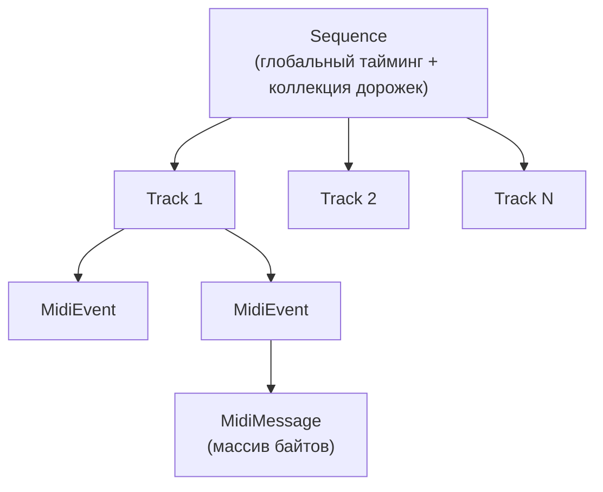

# Урок 5. MIDI-сообщения и секвенсоры

**Трейл:** Sound · **Оригинал:** [Transmitting and Receiving MIDI Messages](https://docs.oracle.com/javase/tutorial/sound/MIDI-messages.html)
**Связанные области:** [[01-core-java-syntax-oop]] · **Вопросы:** core-java

> Перевод официального руководства Oracle (The Java Tutorials, JDK 8). Объединяет страницы
> *Transmitting and Receiving MIDI Messages*, *Introduction to Sequencers* и
> *Using Sequencer Methods* трейла **Sound**.

## Передача и приём MIDI-сообщений

### Устройства, передатчики и приёмники

Java Sound API задаёт для MIDI-данных архитектуру маршрутизации сообщений, которая, как только
вы поймёте принцип её работы, оказывается гибкой и удобной. Система построена на проектировании
по принципу «соединения модулей» (*module-connection design*): отдельные модули, каждый из которых
выполняет определённую задачу, могут соединяться между собой (объединяться в сеть), позволяя
данным перетекать от одного модуля к другому.

Базовый модуль системы обмена сообщениями в Java Sound API — это интерфейс `MidiDevice`
(MIDI-устройство). К `MidiDevice` относятся секвенсоры (*sequencers*) — они записывают,
воспроизводят, загружают и редактируют последовательности MIDI-сообщений с временными метками;
синтезаторы (*synthesizers*) — они генерируют звук, когда их запускают MIDI-сообщения; а также
порты ввода и вывода MIDI, через которые данные приходят от внешних MIDI-устройств и уходят к ним.
Функциональность, обычно требуемая от MIDI-портов, описана базовым интерфейсом `MidiDevice`.
Интерфейсы `Sequencer` и `Synthesizer` расширяют интерфейс `MidiDevice`, описывая дополнительную
функциональность, характерную для MIDI-секвенсоров и синтезаторов соответственно. Конкретные
классы, работающие как секвенсоры или синтезаторы, должны реализовывать эти интерфейсы.

`MidiDevice`, как правило, владеет одним или несколькими вспомогательными объектами, реализующими
интерфейсы `Receiver` (приёмник) или `Transmitter` (передатчик). Эти интерфейсы представляют собой
«разъёмы» или «порталы», которые соединяют устройства между собой, позволяя данным втекать в них и
вытекать из них. Соединив `Transmitter` одного `MidiDevice` с `Receiver` другого, вы создаёте сеть
модулей, в которой данные перетекают от одного к другому.

Интерфейс `MidiDevice` включает методы для определения того, сколько объектов-передатчиков и
объектов-приёмников устройство способно поддерживать одновременно, а также другие методы для
доступа к этим объектам. У MIDI-порта вывода обычно есть хотя бы один `Receiver`, через который
могут приниматься исходящие сообщения; аналогично, синтезатор обычно реагирует на сообщения,
отправленные его `Receiver` (или нескольким `Receiver`). У MIDI-порта ввода обычно есть хотя бы
один `Transmitter`, который распространяет входящие сообщения. Полнофункциональный секвенсор
поддерживает как `Receiver` (приёмники), которые получают сообщения во время записи, так и
`Transmitter` (передатчики), которые отправляют сообщения при воспроизведении.

Интерфейс `Transmitter` включает методы для установки и запроса приёмников, которым передатчик
отправляет свои `MidiMessage`. Установка приёмника создаёт соединение между двумя сторонами.
Интерфейс `Receiver` содержит метод, отправляющий `MidiMessage` приёмнику. Обычно этот метод
вызывается передатчиком (`Transmitter`). Оба интерфейса, `Transmitter` и `Receiver`, включают
метод `close`, освобождающий ранее соединённый передатчик или приёмник, делая его доступным для
другого соединения.

Дальше мы рассмотрим, как использовать передатчики и приёмники. Прежде чем перейти к типичному
случаю соединения двух устройств (например, подключения секвенсора к синтезатору), мы разберём
более простой случай, когда вы отправляете MIDI-сообщение напрямую из вашей прикладной программы
устройству. Изучение этого простого сценария должно облегчить понимание того, как Java Sound API
организует отправку MIDI-сообщений между двумя устройствами.

### Отправка сообщения приёмнику без передатчика

Допустим, вы хотите создать MIDI-сообщение «с нуля», а затем отправить его некоторому приёмнику.
Вы можете создать новое, пустое `ShortMessage` («короткое сообщение») и затем заполнить его
MIDI-данными при помощи следующего метода `ShortMessage`:

```java
void setMessage(int command, int channel, int data1,
         int data2)
```

Когда сообщение готово к отправке, вы можете отправить его объекту `Receiver`, используя следующий
метод `Receiver`:

```java
void send(MidiMessage message, long timeStamp)
```

Аргумент-временная метка будет объяснён чуть позже. Пока лишь упомянем, что его значение можно
установить равным −1, если вам не важно указывать точное время. В этом случае устройство,
получающее сообщение, попытается отреагировать на него как можно скорее.

Прикладная программа может получить приёмник для `MidiDevice`, вызвав метод `getReceiver`
устройства. Если устройство не может предоставить программе приёмник (как правило, потому что все
приёмники устройства уже заняты), выбрасывается исключение `MidiUnavailableException`. В противном
случае приёмник, возвращённый этим методом, доступен для немедленного использования программой.
Когда программа закончила использовать приёмник, ей следует вызвать метод `close` приёмника. Если
программа попытается вызвать методы приёмника после вызова `close`, может быть выброшено исключение
`IllegalStateException`.

В качестве конкретного простого примера отправки сообщения без передатчика отправим сообщение
Note On (нота нажата) приёмнику по умолчанию, который обычно связан с таким устройством, как
MIDI-порт вывода или синтезатор. Мы делаем это, создавая подходящий `ShortMessage` и передавая его
аргументом методу `send` приёмника:

```java
ShortMessage myMsg = new ShortMessage();
// Начать играть ноту «до» первой октавы (Middle C, 60),
// умеренно громко (velocity = 93).
myMsg.setMessage(ShortMessage.NOTE_ON, 0, 60, 93);
long timeStamp = -1;
Receiver       rcvr = MidiSystem.getReceiver();
rcvr.send(myMsg, timeStamp);
```

Этот код использует статическое целочисленное поле `ShortMessage`, а именно `NOTE_ON`, в качестве
статусного байта MIDI-сообщения. Остальные части MIDI-сообщения заданы явными числовыми значениями
как аргументы метода `setMessage`. Ноль указывает, что нота должна проигрываться через MIDI-канал
номер 1; число 60 обозначает ноту «до» первой октавы (Middle C); а 93 — произвольное значение
скорости нажатия клавиши (velocity), которое обычно указывает, что синтезатор, который в итоге
будет проигрывать ноту, должен сыграть её довольно громко. (Спецификация MIDI оставляет точную
интерпретацию velocity на усмотрение реализации текущего инструмента синтезатора.) Затем это
MIDI-сообщение отправляется приёмнику с временной меткой −1. Теперь нам нужно разобраться, что
именно означает параметр временной метки, чему и посвящён следующий раздел.

### Что такое временные метки

Как вы уже знаете, спецификация MIDI состоит из разных частей. Одна часть описывает «проводной»
протокол MIDI (*MIDI «wire» protocol*) — сообщения, передаваемые между устройствами в реальном
времени; другая часть описывает стандартные MIDI-файлы (*Standard MIDI Files*) — сообщения,
хранимые в виде событий в «последовательностях» (*sequences*). В этой последней части спецификации
каждое событие, хранимое в стандартном MIDI-файле, помечено значением времени, которое указывает,
когда это событие должно проигрываться. Напротив, сообщения «проводного» протокола MIDI всегда
предполагается обрабатывать немедленно, как только устройство их получает, поэтому у них нет
сопутствующих значений времени.

Java Sound API добавляет дополнительную особенность. Неудивительно, что значения времени
присутствуют в объектах `MidiEvent`, хранимых в последовательностях (например, прочитанных из
MIDI-файла), как и в спецификации стандартных MIDI-файлов. Но в Java Sound API даже сообщениям,
передаваемым между устройствами, — иными словами, сообщениям, которые соответствуют «проводному»
протоколу MIDI, — могут быть назначены значения времени, называемые *временными метками*
(*time stamps*). Именно эти временные метки нас здесь интересуют.

#### Временные метки на сообщениях, отправляемых устройствам

Временная метка, которая может опционально сопровождать сообщения, передаваемые между устройствами
в Java Sound API, существенно отличается от значений времени в стандартном MIDI-файле. Значения
времени в MIDI-файле часто основаны на музыкальных понятиях, таких как доли (*beats*) и темп
(*tempo*), и время каждого события измеряет время, прошедшее с момента предыдущего события. В
противоположность этому, временная метка на сообщении, отправляемом объекту `Receiver` устройства,
всегда измеряет абсолютное время в микросекундах. А именно, она измеряет число микросекунд,
прошедших с момента открытия устройства, которому принадлежит приёмник.

Этот вид временной метки призван помочь компенсировать задержки (*latencies*), вносимые
операционной системой или прикладной программой. Важно понимать, что эти временные метки
используются для незначительных корректировок тайминга, а не для реализации сложных очередей,
способных планировать события в совершенно произвольные моменты времени (как это делают значения
времени `MidiEvent`).

Временная метка на сообщении, отправляемом устройству (через `Receiver`), может предоставить
устройству точную информацию о тайминге. Устройство может использовать эту информацию при обработке
сообщения. Например, оно может скорректировать тайминг события на несколько миллисекунд, чтобы
соответствовать информации во временной метке. С другой стороны, не все устройства поддерживают
временные метки, поэтому устройство может полностью проигнорировать временную метку сообщения.

Даже если устройство поддерживает временные метки, оно может запланировать событие не точно на то
время, которое вы запросили. Нельзя ожидать, что, отправив сообщение с временной меткой далеко в
будущем, устройство обработает его так, как вы задумали; и уж тем более нельзя ожидать, что
устройство корректно запланирует сообщение, временная метка которого находится в прошлом!
Устройство само решает, как обрабатывать временные метки, которые слишком далеко в будущем или
находятся в прошлом. Отправитель не знает, что устройство считает «слишком далёким», и были ли у
устройства какие-либо проблемы с временной меткой. Это незнание повторяет поведение внешних
MIDI-устройств, которые отправляют сообщения, никогда не зная, были ли они получены правильно.
(«Проводной» протокол MIDI однонаправлен.)

Некоторые устройства отправляют сообщения с временными метками (через `Transmitter`). Например,
сообщения, отправляемые MIDI-портом ввода, могут помечаться временем поступления входящего
сообщения на порт. На некоторых системах механизмы обработки событий приводят к потере некоторой
точности тайминга в ходе последующей обработки сообщения. Временная метка сообщения позволяет
сохранить исходную информацию о тайминге.

Чтобы узнать, поддерживает ли устройство временные метки, вызовите следующий метод `MidiDevice`:

```java
long getMicrosecondPosition()
```

Этот метод возвращает −1, если устройство игнорирует временные метки. В противном случае он
возвращает текущее представление устройства о времени, которое вы как отправитель можете
использовать в качестве смещения при определении временных меток для сообщений, отправляемых вами
впоследствии. Например, если вы хотите отправить сообщение с временной меткой на пять миллисекунд в
будущее, вы можете получить текущую позицию устройства в микросекундах, добавить 5000 микросекунд и
использовать это значение в качестве временной метки. Имейте в виду, что представление `MidiDevice`
о времени всегда помещает нулевой момент времени на момент открытия устройства.

Теперь, имея весь этот фон с объяснением временных меток, вернёмся к методу `send` интерфейса
`Receiver`:

```java
void send(MidiMessage message, long timeStamp)
```

Аргумент `timeStamp` выражается в микросекундах, согласно представлению о времени принимающего
устройства. Если устройство не поддерживает временные метки, оно просто игнорирует аргумент
`timeStamp`. От вас не требуется проставлять временные метки сообщениям, отправляемым приёмнику.
Вы можете использовать −1 в качестве аргумента `timeStamp`, чтобы указать, что вам не важна
корректировка точного тайминга, — вы просто оставляете принимающему устройству обработать сообщение
так скоро, как оно сможет. Однако не рекомендуется отправлять −1 с одними сообщениями и явные
временные метки с другими сообщениями, отправляемыми тому же приёмнику. Так вы, скорее всего,
вызовете нарушения результирующего тайминга.

### Соединение передатчиков с приёмниками

Мы увидели, как можно отправить MIDI-сообщение напрямую приёмнику, без передатчика. Теперь
рассмотрим более распространённый случай, когда вы не создаёте MIDI-сообщения «с нуля», а просто
соединяете устройства между собой, чтобы одно из них могло отправлять MIDI-сообщения другому.

#### Соединение с одним устройством

Конкретный случай, который мы возьмём в качестве первого примера, — это соединение секвенсора с
синтезатором. После того как это соединение установлено, запуск секвенсора заставит синтезатор
генерировать звук из событий, содержащихся в текущей последовательности секвенсора. Пока мы
проигнорируем процесс загрузки последовательности из MIDI-файла в секвенсор. Также мы не будем
вдаваться в механизм проигрывания последовательности. Загрузка и проигрывание последовательностей
подробно обсуждаются в *Playing, Recording, and Editing MIDI Sequences*. Загрузка инструментов в
синтезатор обсуждается в *Synthesizing Sound*. Пока всё, что нас интересует, — это как установить
соединение между секвенсором и синтезатором. Это послужит иллюстрацией более общего процесса
соединения передатчика одного устройства с приёмником другого.

Для простоты мы будем использовать секвенсор по умолчанию и синтезатор по умолчанию.

```java
Sequencer           seq;
Transmitter         seqTrans;
Synthesizer         synth;
Receiver         synthRcvr;
try {
      seq     = MidiSystem.getSequencer();
      seqTrans = seq.getTransmitter();
      synth   = MidiSystem.getSynthesizer();
      synthRcvr = synth.getReceiver();
      seqTrans.setReceiver(synthRcvr);
} catch (MidiUnavailableException e) {
      // обработать или пробросить исключение
}
```

В реализации может фактически существовать единый объект, служащий одновременно секвенсором по
умолчанию и синтезатором по умолчанию. Иными словами, реализация может использовать класс, который
реализует как интерфейс `Sequencer`, так и интерфейс `Synthesizer`. В этом случае, вероятно, не
было бы необходимости устанавливать явное соединение, как мы сделали в коде выше. Тем не менее,
ради переносимости безопаснее не предполагать такую конфигурацию. При желании вы, конечно, можете
проверить это условие:

```java
if (seq instanceof Synthesizer)
```

хотя явное соединение выше должно работать в любом случае.

#### Соединение с несколькими устройствами

Предыдущий пример кода иллюстрировал соединение «один к одному» между передатчиком и приёмником.
Но что, если вам нужно отправить одно и то же MIDI-сообщение нескольким приёмникам? Например,
предположим, что вы хотите захватывать MIDI-данные с внешнего устройства, чтобы управлять
внутренним синтезатором, и одновременно записывать данные в последовательность. Эта форма
соединения, иногда называемая «веером» (*fan out*) или «разветвителем» (*splitter*), реализуется
прямолинейно. Следующие операторы показывают, как создать «веерное» соединение, через которое
MIDI-сообщения, поступающие на MIDI-порт ввода, отправляются как объекту `Synthesizer`, так и
объекту `Sequencer`. Мы предполагаем, что вы уже получили и открыли три устройства: порт ввода,
секвенсор и синтезатор. (Чтобы получить порт ввода, вам нужно будет перебрать все элементы,
возвращаемые `MidiSystem.getMidiDeviceInfo`.)

```java
Synthesizer  synth;
Sequencer    seq;
MidiDevice   inputPort;
// [получить и открыть три устройства...]
Transmitter   inPortTrans1, inPortTrans2;
Receiver            synthRcvr;
Receiver            seqRcvr;
try {
      inPortTrans1 = inputPort.getTransmitter();
      synthRcvr = synth.getReceiver();
      inPortTrans1.setReceiver(synthRcvr);
      inPortTrans2 = inputPort.getTransmitter();
      seqRcvr = seq.getReceiver();
      inPortTrans2.setReceiver(seqRcvr);
} catch (MidiUnavailableException e) {
      // обработать или пробросить исключение
}
```

Этот код вводит двойной вызов метода `MidiDevice.getTransmitter`, присваивая результаты
переменным `inPortTrans1` и `inPortTrans2`. Как упоминалось ранее, устройство может владеть
несколькими передатчиками и приёмниками. Каждый раз, когда для данного устройства вызывается
`MidiDevice.getTransmitter()`, возвращается другой передатчик, пока больше не останется доступных,
после чего будет выброшено исключение.

Чтобы узнать, сколько передатчиков и приёмников поддерживает устройство, вы можете использовать
следующие методы `MidiDevice`:

```java
int getMaxTransmitters()
int getMaxReceivers()
```

Эти методы возвращают общее число, которым владеет устройство, а не число, доступное в данный момент.

Передатчик может передавать MIDI-сообщения только одному приёмнику за раз. (Каждый раз, когда вы
вызываете метод `setReceiver` передатчика, существующий `Receiver`, если он был, заменяется на
вновь указанный. Узнать, есть ли у передатчика приёмник в данный момент, можно, вызвав
`Transmitter.getReceiver`.) Тем не менее, если у устройства несколько передатчиков, оно может
отправлять данные более чем одному устройству одновременно, соединяя каждый передатчик с другим
приёмником, как мы видели выше на примере порта ввода.

Аналогично, устройство может использовать свои многочисленные приёмники для приёма данных от более
чем одного устройства одновременно. Код для нескольких приёмников прямолинеен и прямо аналогичен
приведённому выше коду для нескольких передатчиков. Кроме того, и один приёмник может получать
сообщения от нескольких передатчиков одновременно.

#### Закрытие соединений

Закончив работу с соединением, вы можете освободить его ресурсы, вызвав метод `close` для каждого
полученного передатчика и приёмника. Интерфейсы `Transmitter` и `Receiver` каждый имеют метод
`close`. Обратите внимание, что вызов `Transmitter.setReceiver` не закрывает текущий приёмник
передатчика. Приёмник остаётся открытым и по-прежнему может получать сообщения от любого другого
передатчика, соединённого с ним.

Если вы также закончили работу с устройствами, вы можете аналогичным образом сделать их доступными
другим прикладным программам, вызвав `MidiDevice.close()`. Закрытие устройства автоматически
закрывает все его передатчики и приёмники.

## Введение в секвенсоры

В мире MIDI *секвенсор* (*sequencer*) — это любое аппаратное или программное устройство, способное
точно проигрывать или записывать *последовательность* (*sequence*) MIDI-сообщений с временными
метками. Аналогично, в Java Sound API абстрактный интерфейс `Sequencer` определяет свойства
объекта, способного проигрывать и записывать последовательности объектов `MidiEvent`. `Sequencer`
обычно загружает эти последовательности `MidiEvent` из стандартного MIDI-файла или сохраняет их в
такой файл. Последовательности также можно редактировать. Следующие разделы объясняют, как
использовать объекты `Sequencer` вместе со связанными классами и интерфейсами для решения таких
задач.

Чтобы выработать интуитивное понимание того, что такое `Sequencer`, представьте его по аналогии с
магнитофоном (*tape recorder*), на который секвенсор похож во многих отношениях. Если магнитофон
проигрывает аудио, то секвенсор проигрывает MIDI-данные. Последовательность — это многодорожечная
(*multi-track*), линейная, упорядоченная во времени запись музыкальных MIDI-данных, которую
секвенсор может проигрывать с различными скоростями, перематывать назад, перемещаться к определённым
точкам, записывать в неё или копировать в файл для хранения.

В разделе [Передача и приём MIDI-сообщений](https://docs.oracle.com/javase/tutorial/sound/MIDI-messages.html)
объяснялось, что у устройств обычно есть объекты `Receiver`, объекты `Transmitter` или и те, и
другие. Чтобы *проигрывать* музыку, устройство обычно получает `MidiMessage` через `Receiver`,
который, в свою очередь, обычно получил их от `Transmitter`, принадлежащего `Sequencer`.
Устройство, владеющее этим `Receiver`, может быть `Synthesizer`, который будет генерировать аудио
напрямую, или MIDI-портом вывода, который передаёт MIDI-данные через физический кабель некоторому
внешнему оборудованию. Аналогично, чтобы *записывать* музыку, серия `MidiMessage` с временными
метками обычно отправляется `Receiver`, принадлежащему `Sequencer`, который помещает их в объект
`Sequence`. Обычно объект, отправляющий сообщения, — это `Transmitter`, связанный с аппаратным
портом ввода, и порт ретранслирует MIDI-данные, которые он получает от внешнего инструмента. Однако
устройством, ответственным за отправку сообщений, может быть и какой-то другой `Sequencer`, или
любое другое устройство, имеющее `Transmitter`. Более того, как было описано ранее, программа может
отправлять сообщения вообще без какого-либо `Transmitter`.

У самого `Sequencer` есть и `Receiver`, и `Transmitter`. Когда он записывает, он фактически
получает `MidiMessage` через свои `Receiver`. Во время воспроизведения он использует свои
`Transmitter`, чтобы отправлять `MidiMessage`, хранящиеся в `Sequence`, которую он записал (или
загрузил из файла).

Один из способов осмыслить роль `Sequencer` в Java Sound API — рассматривать его как агрегатор и
«дезагрегатор» `MidiMessage`. Серия отдельных `MidiMessage`, каждое из которых независимо,
отправляется `Sequencer` вместе с собственной временной меткой, отмечающей тайминг музыкального
события. Эти `MidiMessage` инкапсулируются в объекты `MidiEvent` и собираются в объекты `Sequence`
посредством действия метода `Sequencer.record`. `Sequence` — это структура данных, содержащая
агрегаты `MidiEvent`, и обычно она представляет серию музыкальных нот, часто целую песню или
композицию. При воспроизведении `Sequencer` снова извлекает `MidiMessage` из объектов `MidiEvent`
в `Sequence` и затем передаёт их одному или нескольким устройствам, которые либо превратят их в
звук, либо сохранят, либо изменят, либо передадут дальше другому устройству.

У некоторых секвенсоров может не быть ни передатчиков, ни приёмников. Например, они могут создавать
`MidiEvent` «с нуля» в результате событий клавиатуры или мыши, вместо того чтобы получать
`MidiMessage` через `Receiver`. Аналогично, они могут проигрывать музыку, общаясь напрямую с
внутренним синтезатором (который фактически может быть тем же объектом, что и секвенсор), вместо
отправки `MidiMessage` приёмнику `Receiver`, связанному с отдельным объектом. Однако дальнейшее
изложение предполагает обычный случай секвенсора, который использует `Receiver` и `Transmitter`.

### Когда использовать секвенсор

Прикладная программа может отправлять MIDI-сообщения напрямую устройству, без использования
секвенсора, как было описано в разделе [Передача и приём MIDI-сообщений](https://docs.oracle.com/javase/tutorial/sound/MIDI-messages.html).
Программа просто вызывает метод `Receiver.send` каждый раз, когда хочет отправить сообщение. Это
прямолинейный подход, полезный, когда программа сама создаёт сообщения в реальном времени.
Например, рассмотрим программу, позволяющую пользователю играть ноты, щёлкая по экранной
фортепианной клавиатуре. Когда программа получает событие нажатия кнопки мыши (mouse-down), она
немедленно отправляет синтезатору соответствующее сообщение Note On.

Как упоминалось ранее, программа может включать временную метку в каждое MIDI-сообщение, отправляемое
приёмнику устройства. Однако такие временные метки используются только для тонкой настройки
тайминга, чтобы скорректировать задержку обработки. Вызывающая сторона обычно не может задавать
произвольные временные метки; значение времени, передаваемое `Receiver.send`, должно быть близко к
текущему моменту, иначе принимающее устройство может оказаться не в состоянии корректно запланировать
сообщение. Это означает, что если бы прикладная программа захотела создать очередь MIDI-сообщений
для целого музыкального произведения заранее (вместо создания каждого сообщения в ответ на событие
реального времени), ей пришлось бы очень тщательно планировать каждый вызов `Receiver.send` почти
на нужное время.

К счастью, большинству прикладных программ не приходится заботиться о таком планировании. Вместо
того чтобы вызывать `Receiver.send` самостоятельно, программа может использовать объект `Sequencer`
для управления очередью MIDI-сообщений за неё. Секвенсор берёт на себя планирование и отправку
сообщений — иными словами, проигрывание музыки с правильным таймингом. В целом выгодно использовать
секвенсор всякий раз, когда вам нужно преобразовать серию MIDI-сообщений не реального времени в
серию реального времени (как при воспроизведении), или наоборот (как при записи). Секвенсоры чаще
всего используются для проигрывания данных из MIDI-файлов и для записи данных с MIDI-порта ввода.

### Структура данных последовательности

Прежде чем рассматривать API `Sequencer`, полезно понять, какого рода данные хранятся в
последовательности.

#### Последовательности и дорожки

В Java Sound API секвенсоры в организации записанных MIDI-данных близко следуют спецификации
стандартных MIDI-файлов (*Standard MIDI Files*). Как упоминалось выше, `Sequence` — это агрегация
`MidiEvent`, упорядоченных во времени. Но у `Sequence` больше структуры, чем просто линейная серия
`MidiEvent`: `Sequence` на самом деле содержит глобальную информацию о тайминге плюс коллекцию
дорожек (`Track`), и именно сами `Track` хранят данные `MidiEvent`. Таким образом, данные,
проигрываемые секвенсором, состоят из трёхуровневой иерархии объектов: `Sequence`, `Track` и
`MidiEvent`.



При общепринятом использовании этих объектов `Sequence` представляет целую музыкальную композицию
или её часть, причём каждая `Track` соответствует голосу или исполнителю в ансамбле. В этой модели
все данные на конкретной `Track`, следовательно, кодировались бы в конкретный MIDI-канал,
зарезервированный для этого голоса или исполнителя.

Такой способ организации данных удобен для целей редактирования последовательностей, но обратите
внимание, что это лишь общепринятый способ использования `Track`. В определении класса `Track` нет
ничего, что мешало бы ему содержать смесь `MidiEvent` на разных MIDI-каналах. Например, целую
многоканальную MIDI-композицию можно свести и записать на одну `Track`. Кроме того, стандартные
MIDI-файлы типа 0 (Type 0, в отличие от Type 1 и Type 2) по определению содержат лишь одну дорожку;
поэтому `Sequence`, прочитанная из такого файла, неизбежно будет иметь единственный объект `Track`.

#### MidiEvent и тики

Как обсуждалось в *Overview of the MIDI Package*, Java Sound API включает объекты `MidiMessage`,
которые соответствуют сырым последовательностям из двух или трёх байтов, составляющим большинство
стандартных MIDI-сообщений. `MidiEvent` — это просто упаковка `MidiMessage` вместе с сопутствующим
значением тайминга, указывающим, когда событие происходит. (Можно было бы тогда сказать, что
последовательность на самом деле состоит из четырёх- или пятиуровневой иерархии данных, а не
трёхуровневой, потому что мнимый самый нижний уровень, `MidiEvent`, фактически содержит уровень
ниже — `MidiMessage`, а объект `MidiMessage`, в свою очередь, содержит массив байтов, составляющий
стандартное MIDI-сообщение.)

В Java Sound API есть два разных способа, которыми `MidiMessage` можно связать со значениями
тайминга. Один — это способ, упомянутый выше в разделе «Когда использовать секвенсор». Этот приём
был подробно описан в разделах «Отправка сообщения приёмнику без передатчика» и «Что такое временные
метки». Там мы видели, что метод `send` интерфейса `Receiver` принимает аргумент `MidiMessage` и
аргумент-временную метку. Такая временная метка может выражаться только в микросекундах.

Другой способ, которым у `MidiMessage` может быть задан тайминг, — это инкапсуляция в `MidiEvent`.
В этом случае тайминг выражается в несколько более абстрактных единицах, называемых *тиками*
(*ticks*).

Какова длительность тика? Она может различаться между последовательностями (но не внутри одной
последовательности), и её значение хранится в заголовке стандартного MIDI-файла. Размер тика
задаётся в одном из двух типов единиц:

* Импульсы (тики) на четвертную ноту (*Pulses (ticks) per quarter note*), сокращённо PPQ.
* Тики на кадр (*ticks per frame*), также известные как тайм-код SMPTE (*SMPTE time code* —
  стандарт, принятый Обществом инженеров кино и телевидения, Society of Motion Picture and
  Television Engineers).

Если единица — PPQ, размер тика выражается как доля четвертной ноты, что является относительным, а
не абсолютным значением времени. Четвертная нота — это музыкальная длительность, которая часто
соответствует одной доле музыки (четверть такта в размере 4/4). Длительность четвертной ноты
зависит от темпа, который может меняться по ходу музыки, если последовательность содержит события
смены темпа. Поэтому если приращения тайминга (тики) последовательности происходят, скажем, 96 раз
на четвертную ноту, то значение тайминга каждого события измеряет позицию этого события в
музыкальных терминах, а не как абсолютное значение времени.

С другой стороны, в случае SMPTE единицы измеряют абсолютное время, и понятие темпа неприменимо.
На самом деле доступны четыре различных соглашения SMPTE, относящихся к числу кинокадров в секунду.
Число кадров в секунду может быть 24, 25, 29,97 или 30. При тайм-коде SMPTE размер тика выражается
как доля кадра.

В Java Sound API вы можете вызвать `Sequence.getDivisionType`, чтобы узнать, какой тип единиц —
а именно PPQ или одна из единиц SMPTE — используется в конкретной последовательности. Затем вы
можете вычислить размер тика, вызвав `Sequence.getResolution`. Последний метод возвращает число
тиков на четвертную ноту, если тип деления — PPQ, или на кадр SMPTE, если тип деления — одно из
соглашений SMPTE. Размер тика можно получить по следующей формуле в случае PPQ:

```java
ticksPerSecond =
    resolution * (currentTempoInBeatsPerMinute / 60.0);
tickSize = 1.0 / ticksPerSecond;
```

и по следующей формуле в случае SMPTE:

```java
framesPerSecond =
  (divisionType == Sequence.SMPTE_24 ? 24
    : (divisionType == Sequence.SMPTE_25 ? 25
      : (divisionType == Sequence.SMPTE_30 ? 30
        : (divisionType == Sequence.SMPTE_30DROP ?
            29.97))));
ticksPerSecond = resolution * framesPerSecond;
tickSize = 1.0 / ticksPerSecond;
```

Определение тайминга в последовательности в Java Sound API отражает определение из спецификации
стандартных MIDI-файлов. Однако есть одно важное отличие. Значения тиков, содержащиеся в
`MidiEvent`, измеряют *накопительное* (*cumulative*) время, а не *дельта*-время (*delta*). В
стандартном MIDI-файле информация о тайминге каждого события измеряет количество времени, прошедшее
с момента начала предыдущего события в последовательности. Это называется дельта-временем. Но в Java
Sound API тики — это не дельта-значения; это значение времени предыдущего события *плюс*
дельта-значение. Иными словами, в Java Sound API значение тайминга для каждого события всегда
больше, чем у предыдущего события в последовательности (или равно, если события должны быть
одновременными). Значение тайминга каждого события измеряет время, прошедшее с начала
последовательности.

Подводя итог: Java Sound API выражает информацию о тайминге либо в MIDI-тиках, либо в микросекундах.
`MidiEvent` хранят информацию о тайминге в терминах MIDI-тиков. Длительность тика можно вычислить из
глобальной информации о тайминге `Sequence` и, если последовательность использует тайминг на основе
темпа, текущего музыкального темпа. Временная метка, связанная с `MidiMessage`, отправляемым
`Receiver`, напротив, всегда выражается в микросекундах.

Одна из целей этого проекта — избежать конфликтующих представлений о времени. Задача `Sequencer` —
интерпретировать единицы времени в своих `MidiEvent`, которые могут иметь единицы PPQ, и переводить
их в абсолютное время в микросекундах, учитывая текущий темп. Секвенсор также должен выражать
микросекунды относительно момента, когда устройство, получающее сообщение, было открыто. Заметьте,
что у секвенсора может быть несколько передатчиков, каждый из которых доставляет сообщения другому
приёмнику, который может быть связан с совершенно другим устройством. Видно, таким образом, что
секвенсор должен уметь выполнять несколько переводов одновременно, обеспечивая, чтобы каждое
устройство получало временные метки, соответствующие его представлению о времени.

Чтобы усложнить ситуацию, разные устройства могут обновлять свои представления о времени на основе
разных источников (таких как часы операционной системы или часы, поддерживаемые звуковой картой).
Это означает, что их тайминги могут «дрейфовать» относительно секвенсорского. Чтобы оставаться в
синхронизации с секвенсором, некоторые устройства позволяют себе быть «ведомыми» (*slaves*)
относительно представления секвенсора о времени. Установка ведущих (*masters*) и ведомых
обсуждается далее.

## Использование методов секвенсора

Интерфейс `Sequencer` предоставляет методы нескольких категорий:

* Методы для загрузки данных последовательности из MIDI-файла или объекта `Sequence`, а также для
  сохранения текущей загруженной последовательности в MIDI-файл.
* Методы, аналогичные функциям лентопротяжного механизма магнитофона: для остановки и запуска
  воспроизведения и записи, для включения и выключения записи на конкретных дорожках, а также для
  перемещения текущей позиции воспроизведения или записи в `Sequence`.
* Продвинутые методы для запроса и установки параметров синхронизации и тайминга объекта.
  `Sequencer` может проигрывать в разных темпах, с некоторыми приглушёнными (*muted*) `Track` и в
  различных состояниях синхронизации с другими объектами.
* Продвинутые методы для регистрации объектов-«слушателей» (*listener*), которые уведомляются,
  когда `Sequencer` обрабатывает определённые виды MIDI-событий.

Независимо от того, какие методы `Sequencer` вы будете вызывать, первый шаг — получить устройство
`Sequencer` от системы и зарезервировать его для использования вашей программой.

### Получение секвенсора

Прикладная программа не создаёт экземпляр `Sequencer`; в конце концов, `Sequencer` — это всего лишь
интерфейс. Вместо этого, как и все устройства в MIDI-пакете Java Sound API, `Sequencer` доступен
через статический объект `MidiSystem`. Как ранее упоминалось в *Accessing MIDI System Resources*,
следующий метод `MidiSystem` можно использовать для получения секвенсора по умолчанию:

```java
static Sequencer getSequencer()
```

Следующий фрагмент кода получает секвенсор по умолчанию, захватывает любые необходимые ему системные
ресурсы и делает его работоспособным:

```java
Sequencer sequencer;
// Получить секвенсор по умолчанию.
sequencer = MidiSystem.getSequencer();
if (sequencer == null) {
    // Ошибка — устройство-секвенсор не поддерживается.
    // Сообщить пользователю и вернуться...
} else {
    // Захватить ресурсы и сделать работоспособным.
    sequencer.open();
}
```

Вызов `open` резервирует устройство-секвенсор для использования вашей программой. Не имеет особого
смысла представлять совместное использование секвенсора, потому что он может проигрывать лишь одну
последовательность за раз. Когда вы закончили использовать секвенсор, вы можете сделать его
доступным другим программам, вызвав `close`.

Секвенсоры, отличные от стандартного, можно получить так, как описано в *Accessing MIDI System
Resources*.

### Загрузка последовательности

Получив секвенсор от системы и зарезервировав его, вам затем нужно загрузить данные, которые
секвенсор должен проигрывать. Есть три типичных способа сделать это:

* Чтение данных последовательности из MIDI-файла.
* Запись их в реальном времени путём приёма MIDI-сообщений от другого устройства, такого как
  MIDI-порт ввода.
* Построение их программно «с нуля» путём добавления дорожек в пустую последовательность и
  добавления объектов `MidiEvent` в эти дорожки.

Теперь рассмотрим первый из этих способов получения данных последовательности. (Два других способа
описаны ниже в разделах «Запись и сохранение последовательностей» и «Редактирование последовательности»
соответственно.) Этот первый способ на самом деле охватывает два слегка различных подхода. Один
подход — подать данные MIDI-файла в `InputStream`, который вы затем читаете напрямую в секвенсор
посредством `Sequencer.setSequence(InputStream)`. При этом подходе вы явно не создаёте объект
`Sequence`. Фактически реализация `Sequencer` может даже не создавать `Sequence` «за кулисами»,
потому что у некоторых секвенсоров есть встроенный механизм обработки данных прямо из файла.

Другой подход — создать `Sequence` явно. Вам понадобится этот подход, если вы собираетесь
редактировать данные последовательности перед проигрыванием. При этом подходе вы вызываете
перегруженный метод `getSequence` объекта `MidiSystem`. Этот метод способен получить
последовательность из `InputStream`, `File` или `URL`. Метод возвращает объект `Sequence`, который
затем можно загрузить в `Sequencer` для воспроизведения. Расширяя предыдущий фрагмент кода, вот
пример получения объекта `Sequence` из `File` и загрузки его в наш `sequencer`:

```java
try {
    File myMidiFile = new File("seq1.mid");
    // Сконструировать объект Sequence и
    // загрузить его в наш секвенсор.
    Sequence mySeq = MidiSystem.getSequence(myMidiFile);
    sequencer.setSequence(mySeq);
} catch (Exception e) {
   // Обработать ошибку и/или вернуться
}
```

Как и метод `getSequence` объекта `MidiSystem`, `setSequence` может выбросить
`InvalidMidiDataException` — а в случае варианта с `InputStream` ещё и `IOException` — если он
столкнётся с какой-либо проблемой.

### Проигрывание последовательности

Запуск и остановка `Sequencer` осуществляются следующими методами:

```java
void start()
```

и

```java
void stop()
```

Метод `Sequencer.start` начинает воспроизведение последовательности. Обратите внимание, что
воспроизведение начинается с текущей позиции в последовательности. Загрузка существующей
последовательности методом `setSequence`, описанным выше, инициализирует текущую позицию секвенсора
самым началом последовательности. Метод `stop` останавливает секвенсор, но не выполняет
автоматическую перемотку текущей `Sequence` к началу. Запуск остановленной `Sequence` без сброса
позиции просто возобновляет воспроизведение последовательности с текущей позиции. В этом случае
метод `stop` сыграл роль операции «пауза». Тем не менее, существуют различные методы `Sequencer`
для установки текущей позиции последовательности в произвольное значение перед началом
воспроизведения. (Мы обсудим эти методы ниже.)

Как упоминалось ранее, у `Sequencer` обычно есть один или несколько объектов `Transmitter`, через
которые он отправляет `MidiMessage` приёмнику `Receiver`. Именно через эти `Transmitter`
`Sequencer` проигрывает `Sequence`, испуская соответствующим образом синхронизированные
`MidiMessage`, которые соответствуют `MidiEvent`, содержащимся в текущей `Sequence`. Поэтому часть
процедуры настройки для воспроизведения `Sequence` — вызвать метод `setReceiver` на объекте
`Transmitter` секвенсора, фактически подключив его выход к устройству, которое будет использовать
воспроизводимые данные. Подробнее о `Transmitter` и `Receiver` см. ранее в разделе
[Передача и приём MIDI-сообщений](https://docs.oracle.com/javase/tutorial/sound/MIDI-messages.html).

### Запись и сохранение последовательностей

Чтобы захватить MIDI-данные в `Sequence`, а затем в файл, вам нужно выполнить некоторые
дополнительные шаги помимо описанных выше. Следующий план показывает шаги, необходимые для настройки
записи на `Track` в `Sequence`:

1. Используйте `MidiSystem.getSequencer`, чтобы получить новый секвенсор для записи, как выше.
2. Настройте «коммутацию» MIDI-соединений. Объект, передающий MIDI-данные для записи, должен быть
   сконфигурирован, через свой метод `setReceiver`, на отправку данных приёмнику `Receiver`,
   связанному с записывающим `Sequencer`.
3. Создайте новый объект `Sequence`, который будет хранить записанные данные. При создании объекта
   `Sequence` вы должны указать глобальную информацию о тайминге для последовательности. Например:

    ```java
    Sequence mySeq;
    try{
        mySeq = new Sequence(Sequence.PPQ, 10);
    } catch (Exception ex) {
        ex.printStackTrace();
    }
    ```

    Конструктор `Sequence` принимает в качестве аргументов `divisionType` (тип деления) и разрешение
    тайминга (timing resolution). Аргумент `divisionType` задаёт единицы аргумента разрешения. В
    данном случае мы указали, что разрешение тайминга создаваемой `Sequence` будет 10 импульсов на
    четвертную ноту. Дополнительный необязательный аргумент конструктора `Sequence` — число дорожек,
    которое заставило бы начальную последовательность начинаться с указанного числа (изначально
    пустых) `Track`. В противном случае `Sequence` создаётся без начальных `Track`; их можно
    добавить позже по мере необходимости.
4. Создайте пустую `Track` в `Sequence` методом `Sequence.createTrack`. Этот шаг не нужен, если
   `Sequence` была создана с начальными `Track`.
5. С помощью `Sequencer.setSequence` выберите нашу новую `Sequence` для приёма записи. Метод
   `setSequence` связывает существующую `Sequence` с `Sequencer`, что несколько аналогично загрузке
   ленты в магнитофон.
6. Вызовите `Sequencer.recordEnable` для каждой `Track`, которую нужно записать. При необходимости
   получите ссылку на доступные `Track` в `Sequence`, вызвав `Sequence.getTracks`.
7. Вызовите `startRecording` на `Sequencer`.
8. По окончании записи вызовите `Sequencer.stop` или `Sequencer.stopRecording`.
9. Сохраните записанную `Sequence` в MIDI-файл методом `MidiSystem.write`. Метод `write` объекта
   `MidiSystem` принимает `Sequence` как один из своих аргументов и запишет эту `Sequence` в поток
   или файл.

### Редактирование последовательности

Многие прикладные программы позволяют создавать последовательность путём её загрузки из файла, и
довольно многие также позволяют создавать последовательность путём её захвата из живого
MIDI-ввода (то есть записи). Некоторым программам, однако, нужно создавать MIDI-последовательности
«с нуля» — будь то программно или в ответ на ввод пользователя. Полнофункциональные программы-
секвенсоры позволяют пользователю вручную конструировать новые последовательности, а также
редактировать существующие.

Эти операции редактирования данных достигаются в Java Sound API не методами `Sequencer`, а методами
самих объектов данных: `Sequence`, `Track` и `MidiEvent`. Вы можете создать пустую последовательность
с помощью одного из конструкторов `Sequence`, а затем добавлять в неё дорожки, вызывая следующий
метод `Sequence`:

```java
Track createTrack()
```

Если ваша программа позволяет пользователю редактировать последовательности, вам понадобится
следующий метод `Sequence`, чтобы удалять дорожки:

```java
boolean deleteTrack(Track track)
```

Когда последовательность содержит дорожки, вы можете изменять содержимое дорожек, вызывая методы
класса `Track`. `MidiEvent`, содержащиеся в `Track`, хранятся как `java.util.Vector` в объекте
`Track`, и `Track` предоставляет набор методов для доступа, добавления и удаления событий в списке.
Методы `add` и `remove` довольно понятны: они добавляют или удаляют указанный `MidiEvent` из
`Track`. Предоставляется метод `get`, который принимает индекс в списке событий `Track` и возвращает
хранящийся там `MidiEvent`. Кроме того, есть методы `size` и `tick`, которые возвращают
соответственно число `MidiEvent` в дорожке и длительность дорожки, выраженную как общее число тиков
(`Tick`).

Чтобы создать новое событие перед добавлением его в дорожку, вы, разумеется, используете конструктор
`MidiEvent`. Чтобы задать или изменить MIDI-сообщение, встроенное в событие, вы можете вызвать метод
`setMessage` соответствующего подкласса `MidiMessage` (`ShortMessage`, `SysexMessage` или
`MetaMessage`). Чтобы изменить время, в которое должно происходить событие, вызовите
`MidiEvent.setTick`.

В сочетании эти низкоуровневые методы предоставляют основу для функциональности редактирования,
необходимой полнофункциональной программе-секвенсору.

## Источник

- [Transmitting and Receiving MIDI Messages](https://docs.oracle.com/javase/tutorial/sound/MIDI-messages.html) — официальное руководство Oracle.
- [Introduction to Sequencers](https://docs.oracle.com/javase/tutorial/sound/MIDI-seq-intro.html) — официальное руководство Oracle.
- [Using Sequencer Methods](https://docs.oracle.com/javase/tutorial/sound/MIDI-seq-methods.html) — официальное руководство Oracle.
