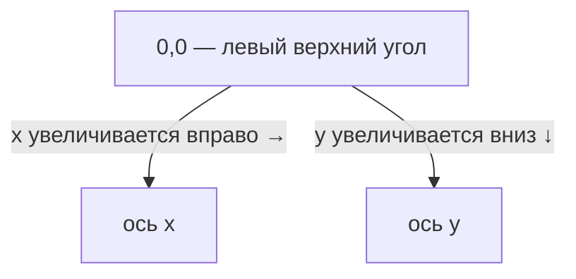

# Урок 1. Обзор концепций Java 2D API

**Трейл:** 2D Graphics · **Оригинал:** [Overview of the Java 2D API Concepts](https://docs.oracle.com/javase/tutorial/2d/overview/index.html)
**Связанные области:** [[01-core-java-syntax-oop]] · **Вопросы:** core-java

> Перевод официального руководства Oracle (The Java Tutorials, JDK 8). Объединяет страницы
> *Overview of the Java 2D API Concepts*, *Coordinates*, *Java 2D Rendering*, *Geometric
> Primitives*, *Text*, *Images* и *Printing*.

Java 2D API предоставляет программам на Java возможности работы с двумерной графикой
(*two-dimensional graphics*), текстом и изображениями за счёт расширений абстрактного
оконного инструментария AWT (*Abstract Windowing Toolkit*). Этот всеобъемлющий пакет
визуализации (*rendering package*) поддерживает штриховую графику (*line art*), текст и
изображения в гибком, полнофункциональном фреймворке для создания более насыщенных
пользовательских интерфейсов, сложных программ рисования и редакторов изображений.

Объекты Java 2D существуют на плоскости, которая называется **пользовательским координатным
пространством** (*user coordinate space*), или просто **пользовательским пространством**
(*user space*). Когда объекты визуализируются на экране или принтере, координаты
пользовательского пространства преобразуются в координаты **пространства устройства**
(*device space coordinates*).

Для начала изучения Java 2D API полезны следующие ссылки:

- класс [`Graphics`](https://docs.oracle.com/javase/8/docs/api/java/awt/Graphics.html);
- класс [`Graphics2D`](https://docs.oracle.com/javase/8/docs/api/java/awt/Graphics2D.html).

Java 2D API предоставляет следующие возможности:

- единообразную модель визуализации (*uniform rendering model*) для устройств отображения и принтеров;
- широкий набор геометрических примитивов (*geometric primitives*) — кривые, прямоугольники,
  эллипсы, — а также механизм для визуализации практически любой геометрической фигуры;
- механизмы определения попадания (*hit detection*) для фигур, текста и изображений;
- модель композитинга (*compositing model*), дающую контроль над тем, как визуализируются
  перекрывающиеся объекты;
- расширенную поддержку цвета, облегчающую управление цветом (*color management*);
- поддержку печати сложных документов;
- управление качеством визуализации с помощью подсказок визуализации (*rendering hints*).

Эти темы рассматриваются в следующих разделах:

- Визуализация в Java 2D (*Java 2D Rendering*);
- геометрические примитивы (*Geometric Primitives*);
- текст (*Text*);
- изображения (*Images*);
- печать (*Printing*).

## Координаты (Coordinates)

Java 2D API поддерживает два координатных пространства:

- **Пользовательское пространство** (*user space*) — пространство, в котором задаются
  графические примитивы.
- **Пространство устройства** (*device space*) — координатная система устройства вывода,
  такого как экран, окно или принтер.

Пользовательское пространство — это устройство-независимая логическая координатная система,
то координатное пространство, которое использует ваша программа. Все геометрические объекты,
передаваемые в процедуры визуализации Java 2D, задаются в координатах пользовательского
пространства.

Когда применяется преобразование из пользовательского пространства в пространство устройства
по умолчанию, началом координат пользовательского пространства является левый верхний угол
области рисования компонента. Координата *x* увеличивается вправо, а координата *y*
увеличивается вниз, как показано на рисунке ниже. Левый верхний угол окна имеет координаты
0,0. Все координаты задаются целыми числами, чего обычно достаточно. Однако в некоторых
случаях требуется одинарная или даже двойная точность с плавающей запятой, которые также
поддерживаются.

<!-- original: none | Авторская схема пользовательского координатного пространства Java 2D; страница Oracle не содержит соответствующего рисунка -->


*Рисунок: пользовательское координатное пространство. Начало координат (0,0) находится в
левом верхнем углу области рисования компонента; ось x направлена вправо, ось y — вниз.*

Пространство устройства — это устройство-зависимая координатная система, которая меняется
в зависимости от целевого устройства визуализации. Хотя координатная система окна или экрана
может сильно отличаться от координатной системы принтера, эти различия невидимы для программ
на Java. Необходимые преобразования между пользовательским пространством и пространством
устройства выполняются автоматически во время визуализации.

## Визуализация в Java 2D (Java 2D Rendering)

Java 2D API предоставляет единообразную модель визуализации для разных типов устройств.
На уровне приложения процесс визуализации одинаков независимо от того, является ли целевым
устройством экран или принтер. Когда компонент нужно отобразить, его метод `paint` или
`update` автоматически вызывается с соответствующим графическим контекстом (`Graphics`).

Java 2D API включает класс
[`java.awt.Graphics2D`](https://docs.oracle.com/javase/8/docs/api/java/awt/Graphics2D.html),
который расширяет класс
[`Graphics`](https://docs.oracle.com/javase/8/docs/api/java/awt/Graphics.html), предоставляя
доступ к расширенным графическим и визуализирующим возможностям Java 2D API. К этим
возможностям относятся:

- Визуализация контура (*outline*) любого геометрического примитива с использованием атрибутов
  обводки (*stroke*) и заливки (*paint*) — метод `draw`.
- Визуализация любого геометрического примитива путём заполнения его внутренней области цветом
  или узором, заданным атрибутами заливки — метод `fill`.
- Визуализация любой текстовой строки — метод `drawString`. Атрибут шрифта (*font*) используется
  для преобразования строки в глифы (*glyphs*), которые затем заполняются цветом или узором,
  заданным атрибутами заливки.
- Визуализация заданного изображения — метод `drawImage`.

Кроме того, класс `Graphics2D` поддерживает методы визуализации класса `Graphics` для
конкретных фигур, такие как `drawOval` и `fillRect`. Все перечисленные выше методы можно
разделить на две группы:

1. методы для рисования фигуры;
2. методы, влияющие на визуализацию.

Вторая группа методов использует атрибуты состояния, которые формируют контекст `Graphics2D`,
для следующих целей:

- изменять ширину обводки;
- менять способ соединения штрихов между собой;
- задавать путь отсечения (*clipping path*), чтобы ограничить визуализируемую область;
- перемещать, поворачивать, масштабировать или сдвигать объекты при их визуализации;
- определять цвета и узоры для заливки фигур;
- задавать способ композиции нескольких графических объектов.

Чтобы использовать возможности Java 2D API в приложении, приведите объект `Graphics`,
передаваемый в метод визуализации компонента, к объекту `Graphics2D`. Например:

```java
public void paint (Graphics g) {
    Graphics2D g2 = (Graphics2D) g;
    ...
}
```

Контекст визуализации класса `Graphics2D` содержит несколько атрибутов.

**Атрибут пера** (*pen attribute*) применяется к контуру фигуры. Этот атрибут обводки
(*stroke*) позволяет рисовать линии любого размера и с любым штриховым узором, а также
применять к линии оформление концов (*end-cap*) и соединений (*join*).

**Атрибут заливки** (*fill attribute*) применяется к внутренней области фигуры. Этот атрибут
заливки (*paint*) позволяет заполнять фигуры сплошными цветами, градиентами и узорами.

**Атрибут композитинга** (*compositing attribute*) используется, когда визуализируемые объекты
перекрывают существующие объекты.

**Атрибут преобразования** (*transform attribute*) применяется во время визуализации для
перевода визуализируемого объекта из координат пользовательского пространства в координаты
пространства устройства. Через этот атрибут можно также применить дополнительные
преобразования: перемещение, поворот, масштабирование или сдвиг.

**Атрибут отсечения** (*clip*) ограничивает визуализацию областью внутри контура объекта
`Shape`, использованного для определения пути отсечения. Путь отсечения может задавать любой
объект `Shape`.

**Атрибут шрифта** (*font attribute*) используется для преобразования текстовых строк в глифы.

**Подсказки визуализации** (*rendering hints*) задают предпочтения в компромиссах между
скоростью и качеством. Например, можно указать, следует ли применять сглаживание
(*antialiasing*), если эта возможность доступна. См. также раздел *Управление качеством
визуализации* (*Controlling Rendering Quality*).

Чтобы узнать больше о преобразовании и композитинге, см. урок *Дополнительные темы Java 2D*
(*Advanced Topics in Java 2D*).

Когда атрибут устанавливается, передаётся соответствующий объект атрибута. Как показано в
следующем примере, чтобы изменить атрибут заливки на сине-зелёный градиент, нужно создать
объект `GradientPaint` и затем вызвать метод `setPaint`:

```java
gp = new GradientPaint(0f,0f,blue,0f,30f,green);
g2.setPaint(gp);
```

## Геометрические примитивы (Geometric Primitives)

Java 2D API предоставляет полезный набор стандартных фигур: точки, линии, прямоугольники,
дуги, эллипсы и кривые. Наиболее важный пакет для определения распространённых геометрических
примитивов — это пакет `java.awt.geom`. Произвольные фигуры могут быть представлены
комбинациями прямых геометрических примитивов.

Интерфейс `Shape` представляет геометрическую фигуру, имеющую контур и внутреннюю область.
Этот интерфейс предоставляет общий набор методов для описания и инспекции двумерных
геометрических объектов и поддерживает криволинейные сегменты и составные подфигуры. Класс
[`Graphics`](https://docs.oracle.com/javase/8/docs/api/java/awt/Graphics.html) поддерживает
только прямолинейные сегменты. Интерфейс
[`Shape`](https://docs.oracle.com/javase/8/docs/api/java/awt/Shape.html) может поддерживать
криволинейные сегменты.

Подробнее о том, как рисовать и заливать фигуры, см. в уроке *Работа с геометрией*
(*Working with Geometry*).

### Точки (Points)

Класс `Point2D` определяет точку, представляющую местоположение в координатном пространстве
(x, y). Термин «точка» (*point*) в Java 2D API — это не то же самое, что пиксель (*pixel*).
Точка не имеет площади, не содержит цвета и не может быть визуализирована.

Точки используются для создания других фигур. Класс `Point2D` также включает метод для
вычисления расстояния между двумя точками.

### Линии (Lines)

Класс `Line2D` — это абстрактный класс, представляющий линию. Координаты линии можно получить
как значения типа `double`. Класс `Line2D` включает несколько методов для задания конечных
точек линии.

Прямолинейный сегмент можно также создать с помощью класса `GeneralPath`, описанного ниже.

### Прямоугольные фигуры (Rectangular Shapes)

Примитивы `Rectangle2D`, `RoundRectangle2D`, `Arc2D` и `Ellipse2D` происходят от класса
`RectangularShape`. Этот класс определяет методы для объектов `Shape`, которые можно описать
прямоугольной ограничивающей рамкой (*bounding box*). Геометрию объекта `RectangularShape`
можно экстраполировать из прямоугольника, который полностью охватывает контур фигуры `Shape`.

### Квадратичные и кубические кривые (Quadratic and Cubic Curves)

Класс `QuadCurve2D` позволяет создавать квадратичные параметрические сегменты кривой.
Квадратичная кривая определяется двумя конечными точками и одной управляющей точкой
(*control point*).

Класс `CubicCurve2D` позволяет создавать кубические параметрические сегменты кривой.
Кубическая кривая определяется двумя конечными точками и двумя управляющими точками. Реализации
кубических и квадратичных кривых см. в разделе *Обводка и заливка графических примитивов*
(*Stroking and Filling Graphics Primitives*).

*Рисунки оригинала: квадратичная параметрическая кривая и кубическая параметрическая
кривая.*

### Произвольные фигуры (Arbitrary Shapes)

Класс `GeneralPath` позволяет построить произвольную фигуру, задав последовательность позиций
вдоль границы фигуры. Эти позиции могут соединяться прямолинейными сегментами, квадратичными
кривыми или кубическими кривыми (Безье — *Bézier*). Например, показанную в оригинале фигуру
можно создать тремя прямолинейными сегментами и одной кубической кривой. Подробнее о реализации
такой фигуры см. в разделе *Обводка и заливка графических примитивов* (*Stroking and Filling
Graphics Primitives*).

### Области (Areas)

С помощью класса `Area` можно выполнять булевы операции — объединение (*union*), пересечение
(*intersection*) и вычитание (*subtraction*) — над любыми двумя объектами `Shape`. Этот приём,
часто называемый **конструктивной геометрией областей** (*constructive area geometry*),
позволяет быстро создавать сложные объекты `Shape`, не описывая каждый линейный сегмент или
кривую по отдельности.

## Текст (Text)

Java 2D API обладает разнообразными возможностями визуализации текста, включая методы для
отрисовки строк и целые классы для задания атрибутов шрифта и выполнения компоновки текста
(*text layout*).

Если нужно просто нарисовать статическую текстовую строку, самый прямой способ — отрисовать
её напрямую через класс `Graphics` с помощью метода `drawString`. Чтобы задать шрифт,
используется метод `setFont` класса `Graphics`.

Если вы хотите реализовать собственные процедуры редактирования текста или вам нужен больший
контроль над компоновкой текста, чем дают текстовые компоненты, можно использовать классы
компоновки текста Java 2D из пакета `java.awt.font`.

### Шрифты (Fonts)

Фигуры, которые шрифт использует для представления символов в строке, называются глифами
(*glyphs*). Отдельный символ или сочетание символов может быть представлено одним или
несколькими глифами. Например, *á* может быть представлено двумя глифами, тогда как лигатура
*fi* может быть представлена одним глифом.

**Шрифт** (*font*) можно рассматривать как коллекцию глифов. У одного шрифта может быть много
**начертаний** (*faces*), таких как курсив и обычное. Все начертания шрифта имеют схожие
типографские особенности и могут быть распознаны как члены одного **семейства** (*family*).
Иными словами, коллекция глифов с определённым стилем образует **начертание шрифта**
(*font face*). Коллекция начертаний шрифта образует **семейство шрифтов** (*font family*).
Коллекция семейств шрифтов образует набор шрифтов, доступных в системе.

При использовании Java 2D API шрифты задаются с помощью экземпляра `Font`. Узнать, какие
шрифты доступны, можно, вызвав статический метод
`GraphicsEnvironment.getLocalGraphicsEnvironment`, а затем запросив возвращённый объект
`GraphicsEnvironment`. Метод `getAllFonts` возвращает массив, содержащий экземпляры `Font`
для всех шрифтов, доступных в системе. Метод `getAvailableFontFamilyNames` возвращает список
доступных семейств шрифтов.

### Компоновка текста (Text Layout)

Прежде чем текст можно будет отобразить, его необходимо скомпоновать так, чтобы символы были
представлены соответствующими глифами в нужных позициях. Существуют два механизма Java 2D для
управления компоновкой текста:

- Класс `TextLayout` управляет компоновкой текста, выделением (*highlighting*) и определением
  попадания (*hit detection*). Возможности `TextLayout` обрабатывают наиболее распространённые
  случаи, включая строки со смешанными шрифтами, смешанными языками и двунаправленным
  (*bidirectional*) текстом.
- Можно создавать собственные объекты `GlyphVector` с помощью класса `Font` и затем
  визуализировать каждый объект `GlyphVector` через класс `Graphics2D`. Таким образом вы
  получаете полный контроль над тем, как текст формируется и позиционируется.

### Подсказки визуализации для текста (Rendering Hints for Text)

Java 2D API позволяет управлять качеством визуализации фигур и текста с помощью подсказок
визуализации (*rendering hints*). Подсказки визуализации инкапсулированы классом
`java.awt.RenderingHints`.

Применительно к тексту эта возможность используется для сглаживания (*antialiasing*, также
известного как сглаживание краёв). Например, подсказка `KEY_TEXT_ANTIALIASING` позволяет
управлять сглаживанием текста отдельно от сглаживания других фигур. Подробнее о подсказках
визуализации см. в уроке *Управление качеством визуализации* (*Controlling Rendering Quality*).

## Изображения (Images)

В Java 2D API изображение — это, как правило, прямоугольный двумерный массив пикселей, где
каждый **пиксель** (*pixel*) представляет цвет в соответствующей позиции изображения, а
размеры представляют горизонтальную протяжённость (ширину) и вертикальную протяжённость
(высоту) изображения при его отображении.

Наиболее важный класс для представления таких изображений — это класс
`java.awt.image.BufferedImage`. Java 2D API хранит содержимое таких изображений в памяти, так
что к ним можно обращаться напрямую.

Приложения могут напрямую создать объект `BufferedImage` или получить изображение из внешнего
формата, такого как PNG или GIF.

В любом случае приложение затем может рисовать на изображении с помощью графических вызовов
Java 2D API. Таким образом, изображения не ограничены отображением картинок фотографического
типа. На изображении можно нарисовать различные объекты: штриховую графику (*line art*),
текст, другую графику и даже другие изображения.

*Рисунок оригинала: изображение как поверхность для рисования (Stonehenge).*

Java 2D API позволяет применять к `BufferedImage` операции фильтрации изображений и включает
несколько встроенных фильтров. Например, фильтр `ConvolveOp` можно использовать для размытия
(*blur*) или повышения резкости (*sharpen*) изображений.

Полученное изображение затем можно нарисовать на экране, отправить на принтер или сохранить
в графическом формате, таком как PNG, GIF и т. д. Подробнее об изображениях см. в уроке
*Работа с изображениями* (*Working with Images*).

## Печать (Printing)

Всю графику Swing и Java 2D, включая составную (*composited*) графику и изображения, можно
вывести на принтер с помощью Java 2D Printing API. Этот API также предоставляет возможности
композиции документа, позволяющие выполнять такие операции, как изменение порядка печати
страниц.

Визуализация на принтер похожа на визуализацию на экран. Система печати управляет тем, когда
визуализируются страницы, точно так же, как система рисования управляет тем, когда компонент
отрисовывается на экране.

Java 2D Printing API основан на модели обратного вызова (*callback*), в которой моментом
печати страниц управляет система печати, а не приложение. Приложение предоставляет системе
печати информацию о документе, который нужно напечатать, а система печати определяет, когда
каждую страницу необходимо отрисовать.

Для поддержки печати важны две следующие возможности:

- **Управление заданием** (*job control*) — инициирование и управление заданием печати,
  включая отображение стандартных диалоговых окон печати и настройки;
- **Разбиение на страницы** (*pagination*) — визуализация каждой страницы по запросу системы
  печати.

Когда страницы нужно отрисовать, система печати вызывает метод `print` приложения с
соответствующим графическим контекстом `Graphics`. Чтобы использовать возможности Java 2D API
при печати, объект `Graphics` приводится к классу `Graphics2D` — точно так же, как при
визуализации на экран.

## Источник

- [Overview of the Java 2D API Concepts](https://docs.oracle.com/javase/tutorial/2d/overview/index.html) — официальное руководство Oracle.
- [Coordinates](https://docs.oracle.com/javase/tutorial/2d/overview/coordinate.html) — официальное руководство Oracle.
- [Java 2D Rendering](https://docs.oracle.com/javase/tutorial/2d/overview/rendering.html) — официальное руководство Oracle.
- [Geometric Primitives](https://docs.oracle.com/javase/tutorial/2d/overview/primitives.html) — официальное руководство Oracle.
- [Text](https://docs.oracle.com/javase/tutorial/2d/overview/text.html) — официальное руководство Oracle.
- [Images](https://docs.oracle.com/javase/tutorial/2d/overview/images.html) — официальное руководство Oracle.
- [Printing](https://docs.oracle.com/javase/tutorial/2d/overview/printing.html) — официальное руководство Oracle.
</content>
</invoke>
