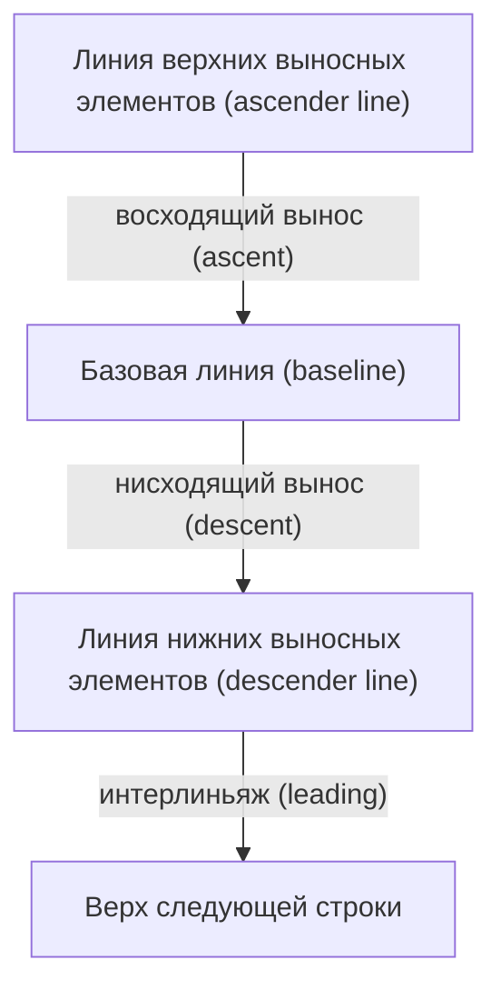

# Урок 3. Работа с текстовыми API

**Трейл:** 2D Graphics · **Оригинал:** [Working with Text APIs](https://docs.oracle.com/javase/tutorial/2d/text/index.html)
**Связанные области:** [[01-core-java-syntax-oop]] · **Вопросы:** core-java

> Перевод официального руководства Oracle (The Java Tutorials, JDK 8). Урок объединяет
> страницы *Font Concepts*, *Text Layout Concepts*, *Physical and Logical Fonts*,
> *Measuring Text*, *Advanced Text Display*, *Displaying Antialiased Text by Using
> Rendering Hints*, *Using Text Attributes to Style Text*, *Drawing Multiple Lines of Text*
> и *Working with Bidirectional Text*.

> Этот урок знакомит с концепцией работы с текстовыми API для применения возможностей
> отрисовки текста. В предыдущих уроках трейла вы уже использовали базовые текстовые API
> Java 2D и знаете, как задать шрифт и его положение, а также как нарисовать текст.
>
> Этот урок расширяет тот материал, помогая понять, как пользоваться этими API, и глубже
> погружает в возможности отображения текста средствами Java 2D.

## Концепция шрифтов (Font Concepts)

> Этот раздел знакомит с классом [`Font`](https://docs.oracle.com/javase/8/docs/api/java/awt/Font.html),
> который поддерживает задание подробной информации о шрифте и использование сложных
> типографских возможностей.
>
> Объект [`Font`](https://docs.oracle.com/javase/8/docs/api/java/awt/Font.html) представляет
> экземпляр начертания шрифта (font face) из набора начертаний, доступных в системе.
> Примеры распространённых начертаний — Helvetica Bold и Courier Bold Italic. С объектом
> `Font` связаны три имени: логическое имя (logical name), имя семейства (family name) и
> имя начертания шрифта (font face name).

> - **Логическое имя** (*logical name*) объекта `Font` — это имя, отображаемое на физический
>   шрифт, то есть на один из конкретных шрифтов, доступных в системе. При указании `Font`
>   в Java следует использовать имя начертания (font face name), а не логическое имя.
>   Логическое имя можно получить из `Font`, вызвав метод
>   [`getName`](https://docs.oracle.com/javase/8/docs/api/java/awt/Font.html#getName--).
>   Чтобы получить список логических имён, отображённых на конкретные шрифты, доступные в
>   системе, вызовите метод
>   [`java.awt.GraphicsEnvironment.getAvailableFontFamilyNames`](https://docs.oracle.com/javase/8/docs/api/java/awt/GraphicsEnvironment.html#getAvailableFontFamilyNames--).
>   Подробнее см. **Физические и логические шрифты**.
> - **Имя семейства** (*family name*) объекта `Font` — это имя семейства шрифтов,
>   определяющего типографский дизайн нескольких начертаний, например Helvetica.
>   Имя семейства возвращает метод
>   [`getFamily`](https://docs.oracle.com/javase/8/docs/api/java/awt/Font.html#getFamily--).
> - **Имя начертания шрифта** (*font face name*) объекта `Font` указывает на фактический
>   шрифт, установленный в системе. Именно это имя следует использовать при указании шрифта.
>   Его часто называют просто **именем шрифта** (*font name*). Имя шрифта возвращает метод
>   [`getFontName`](https://docs.oracle.com/javase/8/docs/api/java/awt/Font.html#getFontName--).
>   Чтобы определить, какие начертания доступны в системе, вызовите метод
>   [`java.awt.GraphicsEnvironment.getAllFonts`](https://docs.oracle.com/javase/8/docs/api/java/awt/GraphicsEnvironment.html#getAllFonts--).

> Доступ к информации о шрифте `Font` можно получить через метод
> [`getAttributes`](https://docs.oracle.com/javase/8/docs/api/java/awt/Font.html#getAttributes--).
> Атрибуты объекта `Font` включают его имя, размер, преобразование (transform) и
> характеристики шрифта, такие как насыщенность (weight) и наклон (posture).
>
> Объект [`LineMetrics`](https://docs.oracle.com/javase/8/docs/api/java/awt/font/LineMetrics.html)
> инкапсулирует измерительную информацию, связанную со шрифтом `Font`, такую как его
> восходящий вынос (ascent), нисходящий вынос (descent) и интерлиньяж (leading).

> - **Восходящий вынос** (*ascent*) — расстояние от базовой линии (baseline) до линии
>   верхних выносных элементов (ascender line). Это расстояние представляет типичную высоту
>   заглавных букв, но некоторые символы могут выступать выше линии верхних выносных элементов.
> - **Нисходящий вынос** (*descent*) — расстояние от базовой линии до линии нижних выносных
>   элементов (descender line). Нижняя точка большинства символов попадает в пределы descent,
>   но некоторые символы могут выходить ниже линии нижних выносных элементов.
> - **Интерлиньяж** (*leading*) — рекомендуемое расстояние от низа линии нижних выносных
>   элементов до верха следующей строки.

На следующей схеме показано положение линии верхних выносных элементов (ascender line),
базовой линии (baseline) и линии нижних выносных элементов (descender line):



> Эта информация используется для правильного позиционирования символов вдоль строки и для
> расположения строк относительно друг друга. Доступ к этим метрикам строки можно получить
> через методы
> [`getAscent`](https://docs.oracle.com/javase/8/docs/api/java/awt/font/LineMetrics.html#getAscent--),
> [`getDescent`](https://docs.oracle.com/javase/8/docs/api/java/awt/font/LineMetrics.html#getDescent--)
> и [`getLeading`](https://docs.oracle.com/javase/8/docs/api/java/awt/font/LineMetrics.html#getLeading--).
> Через класс `LineMetrics` также можно получить информацию о высоте объекта `Font`, его
> базовой линии, а также о характеристиках подчёркивания и зачёркивания.

## Концепция компоновки текста (Text Layout Concepts)

> Прежде чем фрагмент текста можно будет отобразить, он должен быть правильно сформирован
> (shaped) и расположен с использованием подходящих глифов (glyphs) и лигатур (ligatures).
> Этот процесс называется **компоновкой текста** (*text layout*). Процесс компоновки текста
> включает следующее:
>
> - формирование текста с использованием подходящих глифов и лигатур;
> - правильное упорядочивание текста;
> - измерение и позиционирование текста.

> Информация, используемая для компоновки текста, необходима также для выполнения текстовых
> операций, таких как позиционирование каретки (caret positioning), проверка попадания
> (hit detection) и подсветка (highlighting). Подробнее об этих текстовых операциях см.
> **Работа с двунаправленным текстом**.
>
> Чтобы разрабатывать программное обеспечение, которое можно развёртывать на международных
> рынках, текст на разных языках должен компоноваться в соответствии с правилами
> соответствующей письменности.

### Формирование текста (Shaping Text)

> **Глиф** (*glyph*) — это визуальное представление одного или нескольких символов. Форма,
> размер и положение глифа зависят от его контекста. Один символ или сочетание символов могут
> быть представлены множеством разных глифов в зависимости от шрифта и стиля.
>
> Например, в рукописном курсивном тексте конкретный символ может принимать разные формы в
> зависимости от того, как он соединяется с соседними символами.
>
> В некоторых системах письма, особенно в арабской, контекст глифа всегда необходимо
> учитывать. В отличие от английского, курсивные формы в арабском обязательны; недопустимо
> представлять текст без использования курсивных форм.
>
> В зависимости от контекста эти курсивные формы могут радикально различаться по форме.
> Например, арабская буква *хех* (heh) имеет четыре курсивные формы (несоединённую,
> соединяемую справа, соединяемую с обеих сторон и соединяемую слева).
>
> Хотя эти четыре формы сильно отличаются друг от друга, такое курсивное изменение формы
> по сути не отличается от курсивного письма в английском.
>
> В некоторых контекстах два глифа могут менять форму ещё радикальнее и сливаться в единый
> глиф. Такой объединённый глиф называется **лигатурой** (*ligature*). Например, большинство
> английских шрифтов содержат лигатуру *fi*.
>
> Объединённый глиф учитывает выступ (overhang) у буквы *f* и комбинирует символы
> естественным образом, а не просто позволяет буквам сталкиваться.
>
> Лигатуры также используются в арабском, и применение некоторых лигатур обязательно;
> недопустимо представлять определённые сочетания символов без использования соответствующей
> лигатуры. Когда лигатуры образуются из арабских символов, формы меняются ещё радикальнее,
> чем в английском. Например, два арабских символа, появляясь вместе, объединяются в единую
> лигатуру.

### Упорядочивание текста (Ordering Text)

> В языке программирования Java текст кодируется с использованием кодировки символов Unicode.
> Текст, использующий кодировку Unicode, хранится в памяти в **логическом порядке**
> (*logical order*). Логический порядок — это порядок, в котором символы и слова читаются и
> записываются. Логический порядок не обязательно совпадает с **визуальным порядком**
> (*visual order*) — порядком, в котором отображаются соответствующие глифы.
>
> Визуальный порядок глифов в конкретной системе письма (письменности, script) называется
> **порядком письменности** (*script order*). Например, порядок письменности для латинского
> (романского) текста — слева направо, а для арабского и иврита — справа налево.
>
> В некоторых системах письма помимо порядка письменности есть дополнительные правила
> размещения глифов и слов в строках текста. Например, арабские и ивритские числа идут слева
> направо, хотя буквы идут справа налево. Это означает, что арабский и иврит, даже без
> вкраплений английского текста, являются по-настоящему двунаправленными (bidirectional).
> Подробнее см. **Работа с двунаправленным текстом**.

### Измерение и позиционирование текста (Measuring and Positioning Text)

> Если вы не работаете с моноширинным (monospaced) шрифтом, разные символы шрифта имеют
> разную ширину. Это означает, что любое позиционирование и измерение текста должно учитывать,
> какие именно символы используются, а не только их количество. Например, чтобы выровнять по
> правому краю столбец чисел, отображённых пропорциональным шрифтом, нельзя просто
> использовать дополнительные пробелы для позиционирования текста. Чтобы правильно выровнять
> столбец, нужно знать точную ширину каждого числа, чтобы соответствующим образом
> скорректировать положение.
>
> Текст часто отображается с использованием нескольких шрифтов и стилей, например полужирного
> (bold) или курсива (italic). В этом случае даже один и тот же символ может иметь разные
> формы и ширину в зависимости от применённого стиля. Чтобы правильно позиционировать,
> измерять и отрисовывать текст, нужно отслеживать каждый отдельный символ *и* стиль,
> применённый к этому символу. К счастью, класс
> [`TextLayout`](https://docs.oracle.com/javase/8/docs/api/java/awt/font/TextLayout.html)
> делает это за вас.
>
> Чтобы правильно отображать текст на таких языках, как иврит и арабский, каждый отдельный
> символ необходимо измерять и позиционировать в контексте соседних символов. Поскольку формы
> и положения символов могут меняться в зависимости от контекста, измерение и позиционирование
> такого текста без учёта контекста даёт неприемлемые результаты.
>
> Кроме того, Java SE предоставляет класс
> [`FontMetrics`](https://docs.oracle.com/javase/8/docs/api/java/awt/FontMetrics.html),
> который позволяет получить измерения текста, отрисованного объектом `Font`, например высоту
> строки текста в данном шрифте. Эту информацию можно использовать для точного позиционирования
> текста в графических приложениях Java. Подробнее см. **Измерение текста**.

## Физические и логические шрифты (Physical and Logical Fonts)

> Существует два типа шрифтов: физические шрифты (physical fonts) и логические шрифты
> (logical fonts). Физические шрифты — это фактические библиотеки шрифтов, состоящие,
> например, из шрифтов TrueType или PostScript Type 1. Физическими шрифтами могут быть Times,
> Helvetica, Courier или любые другие, включая международные шрифты. Логические шрифты — это
> следующие пять семейств шрифтов: Serif, SansSerif, Monospaced, Dialog и DialogInput. Эти
> логические шрифты не являются фактическими библиотеками шрифтов. Вместо этого имена
> логических шрифтов отображаются на физические шрифты средой выполнения Java (Java runtime
> environment).
>
> Этот раздел помогает определить, какой тип шрифта использовать в приложении. Он охватывает
> следующие темы:
>
> - Физические шрифты
>   - Шрифты Lucida
>   - Поставка физических шрифтов вместе с приложением
> - Логические шрифты
> - Преимущества и недостатки использования физических и логических шрифтов
> - Файлы конфигурации шрифтов

### Физические шрифты (Physical Fonts)

> Физические шрифты — это фактические библиотеки шрифтов, содержащие данные глифов и таблицы
> для отображения последовательностей символов в последовательности глифов с использованием
> такой технологии шрифтов, как TrueType или PostScript Type 1. Чтобы получить имена всех
> доступных семейств шрифтов, установленных в системе, вызовите следующее:

```java
GraphicsEnvironment ge = GraphicsEnvironment.getLocalGraphicsEnvironment();
String []fontFamilies = ge.getAvailableFontFamilyNames();
```

> Пример программы FontSelector (доступен в `FontSelector.java`) показывает, как находить и
> выбирать эти шрифты.
>
> **Примечание.** Приложения не должны предполагать наличие какого-либо конкретного
> физического шрифта. Однако логические шрифты — безопасный выбор, поскольку они присутствуют
> всегда. Подробнее см. Логические шрифты.
>
> **Примечание.** Если апплет не запускается, необходимо установить как минимум выпуск
> Java SE Development Kit (JDK) 7.

#### Шрифты Lucida (Lucida Fonts)

> Среды выполнения JRE от Oracle содержат это семейство физических шрифтов, которое также
> лицензировано для использования в других реализациях платформы Java. Эти шрифты являются
> физическими, но не зависят от операционной системы хоста.
>
> Приложения, использующие эти шрифты, могут добиться одинакового внешнего вида везде, где
> доступны эти шрифты. Кроме того, эти шрифты охватывают широкий диапазон языков (особенно
> европейских и ближневосточных), поэтому вы можете создавать полностью многоязычные
> приложения для поддерживаемых языков. Однако эти шрифты могут быть доступны не во всех JRE.
> Кроме того, в настоящее время они не охватывают полный набор символов Unicode; в частности,
> китайский, японский и корейский не поддерживаются.

#### Поставка физических шрифтов вместе с приложением (Bundling Physical Fonts with Your Application)

> Иногда приложение не может полагаться на то, что шрифт установлен в системе, — обычно
> потому, что шрифт является пользовательским (custom) и иначе недоступен. В этом случае
> необходимо поставлять файлы шрифтов вместе с приложением.
>
> Чтобы создать объект `Font` из существующего физического шрифта, используйте один из
> следующих методов:

```java
Font java.awt.Font.createFont(int fontFormat, InputStream in);
Font java.awt.Font.createFont(int fontFormat, File fontFile);
```

> Чтобы создать объект `Font` из шрифта TrueType, формальный параметр `fontFormat` должен
> быть константой `Font.TRUETYPE_FONT`. В следующем примере создаётся объект `Font` из файла
> шрифта TrueType `A.ttf`:

```java
Font font = Font.createFont(Font.TRUETYPE_FONT, new File("A.ttf"));
```

> Доступ к шрифту непосредственно из файла проще и удобнее. Однако вам может потребоваться
> объект `InputStream`, если ваш код не может обращаться к ресурсам файловой системы или если
> шрифт упакован в Java-архив (JAR) вместе с остальной частью приложения или апплета.
>
> Метод `createFont` создаёт новый объект `Font` с размером в 1 пункт (point) и стилем
> `PLAIN`. Этот базовый шрифт затем можно использовать с методами `Font.deriveFont`, чтобы
> производить новые объекты `Font` различных размеров, стилей, преобразований и характеристик
> шрифта. Например:

```java
try {
     // Возвращаемый шрифт имеет размер 1 пункт
     Font font = Font.createFont(Font.TRUETYPE_FONT, new File("A.ttf"));

     // Производим и возвращаем версию размером 12 пунктов:
     // нужно использовать float, иначе
     // значение было бы воспринято как стиль

     return font.deriveFont(12f);

} catch (IOException|FontFormatException e) {
     // Обработка исключения
}
```

> Важно использовать метод `deriveFont`, потому что шрифты, созданные приложением, не входят
> в набор шрифтов, известных нижележащей системе шрифтов. Поскольку метод `deriveFont`
> работает от изначально созданного шрифта, у него нет этого ограничения.
>
> Решение этой проблемы — зарегистрировать созданный шрифт в графическом окружении
> (graphics environment). Например:

```java
try {
     GraphicsEnvironment ge =
         GraphicsEnvironment.getLocalGraphicsEnvironment();
     ge.registerFont(Font.createFont(Font.TRUETYPE_FONT, new File("A.ttf"));
} catch (IOException|FontFormatException e) {
     // Обработка исключения
}
```

> После регистрации шрифта в графическом окружении шрифт становится доступным в вызовах
> `getAvailableFontFamilyNames()` и может использоваться в конструкторах шрифтов.

### Логические шрифты (Logical Fonts)

> Java SE определяет следующие пять семейств логических шрифтов:
>
> - `Dialog`
> - `DialogInput`
> - `Monospaced`
> - `Serif`
> - `SansSerif`

> Эти шрифты доступны на любой платформе Java, и их можно рассматривать как псевдонимы
> (aliases) для некоторого нижележащего шрифта, обладающего свойствами, подразумеваемыми его
> именем. Serif-шрифт — это шрифт, похожий на Times New Roman, который часто используется в
> печати. Sans Serif-шрифт более типичен для использования на экране.
>
> Эти шрифты могут быть настроены под локаль пользователя. Кроме того, эти шрифты поддерживают
> самый широкий диапазон кодовых точек (символов Unicode).
>
> Помимо семейства, шрифты имеют и другие атрибуты, наиболее важные из которых — **стиль**
> (*style*) и **размер** (*size*). Стили — это **полужирный** (Bold) и *курсив* (Italic).
>
> Шрифт по умолчанию, используемый Java 2D API, — Dialog размером 12 пунктов. Это типичный
> размер для чтения текста на обычном дисплее с разрешением 72–120 DPI. Приложение может
> создать экземпляр этого шрифта напрямую, указав следующее:

```java
Font font = new Font("Dialog", Font.PLAIN, 12);
```

### Преимущества и недостатки использования физических и логических шрифтов

> Физические шрифты позволяют приложению в полной мере использовать все доступные шрифты —
> для достижения как различного внешнего вида текста, так и максимального охвата языков. Однако
> создавать приложения, использующие физические шрифты, существенно сложнее.
>
> Поставка физических шрифтов вместе с приложением позволяет создавать приложения, которые
> везде выглядят одинаково, и полностью контролировать, какие приложения вы хотите
> поддерживать. Однако поставляемые шрифты могут быть весьма большими, особенно если вы хотите,
> чтобы ваши приложения поддерживали китайский, японский и корейский. Кроме того, вам может
> понадобиться решить вопросы лицензирования.
>
> Имена логических шрифтов гарантированно работают где угодно и обеспечивают отрисовку текста
> как минимум на том языке, для которого локализована операционная система хоста (часто на
> гораздо большем диапазоне языков). Однако физические шрифты, используемые для отрисовки
> текста, различаются между разными реализациями, операционными системами хоста и локалями,
> поэтому приложение не может добиться одинакового внешнего вида везде. Кроме того, механизмы
> отображения иногда ограничивают диапазон символов, которые можно отрисовать. Последнее
> раньше было большой проблемой в версиях JRE до 5.0: например, японский текст можно было
> отрисовать только в японски локализованных операционных системах хоста, но не в системах с
> другой локализацией, даже если японские шрифты были установлены. Для приложений,
> использующих отрисовку шрифтов средствами 2D, эта проблема гораздо реже встречается в JRE
> версии 5.0 и более поздних, поскольку механизм отображения теперь обычно распознаёт и
> использует шрифты для всех поддерживаемых систем письма, если они установлены.

### Файлы конфигурации шрифтов (Font Configuration Files)

> Среда выполнения Java SE использует файлы конфигурации шрифтов для отображения имён
> логических шрифтов на физические шрифты. Существует несколько файлов для поддержки разных
> отображений в зависимости от версии операционной системы хоста. Файлы расположены в каталоге
> `lib` внутри установки JRE. Вы можете отредактировать или создать собственные файлы
> конфигурации шрифтов, чтобы скорректировать отображения под конкретную конфигурацию вашей
> системы. Подробнее см. Файлы конфигурации шрифтов.

## Измерение текста (Measuring Text)

> Чтобы правильно измерять текст, нужно изучить несколько методов и некоторые ошибки, которых
> следует избегать. Метрики шрифта (font metrics) — это измерения текста, отрисованного
> объектом [`Font`](https://docs.oracle.com/javase/8/docs/api/java/awt/Font.html), например
> высота строки текста в данном шрифте. Самый распространённый способ измерения текста —
> использовать экземпляр класса
> [`FontMetrics`](https://docs.oracle.com/javase/8/docs/api/java/awt/FontMetrics.html),
> который инкапсулирует эту метрическую информацию. Например:

```java
// получаем метрики из graphics
FontMetrics metrics = graphics.getFontMetrics(font);
// получаем высоту строки текста в этом
// шрифте и контексте отрисовки
int hgt = metrics.getHeight();
// получаем продвижение (advance) нашего текста в этом
// шрифте и контексте отрисовки
int adv = metrics.stringWidth(text);
// вычисляем размер прямоугольника для размещения
// текста с небольшими отступами.
Dimension size = new Dimension(adv+2, hgt+2);
```

> Этого способа достаточно для многих приложений, чтобы равномерно располагать строки текста
> или задавать размеры Swing-компонентов.
>
> Обратите внимание на следующее:
>
> - Метрики получают из класса
>   [`Graphics`](https://docs.oracle.com/javase/8/docs/api/java/awt/Graphics.html), поскольку
>   этот класс инкапсулирует `FontRenderContext`, необходимый для точного измерения текста.
>   При экранных разрешениях шрифты корректируются для удобства чтения. По мере увеличения
>   размера текста эта корректировка не масштабируется линейно. Поэтому при 20 пунктах шрифт
>   не отобразит текст ровно вдвое длиннее, чем при 10 пунктах. Помимо самого текста и шрифта,
>   ещё одна важная часть информации, необходимая для измерения текста, — это
>   `FontRenderContext`. Он включает преобразование из пользовательского пространства (user
>   space) в пиксели устройства (device pixels), которое используется при измерении текста.
> - Высота сообщается без привязки к какой-либо конкретной строке текста. Это полезно,
>   например, в текстовом редакторе, где нужно одинаковое межстрочное расстояние между всеми
>   строками текста.
> - `stringWidth()` возвращает ширину продвижения (advance width) текста. **Ширина продвижения**
>   (*advance width*) — это расстояние от начала текста до позиции последующей отрисованной
>   строки.

> При использовании этих методов для измерения текста учтите, что текст может выходить в любом
> направлении за пределы прямоугольника, определяемого высотой шрифта и продвижением строки.
>
> Как правило, самое простое решение — обеспечить, чтобы текст не обрезался, например
> окружающими его компонентами. Добавляйте отступы в случаях, когда текст иначе мог бы быть
> обрезан.
>
> Если этого решения недостаточно, другие API измерения текста в программном обеспечении
> Java 2D могут возвращать прямоугольные ограничивающие рамки (bounding boxes). Эти рамки
> учитывают высоту конкретного измеряемого текста и эффекты пикселизации (pixelization).

## Расширенное отображение текста (Advanced Text Display)

> Java 2D API предоставляет механизмы для поддержки сложной компоновки текста. Этот раздел
> описывает следующие возможности расширенного отображения текста:
>
> - **Отображение сглаженного текста с помощью подсказок отрисовки** — объясняет, как
>   управлять качеством отрисовки с помощью *подсказок отрисовки* (rendering hints).
> - **Использование текстовых атрибутов для стилизации текста** — объясняет, как использовать
>   класс `TextAttribute` для подчёркивания или зачёркивания текста.
> - **Отрисовка нескольких строк текста** — объясняет, как позиционировать и отрисовывать
>   абзац стилизованного текста с помощью классов `TextLayout` и `LineBreakMeasurer`.
> - **Работа с двунаправленным текстом** — рассматривает, как работать с двунаправленным
>   текстом с помощью классов пакетов
>   [`java.awt`](https://docs.oracle.com/javase/8/docs/api/java/awt/package-summary.html) и
>   [`java.awt.font`](https://docs.oracle.com/javase/8/docs/api/java/awt/font/package-summary.html).

### Отображение сглаженного текста с помощью подсказок отрисовки (Displaying Antialiased Text by Using Rendering Hints)

> На отрисовку текста средствами Java 2D могут влиять **подсказки отрисовки** (*rendering hints*).
>
> Напомним, что самый важный метод отрисовки текста — следующий:

```java
Graphics.drawString(String s, int x, int y);
```

> Обычно этот метод отрисовывает каждый глиф в строке текста сплошным цветом, и каждый пиксель,
> который «включён» в этом глифе, устанавливается в этот цвет. Такой тип отрисовки даёт текст
> с наивысшим контрастом, но иногда — с зубчатыми (зернистыми, aliased) краями.
>
> **Сглаживание текста** (*text antialiasing*) — это техника, используемая для сглаживания
> краёв текста на экране. Java 2D API позволяет приложениям указывать, следует ли применять
> эту технику и какой алгоритм использовать, применяя к `Graphics` подсказку отрисовки текста.
>
> Наиболее распространённая подсказка отрисовки смешивает цвет переднего плана (текста) с
> экранными фоновыми пикселями на краях текста. Чтобы запросить эту подсказку, приложение
> должно вызвать следующее:

```java
graphics2D.setRenderingHint(
        RenderingHints.KEY_TEXT_ANTIALIASING,
        RenderingHints.VALUE_TEXT_ANTIALIAS_ON);
```

> При неуместном использовании этот метод может сделать текст чрезмерно размытым. В таких
> случаях лучше использовать следующую подсказку:

```java
graphics2D.setRenderingHint(
        RenderingHints.KEY_TEXT_ANTIALIASING,
        RenderingHints.VALUE_TEXT_ANTIALIAS_GASP);
```

> Этот метод автоматически использует информацию в самом шрифте, чтобы решить, применять ли
> сглаживание или использовать сплошные цвета.
>
> ЖК-дисплеи (LCD displays) обладают свойством, которое Java 2D API может использовать для
> получения текста, который не такой размытый, как при обычном сглаживании, но более читаем
> при малых размерах. Чтобы запросить отрисовку текста с использованием режима субпиксельного
> ЖК-текста (sub-pixel LCD text mode) для типичного ЖК-дисплея, приложение должно вызвать
> следующее:

```java
graphics2D.setRenderingHint(
        RenderingHints.KEY_TEXT_ANTIALIASING,
        RenderingHints.VALUE_TEXT_ANTIALIAS_LCD_HRGB);
```

> Приведённый ниже пример кода иллюстрирует возможность сглаживания в следующем порядке:
>
> 1. Сглаживание выключено.
> 2. Сглаживание включено.
> 3. Сглаживание с использованием подсказки `TEXT_ANTIALIAS_GASP`.
> 4. Сглаживание с использованием подсказки `TEXT_ANTIALIAS_LCD_HRGB`.
>
> **Примечание.** Таблица GASP указывает использовать только хинтинг (hinting) при этих
> размерах, а не «сглаживание». Поэтому во многих случаях результирующее отображение текста
> эквивалентно `VALUE_TEXT_ANTIALIAS_OFF`.

Полный код этого апплета находится в `AntialiasedText.java`:

```java
public void paint(Graphics g) {

    Graphics2D g2d = (Graphics2D)g;

    String text = "The quick brown fox jumped over the lazy dog";
    Font font = new Font(Font.SERIF, Font.PLAIN, 12);
    g2d.setFont(font);

    g2d.setRenderingHint(RenderingHints.KEY_TEXT_ANTIALIASING,
                         RenderingHints.VALUE_TEXT_ANTIALIAS_OFF);
    g2d.drawString(text, 20, 30);

    g2d.setRenderingHint(RenderingHints.KEY_TEXT_ANTIALIASING,
                         RenderingHints.VALUE_TEXT_ANTIALIAS_ON);
    g2d.drawString(text, 20, 50);

    g2d.setRenderingHint(RenderingHints.KEY_TEXT_ANTIALIASING,
                         RenderingHints.VALUE_TEXT_ANTIALIAS_GASP);
    g2d.drawString(text, 20, 70);

    g2d.setRenderingHint(RenderingHints.KEY_TEXT_ANTIALIASING,
                         RenderingHints.VALUE_TEXT_ANTIALIAS_LCD_HRGB);
    g2d.drawString(text, 20, 90);
}
```

### Использование текстовых атрибутов для стилизации текста (Using Text Attributes to Style Text)

> Приложениям обычно нужна возможность применять следующие текстовые атрибуты:
>
> - **Подчёркивание** (*Underline*) — линия, проводимая под текстом.
> - **Зачёркивание** (*Strikethrough*) — горизонтальная линия, проводимая сквозь текст.
> - **Надстрочный или подстрочный индекс** (*Superscript* или *Subscript*) — текст или буква,
>   расположенные немного выше строки или, соответственно, ниже строки.
> - **Кернинг** (*Kerning*) — корректировка расстояния между символами.

> Эти и другие текстовые атрибуты можно применить с помощью класса `TextAttribute` из Java 2D.
>
> Чтобы применить эти текстовые атрибуты, добавьте их в объект `Font`. Например:

```java
Map<TextAttribute, Object> map =
    new Hashtable<TextAttribute, Object>();
map.put(TextAttribute.KERNING,
    TextAttribute.KERNING_ON);
font = font.deriveFont(map);
graphics.setFont(font);
```

> Приведённый ниже пример кода показывает применение текстовых атрибутов в следующем порядке:
>
> 1. Образец строки (без применённых текстовых атрибутов).
> 2. Кернинг.
> 3. Кернинг и подчёркивание.
> 4. Кернинг, подчёркивание и зачёркивание.
> 5. Кернинг, подчёркивание, зачёркивание и цвет.
>
> **Примечание.** Если апплет не запускается, необходимо установить как минимум выпуск
> [Java SE Development Kit (JDK) 7](http://www.oracle.com/technetwork/java/javase/downloads/index.html).
>
> Полный код этого апплета находится в `AttributedText.java`.

### Отрисовка нескольких строк текста (Drawing Multiple Lines of Text)

> Если у вас есть абзац стилизованного текста, который нужно уместить в пределах определённой
> ширины, можно использовать класс `LineBreakMeasurer`. Этот класс позволяет разбивать
> стилизованный текст на строки так, чтобы они умещались в пределах определённого визуального
> продвижения (visual advance). Каждая строка возвращается в виде объекта `TextLayout`,
> который представляет неизменяемые стилизованные символьные данные. Однако этот класс также
> даёт доступ к информации о компоновке. Методы `getAscent` и `getDescent` класса `TextLayout`
> возвращают информацию о шрифте, используемую для позиционирования строк в компоненте. Текст
> хранится как объект `AttributedCharacterIterator`, чтобы атрибуты шрифта и размера в пунктах
> могли храниться вместе с текстом.
>
> Следующий апплет позиционирует абзац стилизованного текста внутри компонента, используя
> `LineBreakMeasurer`, `TextLayout` и `AttributedCharacterIterator`.
>
> **Примечание.** Если апплет не запускается, необходимо установить как минимум выпуск
> [Java SE Development Kit (JDK) 7](http://www.oracle.com/technetwork/java/javase/downloads/index.html).
>
> Полный код этого апплета находится в `LineBreakSample.java`.
>
> Следующий код создаёт итератор со строкой `vanGogh`. Извлекаются начало и конец итератора,
> и из итератора создаётся новый `LineBreakMeasurer`.

```java
AttributedCharacterIterator paragraph = vanGogh.getIterator();
paragraphStart = paragraph.getBeginIndex();
paragraphEnd = paragraph.getEndIndex();
FontRenderContext frc = g2d.getFontRenderContext();
lineMeasurer = new LineBreakMeasurer(paragraph, frc);
```

> Размер окна используется, чтобы определить, где должна происходить разбивка строки. Также
> для каждой строки абзаца создаётся объект `TextLayout`.

```java
// Устанавливаем ширину разбивки равной ширине компонента.
float breakWidth = (float)getSize().width;
float drawPosY = 0;
// Устанавливаем позицию на индекс первого
// символа в абзаце.
lineMeasurer.setPosition(paragraphStart);

// Получаем строки до тех пор, пока весь абзац
// не будет отображён.
while (lineMeasurer.getPosition() < paragraphEnd) {

    TextLayout layout = lineMeasurer.nextLayout(breakWidth);

    // Вычисляем x-позицию пера. Если абзац
    // направлен справа налево, мы выровняем
    // объекты TextLayout по правому краю панели.
    float drawPosX = layout.isLeftToRight()
        ? 0 : breakWidth - layout.getAdvance();

    // Сдвигаем y-координату на восходящий вынос
    // (ascent) данной компоновки.
    drawPosY += layout.getAscent();

    // Отрисовываем TextLayout в точке (drawPosX, drawPosY).
    layout.draw(g2d, drawPosX, drawPosY);

    // Сдвигаем y-координату для подготовки к
    // следующей компоновке.
    drawPosY += layout.getDescent() + layout.getLeading();
}
```

> Класс `TextLayout` нечасто создаётся приложениями напрямую. Однако этот класс полезен, когда
> приложениям нужно работать напрямую с текстом, к которому применены стили (текстовые
> атрибуты) в определённых позициях текста. Например, чтобы нарисовать одно слово курсивом в
> абзаце, приложению пришлось бы выполнять измерения и устанавливать шрифт для каждой
> подстроки. Если текст двунаправленный, эту задачу не так просто выполнить правильно. Создание
> объекта `TextLayout` из объекта `AttributedString` решает эту проблему за вас. За
> дополнительной информацией о
> [`TextLayout`](https://docs.oracle.com/javase/8/docs/api/java/awt/font/TextLayout.html)
> обратитесь к спецификации Java SE.

## Работа с двунаправленным текстом (Working with Bidirectional Text)

> Этот раздел рассматривает, как работать с двунаправленным текстом с помощью классов пакетов
> [`java.awt`](https://docs.oracle.com/javase/8/docs/api/java/awt/package-summary.html) и
> [`java.awt.font`](https://docs.oracle.com/javase/8/docs/api/java/awt/font/package-summary.html).
> Эти классы позволяют отрисовывать стилизованный текст на любом языке или письменности,
> поддерживаемых стандартом Unicode — глобальной системой кодирования символов для обработки
> разнообразных современных, классических и исторических языков. При отрисовке текста
> необходимо учитывать направление чтения текста, чтобы все слова строки отображались
> правильно. Эти классы сохраняют направление текста и правильно его отрисовывают независимо
> от того, идёт ли строка слева направо, справа налево или в обе стороны (двунаправленно).
> Двунаправленный текст создаёт интересные задачи для правильного позиционирования кареток,
> точного определения местоположения выделений и корректного отображения нескольких строк.
> Также двунаправленный текст и текст справа налево создают похожие задачи перемещения каретки
> в правильном направлении в ответ на нажатия клавиш «стрелка вправо» и «стрелка влево».

### Упорядочивание текста (Ordering Text)

> Java SE хранит текст в памяти в логическом порядке — порядке, в котором символы и слова
> читаются и записываются. Логический порядок не обязательно совпадает с визуальным порядком —
> порядком, в котором отображаются соответствующие глифы.
>
> Визуальный порядок системы письма должен сохраняться в двунаправленном тексте, даже когда
> языки смешаны вместе. Это иллюстрируется примером, где арабская фраза вставлена в английское
> предложение.
>
> **Примечание.** В этом и последующих примерах арабский текст и иврит представлены заглавными
> буквами, а пробелы — символами подчёркивания. Каждая иллюстрация содержит две части:
> представление символов, хранящихся в памяти (символы в логическом порядке), за которым
> следует представление того, как эти символы отображаются (символы в визуальном порядке).
> Числа под рамками символов указывают смещения вставки (insertion offsets).
>
> Хотя арабские слова являются частью английского предложения, они отображаются в порядке
> арабской письменности — справа налево. Поскольку выделенное курсивом арабское слово логически
> находится после арабского текста в обычном начертании, визуально оно располагается слева от
> текста в обычном начертании.
>
> Когда отображается строка со смесью текста слева направо и справа налево, значимым является
> **базовое направление** (*base direction*). Базовое направление — это порядок письменности
> преобладающей системы письма. Например, если текст преимущественно английский с некоторыми
> вставками арабского, то базовое направление — слева направо. Если текст преимущественно
> арабский с некоторыми вставками английского или чисел, то базовое направление — справа налево.
>
> Базовое направление определяет порядок, в котором отображаются сегменты текста с общим
> направлением. В примере, показанном на предыдущем рисунке, базовое направление — слева
> направо. В этом примере три направленных прохода (directional runs): английский текст в
> начале предложения идёт слева направо, арабский текст идёт справа налево, а точка идёт слева
> направо.
>
> Графика часто встраивается в поток текста. Такая встроенная (inline) графика ведёт себя как
> глифы с точки зрения того, как она влияет на поток текста и перенос строк. Такую встроенную
> графику нужно позиционировать с использованием того же алгоритма двунаправленной компоновки,
> чтобы она появлялась в правильном месте в потоке символов.
>
> Java SE использует [Алгоритм двунаправленности Unicode](http://unicode.org/reports/tr9/)
> (Unicode Bidirectional Algorithm) — алгоритм, используемый для упорядочивания глифов внутри
> строки и тем самым определяющий направленность двунаправленных текстов. В большинстве случаев
> вам не нужно включать какую-либо дополнительную информацию, чтобы этот алгоритм получил
> правильное упорядочивание при отображении.

### Манипулирование двунаправленным текстом (Manipulating Bidirectional Text)

> Чтобы позволить пользователю редактировать двунаправленный текст, необходимо уметь делать
> следующее:
>
> - отображать каретки (Displaying Carets);
> - перемещать каретки (Moving Carets);
> - проверять попадание (Hit Testing);
> - подсвечивать выделения (Highlighting Selections).

#### Отображение кареток (Displaying Carets)

> В редактируемом тексте **каретка** (*caret*) используется для графического представления
> текущей точки вставки — позиции в тексте, куда будут вставлены новые символы. Обычно каретка
> показывается в виде мигающей вертикальной черты между двумя глифами. Новые символы
> вставляются и отображаются в позиции каретки.
>
> Вычисление позиции каретки может быть сложным, особенно для двунаправленного текста. Смещения
> вставки на границах направления имеют две возможные позиции каретки, потому что два глифа,
> соответствующие данному смещению символа, не отображаются рядом друг с другом.
>
> Смещение символа 8 соответствует месту после подчёркивания и перед буквой *A*. Если
> пользователь вводит арабский символ, его глиф отображается справа от (перед) *A*; если
> пользователь вводит английский символ, его глиф отображается справа от (после) подчёркивания.
>
> Чтобы справиться с этой ситуацией, некоторые системы отображают двойные каретки — сильную
> (первичную, strong) каретку и слабую (вторичную, weak) каретку. Сильная каретка указывает,
> где будет отображён вставленный символ, когда направление этого символа совпадает с базовым
> направлением текста. Слабая каретка показывает, где будет отображён вставленный символ, когда
> направление символа противоположно базовому направлению.
> [`TextLayout`](https://docs.oracle.com/javase/8/docs/api/java/awt/font/TextLayout.html)
> автоматически поддерживает двойные каретки.
>
> При работе с двунаправленным текстом нельзя просто сложить ширины глифов перед смещением
> символа, чтобы вычислить позицию каретки. Если бы вы это сделали, каретка была бы нарисована
> не в том месте. Чтобы каретка была правильно позиционирована, нужно складывать ширины глифов
> слева от смещения и учитывать текущий контекст. Если контекст не учитывается, метрики глифов
> не обязательно будут соответствовать отображению. (Контекст может влиять на то, какие глифы
> используются.)

#### Перемещение кареток (Moving Carets)

> Все текстовые редакторы позволяют пользователю перемещать каретку с помощью клавиш-стрелок.
> Пользователи ожидают, что каретка будет перемещаться в направлении нажатой клавиши-стрелки.
> В тексте слева направо перемещение смещения вставки простое: клавиша «стрелка вправо»
> увеличивает смещение вставки на единицу, а клавиша «стрелка влево» уменьшает его на единицу.
> В двунаправленном тексте или в тексте с лигатурами такое поведение приводило бы к тому, что
> каретка перескакивала бы через глифы на границах направления и двигалась бы в обратном
> направлении внутри разных направленных проходов.
>
> Чтобы плавно перемещать каретку по двунаправленному тексту, нужно учитывать направление
> текстовых проходов. Нельзя просто увеличивать смещение вставки при нажатии «стрелки вправо»
> и уменьшать его при нажатии «стрелки влево». Если текущее смещение вставки находится внутри
> прохода символов справа налево, клавиша «стрелка вправо» должна уменьшать смещение вставки,
> а клавиша «стрелка влево» — увеличивать его.
>
> Перемещение каретки через границу направления ещё сложнее. Перемещение на три позиции вправо
> в отображаемом тексте соответствует перемещению на разные смещения символов.
>
> Между определёнными глифами никогда не должно быть каретки; вместо этого каретка должна
> перемещаться так, как будто эти глифы представляют один символ. Например, никогда не должно
> быть каретки между *o* и умляутом, если они представлены двумя отдельными символами.
>
> Класс [`TextLayout`](https://docs.oracle.com/javase/8/docs/api/java/awt/font/TextLayout.html)
> предоставляет методы
> ([`getNextRightHit`](https://docs.oracle.com/javase/8/docs/api/java/awt/font/TextLayout.html#getNextRightHit-int-)
> и [`getNextLeftHit`](https://docs.oracle.com/javase/8/docs/api/java/awt/font/TextLayout.html#getNextLeftHit-int-)),
> которые позволяют легко плавно перемещать каретку по двунаправленному тексту.

#### Проверка попадания (Hit Testing)

> Часто местоположение в пространстве устройства (device space) нужно преобразовать в смещение
> в тексте. Например, когда пользователь щёлкает мышью по выделяемому тексту, местоположение
> мыши преобразуется в смещение в тексте и используется как один конец диапазона выделения.
> Логически это обратная операция позиционированию каретки.
>
> При работе с двунаправленным текстом одно визуальное местоположение в отображении может
> соответствовать двум разным смещениям в исходном тексте.
>
> Поскольку одно визуальное местоположение может соответствовать двум разным смещениям,
> проверка попадания по двунаправленному тексту — это не просто измерение ширин глифов до тех
> пор, пока не будет найден глиф в нужном месте, и последующее отображение этой позиции обратно
> в смещение символа. Определение стороны, на которой произошло попадание, помогает различить
> две альтернативы.
>
> Проверку попадания можно выполнить с помощью
> [`TextLayout.hitTestChar`](https://docs.oracle.com/javase/8/docs/api/java/awt/font/TextLayout.html#hitTestChar-float-float-).
> Информация о попадании инкапсулируется в объекте
> [`TextHitInfo`](https://docs.oracle.com/javase/8/docs/api/java/awt/font/TextHitInfo.html) и
> включает информацию о стороне, на которой произошло попадание.

#### Подсветка выделений (Highlighting Selections)

> Выделенный диапазон символов графически представляется областью подсветки (highlight region)
> — областью, в которой глифы отображаются в инверсном виде (inverse video) или на фоне
> другого цвета.
>
> Области подсветки, как и каретки, для двунаправленного текста сложнее, чем для
> однонаправленного. В двунаправленном тексте непрерывный диапазон символов может не иметь
> непрерывной области подсветки при отображении. И наоборот, область подсветки, показывающая
> визуально непрерывный диапазон глифов, может не соответствовать единому непрерывному диапазону
> символов.
>
> Это приводит к двум стратегиям подсветки выделений в двунаправленном тексте:
>
> - **Логическая подсветка** (*Logical highlighting*): при логической подсветке выделенные
>   символы всегда непрерывны в текстовой модели, а области подсветки разрешено быть
>   разрывной (discontiguous).
> - **Визуальная подсветка** (*Visual highlighting*): при визуальной подсветке может быть
>   более одного диапазона выделенных символов, но область подсветки всегда непрерывна.
>
> Логическую подсветку проще реализовать, поскольку выделенные символы всегда непрерывны в
> тексте.

### Выполнение компоновки текста в Java-приложении (Performing Text Layout in a Java Application)

> В зависимости от того, какие Java API вы используете, вы можете иметь сколь угодно мало или
> много контроля над компоновкой текста:
>
> - Если вы просто хотите отобразить блок текста или вам нужен редактируемый текстовый элемент
>   управления, можно использовать
>   [`JTextComponent`](https://docs.oracle.com/javase/8/docs/api/javax/swing/text/JTextComponent.html),
>   который выполнит компоновку текста за вас. `JTextComponent` спроектирован для удовлетворения
>   потребностей большинства международных приложений и поддерживает двунаправленный текст.
> - Если вы хотите отобразить простую текстовую строку, можно вызвать метод
>   [`Graphics2D.drawString`](https://docs.oracle.com/javase/8/docs/api/java/awt/Graphics2D.html#drawString-java.text.AttributedCharacterIterator-int-int-)
>   и позволить Java 2D скомпоновать строку за вас. `Graphics2D.drawString` также можно
>   использовать для отрисовки стилизованных строк и строк, содержащих двунаправленный текст.
> - Если вы хотите реализовать собственные подпрограммы редактирования текста, можно
>   использовать
>   [`TextLayout`](https://docs.oracle.com/javase/8/docs/api/java/awt/font/TextLayout.html) для
>   управления компоновкой текста, подсветкой и определением попадания. Возможности,
>   предоставляемые `TextLayout`, охватывают большинство распространённых случаев, включая
>   текстовые строки со смешанными шрифтами, смешанными языками и двунаправленным текстом.
> - Если вы хотите полностью контролировать, как формируется и позиционируется текст, можно
>   создавать собственные экземпляры
>   [`GlyphVector`](https://docs.oracle.com/javase/8/docs/api/java/awt/font/GlyphVector.html) с
>   помощью класса `Font`, а затем отрисовывать их через класс `Graphics2D`.

> Как правило, вам не нужно выполнять операции компоновки текста самостоятельно. Для большинства
> приложений `JTextComponent` — лучшее решение для отображения статического и редактируемого
> текста. Однако `JTextComponent` не поддерживает отображение двойных кареток или разрывных
> выделений в двунаправленном тексте. Если вашему приложению нужны эти возможности или вы
> предпочитаете реализовать собственные подпрограммы редактирования текста, можно использовать
> текстовые API компоновки Java 2D.

### Управление компоновкой текста с помощью класса TextLayout (Managing Text Layout with the TextLayout Class)

> Класс [`TextLayout`](https://docs.oracle.com/javase/8/docs/api/java/awt/font/TextLayout.html)
> поддерживает текст, содержащий несколько стилей и символы из разных систем письма, включая
> арабский и иврит. (Арабский и иврит особенно сложны для отображения, потому что текст нужно
> переформировывать и переупорядочивать для достижения приемлемого представления.)
>
> `TextLayout` упрощает процесс отображения и измерения текста, даже если вы работаете только
> с английским текстом. Используя `TextLayout`, можно добиться высококачественной типографики
> без дополнительных усилий.
>
> `TextLayout` спроектирован так, что его использование для отображения простого
> однонаправленного текста не оказывает значительного влияния на производительность. Есть
> некоторые дополнительные накладные расходы при использовании `TextLayout` для отображения
> арабского текста или иврита. Однако обычно это порядка микросекунд на символ, и они
> поглощаются выполнением обычного кода отрисовки.
>
> Класс `TextLayout` управляет позиционированием и упорядочиванием глифов за вас.

#### Компоновка текста с помощью класса TextLayout (Laying Out Text with the TextLayout Class)

> `TextLayout` автоматически компонует текст, включая двунаправленный, с правильным
> формированием и упорядочиванием. Чтобы правильно сформировать и упорядочить глифы,
> представляющие строку текста, `TextLayout` должен знать полный контекст текста:
>
> - Если текст помещается на одной строке, например однословная метка для кнопки или строка в
>   диалоговом окне, можно сконструировать `TextLayout` напрямую из текста.
> - Если у вас больше текста, чем помещается на одной строке, или вы хотите разбить текст одной
>   строки на сегменты, разделённые табуляцией, вы не можете сконструировать `TextLayout`
>   напрямую. Необходимо использовать
>   [`LineBreakMeasurer`](https://docs.oracle.com/javase/8/docs/api/java/awt/font/LineBreakMeasurer.html),
>   чтобы предоставить достаточный контекст.

> Базовое направление текста обычно задаётся атрибутом (стилем) текста. Если этот атрибут
> отсутствует, `TextLayout` следует алгоритму двунаправленности Unicode и выводит базовое
> направление из начальных символов абзаца.

#### Отображение двойных кареток с помощью класса TextLayout (Displaying Dual Carets with the TextLayout Class)

> `TextLayout` поддерживает информацию о каретке, такую как форма каретки
> ([`Shape`](https://docs.oracle.com/javase/8/docs/api/java/awt/Shape.html)), позиция и угол.
> Эту информацию можно использовать для лёгкого отображения кареток как в однонаправленном, так
> и в двунаправленном тексте. Когда вы отрисовываете каретки для двунаправленного текста,
> использование `TextLayout` гарантирует, что каретки будут позиционированы правильно.
>
> `TextLayout` предоставляет формы каретки (`Shape`) по умолчанию и автоматически поддерживает
> двойные каретки. Для курсивных и наклонных (oblique) глифов `TextLayout` создаёт наклонные
> каретки. Эти позиции кареток также используются как границы между глифами для подсветки и
> проверки попадания, что помогает обеспечить согласованный пользовательский опыт.
>
> При заданном смещении вставки метод
> [`getCaretShapes`](https://docs.oracle.com/javase/8/docs/api/java/awt/font/TextLayout.html#getCaretShapes-int-)
> возвращает массив из двух элементов объектов `Shape`: элемент 0 содержит сильную каретку, а
> элемент 1 содержит слабую каретку, если она существует. Чтобы отобразить двойные каретки, вы
> просто рисуете оба объекта-формы `Shape` каретки; каретки будут автоматически отрисованы в
> правильных позициях.
>
> Если вы хотите использовать пользовательские каретки, можно получить позицию и угол кареток
> из `TextLayout` и нарисовать их самостоятельно.

#### Перемещение каретки с помощью класса TextLayout (Moving the Caret with the TextLayout Class)

> Класс `TextLayout` также можно использовать, чтобы определить результирующее смещение вставки,
> когда пользователь нажимает клавишу «стрелка влево» или «стрелка вправо». При заданном
> объекте `TextHitInfo`, представляющем текущее смещение вставки, метод
> [`getNextRightHit`](https://docs.oracle.com/javase/8/docs/api/java/awt/font/TextLayout.html#getNextRightHit-java.awt.font.TextHitInfo-)
> возвращает объект `TextHitInfo`, представляющий правильное смещение вставки при нажатии
> клавиши «стрелка вправо». Метод
> [`getNextLeftHit`](https://docs.oracle.com/javase/8/docs/api/java/awt/font/TextLayout.html#getNextLeftHit-java.awt.font.TextHitInfo-)
> предоставляет ту же информацию для клавиши «стрелка влево».
>
> Следующий фрагмент из примера `ArrowKeySample.java` демонстрирует, как определить
> результирующее смещение вставки, когда пользователь нажимает клавишу «стрелка влево» или
> «стрелка вправо»:

```java
public class ArrowKeySample extends JPanel implements KeyListener {

  // ...

  private static void createAndShowGUI() {
    // Создаём и настраиваем окно.
    ArrowKey demo = new ArrowKey();
    frame = new JFrame("Arrow Key Sample");
    frame.addKeyListener(demo);
    // ...
  }

  private void handleArrowKey(boolean rightArrow) {
    TextHitInfo newPosition;
    if (rightArrow) {
      newPosition = textLayout.getNextRightHit(insertionIndex);
    } else {
      newPosition = textLayout.getNextLeftHit(insertionIndex);
    }

    // getNextRightHit() / getNextLeftHit() вернёт null, если
    // справа (слева) от текущей позиции нет позиции каретки.
    if (newPosition != null) {
      // Обновляем insertionIndex.
      insertionIndex = newPosition.getInsertionIndex();
      // Перерисовываем компонент, чтобы отобразить новую каретку(и).
      frame.repaint();
    }
  }

  // ...

  @Override
  public void keyPressed(KeyEvent e) {
    int keyCode = e.getKeyCode();
    if (keyCode == KeyEvent.VK_LEFT || keyCode == KeyEvent.VK_RIGHT) {
      handleArrowKey(keyCode == KeyEvent.VK_RIGHT);
    }
  }
}
```

#### Проверка попадания с помощью класса TextLayout (Hit Testing with the TextLayout Class)

> Класс `TextLayout` предоставляет простой механизм проверки попадания по тексту. Метод
> [`hitTestChar`](https://docs.oracle.com/javase/8/docs/api/java/awt/font/TextLayout.html#hitTestChar-float-float-)
> принимает координаты *x* и *y* от мыши в качестве аргументов и возвращает объект
> `TextHitInfo`. Объект `TextHitInfo` содержит смещение вставки для указанной позиции и
> сторону, на которой произошло попадание. Смещение вставки — это смещение, ближайшее к
> попаданию: если попадание находится за концом строки, возвращается смещение в конце строки.
>
> Следующий фрагмент из `HitTestSample.java` извлекает смещение из щелчка мыши:

```java
private class HitTestMouseListener extends MouseAdapter {
    public void mouseClicked(MouseEvent e) {
      Point2D origin = computeLayoutOrigin();
      // Вычисляем местоположение щелчка мыши относительно
      // начала координат textLayout.
      float clickX = (float) (e.getX() - origin.getX());
      float clickY = (float) (e.getY() - origin.getY());
      // Получаем позицию символа по щелчку мыши.
      TextHitInfo currentHit = textLayout.hitTestChar(clickX, clickY);
      insertionIndex = currentHit.getInsertionIndex();
      // Перерисовываем компонент, чтобы отобразить новую каретку(и).
      repaint();
    }
  }
```

#### Подсветка выделений с помощью класса TextLayout (Highlighting Selections with the TextLayout Class)

> Из `TextLayout` можно получить объект `Shape`, представляющий область подсветки. `TextLayout`
> автоматически учитывает контекст при вычислении размеров области подсветки. `TextLayout`
> поддерживает как логическую, так и визуальную подсветку.
>
> Следующий фрагмент из `SelectionSample.java` демонстрирует один из способов отображения
> подсвеченного текста:

```java
public void paint(Graphics g) {

    // ...

    boolean haveCaret = anchorEnd == activeEnd;

    if (!haveCaret) {
      // Извлекаем область подсветки для диапазона выделения.
      Shape highlight =
          textLayout.getLogicalHighlightShape(anchorEnd, activeEnd);
      // Заливаем область подсветки цветом подсветки.
      graphics2D.setColor(HIGHLIGHT_COLOR);
      graphics2D.fill(highlight);
    }

    // ...

  }

  // ...

  private class SelectionMouseMotionListener extends MouseMotionAdapter {
    public void mouseDragged(MouseEvent e) {
      Point2D origin = computeLayoutOrigin();
      // Вычисляем местоположение мыши относительно
      // начала координат textLayout.
      float clickX = (float) (e.getX() - origin.getX());
      float clickY = (float) (e.getY() - origin.getY());
      // Получаем позицию символа по местоположению мыши.
      TextHitInfo position = textLayout.hitTestChar(clickX, clickY);
      int newActiveEnd = position.getInsertionIndex();
      // Если newActiveEnd отличается от activeEnd, обновляем activeEnd
      // и перерисовываем панель, чтобы отобразить новое выделение.
      if (activeEnd != newActiveEnd) {
        activeEnd = newActiveEnd;
        frame.repaint();
      }
    }
  }

  private class SelectionMouseListener extends MouseAdapter {
    public void mousePressed(MouseEvent e) {
      Point2D origin = computeLayoutOrigin();
      // Вычисляем местоположение мыши относительно
      // начала координат TextLayout.
      float clickX = (float) (e.getX() - origin.getX());
      float clickY = (float) (e.getY() - origin.getY());
      // Устанавливаем якорный и активный концы выделения
      // в позицию символа по местоположению мыши.
      TextHitInfo position = textLayout.hitTestChar(clickX, clickY);
      anchorEnd = position.getInsertionIndex();
      activeEnd = anchorEnd;
      // Перерисовываем панель, чтобы отобразить новое выделение.
      frame.repaint();
    }
  }
```

> Метод `SelectionMouseListener.mousePressed` задаёт переменную `anchorEnd` — позицию в тексте,
> где был сделан щелчок мышью. Метод `SelectionMouseMotionListener.mouseDragged` задаёт
> переменную `activeEnd` — позицию в тексте, куда была перетащена мышь. Метод `paint`
> извлекает объект `Shape`, представляющий выделенный текст (текст между позициями `anchorEnd`
> и `activeEnd`). Затем метод `paint` заливает объект `Shape` цветом подсветки.

## Источник

- [Working with Text APIs](https://docs.oracle.com/javase/tutorial/2d/text/index.html) — официальное руководство Oracle (The Java Tutorials, JDK 8).
- [Font Concepts](https://docs.oracle.com/javase/tutorial/2d/text/fontconcepts.html)
- [Text Layout Concepts](https://docs.oracle.com/javase/tutorial/2d/text/textlayoutconcepts.html)
- [Physical and Logical Fonts](https://docs.oracle.com/javase/tutorial/2d/text/fonts.html)
- [Measuring Text](https://docs.oracle.com/javase/tutorial/2d/text/measuringtext.html)
- [Advanced Text Display](https://docs.oracle.com/javase/tutorial/2d/text/advanced.html)
- [Displaying Antialiased Text by Using Rendering Hints](https://docs.oracle.com/javase/tutorial/2d/text/renderinghints.html)
- [Using Text Attributes to Style Text](https://docs.oracle.com/javase/tutorial/2d/text/textattributes.html)
- [Drawing Multiple Lines of Text](https://docs.oracle.com/javase/tutorial/2d/text/drawmulstring.html)
- [Working with Bidirectional Text](https://docs.oracle.com/javase/tutorial/2d/text/textlayoutbidirectionaltext.html)
