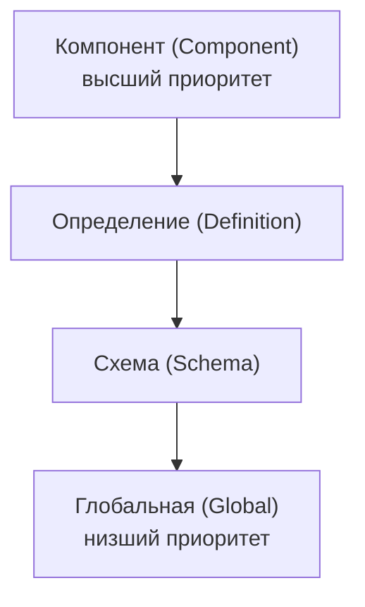

# Урок 2. Примеры JAXB

**Трейл:** JAXB · **Оригинал:** [JAXB Examples](https://docs.oracle.com/javase/tutorial/jaxb/intro/examples.html)
**Связанные области:** [[17-rest-web]] · **Вопросы:** rest-web

> Перевод официального руководства Oracle (The Java Tutorials, JDK 8).
>
> Руководство The Java Tutorials написано для JDK 8. Примеры и практики, описанные на этой
> странице, не используют улучшений, появившихся в более поздних выпусках, и могут опираться на
> технологии, которые больше недоступны.

## Примеры JAXB

В следующих разделах описано, как пользоваться примерами приложений, входящими в комплект
JAXB RI (эталонной реализации — *Reference Implementation*). Комплект JAXB RI доступен по адресу
[http://jaxb.java.net](http://jaxb.java.net). Загрузите и установите комплект JAXB RI. Примеры
располагаются в каталоге *jaxb-ri-install*/samples/. Эти примеры демонстрируют и развивают
ключевые возможности и понятия JAXB. Выполняйте эти процедуры в указанном порядке.

После прочтения этого раздела вы должны чувствовать себя достаточно уверенно в JAXB, чтобы уметь:

- Генерировать Java-классы JAXB из XML-схемы (*XML schema*).
- Использовать сгенерированные из схемы классы JAXB для демаршалинга (*unmarshal*) и маршалинга
  (*marshal*) XML-содержимого в Java-приложении.
- Создавать дерево содержимого Java (*Java content tree*) с помощью сгенерированных из схемы
  классов JAXB.
- Проверять (валидировать) XML-содержимое во время демаршалинга и во время выполнения.
- Настраивать (*customize*) привязки JAXB «схема — Java».

В этом документе описаны три набора примеров:

- **Базовые примеры** (Modify Marshal, Unmarshal Validate) демонстрируют основные понятия JAXB,
  такие как демаршалинг, маршалинг и проверка XML-содержимого с использованием настроек и привязок
  по умолчанию.
- **Примеры настройки** (Customize Inline, Datatype Converter, External Customize) демонстрируют
  различные способы настройки привязки XML-схем к объектам Java по умолчанию.
- **Примеры Java-в-схему** (*java-to-schema*) показывают, как с помощью аннотаций отобразить
  Java-классы на XML-схему.

> **Примечание.** Базовые примеры и примеры настройки основаны на сценарии заказа на покупку
> (*Purchase Order*). В каждом из них используется XML-документ po.xml, написанный по XML-схеме
> po.xsd. Эти документы заимствованы из [W3C XML Schema Part 0: Primer](http://www.w3.org/TR/xmlschema-0/)
> под редакцией Дэвида Ч. Фоллсайда (David C. Fallside).

Каталоги базовых примеров и примеров настройки содержат несколько базовых файлов:

- **po.xsd** — XML-схема, которая подаётся на вход компилятору привязок JAXB и из которой будут
  сгенерированы Java-классы JAXB. Для примеров Customize Inline и Datatype Converter этот файл
  содержит встроенные (*inline*) настройки привязки.
- **po.xml** — XML-файл заказа на покупку с образцом XML-содержимого; именно этот файл в каждом
  примере демаршалится в дерево содержимого Java. Файл почти одинаков во всех примерах; есть
  небольшие различия в содержимом, чтобы подчеркнуть разные понятия JAXB.
- **Main.java** — главный Java-класс каждого примера.
- **build.xml** — файл проекта Ant, предоставленный для удобства. Используйте инструмент Ant,
  чтобы автоматически сгенерировать, скомпилировать и запустить классы JAXB, полученные из схемы.
  Файл build.xml различается у разных примеров.
- **MyDatatypeConverter.java** в примере inline-customize — Java-класс, используемый для
  предоставления пользовательских преобразований типов данных.
- **binding.xjb** в примере External Customize — внешний файл объявлений привязки (*external binding
  declarations file*), который передаётся компилятору привязок JAXB для настройки привязок JAXB по
  умолчанию.

В следующих таблицах кратко описаны базовые примеры, примеры настройки и примеры Java-в-схему.

### Базовые примеры JAXB

| Имя примера | Описание |
|---|---|
| [Modify Marshal](https://docs.oracle.com/javase/tutorial/jaxb/intro/basic.html#bnbaz) | Демонстрирует, как изменить дерево содержимого Java. |
| [Unmarshal Validate](https://docs.oracle.com/javase/tutorial/jaxb/intro/basic.html#bnbbc) | Демонстрирует, как включить проверку во время демаршалинга. |

### Примеры настройки JAXB

| Имя примера | Описание |
|---|---|
| [Customize Inline](https://docs.oracle.com/javase/tutorial/jaxb/intro/custom.html#bnbbz) | Демонстрирует, как настроить привязки JAXB по умолчанию с помощью встроенных аннотаций в XML-схеме. |
| [Datatype Converter](https://docs.oracle.com/javase/tutorial/jaxb/intro/custom.html#bnbci) | Иллюстрирует альтернативные, более краткие привязки определений XML simpleType к типам данных Java; похож на пример Customize Inline. |
| [External Customize](https://docs.oracle.com/javase/tutorial/jaxb/intro/custom.html#bnbcs) | Иллюстрирует, как использовать внешний файл объявлений привязки, чтобы передать настройки привязки для схемы, доступной только для чтения, компилятору привязок JAXB. |

### Примеры Java-в-схему JAXB

| Имя примера | Описание |
|---|---|
| [Create Marshal](https://docs.oracle.com/javase/tutorial/jaxb/intro/j2schema.html#bnbcw) | Демонстрирует, как с помощью класса ObjectFactory создать дерево содержимого Java и сериализовать (marshal) его в XML-данные. Также показывает, как добавить содержимое в JAXB-свойство типа List. |
| [XmlAccessorOrder](https://docs.oracle.com/javase/tutorial/jaxb/intro/j2schema.html#bnbcz) | Иллюстрирует, как использовать аннотации отображения @XmlAccessorOrder и @XmlType.propOrder в Java-классах, чтобы управлять порядком, в котором XML-содержимое маршалится или демаршалится Java-типом. |
| [XmlAdapter](https://docs.oracle.com/javase/tutorial/jaxb/intro/j2schema.html#bnbdf) | Иллюстрирует, как использовать интерфейс XmlAdapter и аннотацию @XmlJavaTypeAdapter для пользовательского отображения XML-содержимого в HashMap (поле) и обратно, где ключом служит целое число (int), а значением — строка (String). |
| [XmlAttribute](https://docs.oracle.com/javase/tutorial/jaxb/intro/j2schema.html#bnbdi) | Иллюстрирует, как использовать аннотацию @XmlAttribute, чтобы свойство или поле обрабатывалось как XML-атрибут. |
| [XmlRootElement](https://docs.oracle.com/javase/tutorial/jaxb/intro/j2schema.html#bnbdl) | Иллюстрирует, как использовать аннотацию @XmlRootElement, чтобы задать имя XML-элемента для XML-схемного типа соответствующего класса. |
| [XmlSchemaType Class](https://docs.oracle.com/javase/tutorial/jaxb/intro/j2schema.html#bnbdo) | Иллюстрирует, как использовать аннотацию @XmlSchemaType, чтобы настроить отображение свойства или поля на встроенный тип XML. |
| [XmlType](https://docs.oracle.com/javase/tutorial/jaxb/intro/j2schema.html#bnbdr) | Иллюстрирует, как использовать аннотацию @XmlType, чтобы отобразить класс или enum-тип на тип XML-схемы. |

## Параметры компилятора JAXB

Компилятор связывания схем XJC (*XJC schema binding compiler*) преобразует, или **связывает**
(*binds*), исходную XML-схему в набор классов содержимого JAXB на языке Java. Класс компилятора
xjc предоставляется в виде: xjc.sh на Solaris/Linux и xjc.bat на Windows в комплекте JAXB RI.
Класс xjc включён в библиотеку классов JDK (в tools.jar).

Оба сценария — xjc.sh и xjc.bat — принимают одни и те же параметры командной строки. Краткую
инструкцию по применению можно вывести, вызвав сценарий без параметров или с ключом `-help`.
Синтаксис следующий:

```
xjc [-options ...] <schema file/URL/dir/jar>... [-b >bindinfo<] ...
```

Если указан каталог (*dir*), будут скомпилированы все файлы схем в этом каталоге. Если указан
jar-файл, будет скомпилирован файл привязки /META-INF/sun-jaxb.episode.

Параметры командной строки xjc следующие:

**-nv** — не выполнять строгую проверку входной схемы или схем. По умолчанию xjc выполняет строгую
проверку исходной схемы перед обработкой. Учтите, что это не означает, что компилятор привязок не
будет выполнять никакой проверки; он просто выполнит менее строгую проверку.

**-extension** — по умолчанию компилятор привязок XJC строго соблюдает правила, изложенные в главе
о совместимости (*Compatibility*) спецификации JAXB. В режиме по умолчанию (строгом) вы также
ограничены использованием только тех настроек привязки, которые определены в спецификации. С
помощью ключа `-extension` вам разрешается использовать расширения поставщика JAXB (*JAXB Vendor
Extensions*).

**-b *file*** — указать один или несколько внешних файлов привязки для обработки. (Каждый файл
привязки должен иметь собственный ключ `-b`.) Синтаксис внешних файлов привязки гибок. У вас может
быть один файл привязки, содержащий настройки для нескольких схем, либо вы можете разбить настройки
на несколько файлов привязки. Кроме того, порядок следования файлов схем и файлов привязки в
командной строке значения не имеет.

**-d *dir*** — по умолчанию компилятор привязок XJC генерирует классы содержимого Java в текущем
каталоге. Используйте этот параметр, чтобы указать другой выходной каталог. Каталог должен уже
существовать; компилятор привязок XJC не создаёт его за вас.

**-p *package*** — указать другой выходной каталог. По умолчанию компилятор привязок XJC генерирует
классы содержимого Java в текущем каталоге. Выходной каталог должен уже существовать; компилятор
привязок XJC не создаёт его за вас.

**-httpproxy *proxy*** — указать HTTP/HTTPS-прокси. Формат: \[*user*\[:*password*\]@\]*proxyHost*\[:*proxyPort*\].
Старые параметры `-host` и `-port` всё ещё поддерживаются эталонной реализацией для обратной
совместимости, но объявлены устаревшими.

**-httpproxyfile *f*** — работает как параметр `-httpproxy`, но принимает аргумент из файла, чтобы
защитить пароль.

**-classpath *arg*** — указать, где искать файлы классов клиентского приложения, используемые
настройками <jxb:javaType> и <xjc:superClass>.

**-catalog *file*** — указать файлы каталога для разрешения внешних ссылок на сущности. Поддерживает
форматы TR9401, XCatalog и OASIS XML Catalog. Подробнее см. документ XML Entity and URI Resolvers
или изучите пример приложения catalog-resolver.

**-readOnly** — заставить компилятор привязок XJC помечать сгенерированные Java-исходники как
доступные только для чтения. По умолчанию компилятор привязок XJC не защищает от записи генерируемые
им Java-исходники.

**-npa** — подавить генерацию аннотаций уровня пакета в \*\*/package-info.java. Использование этого
ключа приводит к тому, что генерируемый код переносит эти аннотации внутрь других сгенерированных
классов.

**-no-header** — подавить генерацию заголовка файла с временной меткой.

**-target (2.0|2.1)** — вести себя как XJC 2.0 или 2.1 и генерировать код, который не использует
никаких возможностей XJC 2.2.

**-enableIntrospection** — включить корректную генерацию геттеров/сеттеров типа Boolean, чтобы
задействовать API интроспекции бинов (*Bean Introspection*).

**-contentForWildcard** — генерирует свойство содержимого (*content property*) для типов с
несколькими элементами, производными от xs:any.

**-xmlschema** — трактовать входные схемы как W3C XML Schema (по умолчанию). Если этот ключ не
указан, ваши входные схемы трактуются как W3C XML Schema.

**-verbose** — выводить дополнительно подробную информацию компилятора.

**-quiet** — подавить вывод компилятора, например сведения о ходе работы и предупреждения.

**-help** — отобразить краткую сводку по ключам компилятора.

**-version** — отобразить информацию о версии компилятора.

**-fullversion** — отобразить полную информацию о версии компилятора.

**-Xinject-code** — внедрить указанные фрагменты Java-кода в сгенерированный код.

**-Xlocator** — включить поддержку расположения в исходнике (*source location*) для сгенерированного
кода.

**-Xsync-methods** — генерировать методы доступа с ключевым словом synchronized.

**-mark-generated** — помечать сгенерированный код аннотацией `-@javax.annotation.Generated`.

**-episode *FILE*** — сгенерировать episode-файл для раздельной компиляции.

## Параметр генератора схем JAXB

Генератор схем JAXB, schemagen, создаёт файл схемы для каждого пространства имён (*namespace*),
на которое ссылаются ваши Java-классы. Генератор схем можно запустить с помощью соответствующего
shell-сценария schemagen в каталоге bin для вашей платформы. Генератор схем обрабатывает только
исходные файлы Java. Если ваши Java-исходники ссылаются на другие классы, эти исходники должны быть
доступны через системную переменную окружения CLASSPATH; в противном случае при генерации схемы
возникнут ошибки. Управлять именем сгенерированных файлов схем нельзя.

Краткую инструкцию по применению можно вывести, вызвав сценарии без параметров или с параметром
`-help`. Синтаксис следующий:

```
schemagen [-d path] 
    [java-source-files]
```

Параметр `-d *path*` указывает местоположение файлов классов, сгенерированных процессором и
javac.

## О привязках «схема — Java»

Когда вы запускаете компилятор привязок JAXB против XML-схемы po.xsd, используемой в базовых
примерах (Unmarshal Read, Modify Marshal, Unmarshal Validate), компилятор привязок JAXB генерирует
Java-пакет с именем primer.po, содержащий классы, описанные в следующей таблице.

### Классы JAXB, полученные из схемы, в базовых примерах

| Класс | Описание |
|---|---|
| primer/po/Items.java | Открытый интерфейс, привязанный к схемному complexType с именем Items. |
| primer/po/ObjectFactory.java | Открытый класс, расширяющий com.sun.xml.bind.DefaultJAXBContextImpl; используется для создания экземпляров указанных интерфейсов. Например, метод createComment() класса ObjectFactory создаёт экземпляр объекта Comment. |
| primer/po/PurchaseOrderType.java | Открытый интерфейс, привязанный к схемному complexType с именем PurchaseOrderType. |
| primer/po/USAddress.java | Открытый интерфейс, привязанный к схемному complexType с именем USAddress. |

Эти классы и их конкретные привязки к исходной XML-схеме для базовых примеров описаны в следующей
таблице.

### Привязки «схема — Java» для базовых примеров

**XML-схема:**

```xml
<xsd:schema xmlns:xsd="http://www.w3.org/2001/XMLSchema">
  <xsd:complexType name="PurchaseOrderType">
    <xsd:sequence>
      <xsd:element name="shipTo" type="USAddress"/>
      <xsd:element name="billTo" type="USAddress"/>
      <xsd:element ref="comment" minOccurs="0"/>
      <xsd:element name="items" type="Items"/>
    </xsd:sequence>
    <xsd:attribute name="orderDate" type="xsd:date"/>
  </xsd:complexType>

  <xsd:complexType name="USAddress">
    <xsd:sequence>
      <xsd:element name="name" type="xsd:string"/>
      <xsd:element name="street" type="xsd:string"/>
      <xsd:element name="city" type="xsd:string"/>
      <xsd:element name="state" type="xsd:string"/>
      <xsd:element name="zip" type="xsd:decimal"/>
    </xsd:sequence>
    <xsd:attribute name="country" type="xsd:NMTOKEN" fixed="US"/>
  </xsd:complexType>

  <xsd:complexType name="Items">
    <xsd:sequence>
      <xsd:element name="item" minOccurs="1" maxOccurs="unbounded">
        <xsd:complexType>
          <xsd:sequence>
            <xsd:element name="productName" type="xsd:string"/>
            <xsd:element name="quantity">
              <xsd:simpleType>
                <xsd:restriction base="xsd:positiveInteger">
                  <xsd:maxExclusive value="100"/>
                </xsd:restriction>
              </xsd:simpleType>
            </xsd:element>
            <xsd:element name="USPrice" type="xsd:decimal"/>
            <xsd:element ref="comment" minOccurs="0"/>
            <xsd:element name="shipDate" type="xsd:date" minOccurs="0"/>
          </xsd:sequence>
          <xsd:attribute name="partNum" type="SKU" use="required"/>
        </xsd:complexType>
      </xsd:element>
    </xsd:sequence>
  </xsd:complexType>

  <!-- Stock Keeping Unit — код для идентификации продуктов -->
  <xsd:simpleType name="SKU">
    <xsd:restriction base="xsd:string">
      <xsd:pattern value="\d{3}-[A-Z]{2}"/>
    </xsd:restriction>
  </xsd:simpleType>
</xsd:schema>
```

**Соответствие привязок JAXB:**

| XML-схема | Привязка JAXB |
|---|---|
| complexType `PurchaseOrderType` | PurchaseOrderType.java |
| complexType `USAddress` | USAddress.java |
| complexType `Items` | Items.java, Items.ItemType |

## Классы JAXB, полученные из схемы

В следующих разделах кратко объяснены функции отдельных классов, сгенерированных компилятором
привязок JAXB для этих примеров:

- Класс Items
- Класс ObjectFactory
- Класс PurchaseOrderType
- Класс USAddress

### Класс Items

В Items.java:

- Класс Items входит в пакет primer.po.
- Класс предоставляет открытые интерфейсы для Items и ItemType.
- Содержимое экземпляров этого класса привязано к XML-комплексным типам (*ComplexTypes*) Items и
  его дочернему элементу ItemType.
- Item предоставляет метод getItem().
- ItemType предоставляет методы:
  - getPartNum();
  - setPartNum(String value);
  - getComment();
  - setComment(java.lang.String value);
  - getUSPrice();
  - setUSPrice(java.math.BigDecimal value);
  - getProductName();
  - setProductName(String value);
  - getShipDate();
  - setShipDate(java.util.Calendar value);
  - getQuantity();
  - setQuantity(java.math.BigInteger value);

### Класс ObjectFactory

В ObjectFactory.java:

- Класс ObjectFactory входит в пакет primer.po.
- ObjectFactory предоставляет фабричные методы для создания экземпляров Java-интерфейсов,
  представляющих XML-содержимое в дереве содержимого Java.
- Имена методов генерируются путём конкатенации:
  - строковой константы create;
  - всех имён внешних Java-классов, если Java-интерфейс содержимого вложен в другой интерфейс;
  - имени Java-интерфейса содержимого.

Например, в данном случае для Java-интерфейса primer.po.Items.ItemType ObjectFactory создаёт метод
createItemsItemType().

### Класс PurchaseOrderType

В PurchaseOrderType.java:

- Класс PurchaseOrderType входит в пакет primer.po.
- Содержимое экземпляров этого класса привязано к дочернему элементу XML-схемы с именем
  PurchaseOrderType.
- PurchaseOrderType — открытый интерфейс, предоставляющий следующие методы:
  - getItems();
  - setItems(primer.po.Items value);
  - getOrderDate();
  - setOrderDate(java.util.Calendar value);
  - getComment();
  - setComment(java.lang.String value);
  - getBillTo();
  - setBillTo(primer.po.USAddress value);
  - getShipTo();
  - setShipTo(primer.po.USAddress value);

### Класс USAddress

В USAddress.java:

- Класс USAddress входит в пакет primer.po.
- Содержимое экземпляров этого класса привязано к элементу XML-схемы с именем USAddress.
- USAddress — открытый интерфейс, предоставляющий следующие методы:
  - getState();
  - setState(String value);
  - getZip();
  - setZip(java.math.BigDecimal value);
  - getCountry();
  - setCountry(String value);
  - getCity();
  - setCity(String value);
  - getStreet();
  - setStreet(String value);
  - getName();
  - setName(String value);

## Базовые примеры

В этом разделе описаны базовые примеры JAXB (Modify Marshal, Unmarshal Validate), которые
демонстрируют, как:

- Демаршалить XML-документ в дерево содержимого Java и обращаться к содержащимся в нём данным.
- Изменять дерево содержимого Java.
- Использовать класс ObjectFactory, чтобы создать дерево содержимого Java, а затем маршалить его в
  XML-данные.
- Выполнять проверку во время демаршалинга.
- Проверять дерево содержимого Java во время выполнения.

### Пример Modify Marshal

Пример Modify Marshal демонстрирует, как изменить дерево содержимого Java.

1. Класс *jaxb-ri-install*/samples/modify-marshal/src/Main.java объявляет импорт трёх стандартных
   Java-классов, пяти классов фреймворка привязки JAXB и пакета primer.po:

   ```java
   import java.io.FileInputStream;
   import java.io.IOException;
   import java.math.BigDecimal;

   import javax.xml.bind.JAXBContext;
   import javax.xml.bind.JAXBElement;
   import javax.xml.bind.JAXBException;
   import javax.xml.bind.Marshaller;
   import javax.xml.bind.Unmarshaller;

   import primer.po.*;
   ```

2. Создаётся экземпляр JAXBContext для обработки классов, сгенерированных в primer.po.

   ```java
   JAXBContext jc = JAXBContext.newInstance( "primer.po" );
   ```

3. Создаётся экземпляр Unmarshaller, и файл po.xml демаршалится.

   ```java
   Unmarshaller u = jc.createUnmarshaller();
   PurchaseOrder po = (PurchaseOrder)
       u.unmarshal(new FileInputStream("po.xml"));
   ```

4. Методы set используются для изменения информации в ветви адреса дерева содержимого.

   ```java
   USAddress address = po.getBillTo();
   address.setName("John Bob");
   address.setStreet("242 Main Street");
   address.setCity("Beverly Hills");
   address.setState("CA");
   address.setZip(new BigDecimal("90210"));
   address.setName("John Bob");
   address.setStreet("242 Main Street");
   address.setCity("Beverly Hills");
   address.setState("CA");
   address.setZip(new BigDecimal("90210"));
   ```

5. Создаётся экземпляр Marshaller, и обновлённое XML-содержимое маршалится в System.out. API
   setProperty используется для указания кодировки вывода; в данном случае это форматированный
   (удобочитаемый человеком) XML.

   ```java
   Marshaller m = jc.createMarshaller();
   m.setProperty(Marshaller.JAXB_FORMATTED_OUTPUT, Boolean.TRUE);
   m.marshal(po, System.out);
   ```

#### Сборка и запуск примера Modify Marshal с помощью Ant

Чтобы скомпилировать и запустить пример Modify Marshal с помощью Ant, в окне терминала перейдите в
каталог *jaxb-ri-install*/samples/modify-marshal/ и введите следующее:

```
ant
```

### Пример Unmarshal Validate

Пример Unmarshal Validate демонстрирует, как включить проверку во время демаршалинга. Обратите
внимание, что JAXB предоставляет функции проверки во время демаршалинга, но не во время маршалинга.
Проверка подробнее объясняется в разделе More About Validation.

1. Класс *jaxb-ri-install*/samples/unmarshal-validate/src/Main.java объявляет импорт одного
   стандартного Java-класса, одиннадцати классов фреймворка привязки JAXB и пакета primer.po:

   ```java
   import java.io.File;

   import javax.xml.bind.JAXBContext;
   import javax.xml.bind.JAXBException;
   import javax.xml.bind.Marshaller;
   import javax.xml.bind.UnmarshalException;
   import javax.xml.bind.Unmarshaller;
   import javax.xml.bind.ValidationEvent;
   import javax.xml.bind.ValidationEventHandler;
   import javax.xml.bind.ValidationEventLocator;

   import static javax.xml.XMLConstants.W3C_XML_SCHEMA_NS_URI;
   import javax.xml.validation.SchemaFactory;
   import javax.xml.validation.Schema;

   import primer.po.*;
   ```

2. Создаётся экземпляр JAXBContext для обработки классов, сгенерированных в пакете primer.po.

   ```java
   JAXBContext jc = JAXBContext.newInstance("primer.po");
   ```

3. Создаётся экземпляр Unmarshaller.

   ```java
   Unmarshaller u = jc.createUnmarshaller();
   ```

4. Включается стандартный обработчик событий проверки ValidationEventHandler демаршаллера JAXB,
   чтобы отправлять предупреждения и ошибки проверки в System.out. Конфигурация по умолчанию
   приводит к тому, что операция демаршалинга завершается с ошибкой при обнаружении первой же
   ошибки проверки.

   ```java
   u.setValidating( true );
   ```

5. Предпринимается попытка демаршалить файл po.xml в дерево содержимого Java. Для целей этого
   примера файл po.xml содержит намеренную ошибку.

   ```java
   PurchaseOrder po = (PurchaseOrder)u.unmarshal(
       new FileInputStream("po.xml"));
   ```

6. Стандартный обработчик событий проверки обрабатывает ошибку проверки, генерирует вывод в
   System.out, после чего выбрасывается исключение.

   ```java
   } catch( UnmarshalException ue ) {
       System.out.println("Caught UnmarshalException");
   } catch( JAXBException je ) { 
       je.printStackTrace();
   } catch( IOException ioe ) {
       ioe.printStackTrace();
   }
   ```

#### Сборка и запуск примера Unmarshal Validate с помощью Ant

Чтобы скомпилировать и запустить пример Unmarshal Validate с помощью Ant, в окне терминала
перейдите в каталог *jaxb-ri-install*/samples/unmarshal-validate/ и введите следующее:

```
ant
```

## Настройка привязок JAXB

В следующем разделе описано несколько примеров, развивающих понятия, продемонстрированные в
базовых примерах.

Цель этого раздела — проиллюстрировать, как настраивать привязки JAXB с помощью пользовательских
объявлений привязки (*binding declarations*), сделанных одним из двух способов:

- В виде аннотаций, встроенных в XML-схему.
- В виде инструкций во внешнем файле, передаваемом компилятору привязок JAXB.

В отличие от примеров в разделе «Базовые примеры», которые сосредоточены на Java-коде в
соответствующих файлах Main.java, примеры здесь сосредоточены на настройках, вносимых в XML-схему
**до** генерации Java-классов привязки, получаемых из схемы.

> **Примечание.** Настройки привязки JAXB в настоящее время приходится делать вручную. Одна из
> целей технологии JAXB — стандартизировать формат объявлений привязки, что сделает возможным
> создание инструментов настройки и обеспечит стандартный формат обмена между реализациями JAXB.

В этом разделе вводятся настройки, которые можно вносить в привязки JAXB и методы проверки.
Подробнее см. [JAXB Specification](http://jaxb.java.net).

### Зачем настраивать?

В большинстве случаев привязок по умолчанию, генерируемых компилятором привязок JAXB, достаточно.
Однако бывают случаи, когда может потребоваться изменить привязки по умолчанию. К ним относятся:

- **Создание документации API** для пакетов, классов, методов и констант JAXB, полученных из схемы:
  добавляя в схемы пользовательские аннотации инструмента Javadoc, вы можете пояснять концепции,
  рекомендации и правила, специфичные для вашей реализации.
- **Предоставление семантически осмысленных пользовательских имён** для случаев, которые
  отображение «XML-имя — Java-идентификатор» по умолчанию не может обработать автоматически;
  например:
  - Разрешение коллизий имён (как описано в приложении D.2.1 спецификации JAXB). Заметьте, что
    компилятор привязок JAXB обнаруживает и сообщает обо всех конфликтах имён.
  - Предоставление имён для типобезопасных перечислимых констант (*typesafe enumeration constants*),
    которые не являются допустимыми Java-идентификаторами; например, перечисление по целочисленным
    значениям.
  - Предоставление более удачных имён для Java-представления неименованных модельных групп
    (*unnamed model groups*), когда они привязываются к Java-свойству или классу.
  - Предоставление более осмысленных имён пакетов, чем те, что можно вывести по умолчанию из URI
    целевого пространства имён.
- **Переопределение привязок по умолчанию**; например:
  - Указать, что модельная группа должна быть привязана к классу, а не к списку (*list*).
  - Указать, что фиксированный атрибут может быть привязан к Java-константе.
  - Переопределить заданную по умолчанию привязку встроенных типов данных XML Schema к типам данных
    Java. В некоторых случаях может потребоваться ввести альтернативный Java-класс, способный
    представить дополнительные характеристики встроенного типа данных XML Schema.

### Обзор настройки

В этом разделе объясняются некоторые ключевые концепции настройки JAXB:

- Встроенные и внешние настройки.
- Область действия (*scope*), наследование и старшинство.
- Синтаксис настройки.
- Префикс пространства имён настройки.

### Встроенные и внешние настройки

Настройки привязок JAXB по умолчанию вносятся в форме **объявлений привязки** (*binding
declarations*), передаваемых компилятору привязок JAXB. Эти объявления привязки можно делать одним
из двух способов:

- В виде встроенных (*inline*) аннотаций в исходной XML-схеме.
- В виде объявлений во внешнем файле настроек привязки.

Для кого-то использование встроенных настроек проще, потому что вы видите свои настройки в контексте
схемы, к которой они применяются. И наоборот, использование внешнего файла настроек привязки
позволяет настраивать привязки JAXB без изменения исходной схемы и легко применять настройки к
нескольким файлам схем сразу.

> **Примечание.** Эти два типа настроек можно комбинировать. Например, во встроенной аннотации можно
> включить ссылку на внешний файл настроек привязки. Однако нельзя объявить и встроенную, и внешнюю
> настройку на одном и том же элементе схемы.

Каждый из этих типов настройки описан подробнее в следующих разделах.

#### Встроенные настройки

Настройки привязок JAXB, выполненные с помощью встроенных **объявлений привязки** в файле
XML-схемы, принимают форму элементов <xsd:appinfo>, вложенных в схемные элементы <xsd:annotation>
(xsd: — префикс пространства имён XML-схемы, как определено в W3C *XML Schema Part 1: Structures*).
Общая форма встроенных настроек показана в следующем примере:

```xml
<xs:annotation>
    <xs:appinfo>
        <!--
        ...
        объявления привязки     .
        ...
        -->
    </xs:appinfo>
</xs:annotation>
```

Настройки применяются в том месте, где они объявлены в схеме. Например, объявление на уровне
конкретного элемента применяется только к этому элементу. Заметьте, что префикс пространства имён
XML-схемы должен использоваться с тегами объявлений <annotation> и <appinfo>. В предыдущем примере в
качестве префикса пространства имён используется xs:, поэтому объявления помечены тегами
<xs:annotation> и <xs:appinfo>.

#### Внешние файлы настройки привязки

Настройки привязок JAXB, выполненные с помощью внешнего файла, содержащего объявления привязки,
принимают общую форму, показанную в следующем примере:

```xml
<jxb:bindings schemaLocation = "xs:anyURI">
    <jxb:bindings node = "xs:string">*
        <!-- объявление привязки -->
    <jxb:bindings>
</jxb:bindings>
```

- schemaLocation — URI-ссылка на удалённую схему.
- node — выражение XPath 1.0, идентифицирующее узел схемы внутри schemaLocation, с которым связано
  данное объявление привязки.

Например, первое объявление schemaLocation/node в файле объявлений привязки JAXB указывает имя
схемы и корневой узел схемы:

```xml
<jxb:bindings schemaLocation="po.xsd" node="/xs:schema">
</jxb:bindings>
```

Последующее объявление schemaLocation/node, например для элемента simpleType с именем ZipCodeType в
предыдущем примере схемы, принимает следующую форму:

```xml
<jxb:bindings node="//xs:simpleType [@name='ZipCodeType']">
```

#### Формат файла настроек привязки

Файлы настроек привязки должны быть текстовыми в ASCII. Имя или расширение значения не имеют; хотя
типичное расширение, используемое в этой главе, — .xjb.

#### Передача файлов настройки компилятору привязок JAXB

Файлы настройки, содержащие объявления привязки, передаются компилятору привязок JAXB, xjc, со
следующим синтаксисом:

```
xjc -b file schema
```

где *file* — имя файла настроек привязки, а *schema* — имя схем, которые вы хотите передать
компилятору привязок.

У вас может быть один файл привязки, содержащий настройки для нескольких схем, либо вы можете
разделить настройки на несколько файлов привязки; например:

```
xjc schema1.xsd schema2.xsd schema3.xsd \
    -b bindings123.xjb
xjc schema1.xsd schema2.xsd schema3.xsd \
    -b bindings1.xjb \
    -b bindings2.xjb \
    -b bindings3.xjb
```

Заметьте, что порядок следования файлов схем и файлов привязки в командной строке значения не имеет;
хотя каждому файлу настроек привязки должен предшествовать собственный ключ `-b` в командной строке.

Подробнее о параметрах компилятора xjc в целом см. раздел «Параметры компилятора JAXB» выше.

#### Ограничения для внешних настроек привязки

Существует несколько правил, применимых к объявлениям привязки, сделанным во внешнем файле настроек
привязки, которые не применяются к аналогичным объявлениям, сделанным встроенно в исходной схеме:

- Файл настроек привязки должен начинаться с атрибута version элемента jxb:bindings, а также
  атрибутов пространств имён JAXB и XMLSchema:

  ```xml
  <jxb:bindings version="1.0" 
      xmlns:jxb="http://java.sun.com/xml/ns/jaxb" 
      xmlns:xs="http://www.w3.org/2001/XMLSchema">
  ```

- Удалённая схема, к которой применяется объявление привязки, должна быть явно идентифицирована в
  нотации XPath с помощью объявления jxb:bindings, задающего атрибуты schemaLocation и node:
  - schemaLocation задаёт URI-ссылку на удалённую схему.
  - node задаёт выражение XPath 1.0, идентифицирующее узел схемы внутри schemaLocation, с которым
    связано данное объявление привязки; в случае первого объявления jxb:bindings в файле настроек
    привязки этим узлом обычно является "/xs:schema".

Аналогично, отдельные узлы внутри схемы, к которым должны применяться настройки, должны указываться
с помощью нотации XPath; например:

```xml
<jxb:bindings node="//xs:complexType [@name='USAddress']">
```

В таких случаях настройка применяется к узлу компилятором привязок так, как если бы объявление было
встроено в элемент <xs:appinfo> этого узла.

Подытоживая эти правила: внешний элемент привязки <jxb:bindings> распознаётся для обработки
компилятором привязок JAXB только в трёх случаях:

- Когда его родителем является элемент <xs:appinfo>.
- Когда он является предком другого элемента <jxb:bindings>.
- Когда он является корневым элементом документа. XML-документ, у которого корневым элементом
  является <jxb:bindings>, называется файлом внешних объявлений привязки.

### Область действия, наследование и старшинство

Привязки JAXB по умолчанию можно настраивать или переопределять на четырёх разных уровнях, или
**областях действия** (*scopes*).

Следующая схема иллюстрирует наследование и старшинство объявлений настройки. А именно: объявления,
расположенные ближе к вершине пирамиды, наследуют объявления ниже них и имеют над ними приоритет.

Объявления уровня компонента (*Component*) наследуют от объявлений уровня определения (*Definition*)
и имеют над ними приоритет; объявления определения наследуют от объявлений схемы (*Schema*) и имеют
над ними приоритет; а объявления схемы наследуют от глобальных объявлений (*Global*) и имеют над
ними приоритет.

**Схема: наследование и старшинство областей действия настройки**

<!-- original: none | Авторская схема иерархии областей действия; оригинальная фигура на странице Oracle отсутствует -->


> Объявления, расположенные выше, наследуют и переопределяют объявления, расположенные ниже:
> Компонент → Определение → Схема → Глобальная.

### Синтаксис настройки

Синтаксис четырёх типов объявлений привязки JAXB, синтаксис объявлений привязки типов данных
«XML — Java» и префикс пространства имён настройки описаны в следующем разделе.

- Глобальные объявления привязки (Global Binding Declarations)
- Объявления привязки схемы (Schema Binding Declarations)
- Объявления привязки класса (Class Binding Declarations)
- Объявления привязки свойства (Property Binding Declarations)
- Объявления привязки javaType (javaType Binding Declarations)
- Объявления привязки типобезопасного перечисления (Typesafe Enumeration Binding Declarations)
- Объявления привязки javadoc (javadoc Binding Declarations)

#### Глобальные объявления привязки

Настройки глобальной области действия объявляются с помощью <globalBindings>. Синтаксис настроек
глобальной области действия следующий:

```xml
<globalBindings>
    [ collectionType = "collectionType" ]
    [ fixedAttributeAsConstantProperty = "true" | "false" | "1" | "0" ]
    [ generateIsSetMethod = "true" | "false" | "1" | "0" ]
    [ enableFailFastCheck = "true" | "false" | "1" | "0" ]
    [ choiceContentProperty = "true" | "false" | "1" | "0" ]
    [ underscoreBinding = "asWordSeparator" | "asCharInWord" ]
    [ typesafeEnumBase = "typesafeEnumBase" ]
    [ typesafeEnumMemberName = "generateName" | "generateError" ]
    [ enableJavaNamingConventions = "true" | "false" 
    | "1" | "0" ]
    [ bindingStyle = "elementBinding" | "modelGroupBinding" ]
    [ <javaType> ... </javaType> ]*
</globalBindings>
```

- collectionType может быть либо indexed, либо любым полностью квалифицированным именем класса,
  реализующего java.util.List.
- fixedAttributeAsConstantProperty может быть true, false, 1 или 0. Значение по умолчанию — false.
- generateIsSetMethod может быть true, false, 1 или 0. Значение по умолчанию — false.
- enableFailFastCheck может быть true, false, 1 или 0. Если enableFailFastCheck равно true или 1 и
  реализация JAXB поддерживает эту необязательную проверку, проверка ограничений типа выполняется
  при установке свойства. Значение по умолчанию — false. Учтите, что реализация JAXB не поддерживает
  проверку failfast.
- choiceContentProperty может быть true, false, 1 или 0. Значение по умолчанию — false.
  choiceContentProperty неприменимо, когда bindingStyle равно elementBinding. Поэтому, если
  bindingStyle указан как elementBinding, то choiceContentProperty должно приводить к недопустимой
  настройке.
- underscoreBinding может быть asWordSeparator или asCharInWord. Значение по умолчанию —
  asWordSeparator.
- typesafeEnumBase может быть списком QName, каждый из которых должен разрешаться в определение
  простого типа (*simple type*). Значение по умолчанию — xs:NCName. См. раздел «Объявления привязки
  типобезопасного перечисления» для информации о локализованном отображении определений simpleType
  на типобезопасные enum-классы Java.
- typesafeEnumMemberName может быть generateError или generateName. Значение по умолчанию —
  generateError.
- enableJavaNamingConventions может быть true, false, 1 или 0. Значение по умолчанию — true.
- bindingStyle может быть elementBinding или modelGroupBinding. Значение по умолчанию —
  elementBinding.
- <javaType> может содержать ноль или более объявлений привязки javaType. Подробнее см. раздел
  «Объявления привязки javaType».

Объявления <globalBindings> допустимы только в элементе annotation верхнеуровневого элемента
schema. В любой данной схеме или файле объявлений привязки может быть только один экземпляр
объявления <globalBindings>. Если одна исходная схема включает (*include*) или импортирует
(*import*) вторую исходную схему, объявление <globalBindings> должно быть объявлено в первой
исходной схеме.

#### Объявления привязки схемы

Настройки области действия «схема» объявляются с помощью <schemaBindings>. Синтаксис настроек
области действия «схема»:

```xml
<schemaBindings>
[ <package> package </package> ]
[ <nameXmlTransform> ... </nameXmlTransform> ]*
</schemaBindings>
    
<package 
    [ name = "packageName" ]
    [ <javadoc> ... </javadoc> ]
</package>

<nameXmlTransform>
[ <typeName 
    [ suffix="suffix" ]
    [ prefix="prefix" ] /> ]
[ <elementName 
    [ suffix="suffix" ]
    [ prefix="prefix" ] /> ]
[ <modelGroupName 
    [ suffix="suffix" ]
    [ prefix="prefix" ] /> ]
[ <anonymousTypeName 
    [ suffix="suffix" ]
    [ prefix="prefix" ] /> ]
</nameXmlTransform>
```

Как показано выше, объявления <schemaBinding> включают два подкомпонента:

- <package>...</package> задаёт имя пакета и, при желании, расположение документации API для
  классов, полученных из схемы.
- <nameXmlTransform>...</nameXmlTransform> задаёт применяемые настройки.

#### Объявления привязки класса

Объявление привязки <class> позволяет настроить привязку элемента схемы к Java-интерфейсу
содержимого или к Java-интерфейсу элемента (*Element interface*). Объявления <class> можно
использовать для настройки:

- Имени Java-интерфейса, полученного из схемы.
- Класса реализации для Java-интерфейса содержимого, полученного из схемы.

Синтаксис настроек <class>:

```xml
<class 
    [ name = "className"]
    [ implClass= "implClass" ] >
    [ <javadoc> ... </javadoc> ]
</class>
```

- name — имя производного Java-интерфейса. Оно должно быть допустимым именем Java-интерфейса и не
  должно содержать префикса пакета. Префикс пакета наследуется из текущего значения пакета.
- implClass — имя класса реализации для *className*; должно включать полное имя пакета.
- Элемент <javadoc> задаёт аннотации инструмента Javadoc для Java-интерфейса, полученного из схемы.
  Введённая здесь строка должна использовать CDATA или &lt; для экранирования встроенных HTML-тегов.

#### Объявления привязки свойства

Объявление привязки <property> позволяет настроить привязку элемента XML-схемы к его
Java-представлению в виде свойства. Область действия настройки может быть на уровне определения или
на уровне компонента в зависимости от того, где указано объявление привязки <property>.

Синтаксис настроек <property>:

```xml
<property
    [ name = "propertyName"]
    [ collectionType = "propertyCollectionType" ]
    [ fixedAttributeAsConstantProperty = "true" |
    "false" | "1" | "0" ]
    [ generateIsSetMethod = "true" | 
    "false" | "1" | "0" ]
    [ enableFailFastCheck ="true" | 
    "false" | "1" | "0" ]
    [ <baseType> ... </baseType> ]
    [ <javadoc> ... </javadoc> ]
</property>

<baseType>
    <javaType> ... </javaType>
</baseType>
```

- name определяет значение настройки propertyName; должно быть допустимым Java-идентификатором.
- collectionType определяет значение настройки propertyCollectionType — тип коллекции для свойства.
  Если указан, свойство может быть либо indexed, либо любым полностью квалифицированным именем
  класса, реализующего java.util.List.
- fixedAttributeAsConstantProperty определяет значение настройки fixedAttributeAsConstantProperty.
  Значение может быть true, false, 1 или 0.
- generateIsSetMethod определяет значение настройки generateIsSetMethod. Значение может быть true,
  false, 1 или 0.
- enableFailFastCheck определяет значение настройки enableFailFastCheck. Значение может быть true,
  false, 1 или 0. Учтите, что реализация JAXB не поддерживает проверку failfast.
- <javadoc> настраивает аннотации инструмента Javadoc для геттер-метода свойства.

#### Объявления привязки javaType

Объявление <javaType> даёт способ настроить преобразование типов данных XML в типы данных Java и
обратно. XML предоставляет больше типов данных, чем Java, поэтому объявление <javaType> позволяет
указать пользовательские привязки типов данных, когда привязка JAXB по умолчанию недостаточно
хорошо представляет вашу схему.

Целевым типом данных Java может быть встроенный тип данных Java или специфичный для приложения тип
данных Java. Если в качестве целевого используется специфичный для приложения тип данных Java, ваша
реализация также должна предоставить методы parse и print для демаршалинга и маршалинга данных.
Для этого спецификация JAXB поддерживает parseMethod и printMethod:

- parseMethod вызывается во время демаршалинга для преобразования строки из входного документа в
  значение целевого типа данных Java.
- printMethod вызывается во время маршалинга для преобразования значения целевого типа в
  лексическое представление.

Если вы предпочитаете определять собственные преобразования типов данных, JAXB определяет
статический класс DatatypeConverter, помогающий в разборе (parsing) и печати (printing) допустимых
лексических представлений встроенных типов данных XML Schema.

Синтаксис настройки <javaType>:

```xml
<javaType name= "javaType"
    [ xmlType= "xmlType" ]
    [ hasNsContext = "true" | "false" ]
    [ parseMethod= "parseMethod" ]
    [ printMethod= "printMethod" ]>
```

- name — тип данных Java, к которому должен быть привязан xmlType.
- xmlType — имя типа данных XML Schema, к которому должен быть привязан javaType; этот атрибут
  обязателен, когда родителем объявления <javaType> является <globalBindings>.
- hasNsContext позволяет указать контекст пространства имён в качестве второго параметра метода
  print или parse; может быть true, false, 1 или 0. По умолчанию этот атрибут равен false, и в
  большинстве случаев менять его нет необходимости.
- parseMethod — имя метода parse, вызываемого во время демаршалинга.
- printMethod — имя метода print, вызываемого во время маршалинга.

Объявление <javaType> можно использовать в:

- Объявлении <globalBindings>.
- Элементе annotation для определений простого типа, GlobalBindings и объявлений <baseType>.
- Объявлении <property>.

Пример того, как объявления <javaType> и интерфейс DatatypeConverterInterface реализуются в
пользовательском классе преобразователя типов данных, см. в разделе «Класс MyDatatypeConverter».

#### Объявления привязки типобезопасного перечисления

Объявления типобезопасного перечисления предоставляют локализованный способ отображения элементов
XML simpleType на типобезопасные enum-классы Java. Существует два типа объявлений типобезопасного
перечисления, которые можно делать:

- <typesafeEnumClass> позволяет отобразить целый класс simpleType на типобезопасные enum-классы.
- <typesafeEnumMember> позволяет отобразить только выбранные члены класса simpleType на
  типобезопасные enum-классы.

В обоих случаях есть два основных ограничения на этот тип настройки:

- С помощью этого объявления привязки можно настраивать только определения simpleType с фасетами
  перечисления (*enumeration facets*).
- Эта настройка применяется только к одному определению simpleType за раз. Чтобы отобразить наборы
  похожих определений simpleType на глобальном уровне, используйте атрибут typesafeEnumBase в
  объявлении <globalBindings>, как описано в разделе «Глобальные объявления привязки».

Синтаксис настройки <typesafeEnumClass>:

```xml
<typesafeEnumClass 
    [ name = "enumClassName" ]
    [ <typesafeEnumMember> ... </typesafeEnumMember> ]*
    [ <javadoc> enumClassJavadoc </javadoc> ]
</typesafeEnumClass>
```

- name должно быть допустимым Java-идентификатором и не должно иметь префикса пакета.
- В объявление <typesafeEnumClass> можно вложить ноль или более объявлений <typesafeEnumMember>.
- <javadoc> настраивает аннотации инструмента Javadoc для класса перечисления.

Синтаксис настройки <typesafeEnumMember>:

```xml
<typesafeEnumMember 
    name = "enumMemberName">
    [ value = "enumMemberValue" ]
    [ <javadoc> enumMemberJavadoc </javadoc> ]
</typesafeEnumMember>
```

- name должно быть указано всегда и должно быть допустимым Java-идентификатором.
- value должно быть значением перечисления, указанным в исходной схеме.
- <javadoc> настраивает аннотации инструмента Javadoc для перечислимой константы.

Для встроенных аннотаций объявление <typesafeEnumClass> должно быть указано в элементе annotation
элемента <simpleType>. <typesafeEnumMember> должно быть указано в элементе annotation члена
перечисления. Это позволяет настраивать член перечисления независимо от класса перечисления.

Информацию о шаблонах проектирования типобезопасных enum см. в [главе-образце книги Джошуа Блоха
«Effective Java Programming» на Oracle Technology Network](http://www.oracle.com/technetwork/java/page1-139488.html).

#### Объявления привязки javadoc

Объявление <javadoc> позволяет добавлять пользовательские аннотации инструмента Javadoc к пакетам,
классам, интерфейсам, методам и полям JAXB, полученным из схемы. Заметьте, что объявления <javadoc>
нельзя применять глобально; они допустимы только как подэлементы других настроек привязки.

Синтаксис настройки <javadoc>:

```xml
<javadoc>
    Содержимое в формате <b>Javadoc</b>.
</javadoc>
```

или

```xml
<javadoc>
    <![CDATA[Содержимое в формате <b>Javadoc</b> ]]>
</javadoc>
```

Заметьте, что строки документации в объявлениях <javadoc>, применяемых на уровне пакета, должны
содержать открывающий и закрывающий теги <body>; например:

```xml
<jxb:package 
    name="primer.myPo">
    <jxb:javadoc>
        <![CDATA[<body>
            Документация уровня пакета для сгенерированного пакета primer.myPo.
        </body>]]>
    </jxb:javadoc>
</jxb:package>
```

#### Префикс пространства имён настройки

Всем стандартным объявлениям привязки JAXB должен предшествовать префикс пространства имён,
сопоставленный с URI пространства имён JAXB [http://java.sun.com/xml/ns/jaxb](http://java.sun.com/xml/ns/jaxb).
Например, в этом образце используется jxb:. Для этого любая схема, которую вы хотите настроить с
помощью стандартных объявлений привязки JAXB, **должна** включать объявление пространства имён JAXB
и номер версии JAXB в начале файла схемы. Например, в po.xsd для примера Customize Inline объявление
пространства имён следующее:

```xml
<xsd:schema 
    xmlns:xsd= "http://www.w3.org/2001/XMLSchema"
    xmlns:jxb= "http://java.sun.com/xml/ns/jaxb"
    jxb:version="1.0">
```

Объявление привязки с префиксом пространства имён jxb принимает следующую форму:

```xml
<xsd:annotation>
    <xsd:appinfo>
    <jxb:globalBindings 
        объявления привязки />
    <jxb:schemaBindings>
        ...
        объявления привязки         .
        ...
    </jxb:schemaBindings>
    </xsd:appinfo>
</xsd:annotation>
```

Заметьте, что в этом примере объявления globalBindings и schemaBindings используются для указания,
соответственно, настроек глобальной области действия и области действия «схема». Эти области
действия настройки подробнее описаны в разделе «Область действия, наследование и старшинство».

### Пример Customize Inline

Пример Customize Inline иллюстрирует некоторые базовые настройки, сделанные с помощью встроенных
аннотаций в XML-схеме с именем po.xsd. Кроме того, в этом примере реализован пользовательский класс
преобразователя типов данных MyDatatypeConverter.java, который иллюстрирует методы print и parse в
настройке <javaType> для обработки пользовательских преобразований типов данных.

Если кратко об этом примере:

1. po.xsd — это XML-схема, содержащая встроенные настройки привязки.
2. MyDatatypeConverter.java — файл Java-класса, реализующий методы print и parse, указанные
   настройками <javaType> в po.xsd.
3. Main.java — основной файл класса в примере Customize Inline, использующий классы, полученные из
   схемы и сгенерированные компилятором JAXB.

#### Сборка и запуск примера Customize Inline с помощью Ant

Чтобы скомпилировать и запустить пример Customize Inline с помощью Ant, в окне терминала перейдите
в каталог *jaxb-ri-install*/samples/inline-customize/ и введите следующее:

```
ant 
```

Ключевые настройки в этом образце и пользовательский класс MyDatatypeConverter.java подробнее
описаны в следующем разделе.

#### Настроенная схема

Настроенная схема, используемая в примере Customize Inline, находится в файле
*jaxb-ri-install*/samples/inline-customize/po.xsd. Настройки находятся в тегах <xsd:annotation>.

#### Глобальные объявления привязки

В следующем примере кода показаны объявления globalBindings в po.xsd:

```xml
<jxb:globalBindings
    fixedAttributeAsConstantProperty="true"
    collectionType="java.util.Vector"
    typesafeEnumBase="xsd:NCName"
    choiceContentProperty="false"
    typesafeEnumMemberName="generateError"
    bindingStyle="elementBinding"
    enableFailFastCheck="false"
    generateIsSetMethod="false"
    underscoreBinding="asCharInWord"/>
```

В этом примере все значения установлены в значения по умолчанию, кроме collectionType.

- Установка fixedAttributeAsConstantProperty в true указывает, что все фиксированные атрибуты должны
  быть привязаны к Java-константам. По умолчанию фиксированные атрибуты отображаются либо на простое,
  либо на коллекционное свойство — что более уместно.
- Установка collectionType в java.util.Vector задаёт, что все списки в сгенерированных классах
  реализации внутренне представлены как векторы. Заметьте, что имя класса, указанное для
  collectionType, должно реализовывать java.util.List и быть вызываемым через newInstance.
- Если typesafeEnumBase установлен в xsd:string — это глобальный способ указать, что все определения
  простых типов, прямо или косвенно производные от xsd:string и имеющие фасеты перечисления, должны
  по умолчанию привязываться к типобезопасному enum. Если typesafeEnumBase установлен в пустую строку
  (""), ни одно определение простого типа по умолчанию не привязывается к типобезопасному
  enum-классу. Значением typesafeEnumBase может быть любое определение атомарного простого типа,
  кроме xsd:boolean и обоих двоичных типов.
- Реализация JAXB не поддерживает атрибут enableFailFastCheck.

  > **Примечание.** Использование типобезопасных enum-классов позволяет отобразить значения
  > перечисления схемы на Java-константы, что делает возможным сравнение по Java-константам, а не по
  > строковым значениям.

#### Объявления привязки схемы

В следующем коде показаны объявления привязки схемы в po.xsd:

```xml
<jxb:schemaBindings>
<jxb:package name="primer.myPo">
    <jxb:javadoc>
        <![CDATA[<body>
            Документация уровня пакета для сгенерированного пакета primer.myPo.
        </body>]]>
    </jxb:javadoc>
</jxb:package>
    <jxb:nameXmlTransform>
        <jxb:elementName suffix="Element"/>
    </jxb:nameXmlTransform>
</jxb:schemaBindings>
```

- <jxb:package name="primer.myPo"/> задаёт primer.myPo как пакет, в котором генерируются классы,
  полученные из схемы.
- <jxb:nameXmlTransform> задаёт, что у всех сгенерированных Java-интерфейсов элементов по умолчанию к
  сгенерированным именам добавляется суффикс Element. Например, когда компилятор JAXB запускается
  против этой схемы, генерируются интерфейсы элементов CommentElement и PurchaseOrderElement. Для
  сравнения, без этой настройки привязка по умолчанию генерирует Comment и PurchaseOrder. Эта
  настройка полезна, если схема использует одно и то же имя в разных пространствах символов
  (*symbol spaces*); например, в глобальных определениях элементов и типов. В таких случаях эта
  настройка позволяет разрешить коллизию одним объявлением, вместо того чтобы по отдельности
  разрешать каждую коллизию отдельным объявлением привязки.
- <jxb:javadoc> задаёт пользовательские аннотации инструмента Javadoc для пакета primer.myPo.
  Заметьте, что, в отличие от объявлений <javadoc> на уровне класса (как показано в следующем
  примере), открывающий и закрывающий теги <body> должны быть включены, когда объявление <javadoc>
  делается на уровне пакета.

#### Объявления привязки класса

В следующем коде показаны объявления привязки класса в po.xsd:

```xml
<xsd:complexType name="PurchaseOrderType">
    <xsd:annotation>
        <xsd:appinfo>
            <jxb:class name="POType">
                <jxb:javadoc>
                    A &lt;b>Purchase Order&lt;/b>
                    consists of addresses and items.
                </jxb:javadoc>
            </jxb:class>
        </xsd:appinfo>
    </xsd:annotation>
    <!-- ... -->
</xsd:complexType>
```

Аннотации инструмента Javadoc для класса POType, полученного из схемы, будут содержать описание
«A &lt;b>Purchase Order&lt;/b> consists of addresses and items.» Конструкция &lt; используется для
экранирования открывающей скобки HTML-тегов <b>.

> **Примечание.** Когда настройка <class> указана в элементе appinfo определения complexType, как
> показано в предыдущем примере, определение complexType привязывается к Java-интерфейсу содержимого.

Далее в po.xsd объявлена ещё одна настройка <javadoc> на этом уровне класса, но на этот раз
HTML-строка экранирована с помощью CDATA:

```xml
<xsd:annotation>
    <xsd:appinfo>
        <jxb:class>
            <jxb:javadoc>
                <![CDATA[
                    First line of documentation for a
                    <b>USAddress</b>.]]>
            </jxb:javadoc>
        </jxb:class>
    </xsd:appinfo>
</xsd:annotation>
```

> **Примечание.** Если вы хотите включить HTML-теги в настройку <jaxb:javadoc>, нужно заключить
> данные в секцию CDATA или экранировать все левые угловые скобки с помощью &lt;. Подробнее см.
> [XML 1.0 2nd Edition](http://www.w3.org/TR/2000/REC-xml-20001006#sec-cdata-sect).

#### Объявления привязки свойства

Здесь особый интерес представляет настройка generateIsSetMethod, которая приводит к генерации двух
дополнительных методов свойства — isSetQuantity и unsetQuantity. Эти методы позволяют клиентскому
приложению различать значения по умолчанию из схемы и значения, встречающиеся явно внутри
экземпляра документа.

Например, в po.xsd:

```xml
<xsd:complexType name="Items">
    <xsd:sequence>
        <xsd:element name="item" 
            minOccurs="1"  
            maxOccurs="unbounded">
            <xsd:complexType>
                <xsd:sequence>
                    <xsd:element 
                        name="productName" 
                        type="xsd:string"/>
                    <xsd:element 
                        name="quantity" 
                        default="10">
                        <xsd:annotation>
                            <xsd:appinfo>
                                <jxb:property 
                                    generateIsSetMethod="true"/>
                            </xsd:appinfo>
                        </xsd:annotation>
                        <!-- ... -->
                    </xsd:complexType>
            </xsd:element>
    </xsd:sequence>
</xsd:complexType>
```

@generateIsSetMethod применяется к элементу quantity, который привязан к свойству внутри интерфейса
Items.ItemType. В интерфейсе Items.ItemType генерируются методы unsetQuantity и isSetQuantity.

#### Класс MyDatatypeConverter

Класс *jaxb-ri-install*/samples/inline-customize/src/inlinecustomize/primer/MyDatatypeConverter,
показанный в следующем примере, предоставляет способ настройки преобразования типов данных XML в
типы данных Java и обратно с помощью настройки <javaType>.

```java
package primer;
import java.math.BigInteger;
import javax.xml.bind.DatatypeConverter;

public class MyDatatypeConverter {

    public static short parseIntegerToShort(String value) {
        BigInteger result = DatatypeConverter.parseInteger(value);
        return (short)(result.intValue());
    }

    public static String printShortToInteger(short value) {
        BigInteger result = BigInteger.valueOf(value);
        return DatatypeConverter.printInteger(result);
    }

    public static int parseIntegerToInt(String value) {
        BigInteger result = DatatypeConverter.parseInteger(value);
        return result.intValue();
    }

    public static String printIntToInteger(int value) {
        BigInteger result = BigInteger.valueOf(value);
        return DatatypeConverter.printInteger(result);
    }
};
```

В следующем коде показано, как на класс MyDatatypeConverter ссылаются в объявлении <javaType> в
po.xsd:

```xml
<xsd:simpleType name="ZipCodeType">
<xsd:annotation>
    <xsd:appinfo>
    <jxb:javaType name="int"
        parseMethod="primer.MyDatatypeConverter.parseIntegerToInt"
        printMethod="primer.MyDatatypeConverter.printIntToInteger" />
    </xsd:appinfo>
</xsd:annotation>
    <xsd:restriction base="xsd:integer">
    <xsd:minInclusive value="10000"/>
    <xsd:maxInclusive value="99999"/>
    </xsd:restriction>
</xsd:simpleType>
```

В этом примере объявление привязки jxb:javaType переопределяет привязку этого типа по умолчанию к
java.math.BigInteger. Для целей примера Customize Inline ограничения на ZipCodeType (а именно то,
что допустимые ZIP-коды США ограничены пятью цифрами) позволяют всем допустимым значениям поместиться
в примитивный тип данных Java int. Заметьте также, что, поскольку <jxb:javaType name="int"/>
объявлено внутри ZipCodeType, настройка применяется ко всем JAXB-свойствам, ссылающимся на это
определение simpleType, включая методы getZip и setZip.

### Пример DataType Converter

Пример DataType Converter похож на пример Customize Inline. Как и в примере Customize Inline,
настройки в примере Datatype Converter делаются с помощью встроенных объявлений привязки в XML-схеме
приложения, po.xsd.

Глобальные, схемные и пакетные настройки, а также большинство настроек класса для примеров Customize
Inline и DataType Converter идентичны. Пример Datatype Converter отличается от примера Customize
Inline в методах parseMethod и printMethod, используемых для преобразования XML-данных в тип данных
Java int.

А именно: вместо использования методов пользовательского класса MyDataTypeConverter для выполнения
этих преобразований типов данных пример Datatype Converter использует встроенные методы,
предоставляемые javax.xml.bind.DatatypeConverter:

```xml
<xsd:simpleType name="ZipCodeType">
    <xsd:annotation>
        <xsd:appinfo>
            <jxb:javaType 
                name="int"
                parseMethod="javax.xml.bind.DatatypeConverter.parseInt"
                printMethod="javax.xml.bind.DatatypeConverter.printInt"/>
        </xsd:appinfo>
    </xsd:annotation>
    <xsd:restriction base="xsd:integer">
        <xsd:minInclusive value="10000"/>
        <xsd:maxInclusive value="99999"/>
    </xsd:restriction>
</xsd:simpleType>
```

#### Сборка и запуск примера Datatype Converter с помощью Ant

Чтобы скомпилировать и запустить пример DataType Converter с помощью Ant, в окне терминала перейдите
в каталог *jaxb-ri-install*/samples/datatypeconverter/ и введите следующее:

```
ant
```

### Файлы объявлений привязки

В следующих разделах приводится информация о файлах объявлений привязки:

- Версия JAXB, пространство имён и атрибуты схемы.
- Глобальные и схемные объявления привязки.
- Объявления класса.

#### Версия JAXB, пространство имён и атрибуты схемы

Все файлы объявлений привязки JAXB должны начинаться с:

- Номера версии JAXB.
- Объявлений пространств имён.
- Имени и узла схемы.

Объявления версии, пространства имён и схемы в bindings.xjb следующие:

```xml
<jxb:bindings 
    version="1.0"
    xmlns:jxb="http://java.sun.com/xml/ns/jaxb"
    xmlns:xs="http://www.w3.org/2001/XMLSchema">
    <jxb:bindings 
        schemaLocation="po.xsd" 
        node="/xs:schema">
            <!-- ...
            объявления привязки 
            ... -->
    </jxb:bindings>
    <!-- 
    schemaLocation="po.xsd" 
    node="/xs:schema" -->
</jxb:bindings>
```

#### Номер версии JAXB

XML-файл с корневым элементом <jxb:bindings> считается внешним файлом привязки. Корневой элемент
должен задавать атрибут версии JAXB, которой должны соответствовать его объявления привязки; а именно
корневой элемент <jxb:bindings> должен содержать либо объявление <jxb:version>, либо атрибут version.
Для сравнения, при встроенных объявлениях привязки номер версии JAXB указывается как атрибут
объявления <xsd:schema>:

```xml
<xsd:schema 
    xmlns:xsd="http://www.w3.org/2001/XMLSchema"
    xmlns:jxb="http://java.sun.com/xml/ns/jaxb"
    jxb:version="1.0">
```

#### Объявления пространств имён

Как показано в разделе «Версия JAXB, пространство имён и атрибуты схемы», объявления пространств имён
во внешнем файле объявлений привязки включают и пространство имён JAXB, и пространство имён
XMLSchema. Заметьте, что префиксы, используемые в этом примере, на самом деле могут быть любыми;
важно лишь последовательно использовать в последующих объявлениях в файле те префиксы, которые вы
определили здесь.

#### Имя и узел схемы

Четвёртая строка кода в разделе «Версия JAXB, пространство имён и атрибуты схемы» задаёт имя схемы,
к которой применяется этот файл объявлений привязки, и узел схемы, на котором настройки впервые
вступят в силу. Последующие объявления привязки в этом файле могут ссылаться на конкретные узлы
внутри схемы, но это первое объявление должно охватывать схему в целом; например, в bindings.xjb:

```xml
<jxb:bindings schemaLocation="po.xsd" node="/xs:schema">
```

#### Глобальные и схемные объявления привязки

Глобальные схемные объявления привязки в bindings.xjb те же, что и в po.xsd для примера DataType
Converter. Единственное отличие в том, что, поскольку объявления в po.xsd сделаны встроенно, их нужно
вкладывать в элементы <xs:appinfo>, которые, в свою очередь, вложены в элементы <xs:annotation>.
Такое вложение объявлений во внешнем файле привязки не требуется.

```xml
<jxb:globalBindings
    fixedAttributeAsConstantProperty="true"
    collectionType="java.util.Vector"
    typesafeEnumBase="xs:NCName"
    choiceContentProperty="false"
    typesafeEnumMemberName="generateError"
    bindingStyle="elementBinding"
    enableFailFastCheck="false"
    generateIsSetMethod="false"
    underscoreBinding="asCharInWord"/>
    <jxb:schemaBindings>
        <jxb:package name="primer.myPo">
            <jxb:javadoc>
                <![CDATA[<body>
                    Документация уровня пакета для сгенерированного пакета
                    primer.myPo.</body>]]>
                </jxb:javadoc>
        </jxb:package>
        <jxb:nameXmlTransform>
            <jxb:elementName suffix="Element"/>
        </jxb:nameXmlTransform>
    </jxb:schemaBindings>
```

Для сравнения, синтаксис, используемый в po.xsd для примера DataType Converter, таков:

```xml
<xsd:annotation>
    <xsd:appinfo>
        <jxb:globalBindings
            ...
            объявления привязки
            ...
        <jxb:schemaBindings>
            ...
            объявления привязки
            ...
        </jxb:schemaBindings>
    </xsd:appinfo>
</xsd:annotation>
```

#### Объявления класса

Объявления привязки уровня класса в bindings.xjb отличаются от аналогичных объявлений в po.xsd для
примера Datatype Converter двумя моментами:

- Как и со всеми остальными объявлениями привязки в bindings.xjb, вам не нужно вкладывать свои
  настройки в схемные элементы <xsd:appinfo>.
- Вы должны указать узел схемы, к которому применяется настройка. Общий синтаксис этого типа
  объявления:

  ```xml
  <jxb:bindings node="//node-type[@name='node-name']">
  ```

Например, следующий код показывает объявления привязки для complexType с именем USAddress.

```xml
<jxb:bindings node="//xs:complexType [@name='USAddress']">
    <jxb:class>
        <jxb:javadoc>
            <![CDATA[
                First line of documentation for a <b>USAddress</b>.
            ]]>
        </jxb:javadoc>
    </jxb:class>

<jxb:bindings node=".//xs:element [@name='name']">
    <jxb:property name="toName"/>
</jxb:bindings>

<jxb:bindings node=".//xs:element [@name='zip']">
    <jxb:property name="zipCode"/>
</jxb:bindings>
</jxb:bindings>
<!-- 
    node="//xs:complexType
    [@name='USAddress']" -->
```

Заметьте в этом примере, что USAddress является родителем дочерних элементов name и zip, и поэтому
тег </jxb:bindings> заключает объявления привязки для дочерних элементов и объявление javadoc уровня
класса.

### Пример External Customize

Пример External Customize идентичен примеру DataType Converter, за исключением того, что объявления
привязки в примере External Customize делаются с помощью внешнего файла объявлений привязки, а не
встроенно в исходной XML-схеме.

Файл настройки привязки, используемый в примере External Customize, —
*jaxb-ri-install*/samples/external-customize/binding.xjb.

В этом разделе сравниваются объявления настройки в bindings.xjb с аналогичными объявлениями,
используемыми в XML-схеме po.xsd в примере DataType Converter. Оба набора объявлений достигают в
точности одинаковых результатов.

#### Сборка и запуск примера External Customize с помощью Ant

Чтобы скомпилировать и запустить пример External Customize с помощью Ant, в окне терминала перейдите
в каталог *jaxb-ri-install*/samples/external-customize/ и введите следующее:

```
ant
```

## Примеры Java-в-схему

Примеры Java-в-схему показывают, как с помощью аннотаций отобразить Java-классы на XML-схему.

### Пример j2s-create-marshal

Пример j2s-create-marshal иллюстрирует связывание данных «Java — схема». Он демонстрирует маршалинг
и демаршалинг аннотированных JAXB-классов, а также показывает, как включить проверку JAXP 1.3 во
время демаршалинга, используя файл схемы, который был сгенерирован из отображённых на JAXB классов.

Файл схемы bc.xsd был сгенерирован следующими командами:

```
schemagen src/cardfile/*.java
cp schema1.xsd bc.xsd
```

Заметьте, что schema1.xsd был скопирован в bc.xsd; schemagen не позволяет указать имя схемы по вашему
выбору.

#### Сборка и запуск примера j2s-create-marshal с помощью Ant

Чтобы скомпилировать и запустить пример j2s-create-marshal с помощью Ant, в окне терминала перейдите
в каталог *jaxb-ri-install*/samples/j2s-create-marshal/ и введите следующее:

```
ant 
```

### Пример j2s-xmlAccessorOrder

Пример j2s-xmlAccessorOrder показывает, как использовать аннотации @XmlAccessorOrder и
@XmlType.propOrder, чтобы диктовать порядок, в котором XML-содержимое маршалится и демаршалится
Java-типом.

При отображении «Java — схема» свойства и поля JavaBean отображаются на тип XML Schema. Элементы
класса отображаются либо на комплексный тип XML Schema, либо на простой тип XML Schema. Порядок
элементов по умолчанию для сгенерированного типа схемы в настоящее время не специфицирован, поскольку
Java-рефлексия не навязывает порядка возврата. Отсутствие надёжного упорядочивания элементов
негативно сказывается на переносимости приложения. Вы можете использовать две аннотации —
@XmlAccessorOrder и @XmlType.propOrder, чтобы определить упорядочивание элементов схемы для
приложений, которые должны быть переносимы между поставщиками JAXB.

#### Использование аннотации @XmlAccessorOrder для определения порядка элементов схемы

Аннотация @XmlAccessorOrder навязывает один из двух алгоритмов упорядочивания элементов —
AccessorOrder.UNDEFINED или AccessorOrder.ALPHABETICAL. AccessorOrder.UNDEFINED — настройка по
умолчанию. Порядок зависит от реализации рефлексии в системе. Алгоритм AccessorOrder.ALPHABETICAL
упорядочивает элементы в лексикографическом порядке, как определяется
java.lang.String.CompareTo(String anotherString).

Вы можете определить аннотацию @XmlAccessorOrder для типа аннотации ElementType.PACKAGE на объекте
класса. Когда аннотация @XmlAccessorOrder определена на пакете, область действия правила
форматирования активна для каждого класса в пакете. Когда определена на классе, правило активно для
содержимого этого класса.

Внутри пакета может быть несколько аннотаций @XmlAccessorOrder. Самая внутренняя (классовая)
аннотация имеет приоритет над внешней. Например, если @XmlAccessorOrder(AccessorOrder.ALPHABETICAL)
определена на пакете, а @XmlAccessorOrder(AccessorOrder.UNDEFINED) определена на классе в этом
пакете, то содержимое сгенерированного типа схемы для этого класса будет в неуказанном порядке, а
содержимое сгенерированного типа схемы для каждого другого класса в пакете — в алфавитном порядке.

#### Использование аннотации @XmlType для определения порядка элементов схемы

Аннотацию @XmlType можно определить для класса. Элемент аннотации propOrder() в аннотации @XmlType
позволяет указать порядок содержимого в сгенерированном типе схемы. Когда вы используете аннотацию
@XmlType.propOrder на классе для указания порядка содержимого, все открытые свойства и открытые поля
в классе должны быть указаны в списке параметров. Любое открытое свойство или поле, которое вы хотите
не включать в список параметров, должно быть помечено аннотацией @XmlAttribute или @XmlTransient.

Порядок содержимого по умолчанию для @XmlType.propOrder — {} или {""}, неактивен. В таких случаях
приоритет имеет активная аннотация @XmlAccessorOrder. Когда порядок содержимого класса задан
аннотацией @XmlType.propOrder, она имеет приоритет над любой активной аннотацией @XmlAccessorOrder
на классе или пакете. Если аннотации @XmlAccessorOrder и @XmlType.propOrder(A, B, ...) указаны на
классе, propOrder всегда имеет приоритет независимо от порядка следования операторов аннотаций.
Например, в следующем фрагменте кода аннотация @XmlAccessorOrder предшествует аннотации
@XmlType.propOrder.

```java
@XmlAccessorOrder(AccessorOrder.ALPHABETICAL)
@XmlType(propOrder={"name", "city"})

public class USAddress {
    // ...
    public String getCity() {return city;}
    public void setCity(String city) {this.city = city;}
    public String getName() {return name;}
    public void setName(String name) {this.name = name;}
    // ...
}
```

В следующем фрагменте кода аннотация @XmlType.propOrder предшествует аннотации @XmlAccessorOrder.

```java
@XmlType(propOrder={"name", "city"})
@XmlAccessorOrder(AccessorOrder.ALPHABETICAL)
public class USAddress {
    // ...
    public String getCity() {return city;}
    public void setCity(String city) {this.city = city;}
    public String getName() {return name;}
    public void setName(String name) {this.name = name;}
    // ...
}
```

В обоих сценариях приоритет имеет propOrder, и генерируется одинаковое содержимое схемы:

```xml
<xs:complexType name="usAddress">
    <xs:sequence>
        <xs:element 
            name="name" 
            type="xs:string" 
            minOccurs="0"/>
        <xs:element 
            name="city" 
            type="xs:string" 
            minOccurs="0"/>
    </xs:sequence>
</xs:complexType>
```

#### Упорядочивание содержимого схемы в примере

Пример кода заказа на покупку демонстрирует эффекты упорядочивания содержимого схемы с помощью
аннотации @XmlAccessorOrder на уровне пакета и класса, а также аннотации @XmlType.propOrder на
классе.

Класс package-info.java определяет @XmlAccessorOrder как ALPHABETICAL для пакета. Открытые поля
shipTo и billTo в классе PurchaseOrderType затрагиваются этим правилом в порядке содержимого
сгенерированной схемы. Класс USAddress определяет аннотацию @XmlType.propOrder на классе, что
демонстрирует, как пользовательский порядок свойств превосходит порядок ALPHABETICAL в
сгенерированной схеме.

Сгенерированный файл схемы можно найти в каталоге
*jaxb-ri-install*/samples/j2s-xmlAccessorOrder/build/schemas/.

#### Сборка и запуск примера j2s-xmlAccessorOrder с помощью Ant

Чтобы скомпилировать и запустить пример j2s-xmlAccessorOrder с помощью Ant, в окне терминала
перейдите в каталог *jaxb-ri-install*/samples/j2s-xmlAccessorOrder/ и введите следующее:

```
ant 
```

### Пример j2s-xmlAdapter

Пример j2s-xmlAdapter демонстрирует, как использовать интерфейс XmlAdapter и аннотацию
@XmlJavaTypeAdapter для пользовательского отображения XML-содержимого в HashMap (поле) и обратно,
где в качестве ключа используется int, а в качестве значения — String.

Интерфейс XmlAdapter и аннотация @XmlJavaTypeAdapter используются для специальной обработки типов
данных во время демаршалинга и маршалинга. Существует множество типов данных XML, представление
которых нелегко отображается в Java (например, xs:DateTime и xs:Duration), и Java-типов, которые
неправильно отображаются в XML-представления. Например, реализации java.util.Collection (такие как
List) и java.util.Map (такие как HashMap) или для не-JavaBean классов.

Интерфейс XmlAdapter и аннотация @XmlJavaTypeAdapter предоставлены для подобных случаев. Эта
комбинация обеспечивает переносимый механизм чтения и записи XML-содержимого в Java-приложения и из
них.

Интерфейс XmlAdapter определяет методы для чтения и записи данных.

```java
/*
 *  ValueType — Java-класс, который предоставляет
 *  XML-представление данных.
 *  Это объект, используемый для маршалинга и
 *  демаршалинга.
 *
 *  BoundType — Java-класс, который используется
 *  для обработки XML-содержимого.
 */
 
public abstract class XmlAdapter<ValueType,BoundType> {

    // Пустой конструктор для производных классов.
    protected XmlAdapter() {}
    
    // Преобразовать тип значения в связанный тип.
    public abstract BoundType unmarshal(ValueType v);
    
    // Преобразовать связанный тип в тип значения.
    public abstract ValueType marshal(BoundType v);
}
```

Вы можете использовать аннотацию @XmlJavaTypeAdapter, чтобы связать конкретную реализацию XmlAdapter
с целевым типом (*Target type*): PACKAGE, FIELD, METHOD, TYPE или PARAMETER.

Пример j2s-xmlAdapter показывает, как использовать XmlAdapter для отображения XML-содержимого в
(пользовательский) HashMap и обратно. Объект HashMap basket в классе KitchenWorldBasket использует
ключ типа int и значение типа String. Эти типы данных должны отражаться в читаемом и записываемом
XML-содержимом, поэтому XML-содержимое должно выглядеть так, как в следующем примере:

```xml
<basket>
    <entry key="9027">glasstop stove in black</entry>
    <entry key="288">wooden spoon</entry>
</basket>
```

Схема по умолчанию, сгенерированная для Java-типа HashMap, не отражает желаемый формат.

```xml
<xs:element name="basket">
    <xs:complexType>
        <xs:sequence>
            <xs:element 
                name="entry" 
                minOccurs="0" 
                maxOccurs="unbounded">
                <xs:complexType>
                    <xs:sequence>
                        <xs:element 
                            name="key" 
                            minOccurs="0"
                            type="xs:anyType"/>
                        <xs:element 
                            name="value" 
                            minOccurs="0" 
                            type="xs:anyType"/>
                    </xs:sequence>
                </xs:complexType>
            </xs:element>
        </xs:sequence>
    </xs:complexType>
</xs:element>
```

В схеме HashMap по умолчанию и key, и value являются элементами и имеют тип данных anyType.
XML-содержимое выглядит так:

```xml
<basket>
    <entry>
        <key>9027</key>
        <value>glasstop stove in black</value>
    </entry>
    <entry>
        <key>288</key>
        <value>wooden spoon</value>
    </entry>
</basket>
```

Чтобы решить эту проблему, пример использует два Java-класса, PurchaseList и PartEntry, которые
отражают нужный формат схемы для демаршалинга и маршалинга содержимого. XML-схема, генерируемая для
этих классов, такова:

```xml
<xs:complexType name="PurchaseListType">
    <xs:sequence>
        <xs:element 
            name="entry" 
            type="partEntry"
            nillable="true" 
            maxOccurs="unbounded"
            minOccurs="0"/>
    </xs:sequence>
</xs:complexType>

<xs:complexType name="partEntry">
    <xs:simpleContent>
        <xs:extension base="xs:string">
            <xs:attribute
                name="key" 
                type="xs:int"
                use="required"/>
        </xs:extension>
    </xs:simpleContent>
</xs:complexType>
```

Класс AdapterPurchaseListToHashMap реализует интерфейс XmlAdapter. В классе KitchenWorldBasket
аннотация @XmlJavaTypeAdapter используется для сопоставления AdapterPurchaseListToHashMap с полем
HashMap basket. Это сопоставление приводит к вызову метода marshal или unmarshal класса
AdapterPurchaseListToHashMap при любом соответствующем действии marshal или unmarshal над
KitchenWorldBasket.

#### Сборка и запуск примера j2s-xmlAdapter с помощью Ant

Чтобы скомпилировать и запустить пример j2s-xmlAdapter с помощью Ant, в окне терминала перейдите в
каталог *jaxb-ri-install*/samples/j2s-xmlAdapter/ и введите следующее:

```
ant
```

### Пример j2s-xmlAttribute

Пример j2s-xmlAttribute показывает, как использовать аннотацию @XmlAttribute, чтобы свойство или
поле обрабатывалось как XML-атрибут.

Аннотация @XmlAttribute отображает поле или свойство JavaBean на XML-атрибут. Накладываются следующие
правила:

- Поле static final отображается на XML-атрибут fixed.
- Когда поле или свойство имеет тип коллекции, элементы типа коллекции должны отображаться на простой
  тип схемы.
- Когда поле или свойство имеет тип, отличный от коллекции, этот тип должен отображаться на простой
  тип схемы.

При следовании парадигме программирования JavaBean свойство определяется префиксами get и set на
имени поля.

```java
int zip;
public int getZip(){return zip;}
public void setZip(int z){zip=z;}
```

Внутри класса бина у вас есть выбор: установить аннотацию @XmlAttribute на одном из трёх компонентов
— на поле, на сеттере или на геттере. Если вы устанавливаете аннотацию @XmlAttribute на поле,
сеттер-метод нужно переименовать, иначе во время компиляции возникнет конфликт имён. Если вы
устанавливаете аннотацию @XmlAttribute на одном из методов, её нужно установить либо на сеттере, либо
на геттере, но не на обоих.

Пример XmlAttribute показывает, как использовать аннотацию @XmlAttribute на поле static final, на
поле, а не на одном из соответствующих методов бина, на свойстве бина (методе) и на поле, отличном от
типа коллекции. В классе USAddress поля country и zip помечены как атрибуты. Метод setZip был
отключён, чтобы избежать ошибки компиляции. Свойство state было помечено как атрибут на
сеттер-методе. Вместо него можно было использовать геттер-метод. В классе PurchaseOrderType поле
cCardVendor имеет тип, отличный от коллекции. Оно удовлетворяет требованию быть простым типом; это
enum-тип.

#### Сборка и запуск примера j2s-xmlAttribute с помощью Ant

Чтобы скомпилировать и запустить пример j2s-xmlAttribute с помощью Ant, в окне терминала перейдите в
каталог *jaxb-ri-install*/samples/j2s-xmlAttribute/ и введите следующее:

```
ant
```

### Пример j2s-xmlRootElement

Пример j2s-xmlRootElement демонстрирует использование аннотации @XmlRootElement для определения
имени XML-элемента для XML-схемного типа соответствующего класса.

Аннотация @XmlRootElement отображает класс или enum-тип на XML-элемент. Для каждого верхнеуровневого
Java-типа, используемого для демаршалинга и маршалинга, нужно хотя бы одно определение элемента. Если
определения элемента нет, нет и начальной точки для обработки XML-содержимого.

Аннотация @XmlRootElement использует имя класса в качестве имени элемента по умолчанию. Имя по
умолчанию можно изменить с помощью атрибута name аннотации. Если вы это сделаете, указанное имя будет
использоваться как имя элемента и имя типа. В практике схем обычно имена элемента и типа различаются.
Чтобы задать имя типа элемента, можно использовать аннотацию @XmlType.

Атрибут namespace аннотации @XmlRootElement используется для определения пространства имён для
элемента.

#### Сборка и запуск примера j2s-xmlRootElement с помощью Ant

Чтобы скомпилировать и запустить пример j2s-xmlRootElement с помощью Ant, в окне терминала перейдите
в каталог *jaxb-ri-install*/samples/j2s-xmlRootElement/ и введите следующее:

```
ant
```

### Пример j2s-xmlSchemaType

Пример j2s-xmlSchemaType демонстрирует использование аннотации @XmlSchemaType для настройки
отображения свойства или поля на встроенный тип XML.

Аннотацию @XmlSchemaType можно использовать для отображения Java-типа на один из встроенных типов
XML. Эта аннотация наиболее полезна при отображении Java-типа на один из девяти примитивных типов
данных «дата/время».

Когда аннотация @XmlSchemaType определена на уровне пакета, для идентификации требуются и имя
встроенного типа XML, и соответствующий класс Java-типа. Определение @XmlSchemaType на поле или
свойстве имеет приоритет над определением на пакете.

Пример XmlSchemaType Class показывает, как использовать аннотацию @XmlSchemaType на уровне пакета,
на поле и на свойстве. Файл TrackingOrder имеет два поля, orderDate и deliveryDate, которые
определены как тип XMLGregorianCalendar. Сгенерированная схема определит эти элементы как встроенный
тип XML gMonthDay. Это отношение было определено на пакете в файле package-info.java. Поле shipDate в
файле TrackingOrder также определено как тип XMLGregorianCalendar, но операторы аннотации
@XmlSchemaType переопределяют определение пакета и указывают, что поле имеет тип date. Метод свойства
getTrackingDuration определяет, что элемент схемы должен быть определён как примитивный тип duration,
а не как Java-тип String.

#### Сборка и запуск примера j2s-xmlSchemaType с помощью Ant

Чтобы скомпилировать и запустить пример j2s-xmlSchemaType с помощью Ant, в окне терминала перейдите
в каталог *jaxb-ri-install*/samples/j2s-xmlSchemaType/ и введите следующее:

```
ant 
```

### Пример j2s-xmlType

Пример j2s-xmlType демонстрирует использование аннотации @XmlType. Аннотация @XmlType отображает
класс или enum-тип на тип XML Schema.

Чтобы класс мог быть отображён этой аннотацией, у него должен быть либо открытый конструктор без
аргументов, либо статический фабричный метод без аргументов. Один из этих методов используется во
время демаршалинга для создания экземпляра класса. Фабричный метод может располагаться внутри
фабричного класса или существующего класса.

Существует порядок старшинства относительно того, какой метод используется для демаршалинга:

- Если в аннотации идентифицирован фабричный класс, в нём должен быть также идентифицирован
  соответствующий фабричный метод, и этот метод будет использоваться.
- Если в аннотации идентифицирован фабричный метод, но не идентифицирован фабричный класс, фабричный
  метод должен находиться в текущем классе. Фабричный метод используется, даже если присутствует
  открытый конструктор без аргументов.
- Если в аннотации не идентифицирован фабричный метод, класс должен содержать открытый конструктор
  без аргументов.

В этом примере фабричный класс предоставляет фабричные методы без аргументов для нескольких классов.
Аннотация @XmlType на классе OrderContext ссылается на фабричный класс. Демаршаллер использует
идентифицированный фабричный метод в этом классе.

```java
public class OrderFormsFactory {

    public OrderContext newOrderInstance() {
        return new OrderContext()
    }

    public PurchaseOrderType {
        newPurchaseOrderType() {
            return new newPurchaseOrderType();
        }
    }
    
    @XmlType(name="oContext",
        factoryClass="OrderFormsFactory",
        factoryMethod="newOrderInstance")
    public class OrderContext {
        public OrderContext() {
            // ...
        }
    }
}
```

В этом примере фабричный метод определён в классе, который также содержит стандартную конструкцию
класса. Поскольку значение factoryMethod определено, а factoryClass не определено, во время
демаршалинга используется фабричный метод newOrderInstance.

```java
@XmlType(name="oContext", 
    factoryMethod="newOrderInstance")
public class OrderContext {

    public OrderContext() {
        // ...
    }

    public OrderContext newOrderInstance() {
        return new OrderContext();
    }
}
```

#### Сборка и запуск примера j2s-xmlType с помощью Ant

Чтобы скомпилировать и запустить пример j2s-xmlType с помощью Ant, в окне терминала перейдите в
каталог *jaxb-ri-install*/samples/j2s-xmlType/ и введите следующее:

```
ant
```

## Дополнительная информация

Дополнительную информацию о JAXB, XML и XML Schema см. в следующих источниках:

- Страница Java Community Process:

  [http://jcp.org/en/jsr/detail?id=222](http://jcp.org/en/jsr/detail?id=222)

- Рекомендация W3C «Extensible Markup Language (XML) 1.0»:

  [http://www.w3.org/TR/REC-xml](http://www.w3.org/TR/REC-xml)

- XML Information Set:

  [http://www.w3.org/TR/xml-infoset/](http://www.w3.org/TR/xml-infoset/)

- W3C XML Schema Part 0: Primer под редакцией Дэвида Ч. Фоллсайда (David C. Fallside):

  [http://www.w3.org/TR/xmlschema-0/](http://www.w3.org/TR/xmlschema-0/)

- XML Path Language под редакцией Джеймса Кларка (James Clark) и Стива ДеРоуза (Steve DeRose):

  [http://www.w3.org/TR/1999/REC-xpath-19991116](http://www.w3.org/TR/1999/REC-xpath-19991116/)

## Источник

- [JAXB Examples](https://docs.oracle.com/javase/tutorial/jaxb/intro/examples.html) — официальное руководство Oracle.
- [Basic Examples](https://docs.oracle.com/javase/tutorial/jaxb/intro/basic.html) — официальное руководство Oracle.
- [Customizing JAXB Bindings](https://docs.oracle.com/javase/tutorial/jaxb/intro/custom.html) — официальное руководство Oracle.
- [Java-to-Schema Examples](https://docs.oracle.com/javase/tutorial/jaxb/intro/j2schema.html) — официальное руководство Oracle.
- [For More Information](https://docs.oracle.com/javase/tutorial/jaxb/intro/info.html) — официальное руководство Oracle.
</content>
</invoke>
